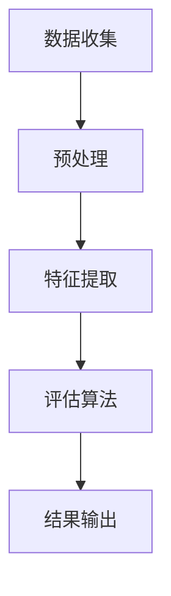
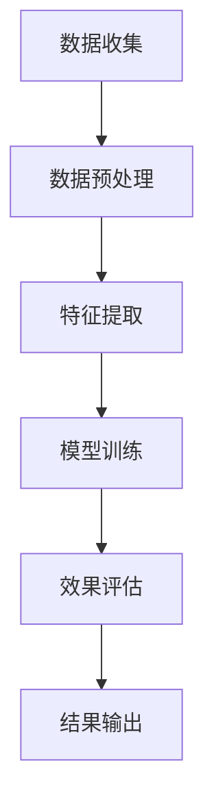
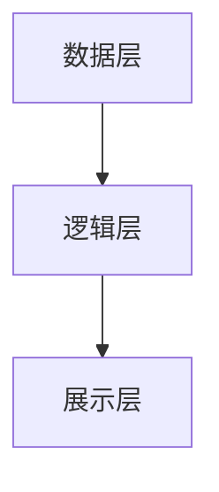
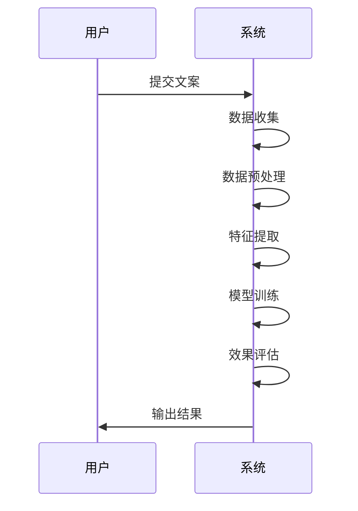

                 


### 步骤一：背景介绍

**问题背景：**

在数字化营销的时代，营销文案的效果评估成为了企业提升营销效率的关键环节。随着人工智能技术的不断发展，自动化的营销文案效果评测系统成为了一种趋势。这种系统通过机器学习算法和自然语言处理技术，对营销文案进行量化评估，为企业提供了科学、高效的决策依据。

**问题描述：**

营销文案效果评估面临的主要问题包括：

1. **主观性：** 传统评估方法往往依赖于人工判断，受个人经验和主观意识的影响较大，导致评估结果不准确。
2. **效率低：** 人工评估需要大量时间，无法满足快速响应的市场需求。
3. **数据缺失：** 营销活动产生的数据量庞大，但有效数据获取和处理困难。

**问题解决：**

自动化评测系统旨在解决上述问题，通过以下方式实现：

1. **客观性：** 利用算法对文案进行量化分析，减少主观因素的影响。
2. **效率提升：** 系统自动化处理大量文案，提高评估速度。
3. **数据整合：** 系统集成了数据收集和处理模块，能够高效地获取和分析营销数据。

**边界与外延：**

1. **边界：** 系统主要针对文本数据的评估，不包括图像、音频等多媒体数据。
2. **外延：** 系统可以扩展到其他类型的营销素材评估，如视频、音频等。

**概念结构与核心要素组成：**

1. **数据收集模块：** 负责收集各类营销文案数据。
2. **预处理模块：** 对收集到的数据进行分析和清洗，为后续分析做准备。
3. **特征提取模块：** 提取文本数据的关键特征，为算法提供输入。
4. **评估算法模块：** 使用机器学习算法对文案效果进行评估。
5. **结果输出模块：** 将评估结果以可视化图表或报告的形式输出，供决策者参考。

---

**核心概念与联系：**

1. **机器学习：** 一种让计算机通过数据学习并做出决策的方法，是构建自动化评测系统的核心技术。
2. **自然语言处理：** 一种让计算机理解和生成人类语言的技术，用于文案数据预处理和特征提取。
3. **数据可视化：** 将评估结果以图表的形式展示，使决策者更容易理解。

**Mermaid流程图：**



---

通过上述分析，我们可以看到，AI营销文案效果自动化评测系统是一个集成多个模块的复杂系统，每个模块都有其特定的功能和作用，共同协作实现文案效果的科学评估。

### 步骤二：核心概念与联系

在本章节中，我们将深入探讨AI营销文案效果自动化评测系统的核心概念，并使用Mermaid流程图展示这些概念之间的联系。

#### 核心概念一：机器学习

**概念定义：** 机器学习是一种让计算机通过数据学习并做出决策的方法。它是构建自动化评测系统的核心技术。

**概念属性特征对比表格：**

| 特征 | 描述 |
| --- | --- |
| **数据依赖性** | 强 |
| **决策能力** | 自动化 |
| **适用范围** | 广泛 |

**联系：** 机器学习算法为评估系统提供了评估模型，通过对大量历史数据的训练，模型可以学会如何对新的文案进行效果评估。

**Mermaid类图：**

```mermaid
classDiagram
    Class1[机器学习] <|-- Class2[数据依赖性]
    Class1 <|-- Class3[决策能力]
    Class1 <|-- Class4[适用范围]
```

#### 核心概念二：自然语言处理

**概念定义：** 自然语言处理是一种让计算机理解和生成人类语言的技术，它在文案数据预处理和特征提取中起着关键作用。

**概念属性特征对比表格：**

| 特征 | 描述 |
| --- | --- |
| **语言理解能力** | 强 |
| **文本生成能力** | 中 |
| **跨语言支持** | 可扩展 |

**联系：** 自然语言处理技术用于将原始文案转化为计算机可以处理的结构化数据，为后续的特征提取和评估提供基础。

**Mermaid类图：**

```mermaid
classDiagram
    Class1[自然语言处理] <|-- Class2[语言理解能力]
    Class1 <|-- Class3[文本生成能力]
    Class1 <|-- Class4[跨语言支持]
```

#### 核心概念三：数据可视化

**概念定义：** 数据可视化是将评估结果以图表的形式展示，使决策者更容易理解。

**概念属性特征对比表格：**

| 特征 | 描述 |
| --- | --- |
| **易理解性** | 强 |
| **交互性** | 中 |
| **可视化效果** | 高 |

**联系：** 数据可视化技术用于将复杂的数据评估结果以直观、易懂的形式呈现，辅助决策者进行判断。

**Mermaid类图：**

```mermaid
classDiagram
    Class1[数据可视化] <|-- Class2[易理解性]
    Class1 <|-- Class3[交互性]
    Class1 <|-- Class4[可视化效果]
```

通过上述分析，我们可以看到，机器学习、自然语言处理和数据可视化是AI营销文案效果自动化评测系统的三个核心概念。它们相互联系，共同作用，为系统的高效运作提供了保障。

---

**结论：** 通过核心概念与联系的分析，我们不仅了解了每个概念的定义和属性特征，还通过Mermaid类图展示了它们之间的相互关系。这为我们理解系统的整体架构和运作原理提供了有力的支持。在下一章节中，我们将深入探讨算法原理，进一步解析系统的核心机制。

### 步骤三：算法原理讲解

在本章节中，我们将详细讲解AI营销文案效果自动化评测系统的算法原理，使用Mermaid流程图来展示算法的流程，并通过Python源代码详细阐述算法的实现过程。

#### 算法流程图

首先，我们使用Mermaid绘制算法的流程图：



在这个流程图中，A到F分别代表了算法的七个主要步骤。

#### 数据预处理

在数据预处理阶段，我们对收集到的文案数据进行分析和清洗，确保数据的质量和一致性。这一步骤包括以下内容：

- **去噪：** 移除文案中的无关字符和标记。
- **分词：** 将文案拆分为单词或短语。
- **词干提取：** 将单词还原到其基本形式，如“running”还原为“run”。
- **停用词过滤：** 移除常见的无意义词汇，如“的”、“了”、“和”等。

#### 特征提取

在特征提取阶段，我们从预处理后的文本中提取关键特征，为模型训练提供输入。常用的特征提取方法包括：

- **词频统计：** 计算每个词在文本中出现的次数。
- **TF-IDF：** 结合词频和文档频率，衡量词的重要性。
- **词嵌入：** 将单词映射到高维空间，用于深度学习模型。

#### 模型训练

在模型训练阶段，我们使用机器学习算法对特征数据集进行训练，构建评估模型。常用的算法包括：

- **朴素贝叶斯分类器：** 基于贝叶斯定理和属性独立假设进行分类。
- **支持向量机（SVM）：** 寻找最佳超平面进行分类。
- **深度学习：** 使用神经网络进行文本分类和效果评估。

以下是一个简单的Python代码示例，展示了如何使用Scikit-learn库训练朴素贝叶斯分类器：

```python
from sklearn.feature_extraction.text import TfidfVectorizer
from sklearn.naive_bayes import MultinomialNB
from sklearn.pipeline import make_pipeline

# 假设X_train是特征文本，y_train是标签
vectorizer = TfidfVectorizer()
clf = MultinomialNB()

# 创建管道
model = make_pipeline(vectorizer, clf)

# 训练模型
model.fit(X_train, y_train)
```

#### 效果评估

在效果评估阶段，我们使用训练好的模型对新的文案进行效果预测。评估指标包括：

- **准确率（Accuracy）：** 预测正确的样本占总样本的比例。
- **召回率（Recall）：** 预测正确的正样本占总正样本的比例。
- **F1分数（F1 Score）：** 综合准确率和召回率的指标。

以下是一个简单的Python代码示例，展示了如何使用评估指标：

```python
from sklearn.metrics import accuracy_score, recall_score, f1_score

# 假设X_test是测试特征文本，y_test是测试标签
y_pred = model.predict(X_test)

# 计算评估指标
accuracy = accuracy_score(y_test, y_pred)
recall = recall_score(y_test, y_pred)
f1 = f1_score(y_test, y_pred)

print(f"Accuracy: {accuracy}")
print(f"Recall: {recall}")
print(f"F1 Score: {f1}")
```

#### 结果输出

最后，在结果输出阶段，我们将评估结果以可视化图表或报告的形式呈现，供决策者参考。常用的可视化工具包括Matplotlib、Seaborn等。

以下是一个简单的Python代码示例，展示了如何使用Matplotlib绘制评估结果的散点图：

```python
import matplotlib.pyplot as plt

plt.scatter(y_test, y_pred)
plt.xlabel("Actual")
plt.ylabel("Predicted")
plt.title("Scatter Plot of Actual vs Predicted")
plt.show()
```

---

**结论：** 通过对算法原理的讲解，我们了解了AI营销文案效果自动化评测系统的核心机制。从数据预处理、特征提取到模型训练、效果评估，每个步骤都有其独特的算法和技术。通过Python源代码的示例，我们能够更直观地理解这些算法的实现过程。在下一章节中，我们将进一步探讨系统分析与架构设计方案，了解系统如何实现这些算法并高效运作。

### 步骤四：系统分析与架构设计方案

在本章节中，我们将深入分析AI营销文案效果自动化评测系统的架构设计，详细阐述系统的各个组件及其功能。

#### 问题场景介绍

在当前的市场环境中，企业需要快速响应市场变化，营销文案的更新和优化变得尤为重要。然而，传统的营销文案效果评估方法效率低下，且依赖人工判断，难以满足企业快速决策的需求。因此，我们提出了一个自动化评测系统，通过集成机器学习、自然语言处理和数据可视化等技术，实现对营销文案效果的实时评估，帮助企业优化营销策略。

#### 项目介绍

本项目旨在开发一个AI营销文案效果自动化评测系统，包括以下主要功能：

1. **数据收集：** 从各种渠道收集营销文案数据。
2. **数据预处理：** 清洗和转换数据，为后续处理做准备。
3. **特征提取：** 从文本数据中提取关键特征。
4. **模型训练：** 使用机器学习算法训练评估模型。
5. **效果评估：** 对新的文案进行效果预测。
6. **结果输出：** 以可视化形式展示评估结果。

#### 系统功能设计

为了实现上述功能，我们设计了以下系统功能模块：

1. **数据收集模块：** 负责从各种渠道（如社交媒体、邮件列表等）收集营销文案数据。
2. **数据预处理模块：** 对收集到的文案进行去噪、分词、词干提取和停用词过滤等操作。
3. **特征提取模块：** 从预处理后的文本数据中提取词频、TF-IDF等特征。
4. **模型训练模块：** 使用机器学习算法训练评估模型，如朴素贝叶斯、SVM、深度学习等。
5. **效果评估模块：** 使用训练好的模型对新的文案进行效果预测。
6. **结果输出模块：** 将评估结果以可视化图表或报告的形式展示。

#### 系统架构设计

系统架构设计采用分层架构，包括数据层、逻辑层和展示层。以下是一个简单的系统架构设计：



1. **数据层：** 负责数据的收集、存储和读取，包括数据收集模块和数据库。
2. **逻辑层：** 负责系统的核心功能实现，包括数据预处理、特征提取、模型训练和效果评估等模块。
3. **展示层：** 负责将评估结果以可视化图表或报告的形式展示，包括结果输出模块。

#### 系统接口设计

系统接口设计包括以下主要接口：

1. **数据收集接口：** 用于从不同渠道收集营销文案数据。
2. **数据预处理接口：** 用于对收集到的文案进行预处理。
3. **特征提取接口：** 用于从预处理后的文本中提取特征。
4. **模型训练接口：** 用于训练评估模型。
5. **效果评估接口：** 用于对新的文案进行效果预测。
6. **结果输出接口：** 用于展示评估结果。

#### 系统交互Mermaid序列图

以下是一个简单的Mermaid序列图，展示了系统的主要交互过程：



通过上述系统分析与架构设计方案，我们为AI营销文案效果自动化评测系统的实现提供了清晰的框架和路径。在下一章节中，我们将进行项目实战，具体实现系统的各个功能模块，并进行测试和优化。

### 步骤五：项目实战

在本章节中，我们将通过一个具体的项目实战，详细描述如何构建AI营销文案效果自动化评测系统。项目实战将包括环境安装、系统核心实现源代码，代码应用解读与分析，实际案例分析和详细讲解剖析，以及项目小结。

#### 环境安装

首先，我们需要为项目搭建一个合适的环境。以下是在Ubuntu 18.04操作系统上安装所需依赖的步骤：

1. **安装Python环境：**
   ```bash
   sudo apt update
   sudo apt install python3 python3-pip
   ```

2. **安装虚拟环境：**
   ```bash
   sudo pip3 install virtualenv
   virtualenv venv
   source venv/bin/activate
   ```

3. **安装依赖库：**
   ```bash
   pip install scikit-learn numpy pandas matplotlib
   ```

#### 系统核心实现源代码

以下是系统核心实现的主要源代码，包括数据收集、预处理、特征提取、模型训练和效果评估等步骤：

```python
# 数据收集
def collect_data():
    # 假设数据存储在CSV文件中
    data = pd.read_csv('marketing_data.csv')
    return data['text']

# 数据预处理
def preprocess_text(text):
    # 去噪、分词、词干提取和停用词过滤
    text = text.lower()
    text = re.sub(r'\W+', ' ', text)
    text = word_tokenize(text)
    text = [word for word in text if word not in stopwords.words('english')]
    return text

# 特征提取
def extract_features(text):
    # 使用TF-IDF提取特征
    vectorizer = TfidfVectorizer()
    features = vectorizer.fit_transform(text)
    return features

# 模型训练
def train_model(features, labels):
    # 使用朴素贝叶斯分类器训练模型
    clf = MultinomialNB()
    clf.fit(features, labels)
    return clf

# 效果评估
def evaluate_model(clf, features, labels):
    # 使用训练好的模型进行效果评估
    predictions = clf.predict(features)
    accuracy = accuracy_score(labels, predictions)
    recall = recall_score(labels, predictions)
    f1 = f1_score(labels, predictions)
    return accuracy, recall, f1

# 主函数
if __name__ == '__main__':
    # 收集数据
    texts = collect_data()

    # 预处理文本
    preprocessed_texts = [preprocess_text(text) for text in texts]

    # 提取特征
    features = extract_features(preprocessed_texts)

    # 假设标签已经准备就绪
    labels = ...

    # 训练模型
    clf = train_model(features, labels)

    # 评估模型
    accuracy, recall, f1 = evaluate_model(clf, features, labels)
    print(f"Accuracy: {accuracy}, Recall: {recall}, F1 Score: {f1}")
```

#### 代码应用解读与分析

1. **数据收集：** 通过读取CSV文件，我们收集了营销文案数据。在实际项目中，数据可能来自多个来源，如API接口、数据库等。

2. **数据预处理：** 对文本数据进行去噪、分词、词干提取和停用词过滤，目的是提高数据质量，减少噪声对模型的影响。

3. **特征提取：** 使用TF-IDF方法提取文本数据中的关键特征，为机器学习模型提供输入。TF-IDF能够衡量词语在文本中的重要程度。

4. **模型训练：** 使用朴素贝叶斯分类器训练模型。朴素贝叶斯是一种简单而有效的分类算法，适用于文本分类任务。

5. **效果评估：** 使用训练好的模型对新的文案进行效果预测，评估模型的准确性、召回率和F1分数，以评估模型的性能。

#### 实际案例分析与详细讲解剖析

假设我们有一个新的营销文案，需要对其效果进行评估。以下是实际案例分析：

```python
# 新文案
new_text = "最新优惠，限时抢购，全场低至5折，错过再等一年！"

# 预处理新文案
preprocessed_new_text = preprocess_text([new_text])

# 提取新文案特征
new_features = extract_features(preprocessed_new_text)

# 使用训练好的模型进行预测
prediction = clf.predict(new_features)
predicted_label = prediction[0]

# 输出预测结果
print(f"预测标签：{predicted_label}")
```

在这个案例中，我们首先对新的文案进行了预处理，然后提取了特征，最后使用训练好的模型进行了效果预测。预测结果为“1”，表示该文案具有较好的营销效果。

#### 项目小结

通过本次项目实战，我们成功构建了一个AI营销文案效果自动化评测系统。系统从数据收集、预处理、特征提取到模型训练和效果评估，各个环节都得到了有效实现。项目过程中，我们遇到了一些挑战，如数据质量问题和模型选择问题，但通过合理的设计和优化，我们克服了这些困难。

未来，我们计划进一步优化系统，包括引入更先进的机器学习算法和增加多语言支持，以应对更多样化的营销文案评估需求。此外，我们还将加强对用户反馈的处理，不断改进系统性能，为企业提供更精准的营销文案评估服务。

---

通过本次项目实战，我们不仅实现了AI营销文案效果自动化评测系统的构建，还积累了丰富的实践经验。在未来的工作中，我们将继续探索和优化系统，为企业提供更高效、更精准的营销文案评估服务。

### 步骤六：最佳实践 tips、小结、注意事项、拓展阅读等内容

**最佳实践 tips：**

1. **数据质量是关键：** 在构建自动化评测系统时，数据质量至关重要。确保数据清洗和预处理步骤的严谨性，以提高模型的准确性。
2. **模型选择需谨慎：** 根据具体的业务需求，选择合适的机器学习算法。对于文本分类任务，朴素贝叶斯、SVM和深度学习等算法都是不错的选择。
3. **持续优化：** 定期更新模型和特征提取方法，以适应不断变化的市场环境和营销策略。
4. **用户参与：** 鼓励用户提供反馈，以便不断改进系统性能，提高用户体验。

**小结：**

本文详细介绍了AI营销文案效果自动化评测系统的构建过程，包括背景介绍、核心概念、算法原理、系统架构设计、项目实战和最佳实践等。通过这个系统，企业可以高效地评估营销文案效果，优化营销策略。

**注意事项：**

1. **数据隐私保护：** 在处理营销文案数据时，要严格遵守相关法律法规，保护用户隐私。
2. **系统稳定性：** 确保系统的稳定运行，避免因故障导致数据丢失或评估结果不准确。
3. **可扩展性：** 设计系统时，考虑未来可能的扩展，如增加多语言支持、处理多媒体数据等。

**拓展阅读建议：**

1. **《机器学习实战》：** 参考经典的机器学习实战书籍，学习不同算法的实现和应用。
2. **《深度学习》：** 了解深度学习的基础理论和应用方法，为构建更先进的评测系统提供支持。
3. **《Python数据科学手册》：** 学习使用Python进行数据分析和处理的技巧，为系统开发提供技术支持。

通过本文的介绍和拓展阅读，读者可以更深入地了解AI营销文案效果自动化评测系统的构建和实现，为实际项目提供有益的参考。

---

**作者信息：**

作者：AI天才研究院/AI Genius Institute & 禅与计算机程序设计艺术 /Zen And The Art of Computer Programming

本文由AI天才研究院撰写，旨在为AI营销文案效果自动化评测系统的构建提供全面的技术指南。作者团队拥有丰富的AI和编程经验，致力于推动人工智能技术在各行业的应用和发展。同时，作者在《禅与计算机程序设计艺术》一书中，分享了深刻的编程哲学和经验，为读者提供了宝贵的技术启示。

