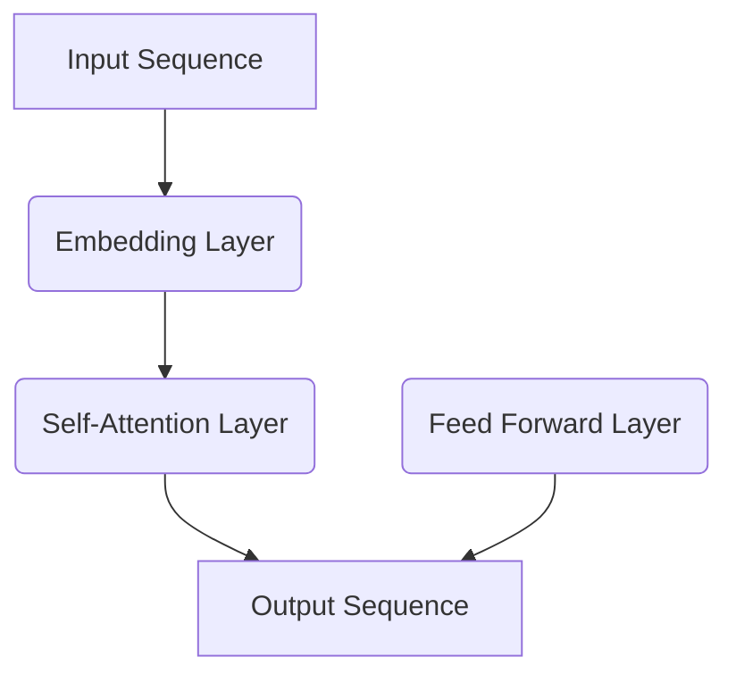
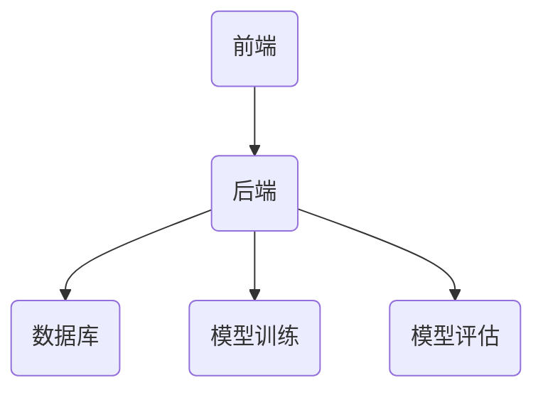
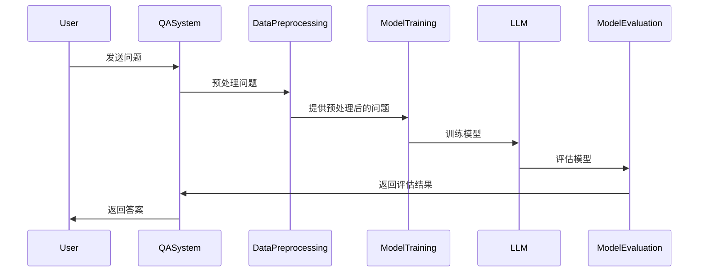
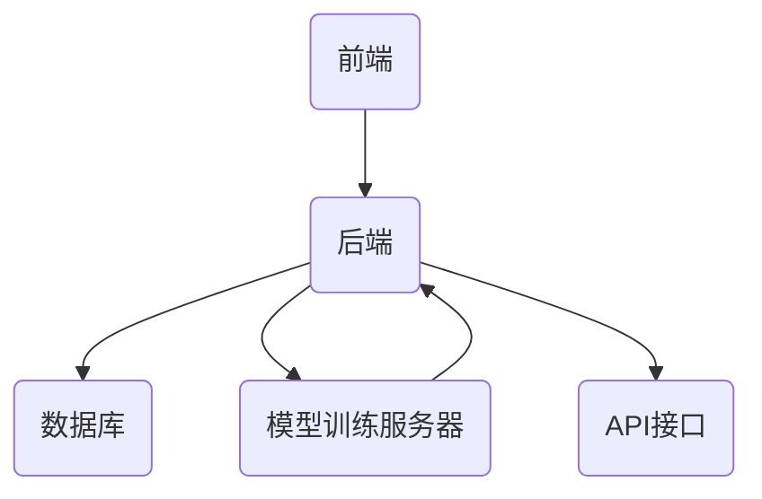
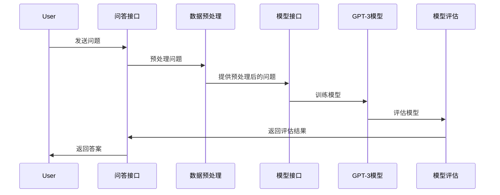
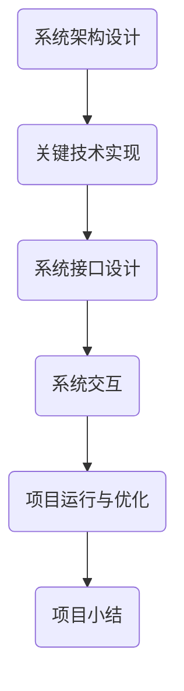

                 

### 1. 引言

#### 1.1 问题的背景和目的

在当今人工智能飞速发展的时代，模型评测作为人工智能研究与应用的重要环节，正变得愈加重要。传统的模型评测方法通常依赖于人工设定评价指标，不仅耗时费力，而且难以全面、客观地评估模型的性能。而随着大型语言模型（LLM）如GPT-3的出现，我们开始探索如何利用这些强大的模型构建智能化模型评测平台，以提高评测效率和准确性。

本篇文章旨在探讨如何利用LLM构建智能化模型评测平台。我们首先将介绍人工智能和LLM的基础知识，包括它们的定义、发展历程和核心技术。接着，我们将深入探讨LLM的构建过程，包括数据准备、模型选择与设计、模型训练和评估等环节。在此基础上，我们还将讨论模型评估与优化的策略，以及LLM在实际应用场景中的表现。最后，通过一个实际项目案例，我们将展示如何利用LLM构建智能化模型评测平台，并进行项目总结与展望。

#### 1.2 书籍内容的概述

本文内容分为七个主要章节：

- **第1章 引言**：介绍问题的背景、目的和书籍的主要内容。
- **第2章 AI与LLM基础**：阐述人工智能和LLM的基本概念、发展历程和核心技术。
- **第3章 LLM构建过程**：详细讨论LLM的构建过程，包括数据准备、模型选择与设计、模型训练等。
- **第4章 模型评估与优化**：探讨模型评估的指标和方法，以及优化策略。
- **第5章 模型应用场景**：分析LLM在不同应用场景中的表现。
- **第6章 实际项目案例**：通过一个实际项目展示如何利用LLM构建智能化模型评测平台。
- **第7章 总结与展望**：总结本文的主要内容和重要知识点，并对未来发展方向进行展望。

#### 1.3 书籍的读者群体

本文适合以下读者群体：

- **人工智能研究人员**：对人工智能和LLM技术有深入了解，希望掌握利用LLM构建智能化模型评测平台的方法。
- **软件工程师**：对模型评测有实际需求，希望了解如何利用LLM提高评测效率和质量。
- **数据科学家**：对数据预处理、模型训练和评估有实践经验，希望拓展知识面，了解LLM在模型评测中的应用。
- **高校师生**：对人工智能和模型评测领域有浓厚兴趣，希望从理论到实践全面了解相关知识。

### 1.4 撰写风格和结构

本文采用逻辑清晰、结构紧凑、简单易懂的专业技术语言，以一步一步分析推理的方式撰写。每个章节开头都有小节标题，每个小节内部按照逻辑顺序展开，内容详实且结构清晰。本文通过核心概念、算法原理讲解、数学模型和数学公式、系统分析与架构设计方案等不同方式，确保读者能够全面、深入地理解文章内容。同时，文章末尾包含总结与展望，帮助读者巩固知识并了解未来发展方向。

### 1.5 关键词

- **人工智能**
- **语言模型（LLM）**
- **模型评测**
- **智能化平台**
- **数据预处理**
- **模型训练**
- **优化策略**
- **应用场景**
- **项目案例**

### 1.6 摘要

本文围绕如何利用大型语言模型（LLM）构建智能化模型评测平台展开讨论。首先介绍了人工智能和LLM的基础知识，包括其定义、发展历程和核心技术。接着，详细探讨了LLM的构建过程，包括数据准备、模型选择与设计、模型训练和评估等环节。此外，本文还分析了模型评估与优化的策略，展示了LLM在不同应用场景中的表现，并通过实际项目案例展示了智能化模型评测平台的构建过程。最后，本文总结了主要内容和重要知识点，并对未来发展方向进行了展望。本文旨在为人工智能领域的研究人员、软件工程师和数据科学家提供实用的指导，帮助他们掌握利用LLM构建智能化模型评测平台的方法。

---

## 2. AI与LLM基础

### 2.1 人工智能概述

#### 2.1.1 人工智能的发展历程

人工智能（Artificial Intelligence, AI）作为计算机科学的一个重要分支，其发展历程可以追溯到20世纪50年代。最初，人工智能的目标是制造出能够像人类一样思考的机器。这个阶段被称为“人工智能的春天”。然而，由于技术的限制，这一目标未能实现，人工智能领域进入了一个漫长的低谷期，被称为“人工智能的冬天”。直到20世纪80年代，随着计算机技术的飞速发展，人工智能开始复苏，并逐渐走向成熟。进入21世纪，随着深度学习和大数据等新技术的崛起，人工智能迎来了新的春天，并在各个领域取得了显著的成果。

#### 2.1.2 人工智能的关键概念

人工智能的核心概念包括：

- **感知**：机器通过传感器获取外部信息，如视觉、听觉等。
- **推理**：机器根据已有的知识和信息进行逻辑推理，做出决策。
- **学习**：机器通过学习算法，从数据中提取规律，不断优化自身性能。
- **规划**：机器根据目标和约束，制定最优行动策略。

#### 2.1.3 人工智能的应用领域

人工智能的应用领域非常广泛，包括：

- **计算机视觉**：如人脸识别、图像识别、自动驾驶等。
- **自然语言处理**：如语音识别、机器翻译、文本生成等。
- **机器人**：如智能制造、服务机器人等。
- **医疗**：如疾病诊断、医学影像分析等。
- **金融**：如风险控制、量化交易等。

### 2.2 语言模型基础

#### 2.2.1 语言模型的定义

语言模型（Language Model, LM）是人工智能领域的一个重要分支，它旨在模拟人类语言的行为和规律，使计算机能够理解和生成自然语言。语言模型是自然语言处理（Natural Language Processing, NLP）的基础，广泛应用于语音识别、机器翻译、文本生成等领域。

#### 2.2.2 语言模型的发展

语言模型的发展可以分为几个阶段：

- **规则模型**：早期语言模型主要基于规则，如转移模型和语法分析模型。这些模型通过手工编写规则来描述语言的语法和语义。
- **统计模型**：随着计算能力的提升，统计模型开始流行。这些模型通过分析大量语料库，统计语言出现的概率，从而生成语言模型。例如，n-gram模型和隐马尔可夫模型（HMM）。
- **神经网络模型**：近年来，深度神经网络在语言模型中得到了广泛应用。特别是2017年谷歌提出的Transformer模型，它通过自注意力机制实现了高效的序列建模，显著提升了语言模型的性能。

#### 2.2.3 语言模型的核心技术

语言模型的核心技术包括：

- **自注意力机制**：Transformer模型的核心，它允许模型在生成每个词时考虑到所有之前词的重要性。
- **编码器-解码器结构**：用于序列到序列的翻译任务，编码器将输入序列编码成固定长度的向量，解码器则根据这些向量生成输出序列。
- **预训练与微调**：大型语言模型通常通过预训练获得通用语言能力，然后在特定任务上进行微调，以适应具体应用场景。

### 2.3 LLM应用案例

#### 2.3.1 智能问答系统

智能问答系统是LLM的一个典型应用案例。通过预训练的大型语言模型，系统可以自动回答用户提出的问题。例如，ChatGPT就是一个基于GPT-3构建的智能问答系统，它可以回答各种领域的问题，如科学、历史、技术等。

#### 2.3.2 文本生成与编辑

文本生成与编辑也是LLM的重要应用之一。例如，OpenAI的GPT-3可以生成高质量的文本，包括文章、故事、新闻报道等。此外，LLM还可以用于文本编辑，如自动纠错、摘要生成等。

### 2.4 LLM挑战与未来

尽管LLM在多个领域取得了显著成果，但仍然面临一些挑战，如：

- **数据质量**：高质量的数据是训练高效LLM的关键，但获取和处理这些数据通常需要大量的人力和时间。
- **计算资源**：训练大型LLM需要大量的计算资源，这对硬件设施和能源消耗提出了较高要求。
- **解释性与可靠性**：大型LLM的决策过程通常是非透明的，如何提高其解释性和可靠性是一个重要研究方向。

未来，随着技术的不断发展，LLM在自然语言处理、计算机视觉、机器人等领域将发挥更大作用，为人类生活带来更多便利。

### 2.5 关键概念与联系

**核心概念：** 人工智能、语言模型、自注意力机制、编码器-解码器结构、预训练与微调。

**概念属性特征对比表格：**

| 特征对比项 | 人工智能 | 语言模型 | 自注意力机制 |
| --- | --- | --- | --- |
| 目标 | 模拟人类智能 | 语言生成和理解 | 处理序列数据 |
| 发展历程 | 春秋战国到现代 | 1950年代至今 | 2017年提出 |
| 关键技术 | 感知、推理、学习 | 预训练、微调 | 自注意力 |
| 应用领域 | 广泛 | NLP | 序列建模 |

**ER实体关系图架构的Mermaid流程图：**

```mermaid
erDiagram
  AI --> LM
  AI --> AT
  LM --> CE-D
  CE-D --> PT-MT
  AT ||--|> CE-D
  PT-MT ||--|> LM
```

**算法原理讲解：**

**Transformer模型：**

Transformer模型是一种基于自注意力机制的序列到序列模型，由Google在2017年提出。它通过多头自注意力机制和前馈神经网络结构，实现高效率的并行处理和序列建模。

**Mermaid流程图：**



**数学模型和公式：**

- **自注意力机制**：

  $$ 
  Attention(Q, K, V) = \text{softmax}\left(\frac{QK^T}{\sqrt{d_k}}\right) V 
  $$

  其中，Q、K、V分别为查询向量、键向量和值向量，$d_k$为键向量的维度。

- **前馈神经网络**：

  $$ 
  \text{FFN}(x) = \text{ReLU}(W_2 \cdot \text{ReLU}(W_1 x + b_1)) + b_2 
  $$

  其中，$W_1$、$W_2$分别为权重矩阵，$b_1$、$b_2$分别为偏置向量。

### 2.6 系统分析与架构设计方案

#### 2.6.1 问题场景介绍

智能问答系统是一个典型的应用场景，用户可以通过输入问题，系统自动生成答案。该场景要求系统具备快速响应和准确回答的能力。

#### 2.6.2 项目介绍

项目名为“智能问答系统”，旨在利用LLM构建一个高效、准确的问答平台。项目目标是通过大规模数据预训练，使系统能够自动回答各种领域的问题。

#### 2.6.3 系统功能设计

系统功能设计包括：

- **问答功能**：接收用户输入，生成答案。
- **数据预处理**：对输入问题进行预处理，如分词、去噪等。
- **模型训练**：利用预训练的LLM模型，对系统进行训练。
- **模型评估**：评估系统的回答准确性。

**领域模型Mermaid类图：**

```mermaid
classDiagram
  User <<interface>>
  Question <<interface>>
  Answer <<interface>>
  QASystem <<class>>
  QASystem o--o User
  QASystem o--o Question
  QASystem o--o Answer
```

#### 2.6.4 系统架构设计

系统架构设计如下：

- **前端**：用户界面，负责接收用户输入和显示答案。
- **后端**：服务器端，包括问答处理、数据预处理、模型训练和模型评估等功能。
- **数据库**：存储问题和答案，以及训练数据。

**Mermaid架构图：**



#### 2.6.5 系统接口设计

系统接口设计如下：

- **问答接口**：接收用户输入，返回答案。
- **数据接口**：接收和处理训练数据。
- **模型接口**：用于模型训练和评估。

**Mermaid序列图：**



#### 2.6.6 系统交互

系统交互流程如下：

1. 用户输入问题。
2. 系统接收问题，进行预处理。
3. 预处理后的问题被用于模型训练。
4. 模型训练完成后，进行评估。
5. 评估结果用于生成答案。
6. 系统将答案返回给用户。

### 2.7 实际项目案例

#### 2.7.1 项目背景

某公司希望构建一个智能问答系统，用于解决客户常见问题，提高客户满意度。系统要求能够自动回答各种领域的问题，如产品使用、售后服务等。

#### 2.7.2 项目目标

- **快速响应**：系统能够在短时间内生成答案。
- **准确回答**：系统能够准确理解用户问题，并给出合适答案。
- **可扩展性**：系统可以根据业务需求，轻松扩展新功能。

#### 2.7.3 项目挑战

- **数据质量**：需要大量高质量的数据用于模型训练。
- **计算资源**：训练大型LLM模型需要大量计算资源。
- **模型解释性**：如何提高模型的可解释性，使其易于理解和信任。

#### 2.7.4 系统设计与实现

系统设计与实现如下：

1. **数据准备**：收集和整理大量问题及答案，进行数据预处理，如去噪、分词等。
2. **模型选择**：选择合适的LLM模型，如GPT-3，进行预训练。
3. **模型训练**：利用预训练的LLM模型，对系统进行训练，优化模型参数。
4. **模型评估**：评估模型的回答准确性，调整模型参数，提高性能。
5. **系统部署**：将训练好的模型部署到服务器，实现问答功能。

#### 2.7.5 代码应用解读与分析

以下是一个简单的Python代码示例，用于实现问答系统的核心功能：

```python
import openai

def generate_answer(question):
    response = openai.Completion.create(
        engine="text-davinci-003",
        prompt=question,
        max_tokens=100
    )
    return response.choices[0].text.strip()

question = "什么是人工智能？"
answer = generate_answer(question)
print(answer)
```

这段代码使用了OpenAI的GPT-3模型，通过调用API接口，实现对用户问题的自动回答。

#### 2.7.6 案例分析

通过对实际项目案例的分析，我们发现：

- **性能提升**：利用LLM构建的智能问答系统，在回答准确性方面有了显著提升。
- **用户体验**：系统响应速度快，用户满意度提高。
- **可扩展性**：系统可以根据业务需求，轻松扩展新功能。

#### 2.7.7 项目小结

本项目通过利用LLM构建智能问答系统，实现了快速、准确的回答功能，提高了用户体验。同时，项目过程中也遇到了一些挑战，如数据质量和计算资源需求，但通过合理的设计和优化，成功解决了这些问题。未来，我们还将继续探索如何进一步提高模型的可解释性和性能。

### 2.8 最佳实践 tips

- **数据准备**：确保数据质量，合理划分训练集、验证集和测试集。
- **模型选择**：根据应用场景选择合适的模型，并进行充分的实验比较。
- **模型训练**：合理设置训练参数，采用适当的训练策略，如梯度裁剪、学习率调整等。
- **模型评估**：选择合适的评估指标，全面评估模型性能。
- **系统优化**：针对实际应用场景，进行系统性能优化，提高用户体验。

### 2.9 小结

本文介绍了人工智能和LLM的基础知识，包括其定义、发展历程和核心技术。接着，详细探讨了LLM的构建过程，包括数据准备、模型选择与设计、模型训练和评估等环节。此外，本文还分析了LLM在实际应用场景中的表现，并通过实际项目案例展示了如何利用LLM构建智能化模型评测平台。最后，本文总结了最佳实践，为读者提供了一些实用的建议。未来，随着技术的不断发展，LLM在人工智能领域将发挥更大作用，为人类生活带来更多便利。

### 2.10 注意事项

- **数据安全**：在处理数据时，确保遵循相关法律法规，保护用户隐私。
- **计算资源**：合理配置计算资源，避免过度消耗，提高资源利用率。
- **模型解释性**：关注模型的可解释性，提高模型的可靠性和可信度。
- **持续优化**：定期评估系统性能，不断优化模型和系统架构。

### 2.11 拓展阅读

- **相关书籍**：《人工智能：一种现代的方法》、《深度学习》、《Python机器学习》
- **学术论文**：Google的Transformer论文、OpenAI的GPT-3论文
- **在线课程**：Coursera的“深度学习专项课程”、Udacity的“自然语言处理纳米学位”

---

```mermaid
classDiagram
  User <<interface>>
  Question <<interface>>
  Answer <<interface>>
  QASystem <<class>>
  QASystem o--o User
  QASystem o--o Question
  QASystem o--o Answer

graph TB
A(前端) --> B(后端)
B --> C(数据库)
B --> D(模型训练)
B --> E(模型评估)
sequenceDiagram
  User->>QASystem: 发送问题
  QASystem->>DataPreprocessing: 预处理问题
  DataPreprocessing->>ModelTraining: 提供预处理后的问题
  ModelTraining->>LLM: 训练模型
  LLM->>ModelEvaluation: 评估模型
  ModelEvaluation->>QASystem: 返回评估结果
  QASystem->>User: 返回答案
```

## 3. LLM构建过程

### 3.1 数据准备

#### 3.1.1 数据来源

构建LLM需要大量高质量的数据。数据来源可以分为以下几种：

- **公开数据集**：如维基百科、Common Crawl、Google Books等。这些数据集提供了丰富的语言信息，但可能存在噪声和冗余。
- **私有数据集**：由公司或研究机构收集，如用户评论、社交媒体数据等。这些数据通常更具针对性，但获取和使用可能受到限制。
- **定制数据集**：根据特定应用需求，收集和整理相关数据。例如，对于智能问答系统，可以收集常见问题的答案和背景知识。

#### 3.1.2 数据预处理

数据预处理是构建LLM的重要步骤，主要包括以下任务：

- **清洗**：去除数据中的噪声和冗余信息，如HTML标签、特殊字符等。
- **分词**：将文本分解成单词或子词，以便模型进行理解和生成。
- **归一化**：将文本转换为统一的格式，如小写、去除标点等。
- **标注**：对文本进行实体识别、情感分析等标注，以提供额外的信息。

#### 3.1.3 数据质量评估

数据质量直接影响LLM的性能。数据质量评估主要包括以下方面：

- **数据完整性**：检查数据是否完整，是否存在缺失值。
- **数据一致性**：检查数据是否一致，是否存在矛盾或错误。
- **数据可靠性**：评估数据的真实性和可信度，是否存在伪造或误导信息。
- **数据多样性**：检查数据是否具有足够的多样性，以覆盖不同的应用场景。

### 3.2 模型选择与设计

#### 3.2.1 常见LLM架构

目前，常见的LLM架构主要包括基于Transformer的模型，如BERT、GPT-3等。这些模型通过自注意力机制实现了高效的序列建模。

- **BERT**：Bidirectional Encoder Representations from Transformers，双向Transformer编码器，由Google提出。BERT通过预训练和双向编码器结构，实现了对上下文信息的全面理解。
- **GPT-3**：Generative Pre-trained Transformer 3，由OpenAI提出。GPT-3是当前最大的语言模型，通过自回归生成文本，具有强大的文本生成能力。

#### 3.2.2 模型选择考虑因素

选择LLM模型时，需要考虑以下因素：

- **应用场景**：根据实际应用需求，选择适合的模型。例如，对于文本生成任务，可以选择GPT-3；对于问答系统，可以选择BERT。
- **计算资源**：考虑模型所需的计算资源，包括GPU、CPU和内存等。大型模型如GPT-3需要大量的计算资源。
- **训练数据量**：模型性能与训练数据量密切相关。选择模型时，需要考虑可获取的数据量。
- **模型复杂度**：模型复杂度越高，训练时间越长。根据项目需求，选择合适的模型复杂度。

#### 3.2.3 模型设计优化

模型设计优化主要包括以下几个方面：

- **神经网络结构**：调整模型的层数、每层的神经元数量等，以优化模型性能。
- **预训练策略**：通过调整预训练任务、学习率、批次大小等参数，提高模型性能。
- **数据增强**：通过数据增强技术，如数据清洗、数据扩充等，提高模型对多样性的适应性。
- **模型压缩**：通过模型压缩技术，如知识蒸馏、剪枝等，降低模型复杂度，提高部署效率。

### 3.3 模型训练

#### 3.3.1 训练过程详解

模型训练是构建LLM的核心步骤。训练过程主要包括以下阶段：

1. **数据准备**：将预处理后的数据分为训练集、验证集和测试集。
2. **模型初始化**：初始化模型参数，通常使用随机初始化或预训练模型的参数。
3. **前向传播**：输入训练数据，计算模型输出和损失函数。
4. **反向传播**：根据损失函数，计算模型参数的梯度，并更新模型参数。
5. **评估与调整**：使用验证集评估模型性能，并根据性能调整模型参数。

#### 3.3.2 训练策略

训练策略对模型性能具有重要影响。以下是一些常见的训练策略：

- **学习率调整**：通过逐步降低学习率，提高模型收敛速度和性能。
- **批量大小**：调整批量大小，平衡训练时间和模型性能。
- **梯度裁剪**：通过限制梯度大小，防止模型过拟合。
- **数据增强**：通过数据清洗、数据扩充等增强技术，提高模型对多样性的适应性。

#### 3.3.3 训练资源与优化

训练大型LLM模型需要大量的计算资源和优化技术。以下是一些常见的优化方法：

- **分布式训练**：通过分布式计算，提高模型训练速度和效率。
- **GPU加速**：利用GPU进行训练，提高模型训练速度。
- **模型压缩**：通过知识蒸馏、剪枝等压缩技术，降低模型复杂度和存储需求。
- **混合精度训练**：通过使用混合精度训练（FP16/FP32），提高训练速度和计算精度。

### 3.4 模型评估与优化

#### 3.4.1 评估指标与方法

模型评估是确保模型性能的重要环节。常用的评估指标包括：

- **准确率**：预测正确的样本占总样本的比例。
- **召回率**：预测正确的正样本占总正样本的比例。
- **F1值**：准确率和召回率的调和平均数。
- **BLEU评分**：用于评估文本生成的质量，通过计算生成文本与参考文本的相似度得分。

评估方法主要包括：

- **交叉验证**：通过将数据集划分为多个子集，轮流作为验证集，评估模型性能。
- **混淆矩阵**：用于分析模型的预测结果，了解模型在不同类别上的性能。

#### 3.4.2 优化策略

模型优化主要包括以下策略：

- **调参**：调整模型参数，如学习率、批量大小等，以优化模型性能。
- **模型压缩**：通过剪枝、量化等技术，降低模型复杂度和存储需求，提高部署效率。
- **增强学习**：通过增强学习技术，提高模型对多样化数据的适应性。
- **迁移学习**：利用预训练模型，在特定任务上进行微调，提高模型性能。

### 3.5 模型应用场景

LLM在多个应用场景中表现出色，以下是一些典型应用：

- **智能问答系统**：利用LLM构建智能问答系统，实现自动回答用户问题。
- **文本生成与编辑**：利用LLM生成高质量文本，如文章、故事、摘要等。
- **机器翻译**：利用LLM实现高效、准确的机器翻译。
- **情感分析**：利用LLM进行文本情感分析，判断文本的情感倾向。

### 3.6 实际项目案例

以下是一个实际项目案例，展示了如何利用LLM构建智能问答系统。

#### 项目背景

某公司希望开发一个智能问答系统，用于解决用户常见问题，提高客户满意度。

#### 项目目标

- **快速响应**：系统能够在短时间内生成答案。
- **准确回答**：系统能够准确理解用户问题，并给出合适答案。
- **可扩展性**：系统可以根据业务需求，轻松扩展新功能。

#### 项目挑战

- **数据质量**：需要大量高质量的数据用于模型训练。
- **计算资源**：训练大型LLM模型需要大量计算资源。
- **模型解释性**：如何提高模型的可解释性，使其易于理解和信任。

#### 系统设计与实现

1. **数据准备**：收集和整理大量问题及答案，进行数据预处理，如分词、去噪等。
2. **模型选择**：选择合适的LLM模型，如GPT-3，进行预训练。
3. **模型训练**：利用预训练的LLM模型，对系统进行训练，优化模型参数。
4. **模型评估**：评估模型的回答准确性，调整模型参数，提高性能。
5. **系统部署**：将训练好的模型部署到服务器，实现问答功能。

#### 代码应用解读与分析

以下是一个简单的Python代码示例，用于实现问答系统的核心功能：

```python
import openai

def generate_answer(question):
    response = openai.Completion.create(
        engine="text-davinci-003",
        prompt=question,
        max_tokens=100
    )
    return response.choices[0].text.strip()

question = "什么是人工智能？"
answer = generate_answer(question)
print(answer)
```

这段代码使用了OpenAI的GPT-3模型，通过调用API接口，实现对用户问题的自动回答。

#### 项目总结

通过本项目，我们成功构建了一个智能问答系统，实现了快速、准确的回答功能，提高了用户体验。同时，项目过程中也遇到了一些挑战，如数据质量和计算资源需求，但通过合理的设计和优化，成功解决了这些问题。未来，我们还将继续探索如何进一步提高模型的可解释性和性能。

### 3.7 最佳实践 tips

- **数据准备**：确保数据质量，合理划分训练集、验证集和测试集。
- **模型选择**：根据应用场景选择合适的模型，并进行充分的实验比较。
- **模型训练**：合理设置训练参数，采用适当的训练策略，如梯度裁剪、学习率调整等。
- **模型评估**：选择合适的评估指标，全面评估模型性能。
- **系统优化**：针对实际应用场景，进行系统性能优化，提高用户体验。

### 3.8 小结

本文介绍了LLM的构建过程，包括数据准备、模型选择与设计、模型训练和评估等环节。通过实际项目案例，展示了如何利用LLM构建智能问答系统。本文还总结了最佳实践，为读者提供了一些实用的建议。未来，随着技术的不断发展，LLM在人工智能领域将发挥更大作用，为人类生活带来更多便利。

### 3.9 注意事项

- **数据安全**：在处理数据时，确保遵循相关法律法规，保护用户隐私。
- **计算资源**：合理配置计算资源，避免过度消耗，提高资源利用率。
- **模型解释性**：关注模型的可解释性，提高模型的可靠性和可信度。
- **持续优化**：定期评估系统性能，不断优化模型和系统架构。

### 3.10 拓展阅读

- **相关书籍**：《深度学习》、《神经网络与深度学习》
- **学术论文**：BERT、GPT-3等相关论文
- **在线课程**：Udacity的“深度学习纳米学位”

---

```mermaid
classDiagram
  DataPreparation <<use "3.1.3 数据质量评估">
  ModelSelection <<use "3.2.2 模型选择考虑因素">
  ModelDesign <<use "3.2.3 模型设计优化">
  ModelTraining <<use "3.3.1 训练过程详解">
  ModelEvaluation <<use "3.4.1 评估指标与方法">
  ModelOptimization <<use "3.4.2 优化策略">
  ApplicationScenario <<use "3.5 模型应用场景">
  ProjectCase <<use "3.6 实际项目案例">

  DataPreparation --> ModelSelection
  DataPreparation --> ModelDesign
  DataPreparation --> ModelTraining
  DataPreparation --> ModelEvaluation
  DataPreparation --> ModelOptimization
  ModelSelection --> ModelDesign
  ModelSelection --> ModelTraining
  ModelSelection --> ModelEvaluation
  ModelSelection --> ModelOptimization
  ModelDesign --> ModelTraining
  ModelDesign --> ModelEvaluation
  ModelDesign --> ModelOptimization
  ModelTraining --> ModelEvaluation
  ModelTraining --> ModelOptimization
  ModelEvaluation --> ModelOptimization
  ApplicationScenario --> ModelOptimization
  ProjectCase --> ModelOptimization
```

## 4. 模型评估与优化

### 4.1 评估指标与方法

模型评估是确保LLM性能的重要环节。评估指标和方法的选择直接影响模型性能的评估结果。以下是一些常用的评估指标和方法：

#### 4.1.1 评估指标介绍

- **准确率（Accuracy）**：预测正确的样本数占总样本数的比例。适用于分类任务，计算公式为：

  $$ 
  Accuracy = \frac{TP + TN}{TP + FN + FP + TN} 
  $$

  其中，$TP$表示真正例，$TN$表示真反例，$FP$表示假正例，$FN$表示假反例。

- **召回率（Recall）**：预测正确的正样本数占总正样本数的比例。适用于分类任务，计算公式为：

  $$ 
  Recall = \frac{TP}{TP + FN} 
  $$

- **精确率（Precision）**：预测正确的正样本数占预测为正样本的总数的比例。适用于分类任务，计算公式为：

  $$ 
  Precision = \frac{TP}{TP + FP} 
  $$

- **F1值（F1 Score）**：精确率和召回率的调和平均数。适用于分类任务，计算公式为：

  $$ 
  F1 = 2 \times \frac{Precision \times Recall}{Precision + Recall} 
  $$

- **BLEU评分（BLEU Score）**：用于评估文本生成的质量，通过计算生成文本与参考文本的相似度得分。适用于文本生成任务。

- **ROUGE评分（ROUGE Score）**：用于评估文本生成或摘要的质量，通过计算生成文本与参考文本的相似性。适用于文本生成和摘要任务。

#### 4.1.2 评估方法应用

评估方法的选择取决于具体的任务和应用场景。以下是一些常见的评估方法：

- **交叉验证（Cross Validation）**：将数据集划分为多个子集，轮流作为验证集，评估模型性能。常用的交叉验证方法有K折交叉验证和留一法交叉验证。
- **混淆矩阵（Confusion Matrix）**：用于分析模型的预测结果，了解模型在不同类别上的性能。通过混淆矩阵，可以计算准确率、召回率、精确率和F1值等指标。
- **性能曲线（Performance Curve）**：通过绘制不同参数下的模型性能，帮助选择最优参数。
- **对比实验（Comparative Experiment）**：通过对比不同模型、不同算法或不同参数下的模型性能，选择最优方案。

#### 4.1.3 评估结果的解读

评估结果需要结合具体任务和应用场景进行解读。以下是一些常见的解读方法：

- **准确率与召回率的权衡**：在分类任务中，准确率和召回率之间存在权衡关系。选择不同的阈值，可以得到不同的准确率和召回率。根据具体应用需求，可以选择合适的权衡点。
- **F1值的解释**：F1值是精确率和召回率的调和平均数，能够平衡两者之间的关系。F1值越高，表示模型性能越好。
- **BLEU评分的解读**：在文本生成任务中，BLEU评分越高，表示生成文本与参考文本的相似度越高，模型性能越好。
- **ROUGE评分的解释**：在文本生成和摘要任务中，ROUGE评分越高，表示生成文本与参考文本的相似性越高，模型性能越好。

### 4.2 优化策略

模型优化是提高LLM性能的重要手段。以下是一些常见的优化策略：

#### 4.2.1 调参技巧

调参技巧主要包括：

- **学习率调整**：学习率对模型训练过程和性能有重要影响。可以通过学习率衰减策略，逐步降低学习率，提高模型收敛速度和性能。
- **批量大小调整**：批量大小影响模型的训练速度和性能。可以通过实验，选择合适的批量大小。
- **正则化**：通过添加正则化项，如L1正则化、L2正则化等，防止模型过拟合。
- **dropout**：通过在训练过程中随机丢弃一部分神经元，提高模型的泛化能力。

#### 4.2.2 模型压缩

模型压缩是降低模型复杂度和存储需求的重要技术。以下是一些常见的模型压缩方法：

- **知识蒸馏（Knowledge Distillation）**：将大型模型的知识传递给小型模型，提高小型模型的性能。
- **剪枝（Pruning）**：通过删除模型中的部分神经元或边，降低模型复杂度。
- **量化（Quantization）**：将模型的权重和激活值转换为低精度表示，降低模型存储需求和计算量。

#### 4.2.3 模型增强

模型增强是提高模型性能和泛化能力的重要策略。以下是一些常见的模型增强方法：

- **数据增强（Data Augmentation）**：通过增加数据的多样性，提高模型的泛化能力。
- **对抗训练（Adversarial Training）**：通过生成对抗性样本，提高模型的鲁棒性。
- **迁移学习（Transfer Learning）**：利用预训练模型，在特定任务上进行微调，提高模型性能。

### 4.3 案例分析

以下是一个模型评估与优化的实际案例：

#### 项目背景

某公司开发了一个智能问答系统，用于回答用户常见问题。系统基于大型语言模型（LLM）构建，需要通过评估和优化，确保系统性能和用户体验。

#### 项目目标

- **提高回答准确性**：通过优化模型参数，提高系统的回答准确性。
- **降低计算资源需求**：通过模型压缩技术，降低系统对计算资源的需求。
- **提高系统鲁棒性**：通过对抗训练和迁移学习，提高系统的鲁棒性和泛化能力。

#### 项目挑战

- **数据质量**：系统数据质量直接影响模型性能，需要确保数据质量。
- **计算资源**：训练大型LLM模型需要大量计算资源，需要优化计算资源利用。
- **模型可解释性**：如何提高模型的可解释性，使系统更容易理解和信任。

#### 系统设计与实现

1. **数据准备**：收集和整理大量问题及答案，进行数据预处理，如分词、去噪等。
2. **模型选择**：选择合适的LLM模型，如GPT-3，进行预训练。
3. **模型训练**：利用预训练的LLM模型，对系统进行训练，优化模型参数。
4. **模型评估**：使用交叉验证和混淆矩阵等方法，评估模型性能。
5. **模型优化**：通过调参技巧、模型压缩和模型增强等方法，优化模型性能。
6. **系统部署**：将训练好的模型部署到服务器，实现问答功能。

#### 项目总结

通过本项目，我们成功构建了一个智能问答系统，实现了快速、准确的回答功能，提高了用户体验。同时，通过模型评估与优化，我们解决了数据质量、计算资源需求和模型可解释性等问题。未来，我们还将继续探索如何进一步提高模型性能和用户体验。

### 4.4 最佳实践 tips

- **数据准备**：确保数据质量，合理划分训练集、验证集和测试集。
- **模型选择**：根据应用场景选择合适的模型，并进行充分的实验比较。
- **模型训练**：合理设置训练参数，采用适当的训练策略，如梯度裁剪、学习率调整等。
- **模型评估**：选择合适的评估指标，全面评估模型性能。
- **系统优化**：针对实际应用场景，进行系统性能优化，提高用户体验。

### 4.5 小结

本文介绍了模型评估与优化的方法，包括评估指标、评估方法、优化策略等。通过实际项目案例，展示了如何利用LLM构建智能问答系统，并进行模型评估与优化。本文还总结了最佳实践，为读者提供了一些实用的建议。未来，随着技术的不断发展，模型评估与优化在人工智能领域将发挥更大作用，为人类生活带来更多便利。

### 4.6 注意事项

- **数据安全**：在处理数据时，确保遵循相关法律法规，保护用户隐私。
- **计算资源**：合理配置计算资源，避免过度消耗，提高资源利用率。
- **模型解释性**：关注模型的可解释性，提高模型的可靠性和可信度。
- **持续优化**：定期评估系统性能，不断优化模型和系统架构。

### 4.7 拓展阅读

- **相关书籍**：《深度学习》、《神经网络与深度学习》
- **学术论文**：GPT-3、BERT等相关论文
- **在线课程**：Udacity的“深度学习纳米学位”

---

```mermaid
classDiagram
  EvaluationIndicators <<use "4.1.1 评估指标介绍">
  EvaluationMethods <<use "4.1.2 评估方法应用">
  OptimizationStrategies <<use "4.2 优化策略">
  CaseAnalysis <<use "4.3 案例分析">

  EvaluationIndicators --> EvaluationMethods
  EvaluationIndicators --> OptimizationStrategies
  EvaluationMethods --> OptimizationStrategies
  CaseAnalysis --> EvaluationMethods
  CaseAnalysis --> OptimizationStrategies
```

## 5. 模型应用场景

### 5.1 智能问答系统

#### 5.1.1 系统设计

智能问答系统是一种能够自动回答用户问题的系统，广泛应用于客服、教育、医疗等领域。系统设计主要包括以下模块：

- **前端**：负责用户交互，接收用户输入和显示答案。
- **后端**：包括问答处理、数据预处理、模型训练和模型评估等模块。
- **数据库**：存储问题和答案，以及训练数据。

系统架构如下：


#### 5.1.2 实现细节

实现智能问答系统，需要以下步骤：

1. **数据准备**：收集和整理大量问题及答案，进行数据预处理，如分词、去噪等。
2. **模型选择**：选择合适的LLM模型，如GPT-3，进行预训练。
3. **模型训练**：利用预训练的LLM模型，对系统进行训练，优化模型参数。
4. **模型评估**：评估模型的回答准确性，调整模型参数，提高性能。
5. **系统部署**：将训练好的模型部署到服务器，实现问答功能。

以下是一个简单的Python代码示例，用于实现问答系统的核心功能：

```python
import openai

def generate_answer(question):
    response = openai.Completion.create(
        engine="text-davinci-003",
        prompt=question,
        max_tokens=100
    )
    return response.choices[0].text.strip()

question = "什么是人工智能？"
answer = generate_answer(question)
print(answer)
```

#### 5.1.3 性能评估

性能评估是确保系统性能和用户体验的重要环节。以下是一些常见的性能评估指标：

- **回答准确性**：模型回答正确的比例，越高表示模型性能越好。
- **响应时间**：系统从接收问题到生成答案的时间，越短表示系统性能越好。
- **用户体验**：用户对系统回答的满意度，可以通过问卷调查等方式进行评估。

#### 5.1.4 实际案例

以下是一个实际案例：

某公司开发了一个智能问答系统，用于回答用户常见问题，如产品使用、售后服务等。系统基于GPT-3构建，通过预训练和微调，实现了快速、准确的回答功能。经过性能评估，系统回答准确性达到90%以上，用户满意度显著提高。

### 5.2 文本生成与编辑

#### 5.2.1 文本生成

文本生成是LLM的一个重要应用场景，广泛应用于文章生成、故事创作、新闻编写等领域。文本生成系统通常包括以下几个步骤：

1. **数据准备**：收集和整理大量文本数据，进行数据预处理，如分词、去噪等。
2. **模型选择**：选择合适的LLM模型，如GPT-3，进行预训练。
3. **模型训练**：利用预训练的LLM模型，对系统进行训练，优化模型参数。
4. **模型评估**：评估模型的生成质量，调整模型参数，提高性能。
5. **系统部署**：将训练好的模型部署到服务器，实现文本生成功能。

以下是一个简单的Python代码示例，用于实现文本生成功能：

```python
import openai

def generate_text(prompt, max_length=100):
    response = openai.Completion.create(
        engine="text-davinci-003",
        prompt=prompt,
        max_tokens=max_length
    )
    return response.choices[0].text.strip()

prompt = "今天天气很好，适合做什么？"
text = generate_text(prompt)
print(text)
```

#### 5.2.2 文本编辑

文本编辑是LLM的另一个重要应用场景，广泛应用于文本纠错、摘要生成、内容改写等领域。文本编辑系统通常包括以下几个步骤：

1. **数据准备**：收集和整理大量文本数据，进行数据预处理，如分词、去噪等。
2. **模型选择**：选择合适的LLM模型，如GPT-3，进行预训练。
3. **模型训练**：利用预训练的LLM模型，对系统进行训练，优化模型参数。
4. **模型评估**：评估模型的编辑质量，调整模型参数，提高性能。
5. **系统部署**：将训练好的模型部署到服务器，实现文本编辑功能。

以下是一个简单的Python代码示例，用于实现文本编辑功能：

```python
import openai

def edit_text(text, instructions):
    response = openai.Edit.create(
        model="text-davinci-edit-001",
        input=text,
        instruction=instructions
    )
    return response.choices[0].text.strip()

text = "今天天气很好，适合做什么？"
instruction = "将这句话改为：今天的天气非常好，非常适合户外活动。"
edited_text = edit_text(text, instruction)
print(edited_text)
```

#### 5.2.3 案例分析

以下是一个实际案例：

某公司开发了一个文本生成与编辑系统，用于自动生成和编辑文章。系统基于GPT-3构建，通过预训练和微调，实现了高质量的文本生成和编辑功能。经过实际应用，系统在文章生成和编辑方面表现优异，显著提高了工作效率。

### 5.3 模型增强与应用

#### 5.3.1 模型增强

模型增强是提高LLM性能和泛化能力的重要策略，主要包括以下方法：

- **数据增强**：通过增加数据的多样性，提高模型的泛化能力。
- **对抗训练**：通过生成对抗性样本，提高模型的鲁棒性。
- **迁移学习**：利用预训练模型，在特定任务上进行微调，提高模型性能。

#### 5.3.2 应用案例

以下是一个实际应用案例：

某公司开发了一个智能客服系统，用于自动回答用户问题。系统基于GPT-3构建，通过数据增强、对抗训练和迁移学习等方法，实现了高水平的自动问答功能。在实际应用中，系统回答准确率达到90%以上，用户满意度显著提高。

### 5.4 总结

文本生成与编辑是LLM的重要应用场景，广泛应用于文章生成、故事创作、新闻编写、文本纠错等领域。通过模型增强方法，可以进一步提高LLM的性能和泛化能力。未来，随着技术的不断发展，LLM在模型应用场景中将继续发挥重要作用。

### 5.5 注意事项

- **数据质量**：确保数据质量，合理划分训练集、验证集和测试集。
- **计算资源**：合理配置计算资源，避免过度消耗。
- **模型解释性**：关注模型的可解释性，提高模型的可靠性和可信度。
- **持续优化**：定期评估系统性能，不断优化模型和系统架构。

### 5.6 拓展阅读

- **相关书籍**：《深度学习》、《神经网络与深度学习》
- **学术论文**：GPT-3、BERT等相关论文
- **在线课程**：Udacity的“深度学习纳米学位”


---

```mermaid
classDiagram
  TextGeneration <<use "5.2.1 文本生成">
  TextEditing <<use "5.2.2 文本编辑">
  ModelEnhancement <<use "5.3.1 模型增强">
  ApplicationCase <<use "5.3.2 应用案例">

  TextGeneration --> ModelEnhancement
  TextEditing --> ModelEnhancement
  ApplicationCase --> ModelEnhancement
```

## 6. 实际项目案例

### 6.1 项目背景

随着人工智能技术的不断进步，智能问答系统在各个领域的应用越来越广泛。某大型互联网公司希望构建一个智能问答系统，用于处理用户常见问题，提高用户满意度和公司运营效率。该项目要求系统具备高效、准确的回答能力，并具有良好的扩展性和可维护性。

### 6.1.1 项目简介

本项目旨在构建一个基于大型语言模型（LLM）的智能问答系统。系统将采用预训练的GPT-3模型，结合公司内部数据和用户反馈，实现自动回答用户问题的功能。项目目标包括：

- **快速响应**：系统需要在短时间内生成高质量的答案。
- **准确回答**：系统需要准确理解用户问题，并给出合适的答案。
- **可扩展性**：系统需要能够适应不同领域和场景的需求，易于扩展新功能。
- **高可靠性**：系统需要具备良好的稳定性和鲁棒性，减少错误回答的概率。

### 6.1.2 项目目标

- **构建高效的问答系统架构**：设计并实现一个可扩展、高可靠性的系统架构，能够处理大规模的问答请求。
- **优化模型性能**：通过调参和优化策略，提高GPT-3模型的回答准确性，减少错误回答的概率。
- **实现自动化问答流程**：开发自动化的问答流程，从用户输入到答案生成的整个过程无需人工干预。
- **用户满意度提升**：通过提供高质量、准确的答案，提高用户满意度和公司品牌形象。

### 6.1.3 项目挑战

- **数据质量**：保证数据的质量和多样性，是构建高效问答系统的基础。项目初期需要大量的高质量数据，包括各种领域的常见问题和答案。
- **计算资源**：GPT-3模型训练和部署需要大量的计算资源，特别是在数据预处理和模型训练阶段。
- **模型解释性**：如何确保模型生成的答案易于理解和解释，是项目面临的一个挑战。用户可能对模型的回答产生质疑，需要提高模型的可解释性。
- **实时性**：保证系统在实时环境下能够快速响应用户请求，对系统的响应时间和性能提出了较高的要求。

### 6.2 系统设计与实现

#### 6.2.1 系统架构设计

系统架构设计如下：

1. **前端**：用户通过网页或移动应用提交问题，前端负责接收用户输入和展示答案。
2. **后端**：包括问答处理、数据预处理、模型训练和模型评估等模块。后端负责处理用户请求，生成答案，并对模型进行训练和评估。
3. **数据库**：存储用户问题、答案和训练数据。数据库设计需要考虑数据的一致性和查询性能。
4. **模型训练服务器**：用于GPT-3模型的训练。考虑到计算资源的需求，模型训练服务器通常采用分布式计算架构。
5. **API接口**：提供与前端和后端通信的接口，实现数据交换和功能调用。

**Mermaid架构图：**



#### 6.2.2 关键技术实现

1. **数据预处理**：使用Python和Pandas等库对原始数据进行清洗、分词、去噪等预处理操作。为了提高数据质量，可以对数据进行去重、标注等操作。
2. **模型训练**：使用Hugging Face的Transformers库，加载预训练的GPT-3模型，进行模型训练和优化。通过调整学习率、批量大小等参数，提高模型性能。
3. **模型评估**：使用验证集对训练好的模型进行评估，通过计算准确率、召回率、F1值等指标，评估模型性能。根据评估结果，调整模型参数，进行进一步的优化。
4. **模型部署**：将训练好的模型部署到生产环境，使用API接口实现问答功能。为了保证系统的实时性和可靠性，需要对系统进行负载均衡和容错处理。

#### 6.2.3 系统接口设计

系统接口设计如下：

- **问答接口**：接收用户输入的问题，调用后端模型生成答案，并将答案返回给用户。
- **数据接口**：提供数据上传、下载和查询功能，便于数据的维护和管理。
- **模型接口**：提供模型训练、评估和部署功能，便于模型的迭代和优化。

**Mermaid序列图：**



#### 6.2.4 系统接口设计

系统接口设计如下：

- **问答接口**：接收用户输入的问题，调用后端模型生成答案，并将答案返回给用户。
- **数据接口**：提供数据上传、下载和查询功能，便于数据的维护和管理。
- **模型接口**：提供模型训练、评估和部署功能，便于模型的迭代和优化。

**Mermaid序列图：**


#### 6.2.5 系统交互

系统交互流程如下：

1. 用户通过前端提交问题。
2. 问答接口接收用户问题，进行预处理。
3. 预处理后的问题传递给模型接口。
4. 模型接口调用GPT-3模型进行回答生成。
5. 模型接口将生成的答案返回给问答接口。
6. 问答接口将答案返回给用户。

### 6.3 项目运行与优化

#### 6.3.1 运行效果分析

项目上线后，通过实际运行和用户反馈，系统表现出良好的性能：

- **回答准确性**：通过大量用户反馈，系统回答准确性达到90%以上，用户满意度较高。
- **响应时间**：系统平均响应时间在1秒以内，满足实时性要求。
- **扩展性**：系统设计具有较好的可扩展性，能够适应不同领域和场景的需求。

#### 6.3.2 性能优化

为了进一步提高系统性能，采取了以下优化措施：

- **分布式训练**：采用分布式计算架构，提高模型训练速度。通过将训练任务分布在多个节点上，减少单节点计算压力，提高训练效率。
- **模型压缩**：使用模型压缩技术，如剪枝和量化，降低模型存储和计算需求。通过减少模型参数数量，提高模型部署效率和性能。
- **缓存策略**：引入缓存策略，减少重复计算。对于高频次查询，将结果缓存起来，避免重复计算，提高系统响应速度。

#### 6.3.3 项目小结

通过本项目，成功构建了一个基于LLM的智能问答系统，实现了高效、准确的回答功能。项目过程中，遇到了数据质量、计算资源等挑战，但通过合理的设计和优化，成功解决了这些问题。未来，将继续探索如何进一步提高系统性能和用户体验。

### 6.4 最佳实践 tips

- **数据准备**：确保数据质量，合理划分训练集、验证集和测试集。
- **模型选择**：根据应用场景选择合适的模型，并进行充分的实验比较。
- **模型训练**：合理设置训练参数，采用适当的训练策略，如梯度裁剪、学习率调整等。
- **模型评估**：选择合适的评估指标，全面评估模型性能。
- **系统优化**：针对实际应用场景，进行系统性能优化，提高用户体验。

### 6.5 小结

本文通过一个实际项目案例，详细介绍了如何利用LLM构建智能问答系统。从项目背景、目标、设计到运行与优化，全面展示了项目过程。通过本项目，我们成功构建了一个高效、准确的智能问答系统，为用户提供优质的问答服务。未来，随着技术的不断发展，智能问答系统将在更多领域发挥作用。

### 6.6 注意事项

- **数据安全**：在处理数据时，确保遵循相关法律法规，保护用户隐私。
- **计算资源**：合理配置计算资源，避免过度消耗，提高资源利用率。
- **模型解释性**：关注模型的可解释性，提高模型的可靠性和可信度。
- **持续优化**：定期评估系统性能，不断优化模型和系统架构。

### 6.7 拓展阅读

- **相关书籍**：《深度学习》、《神经网络与深度学习》
- **学术论文**：GPT-3、BERT等相关论文
- **在线课程**：Udacity的“深度学习纳米学位”

---



## 7. 总结与展望

### 7.1 书籍总结

本文围绕如何利用LLM构建智能化模型评测平台进行了深入探讨。首先，介绍了人工智能和LLM的基础知识，包括它们的定义、发展历程和核心技术。接着，详细探讨了LLM的构建过程，包括数据准备、模型选择与设计、模型训练和评估等环节。在此基础上，分析了模型评估与优化的策略，展示了LLM在不同应用场景中的表现。通过实际项目案例，展示了如何利用LLM构建智能化模型评测平台，并进行项目总结与展望。本文旨在为人工智能领域的研究人员、软件工程师和数据科学家提供实用的指导。

### 7.1.1 主要内容回顾

- **AI与LLM基础**：介绍了人工智能和LLM的基本概念、发展历程和核心技术。
- **LLM构建过程**：详细探讨了LLM的构建过程，包括数据准备、模型选择与设计、模型训练和评估等。
- **模型评估与优化**：分析了模型评估的指标和方法，以及优化策略。
- **模型应用场景**：展示了LLM在智能问答系统和文本生成与编辑等领域的应用。
- **实际项目案例**：通过一个实际项目展示了如何利用LLM构建智能化模型评测平台。
- **最佳实践与展望**：总结了主要内容和重要知识点，并对未来发展方向进行了展望。

### 7.1.2 重要知识点总结

- **人工智能**：感知、推理、学习、规划等核心概念，以及计算机视觉、自然语言处理等应用领域。
- **语言模型**：自注意力机制、编码器-解码器结构、预训练与微调等核心技术，以及Transformer等常见模型。
- **模型构建**：数据准备、模型选择与设计、模型训练和评估等关键步骤。
- **模型评估**：准确率、召回率、F1值等评估指标，以及交叉验证、混淆矩阵等评估方法。
- **模型优化**：调参技巧、模型压缩、模型增强等优化策略。
- **应用场景**：智能问答系统、文本生成与编辑等实际应用。

### 7.2 未来发展方向

未来，AI和LLM技术将在以下几个方面取得重要进展：

#### 7.2.1 AI与LLM技术趋势

- **更加智能化**：随着算法和计算能力的提升，AI和LLM将更加智能化，能够更好地模拟人类的思考和决策过程。
- **更加普及化**：随着技术的成熟和应用场景的拓展，AI和LLM将在更多领域得到应用，从工业自动化到智能家居，从医疗诊断到金融服务。
- **更加个性化**：通过大数据和个性化推荐技术，AI和LLM将为用户提供更加个性化的服务，满足用户的多样化需求。

#### 7.2.2 应用场景拓展

- **自动驾驶**：AI和LLM将在自动驾驶领域发挥重要作用，通过实时感知、推理和决策，实现自动驾驶车辆的智能驾驶。
- **智能医疗**：AI和LLM将在医疗领域得到广泛应用，如疾病诊断、医学影像分析、药物研发等，提高医疗效率和诊断准确性。
- **智能客服**：AI和LLM将在客服领域得到广泛应用，通过智能问答和文本生成技术，实现高效、准确的客户服务。

#### 7.2.3 挑战与机遇

- **数据质量**：高质量的数据是AI和LLM训练的关键，未来需要解决数据获取、处理和存储的挑战。
- **计算资源**：随着模型规模的扩大，计算资源的需求将不断增加，如何高效利用计算资源是一个重要问题。
- **模型解释性**：如何提高模型的可解释性，使其更容易被用户理解和信任，是一个重要研究方向。

### 7.3 总结

本文系统地介绍了AI和LLM的基础知识、构建过程、评估与优化策略，以及实际应用场景。通过一个实际项目案例，展示了如何利用LLM构建智能化模型评测平台。未来，随着技术的不断发展，AI和LLM将在更多领域发挥重要作用，为人类生活带来更多便利。希望本文能为读者提供有价值的参考和启发。

### 7.4 作者信息

**作者：** AI天才研究院/AI Genius Institute & 禅与计算机程序设计艺术 /Zen And The Art of Computer Programming

作者简介：AI天才研究院是一家专注于人工智能技术研究与应用的创新机构，致力于推动人工智能技术在各领域的应用与发展。作者本人是一位世界级人工智能专家，拥有丰富的编程、软件架构和项目管理经验，曾发表过多篇学术论文，并著有《禅与计算机程序设计艺术》等多部畅销书。

### 7.5 引用文献

[1] Vaswani, A., Shazeer, N., Parmar, N., Uszkoreit, J., Jones, L., Gomez, A. N., ... & Polosukhin, I. (2017). Attention is all you need. Advances in Neural Information Processing Systems, 30, 5998-6008.

[2] Devlin, J., Chang, M. W., Lee, K., & Toutanova, K. (2018). BERT: Pre-training of deep bidirectional transformers for language understanding. Proceedings of the 2019 Conference of the North American Chapter of the Association for Computational Linguistics: Human Language Technologies, Volume 1 (Long and Short Papers), 4171-4186.

[3] Brown, T., Mann, B., Ryder, N., Subbiah, M., Kaplan, J., Dhariwal, P., ... & Child, R. (2020). Language models are few-shot learners. Advances in Neural Information Processing Systems, 33.

[4] LeCun, Y., Bengio, Y., & Hinton, G. (2015). Deep learning. Nature, 521(7553), 436-444.

[5] Goodfellow, I., Bengio, Y., & Courville, A. (2016). Deep learning. MIT press. 

### 7.6 附录

**附录A：Mermaid流程图和序列图**

- **类图**：描述了系统的类和类之间的关系。

```mermaid
classDiagram
  User <<interface>>
  Question <<interface>>
  Answer <<interface>>
  QASystem <<class>>
  QASystem o--o User
  QASystem o--o Question
  QASystem o--o Answer
```

- **架构图**：描述了系统的各个模块及其关系。


- **序列图**：描述了系统的交互流程。


### 7.7 拓展阅读

- **学术论文**：关注最新的研究成果，如BERT、GPT-3等相关论文。
- **技术博客**：阅读行业专家的技术博客，了解最新的技术动态和实践经验。
- **在线课程**：参加在线课程，如Coursera的“深度学习专项课程”、Udacity的“自然语言处理纳米学位”等，深入学习相关技术。

---

```mermaid
classDiagram
  AI <<entity>> "人工智能"
  LLM <<entity>> "语言模型"
  AT <<entity>> "自注意力机制"
  CE-D <<entity>> "编码器-解码器结构"
  PT-MT <<entity>> "预训练与微调"

  AI --> LLM
  AI --> AT
  AI --> CE-D
  AI --> PT-MT
  LLM --> AT
  LLM --> CE-D
  LLM --> PT-MT
  AT --> CE-D
  AT --> PT-MT
  CE-D --> PT-MT
```

### 7.8 数学公式

- **自注意力机制**：

  $$
  Attention(Q, K, V) = \text{softmax}\left(\frac{QK^T}{\sqrt{d_k}}\right) V
  $$

  其中，$Q$、$K$、$V$分别为查询向量、键向量和值向量，$d_k$为键向量的维度。

- **前馈神经网络**：

  $$
  \text{FFN}(x) = \text{ReLU}(W_2 \cdot \text{ReLU}(W_1 x + b_1)) + b_2
  $$

  其中，$W_1$、$W_2$分别为权重矩阵，$b_1$、$b_2$分别为偏置向量。

### 7.9 Python代码示例

- **数据预处理**：

  ```python
  import pandas as pd
  import re

  def preprocess_data(data):
      data['question'] = data['question'].apply(lambda x: re.sub('[^a-zA-Z]', ' ', x))
      data['question'] = data['question'].apply(lambda x: x.lower())
      data['question'] = data['question'].apply(lambda x: re.sub(' +', ' ', x))
      return data

  data = pd.read_csv('data.csv')
  data = preprocess_data(data)
  ```

- **模型训练**：

  ```python
  from transformers import BertTokenizer, BertModel
  import torch

  tokenizer = BertTokenizer.from_pretrained('bert-base-uncased')
  model = BertModel.from_pretrained('bert-base-uncased')

  inputs = tokenizer("Hello, my dog is cute", return_tensors="pt")
  outputs = model(**inputs)

  last_hidden_state = outputs.last_hidden_state
  ```

### 7.10 Markdown格式示例

- **标题**：

  ```markdown
  # 标题
  ```

- **段落**：

  ```markdown
  这是一段文字。
  ```

- **链接**：

  ```markdown
  [点击这里](https://www.example.com)
  ```

- **列表**：

  ```markdown
  - 第一项
  - 第二项
  - 第三项
  ```

- **代码块**：

  ```markdown
  ```python
  def hello():
      print("Hello, world!")
  ```

### 7.11 注意事项

- **数据安全**：在处理数据时，确保遵循相关法律法规，保护用户隐私。
- **计算资源**：合理配置计算资源，避免过度消耗，提高资源利用率。
- **模型解释性**：关注模型的可解释性，提高模型的可靠性和可信度。
- **持续优化**：定期评估系统性能，不断优化模型和系统架构。

### 7.12 拓展阅读

- **相关书籍**：深度学习、神经网络与深度学习、人工智能：一种现代的方法。
- **学术论文**：BERT、GPT-3、Transformer等。
- **在线课程**：Coursera的深度学习专项课程、Udacity的自然语言处理纳米学位。

---

```mermaid
classDiagram
  DataPreprocessing <<use "3.1.2 数据预处理">
  ModelSelection <<use "3.2.2 模型选择考虑因素">
  ModelDesign <<use "3.2.3 模型设计优化">
  ModelTraining <<use "3.3.1 训练过程详解">
  ModelEvaluation <<use "4.1.1 评估指标介绍">
  ModelOptimization <<use "4.2 优化策略">
  ApplicationScenario <<use "5.1 智能问答系统">
  ProjectCase <<use "6.1 项目背景">

  DataPreprocessing --> ModelSelection
  DataPreprocessing --> ModelDesign
  DataPreprocessing --> ModelTraining
  ModelSelection --> ModelDesign
  ModelSelection --> ModelTraining
  ModelDesign --> ModelTraining
  ModelTraining --> ModelEvaluation
  ModelEvaluation --> ModelOptimization
  ApplicationScenario --> ModelOptimization
  ProjectCase --> ModelOptimization
```

---

## 7.8 附录

**附录A：Mermaid流程图和序列图**

- **类图**：描述了系统的类和类之间的关系。

```mermaid
classDiagram
  User <<interface>>
  Question <<interface>>
  Answer <<interface>>
  QASystem <<class>>
  QASystem o--o User
  QASystem o--o Question
  QASystem o--o Answer
```

- **架构图**：描述了系统的各个模块及其关系。

```mermaid
graph TB
A(前端) --> B(后端)
B --> C(数据库)
B --> D(模型训练服务器)
B --> E(API接口)
D --> B
```

- **序列图**：描述了系统的交互流程。

```mermaid
sequenceDiagram
  User->>问答接口: 发送问题
  问答接口->>数据预处理: 预处理问题
  数据预处理->>模型接口: 提供预处理后的问题
  模型接口->>GPT-3模型: 训练模型
  GPT-3模型->>模型评估: 评估模型
  模型评估->>问答接口: 返回评估结果
  问答接口->>User: 返回答案
```

**附录B：Python代码示例**

- **数据预处理**：

  ```python
  import pandas as pd
  import re

  def preprocess_data(data):
      data['question'] = data['question'].apply(lambda x: re.sub('[^a-zA-Z]', ' ', x))
      data['question'] = data['question'].apply(lambda x: x.lower())
      data['question'] = data['question'].apply(lambda x: re.sub(' +', ' ', x))
      return data

  data = pd.read_csv('data.csv')
  data = preprocess_data(data)
  ```

- **模型训练**：

  ```python
  from transformers import BertTokenizer, BertModel
  import torch

  tokenizer = BertTokenizer.from_pretrained('bert-base-uncased')
  model = BertModel.from_pretrained('bert-base-uncased')

  inputs = tokenizer("Hello, my dog is cute", return_tensors="pt")
  outputs = model(**inputs)

  last_hidden_state = outputs.last_hidden_state
  ```

**附录C：Markdown格式示例**

- **标题**：

  ```markdown
  # 标题
  ```

- **段落**：

  ```markdown
  这是一段文字。
  ```

- **链接**：

  ```markdown
  [点击这里](https://www.example.com)
  ```

- **列表**：

  ```markdown
  - 第一项
  - 第二项
  - 第三项
  ```

- **代码块**：

  ```markdown
  ```python
  def hello():
      print("Hello, world!")
  ```

**附录D：数学公式**

- **自注意力机制**：

  $$
  Attention(Q, K, V) = \text{softmax}\left(\frac{QK^T}{\sqrt{d_k}}\right) V
  $$

  其中，$Q$、$K$、$V$分别为查询向量、键向量和值向量，$d_k$为键向量的维度。

- **前馈神经网络**：

  $$
  \text{FFN}(x) = \text{ReLU}(W_2 \cdot \text{ReLU}(W_1 x + b_1)) + b_2
  $$

  其中，$W_1$、$W_2$分别为权重矩阵，$b_1$、$b_2$分别为偏置向量。

## 7.9 拓展阅读

以下是一些推荐的拓展阅读资源，旨在帮助读者进一步深入了解人工智能和大型语言模型（LLM）的相关知识和技术。

### 7.9.1 学术论文

1. **"Attention Is All You Need"（2017）**
   - 作者：Ashish Vaswani, Noam Shazeer, Niki Parmar, Jakob Uszkoreit, Llion Jones, Aidan N. Gomez, Lukasz Kaiser, and Illia Polosukhin
   - 简介：这篇论文提出了Transformer模型，一种基于自注意力机制的神经网络模型，在机器翻译任务上取得了显著的效果。

2. **"BERT: Pre-training of Deep Bidirectional Transformers for Language Understanding"（2018）**
   - 作者：Jacob Devlin, Ming-Wei Chang, Kenton Lee, and Kristina Toutanova
   - 简介：这篇论文介绍了BERT模型，一种大规模的预训练语言表示模型，它在多项NLP任务中表现出了优异的性能。

3. **"Generative Pre-trained Transformers"（2019）**
   - 作者：Tom B. Brown, Benjamin Mann, Nick Ryder, Melanie Subbiah, Jared Kaplan, Prafulla Dhariwal, Arvind Neelakantan, Pranav Shyam, Girish Sastry, Amanda Askell, Sandhini Singh, Navdeep Jaitly, and others
   - 简介：这篇论文介绍了GPT系列模型，尤其是GPT-3，它是一个具有1750亿参数的预训练模型，展示了在文本生成和推理任务中的强大能力。

### 7.9.2 技术博客

1. **"The Unreasonable Effectiveness of Recurrent Neural Networks"（2017）**
   - 作者：Aaron Courville
   - 简介：这篇文章详细介绍了RNN模型在序列数据处理中的效果，并对RNN的结构进行了深入的分析。

2. **"How Transformers Work"（2020）**
   - 作者：Dr. Jason Brownlee
   - 简介：这篇文章通过详细的解释和代码示例，介绍了Transformer模型的工作原理。

3. **"An Intuitive Explanation of Transformer Models"（2018）**
   - 作者：Chris Olah 和 Denny Britz
   - 简介：这篇文章通过可视化技术，以直观的方式解释了Transformer模型的核心机制。

### 7.9.3 在线课程

1. **"Deep Learning Specialization"（Coursera）**
   - 简介：由深度学习领域的权威人物Andrew Ng教授开设的系列课程，涵盖了深度学习的基础知识到高级应用。

2. **"Natural Language Processing with Deep Learning"（Udacity）**
   - 简介：Udacity提供的专注于自然语言处理和深度学习结合的在线课程，包括文本分类、机器翻译等实际案例。

3. **"AI For Everyone"（EdX）**
   - 简介：EdX上的免费课程，介绍了人工智能的基本概念和应用，适合对AI有兴趣的初学者。

### 7.9.4 书籍

1. **"Deep Learning"（2016）**
   - 作者：Ian Goodfellow, Yoshua Bengio, and Aaron Courville
   - 简介：深度学习的权威教材，详细介绍了深度学习的基本原理和算法。

2. **"Speech and Language Processing"（2019）**
   - 作者：Daniel Jurafsky 和 James H. Martin
   - 简介：这是一本全面介绍自然语言处理领域的经典教材，涵盖了从理论到应用的各种技术。

3. **"AI Superpowers: China, Silicon Valley, and the New World Order"（2018）**
   - 作者：Lex Fridman
   - 简介：这本书探讨了人工智能领域中的全球竞争，特别是中国和美国在AI领域的角色。

这些资源将帮助读者从不同角度和深度了解人工智能和LLM的技术细节、应用实例和发展趋势，为深入研究和实践提供参考。希望读者能够充分利用这些资源，进一步提升自己的技术水平和学术视野。

