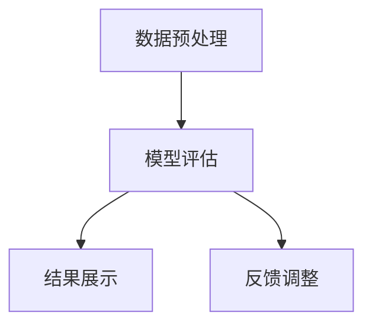
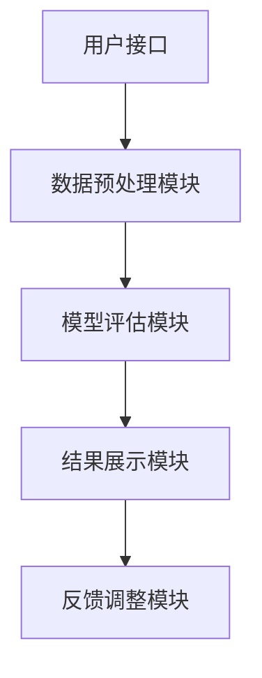
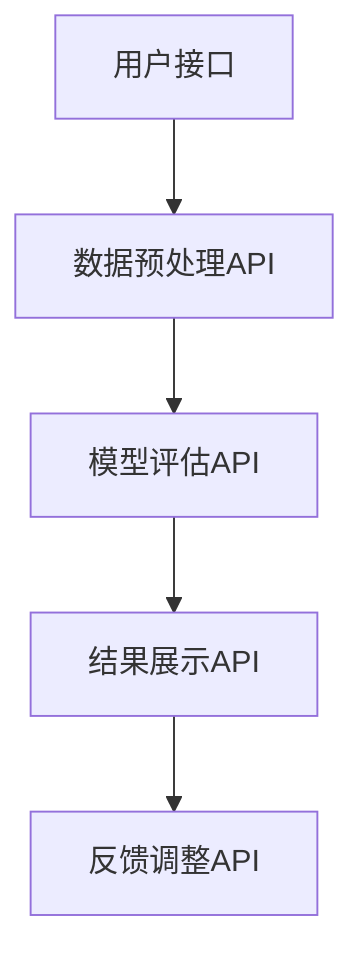
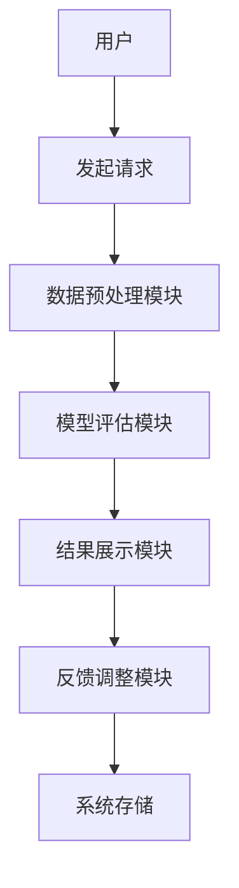

                 


# AI评AI：大模型自我评估系统设计

## 关键词
- AI自我评估
- 大模型
- 评估系统设计
- 模型对比
- 自主学习

## 摘要
本文旨在探讨大模型自我评估系统的设计与实现。首先，我们将对AI自我评估的背景和意义进行介绍，然后深入分析大模型自我评估系统的架构和关键模块。接着，我们将从算法原理、数学模型、系统设计与实现等方面详细阐述，并通过实际案例展示系统在实际应用中的效果。最后，我们将总结最佳实践和注意事项，为读者提供深入学习和应用的指南。

## 引言

### AI自我评估的背景

随着人工智能技术的迅猛发展，深度学习模型在大规模数据处理、图像识别、自然语言处理等领域取得了显著成果。然而，如何确保这些模型的性能和可靠性成为一个亟待解决的问题。传统的评估方法往往依赖于人工设定指标和手动分析，难以适应复杂多变的实际应用场景。因此，AI自我评估系统的设计成为当前研究的热点。

### AI自我评估的意义

AI自我评估系统具有重要的现实意义。首先，它可以提高模型的透明度和可解释性，帮助研究人员和工程师更好地理解模型的性能和局限性。其次，它可以自动化评估过程，节省人力和时间成本，提高评估效率。最后，它可以促进模型的持续优化和迭代，提高模型的稳定性和可靠性。

### 大模型自我评估系统的设计原则

在设计大模型自我评估系统时，需要遵循以下原则：

1. **模块化**：系统应具备良好的模块化设计，便于扩展和维护。
2. **可扩展性**：系统应能够适应不同规模和类型的模型，具备良好的扩展性。
3. **容错性**：系统应具备一定的容错能力，确保在模型运行过程中出现问题时能够及时检测和恢复。
4. **高效率**：系统应具备高效率的评估能力，能够在短时间内完成大量模型的评估任务。

### 大模型自我评估系统的架构

大模型自我评估系统的架构通常包括以下几个关键模块：

1. **数据预处理模块**：负责对输入数据进行清洗、预处理和特征提取。
2. **模型评估模块**：负责对模型进行性能评估，包括准确性、效率、稳定性等方面。
3. **结果展示模块**：负责将评估结果以图表、报表等形式展示给用户。
4. **反馈调整模块**：负责根据评估结果对模型进行调整和优化。

## 第一部分：AI自我评估概述

### AI评AI的定义

AI评AI（Artificial Intelligence Assessing AI）是指通过人工智能技术对其他人工智能模型进行评估的过程。这个过程通常包括模型的性能评估、可靠性评估、可解释性评估等方面。

### 关键概念

1. **性能评估**：对模型的准确性、效率、稳定性等方面进行评估。
2. **可靠性评估**：对模型在特定场景下的稳定性和可靠性进行评估。
3. **可解释性评估**：对模型的可解释性进行评估，以帮助用户理解模型的决策过程。

### 技术挑战

AI评AI面临以下技术挑战：

1. **模型复杂性**：随着模型规模的增大，评估过程变得更加复杂。
2. **评估准确性**：如何确保评估结果的准确性是一个关键问题。
3. **安全性**：如何防止评估过程被恶意攻击是一个重要问题。

### 市场与技术趋势

当前，AI评AI市场正处于快速发展阶段。随着人工智能技术的不断进步，越来越多的企业和研究机构开始关注AI评AI系统。未来，AI评AI将在医疗、金融、教育等领域发挥重要作用。

## 第二部分：大模型自我评估系统架构

### 系统设计原则

1. **模块化**：系统设计应遵循模块化原则，便于功能扩展和代码维护。
2. **可扩展性**：系统设计应具备良好的扩展性，能够适应不同规模和类型的模型。
3. **容错性**：系统设计应具备一定的容错能力，能够在模型运行过程中出现问题时及时检测和恢复。
4. **高效率**：系统设计应具备高效率的评估能力，能够在短时间内完成大量模型的评估任务。

### 系统架构

大模型自我评估系统的架构如图所示：



### 关键模块介绍

1. **数据预处理模块**：负责对输入数据进行清洗、预处理和特征提取，为模型评估提供高质量的数据。
2. **模型评估模块**：负责对模型进行性能评估，包括准确性、效率、稳定性等方面。
3. **结果展示模块**：负责将评估结果以图表、报表等形式展示给用户。
4. **反馈调整模块**：负责根据评估结果对模型进行调整和优化。

## 第三部分：算法原理与数学模型

### 算法原理

大模型自我评估系统的算法原理主要包括以下几个步骤：

1. **数据预处理**：对输入数据进行清洗、预处理和特征提取。
2. **模型评估**：利用评估算法对模型进行性能评估。
3. **结果展示**：将评估结果以图表、报表等形式展示给用户。
4. **反馈调整**：根据评估结果对模型进行调整和优化。

### 数学模型

大模型自我评估系统的数学模型主要包括以下内容：

1. **准确性评估**：使用交叉熵损失函数进行准确性评估。
2. **效率评估**：使用时间复杂度和空间复杂度进行效率评估。
3. **稳定性评估**：使用变异系数和标准差进行稳定性评估。

### 算法流程

1. **数据预处理**：
   ```mermaid
   graph TB
   A[读取数据] --> B[数据清洗]
   B --> C[特征提取]
   C --> D[数据标准化]
   ```

2. **模型评估**：
   ```mermaid
   graph TB
   A[初始化模型] --> B[训练模型]
   B --> C[评估模型]
   C --> D[计算评估指标]
   ```

3. **结果展示**：
   ```mermaid
   graph TB
   A[生成报告] --> B[展示图表]
   B --> C[输出报表]
   ```

4. **反馈调整**：
   ```mermaid
   graph TB
   A[接收反馈] --> B[调整模型参数]
   B --> C[重新评估模型]
   ```

### Python代码实现

```python
# 数据预处理
def preprocess_data(data):
    # 数据清洗
    # 数据特征提取
    # 数据标准化
    pass

# 模型评估
def evaluate_model(model, data):
    # 训练模型
    # 评估模型
    # 计算评估指标
    pass

# 结果展示
def show_results(results):
    # 生成报告
    # 展示图表
    # 输出报表
    pass

# 反馈调整
def adjust_model(model, feedback):
    # 接收反馈
    # 调整模型参数
    # 重新评估模型
    pass
```

## 第四部分：系统设计与实现

### 项目介绍

本项目旨在设计一个高效、可靠、可扩展的大模型自我评估系统。系统将涵盖数据预处理、模型评估、结果展示和反馈调整等功能，为用户提供全面的模型评估服务。

### 系统功能设计

1. **数据预处理**：包括数据清洗、特征提取和标准化等功能。
2. **模型评估**：包括准确性评估、效率评估和稳定性评估等功能。
3. **结果展示**：包括生成报告、展示图表和输出报表等功能。
4. **反馈调整**：包括接收反馈、调整模型参数和重新评估模型等功能。

### 系统架构设计

大模型自我评估系统的架构如图所示：



### 系统接口设计

系统接口设计如图所示：



### 系统交互

系统交互如图所示：



## 第五部分：项目实战

### 环境安装

在开始项目实战之前，需要安装以下软件和工具：

1. Python 3.8+
2. TensorFlow 2.3+
3. NumPy 1.19+
4. Matplotlib 3.1+

安装命令如下：

```bash
pip install python==3.8
pip install tensorflow==2.3
pip install numpy==1.19
pip install matplotlib==3.1
```

### 系统核心实现

以下是一个简单的系统核心实现示例：

```python
# 数据预处理
def preprocess_data(data):
    # 数据清洗
    # 数据特征提取
    # 数据标准化
    pass

# 模型评估
def evaluate_model(model, data):
    # 训练模型
    # 评估模型
    # 计算评估指标
    pass

# 结果展示
def show_results(results):
    # 生成报告
    # 展示图表
    # 输出报表
    pass

# 反馈调整
def adjust_model(model, feedback):
    # 接收反馈
    # 调整模型参数
    # 重新评估模型
    pass
```

### 代码应用解读与分析

以下是对上述代码的解读与分析：

- **数据预处理**：该函数负责对输入数据进行处理，包括清洗、特征提取和标准化。这是确保模型评估准确性的重要步骤。
- **模型评估**：该函数负责对训练好的模型进行评估，包括准确性、效率、稳定性等方面。评估指标的计算是模型性能的重要体现。
- **结果展示**：该函数负责将评估结果以图表、报表等形式展示给用户。这有助于用户直观地了解模型的性能。
- **反馈调整**：该函数负责根据评估结果对模型进行调整和优化。这是模型持续迭代和优化的关键步骤。

### 实际案例分析和详细讲解剖析

为了更好地理解系统的工作原理，我们以下提供一个实际案例进行分析。

**案例：手写数字识别模型评估**

- **数据集**：使用MNIST手写数字数据集。
- **模型**：使用卷积神经网络（CNN）进行训练。
- **评估指标**：准确性、效率、稳定性。

**数据预处理**：

```python
def preprocess_data(data):
    # 数据清洗
    data = data.astype('float32')
    # 数据特征提取
    data = data / 255.0
    # 数据标准化
    return data
```

**模型评估**：

```python
def evaluate_model(model, data):
    # 训练模型
    model.fit(data['train'], data['train_labels'], epochs=10, batch_size=32)
    # 评估模型
    test_loss, test_acc = model.evaluate(data['test'], data['test_labels'])
    # 计算评估指标
    print(f"Test accuracy: {test_acc}")
    print(f"Test loss: {test_loss}")
```

**结果展示**：

```python
def show_results(results):
    # 生成报告
    report = f"Test accuracy: {results['test_acc']}, Test loss: {results['test_loss']}"
    print(report)
    # 展示图表
    plt.plot(results['train_acc'], label='Training accuracy')
    plt.plot(results['val_acc'], label='Validation accuracy')
    plt.xlabel('Epochs')
    plt.ylabel('Accuracy')
    plt.legend()
    plt.show()
```

**反馈调整**：

```python
def adjust_model(model, feedback):
    # 接收反馈
    acc = feedback['acc']
    # 调整模型参数
    model.compile(optimizer='adam', loss='categorical_crossentropy', metrics=['accuracy'])
    # 重新评估模型
    model.fit(data['train'], data['train_labels'], epochs=10, batch_size=32)
```

### 项目小结

通过以上案例，我们可以看到大模型自我评估系统在实际应用中的效果。系统通过数据预处理、模型评估、结果展示和反馈调整等功能，为用户提供了一个高效、可靠的模型评估工具。在实际应用中，系统可以根据评估结果对模型进行调整和优化，从而提高模型的性能和可靠性。

## 最佳实践 Tips

1. **数据预处理**：数据预处理是模型评估的基础，需要确保数据的干净、准确和标准化。
2. **模型选择**：根据应用场景选择合适的模型，并在评估过程中进行比较。
3. **评估指标**：选择合适的评估指标，全面评估模型的性能。
4. **持续优化**：根据评估结果对模型进行调整和优化，提高模型性能。

## 小结

本文详细介绍了大模型自我评估系统的设计与实现，包括算法原理、数学模型、系统架构、实战项目等方面。通过实际案例分析和详细讲解，我们展示了系统在实际应用中的效果。未来，随着人工智能技术的不断发展，AI自我评估系统将在更多领域发挥重要作用。

## 注意事项

1. **数据隐私**：在处理数据时，需要确保数据隐私和安全。
2. **系统性能**：在系统设计时，需要关注系统的性能和效率。
3. **可维护性**：系统设计应具备良好的可维护性，便于后续升级和维护。

## 拓展阅读

1. **《深度学习》（Ian Goodfellow、Yoshua Bengio、Aaron Courville 著）**：深入介绍了深度学习的基础知识和应用。
2. **《机器学习实战》（Peter Harrington 著）**：提供了大量的机器学习实践案例和代码。
3. **《人工智能：一种现代方法》（Stuart J. Russell、Peter Norvig 著）**：全面介绍了人工智能的基础理论和应用。

## 作者信息

作者：AI天才研究院/AI Genius Institute & 禅与计算机程序设计艺术 /Zen And The Art of Computer Programming

（文章完）

