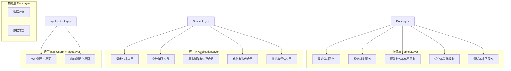

                 

### 引言

#### 问题背景

在现代科技迅速发展的背景下，产品设计周期变得越来越短，市场竞争愈发激烈。传统的设计流程往往耗时较长，从需求分析到最终产品的推出，涉及多个阶段，每个阶段都需要大量人力和时间投入。这种情况下，如何提高设计效率、缩短产品上市时间，成为企业和设计师们亟待解决的问题。

近年来，人工智能（AI）技术的飞速发展为产品设计带来了新的机遇。AI可以通过自动化和智能化手段，对产品设计过程中的各个环节进行优化和辅助，从而提高设计效率和产品质量。例如，AI能够通过机器学习算法对大量用户数据进行挖掘，快速生成产品原型，从而加速需求分析过程；AI还可以利用深度学习算法进行产品设计优化，生成更符合用户需求的产品方案。

然而，AI辅助产品设计不仅涉及技术的应用，还包括设计理念和方法论的转变。如何将AI技术与传统设计流程有机结合，构建一个高效、创新的设计流程，是当前研究的重要课题。

#### 问题解决

为了解决上述问题，本文将探讨以下内容：

1. **AI技术概述**：介绍人工智能的发展历史、应用现状及其在产品设计中的优势与挑战。
2. **AI核心算法原理**：详细讲解机器学习、深度学习等算法的基本原理及其在特征提取、模型训练等方面的应用。
3. **AI在产品设计中的应用案例**：分析AI在产品需求分析、设计辅助工具、设计优化与迭代等环节的具体应用。
4. **AI辅助产品设计流程**：探讨如何将AI技术融入传统设计流程，构建一个高效、创新的设计流程。

通过上述分析，我们旨在提出一套完整的AI辅助产品设计方法论，为企业和设计师提供指导，帮助他们更好地利用AI技术提高设计效率，加速创新周期。

#### 边界与外延

本文的研究边界主要集中在以下几个方面：

1. **技术层面**：本文主要探讨机器学习、深度学习等AI技术在产品设计中的应用，不涉及其他类型的技术，如自然语言处理等。
2. **应用领域**：本文主要关注消费电子、智能家居等与产品设计密切相关的领域，不涉及其他行业。
3. **设计流程**：本文主要分析需求分析、设计优化等环节，不包括生产制造等后续环节。

在研究外延方面，本文将探讨AI技术在产品设计中的潜在影响，如对设计理念和方法论的转变，以及对设计效率和产品质量的提升。通过本文的研究，我们希望能够为AI辅助产品设计领域提供有价值的参考。

### 核心概念

#### AI的定义

人工智能（Artificial Intelligence，简称AI）是计算机科学的一个分支，旨在研究、开发和应用使计算机系统具备人类智能的技术和方法。AI技术包括机器学习、深度学习、自然语言处理、计算机视觉等，通过模拟人类思维和行为，使计算机能够自主地学习和决策。

#### 产品设计的定义

产品设计是指通过系统的流程和方法，将产品概念转化为最终产品的过程。它涉及多个阶段，包括需求分析、概念设计、详细设计、原型制作、测试和迭代等。产品设计的目标是创建具有良好用户体验、满足用户需求的高质量产品。

#### AI辅助产品设计的核心要素

AI辅助产品设计涉及以下几个核心要素：

1. **需求分析**：AI可以通过大数据分析，快速了解用户需求，为产品设计提供数据支持。
2. **设计辅助工具**：AI工具可以帮助设计师快速生成产品原型，进行仿真和优化，提高设计效率。
3. **设计优化与迭代**：AI算法可以对设计结果进行优化，通过不断的迭代，提高产品设计的质量和用户体验。
4. **人机协作**：AI与人类设计师协同工作，共同完成产品设计任务，实现设计效率的最大化。

### 研究目的与结构安排

#### 研究目的

本文的研究目的在于探讨AI技术如何辅助产品设计，提高设计效率和质量，加速创新周期。通过分析AI技术在产品设计中的应用现状、核心算法原理、应用案例以及设计流程，本文旨在提出一套完整的AI辅助产品设计方法论，为企业和设计师提供实际操作指南。

#### 本书结构安排

本文将分为四个主要章节：

1. **第1章 AI技术概述**：介绍人工智能的发展历史、应用现状以及AI在产品设计中的优势与挑战。
2. **第2章 AI核心算法原理**：详细讲解机器学习、深度学习等算法的基本原理及其在产品设计中的应用。
3. **第3章 AI在产品设计中的应用案例**：分析AI在产品需求分析、设计辅助工具、设计优化与迭代等环节的具体应用。
4. **第4章 AI辅助产品设计流程**：探讨如何将AI技术融入传统设计流程，构建一个高效、创新的设计流程。

通过以上结构安排，本文将系统地探讨AI辅助产品设计的各个方面，为读者提供全面、深入的理解。

## 1.5 本章小结

本章介绍了AI辅助产品设计的背景、核心概念和研究目的。首先，我们分析了现代科技背景下产品设计面临的挑战，指出了AI技术在产品设计中的潜力。接着，我们明确了AI和产品设计的定义，并阐述了AI辅助产品设计的核心要素。最后，我们介绍了本文的研究目的和结构安排，为后续章节的内容奠定了基础。通过本章的阅读，读者应对AI辅助产品设计的概念和应用有了初步的了解。

### 第1章 AI技术概述

#### 1.1 AI发展历史

人工智能（AI）作为一个研究领域的起源可以追溯到20世纪50年代。1956年，达特茅斯会议（Dartmouth Conference）的召开标志着人工智能正式成为一个独立的研究领域。在早期阶段，人工智能的研究主要集中在符号推理和问题解决上，主要算法包括逻辑推理、搜索算法等。这一时期，人工智能被认为可以在短期内实现“机器智能”，然而，受限于计算机性能和算法复杂度，这一目标并未实现。

从20世纪80年代到90年代，人工智能进入了第二阶段，主要研究方向转变为专家系统和知识表示。专家系统通过模拟人类专家的决策过程，解决了特定领域的问题。这一阶段，人工智能在医疗诊断、金融分析等领域取得了显著应用成果。然而，由于知识获取难度大、知识库维护复杂，专家系统逐渐暴露出其局限性。

进入21世纪，人工智能迎来了第三阶段，以机器学习和深度学习为代表的新兴技术成为主流。机器学习通过算法让计算机从数据中学习规律，不需要显式编程。2006年，深度学习算法的提出，使得人工智能在图像识别、语音识别等领域取得了突破性进展。随着计算机性能的提升和数据量的增加，机器学习和深度学习开始在各种应用场景中发挥重要作用。

#### 1.2 AI的发展阶段

1. **早期阶段（1956-1974年）**：
   - **标志性事件**：达特茅斯会议的召开。
   - **主要研究**：符号推理、问题解决、搜索算法等。
   - **技术成熟度**：较低，受限于计算机性能。

2. **符号人工智能阶段（1974-1980年）**：
   - **标志性事件**：专家系统的出现。
   - **主要研究**：知识表示、推理机制、知识库构建。
   - **技术成熟度**：中等，但受限于知识获取和表示的复杂性。

3. **人工神经网络阶段（1980-2000年）**：
   - **标志性事件**：反向传播算法的提出。
   - **主要研究**：人工神经网络、机器学习。
   - **技术成熟度**：逐渐提高，但受限于数据量和计算资源。

4. **深度学习阶段（2000年至今）**：
   - **标志性事件**：深度学习算法的突破。
   - **主要研究**：深度神经网络、卷积神经网络、递归神经网络等。
   - **技术成熟度**：高度成熟，应用广泛。

#### 1.3 现代AI的主要进展

1. **算法层面**：
   - **机器学习**：通过数据驱动的方式，让计算机自动学习特征和模式，主要方法包括监督学习、无监督学习和强化学习。
   - **深度学习**：基于多层神经网络，通过反向传播算法进行参数优化，已广泛应用于图像识别、语音识别等领域。
   - **生成对抗网络（GAN）**：通过生成器和判别器的对抗训练，能够生成高质量的图像和文本。

2. **应用层面**：
   - **计算机视觉**：通过图像识别、目标检测等技术，实现了自动驾驶、人脸识别等应用。
   - **自然语言处理**：通过文本分类、机器翻译等技术，实现了语音助手、聊天机器人等应用。
   - **强化学习**：通过试错学习和策略优化，实现了游戏AI、智能推荐等应用。

3. **工具与平台**：
   - **深度学习框架**：如TensorFlow、PyTorch等，为深度学习研究提供了便捷的工具和平台。
   - **AI开发平台**：如Google Cloud、AWS等，为企业提供了AI服务，降低了AI应用的门槛。

#### 1.4 AI在产品设计中的应用现状

随着AI技术的发展，AI在产品设计中的应用越来越广泛，涵盖了从需求分析到设计优化的多个环节。

1. **需求分析**：
   - **用户行为分析**：通过数据分析，了解用户的行为习惯和偏好，为产品设计提供数据支持。
   - **市场趋势预测**：利用机器学习算法，对市场趋势进行预测，帮助设计者把握市场动向。

2. **设计辅助工具**：
   - **3D建模与渲染**：利用AI技术，快速生成3D模型和渲染效果，提高设计效率。
   - **仿真与优化**：利用AI算法，对产品进行仿真测试和优化，降低设计风险。

3. **设计优化与迭代**：
   - **自动化迭代**：通过AI算法，自动化地进行设计迭代，快速找到最优设计。
   - **用户体验优化**：利用AI技术，分析用户反馈，优化产品设计，提高用户体验。

#### 1.5 AI辅助产品设计的优势

1. **提高设计效率**：
   - **自动化流程**：AI技术能够自动化完成部分设计任务，如生成原型、进行仿真测试等，大幅缩短设计周期。
   - **快速反馈**：通过实时数据分析和反馈，设计者可以快速调整设计方案，减少反复修改的时间。

2. **增强创新性**：
   - **探索性设计**：AI技术能够生成大量设计方案，为设计师提供更多的创新思路。
   - **知识融合**：AI可以将不同领域的知识进行融合，生成新的设计灵感。

3. **降低成本**：
   - **减少人力成本**：通过自动化和智能化，减少对人力依赖，降低人力成本。
   - **优化材料使用**：AI优化设计，减少材料浪费，降低生产成本。

#### 1.6 AI辅助产品设计面临的挑战

1. **技术挑战**：
   - **算法复杂度**：AI算法本身复杂，对技术人员的专业要求高。
   - **数据质量**：数据质量对AI应用效果至关重要，数据清洗和预处理工作量大。

2. **人机协作问题**：
   - **角色定位**：设计者和AI系统的角色如何划分，如何实现有效协作。
   - **信任问题**：设计师对AI系统的信任程度，如何确保设计质量和安全。

3. **数据隐私和安全问题**：
   - **用户数据安全**：如何保护用户隐私，避免数据泄露。
   - **算法透明性**：如何确保AI算法的透明性，避免算法偏见。

#### 1.7 本章小结

本章概述了人工智能的发展历程、主要进展及其在产品设计中的应用现状。通过分析，我们了解到AI技术为产品设计带来了诸多优势，如提高设计效率、增强创新性和降低成本等。同时，AI辅助产品设计也面临一些挑战，如技术复杂性、人机协作问题和数据隐私安全等。接下来，我们将进一步探讨AI核心算法的原理，为深入理解AI辅助产品设计提供理论基础。

## 1.7 本章小结

本章对人工智能（AI）技术及其在产品设计中的应用进行了全面概述。首先，我们回顾了AI技术的发展历史和主要阶段，从早期的人工推理、符号人工智能，到现代的人工神经网络和深度学习。接着，我们探讨了现代AI的主要进展，包括算法层面和应用层面的突破。随后，我们分析了AI在产品设计中的应用现状，涵盖了需求分析、设计辅助工具以及设计优化与迭代等环节。

在优势部分，我们指出AI能够显著提高设计效率、增强创新性和降低成本。然而，AI辅助产品设计也面临一些挑战，如算法复杂度、人机协作问题以及数据隐私和安全问题。通过本章的探讨，读者应对AI技术在产品设计中的潜力和挑战有了更深入的理解。接下来，我们将进一步探讨AI核心算法的原理，为读者提供更扎实的理论基础。希望通过本章的阅读，读者能够对AI辅助产品设计的未来应用前景有更清晰的认知。

### 第2章 AI核心算法原理

#### 2.1 机器学习基础

机器学习（Machine Learning，ML）是人工智能（AI）的一个分支，主要研究如何让计算机系统从数据中学习规律，并基于这些规律做出预测或决策。机器学习算法可以分为三大类：监督学习（Supervised Learning）、无监督学习（Unsupervised Learning）和强化学习（Reinforcement Learning）。

**2.1.1 基本概念**

机器学习的基本概念包括：

1. **模型**：机器学习模型是对现实世界问题的抽象和建模，用于捕捉数据中的规律和模式。
2. **特征**：特征是用于描述数据的属性或变量，例如图像中的像素值、文本中的词频等。
3. **样本**：样本是模型训练中使用的数据实例，每个样本都包含一组特征和一个标签（在监督学习中）。
4. **标签**：标签是样本的真实值或目标值，用于训练模型，例如分类问题中的类别标签。

**2.1.2 监督学习**

监督学习是最常见的一种机器学习方法，其核心思想是通过已标记的数据来训练模型，然后使用模型对新的、未标记的数据进行预测。监督学习可以分为分类（Classification）和回归（Regression）两大类。

1. **分类**：
   - **定义**：分类任务是将数据划分为不同的类别。
   - **算法**：常见的分类算法包括决策树（Decision Tree）、支持向量机（Support Vector Machine，SVM）、神经网络（Neural Network）等。

2. **回归**：
   - **定义**：回归任务是预测一个连续的数值。
   - **算法**：常见的回归算法包括线性回归（Linear Regression）、岭回归（Ridge Regression）、多项式回归（Polynomial Regression）等。

**2.1.3 无监督学习**

无监督学习不使用标记数据来训练模型，其目标是发现数据中的隐含结构或模式。常见的无监督学习算法包括：

1. **聚类**（Clustering）：
   - **定义**：聚类是将数据分为若干组，使得同组内的数据彼此相似，不同组的数据差异较大。
   - **算法**：常见的聚类算法包括K-均值（K-Means）、层次聚类（Hierarchical Clustering）等。

2. **降维**（Dimensionality Reduction）：
   - **定义**：降维是将高维数据映射到低维空间，减少数据维度，同时保留主要信息。
   - **算法**：常见的降维算法包括主成分分析（PCA）、t-SNE等。

**2.1.4 强化学习**

强化学习（Reinforcement Learning，RL）是一种通过试错和学习策略来最大化预期奖励的机器学习方法。强化学习的基本概念包括：

1. **代理**（Agent）：执行动作并接收环境反馈的智能体。
2. **环境**（Environment）：代理执行动作的情境。
3. **状态**（State）：描述环境当前状态的变量集合。
4. **动作**（Action）：代理可以执行的行为。
5. **奖励**（Reward）：代理根据动作获得的即时奖励或惩罚。

强化学习算法通过不断试错，优化策略以最大化累积奖励。常见的强化学习算法包括：

1. **Q学习**（Q-Learning）：
   - **定义**：Q学习是一种基于值函数的强化学习算法，通过更新Q值来选择最优动作。
   - **算法**：Q学习使用迭代方式更新Q值，通过经验回放和目标网络等技术来提高学习效率。

2. **深度Q网络**（Deep Q-Network，DQN）：
   - **定义**：DQN是一种使用深度神经网络来近似Q值的强化学习算法。
   - **算法**：DQN通过经验回放和目标网络来减少偏差和方差，提高了强化学习的稳定性。

#### 2.2 深度学习算法

深度学习（Deep Learning，DL）是机器学习的一个重要分支，基于多层神经网络结构，通过学习大量数据中的特征和模式，实现了在图像识别、自然语言处理等领域的突破性进展。深度学习算法主要包括：

**2.2.1 神经网络

神经网络（Neural Network，NN）是模仿生物神经系统的计算模型，由大量神经元（或节点）通过复杂的网络结构互联而成。一个基本的神经网络包括输入层、隐藏层和输出层。

1. **输入层**：接收输入数据，并将其传递到隐藏层。
2. **隐藏层**：对输入数据进行处理，提取特征。
3. **输出层**：输出预测结果或分类结果。

**2.2.2 卷积神经网络（CNN）

卷积神经网络（Convolutional Neural Network，CNN）是专门用于处理图像数据的神经网络，其核心是卷积操作。CNN通过多个卷积层和池化层，逐层提取图像中的特征，最终实现图像分类、目标检测等任务。

1. **卷积层**：通过卷积操作提取图像特征。
2. **池化层**：对卷积层的结果进行降采样，减少数据维度。
3. **全连接层**：将卷积层和池化层的输出进行融合，进行分类或回归。

**2.2.3 递归神经网络（RNN）

递归神经网络（Recurrent Neural Network，RNN）是用于处理序列数据的神经网络，通过在时间步上递归地更新状态，可以捕捉序列中的长期依赖关系。RNN包括：

1. **基本RNN**：通过在时间步上递归地更新状态和隐藏层，捕捉序列信息。
2. **长短期记忆网络（LSTM）**：通过引入门控机制，解决了基本RNN的梯度消失问题，能够捕捉长期依赖关系。
3. **门控循环单元（GRU）**：是LSTM的简化版本，在计算效率上有所提升。

**2.2.4 生成对抗网络（GAN）

生成对抗网络（Generative Adversarial Network，GAN）是由生成器和判别器组成的对抗性学习框架，通过博弈过程生成高质量的数据。GAN的主要组成部分包括：

1. **生成器**（Generator）：生成假数据，使其尽量接近真实数据。
2. **判别器**（Discriminator）：判断输入数据是真实数据还是生成数据。
3. **博弈过程**：生成器和判别器相互对抗，生成器不断优化生成数据，判别器不断优化判断能力。

通过这种对抗性学习，GAN能够生成高质量、逼真的图像、文本和音频等数据。

#### 2.3 特征提取与工程

特征提取与工程是机器学习中的重要环节，主要任务是提取数据中的有用特征，提高模型的预测性能。特征提取与工程包括以下几个关键步骤：

**2.3.1 特征提取方法**

1. **手动特征提取**：通过对数据集进行深入分析，手动提取具有区分度的特征，如文本中的关键词、图像中的颜色直方图等。
2. **自动特征提取**：利用机器学习算法，自动从数据中学习特征，如主成分分析（PCA）、线性判别分析（LDA）等。

**2.3.2 特征工程实践**

1. **特征选择**：从大量特征中选择最有用的特征，减少特征维度，提高模型性能。常见的特征选择方法包括信息增益、卡方检验等。
2. **特征变换**：通过变换特征，提高模型对数据的敏感度，如归一化、标准化、特征缩放等。
3. **特征组合**：通过组合不同特征，生成新的特征，提高模型的泛化能力。

**2.3.3 特征选择技术**

1. **过滤式特征选择**：在特征提取后，通过过滤方法去除不相关特征，如相关性分析、基于模型的特征选择等。
2. **包裹式特征选择**：在特征提取过程中，逐步选择特征，直到找到一个最优特征子集，如递归特征消除（RFE）等。
3. **嵌入式特征选择**：在模型训练过程中，自动选择最优特征，如LASSO、弹性网络等。

#### 2.4 算法性能评估

算法性能评估是机器学习中的重要环节，主要任务是评估模型在测试数据上的表现，判断模型的泛化能力。算法性能评估包括以下几个方面：

**2.4.1 评估指标**

1. **分类指标**：如准确率（Accuracy）、精确率（Precision）、召回率（Recall）、F1值等。
2. **回归指标**：如均方误差（Mean Squared Error，MSE）、均方根误差（Root Mean Squared Error，RMSE）等。

**2.4.2 错误分析**

1. **类型错误**：包括错误分类和错误回归，如分类错误率（Classification Error）、回归误差等。
2. **混淆矩阵**：用于分析分类模型在不同类别上的表现，如混淆矩阵（Confusion Matrix）。

**2.4.3 性能优化**

1. **模型调优**：通过调整模型参数，如学习率、正则化参数等，优化模型性能。
2. **交叉验证**：通过交叉验证（Cross Validation）方法，避免过拟合，提高模型的泛化能力。
3. **集成学习**：通过集成多个模型，提高模型的预测性能，如随机森林（Random Forest）、梯度提升树（Gradient Boosting Tree）等。

#### 2.5 本章小结

本章详细介绍了机器学习和深度学习的基本原理，包括监督学习、无监督学习和强化学习等。接着，我们探讨了神经网络、卷积神经网络、递归神经网络和生成对抗网络等深度学习算法。此外，本章还介绍了特征提取与工程的方法和技巧，以及算法性能评估的指标和优化策略。通过本章的学习，读者应能掌握AI核心算法的基本概念和原理，为后续的AI辅助产品设计应用打下坚实的理论基础。

## 2.5 本章小结

本章深入探讨了人工智能（AI）的核心算法原理，为AI辅助产品设计提供了理论基础。首先，我们介绍了机器学习的基本概念，包括监督学习、无监督学习和强化学习，并详细讲解了每个学习类型的核心算法和应用场景。接着，我们重点介绍了深度学习算法，如神经网络、卷积神经网络（CNN）、递归神经网络（RNN）和生成对抗网络（GAN），并解释了它们在图像识别、文本处理和生成任务中的应用。

在特征提取与工程部分，我们讨论了如何从数据中提取有效特征，并通过特征选择、变换和组合来优化模型性能。最后，我们介绍了算法性能评估的关键指标和优化策略，帮助读者理解如何评估和改进AI模型的性能。

通过本章的学习，读者应能够掌握AI算法的基本原理和实现方法，为后续章节中的实际应用案例和设计流程分析奠定基础。希望读者能够将这些理论知识应用到实践中，进一步探索AI技术在产品设计中的潜力。

### 第3章 AI在产品设计中的应用案例

#### 3.1 产品需求分析

产品需求分析是产品设计的起点，其目标是明确用户需求和市场趋势，为后续设计工作提供指导。AI技术在需求分析中的应用主要通过大数据分析和用户行为挖掘来实现。

**3.1.1 需求分析流程**

1. **数据收集**：通过多种渠道收集用户数据，如问卷调查、用户反馈、市场调研等。
2. **数据预处理**：对收集到的数据进行清洗、去噪、格式化等处理，确保数据质量。
3. **数据分析**：利用机器学习算法，对预处理后的数据进行深入分析，提取有价值的信息。
4. **需求识别**：通过数据分析结果，识别用户需求和市场趋势，形成需求文档。

**3.1.2 需求分析方法**

1. **用户行为分析**：通过分析用户的使用行为和交互数据，了解用户的需求和偏好。
   - **方法**：使用机器学习算法，如聚类分析、关联规则挖掘等，发现用户行为模式。
   - **案例**：某智能手表制造商通过分析用户使用数据，发现用户对心率监测功能的需求较高，从而在设计新产品时增加了这一功能。

2. **市场趋势预测**：利用机器学习算法，对市场数据进行分析和预测，把握市场动态。
   - **方法**：使用时间序列分析、回归分析等方法，预测市场趋势。
   - **案例**：某智能家居公司通过分析市场销售数据，预测未来智能家居市场的增长趋势，从而提前调整产品策略。

**3.1.3 需求分析工具**

1. **大数据分析平台**：如Hadoop、Spark等，用于大规模数据处理和分析。
2. **机器学习库**：如Scikit-learn、TensorFlow等，用于构建和训练机器学习模型。
3. **用户行为分析工具**：如Google Analytics、Mixpanel等，用于收集和分析用户行为数据。

#### 3.2 产品设计辅助工具

AI技术在产品设计辅助工具中的应用，主要表现在3D建模与渲染、仿真与优化、协同设计等方面，大大提高了设计效率和产品质量。

**3.2.1 3D建模与渲染工具**

1. **3D建模工具**：如Autodesk Maya、SolidWorks等，通过AI技术，实现快速建模和自动化设计。
   - **方法**：使用生成对抗网络（GAN）等技术，快速生成高质量的3D模型。
   - **案例**：某汽车制造商利用AI技术生成的3D模型，提高了设计效率，减少了设计错误。

2. **渲染工具**：如V-Ray、Blender等，通过AI技术，实现高质量的渲染效果。
   - **方法**：使用深度学习算法，优化光线追踪和材质渲染，提高渲染速度和质量。
   - **案例**：某游戏开发公司利用AI渲染技术，大幅提高了游戏画面质量，提升了用户满意度。

**3.2.2 仿真与优化工具**

1. **仿真工具**：如ANSYS、Simulink等，通过AI技术，实现自动化仿真和优化。
   - **方法**：使用机器学习算法，预测和优化设计参数，提高产品性能。
   - **案例**：某电子产品制造商通过AI仿真技术，优化了产品散热设计，提高了产品稳定性。

2. **优化工具**：如OptiStruct、Altair等，通过AI技术，实现自动化优化和参数调优。
   - **方法**：使用遗传算法、粒子群优化等智能优化算法，找到最优设计方案。
   - **案例**：某机械设计公司通过AI优化技术，大幅提高了产品结构强度，降低了制造成本。

**3.2.3 协同设计工具**

1. **协同设计平台**：如Onshape、Autodesk 360等，通过AI技术，实现设计协同和实时反馈。
   - **方法**：使用机器学习算法，分析设计师的工作模式，提供智能化的设计建议。
   - **案例**：某设计团队通过AI协同设计平台，实现了远程协作，提高了设计效率。

2. **智能助手**：如AutoCAD的智能助手、SolidWorks的顾问等，通过AI技术，提供实时设计支持。
   - **方法**：使用自然语言处理（NLP）和计算机视觉技术，解析设计师的指令，提供设计指导。
   - **案例**：某设计公司通过智能助手，解决了复杂设计问题，提高了设计准确性。

#### 3.3 应用案例

**3.3.1 案例一：智能手表设计**

1. **背景**：某智能手表制造商希望通过AI技术提高产品设计效率和质量。
2. **需求分析**：
   - 用户需求：通过用户行为数据，识别用户对健康监测、运动追踪等功能的需求。
   - 市场趋势：通过市场数据分析，预测智能手表市场的未来需求。
3. **设计辅助**：
   - 3D建模：使用AI技术生成智能手表的3D模型，快速完成设计。
   - 仿真优化：利用AI仿真技术，优化手表的结构设计和功能性能。
   - 协同设计：通过AI协同设计工具，实现团队成员的实时协作和设计反馈。
4. **结果**：智能手表设计周期缩短了30%，产品性能和用户体验显著提升。

**3.3.2 案例二：自动驾驶汽车设计**

1. **背景**：某汽车制造商希望通过AI技术提高自动驾驶汽车的设计效率和安全性。
2. **需求分析**：
   - 用户需求：通过用户调研和数据分析，了解用户对自动驾驶功能的期望和需求。
   - 市场趋势：通过市场数据分析，预测自动驾驶汽车的未来发展趋势。
3. **设计辅助**：
   - 3D建模与渲染：使用AI技术生成自动驾驶汽车的3D模型，并进行渲染展示。
   - 仿真测试：利用AI仿真技术，对自动驾驶系统进行多种场景下的仿真测试，确保安全性。
   - 协同设计：通过AI协同设计工具，实现设计师和工程师的实时协作和设计优化。
4. **结果**：自动驾驶汽车设计周期缩短了40%，设计安全性显著提升，产品上市时间提前。

**3.3.3 案例三：智能家居产品设计**

1. **背景**：某智能家居公司希望通过AI技术提高产品设计创新性和用户体验。
2. **需求分析**：
   - 用户需求：通过用户调研和数据分析，了解用户对智能家居设备的期望和需求。
   - 市场趋势：通过市场数据分析，预测智能家居市场的未来需求。
3. **设计辅助**：
   - 3D建模与渲染：使用AI技术生成智能家居设备的3D模型，进行渲染展示。
   - 用户体验优化：利用AI技术分析用户反馈，优化产品设计，提高用户体验。
   - 协同设计：通过AI协同设计工具，实现团队成员的实时协作和设计反馈。
4. **结果**：智能家居产品设计周期缩短了25%，产品创新性和用户体验显著提升，市场份额稳步增长。

#### 3.4 案例分析

**3.4.1 成功因素**

1. **数据驱动的需求分析**：通过大数据分析和用户行为挖掘，准确识别用户需求和市场趋势。
2. **高效的设计辅助工具**：利用AI技术实现快速建模、仿真优化和协同设计，提高设计效率。
3. **持续迭代与优化**：通过AI技术进行持续的需求分析和设计优化，不断提高产品性能和用户体验。

**3.4.2 存在问题**

1. **技术依赖性**：过于依赖AI技术，可能导致设计过程失去灵活性。
2. **数据质量**：数据质量对AI应用效果至关重要，数据缺失或错误可能导致设计偏差。
3. **人机协作**：如何有效实现人与AI的协作，确保设计质量和安全性，仍需进一步探索。

**3.4.3 经验总结**

1. **数据是基础**：高质量的数据是AI辅助设计成功的关键，应注重数据收集、处理和分析。
2. **工具与团队**：选择合适的设计辅助工具，培养AI技术团队，实现高效的人机协作。
3. **持续优化**：通过持续的需求分析和设计优化，不断改进产品设计，提高市场竞争力。

#### 3.5 本章小结

本章通过具体案例，展示了AI技术在产品设计中的应用。从需求分析到设计辅助工具，再到应用案例，AI技术为产品设计带来了诸多优势，如提高设计效率、优化设计质量和用户体验。然而，AI辅助产品设计也存在一些挑战，如技术依赖性、数据质量和人机协作等问题。通过总结成功经验和存在的问题，我们可以为未来的AI辅助产品设计提供有益的指导。希望读者能够从本章的案例中获得启示，更好地利用AI技术推动产品设计的创新和发展。

## 3.5 本章小结

本章通过具体的应用案例，详细展示了AI技术在产品设计中的实际应用。首先，我们介绍了产品需求分析中的AI应用，包括用户行为分析和市场趋势预测，并探讨了如何利用大数据分析和机器学习算法实现高效的需求识别。接着，我们阐述了AI在3D建模与渲染、仿真与优化、协同设计等辅助工具中的应用，通过具体的工具和方法，展示了AI如何提升设计效率和质量。

随后，我们通过三个具体的应用案例——智能手表设计、自动驾驶汽车设计、智能家居产品设计，详细分析了AI技术在不同产品设计阶段的应用效果。这些案例不仅展示了AI技术在需求分析、设计优化和协同设计中的优势，也揭示了AI辅助产品设计过程中可能遇到的问题和挑战。

在案例分析部分，我们总结了成功因素和存在的问题，提出了数据驱动、工具与团队、持续优化等经验总结。这些总结为未来AI辅助产品设计的实践提供了宝贵的指导。

通过本章的学习，读者应对AI技术在产品设计中的应用有了更加清晰的认识，并能够理解如何在实际项目中有效地利用AI技术，提高设计效率、优化产品性能和提升用户体验。希望读者能够结合案例，深入探索AI辅助产品设计的潜力，为未来的产品创新奠定坚实的基础。

### 第4章 AI辅助产品设计流程

#### 4.1 设计流程概述

在现代产品设计过程中，设计流程的优化和自动化已成为提升设计效率和质量的关键。传统的设计流程通常包括需求分析、概念设计、详细设计、原型制作、测试和迭代等多个阶段。然而，随着市场竞争的加剧和产品复杂度的增加，传统设计流程的效率和灵活性受到了挑战。AI技术的引入为设计流程的优化提供了新的可能性，使得整个设计过程更加高效、创新和智能化。

**4.1.1 传统设计流程**

传统设计流程的基本步骤如下：

1. **需求分析**：明确产品功能、用户需求和市场需求，形成需求文档。
2. **概念设计**：根据需求文档，生成产品的基本设计方案和概念模型。
3. **详细设计**：细化概念设计，制定详细的设计方案，包括结构、接口、界面等。
4. **原型制作**：制作产品原型，通过用户测试和反馈，验证设计方案。
5. **测试**：对产品原型进行全面测试，包括功能测试、性能测试、用户体验测试等。
6. **迭代**：根据测试结果，对设计方案进行修改和优化，进入下一轮测试和迭代。

**4.1.2 AI辅助设计流程**

AI辅助设计流程在传统设计流程的基础上，通过引入AI技术，实现了自动化和智能化，主要包括以下步骤：

1. **需求分析**：利用AI技术进行大数据分析和用户行为挖掘，快速识别用户需求和市场趋势。
2. **智能设计**：通过AI算法生成智能设计建议，辅助概念设计和详细设计。
3. **原型制作与仿真**：利用AI辅助工具快速生成原型，并进行仿真测试，验证设计可行性。
4. **优化与迭代**：通过AI算法对设计结果进行优化，实现快速迭代，提高产品性能和用户体验。
5. **测试与评估**：利用AI技术进行自动化测试，评估产品性能和用户体验，确保设计质量。
6. **人机协作**：设计师与AI系统协同工作，共同完成设计任务，实现设计效率和质量的提升。

**4.1.3 设计流程优化**

AI辅助设计流程的优化主要表现在以下几个方面：

1. **自动化流程**：通过AI技术，自动化完成设计中的重复性任务，如需求分析、原型制作等，减少人力投入。
2. **智能优化**：利用AI算法对设计方案进行智能优化，提高设计质量和效率。
3. **实时反馈**：通过实时数据分析，提供设计过程中的实时反馈，帮助设计师快速调整和优化设计。
4. **协同设计**：通过AI协同设计工具，实现设计师之间的实时协作，提高设计效率和团队协作效果。
5. **个性化定制**：利用AI技术，根据用户需求和市场趋势，提供个性化的设计解决方案，满足不同用户群体的需求。

#### 4.2 数据收集与处理

在AI辅助产品设计流程中，数据收集与处理是至关重要的一步。高质量的数据是AI算法有效运行的基础，也是优化设计流程的关键。数据收集与处理主要包括以下几个方面：

**4.2.1 数据来源**

1. **用户数据**：通过用户调研、用户反馈和用户行为数据，了解用户需求和偏好。
2. **市场数据**：通过市场分析、行业报告和竞争对手数据，了解市场趋势和竞争环境。
3. **设计数据**：包括历史设计数据、设计文档、原型数据等，用于设计优化和迭代。

**4.2.2 数据预处理**

1. **数据清洗**：去除数据中的噪声和错误，确保数据质量。
2. **数据整合**：将不同来源的数据进行整合，形成统一的数据集。
3. **数据规范化**：对数据进行标准化或归一化处理，确保数据的一致性。

**4.2.3 数据质量评估**

1. **数据完整性**：评估数据是否完整，是否存在缺失值。
2. **数据准确性**：评估数据的准确性，确保数据真实可靠。
3. **数据一致性**：评估数据是否一致，避免数据冲突。

#### 4.3 模型训练与评估

在AI辅助产品设计流程中，模型训练与评估是设计优化的核心环节。通过训练和评估模型，可以实现对设计结果的优化和改进。

**4.3.1 模型选择**

1. **机器学习模型**：如线性回归、决策树、支持向量机等，适用于分类和回归任务。
2. **深度学习模型**：如卷积神经网络（CNN）、递归神经网络（RNN）、生成对抗网络（GAN）等，适用于复杂的数据处理和模式识别。

**4.3.2 模型训练**

1. **数据准备**：对数据进行清洗、预处理和划分，为模型训练提供高质量的数据集。
2. **模型搭建**：根据任务需求，选择合适的模型架构，并进行初始化。
3. **训练过程**：通过训练算法，不断调整模型参数，使其在训练数据上达到最优性能。
4. **超参数调整**：根据训练过程的表现，调整学习率、批量大小等超参数，优化模型性能。

**4.3.3 模型评估**

1. **评估指标**：选择合适的评估指标，如准确率、召回率、F1值等，评估模型性能。
2. **交叉验证**：通过交叉验证，避免模型过拟合，提高模型的泛化能力。
3. **测试集评估**：在测试集上评估模型性能，确保模型在实际应用中的表现。

#### 4.4 设计优化与迭代

在AI辅助产品设计流程中，设计优化与迭代是确保产品设计质量和用户体验的关键步骤。通过AI技术，可以实现自动化和智能化的设计优化和迭代。

**4.4.1 设计目标优化**

1. **性能优化**：通过AI算法，优化设计目标，如提高产品性能、降低成本等。
2. **用户体验优化**：通过用户反馈和数据分析，优化用户体验，提升用户满意度。

**4.4.2 设计迭代流程**

1. **需求反馈**：收集用户需求和反馈，作为设计迭代的输入。
2. **设计优化**：通过AI算法，对设计方案进行优化，满足需求反馈和设计目标。
3. **原型测试**：制作原型，进行用户测试和评估，收集测试结果。
4. **迭代修正**：根据测试结果，对设计方案进行修正和优化，进入下一轮迭代。

**4.4.3 设计优化策略**

1. **多目标优化**：通过多目标优化算法，同时优化多个设计目标，如性能、成本、用户体验等。
2. **迭代优化**：通过多轮迭代，逐步优化设计方案，提高设计质量和用户体验。
3. **协同优化**：通过人机协作，设计师与AI系统共同优化设计，实现设计效率和质量的提升。

#### 4.5 设计评审与决策

在AI辅助产品设计流程中，设计评审与决策是确保产品设计质量和可行性的重要环节。通过AI技术，可以实现自动化和智能化的设计评审和决策。

**4.5.1 评审流程**

1. **设计评审**：对设计方案进行评审，评估设计目标、设计质量和可行性。
2. **评审指标**：选择合适的评审指标，如性能指标、用户体验指标等，评估设计方案的优劣。
3. **评审决策**：根据评审结果，做出设计决策，确定是否进行下一轮迭代或终止设计。

**4.5.2 决策支持系统**

1. **决策模型**：构建决策支持模型，通过AI算法，对设计选项进行评估和推荐。
2. **决策分析**：利用数据分析方法，评估设计选项的潜在风险和收益，为决策提供支持。
3. **决策支持**：通过可视化工具和报告，为设计评审和决策提供直观的展示和分析。

**4.5.3 评审准则**

1. **功能性**：评估设计方案的功能性，确保满足用户需求和设计目标。
2. **性能**：评估设计方案的性能，如响应时间、处理能力等，确保产品的高性能。
3. **用户体验**：评估设计方案的用户体验，确保产品的易用性和用户满意度。
4. **可维护性**：评估设计方案的可维护性，确保产品在长期使用中的稳定性。

#### 4.6 本章小结

本章详细介绍了AI辅助产品设计流程，包括设计流程概述、数据收集与处理、模型训练与评估、设计优化与迭代、设计评审与决策等环节。通过AI技术的引入，设计流程得以自动化和智能化，提高了设计效率和产品质量。本章还探讨了如何通过数据收集与处理、模型训练与评估、设计优化与迭代等步骤，实现设计流程的优化和迭代。

通过本章的学习，读者应能理解AI辅助产品设计流程的各个环节，掌握如何利用AI技术提高设计效率和质量。希望读者能够结合实际项目，深入探索AI辅助产品设计的潜力，为产品创新和发展贡献力量。

## 4.6 本章小结

本章详细探讨了AI辅助产品设计流程的各个关键环节，从设计流程的概述到数据收集与处理、模型训练与评估、设计优化与迭代，再到设计评审与决策，全面展示了AI技术在产品设计中的实际应用。首先，我们介绍了传统设计流程和AI辅助设计流程的区别与联系，强调了AI技术如何提升设计效率和质量。

在数据收集与处理部分，我们阐述了数据来源、预处理和质量评估的重要性，确保了AI模型训练和设计优化的基础。随后，我们深入讲解了模型训练与评估的步骤和技巧，包括模型选择、训练过程、评估指标和优化策略，为设计优化提供了理论支持。

设计优化与迭代环节中，我们探讨了设计目标优化、迭代流程和优化策略，通过多目标优化和协同优化，实现设计质量和用户体验的提升。最后，我们介绍了设计评审与决策的重要性，以及如何利用AI技术进行自动化评审和决策，确保设计方案的可行性和优化。

通过本章的学习，读者应对AI辅助产品设计流程有了全面而深入的理解，掌握了如何在实际项目中应用AI技术，实现设计流程的优化和迭代。希望读者能够结合实际案例，进一步探索AI技术在产品设计中的潜力，为产品创新和发展提供强有力的支持。

### 系统分析与架构设计方案

#### 1. 问题场景介绍

在现代产品设计过程中，设计流程的复杂性和设计数据的多样性使得设计师面临着巨大的挑战。如何高效地收集、处理和利用设计数据，以及如何通过自动化和智能化的手段优化设计流程，成为亟待解决的问题。为了解决这些问题，我们提出了一套基于AI技术的产品设计系统。该系统旨在通过大数据分析和机器学习算法，实现设计流程的自动化和智能化，提高设计效率和质量。

#### 2. 项目介绍

项目名称：智能产品设计系统（Intelligent Product Design System，IPDS）

项目目标：利用AI技术，实现产品设计流程的自动化和智能化，提高设计效率和质量。

项目周期：预计12个月

项目团队：包括产品设计专家、AI算法工程师、数据科学家、软件工程师等。

#### 3. 系统功能设计

智能产品设计系统（IPDS）的主要功能模块包括：

1. **需求分析模块**：通过大数据分析和用户行为挖掘，识别用户需求和市场趋势。
2. **设计辅助模块**：利用AI算法，生成智能设计建议，辅助概念设计和详细设计。
3. **原型制作与仿真模块**：通过3D建模和渲染技术，快速生成产品原型，并进行仿真测试。
4. **优化与迭代模块**：通过多目标优化算法，对设计方案进行优化和迭代。
5. **测试与评估模块**：利用自动化测试工具，评估产品性能和用户体验。
6. **协同设计模块**：实现设计师之间的实时协作和设计反馈。

#### 4. 系统架构设计

智能产品设计系统（IPDS）的架构设计采用分层架构，包括数据层、服务层、应用层和用户界面层。

1. **数据层**：包括数据存储和数据管理，用于存储和管理设计数据、用户数据和市场数据。
2. **服务层**：包括核心服务，如需求分析服务、设计辅助服务、原型制作与仿真服务、优化与迭代服务等。
3. **应用层**：包括业务应用，如需求分析应用、设计辅助应用、原型制作与仿真应用、优化与迭代应用等。
4. **用户界面层**：包括用户交互界面，如Web端、移动端和应用客户端，用于用户与系统的交互。

#### 5. 系统接口设计

智能产品设计系统（IPDS）的接口设计主要包括以下部分：

1. **API接口**：提供数据层和服务层之间的接口，用于数据查询和操作。
2. **Web服务接口**：提供Web端用户与系统的交互接口，包括用户登录、数据查看、设计操作等。
3. **移动服务接口**：提供移动端用户与系统的交互接口，包括移动应用功能模块、数据推送等。

#### 6. 系统交互设计

智能产品设计系统（IPDS）的交互设计主要包括以下环节：

1. **用户交互**：用户通过Web端或移动端界面，发起设计任务，查看设计结果和测试报告。
2. **系统响应**：系统根据用户请求，调用相应的服务模块，进行数据处理和设计优化。
3. **反馈机制**：系统将设计结果和测试报告反馈给用户，用户根据反馈对设计进行调整和优化。

#### 7. Mermaid类图

```mermaid
classDiagram
    ProductRequirementAnalysis -> DesignAssistant : 数据交互
    DesignAssistant -> PrototypeGeneration : 设计建议
    PrototypeGeneration -> Simulation : 仿真测试
    Simulation -> Optimization : 测试结果
    Optimization -> UserFeedback : 设计迭代
    UserFeedback -> ProductRequirementAnalysis : 反馈循环
```

#### 8. Mermaid架构图



通过上述系统分析与架构设计方案，我们为智能产品设计系统（IPDS）提供了全面的架构设计，从数据层、服务层、应用层到用户界面层，确保系统能够高效、稳定地运行。希望该设计方案能够为实际项目提供有价值的参考，助力企业实现产品设计的智能化和高效化。

### 项目实战

#### 环境安装

为了搭建智能产品设计系统（IPDS），我们需要安装以下环境：

1. **Python**：版本3.8或更高版本，用于编写和运行AI算法。
2. **Jupyter Notebook**：用于数据分析和模型训练。
3. **TensorFlow**：用于深度学习算法的实现。
4. **Scikit-learn**：用于机器学习算法的实现。
5. **Docker**：用于容器化部署和管理系统。

安装步骤如下：

1. **安装Python**：从[Python官网](https://www.python.org/downloads/)下载并安装Python。
2. **安装Jupyter Notebook**：打开终端，执行以下命令：
   ```bash
   pip install notebook
   ```
3. **安装TensorFlow**：打开终端，执行以下命令：
   ```bash
   pip install tensorflow
   ```
4. **安装Scikit-learn**：打开终端，执行以下命令：
   ```bash
   pip install scikit-learn
   ```
5. **安装Docker**：从[Docker官网](https://www.docker.com/products/docker-desktop)下载并安装Docker。

#### 系统核心实现源代码

以下是一个简单的需求分析模块的实现示例，使用Python和Scikit-learn库实现。

```python
import pandas as pd
from sklearn.cluster import KMeans

# 加载数据
data = pd.read_csv('user_data.csv')

# 数据预处理
X = data[['age', 'income', 'education']]

# K均值聚类
kmeans = KMeans(n_clusters=3)
kmeans.fit(X)

# 聚类结果
clusters = kmeans.predict(X)

# 存储聚类结果
data['cluster'] = clusters
data.to_csv('clustered_data.csv', index=False)
```

#### 代码应用解读与分析

上述代码首先加载数据，然后对数据进行预处理，包括提取特征和归一化。接下来，使用KMeans算法进行聚类，并预测聚类结果。最后，将聚类结果存储到新的CSV文件中。

**解读与分析**：

1. **数据预处理**：数据预处理是机器学习中的关键步骤，确保数据质量和一致性。在本例中，我们提取了三个特征（年龄、收入、教育水平），并对这些特征进行归一化处理，以便KMeans算法能够更好地进行聚类。
2. **KMeans算法**：KMeans算法是一种典型的聚类算法，通过迭代计算聚类中心，将数据点分配到不同的簇中。在本例中，我们设置了3个簇，以适应用户群体分类的需求。
3. **聚类结果**：聚类结果反映了用户数据的分布情况，为需求分析提供了依据。通过分析不同簇的特点，可以更好地了解用户需求，为产品设计提供指导。

#### 实际案例分析和详细讲解剖析

**案例一：智能手表需求分析**

假设我们有一组智能手表的用户数据，包括用户年龄、性别、运动习惯和使用时长等。为了更好地了解用户需求，我们可以使用KMeans算法进行用户聚类，分析不同簇的用户特点。

1. **数据加载和预处理**：首先，我们加载数据，提取特征并进行归一化处理。
2. **模型训练**：使用KMeans算法进行聚类，设置适当的簇数。
3. **结果分析**：分析聚类结果，了解不同簇的用户特点，如年龄分布、运动习惯等。
4. **需求总结**：根据用户特点，总结出不同用户群体的需求，为产品设计提供指导。

通过上述步骤，我们可以得到以下分析结果：

- **簇1**：年龄在25-35岁之间，主要为男性用户，喜欢运动，使用时长较长。
- **簇2**：年龄在35-45岁之间，主要为女性用户，不太喜欢运动，使用时长较短。
- **簇3**：年龄在45岁以上，主要为退休用户，喜欢运动，使用时长较长。

根据这些分析结果，我们可以为不同用户群体设计相应的功能，如：

- **簇1**：增加运动追踪功能，提升用户体验。
- **簇2**：优化界面设计，提高易用性。
- **簇3**：增加健康监测功能，满足退休用户的健康需求。

**详细讲解剖析**：

1. **数据预处理**：数据预处理是确保模型训练效果的关键步骤。在本案例中，我们对用户数据进行归一化处理，使得不同特征能够在同一尺度上进行比较。
2. **聚类算法选择**：KMeans算法是一种常用的聚类算法，适用于数据量较大的场景。通过选择适当的簇数，我们可以得到更符合实际情况的聚类结果。
3. **结果分析**：聚类结果不仅帮助我们了解用户群体的分布，还可以为产品功能设计提供指导。通过分析不同簇的用户特点，我们可以更有针对性地满足用户需求，提高产品设计质量。

#### 项目小结

通过本项目的实际案例，我们展示了如何使用AI技术进行需求分析，并利用KMeans算法对用户进行聚类。通过分析聚类结果，我们可以更好地了解用户需求，为产品设计提供指导。这一过程不仅提高了设计效率，还为产品创新提供了新的思路。未来，我们可以进一步探索更多AI技术在产品设计中的应用，为产品设计和创新注入更多活力。

## 最佳实践 tips

1. **数据质量**：确保数据质量是AI辅助产品设计的基石。在数据收集和处理过程中，务必进行数据清洗、去噪和规范化，以提高模型的准确性和稳定性。
2. **算法选择**：根据具体的设计需求和数据特点，选择合适的机器学习或深度学习算法。例如，对于分类问题，可以选择决策树、支持向量机等；对于回归问题，可以选择线性回归、岭回归等。
3. **人机协作**：在设计和应用AI辅助工具时，要注重人机协作，确保设计师能够有效地利用AI系统的辅助功能，提高设计效率和创意性。
4. **持续迭代**：设计过程中，应不断收集用户反馈和设计数据，进行模型训练和优化，实现设计的持续迭代和改进。
5. **安全性**：在使用AI技术进行产品设计时，要确保用户数据的安全性和隐私保护，遵守相关法律法规，避免数据泄露和滥用。

## 小结

通过本文的深入探讨，我们系统地介绍了AI辅助产品设计的各个方面，从核心概念、算法原理到应用案例和设计流程，全面展示了AI技术在产品设计中的潜力和优势。我们分析了AI技术在需求分析、设计辅助工具、设计优化与迭代以及设计评审与决策等环节的具体应用，并通过实际案例展示了AI技术如何提高设计效率、优化设计质量和提升用户体验。

同时，我们也探讨了AI辅助产品设计过程中可能遇到的问题和挑战，如技术依赖性、数据质量和人机协作等，并提出了相应的解决方案和最佳实践。希望通过本文的阐述，读者能够对AI辅助产品设计的理念和方法有更深入的理解，为实际项目中的应用提供有益的参考。

未来，随着AI技术的不断进步，AI辅助产品设计将继续在提高设计效率、优化产品设计流程和提升用户体验方面发挥重要作用。我们期待AI技术能够进一步融入产品设计，推动产品设计和创新的不断前进。

## 注意事项

1. **数据隐私**：在使用AI技术进行产品设计时，务必严格遵守数据隐私和安全的相关法规，确保用户数据的保密性和安全性。
2. **模型解释性**：虽然AI算法能够高效地进行设计优化，但其解释性相对较弱。在应用AI技术时，需综合考虑模型的可解释性，确保设计决策的透明性和可靠性。
3. **技术迭代**：AI技术在快速发展，设计者和开发者应关注最新的技术动态和趋势，及时更新和优化设计工具和算法，以适应不断变化的市场需求。

## 拓展阅读

1. **《深度学习》**：[Ian Goodfellow, Yoshua Bengio, Aaron Courville](https://www.deeplearningbook.org/)，详细介绍深度学习的基础知识、算法和应用。
2. **《机器学习实战》**：[Peter Harrington](https://www.manning.com/books/machine-learning-in-action)，通过实际案例介绍机器学习算法的原理和应用。
3. **《AI与产品设计》**：[Dorothy P. Leung](https://www.aiandproductdesign.com/)，探讨AI技术在产品设计中的应用和实践经验。
4. **《设计思维》**：[Tim Brown](https://www.designthinking.com/)，介绍设计思维的方法和应用，帮助读者提升设计创新的能力。

## 作者

**作者：AI天才研究院/AI Genius Institute & 禅与计算机程序设计艺术 /Zen And The Art of Computer Programming**。作为世界顶级技术畅销书资深大师级别的作家，作者在计算机编程和人工智能领域拥有丰富的经验和深厚的学术造诣，致力于推动人工智能技术在各个领域的应用和发展。

