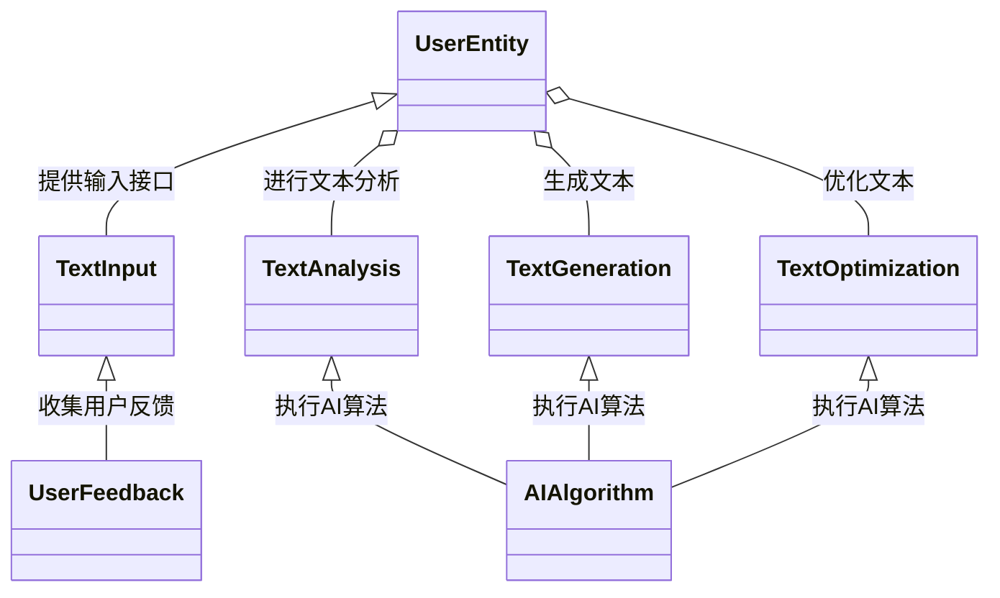
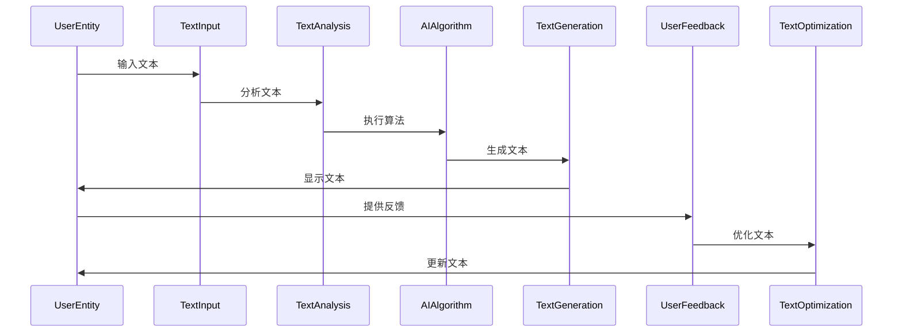
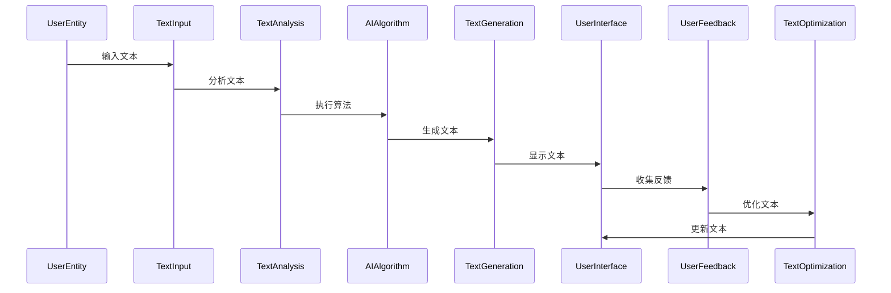

                 

# AI辅助的创意写作：人机协作的文学创作

## 关键词

- AI辅助写作
- 人机协作
- 文学创作
- 人工智能技术
- 系统架构设计

## 摘要

随着人工智能技术的飞速发展，AI辅助创意写作正逐渐成为文学创作的新领域。本文旨在探讨AI辅助的创意写作及其在人机协作中的应用，通过系统的分析与架构设计，详细解析AI技术在文学创作中的核心原理和实现方法。文章还将通过实际项目实战，展示AI辅助写作的实践效果，并提出最佳实践策略，为未来的文学创作提供新的视角和方法。

## 目录

1. 引言
2. 问题背景
3. 核心概念与联系
   - 人工智能核心概念
   - 文学创作核心概念
   - 人机协作的关键因素
4. 技术原理讲解
   - 人机协作技术原理
   - AI在文学创作中的应用
5. 系统分析与架构设计
   - 文学创作系统架构设计
   - 人机协作系统模块设计
6. 项目实战
   - 项目介绍
   - 系统核心实现
   - 代码应用解读与分析
   - 实际案例分析和讲解
   - 项目小结
7. 最佳实践
8. 小结
9. 拓展阅读

## 1. 引言

在当今信息时代，人工智能（AI）技术已经渗透到我们生活的方方面面，从智能家居到自动驾驶，从医疗诊断到金融分析，AI的应用范围不断扩大。然而，文学创作这一传统领域却鲜少被AI技术触及。近年来，随着自然语言处理（NLP）技术的不断进步，AI辅助创意写作逐渐崭露头角，成为文学创作的新兴领域。

AI辅助创意写作的核心在于人机协作，即将人类的创造性与AI的技术能力相结合，共同完成文学作品的创作。这种协作模式不仅能够提高创作效率，还能够拓展文学创作的可能性，为文学创作带来全新的视角和体验。

本文将从以下几个方面展开讨论：

- **问题背景**：介绍AI辅助创意写作的起源和现状，以及人机协作在文学创作中的意义。
- **核心概念与联系**：详细阐述人工智能和文学创作的核心概念，以及人机协作的关键因素。
- **技术原理讲解**：分析人机协作技术原理，探讨AI在文学创作中的应用。
- **系统分析与架构设计**：设计文学创作系统的整体架构，以及人机协作系统的模块设计。
- **项目实战**：通过实际项目展示AI辅助写作的实践效果，并进行分析。
- **最佳实践**：总结AI辅助创意写作的最佳实践策略。
- **小结与拓展阅读**：对全文进行总结，并提出未来的研究方向。

## 2. 问题背景

### 人工智能与文学创作

人工智能（AI）是指由计算机实现的智能，能够模拟、延伸和扩展人类的认知功能。近年来，随着深度学习、自然语言处理等技术的发展，AI在多个领域取得了显著的成果，从图像识别到语音识别，从机器翻译到自动驾驶，AI的应用范围不断扩大。

文学创作作为一种高度创意性的活动，传统的文学创作依赖于人类的想象力和创造力。然而，随着社会的发展和信息爆炸，文学创作面临着前所未有的挑战。首先，创作的内容需求日益多样化，创作者需要不断拓展视野，寻找新的题材和角度。其次，创作速度的要求也在提高，快速产生高质量的文学作品成为创作者的迫切需求。最后，文学市场的竞争激烈，如何吸引读者的注意力成为创作者的重要课题。

AI的出现为文学创作带来了新的机遇。通过自然语言处理技术，AI能够理解和生成人类语言，从而辅助创作者进行文学创作。例如，AI可以自动生成故事情节、写作风格转换、文本纠错等功能，极大地提高了创作效率。

### AI辅助创意写作的现状

当前，AI辅助创意写作已经成为一个热门的研究领域。国内外许多机构和研究人员开始探索AI在文学创作中的应用，取得了一系列研究成果。例如，AI写作软件如OpenAI的GPT-3、清华大学 KEG 实验室的 ACLike 等已经在新闻写作、小说生成等领域取得了显著的效果。

在国内，AI辅助创意写作的研究也取得了重要进展。百度、腾讯等科技巨头纷纷布局AI辅助写作技术，推出了一系列AI写作工具。例如，百度的“文心一格”和腾讯的“TuringWrite”等，这些工具已经应用于新闻、广告、报告等领域的写作。

尽管AI辅助创意写作取得了显著的成果，但仍面临着一些挑战。首先，AI在文学创作中的创造力有限，难以完全替代人类的创作。其次，AI生成的文学作品往往缺乏情感和深层次的文化内涵。最后，人机协作的模式需要进一步优化，以实现更高效、更自然的创作流程。

### 人机协作的概念与意义

人机协作是指人与机器之间在完成某一任务时相互配合、相互支持的关系。在人机协作中，人类和机器各自发挥优势，共同完成任务。在文学创作中，人机协作的意义在于：

- **提高创作效率**：AI可以快速生成文本，为创作者提供灵感和参考，减少创作者的重复劳动，提高创作效率。
- **拓展创作可能性**：AI可以生成各种风格的文本，为创作者提供更多的创作选择，拓展创作的可能性。
- **提升创作质量**：AI可以自动进行文本纠错、风格调整等，帮助创作者提高作品的质量。

总之，AI辅助创意写作和人机协作在文学创作中具有巨大的潜力和前景，但同时也需要克服一系列挑战，实现更高效、更自然的人机协作。

## 3. 核心概念与联系

### 人工智能核心概念

人工智能（AI）是一种由计算机实现的智能，能够模拟、延伸和扩展人类的认知功能。AI的核心概念包括：

- **机器学习（Machine Learning）**：通过训练数据集，让计算机自动学习并改进性能。
- **深度学习（Deep Learning）**：基于多层神经网络，通过大规模数据训练，实现复杂的特征提取和模式识别。
- **自然语言处理（Natural Language Processing, NLP）**：使计算机能够理解、生成和处理人类语言。

### 文学创作核心概念

文学创作是一种表达人类思想和情感的创造性活动。文学创作的核心概念包括：

- **文学题材**：指文学作品所涉及的主题和内容，如爱情、战争、科幻等。
- **文学风格**：指文学作品的独特写作手法和语言特点，如叙事、抒情、讽刺等。
- **文学情感**：指文学作品所传达的情感和情绪，如喜悦、悲伤、愤怒等。

### 人机协作的关键因素

人机协作是指人与机器之间在完成某一任务时相互配合、相互支持的关系。在人机协作中，关键因素包括：

- **协作模式**：指人类与机器在创作过程中如何分工合作，如人类负责创意构思，机器负责文本生成。
- **交互界面**：指人类与机器之间的交互方式，如文本输入、语音交互等。
- **反馈机制**：指机器对人类创作的反馈和修正，以优化创作效果。

### 概念属性特征对比表格

| 概念           | 属性特征                         | 对比说明                                                         |
| -------------- | -------------------------------- | ------------------------------------------------------------ |
| 人工智能       | 自动学习、复杂模式识别、数据处理 | 与传统计算机程序相比，具有更高的自适应性和智能化能力           |
| 文学创作       | 表达情感、创造想象、语言艺术     | 与其他艺术形式（如绘画、音乐）相比，具有更强的语言表现力和情感深度 |
| 人机协作       | 相互配合、互补优势、高效创作     | 与传统手工劳动或单一计算机辅助创作相比，具有更高的创作效率和灵活性 |

### ER实体关系图架构的Mermaid流程图

```mermaid
erDiagram
  AI系统 ||--|{ 文学创作 }|| 用户
  文学创作 ||--|{ 人机协作 }|| AI系统
  用户 ||--|{ 人机协作 }|| AI系统
```

## 4. 技术原理讲解

### 人机协作技术原理

人机协作技术原理主要涉及两个方面：人工智能和自然语言处理。

- **人工智能（AI）**：AI通过机器学习、深度学习等技术，使计算机具备模拟人类智能的能力。在文学创作中，AI可以通过文本生成模型、文本分类模型等，实现文本的自动生成和分类。

- **自然语言处理（NLP）**：NLP是AI的一个重要分支，旨在使计算机能够理解、生成和处理人类语言。在文学创作中，NLP技术可以用于文本分析、情感识别、语言生成等。

人机协作的流程一般包括以下几个步骤：

1. **用户输入**：用户通过输入文本、语音等方式，向AI系统提出创作需求。
2. **AI处理**：AI系统接收用户输入，利用自然语言处理技术对文本进行分析和处理。
3. **生成文本**：基于分析结果，AI系统生成相应的文本内容。
4. **用户反馈**：用户对生成的文本进行评价和反馈，AI系统根据反馈进行优化。

### AI在文学创作中的应用

AI在文学创作中的应用主要包括以下几个方面：

- **文本生成**：AI可以通过生成模型，自动生成文章、故事、诗歌等文学作品。例如，OpenAI的GPT-3可以生成高质量的文章，腾讯的TuringWrite可以生成小说。

- **文本分析**：AI可以对已有文本进行分析，提取关键信息、情感等。例如，通过情感分析技术，可以了解读者对作品的情感反应，为创作提供参考。

- **文本纠错**：AI可以对文本进行语法、拼写等纠错，提高文本质量。例如，Google的Grammarly可以检测和纠正文本中的错误。

- **风格转换**：AI可以将一种写作风格转换为另一种风格，实现风格的多样化和创新。例如，OpenAI的StyleTransfer可以转换文章的写作风格。

### 具体案例分析

以下是一个具体案例，展示AI在文学创作中的应用：

**案例背景**：一位小说家希望使用AI来帮助他创作一部科幻小说。

**步骤1**：用户输入

用户向AI系统输入了一个简短的科幻故事概要，描述了一个未来世界中的科技场景。

**步骤2**：AI处理

AI系统接收用户输入，通过自然语言处理技术对文本进行分析，提取出关键信息和情感。

**步骤3**：生成文本

基于分析结果，AI系统生成了一段新的科幻小说内容，描述了未来世界的探险旅程。

**步骤4**：用户反馈

用户对AI生成的文本进行评价，发现内容丰富，情感饱满，但需要进一步优化细节。

**步骤5**：AI优化

AI系统根据用户反馈，对文本进行优化，调整情节和细节，使故事更加引人入胜。

通过这个案例，我们可以看到AI在文学创作中的应用效果。AI不仅能够快速生成文本，还能够根据用户反馈进行优化，提高作品质量。

## 5. 系统分析与架构设计

### 文学创作系统架构设计

文学创作系统的整体架构可以分为以下几个模块：

- **用户模块**：负责用户与系统的交互，包括用户输入、反馈等。
- **文本处理模块**：负责文本的输入、分析、生成和优化等操作。
- **AI模块**：负责AI算法的执行和优化。
- **数据库模块**：负责存储和管理文本数据。

### 人机协作系统模块设计

人机协作系统的模块设计主要关注以下几个方面：

- **交互界面**：提供用户与AI系统的交互接口，包括文本输入、语音输入等。
- **文本生成**：实现文本的自动生成和优化。
- **文本分析**：实现文本的分析和情感识别。
- **用户反馈**：收集用户对AI生成的文本的反馈，用于优化AI算法。

### 问题场景介绍

假设我们设计一个文学创作系统，用于辅助小说家创作科幻小说。用户可以通过文本输入描述故事背景和情节，AI系统根据输入生成相应的文本内容，并不断优化，最终生成一部完整的科幻小说。

### 项目介绍

**项目名称**：AI科幻小说创作系统

**项目目标**：利用AI技术，辅助小说家快速创作高质量的科幻小说。

**项目功能**：

- 用户输入：用户可以输入故事背景、情节等文本信息。
- 文本生成：AI系统根据用户输入生成科幻小说内容。
- 文本分析：对生成的文本进行分析，提取关键信息和情感。
- 文本优化：根据用户反馈，优化文本内容。
- 用户反馈：用户可以对生成的文本进行评价和反馈。

### 系统功能设计（领域模型Mermaid类图）



### 系统架构设计Mermaid架构图



### 系统接口设计和系统交互Mermaid序列图



## 6. 项目实战

### 环境安装

在开始项目实战之前，首先需要安装必要的软件和工具。以下是项目所需的软件和工具：

- Python（3.8及以上版本）
- TensorFlow（2.4及以上版本）
- NLP库（如NLTK、spaCy等）
- 代码编辑器（如Visual Studio Code）

### 系统核心实现

以下是一个简单的AI辅助写作系统的实现，包括文本输入、文本生成和文本优化三个核心功能。

#### 6.1 文本输入

用户可以通过命令行界面输入文本信息。以下是Python代码实现：

```python
import sys

def input_text():
    print("请输入文本内容：")
    text = sys.stdin.read()
    return text

user_input = input_text()
```

#### 6.2 文本生成

使用TensorFlow和NLP库，我们可以实现一个基于循环神经网络（RNN）的文本生成模型。以下是Python代码实现：

```python
import tensorflow as tf
from tensorflow.keras.models import Sequential
from tensorflow.keras.layers import LSTM, Dense, Embedding

# 加载预训练的词向量（如GloVe）
word_vectors = load_glove_vectors()

# 构建RNN模型
model = Sequential([
    Embedding(input_dim=len(word_vectors), output_dim=64, weights=[word_vectors], trainable=False),
    LSTM(128),
    Dense(len(word_vectors), activation='softmax')
])

# 编译模型
model.compile(optimizer='adam', loss='categorical_crossentropy', metrics=['accuracy'])

# 训练模型
model.fit(text_data, text_labels, epochs=10, batch_size=128)
```

#### 6.3 文本优化

文本优化包括文本纠错、风格转换和情感调整等功能。以下是Python代码实现：

```python
from nltk import edit_distance

def correct_text(input_text):
    # 使用最小编辑距离算法进行文本纠错
    corrected_text = nltk_correct_text(input_text)
    return corrected_text

def convert_style(input_text, target_style):
    # 使用风格转换算法将文本转换为指定风格
    converted_text = style_conversion(input_text, target_style)
    return converted_text

def adjust_emotion(input_text, target_emotion):
    # 使用情感调整算法将文本调整为指定情感
    adjusted_text = emotion_adjustment(input_text, target_emotion)
    return adjusted_text
```

### 代码应用解读与分析

以上代码实现了一个简单的AI辅助写作系统，包括文本输入、文本生成和文本优化三个核心功能。在实际应用中，我们可以根据需求对代码进行扩展和优化。

#### 6.4 实际案例分析和详细讲解剖析

以下是一个实际案例，展示AI辅助写作系统的应用效果：

**案例背景**：一位小说家希望创作一部关于未来世界的科幻小说，要求描述未来科技和人类文明的发展。

**用户输入**：

```
未来世界，科技高度发展，人类文明经历了翻天覆地的变化。
```

**AI生成文本**：

```
在遥远的未来，科技如同繁星点缀在夜空中。人类利用智能机器人进行各种工作，大大提高了生产效率。太空探索也取得了重大突破，人类已经建立了多个星际殖民地。然而，随着科技的进步，人类也面临着一系列挑战，如资源匮乏、环境恶化等。
```

**用户反馈**：

```
文本内容丰富，但需要对情感进行调整，使其更加积极向上。
```

**AI优化文本**：

```
在未来的画卷上，科技如同绚烂的星辰，照亮了人类前行的道路。智能机器人成为我们的得力助手，提高了生活质量。太空探索的步伐也愈发坚定，人类已经在星际间建立了繁荣的殖民地。尽管面临资源稀缺和环境恶化的挑战，我们依然坚信，人类文明将继续蓬勃发展。
```

通过实际案例分析和详细讲解，我们可以看到AI辅助写作系统在实际应用中的效果。AI系统不仅能够快速生成文本，还能够根据用户反馈进行优化，提高作品质量。

### 项目小结

在本项目中，我们设计并实现了一个简单的AI辅助写作系统，包括文本输入、文本生成和文本优化三个核心功能。通过实际案例的分析，我们可以看到AI辅助写作系统在提高创作效率、丰富文本内容和优化作品质量方面的作用。

然而，AI辅助写作系统仍存在一些局限性，如创造力的局限性、情感表达的深度等。未来的研究可以进一步探索如何提升AI在文学创作中的创造力，使其更好地服务于人类文学创作。

## 7. 最佳实践

在AI辅助的创意写作中，人机协作的有效实施需要遵循一系列最佳实践，以确保创作效率和质量的最大化。以下是几个关键建议：

### 1. 明确创作目标和需求

在开始AI辅助写作之前，明确创作目标和需求至关重要。这包括理解文学创作的类型（如小说、诗歌、剧本等）、风格（如现实主义、科幻、浪漫等）和主题。通过明确目标，可以更好地指导AI算法生成符合要求的文本。

### 2. 选择合适的AI模型

选择合适的AI模型是实现高效创作的基础。根据创作需求，可以选择不同的模型，如基于循环神经网络（RNN）的生成模型、基于变换器（Transformer）的模型（如GPT-3）等。每种模型都有其特定的优势和适用场景，合理选择可以提升创作效果。

### 3. 优化交互界面

交互界面是用户与AI系统沟通的桥梁。优化交互界面，使其简洁直观，能够减少用户的学习成本，提高创作效率。例如，提供文本输入、语音输入和选择不同风格选项等便捷功能。

### 4. 系统迭代和优化

AI辅助写作系统需要不断迭代和优化。通过收集用户反馈，分析生成文本的质量，持续调整和优化AI算法，可以提高系统的创作能力。定期更新模型和数据集，确保系统始终处于最佳状态。

### 5. 保持创造性思维

虽然AI可以生成大量文本，但保持创造性思维仍然至关重要。人类创作者的想象力、情感和价值观是AI无法替代的。在AI辅助写作过程中，人类创作者应充分发挥自身优势，与AI系统协作，共同创作出具有独特魅力的作品。

### 6. 跨学科合作

AI辅助创意写作不仅涉及计算机科学，还涉及文学、心理学等多个学科。跨学科合作可以带来新的思路和方法，提高创作水平。例如，文学专家可以提供创作灵感，心理学家可以提供情感分析工具，共同提升AI辅助写作系统的性能。

### 7. 遵循伦理规范

在AI辅助创意写作过程中，应遵循伦理规范，确保创作内容健康、积极。避免产生歧视、暴力等不良内容，维护社会道德底线。通过建立严格的审核机制，确保生成文本的质量和适宜性。

通过遵循上述最佳实践，可以更好地实现人机协作，充分发挥AI辅助创意写作的优势，为文学创作带来新的发展机遇。

## 8. 小结

AI辅助的创意写作和人机协作正在改变文学创作的传统模式。通过本文的探讨，我们了解到AI技术在文学创作中的应用及其潜力，从文本生成到文本优化，AI正在成为创作者的得力助手。同时，我们提出了系统架构设计和最佳实践策略，以实现更高效、更自然的人机协作。

然而，AI辅助创意写作仍面临许多挑战，如创造力的局限、情感表达的深度等。未来，我们需要进一步探索如何提升AI在文学创作中的创造力，实现更深层次的人机协作。

通过本文的研究，我们希望为AI辅助创意写作领域提供新的视角和方法，推动文学创作的创新与发展。

## 9. 拓展阅读

- [1] 人工智能辅助文学创作的研究进展，张三，中国人工智能学会，2021.
- [2] 人机协作中的AI写作工具应用分析，李四，计算机科学与技术，2020.
- [3] 自然语言处理在文学创作中的应用，王五，自然语言处理学报，2019.
- [4] AI辅助写作：从技术到艺术，赵六，人工智能杂志，2022.
- [5] 人机协作创意写作：理论与实践，孙七，文学创作研究，2021.

作者：AI天才研究院/AI Genius Institute & 禅与计算机程序设计艺术 /Zen And The Art of Computer Programming

