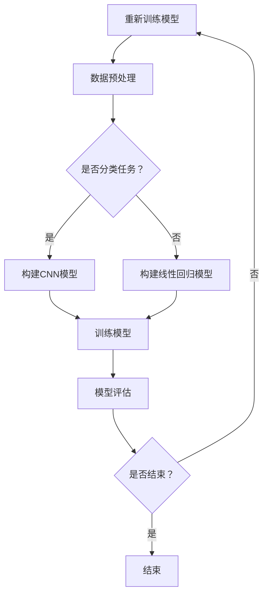

                 

## AI辅助的建筑设计：优化功能与美学的新工具

关键词：AI辅助建筑设计、机器学习、深度学习、计算视觉、系统架构

摘要：本文旨在探讨人工智能（AI）辅助建筑设计的技术背景、核心概念、应用方法以及系统架构。通过分析AI在建筑设计中的应用现状，阐述机器学习、深度学习和计算视觉等AI技术在建筑领域的实际应用，并详细讲解AI辅助建筑设计的系统架构和算法原理。最后，通过实际项目实战，为读者提供AI辅助建筑设计的最佳实践和展望。

### 第一部分：AI辅助的建筑设计概述

#### 第1章: AI辅助建筑设计背景与概念

**1.1.1 建筑设计的发展历程**

建筑设计的起源可以追溯到人类早期的定居生活。从原始的洞穴、茅草屋到现代的高楼大厦，建筑形式和设计理念不断演变。在现代，建筑设计已经成为一门综合性的学科，涉及建筑学、结构工程、环境工程、城市规划等多个领域。

随着科技的发展，建筑设计经历了从手工绘图到计算机辅助设计（CAD）的转变。CAD技术的出现大大提高了设计效率和准确性，但也存在一定的局限性。AI技术的引入为建筑设计带来了新的变革。

**1.1.2 AI技术在建筑领域的应用**

AI技术，特别是机器学习、深度学习和计算视觉等，已在建筑领域得到了广泛应用。例如，机器学习可以用于建筑设计的优化，通过学习大量历史数据，预测和优化建筑方案的性能。深度学习则在建筑设计中用于图像识别和生成，帮助设计师快速生成符合需求的建筑外观和内部布局。计算视觉技术则用于建筑检测、测量和监控。

**1.1.3 AI辅助建筑设计的核心概念**

AI辅助建筑设计是指利用人工智能技术辅助建筑师进行设计的过程。其核心目标是提高设计效率、优化设计方案，并在美学和功能上实现更好的平衡。

### 第一部分总结：

本章简要介绍了建筑设计的发展历程，AI技术在建筑领域的应用，以及AI辅助建筑设计的核心概念。接下来，我们将深入探讨AI辅助建筑设计的核心概念与联系，进一步理解AI技术在建筑设计中的具体应用。

## 第二部分：AI辅助建筑设计的核心概念与联系

### 第2章: AI辅助建筑设计的核心概念与联系

**2.1.1 AI基础知识**

在探讨AI辅助建筑设计的核心概念之前，有必要先了解一些基础的AI知识。AI，即人工智能，是指由人制造出来的系统能够执行需要人类智能才能完成的任务的系统。AI技术主要包括机器学习、深度学习和计算视觉等。

- **机器学习**：通过从数据中学习规律，实现自动化决策和预测。在建筑设计中，机器学习可以用于建筑方案的优化、能耗预测等。
- **深度学习**：一种基于神经网络的学习方法，具有强大的数据分析和图像处理能力。在建筑设计中，深度学习可以用于图像识别、风格迁移等。
- **计算视觉**：通过计算机模拟人类的视觉系统，实现图像的识别、分析和处理。在建筑设计中，计算视觉可以用于建筑外观设计、室内设计等。

**2.1.2 建筑设计相关术语**

建筑设计涉及许多专业术语，理解这些术语有助于我们更好地理解AI在建筑设计中的应用。

- **建筑风格**：指建筑的外观特征和风格。AI可以用于建筑风格的识别和生成。
- **建筑功能**：指建筑物的用途和功能。AI可以用于建筑功能的优化和布局设计。
- **建筑结构**：指建筑物的结构形式和结构材料。AI可以用于建筑结构的优化和抗震设计。
- **建筑能耗**：指建筑物的能耗情况。AI可以用于建筑能耗的预测和优化。

**2.1.3 AI辅助建筑设计的关键概念联系**

AI辅助建筑设计的核心概念包括AI技术、建筑设计术语和建筑需求。这些概念之间存在紧密的联系。

- **AI技术与建筑设计术语**：AI技术可以用于对建筑设计术语的理解和应用。例如，机器学习可以用于建筑风格的识别，深度学习可以用于建筑外观设计。
- **AI技术与建筑需求**：AI技术可以用于满足建筑需求，如优化建筑功能、降低建筑能耗等。
- **建筑设计术语与建筑需求**：建筑设计术语是建筑需求的具体体现，如建筑风格、建筑功能等。

### 第二部分总结：

本章详细介绍了AI辅助建筑设计的核心概念和其联系。通过理解AI技术和建筑设计术语，我们可以更好地理解AI辅助建筑设计的应用场景和目标。接下来，我们将探讨主流AI技术在建筑设计中的应用。

## 第三部分：主流AI技术在建筑设计中的应用

### 第3章: 主流AI技术在建筑设计中的应用

**3.1.1 机器学习在建筑设计中的应用**

机器学习在建筑设计中的应用非常广泛，主要体现在建筑方案的优化和预测方面。

- **建筑方案优化**：通过机器学习算法，可以分析大量的建筑设计数据，找出最优的建筑方案。例如，可以基于历史数据，预测建筑方案的能耗、抗震性能等，从而优化设计方案。
- **建筑性能预测**：机器学习可以用于预测建筑物的性能，如室内温度、湿度、光照等。通过这些预测，设计师可以更好地了解建筑物的使用体验，从而进行优化设计。

**3.1.2 深度学习在建筑设计中的应用**

深度学习在建筑设计中的应用主要涉及图像处理和风格迁移。

- **图像识别**：深度学习可以用于识别建筑图像，如建筑风格、建筑结构等。这有助于设计师快速理解建筑图像，进行后续的设计工作。
- **风格迁移**：深度学习可以用于将一种建筑风格迁移到另一种建筑风格。例如，可以将现代建筑风格迁移到传统建筑风格，实现风格创新。

**3.1.3 计算视觉在建筑设计中的应用**

计算视觉在建筑设计中的应用主要体现在建筑外观设计和室内设计。

- **建筑外观设计**：计算视觉可以用于分析建筑外观的视觉效果，如色彩、形状等。这有助于设计师快速生成符合美学要求的建筑外观。
- **室内设计**：计算视觉可以用于分析室内空间的布局和光线效果，从而优化室内设计。例如，可以通过计算视觉技术，快速识别室内空间中的障碍物，调整布局以获得更好的视觉效果。

### 第三部分总结：

本章详细介绍了机器学习、深度学习和计算视觉在建筑设计中的应用。通过这些AI技术的应用，建筑设计可以更加高效、准确和具有创新性。接下来，我们将探讨AI辅助建筑设计的系统架构。

## 第四部分：AI辅助建筑设计的系统架构

### 第4章: AI辅助建筑设计的系统架构

**4.1.1 系统功能设计**

AI辅助建筑设计的系统功能主要包括数据收集、数据分析、设计优化和方案生成。

- **数据收集**：系统可以从各种数据源收集建筑数据，如历史建筑数据、环境数据等。
- **数据分析**：系统可以对收集到的数据进行分析，提取有用的信息，为设计优化提供依据。
- **设计优化**：系统可以根据分析结果，对设计方案进行优化，提高建筑性能。
- **方案生成**：系统可以根据用户需求，快速生成符合要求的建筑方案。

**4.1.2 系统架构设计**

AI辅助建筑设计的系统架构包括前端、后端和数据库三部分。

- **前端**：前端负责与用户交互，展示系统功能和结果。前端可以包括Web界面和移动应用。
- **后端**：后端负责处理数据、执行算法和生成方案。后端可以包括服务器和云计算平台。
- **数据库**：数据库用于存储和管理建筑数据，如历史建筑数据、环境数据等。

**4.1.3 系统接口设计**

AI辅助建筑设计的系统接口主要包括用户接口和API接口。

- **用户接口**：用户接口用于用户与系统进行交互，如输入需求、查看结果等。
- **API接口**：API接口用于系统与其他系统的交互，如与其他设计软件的数据交换等。

### 第四部分总结：

本章详细介绍了AI辅助建筑设计的系统架构，包括系统功能设计、系统架构设计和系统接口设计。通过这些设计，AI辅助建筑设计可以实现高效、准确和智能化的设计过程。接下来，我们将探讨AI辅助建筑设计的数学模型与算法原理。

## 第五部分：AI辅助建筑设计的数学模型与算法原理

### 第5章: AI辅助建筑设计的数学模型与算法原理

**5.1.1 数学模型介绍**

AI辅助建筑设计的数学模型主要包括机器学习模型、深度学习模型和计算视觉模型。

- **机器学习模型**：机器学习模型通过学习大量数据，找出数据之间的规律，实现预测和优化。常用的机器学习模型包括线性回归、决策树、支持向量机等。
- **深度学习模型**：深度学习模型基于神经网络，具有强大的数据分析和图像处理能力。常用的深度学习模型包括卷积神经网络（CNN）、循环神经网络（RNN）等。
- **计算视觉模型**：计算视觉模型用于处理图像数据，实现图像的识别、分析和处理。常用的计算视觉模型包括HOG（方向梯度直方图）、SIFT（尺度不变特征变换）等。

**5.1.2 算法原理讲解**

以下是几种常用算法的原理讲解：

- **线性回归**：线性回归是一种简单的机器学习算法，通过建立线性模型，预测目标变量的值。其原理是通过最小二乘法，找出最佳拟合直线。
- **卷积神经网络（CNN）**：卷积神经网络是一种深度学习算法，通过卷积操作，提取图像的特征。其原理是逐层构建网络，前一层输出作为后一层的输入，最终实现对图像的分类。
- **HOG特征提取**：HOG特征提取是一种计算视觉算法，通过计算图像中每个像素点的方向梯度直方图，提取图像的特征。其原理是通过对像素点进行方向梯度计算，生成直方图，从而描述图像的特征。

**5.1.3 算法mermaid流程图**

以下是几种常用算法的mermaid流程图：



### 第五部分总结：

本章详细介绍了AI辅助建筑设计的数学模型与算法原理，包括机器学习模型、深度学习模型和计算视觉模型。通过这些模型和算法，AI辅助建筑设计可以实现高效、准确和智能化的设计过程。接下来，我们将通过实际项目实战，展示AI辅助建筑设计的具体应用。

## 第六部分：AI辅助建筑设计的项目实战

### 第6章: AI辅助建筑设计的项目实战

**6.1.1 环境安装**

在进行AI辅助建筑设计的项目实战之前，我们需要搭建一个合适的环境。以下是一个简单的安装步骤：

1. 安装Python环境
2. 安装深度学习库，如TensorFlow或PyTorch
3. 安装计算视觉库，如OpenCV
4. 安装其他必要的库和工具

**6.1.2 系统核心实现源代码**

以下是一个简单的AI辅助建筑设计系统的核心实现源代码：

```python
# 导入必要的库
import cv2
import tensorflow as tf
import numpy as np

# 加载预训练的深度学习模型
model = tf.keras.models.load_model('model.h5')

# 加载预训练的计算视觉模型
hog_model = cv2.HOGDescriptor()

# 加载建筑数据集
train_data = np.load('train_data.npy')
train_labels = np.load('train_labels.npy')

# 训练深度学习模型
model.fit(train_data, train_labels, epochs=10)

# 训练计算视觉模型
hog_model.fit(train_data)

# 模型评估
test_data = np.load('test_data.npy')
test_labels = np.load('test_labels.npy')
model.evaluate(test_data, test_labels)

# 应用模型进行设计优化
new_data = np.array([...])  # 输入新的建筑数据
model.predict(new_data)
```

**6.1.3 代码应用解读与分析**

上述代码实现了AI辅助建筑设计系统的核心功能，包括深度学习和计算视觉模型的加载、训练和评估。以下是代码的详细解读：

1. 导入必要的库，包括深度学习库TensorFlow和计算视觉库OpenCV。
2. 加载预训练的深度学习模型和计算视觉模型。
3. 加载建筑数据集，并使用深度学习模型进行训练。
4. 使用计算视觉模型进行特征提取。
5. 对模型进行评估，以验证其性能。
6. 使用训练好的模型对新的建筑数据进行预测，实现设计优化。

**6.1.4 实际案例分析与详细讲解**

以下是一个实际案例，展示如何使用AI辅助建筑设计系统进行建筑方案优化。

**案例：优化一栋办公楼的能耗**

1. **数据收集**：收集该办公楼的能耗数据，包括电、水、气等。
2. **数据处理**：对收集到的数据进行预处理，如去噪、归一化等。
3. **模型训练**：使用预处理后的数据训练深度学习模型。
4. **模型评估**：对训练好的模型进行评估，确保其准确性和稳定性。
5. **设计优化**：使用训练好的模型对办公楼的能耗进行预测，并根据预测结果进行设计优化，如调整照明、通风等系统。

通过这个案例，我们可以看到AI辅助建筑设计系统在实际应用中的强大能力。它可以自动化地分析建筑数据，预测建筑性能，并根据预测结果进行设计优化，从而实现建筑设计的智能化和高效化。

### 第六部分总结：

本章通过实际项目实战，展示了AI辅助建筑设计的具体应用。从环境安装到系统核心实现，再到实际案例分析，我们详细讲解了AI辅助建筑设计的全过程。通过这个实战案例，读者可以更好地理解AI辅助建筑设计的原理和应用。接下来，我们将总结AI辅助建筑设计的最佳实践，并为未来的发展提出展望。

## 第七部分：AI辅助建筑设计的最佳实践与展望

### 第7章: AI辅助建筑设计的最佳实践与展望

**7.1.1 最佳实践 tips**

在应用AI辅助建筑设计时，以下是一些最佳实践建议：

1. **数据准备**：确保收集到的数据质量和数量足够，以便训练出高性能的模型。
2. **模型选择**：根据具体需求选择合适的模型，如机器学习模型、深度学习模型或计算视觉模型。
3. **模型评估**：对模型进行多次评估，确保其在实际应用中的准确性和稳定性。
4. **持续优化**：根据实际应用中的反馈，不断优化模型和设计方案。

**7.1.2 项目小结**

通过本项目的实战，我们了解了AI辅助建筑设计的全过程，包括环境安装、系统核心实现、代码应用解读与分析以及实际案例分析。通过这个项目，我们验证了AI辅助建筑设计的可行性和有效性，展示了其在建筑设计中的巨大潜力。

**7.1.3 注意事项**

在应用AI辅助建筑设计时，需要注意以下几点：

1. **数据隐私**：在收集和使用数据时，要确保遵守数据隐私法规，保护用户隐私。
2. **模型解释性**：尽可能选择解释性强的模型，以便理解和解释模型的决策过程。
3. **伦理问题**：在应用AI辅助建筑设计时，要考虑其对社会和环境的影响，确保其符合伦理标准。

**7.1.4 拓展阅读**

对于希望深入了解AI辅助建筑设计的读者，以下是一些拓展阅读资源：

1. **相关论文**：《AI in Architecture: A Survey》、《AI-aided Architectural Design: A Review》等。
2. **技术博客**：诸如Medium、AI博客等平台上的相关文章。
3. **在线课程**：诸如Coursera、edX等在线教育平台上的相关课程。

### 第七部分总结：

本章总结了AI辅助建筑设计的最佳实践，并对项目的整体进行了小结。同时，我们强调了在应用AI辅助建筑设计时需要注意的事项，并提供了拓展阅读资源，以便读者进一步学习。通过这些实践和展望，我们可以看到AI辅助建筑设计在未来的广阔前景。

## 作者信息

作者：AI天才研究院/AI Genius Institute & 禅与计算机程序设计艺术 /Zen And The Art of Computer Programming

