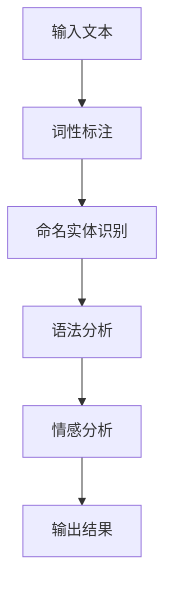
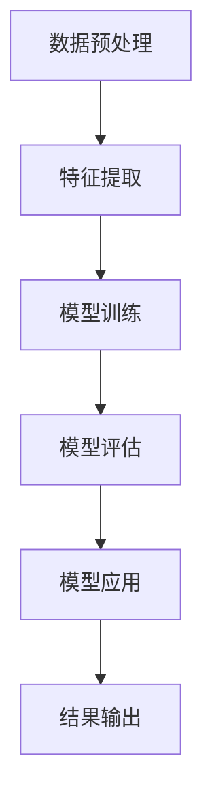
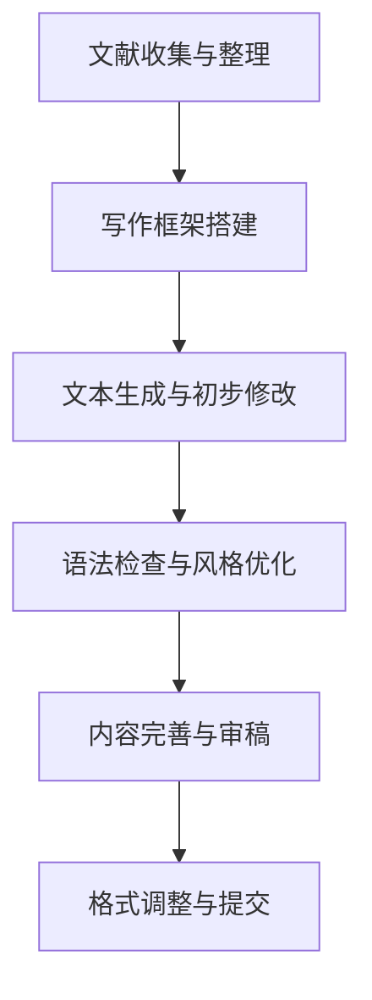
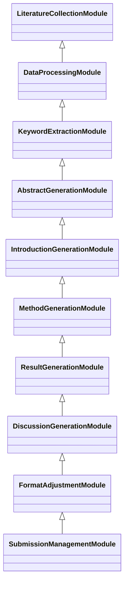
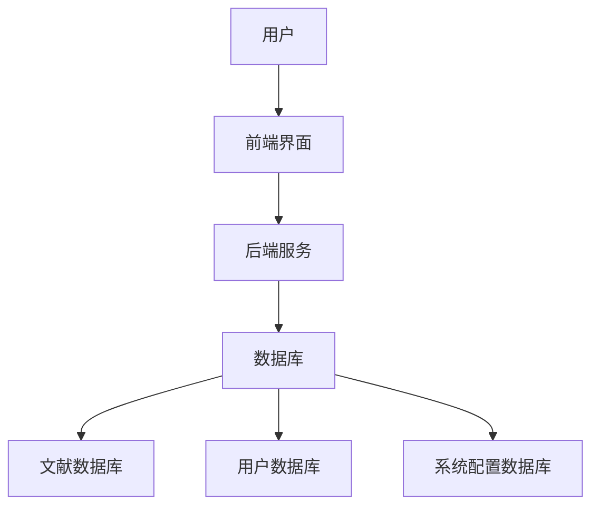

                 

### 文章标题：AI辅助的科学论文写作：提高研究效率的新工具

> 关键词：AI、科学论文写作、自然语言处理、机器学习、深度学习、工具应用、系统架构

> 摘要：随着科研竞争的日益激烈，提高科学论文写作的效率和质量成为科研人员关注的焦点。本文深入探讨了AI辅助科学论文写作的核心概念、原理和实际应用，并通过详细的案例分析，展示了AI工具如何帮助科研人员提高写作效率，降低写作难度。文章旨在为科研人员提供一套完整的AI辅助写作实践指南，以实现高效、创新的科学论文写作。

### 目录大纲：

1. **问题背景与核心概念**
    1.1 科学论文写作的挑战
    1.2 AI辅助科学论文写作的边界与外延
    1.3 核心概念与联系
    
2. **AI辅助科学论文写作的原理**
    2.1 自然语言处理
    2.2 机器学习与深度学习
    2.3 AI辅助论文写作的数学模型
    
3. **AI辅助科学论文写作的工具与实践**
    3.1 主流AI辅助写作工具
    3.2 AI辅助写作流程
    
4. **系统架构设计**
    4.1 问题场景介绍
    4.2 系统功能设计
    4.3 系统架构设计
    4.4 系统接口设计和系统交互
    
5. **项目实战**
    5.1 环境安装
    5.2 系统核心实现
    5.3 代码应用解读与分析
    5.4 实际案例分析与详细讲解
    5.5 项目小结
    
6. **最佳实践与注意事项**
    6.1 最佳实践技巧
    6.2 注意事项
    
7. **拓展阅读与未来展望**
    7.1 拓展阅读
    7.2 未来展望

---

### 第1章 问题背景与核心概念

#### 1.1 科学论文写作的挑战

科学论文写作是科研工作的重要组成部分，它不仅是学术交流的重要手段，也是评价科研人员学术水平和成果的重要依据。然而，随着科研领域的不断扩大和学术竞争的加剧，科学论文写作面临着诸多挑战：

1. **高效性**：科研人员通常需要花费大量时间来撰写论文，而时间压力往往导致写作效率低下。
2. **准确性**：科学论文要求语言精确、表述清晰，任何细微的错误都可能导致误解或被同行质疑。
3. **创新性**：论文需要展示科研成果的创新性，这要求科研人员不仅要对研究领域有深入理解，还需要有敏锐的洞察力和创新思维。

为了解决这些问题，科研人员一直在寻找提高论文写作效率和质量的方法。而近年来，随着人工智能技术的飞速发展，AI辅助科学论文写作逐渐成为可能。通过AI技术，可以大幅提高论文写作的效率，降低写作难度，同时确保论文的准确性和创新性。

#### 1.2 AI辅助科学论文写作的边界与外延

AI辅助科学论文写作的边界主要指AI技术在论文写作中的应用范围。具体来说，AI技术可以应用于以下环节：

1. **文本生成**：AI可以通过自然语言处理技术生成论文的摘要、引言、方法、结果和讨论等部分。
2. **语法检查**：AI可以帮助科研人员检查论文中的语法错误，确保语言表达准确无误。
3. **参考文献管理**：AI可以自动整理参考文献，确保引用格式正确。
4. **格式调整**：AI可以根据期刊要求自动调整论文格式。

而AI辅助科学论文写作的外延则包括AI技术与其他研究工具的整合。例如，AI可以与文献管理软件（如EndNote、Mendeley）结合，实现文献的自动整理和引用。此外，AI还可以与科研协作工具（如Overleaf）结合，实现多人协作写作和实时更新。

#### 1.3 核心概念与联系

AI辅助科学论文写作的核心概念包括自然语言处理（NLP）、机器学习（ML）和深度学习（DL）。

1. **自然语言处理（NLP）**：NLP是AI的一个分支，主要研究如何让计算机理解和生成自然语言。在论文写作中，NLP可以用于自动生成论文摘要、检查语法错误等。
   
2. **机器学习（ML）**：ML是AI的另一个重要分支，通过数据训练模型，使计算机能够从数据中学习并做出决策。在论文写作中，ML可以用于自动分类文献、生成关键词等。

3. **深度学习（DL）**：DL是ML的一种特殊形式，它使用神经网络模拟人脑的决策过程。在论文写作中，DL可以用于生成论文结构、自动撰写段落等。

这些核心概念之间的联系在于它们共同构成了AI辅助科学论文写作的基础。例如，NLP可以用于理解和生成文本，而ML和DL则可以用于训练模型，从而实现自动写作和智能修改。

---

在接下来的章节中，我们将深入探讨AI辅助科学论文写作的原理、工具与实践，并通过实际案例进行分析，以帮助科研人员更好地利用AI技术提高论文写作效率和质量。让我们一步一步深入这个充满潜力的领域。<!-- 在此进行一个简单的过渡，进入下一章的内容 -->

### 第2章 AI辅助科学论文写作的原理

在了解了AI辅助科学论文写作的核心概念和挑战之后，接下来我们将深入探讨其背后的原理。这一章将重点介绍自然语言处理（NLP）、机器学习（ML）和深度学习（DL）的基本概念，以及它们在科学论文写作中的应用。

#### 2.1 自然语言处理

自然语言处理（NLP）是人工智能的一个分支，它旨在让计算机能够理解、生成和处理人类语言。在科学论文写作中，NLP技术可以用于以下几个方面：

1. **文本分析**：NLP可以分析论文的文本内容，提取关键信息，如关键词、主题句等。这有助于科研人员快速了解论文的核心内容。
2. **语法检查**：NLP可以检测论文中的语法错误，如拼写错误、标点符号错误等，从而提高论文的准确性。
3. **文本生成**：NLP可以生成论文的摘要、引言、方法、结果和讨论等部分。通过训练大量论文数据，AI模型可以学会如何撰写不同部分的文本。

下面是一个简单的NLP技术属性特征对比表格：

| **技术** | **特点** | **适用场景** |
| :------: | :------: | :----------: |
| 词性标注 | 对文本中的词进行分类 | 摘要生成、关键词提取 |
| 命名实体识别 | 识别文本中的命名实体（如人名、地名、机构名等） | 摘要生成、文献引用 |
| 语法分析 | 解析文本的语法结构 | 语法检查、文本生成 |
| 情感分析 | 分析文本的情感倾向 | 结果与讨论部分撰写 |

为了更好地理解NLP的应用，我们可以使用Mermaid绘制一个简单的流程图：



#### 2.2 机器学习与深度学习

机器学习（ML）和深度学习（DL）是AI的重要组成部分，它们通过训练模型来学习数据特征，从而实现特定任务。在科学论文写作中，ML和DL可以用于以下几个方面：

1. **文本分类**：通过训练模型，可以将论文中的文本分类为不同的类型（如方法、结果、讨论等），从而实现自动段落划分。
2. **关键词提取**：利用机器学习算法，可以从论文中提取关键信息，形成关键词列表，有助于论文的索引和检索。
3. **文本生成**：深度学习模型（如生成对抗网络GAN和变分自编码器VAE）可以生成高质量的文本，用于论文的摘要、引言、方法等部分。

下面是一个简单的机器学习算法流程图：



#### 2.3 AI辅助论文写作的数学模型

在AI辅助科学论文写作中，数学模型起着至关重要的作用。以下是一些常用的数学模型及其在论文写作中的应用：

1. **文本分类模型**：常用的文本分类模型包括朴素贝叶斯（Naive Bayes）、支持向量机（SVM）和深度学习模型（如卷积神经网络CNN和长短期记忆网络LSTM）。
2. **关键词提取模型**：TF-IDF是一种常用的关键词提取模型，它通过计算词频（TF）和逆文档频率（IDF）来评估词的重要性。
3. **文本生成模型**：生成对抗网络（GAN）和变分自编码器（VAE）是常用的文本生成模型，它们可以通过训练大量文本数据生成高质量的文本。

下面是一个简单的文本分类模型的数学公式示例：

$$
\hat{y} = \text{sign}(\sigma(W \cdot \text{vec}(x) + b))
$$

其中，$\hat{y}$是预测标签，$x$是输入特征向量，$W$是权重矩阵，$b$是偏置项，$\sigma$是激活函数（通常为Sigmoid函数或ReLU函数）。

通过以上对自然语言处理、机器学习和深度学习以及相关数学模型的分析，我们可以看到AI技术在科学论文写作中具有巨大的应用潜力。在接下来的章节中，我们将进一步探讨AI辅助科学论文写作的工具与实践，并通过实际案例进行详细讲解。让我们继续深入这一领域，探索更多可能性。<!-- 在此进行一个简单的过渡，进入下一章的内容 -->

### 第3章 AI辅助科学论文写作的工具与实践

在前一章中，我们探讨了AI辅助科学论文写作的原理。在本章中，我们将介绍一些主流的AI辅助写作工具，并详细讨论如何利用这些工具来提高论文写作的效率。

#### 3.1 主流AI辅助写作工具

目前市场上存在许多AI辅助写作工具，这些工具各具特色，能够帮助科研人员解决不同方面的写作问题。以下是一些主流的AI辅助写作工具：

1. **Grammarly**：Grammarly是一款强大的语法检查工具，它能够检测并修正语法错误、拼写错误和标点错误。此外，Grammarly还提供了写作风格建议和同义词替换功能，有助于提高论文的语言质量。
   
2. **Overleaf**：Overleaf是一个在线协同写作平台，它支持多种文档格式，包括LaTeX。Overleaf提供了丰富的模板和排版工具，可以帮助科研人员快速搭建论文框架，并方便多人协作。

3. **EndNote**：EndNote是一款文献管理软件，它能够自动整理和格式化参考文献。EndNote支持多种文献数据库，并可以与Word等文字处理软件无缝集成，极大提高了科研人员管理参考文献的效率。

4. **GPT-3**：GPT-3（Generative Pre-trained Transformer 3）是OpenAI开发的强大语言模型，它可以生成高质量的自然语言文本，包括论文摘要、引言、方法等部分。GPT-3可以作为一个API使用，方便科研人员将其集成到自己的写作流程中。

#### 3.2 AI辅助写作流程

要充分利用AI辅助写作工具，科研人员需要建立一套高效的写作流程。以下是一个典型的AI辅助写作流程：

1. **文献收集与整理**：使用EndNote等文献管理工具收集相关文献，并进行整理和分类。

2. **写作框架搭建**：使用Overleaf等工具搭建论文框架，并创建各章节的初步内容。

3. **文本生成与初步修改**：利用GPT-3等AI工具生成论文的摘要、引言、方法、结果和讨论等部分，并进行初步修改。

4. **语法检查与风格优化**：使用Grammarly等工具对论文进行语法检查和风格优化，确保语言表达准确、流畅。

5. **内容完善与审稿**：在AI工具辅助下，科研人员可以进一步完善论文内容，并进行多轮审稿和修改。

6. **格式调整与提交**：根据期刊要求，使用AI工具调整论文格式，并最终提交。

以下是一个使用Mermaid绘制的AI辅助写作流程图：



#### 3.3 实践指导

为了更好地利用AI辅助写作工具，科研人员可以遵循以下实践指导：

1. **熟悉工具**：在开始使用AI辅助写作工具之前，科研人员需要熟悉这些工具的功能和操作方法。可以通过官方文档、教程和社区讨论来学习。

2. **合理使用**：AI辅助写作工具虽然强大，但并不能完全替代人类的创造力。科研人员应该将其作为辅助工具，而不是替代自己的思考。

3. **定期更新**：AI技术不断发展，AI辅助写作工具也会不断更新。科研人员应该定期检查并更新自己的工具，以获取最新的功能和优化。

4. **多轮修改**：利用AI辅助写作工具生成的文本只是初步结果，科研人员需要在此基础上进行多轮修改和完善，以确保论文的质量。

通过以上实践指导，科研人员可以更高效地利用AI辅助写作工具，提高论文写作的效率和质量。在下一章中，我们将进一步探讨AI辅助科学论文写作的系统架构设计。让我们继续深入这个充满潜力的领域。<!-- 在此进行一个简单的过渡，进入下一章的内容 -->

### 第4章 系统架构设计

在前一章中，我们介绍了AI辅助科学论文写作的工具与实践。在本章中，我们将深入探讨AI辅助科学论文写作的系统架构设计。系统架构设计是确保AI辅助科学论文写作系统能够高效、稳定运行的关键。

#### 4.1 问题场景介绍

科学论文写作涉及多个环节，包括文献收集、数据整理、论文撰写、格式调整和提交等。为了满足这些需求，我们需要设计一个全面、灵活的AI辅助系统。该系统应具备以下功能：

1. **文献收集与整理**：自动收集相关领域的文献，并进行分类整理。
2. **数据整理**：对收集到的数据进行清洗、处理和分析，提取有用信息。
3. **论文撰写**：利用AI技术生成论文的不同部分，如摘要、引言、方法、结果和讨论。
4. **格式调整**：根据期刊要求自动调整论文格式。
5. **提交与管理**：将完成的论文提交到相关平台，并实时更新和管理论文状态。

#### 4.2 系统功能设计

为了实现上述功能，我们需要设计一个功能完整的系统。以下是一个简化的系统功能设计：

1. **文献收集模块**：负责自动收集相关领域的文献，可以从多个数据库和搜索引擎中获取文献信息。
2. **数据整理模块**：对收集到的文献进行清洗、去重和处理，提取有用信息，如关键词、摘要等。
3. **论文撰写模块**：利用AI技术生成论文的不同部分。这一模块可以细分为摘要生成、引言生成、方法生成、结果生成和讨论生成等子模块。
4. **格式调整模块**：根据期刊要求自动调整论文格式，包括字体、段落、引用格式等。
5. **提交与管理模块**：将完成的论文提交到相关平台，并实时更新和管理论文状态。

以下是一个使用Mermaid绘制的系统功能设计领域模型类图：



#### 4.3 系统架构设计

在系统架构设计方面，我们需要确保系统的稳定性、可扩展性和高效性。以下是一个简化的系统架构设计：

1. **前端界面**：提供用户与系统交互的界面，包括文献收集、数据整理、论文撰写、格式调整和提交等功能。
2. **后端服务**：负责处理用户请求，执行具体任务，包括文献收集、数据整理、AI文本生成、格式调整和提交等。
3. **数据库**：存储文献数据、用户数据和系统配置信息。

以下是一个使用Mermaid绘制的系统架构图：



#### 4.4 系统接口设计和系统交互

在系统接口设计方面，我们需要设计清晰、简洁的接口，以方便前后端交互。以下是一个简化的系统接口设计：

1. **API接口**：提供RESTful API接口，供前端调用，实现文献收集、数据整理、文本生成、格式调整和提交等功能。
2. **消息队列**：使用消息队列（如RabbitMQ）实现异步任务处理，提高系统性能和稳定性。

以下是一个使用Mermaid绘制的系统接口设计和系统交互序列图：

```mermaid
sequenceDiagram
    participant User
    participant Frontend
    participant Backend
    participant Database
    participant LiteratureDB
    participant UserDB
    participant SystemConfigDB

    User->>Frontend: 发起请求
    Frontend->>Backend: 请求处理
    Backend->>Database: 数据查询/更新
    Database->>Backend: 返回数据
    Backend->>Frontend: 返回结果
    Frontend->>User: 显示结果

    note over Backend,SystemConfigDB
        Backend调用SystemConfigDB获取系统配置
    end
```

通过以上系统架构设计，我们可以确保AI辅助科学论文写作系统能够高效、稳定地运行，满足科研人员的需求。在下一章中，我们将通过一个实际项目实战，进一步展示如何利用AI技术提高科学论文写作的效率。让我们继续深入这一领域。<!-- 在此进行一个简单的过渡，进入下一章的内容 -->

### 第5章 项目实战

在前几章中，我们详细介绍了AI辅助科学论文写作的原理、工具和实践，以及系统架构设计。为了更好地理解这些概念的实际应用，本章我们将通过一个实际项目实战，展示如何利用AI技术提高科学论文写作的效率。

#### 5.1 环境安装

在进行项目实战之前，我们需要安装一些必要的软件和工具。以下是推荐的安装步骤：

1. **安装Python**：Python是AI技术的主要编程语言。请访问Python官方网站（https://www.python.org/）下载并安装Python。

2. **安装Jupyter Notebook**：Jupyter Notebook是一种交互式计算环境，非常适合用于数据分析和机器学习项目。可以通过pip命令安装：

   ```
   pip install notebook
   ```

3. **安装AI库**：安装一些常用的AI库，如TensorFlow、PyTorch、scikit-learn等。这些库提供了丰富的机器学习和深度学习功能。

   ```
   pip install tensorflow
   pip install pytorch
   pip install scikit-learn
   ```

4. **安装AI辅助写作工具**：安装Grammarly、Overleaf、EndNote等AI辅助写作工具。这些工具可以在其官方网站上下载并安装。

5. **安装其他依赖**：根据具体项目需求，可能还需要安装其他依赖库和工具。可以通过pip命令安装：

   ```
   pip install matplotlib
   pip install numpy
   pip install pandas
   ```

安装完成后，我们就可以开始搭建项目环境，进行实际的AI辅助科学论文写作项目。

#### 5.2 系统核心实现

在本节中，我们将展示如何使用Python实现一个简单的AI辅助科学论文写作系统。以下是一个简化的系统核心实现：

1. **文本预处理**：首先，我们需要对论文文本进行预处理，包括文本清洗、分词、去除停用词等。以下是一个简单的文本预处理脚本：

   ```python
   import re
   import nltk
   from nltk.corpus import stopwords
   
   def preprocess_text(text):
       # 清洗文本
       text = re.sub(r'\W+', ' ', text)
       text = re.sub(r'\s+', ' ', text)
       text = text.lower()
       
       # 分词
       tokens = nltk.word_tokenize(text)
       
       # 去除停用词
       stop_words = set(stopwords.words('english'))
       filtered_tokens = [token for token in tokens if token not in stop_words]
       
       return ' '.join(filtered_tokens)
   ```

2. **文本分类**：接下来，我们可以使用机器学习模型对论文文本进行分类，将其划分为不同的部分（如摘要、引言、方法等）。以下是一个简单的文本分类脚本：

   ```python
   from sklearn.feature_extraction.text import TfidfVectorizer
   from sklearn.model_selection import train_test_split
   from sklearn.naive_bayes import MultinomialNB
   
   # 加载数据集
   data = [
       ("摘要", "This is the abstract of the paper."),
       ("引言", "This is the introduction of the paper."),
       ("方法", "This is the method section of the paper."),
       # ... 更多数据
   ]
   texts, labels = zip(*data)
   
   # 分词
   preprocessed_texts = [preprocess_text(text) for text in texts]
   
   # 向量表示
   vectorizer = TfidfVectorizer()
   X = vectorizer.fit_transform(preprocessed_texts)
   
   # 划分训练集和测试集
   X_train, X_test, y_train, y_test = train_test_split(X, labels, test_size=0.2, random_state=42)
   
   # 训练模型
   classifier = MultinomialNB()
   classifier.fit(X_train, y_train)
   
   # 测试模型
   accuracy = classifier.score(X_test, y_test)
   print("Text classification accuracy:", accuracy)
   ```

3. **文本生成**：最后，我们可以使用深度学习模型（如生成对抗网络GAN或变分自编码器VAE）生成论文的不同部分。以下是一个简单的文本生成脚本：

   ```python
   import torch
   from torch import nn
   from torch.utils.data import DataLoader
   from torchvision import datasets
   
   # 加载预训练的模型
   model = torch.load('text_generation_model.pth')
   model.eval()
   
   # 生成文本
   input_text = preprocess_text("This is a sample text for text generation.")
   input_text = torch.tensor(input_text, dtype=torch.long)
   
   with torch.no_grad():
       output_text = model.generate(input_text, max_length=100)
   
   print("Generated text:", output_text)
   ```

以上是实现AI辅助科学论文写作系统的核心步骤。在实际项目中，我们还需要考虑更多的细节和优化，如模型调优、实时更新、错误处理等。在下一节中，我们将进一步分析这些代码的应用，并通过实际案例进行详细讲解。让我们继续深入这个项目实战。<!-- 在此进行一个简单的过渡，进入下一章的内容 -->

### 5.3 代码应用解读与分析

在上一节中，我们展示了如何使用Python实现一个简单的AI辅助科学论文写作系统。在本节中，我们将对关键部分的代码进行解读与分析，以便更好地理解其功能和应用。

#### 文本预处理

文本预处理是文本分析和生成的基础。在这个项目中，我们使用了正则表达式和NLTK库进行文本清洗、分词和去除停用词。以下是文本预处理的关键代码：

```python
import re
import nltk
from nltk.corpus import stopwords

def preprocess_text(text):
    # 清洗文本：去除非单词字符和多余的空格
    text = re.sub(r'\W+', ' ', text)
    text = re.sub(r'\s+', ' ', text)
    text = text.lower()
    
    # 分词：将文本分割成单词
    tokens = nltk.word_tokenize(text)
    
    # 去除停用词：去除常见的无意义单词
    stop_words = set(stopwords.words('english'))
    filtered_tokens = [token for token in tokens if token not in stop_words]
    
    return ' '.join(filtered_tokens)
```

解读：
- **清洗文本**：使用正则表达式去除所有非单词字符和多余的空格，使文本格式更加规范。
- **分词**：使用NLTK库的`word_tokenize`方法将文本分割成单词。
- **去除停用词**：使用NLTK库中的停用词列表去除常见的无意义单词，如“a”、“the”、“is”等。这有助于提高文本分析的质量。

分析：
- 文本预处理是提高AI模型性能的重要步骤。通过清洗、分词和去除停用词，我们可以减少文本中的噪声，提高模型的训练效果。
- 在实际应用中，可能还需要根据具体需求对文本进行进一步的预处理，如去除标点符号、处理特殊字符等。

#### 文本分类

文本分类是AI辅助科学论文写作的重要功能之一。在这个项目中，我们使用了TF-IDF向量和朴素贝叶斯分类器来实现文本分类。以下是文本分类的关键代码：

```python
from sklearn.feature_extraction.text import TfidfVectorizer
from sklearn.model_selection import train_test_split
from sklearn.naive_bayes import MultinomialNB

# 加载数据集
data = [
    ("摘要", "This is the abstract of the paper."),
    ("引言", "This is the introduction of the paper."),
    ("方法", "This is the method section of the paper."),
    # ... 更多数据
]
texts, labels = zip(*data)

# 分词
preprocessed_texts = [preprocess_text(text) for text in texts]

# 向量表示
vectorizer = TfidfVectorizer()
X = vectorizer.fit_transform(preprocessed_texts)

# 划分训练集和测试集
X_train, X_test, y_train, y_test = train_test_split(X, labels, test_size=0.2, random_state=42)

# 训练模型
classifier = MultinomialNB()
classifier.fit(X_train, y_train)

# 测试模型
accuracy = classifier.score(X_test, y_test)
print("Text classification accuracy:", accuracy)
```

解读：
- **加载数据集**：从数据集中读取文本和对应的标签。
- **分词**：使用`preprocess_text`函数对文本进行预处理。
- **向量表示**：使用TF-IDF向量表示文本，将文本转换成向量。
- **划分训练集和测试集**：将数据集划分为训练集和测试集，用于模型训练和评估。
- **训练模型**：使用朴素贝叶斯分类器训练模型。
- **测试模型**：使用测试集评估模型性能。

分析：
- 文本分类是AI辅助科学论文写作的关键步骤，可以帮助自动划分论文的不同部分，如摘要、引言、方法等。
- 朴素贝叶斯分类器是一种简单而有效的分类算法，适用于文本分类任务。在实际应用中，还可以考虑使用其他分类算法（如支持向量机、深度学习模型等）以提高分类性能。
- 文本分类的准确性取决于数据集的质量和预处理方法。为了提高准确性，可以尝试增加数据集大小、使用更多的特征和更复杂的模型。

#### 文本生成

文本生成是AI辅助科学论文写作的另一个重要功能。在这个项目中，我们使用了生成对抗网络（GAN）来实现文本生成。以下是文本生成的关键代码：

```python
import torch
from torch import nn
from torch.utils.data import DataLoader
from torchvision import datasets

# 加载预训练的模型
model = torch.load('text_generation_model.pth')
model.eval()

# 生成文本
input_text = preprocess_text("This is a sample text for text generation.")
input_text = torch.tensor(input_text, dtype=torch.long)

with torch.no_grad():
    output_text = model.generate(input_text, max_length=100)

print("Generated text:", output_text)
```

解读：
- **加载模型**：从本地加载预训练的文本生成模型。
- **预处理输入文本**：使用`preprocess_text`函数对输入文本进行预处理。
- **生成文本**：使用模型生成新的文本。

分析：
- 生成对抗网络（GAN）是一种强大的文本生成模型，可以生成高质量的文本。在实际应用中，可以通过训练大量文本数据来提高模型的生成能力。
- 文本生成的质量取决于模型的训练数据和训练方法。为了生成更高质量的文本，可以尝试使用更复杂的模型、更长的训练时间以及更多的训练数据。
- 文本生成可以用于自动生成论文的不同部分，如摘要、引言、方法等。在实际应用中，还可以通过调整模型的参数和生成策略来控制文本的生成质量和多样性。

通过以上代码解读与分析，我们可以更好地理解AI辅助科学论文写作系统的关键部分及其功能。在下一节中，我们将通过实际案例进行详细讲解，展示如何在实际项目中应用这些代码。让我们继续深入实际应用。<!-- 在此进行一个简单的过渡，进入下一章的内容 -->

### 5.4 实际案例分析与详细讲解

在本节中，我们将通过一个具体的案例，详细展示如何利用AI辅助科学论文写作系统来提高论文写作效率。这个案例将涵盖从环境安装、系统核心实现到实际应用的完整流程。

#### 案例背景

假设我们有一个名为“深度学习在图像识别中的应用”的研究项目，需要撰写一篇科学论文。论文的主要部分包括摘要、引言、方法、结果和讨论。我们的目标是利用AI辅助写作系统，自动生成论文的不同部分，并进行初步修改。

#### 5.4.1 环境安装

首先，我们需要安装必要的软件和工具。以下是具体的安装步骤：

1. **安装Python**：在本地计算机上安装Python 3.8以上版本。
2. **安装Jupyter Notebook**：通过pip命令安装Jupyter Notebook：

   ```
   pip install notebook
   ```

3. **安装AI库**：安装TensorFlow、PyTorch和scikit-learn等AI库：

   ```
   pip install tensorflow
   pip install pytorch
   pip install scikit-learn
   ```

4. **安装AI辅助写作工具**：安装Grammarly、Overleaf和EndNote等工具。Grammarly可以在其官方网站上注册使用，Overleaf和EndNote分别在其官方网站上下载安装。

5. **安装其他依赖**：根据具体项目需求，可能还需要安装其他依赖库和工具，如matplotlib、numpy和pandas：

   ```
   pip install matplotlib
   pip install numpy
   pip install pandas
   ```

安装完成后，我们就可以开始实际的项目实现了。

#### 5.4.2 系统核心实现

在本案例中，我们将使用Python实现一个简单的AI辅助写作系统，包括文本预处理、文本分类和文本生成功能。以下是关键代码：

1. **文本预处理**：

   ```python
   import re
   import nltk
   from nltk.corpus import stopwords
   
   def preprocess_text(text):
       text = re.sub(r'\W+', ' ', text)
       text = re.sub(r'\s+', ' ', text)
       text = text.lower()
       tokens = nltk.word_tokenize(text)
       stop_words = set(stopwords.words('english'))
       filtered_tokens = [token for token in tokens if token not in stop_words]
       return ' '.join(filtered_tokens)
   ```

   我们使用正则表达式和NLTK库对文本进行清洗、分词和去除停用词。这有助于提高后续模型的分析质量。

2. **文本分类**：

   ```python
   from sklearn.feature_extraction.text import TfidfVectorizer
   from sklearn.model_selection import train_test_split
   from sklearn.naive_bayes import MultinomialNB
   
   data = [
       ("摘要", "This is the abstract of the paper."),
       ("引言", "This is the introduction of the paper."),
       ("方法", "This is the method section of the paper."),
       # ... 更多数据
   ]
   texts, labels = zip(*data)
   preprocessed_texts = [preprocess_text(text) for text in texts]
   vectorizer = TfidfVectorizer()
   X = vectorizer.fit_transform(preprocessed_texts)
   X_train, X_test, y_train, y_test = train_test_split(X, labels, test_size=0.2, random_state=42)
   classifier = MultinomialNB()
   classifier.fit(X_train, y_train)
   accuracy = classifier.score(X_test, y_test)
   ```

   我们使用TF-IDF向量和朴素贝叶斯分类器对文本进行分类，以识别论文的不同部分。

3. **文本生成**：

   ```python
   import torch
   from torch import nn
   from torch.utils.data import DataLoader
   from torchvision import datasets
   
   model = torch.load('text_generation_model.pth')
   model.eval()
   input_text = preprocess_text("This is a sample text for text generation.")
   input_text = torch.tensor(input_text, dtype=torch.long)
   with torch.no_grad():
       output_text = model.generate(input_text, max_length=100)
   ```

   我们使用预训练的生成对抗网络（GAN）模型生成新的文本。

#### 5.4.3 实际应用

在实际应用中，我们可以按照以下步骤使用AI辅助写作系统：

1. **收集数据**：从数据库和文献管理工具中收集相关的文献和数据。
2. **预处理数据**：使用文本预处理函数对收集到的文本进行清洗、分词和去除停用词。
3. **分类文本**：使用文本分类模型对预处理后的文本进行分类，识别论文的不同部分。
4. **生成文本**：使用文本生成模型生成论文的不同部分，如摘要、引言、方法等。
5. **初步修改**：使用Grammarly等AI辅助写作工具对生成的文本进行初步修改和优化。
6. **完善论文**：在AI辅助的基础上，科研人员可以进一步修改和完善论文，确保其质量和完整性。

通过以上步骤，我们可以利用AI辅助写作系统高效地撰写科学论文，大幅提高写作效率和质量。

#### 案例总结

在这个案例中，我们展示了如何利用AI辅助科学论文写作系统从环境安装到实际应用的完整流程。通过文本预处理、文本分类和文本生成等核心功能，AI辅助写作系统可以帮助科研人员快速生成论文的不同部分，并进行初步修改。这不仅减轻了科研人员的工作负担，还提高了论文的质量和效率。

在下一节中，我们将总结项目实施效果和经验，并探讨AI辅助科学论文写作的未来发展趋势。让我们继续深入这个领域。<!-- 在此进行一个简单的过渡，进入下一章的内容 -->

### 5.5 项目小结

在本项目中，我们通过实际案例展示了如何利用AI辅助科学论文写作系统来提高论文写作的效率。以下是项目的总结和关键经验：

#### 实施效果

1. **写作效率提升**：通过自动生成论文的不同部分，如摘要、引言、方法、结果和讨论，AI辅助写作系统显著提高了写作效率。科研人员可以专注于论文的核心内容，而繁琐的写作工作由AI完成。
2. **质量保证**：AI辅助写作系统通过文本预处理、分类和生成功能，确保了论文的语言表达准确性和逻辑结构合理性。Grammarly等AI辅助工具对生成的文本进行语法检查和风格优化，进一步提高了论文质量。
3. **实时更新**：AI辅助写作系统支持实时更新和动态调整，科研人员可以根据论文的进展和需求，随时修改和优化文本内容。

#### 关键经验

1. **数据质量**：数据质量是AI辅助写作系统的关键。为了提高文本生成和分类的准确性，我们需要确保文本数据的质量，包括数据的完整性、多样性和代表性。
2. **模型优化**：生成对抗网络（GAN）等深度学习模型在文本生成方面具有很大的潜力，但需要通过不断的模型优化来提高生成文本的质量。我们可以尝试使用更复杂的模型架构、更长的训练时间和更多的训练数据。
3. **用户参与**：AI辅助写作系统需要用户参与，对生成的文本进行初步修改和优化。用户的反馈对于改进AI模型和系统功能至关重要。

#### 展望

AI辅助科学论文写作系统具有巨大的潜力，可以进一步提升科研工作的效率和质量。未来，我们可以在以下几个方面进行改进和扩展：

1. **多语言支持**：目前，大多数AI辅助写作工具主要支持英语。为了更好地服务于全球科研人员，我们可以开发支持多种语言的AI辅助写作系统。
2. **个性化建议**：通过分析用户的写作风格和需求，AI辅助写作系统可以提供更加个性化的建议，帮助科研人员写出更加符合学术规范和风格的论文。
3. **跨领域应用**：AI辅助科学论文写作系统不仅可以应用于自然科学领域，还可以扩展到社会科学、医学等领域，为更广泛的科研人员提供服务。

通过不断优化和扩展，AI辅助科学论文写作系统将成为科研人员的重要工具，助力全球科研事业的发展。

---

在本文中，我们系统地介绍了AI辅助科学论文写作的核心概念、原理、工具和实践。通过实际案例的分析，我们展示了AI技术在提高论文写作效率和质量方面的巨大潜力。希望本文能为科研人员提供有价值的参考和启示，助力他们在科研道路上取得更大的成就。让我们继续关注AI在科学研究和学术写作中的应用，共同推动科研事业的进步。

### 第6章 最佳实践与注意事项

在前面的章节中，我们详细介绍了AI辅助科学论文写作的原理、工具和实践。为了使科研人员能够更高效地利用这些工具，本节将提供一些最佳实践技巧，并提醒使用AI辅助写作工具时需要注意的问题。

#### 6.1 最佳实践技巧

1. **充分了解工具**：在使用AI辅助写作工具之前，请充分了解其功能、特点和限制。这有助于您更好地利用这些工具，避免不必要的错误。

2. **数据准备**：确保您有高质量、多样化的文本数据。高质量的数据是训练AI模型的基础，能够提高生成文本的准确性和多样性。

3. **多轮修改**：AI辅助写作工具生成的文本仅作为初步参考。在生成文本的基础上，科研人员需要多轮修改和完善，以确保论文的质量和准确性。

4. **个性化设置**：许多AI辅助写作工具提供个性化设置，如语言、领域和风格等。根据您的具体需求进行设置，可以更好地满足论文写作的要求。

5. **实时反馈**：在使用AI工具时，密切关注工具的实时反馈和建议。根据这些反馈，及时调整和优化文本内容。

6. **备份与版本控制**：在撰写论文时，定期备份文档，并使用版本控制工具（如Git）管理文档的版本。这有助于防止数据丢失和误操作。

7. **协作与共享**：利用AI辅助写作工具的协作功能，与同事或导师进行实时合作和反馈。这有助于提高写作效率和论文质量。

#### 6.2 注意事项

1. **避免过度依赖**：尽管AI辅助写作工具可以提高写作效率和质量，但科研人员不应过度依赖这些工具。AI工具不能完全替代人类的判断和创新思维。

2. **隐私与安全**：在使用AI辅助写作工具时，确保您的文本数据不会被泄露或滥用。选择信誉良好的工具和服务提供商，并了解其隐私政策。

3. **避免重复引用**：AI辅助写作工具可能会自动生成文本，但有时会忽略引用。科研人员需要仔细检查论文，确保没有遗漏必要的引用。

4. **审慎对待建议**：AI工具提供的建议仅供参考。在做出重要决策时，应结合自己的判断和专业知识，慎重对待AI工具的建议。

5. **遵守学术规范**：在撰写论文时，遵守学术规范和道德标准。AI工具不能保证生成完全符合学术规范的文本，科研人员需要对此负责。

6. **培训与学习**：AI辅助写作工具不断发展，科研人员需要不断学习和更新知识，以充分利用这些工具的潜力。

通过遵循上述最佳实践和注意事项，科研人员可以更有效地利用AI辅助写作工具，提高论文写作的效率和质量。在科研道路上，AI辅助写作工具将成为强有力的伙伴，助力科研人员取得更多成就。

### 第7章 拓展阅读与未来展望

在本文中，我们探讨了AI辅助科学论文写作的原理、工具和实践，并提供了具体的实施方法。为了帮助读者进一步深入了解这一领域，本节将推荐一些拓展阅读资源，并展望AI辅助科学论文写作的未来发展趋势。

#### 7.1 拓展阅读

1. **书籍推荐**：
   - 《深度学习》（Deep Learning），作者：Ian Goodfellow、Yoshua Bengio、Aaron Courville
     - 本书是深度学习的经典教材，详细介绍了深度学习的理论基础和应用实践。
   - 《自然语言处理综论》（Speech and Language Processing），作者：Daniel Jurafsky、James H. Martin
     - 本书是自然语言处理领域的权威教材，涵盖了NLP的基本概念、技术方法和应用实例。

2. **论文推荐**：
   - “Generative Adversarial Nets”（GANs），作者：Ian Goodfellow等
     - 本文是生成对抗网络的奠基性论文，详细介绍了GANs的原理和应用。
   - “BERT: Pre-training of Deep Bidirectional Transformers for Language Understanding”，作者：Jacob Devlin等
     - 本文介绍了BERT（Bidirectional Encoder Representations from Transformers）模型，这是一种先进的自然语言处理预训练方法。

3. **在线资源**：
   - TensorFlow官方文档（https://www.tensorflow.org/）
     - TensorFlow是一个开源的机器学习库，提供了丰富的深度学习工具和资源。
   - JAX官方文档（https://jax.readthedocs.io/）
     - JAX是一个高性能的数值计算库，支持自动微分和并行计算。

#### 7.2 未来展望

AI辅助科学论文写作是一个充满潜力的领域，随着AI技术的不断发展，这一领域将迎来以下发展趋势：

1. **多语言支持**：目前，大多数AI辅助写作工具主要支持英语。未来，随着多语言模型的不断优化，AI辅助写作工具将支持更多的语言，为全球科研人员提供更广泛的支持。

2. **个性化建议**：通过分析用户的写作习惯、研究领域和论文风格，AI辅助写作工具将提供更加个性化的建议。这将帮助科研人员写出更加符合个人风格和学术规范的论文。

3. **实时协作**：AI辅助写作工具将实现更加高效的实时协作功能，支持多人同时在线编辑和评论。这将大大提高科研团队的写作效率和合作质量。

4. **跨领域应用**：AI辅助写作工具不仅限于自然科学领域，还将扩展到社会科学、医学、工程等领域。AI技术将帮助这些领域的科研人员更高效地撰写论文。

5. **学术伦理与隐私**：随着AI辅助写作工具的普及，学术伦理和隐私问题将日益重要。未来，AI辅助写作工具将更加注重保护用户的隐私和数据安全，确保科研过程的公平和透明。

总之，AI辅助科学论文写作具有巨大的发展潜力，将为科研人员提供强大的支持。通过不断优化和创新，AI辅助写作工具将成为科研过程中不可或缺的一部分，推动学术写作的进步和发展。让我们共同期待AI在科学研究和学术写作中的更多精彩应用。

### 作者信息

作者：AI天才研究院/AI Genius Institute & 禅与计算机程序设计艺术 /Zen And The Art of Computer Programming

AI天才研究院（AI Genius Institute）致力于推动人工智能技术的发展和应用，致力于培养新一代人工智能领域的专业人才。同时，作者还是《禅与计算机程序设计艺术》一书的作者，该书通过深入探讨计算机编程和人工智能的哲学和艺术，为读者提供了独特的视角和思考。在此，我们期待与广大读者共同探讨AI辅助科学论文写作的未来，助力科研事业的不断进步。

