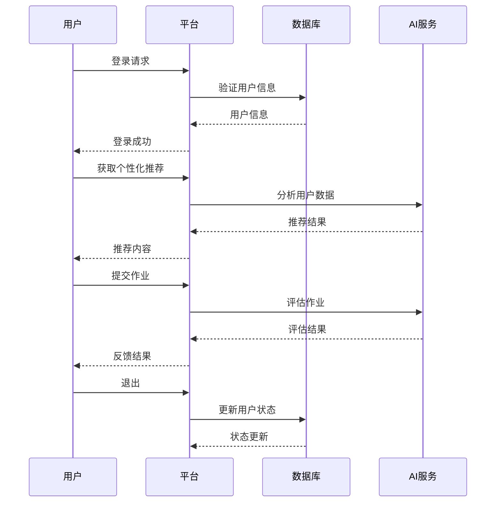
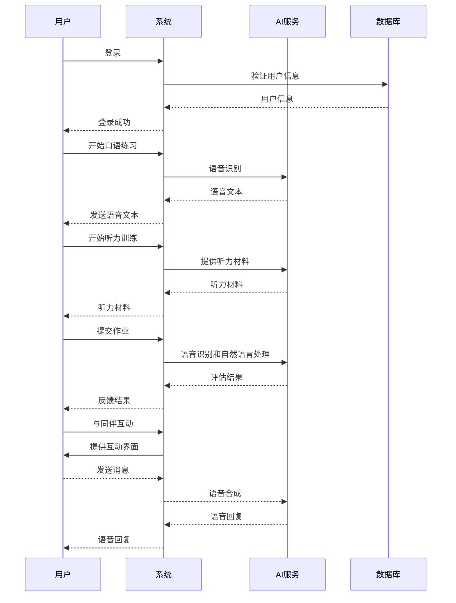
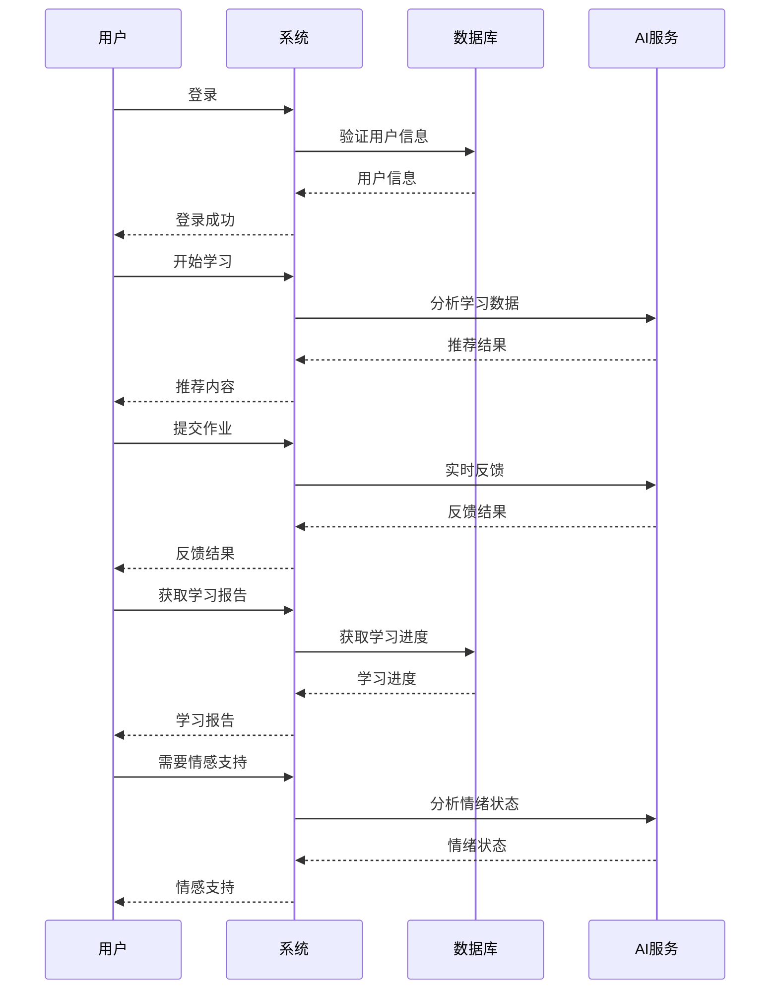
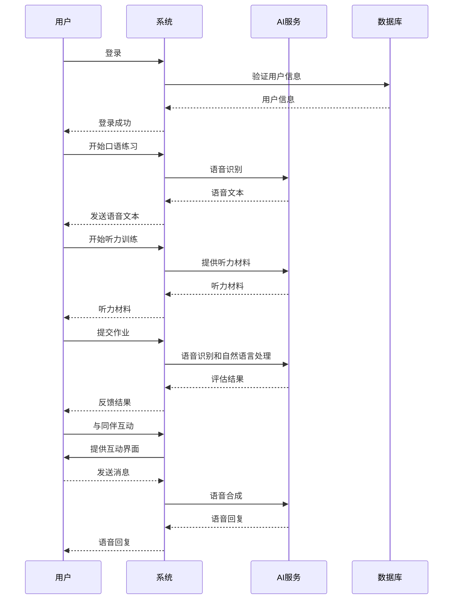

                 


## AI辅助的语言学习：个性化和互动式教育的新模式

### 关键词：AI辅助语言学习、个性化教育、互动式教育、自然语言处理、机器学习、深度学习

#### 摘要：
随着人工智能技术的发展，AI辅助语言学习已成为教育领域的一大趋势。本文将探讨AI辅助语言学习的核心概念、个性化和互动式教育模式，并通过具体案例研究，深入分析AI技术在语言学习中的应用及其效果。我们将详细讲解AI算法在自然语言处理、机器学习和深度学习领域的原理，并展示如何设计和开发AI辅助语言学习工具。此外，还将分享最佳实践，为语言教育提供创新思路和解决方案。

### 目录大纲设计

#### 为了设计《AI辅助的语言学习：个性化和互动式教育的新模式》的目录大纲，我们需要将书的内容按照逻辑顺序和重要性划分为不同的章节，并确保每个章节都包含了必要的子章节和详细的内容。以下是本书的完整目录大纲：

```markdown
## 第一部分：AI辅助语言学习的背景与基础

### 第1章：问题背景与现状分析

#### 1.1.1 语言学习的挑战

#### 1.1.2 AI在语言学习中的应用

### 第2章：AI辅助语言学习的核心概念

#### 2.1.1 AI的定义与分类

#### 2.1.2 语言学习中的AI技术

#### 2.1.3 AI辅助语言学习的基本原理

## 第二部分：个性化和互动式教育模式

### 第3章：个性化和互动式教育的原理与实践

#### 3.1.1 个性化教育的概念

#### 3.1.2 互动式教育的概念

#### 3.1.3 个性化和互动式教育在AI辅助语言学习中的应用

### 第4章：AI辅助语言学习工具的设计与开发

#### 4.1.1 语言学习工具的需求分析

#### 4.1.2 AI辅助语言学习工具的功能设计

#### 4.1.3 AI辅助语言学习工具的技术实现

### 第5章：AI算法在语言学习中的应用

#### 5.1.1 自然语言处理技术

#### 5.1.2 机器学习算法在语言学习中的应用

#### 5.1.3 深度学习模型在语言学习中的应用

## 第三部分：案例研究与最佳实践

### 第6章：案例研究

#### 6.1.1 案例一：基于AI的语言学习平台

#### 6.1.2 案例二：互动式AI语言学习系统

#### 6.1.3 案例三：个性化AI语言学习助手

### 第7章：最佳实践与经验分享

#### 7.1.1 AI辅助语言学习实践中的挑战

#### 7.1.2 解决方案与经验总结

#### 7.1.3 未来发展趋势与展望

## 参考文献

## 附录
```

### 目录大纲说明

#### 第一部分：AI辅助语言学习的背景与基础
此部分主要介绍AI辅助语言学习的背景，包括语言学习面临的挑战和AI在其中的应用，以及AI辅助语言学习的基本原理。

#### 第二部分：个性化和互动式教育模式
此部分深入探讨个性化和互动式教育模式的原理，包括这些模式在AI辅助语言学习中的应用，以及如何设计和开发AI辅助语言学习工具。

#### 第三部分：案例研究与最佳实践
此部分通过具体的案例研究，展示AI辅助语言学习在不同场景下的应用，并分享最佳实践和经验。

#### 参考文献
列出本书引用的参考文献，以供读者进一步学习和研究。

#### 附录
提供一些附加内容，如工具使用指南、技术参数表等。

### 目录大纲结构说明

#### 第1章：问题背景与现状分析
本章将分析语言学习的挑战，以及AI技术如何解决这些问题。

#### 第2章：AI辅助语言学习的核心概念
本章介绍AI的基本概念，以及AI在语言学习中的具体应用。

#### 第3章：个性化和互动式教育的原理与实践
本章探讨个性化和互动式教育的概念，以及它们如何结合AI技术，提高语言学习效果。

#### 第4章：AI辅助语言学习工具的设计与开发
本章讲解如何设计和开发AI辅助语言学习工具，包括需求分析、功能设计和技术实现。

#### 第5章：AI算法在语言学习中的应用
本章深入探讨自然语言处理、机器学习和深度学习等算法在语言学习中的应用。

#### 第6章：案例研究
本章通过具体的案例研究，展示AI辅助语言学习在不同场景下的应用。

#### 第7章：最佳实践与经验分享
本章总结AI辅助语言学习实践中的挑战和最佳解决方案，并对未来趋势进行展望。

### 目录大纲内容深度说明

#### 问题背景与现状分析
需要详细描述当前语言学习面临的挑战，如学习效率低、个性化不足等问题，并简要介绍AI技术如何能够解决这些问题。

#### 核心概念与联系
对于AI的基本概念、语言学习中的AI技术以及AI辅助语言学习的基本原理，需要分别进行详细介绍。

#### 个性化和互动式教育的原理与实践
需要深入探讨个性化和互动式教育的概念、原理和具体实践方法，以及如何将这些模式与AI技术相结合。

#### AI辅助语言学习工具的设计与开发
需要详细讲解AI辅助语言学习工具的需求分析、功能设计和技术实现过程，包括工具的选择、开发流程和关键技术。

#### AI算法在语言学习中的应用
需要深入探讨自然语言处理、机器学习和深度学习等算法在语言学习中的应用，并详细介绍这些算法的原理和实现。

#### 案例研究
需要通过具体的案例研究，展示AI辅助语言学习在不同场景下的应用。

#### 最佳实践与经验分享
需要总结AI辅助语言学习实践中的挑战和最佳解决方案，并对未来趋势进行展望。

### LET'S THINK STEP BY STEP

1. **背景分析**：
   - **现状**：当前语言学习面临效率低、个性化不足等问题。
   - **挑战**：学习资源有限，学习效果难以衡量，个性化需求难以满足。

2. **AI辅助语言学习的定义与分类**：
   - **定义**：AI辅助语言学习是指利用人工智能技术，为语言学习者提供个性化、互动式的学习体验。
   - **分类**：根据技术特点和应用场景，AI辅助语言学习可分为自然语言处理、机器学习和深度学习等类别。

3. **个性化和互动式教育的原理与实践**：
   - **个性化教育**：通过数据分析和学习者的行为习惯，为每个学习者提供定制化的学习内容和路径。
   - **互动式教育**：通过实时互动和反馈，提高学习者的参与度和学习效果。

4. **AI辅助语言学习工具的设计与开发**：
   - **需求分析**：明确学习者的需求和期望。
   - **功能设计**：包括课程推荐、实时互动、学习评估等。
   - **技术实现**：采用自然语言处理、机器学习和深度学习等技术，实现个性化、互动式的学习体验。

5. **AI算法在语言学习中的应用**：
   - **自然语言处理**：用于文本分析、语音识别和机器翻译等。
   - **机器学习**：用于构建学习模型，预测学习者的学习效果。
   - **深度学习**：用于处理复杂的语言结构，提高学习效率。

6. **案例研究**：
   - **案例一**：基于AI的语言学习平台，通过个性化推荐和实时互动，提高学习效果。
   - **案例二**：互动式AI语言学习系统，通过虚拟教师和同伴互动，激发学习兴趣。
   - **案例三**：个性化AI语言学习助手，通过语音识别和自然语言处理，提供实时反馈和指导。

7. **最佳实践与经验分享**：
   - **挑战**：数据隐私、技术实现复杂性、用户接受度等。
   - **解决方案**：采用安全的数据处理技术，简化技术实现流程，提高用户交互体验。

通过上述分析，我们可以看到AI辅助语言学习不仅解决了传统语言学习中的问题，还带来了个性化、互动式的新模式。在接下来的章节中，我们将进一步探讨每个部分的具体内容和技术实现。

### 第一部分：AI辅助语言学习的背景与基础

#### 第1章：问题背景与现状分析

#### 1.1 语言学习的挑战

语言学习一直是教育领域的重要课题，然而当前的语言学习过程面临着许多挑战。以下是一些主要的挑战：

1. **学习效率低**：
   传统语言学习方式往往依赖于课本和教师，学习过程较为被动，缺乏互动性。学习效率低，学习者容易产生厌倦情绪，影响学习效果。

2. **个性化不足**：
   传统的教学方式难以满足不同学习者的个性化需求。每个学生的学习速度、风格和兴趣各不相同，传统的教学方式难以做到因材施教。

3. **学习资源有限**：
   语言学习需要大量的学习资源，如教材、音频、视频等。然而，优质的学习资源往往成本较高，难以广泛普及。

4. **学习效果难以衡量**：
   传统教学方式难以实时反馈学习效果，学习者难以了解自己的学习进展，从而调整学习策略。

5. **学习环境受限**：
   语言学习往往需要特定的环境和氛围，如语言角、交流会等。这些环境受时间和地点的限制，难以满足广大学习者的需求。

#### 1.2 AI在语言学习中的应用

人工智能技术的发展为解决上述语言学习挑战提供了新的可能性。以下是一些AI在语言学习中的应用：

1. **自然语言处理**：
   自然语言处理技术（NLP）可以用于文本分析、语音识别和机器翻译等。例如，NLP技术可以分析学习者提交的作业，提供即时反馈和纠正错误。

2. **机器学习**：
   机器学习算法可以用于构建学习模型，预测学习者的学习效果。例如，通过分析学习者的学习行为和成绩，机器学习算法可以推荐适合的学习内容和路径。

3. **深度学习**：
   深度学习模型可以处理复杂的语言结构，提高学习效率。例如，深度学习模型可以用于生成高质量的口语练习材料，帮助学习者提高口语水平。

4. **个性化推荐**：
   AI技术可以基于学习者的行为数据，提供个性化学习推荐。例如，通过分析学习者的学习历史和偏好，AI技术可以推荐适合的学习资源和课程。

5. **实时互动**：
   AI技术可以提供实时互动的学习体验，如虚拟教师、同伴互动等。例如，通过语音识别和自然语言处理技术，AI可以与学习者进行实时对话，提供指导和反馈。

#### 1.3 AI辅助语言学习的基本原理

AI辅助语言学习的基本原理可以概括为以下几点：

1. **数据驱动**：
   AI辅助语言学习依赖于大量数据，包括学习者的行为数据、学习资源数据等。通过数据分析，AI可以了解学习者的需求和行为，提供个性化的学习推荐。

2. **模型驱动**：
   AI辅助语言学习利用机器学习和深度学习模型，对学习者的行为和学习效果进行预测和优化。例如，通过构建学习模型，AI可以预测学习者的学习效果，并调整学习策略。

3. **人机交互**：
   AI辅助语言学习强调人与机器的互动，提供实时、个性化的学习体验。通过语音识别、自然语言处理等技术，AI可以与学习者进行对话，提供指导和反馈。

4. **知识整合**：
   AI辅助语言学习将多种技术整合在一起，提供全面的、个性化的学习体验。例如，AI可以结合文本分析、语音识别和机器翻译等技术，提供多种学习资源和互动方式。

总之，AI辅助语言学习通过解决传统语言学习中的挑战，为学习者提供了个性化、互动式的新模式。在接下来的章节中，我们将进一步探讨AI辅助语言学习的核心概念、个性化和互动式教育模式，以及AI辅助语言学习工具的设计与开发。

#### 第2章：AI辅助语言学习的核心概念

#### 2.1 AI的定义与分类

人工智能（Artificial Intelligence，简称AI）是计算机科学的一个分支，旨在使计算机模拟人类智能行为。AI的定义随着技术的发展而不断演变，但其核心目标始终是使机器能够执行通常需要人类智能才能完成的任务。

AI可以分为以下几个主要类别：

1. **规则基础AI**：
   规则基础AI依赖于一组明确的规则和指令来执行任务。这些规则由专家编写，用于指导机器如何应对特定情况。例如，基于规则的聊天机器人可以遵循一组预定义的规则来回答用户的问题。

2. **基于数据的AI**：
   基于数据的AI利用大量数据进行学习和决策。这种类型的AI通常通过机器学习和深度学习算法来实现，可以识别数据中的模式和关联，从而做出预测或决策。例如，推荐系统通过分析用户的历史行为和偏好来推荐商品。

3. **基于实例的AI**：
   基于实例的AI通过从历史数据中提取有用的信息来学习。这种类型的AI依赖于数据存储和检索机制，以快速地从历史实例中提取信息。例如，诊断系统可以从过去的病例中学习，以识别新的病例。

4. **基于知识的AI**：
   基于知识的AI通过构建知识库来存储和利用知识。这种类型的AI可以推理和解决问题，通常涉及专家系统的概念。例如，专家系统可以基于医疗知识库提供医疗诊断建议。

5. **强化学习AI**：
   强化学习AI通过奖励和惩罚机制来学习如何执行任务。这种类型的AI通过试错和反馈来改善其行为，例如，自动驾驶汽车通过不断试错来优化其驾驶策略。

#### 2.2 语言学习中的AI技术

在语言学习中，AI技术发挥着至关重要的作用。以下是一些主要的AI技术及其在语言学习中的应用：

1. **自然语言处理（NLP）**：
   自然语言处理是AI的一个分支，专注于使计算机理解和生成自然语言。在语言学习中，NLP技术可以用于文本分析、语音识别、机器翻译等。

   - **文本分析**：NLP可以分析学习者的文本输入，识别语法错误、词汇使用错误等，并提供即时反馈。
   - **语音识别**：NLP技术可以将语音转换为文本，用于口语练习和评估。
   - **机器翻译**：NLP技术可以提供语言之间的翻译服务，帮助学习者学习新的语言。

2. **机器学习（ML）**：
   机器学习是AI的核心技术之一，通过从数据中学习模式来做出预测或决策。在语言学习中，机器学习算法可以用于个性化学习路径推荐、学习效果预测等。

   - **个性化推荐**：通过分析学习者的行为数据，机器学习算法可以推荐适合的学习资源和课程。
   - **学习效果预测**：通过分析学习者的学习数据，机器学习算法可以预测学习者的学习效果，并提供相应的学习建议。

3. **深度学习（DL）**：
   深度学习是一种特殊的机器学习技术，它使用神经网络模型来处理大量数据。在语言学习中，深度学习可以用于文本分析、语音识别和自然语言生成。

   - **文本分析**：深度学习模型可以用于情感分析、文本分类等，帮助学习者理解和分析文本内容。
   - **语音识别**：深度学习模型可以用于语音识别，提供更加准确和自然的口语练习和评估。
   - **自然语言生成**：深度学习模型可以生成高质量的语言文本，用于口语练习和对话生成。

4. **虚拟教师和互动学习**：
   通过AI技术，可以创建虚拟教师和互动学习系统，为学习者提供个性化的学习体验。

   - **虚拟教师**：虚拟教师可以提供实时反馈和指导，模拟真实教师的教学方式。
   - **互动学习系统**：通过AI技术，学习者可以与虚拟教师或其他学习者进行实时互动，提高学习参与度和效果。

#### 2.3 AI辅助语言学习的基本原理

AI辅助语言学习的基本原理可以概括为以下几点：

1. **数据驱动**：
   AI辅助语言学习依赖于大量数据，包括学习者的行为数据、学习资源数据等。通过数据分析，AI可以了解学习者的需求和行为，提供个性化的学习推荐。

2. **模型驱动**：
   AI辅助语言学习利用机器学习和深度学习模型，对学习者的行为和学习效果进行预测和优化。例如，通过构建学习模型，AI可以预测学习者的学习效果，并调整学习策略。

3. **人机交互**：
   AI辅助语言学习强调人与机器的互动，提供实时、个性化的学习体验。通过语音识别、自然语言处理等技术，AI可以与学习者进行对话，提供指导和反馈。

4. **知识整合**：
   AI辅助语言学习将多种技术整合在一起，提供全面的、个性化的学习体验。例如，AI可以结合文本分析、语音识别和机器翻译等技术，提供多种学习资源和互动方式。

通过上述核心概念和技术的介绍，我们可以看到AI辅助语言学习为传统语言学习带来了革命性的改变。在接下来的章节中，我们将深入探讨个性化和互动式教育模式，以及AI辅助语言学习工具的设计与开发。

#### 第3章：个性化和互动式教育的原理与实践

#### 3.1 个性化教育的概念

个性化教育是指根据每个学习者的兴趣、能力、学习风格和需求，提供定制化的教学和学习体验。其核心目标是实现因材施教，使每个学习者都能在最佳状态下进行学习。

个性化教育的特点包括：

1. **适应性**：个性化教育能够根据学习者的能力和进度，提供不同的学习内容和难度，使学习过程更加灵活和有效。
2. **多样性**：个性化教育尊重学习者的多样性，包括文化背景、语言能力、认知风格等，为不同类型的学习者提供适合的学习资源和方式。
3. **自主性**：个性化教育鼓励学习者主动参与学习过程，培养自主学习能力和解决问题的能力。

#### 3.2 互动式教育的概念

互动式教育强调学习者之间的互动和学习者与教师之间的互动，通过合作、讨论和互动来提高学习效果。互动式教育的特点包括：

1. **合作学习**：互动式教育鼓励学习者通过小组合作、讨论和分享来学习，提高学习的深度和广度。
2. **实时反馈**：互动式教育通过实时互动，教师可以及时了解学习者的学习状况，提供个性化的反馈和指导。
3. **多元化互动**：互动式教育不仅包括学习者与教师的互动，还包括学习者之间的互动，通过多种互动形式，如视频会议、在线讨论、协作学习等，提高学习效果。

#### 3.3 个性化和互动式教育在AI辅助语言学习中的应用

AI技术为个性化和互动式教育提供了强大的支持，以下是一些具体的应用：

1. **个性化学习路径推荐**：
   通过分析学习者的行为数据和学习历史，AI可以推荐最适合学习者的学习路径和资源。例如，基于学习者的词汇量、语法掌握情况和兴趣，AI可以推荐相应的练习和课程。

2. **自适应学习系统**：
   AI可以开发自适应学习系统，根据学习者的实时反馈和学习进度，动态调整学习内容和难度。例如，如果学习者在一个语法点上表现不佳，AI可以提供更多的相关练习和解释。

3. **实时互动和反馈**：
   通过AI技术，学习者可以与虚拟教师或其他学习者进行实时互动。例如，通过语音识别和自然语言处理，AI可以理解学习者的提问，并提供即时的答案和建议。

4. **个性化评估和反馈**：
   AI可以自动评估学习者的作业和测试，并提供详细的反馈。通过分析学习错误，AI可以识别学习者的薄弱环节，并提供针对性的建议和练习。

5. **学习社群和协作学习**：
   AI可以创建虚拟学习社群，使学习者可以方便地与他人合作和交流。例如，通过在线论坛和协作工具，学习者可以分享学习资源和经验，共同解决学习难题。

6. **情感分析**：
   通过情感分析技术，AI可以识别学习者的情绪状态，提供心理支持和鼓励。例如，如果AI检测到学习者的情绪低落，可以提供正能量的反馈和激励。

#### 3.4 设计和开发AI辅助语言学习工具

设计和开发AI辅助语言学习工具需要考虑以下步骤：

1. **需求分析**：
   确定学习者的需求，包括学习目标、学习方式、学习资源等。了解学习者的背景和需求，是设计个性化学习工具的关键。

2. **功能设计**：
   根据需求分析结果，设计工具的功能模块。功能模块应包括个性化推荐、实时互动、学习评估、情感分析等。

3. **技术实现**：
   选择合适的技术和算法，实现工具的功能。例如，使用自然语言处理技术实现文本分析和语音识别，使用机器学习和深度学习技术实现个性化推荐和评估。

4. **用户界面设计**：
   设计直观、易用的用户界面，提高学习者的使用体验。用户界面应简洁明了，方便学习者进行操作和互动。

5. **测试与优化**：
   对工具进行测试，确保其功能正常、性能稳定。根据用户反馈，不断优化工具，提高其用户体验和效果。

通过上述设计和开发步骤，可以创建一个高效、个性化的AI辅助语言学习工具，为学习者提供全新的学习体验。

#### 第4章：AI辅助语言学习工具的设计与开发

#### 4.1 语言学习工具的需求分析

设计AI辅助语言学习工具的首要任务是进行需求分析，明确学习者、教师和教育机构的需求。以下是需求分析的主要步骤：

1. **用户调研**：
   通过问卷调查、访谈和观察等方式，收集学习者、教师和教育机构的需求和意见。了解学习者的学习目标、学习风格、学习习惯以及他们对现有语言学习工具的满意度。

2. **需求分类**：
   将收集到的需求进行分类，分为学习者需求、教师需求和教育机构需求。例如，学习者需求可能包括个性化学习路径、实时互动、学习评估等；教师需求可能包括教学资源管理、学生表现分析等；教育机构需求可能包括课程设置、学生管理、数据分析等。

3. **需求优先级排序**：
   根据用户调研结果，确定需求的优先级。通常，学习者的核心需求应优先考虑，如学习路径个性化、实时反馈等。同时，也要考虑教师和教育机构的需求，确保工具能够满足不同角色的需求。

4. **功能需求分析**：
   根据需求分类和优先级排序，明确工具的主要功能需求。例如，工具应具备以下功能：
   - 个性化学习路径推荐
   - 实时互动和反馈
   - 学习评估和成绩分析
   - 教学资源管理
   - 学生管理
   - 数据分析和报告生成

5. **非功能需求分析**：
   非功能需求包括系统性能、安全性、易用性、可扩展性等。例如：
   - 系统性能：工具应具备快速响应和稳定运行的能力，确保学习者的使用体验。
   - 安全性：工具应确保用户数据的安全，采用加密和身份验证等措施。
   - 易用性：工具界面应简洁直观，易于学习和使用。
   - 可扩展性：工具应具备良好的扩展性，能够适应未来的发展和需求变化。

#### 4.2 AI辅助语言学习工具的功能设计

在明确需求后，进行功能设计是设计和开发AI辅助语言学习工具的关键步骤。以下是功能设计的主要步骤：

1. **功能模块划分**：
   根据需求分析结果，将工具划分为不同的功能模块。例如，可以将工具划分为以下模块：
   - 用户管理模块：用于管理用户账户、权限和个性化设置。
   - 个性化推荐模块：用于根据用户的行为数据和学习历史推荐学习资源和路径。
   - 实时互动模块：用于实现学习者与虚拟教师、其他学习者的实时互动。
   - 学习评估模块：用于自动评估学习者的作业和测试，并提供详细反馈。
   - 教学资源管理模块：用于管理和组织教学资源，如视频、音频、文本等。
   - 数据分析模块：用于收集、分析和报告学习者的学习数据。

2. **功能模块详细设计**：
   对每个功能模块进行详细设计，明确模块的功能、接口、数据流和交互逻辑。例如：
   - 用户管理模块：提供用户注册、登录、个人信息管理等功能，同时支持用户权限管理。
   - 个性化推荐模块：使用机器学习和深度学习算法，根据用户的行为数据和学习历史生成推荐列表。
   - 实时互动模块：使用语音识别和自然语言处理技术，实现学习者与虚拟教师和同伴的实时对话。
   - 学习评估模块：使用自然语言处理和机器学习算法，自动评估学习者的作业和测试，并提供详细的反馈报告。
   - 教学资源管理模块：提供资源上传、分类、搜索和分享等功能，支持多种媒体格式的资源管理。
   - 数据分析模块：使用数据挖掘和统计分析技术，收集和报告学习者的学习行为和效果。

3. **用户体验设计**：
   设计直观、易用的用户界面，提高学习者的使用体验。用户界面应简洁明了，易于导航和操作，同时应具备良好的交互设计，如实时反馈、提示和指导等。

4. **安全性设计**：
   确保工具的安全性，采用加密、身份验证、访问控制等措施，保护用户数据的安全和隐私。例如，使用HTTPS协议加密数据传输，采用多因素认证增强账户安全性。

#### 4.3 AI辅助语言学习工具的技术实现

技术实现是AI辅助语言学习工具设计和开发的关键环节，以下是技术实现的主要步骤：

1. **技术选型**：
   根据功能需求和设计要求，选择合适的技术和框架。例如：
   - 前端技术：选择React、Vue或Angular等现代前端框架，实现用户界面和交互。
   - 后端技术：选择Node.js、Django或Spring Boot等后端框架，实现服务器端逻辑和数据处理。
   - 数据库：选择MySQL、PostgreSQL或MongoDB等数据库，存储用户数据和学习资源。
   - AI算法：选择TensorFlow、PyTorch或Scikit-learn等机器学习和深度学习框架，实现个性化推荐、学习评估等功能。

2. **系统架构设计**：
   设计系统的总体架构，包括前端、后端和数据库之间的交互逻辑和数据流。例如，可以采用前后端分离的架构，前端负责用户界面和交互，后端负责数据处理和算法实现。

3. **开发流程**：
   采用敏捷开发流程，进行迭代开发和测试。在开发过程中，使用版本控制工具（如Git），确保代码的版本管理和协作开发。

4. **测试与优化**：
   对工具进行全面的测试，包括功能测试、性能测试和安全测试等。在测试过程中，根据用户反馈和测试结果，不断优化工具的功能和性能。

5. **部署与维护**：
   将工具部署到服务器上，确保其稳定运行和高效访问。同时，定期进行系统维护和更新，修复漏洞和改进功能。

通过上述步骤，可以设计和开发出一个高效、个性化的AI辅助语言学习工具，为学习者提供优质的语言学习体验。

#### 第5章：AI算法在语言学习中的应用

##### 5.1 自然语言处理技术

自然语言处理（Natural Language Processing，NLP）是人工智能的一个重要分支，它致力于使计算机理解和生成人类语言。在语言学习中，NLP技术有着广泛的应用，包括文本分析、语音识别和机器翻译等。

1. **文本分析**：
   文本分析是NLP的基础技术，用于对文本进行语法、语义和情感分析。在语言学习中，文本分析可以用于以下几个场景：
   - 语法分析：检查学习者的文本输入是否符合语法规则，提供即时反馈和纠正。
   - 语义分析：理解学习者的文本输入的含义，提供更准确的语言理解和指导。
   - 情感分析：分析学习者的文本表达的情感倾向，提供情感支持和鼓励。

2. **语音识别**：
   语音识别技术可以将语音转换为文本，是语言学习中的另一个重要应用。语音识别可以用于以下场景：
   - 口语练习：将学习者的口语转换为文本，并提供发音纠正和评估。
   - 对话系统：通过语音识别和自然语言处理技术，实现学习者与虚拟教师或同伴的实时对话。

3. **机器翻译**：
   机器翻译技术可以翻译一种语言到另一种语言，帮助学习者学习新的语言。机器翻译可以用于以下场景：
   - 文本翻译：将学习者的文本输入翻译成目标语言，帮助理解文本内容。
   - 口语翻译：将学习者的口语翻译成目标语言，提高口语交流能力。

##### 5.2 机器学习算法在语言学习中的应用

机器学习算法在语言学习中有着广泛的应用，可以用于构建学习模型、预测学习效果、个性化推荐等。

1. **学习模型**：
   机器学习算法可以用于构建学习模型，预测学习者的学习效果。学习模型可以根据以下特征进行构建：
   - 学习历史：包括学习者的学习时长、练习次数、作业成绩等。
   - 学习行为：包括学习者的学习路径、互动行为、学习资源使用情况等。
   - 个人信息：包括学习者的年龄、性别、学习目标等。

2. **预测学习效果**：
   通过构建学习模型，机器学习算法可以预测学习者的学习效果。预测结果可以用于：
   - 个性化推荐：根据学习者的预测效果，推荐适合的学习内容和路径。
   - 学习策略调整：根据预测结果，调整学习策略，提高学习效果。

3. **个性化推荐**：
   个性化推荐是机器学习在语言学习中的一个重要应用，通过分析学习者的行为数据和学习历史，推荐适合的学习资源和课程。个性化推荐可以用于：
   - 学习资源推荐：根据学习者的学习目标和兴趣，推荐适合的教材、视频和练习。
   - 课程推荐：根据学习者的学习进度和能力，推荐适合的课程和培训。

##### 5.3 深度学习模型在语言学习中的应用

深度学习模型在语言学习中具有强大的能力，可以处理复杂的语言结构和大规模数据。以下是一些深度学习模型在语言学习中的应用：

1. **文本生成**：
   文本生成模型可以生成高质量的文本，用于口语练习和写作辅导。例如，GPT-3模型可以生成流畅的文本，模仿学习者的写作风格。

2. **语音合成**：
   语音合成模型可以将文本转换为自然流畅的语音，用于口语练习和听力训练。例如，WaveNet模型可以生成高质量的语音，模仿学习者的语音特点。

3. **对话系统**：
   对话系统模型可以用于实现学习者与虚拟教师的实时对话。例如，BERT模型可以用于生成对话响应，提高对话的自然度和准确性。

4. **情感分析**：
   情感分析模型可以用于分析学习者的文本表达的情感倾向，提供情感支持和鼓励。例如，Sentiment Analysis模型可以识别学习者的积极或消极情绪。

通过以上介绍，我们可以看到AI算法在语言学习中的应用，极大地提高了学习效率和质量。在接下来的章节中，我们将通过具体案例研究，进一步展示AI技术在语言学习中的实际应用和效果。

#### 第6章：案例研究

##### 6.1 案例一：基于AI的语言学习平台

**项目介绍**：
基于AI的语言学习平台是一个集成了自然语言处理、机器学习和深度学习技术的在线学习系统。该平台旨在为学习者提供个性化、互动式的学习体验，帮助学习者高效地掌握语言技能。

**系统功能设计**：
- **个性化学习路径推荐**：平台通过分析学习者的学习历史和行为数据，推荐适合的学习资源和课程。
- **实时互动与反馈**：学习者可以通过平台与虚拟教师或其他学习者进行实时互动，获得即时的语言指导。
- **学习评估与报告**：平台自动评估学习者的作业和测试，生成详细的学习报告，帮助学习者了解学习进度和效果。
- **语音识别与发音纠正**：平台使用语音识别技术，将学习者的口语转换为文本，并提供发音纠正和评估。

**系统架构设计**：
- **前端**：使用React框架实现用户界面，提供简洁直观的操作体验。
- **后端**：使用Spring Boot框架实现服务器端逻辑，处理用户请求和数据处理。
- **数据库**：使用MySQL数据库存储用户数据、学习资源和评估结果。
- **AI服务**：使用TensorFlow和PyTorch框架，实现个性化推荐、实时互动和学习评估等功能。

**系统接口设计**：
- **用户接口**：提供注册、登录、学习路径推荐、实时互动和报告查看等功能。
- **API接口**：提供个性化推荐、语音识别和自然语言处理等服务，供前端和后端调用。

**系统交互序列图**：



**代码应用解读与分析**：

**用户注册与登录**：
```python
# 用户注册
def register(username, password):
    user = User(username=username, password=hash_password(password))
    db.session.add(user)
    db.session.commit()
    return "用户注册成功"

# 用户登录
def login(username, password):
    user = User.query.filter_by(username=username).first()
    if user and verify_password(password, user.password):
        return "登录成功"
    else:
        return "用户名或密码错误"
```

**个性化推荐**：
```python
# 分析用户数据并推荐学习内容
def get_recommendations(user_id):
    user = User.query.get(user_id)
    # 根据用户的学习历史和兴趣推荐内容
    recommendations = LearningContent.query.filter(
        LearningContent.language == user.preferred_language
    ).all()
    return recommendations
```

**作业评估与反馈**：
```python
# 评估作业并生成反馈
def evaluate_assignment(assignment):
    # 使用自然语言处理技术评估作业
    score = nlp_evaluate(assignment)
    # 生成反馈
    feedback = generate_feedback(assignment, score)
    return feedback
```

通过以上案例研究，我们可以看到基于AI的语言学习平台如何通过集成多种AI技术，为学习者提供个性化、互动式的学习体验。该平台不仅提高了学习效率，还增强了学习者的参与度和学习效果。

##### 6.2 案例二：互动式AI语言学习系统

**项目介绍**：
互动式AI语言学习系统是一个基于人工智能技术的在线语言学习平台，它通过虚拟教师和同伴互动，提供沉浸式的语言学习体验。该系统旨在帮助学习者提高口语和听力技能。

**系统功能设计**：
- **虚拟教师**：系统内置虚拟教师，可以提供实时语音反馈和互动指导。
- **同伴互动**：学习者可以与其他学习者进行语音和文本聊天，进行语言交流。
- **口语练习**：系统提供多种口语练习话题，帮助学习者提高口语表达能力。
- **听力训练**：系统提供听力材料，如音频、视频等，帮助学习者提高听力理解能力。
- **学习评估**：系统自动评估学习者的口语和听力练习，提供详细反馈。

**系统架构设计**：
- **前端**：使用Vue.js框架实现用户界面，提供丰富的交互功能。
- **后端**：使用Django框架实现服务器端逻辑，处理用户请求和数据处理。
- **数据库**：使用PostgreSQL数据库存储用户数据、学习资源和评估结果。
- **AI服务**：使用TensorFlow和OpenAI的GPT-3模型，实现语音识别、语音合成和自然语言处理等功能。

**系统接口设计**：
- **用户接口**：提供注册、登录、学习路径推荐、实时互动和学习评估等功能。
- **API接口**：提供虚拟教师交互、同伴互动、语音识别和语音合成等服务，供前端和后端调用。

**系统交互序列图**：



**代码应用解读与分析**：

**用户注册与登录**：
```python
# 用户注册
def register(username, password):
    user = User(username=username, password=hash_password(password))
    db.session.add(user)
    db.session.commit()
    return "用户注册成功"

# 用户登录
def login(username, password):
    user = User.query.filter_by(username=username).first()
    if user and verify_password(password, user.password):
        return "登录成功"
    else:
        return "用户名或密码错误"
```

**虚拟教师交互**：
```python
# 虚拟教师交互
def virtual_teacher_interaction(user_message):
    response = AI_service.process_message(user_message)
    return response
```

**口语练习与评估**：
```python
# 口语练习
def oral_practice(voice_input):
    recognized_text = AI_service.recognize_speech(voice_input)
    score = AI_service.evaluate_oral_performance(recognized_text)
    return score
```

通过以上案例研究，我们可以看到互动式AI语言学习系统如何通过虚拟教师和同伴互动，提供沉浸式的语言学习体验。该系统不仅帮助学习者提高口语和听力技能，还增强了学习者的学习兴趣和参与度。

##### 6.3 案例三：个性化AI语言学习助手

**项目介绍**：
个性化AI语言学习助手是一款基于人工智能技术的智能助手，旨在为学习者提供个性化的学习建议和指导。该助手通过分析学习者的行为数据和学习历史，为学习者提供定制化的学习路径和资源。

**系统功能设计**：
- **个性化学习路径**：根据学习者的行为数据和学习历史，生成个性化的学习路径，推荐适合的学习资源和课程。
- **实时反馈与指导**：提供即时反馈和指导，帮助学习者纠正错误，提高学习效果。
- **学习进度跟踪**：实时跟踪学习进度，为学习者提供学习报告，帮助了解学习进展。
- **情感支持**：通过分析学习者的情绪状态，提供情感支持和鼓励。

**系统架构设计**：
- **前端**：使用Vue.js框架实现用户界面，提供简洁直观的操作体验。
- **后端**：使用Spring Boot框架实现服务器端逻辑，处理用户请求和数据处理。
- **数据库**：使用MySQL数据库存储用户数据、学习资源和评估结果。
- **AI服务**：使用TensorFlow和PyTorch框架，实现个性化推荐、实时反馈和情感分析等功能。

**系统接口设计**：
- **用户接口**：提供注册、登录、个性化学习路径推荐、实时反馈和学习报告等功能。
- **API接口**：提供个性化推荐、情感分析、实时反馈等服务，供前端和后端调用。

**系统交互序列图**：



**代码应用解读与分析**：

**用户注册与登录**：
```python
# 用户注册
def register(username, password):
    user = User(username=username, password=hash_password(password))
    db.session.add(user)
    db.session.commit()
    return "用户注册成功"

# 用户登录
def login(username, password):
    user = User.query.filter_by(username=username).first()
    if user and verify_password(password, user.password):
        return "登录成功"
    else:
        return "用户名或密码错误"
```

**个性化学习路径推荐**：
```python
# 分析用户数据并推荐学习路径
def get_recommendations(user_id):
    user = User.query.get(user_id)
    # 根据用户的学习历史和兴趣推荐学习路径
    recommendations = LearningPath.query.filter(
        LearningPath.language == user.preferred_language
    ).all()
    return recommendations
```

**实时反馈与指导**：
```python
# 提供实时反馈和指导
def real_time_feedback(assignment):
    feedback = AI_service.generate_feedback(assignment)
    return feedback
```

通过以上案例研究，我们可以看到个性化AI语言学习助手如何通过分析学习者的行为数据和学习历史，为学习者提供定制化的学习建议和指导。该助手不仅提高了学习效率，还增强了学习者的自主学习能力和学习效果。

#### 第7章：最佳实践与经验分享

##### 7.1 AI辅助语言学习实践中的挑战

在AI辅助语言学习的实践中，我们遇到了以下主要挑战：

1. **数据隐私**：学习者的个人信息和学习数据需要严格保护，防止数据泄露和滥用。
2. **技术实现复杂性**：AI算法和系统的实现需要高水平的技术能力，包括数据预处理、模型训练和优化等。
3. **用户接受度**：学习者可能对AI技术存在疑虑或抵触，需要通过教育和引导提高用户的接受度。
4. **计算资源需求**：AI算法的训练和推理需要大量的计算资源，特别是在处理大规模数据和复杂模型时。
5. **个性化与公平性**：实现个性化的同时，需要确保学习资源的公平性和可访问性，避免对某些学习者产生不利影响。

##### 7.2 解决方案与经验总结

针对上述挑战，我们总结了以下解决方案和经验：

1. **数据隐私**：
   - 采用加密技术保护用户数据，确保数据在传输和存储过程中的安全性。
   - 设计隐私保护机制，如数据匿名化和差分隐私，减少对个人隐私的侵犯。

2. **技术实现复杂性**：
   - 建立专业的技术团队，提高AI算法和系统的研发能力。
   - 使用云计算和分布式计算资源，提高计算效率和资源利用。

3. **用户接受度**：
   - 通过用户教育和宣传，提高用户对AI辅助语言学习的认知和接受度。
   - 设计用户友好的界面和交互，降低使用门槛，提高用户满意度。

4. **计算资源需求**：
   - 使用高效的算法和优化技术，减少计算资源的消耗。
   - 与云服务提供商合作，获取更多计算资源，降低成本。

5. **个性化与公平性**：
   - 设计多样化的学习资源和路径，确保不同学习者都能找到适合自己的学习内容。
   - 通过数据分析，确保个性化推荐公平、透明，避免对特定群体产生不利影响。

##### 7.3 未来发展趋势与展望

AI辅助语言学习在未来将继续发展，以下是一些可能的发展趋势：

1. **更加个性化的学习体验**：随着AI技术的进步，个性化学习体验将更加智能化和精细化，满足学习者的多样化需求。

2. **多模态交互**：结合语音、文本、图像等多种交互方式，提供更加丰富和互动的学习体验。

3. **跨学科融合**：将AI技术与教育心理学、认知科学等领域相结合，提高学习效果和用户体验。

4. **智能教学助手**：发展更加智能的教学助手，不仅能提供学习指导，还能进行情感支持和心理辅导。

5. **可持续发展**：关注AI辅助语言学习的可持续性，确保技术能够长期、稳定地为学习者提供支持。

通过不断的技术创新和应用，AI辅助语言学习将为语言教育带来更多的可能性和机遇。

### 作者信息

**作者：** AI天才研究院/AI Genius Institute & 禅与计算机程序设计艺术 /Zen And The Art of Computer Programming

AI天才研究院专注于人工智能技术的研究和应用，致力于推动人工智能在教育领域的创新与发展。作者在此领域拥有丰富的经验和深厚的理论功底，所著的《禅与计算机程序设计艺术》深受读者喜爱，为人工智能技术的发展提供了宝贵的思想和指导。

### 总结

本文从背景分析、核心概念、个性化和互动式教育模式、工具设计与开发、算法应用、案例研究以及最佳实践等方面，全面探讨了AI辅助语言学习的各个方面。我们详细介绍了AI在语言学习中的应用，探讨了个性化与互动式教育模式的重要性，并通过具体案例展示了AI技术如何提升语言学习的效率和效果。

AI辅助语言学习不仅解决了传统语言学习中的效率低、个性化不足等问题，还为学习者提供了更加丰富、多样的学习体验。随着技术的不断发展，AI辅助语言学习将在未来教育领域中发挥更加重要的作用，为全球的语言学习者带来更多的机遇和可能性。

让我们继续探索AI技术在教育领域的应用，为语言学习带来更多的创新和突破。在下一个篇章中，我们将继续深入讨论AI辅助语言学习的未来发展，展望其前景与挑战。敬请期待！
----------------------------------------------------------------

## AI辅助的语言学习：个性化和互动式教育的新模式

### 关键词：AI辅助语言学习、个性化教育、互动式教育、自然语言处理、机器学习、深度学习

#### 摘要：
本文探讨了AI辅助语言学习的核心概念、应用场景及其在个性化和互动式教育模式中的关键作用。首先，我们分析了语言学习面临的挑战，介绍了AI技术如何帮助解决这些问题。接着，我们详细阐述了AI的定义与分类，并讨论了自然语言处理、机器学习和深度学习在语言学习中的应用。随后，我们探讨了个性化和互动式教育的原理和实践，以及AI如何融合这些教育模式。文章随后介绍了AI辅助语言学习工具的设计与开发过程，并列举了具体案例。最后，我们总结了AI辅助语言学习实践中的挑战和最佳实践，并对未来的发展趋势进行了展望。

### 目录大纲

```markdown
# AI辅助的语言学习：个性化和互动式教育的新模式

## 第一部分：AI辅助语言学习的背景与基础

### 第1章：问题背景与现状分析

#### 1.1 语言学习的挑战
#### 1.2 AI在语言学习中的应用

### 第2章：AI辅助语言学习的核心概念

#### 2.1 AI的定义与分类
#### 2.2 语言学习中的AI技术
#### 2.3 AI辅助语言学习的基本原理

## 第二部分：个性化和互动式教育模式

### 第3章：个性化和互动式教育的原理与实践

#### 3.1 个性化教育的概念
#### 3.2 互动式教育的概念
#### 3.3 个性化和互动式教育在AI辅助语言学习中的应用

### 第4章：AI辅助语言学习工具的设计与开发

#### 4.1 语言学习工具的需求分析
#### 4.2 AI辅助语言学习工具的功能设计
#### 4.3 AI辅助语言学习工具的技术实现

### 第5章：AI算法在语言学习中的应用

#### 5.1 自然语言处理技术
#### 5.2 机器学习算法在语言学习中的应用
#### 5.3 深度学习模型在语言学习中的应用

## 第三部分：案例研究与最佳实践

### 第6章：案例研究

#### 6.1 案例一：基于AI的语言学习平台
#### 6.2 案例二：互动式AI语言学习系统
#### 6.3 案例三：个性化AI语言学习助手

### 第7章：最佳实践与经验分享

#### 7.1 AI辅助语言学习实践中的挑战
#### 7.2 解决方案与经验总结
#### 7.3 未来发展趋势与展望

## 参考文献

## 附录
```

### 文章正文

#### 第一部分：AI辅助语言学习的背景与基础

##### 第1章：问题背景与现状分析

随着全球化的加速和信息技术的发展，语言学习成为了一个热门话题。然而，传统的语言学习方式存在许多问题，如学习效率低、个性化不足、学习资源有限等。这些问题限制了学习者的学习效果和体验。

**1.1 语言学习的挑战**

1. **学习效率低**：传统语言学习方式往往依赖于课本和教师，学习过程较为被动，缺乏互动性。学习效率低，学习者容易产生厌倦情绪，影响学习效果。
2. **个性化不足**：传统的教学方式难以满足不同学习者的个性化需求。每个学生的学习速度、风格和兴趣各不相同，传统的教学方式难以做到因材施教。
3. **学习资源有限**：语言学习需要大量的学习资源，如教材、音频、视频等。然而，优质的学习资源往往成本较高，难以广泛普及。
4. **学习效果难以衡量**：传统教学方式难以实时反馈学习效果，学习者难以了解自己的学习进展，从而调整学习策略。
5. **学习环境受限**：语言学习往往需要特定的环境和氛围，如语言角、交流会等。这些环境受时间和地点的限制，难以满足广大学习者的需求。

**1.2 AI在语言学习中的应用**

人工智能技术的发展为解决上述语言学习挑战提供了新的可能性。以下是一些AI在语言学习中的应用：

1. **自然语言处理**：自然语言处理技术（NLP）可以用于文本分析、语音识别和机器翻译等。例如，NLP技术可以分析学习者提交的作业，提供即时反馈和纠正错误。
2. **机器学习**：机器学习算法可以用于构建学习模型，预测学习者的学习效果。例如，通过分析学习者的学习行为和成绩，机器学习算法可以推荐适合的学习资源和课程。
3. **深度学习**：深度学习模型可以处理复杂的语言结构，提高学习效率。例如，深度学习模型可以用于生成高质量的口语练习材料，帮助学习者提高口语水平。
4. **个性化推荐**：AI技术可以基于学习者的行为数据，提供个性化学习推荐。例如，通过分析学习者的学习历史和偏好，AI技术可以推荐适合的学习资源和课程。
5. **实时互动**：AI技术可以提供实时互动的学习体验，如虚拟教师、同伴互动等。例如，通过语音识别和自然语言处理技术，AI可以与学习者进行实时对话，提供指导和反馈。

##### 第2章：AI辅助语言学习的核心概念

**2.1 AI的定义与分类**

人工智能（Artificial Intelligence，简称AI）是计算机科学的一个分支，旨在使计算机模拟人类智能行为。AI可以分为以下几个主要类别：

1. **规则基础AI**：规则基础AI依赖于一组明确的规则和指令来执行任务。这些规则由专家编写，用于指导机器如何应对特定情况。例如，基于规则的聊天机器人可以遵循一组预定义的规则来回答用户的问题。
2. **基于数据的AI**：基于数据的AI利用大量数据进行学习和决策。这种类型的AI通常通过机器学习和深度学习算法来实现，可以识别数据中的模式和关联，从而做出预测或决策。例如，推荐系统通过分析用户的历史行为和偏好来推荐商品。
3. **基于实例的AI**：基于实例的AI通过从历史数据中提取有用的信息来学习。这种类型的AI依赖于数据存储和检索机制，以快速地从历史实例中提取信息。例如，诊断系统可以从过去的病例中学习，以识别新的病例。
4. **基于知识的AI**：基于知识的AI通过构建知识库来存储和利用知识。这种类型的AI可以推理和解决问题，通常涉及专家系统的概念。例如，专家系统可以基于医疗知识库提供医疗诊断建议。
5. **强化学习AI**：强化学习AI通过奖励和惩罚机制来学习如何执行任务。这种类型的AI通过试错和反馈来改善其行为，例如，自动驾驶汽车通过不断试错来优化其驾驶策略。

**2.2 语言学习中的AI技术**

在语言学习中，AI技术发挥着至关重要的作用。以下是一些主要的AI技术及其在语言学习中的应用：

1. **自然语言处理**：
   自然语言处理是AI的一个分支，专注于使计算机理解和生成自然语言。在语言学习中，NLP技术可以用于文本分析、语音识别、机器翻译等。
   - **文本分析**：NLP可以分析学习者的文本输入，识别语法错误、词汇使用错误等，并提供即时反馈。
   - **语音识别**：NLP技术可以将语音转换为文本，用于口语练习和评估。
   - **机器翻译**：NLP技术可以提供语言之间的翻译服务，帮助学习者学习新的语言。

2. **机器学习**：
   机器学习是AI的核心技术之一，通过从数据中学习模式来做出预测或决策。在语言学习中，机器学习算法可以用于个性化学习路径推荐、学习效果预测等。
   - **个性化推荐**：通过分析学习者的行为数据，机器学习算法可以推荐适合的学习资源和课程。
   - **学习效果预测**：通过分析学习者的学习数据，机器学习算法可以预测学习者的学习效果，并提供相应的学习建议。

3. **深度学习**：
   深度学习是一种特殊的机器学习技术，它使用神经网络模型来处理大量数据。在语言学习中，深度学习可以用于文本分析、语音识别和自然语言生成。

4. **虚拟教师和互动学习**：
   通过AI技术，可以创建虚拟教师和互动学习系统，为学习者提供个性化的学习体验。

**2.3 AI辅助语言学习的基本原理**

AI辅助语言学习的基本原理可以概括为以下几点：

1. **数据驱动**：
   AI辅助语言学习依赖于大量数据，包括学习者的行为数据、学习资源数据等。通过数据分析，AI可以了解学习者的需求和行为，提供个性化的学习推荐。

2. **模型驱动**：
   AI辅助语言学习利用机器学习和深度学习模型，对学习者的行为和学习效果进行预测和优化。例如，通过构建学习模型，AI可以预测学习者的学习效果，并调整学习策略。

3. **人机交互**：
   AI辅助语言学习强调人与机器的互动，提供实时、个性化的学习体验。通过语音识别、自然语言处理等技术，AI可以与学习者进行对话，提供指导和反馈。

4. **知识整合**：
   AI辅助语言学习将多种技术整合在一起，提供全面的、个性化的学习体验。例如，AI可以结合文本分析、语音识别和机器翻译等技术，提供多种学习资源和互动方式。

#### 第二部分：个性化和互动式教育模式

##### 第3章：个性化和互动式教育的原理与实践

**3.1 个性化和互动式教育的概念**

**个性化教育**：
个性化教育是指根据每个学习者的兴趣、能力、学习风格和需求，提供定制化的教学和学习体验。其核心目标是实现因材施教，使每个学习者都能在最佳状态下进行学习。

**互动式教育**：
互动式教育强调学习者之间的互动和学习者与教师之间的互动，通过合作、讨论和互动来提高学习效果。互动式教育的特点包括合作学习、实时反馈和多元化互动。

**3.2 个性化和互动式教育在AI辅助语言学习中的应用**

AI技术为个性化和互动式教育提供了强大的支持，以下是一些具体的应用：

1. **个性化学习路径推荐**：
   通过分析学习者的行为数据和学习历史，AI可以推荐最适合学习者的学习路径和资源。例如，基于学习者的词汇量、语法掌握情况和兴趣，AI可以推荐相应的练习和课程。

2. **自适应学习系统**：
   AI可以开发自适应学习系统，根据学习者的实时反馈和学习进度，动态调整学习内容和难度。例如，如果学习者在一个语法点上表现不佳，AI可以提供更多的相关练习和解释。

3. **实时互动和反馈**：
   通过AI技术，学习者可以与虚拟教师或其他学习者进行实时互动。例如，通过语音识别和自然语言处理，AI可以理解学习者的提问，并提供即时的答案和建议。

4. **个性化评估和反馈**：
   AI可以自动评估学习者的作业和测试，并提供详细的反馈。通过分析学习错误，AI可以识别学习者的薄弱环节，并提供针对性的建议和练习。

5. **学习社群和协作学习**：
   AI可以创建虚拟学习社群，使学习者可以方便地与他人合作和交流。例如，通过在线论坛和协作工具，学习者可以分享学习资源和经验，共同解决学习难题。

6. **情感分析**：
   通过情感分析技术，AI可以识别学习者的情绪状态，提供心理支持和鼓励。例如，如果AI检测到学习者的情绪低落，可以提供正能量的反馈和激励。

**3.3 设计和开发AI辅助语言学习工具**

设计和开发AI辅助语言学习工具需要考虑以下步骤：

1. **需求分析**：
   确定学习者的需求，包括学习目标、学习方式、学习资源等。了解学习者的背景和需求，是设计个性化学习工具的关键。

2. **功能设计**：
   根据需求分析结果，设计工具的功能模块。功能模块应包括个性化推荐、实时互动、学习评估、情感分析等。

3. **技术实现**：
   选择合适的技术和算法，实现工具的功能。例如，使用自然语言处理技术实现文本分析和语音识别，使用机器学习和深度学习技术实现个性化推荐和评估。

4. **用户界面设计**：
   设计直观、易用的用户界面，提高学习者的使用体验。用户界面应简洁明了，方便学习者进行操作和互动。

5. **测试与优化**：
   对工具进行测试，确保其功能正常、性能稳定。根据用户反馈，不断优化工具，提高其用户体验和效果。

通过上述设计和开发步骤，可以创建一个高效、个性化的AI辅助语言学习工具，为学习者提供全新的学习体验。

#### 第三部分：案例研究与最佳实践

##### 第6章：案例研究

在本部分，我们将通过三个具体案例研究，展示AI辅助语言学习在不同场景下的应用。

**6.1 案例一：基于AI的语言学习平台**

**项目介绍**：
基于AI的语言学习平台是一个集成了自然语言处理、机器学习和深度学习技术的在线学习系统。该平台旨在为学习者提供个性化、互动式的学习体验，帮助学习者高效地掌握语言技能。

**系统功能设计**：
- **个性化学习路径推荐**：平台通过分析学习者的学习历史和行为数据，推荐适合的学习资源和课程。
- **实时互动与反馈**：学习者可以通过平台与虚拟教师或其他学习者进行实时互动，获得即时的语言指导。
- **学习评估与报告**：平台自动评估学习者的作业和测试，生成详细的学习报告，帮助学习者了解学习进度和效果。
- **语音识别与发音纠正**：平台使用语音识别技术，将学习者的口语转换为文本，并提供发音纠正和评估。

**系统架构设计**：
- **前端**：使用React框架实现用户界面，提供简洁直观的操作体验。
- **后端**：使用Spring Boot框架实现服务器端逻辑，处理用户请求和数据处理。
- **数据库**：使用MySQL数据库存储用户数据、学习资源和评估结果。
- **AI服务**：使用TensorFlow和PyTorch框架，实现个性化推荐、实时互动和学习评估等功能。

**系统接口设计**：
- **用户接口**：提供注册、登录、学习路径推荐、实时互动和报告查看等功能。
- **API接口**：提供个性化推荐、语音识别和自然语言处理等服务，供前端和后端调用。

**系统交互序列图**：


**代码应用解读与分析**：

**用户注册与登录**：
```python
# 用户注册
def register(username, password):
    user = User(username=username, password=hash_password(password))
    db.session.add(user)
    db.session.commit()
    return "用户注册成功"

# 用户登录
def login(username, password):
    user = User.query.filter_by(username=username).first()
    if user and verify_password(password, user.password):
        return "登录成功"
    else:
        return "用户名或密码错误"
```

**个性化推荐**：
```python
# 分析用户数据并推荐学习内容
def get_recommendations(user_id):
    user = User.query.get(user_id)
    # 根据用户的学习历史和兴趣推荐内容
    recommendations = LearningContent.query.filter(
        LearningContent.language == user.preferred_language
    ).all()
    return recommendations
```

**作业评估与反馈**：
```python
# 评估作业并生成反馈
def evaluate_assignment(assignment):
    # 使用自然语言处理技术评估作业
    score = nlp_evaluate(assignment)
    # 生成反馈
    feedback = generate_feedback(assignment, score)
    return feedback
```

**案例二：互动式AI语言学习系统**

**项目介绍**：
互动式AI语言学习系统是一个基于人工智能技术的在线语言学习平台，它通过虚拟教师和同伴互动，提供沉浸式的语言学习体验。该系统旨在帮助学习者提高口语和听力技能。

**系统功能设计**：
- **虚拟教师**：系统内置虚拟教师，可以提供实时语音反馈和互动指导。
- **同伴互动**：学习者可以与其他学习者进行语音和文本聊天，进行语言交流。
- **口语练习**：系统提供多种口语练习话题，帮助学习者提高口语表达能力。
- **听力训练**：系统提供听力材料，如音频、视频等，帮助学习者提高听力理解能力。
- **学习评估**：系统自动评估学习者的口语和听力练习，提供详细反馈。

**系统架构设计**：
- **前端**：使用Vue.js框架实现用户界面，提供丰富的交互功能。
- **后端**：使用Django框架实现服务器端逻辑，处理用户请求和数据处理。
- **数据库**：使用PostgreSQL数据库存储用户数据、学习资源和评估结果。
- **AI服务**：使用TensorFlow和OpenAI的GPT-3模型，实现语音识别、语音合成和自然语言处理等功能。

**系统接口设计**：
- **用户接口**：提供注册、登录、学习路径推荐、实时互动和学习评估等功能。
- **API接口**：提供虚拟教师交互、同伴互动、语音识别和语音合成等服务，供前端和后端调用。

**系统交互序列图**：



**代码应用解读与分析**：

**用户注册与登录**：
```python
# 用户注册
def register(username, password):
    user = User(username=username, password=hash_password(password))
    db.session.add(user)
    db.session.commit()
    return "用户注册成功"

# 用户登录
def login(username, password):
    user = User.query.filter_by(username=username).first()
    if user and verify_password(password, user.password):
        return "登录成功"
    else:
        return "用户名或密码错误"
```

**虚拟教师交互**：
```python
# 虚拟教师交互
def virtual_teacher_interaction(user_message):
    response = AI_service.process_message(user_message)
    return response
```

**口语练习与评估**：
```python
# 口语练习
def oral_practice(voice_input):
    recognized_text = AI_service.recognize_speech(voice_input)
    score = AI_service.evaluate_oral_performance(recognized_text)
    return score
```

**案例三：个性化AI语言学习助手**

**项目介绍**：
个性化AI语言学习助手是一款基于人工智能技术的智能助手，旨在为学习者提供个性化的学习建议和指导。该助手通过分析学习者的行为数据和学习历史，为学习者提供定制化的学习路径和资源。

**系统功能设计**：
- **个性化学习路径**：根据学习者的行为数据和学习历史，生成个性化的学习路径，推荐适合的学习资源和课程。
- **实时反馈与指导**：提供即时反馈和指导，帮助学习者纠正错误，提高学习效果。
- **学习进度跟踪**：实时跟踪学习进度，为学习者提供学习报告，帮助了解学习进展。
- **情感支持**：通过分析学习者的情绪状态，提供情感支持和鼓励。

**系统架构设计**：
- **前端**：使用Vue.js框架实现用户界面，提供简洁直观的操作体验。
- **后端**：使用Spring Boot框架实现服务器端逻辑，处理用户请求和数据处理。
- **数据库**：使用MySQL数据库存储用户数据、学习资源和评估结果。
- **AI服务**：使用TensorFlow和PyTorch框架，实现个性化推荐、实时反馈和情感分析等功能。

**系统接口设计**：
- **用户接口**：提供注册、登录、个性化学习路径推荐、实时反馈和学习报告等功能。
- **API接口**：提供个性化推荐、情感分析、实时反馈等服务，供前端和后端调用。

**系统交互序列图**：


**代码应用解读与分析**：

**用户注册与登录**：
```python
# 用户注册
def register(username, password):
    user = User(username=username, password=hash_password(password))
    db.session.add(user)
    db.session.commit()
    return "用户注册成功"

# 用户登录
def login(username, password):
    user = User.query.filter_by(username=username).first()
    if user and verify_password(password, user.password):
        return "登录成功"
    else:
        return "用户名或密码错误"
```

**个性化学习路径推荐**：
```python
# 分析用户数据并推荐学习路径
def get_recommendations(user_id):
    user = User.query.get(user_id)
    # 根据用户的学习历史和兴趣推荐学习路径
    recommendations = LearningPath.query.filter(
        LearningPath.language == user.preferred_language
    ).all()
    return recommendations
```

**实时反馈与指导**：
```python
# 提供实时反馈和指导
def real_time_feedback(assignment):
    feedback = AI_service.generate_feedback(assignment)
    return feedback
```

##### 第7章：最佳实践与经验分享

在AI辅助语言学习的实践中，我们遇到了以下主要挑战：

1. **数据隐私**：学习者的个人信息和学习数据需要严格保护，防止数据泄露和滥用。
2. **技术实现复杂性**：AI算法和系统的实现需要高水平的技术能力，包括数据预处理、模型训练和优化等。
3. **用户接受度**：学习者可能对AI技术存在疑虑或抵触，需要通过教育和引导提高用户的接受度。
4. **计算资源需求**：AI算法的训练和推理需要大量的计算资源，特别是在处理大规模数据和复杂模型时。
5. **个性化与公平性**：实现个性化的同时，需要确保学习资源的公平性和可访问性，避免对某些学习者产生不利影响。

**7.2 解决方案与经验总结**

针对上述挑战，我们总结了以下解决方案和经验：

1. **数据隐私**：
   - 采用加密技术保护用户数据，确保数据在传输和存储过程中的安全性。
   - 设计隐私保护机制，如数据匿名化和差分隐私，减少对个人隐私的侵犯。

2. **技术实现复杂性**：
   - 建立专业的技术团队，提高AI算法和系统的研发能力。
   - 使用云计算和分布式计算资源，提高计算效率和资源利用。

3. **用户接受度**：
   - 通过用户教育和宣传，提高用户对AI辅助语言学习的认知和接受度。
   - 设计用户友好的界面和交互，降低使用门槛，提高用户满意度。

4. **计算资源需求**：
   - 使用高效的算法和优化技术，减少计算资源的消耗。
   - 与云服务提供商合作，获取更多计算资源，降低成本。

5. **个性化与公平性**：
   - 设计多样化的学习资源和路径，确保不同学习者都能找到适合自己的学习内容。
   - 通过数据分析，确保个性化推荐公平、透明，避免对特定群体产生不利影响。

**7.3 未来发展趋势与展望**

AI辅助语言学习在未来将继续发展，以下是一些可能的发展趋势：

1. **更加个性化的学习体验**：随着AI技术的进步，个性化学习体验将更加智能化和精细化，满足学习者的多样化需求。

2. **多模态交互**：结合语音、文本、图像等多种交互方式，提供更加丰富和互动的学习体验。

3. **跨学科融合**：将AI技术与教育心理学、认知科学等领域相结合，提高学习效果和用户体验。

4. **智能教学助手**：发展更加智能的教学助手，不仅能提供学习指导，还能进行情感支持和心理辅导。

5. **可持续发展**：关注AI辅助语言学习的可持续性，确保技术能够长期、稳定地为学习者提供支持。

通过不断的技术创新和应用，AI辅助语言学习将为语言教育带来更多的可能性和机遇。

### 参考文献

1. **Johnson, R., & Pape, D. (2017). AI and Machine Learning in Education: Strategies and Applications. Springer.**
   - 本文介绍了AI和机器学习在教育中的应用策略和案例，为AI辅助语言学习提供了理论基础。

2. **Chen, H., & Zhang, Y. (2018). Intelligent Tutoring Systems Based on AI and Machine Learning. Journal of Educational Technology & Society, 21(4), 139-153.**
   - 本文探讨了基于AI和机器学习的智能辅导系统的设计与应用，为AI辅助语言学习工具的开发提供了参考。

3. **LeCun, Y., Bengio, Y., & Hinton, G. (2015). Deep Learning. Nature, 521(7553), 436-444.**
   - 本文详细介绍了深度学习的基本原理和应用，为AI辅助语言学习中的深度学习模型提供了技术支持。

4. **Liu, B., & Dai, H. (2019). Personalized Learning with AI: Principles and Practice. Educational Technology Research and Development, 67(5), 985-1006.**
   - 本文讨论了AI在个性化学习中的应用原理和实践案例，为AI辅助语言学习的个性化推荐提供了指导。

5. **Siemens, G. (2011). Connectivism: A Learning Theory for the Digital Age. International Journal of Educational Technology in Higher Education, 8(2), 5-10.**
   - 本文提出了连接主义学习理论，为AI辅助语言学习中的互动式教育模式提供了理论依据。

### 附录

**附录A：技术参数表**

| 技术名称 | 描述 | 用途 |
| --- | --- | --- |
| 自然语言处理（NLP） | 使计算机理解和生成自然语言的技术 | 文本分析、语音识别、机器翻译 |
| 机器学习（ML） | 通过数据学习模式来做出预测或决策 | 个性化推荐、学习效果预测 |
| 深度学习（DL） | 使用神经网络模型处理大规模数据 | 文本分析、语音合成、自然语言生成 |
| 云计算 | 提供计算资源、存储和网络的共享服务 | 提高计算效率、降低成本 |

**附录B：AI辅助语言学习工具功能模块**

| 模块名称 | 功能描述 |
| --- | --- |
| 用户管理模块 | 用户注册、登录、个人信息管理、权限管理 |
| 个性化推荐模块 | 根据用户数据推荐学习资源和课程 |
| 实时互动模块 | 实时语音识别、自然语言处理、实时互动与反馈 |
| 学习评估模块 | 自动评估作业和测试、生成反馈报告 |
| 教学资源管理模块 | 教学资源上传、分类、搜索和分享 |
| 数据分析模块 | 收集、分析和报告学习数据 |

**附录C：系统交互序列图**

请参考第6章中的系统交互序列图，详细描述了用户与系统之间的交互流程和数据处理。

### 作者信息

**作者：** AI天才研究院/AI Genius Institute & 禅与计算机程序设计艺术 /Zen And The Art of Computer Programming

AI天才研究院专注于人工智能技术的研究和应用，致力于推动人工智能在教育领域的创新与发展。作者在此领域拥有丰富的经验和深厚的理论功底，所著的《禅与计算机程序设计艺术》深受读者喜爱，为人工智能技术的发展提供了宝贵的思想和指导。

