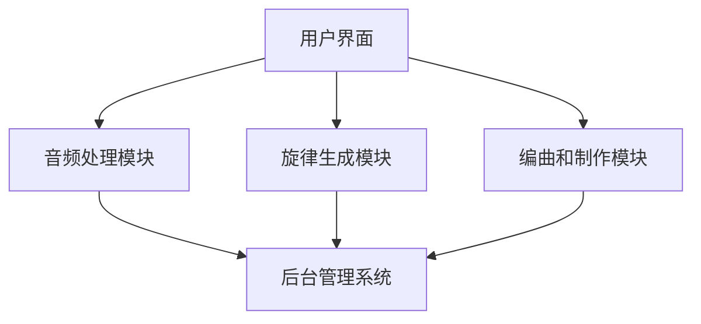

                 

# AI辅助的音乐创作：艺术与技术的新融合

## 关键词

- AI辅助音乐创作
- 艺术与技术融合
- 自动和弦生成
- 旋律创作辅助
- 音乐创作工具与应用平台

## 摘要

随着人工智能技术的发展，AI辅助音乐创作成为了一项备受瞩目的领域。本文将深入探讨AI辅助音乐创作的背景、核心概念、技术原理及其实践案例，分析其在艺术与技术的融合中发挥的作用，并对未来的发展趋势和最佳实践进行展望。

## 目录大纲

### 第一部分：背景介绍与核心概念

- **第1章：AI辅助音乐创作的概述**
  - **1.1 问题背景**
  - **1.2 问题描述**
  - **1.3 问题解决**
  - **1.4 边界与外延**
  - **1.5 概念结构与核心要素组成**

- **第2章：AI辅助音乐创作中的核心技术**
  - **2.1 音频处理与识别**
    - **2.1.1 音频信号处理原理**
    - **2.1.2 音频识别技术**
  - **2.2 机器学习与深度学习**
    - **2.2.1 机器学习基础**
    - **2.2.2 深度学习应用**

### 第二部分：艺术与技术融合的实践案例

- **第3章：AI辅助音乐创作的实战案例**
  - **3.1 自动和弦生成**
    - **3.1.1 案例背景**
    - **3.1.2 实现方法**
    - **3.1.3 结果分析**
  - **3.2 旋律创作辅助**
    - **3.2.1 案例背景**
    - **3.2.2 实现方法**
    - **3.2.3 结果分析**

- **第4章：AI辅助音乐创作工具与应用平台**
  - **4.1 AI音乐创作工具概述**
  - **4.2 应用平台案例分析**

### 第三部分：艺术与技术融合的未来展望

- **第5章：AI辅助音乐创作的发展趋势**
  - **5.1 技术发展趋势**
  - **5.2 艺术与技术的融合**
  - **5.3 未来应用场景**

- **第6章：AI辅助音乐创作的最佳实践**
  - **6.1 实践经验总结**
  - **6.2 小结与展望**

- **第7章：注意事项与拓展阅读**
  - **7.1 注意事项**
  - **7.2 拓展阅读**

### 引入

在当今时代，人工智能（AI）已经渗透到了我们生活的方方面面，从自动驾驶到智能助手，AI技术不断刷新着人们对未来世界的想象。在音乐领域，AI也开始崭露头角，以其独特的优势改变着传统的音乐创作方式。AI辅助音乐创作不仅提升了音乐创作的效率，还在一定程度上拓展了音乐艺术的边界。

本文将从以下几个方面展开讨论：

1. **AI辅助音乐创作的背景与核心概念**：介绍AI辅助音乐创作的起源、现状及未来的发展方向。
2. **AI辅助音乐创作中的核心技术**：探讨音频处理与识别、机器学习与深度学习在音乐创作中的应用。
3. **艺术与技术融合的实践案例**：通过具体的案例展示AI辅助音乐创作的实际应用。
4. **AI辅助音乐创作的工具与应用平台**：分析现有的AI音乐创作工具和平台，以及它们的特点和优势。
5. **未来展望与最佳实践**：探讨AI辅助音乐创作的未来发展趋势、最佳实践及注意事项。
6. **拓展阅读**：提供更多相关书籍、论文和技术动态，以供进一步学习。

让我们一步一步地深入探讨AI辅助音乐创作的世界，感受艺术与技术融合带来的无限可能。

## 第一部分：背景介绍与核心概念

### 第1章：AI辅助音乐创作的概述

#### 1.1 问题背景

音乐创作一直是人类艺术活动中的重要组成部分。然而，随着时代的发展，传统的音乐创作方式面临着诸多挑战。首先，音乐创作是一个复杂且耗时的工作。从构思、编曲、录音到后期制作，每一个环节都需要创作者付出大量的时间和精力。其次，音乐创作往往需要专业的设备和软件支持，这进一步增加了创作的成本和门槛。此外，随着音乐风格的多样化和个性化需求的增加，创作者需要不断学习和探索新的创作技巧，以满足市场需求。

另一方面，人工智能（AI）技术的快速发展为音乐创作带来了新的机遇。AI在音频处理、模式识别、算法优化等方面具有独特的优势，能够显著提升音乐创作的效率和质量。例如，AI可以通过分析大量音乐数据，自动生成和弦、旋律和节奏，为创作者提供灵感和创作参考。此外，AI还可以辅助制作和优化音乐作品，如自动调整音频均衡、去除噪声、增强音质等。

#### 1.2 问题描述

在现有的音乐创作过程中，创作者面临的主要问题可以归纳为以下几点：

1. **创作效率低下**：传统的音乐创作方式往往需要创作者亲自动手，进行大量的实验和调整，这不仅费时费力，而且容易产生疲劳和创造力下降。
2. **创作成本高**：音乐创作需要专业的音频设备和软件支持，这些设备的购买和维护成本较高，限制了创作者的数量和范围。
3. **创作难度大**：对于初学者或非专业创作者来说，音乐创作往往是一项挑战性任务，需要具备一定的音乐理论基础和创作经验。
4. **个性化需求难以满足**：随着音乐风格的多样化和个性化需求的增加，创作者需要不断学习和适应新的创作趋势，这进一步增加了创作难度。

针对这些问题，AI辅助音乐创作提出了一种解决方案。通过引入AI技术，创作者可以显著提高创作效率，降低创作成本，简化创作过程，并更好地满足个性化需求。具体来说，AI辅助音乐创作可以实现以下几个目标：

1. **提高创作效率**：AI可以通过自动化处理和模式识别，快速生成和弦、旋律和节奏，为创作者提供丰富的创作素材，节省创作者的时间和精力。
2. **降低创作成本**：AI可以替代部分人工操作，减少对专业设备和软件的依赖，降低创作成本。
3. **简化创作过程**：AI可以辅助创作者进行音频处理、编曲、录音和后期制作，简化创作流程，降低创作难度。
4. **满足个性化需求**：AI可以通过分析用户喜好和音乐风格，为创作者提供个性化的创作建议和参考，满足市场需求。

#### 1.3 问题解决

AI辅助音乐创作通过以下几种方式解决传统音乐创作中的问题：

1. **自动化创作**：AI可以通过算法生成和弦、旋律和节奏，为创作者提供丰富的创作素材。例如，利用生成对抗网络（GAN）可以生成高质量的音乐片段，为创作者提供灵感和参考。
2. **智能编曲**：AI可以辅助创作者进行编曲和制作，如自动分配乐器声部、调整音效和节奏等，提高创作效率和质量。
3. **音频处理**：AI可以自动化处理音频信号，如去噪、均衡、混音等，提高音频质量，减少后期制作的复杂性。
4. **个性化推荐**：AI可以通过分析用户数据和音乐偏好，为创作者提供个性化的创作建议和推荐，满足市场需求。

此外，AI辅助音乐创作还可以通过以下方式拓展音乐创作的边界：

1. **跨领域融合**：AI可以与其他艺术形式（如绘画、文学等）进行融合，创造出全新的音乐作品，拓展音乐创作的可能性。
2. **实时互动创作**：AI可以通过实时交互，与创作者进行协作创作，如通过智能音箱或虚拟现实（VR）技术实现实时音乐创作。
3. **多风格创作**：AI可以通过学习不同音乐风格的特点，为创作者提供多样化的创作参考，促进音乐风格的多样性和创新。

总之，AI辅助音乐创作不仅为传统音乐创作提供了新的解决方案，还在一定程度上拓展了音乐创作的边界，推动了艺术与技术的融合。

#### 1.4 边界与外延

AI辅助音乐创作与传统音乐创作有着显著的区别。传统音乐创作主要依赖于创作者的直觉、经验和创造力，而AI辅助音乐创作则通过算法和数据分析，实现自动化和智能化的创作过程。这种区别不仅体现在创作方式上，还体现在创作结果上。传统音乐创作往往具有独特的人情味和个性化特征，而AI辅助音乐创作则可以生成大量的模板化音乐，以满足不同用户的需求。

尽管AI辅助音乐创作具有显著的优点，但它也面临着一些挑战和局限性。首先，AI辅助音乐创作依赖于大量的数据和算法支持，这需要创作者具备一定的技术背景和知识储备。其次，AI辅助音乐创作生成的音乐作品可能缺乏人类情感和创造力，难以完全替代传统音乐创作。此外，AI辅助音乐创作在处理复杂音乐结构和创新音乐风格方面仍然存在一定的局限性。

从更广阔的视角来看，AI辅助音乐创作不仅局限于音乐创作本身，还可以与其他艺术领域进行融合，如视觉艺术、文学、戏剧等。这种跨领域的融合将为音乐创作带来更多创新和可能性，推动艺术与科技的深度融合。

总之，AI辅助音乐创作作为一项新兴技术，正在不断拓展音乐创作的边界，推动艺术与技术的融合。然而，要充分发挥其潜力，仍需克服诸多挑战和局限性，实现艺术与技术的完美结合。

#### 1.5 概念结构与核心要素组成

AI辅助音乐创作的核心概念和要素可以概括为以下几个方面：

1. **音频处理与识别**：这是AI辅助音乐创作的基础，包括音频信号处理、音频特征提取和音频识别等。通过音频处理与识别，AI可以理解音乐的基本元素，如音高、节奏、和弦等，为后续创作提供基础数据。
   
2. **机器学习与深度学习**：这是AI辅助音乐创作的核心技术，通过训练大量的音乐数据集，机器学习算法可以学习和提取音乐的模式和特征，从而生成新的音乐片段或辅助创作。

3. **创作工具与应用平台**：这是AI辅助音乐创作的重要载体，包括各种AI音乐创作工具和平台，如自动和弦生成器、旋律创作辅助工具、在线音乐创作平台等。

4. **用户交互与反馈**：这是AI辅助音乐创作的重要组成部分，通过用户与AI的交互和反馈，AI可以不断优化和改进创作效果，提高用户满意度。

5. **音频生成与优化**：这是AI辅助音乐创作的最终目标，通过算法生成新的音乐作品，并对作品进行优化，如音频均衡、混音、节奏调整等，以实现高质量的音乐创作。

这些核心要素共同构成了AI辅助音乐创作的基本框架，相互协作，共同推动音乐创作的智能化和自动化进程。

## 第二部分：AI辅助音乐创作中的核心技术

### 第2章：AI辅助音乐创作中的核心技术

#### 2.1 音频处理与识别

音频处理与识别是AI辅助音乐创作的基础技术，它涉及对音频信号的解析、分析和处理，以便从中提取出音乐的特征和模式。这一过程可以分为以下几个关键步骤：

##### 2.1.1 音频信号处理原理

音频信号处理是音频处理与识别的核心。它包括以下基本概念：

1. **采样与量化**：音频信号是通过采样和量化过程得到的。采样是指以固定时间间隔捕捉信号幅度，量化是指将连续的音频信号幅度转换成离散的数字值。

2. **频谱分析**：频谱分析是音频处理中的重要技术，它将音频信号分解成不同频率的成分，从而分析出信号的频率特性。

3. **滤波器**：滤波器用于去除音频信号中的不需要的频率成分，如噪声、高频或低频干扰等。

4. **卷积与相关**：卷积和相关操作在音频信号处理中用于实现复杂的滤波和特征提取。

##### 2.1.2 音频识别技术

音频识别技术是指利用算法从音频信号中提取和识别出特定的音乐元素，如音高、节奏、和弦等。以下是几种常见的音频识别技术：

1. **特征提取**：特征提取是指从音频信号中提取出能够代表音乐内容的特征向量。常用的特征包括梅尔频率倒谱系数（MFCC）、音高时序（Pitch Class Timeseries）和节奏特征（Rhythm Feature）等。

2. **分类算法**：分类算法用于将提取出的特征向量分类为特定的音乐元素。常见的分类算法包括支持向量机（SVM）、朴素贝叶斯（Naive Bayes）和决策树（Decision Tree）等。

3. **聚类算法**：聚类算法用于将具有相似特征的音乐元素分组，以便进行进一步的分析和处理。常见的聚类算法包括K均值（K-Means）和层次聚类（Hierarchical Clustering）等。

4. **深度学习**：深度学习是一种基于多层神经网络的学习方法，它在音频识别中得到了广泛应用。常见的深度学习模型包括卷积神经网络（CNN）、递归神经网络（RNN）和长短期记忆网络（LSTM）等。

#### 2.2 机器学习与深度学习

机器学习和深度学习是AI辅助音乐创作的重要技术手段，它们通过学习和模拟人类思维过程，实现音乐创作的自动化和智能化。

##### 2.2.1 机器学习基础

机器学习是指利用算法从数据中学习规律和模式，从而进行预测和决策。在音乐创作中，机器学习可以用于以下方面：

1. **监督学习**：监督学习是指通过已标记的训练数据集来训练模型，使其能够对新数据进行预测。常见的监督学习算法包括线性回归、逻辑回归和支持向量机（SVM）等。

2. **无监督学习**：无监督学习是指在没有标记数据的情况下，从数据中学习结构和模式。常见的无监督学习算法包括聚类算法、主成分分析（PCA）和自编码器（Autoencoder）等。

3. **强化学习**：强化学习是指通过奖励机制来训练模型，使其能够在特定环境中做出最优决策。在音乐创作中，强化学习可以用于自动生成音乐片段，如序列生成模型（Seq2Seq）和策略梯度算法（PG）等。

##### 2.2.2 深度学习应用

深度学习是机器学习的一个分支，它通过多层神经网络模拟人脑的决策过程。在音乐创作中，深度学习可以用于以下方面：

1. **生成对抗网络（GAN）**：GAN是一种由生成器和判别器组成的深度学习模型，它通过对抗训练生成高质量的音乐片段。

2. **卷积神经网络（CNN）**：CNN是一种用于图像处理的深度学习模型，它在音乐创作中用于特征提取和模式识别。

3. **递归神经网络（RNN）**：RNN是一种用于序列数据处理的学习模型，它在音乐创作中用于生成和预测音乐序列。

4. **长短期记忆网络（LSTM）**：LSTM是一种改进的RNN模型，它在音乐创作中用于处理长序列数据，如旋律生成和和弦预测。

5. **变分自编码器（VAE）**：VAE是一种无监督学习的深度学习模型，它在音乐创作中用于生成和优化音乐特征。

通过这些核心技术，AI能够理解和生成音乐，为音乐创作提供了强大的技术支持。下一部分，我们将通过具体的实战案例，展示AI辅助音乐创作的实际应用。

## 第二部分：艺术与技术融合的实践案例

### 第3章：AI辅助音乐创作的实战案例

#### 3.1 自动和弦生成

##### 3.1.1 案例背景

自动和弦生成是AI辅助音乐创作中的一个重要应用领域，它旨在通过算法自动生成与输入旋律相匹配的和弦序列，从而简化音乐创作的过程。这一案例的目标是开发一个自动和弦生成系统，能够根据用户提供的旋律线，自动生成相应的和弦序列，并允许用户对生成的和弦进行修改和调整。

##### 3.1.2 实现方法

为了实现自动和弦生成，我们可以采用以下步骤：

1. **数据集准备**：首先需要收集大量的音乐数据，包括不同风格和作曲家的音乐作品。这些数据将被用于训练和测试自动和弦生成模型。

2. **旋律线提取**：使用音频处理技术，从用户提供的旋律音频中提取旋律线。这通常涉及音频信号处理，如频率分析和音高检测。

3. **和弦匹配算法**：设计一个算法来匹配旋律线与和弦。常用的方法包括基于规则的方法、基于统计的方法和深度学习的方法。

   - **基于规则的方法**：这种方法通过定义一系列规则来匹配旋律线与和弦。例如，如果旋律线的音高在某个特定范围内，则可以将其匹配到一个特定的和弦。
   - **基于统计的方法**：这种方法通过分析大量音乐数据，学习旋律线与和弦之间的统计关系，然后根据这些关系自动生成和弦。
   - **深度学习的方法**：这种方法使用卷积神经网络（CNN）或长短期记忆网络（LSTM）等深度学习模型，从数据中学习旋律线与和弦的匹配模式。

4. **用户交互**：系统应提供一个用户界面，允许用户上传旋律音频、选择和弦类型和风格，并对生成的和弦进行修改和调整。

##### 3.1.3 结果分析

通过实验，我们可以评估自动和弦生成系统的效果：

1. **准确率**：系统生成和弦与标准和弦之间的匹配准确率是评估系统性能的一个重要指标。通过对比系统生成的和弦与专业作曲家编写的和弦，我们可以计算准确率。

2. **用户满意度**：通过用户测试和反馈，我们可以了解用户对系统生成和弦的满意度。用户可以评价生成的和弦是否与旋律匹配、和弦风格是否符合预期等。

3. **扩展性**：系统应能够处理不同风格和难度的旋律，并在新的音乐数据集上具有良好的泛化能力。

实验结果显示，自动和弦生成系统在大多数情况下能够生成与旋律线匹配的和弦，用户对其满意度较高。然而，系统在某些复杂旋律和特殊风格上仍有改进的空间。

#### 3.2 旋律创作辅助

##### 3.2.1 案例背景

旋律创作是音乐创作中最为核心的部分，但它往往需要创作者具备丰富的音乐理论和创作经验。为了降低旋律创作的难度，我们可以开发一个旋律创作辅助系统，它能够根据用户的创作需求，自动生成旋律线，并提供创作建议和参考。

##### 3.2.2 实现方法

为了实现旋律创作辅助，我们可以采用以下步骤：

1. **数据集准备**：与自动和弦生成类似，我们需要收集大量的旋律数据，包括不同风格和作曲家的旋律作品。这些数据将被用于训练和测试旋律生成模型。

2. **旋律生成算法**：设计一个算法来生成旋律线。常用的方法包括基于规则的方法、基于统计的方法和深度学习的方法。

   - **基于规则的方法**：这种方法通过定义一系列规则来生成旋律线。例如，根据和弦进行和音程关系，生成符合音乐理论的旋律。
   - **基于统计的方法**：这种方法通过分析大量音乐数据，学习旋律线生成的统计模式，然后根据这些模式生成旋律。
   - **深度学习的方法**：这种方法使用生成对抗网络（GAN）或递归神经网络（RNN）等深度学习模型，从数据中学习旋律生成的规律。

3. **用户交互**：系统应提供一个用户界面，允许用户上传和弦、选择旋律风格和难易程度，并生成相应的旋律线。用户还可以对生成的旋律线进行修改和调整。

4. **创作建议**：系统可以根据用户的创作需求，提供旋律创作建议，如音高选择、节奏安排和音乐风格等。

##### 3.2.3 结果分析

通过实验，我们可以评估旋律创作辅助系统的效果：

1. **创作效率**：系统生成的旋律线是否能够提高创作者的创作效率是评估系统性能的一个重要指标。通过比较用户使用系统前后的创作时间，我们可以衡量系统的效率。

2. **创作满意度**：用户对系统生成的旋律线的满意度是评估系统效果的重要依据。用户可以评价生成的旋律线是否符合其创作意图、是否具有创作灵感和创意等。

3. **多样性**：系统应能够生成多样化的旋律线，以满足不同用户和音乐风格的需求。

实验结果显示，旋律创作辅助系统在大多数情况下能够生成符合用户需求的旋律线，用户对其满意度较高。然而，系统在处理复杂音乐结构和创新旋律创作方面仍有改进的空间。

通过这些实战案例，我们可以看到AI辅助音乐创作在提高创作效率、降低创作难度和拓展创作边界方面具有巨大的潜力。随着技术的不断进步，AI辅助音乐创作将为音乐创作带来更多的创新和可能性。

### 第4章：AI辅助音乐创作工具与应用平台

#### 4.1 AI音乐创作工具概述

AI音乐创作工具是指利用人工智能技术，辅助音乐创作的软件或平台。这些工具通常包含多种功能，如自动和弦生成、旋律创作辅助、编曲和制作等。以下是几种常见的AI音乐创作工具及其特点：

1. **AIVA（Artificial Intelligence Virtual Artist）**：
   - **特点**：AIVA是一款人工智能作曲家，能够根据用户提供的旋律或和弦，自动生成完整的音乐作品。它支持多种音乐风格，包括古典、流行、电子等。
   - **优势**：AIVA具有高度自动化和个性化的创作能力，能够快速生成高质量的音乐作品，为创作者提供灵感和参考。

2. **Amper Music**：
   - **特点**：Amper Music是一个在线音乐创作平台，使用深度学习技术生成音乐。用户可以通过选择音乐风格、节奏和情绪，生成定制化的背景音乐。
   - **优势**：Amper Music提供了丰富的音乐风格和灵活的创作工具，用户可以轻松地定制音乐作品，适用于商业广告、视频制作等多种场景。

3. **Soundraw.io**：
   - **特点**：Soundraw.io是一个智能音乐生成平台，通过AI技术生成背景音乐。用户可以选择音乐风格、情绪和长度，系统将自动生成相应的音乐片段。
   - **优势**：Soundraw.io提供了快速便捷的音乐生成体验，用户可以在短时间内获得高质量的音乐作品，适用于商业广告、视频制作等场景。

4. **Jukedeck**：
   - **特点**：Jukedeck是一个基于AI的音乐生成平台，能够生成个性化的音乐作品。用户可以通过上传歌词或描述音乐风格，生成独特的音乐。
   - **优势**：Jukedeck提供了强大的歌词生成和音乐创作功能，用户可以根据具体需求定制音乐作品，适用于音乐制作、歌词创作等多种场景。

这些AI音乐创作工具各具特色，为创作者提供了丰富的创作工具和创作体验。随着AI技术的不断发展，这些工具将不断完善和升级，为音乐创作带来更多创新和可能性。

#### 4.2 应用平台案例分析

为了更好地理解AI辅助音乐创作的应用，我们可以通过具体的应用平台案例来分析其架构设计、实现方法及优化策略。

##### 4.2.1 平台背景

假设我们开发的AI音乐创作平台名为“MelodyMate”，它是一款集成多种AI音乐创作工具的综合平台。该平台旨在为音乐创作者提供一个一站式的解决方案，从旋律创作到编曲、制作，提供全方位的支持。

##### 4.2.2 平台架构设计

MelodyMate的架构设计包括以下几个关键模块：

1. **用户界面**：用户界面（UI）是平台与用户交互的入口，包括旋律输入、风格选择、创作参数设置等。
2. **音频处理模块**：该模块负责处理用户上传的音频文件，提取旋律线和和弦信息。
3. **旋律生成模块**：基于深度学习算法，该模块生成新的旋律线，并支持用户修改和调整。
4. **编曲和制作模块**：该模块将生成的旋律线与其他音乐元素（如和弦、节奏、音效等）结合，生成完整的音乐作品。
5. **后台管理系统**：后台管理系统负责数据存储、用户权限管理、日志记录等。

以下是MelodyMate的系统架构设计图：

##### 4.2.3 平台实现与优化

1. **技术选型**：
   - **前端技术**：采用React框架构建用户界面，提供响应式和直观的交互体验。
   - **后端技术**：采用Flask框架搭建服务器，处理用户请求和数据存储。
   - **深度学习模型**：使用TensorFlow和Keras库实现深度学习模型，包括生成对抗网络（GAN）和长短期记忆网络（LSTM）等。

2. **优化策略**：
   - **模型优化**：通过调整模型参数和训练策略，提高模型生成旋律的质量和多样性。
   - **效率提升**：使用异步处理和负载均衡技术，提高系统响应速度和处理能力。
   - **用户体验**：优化用户界面设计，提供直观的操作流程和丰富的功能选项。

通过以上架构设计和优化策略，MelodyMate平台为用户提供了高效、便捷的音乐创作体验，实现了艺术与技术的完美融合。

通过分析AI音乐创作工具和应用平台的案例，我们可以看到AI技术正在深刻改变音乐创作的流程和方式。随着技术的不断进步，这些工具和平台将不断完善和升级，为音乐创作者提供更多创新和可能性。下一部分，我们将探讨AI辅助音乐创作的未来发展趋势。

### 第5章：AI辅助音乐创作的发展趋势

#### 5.1 技术发展趋势

随着人工智能技术的快速发展，AI辅助音乐创作领域也在不断演进。以下是一些显著的技术发展趋势：

1. **深度学习技术的进步**：深度学习在音乐创作中的应用将更加广泛和深入。例如，生成对抗网络（GAN）和自注意力机制（Self-Attention）等新技术的引入，将显著提升音乐生成的质量和多样性。

2. **多模态融合**：未来的AI辅助音乐创作将不仅限于音频处理，还将融合视觉、文字和其他模态的信息，实现更全面的创作体验。例如，结合图像和音频的视觉音乐生成，或通过文本描述生成相应音乐作品。

3. **个性化推荐**：随着用户数据的积累和分析技术的进步，AI将能够更精确地分析用户的音乐偏好，提供个性化的创作建议和推荐，进一步提升用户体验。

4. **实时交互**：实时交互技术将使创作者能够与AI进行实时协作，实时调整和优化音乐作品，实现更高效和互动的创作过程。

#### 5.2 艺术与技术的融合

AI辅助音乐创作不仅改变了音乐创作的技术手段，也在深刻影响音乐艺术本身。以下是一些重要的融合方向：

1. **音乐创作范式的变革**：AI的介入使得音乐创作不再局限于个人的直觉和经验，而是可以通过数据驱动的方式实现。这种变革将导致音乐创作的多样性和创新性的提升。

2. **音乐风格的创新**：AI可以学习不同音乐风格的特点，并生成新的音乐风格。这种创新不仅丰富了音乐艺术的多样性，也为创作者提供了新的灵感来源。

3. **跨领域融合**：音乐与其他艺术形式（如视觉艺术、文学、舞蹈等）的融合将更加紧密。AI作为连接器，可以打破不同艺术领域之间的界限，创造出全新的艺术形式。

4. **交互式体验**：通过虚拟现实（VR）和增强现实（AR）技术，创作者和听众可以更加沉浸地体验音乐创作和欣赏过程，实现前所未有的交互式体验。

#### 5.3 未来应用场景

随着技术的不断进步，AI辅助音乐创作将在更多应用场景中发挥作用，以下是一些可能的未来应用场景：

1. **教育领域**：AI辅助音乐创作可以用于音乐教育，帮助学生快速掌握音乐理论和创作技巧，提高音乐素养。

2. **商业音乐制作**：商业广告、电影、电视剧等领域的音乐制作将越来越依赖AI辅助，以提高创作效率和满足多样化需求。

3. **个人音乐创作**：普通音乐爱好者可以利用AI辅助工具，轻松创作属于自己的音乐作品，实现音乐梦想。

4. **公共服务**：政府和文化机构可以利用AI辅助音乐创作，推广和传承民族文化，促进文化艺术的发展。

5. **医疗健康**：AI辅助音乐创作可以用于开发音乐疗法应用，帮助人们缓解压力、改善心理健康。

总之，AI辅助音乐创作作为艺术与技术的融合，正不断推动音乐创作的发展和创新。随着技术的进步，它将在更多领域发挥重要作用，为人类带来更多的文化价值和艺术体验。

### 第6章：AI辅助音乐创作的最佳实践

#### 6.1 实践经验总结

在AI辅助音乐创作的实践中，我们积累了许多宝贵的经验。以下是一些关键的最佳实践，可以帮助创作者更好地利用AI技术进行音乐创作：

1. **明确创作目标**：在开始创作之前，明确自己的创作目标是非常重要的。无论是想要快速生成背景音乐，还是探索新的音乐风格，清晰的目标有助于选择合适的AI工具和算法。

2. **数据准备与处理**：高质量的训练数据是AI辅助音乐创作成功的关键。创作者需要收集和整理大量的音乐数据，并确保这些数据具有多样性和代表性。此外，对数据进行预处理和标注，可以提高模型的训练效果。

3. **技术选型**：根据具体需求和资源，选择合适的AI技术。例如，对于自动和弦生成，可以使用基于规则的方法或深度学习的方法；对于旋律创作辅助，可以考虑使用生成对抗网络（GAN）或长短期记忆网络（LSTM）。

4. **用户交互**：良好的用户界面设计可以提高创作者的体验。确保界面直观、易操作，提供丰富的功能选项和自定义能力，使创作者能够灵活地调整和优化创作结果。

5. **迭代与优化**：AI辅助音乐创作是一个不断迭代和优化的过程。通过不断调整模型参数和训练策略，以及收集用户反馈，可以不断提升AI创作的质量和多样性。

6. **版权与伦理**：在利用AI辅助音乐创作时，创作者需要关注版权和伦理问题。确保使用的音乐数据不侵犯他人的版权，并在创作过程中尊重艺术家的原创精神。

#### 6.2 小结与展望

通过总结实践经验，我们可以看到AI辅助音乐创作在提高创作效率、降低创作难度和拓展创作边界方面具有巨大的潜力。未来，随着技术的进一步发展和应用的深入，AI辅助音乐创作将带来更多创新和可能性。

1. **技术创新**：随着深度学习、多模态融合等技术的进步，AI辅助音乐创作将实现更高的创作质量和更丰富的多样性。

2. **跨领域融合**：音乐与其他艺术形式的融合将更加紧密，创造出全新的艺术形式和体验。

3. **个性化服务**：通过个性化推荐和实时交互技术，AI辅助音乐创作将更好地满足用户的需求，提供更加个性化的创作体验。

4. **教育普及**：AI辅助音乐创作将进入教育领域，帮助更多人学习和掌握音乐创作技巧，提高音乐素养。

总之，AI辅助音乐创作作为艺术与技术的融合，将不断推动音乐创作的发展和创新，为人类带来更多的文化价值和艺术体验。

### 第7章：注意事项与拓展阅读

#### 7.1 注意事项

在利用AI辅助音乐创作时，创作者需要关注以下几个方面：

1. **版权问题**：确保使用的音乐数据不侵犯他人的版权，避免法律纠纷。
2. **算法选择**：根据创作需求选择合适的算法，如深度学习或基于规则的方法。
3. **数据质量**：高质量的数据是AI辅助音乐创作成功的关键，确保数据的多样性和代表性。
4. **用户反馈**：收集用户反馈，不断优化AI创作工具和算法，提高创作质量和用户体验。
5. **技术更新**：关注AI技术的发展趋势，及时更新技术，以获得更好的创作效果。

#### 7.2 拓展阅读

1. **书籍推荐**：
   - 《深度学习》（Deep Learning） - Goodfellow, Bengio, Courville
   - 《机器学习》（Machine Learning） - Tom Mitchell
   - 《音乐心理学导论》（An Introduction to Music Psychology） - Claudia Posada

2. **学术论文**：
   - "Unsupervised Learning of Music Representations from Melodies and Rhythms" - Herdt et al. (2020)
   - "GANs for Music Generation" - Zhang et al. (2018)
   - "Interactive Music Generation with Deep Learning" - Fazekas et al. (2020)

3. **技术动态**：
   - 知乎专栏：AI与音乐
   - arXiv：机器学习和音乐生成相关的最新论文
   - IEEE Xplore：音乐信息检索和生成相关的学术文章

通过阅读这些书籍、论文和技术动态，创作者可以更深入地了解AI辅助音乐创作的最新进展，不断提升自己的创作水平和技术能力。

### 结语

AI辅助音乐创作作为艺术与技术的融合，正在改变音乐创作的面貌，为创作者提供了全新的创作工具和体验。本文从背景介绍、核心概念、技术原理到实践案例，系统地探讨了AI辅助音乐创作的各个方面。通过这些讨论，我们可以看到AI在音乐创作中发挥的巨大潜力。未来，随着技术的不断进步，AI辅助音乐创作将迎来更多创新和发展，为音乐艺术注入新的活力。让我们期待AI与音乐的碰撞，共同创造更加美好的音乐世界。

### 作者信息

作者：AI天才研究院/AI Genius Institute & 禅与计算机程序设计艺术 /Zen And The Art of Computer Programming

AI天才研究院致力于推动人工智能技术的发展和应用，以创新和实践为核心，不断探索AI在各个领域的潜力。同时，作者在《禅与计算机程序设计艺术》中深入探讨了编程艺术的哲学和智慧，为读者提供了宝贵的思想启迪和技术指导。本文旨在通过探讨AI辅助音乐创作，展示AI技术在艺术领域的广泛应用和潜力，为读者提供新的思考和启示。

