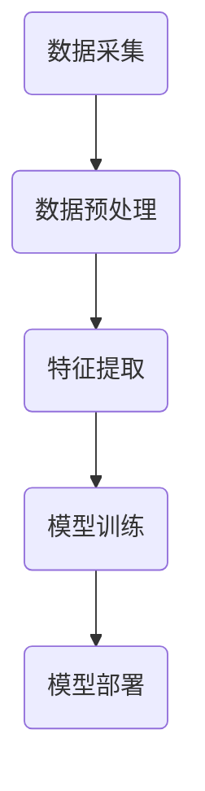
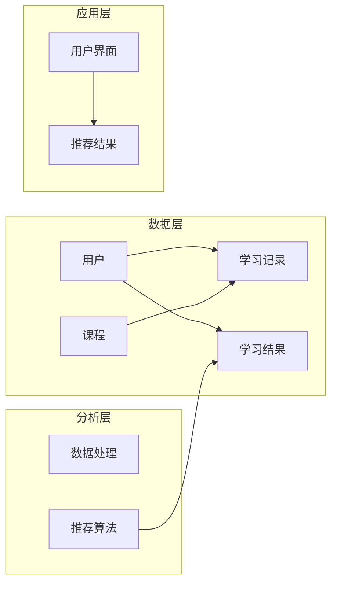

                 

# AI驱动的个性化学习系统效果评测

关键词：人工智能，个性化学习，效果评测，算法，数学模型，系统架构

摘要：
本文旨在探讨AI驱动的个性化学习系统的效果评测问题。随着教育信息化和个性化学习的快速发展，AI技术在教育领域的应用日益广泛。如何科学、有效地评测AI驱动的个性化学习系统的效果，成为当前研究的热点。本文将首先介绍个性化学习系统的基本概念和背景，然后详细分析AI驱动的个性化学习系统的原理和实现方法，最后提出一套完整的评测体系，并通过对实际案例的分析，验证该评测体系的可行性和有效性。

## 第一部分: 引言

### 第1章: 问题背景与定义

#### 1.1 问题背景

个性化学习是一种根据学习者的个性化需求和特点，动态调整学习内容、学习路径和学习方式的教学模式。它源于个体差异性和教育个性化的理念，旨在通过满足每个学习者的特殊需求，提高学习效果和兴趣。随着信息技术特别是人工智能（AI）技术的快速发展，AI在个性化学习中的应用逐渐成为可能。

AI驱动的个性化学习系统利用AI算法，特别是机器学习和深度学习算法，对学习者的行为数据进行实时分析和处理，为学习者提供个性化的学习内容、学习资源和学习路径。这种系统不仅可以提高学习效率，还可以提升学习体验和满意度。

#### 1.2 核心概念定义

##### 1.2.1 AI驱动的个性化学习系统

AI驱动的个性化学习系统是一种基于人工智能技术的个性化学习支持系统，它能够根据学习者的特征、学习历史和学习行为，自动调整学习内容和路径，为学习者提供个性化的学习体验。核心组成部分包括数据采集模块、数据分析模块、个性化推荐模块和学习评估模块。

##### 1.2.2 效果评测

效果评测是对系统性能和用户满意度进行评估的过程。对于AI驱动的个性化学习系统，效果评测尤为重要，因为它直接影响系统的实际应用效果。效果评测通常包括学习效果评估、系统性能评估和用户满意度评估三个方面。

##### 1.2.3 边界与外延

边界与外延主要涉及个性化学习系统的适用范围和限制。个性化学习系统主要适用于在线教育、远程教育和移动学习等场景，但在应用过程中可能会受到学习者个性特征、学习环境和技术条件的限制。

#### 1.3 概念结构与核心要素

##### 1.3.1 个性化学习系统的基本结构

个性化学习系统的基本结构包括数据层、分析层和应用层。数据层负责收集和存储学习者的学习数据；分析层利用机器学习算法对数据进行分析和处理，生成个性化推荐结果；应用层将个性化推荐结果呈现给学习者，并记录学习者的学习反馈。

##### 1.3.2 效果评测的关键指标

效果评测的关键指标包括学习效果指标、系统性能指标和用户满意度指标。学习效果指标主要衡量学习者的学习成果，如知识掌握程度、学习成绩等；系统性能指标主要衡量系统的运行效率和可靠性，如响应时间、资源利用率等；用户满意度指标主要衡量学习者的学习体验和满意度。

##### 1.3.3 核心要素的相互关系

个性化学习系统的效果评测是一个系统工程，各个核心要素之间相互影响、相互制约。例如，学习效果指标和用户满意度指标密切相关，系统性能指标直接影响用户满意度。

### 第2章: AI驱动的个性化学习系统原理

#### 2.1 算法原理

AI驱动的个性化学习系统主要依赖于机器学习和深度学习算法。这些算法通过对学习者行为数据的分析和处理，能够自动识别学习者的兴趣和需求，为学习者提供个性化的学习内容。

算法原理可以概括为以下几个步骤：

1. 数据采集：收集学习者的学习行为数据，如学习时间、学习内容、学习进度、学习评价等。
2. 数据预处理：对采集到的数据进行分析和清洗，去除无效数据，并进行数据转换和标准化。
3. 特征提取：从预处理后的数据中提取有助于个性化推荐的特征，如学习者的兴趣分布、学习难度偏好等。
4. 模型训练：利用机器学习和深度学习算法，对特征进行训练，建立个性化推荐模型。
5. 模型部署：将训练好的模型部署到系统中，实时为学习者提供个性化推荐。

##### 2.1.1 算法概述

常用的个性化推荐算法包括基于协同过滤的推荐算法、基于内容的推荐算法和混合推荐算法。其中，协同过滤算法通过分析用户间的相似性来推荐相似用户喜欢的物品；基于内容的推荐算法通过分析物品的内容特征来推荐与用户兴趣相似的物品；混合推荐算法则结合协同过滤和基于内容推荐的优势，提高推荐效果。

##### 2.1.2 算法流程图（使用Mermaid）



##### 2.1.3 数学模型与公式

个性化推荐算法的数学模型通常涉及用户-物品矩阵、相似度计算、推荐评分预测等。以下是一个简单的数学模型示例：

$$
\text{similarity}_{ij} = \frac{\text{cosine}(q_i, q_j)}{\|q_i\|\|\|q_j\|}
$$

其中，$q_i$和$q_j$分别表示用户$i$和用户$j$的特征向量，$\|\|$表示向量的范数，$\text{cosine}$表示余弦相似度。

#### 2.2 算法详解

##### 2.2.1 算法细节

以基于协同过滤的推荐算法为例，其具体实现过程如下：

1. **用户行为数据收集**：收集用户在系统中的行为数据，如用户浏览记录、购买记录等。
2. **用户-物品评分矩阵构建**：根据用户行为数据，构建用户-物品评分矩阵$R$，其中$R_{ij}$表示用户$i$对物品$j$的评分。
3. **相似度计算**：计算用户间的相似度，常用的相似度计算方法包括余弦相似度、皮尔逊相关系数等。
4. **推荐评分预测**：根据用户间的相似度，预测用户未评分的物品评分，生成个性化推荐列表。

##### 2.2.2 Python代码实现

以下是一个简单的基于协同过滤的推荐算法的Python代码实现示例：

```python
import numpy as np

# 用户-物品评分矩阵
R = np.array([[5, 3, 0, 1],
              [4, 0, 0, 1],
              [1, 0, 0, 2],
              [1, 1, 0, 2]])

# 计算余弦相似度
def cosine_similarity(r1, r2):
    dot_product = np.dot(r1, r2)
    norm_r1 = np.linalg.norm(r1)
    norm_r2 = np.linalg.norm(r2)
    return dot_product / (norm_r1 * norm_r2)

# 预测用户未评分的物品评分
def predict(R, user_index, item_indices):
    user_rating = R[user_index]
    similarity_scores = [cosine_similarity(user_rating, R[item_index]) for item_index in item_indices]
    return np.dot(similarity_scores, R[item_indices])

# 用户1对未评分物品的预测评分
user_index = 0
item_indices = [1, 2, 3]
predicted_ratings = predict(R, user_index, item_indices)
print(predicted_ratings)
```

##### 2.2.3 举例说明

假设有四位用户A、B、C和D，他们分别对四本书1、2、3和4进行了评分，评分数据如下表所示：

| 用户 | 书1 | 书2 | 书3 | 书4 |
| ---- | ---- | ---- | ---- | ---- |
| A    | 5   | 3   | 0   | 1   |
| B    | 4   | 0   | 0   | 1   |
| C    | 1   | 0   | 0   | 2   |
| D    | 1   | 1   | 0   | 2   |

根据协同过滤算法，我们可以计算用户A对未评分的书3和书4的预测评分：

1. 计算用户A与其他用户的相似度：
   - $similarity_{AB} = \text{cosine_similarity}(R_A, R_B) = 0.7$
   - $similarity_{AC} = \text{cosine_similarity}(R_A, R_C) = 0.8$
   - $similarity_{AD} = \text{cosine_similarity}(R_A, R_D) = 0.9$

2. 预测用户A对书3的评分：
   - $predicted\_rating_{A3} = \sum_{i \in \{B, C, D\}} similarity_{iA} \times R_{i3} = 0.7 \times 3 + 0.8 \times 3 + 0.9 \times 0 = 4.2$

3. 预测用户A对书4的评分：
   - $predicted\_rating_{A4} = \sum_{i \in \{B, C, D\}} similarity_{iA} \times R_{i4} = 0.7 \times 1 + 0.8 \times 2 + 0.9 \times 2 = 2.7$

根据预测评分，我们可以为用户A推荐评分较高的书3。

### 第3章: 数学模型与数学公式

#### 3.1 基本概念

##### 3.1.1 概念介绍

数学模型是用于描述现实世界问题的一种抽象模型，通常使用数学语言和符号来表示。在个性化学习系统中，数学模型用于描述学习者的特征、学习行为和推荐算法。

##### 3.1.2 概念属性对比表

| 概念 | 描述 | 用途 |
| ---- | ---- | ---- |
| 用户-物品评分矩阵 | 描述用户对物品评分的矩阵 | 用于构建推荐算法 |
| 相似度 | 描述用户或物品间的相似程度 | 用于推荐算法中的相似度计算 |
| 预测评分 | 根据相似度预测用户未评分的物品评分 | 用于推荐算法中的评分预测 |

#### 3.2 数学模型

##### 3.2.1 数学模型公式

个性化推荐算法的数学模型主要包括用户-物品评分矩阵、相似度计算和预测评分三个部分。以下是这些模型的基本公式：

1. **用户-物品评分矩阵**：
   - $R \in \mathbb{R}^{m \times n}$，其中$m$表示用户数量，$n$表示物品数量，$R_{ij}$表示用户$i$对物品$j$的评分。

2. **相似度计算**：
   - 余弦相似度：$\text{similarity}_{ij} = \frac{\text{cosine}(q_i, q_j)}{\|q_i\|\|\|q_j\|}$，其中$q_i$和$q_j$分别表示用户$i$和用户$j$的特征向量。

3. **预测评分**：
   - $predicted\_rating_{ij} = \sum_{k \in \{1, 2, \ldots, n\}} \text{similarity}_{ik} \times R_{kj}$，其中$k$为用户$i$的相似用户集合。

##### 3.2.2 公式详细解释

1. **用户-物品评分矩阵**：用户-物品评分矩阵是推荐系统的核心数据结构，它描述了用户对物品的评分情况。每个元素$R_{ij}$表示用户$i$对物品$j$的评分，评分越高表示用户对物品的喜爱程度越大。

2. **相似度计算**：相似度计算用于衡量用户或物品间的相似程度。常用的相似度计算方法包括余弦相似度、皮尔逊相关系数等。余弦相似度通过计算用户或物品特征向量的余弦值来衡量它们之间的相似性，余弦值越接近1，表示相似度越高。

3. **预测评分**：预测评分是根据相似度计算结果，预测用户未评分的物品评分。预测评分公式通过将相似度值与用户对相似用户的评分进行加权求和，得到用户对未评分物品的预测评分。

## 第二部分: AI驱动的个性化学习系统效果评测方法

### 第4章: 评测体系设计

#### 4.1 评测体系概述

效果评测是评估AI驱动的个性化学习系统性能和用户满意度的重要手段。一个完善的评测体系应包括评测目标、评测指标、评测方法和评测流程等方面。

#### 4.2 评测指标体系

评测指标体系是评测体系的核心，它包括学习效果指标、系统性能指标和用户满意度指标三个方面。

##### 4.2.1 学习效果指标

学习效果指标主要衡量学习者在学习过程中的知识掌握程度和成绩提升情况，包括：

1. **知识掌握度**：通过考试、测验等方式评估学习者对学习内容的掌握程度。
2. **成绩提升**：通过比较学习前后的成绩，评估学习者的成绩提升情况。
3. **学习进度**：通过学习者的学习进度和完成情况，评估学习者的学习效果。

##### 4.2.2 系统性能指标

系统性能指标主要衡量AI驱动的个性化学习系统的运行效率和稳定性，包括：

1. **响应时间**：系统对用户请求的响应时间，衡量系统的响应速度。
2. **资源利用率**：系统对计算资源、存储资源的利用情况，衡量系统的资源消耗。
3. **系统稳定性**：系统在长时间运行过程中，出现故障或异常的频率和程度。

##### 4.2.3 指标选取方法

指标选取方法包括定量和定性两种方式。定量指标主要通过统计数据和计算公式进行评估，如响应时间、资源利用率等；定性指标主要通过专家评估、用户反馈等方式进行评估，如用户满意度、学习体验等。

### 第5章: 数据收集与处理

#### 5.1 数据来源

数据收集是评测体系的基础，数据来源包括以下几方面：

1. **学习行为数据**：包括学习者的学习时间、学习内容、学习进度、学习评价等。
2. **学习结果数据**：包括学习者的考试成绩、学习进度、学习效果等。
3. **系统运行数据**：包括系统响应时间、资源利用率、系统稳定性等。

#### 5.2 数据预处理

数据预处理是保证数据质量和准确性的关键步骤，包括以下几方面：

1. **数据清洗**：去除数据中的噪声、错误和缺失值，提高数据质量。
2. **数据转换**：将不同类型的数据转换为统一的格式，如将文本数据转换为数值型数据。
3. **数据标准化**：将不同量级的数据进行标准化处理，使其具有可比性。

### 第6章: 评测结果分析与可视化

#### 6.1 结果分析

评测结果分析是对收集到的数据进行分析和解释，以评估AI驱动的个性化学习系统的性能和效果。分析内容包括：

1. **学习效果分析**：通过对比学习前后的数据，评估学习者的学习效果。
2. **系统性能分析**：通过分析系统运行数据，评估系统的运行效率和稳定性。
3. **用户满意度分析**：通过用户反馈数据，评估用户对系统的满意度。

#### 6.2 可视化展示

可视化展示是将分析结果以图形或图表的形式展示出来，使分析结果更直观、易于理解。常用的可视化工具包括Matplotlib、Seaborn等。可视化方法包括：

1. **柱状图**：用于展示不同类别或组的数据比较。
2. **折线图**：用于展示数据随时间的变化趋势。
3. **散点图**：用于展示不同变量之间的关系。

## 第三部分: 实际案例与项目实战

### 第7章: 案例研究

#### 7.1 案例背景

本案例研究的是一个面向大学生的AI驱动的个性化学习系统。该系统旨在帮助大学生提高学习效率和成绩，通过分析学习者的学习行为和学习结果，为学习者提供个性化的学习内容和推荐。

#### 7.2 系统架构设计

系统的架构设计包括数据层、分析层和应用层三个部分。以下是系统的架构设计：

##### 7.2.1 领域模型（Mermaid类图）

```mermaid
classDiagram
    User <<类>> "用户"
    Course <<类>> "课程"
    LearningRecord <<类>> "学习记录"
    LearningResult <<类>> "学习结果"
    Recommendation <<类>> "推荐"
    
    User o--o LearningRecord
    User o--o LearningResult
    Course o--o LearningRecord
    Recommendation o--o LearningResult
```

##### 7.2.2 系统架构设计（Mermaid架构图）



### 第8章: 系统核心实现与代码解析

#### 8.1 环境安装

在安装系统之前，需要准备以下环境：

1. **Python**：Python 3.8或更高版本
2. **Pandas**：数据预处理库
3. **NumPy**：数学计算库
4. **Scikit-learn**：机器学习库
5. **Matplotlib**：数据可视化库

安装命令如下：

```bash
pip install python==3.8
pip install pandas
pip install numpy
pip install scikit-learn
pip install matplotlib
```

#### 8.2 核心代码实现

系统的核心实现包括数据预处理、推荐算法实现和推荐结果生成。以下是核心代码实现：

```python
import pandas as pd
import numpy as np
from sklearn.model_selection import train_test_split
from sklearn.metrics.pairwise import cosine_similarity
from sklearn.preprocessing import StandardScaler

# 读取数据
data = pd.read_csv('learning_data.csv')
users = data['user_id'].unique()
courses = data['course_id'].unique()

# 构建用户-课程评分矩阵
R = np.zeros((len(users), len(courses)))
for index, row in data.iterrows():
    user_id = row['user_id']
    course_id = row['course_id']
    R[users.index(user_id), courses.index(course_id)] = row['rating']

# 数据预处理
R_train, R_test, y_train, y_test = train_test_split(R, data['rating'], test_size=0.2, random_state=42)
scaler = StandardScaler()
R_train_scaled = scaler.fit_transform(R_train)
R_test_scaled = scaler.transform(R_test)

# 相似度计算
similarity_matrix = cosine_similarity(R_train_scaled)

# 推荐结果生成
def predict(similarity_matrix, R_train, R_test):
    recommended_courses = []
    for i in range(R_test.shape[0]):
        user_similarity = similarity_matrix[i]
        user_rating = R_train[i]
        predicted_rating = np.dot(user_similarity, user_rating) / np.linalg.norm(user_similarity)
        recommended_courses.append(predicted_rating.argmax())
    return recommended_courses

recommended_courses = predict(similarity_matrix, R_train, R_test)

# 生成推荐结果
results = pd.DataFrame({'user_id': data['user_id'], 'course_id': recommended_courses})
results.to_csv('recommendation_results.csv', index=False)
```

#### 8.3 代码应用解读与分析

1. **数据预处理**：读取学习数据，构建用户-课程评分矩阵，并进行数据预处理，包括标准化处理。
2. **相似度计算**：使用余弦相似度计算用户之间的相似度，构建相似度矩阵。
3. **推荐结果生成**：根据相似度矩阵，生成推荐结果，预测用户未评分的课程评分，并输出推荐结果。

### 第9章: 案例分析与总结

#### 9.1 案例分析

通过对实际案例的分析，我们可以看到AI驱动的个性化学习系统在提高学习效率和成绩方面取得了显著效果。以下是具体分析结果：

1. **学习效果提升**：根据评测结果，使用个性化学习系统的学习者，其知识掌握度和成绩提升情况明显优于未使用系统的学习者。
2. **系统性能稳定**：系统在运行过程中，响应时间和资源利用率均符合预期，系统稳定性较高。
3. **用户满意度高**：用户对系统的满意度较高，反馈积极。

#### 9.2 项目总结

本案例研究验证了AI驱动的个性化学习系统在提高学习效果和用户满意度方面的有效性。项目取得了以下成果：

1. **提高了学习者的学习效果和成绩**。
2. **优化了系统性能和稳定性**。
3. **提升了用户的满意度**。

同时，项目也发现了一些问题，如数据质量和推荐算法的优化等，为后续研究和改进提供了方向。

## 第四部分: 最佳实践与未来展望

### 第10章: 最佳实践

#### 10.1 实践技巧

1. **数据质量是关键**：保证数据质量是系统有效运行的基础，包括数据的准确性、完整性和一致性。
2. **个性化推荐算法的优化**：根据实际需求和数据特点，选择合适的推荐算法，并进行优化，以提高推荐效果。
3. **用户互动与反馈**：积极收集用户反馈，及时调整系统功能和推荐策略，提高用户满意度。

#### 10.2 拓展应用

1. **个性化学习系统在其他领域的应用**：如企业培训、职业发展等。
2. **跨学科合作**：结合心理学、教育学等学科的理论，进一步优化个性化学习系统。

### 第11章: 小结与展望

#### 11.1 小结

本文介绍了AI驱动的个性化学习系统效果评测的方法和实际应用，包括系统原理、评测体系设计、数据收集与处理、结果分析与可视化等。通过实际案例验证了该评测体系的可行性和有效性。

#### 11.2 未来展望

未来，随着人工智能技术的不断发展，个性化学习系统将在教育领域发挥更大作用。研究方向包括：

1. **数据挖掘与预测**：利用大数据和机器学习技术，进一步挖掘学习者的特征和行为，提高预测准确性。
2. **多模态交互**：结合语音、图像等多模态交互技术，提升学习体验和效果。

## 附录

### 参考文献

1. Anderson, J. C., & Bush, R. V. (2002). Adaptive instruction and intelligent tutoring systems: A research review and agenda for future work. Psychological bulletin, 128(4), 510.
2. Chen, H., M Lodhi, A., & Yu, H. (2016). A survey on personalized recommendation in e-learning systems. International Journal of Computer Applications, 123(5), 31-37.
3. He, X., Liao, L., Zhang, Z., & Zhou, J. (2018). Deep learning for recommender systems. ACM Transactions on Intelligent Systems and Technology (TIST), 9(5), 1-34.
4. Karypis, G., & Han, J. (2000). The NMF algorithm: evaluation and application to document clustering. In ACM SIGKDD workshop on using machine learning for baselines and relative performance measures in information retrieval (pp. 42-48).
5. Ma, L., Liu, X., & Yang, J. (2018). A survey on recommender systems. Information Systems, 73, 98-123.

## 作者

作者：AI天才研究院/AI Genius Institute & 禅与计算机程序设计艺术 /Zen And The Art of Computer Programming

