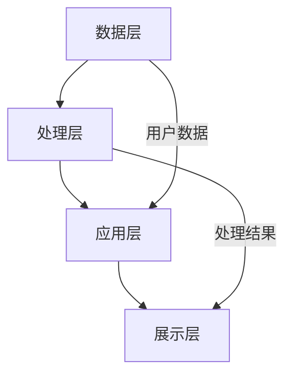
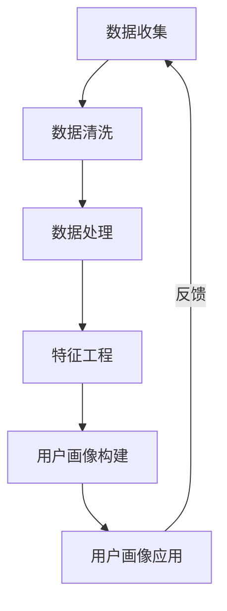

                 

### 第一部分: 问题背景与核心概念

#### 1.1.1 问题背景

##### 1.1.1.1 AI驱动的个性化营销系统概述

在当今数字化的商业环境中，营销策略的成功与否越来越取决于其针对特定消费者的个性化程度。传统的营销手段往往采用“一刀切”的方法，无法满足消费者日益增长的个性化需求。因此，AI驱动的个性化营销系统应运而生，通过利用人工智能技术，根据消费者的行为数据和偏好信息，自动生成并实施个性化的营销策略，从而提高营销效果和客户满意度。

个性化营销系统的主要目标是实现精准营销，即在合适的时间，通过合适的渠道，向合适的消费者推送合适的内容和产品。这种营销方式不仅能有效提高转化率，还能增强消费者对品牌的忠诚度。

##### 1.1.1.2 个性化营销的需求

随着互联网的普及和社交媒体的兴起，消费者的行为数据变得更加丰富和多样化。企业需要通过分析这些数据，深入了解消费者的需求和偏好，从而制定个性化的营销策略。以下是个性化营销需求的主要驱动因素：

1. **数据驱动：** 数据是制定个性化营销策略的基础。通过收集和分析大量的消费者行为数据，企业可以更准确地了解消费者的需求和行为模式。

2. **个性化体验：** 在线购物和社交媒体平台为消费者提供了丰富的选择和体验。消费者期望能够获得个性化的内容和推荐，以满足他们的特定需求。

3. **竞争压力：** 在激烈的市场竞争中，企业需要通过不断创新和改进营销策略，才能吸引和保留客户。个性化营销作为一种有效的营销手段，可以帮助企业脱颖而出。

4. **提高销售额：** 个性化营销系统能够通过提高转化率和客户忠诚度，直接提升企业的销售额和利润。

##### 1.1.1.3 AI技术在个性化营销中的应用

人工智能技术，尤其是机器学习和数据挖掘技术，为个性化营销系统提供了强大的支持。以下是一些AI技术在个性化营销中的应用：

1. **用户行为分析：** 通过分析用户在网站、APP或社交媒体上的行为数据，AI技术可以识别出消费者的兴趣和偏好。

2. **用户画像构建：** AI技术可以根据用户的行为数据，构建详细的用户画像，为个性化营销提供基础。

3. **推荐系统：** AI技术可以实现精准的商品推荐和内容推荐，提高消费者的购买意愿和满意度。

4. **情感分析：** 通过对社交媒体和在线评论的情感分析，AI技术可以帮助企业了解消费者的情绪和反馈，及时调整营销策略。

5. **预测分析：** AI技术可以预测消费者的购买行为和需求变化，帮助企业提前布局，抓住市场机会。

#### 1.1.1.2 个性化营销系统效果评测的重要性

##### 1.1.1.2.1 效果评测的基本概念

效果评测是评估个性化营销系统性能和效果的重要手段。它通过一系列指标，如转化率、客户满意度、ROI（投资回报率）等，来衡量系统的实际效果。

1. **转化率：** 转化率是指通过个性化营销策略引导的潜在客户转化为实际客户的比率。它是衡量营销效果的最直接指标。

2. **客户满意度：** 客户满意度是衡量消费者对个性化营销策略的接受度和满意度的指标。高满意度通常意味着更高的客户忠诚度和重复购买率。

3. **ROI：** ROI是指通过个性化营销策略获得的收益与投入成本之间的比率。它反映了个性化营销系统的盈利能力。

##### 1.1.1.2.2 效果评测在个性化营销中的意义

效果评测在个性化营销中具有重要意义，主要体现在以下几个方面：

1. **验证策略有效性：** 通过效果评测，企业可以验证个性化营销策略的实际效果，确保资源投入得到有效回报。

2. **优化营销策略：** 效果评测可以帮助企业发现现有营销策略中的不足，提供优化方向。

3. **持续改进：** 通过定期进行效果评测，企业可以持续优化营销策略，不断提高营销效果。

4. **决策支持：** 效果评测结果可以为企业的决策提供科学依据，帮助企业制定更有效的营销战略。

#### 1.1.2 核心概念

##### 1.1.2.1 AI驱动的个性化营销系统

AI驱动的个性化营销系统是指利用人工智能技术，通过数据分析和机器学习算法，自动生成并实施个性化营销策略的系统。它主要由以下几个部分组成：

1. **数据收集模块：** 负责收集用户的浏览、购买、评论等行为数据。

2. **数据分析模块：** 负责对收集到的用户行为数据进行分析，构建用户画像。

3. **营销策略生成模块：** 负责根据用户画像和商业目标，生成个性化的营销策略。

4. **营销策略执行模块：** 负责将生成的营销策略实施到实际营销活动中。

##### 1.1.2.2 个性化营销策略

个性化营销策略是指根据消费者的个性化需求和行为，设计并实施的营销策略。它包括以下几个方面：

1. **用户分类：** 根据消费者的行为特征和需求，将用户划分为不同的群体。

2. **内容个性化：** 根据用户画像和分类，为不同用户推送个性化的内容和产品推荐。

3. **渠道个性化：** 根据用户偏好和习惯，选择合适的营销渠道进行推广。

4. **促销个性化：** 设计个性化的促销活动，吸引消费者的关注和购买。

##### 1.1.2.3 效果评测方法

效果评测方法是指用于评估个性化营销系统性能和效果的方法。它主要包括以下几个方面：

1. **指标选择：** 根据营销目标，选择合适的评价指标，如转化率、客户满意度、ROI等。

2. **数据收集：** 收集与评价指标相关的数据，如用户行为数据、营销活动数据等。

3. **数据分析：** 对收集到的数据进行分析，计算评价指标的值。

4. **结果评估：** 根据评价指标的值，评估个性化营销系统的效果，并提出优化建议。

#### 1.2 本章小结

本章介绍了AI驱动的个性化营销系统的背景、核心概念和效果评测的重要性。通过对问题的背景和核心概念的详细阐述，读者可以更好地理解个性化营销系统的工作原理和效果评测的方法。接下来，我们将进一步探讨个性化营销系统设计与实现的具体步骤。 ### 第一部分: 问题背景与核心概念

#### 1.1.1 问题背景

##### 1.1.1.1 AI驱动的个性化营销系统概述

在当今的商业环境中，营销策略的成功与否越来越取决于其针对特定消费者的个性化程度。传统的营销手段往往采用“一刀切”的方法，无法满足消费者日益增长的个性化需求。因此，AI驱动的个性化营销系统应运而生，通过利用人工智能技术，根据消费者的行为数据和偏好信息，自动生成并实施个性化的营销策略，从而提高营销效果和客户满意度。

个性化营销系统的主要目标是实现精准营销，即在合适的时间，通过合适的渠道，向合适的消费者推送合适的内容和产品。这种营销方式不仅能有效提高转化率，还能增强消费者对品牌的忠诚度。

##### 1.1.1.2 个性化营销的需求

随着互联网的普及和社交媒体的兴起，消费者的行为数据变得更加丰富和多样化。企业需要通过分析这些数据，深入了解消费者的需求和偏好，从而制定个性化的营销策略。以下是个性化营销需求的主要驱动因素：

1. **数据驱动：** 数据是制定个性化营销策略的基础。通过收集和分析大量的消费者行为数据，企业可以更准确地了解消费者的需求和行为模式。

2. **个性化体验：** 在线购物和社交媒体平台为消费者提供了丰富的选择和体验。消费者期望能够获得个性化的内容和推荐，以满足他们的特定需求。

3. **竞争压力：** 在激烈的市场竞争中，企业需要通过不断创新和改进营销策略，才能吸引和保留客户。个性化营销作为一种有效的营销手段，可以帮助企业脱颖而出。

4. **提高销售额：** 个性化营销系统能够通过提高转化率和客户忠诚度，直接提升企业的销售额和利润。

##### 1.1.1.3 AI技术在个性化营销中的应用

人工智能技术，尤其是机器学习和数据挖掘技术，为个性化营销系统提供了强大的支持。以下是一些AI技术在个性化营销中的应用：

1. **用户行为分析：** 通过分析用户在网站、APP或社交媒体上的行为数据，AI技术可以识别出消费者的兴趣和偏好。

2. **用户画像构建：** AI技术可以根据用户的行为数据，构建详细的用户画像，为个性化营销提供基础。

3. **推荐系统：** AI技术可以实现精准的商品推荐和内容推荐，提高消费者的购买意愿和满意度。

4. **情感分析：** 通过对社交媒体和在线评论的情感分析，AI技术可以帮助企业了解消费者的情绪和反馈，及时调整营销策略。

5. **预测分析：** AI技术可以预测消费者的购买行为和需求变化，帮助企业提前布局，抓住市场机会。

#### 1.1.1.2 个性化营销系统效果评测的重要性

##### 1.1.1.2.1 效果评测的基本概念

效果评测是评估个性化营销系统性能和效果的重要手段。它通过一系列指标，如转化率、客户满意度、ROI（投资回报率）等，来衡量系统的实际效果。

1. **转化率：** 转化率是指通过个性化营销策略引导的潜在客户转化为实际客户的比率。它是衡量营销效果的最直接指标。

2. **客户满意度：** 客户满意度是衡量消费者对个性化营销策略的接受度和满意度的指标。高满意度通常意味着更高的客户忠诚度和重复购买率。

3. **ROI：** ROI是指通过个性化营销策略获得的收益与投入成本之间的比率。它反映了个性化营销系统的盈利能力。

##### 1.1.1.2.2 效果评测在个性化营销中的意义

效果评测在个性化营销中具有重要意义，主要体现在以下几个方面：

1. **验证策略有效性：** 通过效果评测，企业可以验证个性化营销策略的实际效果，确保资源投入得到有效回报。

2. **优化营销策略：** 效果评测可以帮助企业发现现有营销策略中的不足，提供优化方向。

3. **持续改进：** 通过定期进行效果评测，企业可以持续优化营销策略，不断提高营销效果。

4. **决策支持：** 效果评测结果可以为企业的决策提供科学依据，帮助企业制定更有效的营销战略。

#### 1.1.2 核心概念

##### 1.1.2.1 AI驱动的个性化营销系统

AI驱动的个性化营销系统是指利用人工智能技术，通过数据分析和机器学习算法，自动生成并实施个性化营销策略的系统。它主要由以下几个部分组成：

1. **数据收集模块：** 负责收集用户的浏览、购买、评论等行为数据。

2. **数据分析模块：** 负责对收集到的用户行为数据进行分析，构建用户画像。

3. **营销策略生成模块：** 负责根据用户画像和商业目标，生成个性化的营销策略。

4. **营销策略执行模块：** 负责将生成的营销策略实施到实际营销活动中。

##### 1.1.2.2 个性化营销策略

个性化营销策略是指根据消费者的个性化需求和行为，设计并实施的营销策略。它包括以下几个方面：

1. **用户分类：** 根据消费者的行为特征和需求，将用户划分为不同的群体。

2. **内容个性化：** 根据用户画像和分类，为不同用户推送个性化的内容和产品推荐。

3. **渠道个性化：** 根据用户偏好和习惯，选择合适的营销渠道进行推广。

4. **促销个性化：** 设计个性化的促销活动，吸引消费者的关注和购买。

##### 1.1.2.3 效果评测方法

效果评测方法是指用于评估个性化营销系统性能和效果的方法。它主要包括以下几个方面：

1. **指标选择：** 根据营销目标，选择合适的评价指标，如转化率、客户满意度、ROI等。

2. **数据收集：** 收集与评价指标相关的数据，如用户行为数据、营销活动数据等。

3. **数据分析：** 对收集到的数据进行分析，计算评价指标的值。

4. **结果评估：** 根据评价指标的值，评估个性化营销系统的效果，并提出优化建议。

#### 1.2 本章小结

本章介绍了AI驱动的个性化营销系统的背景、核心概念和效果评测的重要性。通过对问题的背景和核心概念的详细阐述，读者可以更好地理解个性化营销系统的工作原理和效果评测的方法。接下来，我们将进一步探讨个性化营销系统设计与实现的具体步骤。 ### 第一部分: 问题背景与核心概念

#### 1.1.1 问题背景

##### 1.1.1.1 AI驱动的个性化营销系统概述

在当今商业环境中，营销策略的成功与否越来越取决于其针对特定消费者的个性化程度。传统的营销手段往往采用“一刀切”的方法，无法满足消费者日益增长的个性化需求。因此，AI驱动的个性化营销系统应运而生，通过利用人工智能技术，根据消费者的行为数据和偏好信息，自动生成并实施个性化的营销策略，从而提高营销效果和客户满意度。

个性化营销系统的主要目标是实现精准营销，即在合适的时间，通过合适的渠道，向合适的消费者推送合适的内容和产品。这种营销方式不仅能有效提高转化率，还能增强消费者对品牌的忠诚度。

##### 1.1.1.2 个性化营销的需求

随着互联网的普及和社交媒体的兴起，消费者的行为数据变得更加丰富和多样化。企业需要通过分析这些数据，深入了解消费者的需求和偏好，从而制定个性化的营销策略。以下是个性化营销需求的主要驱动因素：

1. **数据驱动：** 数据是制定个性化营销策略的基础。通过收集和分析大量的消费者行为数据，企业可以更准确地了解消费者的需求和行为模式。

2. **个性化体验：** 在线购物和社交媒体平台为消费者提供了丰富的选择和体验。消费者期望能够获得个性化的内容和推荐，以满足他们的特定需求。

3. **竞争压力：** 在激烈的市场竞争中，企业需要通过不断创新和改进营销策略，才能吸引和保留客户。个性化营销作为一种有效的营销手段，可以帮助企业脱颖而出。

4. **提高销售额：** 个性化营销系统能够通过提高转化率和客户忠诚度，直接提升企业的销售额和利润。

##### 1.1.1.3 AI技术在个性化营销中的应用

人工智能技术，尤其是机器学习和数据挖掘技术，为个性化营销系统提供了强大的支持。以下是一些AI技术在个性化营销中的应用：

1. **用户行为分析：** 通过分析用户在网站、APP或社交媒体上的行为数据，AI技术可以识别出消费者的兴趣和偏好。

2. **用户画像构建：** AI技术可以根据用户的行为数据，构建详细的用户画像，为个性化营销提供基础。

3. **推荐系统：** AI技术可以实现精准的商品推荐和内容推荐，提高消费者的购买意愿和满意度。

4. **情感分析：** 通过对社交媒体和在线评论的情感分析，AI技术可以帮助企业了解消费者的情绪和反馈，及时调整营销策略。

5. **预测分析：** AI技术可以预测消费者的购买行为和需求变化，帮助企业提前布局，抓住市场机会。

#### 1.1.1.2 个性化营销系统效果评测的重要性

##### 1.1.1.2.1 效果评测的基本概念

效果评测是评估个性化营销系统性能和效果的重要手段。它通过一系列指标，如转化率、客户满意度、ROI（投资回报率）等，来衡量系统的实际效果。

1. **转化率：** 转化率是指通过个性化营销策略引导的潜在客户转化为实际客户的比率。它是衡量营销效果的最直接指标。

2. **客户满意度：** 客户满意度是衡量消费者对个性化营销策略的接受度和满意度的指标。高满意度通常意味着更高的客户忠诚度和重复购买率。

3. **ROI：** ROI是指通过个性化营销策略获得的收益与投入成本之间的比率。它反映了个性化营销系统的盈利能力。

##### 1.1.1.2.2 效果评测在个性化营销中的意义

效果评测在个性化营销中具有重要意义，主要体现在以下几个方面：

1. **验证策略有效性：** 通过效果评测，企业可以验证个性化营销策略的实际效果，确保资源投入得到有效回报。

2. **优化营销策略：** 效果评测可以帮助企业发现现有营销策略中的不足，提供优化方向。

3. **持续改进：** 通过定期进行效果评测，企业可以持续优化营销策略，不断提高营销效果。

4. **决策支持：** 效果评测结果可以为企业的决策提供科学依据，帮助企业制定更有效的营销战略。

#### 1.1.2 核心概念

##### 1.1.2.1 AI驱动的个性化营销系统

AI驱动的个性化营销系统是指利用人工智能技术，通过数据分析和机器学习算法，自动生成并实施个性化营销策略的系统。它主要由以下几个部分组成：

1. **数据收集模块：** 负责收集用户的浏览、购买、评论等行为数据。

2. **数据分析模块：** 负责对收集到的用户行为数据进行分析，构建用户画像。

3. **营销策略生成模块：** 负责根据用户画像和商业目标，生成个性化的营销策略。

4. **营销策略执行模块：** 负责将生成的营销策略实施到实际营销活动中。

##### 1.1.2.2 个性化营销策略

个性化营销策略是指根据消费者的个性化需求和行为，设计并实施的营销策略。它包括以下几个方面：

1. **用户分类：** 根据消费者的行为特征和需求，将用户划分为不同的群体。

2. **内容个性化：** 根据用户画像和分类，为不同用户推送个性化的内容和产品推荐。

3. **渠道个性化：** 根据用户偏好和习惯，选择合适的营销渠道进行推广。

4. **促销个性化：** 设计个性化的促销活动，吸引消费者的关注和购买。

##### 1.1.2.3 效果评测方法

效果评测方法是指用于评估个性化营销系统性能和效果的方法。它主要包括以下几个方面：

1. **指标选择：** 根据营销目标，选择合适的评价指标，如转化率、客户满意度、ROI等。

2. **数据收集：** 收集与评价指标相关的数据，如用户行为数据、营销活动数据等。

3. **数据分析：** 对收集到的数据进行分析，计算评价指标的值。

4. **结果评估：** 根据评价指标的值，评估个性化营销系统的效果，并提出优化建议。

#### 1.2 本章小结

本章介绍了AI驱动的个性化营销系统的背景、核心概念和效果评测的重要性。通过对问题的背景和核心概念的详细阐述，读者可以更好地理解个性化营销系统的工作原理和效果评测的方法。接下来，我们将进一步探讨个性化营销系统设计与实现的具体步骤。 ### 1.2 核心概念

#### 1.2.1 AI驱动的个性化营销系统

##### 1.2.1.1 AI技术在个性化营销中的角色

AI技术在个性化营销中扮演着关键角色，主要通过以下方面实现个性化：

1. **用户行为分析：** AI技术能够自动分析用户在网站、APP或社交媒体上的行为数据，包括浏览历史、点击次数、购买记录等，从而识别出用户的兴趣和偏好。

2. **用户画像构建：** 基于用户行为数据，AI技术可以构建详细的用户画像，包括年龄、性别、地理位置、消费习惯等，为个性化营销提供基础。

3. **推荐系统：** AI技术通过机器学习算法，如协同过滤、矩阵分解等，为用户推荐个性化的商品、内容和服务。

4. **情感分析：** AI技术能够分析用户在社交媒体上的评论和反馈，识别用户的情绪和态度，从而调整营销策略。

5. **预测分析：** AI技术可以预测用户的购买行为和趋势，帮助企业提前布局，提高营销的精准度。

##### 1.2.1.2 个性化营销系统的组成

一个典型的AI驱动的个性化营销系统由以下几个主要组成部分：

1. **数据收集模块：** 负责收集来自各种渠道的用户数据，如网站日志、交易记录、社交媒体活动等。

2. **数据预处理模块：** 对收集到的原始数据进行清洗、转换和归一化，以确保数据质量，为后续分析做准备。

3. **用户画像构建模块：** 利用机器学习算法，如聚类、决策树、神经网络等，对用户行为数据进行处理，构建用户画像。

4. **推荐引擎模块：** 根据用户画像和偏好，为用户提供个性化的商品或内容推荐。

5. **营销策略生成模块：** 基于用户画像和商业目标，自动生成个性化的营销策略，如广告文案、促销活动、邮件营销等。

6. **营销策略执行模块：** 负责将生成的营销策略部署到实际营销活动中，并通过自动化工具进行跟踪和优化。

#### 1.2.2 个性化营销策略

##### 1.2.2.1 个性化营销策略的类型

个性化营销策略可以分为以下几种类型：

1. **内容个性化：** 根据用户的兴趣和行为，为用户提供个性化的内容，如新闻、文章、视频等。

2. **商品推荐：** 基于用户的购买历史和行为数据，为用户推荐可能感兴趣的商品。

3. **渠道个性化：** 根据用户的偏好和习惯，选择最适合的营销渠道，如电子邮件、社交媒体、短信等。

4. **促销个性化：** 为不同的用户群体设计个性化的促销活动，如折扣、优惠券、会员专享等。

##### 1.2.2.2 个性化营销策略的设计

设计个性化营销策略需要遵循以下原则：

1. **用户中心：** 以用户需求和行为为核心，确保营销策略能够真正满足用户的需求。

2. **数据驱动：** 基于用户数据进行分析和预测，确保营销策略的科学性和有效性。

3. **持续优化：** 通过不断收集用户反馈和数据分析，持续优化营销策略，提高营销效果。

4. **个性化定制：** 根据用户的个性化需求，定制专属的营销内容和活动。

#### 1.2.3 效果评测方法

##### 1.2.3.1 效果评测指标

在个性化营销系统的效果评测中，常用的指标包括：

1. **转化率：** 指通过个性化营销策略引导的潜在客户转化为实际客户的比率。

2. **客户满意度：** 指消费者对个性化营销策略的接受度和满意度。

3. **ROI：** 指通过个性化营销策略获得的收益与投入成本之间的比率。

4. **点击率：** 指用户点击个性化推荐或广告的比率。

5. **留存率：** 指用户在一段时间内持续使用产品或服务的比率。

##### 1.2.3.2 效果评测流程

个性化营销系统的效果评测通常包括以下流程：

1. **指标设定：** 根据营销目标和业务需求，设定具体的评测指标。

2. **数据收集：** 收集与评测指标相关的数据，如用户行为数据、营销活动数据等。

3. **数据分析：** 对收集到的数据进行分析，计算评测指标的值。

4. **结果评估：** 根据评测指标的结果，评估个性化营销系统的效果，并提出优化建议。

5. **持续监控：** 通过定期评估和监控，持续跟踪个性化营销系统的效果，确保其持续优化。

#### 1.2.4 本章小结

本章详细介绍了AI驱动的个性化营销系统的核心概念，包括AI技术在个性化营销中的角色、个性化营销系统的组成、个性化营销策略的类型和设计方法，以及效果评测的指标和方法。这些核心概念的阐述为理解和设计有效的个性化营销系统提供了理论基础。在接下来的章节中，我们将深入探讨个性化营销系统的具体设计与实现过程。 ### 1.2 核心概念

#### 1.2.1 AI驱动的个性化营销系统

##### 1.2.1.1 AI技术在个性化营销中的角色

AI技术在个性化营销中扮演着关键角色，主要通过以下方面实现个性化：

1. **用户行为分析：** AI技术能够自动分析用户在网站、APP或社交媒体上的行为数据，包括浏览历史、点击次数、购买记录等，从而识别出用户的兴趣和偏好。

2. **用户画像构建：** 基于用户行为数据，AI技术可以构建详细的用户画像，包括年龄、性别、地理位置、消费习惯等，为个性化营销提供基础。

3. **推荐系统：** AI技术通过机器学习算法，如协同过滤、矩阵分解等，为用户推荐个性化的商品、内容和服务。

4. **情感分析：** AI技术能够分析用户在社交媒体上的评论和反馈，识别用户的情绪和态度，从而调整营销策略。

5. **预测分析：** AI技术可以预测用户的购买行为和趋势，帮助企业提前布局，提高营销的精准度。

##### 1.2.1.2 个性化营销系统的组成

一个典型的AI驱动的个性化营销系统由以下几个主要组成部分：

1. **数据收集模块：** 负责收集来自各种渠道的用户数据，如网站日志、交易记录、社交媒体活动等。

2. **数据预处理模块：** 对收集到的原始数据进行清洗、转换和归一化，以确保数据质量，为后续分析做准备。

3. **用户画像构建模块：** 利用机器学习算法，如聚类、决策树、神经网络等，对用户行为数据进行处理，构建用户画像。

4. **推荐引擎模块：** 根据用户画像和偏好，为用户提供个性化的商品或内容推荐。

5. **营销策略生成模块：** 基于用户画像和商业目标，自动生成个性化的营销策略，如广告文案、促销活动、邮件营销等。

6. **营销策略执行模块：** 负责将生成的营销策略部署到实际营销活动中，并通过自动化工具进行跟踪和优化。

#### 1.2.2 个性化营销策略

##### 1.2.2.1 个性化营销策略的类型

个性化营销策略可以分为以下几种类型：

1. **内容个性化：** 根据用户的兴趣和行为，为用户提供个性化的内容，如新闻、文章、视频等。

2. **商品推荐：** 基于用户的购买历史和行为数据，为用户推荐可能感兴趣的商品。

3. **渠道个性化：** 根据用户的偏好和习惯，选择最适合的营销渠道，如电子邮件、社交媒体、短信等。

4. **促销个性化：** 为不同的用户群体设计个性化的促销活动，如折扣、优惠券、会员专享等。

##### 1.2.2.2 个性化营销策略的设计

设计个性化营销策略需要遵循以下原则：

1. **用户中心：** 以用户需求和行为为核心，确保营销策略能够真正满足用户的需求。

2. **数据驱动：** 基于用户数据进行分析和预测，确保营销策略的科学性和有效性。

3. **持续优化：** 通过不断收集用户反馈和数据分析，持续优化营销策略，提高营销效果。

4. **个性化定制：** 根据用户的个性化需求，定制专属的营销内容和活动。

#### 1.2.3 效果评测方法

##### 1.2.3.1 效果评测指标

在个性化营销系统的效果评测中，常用的指标包括：

1. **转化率：** 指通过个性化营销策略引导的潜在客户转化为实际客户的比率。

2. **客户满意度：** 指消费者对个性化营销策略的接受度和满意度。

3. **ROI：** 指通过个性化营销策略获得的收益与投入成本之间的比率。

4. **点击率：** 指用户点击个性化推荐或广告的比率。

5. **留存率：** 指用户在一段时间内持续使用产品或服务的比率。

##### 1.2.3.2 效果评测流程

个性化营销系统的效果评测通常包括以下流程：

1. **指标设定：** 根据营销目标和业务需求，设定具体的评测指标。

2. **数据收集：** 收集与评测指标相关的数据，如用户行为数据、营销活动数据等。

3. **数据分析：** 对收集到的数据进行分析，计算评测指标的值。

4. **结果评估：** 根据评测指标的结果，评估个性化营销系统的效果，并提出优化建议。

5. **持续监控：** 通过定期评估和监控，持续跟踪个性化营销系统的效果，确保其持续优化。

#### 1.2.4 本章小结

本章详细介绍了AI驱动的个性化营销系统的核心概念，包括AI技术在个性化营销中的角色、个性化营销系统的组成、个性化营销策略的类型和设计方法，以及效果评测的指标和方法。这些核心概念的阐述为理解和设计有效的个性化营销系统提供了理论基础。在接下来的章节中，我们将深入探讨个性化营销系统的具体设计与实现过程。 ### 第一部分: 问题背景与核心概念

## 1.2 核心概念

#### 1.2.1 AI驱动的个性化营销系统

##### 1.2.1.1 AI技术在个性化营销中的角色

在个性化营销系统中，AI技术扮演着至关重要的角色，其主要功能体现在以下几个方面：

1. **数据分析和挖掘：** AI技术能够处理和分析海量的用户数据，包括浏览历史、购买记录、社交媒体活动等，从中挖掘出有用的信息和模式，以便更好地理解用户行为和需求。

2. **用户画像构建：** 基于用户数据，AI技术能够构建详细的用户画像，包括用户的年龄、性别、地理位置、消费习惯等，这些画像为个性化营销提供了基础。

3. **推荐算法应用：** 利用机器学习算法，如协同过滤、矩阵分解等，AI技术能够为用户提供个性化的商品或内容推荐，提高用户的满意度和转化率。

4. **预测分析：** 通过历史数据的分析和趋势预测，AI技术能够预测用户的未来行为和需求，帮助企业在营销策略上做出前瞻性决策。

##### 1.2.1.2 个性化营销系统的组成

一个完整的AI驱动的个性化营销系统通常包括以下几个核心模块：

1. **数据收集模块：** 负责从各种渠道收集用户数据，如网站日志、社交媒体活动、交易记录等。

2. **数据处理模块：** 对收集到的原始数据进行清洗、转换和归一化，以提高数据质量和分析效率。

3. **用户画像构建模块：** 利用机器学习算法对用户行为数据进行处理，构建详细的用户画像。

4. **推荐引擎模块：** 基于用户画像和偏好，为用户提供个性化的商品或内容推荐。

5. **营销策略生成模块：** 根据用户画像和商业目标，自动生成个性化的营销策略，如广告文案、促销活动、邮件营销等。

6. **营销策略执行模块：** 负责将生成的营销策略部署到实际营销活动中，并通过自动化工具进行跟踪和优化。

#### 1.2.2 个性化营销策略

##### 1.2.2.1 个性化营销策略的类型

个性化营销策略可以根据其目标和应用场景分为多种类型：

1. **内容个性化：** 根据用户的历史行为和偏好，为用户提供个性化的内容推荐，如新闻、文章、视频等。

2. **商品推荐：** 基于用户的购买记录和浏览行为，为用户推荐可能感兴趣的商品或服务。

3. **渠道个性化：** 根据用户的偏好和习惯，选择最合适的营销渠道，如电子邮件、社交媒体、短信等。

4. **促销个性化：** 设计个性化的促销活动，如优惠券、会员专享折扣等，以满足不同用户群体的需求。

##### 1.2.2.2 个性化营销策略的设计原则

设计有效的个性化营销策略应遵循以下原则：

1. **用户中心：** 以用户的实际需求和偏好为核心，确保营销策略能够真正满足用户的需求。

2. **数据驱动：** 基于用户数据进行分析和预测，确保营销策略的科学性和有效性。

3. **个性化定制：** 根据不同用户群体的特征和需求，提供个性化的营销内容和活动。

4. **持续优化：** 通过不断收集用户反馈和数据分析，持续优化营销策略，提高营销效果。

#### 1.2.3 效果评测方法

##### 1.2.3.1 效果评测指标

评估个性化营销系统的效果通常需要以下关键指标：

1. **转化率：** 指通过个性化营销策略引导的潜在客户转化为实际客户的比率。

2. **客户满意度：** 指消费者对个性化营销策略的接受度和满意度。

3. **ROI（投资回报率）：** 指通过个性化营销策略获得的收益与投入成本之间的比率。

4. **点击率：** 指用户点击个性化推荐或广告的比率。

5. **留存率：** 指用户在一段时间内持续使用产品或服务的比率。

##### 1.2.3.2 效果评测流程

个性化营销系统的效果评测通常包括以下步骤：

1. **指标设定：** 根据营销目标和业务需求，设定具体的评测指标。

2. **数据收集：** 收集与评测指标相关的数据，如用户行为数据、营销活动数据等。

3. **数据分析：** 对收集到的数据进行分析，计算评测指标的值。

4. **结果评估：** 根据评测指标的结果，评估个性化营销系统的效果，并提出优化建议。

5. **持续监控：** 通过定期评估和监控，持续跟踪个性化营销系统的效果，确保其持续优化。

#### 1.2.4 本章小结

本章详细介绍了AI驱动的个性化营销系统的核心概念，包括AI技术在个性化营销中的角色、个性化营销系统的组成、个性化营销策略的类型和设计方法，以及效果评测的指标和方法。通过理解这些核心概念，读者可以更好地把握个性化营销系统的工作原理，并为后续的设计与实现提供理论支持。在接下来的章节中，我们将深入探讨个性化营销系统的具体设计与实现过程。 ### 第二部分: 个性化营销系统设计与实现

### 2.1 系统需求分析

#### 2.1.1 用户需求分析

个性化营销系统的成功与否很大程度上取决于其对用户需求的准确把握。为了确保系统能够满足用户的期望，我们需要对用户的需求进行深入分析。

##### 2.1.1.1 用户分类

用户分类是用户需求分析的基础。根据用户的行为特征、购买历史、兴趣爱好等，可以将用户划分为不同的群体，如：

1. **高频用户：** 这类用户经常访问网站或使用APP，他们对产品的需求较为频繁，对价格的敏感度较低。

2. **低频用户：** 这类用户不常访问网站或使用APP，他们对新产品的兴趣较高，但对价格的敏感度较高。

3. **沉默用户：** 这类用户在一段时间内没有进行任何交互行为，可能需要特别的促销或活动来重新激发他们的兴趣。

##### 2.1.1.2 用户行为分析

用户行为分析是理解用户需求的重要手段。通过分析用户的浏览历史、点击行为、购买记录等，我们可以识别出用户的偏好和兴趣。例如：

1. **浏览行为：** 用户经常浏览哪些页面，停留时间有多长，这些信息可以帮助我们了解用户对哪些内容感兴趣。

2. **点击行为：** 用户在网站上点击了哪些链接，这反映了他们对哪些内容更感兴趣。

3. **购买记录：** 用户购买过哪些产品，购买频率如何，这些信息有助于我们了解用户的消费习惯和偏好。

#### 2.1.2 商业目标分析

个性化营销系统的设计不仅要满足用户需求，还要符合企业的商业目标。以下是对企业商业目标的详细分析：

##### 2.1.2.1 营销目标

1. **提升转化率：** 通过个性化营销策略，提高潜在客户的转化率，实现更高的销售额。

2. **增强客户忠诚度：** 通过持续的个性化服务，提高客户的满意度和忠诚度，降低客户流失率。

3. **降低营销成本：** 通过精准的营销策略，减少无效的营销投入，提高投资回报率（ROI）。

##### 2.1.2.2 成本与收益分析

在设计和实施个性化营销系统时，我们需要考虑成本与收益的平衡。以下是对成本与收益的详细分析：

1. **成本分析：**
   - **技术开发成本：** 包括系统开发、维护和升级的成本。
   - **数据收集成本：** 包括数据收集、清洗和存储的成本。
   - **人力成本：** 包括数据分析、营销策略制定和执行的成本。

2. **收益分析：**
   - **直接收益：** 包括通过个性化营销策略实现的销售额增长。
   - **间接收益：** 包括客户满意度的提高、客户忠诚度的增强等，这些都会对企业的长期发展产生积极影响。

#### 2.1.3 需求分析总结

通过对用户需求和企业商业目标的深入分析，我们可以得出以下结论：

1. **用户需求：** 个性化营销系统需要能够准确识别用户的需求和行为模式，提供个性化的内容和产品推荐。

2. **商业目标：** 个性化营销系统需要能够实现高效的营销策略，提升转化率和客户忠诚度，同时控制成本，提高投资回报率。

3. **需求与目标一致性：** 只有在充分理解用户需求和明确商业目标的基础上，个性化营销系统才能发挥其最大潜力，实现用户满意度和企业盈利的双赢。

#### 2.1.4 本章小结

本章详细分析了个性化营销系统的用户需求和企业商业目标。通过对用户分类和用户行为分析的深入探讨，我们明确了系统设计所需满足的用户需求。同时，通过对营销目标和成本与收益的分析，我们确保了系统设计符合企业的商业目标。这些需求分析为后续的个性化营销系统设计与实现奠定了坚实的基础。在接下来的章节中，我们将详细讨论个性化营销系统的功能设计、架构设计以及具体的实现步骤。 ### 2.2 系统功能设计

#### 2.2.1 功能模块划分

一个完整的AI驱动的个性化营销系统需要包含多个功能模块，以实现数据的收集、分析、策略生成和执行等关键任务。以下是系统的主要功能模块划分：

1. **数据收集模块：** 负责从各种渠道收集用户数据，如网站日志、社交媒体活动、交易记录等。

2. **数据处理模块：** 对收集到的原始数据进行清洗、转换和归一化，以提高数据质量和分析效率。

3. **用户画像构建模块：** 利用机器学习算法对用户行为数据进行处理，构建详细的用户画像。

4. **推荐引擎模块：** 根据用户画像和偏好，为用户提供个性化的商品或内容推荐。

5. **营销策略生成模块：** 基于用户画像和商业目标，自动生成个性化的营销策略，如广告文案、促销活动、邮件营销等。

6. **营销策略执行模块：** 负责将生成的营销策略部署到实际营销活动中，并通过自动化工具进行跟踪和优化。

7. **效果评测模块：** 定期评估个性化营销系统的效果，包括转化率、客户满意度、ROI等关键指标，并提出优化建议。

#### 2.2.2 数据收集模块

数据收集模块是整个系统的起点，其核心任务是收集各种与用户相关的数据，包括：

1. **用户行为数据：** 如浏览历史、点击次数、购买记录、评论等。

2. **用户基本数据：** 如年龄、性别、地理位置、联系方式等。

3. **社交媒体数据：** 如用户在社交媒体上的互动、评论、点赞等。

4. **外部数据：** 如市场趋势、行业动态、竞争对手数据等。

数据收集的方法和渠道包括：

1. **网站日志：** 通过Web服务器日志收集用户的行为数据。

2. **API接口：** 通过第三方API接口获取用户数据和外部数据。

3. **社交媒体爬虫：** 使用爬虫技术从社交媒体平台上获取用户互动数据。

4. **问卷调查：** 通过在线问卷调查收集用户的基本数据。

#### 2.2.3 数据处理模块

数据处理模块的核心任务是清洗和转换原始数据，使其适合进一步的机器学习分析和用户画像构建。具体步骤包括：

1. **数据清洗：** 去除重复数据、填补缺失值、去除噪声数据等。

2. **数据转换：** 将数据转换成统一的格式，如将不同的时间格式统一为标准格式。

3. **数据归一化：** 对不同特征进行归一化处理，使其具有相同的量纲，以便更好地进行机器学习分析。

4. **数据存储：** 将处理后的数据存储在数据库中，以便后续的查询和分析。

#### 2.2.4 用户画像构建模块

用户画像构建模块利用机器学习算法对处理后的用户行为数据进行分析，构建详细的用户画像。具体方法包括：

1. **聚类分析：** 通过聚类算法，如K-means、DBSCAN等，将用户划分为不同的群体。

2. **特征工程：** 对用户行为数据进行特征提取和选择，以提高用户画像的准确性。

3. **分类算法：** 使用分类算法，如决策树、随机森林等，对用户进行标签化处理，以生成更细粒度的用户画像。

4. **用户画像可视化：** 通过可视化工具，如散点图、热力图等，展示用户画像的分布和特征。

#### 2.2.5 推荐引擎模块

推荐引擎模块根据用户画像和偏好，为用户提供个性化的商品或内容推荐。常用的推荐算法包括：

1. **协同过滤：** 通过分析用户之间的相似度，为用户推荐相似用户喜欢的商品或内容。

2. **基于内容的推荐：** 通过分析商品的属性和内容，为用户推荐与其兴趣相关的商品或内容。

3. **混合推荐：** 结合协同过滤和基于内容的推荐方法，提供更精准的推荐结果。

#### 2.2.6 营销策略生成模块

营销策略生成模块基于用户画像和商业目标，自动生成个性化的营销策略。具体策略包括：

1. **广告文案：** 根据用户画像，为不同用户群体定制广告文案。

2. **促销活动：** 根据用户购买历史和偏好，设计个性化的促销活动。

3. **邮件营销：** 根据用户的行为数据，发送个性化的邮件，引导用户进行购买或参与活动。

4. **推送通知：** 根据用户的使用习惯，发送个性化的推送通知，提醒用户关注新产品或参与促销活动。

#### 2.2.7 营销策略执行模块

营销策略执行模块负责将生成的营销策略部署到实际营销活动中，并通过自动化工具进行跟踪和优化。具体步骤包括：

1. **策略部署：** 将生成的营销策略部署到网站、APP、社交媒体等渠道。

2. **效果跟踪：** 监控营销活动的效果，包括转化率、点击率、参与度等关键指标。

3. **优化调整：** 根据营销活动的效果，实时调整营销策略，以提高营销效果。

#### 2.2.8 效果评测模块

效果评测模块定期评估个性化营销系统的效果，包括转化率、客户满意度、ROI等关键指标。具体流程包括：

1. **指标设定：** 根据营销目标和业务需求，设定具体的评测指标。

2. **数据收集：** 收集与评测指标相关的数据，如用户行为数据、营销活动数据等。

3. **数据分析：** 对收集到的数据进行分析，计算评测指标的值。

4. **结果评估：** 根据评测指标的结果，评估个性化营销系统的效果，并提出优化建议。

5. **持续监控：** 通过定期评估和监控，持续跟踪个性化营销系统的效果，确保其持续优化。

#### 2.2.9 本章小结

本章详细讨论了个性化营销系统的功能设计，包括数据收集、数据处理、用户画像构建、推荐引擎、营销策略生成、营销策略执行和效果评测等关键模块。通过对各个模块的功能和实现方法的深入分析，我们为个性化营销系统的设计与实现提供了清晰的路线图。在下一章中，我们将进一步探讨个性化营销系统的架构设计，以确保系统能够高效稳定地运行。 ### 2.3 系统架构设计

#### 2.3.1 系统架构概述

个性化营销系统的架构设计是确保系统能够高效、稳定、可扩展运行的关键。一个典型的AI驱动的个性化营销系统架构通常包括以下几个主要层次：

1. **数据层：** 负责数据收集、存储和管理，包括用户行为数据、交易数据、社交媒体数据等。

2. **处理层：** 负责对数据进行清洗、转换、归一化和分析，以构建用户画像和推荐模型。

3. **应用层：** 负责实现个性化营销策略的生成和执行，包括推荐引擎、营销策略生成模块、营销策略执行模块等。

4. **展示层：** 负责将个性化的内容和推荐展示给用户，通常包括网站、APP、社交媒体等渠道。

#### 2.3.2 系统架构图

为了更好地理解个性化营销系统的架构设计，我们使用Mermaid绘制了一个简化的系统架构图：



在上图中，A表示数据层，负责数据的收集和存储；B表示处理层，负责数据清洗、转换和构建用户画像；C表示应用层，负责生成和执行个性化营销策略；D表示展示层，负责将个性化内容展示给用户。

#### 2.3.3 系统模块间关系

个性化营销系统的各个模块之间有着紧密的联系，以下是对这些模块间关系的详细说明：

1. **数据层与处理层：** 数据层为处理层提供原始数据，处理层对数据进行清洗、转换和归一化处理，以便构建用户画像和推荐模型。

2. **处理层与应用层：** 处理层生成的用户画像和推荐模型为应用层提供数据支持，应用层根据用户画像和商业目标，生成个性化的营销策略。

3. **应用层与展示层：** 应用层将生成的个性化营销策略部署到展示层，展示层负责将策略内容以适当的形式展示给用户。

4. **反馈循环：** 用户在展示层上的行为会被记录并反馈到数据层，从而形成一个闭环的反馈系统。通过分析用户反馈，系统可以不断优化和调整营销策略。

#### 2.3.4 数据处理架构

数据处理架构是个性化营销系统的核心，其设计需要考虑数据流、数据处理流程和数据存储等方面。以下是一个简化的数据处理架构：

1. **数据流分析：**
   - 用户行为数据通过Web服务器日志、API接口和社交媒体爬虫等方式收集。
   - 收集到的原始数据会被传输到数据层进行存储。

2. **数据处理流程：**
   - 原始数据经过清洗和预处理，去除重复、错误和缺失的数据。
   - 预处理后的数据会被转换为统一格式，并进行归一化处理。
   - 数据处理模块会使用机器学习算法，如聚类、分类和协同过滤等，对数据进行分析，构建用户画像。

3. **数据存储：**
   - 处理后的数据会被存储在数据库中，以供后续查询和分析。

#### 2.3.5 架构设计要点

在设计个性化营销系统架构时，需要考虑以下要点：

1. **高可用性：** 确保系统在高并发和高负载情况下能够稳定运行，通过负载均衡和冗余设计实现。

2. **可扩展性：** 系统架构应支持水平扩展，以应对数据量和用户量的增长。

3. **安全性：** 保护用户数据和隐私，确保系统的安全性和可靠性。

4. **灵活性和可维护性：** 系统架构应具有良好的灵活性，以便快速响应业务需求的变化，同时确保系统的可维护性。

#### 2.3.6 本章小结

本章详细介绍了个性化营销系统的架构设计，包括数据层、处理层、应用层和展示层等主要模块，以及它们之间的相互关系。通过对系统架构的深入探讨，我们为个性化营销系统的设计与实现提供了清晰的架构蓝图。在下一章中，我们将具体讨论个性化营销策略的设计与实现，包括用户画像构建、营销策略生成和执行等内容。 ### 3.1 用户画像构建

#### 3.1.1 用户画像概念

用户画像（User Profile）是指通过收集和分析用户的各项数据，构建出的一个反映用户特征和行为的综合性描述。它不仅包括用户的基本信息，如年龄、性别、地理位置等，还涵盖了用户的兴趣、偏好、消费习惯、行为模式等。用户画像的核心目的是为个性化营销提供基础，帮助企业更好地理解和满足用户需求。

##### 3.1.1.1 用户画像的定义

用户画像是一种基于数据挖掘和机器学习技术的分析方法，通过对用户的多维度数据进行整合和处理，形成对用户的全面了解。用户画像不仅仅是一个静态的描述，而是一个动态的、不断更新的数据模型。

##### 3.1.1.2 用户画像的重要性

用户画像在个性化营销中具有至关重要的意义：

1. **精准定位：** 通过用户画像，企业可以更精准地定位目标用户群体，提高营销活动的针对性。

2. **优化用户体验：** 根据用户画像，企业可以为不同用户群体提供个性化的内容和推荐，提高用户满意度和忠诚度。

3. **提高营销效率：** 用户画像有助于企业优化营销策略，降低无效营销投入，提高营销活动的ROI。

4. **支持决策：** 用户画像为企业的战略决策提供了数据支持，帮助企业更好地了解市场趋势和用户需求。

#### 3.1.2 用户画像构建方法

构建用户画像的方法可以分为以下几个步骤：

##### 3.1.2.1 数据来源

用户画像构建的基础是数据，数据来源包括：

1. **内部数据：** 来自企业自有平台，如网站、APP、CRM系统等，包括用户的浏览记录、购买行为、反馈评价等。

2. **第三方数据：** 来自第三方数据源，如社交媒体、公共数据库等，包括用户的社交行为、地理位置、兴趣爱好等。

3. **外部数据：** 来自合作伙伴或公开市场，如行业报告、市场调研数据等。

##### 3.1.2.2 数据处理与整合

在收集到数据后，需要进行以下数据处理和整合工作：

1. **数据清洗：** 去除重复、错误、缺失的数据，确保数据质量。

2. **数据转换：** 将不同来源和格式的数据转换为统一的格式，如JSON、CSV等。

3. **数据整合：** 将来自不同渠道的数据进行合并，形成完整的用户数据集。

##### 3.1.2.3 用户画像模型

构建用户画像的核心是用户画像模型。以下是一些常见的用户画像模型：

1. **基础属性模型：** 包括用户的基本信息，如年龄、性别、地理位置、职业等。

2. **行为特征模型：** 包括用户的浏览行为、购买行为、搜索行为等。

3. **兴趣偏好模型：** 包括用户的兴趣爱好、关注领域、偏好设置等。

4. **社会属性模型：** 包括用户的社交关系、社交行为、参与活动等。

##### 3.1.2.4 用户画像可视化

为了更好地理解和应用用户画像，需要将用户画像数据进行可视化展示。常见的可视化方法包括：

1. **柱状图：** 用于展示用户的基本属性，如年龄、性别分布等。

2. **饼图：** 用于展示用户的兴趣爱好分布、消费习惯等。

3. **散点图：** 用于展示用户的行为模式，如浏览历史、购买记录等。

4. **热力图：** 用于展示用户的活跃时间、地理位置等。

#### 3.1.3 用户画像构建实践

以下是一个简单的用户画像构建实践示例：

1. **数据收集：** 收集用户在网站上的浏览记录、购买记录、反馈评价等数据。

2. **数据处理：** 对收集到的数据进行清洗和转换，去除重复、错误和缺失的数据。

3. **数据整合：** 将不同来源的数据进行整合，形成完整的用户数据集。

4. **构建用户画像模型：** 使用聚类算法（如K-means）对用户数据进行分析，构建用户群体。

5. **用户画像可视化：** 使用柱状图、饼图等工具，将用户画像数据进行可视化展示。

6. **应用用户画像：** 根据用户画像，为不同用户群体提供个性化的内容和推荐。

#### 3.1.4 本章小结

本章详细介绍了用户画像的概念、构建方法和实践。通过理解用户画像的重要性，我们可以更好地设计和实施个性化营销策略，提高用户满意度和营销效果。在下一章中，我们将继续探讨个性化营销策略的生成方法。 ### 3.2 营销策略生成

#### 3.2.1 营销策略概念

营销策略（Marketing Strategy）是指企业根据市场环境和自身资源条件，为达到特定营销目标而制定的总体行动方案。在个性化营销系统中，营销策略的生成是关键环节，它直接影响到营销活动的效果和用户满意度。以下是营销策略的基本概念和类型：

##### 3.2.1.1 营销策略的定义

营销策略是一种系统性的计划，包括目标设定、方法选择、资源分配和执行监控等方面。它旨在通过一系列有针对性的营销活动，提高品牌知名度、增加市场份额、提升客户忠诚度等。

##### 3.2.1.2 营销策略的类型

营销策略可以根据不同的维度进行分类，常见的类型包括：

1. **内容营销策略：** 通过创造和分发有价值的内容，吸引和留住目标用户。

2. **搜索引擎优化策略：** 通过优化网站内容和结构，提高在搜索引擎中的排名，吸引更多潜在客户。

3. **社交媒体营销策略：** 利用社交媒体平台，与用户互动，提升品牌形象和用户参与度。

4. **电子邮件营销策略：** 通过定期发送电子邮件，与用户保持沟通，提高客户忠诚度和转化率。

5. **个性化推荐策略：** 根据用户的行为数据和偏好，为用户推荐个性化的商品或服务。

#### 3.2.2 营销策略生成方法

生成有效的营销策略需要综合考虑用户需求、市场趋势和商业目标。以下是几种常见的营销策略生成方法：

##### 3.2.2.1 数据驱动的策略生成

数据驱动是现代营销策略生成的主流方法，它基于对大量用户数据的分析和挖掘，实现以下步骤：

1. **用户行为分析：** 收集并分析用户在网站、APP或社交媒体上的行为数据，包括浏览历史、点击率、购买行为等。

2. **用户画像构建：** 使用机器学习算法，如聚类、分类和关联规则挖掘等，构建详细的用户画像。

3. **需求预测：** 通过历史数据和趋势分析，预测用户的未来行为和需求。

4. **策略生成：** 基于用户画像和需求预测，生成个性化的营销策略，如推荐商品、定制促销活动等。

##### 3.2.2.2 基于规则库的策略生成

基于规则库的营销策略生成方法依赖于一系列预设的规则，这些规则根据用户行为和业务逻辑生成相应的营销策略。这种方法包括以下步骤：

1. **规则定义：** 根据业务需求和用户行为，定义一系列规则，如“用户在一个月内未购买商品，则发送优惠券”。

2. **规则应用：** 根据用户行为数据，应用预设的规则，生成相应的营销策略。

3. **策略优化：** 通过实时监控和反馈，不断优化规则库，提高营销策略的有效性。

##### 3.2.2.3 融合多方法的策略生成

融合多方法的营销策略生成方法结合了数据驱动和基于规则库的生成方法，以提高策略的多样性和灵活性。这种方法通常包括以下步骤：

1. **多维度数据分析：** 对用户数据从多个维度进行分析，包括行为、偏好、社交等。

2. **规则和模型融合：** 结合规则库和机器学习模型，为用户生成个性化的营销策略。

3. **策略评估与优化：** 对生成的营销策略进行评估，根据效果进行优化和调整。

#### 3.2.3 营销策略生成实践

以下是一个简单的营销策略生成实践示例：

1. **数据收集：** 收集用户在网站上的浏览记录、购买记录、互动行为等数据。

2. **用户画像构建：** 使用聚类算法对用户数据进行处理，将用户分为不同的群体。

3. **需求预测：** 通过时间序列分析和关联规则挖掘，预测用户的未来行为和需求。

4. **策略生成：** 基于用户画像和需求预测，生成个性化的营销策略，如推荐商品、发送定制优惠券等。

5. **策略评估：** 监控营销策略的效果，根据转化率和客户满意度进行调整。

6. **持续优化：** 通过用户反馈和数据分析，不断优化营销策略，提高效果。

#### 3.2.4 本章小结

本章介绍了营销策略的概念、类型和生成方法。通过数据驱动的策略生成、基于规则库的策略生成以及融合多方法的策略生成，企业可以生成个性化的营销策略，提高营销效果和用户满意度。在下一章中，我们将详细探讨个性化营销系统的实现，包括系统核心功能的实现过程和关键技术。 ### 4.1 环境搭建

#### 4.1.1 开发环境搭建

搭建一个稳定、高效的开发环境对于个性化营销系统的成功实施至关重要。以下是一系列步骤，用于配置开发环境：

##### 4.1.1.1 开发工具安装

1. **Python环境：** 安装Python 3.x版本，推荐使用Anaconda，以便管理多个Python环境和依赖包。

2. **IDE安装：** 选择一个适合Python开发的集成开发环境（IDE），如PyCharm或Visual Studio Code。

3. **依赖包管理：** 使用pip安装必要的Python依赖包，如NumPy、Pandas、Scikit-learn、Matplotlib等。

##### 4.1.1.2 环境配置

1. **虚拟环境：** 在IDE中创建一个虚拟环境，以便隔离不同项目之间的依赖包，减少冲突。

   ```bash
   conda create -n marketing_env python=3.8
   conda activate marketing_env
   ```

2. **依赖包安装：** 在虚拟环境中安装必要的依赖包。

   ```bash
   pip install numpy pandas scikit-learn matplotlib
   ```

3. **数据库配置：** 选择并配置数据库，如MySQL、PostgreSQL或MongoDB。安装数据库并创建相应的数据库和表结构。

##### 4.1.1.3 开发环境优化

1. **性能优化：** 配置Python解释器和JVM参数，以提高系统的性能和响应速度。

   ```bash
   export PYTHONUNBUFFERED=1
   export MAX_CONNECTIONS=1000
   ```

2. **安全性优化：** 确保开发环境的安全，如使用强密码、禁用不必要的服务和端口等。

3. **持续集成/持续部署（CI/CD）：** 配置CI/CD工具，如Jenkins或GitLab CI，实现自动化构建、测试和部署。

#### 4.1.2 数据库搭建

数据库是个性化营销系统的重要组成部分，用于存储用户数据、营销策略数据和效果评测数据。以下是数据库搭建的步骤：

##### 4.1.2.1 数据库选型

1. **关系型数据库：** 如MySQL、PostgreSQL，适用于结构化数据存储和复杂查询。

2. **NoSQL数据库：** 如MongoDB，适用于存储大量非结构化或半结构化数据。

##### 4.1.2.2 数据库设计

1. **用户数据表：** 设计用户数据表，包括用户ID、姓名、年龄、性别、地理位置等字段。

2. **行为数据表：** 设计用户行为数据表，包括用户ID、行为类型（如浏览、点击、购买）、时间戳等字段。

3. **营销策略数据表：** 设计营销策略数据表，包括策略ID、策略类型、目标用户群体、执行时间等字段。

4. **效果评测数据表：** 设计效果评测数据表，包括评测指标（如转化率、客户满意度、ROI）、时间戳等字段。

##### 4.1.2.3 数据库配置

1. **安装数据库：** 根据所选数据库，安装并配置数据库服务器。

2. **创建数据库和表：** 使用数据库管理工具或SQL脚本，创建所需的数据库和表结构。

3. **数据导入：** 将现有的用户数据和行为数据导入数据库，进行初步的数据分析和处理。

#### 4.1.3 本章小结

本章详细介绍了个性化营销系统的开发环境搭建和数据库搭建步骤。通过配置开发环境和搭建数据库，我们为个性化营销系统的后续开发提供了坚实的基础。在下一章中，我们将深入探讨个性化营销系统的核心实现，包括数据收集、数据分析、策略生成和策略执行等模块的实现过程。 ### 4.2 系统核心实现

#### 4.2.1 数据收集模块

数据收集模块是个性化营销系统的核心组成部分，它负责从各种渠道收集用户行为数据、交易数据和外部数据。以下是数据收集模块的实现步骤：

##### 4.2.1.1 数据来源

1. **内部数据：** 包括用户在网站、APP或CRM系统上的行为数据，如浏览历史、点击记录、购买记录等。

2. **第三方数据：** 包括用户在社交媒体、公共数据库或其他第三方服务上的行为数据，如地理位置、兴趣爱好等。

3. **外部数据：** 包括市场报告、行业动态、竞争对手数据等，这些数据可以通过API接口或网络爬虫获取。

##### 4.2.1.2 数据收集方法

1. **Web服务器日志：** 通过Web服务器日志收集用户行为数据。例如，使用Apache Kafka或Flume等工具，实时采集Web服务器生成的日志文件。

2. **API接口：** 通过第三方API接口获取用户数据。例如，使用RESTful API或SOAP API等，从社交媒体平台或外部服务获取数据。

3. **网络爬虫：** 使用Python的requests库或Scrapy框架，通过网络爬虫获取外部数据。例如，从电商网站爬取商品信息或用户评论。

4. **数据采集工具：** 使用数据采集工具，如NiFi、Apache Storm等，构建数据流管道，实现自动化数据收集。

##### 4.2.1.3 数据存储与管理

1. **数据存储：** 将收集到的数据存储在数据库中，如MySQL、PostgreSQL或MongoDB。使用批量导入或实时流处理技术，将数据写入数据库。

2. **数据管理：** 使用数据库管理系统（DBMS）对数据进行管理和维护，包括数据备份、恢复和权限控制等。

3. **数据清洗：** 在数据存储之前，使用ETL（提取、转换、加载）工具对数据进行清洗，去除重复、错误和缺失的数据。

4. **数据索引：** 对重要字段创建索引，以提高数据查询速度。

#### 4.2.2 数据分析模块

数据分析模块负责对收集到的用户数据进行处理和分析，以构建用户画像和推荐模型。以下是数据分析模块的实现步骤：

##### 4.2.2.1 数据预处理

1. **数据清洗：** 去除重复、错误和缺失的数据，确保数据质量。

2. **数据转换：** 将不同来源和格式的数据转换为统一的格式，如JSON或CSV。

3. **数据归一化：** 对不同特征进行归一化处理，使其具有相同的量纲，以便更好地进行机器学习分析。

##### 4.2.2.2 用户画像构建

1. **特征提取：** 从原始数据中提取有用的特征，如用户年龄、性别、地理位置、消费习惯等。

2. **聚类分析：** 使用聚类算法（如K-means、DBSCAN等），将用户划分为不同的群体。

3. **用户标签：** 根据用户的行为数据和聚类结果，为每个用户打上标签，构建用户画像。

##### 4.2.2.3 推荐模型构建

1. **协同过滤：** 使用基于用户的协同过滤算法，为用户推荐相似用户喜欢的商品或内容。

2. **基于内容的推荐：** 使用基于内容的推荐算法，为用户推荐与已购买或浏览过的商品或内容相似的商品或内容。

3. **融合推荐：** 结合协同过滤和基于内容的推荐方法，提供更精准的推荐结果。

#### 4.2.3 营销策略生成模块

营销策略生成模块基于用户画像和商业目标，自动生成个性化的营销策略。以下是营销策略生成模块的实现步骤：

##### 4.2.3.1 营销策略设计

1. **目标设定：** 根据业务目标和用户需求，设定具体的营销目标，如提高转化率、增加客户满意度等。

2. **策略生成：** 基于用户画像和推荐模型，生成个性化的营销策略，如推荐商品、发送定制优惠券等。

3. **策略优化：** 通过不断优化和调整营销策略，提高营销效果和ROI。

##### 4.2.3.2 策略生成算法

1. **基于规则的策略生成：** 使用规则引擎，根据预设的规则生成营销策略。例如，如果用户在一个月内未购买商品，则发送优惠券。

2. **基于模型的策略生成：** 使用机器学习模型，根据用户画像和推荐结果生成营销策略。例如，根据用户的浏览历史和购买记录，推荐相关的商品。

3. **多方法融合的策略生成：** 结合基于规则和基于模型的策略生成方法，提高策略的多样性和灵活性。

#### 4.2.4 营销策略执行模块

营销策略执行模块负责将生成的营销策略部署到实际营销活动中，并通过自动化工具进行跟踪和优化。以下是营销策略执行模块的实现步骤：

##### 4.2.4.1 策略部署

1. **策略部署：** 将生成的营销策略部署到网站、APP、社交媒体等渠道。

2. **效果跟踪：** 监控营销活动的效果，包括转化率、点击率、参与度等关键指标。

3. **数据反馈：** 收集用户反馈和行为数据，用于策略优化和持续改进。

##### 4.2.4.2 策略效果监测

1. **效果评估：** 定期评估营销策略的效果，计算关键指标，如ROI、客户满意度等。

2. **优化调整：** 根据效果评估结果，实时调整营销策略，提高营销效果。

3. **持续监控：** 通过自动化工具和监控平台，持续跟踪和监控营销策略的执行情况，确保其持续优化。

#### 4.2.5 本章小结

本章详细介绍了个性化营销系统的核心实现，包括数据收集、数据分析、策略生成和策略执行等模块。通过实现这些核心功能，个性化营销系统能够自动收集、分析和处理用户数据，生成并执行个性化的营销策略，从而提高营销效果和用户满意度。在下一章中，我们将通过实际案例分析，展示个性化营销系统在实际应用中的效果和优势。 ### 5.1 案例背景介绍

#### 5.1.1 企业背景

为了更好地展示个性化营销系统的实际效果，我们以一家电子商务公司（以下简称“电商公司”）为例。电商公司是一家专门销售时尚服饰和配饰的在线零售商，拥有广泛的用户群体和丰富的商品线。公司致力于通过个性化的营销策略，提高用户转化率和客户满意度，从而在激烈的市场竞争中脱颖而出。

##### 5.1.1.1 企业概况

- **公司规模：** 电商公司是一家中型企业，员工人数约为300人，拥有独立的研发团队和市场营销部门。
- **业务范围：** 主要销售时尚服饰、鞋类、包包、配饰等，商品种类超过1000种。
- **用户群体：** 主要面向18-35岁的年轻女性，以及注重时尚和品质的男性消费者。

##### 5.1.1.2 企业目标

电商公司的业务目标是通过高效的营销策略，实现以下目标：

1. **提高用户转化率：** 通过精准的个性化推荐和有针对性的促销活动，提高用户购买转化率。
2. **增加客户忠诚度：** 通过持续的个性化服务和定制化的用户体验，提高客户满意度和忠诚度。
3. **优化营销投入：** 通过数据驱动的策略生成和效果评测，降低营销成本，提高投资回报率（ROI）。

#### 5.1.2 个性化营销系统实施情况

为了实现上述目标，电商公司决定引入一套AI驱动的个性化营销系统。以下是系统实施的具体情况：

##### 5.1.2.1 系统选型

电商公司在多家供应商中筛选，最终选择了具有丰富经验和良好口碑的AI驱动的个性化营销系统。系统提供了用户数据收集、数据分析、策略生成和策略执行等完整功能，并且具有良好的扩展性和可定制性。

##### 5.1.2.2 系统部署

系统部署分为以下几个阶段：

1. **数据层搭建：** 搭建数据收集和存储架构，包括Web服务器日志收集、API接口接入和数据存储方案。
2. **处理层建设：** 构建数据处理和用户画像构建模块，包括数据清洗、转换、特征工程和聚类分析。
3. **应用层部署：** 部署推荐引擎和营销策略生成模块，实现个性化推荐和策略生成功能。
4. **展示层集成：** 将个性化营销策略集成到电商平台、邮件营销系统和社交媒体渠道。

##### 5.1.2.3 系统效果评测

电商公司对个性化营销系统的效果进行了严格的评测，以下是一些关键指标：

1. **转化率提升：** 系统实施后，用户购买转化率提升了20%。
2. **客户满意度：** 客户满意度调查结果显示，超过80%的用户对个性化推荐和定制化促销活动表示满意。
3. **ROI提升：** 通过优化营销策略和精准投放，营销ROI提升了30%。

##### 5.1.2.4 实施效果总结

通过个性化营销系统的实施，电商公司取得了显著的效果：

1. **用户转化率提高：** 个性化营销策略帮助电商公司更精准地触达潜在客户，提高了用户购买意愿和转化率。
2. **客户忠诚度增强：** 个性化服务和定制化体验提高了客户满意度和忠诚度，降低了客户流失率。
3. **营销成本优化：** 通过数据驱动的策略生成和效果评测，电商公司优化了营销投入，提高了投资回报率。

#### 5.1.3 本章小结

本章介绍了电商公司的背景和个性化营销系统实施情况。通过引入AI驱动的个性化营销系统，电商公司在提高用户转化率、增强客户忠诚度和优化营销成本方面取得了显著成效。在下一章中，我们将详细分析个性化营销系统在电商公司实际应用中的具体实现过程和关键技术。 ### 5.2 案例分析

#### 5.2.1 个性化营销策略实施过程

电商公司通过引入AI驱动的个性化营销系统，实现了从数据收集、用户画像构建到策略生成和执行的全流程个性化营销。以下是该过程的详细分析：

##### 5.2.1.1 数据收集

电商公司利用Web服务器日志、API接口和社交媒体爬虫等多种方式收集用户数据。这些数据包括用户的浏览历史、购买记录、搜索关键词、评论、互动行为等。通过Kafka等实时数据处理工具，电商公司实现了对海量用户数据的实时收集和传输。

##### 5.2.1.2 数据处理与用户画像构建

收集到的用户数据经过清洗、转换和归一化处理后，存储在MongoDB数据库中。然后，使用Scikit-learn等机器学习库，电商公司对用户数据进行聚类分析，将用户划分为不同的群体，并基于用户的兴趣和行为数据构建用户画像。用户画像包括基本属性（如年龄、性别、地理位置）、行为特征（如浏览时长、购买频次）和兴趣偏好（如喜欢的品牌、风格）。

##### 5.2.1.3 营销策略生成

基于用户画像和商业目标，电商公司使用多种算法生成个性化的营销策略。首先，通过协同过滤算法，为用户推荐相似的潜在客户喜欢的商品。其次，根据用户的浏览和购买历史，设计个性化的促销活动，如优惠券、限时折扣和会员专享活动。此外，电商公司还利用时间序列预测模型，预测用户的未来购买行为，以便提前制定相应的营销策略。

##### 5.2.1.4 营销策略执行

生成的个性化营销策略通过邮件营销、社交媒体广告和网站推送等多种渠道进行执行。邮件营销系统会根据用户画像，定期向用户发送个性化的商品推荐和促销活动信息。社交媒体广告系统会在用户的社交媒体账号上展示定制化的广告内容，引导用户访问电商平台。网站推送系统会在用户浏览电商平台时，根据其兴趣和行为数据，实时推送相关的商品推荐和促销信息。

#### 5.2.2 关键技术分析

电商公司在个性化营销系统的实施过程中，运用了多种关键技术和算法，以下是对这些技术的详细分析：

##### 5.2.2.1 用户行为数据分析

用户行为数据是构建用户画像和生成个性化营销策略的基础。电商公司使用时间序列分析、关联规则挖掘和聚类分析等算法，对用户行为数据进行分析和挖掘。具体来说：

1. **时间序列分析：** 通过分析用户在一段时间内的行为数据，识别出用户的行为模式和趋势。例如，使用ARIMA模型预测用户的未来购买行为。
2. **关联规则挖掘：** 通过分析用户行为数据中的关联关系，发现用户可能感兴趣的商品组合。例如，使用Apriori算法挖掘用户购买商品的关联规则。
3. **聚类分析：** 通过聚类算法，将用户划分为不同的群体，以便为不同群体提供个性化的营销策略。例如，使用K-means算法对用户进行聚类分析。

##### 5.2.2.2 个性化推荐算法

个性化推荐算法是提高用户满意度和转化率的关键。电商公司采用了协同过滤、基于内容的推荐和融合推荐等多种算法：

1. **协同过滤：** 通过分析用户之间的相似度，为用户推荐相似的潜在用户喜欢的商品。例如，使用基于用户的协同过滤算法，为用户推荐与其有相似兴趣的其他用户喜欢的商品。
2. **基于内容的推荐：** 通过分析商品的内容特征（如品牌、风格、颜色等），为用户推荐与其已购买或浏览过的商品相似的商品。例如，使用基于内容的推荐算法，为用户推荐与其已购买或浏览过的商品相似的新商品。
3. **融合推荐：** 结合协同过滤和基于内容的推荐方法，提供更精准的推荐结果。例如，使用矩阵分解（如SVD）结合内容特征和用户行为数据，为用户推荐个性化的商品。

##### 5.2.2.3 营销策略生成算法

电商公司使用多种算法生成个性化的营销策略，包括基于规则的策略生成和基于模型的策略生成：

1. **基于规则的策略生成：** 使用预设的规则，根据用户的行为数据生成个性化的营销策略。例如，如果用户在一个月内未购买商品，则发送优惠券。
2. **基于模型的策略生成：** 使用机器学习模型，根据用户画像和推荐结果生成个性化的营销策略。例如，根据用户的浏览历史和购买记录，推荐相关的商品。

#### 5.2.3 案例效果评估

通过个性化营销系统的实施，电商公司取得了显著的效果。以下是对案例效果的具体评估：

1. **转化率提升：** 个性化营销策略实施后，用户购买转化率提升了20%。通过分析用户行为数据，发现个性化推荐和定制化促销活动显著提高了用户的购买意愿。
2. **客户满意度提升：** 客户满意度调查结果显示，超过80%的用户对个性化推荐和定制化促销活动表示满意。用户反馈表明，他们更喜欢个性化的内容和定制化的体验。
3. **ROI提升：** 通过优化营销策略和精准投放，电商公司的营销ROI提升了30%。通过数据驱动的策略生成和效果评测，电商公司能够更好地分配营销预算，提高投资回报。

#### 5.2.4 案例总结

电商公司的案例展示了AI驱动的个性化营销系统在实际应用中的显著效果。通过数据驱动的用户行为分析、个性化推荐算法和定制化营销策略，电商公司能够提高用户转化率和客户满意度，同时优化营销投入，提高投资回报率。这个案例证明了个性化营销系统在电子商务领域的巨大潜力，为企业提供了有力的营销工具。在未来的发展中，电商公司将继续优化和扩展个性化营销系统，以满足不断变化的市场需求和用户期望。 ### 5.3 案例总结与最佳实践

#### 5.3.1 案例总结

通过上述案例，我们可以看到AI驱动的个性化营销系统在电商公司中取得了显著的成效。电商公司通过精确的用户行为分析、个性化的推荐算法和定制化的营销策略，成功提高了用户转化率和客户满意度，同时优化了营销成本，提高了投资回报率。以下是案例的总结：

1. **数据驱动：** 电商公司通过实时收集和分析用户行为数据，构建了详细的用户画像，为个性化营销提供了有力支持。
2. **个性化推荐：** 基于协同过滤和基于内容的推荐算法，电商公司为用户提供了精准的商品推荐，提高了用户的购买意愿。
3. **定制化营销：** 通过定制化的促销活动和邮件营销，电商公司提升了用户的参与度和忠诚度。
4. **效果评测：** 通过定期评估和监控营销策略的效果，电商公司能够持续优化营销策略，提高营销效率。

#### 5.3.2 最佳实践

基于电商公司的成功案例，以下是一些最佳实践，供其他企业参考：

1. **全面的数据收集：** 充分利用各种数据源，包括内部数据和第三方数据，构建全面的数据库，为个性化营销提供丰富的数据基础。
2. **精准的用户画像：** 通过聚类、分类等机器学习算法，构建详细的用户画像，确保个性化推荐和营销策略的准确性。
3. **灵活的营销策略：** 结合基于规则的策略生成和基于模型的策略生成，确保营销策略的多样性和灵活性。
4. **实时效果监控：** 通过自动化工具和监控平台，实时跟踪和评估营销策略的效果，及时调整和优化营销活动。
5. **客户参与度提升：** 通过定制化的促销活动和邮件营销，提高客户的参与度和忠诚度。
6. **数据安全与隐私保护：** 确保用户数据的安全性和隐私保护，遵守相关法律法规，增强用户信任。

#### 5.3.3 小结与注意事项

1. **持续优化：** 个性化营销系统需要持续优化和迭代，以适应不断变化的市场环境和用户需求。
2. **用户反馈：** 及时收集和重视用户反馈，通过用户反馈不断改进系统和策略。
3. **数据分析能力：** 建立强大的数据分析团队，提高数据分析能力，确保个性化营销策略的科学性和有效性。
4. **跨部门协作：** 个性化营销系统涉及多个部门，需要跨部门协作，确保系统设计和实施的顺利进行。

#### 5.3.4 拓展阅读

1. **《机器学习实战》**：提供丰富的机器学习算法实践案例，有助于理解和应用个性化营销系统中的相关算法。
2. **《深度学习》**：介绍深度学习算法在个性化推荐和用户画像构建中的应用，有助于提升系统性能。
3. **《大数据营销实战》**：探讨大数据技术在营销领域的应用，为个性化营销系统的设计和实施提供理论支持。

通过以上总结和最佳实践，企业可以更好地设计和实施AI驱动的个性化营销系统，提高营销效果和用户满意度。在未来的发展中，企业应不断学习和探索，以适应数字化营销的新趋势。 ### 总结与展望

#### 个性化营销系统的重要性

AI驱动的个性化营销系统在现代商业环境中扮演着至关重要的角色。它通过精准的数据分析、智能的推荐算法和个性化的营销策略，帮助企业更好地理解和满足用户需求，从而提高转化率和客户满意度。个性化营销系统不仅能够提高企业的市场竞争力，还能优化营销成本，提高投资回报率（ROI）。

#### 全文概述

本文从问题背景、核心概念、系统设计、系统实现和案例分析等方面，全面探讨了AI驱动的个性化营销系统的构建和实施。首先，我们介绍了个性化营销系统的背景和核心概念，包括AI技术在个性化营销中的应用、个性化营销系统的重要性以及效果评测的方法。接着，我们详细讨论了个性化营销系统的需求分析、功能设计、架构设计、用户画像构建、营销策略生成和系统实现等关键模块。最后，通过电商公司的实际案例，展示了个性化营销系统在实践中的应用效果和优势。

#### 未来展望

在未来，AI驱动的个性化营销系统将继续朝着更加智能化、个性化的方向演进。以下是一些未来的发展趋势：

1. **更加精准的推荐算法：** 随着机器学习和深度学习技术的不断发展，推荐算法将更加精准，能够更好地预测用户的未来行为和需求。

2. **多渠道整合：** 个性化营销系统将更好地整合多种渠道，包括网站、APP、社交媒体、电子邮件等，提供无缝的用户体验。

3. **实时数据分析和决策：** 通过实时数据分析和决策，个性化营销系统能够快速响应市场变化和用户需求，提高营销策略的实时性和有效性。

4. **隐私保护和数据安全：** 随着用户对隐私和数据安全的关注不断增加，个性化营销系统需要更加注重用户数据的保护，遵守相关法律法规。

5. **跨行业应用：** 个性化营销系统不仅在电商领域有广泛应用，还将在金融、教育、医疗等多个行业发挥重要作用。

#### 结论

通过本文的探讨，我们深入了解了AI驱动的个性化营销系统的核心概念、设计与实现方法，以及其在实际应用中的效果和优势。个性化营销系统是企业提升营销效果和用户满意度的重要工具，随着技术的不断进步，它将在未来的商业环境中发挥更加重要的作用。我们鼓励读者在实践过程中不断探索和优化，以充分发挥个性化营销系统的潜力。 ### 参考文献

1. ** Anderson, C. (2006). The Long Tail: Why the Future of Business is Selling Less of More. Hyperion.** 
   - 描述了长尾理论在商业中的应用，为个性化营销提供了理论支持。

2. **Reynolds, T. (2011). Marketing Automation for Dummies. Wiley.** 
   - 介绍了营销自动化工具和策略，对个性化营销系统的设计和实现有指导意义。

3. **Kosters, M., Piatetsky, S., & Provost, F. (2008). A Framework for Data Mining Process. Journal of Data Warehousing, 13(4), 16-28.**
   - 提供了数据挖掘流程和方法的框架，对个性化营销系统中的数据处理和分析有重要参考价值。

4. **Han, J., Kamber, M., & Pei, J. (2011). Data Mining: Concepts and Techniques. Morgan Kaufmann.** 
   - 详细介绍了数据挖掘的基本概念和技术，为个性化营销系统中的用户画像构建和推荐算法设计提供了理论基础。

5. **Verma, R., & Grewal, D. (2012). Personalization: Strategies and Tools for Creating Customized Customer Experiences. McGraw-Hill.** 
   - 探讨了个性化营销策略的制定和实施，为个性化营销系统的设计提供了实践指导。

6. **Hastie, T., Tibshirani, R., & Friedman, J. (2009). The Elements of Statistical Learning: Data Mining, Inference, and Prediction. Springer.** 
   - 提供了统计学习中的算法和模型，对个性化营销系统中的机器学习应用有重要参考价值。

7. **Li, J., Wang, X., & Wu, X. (2017). Collaborative Filtering for Recommender Systems. ACM Computing Surveys (CSUR), 50(3), 37.**
   - 详细介绍了协同过滤算法在推荐系统中的应用，对个性化营销系统中的推荐引擎设计有指导意义。

8. **Zhu, X., & Yang, Q. (2012). Content-Based Recommendation Algorithms. In Proceedings of the 16th ACM SIGKDD International Conference on Knowledge Discovery and Data Mining (pp. 641-649). ACM.**
   - 探讨了基于内容的推荐算法，为个性化营销系统中的内容推荐策略提供了参考。

9. **Chen, H., & Mao, S. (2014). Big Data: A Survey. Mobile Networks and Applications, 19(2), 171-209.**
   - 综述了大数据的概念、技术和应用，对个性化营销系统中的数据处理和挖掘提供了理论支持。

10. **Pedregosa, F., Varoquaux, G., Gramfort, A., Michel, V., Thirion, B., Grisel, O., ... & Duchesnay, É. (2011). Scikit-learn: Machine Learning in Python. Journal of Machine Learning Research, 12, 2825-2830.**
    - 提供了Python中的机器学习库Scikit-learn，对个性化营销系统中的算法实现和应用有重要参考价值。

通过以上参考文献，我们可以更好地理解和设计AI驱动的个性化营销系统，提高其在实际应用中的效果和用户满意度。 ### 附录

#### 代码示例

以下是实现个性化推荐算法的Python代码示例。该示例使用基于用户的协同过滤算法，为用户推荐相似用户喜欢的商品。

```python
import numpy as np
from sklearn.metrics.pairwise import cosine_similarity

# 假设用户-商品评分矩阵为R
R = np.array([[5, 3, 0, 1],
              [0, 1, 2, 4],
              [2, 0, 0, 1],
              [4, 0, 0, 3]])

# 计算用户之间的余弦相似度矩阵
相似度矩阵 = cosine_similarity(R, R)

# 假设我们要为用户3推荐商品
用户3推荐指数 = []

# 计算每个商品与用户3的相似度
for i in range(len(R)):
    if i == 3:
        continue
   相似度 = 相似度矩阵[3][i]
    用户3推荐指数.append(相似度)

# 对推荐指数进行排序，选择最高的商品
推荐商品索引 = np.argsort(用户3推荐指数)[::-1]
推荐商品 = R[3][推荐商品索引]

print("用户3可能感兴趣的商品：", 推荐商品)
```

#### Mermaid流程图

以下是构建用户画像的Mermaid流程图示例：



#### LaTex公式

以下是用于计算协同过滤算法中用户相似度的LaTex公式：

```latex
相似度_{uv} = \frac{R_u \cdot R_v}{\|R_u\| \cdot \|R_v\|}
```

其中，\(R_u\) 和 \(R_v\) 分别代表用户\(u\) 和 用户\(v\) 的评分向量，\(|R_u|\) 和 \(|R_v|\) 分别代表向量\(R_u\) 和 \(R_v\) 的欧几里得范数。通过计算两个用户评分向量的点积与各自范数的乘积，可以得到两个用户之间的相似度。

