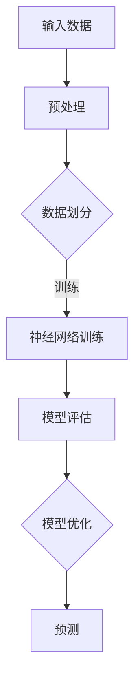
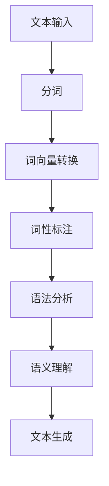
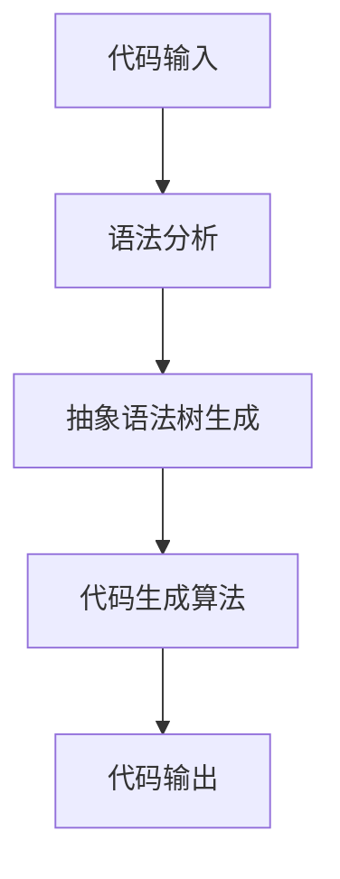
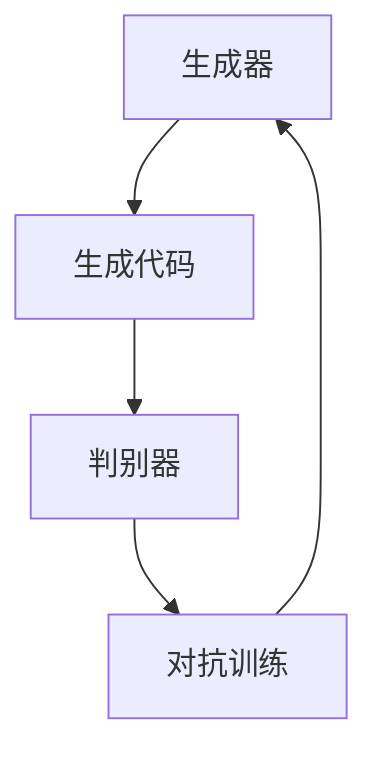
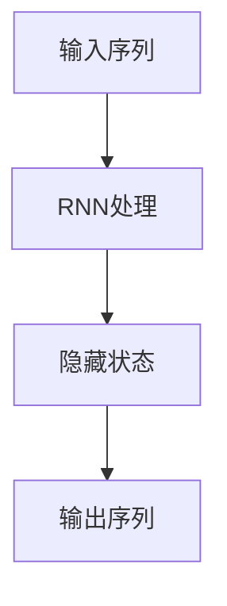

                 


### 文章标题：AI驱动的代码自动生成：革新软件开发流程

#### 关键词：
- AI驱动的代码自动生成
- 软件开发流程革新
- 机器学习
- 深度学习
- 自然语言处理

#### 摘要：
本文将深入探讨AI驱动的代码自动生成技术，分析其在软件开发流程中的重要作用和革新潜力。通过对核心概念、算法原理、数学模型、系统架构设计以及实际项目的剖析，读者将全面了解AI代码自动生成的工作机制和应用前景。

---

## 第一部分：AI驱动的代码自动生成基础

### 第1章：AI驱动的代码自动生成概述

#### 1.1 问题背景与问题描述
在现代软件开发中，代码编写是一项耗时且易出错的任务。随着项目的规模和复杂性不断增加，手动编写代码的传统方式已经难以满足快速开发和高效维护的需求。因此，如何自动化代码生成成为了一个亟待解决的问题。

**问题解决**：
AI驱动的代码自动生成技术通过机器学习和自然语言处理技术，从大量的代码库中学习和提取模式，从而自动生成新的代码。这种技术不仅能够提高开发效率，还能减少人为错误。

**边界与外延**：
虽然AI代码自动生成技术具有巨大的潜力，但它并不是万能的。某些特定场景和领域的问题可能仍然需要手动编程来解决。

#### 1.2 解决方案概述
AI驱动的代码自动生成解决方案主要基于以下几个核心组成部分：

1. **数据集**：需要大量的代码数据作为训练集，以便AI模型能够学习和理解代码的语法和结构。
2. **机器学习模型**：常见的模型包括生成对抗网络（GAN）、递归神经网络（RNN）和转换器网络（Transformer）等。
3. **代码生成算法**：基于训练好的模型，生成新的代码。

#### 1.3 研究边界与目标
本文的研究目标是通过分析和实际应用，展示AI驱动的代码自动生成技术在软件开发流程中的实际效果。研究边界则包括对现有技术的深入理解和对未来趋势的探讨。

### 第2章：AI核心概念与原理

#### 2.1 机器学习基础
机器学习是AI驱动的代码自动生成技术的核心。它通过算法从数据中学习规律，以预测新的数据或决策。

**概念属性特征对比表格**：

| 特征         | 监督学习 | 无监督学习 | 强化学习 |
| ------------ | -------- | ---------- | -------- |
| 数据标注     | 必需     | 可选       | 无需     |
| 目标         | 预测标签 | 发现模式   | 最大化奖励 |
| 适用场景     | 回归、分类 | 聚类、降维 | 推荐系统、游戏 |

**ER实体关系图架构的 Mermaid 流程图**：

```mermaid
erDiagram
    User ||--|{ CodeBase }|| CodeBase
    CodeBase ||--|{ Model }|| Model
    Model ||--|{ CodeGenerator }|| CodeGenerator
```

### 第2章：AI核心概念与原理

#### 2.2 深度学习基础
深度学习是机器学习的一个重要分支，它通过多层神经网络对数据进行处理，从而实现更加复杂的任务。

**深度学习算法mermaid流程图**：



#### 2.3 自然语言处理基础
自然语言处理（NLP）是AI中的一个重要领域，它涉及对人类语言的理解和生成。

**NLP模型mermaid流程图**：



### 第3章：代码自动生成的算法原理

#### 3.1 代码生成模型介绍
代码生成模型是AI驱动的代码自动生成技术的核心。这些模型通过学习代码的语法和结构，能够生成新的代码。

**代码生成模型mermaid流程图**：



#### 3.2 生成对抗网络（GAN）
生成对抗网络（GAN）是一种通过对抗训练生成数据的模型。在代码生成中，GAN通过生成器和判别器的对抗训练来生成高质量的代码。

**GAN算法mermaid流程图**：



#### 3.3 递归神经网络（RNN）
递归神经网络（RNN）是一种能够处理序列数据的神经网络。在代码生成中，RNN通过处理代码的序列特征来生成新的代码。

**RNN算法mermaid流程图**：



#### 3.4 转换器网络（Transformer）
转换器网络（Transformer）是一种基于自注意力机制的神经网络。在代码生成中，Transformer通过全局 attent

