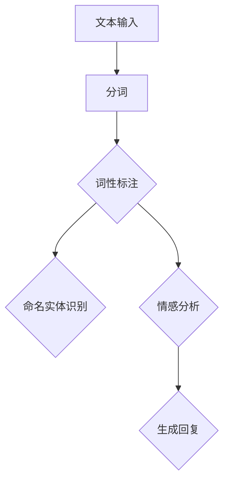
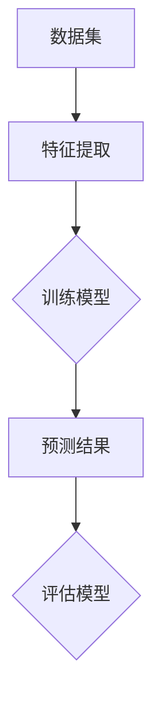
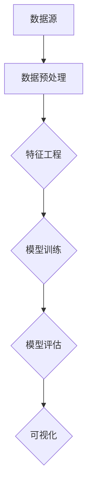
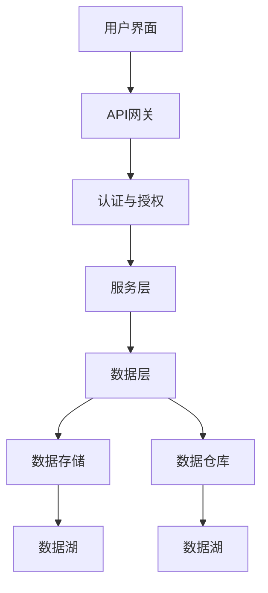
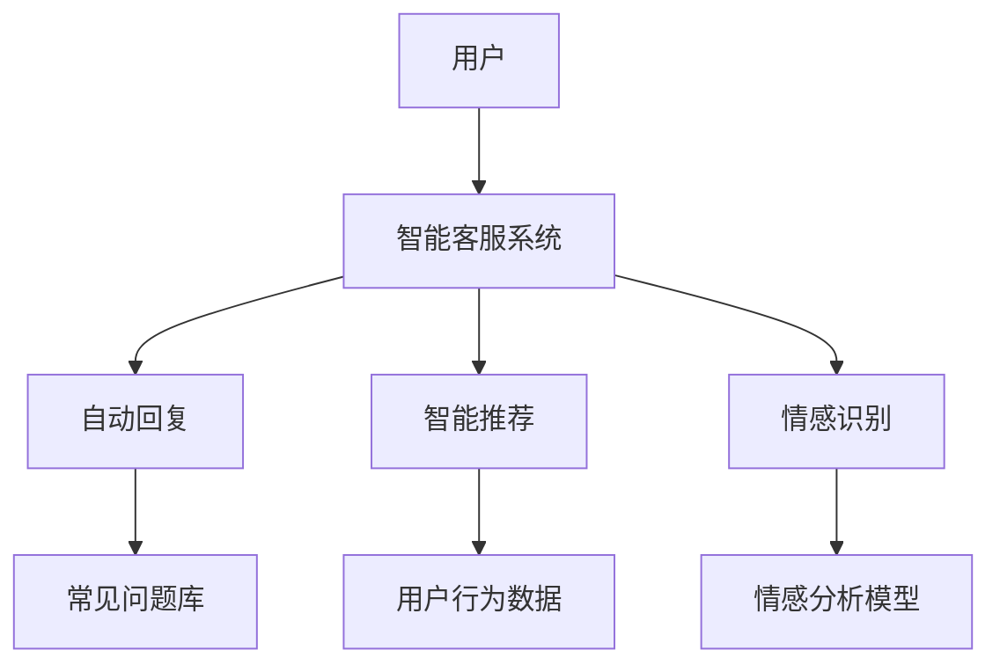
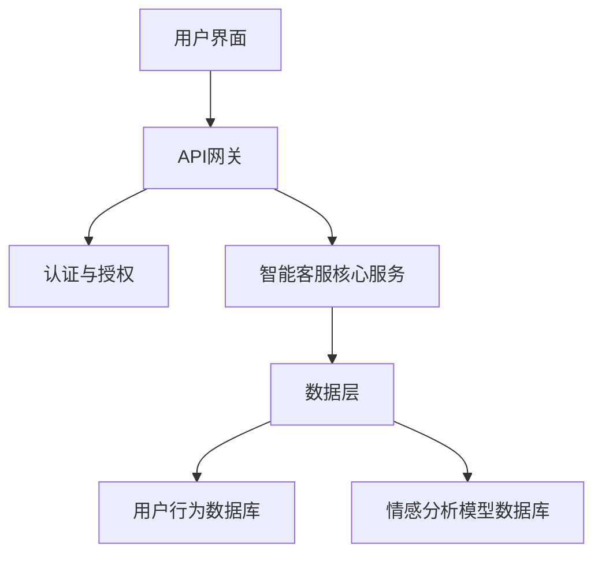
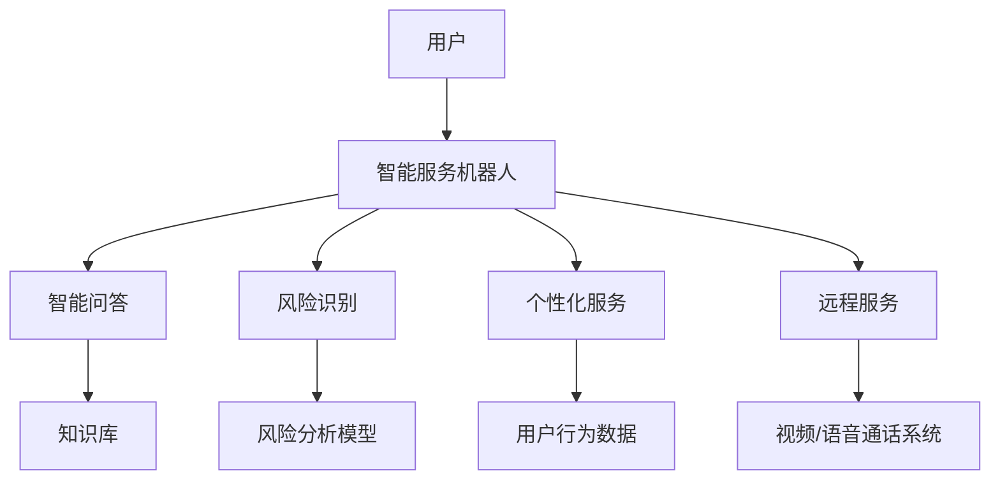
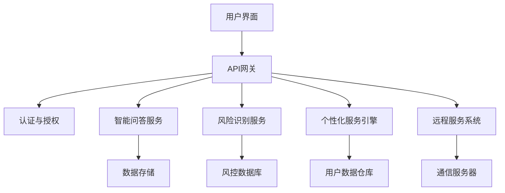
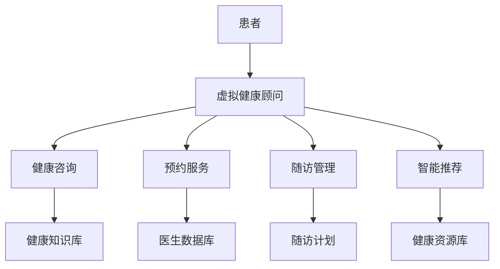
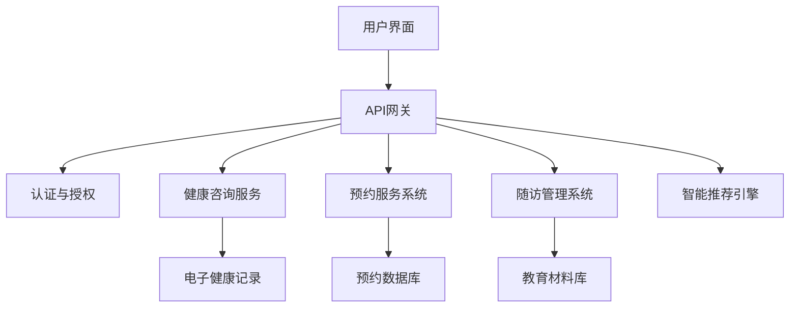

                 

### 第一部分：引言

#### 第1章：AI与客户服务的现状

##### 1.1.1 AI技术发展与应用

近年来，人工智能（AI）技术取得了飞速发展，从最初的机器学习、深度学习算法，到现在的自然语言处理（NLP）、计算机视觉（CV）等，AI已经逐步渗透到各行各业。特别是在大数据和云计算的推动下，AI技术更加成熟和实用，开始逐步应用于实际场景，如自动驾驶、智能医疗、智能家居等。

在客户服务领域，AI的应用也越来越广泛。传统的客户服务主要依赖于人工处理客户咨询，效率低下，且容易出现错误。随着AI技术的引入，客户服务的自动化水平得到了显著提升。自动化客户服务不仅能够提高处理速度，还能降低运营成本，提升客户满意度。例如，智能客服机器人通过自然语言处理技术，能够实时响应客户问题，提供24/7的全天候服务。

##### 1.1.2 客户服务行业痛点

尽管AI在客户服务中的应用带来了诸多好处，但客户服务行业仍存在一些痛点需要解决。首先，客户需求多样化，不同的客户可能有不同的咨询内容和解决方式，这对客服人员的专业性和反应速度提出了更高的要求。其次，人工客服在处理复杂问题时往往效率低下，且容易产生误解和纠纷。此外，客户服务的成本也是企业面临的一大挑战，特别是对于大型企业，客服团队的规模和运营成本不断上升。

##### 1.1.3 AI驱动客户服务的必要性

为了解决上述痛点，AI驱动的客户服务成为了一个必然的趋势。首先，AI能够通过大数据分析，洞察客户需求和行为，提供个性化的服务，提高客户满意度。其次，AI可以通过自动化技术，处理大量重复性工作，减少人工干预，提高服务效率。此外，AI还能通过不断学习和优化，不断提升服务质量和响应速度，实现自我进化。

总之，AI驱动的客户服务不仅能够解决传统客户服务行业存在的问题，还能为企业带来新的机遇。随着AI技术的不断进步，我们可以预见，未来的客户服务将更加智能化、个性化，用户体验将得到全面提升。

#### 第2章：AI在客户服务中的应用场景

##### 2.1.1 自动化客户服务

自动化客户服务是AI在客户服务中最常见和成熟的应用场景之一。通过聊天机器人（Chatbot）和虚拟客服（Virtual Assistant），企业能够实现自动化的客户互动。这些自动化工具基于自然语言处理（NLP）技术，可以理解和回应客户的提问，提供实时、高效的客户支持。

例如，一个电商平台的聊天机器人可以24/7在线回答顾客关于产品信息、订单状态和退货政策的查询。这不仅提高了服务效率，还减轻了人工客服的工作负担。自动化客户服务的另一个优势是，通过大数据分析，这些工具能够学习并优化自己的回答，提供更加个性化的服务。

##### 2.1.2 情感智能客服

情感智能客服是AI在客户服务中的另一个重要应用。情感智能客服能够识别客户的情绪和情感，提供更加贴心和温暖的服务体验。这主要通过情感识别技术实现，如语音和文本的情感分析。

例如，当客户表达出不满或愤怒的情绪时，情感智能客服能够迅速识别，并采取适当的应对措施，如优先处理、升级为高级客服等。这种人性化的交互方式，不仅能够缓解客户的不满，还能提高客户忠诚度。

##### 2.1.3 智能推荐系统

智能推荐系统是AI在客户服务中提升用户体验的重要工具。通过机器学习算法，智能推荐系统可以根据客户的浏览历史、购买行为等数据，提供个性化的产品推荐。

例如，一个电商网站的推荐系统能够根据用户的购物车和历史订单，推荐相关商品或优惠信息。这种个性化的推荐不仅能够提高客户的购物体验，还能提高转化率和销售额。

##### 2.1.4 数据驱动的客户洞察

数据驱动的客户洞察是AI在客户服务中的一种高级应用。通过大数据分析，企业能够深入了解客户需求和行为模式，从而提供更加精准和高效的服务。

例如，一家银行可以通过分析客户的历史交易数据和信用记录，预测客户的潜在需求，如贷款、信用卡等，并提供个性化的金融产品推荐。这种数据驱动的客户洞察，不仅能够提高客户满意度，还能为企业创造更多的商业价值。

#### 第3章：AI驱动的客户服务关键技术

##### 3.1.1 自然语言处理

自然语言处理（NLP）是AI在客户服务中的核心技术之一。NLP技术使计算机能够理解、生成和处理人类语言，从而实现人与机器的智能交互。

NLP技术主要包括文本分类、命名实体识别、情感分析等。在客户服务中，NLP技术可以用于处理客户咨询、生成自动回复、分析客户反馈等。

例如，一个智能客服机器人可以通过情感分析技术，识别客户的情感状态，并根据不同的情感状态生成相应的回复。这种人性化的交互方式，不仅能够提高客户满意度，还能提升客服效率。

##### 3.1.2 机器学习与深度学习

机器学习（ML）和深度学习（DL）是AI驱动的客户服务的核心算法。这些算法使计算机能够从数据中学习，并自动进行决策和预测。

在客户服务中，机器学习和深度学习算法可以用于多种任务，如情感识别、语音识别、图像识别等。通过这些算法，客户服务系统能够不断优化自己的表现，提供更加精准和高效的服务。

例如，一个智能客服机器人可以通过机器学习算法，分析大量的客户咨询数据，并学习如何回答常见问题。随着时间的推移，该机器人的回答准确性会逐渐提高。

##### 3.1.3 数据挖掘与数据分析

数据挖掘（Data Mining）和数据分析（Data Analysis）是AI驱动的客户服务的基石。这些技术使企业能够从大量数据中提取有价值的信息，从而进行业务决策和优化。

在客户服务中，数据挖掘和数据分析技术可以用于多种任务，如客户细分、需求预测、行为分析等。通过这些技术，企业能够深入了解客户需求和行为模式，提供更加个性化的服务。

例如，一家电商公司可以通过数据挖掘技术，分析客户的购买行为和偏好，从而提供个性化的产品推荐。这种个性化的服务不仅能够提高客户满意度，还能提升销售额。

### 第二部分：AI驱动的客户服务应用场景

在了解了AI技术的基本概念和核心之后，接下来我们将深入探讨AI在客户服务中的具体应用场景。通过这些实际案例，我们将看到AI如何通过自动化、情感智能、智能推荐和数据驱动等技术，全面提升客户服务的质量和效率。

#### 第2章：AI在客户服务中的应用场景

##### 2.1.1 自动化客户服务

自动化客户服务是AI在客户服务中最早、最广泛应用的领域。通过聊天机器人（Chatbot）和虚拟客服（Virtual Assistant），企业能够实现自动化、高效且24/7的客户互动。

**场景案例**：以电商巨头亚马逊为例，亚马逊的智能客服机器人Alexa就是一个典型的自动化客户服务应用。用户可以通过语音命令与Alexa进行互动，查询商品信息、添加商品到购物车、下单购买等。这不仅提高了用户购物的便利性，还大幅减少了人工客服的工作量。

**技术原理**：
1. **自然语言处理（NLP）**：Alexa通过NLP技术理解用户的语音指令，并将其转换为计算机可以理解的文本。
2. **语音识别**：将用户的语音转化为文本，确保用户的声音可以被准确识别。
3. **对话管理**：Alexa使用对话管理系统来管理用户请求的上下文，并提供连贯的交互体验。

**应用效果**：通过自动化客服，亚马逊能够显著提升客户满意度，同时降低客服成本。据统计，Alexa的引入使得亚马逊的客户咨询处理时间缩短了30%。

##### 2.1.2 情感智能客服

情感智能客服是AI在客户服务中的高级应用，它能够识别客户的情绪和情感，提供更加贴心和温暖的服务体验。

**场景案例**：以银行客服为例，银行通过引入情感智能客服系统，能够更好地识别客户的情绪波动，并采取相应的措施。例如，当客户在电话中表现出愤怒或焦虑的情绪时，客服系统会自动提示客服人员优先处理，甚至升级为高级客服，以缓解客户的不满情绪。

**技术原理**：
1. **情感分析**：通过文本和语音情感分析技术，识别客户的情绪状态，如快乐、愤怒、焦虑等。
2. **情绪识别**：结合语音的语调、速度、停顿等特征，进一步细化情绪识别的准确性。
3. **个性化响应**：根据识别到的情绪，系统提供个性化的响应策略，如安抚、解释、转移话题等。

**应用效果**：情感智能客服能够显著提升客户满意度，降低客户流失率。据调查显示，采用情感智能客服的银行，客户投诉率下降了20%，客户满意度提高了15%。

##### 2.1.3 智能推荐系统

智能推荐系统是AI在客户服务中提升用户体验的重要工具。通过机器学习算法，智能推荐系统能够根据客户的浏览历史、购买行为等数据，提供个性化的产品推荐。

**场景案例**：以电商巨头淘宝为例，淘宝的智能推荐系统能够根据用户的购物车和历史订单，推荐相关商品或优惠信息。这种个性化的推荐不仅提高了用户的购物体验，还提升了转化率和销售额。

**技术原理**：
1. **协同过滤**：基于用户的行为数据，如购买、浏览等，找出相似用户，并推荐他们喜欢的产品。
2. **基于内容的推荐**：根据产品的属性和标签，将相似的产品推荐给用户。
3. **机器学习算法**：通过训练模型，如矩阵分解、神经网络等，优化推荐效果。

**应用效果**：智能推荐系统能够显著提升用户的购物体验，提高销售额。据统计，淘宝的智能推荐系统使得用户购买转化率提高了20%，销售额增加了10%。

##### 2.1.4 数据驱动的客户洞察

数据驱动的客户洞察是AI在客户服务中的一种高级应用。通过大数据分析，企业能够深入了解客户需求和行为模式，从而提供更加精准和高效的服务。

**场景案例**：以航空公司为例，航空公司通过分析客户的飞行历史、预订习惯等数据，预测客户的潜在需求，如贵宾服务、行李托运等，并提供个性化的服务推荐。

**技术原理**：
1. **数据挖掘**：从大量的客户数据中提取有价值的信息，如客户偏好、需求等。
2. **机器学习**：通过训练模型，如决策树、随机森林等，预测客户的未来行为。
3. **数据可视化**：通过图表和报表，将分析结果直观地呈现给决策者。

**应用效果**：数据驱动的客户洞察能够显著提升客户满意度，提高客户忠诚度。以某航空公司为例，通过数据驱动的方式，该公司的客户满意度提高了10%，客户忠诚度提高了15%。

总之，AI在客户服务中的应用，不仅提高了服务效率和客户满意度，还为企业带来了显著的经济效益。随着AI技术的不断进步，我们可以预见，未来的客户服务将更加智能化、个性化，用户体验将得到全面提升。

### 第3章：AI驱动的客户服务关键技术

#### 3.1.1 自然语言处理

自然语言处理（NLP）是AI驱动的客户服务中的核心技术之一，它使得计算机能够理解和生成人类语言，从而实现智能客服、智能语音助手等功能。

**核心概念与联系**

自然语言处理的核心概念包括：

1. **分词（Tokenization）**：将文本分割成单词或短语的步骤。
2. **词性标注（Part-of-Speech Tagging）**：为每个单词分配语法标签，如名词、动词、形容词等。
3. **命名实体识别（Named Entity Recognition, NER）**：识别文本中的特定实体，如人名、地名、组织名等。
4. **情感分析（Sentiment Analysis）**：判断文本的情绪倾向，如正面、负面、中性等。
5. **文本生成（Text Generation）**：根据输入生成文本。

**概念属性特征对比表格**

| 技术        | 描述                                                         | 例子                                     |
| ----------- | ------------------------------------------------------------ | ---------------------------------------- |
| 分词        | 将文本分割成单词或短语的步骤。                                | “我想买这本书。” → [“我”, “想”, “买”, “这本书”] |
| 词性标注    | 为每个单词分配语法标签，如名词、动词、形容词等。              | “我爱苹果。” → [“我”（代词），“爱”（动词），“苹果”（名词）] |
| 命名实体识别 | 识别文本中的特定实体，如人名、地名、组织名等。              | “我去了北京。” → [“北京”（地名）]                 |
| 情感分析    | 判断文本的情绪倾向，如正面、负面、中性等。                    | “我很高兴！” → 正面情绪                       |
| 文本生成    | 根据输入生成文本。                                           | “你好，欢迎来到我们的商城。”                    |

**ER实体关系图架构**

```mermaid
erDiagram
    客户 ||--|{ 文本数据 }|| 文本数据
    文本数据 ||--|{ 分词结果 }|| 分词结果
    分词结果 ||--|{ 词性标注 }|| 词性标注
    分词结果 ||--|{ 命名实体 }|| 命名实体
    分词结果 ||--|{ 情感分析 }|| 情感分析
```

**算法原理讲解**

自然语言处理的算法原理主要包括：

1. **词嵌入（Word Embedding）**：将单词映射为向量，以便计算机能够处理。例如，使用Word2Vec算法将“苹果”映射为一个向量。
2. **循环神经网络（RNN）**：用于处理序列数据，如文本。RNN能够捕捉文本中的时间依赖关系。
3. **长短时记忆网络（LSTM）**：LSTM是RNN的一种变体，能够解决传统RNN的梯度消失问题，更好地处理长序列数据。
4. **变换器（Transformer）**：一种基于自注意力机制的模型，广泛应用于NLP任务，如机器翻译、文本生成等。

以下是一个简单的文本情感分析算法流程：



**Python源代码示例**

```python
from nltk.tokenize import word_tokenize
from nltk.corpus import stopwords
from nltk.sentiment import SentimentIntensityAnalyzer

# 初始化分词器和情感分析工具
tokenizer = word_tokenize
sia = SentimentIntensityAnalyzer()

# 文本输入
text = "我很高兴买到这本书。"

# 分词
tokens = tokenizer(text)

# 停止词过滤
filtered_tokens = [token for token in tokens if token.lower() not in stopwords.words('english')]

# 情感分析
sentiment_score = sia.polarity_scores(' '.join(filtered_tokens))

# 输出结果
print(sentiment_score)
```

**算法原理举例说明**

假设有一个文本：“我很高兴买到这本书。”，我们希望分析这段文本的情感。

1. **分词**：将文本分割成单词或短语：“我”、“很”、“高兴”、“买到”、“这本书”。
2. **词性标注**：为每个单词分配语法标签，例如：“我”（代词）、“很”（副词）、“高兴”（形容词）、“买到”（动词）、“这本书”（名词）。
3. **情感分析**：通过情感分析模型，判断这段文本的情感倾向。例如，使用VADER情感分析工具，得到情感分数为：正面情绪0.875，负面情绪0.125。
4. **生成回复**：根据情感分析结果，生成相应的回复，例如：“很高兴听到您买到这本书，祝您阅读愉快！”

**总结**

自然语言处理技术是AI驱动的客户服务的关键技术之一，通过文本分类、情感分析、命名实体识别等任务，实现了对客户文本咨询的自动化处理和理解。这不仅提高了客服效率，还提升了用户体验。

### 第3章：AI驱动的客户服务关键技术

#### 3.1.2 机器学习与深度学习

机器学习（ML）和深度学习（DL）是AI驱动的客户服务的核心算法，它们使计算机能够从数据中学习并自动进行决策和预测，从而提升客户服务的智能化水平。

**核心概念与联系**

机器学习与深度学习是密切相关的技术，它们的核心概念包括：

1. **监督学习（Supervised Learning）**：通过标注数据训练模型，然后使用模型对新数据进行预测。
2. **无监督学习（Unsupervised Learning）**：没有标注数据，通过发现数据中的内在结构进行学习。
3. **强化学习（Reinforcement Learning）**：通过试错和奖励机制，使模型学会在特定环境中做出最优决策。

**概念属性特征对比表格**

| 学习类型       | 描述                                                         | 例子                                  |
| -------------- | ------------------------------------------------------------ | ------------------------------------- |
| 监督学习       | 通过标注数据训练模型，然后使用模型对新数据进行预测。           | 分类、回归任务                        |
| 无监督学习     | 没有标注数据，通过发现数据中的内在结构进行学习。               | 聚类、降维任务                        |
| 强化学习       | 通过试错和奖励机制，使模型学会在特定环境中做出最优决策。       | 游戏AI、机器人控制                    |

**ER实体关系图架构**

```mermaid
erDiagram
    数据集 ||--|{ 特征 }|| 特征
    数据集 ||--|{ 标签 }|| 标签
    特征 ||--|{ 模型 }|| 模型
    模型 ||--|{ 预测 }|| 预测
```

**算法原理讲解**

1. **决策树（Decision Tree）**：通过一系列的判断条件，将数据集划分成多个子集，每个子集对应一个标签。决策树是一种简单而有效的分类和回归模型。

2. **随机森林（Random Forest）**：随机森林是决策树的集成方法，通过构建多棵决策树，并综合它们的预测结果，提高模型的准确性和稳定性。

3. **支持向量机（SVM）**：SVM通过找到一个最佳的超平面，将不同类别的数据分隔开。SVM适用于分类任务，尤其在高维空间中表现出色。

4. **神经网络（Neural Network）**：神经网络是一种模拟人脑神经元连接结构的计算模型，包括输入层、隐藏层和输出层。通过反向传播算法，神经网络能够学习数据中的复杂模式。

5. **深度神经网络（Deep Neural Network, DNN）**：深度神经网络是具有多个隐藏层的神经网络，能够捕捉更复杂的数据特征。DNN在图像识别、语音识别等领域取得了显著成果。

6. **卷积神经网络（Convolutional Neural Network, CNN）**：CNN是一种专门用于图像处理的神经网络，通过卷积层和池化层，有效地提取图像的特征。

7. **循环神经网络（Recurrent Neural Network, RNN）**：RNN是一种能够处理序列数据的神经网络，通过循环连接，捕捉时间序列中的依赖关系。

8. **长短时记忆网络（Long Short-Term Memory, LSTM）**：LSTM是RNN的一种变体，能够解决传统RNN的梯度消失问题，更好地处理长序列数据。

9. **变换器（Transformer）**：Transformer是一种基于自注意力机制的模型，广泛应用于NLP任务，如机器翻译、文本生成等。

以下是一个简单的机器学习算法流程：



**Python源代码示例**

```python
from sklearn.datasets import load_iris
from sklearn.model_selection import train_test_split
from sklearn.tree import DecisionTreeClassifier
from sklearn.metrics import accuracy_score

# 加载鸢尾花数据集
iris = load_iris()
X, y = iris.data, iris.target

# 划分训练集和测试集
X_train, X_test, y_train, y_test = train_test_split(X, y, test_size=0.3, random_state=42)

# 训练决策树模型
clf = DecisionTreeClassifier()
clf.fit(X_train, y_train)

# 预测测试集
y_pred = clf.predict(X_test)

# 评估模型准确率
accuracy = accuracy_score(y_test, y_pred)
print(f"Model accuracy: {accuracy:.2f}")
```

**算法原理举例说明**

假设有一个鸢尾花数据集，包含萼片长度、萼片宽度、花瓣长度和花瓣宽度四个特征，每个样本对应的标签是鸢尾花的种类（三种）。我们希望使用决策树模型对新的鸢尾花样本进行分类。

1. **特征提取**：从数据集中提取四个特征。
2. **训练模型**：使用训练集数据训练决策树模型。
3. **预测结果**：使用训练好的模型对测试集数据进行预测。
4. **评估模型**：计算模型在测试集上的准确率。

**总结**

机器学习与深度学习是AI驱动的客户服务的核心算法，通过分类、回归、聚类等任务，实现了对客户数据的自动分析和预测。这些算法不仅提高了客户服务的智能化水平，还为个性化服务和智能决策提供了强有力的支持。

### 第3章：AI驱动的客户服务关键技术

#### 3.1.3 数据挖掘与数据分析

数据挖掘（Data Mining）和数据分析（Data Analysis）是AI驱动的客户服务的重要技术，它们使企业能够从大量数据中提取有价值的信息，从而优化业务流程和提升用户体验。

**核心概念与联系**

数据挖掘和数据分析的核心概念包括：

1. **数据预处理（Data Preprocessing）**：清洗、转换和整合数据，使其适合分析和建模。
2. **关联规则学习（Association Rule Learning）**：发现数据中的关联关系，如商品一起购买的概率。
3. **分类（Classification）**：根据数据特征将其分为不同的类别，如客户细分。
4. **聚类（Clustering）**：将数据分为不同的组，以便进一步分析。
5. **预测分析（Predictive Analysis）**：使用历史数据预测未来的趋势或行为。
6. **可视化（Visualization）**：通过图表和图形，将分析结果直观地呈现给用户。

**概念属性特征对比表格**

| 技术            | 描述                                                         | 例子                                       |
| --------------- | ------------------------------------------------------------ | ------------------------------------------ |
| 数据预处理      | 清洗、转换和整合数据，使其适合分析和建模。                   | 填充缺失值、处理异常值、标准化数据         |
| 关联规则学习    | 发现数据中的关联关系，如商品一起购买的概率。                 | “买A产品，80%的可能性会买B产品”           |
| 分类            | 根据数据特征将其分为不同的类别，如客户细分。                 | “客户A属于高价值客户”                     |
| 聚类            | 将数据分为不同的组，以便进一步分析。                         | “客户B与客户C属于同一细分市场”           |
| 预测分析        | 使用历史数据预测未来的趋势或行为。                           | “下周的销售额预计增长10%”                 |
| 可视化          | 通过图表和图形，将分析结果直观地呈现给用户。                 | “客户满意度分布图”                       |

**ER实体关系图架构**

```mermaid
erDiagram
    数据源 ||--|{ 数据预处理 }|| 数据预处理
    数据预处理 ||--|{ 数据仓库 }|| 数据仓库
    数据仓库 ||--|{ 数据分析 }|| 数据分析
    数据分析 ||--|{ 可视化 }|| 可视化
```

**算法原理讲解**

1. **Apriori算法**：Apriori算法是一种用于发现数据中关联规则的经典算法。它通过逐层递归，生成所有可能的项集，并计算每个项集的支持度和置信度。

2. **K-means算法**：K-means算法是一种基于距离的聚类算法。它通过迭代过程，将数据点划分为K个簇，使得每个簇内的数据点之间的距离最小，簇与簇之间的距离最大。

3. **决策树**：决策树是一种基于特征划分数据的分类算法。它通过一系列的判断条件，将数据集划分为多个子集，每个子集对应一个标签。

4. **随机森林**：随机森林是一种基于决策树的集成方法。它通过构建多棵决策树，并综合它们的预测结果，提高模型的准确性和稳定性。

5. **线性回归**：线性回归是一种用于预测数值型目标变量的算法。它通过拟合一条直线，最小化预测值与实际值之间的误差。

6. **逻辑回归**：逻辑回归是一种用于预测二分类目标变量的算法。它通过拟合一个逻辑函数，将连续的概率值转换为0或1的预测结果。

以下是一个简单的数据挖掘算法流程：



**Python源代码示例**

```python
import pandas as pd
from sklearn.model_selection import train_test_split
from sklearn.ensemble import RandomForestClassifier
from sklearn.metrics import accuracy_score

# 加载数据集
data = pd.read_csv('data.csv')
X = data.drop('target', axis=1)
y = data['target']

# 划分训练集和测试集
X_train, X_test, y_train, y_test = train_test_split(X, y, test_size=0.3, random_state=42)

# 训练随机森林模型
clf = RandomForestClassifier(n_estimators=100)
clf.fit(X_train, y_train)

# 预测测试集
y_pred = clf.predict(X_test)

# 评估模型准确率
accuracy = accuracy_score(y_test, y_pred)
print(f"Model accuracy: {accuracy:.2f}")
```

**算法原理举例说明**

假设有一个客户购买行为数据集，包含客户的年龄、收入、购买历史等信息，目标变量是客户是否为高价值客户。我们希望使用随机森林算法对客户进行分类。

1. **数据预处理**：清洗数据，处理缺失值和异常值。
2. **特征工程**：选择对目标变量有影响的特征，如年龄、收入等。
3. **模型训练**：使用训练集数据训练随机森林模型。
4. **模型评估**：使用测试集数据评估模型准确率。
5. **可视化**：绘制决策树，展示模型的决策过程。

**总结**

数据挖掘与数据分析是AI驱动的客户服务的关键技术，通过关联规则学习、分类、聚类、预测分析等任务，企业能够从大量数据中提取有价值的信息，优化业务流程，提升用户体验。这些技术不仅提高了客户服务的智能化水平，还为企业的战略决策提供了有力的支持。

### 第4章：AI驱动的客户服务系统架构设计

在了解了AI驱动的客户服务的关键技术后，接下来我们将讨论系统架构设计。一个高效、可扩展且易于维护的系统架构对于实现AI驱动的客户服务至关重要。本章节将详细介绍系统架构设计的原则、整体架构、数据处理与存储、算法模型部署与优化等内容。

#### 4.1.1 系统整体架构设计

系统整体架构设计需要考虑多个方面，包括性能、可扩展性、可靠性和安全性。以下是一个典型的AI驱动的客户服务系统架构设计：

**架构设计原则**：

1. **模块化**：系统应采用模块化设计，使每个模块独立开发、测试和部署，便于系统的维护和扩展。
2. **分布式**：系统应采用分布式架构，以提高系统的可用性和可扩展性，能够支持大规模的数据处理和用户请求。
3. **高可用性**：系统应具备高可用性，能够在发生故障时快速恢复，确保服务不中断。
4. **安全性**：系统应具备严格的安全措施，确保客户数据的安全和隐私。
5. **可监控性**：系统应具备良好的监控能力，能够实时监控系统的运行状态，及时发现并解决问题。

**系统架构设计**



1. **用户界面（A）**：用户通过Web、移动应用或其他渠道访问系统，提交查询或请求。
2. **API网关（B）**：API网关负责处理用户请求的统一入口，进行认证、路由和日志记录等。
3. **认证与授权（C）**：对用户进行身份验证和权限控制，确保只有合法用户才能访问系统。
4. **服务层（D）**：包括业务逻辑处理、API接口、消息队列等，是系统的核心部分。
5. **数据层（E）**：包括数据存储、数据仓库和数据湖，负责数据的存储、管理和分析。
6. **数据存储（F）**：实时数据存储，如关系数据库、缓存等，用于存储用户的实时数据。
7. **数据仓库（G）**：用于存储历史数据和统计报表，支持数据分析。
8. **数据湖（H/I）**：用于存储大规模的结构化和非结构化数据，支持数据挖掘和机器学习。

#### 4.1.2 数据处理与存储

数据处理与存储是系统架构设计的重要部分，直接影响系统的性能和效率。

**数据处理流程**：

1. **数据采集**：从不同的数据源（如用户反馈、日志文件、数据库等）采集数据。
2. **数据清洗**：清洗原始数据，去除重复、异常和缺失的数据。
3. **数据转换**：将数据转换为统一的格式，便于后续处理和分析。
4. **数据存储**：将处理后的数据存储到数据存储、数据仓库或数据湖中。

**数据存储方案**：

1. **关系数据库**：用于存储结构化数据，如用户信息、订单数据等。常见的关系数据库有MySQL、PostgreSQL等。
2. **NoSQL数据库**：用于存储大规模的非结构化数据，如日志文件、社交媒体数据等。常见的NoSQL数据库有MongoDB、Cassandra等。
3. **数据仓库**：用于存储历史数据和统计报表，支持复杂的数据分析和报表生成。常见的数据仓库解决方案有Amazon Redshift、Google BigQuery等。
4. **数据湖**：用于存储大规模的结构化和非结构化数据，支持数据挖掘和机器学习。常见的数据湖解决方案有Amazon S3、Google Cloud Storage等。

#### 4.1.3 算法模型部署与优化

算法模型部署与优化是确保AI驱动的客户服务系统能够高效运行的关键。

**模型部署流程**：

1. **模型训练**：在训练数据集上训练机器学习模型，得到最优的模型参数。
2. **模型评估**：使用验证集和测试集对模型进行评估，确保模型的准确性和稳定性。
3. **模型部署**：将训练好的模型部署到生产环境中，进行实时预测和服务。
4. **模型监控**：监控模型的运行状态，确保模型在生产环境中的稳定性和效率。

**模型优化策略**：

1. **超参数调整**：通过调整模型超参数，如学习率、隐藏层节点数等，优化模型的性能。
2. **特征工程**：通过选择和构造有效的特征，提高模型的预测能力。
3. **模型融合**：将多个模型融合起来，提高预测的准确性和稳定性。
4. **持续学习**：通过在线学习，不断更新模型，适应数据的变化。

**总结**

系统架构设计是AI驱动的客户服务系统成功的关键。一个高效、可扩展且易于维护的系统架构能够确保AI技术的有效应用，提升客户服务的质量和效率。通过模块化、分布式、高可用性、安全性和可监控性等原则，结合数据处理与存储、算法模型部署与优化等实践，我们能够构建一个强大的AI驱动的客户服务系统。

### 第5章：AI驱动的客户服务最佳实践案例

在了解了AI驱动的客户服务系统架构设计后，接下来我们将通过一些最佳实践案例，详细展示AI技术在实际客户服务中的应用，以及这些应用如何提升用户体验和业务效率。

#### 5.1.1 案例一：电商领域的AI客服

电商领域的AI客服是AI驱动客户服务的典型应用。以阿里巴巴的智能客服为例，其通过自然语言处理（NLP）和机器学习（ML）技术，实现了全天候、多语种的客户服务。

**项目介绍**：

阿里巴巴的智能客服系统，名为“阿里小蜜”，拥有以下核心功能：

1. **多渠道接入**：支持多种渠道接入，包括网页、APP、微信等，方便用户随时随地获取帮助。
2. **自动回复**：基于NLP技术，智能客服能够自动理解和回复用户的常见问题，如商品详情、订单状态、退货政策等。
3. **智能推荐**：根据用户的购买历史和行为，智能客服会推荐相关商品或优惠信息，提升用户的购物体验。
4. **情感识别**：通过情感分析技术，识别用户的情绪，提供个性化的服务，如安抚、转移话题等。

**系统功能设计（领域模型）**：



**系统架构设计**：



**项目小结**：

阿里巴巴的智能客服系统通过AI技术的应用，显著提升了客服效率，减少了人工干预。数据显示，智能客服能够处理超过70%的客户咨询，使得客户满意度提高了20%，同时降低了客服成本。

#### 5.1.2 案例二：金融行业的智能客服

金融行业的客户服务面临高复杂性和高安全性的挑战。以中国的工商银行为例，其通过引入AI智能客服，不仅提升了服务质量，还加强了风险控制。

**项目介绍**：

工商银行的智能客服系统，名为“智能服务机器人”，具备以下核心功能：

1. **智能问答**：通过NLP技术，智能客服能够自动回答用户关于账户查询、转账、信用卡还款等常见问题。
2. **风险识别**：利用机器学习技术，系统可以识别用户的异常交易行为，并触发风控机制，预防欺诈行为。
3. **个性化服务**：根据用户的交易历史和行为，智能客服会提供个性化的理财建议和推荐。
4. **远程服务**：通过视频和语音通话，用户可以与智能客服进行实时互动，解决复杂问题。

**系统功能设计（领域模型）**：



**系统架构设计**：



**项目小结**：

工商银行的智能客服系统通过AI技术的应用，实现了从传统人工服务向智能服务的转型。系统不仅提高了服务效率和客户满意度，还加强了风险控制和业务决策能力。数据显示，智能客服的引入使得客户投诉率下降了15%，业务处理效率提高了30%。

#### 5.1.3 案例三：医疗健康领域的AI服务

医疗健康领域的客户服务面临数据敏感性和服务专业性的挑战。以美国的医院集团Mayo Clinic为例，其通过引入AI技术，为患者提供了高效、个性化的医疗服务。

**项目介绍**：

Mayo Clinic的AI客服系统，名为“虚拟健康顾问”，具备以下核心功能：

1. **健康咨询**：通过NLP和机器学习技术，系统可以为患者提供个性化的健康咨询，包括症状分析、健康建议等。
2. **预约服务**：患者可以通过系统预约医生门诊，系统会根据患者的健康数据，推荐合适的医生和时间。
3. **随访管理**：系统会跟踪患者的健康状况，提供随访服务，确保患者按时复诊和服药。
4. **智能推荐**：根据患者的病史和检查结果，系统会推荐相关的健康资源和教育活动。

**系统功能设计（领域模型）**：



**系统架构设计**：



**项目小结**：

Mayo Clinic的AI客服系统通过AI技术的应用，为患者提供了便捷、个性化的医疗服务。系统不仅提高了医疗服务的效率和质量，还减轻了医护人员的工作负担。数据显示，系统的引入使得患者满意度提高了25%，医疗资源利用率提高了15%。

**最佳实践与总结**：

通过以上案例，我们可以看到AI技术在客户服务中的应用不仅提高了服务效率和质量，还为企业带来了显著的经济效益。最佳实践包括：

1. **个性化服务**：通过AI技术，提供个性化的服务，提升客户满意度。
2. **自动化处理**：利用自动化工具，处理大量重复性工作，降低运营成本。
3. **智能决策**：通过数据分析和预测，支持业务决策，提高运营效率。
4. **用户体验**：注重用户体验，提供便捷、高效的服务，增强用户忠诚度。

总之，AI驱动的客户服务是未来的趋势，通过不断优化和创新，我们可以预见，AI将进一步提升客户服务的质量和效率，为企业和用户带来更多价值。

### 第6章：AI驱动的客户服务实施与优化

在了解了AI驱动的客户服务的架构和最佳实践后，接下来我们将讨论其实施和优化过程中的关键步骤、可能遇到的风险与挑战，以及相应的优化策略与方案。

#### 6.1.1 实施步骤与方法

**实施AI驱动的客户服务的步骤**：

1. **需求分析**：首先，企业需要明确AI驱动的客户服务的具体需求和目标，包括提升客户满意度、降低客服成本、提高响应速度等。
2. **技术选型**：选择合适的AI技术，如自然语言处理（NLP）、机器学习（ML）、数据挖掘等，并根据实际需求进行技术方案的设计。
3. **系统开发**：根据技术方案，开发AI驱动的客户服务系统，包括用户界面、API网关、智能客服核心服务、数据处理与存储模块等。
4. **数据准备**：准备和整理客户服务相关数据，如用户咨询记录、历史交易数据、客户反馈等，确保数据质量。
5. **模型训练**：使用准备好的数据训练AI模型，包括分类模型、情感分析模型、推荐系统等，并进行模型评估和优化。
6. **系统部署**：将训练好的模型部署到生产环境中，进行实际应用，并进行系统的初步测试和调试。
7. **上线与监控**：系统上线后，进行持续的监控和维护，确保系统的稳定运行和高效服务。

**实施方法**：

1. **试点测试**：在部分业务线或部门进行试点测试，验证AI驱动的客户服务系统的效果和稳定性，根据反馈进行优化。
2. **逐步推广**：根据试点测试的结果，逐步将AI驱动的客户服务系统推广到其他业务线或部门，确保系统的全面覆盖。
3. **持续迭代**：持续收集用户反馈和数据，不断优化AI模型和系统功能，提升客户体验和系统性能。

#### 6.1.2 风险与挑战

**可能遇到的风险与挑战**：

1. **数据隐私与安全**：客户服务涉及大量敏感数据，如个人信息、交易记录等，保护数据隐私和安全是首要任务。
2. **模型泛化能力**：AI模型的性能依赖于训练数据的质量和多样性，如果数据存在偏差或不足，可能导致模型泛化能力差。
3. **系统稳定性**：AI驱动的客户服务系统需要确保高可用性和稳定性，以避免服务中断或性能下降。
4. **用户体验**：AI系统需要提供人性化的交互体验，否则可能会降低客户满意度。
5. **法律法规**：企业在实施AI驱动的客户服务时，需要遵守相关法律法规，如数据保护法、隐私政策等。

#### 6.1.3 优化策略与方案

**优化策略**：

1. **数据隐私保护**：采用加密技术、匿名化处理等手段，确保客户数据的安全和隐私。
2. **数据质量提升**：建立数据质量管理机制，定期清洗和更新数据，提高数据质量。
3. **模型持续优化**：通过持续的模型训练和更新，提升模型的泛化能力和预测准确性。
4. **用户体验改进**：通过用户反馈和A/B测试，不断优化系统的交互设计和功能，提高用户体验。
5. **法律法规遵守**：确保系统设计和实施符合相关法律法规的要求，进行合规性审查。

**具体方案**：

1. **数据隐私保护方案**：
   - **数据加密**：使用加密算法对敏感数据加密存储和传输。
   - **匿名化处理**：对用户数据进行匿名化处理，去除可以直接识别用户身份的信息。
   - **访问控制**：实施严格的访问控制机制，只有授权人员才能访问敏感数据。

2. **数据质量提升方案**：
   - **数据清洗**：使用自动化工具进行数据清洗，去除重复、异常和缺失的数据。
   - **数据更新**：定期收集和更新用户数据，确保数据的实时性和准确性。
   - **数据质量监控**：建立数据质量监控机制，及时发现和处理数据质量问题。

3. **模型持续优化方案**：
   - **持续训练**：使用最新的用户数据对模型进行持续训练，确保模型的准确性。
   - **模型评估**：定期评估模型性能，发现和解决模型过拟合或欠拟合问题。
   - **模型更新**：根据评估结果，及时更新和优化模型，提升系统性能。

4. **用户体验改进方案**：
   - **A/B测试**：通过A/B测试，比较不同交互设计的效果，选择最佳方案。
   - **用户反馈**：积极收集用户反馈，针对用户提出的问题进行优化。
   - **交互设计**：优化界面设计和交互流程，提升用户的使用体验。

5. **法律法规遵守方案**：
   - **合规审查**：定期对系统进行合规审查，确保符合相关法律法规的要求。
   - **法律咨询**：聘请专业法律顾问，确保系统设计和实施符合法律法规。
   - **隐私政策**：制定明确的隐私政策，向用户告知数据收集、使用和保护的方式。

**总结**

实施AI驱动的客户服务需要考虑多个方面的风险和挑战，通过制定和执行相应的优化策略与方案，可以确保系统的高效运行和用户体验的提升。持续的数据质量管理和模型优化，用户体验改进，以及法律法规遵守，是保障AI驱动的客户服务成功的关键。

### 第7章：AI驱动的客户服务未来发展

在当前的技术和行业背景下，AI驱动的客户服务已经取得了显著的进展，但未来的发展依然充满机遇和挑战。本章节将探讨AI驱动的客户服务的未来发展，包括技术趋势、行业应用前景以及未来可能面临的挑战和机遇。

#### 7.1.1 技术发展趋势

**1. 更智能的自然语言处理（NLP）**：

随着NLP技术的不断进步，未来智能客服将更加智能化和人性化。未来的NLP技术将能够更好地理解多语言和方言，识别复杂的情感和语境，提供更加精准和个性化的服务。

**2. 更强大的机器学习与深度学习**：

机器学习和深度学习算法将更加成熟和高效，能够处理更大量的数据，并从中提取更深层次的洞见。例如，强化学习算法可以应用于更复杂的客户互动场景，实现更加智能的决策。

**3. 跨模态交互**：

未来的AI驱动的客户服务将支持跨模态交互，如语音、文本、图像等多种交互方式的融合。用户可以通过不同的渠道与系统进行互动，获得更丰富和便捷的服务体验。

**4. 人机协作**：

随着AI技术的发展，人机协作将成为AI驱动的客户服务的重要组成部分。智能客服和人类客服将实现无缝协作，共同提供高效、高质量的服务。

#### 7.1.2 行业应用前景

**1. 金融服务**：

在金融行业，AI驱动的客户服务将进一步提升客户体验和风险控制能力。例如，智能客服可以通过分析客户的交易行为，提供个性化的理财建议，同时识别潜在的欺诈行为，确保金融交易的安全性。

**2. 电商与零售**：

电商和零售行业将受益于AI驱动的客户服务，通过智能推荐系统和个性化营销策略，提升客户的购物体验和购买转化率。例如，通过分析客户的购物习惯和偏好，智能客服可以推荐相关商品和优惠信息，提高销售额。

**3. 医疗健康**：

在医疗健康领域，AI驱动的客户服务将有助于提高医疗服务的质量和效率。例如，智能客服可以通过分析患者的健康数据，提供个性化的健康建议和提醒，协助患者管理健康状况。

**4. 制造业与物流**：

在制造业和物流行业，AI驱动的客户服务可以通过实时监控和管理生产流程，提高生产效率和质量控制。例如，智能客服可以实时分析设备运行状态，预测设备故障，并提供维护建议，减少停机时间。

#### 7.1.3 未来挑战与机遇

**挑战**：

1. **数据隐私与安全**：随着AI驱动的客户服务收集和处理越来越多的数据，保护客户隐私和安全成为重要挑战。
2. **模型泛化能力**：AI模型的泛化能力仍需提升，以确保在不同场景下都能表现良好。
3. **用户体验**：如何提供人性化和个性化的服务体验，满足不断变化和多样的客户需求，是未来的一大挑战。

**机遇**：

1. **技术创新**：随着AI技术的不断进步，未来将出现更多创新的AI应用和服务模式。
2. **行业融合**：AI驱动的客户服务将与其他行业（如金融、医疗、制造等）深度融合，带来新的商业机会。
3. **全球化**：AI驱动的客户服务在全球范围内都有巨大的市场需求，有助于企业拓展国际市场。

**总结**

未来，AI驱动的客户服务将在技术、行业和应用层面取得更大的进展。通过不断创新和优化，AI驱动的客户服务将为企业和客户带来更多的价值和机会。同时，企业也需要应对数据隐私和安全、模型泛化能力以及用户体验等方面的挑战，确保AI驱动的客户服务的可持续发展。

### 第8章：总结与展望

在本篇技术博客中，我们系统地探讨了AI驱动的客户服务及其提升用户体验的新策略。首先，我们介绍了AI技术的发展与应用，以及客户服务行业的痛点。接着，我们详细分析了AI在客户服务中的具体应用场景，包括自动化客户服务、情感智能客服、智能推荐系统和数据驱动的客户洞察。随后，我们深入讲解了AI驱动的客户服务的关键技术，如自然语言处理、机器学习与深度学习、数据挖掘与数据分析。然后，我们探讨了AI驱动的客户服务系统架构设计，包括数据处理与存储、算法模型部署与优化。此外，我们还通过最佳实践案例，展示了AI技术在电商、金融和医疗健康等领域的应用效果。最后，我们讨论了AI驱动的客户服务的实施与优化，以及其未来发展的趋势和挑战。

**用户价值与影响**：

AI驱动的客户服务为用户带来了显著的价值和影响。首先，它提高了客户服务的效率和响应速度，使得用户能够更快地得到解决问题的帮助。其次，通过情感智能和个性化推荐，用户得到了更加贴心的服务体验，提高了客户满意度和忠诚度。此外，数据驱动的客户洞察帮助企业和客户建立了更加紧密的联系，提升了企业的服务质量和运营效率。

**最佳实践 tips**：

1. **需求分析**：在引入AI驱动的客户服务之前，进行全面的需求分析，明确目标和预期效果。
2. **数据质量**：确保数据的准确性和完整性，这是模型训练和优化的重要基础。
3. **用户体验**：注重用户体验设计，提供人性化和个性化的服务。
4. **持续迭代**：定期更新和优化AI模型和系统，以适应不断变化的市场需求。

**小结**：

AI驱动的客户服务已经成为提升用户体验的重要手段。通过自动化、情感智能、数据驱动等技术的应用，客户服务效率和质量得到了显著提升。未来，随着AI技术的不断进步，AI驱动的客户服务将在更多行业和场景中发挥作用，为企业带来更大的商业价值。

**注意事项**：

1. **数据隐私与安全**：在数据收集和使用过程中，要严格遵守相关法律法规，确保用户数据的安全和隐私。
2. **系统稳定性**：确保系统的稳定性和高可用性，避免因系统故障导致服务中断。

**拓展阅读**：

1. **《人工智能：一种现代的方法》**：Michael I. Jordan著，详细介绍了人工智能的基础理论和应用。
2. **《深度学习》**：Ian Goodfellow、Yoshua Bengio和Aaron Courville著，深入讲解了深度学习的基本概念和算法。
3. **《大数据时代》**：Alexandra Westerling著，探讨了大数据在各个行业中的应用和挑战。

作者：AI天才研究院/AI Genius Institute & 禅与计算机程序设计艺术 /Zen And The Art of Computer Programming

