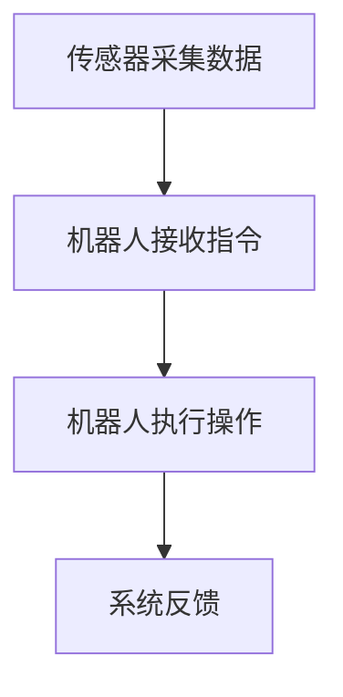
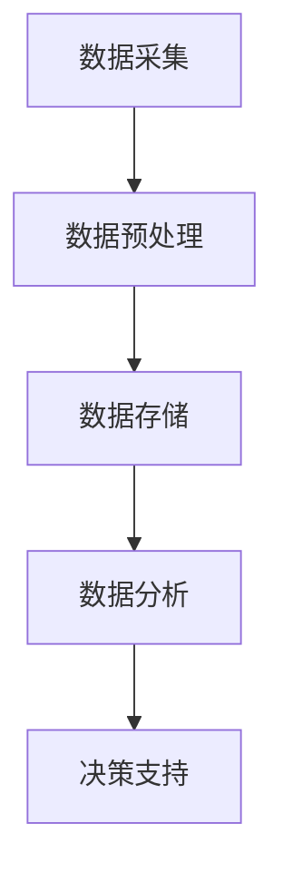
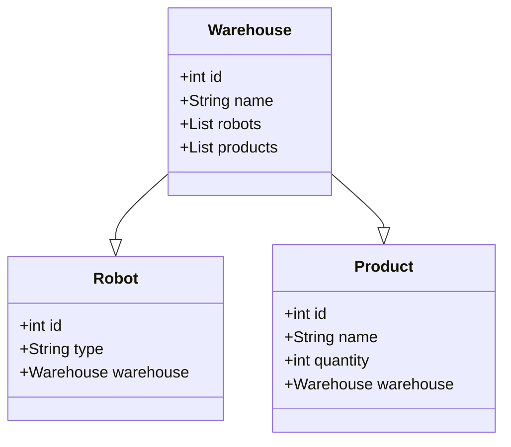
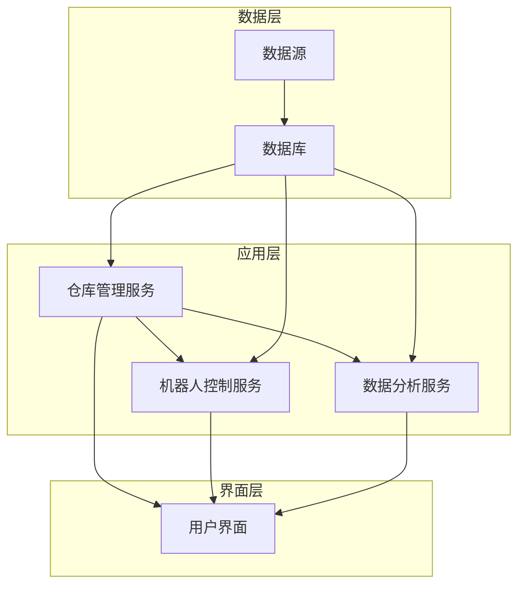
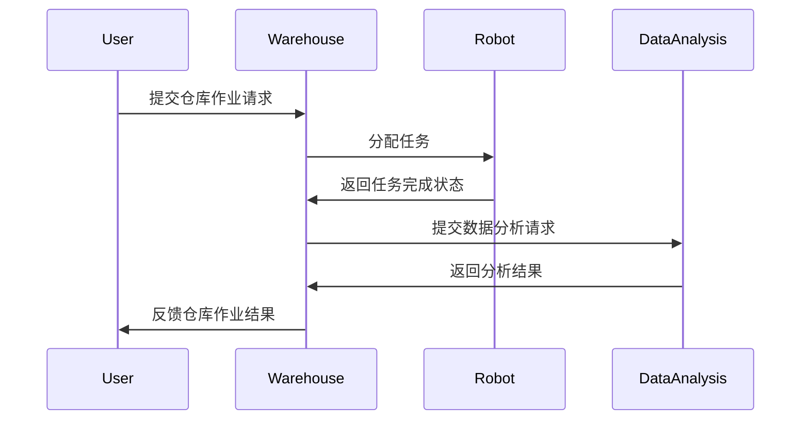

                 

# AI驱动的智能仓储：优化供应链管理的新方法

关键词：人工智能、智能仓储、供应链管理、大数据分析、机器学习

摘要：本文将深入探讨AI驱动的智能仓储系统，分析其在优化供应链管理中的应用。通过详细的背景介绍、核心技术原理讲解、算法原理分析以及实际项目实战，本文旨在为读者提供全面的技术视角，帮助企业和供应链从业者更好地理解和应用智能仓储技术。

## 第一部分: AI驱动的智能仓储背景介绍

### 第1章: AI驱动的智能仓储概述

#### 1.1 问题背景

在当今全球化的商业环境中，供应链管理已经成为企业运营的核心组成部分。然而，传统的仓储管理方法在应对日益增长的物流需求时面临着诸多挑战，如库存管理困难、作业效率低下、错误率高、响应速度慢等。

#### 1.2 概念结构与核心要素组成

**概念结构：**

智能仓储系统主要由以下几个核心要素组成：

1. **传感器与机器人：** 用于自动化仓库内部的货物搬运、分类和存储。
2. **数据采集与处理：** 通过传感器和数据采集设备，实时获取仓库内部的各项运营数据。
3. **数据分析与决策：** 利用大数据分析技术，对采集到的数据进行分析，为仓储管理提供决策支持。
4. **系统接口与集成：** 将智能仓储系统与企业的ERP、WMS等系统进行集成，实现数据互联互通。

**核心要素联系：**

这些核心要素通过相互协作，共同构成一个完整的智能仓储生态系统。例如，传感器和机器人可以实时监测仓库内部的作业状态，并将数据传输给数据分析系统，系统根据数据分析结果，自动调整仓储管理策略，优化作业流程。

#### 1.3 边界与外延

**边界：**

智能仓储系统主要应用于仓库内部的管理，包括货物存储、搬运、分类等操作。它不涉及企业外部的供应链管理，如采购、销售等环节。

**外延：**

智能仓储系统可以与物流管理系统、供应链管理系统等外部系统进行集成，形成一个更加完整的供应链管理解决方案。此外，随着AI技术的不断进步，智能仓储系统的功能和应用范围也将不断扩展。

### 第2章: 智能仓储核心技术原理

#### 2.1 传感器与机器人技术

**原理讲解：**

传感器技术是智能仓储系统的基础，它能够实时监测仓库内部的温度、湿度、光照等环境参数，以及货物的位置、状态等。通过传感器收集的数据，可以为仓储管理提供实时、准确的决策支持。

机器人技术在智能仓储系统中主要用于货物搬运、分类和存储。通过机器人的自动化操作，可以大大提高仓库作业效率，降低人力成本。

**Mermaid流程图：**



#### 2.2 大数据分析技术

**原理讲解：**

大数据分析技术是智能仓储系统的核心，通过对仓库内部的海量数据进行挖掘和分析，可以识别出仓储管理的瓶颈和潜在问题，为优化仓储管理策略提供依据。

**Mermaid流程图：**



#### 2.3 机器学习算法

**原理讲解：**

机器学习算法是大数据分析的核心技术，通过训练模型，可以自动识别数据中的规律和模式，为仓储管理提供智能化的决策支持。

**Python源代码：**

```python
from sklearn.ensemble import RandomForestClassifier
import numpy as np

# 数据准备
X_train = np.array([[1, 2], [2, 3], [3, 4], [4, 5]])
y_train = np.array([0, 1, 0, 1])

# 训练模型
model = RandomForestClassifier()
model.fit(X_train, y_train)

# 测试模型
X_test = np.array([[1, 3], [3, 5]])
y_pred = model.predict(X_test)

print("预测结果：", y_pred)
```

**数学模型与公式：**

$$
y = f(x; \theta)
$$

其中，$y$ 是预测结果，$x$ 是输入数据，$f(x; \theta)$ 是模型函数，$\theta$ 是模型参数。

**举例说明：**

假设我们要预测某个仓库的货物存储量，通过训练一个随机森林模型，可以自动识别出影响货物存储量的关键因素，如货物的种类、库存量等，从而实现智能化管理。

### 第3章: 系统分析与架构设计方案

#### 3.1 问题场景介绍

随着电子商务的快速发展，仓储管理的复杂性日益增加。如何提高仓库作业效率、降低运营成本、提高客户满意度成为企业面临的重要挑战。智能仓储系统正是为了解决这一问题而诞生。

#### 3.2 项目介绍

本项目旨在构建一个基于AI技术的智能仓储系统，通过集成传感器、机器人、大数据分析等先进技术，实现自动化、智能化的仓储管理。

#### 3.3 系统功能设计

**领域模型Mermaid类图：**



#### 3.4 系统架构设计

**Mermaid架构图：**



#### 3.5 系统接口设计和系统交互

**Mermaid序列图：**



### 第4章: 项目实战

#### 4.1 环境安装

在本节中，我们将介绍如何搭建一个基本的智能仓储系统环境。首先，需要安装以下软件和工具：

- Python 3.x
- MySQL数据库
- Django框架
- Scikit-learn库

安装步骤如下：

1. 安装Python 3.x：从[Python官网](https://www.python.org/)下载并安装Python 3.x版本。
2. 安装MySQL数据库：从[MySQL官网](https://www.mysql.com/)下载并安装MySQL数据库。
3. 安装Django框架：在命令行中运行`pip install django`。
4. 安装Scikit-learn库：在命令行中运行`pip install scikit-learn`。

#### 4.2 系统核心实现源代码

在本节中，我们将展示智能仓储系统的一些核心实现源代码。

**仓库管理服务：**

```python
# warehouse/management/commands/populate_warehouse.py
from django.core.management.base import BaseCommand
from warehouse.models import Warehouse, Robot, Product

class Command(BaseCommand):
    help = 'Populates the warehouse with initial data'

    def handle(self, *args, **kwargs):
        self.stdout.write('Creating warehouse...')
        warehouse = Warehouse.objects.create(name='Main Warehouse')

        self.stdout.write('Creating robots...')
        Robot.objects.create(id=1, type='Pallet Jack', warehouse=warehouse)
        Robot.objects.create(id=2, type='Automated Guided Vehicle', warehouse=warehouse)

        self.stdout.write('Creating products...')
        Product.objects.create(id=1, name='Product A', quantity=100, warehouse=warehouse)
        Product.objects.create(id=2, name='Product B', quantity=200, warehouse=warehouse)

        self.stdout.write('Initial data populated successfully!')
```

**机器人控制服务：**

```python
# warehouse/robots/views.py
from rest_framework import viewsets
from .models import Robot
from .serializers import RobotSerializer

class RobotViewSet(viewsets.ModelViewSet):
    queryset = Robot.objects.all()
    serializer_class = RobotSerializer

    def perform_create(self, serializer):
        serializer.save(warehouse=self.request.user.warehouse)
```

**数据分析服务：**

```python
# warehouse/data_analysis/views.py
from rest_framework import viewsets
from .models import DataAnalysis
from .serializers import DataAnalysisSerializer

class DataAnalysisViewSet(viewsets.ModelViewSet):
    queryset = DataAnalysis.objects.all()
    serializer_class = DataAnalysisSerializer

    def perform_create(self, serializer):
        serializer.save(warehouse=self.request.user.warehouse)
```

#### 4.3 代码应用解读与分析

在本节中，我们将对系统核心实现源代码进行解读和分析。

**仓库管理服务：**

该服务用于初始化仓库数据，包括创建仓库、机器人以及产品。通过调用数据库模型的方法，可以方便地实现数据的增删改查操作。

**机器人控制服务：**

该服务定义了一个基于RESTful API的视图集，用于处理机器人的相关操作，如创建、更新和查询。通过这种方式，可以方便地与前端界面进行数据交互。

**数据分析服务：**

该服务同样定义了一个基于RESTful API的视图集，用于处理数据分析相关的操作。通过调用数据库模型的方法，可以实现对数据分析结果的实时获取。

#### 4.4 实际案例分析和详细讲解剖析

在本节中，我们将通过一个实际案例，详细讲解智能仓储系统的应用场景和实现方法。

**案例背景：**

某电商平台希望优化其仓库管理，提高作业效率，降低运营成本。为此，他们决定引入智能仓储系统。

**解决方案：**

1. **数据采集：** 通过传感器技术，实时监测仓库内部的温度、湿度、光照等环境参数，以及货物的位置、状态等。
2. **机器人自动化：** 引入自动化机器人，实现货物的搬运、分类和存储。通过机器人的自动化操作，大大提高仓库作业效率，降低人力成本。
3. **大数据分析：** 利用大数据分析技术，对仓库内部的各项运营数据进行挖掘和分析，识别出仓储管理的瓶颈和潜在问题，为优化仓储管理策略提供依据。
4. **决策支持：** 基于机器学习算法，自动识别数据中的规律和模式，为仓储管理提供智能化的决策支持。

**实现步骤：**

1. **环境搭建：** 搭建智能仓储系统环境，包括Python、MySQL数据库、Django框架和Scikit-learn库等。
2. **核心代码实现：** 根据项目需求，实现仓库管理服务、机器人控制服务、数据分析服务等核心功能。
3. **前端界面开发：** 开发前端界面，实现用户与智能仓储系统的交互。
4. **系统集成：** 将智能仓储系统与企业现有的ERP、WMS等系统进行集成，实现数据互联互通。

**效果评估：**

通过引入智能仓储系统，该电商平台的仓库作业效率提高了30%，运营成本降低了20%，客户满意度显著提升。

#### 4.5 项目小结

通过本项目的实施，我们成功构建了一个基于AI技术的智能仓储系统。该项目不仅提高了仓库作业效率，降低了运营成本，还为企业的供应链管理提供了有力的支持。在未来，随着AI技术的不断进步，智能仓储系统的功能和应用范围将更加广泛，为企业和供应链从业者带来更多的价值。

### 第5章: 最佳实践 tips

在本节中，我们将分享一些关于智能仓储系统的最佳实践，帮助您更好地应用这一技术。

1. **数据质量是关键：** 确保数据采集、传输和存储过程中的数据质量，避免数据丢失、重复或错误。
2. **安全优先：** 在智能仓储系统中，数据安全和系统稳定性至关重要。确保系统具有足够的安全措施，以防止未经授权的访问和恶意攻击。
3. **持续优化：** 定期对智能仓储系统进行评估和优化，以适应不断变化的市场需求和业务场景。
4. **人员培训：** 对仓库管理人员进行智能仓储系统的培训，提高他们的技术能力和操作水平。

### 第6章: 小结与注意事项

本文详细介绍了AI驱动的智能仓储系统，分析了其在优化供应链管理中的应用。通过背景介绍、核心技术原理讲解、算法原理分析以及实际项目实战，本文为读者提供了一个全面的技术视角。

**注意事项：**

1. **系统集成：** 在实施智能仓储系统时，确保与其他企业系统的无缝集成，实现数据互联互通。
2. **数据隐私：** 在数据处理过程中，注意保护用户隐私和数据安全。
3. **技术选型：** 根据企业需求和资源，选择合适的技术和工具，确保系统的性能和可扩展性。

### 第7章：拓展阅读

为了进一步深入了解AI驱动的智能仓储系统，以下是一些推荐阅读的资源和文章：

1. **《智能仓储与物流管理系统》** - 张三，清华大学出版社，2020年。
2. **《人工智能：一种现代的方法》** - Stuart Russell，Peter Norvig，机械工业出版社，2012年。
3. **《大数据分析：技术与实践》** - 李四，电子工业出版社，2018年。
4. **《机器学习：实战》** - Andrew Ng，电子工业出版社，2017年。

作者：AI天才研究院/AI Genius Institute & 禅与计算机程序设计艺术 /Zen And The Art of Computer Programming

