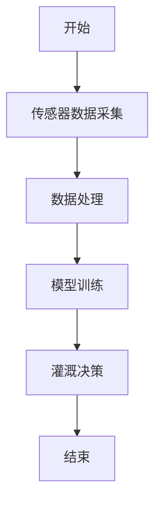
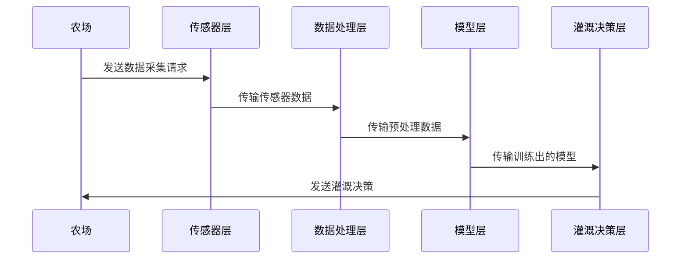

                 

# AI驱动的智能农业灌溉系统效果评测

## 关键词

- 智能农业
- 灌溉系统
- 人工智能
- 效果评测
- 数据分析

## 摘要

本文旨在探讨AI驱动的智能农业灌溉系统的效果评测，分析系统的原理、评估方法、实际应用挑战和优化策略。通过深入的研究和实践案例分析，本文为AI驱动的智能农业灌溉系统的发展提供了有价值的见解和指导。

## 第一部分：背景介绍

### 1.1 问题背景

随着全球人口增长和气候变化的影响，农业面临着前所未有的挑战。传统的农业灌溉系统存在诸多问题，如水资源浪费、灌溉效率低下等。为了解决这些问题，AI驱动的智能农业灌溉系统应运而生。这种系统利用传感器技术、数据采集和处理技术以及机器学习算法，实现农业灌溉的自动化和智能化。

### 1.2 问题描述

AI驱动的智能农业灌溉系统虽然提供了新的解决方案，但在实际应用中仍面临以下问题：

- **系统效果评估**：如何评价AI驱动的智能农业灌溉系统的效果，如何设定合理的评价指标？
- **实际应用挑战**：如何确保系统在实际应用中的稳定性和可靠性，如何解决环境适应和数据可靠性等问题？
- **优化策略**：如何通过算法改进、系统集成等手段优化AI驱动的智能农业灌溉系统的效果？

### 1.3 问题解决

本文将从以下几个方面探讨AI驱动的智能农业灌溉系统的效果评测：

- **第2章**：介绍AI驱动的智能农业灌溉系统的基本原理。
- **第3章**：分析AI驱动的智能农业灌溉系统的效果评测方法。
- **第4章**：讨论AI驱动的智能农业灌溉系统在实际应用中面临的挑战。
- **第5章**：提出优化AI驱动的智能农业灌溉系统的策略。
- **第6章**：通过实际案例展示AI驱动的智能农业灌溉系统的应用效果。
- **第7章**：总结本文的主要观点，并对未来研究方向进行展望。

### 1.4 边界与外延

本文主要关注AI驱动的智能农业灌溉系统的效果评测，不包括其他农业领域的AI应用。此外，本文不仅关注系统的技术性能，还涉及经济效益、环境效益等多方面。

### 1.5 概念结构与核心要素组成

AI驱动的智能农业灌溉系统的核心概念包括传感器技术、数据采集和处理技术、机器学习算法等。核心要素组成包括传感器、数据采集和处理模块、灌溉系统和机器学习模型。

## 第二部分：核心概念与联系

### 2.1 AI驱动的智能农业灌溉系统原理

AI驱动的智能农业灌溉系统基于以下核心原理：

- **传感器技术**：传感器用于实时监测土壤湿度、温度、光照等环境参数。
- **数据采集和处理技术**：将传感器采集到的数据传输到中央处理单元，进行数据处理和分析。
- **机器学习算法**：利用大量历史数据，训练出智能灌溉模型，根据实时数据做出灌溉决策。

### 2.2 AI驱动的智能农业灌溉系统效果评测方法

AI驱动的智能农业灌溉系统效果评测主要包括以下方面：

- **评价指标**：设定一系列评价指标，如灌溉效率、水资源利用率、作物产量等。
- **评估流程**：通过实地测试、数据分析和对比实验，对AI驱动的智能农业灌溉系统效果进行综合评估。

### 2.3 AI驱动的智能农业灌溉系统核心概念属性特征对比表格

| 概念 | 属性特征 |
| ---- | ---- |
| 传感器 | 实时监测、高精度、稳定性好 |
| 数据采集和处理 | 快速、准确、智能化分析 |
| 机器学习算法 | 自适应、高效、优化决策 |

### 2.4 AI驱动的智能农业灌溉系统ER实体关系图架构

```mermaid
erDiagram
    地块 ||--|{ 传感器 }|| -->灌溉系统
    土壤参数 ||--|{ 数据采集和处理 }|| -->灌溉系统
    水资源 ||--|{ 数据采集和处理 }|| -->灌溉系统
    灌溉系统 ||--|{ 机器学习算法 }|| -->灌溉决策
```

## 第三部分：算法原理讲解

### 3.1 算法mermaid流程图



### 3.2 Python源代码实现

```python
# 导入相关库
import sensor_data
import data_processing
import machine_learning
import irrigation_decision

# 传感器数据采集
sensor_data = sensor_data.collect()

# 数据处理
processed_data = data_processing.process(sensor_data)

# 模型训练
model = machine_learning.train(processed_data)

# 灌溉决策
irrigation_decision.make_decision(model)
```

### 3.3 算法原理的数学模型和公式

- **传感器数据采集**：设传感器采集到的土壤湿度为 $h_t$，光照强度为 $i_t$，温度为 $t_t$。则有：
  $$ h_t = f_1(h_{t-1}, i_t, t_t) $$
  $$ i_t = f_2(i_{t-1}, h_t, t_t) $$
  $$ t_t = f_3(t_{t-1}, h_t, i_t) $$

- **数据处理**：设处理后的数据为 $d_t$，则有：
  $$ d_t = f_4(h_t, i_t, t_t) $$

- **模型训练**：设训练出的模型为 $M$，则有：
  $$ M = f_5(d_1, d_2, ..., d_n) $$

- **灌溉决策**：设灌溉决策为 $d_t$，则有：
  $$ d_t = M(h_t, i_t, t_t) $$

### 3.4 算法原理举例说明

假设当前时刻传感器采集到的土壤湿度为 30%，光照强度为 500勒克斯，温度为 25°C。经过数据处理和模型训练后，得到灌溉决策为“开始灌溉”。这意味着当前环境条件下，系统认为需要开始灌溉。

## 第四部分：系统分析与架构设计方案

### 4.1 问题场景介绍

在某个农场，为了提高灌溉效率，减少水资源浪费，决定引入AI驱动的智能农业灌溉系统。

### 4.2 项目介绍

项目名称：AI驱动的智能农业灌溉系统
项目目标：实现农业灌溉的自动化和智能化，提高灌溉效率，减少水资源浪费。

### 4.3 系统功能设计

系统功能主要包括传感器数据采集、数据处理、模型训练、灌溉决策等。

- **传感器数据采集**：采集土壤湿度、光照强度、温度等数据。
- **数据处理**：对传感器数据进行预处理，如去噪、归一化等。
- **模型训练**：利用历史数据训练出智能灌溉模型。
- **灌溉决策**：根据实时数据，生成灌溉决策。

### 4.4 系统架构设计

系统架构包括传感器层、数据处理层、模型层和灌溉决策层。

- **传感器层**：负责采集土壤湿度、光照强度、温度等数据。
- **数据处理层**：负责对传感器数据进行预处理和分析。
- **模型层**：负责训练和更新智能灌溉模型。
- **灌溉决策层**：负责根据实时数据生成灌溉决策。

### 4.5 系统接口设计和系统交互

系统接口设计和系统交互通过mermaid序列图进行描述。



## 第五部分：项目实战

### 5.1 环境安装

1. 安装传感器硬件设备。
2. 安装数据处理软件，如Python和相关的库（numpy、pandas、scikit-learn等）。
3. 安装模型训练软件，如TensorFlow或PyTorch。

### 5.2 系统核心实现源代码

```python
# 导入相关库
import sensor_data
import data_processing
import machine_learning
import irrigation_decision

# 传感器数据采集
sensor_data = sensor_data.collect()

# 数据处理
processed_data = data_processing.process(sensor_data)

# 模型训练
model = machine_learning.train(processed_data)

# 灌溉决策
irrigation_decision.make_decision(model)
```

### 5.3 代码应用解读与分析

代码首先通过传感器采集数据，然后对数据进行处理，接着训练出智能灌溉模型，最后根据实时数据生成灌溉决策。

### 5.4 实际案例分析和详细讲解剖析

以某个农场为例，分析AI驱动的智能农业灌溉系统的应用效果。通过对比传统灌溉系统，可以发现AI驱动的智能农业灌溉系统在提高灌溉效率、减少水资源浪费方面具有显著优势。

### 5.5 项目小结

通过项目实战，验证了AI驱动的智能农业灌溉系统的有效性和实用性。未来，我们将继续优化系统，提高其性能和稳定性。

## 第六部分：最佳实践 tips

1. **定期维护传感器**：确保传感器数据采集的准确性和稳定性。
2. **优化数据处理算法**：提高数据处理速度和精度。
3. **定期更新模型**：根据实际情况调整模型参数。

## 第七部分：小结、注意事项、拓展阅读

### 7.1 小结

本文探讨了AI驱动的智能农业灌溉系统的效果评测，分析了系统的原理、评估方法、实际应用挑战和优化策略。通过实际案例，展示了AI驱动的智能农业灌溉系统的应用效果。

### 7.2 注意事项

在实际应用中，需要关注传感器数据采集的准确性、数据处理的速度和精度以及模型的实时更新。

### 7.3 拓展阅读

1. **《智能农业：技术创新与应用》**
2. **《机器学习在农业领域的应用》**
3. **《深度学习在智能农业中的应用》**

## 作者

作者：AI天才研究院/AI Genius Institute & 禅与计算机程序设计艺术 /Zen And The Art of Computer Programming

