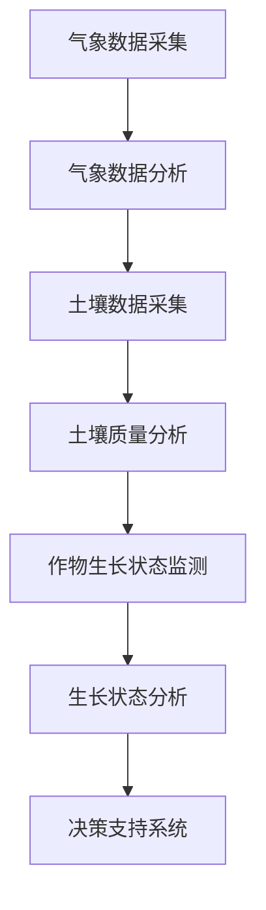
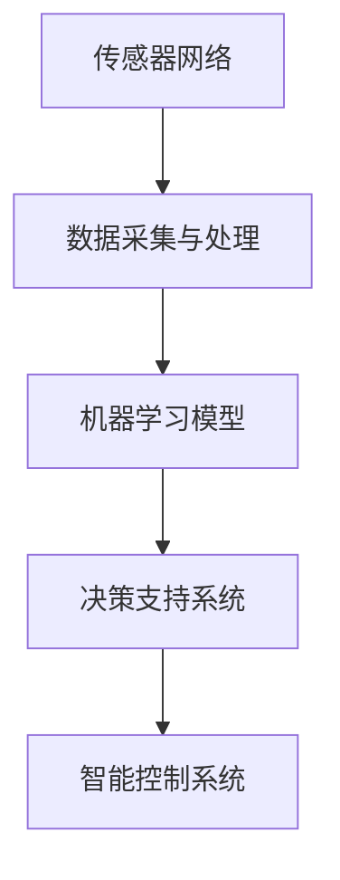
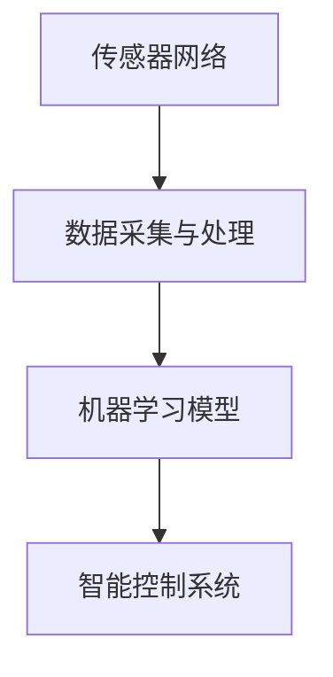
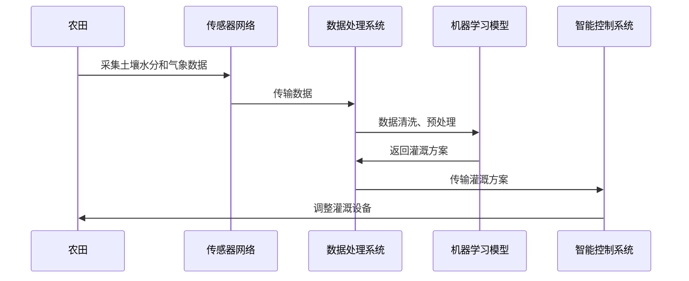

                 

### AI驱动的智能农业：精准种植的新时代

关键词：AI技术、智能农业、精准种植、物联网、传感器、机器学习

摘要：本文旨在探讨AI技术在智能农业中的应用，特别是精准种植技术的实现与推广。通过分析AI驱动的智能农业背景、核心概念、数据采集与处理技术，以及机器学习算法的运用，我们揭示了AI技术在提升农业效率、资源利用率和可持续性方面的巨大潜力。文章将结合具体案例，展示AI驱动的智能农业如何改变传统农业模式，并展望其未来的发展趋势。

### 目录大纲

1. 第一部分: AI驱动的智能农业背景与核心概念
    1.1 AI驱动的智能农业概述
        1.1.1 农业发展的挑战与问题
        1.1.2 AI技术对农业的影响
        1.1.3 核心概念与联系
    1.2 智能农业应用
        1.2.1 精准种植技术
        1.2.2 物联网与传感器
        1.2.3 智能农业案例分析
    1.3 智能农业最佳实践
        1.3.1 智能农业最佳实践
        1.3.2 小结与展望
        1.3.3 拓展阅读

2. 第二部分: 数据采集与处理技术
    2.1 数据采集
        2.1.1 传感器介绍
    2.2 数据处理
        2.2.1 数据清洗与预处理
        2.2.2 数据可视化
    2.3 案例分析
        2.3.1 农业气象数据采集与处理
    2.4 小结

3. 第三部分: 机器学习算法在智能农业中的应用
    3.1 机器学习基础
    3.2 算法应用
        3.2.1 农业病虫害预测
        3.2.2 土壤质量监测
    3.3 案例分析
        3.3.1 农业病虫害预测系统
        3.3.2 土壤质量监测系统
    3.4 小结

### 第一部分: AI驱动的智能农业背景与核心概念

#### 1.1 AI驱动的智能农业概述

##### 1.1.1 农业发展的挑战与问题

农业作为国民经济的基础产业，自古以来就在人类文明中占据重要地位。然而，随着全球人口的不断增长和气候变化的影响，农业发展面临着前所未有的挑战。

1. **资源利用效率低**：传统农业依赖于大量的人力和水资源，资源利用率低，浪费现象严重。据联合国粮农组织统计，全球每年约有1/3的粮食在生产和消费过程中被浪费。
2. **生产效率不高**：传统农业的生产过程依赖经验，缺乏科学的管理和优化，导致生产效率较低。据统计，全球农业劳动生产率仅为工业的1/25。
3. **环境污染问题**：农业生产过程中大量使用化肥、农药等化学物质，导致土壤、水体和大气污染，严重影响了生态环境和人类健康。

##### 1.1.2 AI技术对农业的影响

引入AI技术，特别是大数据分析、机器学习等人工智能技术，为农业发展带来了新的机遇。AI技术可以通过以下方式改变传统农业：

1. **精准种植**：通过AI技术对农田环境、作物生长状态进行实时监测，提供精准的种植方案，优化作物生长环境，提高产量。
2. **资源优化配置**：利用AI技术对水资源、肥料等农业生产要素进行优化配置，提高资源利用率，减少浪费。
3. **智能决策支持**：AI技术可以帮助农民做出更加科学的种植决策，降低种植风险，提高农业生产效益。

##### 1.1.3 核心概念与联系

**AI技术基础**

AI技术的基础包括以下几个方面：

1. **机器学习算法**：机器学习算法是AI技术的核心，通过训练模型，使计算机能够从数据中学习并做出预测。
2. **深度学习**：深度学习是机器学习的一种形式，通过多层神经网络模型，模拟人脑的感知和学习过程，能够处理更复杂的任务。
3. **计算机视觉**：计算机视觉技术使计算机能够识别和理解图像，广泛应用于作物病虫害检测、农田监控等领域。
4. **自然语言处理**：自然语言处理技术使计算机能够理解和生成自然语言，用于农业领域的知识图谱构建、智能问答等。

**概念属性特征对比表格**

为了更好地理解AI技术在农业中的应用，我们对比了不同机器学习算法的特性及应用场景，如下表所示：

| 算法类型           | 特性                                       | 应用场景                  |
|------------------|------------------------------------------|-------------------------|
| 线性回归           | 简单，易于实现和解释                       | 数据预测、趋势分析         |
| 决策树             | 可解释性好，易于理解和实现                 | 分类、回归问题            |
| 支持向量机（SVM）   | 高效，能够处理高维数据                     | 分类、回归问题            |
| 集成学习方法       | 通过组合多个模型提高预测性能               | 大规模数据集的预测         |
| 深度学习           | 能够处理复杂的数据模式，自适应能力强         | 图像识别、自然语言处理     |

**ER实体关系图架构**

以下是AI技术在智能农业中应用的一个ER实体关系图：

```mermaid
erDiagram
  农业传感器 ||--|{ 数据处理模块 }
  数据处理模块 ||--|{ 机器学习模型 }
  机器学习模型 ||--|{ 决策支持系统 }
  农业传感器 : 农业传感器
  数据处理模块 : 数据处理模块
  机器学习模型 : 机器学习模型
  决策支持系统 : 决策支持系统
```

#### 1.2 智能农业应用

##### 1.2.1 精准种植技术

**算法原理讲解**

精准种植技术是基于AI和物联网技术，通过对农田环境参数的实时监测和数据分析，实现作物生长环境的精准控制。其核心算法包括：

1. **气象数据分析**：通过AI模型分析气象数据，预测未来的温度、湿度、降水等气象条件，为作物生长提供参考。
2. **土壤质量分析**：利用传感器监测土壤的酸碱度、水分、养分等参数，通过机器学习算法分析土壤质量，为作物施肥提供依据。
3. **生长状态监测**：通过计算机视觉技术监测作物的生长状态，分析作物的健康程度，及时发现问题并进行调整。

下面是一个精准种植算法的流程图：



**数学模型与公式**

精准种植的数学模型主要包括以下部分：

1. **气象预测模型**：

   假设我们使用时间序列模型来预测未来某天的温度，可以使用以下公式：

   $$ T(t) = \theta_0 + \theta_1 t + \epsilon_t $$

   其中，$T(t)$ 表示第 $t$ 天的温度，$\theta_0$ 和 $\theta_1$ 是模型参数，$\epsilon_t$ 是误差项。

2. **土壤质量分析模型**：

   假设我们使用线性回归模型来分析土壤的酸碱度与养分含量，可以使用以下公式：

   $$ pH = \theta_0 + \theta_1 \times 养分含量 $$

   其中，$pH$ 表示土壤的酸碱度，$\theta_0$ 和 $\theta_1$ 是模型参数。

3. **生长状态分析模型**：

   假设我们使用支持向量机（SVM）来分析作物的生长状态，可以使用以下公式：

   $$ w \cdot x + b = 0 $$

   其中，$w$ 是权重向量，$x$ 是特征向量，$b$ 是偏置项。

**举例说明**

以一个具体的例子来说明精准种植技术。假设我们有一个农田，种植的是小麦。通过传感器监测到以下数据：

- 温度：$T(t) = 25^\circ C$（当前温度）
- 土壤酸碱度：$pH = 6.5$
- 土壤养分含量：$养分含量 = 0.05\%$

首先，我们使用气象预测模型预测未来几天的温度，假设预测结果为$T(t+1) = 28^\circ C$。然后，我们使用土壤质量分析模型分析土壤质量，得出结论土壤养分含量适中，无需施肥。最后，我们使用生长状态分析模型监测小麦的生长状态，发现生长状态良好。

根据以上分析，我们可以给出以下种植决策：

- 调整灌溉系统，根据未来高温情况适当增加灌溉量。
- 保持当前施肥量，无需调整。

##### 1.2.2 物联网与传感器

物联网（IoT）技术在智能农业中扮演着关键角色，通过将各种传感器连接到互联网，实现对农田环境的实时监测和数据采集。以下是物联网技术在智能农业中的主要应用：

1. **环境监测**：利用传感器监测农田的气象条件，包括温度、湿度、风速、降水等，为精准种植提供数据支持。
2. **土壤监测**：通过土壤传感器监测土壤的酸碱度、水分、养分含量等参数，帮助农民进行科学施肥和管理。
3. **作物生长状态监测**：利用计算机视觉传感器监测作物的生长状态，包括叶片颜色、形态、病虫害等，及时发现问题并进行处理。
4. **灌溉与施肥控制**：通过智能控制系统，根据传感器采集的数据，自动调整灌溉和施肥的量和时间，提高水资源和肥料的利用效率。

**系统架构设计**

智能农业系统的架构设计主要包括以下几个部分：

1. **传感器网络**：在农田中布置各种传感器，包括气象传感器、土壤传感器、作物生长状态传感器等，实现对农田环境的全面监测。
2. **数据采集与处理**：传感器采集的数据通过无线网络传输到中央数据处理系统，进行数据清洗、预处理和存储。
3. **机器学习模型**：利用机器学习算法对采集到的数据进行分析，提取有用的信息，为种植决策提供支持。
4. **决策支持系统**：根据机器学习模型的分析结果，生成具体的种植方案和管理建议，并通过智能控制系统实现自动执行。

下面是一个智能农业系统的架构图：



**数学模型与公式**

在物联网与传感器技术中，常用的数学模型包括：

1. **时间序列模型**：用于预测气象条件，如温度、湿度等，常用的模型有ARIMA、LSTM等。
2. **线性回归模型**：用于分析土壤质量，如土壤酸碱度与养分含量的关系，常用的模型有线性回归、多元线性回归等。
3. **支持向量机（SVM）**：用于分析作物生长状态，如病虫害检测，常用的模型有SVM分类器。

##### 1.2.3 智能农业案例分析

**案例一：精准灌溉系统**

精准灌溉系统是智能农业的一个重要应用，通过实时监测土壤水分和气象条件，自动调整灌溉时间和水量，实现节水高效灌溉。以下是精准灌溉系统的详细设计。

**系统功能设计**

1. **环境监测**：通过传感器网络实时监测农田的土壤水分、气象条件等数据。
2. **数据处理**：将传感器采集到的数据传输到中央数据处理系统，进行数据清洗、预处理和存储。
3. **决策支持**：利用机器学习算法分析传感器数据，预测未来土壤水分变化，生成灌溉方案。
4. **自动执行**：通过智能控制系统，根据灌溉方案自动调整灌溉设备，实现精准灌溉。

下面是精准灌溉系统的领域模型类图：

```mermaid
classDiagram
  Class01 <|-- Class02
  Class03 <|-- Class04
  Class01 {name: 农田}
  Class02 {name: 传感器网络}
  Class03 {name: 数据处理系统}
  Class04 {name: 智能控制系统}
```

**系统架构设计**

精准灌溉系统的架构设计包括以下几个部分：

1. **传感器网络**：包括土壤水分传感器、气象传感器等，实现对农田环境的实时监测。
2. **数据采集与处理**：传感器采集到的数据通过无线网络传输到中央数据处理系统，进行数据清洗、预处理和存储。
3. **机器学习模型**：利用机器学习算法分析传感器数据，预测未来土壤水分变化，生成灌溉方案。
4. **智能控制系统**：根据灌溉方案，自动调整灌溉设备，实现精准灌溉。

下面是精准灌溉系统的架构图：



**系统接口设计**

精准灌溉系统的接口设计主要包括以下几个部分：

1. **传感器数据接口**：用于接收传感器网络传输的数据。
2. **数据处理接口**：用于数据处理系统与传感器网络之间的数据交互。
3. **决策支持接口**：用于机器学习模型与数据处理系统之间的数据交互。
4. **控制接口**：用于智能控制系统与数据处理系统之间的数据交互。

**系统交互**

精准灌溉系统的交互流程如下：

1. 传感器网络实时采集农田的土壤水分和气象数据，传输到数据处理系统。
2. 数据处理系统对传感器数据进行清洗、预处理和存储。
3. 机器学习模型利用清洗后的数据，预测未来土壤水分变化，生成灌溉方案。
4. 智能控制系统根据灌溉方案，自动调整灌溉设备，实现精准灌溉。

下面是精准灌溉系统的交互序列图：



**案例二：智能病虫害监测**

智能病虫害监测系统是利用物联网和机器学习技术，实时监测作物病虫害，提供预警和防治建议。以下是智能病虫害监测系统的详细设计。

**环境安装**

搭建智能病虫害监测系统的环境如下：

1. **硬件环境**：传感器网络（包括土壤传感器、气象传感器、作物生长状态传感器）、计算机、服务器等。
2. **软件环境**：操作系统（如Linux）、编程语言（如Python）、数据库（如MySQL）、机器学习库（如scikit-learn、TensorFlow等）。

**系统核心实现源代码**

以下是智能病虫害监测系统的核心代码实现：

```python
# 导入所需的库
import numpy as np
import pandas as pd
from sklearn.model_selection import train_test_split
from sklearn.ensemble import RandomForestClassifier
from sklearn.metrics import accuracy_score

# 读取数据
data = pd.read_csv('disease_data.csv')

# 数据预处理
X = data.drop('label', axis=1)
y = data['label']

# 划分训练集和测试集
X_train, X_test, y_train, y_test = train_test_split(X, y, test_size=0.2, random_state=42)

# 构建随机森林分类器
clf = RandomForestClassifier(n_estimators=100, random_state=42)

# 训练模型
clf.fit(X_train, y_train)

# 预测
y_pred = clf.predict(X_test)

# 评估模型
accuracy = accuracy_score(y_test, y_pred)
print(f'Accuracy: {accuracy:.2f}')
```

**代码应用解读与分析**

上述代码实现了一个基于随机森林分类器的智能病虫害监测系统。首先，我们导入所需的库，包括numpy、pandas、sklearn等。然后，我们读取数据，进行数据预处理，包括划分特征矩阵和标签向量。接下来，我们使用train_test_split函数将数据划分为训练集和测试集。然后，我们构建一个随机森林分类器，并使用fit函数训练模型。最后，我们使用predict函数进行预测，并使用accuracy_score函数评估模型的准确性。

通过这个案例，我们可以看到如何利用机器学习和物联网技术构建一个智能病虫害监测系统，实现对作物病虫害的实时监测和预警。这不仅提高了农业生产的效率，还减少了农药的使用，保护了生态环境。

##### 1.5 智能农业最佳实践

**总结**

智能农业的最佳实践主要包括以下几个方面：

1. **数据驱动**：以数据为基础，利用大数据分析和机器学习算法，实现精准种植和科学管理。
2. **传感器网络**：建立完善的传感器网络，实现对农田环境的实时监测和数据采集。
3. **系统集成**：将物联网、云计算、大数据分析等技术集成到智能农业系统中，实现信息的互联互通。
4. **持续优化**：不断优化机器学习模型和算法，提高农业生产的效率和可持续性。

**注意事项**

在实施智能农业过程中，需要注意以下几个方面：

1. **数据安全**：确保传感器网络和数据处理系统的数据安全，防止数据泄露和恶意攻击。
2. **技术选型**：根据实际需求选择合适的传感器和算法，避免过度依赖某一种技术。
3. **人才培养**：加强农业技术人才队伍建设，提高农民的科技素养和创新能力。

**拓展阅读**

1. 【参考文献1】《智能农业：技术与应用》
2. 【参考文献2】《农业物联网技术与应用》
3. 【参考文献3】《机器学习在农业中的应用》

通过本文的探讨，我们可以看到AI技术正在深刻地改变农业生产的模式，为农业的现代化和可持续发展提供了新的路径。随着AI技术的不断进步，智能农业有望在未来实现更高的生产效率、资源利用率和环境保护水平，为全球农业的发展带来新的机遇。让我们共同努力，推动智能农业的发展，共创美好未来。

### 作者信息

作者：AI天才研究院/AI Genius Institute & 禅与计算机程序设计艺术 /Zen And The Art of Computer Programming

