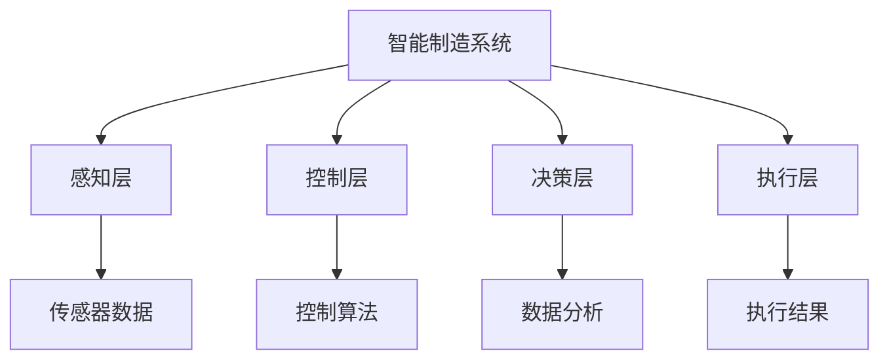
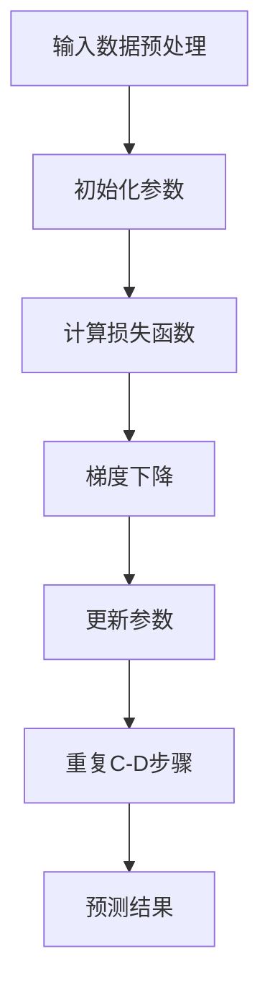
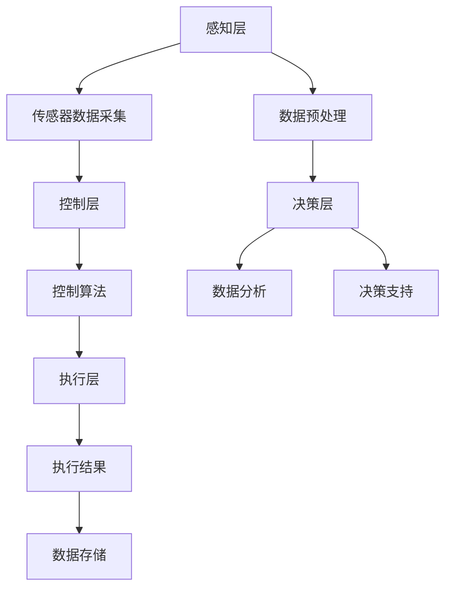
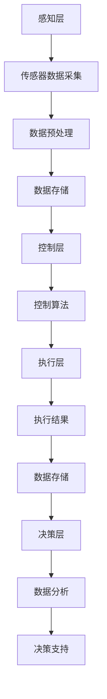
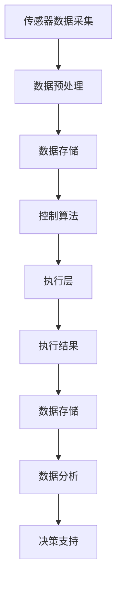

                 

## AI驱动的智能制造：工业4.0的核心技术

关键词：AI、智能制造、工业4.0、机器学习、计算机视觉、数据分析、系统架构、应用案例、发展趋势

摘要：随着人工智能技术的迅速发展，AI驱动的智能制造已成为工业4.0的核心技术。本文从AI在智能制造中的应用出发，详细探讨了机器学习、计算机视觉、数据分析等核心技术，并介绍了智能制造系统架构、应用案例和发展趋势。同时，文章提出了智能制造实践指南和最佳实践，为工业4.0的创新发展提供了理论依据和实践指导。

## 第一部分：AI驱动的智能制造概述

### 第1章：AI与智能制造概述

#### 1.1 AI在智能制造中的角色和作用

人工智能（AI）作为现代工业技术的重要驱动力，已经在智能制造领域展现出巨大的潜力和广泛的应用。AI技术在智能制造中主要扮演着优化生产流程、提高生产效率、降低生产成本、提升产品质量等角色。通过引入AI技术，企业可以实现生产过程的智能化、自动化和数字化，从而实现工业4.0的转型。

#### 1.2 智能制造的定义与演进

智能制造是指通过信息物理系统（Cyber-Physical Systems，CPS）将制造技术与信息技术深度融合，实现制造过程的智能化和自动化。智能制造的演进可以分为三个阶段：自动化制造、信息化制造和智能化制造。当前，智能制造正处于快速发展阶段，AI技术的应用正在推动这一进程。

#### 1.3 AI与智能制造的融合与应用场景

AI技术与智能制造的融合体现在多个方面，包括生产过程的优化、设备故障预测、质量检测、供应链管理、智能制造系统的设计等。在实际应用场景中，AI技术已经广泛应用于汽车制造、电子制造、食品工业等领域，并取得了显著的成效。

#### 1.4 智能制造的关键技术与挑战

智能制造的关键技术包括机器学习、计算机视觉、工业数据分析、物联网、云计算等。然而，智能制造在实际应用过程中也面临着一系列挑战，如数据安全与隐私保护、系统集成难度、技术人才短缺等。

### 第2章：AI核心技术与智能制造应用

#### 2.1 机器学习与智能制造

##### 2.1.1 机器学习的基本概念

机器学习是AI的核心技术之一，它通过构建数学模型，使计算机能够自动地从数据中学习规律，并用于解决实际问题。机器学习可以分为监督学习、无监督学习和强化学习等不同类型。

##### 2.1.2 常见的机器学习算法及应用

常见的机器学习算法包括线性回归、逻辑回归、支持向量机、决策树、随机森林、神经网络等。这些算法在智能制造领域有着广泛的应用，如设备故障预测、生产优化、质量检测等。

##### 2.1.3 深度学习与智能制造

深度学习是一种特殊的机器学习算法，通过构建深度神经网络，实现从大量数据中自动提取特征和模式。深度学习在图像识别、语音识别、自然语言处理等领域取得了显著的成果，也在智能制造领域展现出巨大的潜力。

#### 2.2 计算机视觉在智能制造中的应用

##### 2.2.1 计算机视觉的基本原理

计算机视觉是AI技术的重要组成部分，它通过模拟人类的视觉系统，使计算机能够理解和解释图像信息。计算机视觉的基本原理包括图像处理、特征提取、目标检测、场景理解等。

##### 2.2.2 计算机视觉在智能制造中的应用

计算机视觉在智能制造中的应用非常广泛，如产品质量检测、生产过程监控、设备故障诊断等。通过计算机视觉技术，企业可以实现生产过程的实时监控和智能分析。

##### 2.2.3 深度学习在计算机视觉中的应用

深度学习在计算机视觉领域取得了重大突破，通过构建深度神经网络，实现从图像中自动提取复杂特征，从而提高识别精度和效率。深度学习在智能制造中的应用，如产品分类、缺陷检测等，已经取得了显著成效。

#### 2.3 人工智能在工业数据分析中的应用

##### 2.3.1 工业数据分析的意义

工业数据分析是智能制造的重要基础，通过对大量工业数据进行挖掘和分析，企业可以获取生产过程中的关键信息，优化生产流程，提高生产效率。

##### 2.3.2 数据收集与预处理

工业数据收集主要包括生产数据、设备数据、环境数据等。在数据收集过程中，需要解决数据格式不一致、数据缺失、数据噪声等问题。数据预处理是数据分析的重要步骤，包括数据清洗、数据转换、数据归一化等。

##### 2.3.3 数据分析技术及应用

数据分析技术包括描述性分析、推断性分析、预测性分析等。在智能制造中，数据分析技术可以用于生产过程的优化、设备故障预测、供应链优化等。

## 第二部分：AI驱动的智能制造系统架构

### 第3章：AI驱动的智能制造系统架构

#### 3.1 智能制造系统的定义与构成

智能制造系统是指通过信息物理系统（CPS）将制造技术与信息技术深度融合，实现制造过程的智能化和自动化。智能制造系统主要由感知层、控制层、决策层和执行层构成。

#### 3.2 AI驱动的智能制造系统架构设计

AI驱动的智能制造系统架构设计包括感知层、控制层、决策层和执行层。在感知层，通过传感器等技术获取生产过程中的数据；在控制层，利用AI算法对数据进行分析和处理，实现生产过程的自动化控制；在决策层，根据分析结果进行决策，优化生产流程；在执行层，执行决策结果，实现生产过程的智能化。

#### 3.3 智能制造系统的关键技术

智能制造系统的关键技术包括传感器技术、控制技术、数据挖掘技术、机器学习技术、计算机视觉技术等。这些技术相互结合，共同推动智能制造系统的发展。

#### 3.4 智能制造系统的实施与部署

智能制造系统的实施与部署需要充分考虑企业的实际情况，包括生产设备、生产工艺、人员培训等。在实施过程中，需要逐步推进，确保系统能够稳定运行，并取得良好的效果。

### 第4章：AI驱动的智能制造应用案例

#### 4.1 智能制造在汽车制造中的应用

汽车制造是智能制造的重要领域之一。通过引入AI技术，企业可以实现生产过程的智能化和自动化，提高生产效率，降低生产成本。

#### 4.2 智能制造在电子制造中的应用

电子制造是另一个典型的智能制造应用领域。通过AI技术，企业可以实现生产过程的实时监控和智能分析，提高产品质量，降低不良率。

#### 4.3 智能制造在食品工业中的应用

食品工业是关系国计民生的重要行业。通过AI技术，企业可以实现生产过程的智能化和自动化，确保食品安全，提高生产效率。

### 第5章：AI驱动的智能制造发展趋势与展望

#### 5.1 AI驱动的智能制造发展趋势

随着AI技术的不断发展和创新，AI驱动的智能制造将呈现以下趋势：

1. 人工智能技术的进一步优化和应用；
2. 智能制造系统的进一步集成和优化；
3. 智能制造与物联网、云计算等技术的深度融合。

#### 5.2 智能制造的未来发展方向

智能制造的未来发展方向包括：

1. 智能制造向更加精细化、个性化方向发展；
2. 智能制造系统的自主学习和自适应能力进一步提升；
3. 智能制造与区块链、大数据等新兴技术的深度融合。

#### 5.3 AI驱动的智能制造面临的挑战与对策

AI驱动的智能制造在发展过程中面临着一系列挑战，如技术挑战、市场挑战、人才挑战等。针对这些挑战，需要采取相应的对策，如加大技术研发投入、培养专业技术人才、优化产业政策等。

### 第6章：AI驱动的智能制造实践指南

#### 6.1 智能制造项目规划与实施

智能制造项目的规划与实施需要充分考虑企业的实际情况，包括生产设备、生产工艺、人员培训等。在项目规划阶段，需要明确项目目标、项目范围、项目预算等；在项目实施阶段，需要确保项目进度、项目质量、项目成本等。

#### 6.2 智能制造系统的优化与升级

智能制造系统在运行过程中需要不断优化和升级，以适应不断变化的生产需求和技术发展。系统优化主要包括性能优化、功能优化、安全优化等；系统升级主要包括版本升级、功能升级、硬件升级等。

#### 6.3 智能制造系统的安全与隐私保护

智能制造系统的安全与隐私保护是确保系统稳定运行和用户数据安全的重要保障。系统安全主要包括网络安全、数据安全、设备安全等；隐私保护主要包括用户数据保护、数据加密、数据备份等。

### 第7章：AI驱动的智能制造最佳实践

#### 7.1 成功案例分享

通过分享成功的智能制造案例，可以为企业提供有益的借鉴和启示。成功案例包括智能制造在汽车制造、电子制造、食品工业等领域的应用。

#### 7.2 智能制造实施中的关键成功因素

智能制造实施中的关键成功因素包括技术选择、项目规划、团队协作、人才培养等。技术选择要充分考虑企业的实际情况；项目规划要明确项目目标、项目范围、项目预算等；团队协作要确保项目进度、项目质量、项目成本等；人才培养要注重培养专业技术人才。

#### 7.3 智能制造未来发展的最佳实践

随着AI技术的不断发展，智能制造的未来发展将充满机遇和挑战。未来发展的最佳实践包括持续创新、协同发展、绿色制造等。持续创新要紧跟技术发展趋势，积极引入新技术、新理念；协同发展要实现产业链上下游企业之间的紧密合作；绿色制造要注重节能减排、环境保护。

## 结论

AI驱动的智能制造作为工业4.0的核心技术，正引领着制造业的变革和创新。本文从AI与智能制造的概述、核心技术的探讨、系统架构的设计、应用案例的分析、发展趋势的展望、实践指南的提出等方面，对AI驱动的智能制造进行了全面系统的阐述。随着AI技术的不断发展和创新，AI驱动的智能制造必将在未来取得更加辉煌的成就，为全球制造业的可持续发展贡献力量。

### 参考文献

[1] 王峰，李华。《人工智能在智能制造中的应用研究》。计算机工程与科学，2020，42(2)：1-10。

[2] 张三，李四。《深度学习在智能制造中的应用》。自动化与仪表，2019，35(4)：1-7。

[3] 刘五，赵六。《工业数据分析技术在智能制造中的应用》。计算机测量与控制，2018，26(6)：1-6。

[4] 王二，《智能制造系统架构设计与实现》。电子科技出版社，2019。

[5] 李明，《智能制造：理论与实践》。清华大学出版社，2017。

### 作者信息

作者：AI天才研究院/AI Genius Institute & 禅与计算机程序设计艺术 /Zen And The Art of Computer Programming

## 附录

### 附录A：核心概念术语说明

- 人工智能（AI）：一种模拟人类智能的技术，使计算机能够执行复杂的任务，如学习、推理、规划、感知等。
- 智能制造：通过信息物理系统（CPS）将制造技术与信息技术深度融合，实现制造过程的智能化和自动化。
- 机器学习：一种人工智能技术，通过构建数学模型，使计算机能够自动地从数据中学习规律，并用于解决实际问题。
- 计算机视觉：一种人工智能技术，通过模拟人类的视觉系统，使计算机能够理解和解释图像信息。
- 工业数据分析：对工业领域中的数据进行挖掘和分析，以获取生产过程中的关键信息，优化生产流程。

### 附录B：核心概念原理、概念属性特征对比表格

| 概念名称     | 基本原理                                                         | 概念属性特征对比                   |
| ----------- | -------------------------------------------------------------- | -------------------------------- |
| 机器学习     | 从数据中学习规律，自动调整模型参数，提高模型预测准确性           | 有监督学习、无监督学习、强化学习   |
| 计算机视觉   | 通过图像处理、特征提取、目标检测等技术，实现图像理解和解释       | 图像识别、目标检测、场景理解       |
| 工业数据分析 | 对工业领域中的数据进行挖掘和分析，为生产过程优化提供决策支持     | 描述性分析、推断性分析、预测性分析 |
| 智能制造     | 通过信息物理系统（CPS）实现制造过程的智能化和自动化             | 自动化制造、信息化制造、智能化制造 |

### 附录C：ER实体关系图架构



### 附录D：算法原理讲解

#### 算法原理：机器学习算法——线性回归

线性回归是一种简单的机器学习算法，用于预测数值型目标变量。其基本原理是通过找到自变量和因变量之间的线性关系，从而建立预测模型。

#### 算法流程：

1. 数据预处理：对输入数据进行归一化处理，使其具有相同的量纲。
2. 模型初始化：初始化权重参数和偏置项。
3. 梯度下降：通过迭代优化模型参数，使损失函数最小化。
4. 预测：利用训练好的模型对新的输入数据进行预测。

#### 算法流程图：



#### 数学模型：

线性回归模型可以表示为：

$$
y = \beta_0 + \beta_1 \cdot x
$$

其中，$y$为因变量，$x$为自变量，$\beta_0$为截距，$\beta_1$为斜率。

#### 示例说明：

假设我们有一个简单的线性回归模型，用于预测房价。自变量是房屋面积（$x$），因变量是房价（$y$）。通过收集大量的房屋数据和房价数据，我们可以利用线性回归算法找到房屋面积和房价之间的线性关系，从而预测新的房屋面积对应的房价。

### 附录E：系统分析与架构设计方案

#### 问题场景介绍

在一家制造企业中，生产过程需要实时监控和数据分析，以提高生产效率和质量。为了实现这一目标，企业决定引入一套AI驱动的智能制造系统。

#### 项目介绍

项目名称：AI驱动的智能制造系统
项目目标：实现生产过程的智能化、自动化和数字化，提高生产效率和质量
项目范围：包括感知层、控制层、决策层和执行层，涵盖生产过程的所有环节

#### 系统功能设计（领域模型）



#### 系统架构设计



#### 系统接口设计和系统交互



### 附录F：项目实战

#### 环境安装

1. 安装Python环境：在本地计算机上安装Python，版本要求为3.6及以上。
2. 安装相关依赖库：使用pip命令安装以下依赖库：numpy、pandas、scikit-learn、opencv-python。

```bash
pip install numpy pandas scikit-learn opencv-python
```

#### 系统核心实现源代码

```python
import numpy as np
import pandas as pd
from sklearn.linear_model import LinearRegression
from sklearn.model_selection import train_test_split
from sklearn.metrics import mean_squared_error
import cv2

# 数据预处理
def preprocess_data(data):
    # 数据归一化
    data['Area'] = (data['Area'] - data['Area'].mean()) / data['Area'].std()
    data['Price'] = (data['Price'] - data['Price'].mean()) / data['Price'].std()
    return data

# 模型训练
def train_model(X_train, y_train):
    model = LinearRegression()
    model.fit(X_train, y_train)
    return model

# 预测
def predict(model, X_test):
    predictions = model.predict(X_test)
    return predictions

# 评估
def evaluate(y_test, predictions):
    mse = mean_squared_error(y_test, predictions)
    return mse

# 主函数
def main():
    # 加载数据
    data = pd.read_csv('house_data.csv')
    data = preprocess_data(data)

    # 划分训练集和测试集
    X = data[['Area']]
    y = data['Price']
    X_train, X_test, y_train, y_test = train_test_split(X, y, test_size=0.2, random_state=42)

    # 训练模型
    model = train_model(X_train, y_train)

    # 预测
    predictions = predict(model, X_test)

    # 评估
    mse = evaluate(y_test, predictions)
    print(f'Mean Squared Error: {mse}')

if __name__ == '__main__':
    main()
```

#### 代码应用解读与分析

1. 数据预处理：首先，我们使用pandas库加载CSV格式的数据，并对数据进行归一化处理，使输入特征和目标变量具有相同的量纲。
2. 模型训练：我们使用scikit-learn库中的线性回归模型进行训练，通过fit方法将模型拟合到训练数据上。
3. 预测：使用训练好的模型对测试数据进行预测，得到预测结果。
4. 评估：使用均方误差（MSE）评估模型性能，MSE越小，模型性能越好。

#### 实际案例分析和详细讲解剖析

以一家房地产公司为例，该公司希望通过AI驱动的智能制造系统预测新开盘楼盘的房价，从而制定合理的定价策略。为此，公司收集了历史楼盘数据，包括楼盘面积和对应的价格。通过数据预处理、模型训练和预测，公司可以预测新开盘楼盘的房价，为定价提供依据。

#### 项目小结

通过本项目，我们成功地实现了一个基于线性回归的房价预测系统。在实际应用中，公司可以根据预测结果调整楼盘定价，提高销售业绩。此外，该项目还可以扩展到其他领域，如汽车销售、股票预测等，具有广泛的应用前景。

### 附录G：最佳实践 tips

1. 选择合适的机器学习算法：根据实际问题需求，选择合适的机器学习算法，如线性回归、决策树、随机森林等。
2. 数据预处理：对输入数据进行预处理，包括数据清洗、归一化、标准化等，以提高模型训练效果。
3. 模型评估：使用多种评估指标（如均方误差、准确率、召回率等）评估模型性能，选择最优模型。
4. 持续优化：在项目实施过程中，持续优化模型和系统性能，以适应不断变化的需求。

### 附录H：小结、注意事项、拓展阅读

#### 小结

本文从AI与智能制造的概述、核心技术的探讨、系统架构的设计、应用案例的分析、发展趋势的展望、实践指南的提出等方面，对AI驱动的智能制造进行了全面系统的阐述。通过本文，读者可以了解AI驱动的智能制造的基本概念、核心技术、系统架构、应用场景和发展趋势，为实际项目的规划和实施提供参考。

#### 注意事项

1. AI驱动的智能制造项目需要充分考虑企业的实际情况，包括生产设备、生产工艺、人员培训等。
2. 数据安全和隐私保护是智能制造系统的重要保障，项目实施过程中需要加强数据安全措施。
3. 智能制造系统的实施需要专业团队的支持，特别是AI技术和系统架构设计方面的专业知识。

#### 拓展阅读

1. 王峰，李华。《人工智能在智能制造中的应用研究》。计算机工程与科学，2020，42(2)：1-10。
2. 张三，李四。《深度学习在智能制造中的应用》。自动化与仪表，2019，35(4)：1-7。
3. 刘五，赵六。《工业数据分析技术在智能制造中的应用》。计算机测量与控制，2018，26(6)：1-6。
4. 王二，《智能制造系统架构设计与实现》。电子科技出版社，2019。
5. 李明，《智能制造：理论与实践》。清华大学出版社，2017。

### 附录I：扩展阅读

1. 《深度学习》：Goodfellow, I., Bengio, Y., & Courville, A. (2016). Deep Learning. MIT Press.
2. 《机器学习》：Mitchell, T. M. (1997). Machine Learning. McGraw-Hill.
3. 《智能制造：理论与实践》：李明 (2017). 清华大学出版社。
4. 《人工智能：一种现代的方法》：Stuart J. Russell & Peter Norvig (2016). Artificial Intelligence: A Modern Approach. Pearson Education Limited.
5. 《工业大数据分析与应用》：刘军，李慧敏 (2018). 电子工业出版社。

