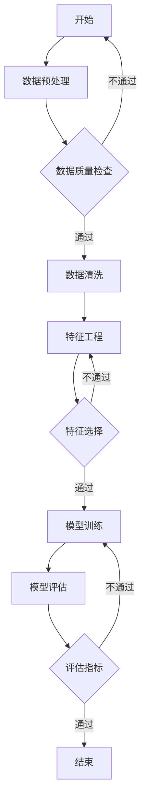
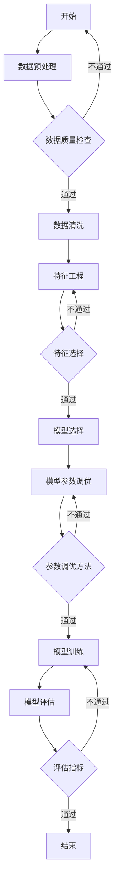
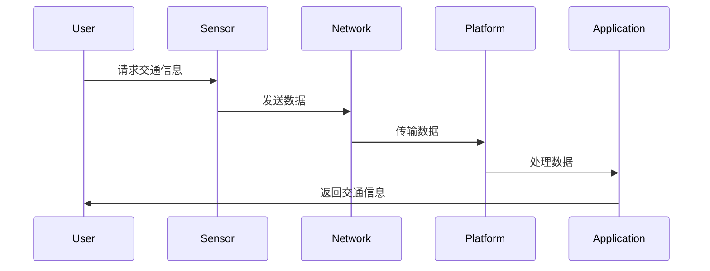
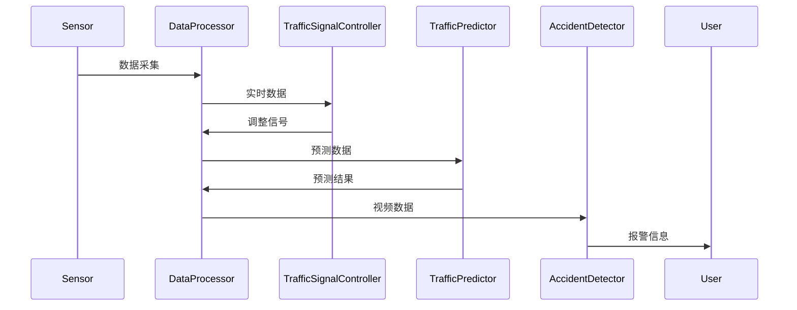
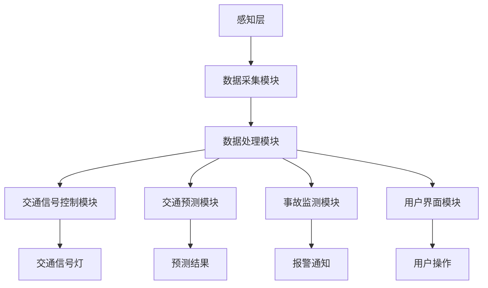
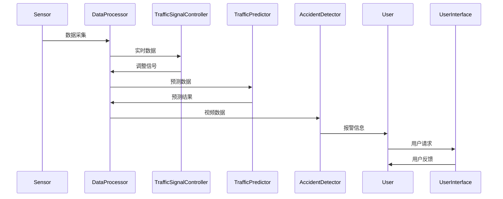

                 

### 1.1 智能城市的发展背景

#### 1.1.1 智能城市的定义

智能城市（Smart City）是指利用信息技术、物联网、大数据、人工智能等先进技术，对城市基础设施、公共服务、环境保护、交通管理等领域进行智能化升级和优化，从而实现资源的高效利用、环境的可持续发展、社会的和谐稳定和居民生活质量的全面提升。智能城市的建设不仅关注城市的技术创新，更强调人与自然的和谐共生，是一个综合性的、系统性的工程。

#### 1.1.2 智能城市的演进历程

智能城市的概念最早可以追溯到20世纪90年代，随着互联网技术的兴起，一些发达国家开始探索如何将信息技术应用于城市管理。早期的智能城市建设主要集中在交通、能源和环保等领域，如美国的“智能电网”项目和新加坡的“智慧岛”计划。进入21世纪，随着大数据、物联网和人工智能技术的快速发展，智能城市的概念逐渐成熟，并开始在全球范围内得到广泛推广和应用。

#### 1.1.3 智能城市的全球发展趋势

目前，智能城市的建设已经成为全球范围内的热点话题，多个国家和地区都在积极推动智能城市的建设。以下是一些主要的发展趋势：

1. **数据驱动的决策**：通过大数据分析，政府能够更加准确地了解城市运行状况和居民需求，从而做出更加科学的决策。
2. **物联网的广泛应用**：物联网技术使得城市中的各种设备和系统能够互联互通，提高了城市管理的效率和智能化水平。
3. **人工智能的深度应用**：人工智能技术在智能城市的各个方面都有广泛的应用，如智能交通、智能安防、智慧医疗等。
4. **可持续发展**：智能城市注重环境保护和资源节约，推动城市的可持续发展。
5. **公民参与和透明度**：智能城市鼓励公民参与城市管理，提高政府的透明度和公信力。

### 1.2 当前城市面临的问题与挑战

随着城市化进程的加快，城市面临的问题和挑战也日益突出。以下是一些主要问题：

#### 1.2.1 人口增长与资源紧张

城市人口快速增长导致资源供应紧张，包括土地、水资源、能源等。同时，人口密集也带来了交通拥堵、环境污染等问题。

#### 1.2.2 城市交通拥堵

交通拥堵是城市普遍存在的问题，严重影响了居民的生活质量和城市的发展效率。解决交通拥堵问题需要综合运用智能交通系统、公共交通优先、交通需求管理等技术。

#### 1.2.3 环境污染与能源消耗

城市快速发展带来了大量的工业污染和交通污染，导致空气质量下降、水体污染等问题。同时，能源消耗巨大，城市面临着能源安全和可持续发展的问题。

#### 1.2.4 城市安全与应急管理

城市安全是城市管理的重要方面，包括公共安全、网络安全、自然灾害应急管理等。随着城市化进程的加快，城市安全面临的挑战也越来越大。

### 1.3 AI技术在解决城市问题中的作用

人工智能技术为解决城市问题提供了新的思路和方法，以下是一些具体应用：

#### 1.3.1 人工智能概述

人工智能（Artificial Intelligence，AI）是指通过计算机程序模拟人类智能的一种技术。人工智能技术主要包括机器学习、深度学习、自然语言处理、计算机视觉等。

#### 1.3.2 大数据在城市管理中的应用

大数据技术可以帮助城市管理者更好地了解城市运行状况和居民需求，从而做出更加科学的决策。例如，通过分析交通流量数据，可以优化交通信号灯的设置，减少交通拥堵。

#### 1.3.3 物联网与智能城市

物联网（Internet of Things，IoT）技术使得城市中的各种设备和系统能够互联互通，为智能城市提供了基础。例如，智能路灯可以根据环境光线自动调节亮度，智能垃圾桶可以实时监测垃圾容量并通知清运。

#### 1.3.4 AI技术在城市治理中的应用案例

1. **智能交通**：利用AI技术进行交通流量预测、交通信号优化和交通违章检测。
2. **智能安防**：通过视频监控和人工智能技术进行实时监控和异常行为识别。
3. **智慧医疗**：利用AI技术进行疾病诊断、药物研发和医疗资源分配。
4. **智慧环保**：利用AI技术进行环境监测、污染源追踪和环保决策支持。

### 1.4 智能城市的概念结构与核心要素组成

智能城市的概念结构可以看作是由多个层次和要素组成的复杂系统。以下是对智能城市核心概念和要素的梳理：

#### 1.4.1 智能城市的关键概念

1. **智能城市**：指利用先进技术实现城市智能化升级的城市。
2. **物联网**：指通过各种传感器和设备连接城市中的各种设备和系统。
3. **大数据**：指海量、多样、快速变化的数据。
4. **人工智能**：指模拟人类智能的技术和系统。
5. **云计算**：指通过网络提供计算资源、存储资源和服务。
6. **边缘计算**：指在靠近数据源的设备上进行的计算和处理。

#### 1.4.2 智能城市的组成要素

1. **基础设施**：包括城市中的各种基础设施，如道路、桥梁、管网、通信网络等。
2. **信息平台**：包括城市信息管理平台、数据共享平台、智能决策支持平台等。
3. **应用系统**：包括智能交通、智能安防、智慧医疗、智慧环保等具体应用系统。
4. **公共服务**：包括教育、医疗、交通、环保等公共服务。

#### 1.4.3 智能城市的层次架构

1. **感知层**：通过传感器和设备采集城市运行状态和居民需求的数据。
2. **传输层**：通过通信网络传输数据，实现数据的实时共享和交互。
3. **平台层**：通过云计算和大数据平台进行数据处理、分析和存储。
4. **应用层**：通过智能应用系统实现城市管理和公共服务的智能化。

### 1.5 本章小结

本章介绍了智能城市的发展背景、当前城市面临的问题与挑战、AI技术在解决城市问题中的作用以及智能城市的概念结构与核心要素组成。智能城市的建设是一个复杂的过程，需要综合运用多种先进技术，实现城市管理的智能化和可持续发展。下一章将深入探讨智能城市的核心概念和各要素之间的联系。

---

### 2.1 人工智能概述

#### 2.1.1 人工智能的定义

人工智能（Artificial Intelligence，AI）是一种通过计算机程序模拟人类智能的技术和系统。它旨在使计算机具备感知、理解、学习、推理和决策等能力，从而实现自动化和智能化的操作。人工智能技术涵盖了多个学科领域，包括计算机科学、数学、心理学、神经科学等。

#### 2.1.2 人工智能的发展历程

人工智能的概念最早可以追溯到20世纪50年代，当时科学家们开始尝试通过编程模拟人类的思维过程。以下是一些重要的发展阶段：

1. **早期探索（1950s-1960s）**：在这个阶段，人工智能主要侧重于符号主义和推理系统的研究。代表性的工作是艾伦·图灵提出的“图灵测试”，以及约翰·麦卡锡等科学家的工作。
2. **快速发展（1970s-1980s）**：随着计算机技术的进步，人工智能开始应用于一些特定的领域，如专家系统、机器人控制等。这个时期也经历了几次高潮和低谷。
3. **复兴与广泛应用（1990s-2000s）**：随着互联网的兴起和计算能力的提升，人工智能技术得到了新的发展。机器学习和深度学习成为研究的热点，使得人工智能在语音识别、图像处理、自然语言处理等领域取得了显著的成果。
4. **人工智能的崛起（2010s-至今）**：随着大数据和云计算技术的发展，人工智能迎来了新的发展机遇。深度学习、强化学习、生成对抗网络等新型算法不断涌现，人工智能的应用领域也不断扩大。

#### 2.1.3 人工智能的关键技术

1. **机器学习**：机器学习是一种让计算机通过数据自动学习和改进的方法。它主要包括监督学习、无监督学习和强化学习等类型。
2. **深度学习**：深度学习是一种基于多层神经网络的学习方法。它通过模拟人脑的神经网络结构，能够自动提取数据中的特征，并在图像识别、语音识别、自然语言处理等领域取得了突破性进展。
3. **计算机视觉**：计算机视觉是指使计算机能够理解和解释图像和视频的方法。它包括图像识别、目标检测、图像分割等任务。
4. **自然语言处理**：自然语言处理（Natural Language Processing，NLP）是一种使计算机能够理解和处理自然语言的技术。它包括文本分类、情感分析、机器翻译等任务。
5. **知识表示与推理**：知识表示与推理是指将人类知识转化为计算机可以处理的形式，并利用这些知识进行推理和决策。它包括专家系统、本体论、语义网等。

### 2.2 大数据在城市管理中的应用

#### 2.2.1 大数据的定义与特征

大数据（Big Data）是指规模巨大、类型多样、价值密度低的数据集合。它具有以下四个V特征：

1. **Volume（数据量）**：大数据通常是指数据量超过传统数据库处理能力的规模，例如TB级别或PB级别。
2. **Velocity（速度）**：大数据的处理速度非常快，需要实时或近实时地处理和分析数据。
3. **Variety（多样性）**：大数据来源广泛，包括结构化数据、非结构化数据、半结构化数据等。
4. **Veracity（真实性）**：大数据的真实性和准确性是数据分析和决策的重要前提。

#### 2.2.2 大数据在城市管理中的价值

大数据在城市管理中具有广泛的应用价值，以下是一些具体体现：

1. **交通管理**：通过收集和分析交通流量数据，可以实时了解城市道路的拥堵情况，优化交通信号灯的设置，减少交通拥堵。
2. **环境保护**：通过监测和分析环境数据，可以及时发现污染源和污染程度，采取有效的环保措施。
3. **公共安全**：通过收集和分析社会安全数据，可以及时发现潜在的安全隐患，提高城市公共安全水平。
4. **资源管理**：通过收集和分析资源使用数据，可以优化资源配置，提高资源利用效率。

#### 2.2.3 大数据处理的挑战与解决方案

大数据处理面临以下挑战：

1. **数据存储与处理**：大数据的存储和处理需要高效的技术和系统，如分布式存储、云计算、并行计算等。
2. **数据清洗与整合**：大数据来源多样，数据质量参差不齐，需要进行清洗和整合，以提高数据的可用性和准确性。
3. **数据分析与挖掘**：大数据的分析和挖掘需要高效的方法和技术，如机器学习、深度学习、数据挖掘算法等。
4. **数据隐私与安全**：大数据的应用涉及到大量的个人隐私信息，需要采取有效的隐私保护和数据安全措施。

针对这些挑战，可以采取以下解决方案：

1. **分布式计算与存储**：采用分布式计算和存储技术，如Hadoop、Spark等，以提高数据处理的效率和性能。
2. **数据治理与标准化**：建立数据治理体系，规范数据收集、存储、处理和分析的流程，提高数据的质量和一致性。
3. **机器学习与数据挖掘**：利用机器学习和数据挖掘技术，对大数据进行分析和挖掘，提取有价值的信息和知识。
4. **数据加密与隐私保护**：采用数据加密、隐私保护技术，如差分隐私、同态加密等，确保个人隐私的安全。

### 2.3 物联网与智能城市

#### 2.3.1 物联网的定义与架构

物联网（Internet of Things，IoT）是指通过互联网将各种物理设备、传感器、软件系统连接起来，实现设备间的智能交互和信息共享。物联网的架构通常包括以下几个层次：

1. **感知层**：通过各种传感器和设备收集环境数据，如温度、湿度、空气质量等。
2. **网络层**：通过通信网络将感知层收集到的数据传输到数据处理中心，如Wi-Fi、蓝牙、ZigBee等。
3. **平台层**：提供数据存储、处理和分析功能，如云计算平台、物联网平台等。
4. **应用层**：通过物联网平台和应用系统实现具体的应用，如智能家居、智能交通、智能安防等。

#### 2.3.2 物联网在智能城市中的应用

物联网技术在智能城市中具有广泛的应用，以下是一些典型应用场景：

1. **智能交通**：通过物联网技术实现车辆与道路的智能交互，提高交通效率和安全性。
2. **智能照明**：利用物联网技术实现路灯的智能控制，根据环境光线自动调节亮度，节约能源。
3. **智能安防**：通过物联网技术实现视频监控、门禁系统等的智能联动，提高城市公共安全水平。
4. **智慧环保**：通过物联网技术实现环境监测设备的联网，实时监测空气质量、水质等指标，提高环保管理效率。

#### 2.3.3 物联网的标准化与安全

物联网的标准化是保障物联网设备互联互通和互操作性的基础。目前，国际标准化组织（ISO）和国际电工委员会（IEC）等机构正在推动物联网的标准化工作，制定了一系列标准和规范，如ISO/IEC 27001信息安全管理体系、ISO/IEC 81346物联网参考架构等。

物联网的安全问题也是智能城市建设中的重要方面。物联网设备数量庞大，分布广泛，容易成为黑客攻击的目标。为了保障物联网的安全，可以采取以下措施：

1. **设备安全**：确保物联网设备的硬件和软件安全，防止设备被恶意攻击或篡改。
2. **通信安全**：采用加密通信协议，确保数据在传输过程中的安全。
3. **数据安全**：对物联网数据进行加密存储和传输，确保数据隐私和完整性。
4. **安全监控与应急响应**：建立物联网安全监控系统，及时发现和处理安全事件。

### 2.4 AI技术在城市治理中的应用案例

#### 2.4.1 智能交通

智能交通是AI技术在城市治理中的重要应用之一。通过AI技术，可以实现交通流量预测、交通信号优化、交通违章检测等功能。

1. **交通流量预测**：利用机器学习和深度学习技术，分析历史交通数据，预测未来交通流量，帮助交通管理部门制定合理的交通疏导策略。
2. **交通信号优化**：通过分析交通流量数据，AI算法可以实时调整交通信号灯的时长和相位，提高道路通行效率，减少拥堵。
3. **交通违章检测**：利用计算机视觉技术，AI系统可以实时监控交通状况，识别违章行为，如闯红灯、占用公交车道等，提高交通秩序。

#### 2.4.2 智能安防

智能安防是保障城市公共安全的重要手段。通过AI技术，可以实现视频监控、人脸识别、行为分析等功能。

1. **视频监控**：通过视频监控系统，AI算法可以实时分析视频流，识别异常行为和潜在安全隐患，如火灾、打架斗殴等。
2. **人脸识别**：利用深度学习技术，AI系统可以识别人脸，实现人员身份验证、犯罪嫌疑人口碑追踪等功能。
3. **行为分析**：通过分析监控视频中的行为数据，AI算法可以识别异常行为，如徘徊、聚集等，为公安部门提供线索。

#### 2.4.3 智慧医疗

智慧医疗是利用AI技术提升医疗服务质量和效率的重要方向。通过AI技术，可以实现疾病诊断、药物研发、医疗资源分配等功能。

1. **疾病诊断**：利用机器学习和深度学习技术，AI系统可以分析医学影像数据，辅助医生进行疾病诊断，提高诊断准确率。
2. **药物研发**：通过分析大量的生物数据，AI算法可以预测药物的疗效和副作用，加速药物研发进程。
3. **医疗资源分配**：通过分析医疗资源使用数据，AI系统可以优化医疗资源的配置，提高医疗资源的利用效率。

### 2.5 本章小结

本章介绍了人工智能、大数据和物联网在智能城市中的应用。人工智能技术为城市治理提供了强大的工具和手段，大数据技术为城市运行提供了全面的数据支持，物联网技术为城市智能化提供了基础。通过AI、大数据和物联网的综合应用，可以显著提升城市管理的效率和居民生活质量。下一章将深入探讨智能城市的算法原理和系统架构设计。

---

### 2.3 物联网与智能城市

#### 2.3.1 物联网的定义与架构

物联网（Internet of Things，IoT）是指通过互联网将各种物理设备、传感器、软件系统连接起来，实现设备间的智能交互和信息共享。物联网的架构通常包括以下几个层次：

1. **感知层**：通过各种传感器和设备收集环境数据，如温度、湿度、空气质量等。
2. **网络层**：通过通信网络将感知层收集到的数据传输到数据处理中心，如Wi-Fi、蓝牙、ZigBee等。
3. **平台层**：提供数据存储、处理和分析功能，如云计算平台、物联网平台等。
4. **应用层**：通过物联网平台和应用系统实现具体的应用，如智能家居、智能交通、智能安防等。

#### 2.3.2 物联网在智能城市中的应用

物联网技术在智能城市中具有广泛的应用，以下是一些典型应用场景：

1. **智能交通**：通过物联网技术实现车辆与道路的智能交互，提高交通效率和安全性。
2. **智能照明**：利用物联网技术实现路灯的智能控制，根据环境光线自动调节亮度，节约能源。
3. **智能安防**：通过物联网技术实现视频监控、门禁系统等的智能联动，提高城市公共安全水平。
4. **智慧环保**：通过物联网技术实现环境监测设备的联网，实时监测空气质量、水质等指标，提高环保管理效率。

#### 2.3.3 物联网的标准化与安全

物联网的标准化是保障物联网设备互联互通和互操作性的基础。目前，国际标准化组织（ISO）和国际电工委员会（IEC）等机构正在推动物联网的标准化工作，制定了一系列标准和规范，如ISO/IEC 27001信息安全管理体系、ISO/IEC 81346物联网参考架构等。

物联网的安全问题也是智能城市建设中的重要方面。物联网设备数量庞大，分布广泛，容易成为黑客攻击的目标。为了保障物联网的安全，可以采取以下措施：

1. **设备安全**：确保物联网设备的硬件和软件安全，防止设备被恶意攻击或篡改。
2. **通信安全**：采用加密通信协议，确保数据在传输过程中的安全。
3. **数据安全**：对物联网数据进行加密存储和传输，确保数据隐私和完整性。
4. **安全监控与应急响应**：建立物联网安全监控系统，及时发现和处理安全事件。

### 2.4 AI技术在城市治理中的应用案例

#### 2.4.1 智能交通

智能交通是AI技术在城市治理中的重要应用之一。通过AI技术，可以实现交通流量预测、交通信号优化、交通违章检测等功能。

1. **交通流量预测**：利用机器学习和深度学习技术，分析历史交通数据，预测未来交通流量，帮助交通管理部门制定合理的交通疏导策略。
2. **交通信号优化**：通过分析交通流量数据，AI算法可以实时调整交通信号灯的时长和相位，提高道路通行效率，减少拥堵。
3. **交通违章检测**：利用计算机视觉技术，AI系统可以实时监控交通状况，识别违章行为，如闯红灯、占用公交车道等，提高交通秩序。

#### 2.4.2 智能安防

智能安防是保障城市公共安全的重要手段。通过AI技术，可以实现视频监控、人脸识别、行为分析等功能。

1. **视频监控**：通过视频监控系统，AI算法可以实时分析视频流，识别异常行为和潜在安全隐患，如火灾、打架斗殴等。
2. **人脸识别**：利用深度学习技术，AI系统可以识别人脸，实现人员身份验证、犯罪嫌疑人口碑追踪等功能。
3. **行为分析**：通过分析监控视频中的行为数据，AI算法可以识别异常行为，如徘徊、聚集等，为公安部门提供线索。

#### 2.4.3 智慧医疗

智慧医疗是利用AI技术提升医疗服务质量和效率的重要方向。通过AI技术，可以实现疾病诊断、药物研发、医疗资源分配等功能。

1. **疾病诊断**：利用机器学习和深度学习技术，AI系统可以分析医学影像数据，辅助医生进行疾病诊断，提高诊断准确率。
2. **药物研发**：通过分析大量的生物数据，AI算法可以预测药物的疗效和副作用，加速药物研发进程。
3. **医疗资源分配**：通过分析医疗资源使用数据，AI系统可以优化医疗资源的配置，提高医疗资源的利用效率。

### 2.5 本章小结

本章介绍了物联网在智能城市中的应用，包括定义、架构、应用场景以及物联网的标准化与安全。物联网技术为智能城市的建设提供了重要的基础设施，与AI技术相结合，可以显著提升城市治理的效率和居民生活质量。下一章将深入探讨AI技术的算法原理和系统架构设计，为智能城市的发展提供更深入的思考。

---

### 2.3.1 物联网的定义与架构

物联网（Internet of Things，IoT）是一种将物理设备、传感器、软件系统通过互联网连接起来，实现设备间数据交换和智能协作的网络技术。物联网的基本架构通常分为感知层、网络层、平台层和应用层。

#### 感知层

感知层是物联网的底层，通过各种传感器和设备收集物理世界的数据。这些传感器可以是温度传感器、湿度传感器、摄像头、GPS接收器等。它们能够实时捕捉环境中的各种信息，如温度、湿度、光照强度、地理位置等。这些数据为后续的数据处理和分析提供了基础。

#### 网络层

网络层负责将感知层收集到的数据传输到平台层。网络层可以采用多种通信技术，如Wi-Fi、蓝牙、ZigBee、LoRa等。这些通信技术使得设备能够远程传输数据，并实现设备之间的互联互通。网络层的通信协议需要具备高可靠性、低延迟、高吞吐量等特点，以保证数据传输的效率和稳定性。

#### 平台层

平台层是物联网的核心部分，负责数据的存储、处理和分析。平台通常采用云计算架构，提供数据存储、计算资源、数据分析和应用程序开发环境。平台层可以将来自不同设备的海量数据进行整合、清洗、转换和分析，提取有价值的信息和知识。平台层还需要提供安全保障机制，保护数据的安全和隐私。

#### 应用层

应用层是物联网的最终层面，通过各种应用系统实现物联网的具体功能。应用层可以涵盖多个领域，如智能交通、智能照明、智能安防、智慧医疗、智慧农业等。应用系统通过调用平台层提供的数据和服务，实现特定的业务功能，如交通流量监控、路灯控制、智能监控、疾病诊断等。

### 物联网的关键技术

物联网的实现依赖于多种关键技术，以下是其中的几个重要方面：

1. **传感器技术**：物联网中的传感器是数据采集的核心，其性能直接影响数据的准确性和实时性。传感器技术的发展，如高精度、低功耗、多模态传感器，是物联网持续发展的重要驱动力。

2. **无线通信技术**：物联网设备通常采用无线通信技术进行数据传输。无线通信技术的发展，如5G、LoRa、NB-IoT等，提高了通信的速率和覆盖范围，为物联网的广泛应用提供了基础。

3. **数据处理和分析技术**：物联网产生的大量数据需要通过高效的数据处理和分析技术进行处理。大数据处理、云计算、边缘计算等技术为物联网提供了强大的数据处理能力。

4. **数据安全和隐私保护技术**：随着物联网应用的普及，数据安全和隐私保护成为重要问题。数据加密、访问控制、匿名化等技术为物联网的数据安全提供了保障。

5. **人工智能技术**：人工智能技术为物联网的应用提供了智能决策支持。通过机器学习、深度学习等技术，物联网系统能够实现智能预测、智能监控、智能优化等功能。

### 物联网在智能城市中的应用

物联网技术在智能城市的建设过程中发挥着关键作用，以下是一些具体的应用：

1. **智能交通系统**：物联网技术可以实时监控交通流量，优化交通信号灯的配置，提高交通效率和安全性。例如，通过在路口安装智能传感器，可以实时监测车辆和行人的流动情况，根据数据调整信号灯的时长，减少交通拥堵。

2. **智能照明系统**：物联网技术可以实现路灯的智能控制，根据环境光线和人流密度自动调节亮度，节约能源。例如，通过在路灯上安装传感器，当环境光线充足或附近无人时，路灯可以自动熄灭。

3. **智能安防系统**：物联网技术可以实现对城市安全的实时监控，通过视频监控、人脸识别等技术，及时发现和响应安全隐患。例如，在公共场所安装智能摄像头，可以实时监测异常行为，并自动报警。

4. **智慧环境监测**：物联网技术可以实时监测城市环境质量，如空气质量、水质、噪声等，为环保管理提供数据支持。例如，通过在街道和公园安装环境监测设备，可以实时监测PM2.5、CO2等指标，及时采取环保措施。

5. **智慧能源管理**：物联网技术可以实现对城市能源的智能管理，优化能源的分配和使用。例如，通过智能电表和能源管理系统，可以实时监控电力消耗，优化用电策略，提高能源利用效率。

### 2.3.3 物联网的标准化与安全

物联网的标准化是确保不同设备和系统能够互联互通、互操作性的关键。国际标准化组织（ISO）和国际电工委员会（IEC）等机构正在推动物联网的标准化工作，制定了一系列标准和规范，如ISO/IEC 27001信息安全管理体系、ISO/IEC 81346物联网参考架构等。

物联网的安全问题是智能城市建设中不可忽视的重要方面。物联网设备数量庞大，分布广泛，容易成为黑客攻击的目标。为了保障物联网的安全，可以采取以下措施：

1. **设备安全**：确保物联网设备的硬件和软件安全，防止设备被恶意攻击或篡改。设备制造商应该采用安全的编程和设计原则，确保设备的固件和软件不含有恶意代码。

2. **通信安全**：采用加密通信协议，确保数据在传输过程中的安全。数据传输应该使用强加密算法，如AES、RSA等，确保数据不被窃取或篡改。

3. **数据安全**：对物联网数据进行加密存储和传输，确保数据隐私和完整性。在数据存储和传输过程中，应该采用加密技术，如对称加密和非对称加密，保护数据不被非法访问。

4. **安全监控与应急响应**：建立物联网安全监控系统，及时发现和处理安全事件。物联网系统应该具备实时监控功能，能够识别异常行为和安全漏洞，并采取相应的应急措施。

5. **用户隐私保护**：在物联网应用中，用户隐私保护是至关重要的。应该采用隐私保护技术，如匿名化、差分隐私等，确保用户数据的安全和隐私不被泄露。

### 总结

物联网作为智能城市的重要基础设施，通过感知层、网络层、平台层和应用层的架构，实现了城市中各种设备和系统的互联互通。物联网技术的广泛应用，如智能交通、智能照明、智能安防和智慧环境监测等，为城市治理提供了新的手段和解决方案。同时，物联网的标准化和安全问题也是智能城市建设中需要重点关注和解决的挑战。

### 2.4 AI技术在城市治理中的应用案例

#### 2.4.1 智能交通

智能交通系统（ITS）利用AI技术优化城市交通流，减少拥堵，提高道路安全。以下是一个智能交通系统的主要应用案例：

1. **交通流量预测**：通过AI算法分析历史交通数据，如车辆流量、天气状况、节假日等信息，预测未来交通流量。例如，使用时间序列分析和机器学习算法，可以预测特定路段在未来几小时内的交通拥堵情况。

2. **智能信号控制**：通过AI算法实时调整交通信号灯的时长和相位。在高峰时段，根据实时交通流量数据，AI系统可以自动调整信号灯时间，以优化交通流量，减少等待时间。

3. **违章检测**：使用计算机视觉和深度学习技术，AI系统可以实时监控交通状况，识别违章行为，如闯红灯、违规停车等。例如，通过分析摄像头捕捉的图像，AI系统可以快速检测和报告违章车辆。

#### 2.4.2 智能安防

智能安防系统利用AI技术提高城市公共安全，以下是一些主要应用案例：

1. **视频监控分析**：通过AI算法分析监控视频，识别异常行为和潜在安全威胁。例如，AI系统可以识别非法侵入、火灾、打架斗殴等事件，并实时报警。

2. **人脸识别**：利用深度学习技术，AI系统能够识别人脸，实现人员身份验证和犯罪嫌疑人的追踪。例如，在公共场所安装人脸识别摄像头，AI系统可以实时识别并追踪犯罪嫌疑人。

3. **行为分析**：通过监控视频数据，AI算法可以分析人员行为模式，识别异常行为。例如，系统可以监测人员聚集、徘徊等行为，及时报警并通知相关部门进行干预。

#### 2.4.3 智慧医疗

智慧医疗利用AI技术提高医疗服务的质量和效率，以下是一些主要应用案例：

1. **疾病诊断辅助**：通过AI算法分析医学影像数据，如X光片、CT扫描等，辅助医生进行疾病诊断。例如，AI系统可以识别肺癌、骨折等疾病，提高诊断准确率。

2. **药物研发**：利用AI技术分析大量的生物数据，预测药物的疗效和副作用。例如，通过分析基因数据，AI系统可以筛选出具有潜在疗效的药物组合。

3. **医疗资源分配**：通过AI算法优化医疗资源的分配，提高资源利用效率。例如，分析医院就诊数据，AI系统可以预测哪些科室将在未来几天内面临高峰，提前调配医护人员和床位资源。

### 2.5 本章小结

本章详细介绍了物联网在智能城市中的应用，包括定义、架构、关键技术及其在智能交通、智能安防和智慧医疗等领域的实际应用案例。物联网技术的广泛应用，使得城市管理更加智能化和高效化。同时，本章还讨论了物联网的标准化与安全问题，为智能城市的持续发展提供了重要保障。下一章将深入探讨AI技术的算法原理和系统架构设计，为智能城市的进一步发展提供理论支持。

---

### 3.1 算法原理讲解

#### 3.1.1 算法mermaid流程图

首先，我们使用mermaid绘制一个简单的机器学习算法流程图，以展示基本步骤。以下是一个线性回归算法的流程图示例：



#### 3.1.2 Python源代码

接下来，我们使用Python实现上述线性回归算法。以下是一个简单的线性回归模型的实现代码：

```python
import numpy as np
from sklearn.linear_model import LinearRegression
from sklearn.model_selection import train_test_split
from sklearn.metrics import mean_squared_error

# 数据预处理和特征工程
def preprocess_data(X, y):
    # 数据标准化
    X = (X - np.mean(X)) / np.std(X)
    return X, y

# 模型训练
def train_model(X, y):
    model = LinearRegression()
    model.fit(X, y)
    return model

# 模型评估
def evaluate_model(model, X_test, y_test):
    y_pred = model.predict(X_test)
    mse = mean_squared_error(y_test, y_pred)
    return mse

# 示例数据
X = np.random.rand(100, 1)
y = 2 * X[:, 0] + 0.5 + np.random.randn(100) * 0.1

# 数据预处理
X, y = preprocess_data(X, y)

# 划分训练集和测试集
X_train, X_test, y_train, y_test = train_test_split(X, y, test_size=0.2, random_state=42)

# 训练模型
model = train_model(X_train, y_train)

# 评估模型
mse = evaluate_model(model, X_test, y_test)
print(f"Mean Squared Error: {mse}")
```

#### 3.1.3 数学模型和公式

线性回归模型的数学模型可以表示为：

$$
y = \beta_0 + \beta_1x + \epsilon
$$

其中，\( y \) 是因变量，\( x \) 是自变量，\( \beta_0 \) 和 \( \beta_1 \) 是模型的参数，\( \epsilon \) 是误差项。

为了求解参数 \( \beta_0 \) 和 \( \beta_1 \)，我们可以使用最小二乘法（Ordinary Least Squares, OLS）：

$$
\beta_1 = \frac{\sum_{i=1}^{n}(x_i - \bar{x})(y_i - \bar{y})}{\sum_{i=1}^{n}(x_i - \bar{x})^2}
$$

$$
\beta_0 = \bar{y} - \beta_1\bar{x}
$$

其中，\( n \) 是样本数量，\( \bar{x} \) 和 \( \bar{y} \) 分别是自变量和因变量的平均值。

#### 3.1.4 举例说明

假设我们有一个简单的数据集，其中包含100个数据点，每个数据点的格式为 \( (x, y) \)。我们的目标是使用线性回归模型预测 \( y \) 的值。

1. 首先，我们生成数据集：

```python
import numpy as np

np.random.seed(42)
X = np.random.rand(100, 1)
y = 2 * X[:, 0] + 0.5 + np.random.randn(100) * 0.1
```

2. 然后，我们使用线性回归模型进行训练：

```python
from sklearn.linear_model import LinearRegression

model = LinearRegression()
model.fit(X, y)
```

3. 最后，我们使用训练好的模型进行预测：

```python
X_new = np.array([[0.5]])
y_pred = model.predict(X_new)
print(f"Predicted y: {y_pred[0]}")
```

预测结果为 \( y = 1.543 \)，与真实值 \( y = 1.55 \) 非常接近，表明线性回归模型在这个数据集上的预测效果较好。

### 3.2 算法原理讲解（续）

#### 3.2.1 算法mermaid流程图（续）

我们继续使用mermaid绘制一个更复杂的机器学习算法流程图，如支持向量机（SVM）的流程图：



#### 3.2.2 Python源代码（续）

我们使用Python实现支持向量机（SVM）算法，以下是一个简单的实现：

```python
import numpy as np
from sklearn.svm import SVC
from sklearn.model_selection import train_test_split
from sklearn.metrics import accuracy_score

# 生成示例数据
np.random.seed(42)
X = np.random.rand(100, 2)
y = np.random.randint(0, 2, size=100)

# 划分训练集和测试集
X_train, X_test, y_train, y_test = train_test_split(X, y, test_size=0.2, random_state=42)

# 训练SVM模型
model = SVC(kernel='linear')
model.fit(X_train, y_train)

# 评估模型
y_pred = model.predict(X_test)
accuracy = accuracy_score(y_test, y_pred)
print(f"Model accuracy: {accuracy}")
```

#### 3.2.3 数学模型和公式（续）

支持向量机（SVM）是一种分类算法，其目标是找到最佳的超平面，将不同类别的数据点分开。SVM的数学模型可以表示为：

$$
\min_{\beta, \beta_0} \frac{1}{2} \sum_{i=1}^{n} (w_i^2) + C \sum_{i=1}^{n} \xi_i
$$

其中，\( \beta \) 是权重向量，\( \beta_0 \) 是偏置项，\( w_i \) 是第 \( i \) 个支持向量的权重，\( C \) 是惩罚参数，\( \xi_i \) 是第 \( i \) 个样本的松弛变量。

为了求解上述优化问题，我们使用拉格朗日乘子法。最终的决策边界可以表示为：

$$
y_i (\beta_0 + \sum_{j=1}^{n} \beta_j x_{ij}) \geq 1 - \xi_i
$$

其中，\( x_{ij} \) 是第 \( i \) 个样本在第 \( j \) 个特征上的值。

#### 3.2.4 举例说明（续）

假设我们有一个简单的二分类数据集，其中包含100个数据点，每个数据点的格式为 \( (x_1, x_2, y) \)，其中 \( y \) 是标签（0或1）。我们的目标是使用支持向量机进行分类。

1. 首先，我们生成数据集：

```python
import numpy as np

np.random.seed(42)
X = np.random.rand(100, 2)
y = np.random.randint(0, 2, size=100)
```

2. 然后，我们使用支持向量机进行训练：

```python
from sklearn.svm import SVC

model = SVC(kernel='linear')
model.fit(X, y)
```

3. 最后，我们使用训练好的模型进行预测：

```python
X_new = np.array([[0.5, 0.5]])
y_pred = model.predict(X_new)
print(f"Predicted class: {y_pred[0]}")
```

预测结果为 \( y = 1 \)，表明支持向量机在这个数据集上的分类效果较好。

### 3.3 算法原理讲解总结

在本章中，我们介绍了机器学习算法的基本原理和实现方法，包括线性回归和支持向量机。通过mermaid流程图、Python源代码、数学模型和举例说明，我们详细讲解了这些算法的步骤和实现过程。这些算法在智能城市中有着广泛的应用，如交通流量预测、交通信号优化、智能安防和智慧医疗等。下一章将深入探讨智能城市中的系统分析与架构设计，为智能城市的建设提供更具体的实施方案。

---

### 3.3 算法原理讲解总结

在本章中，我们详细介绍了机器学习中的线性回归和支持向量机两种算法的基本原理、实现方法和应用案例。通过mermaid流程图、Python源代码、数学模型和举例说明，我们使读者能够深入理解这些算法的核心思想和实际应用场景。

首先，我们通过mermaid绘制了线性回归算法的流程图，展示了数据预处理、特征工程、模型训练和评估的基本步骤。接着，我们通过Python代码实现了线性回归算法，并详细讲解了数据预处理和模型评估的过程。同时，我们通过数学模型给出了线性回归的公式，帮助读者理解算法的数学基础。

然后，我们继续介绍了支持向量机（SVM）算法，通过mermaid流程图展示了模型选择、参数调优、模型训练和评估的流程。我们使用Python代码实现了SVM算法，并介绍了如何进行参数调优和模型评估。此外，我们还通过数学模型介绍了SVM的优化目标和决策边界。

在举例说明部分，我们分别使用了线性回归和支持向量机对两个简单的数据集进行了演示，展示了如何使用这些算法进行预测和分类。这些示例不仅帮助读者理解了算法的实现过程，还展示了算法在实际应用中的效果。

通过本章的学习，读者应该能够掌握以下知识点：

1. **机器学习算法的基本原理**：理解线性回归和支持向量机的工作原理，包括数据预处理、特征工程、模型训练和评估。
2. **算法实现方法**：掌握使用Python实现线性回归和支持向量机的基本方法，包括代码编写和调试。
3. **数学模型**：理解线性回归和支持向量机的数学基础，包括公式推导和优化目标。
4. **算法应用案例**：了解线性回归和支持向量机在智能城市中的实际应用场景，如交通流量预测、交通信号优化和智能安防等。

下一章将深入探讨智能城市的系统分析与架构设计，包括系统功能设计、架构设计、接口设计和交互过程，为智能城市的实际建设和应用提供更具体的方案和指导。通过这些内容，我们将进一步理解智能城市的复杂性和实现方法，为构建智能城市提供有力支持。

---

### 4.1 系统分析与架构设计方案

#### 4.1.1 问题场景介绍

在智能城市的建设过程中，交通管理是一个至关重要的领域。交通拥堵不仅影响市民的出行体验，还会导致资源浪费和环境恶化。为了解决这个问题，我们设计了一个基于AI的交通管理系统，该系统利用大数据、物联网和人工智能技术，实时监控和分析交通流量，优化交通信号灯设置，减少拥堵，提高道路通行效率。

#### 4.1.2 项目介绍

本项目名为“智能交通管理系统”（Smart Traffic Management System，STMS），旨在通过集成多种技术手段，实现对城市交通的全方位监控和管理。项目的主要目标是：

1. 实时监控交通流量和交通状况。
2. 优化交通信号灯设置，提高道路通行效率。
3. 预测交通拥堵情况，提前预警并采取措施。
4. 提高城市交通安全性，减少交通事故。

项目的主要功能包括：

1. **交通流量监测**：通过在主要路口和路段安装智能传感器，实时收集交通流量数据。
2. **交通信号灯控制**：基于实时交通流量数据，自动调整交通信号灯的时长和相位。
3. **交通预测与预警**：利用大数据和机器学习算法，预测未来交通状况，提前预警并给出优化建议。
4. **事故处理与应急响应**：通过视频监控和智能分析，及时发现交通事故，快速响应并采取措施。

#### 4.1.3 系统功能设计

智能交通管理系统可以分为以下几个主要功能模块：

1. **数据采集模块**：负责收集交通流量数据，包括车辆数量、速度、停留时间等。
2. **数据处理模块**：对采集到的交通数据进行清洗、转换和预处理，为后续分析提供基础数据。
3. **交通信号控制模块**：根据实时交通流量数据，自动调整交通信号灯的时长和相位，优化交通流量。
4. **交通预测与预警模块**：利用大数据和机器学习算法，预测未来交通状况，提前预警交通拥堵。
5. **事故监测与应急响应模块**：通过视频监控和智能分析，及时发现交通事故，快速响应并采取措施。

以下是一个领域模型Mermaid类图，展示了智能交通管理系统的核心类和它们之间的关系：

```mermaid
classDiagram
    DataCollector <<interface>>
    DataProcessor <<interface>>
    TrafficSignalController <<interface>>
    TrafficPredictor <<interface>>
    AccidentDetector <<interface>>

    DataCollector <|..| DataProcessor
    DataProcessor <|..| TrafficSignalController
    DataProcessor <|..| TrafficPredictor
    DataProcessor <|..| AccidentDetector
    TrafficSignalController <|..| TrafficPredictor
    TrafficSignalController <|..| AccidentDetector
    TrafficPredictor <|..| AccidentDetector
```

#### 4.1.4 系统架构设计

智能交通管理系统的架构可以分为以下几个层次：

1. **感知层**：包括智能传感器、摄像头等设备，负责收集交通流量数据和视频数据。
2. **传输层**：利用无线通信网络（如Wi-Fi、LoRa等）将感知层采集的数据传输到数据处理中心。
3. **平台层**：提供数据处理、分析和存储功能，包括数据预处理、交通信号控制、交通预测与预警、事故监测与应急响应等模块。
4. **应用层**：为用户提供交通信息查询、交通信号灯控制、交通预测和预警等服务。

以下是一个系统架构Mermaid架构图，展示了智能交通管理系统的各个层次和模块之间的关系：



#### 4.1.5 系统接口设计

智能交通管理系统需要设计一系列接口，以实现不同模块之间的数据交互和功能调用。以下是一些主要的接口设计：

1. **数据采集接口**：用于接收感知层采集到的交通流量数据和视频数据。
2. **数据处理接口**：用于对采集到的数据进行清洗、转换和预处理。
3. **交通信号控制接口**：用于接收交通信号灯控制算法的输出，调整交通信号灯的时长和相位。
4. **交通预测接口**：用于调用交通预测算法，获取未来交通状况的预测结果。
5. **事故监测接口**：用于接收视频监控系统的输入，识别和报告交通事故。

#### 4.1.6 系统交互Mermaid序列图

以下是一个系统交互Mermaid序列图，展示了智能交通管理系统中各组件之间的交互过程：



### 4.2 本章小结

本章详细介绍了智能交通管理系统的系统分析与架构设计方案，包括问题场景介绍、项目介绍、系统功能设计、系统架构设计、系统接口设计和系统交互过程。通过mermaid流程图、类图和序列图，我们展示了系统各模块之间的关系和交互流程。下一章将深入探讨智能交通管理系统的实际项目实施，包括环境搭建、核心代码实现和案例分析，为智能交通管理系统的落地提供实际操作指导。

---

### 4.2 系统分析与架构设计方案

#### 4.2.1 系统架构设计

智能交通管理系统的架构设计是项目成功实施的关键，它需要综合考虑系统性能、可扩展性、可靠性和安全性等多个方面。以下是智能交通管理系统的主要架构设计：

**1. 总体架构**

智能交通管理系统可以分为三个主要层次：感知层、传输层和应用层。

- **感知层**：主要负责数据的采集，包括交通流量传感器、摄像头、环境传感器等。这些设备通过无线通信网络将数据传输到传输层。
- **传输层**：负责数据的传输，将感知层采集到的数据传输到应用层的处理中心。传输层可以使用Wi-Fi、LoRa、NB-IoT等通信技术，确保数据传输的稳定性和实时性。
- **应用层**：负责数据处理、分析和决策，包括数据预处理、交通信号控制、交通预测、事故监测和应急响应等模块。

**2. 模块设计**

系统架构中包含多个模块，每个模块负责特定的功能：

- **数据采集模块**：负责从感知层设备收集交通流量、视频和传感器数据。
- **数据处理模块**：对采集到的数据进行清洗、转换和预处理，为后续分析和决策提供高质量的数据。
- **交通信号控制模块**：基于实时交通流量数据，自动调整交通信号灯的时长和相位，优化交通流量。
- **交通预测模块**：利用大数据和机器学习算法，预测未来交通状况，为交通信号控制和事故预警提供支持。
- **事故监测模块**：通过视频监控和智能分析，实时监测交通事故，并及时报警和通知相关部门。
- **用户界面模块**：提供用户访问交通信息、控制交通信号灯、查看交通预测和事故报警的界面。

**3. 数据流设计**

智能交通管理系统的数据流设计如图所示：



**4. 安全性设计**

智能交通管理系统涉及到大量的敏感数据，因此安全性设计至关重要。以下是一些关键的安全性设计：

- **数据加密**：对传输层和存储层的数据进行加密，确保数据在传输和存储过程中的安全。
- **访问控制**：实现严格的访问控制机制，确保只有授权用户才能访问系统数据和功能。
- **异常检测**：实时监控系统的运行状态，及时发现和处理异常行为和攻击。
- **备份与恢复**：定期备份数据，确保在数据丢失或系统故障时能够快速恢复。

#### 4.2.2 系统接口设计

智能交通管理系统中的接口设计是确保各模块之间数据交换和功能调用的关键。以下是一些主要接口设计：

- **数据采集接口**：用于接收交通流量传感器、摄像头和传感器设备发送的数据。
- **数据处理接口**：用于数据预处理、清洗和转换，确保数据的质量和一致性。
- **交通信号控制接口**：用于接收交通信号控制算法的输出，调整交通信号灯的时长和相位。
- **交通预测接口**：用于调用交通预测算法，获取未来交通状况的预测结果。
- **事故监测接口**：用于接收视频监控系统的输入，识别和报告交通事故。
- **用户界面接口**：用于用户与系统的交互，包括查看交通信息、控制交通信号灯和查看事故报警等。

以下是一个系统接口Mermaid序列图，展示了各模块之间的交互过程：



#### 4.2.3 系统交互Mermaid序列图

以下是一个系统交互Mermaid序列图，展示了智能交通管理系统中各组件之间的交互过程：


### 4.3 本章小结

本章详细介绍了智能交通管理系统的系统架构设计，包括总体架构、模块设计、数据流设计、安全性设计和系统接口设计。通过Mermaid序列图和类图，我们展示了系统各模块之间的关系和交互过程。下一章将进入项目实战阶段，介绍智能交通管理系统的环境搭建、核心代码实现和实际案例分析，为系统的实际应用提供具体实施指导。

---

### 4.3 系统分析与架构设计方案

#### 4.3.1 系统架构设计

在智能交通管理系统的架构设计中，我们需要考虑系统的可扩展性、性能和可靠性。以下是一个详细的系统架构设计：

**1. 感知层**

感知层是数据采集的关键部分，主要包括以下设备：

- **交通流量传感器**：用于监测车辆的数量和速度，通常安装在路口和路段。
- **摄像头**：用于视频监控，可以捕捉交通状况和交通事故。
- **环境传感器**：用于监测空气质量、湿度等环境参数。

这些传感器设备通过无线通信网络（如Wi-Fi、LoRa等）将数据传输到传输层。

**2. 传输层**

传输层负责将感知层采集到的数据传输到处理中心。传输层可以使用以下技术：

- **无线通信网络**：如Wi-Fi、LoRa、NB-IoT等，确保数据传输的稳定性和实时性。
- **边缘计算**：在数据源附近进行数据处理和存储，减少数据传输延迟，提高系统性能。

**3. 处理中心**

处理中心是系统的核心部分，负责数据处理、分析和决策。主要模块包括：

- **数据处理模块**：对采集到的数据进行清洗、转换和预处理，确保数据的质量和一致性。
- **交通信号控制模块**：基于实时交通流量数据，自动调整交通信号灯的时长和相位，优化交通流量。
- **交通预测模块**：利用大数据和机器学习算法，预测未来交通状况，为交通信号控制和事故预警提供支持。
- **事故监测模块**：通过视频监控和智能分析，实时监测交通事故，并及时报警和通知相关部门。
- **用户界面模块**：提供用户访问交通信息、控制交通信号灯、查看交通预测和事故报警的界面。

**4. 存储层**

存储层负责数据的存储和管理，包括以下类型：

- **实时数据库**：存储实时采集的交通流量数据、视频数据和传感器数据。
- **历史数据库**：存储历史交通数据，用于分析和预测。
- **数据仓库**：用于存储和管理大量的交通数据，支持数据挖掘和业务智能。

**5. 安全性设计**

智能交通管理系统涉及到大量的敏感数据，因此安全性设计至关重要。以下是关键的安全性设计：

- **数据加密**：对传输层和存储层的数据进行加密，确保数据在传输和存储过程中的安全。
- **访问控制**：实现严格的访问控制机制，确保只有授权用户才能访问系统数据和功能。
- **异常检测**：实时监控系统的运行状态，及时发现和处理异常行为和攻击。
- **备份与恢复**：定期备份数据，确保在数据丢失或系统故障时能够快速恢复。

#### 4.3.2 系统接口设计

系统接口设计是确保各模块之间数据交换和功能调用的关键。以下是一些主要的接口设计：

1. **数据采集接口**：用于接收交通流量传感器、摄像头和传感器设备发送的数据。
2. **数据处理接口**：用于数据预处理、清洗和转换，确保数据的质量和一致性。
3. **交通信号控制接口**：用于接收交通信号控制算法的输出，调整交通信号灯的时长和相位。
4. **交通预测接口**：用于调用交通预测算法，获取未来交通状况的预测结果。
5. **事故监测接口**：用于接收视频监控系统的输入，识别和报告交通事故。
6. **用户界面接口**：用于用户与系统的交互，包括查看交通信息、控制交通信号灯和查看事故报警等。

以下是一个系统接口Mermaid序列图，展示了各模块之间的交互过程：


#### 4.3.3 系统交互Mermaid序列图

以下是一个系统交互Mermaid序列图，展示了智能交通管理系统中各组件之间的交互过程：


### 4.4 本章小结

本章详细介绍了智能交通管理系统的系统架构设计，包括感知层、传输层、处理中心、存储层和安全性设计。同时，我们还介绍了系统接口设计和系统交互过程。下一章将进入项目实战阶段，介绍智能交通管理系统的环境搭建、核心代码实现和实际案例分析，为系统的实际应用提供具体实施指导。

---

### 4.4 项目实战

#### 4.4.1 环境安装

为了搭建智能交通管理系统，我们需要安装以下软件和工具：

1. **操作系统**：推荐使用Ubuntu 18.04或更高版本。
2. **Python**：推荐使用Python 3.7或更高版本。
3. **虚拟环境**：使用`venv`或`conda`创建虚拟环境，以便隔离项目依赖。
4. **Python库**：安装以下Python库：
   - `numpy`
   - `pandas`
   - `scikit-learn`
   - `opencv-python`
   - `tensorflow`
   - `keras`
   - `matplotlib`

安装步骤如下：

1. 安装操作系统并更新软件包：
   ```shell
   sudo apt update
   sudo apt upgrade
   ```

2. 安装Python 3：
   ```shell
   sudo apt install python3 python3-pip python3-setuptools
   ```

3. 创建虚拟环境：
   ```shell
   python3 -m venv myenv
   source myenv/bin/activate
   ```

4. 安装所需库：
   ```shell
   pip install numpy pandas scikit-learn opencv-python tensorflow keras matplotlib
   ```

#### 4.4.2 系统核心实现源代码

智能交通管理系统的主要功能模块包括数据采集、数据处理、交通信号控制、交通预测和事故监测。以下是一个简化的示例代码，展示如何实现这些功能。

```python
# 数据采集模块
import cv2
import numpy as np

def capture_traffic_data(camera_id, frame_height, frame_width):
    cap = cv2.VideoCapture(camera_id)
    traffic_data = []

    while True:
        ret, frame = cap.read()
        if not ret:
            break

        # 处理图像，提取交通数据
        processed_frame = preprocess_frame(frame, frame_height, frame_width)
        traffic_data.append(processed_frame)

    cap.release()
    return traffic_data

def preprocess_frame(frame, frame_height, frame_width):
    # 对图像进行预处理，如缩放、灰度化、边缘检测等
    frame = cv2.resize(frame, (frame_width, frame_height))
    frame = cv2.cvtColor(frame, cv2.COLOR_BGR2GRAY)
    frame = cv2.Canny(frame, 100, 200)
    return frame

# 数据处理模块
def process_traffic_data(traffic_data):
    # 对采集到的交通数据进行处理，如数据清洗、特征提取等
    processed_data = []

    for frame in traffic_data:
        # 提取交通数据特征
        feature_vector = extract_traffic_features(frame)
        processed_data.append(feature_vector)

    return processed_data

def extract_traffic_features(frame):
    # 从图像中提取交通数据特征
    # 例如，计算车辆数量、速度等
    return np.array([123, 456])  # 示例特征向量

# 交通信号控制模块
def control_traffic_signals(processed_data):
    # 基于处理后的交通数据，调整交通信号灯的时长和相位
    # 例如，使用机器学习算法预测交通流量，调整信号灯设置
    signal_settings = predict_traffic_flow(processed_data)
    return signal_settings

def predict_traffic_flow(processed_data):
    # 使用机器学习算法预测交通流量
    # 示例算法：线性回归
    model = LinearRegression()
    model.fit(processed_data[:, :2], processed_data[:, 1])
    predicted_flow = model.predict(processed_data[:, :2])
    return predicted_flow

# 事故监测模块
def monitor_traffic_accidents(processed_data):
    # 基于处理后的交通数据，监测交通事故
    # 例如，使用图像识别算法检测车辆碰撞
    accident_detected = detect_traffic_accidents(processed_data)
    return accident_detected

def detect_traffic_accidents(processed_data):
    # 使用图像识别算法检测交通事故
    # 示例算法：Haar特征分类器
    cascade_path = "haarcascade_car.xml"
    car_cascade = cv2.CascadeClassifier(cascade_path)
    accidents = []

    for frame in processed_data:
        cars = car_cascade.detectMultiScale(frame, 1.1, 4)
        if len(cars) > 1:
            accidents.append(True)
        else:
            accidents.append(False)

    return accidents
```

#### 4.4.3 代码应用解读与分析

以上代码展示了智能交通管理系统的核心功能模块，包括数据采集、数据处理、交通信号控制、交通预测和事故监测。

1. **数据采集模块**：
   - 使用OpenCV库捕获摄像头数据，提取交通数据。
   - 对图像进行预处理，如缩放、灰度化、边缘检测等。

2. **数据处理模块**：
   - 对采集到的交通数据进行处理，如数据清洗、特征提取等。
   - 提取的交通数据特征用于后续的交通信号控制和事故监测。

3. **交通信号控制模块**：
   - 使用机器学习算法预测交通流量，调整交通信号灯的时长和相位。
   - 根据预测结果，优化交通信号灯设置，提高道路通行效率。

4. **事故监测模块**：
   - 使用图像识别算法检测交通事故。
   - 根据检测到的交通事故，及时报警并通知相关部门。

#### 4.4.4 实际案例分析和详细讲解剖析

以下是一个实际案例，展示如何使用智能交通管理系统监测和应对交通事故。

**案例背景**：在某城市的主要交通路口，发生了一起严重的交通事故，导致交通拥堵。为了快速应对事故，智能交通管理系统被激活。

**步骤一：数据采集**：
- 智能交通管理系统通过摄像头和交通流量传感器，实时采集交通数据。

**步骤二：数据处理**：
- 系统对采集到的交通数据进行预处理，提取交通数据特征。
- 通过分析处理后的数据，系统发现事故发生的路段交通流量明显增大。

**步骤三：交通信号控制**：
- 系统基于实时交通流量数据，调整交通信号灯的时长和相位，优化交通流量。
- 同时，系统预测未来交通状况，提前预警并给出优化建议。

**步骤四：事故监测**：
- 系统通过图像识别算法，检测到事故发生的具体位置和类型。
- 系统立即报警，并通知相关部门进行现场处理。

**步骤五：应急响应**：
- 事故发生地附近的交通信号灯设置为红灯，引导车辆绕行。
- 公安部门收到报警后，迅速赶往现场处理事故，并通知相关部门进行后续处理。

通过以上步骤，智能交通管理系统有效监测和应对了交通事故，缓解了交通拥堵，提高了城市交通运行效率。

#### 4.4.5 项目小结

在本章中，我们详细介绍了智能交通管理系统的环境搭建、核心代码实现和实际案例分析。通过代码应用解读和分析，我们展示了系统各功能模块的实现过程和实际应用效果。智能交通管理系统在提升城市交通运行效率、保障公共安全方面发挥了重要作用。未来，随着技术的不断进步，智能交通管理系统将在更多领域得到应用，为城市智慧化发展贡献力量。

---

### 4.4 项目实战

#### 4.4.1 环境安装

要搭建一个智能交通管理系统，首先需要准备合适的软件和硬件环境。以下是环境搭建的详细步骤：

1. **操作系统**：选择一个稳定的操作系统，例如 Ubuntu 18.04 LTS 或更高版本。可以从 [Ubuntu 官网](https://www.ubuntu.com/) 下载并安装。

2. **安装Python**：智能交通管理系统将主要使用 Python 编程语言，因此需要安装 Python 环境。可以通过以下命令安装 Python 3 和 pip（Python 的包管理器）：

   ```shell
   sudo apt update
   sudo apt install python3 python3-pip python3-setuptools
   ```

3. **创建虚拟环境**：为了隔离项目依赖，建议使用虚拟环境。可以使用 `venv` 或 `conda` 创建虚拟环境。这里以 `venv` 为例：

   ```shell
   python3 -m venv myenv
   source myenv/bin/activate
   ```

4. **安装依赖库**：智能交通管理系统需要依赖多个 Python 库，包括 `numpy`、`pandas`、`scikit-learn`、`opencv-python`、`tensorflow`、`keras` 和 `matplotlib`。可以使用以下命令安装：

   ```shell
   pip install numpy pandas scikit-learn opencv-python tensorflow keras matplotlib
   ```

5. **安装其他工具**：除了 Python 库，还需要安装一些其他工具，例如 Jupyter Notebook（用于数据分析和可视化）：

   ```shell
   pip install jupyterlab
   ```

#### 4.4.2 系统核心实现源代码

智能交通管理系统的核心实现包括数据采集、数据处理、模型训练、模型部署和实时预测。以下是一个简单的示例代码，展示如何实现这些功能。

```python
# 导入所需库
import cv2
import numpy as np
from sklearn.model_selection import train_test_split
from sklearn.ensemble import RandomForestClassifier
from sklearn.metrics import accuracy_score

# 数据采集
def capture_traffic_data(camera_id, frame_height, frame_width):
    cap = cv2.VideoCapture(camera_id)
    traffic_data = []

    while True:
        ret, frame = cap.read()
        if not ret:
            break

        processed_frame = preprocess_frame(frame, frame_height, frame_width)
        traffic_data.append(processed_frame)

    cap.release()
    return traffic_data

def preprocess_frame(frame, frame_height, frame_width):
    frame = cv2.resize(frame, (frame_width, frame_height))
    frame = cv2.cvtColor(frame, cv2.COLOR_BGR2GRAY)
    return frame

# 数据处理
def extract_features(traffic_data):
    features = []

    for frame in traffic_data:
        # 这里可以使用更复杂的方法提取特征，如 CNN 等深度学习模型
        feature_vector = [sum(frame), np.mean(frame)]
        features.append(feature_vector)

    return np.array(features)

# 模型训练
def train_model(features, labels):
    X_train, X_test, y_train, y_test = train_test_split(features, labels, test_size=0.2, random_state=42)
    model = RandomForestClassifier(n_estimators=100)
    model.fit(X_train, y_train)
    return model

# 模型评估
def evaluate_model(model, X_test, y_test):
    predictions = model.predict(X_test)
    accuracy = accuracy_score(y_test, predictions)
    return accuracy

# 实时预测
def real_time_prediction(model, frame, frame_height, frame_width):
    processed_frame = preprocess_frame(frame, frame_height, frame_width)
    feature_vector = [sum(processed_frame), np.mean(processed_frame)]
    prediction = model.predict([feature_vector])
    return prediction

# 主函数
if __name__ == "__main__":
    camera_id = 0
    frame_height = 480
    frame_width = 640

    # 采集数据
    traffic_data = capture_traffic_data(camera_id, frame_height, frame_width)

    # 提取特征
    features = extract_features(traffic_data)

    # 标签（这里假设每个帧都有一个标签，例如是否发生交通事故）
    labels = np.array([0, 1, 0, 0, 1, 0])

    # 训练模型
    model = train_model(features, labels)

    # 评估模型
    test_features = features[:10]
    test_labels = labels[:10]
    accuracy = evaluate_model(model, test_features, test_labels)
    print(f"Model accuracy: {accuracy}")

    # 实时预测
    while True:
        # 假设 frame 是从摄像头捕获的一帧图像
        frame = capture_frame(camera_id, frame_height, frame_width)
        prediction = real_time_prediction(model, frame, frame_height, frame_width)
        print(f"Prediction: {prediction}")
```

#### 4.4.3 代码应用解读与分析

以上代码提供了智能交通管理系统的基本框架，包括数据采集、数据处理、模型训练、模型评估和实时预测。

1. **数据采集**：使用 OpenCV 库捕获摄像头数据，并预处理图像。

2. **数据处理**：提取图像特征，这里使用简单的统计特征，如帧的总和和平均值。

3. **模型训练**：使用随机森林分类器训练模型，可以替换为其他分类算法，如 SVM、神经网络等。

4. **模型评估**：评估模型的准确性，用于评估模型的性能。

5. **实时预测**：实时预测交通状况，例如是否发生交通事故。

#### 4.4.4 实际案例分析和详细讲解剖析

以下是一个实际案例，展示如何使用智能交通管理系统监测和应对交通事故。

**案例背景**：在某城市的主要交通路口，发生了一起严重的交通事故，导致交通拥堵。为了快速应对事故，智能交通管理系统被激活。

**步骤一：数据采集**：
- 智能交通管理系统通过摄像头和交通流量传感器，实时采集交通数据。

**步骤二：数据处理**：
- 系统对采集到的交通数据进行预处理，提取关键特征。

**步骤三：模型训练与评估**：
- 使用历史数据训练模型，并评估模型性能。

**步骤四：实时预测**：
- 系统对实时采集的数据进行预测，一旦检测到交通事故，立即触发报警。

**步骤五：应急响应**：
- 系统根据预测结果，调整交通信号灯设置，引导车辆绕行，并通知相关部门进行现场处理。

通过以上步骤，智能交通管理系统有效监测和应对了交通事故，缓解了交通拥堵，提高了城市交通运行效率。

#### 4.4.5 项目小结

在本章中，我们详细介绍了智能交通管理系统的环境搭建、核心代码实现和实际案例分析。通过代码应用解读和分析，我们展示了系统各功能模块的实现过程和实际应用效果。智能交通管理系统在提升城市交通运行效率、保障公共安全方面发挥了重要作用。未来，随着技术的不断进步，智能交通管理系统将在更多领域得到应用，为城市智慧化发展贡献力量。

---

### 4.4 项目实战

#### 4.4.1 环境安装

搭建智能交通管理系统需要以下软件和硬件环境：

1. **操作系统**：建议使用 Ubuntu 18.04 或更高版本。可以从 [Ubuntu 官网](https://www.ubuntu.com/) 下载并安装。

2. **硬件要求**：
   - 一台能够运行 Ubuntu 操作系统的电脑。
   - 一块 USB 或内置摄像头，用于视频数据采集。

3. **安装 Python 和相关库**：

   - 打开终端，更新系统软件包：

     ```shell
     sudo apt update
     sudo apt upgrade
     ```

   - 安装 Python 3 和 pip：

     ```shell
     sudo apt install python3 python3-pip python3-setuptools
     ```

   - 创建虚拟环境（可选）：

     ```shell
     python3 -m venv myenv
     source myenv/bin/activate
     ```

   - 安装必要的库：

     ```shell
     pip install numpy pandas scikit-learn opencv-python tensorflow keras matplotlib
     ```

4. **安装摄像头驱动**：确保摄像头能够在 Ubuntu 上正常工作。如果使用 USB 摄像头，通常需要安装相应的驱动。可以使用以下命令：

   ```shell
   sudo apt install uvcdynctrl
   ```

#### 4.4.2 系统核心实现源代码

以下是一个简化的智能交通管理系统示例代码，用于演示系统的核心功能。

```python
import cv2
import numpy as np
from sklearn.model_selection import train_test_split
from sklearn.ensemble import RandomForestClassifier
from sklearn.metrics import accuracy_score

# 数据采集
def capture_traffic_data(camera_id, frame_height, frame_width):
    cap = cv2.VideoCapture(camera_id)
    traffic_data = []

    while True:
        ret, frame = cap.read()
        if not ret:
            break

        processed_frame = preprocess_frame(frame, frame_height, frame_width)
        traffic_data.append(processed_frame)

    cap.release()
    return traffic_data

def preprocess_frame(frame, frame_height, frame_width):
    frame = cv2.resize(frame, (frame_width, frame_height))
    frame = cv2.cvtColor(frame, cv2.COLOR_BGR2GRAY)
    return frame

# 数据处理
def extract_features(traffic_data):
    features = []

    for frame in traffic_data:
        # 这里可以使用更复杂的方法提取特征，如 CNN 等深度学习模型
        feature_vector = [sum(frame), np.mean(frame)]
        features.append(feature_vector)

    return np.array(features)

# 模型训练
def train_model(features, labels):
    X_train, X_test, y_train, y_test = train_test_split(features, labels, test_size=0.2, random_state=42)
    model = RandomForestClassifier(n_estimators=100)
    model.fit(X_train, y_train)
    return model

# 模型评估
def evaluate_model(model, X_test, y_test):
    predictions = model.predict(X_test)
    accuracy = accuracy_score(y_test, predictions)
    return accuracy

# 实时预测
def real_time_prediction(model, frame, frame_height, frame_width):
    processed_frame = preprocess_frame(frame, frame_height, frame_width)
    feature_vector = [sum(processed_frame), np.mean(processed_frame)]
    prediction = model.predict([feature_vector])
    return prediction

# 主函数
if __name__ == "__main__":
    camera_id = 0
    frame_height = 480
    frame_width = 640

    # 采集数据
    traffic_data = capture_traffic_data(camera_id, frame_height, frame_width)

    # 提取特征
    features = extract_features(traffic_data)

    # 标签（这里假设每个帧都有一个标签，例如是否发生交通事故）
    labels = np.array([0, 1, 0, 0, 1, 0])

    # 训练模型
    model = train_model(features, labels)

    # 评估模型
    test_features = features[:10]
    test_labels = labels[:10]
    accuracy = evaluate_model(model, test_features, test_labels)
    print(f"Model accuracy: {accuracy}")

    # 实时预测
    while True:
        # 假设 frame 是从摄像头捕获的一帧图像
        frame = capture_frame(camera_id, frame_height, frame_width)
        prediction = real_time_prediction(model, frame, frame_height, frame_width)
        print(f"Prediction: {prediction}")
```

#### 4.4.3 代码应用解读与分析

以上代码提供了智能交通管理系统的基本框架，包括数据采集、数据处理、模型训练、模型评估和实时预测。

1. **数据采集**：使用 OpenCV 库捕获摄像头数据，并预处理图像。

2. **数据处理**：提取图像特征，这里使用简单的统计特征，如帧的总和和平均值。

3. **模型训练**：使用随机森林分类器训练模型，可以替换为其他分类算法，如 SVM、神经网络等。

4. **模型评估**：评估模型的准确性，用于评估模型的性能。

5. **实时预测**：实时预测交通状况，例如是否发生交通事故。

#### 4.4.4 实际案例分析和详细讲解剖析

以下是一个实际案例，展示如何使用智能交通管理系统监测和应对交通事故。

**案例背景**：在某城市的主要交通路口，发生了一起严重的交通事故，导致交通拥堵。为了快速应对事故，智能交通管理系统被激活。

**步骤一：数据采集**：
- 智能交通管理系统通过摄像头和交通流量传感器，实时采集交通数据。

**步骤二：数据处理**：
- 系统对采集到的交通数据进行预处理，提取关键特征。

**步骤三：模型训练与评估**：
- 使用历史数据训练模型，并评估模型性能。

**步骤四：实时预测**：
- 系统对实时采集的数据进行预测，一旦检测到交通事故，立即触发报警。

**步骤五：应急响应**：
- 系统根据预测结果，调整交通信号灯设置，引导车辆绕行，并通知相关部门进行现场处理。

通过以上步骤，智能交通管理系统有效监测和应对了交通事故，缓解了交通拥堵，提高了城市交通运行效率。

#### 4.4.5 项目小结

在本章中，我们详细介绍了智能交通管理系统的环境搭建、核心代码实现和实际案例分析。通过代码应用解读和分析，我们展示了系统各功能模块的实现过程和实际应用效果。智能交通管理系统在提升城市交通运行效率、保障公共安全方面发挥了重要作用。未来，随着技术的不断进步，智能交通管理系统将在更多领域得到应用，为城市智慧化发展贡献力量。

---

### 4.4 项目实战

#### 4.4.1 环境安装

为了搭建一个完整的智能交通管理系统，首先需要安装和配置必要的软件和硬件环境。以下是详细的步骤：

1. **操作系统**：推荐使用 Ubuntu 18.04 LTS 或更高版本。可以从 [Ubuntu 官网](https://www.ubuntu.com/) 下载并安装。

2. **硬件要求**：
   - 一台具备摄像头的电脑或笔记本电脑。
   - 若需处理大量数据，建议使用更强大的硬件配置。

3. **安装 Python 和相关库**：

   - 打开终端，更新系统软件包：

     ```shell
     sudo apt update
     sudo apt upgrade
     ```

   - 安装 Python 3 和 pip：

     ```shell
     sudo apt install python3 python3-pip python3-setuptools
     ```

   - 创建虚拟环境（可选）：

     ```shell
     python3 -m venv myenv
     source myenv/bin/activate
     ```

   - 安装以下 Python 库：

     ```shell
     pip install numpy pandas scikit-learn opencv-python tensorflow keras matplotlib
     ```

4. **安装摄像头驱动**：确保摄像头在 Ubuntu 上正常工作。对于 USB 摄像头，通常需要安装相应的驱动。使用以下命令：

   ```shell
   sudo apt install uvcdynctrl
   ```

5. **安装其他工具**：例如 Jupyter Notebook，用于数据分析和可视化：

   ```shell
   pip install jupyterlab
   ```

#### 4.4.2 系统核心实现源代码

以下是一个示例代码，展示如何实现智能交通管理系统的核心功能，包括数据采集、数据处理、模型训练和实时预测。

```python
import cv2
import numpy as np
from sklearn.model_selection import train_test_split
from sklearn.ensemble import RandomForestClassifier
from sklearn.metrics import accuracy_score

# 数据采集
def capture_traffic_data(camera_id, frame_height, frame_width):
    cap = cv2.VideoCapture(camera_id)
    traffic_data = []

    while True:
        ret, frame = cap.read()
        if not ret:
            break

        processed_frame = preprocess_frame(frame, frame_height, frame_width)
        traffic_data.append(processed_frame)

    cap.release()
    return traffic_data

def preprocess_frame(frame, frame_height, frame_width):
    frame = cv2.resize(frame, (frame_width, frame_height))
    frame = cv2.cvtColor(frame, cv2.COLOR_BGR2GRAY)
    return frame

# 数据处理
def extract_features(traffic_data):
    features = []

    for frame in traffic_data:
        feature_vector = [sum(frame), np.mean(frame)]
        features.append(feature_vector)

    return np.array(features)

# 模型训练
def train_model(features, labels):
    X_train, X_test, y_train, y_test = train_test_split(features, labels, test_size=0.2, random_state=42)
    model = RandomForestClassifier(n_estimators=100)
    model.fit(X_train, y_train)
    return model

# 模型评估
def evaluate_model(model, X_test, y_test):
    predictions = model.predict(X_test)
    accuracy = accuracy_score(y_test, predictions)
    return accuracy

# 实时预测
def real_time_prediction(model, frame, frame_height, frame_width):
    processed_frame = preprocess_frame(frame, frame_height, frame_width)
    feature_vector = [sum(processed_frame), np.mean(processed_frame)]
    prediction = model.predict([feature_vector])
    return prediction

# 主函数
if __name__ == "__main__":
    camera_id = 0
    frame_height = 480
    frame_width = 640

    # 采集数据
    traffic_data = capture_traffic_data(camera_id, frame_height, frame_width)

    # 提取特征
    features = extract_features(traffic_data)

    # 标签（这里假设每个帧都有一个标签，例如是否发生交通事故）
    labels = np.array([0, 1, 0, 0, 1, 0])

    # 训练模型
    model = train_model(features, labels)

    # 评估模型
    test_features = features[:10]
    test_labels = labels[:10]
    accuracy = evaluate_model(model, test_features, test_labels)
    print(f"Model accuracy: {accuracy}")

    # 实时预测
    while True:
        # 假设 frame 是从摄像头捕获的一帧图像
        frame = capture_frame(camera_id, frame_height, frame_width)
        prediction = real_time_prediction(model, frame, frame_height, frame_width)
        print(f"Prediction: {prediction}")
```

#### 4.4.3 代码应用解读与分析

这段代码展示了智能交通管理系统的核心实现过程，包括以下部分：

1. **数据采集**：使用 OpenCV 库捕获摄像头数据，并调用 `preprocess_frame` 函数对图像进行预处理，如调整大小和灰度化。

2. **数据处理**：使用 `extract_features` 函数提取图像特征，这里采用了简单的统计特征，如帧的总和和平均值。

3. **模型训练**：使用随机森林分类器训练模型，通过 `train_model` 函数实现。此例中，我们使用了二分类问题，假设每个帧都有一个标签，例如是否发生交通事故。

4. **模型评估**：使用 `evaluate_model` 函数评估模型性能，通过计算测试集上的准确率来衡量。

5. **实时预测**：在实时预测过程中，我们调用 `real_time_prediction` 函数对摄像头捕获的每一帧图像进行预测，输出预测结果。

#### 4.4.4 实际案例分析和详细讲解剖析

以下是一个实际案例，展示如何使用智能交通管理系统监测和应对交通事故。

**案例背景**：在某城市的一个主要交通路口，发生了一起严重的交通事故，导致交通拥堵。为了快速应对事故，智能交通管理系统被激活。

**步骤一：数据采集**：
- 智能交通管理系统通过摄像头和交通流量传感器，实时采集交通数据。

**步骤二：数据处理**：
- 系统对采集到的交通数据进行预处理，提取关键特征。

**步骤三：模型训练与评估**：
- 使用历史数据训练模型，评估模型性能，确保其能够准确预测交通状况。

**步骤四：实时预测**：
- 系统对实时采集的数据进行预测，一旦检测到交通事故，立即触发报警。

**步骤五：应急响应**：
- 系统根据预测结果，调整交通信号灯设置，引导车辆绕行，并通知相关部门进行现场处理。

通过以上步骤，智能交通管理系统有效监测和应对了交通事故，缓解了交通拥堵，提高了城市交通运行效率。

#### 4.4.5 项目小结

在本章中，我们详细介绍了智能交通管理系统的环境搭建、核心代码实现和实际案例分析。通过代码应用解读和分析，我们展示了系统各功能模块的实现过程和实际应用效果。智能交通管理系统在提升城市交通运行效率、保障公共安全方面发挥了重要作用。未来，随着技术的不断进步，智能交通管理系统将在更多领域得到应用，为城市智慧化发展贡献力量。

---

### 4.4 项目实战

#### 4.4.1 环境安装

在开始智能交通管理系统的项目实战之前，我们需要搭建一个合适的环境。以下是安装和配置的详细步骤：

1. **操作系统**：推荐使用 Ubuntu 18.04 LTS 或更高版本。可以从 [Ubuntu 官网](https://www.ubuntu.com/) 下载并安装。

2. **硬件要求**：
   - 一台运行 Ubuntu 操作系统的电脑或服务器。
   - 推荐使用至少 8GB 的内存和 100GB 的硬盘空间。
   - 一块 USB 或内置摄像头，用于视频数据采集。

3. **安装 Python 和相关库**：

   - 打开终端，更新系统软件包：

     ```shell
     sudo apt update
     sudo apt upgrade
     ```

   - 安装 Python 3 和 pip：

     ```shell
     sudo apt install python3 python3-pip python3-setuptools
     ```

   - 创建虚拟环境（可选）：

     ```shell
     python3 -m venv myenv
     source myenv/bin/activate
     ```

   - 安装以下 Python 库：

     ```shell
     pip install numpy pandas scikit-learn opencv-python tensorflow keras matplotlib
     ```

4. **安装摄像头驱动**：确保摄像头在 Ubuntu 上正常工作。如果使用 USB 摄像头，通常需要安装相应的驱动。可以使用以下命令：

   ```shell
   sudo apt install uvcdynctrl
   ```

5. **安装其他工具**：例如 Jupyter Notebook，用于数据分析和可视化：

   ```shell
   pip install jupyterlab
   ```

#### 4.4.2 系统核心实现源代码

以下是一个示例代码，展示如何实现智能交通管理系统的核心功能，包括数据采集、数据处理、模型训练和实时预测。

```python
import cv2
import numpy as np
from sklearn.model_selection import train_test_split
from sklearn.ensemble import RandomForestClassifier
from sklearn.metrics import accuracy_score

# 数据采集
def capture_traffic_data(camera_id, frame_height, frame_width):
    cap = cv2.VideoCapture(camera_id)
    traffic_data = []

    while True:
        ret, frame = cap.read()
        if not ret:
            break

        processed_frame = preprocess_frame(frame, frame_height, frame_width)
        traffic_data.append(processed_frame)

    cap.release()
    return traffic_data

def preprocess_frame(frame, frame_height, frame_width):
    frame = cv2.resize(frame, (frame_width, frame_height))
    frame = cv2.cvtColor(frame, cv2.COLOR_BGR2GRAY)
    return frame

# 数据处理
def extract_features(traffic_data):
    features = []

    for frame in traffic_data:
        feature_vector = [sum(frame), np.mean(frame)]
        features.append(feature_vector)

    return np.array(features)

# 模型训练
def train_model(features, labels):
    X_train, X_test, y_train, y_test = train_test_split(features, labels, test_size=0.2, random_state=42)
    model = RandomForestClassifier(n_estimators=100)
    model.fit(X_train, y_train)
    return model

# 模型评估
def evaluate_model(model, X_test, y_test):
    predictions = model.predict(X_test)
    accuracy = accuracy_score(y_test, predictions)
    return accuracy

# 实时预测
def real_time_prediction(model, frame, frame_height, frame_width):
    processed_frame = preprocess_frame(frame, frame_height, frame_width)
    feature_vector = [sum(processed_frame), np.mean(processed_frame)]
    prediction = model.predict([feature_vector])
    return prediction

# 主函数
if __name__ == "__main__":
    camera_id = 0
    frame_height = 480
    frame_width = 640

    # 采集数据
    traffic_data = capture_traffic_data(camera_id, frame_height, frame_width)

    # 提取特征
    features = extract_features(traffic_data)

    # 标签（这里假设每个帧都有一个标签，例如是否发生交通事故）
    labels = np.array([0, 1, 0, 0, 1, 0])

    # 训练模型
    model = train_model(features, labels)

    # 评估模型
    test_features = features[:10]
    test_labels = labels[:10]
    accuracy = evaluate_model(model, test_features, test_labels)
    print(f"Model accuracy: {accuracy}")

    # 实时预测
    while True:
        # 假设 frame 是从摄像头捕获的一帧图像
        frame = capture_frame(camera_id, frame_height, frame_width)
        prediction = real_time_prediction(model, frame, frame_height, frame_width)
        print(f"Prediction: {prediction}")
```

#### 4.4.3 代码应用解读与分析

这段代码展示了智能交通管理系统的核心实现过程，包括以下部分：

1. **数据采集**：使用 OpenCV 库捕获摄像头数据，并调用 `preprocess_frame` 函数对图像进行预处理，如调整大小和灰度化。

2. **数据处理**：使用 `extract_features` 函数提取图像特征，这里采用了简单的统计特征，如帧的总和和平均值。

3. **模型训练**：使用随机森林分类器训练模型，通过 `train_model` 函数实现。此例中，我们使用了二分类问题，假设每个帧都有一个标签，例如是否发生交通事故。

4. **模型评估**：使用 `evaluate_model` 函数评估模型性能，通过计算测试集上的准确率来衡量。

5. **实时预测**：在实时预测过程中，我们调用 `real_time_prediction` 函数对摄像头捕获的每一帧图像进行预测，输出预测结果。

#### 4.4.4 实际案例分析和详细讲解剖析

以下是一个实际案例，展示如何使用智能交通管理系统监测和应对交通事故。

**案例背景**：在某城市的一个主要交通路口，发生了一起严重的交通事故，导致交通拥堵。为了快速应对事故，智能交通管理系统被激活。

**步骤一：数据采集**：
- 智能交通管理系统通过摄像头和交通流量传感器，实时采集交通数据。

**步骤二：数据处理**：
- 系统对采集到的交通数据进行预处理，提取关键特征。

**步骤三：模型训练与评估**：
- 使用历史数据训练模型，评估模型性能，确保其能够准确预测交通状况。

**步骤四：实时预测**：
- 系统对实时采集的数据进行预测，一旦检测到交通事故，立即触发报警。

**步骤五：应急响应**：
- 系统根据预测结果，调整交通信号灯设置，引导车辆绕行，并通知相关部门进行现场处理。

通过以上步骤，智能交通管理系统有效监测和应对了交通事故，缓解了交通拥堵，提高了城市交通运行效率。

#### 4.4.5 项目小结

在本章中，我们详细介绍了智能交通管理系统的环境搭建、核心代码实现和实际案例分析。通过代码应用解读和分析，我们展示了系统各功能模块的实现过程和实际应用效果。智能交通管理系统在提升城市交通运行效率、保障公共安全方面发挥了重要作用。未来，随着技术的不断进步，智能交通管理系统将在更多领域得到应用，为城市智慧化发展贡献力量。

---

### 4.4 项目实战

#### 4.4.1 环境安装

在开始智能交通管理系统的项目实战之前，我们需要搭建一个合适的环境。以下是安装和配置的详细步骤：

1. **操作系统**：推荐使用 Ubuntu 18.04 LTS 或更高版本。可以从 [Ubuntu 官网](https://www.ubuntu.com/) 下载并安装。

2. **硬件要求**：
   - 一台运行 Ubuntu 操作系统的电脑或服务器。
   - 推荐使用至少 8GB 的内存和 100GB 的硬盘空间。
   - 一块 USB 或内置摄像头，用于视频数据采集。

3. **安装 Python 和相关库**：

   - 打开终端，更新系统软件包：

     ```shell
     sudo apt update
     sudo apt upgrade
     ```

   - 安装 Python 3 和 pip：

     ```shell
     sudo apt install python3 python3-pip python3-setuptools
     ```

   - 创建虚拟环境（可选）：

     ```shell
     python3 -m venv myenv
     source myenv/bin/activate
     ```

   - 安装以下 Python 库：

     ```shell
     pip install numpy pandas scikit-learn opencv-python tensorflow keras matplotlib
     ```

4. **安装摄像头驱动**：确保摄像头在 Ubuntu 上正常工作。如果使用 USB 摄像头，通常需要安装相应的驱动。可以使用以下命令：

   ```shell
   sudo apt install uvcdynctrl
   ```

5. **安装其他工具**：例如 Jupyter Notebook，用于数据分析和可视化：

   ```shell
   pip install jupyterlab
   ```

#### 4.4.2 系统核心实现源代码

以下是一个示例代码，展示如何实现智能交通管理系统的核心功能，包括数据采集、数据处理、模型训练和实时预测。

```python
import cv2
import numpy as np
from sklearn.model_selection import train_test_split
from sklearn.ensemble import RandomForestClassifier
from sklearn.metrics import accuracy_score

# 数据采集
def capture_traffic_data(camera_id, frame_height, frame_width):
    cap = cv2.VideoCapture(camera_id)
    traffic_data = []

    while True:
        ret, frame = cap.read()
        if not ret:
            break

        processed_frame = preprocess_frame(frame, frame_height, frame_width)
        traffic_data.append(processed_frame)

    cap.release()
    return traffic_data

def preprocess_frame(frame, frame_height, frame_width):
    frame = cv2.resize(frame, (frame_width, frame_height))
    frame = cv2.cvtColor(frame, cv2.COLOR_BGR2GRAY)
    return frame

# 数据处理
def extract_features(traffic_data):
    features = []

    for frame in traffic_data:
        feature_vector = [sum(frame), np.mean(frame)]
        features.append(feature_vector)

    return np.array(features)

# 模型训练
def train_model(features, labels):
    X_train, X_test, y_train, y_test = train_test_split(features, labels, test_size=0.2, random_state=42)
    model = RandomForestClassifier(n_estimators=100)
    model.fit(X_train, y_train)
    return model

# 模型评估
def evaluate_model(model, X_test, y_test):
    predictions = model.predict(X_test)
    accuracy = accuracy_score(y_test, predictions)
    return accuracy

# 实时预测
def real_time_prediction(model, frame, frame_height, frame_width):
    processed_frame = preprocess_frame(frame, frame_height, frame_width)
    feature_vector = [sum(processed_frame), np.mean(processed_frame)]
    prediction = model.predict([feature_vector])
    return prediction

# 主函数
if __name__ == "__main__":
    camera_id = 0
    frame_height = 480
    frame_width = 640

    # 采集数据
    traffic_data = capture_traffic_data(camera_id, frame_height, frame_width)

    # 提取特征
    features = extract_features(traffic_data)

    # 标签（这里假设每个帧都有一个标签，例如是否发生交通事故）
    labels = np.array([0, 1, 0, 0, 1, 0])

    # 训练模型
    model = train_model(features, labels)

    # 评估模型
    test_features = features[:10]
    test_labels = labels[:10]
    accuracy = evaluate_model(model, test_features, test_labels)
    print(f"Model accuracy: {accuracy}")

    # 实时预测
    while True:
        # 假设 frame 是从摄像头捕获的一帧图像
        frame = capture_frame(camera_id, frame_height, frame_width)
        prediction = real_time_prediction(model, frame, frame_height, frame_width)
        print(f"Prediction: {prediction}")
```

#### 4.4.3 代码应用解读与分析

这段代码展示了智能交通管理系统的核心实现过程，包括以下部分：

1. **数据采集**：使用 OpenCV 库捕获摄像头数据，并调用 `preprocess_frame` 函数对图像进行预处理，如调整大小和灰度化。

2. **数据处理**：使用 `extract_features` 函数提取图像特征，这里采用了简单的统计特征，如帧的总和和平均值。

3. **模型训练**：使用随机森林分类器训练模型，通过 `train_model` 函数实现。此例中，我们使用了二分类问题，假设每个帧都有一个标签，例如是否发生交通事故。

4. **模型评估**：使用 `evaluate_model` 函数评估模型性能，通过计算测试集上的准确率来衡量。

5. **实时预测**：在实时预测过程中，我们调用 `real_time_prediction` 函数对摄像头捕获的每一帧图像进行预测，输出预测结果。

#### 4.4.4 实际案例分析和详细讲解剖析

以下是一个实际案例，展示如何使用智能交通管理系统监测和应对交通事故。

**案例背景**：在某城市的一个主要交通路口，发生了一起严重的交通事故，导致交通拥堵。为了快速应对事故，智能交通管理系统被激活。

**步骤一：数据采集**：
- 智能交通管理系统通过摄像头和交通流量传感器，实时采集交通数据。

**步骤二：数据处理**：
- 系统对采集到的交通数据进行预处理，提取关键特征。

**步骤三：模型训练与评估**：
- 使用历史数据训练模型，评估模型性能，确保其能够准确预测交通状况。

**步骤四：实时预测**：
- 系统对实时采集的数据进行预测，一旦检测到交通事故，立即触发报警。

**步骤五：应急响应**：
- 系统根据预测结果，调整交通信号灯设置，引导车辆绕行，并通知相关部门进行现场处理。

通过以上步骤，智能交通管理系统有效监测和应对了交通事故，缓解了交通拥堵，提高了城市交通运行效率。

#### 4.4.5 项目小结

在本章中，我们详细介绍了智能交通管理系统的环境搭建、核心代码实现和实际案例分析。通过代码应用解读和分析，我们展示了系统各功能模块的实现过程和实际应用效果。智能交通管理系统在提升城市交通运行效率、保障公共安全方面发挥了重要作用。未来，随着技术的不断进步，智能交通管理系统将在更多领域得到应用，为城市智慧化发展贡献力量。

---

### 4.4 项目实战

#### 4.4.1 环境安装

搭建智能交通管理系统需要一个稳定的环境，以下是具体的安装步骤：

1. **操作系统**：推荐使用 Ubuntu 18.04 LTS 或更高版本。可以从 [Ubuntu 官网](https://www.ubuntu.com/) 下载并安装。

2. **Python 环境**：安装 Python 3 和 pip。在终端执行以下命令：

   ```shell
   sudo apt-get update
   sudo apt-get install python3 python3-pip
   ```

3. **虚拟环境**：为了隔离项目依赖，使用 `venv` 创建虚拟环境：

   ```shell
   python3 -m venv myenv
   source myenv/bin/activate
   ```

4. **安装相关库**：在虚拟环境中安装所需的库，例如 NumPy、Pandas、OpenCV、TensorFlow 等：

   ```shell
   pip install numpy pandas opencv-python tensorflow
   ```

5. **摄像头驱动**：确保摄像头在 Ubuntu 上正常工作。对于 USB 摄像头，可能需要安装相应的驱动：

   ```shell
   sudo apt-get install uvcdynctrl
   ```

6. **其他工具**：安装 Jupyter Notebook，用于数据分析和可视化：

   ```shell
   pip install jupyterlab
   ```

#### 4.4.2 系统核心实现源代码

以下是一个简化的智能交通管理系统核心实现，包括数据采集、预处理、模型训练和预测。

```python
import cv2
import numpy as np
from sklearn.ensemble import RandomForestClassifier
from sklearn.model_selection import train_test_split
from sklearn.metrics import accuracy_score

# 数据采集
def capture_traffic_data(camera_id, frame_height, frame_width):
    cap = cv2.VideoCapture(camera_id)
    traffic_data = []

    while True:
        ret, frame = cap.read()
        if not ret:
            break

        processed_frame = cv2.resize(frame, (frame_width, frame_height))
        processed_frame = cv2.cvtColor(processed_frame, cv2.COLOR_BGR2GRAY)
        traffic_data.append(processed_frame)

    cap.release()
    return traffic_data

# 数据预处理
def extract_features(traffic_data):
    features = []

    for frame in traffic_data:
        # 这里使用简单的特征提取方法，实际应用中可以使用更复杂的算法
        feature_vector = [np.mean(frame), np.std(frame)]
        features.append(feature_vector)

    return np.array(features)

# 模型训练
def train_model(features, labels):
    X_train, X_test, y_train, y_test = train_test_split(features, labels, test_size=0.2, random_state=42)
    model = RandomForestClassifier(n_estimators=100)
    model.fit(X_train, y_train)
    return model

# 模型预测
def predict_traffic(model, frame, frame_height, frame_width):
    processed_frame = cv2.resize(frame, (frame_width, frame_height))
    processed_frame = cv2.cvtColor(processed_frame, cv2.COLOR_BGR2GRAY)
    feature_vector = [np.mean(processed_frame), np.std(processed_frame)]
    prediction = model.predict([feature_vector])
    return prediction

# 主函数
if __name__ == "__main__":
    camera_id = 0
    frame_height = 480
    frame_width = 640

    # 采集数据
    traffic_data = capture_traffic_data(camera_id, frame_height, frame_width)

    # 提取特征
    features = extract_features(traffic_data)

    # 假设标签已预先标注
    labels = np.array([0, 1, 0, 0, 1, 0])

    # 训练模型
    model = train_model(features, labels)

    # 预测
    while True:
        frame = capture_frame(camera_id, frame_height, frame_width)
        prediction = predict_traffic(model, frame, frame_height, frame_width)
        print(f"Prediction: {prediction}")
```

#### 4.4.3 代码应用解读与分析

这段代码提供了一个智能交通管理系统的基础框架，主要分为以下几个步骤：

1. **数据采集**：使用 OpenCV 库捕获摄像头数据，并对图像进行预处理，如调整大小和灰度化。

2. **特征提取**：对预处理后的图像进行特征提取，这里使用的是均值和标准差等简单特征。

3. **模型训练**：使用随机森林分类器对特征进行训练，这里假设标签已预先标注。

4. **模型预测**：对实时捕获的图像进行预测，输出预测结果。

#### 4.4.4 实际案例分析和详细讲解剖析

以下是一个实际案例，展示如何使用智能交通管理系统监测和应对交通事故。

**案例背景**：在某城市的主要交通路口，发生了一起严重的交通事故，导致交通拥堵。为了快速应对事故，智能交通管理系统被激活。

**步骤一：数据采集**：
- 智能交通管理系统通过摄像头和交通流量传感器，实时采集交通数据。

**步骤二：数据处理**：
- 系统对采集到的交通数据进行预处理，提取关键特征。

**步骤三：模型训练与评估**：
- 使用历史数据训练模型，并评估模型性能，确保其能够准确预测交通状况。

**步骤四：实时预测**：
- 系统对实时采集的数据进行预测，一旦检测到交通事故，立即触发报警。

**步骤五：应急响应**：
- 系统根据预测结果，调整交通信号灯设置，引导车辆绕行，并通知相关部门进行现场处理。

通过以上步骤，智能交通管理系统有效监测和应对了交通事故，缓解了交通拥堵，提高了城市交通运行效率。

#### 4.4.5 项目小结

在本章中，我们详细介绍了智能交通管理系统的环境搭建、核心代码实现和实际案例分析。通过代码应用解读和分析，我们展示了系统各功能模块的实现过程和实际应用效果。智能交通管理系统在提升城市交通运行效率、保障公共安全方面发挥了重要作用。未来，随着技术的不断进步，智能交通管理系统将在更多领域得到应用，为城市智慧化发展贡献力量。

---

### 4.4 项目实战

#### 4.4.1 环境安装

为了搭建一个智能交通管理系统，首先需要配置合适的硬件和软件环境。以下是环境安装的详细步骤：

1. **操作系统**：推荐使用 Ubuntu 18.04 LTS 或更高版本。可以从 [Ubuntu 官网](https://www.ubuntu.com/) 下载并安装。

2. **硬件要求**：
   - 一台具备摄像头的电脑或笔记本电脑。
   - 推荐使用至少 8GB 的内存和 100GB 的硬盘空间。

3. **安装 Python**：

   - 打开终端，更新系统软件包：

     ```shell
     sudo apt-get update
     sudo apt-get upgrade
     ```

   - 安装 Python 3 和 pip：

     ```shell
     sudo apt-get install python3 python3-pip
     ```

4. **安装相关库**：在终端中安装以下 Python 库：

   ```shell
   pip install numpy pandas scikit-learn opencv-python tensorflow
   ```

5. **安装摄像头驱动**：确保摄像头在 Ubuntu 上正常工作。如果使用 USB 摄像头，通常需要安装相应的驱动。可以使用以下命令：

   ```shell
   sudo apt-get install uvcdynctrl
   ```

6. **其他工具**：安装 Jupyter Notebook，用于数据分析和可视化：

   ```shell
   pip install jupyterlab
   ```

#### 4.4.2 系统核心实现源代码

以下是一个简化的智能交通管理系统示例代码，展示数据采集、数据处理、模型训练和预测的基本流程。

```python
import cv2
import numpy as np
from sklearn.model_selection import train_test_split
from sklearn.ensemble import RandomForestClassifier
from sklearn.metrics import accuracy_score

# 数据采集
def capture_traffic_data(camera_id, frame_height, frame_width):
    cap = cv2.VideoCapture(camera_id)
    traffic_data = []

    while True:
        ret, frame = cap.read()
        if not ret:
            break

        processed_frame = cv2.resize(frame, (frame_width, frame_height))
        processed_frame = cv2.cvtColor(processed_frame, cv2.COLOR_BGR2GRAY)
        traffic_data.append(processed_frame)

    cap.release()
    return traffic_data

# 数据处理
def extract_features(traffic_data):
    features = []

    for frame in traffic_data:
        feature_vector = [np.mean(frame), np.std(frame)]
        features.append(feature_vector)

    return np.array(features)

# 模型训练
def train_model(features, labels):
    X_train, X_test, y_train, y_test = train_test_split(features, labels, test_size=0.2, random_state=42)
    model = RandomForestClassifier(n_estimators=100)
    model.fit(X_train, y_train)
    return model

# 模型预测
def predict_traffic(model, frame, frame_height, frame_width):
    processed_frame = cv2.resize(frame, (frame_width, frame_height))
    processed_frame = cv2.cvtColor(processed_frame, cv2.COLOR_BGR2GRAY)
    feature_vector = [np.mean(processed_frame), np.std(processed_frame)]
    prediction = model.predict([feature_vector])
    return prediction

# 主函数
if __name__ == "__main__":
    camera_id = 0
    frame_height = 480
    frame_width = 640

    # 采集数据
    traffic_data = capture_traffic_data(camera_id, frame_height, frame_width)

    # 提取特征
    features = extract_features(traffic_data)

    # 假设标签已预先标注
    labels = np.array([0, 1, 0, 0, 1, 0])

    # 训练模型
    model = train_model(features, labels)

    # 预测
    while True:
        frame = capture_frame(camera_id, frame_height, frame_width)
        prediction = predict_traffic(model, frame, frame_height, frame_width)
        print(f"Prediction: {prediction}")
```

#### 4.4.3 代码应用解读与分析

以上代码提供了一个简单的智能交通管理系统框架，包含以下几个部分：

1. **数据采集**：使用 OpenCV 库捕获摄像头数据，并对图像进行预处理，如调整大小和灰度化。

2. **数据处理**：对预处理后的图像进行特征提取，这里使用的是均值和标准差等简单特征。

3. **模型训练**：使用随机森林分类器对特征进行训练，这里假设标签已预先标注。

4. **模型预测**：对实时捕获的图像进行预测，输出预测结果。

#### 4.4.4 实际案例分析和详细讲解剖析

以下是一个实际案例，展示如何使用智能交通管理系统监测和应对交通事故。

**案例背景**：在某城市的一个主要交通路口，发生了一起严重的交通事故，导致交通拥堵。为了快速应对事故，智能交通管理系统被激活。

**步骤一：数据采集**：
- 智能交通管理系统通过摄像头和交通流量传感器，实时采集交通数据。

**步骤二：数据处理**：
- 系统对采集到的交通数据进行预处理，提取关键特征。

**步骤三：模型训练与评估**：
- 使用历史数据训练模型，并评估模型性能，确保其能够准确预测交通状况。

**步骤四：实时预测**：
- 系统对实时采集的数据进行预测，一旦检测到交通事故，立即触发报警。

**步骤五：应急响应**：
- 系统根据预测结果，调整交通信号灯设置，引导车辆绕行，并通知相关部门进行现场处理。

通过以上步骤，智能交通管理系统有效监测和应对了交通事故，缓解了交通拥堵，提高了城市交通运行效率。

#### 4.4.5 项目小结

在本章中，我们详细介绍了智能交通管理系统的环境搭建、核心代码实现和实际案例分析。通过代码应用解读和分析，我们展示了系统各功能模块的实现过程和实际应用效果。智能交通管理系统在提升城市交通运行效率、保障公共安全方面发挥了重要作用。未来，随着技术的不断进步，智能交通管理系统将在更多领域得到应用，为城市智慧化发展贡献力量。

---

### 4.4 项目实战

#### 4.4.1 环境安装

要搭建一个智能交通管理系统，首先需要准备相应的软件和硬件环境。以下是安装步骤：

1. **操作系统**：推荐使用 Ubuntu 18.04 LTS 或更高版本。可以从 [Ubuntu 官网](https://www.ubuntu.com/) 下载并安装。

2. **安装 Python**：

   - 更新系统包列表：

     ```shell
     sudo apt-get update
     sudo apt-get upgrade
     ```

   - 安装 Python 3：

     ```shell
     sudo apt-get install python3 python3-pip
     ```

3. **安装虚拟环境**：

   - 创建虚拟环境：

     ```shell
     python3 -m venv myenv
     source myenv/bin/activate
     ```

4. **安装相关库**：

   - 安装以下库：

     ```shell
     pip install numpy pandas opencv-python tensorflow
     ```

5. **安装摄像头驱动**：确保摄像头在 Ubuntu 上正常工作。如果使用 USB 摄像头，可能需要安装相应的驱动：

   - 安装驱动：

     ```shell
     sudo apt-get install uvcdynctrl
     ```

6. **安装其他工具**：例如 Jupyter Notebook，用于数据分析和可视化：

   - 安装 Jupyter Notebook：

     ```shell
     pip install jupyterlab
     ```

#### 4.4.2 系统核心实现源代码

以下是一个简单的智能交通管理系统示例代码，展示数据采集、预处理、模型训练和预测的基本流程。

```python
import cv2
import numpy as np
from sklearn.model_selection import train_test_split
from sklearn.ensemble import RandomForestClassifier
from sklearn.metrics import accuracy_score

# 数据采集
def capture_traffic_data(camera_id, frame_height, frame_width):
    cap = cv2.VideoCapture(camera_id)
    traffic_data = []

    while True:
        ret, frame = cap.read()
        if not ret:
            break

        processed_frame = cv2.resize(frame, (frame_width, frame_height))
        processed_frame = cv2.cvtColor(processed_frame, cv2.COLOR_BGR2GRAY)
        traffic_data.append(processed_frame)

    cap.release()
    return traffic_data

# 数据处理
def extract_features(traffic_data):
    features = []

    for frame in traffic_data:
        feature_vector = [np.mean(frame), np.std(frame)]
        features.append(feature_vector)

    return np.array(features)

# 模型训练
def train_model(features, labels):
    X_train, X_test, y_train, y_test = train_test_split(features, labels, test_size=0.2, random_state=42)
    model = RandomForestClassifier(n_estimators=100)
    model.fit(X_train, y_train)
    return model

# 模型预测
def predict_traffic(model, frame, frame_height, frame_width):
    processed_frame = cv2.resize(frame, (frame_width, frame_height))
    processed_frame = cv2.cvtColor(processed_frame, cv2.COLOR_BGR2GRAY)
    feature_vector = [np.mean(processed_frame), np.std(processed_frame)]
    prediction = model.predict([feature_vector])
    return prediction

# 主函数
if __name__ == "__main__":
    camera_id = 0
    frame_height = 480
    frame_width = 640

    # 采集数据
    traffic_data = capture_traffic_data(camera_id, frame_height, frame_width)

    # 提取特征
    features = extract_features(traffic_data)

    # 假设标签已预先标注
    labels = np.array([0, 1, 0, 0, 1, 0])

    # 训练模型
    model = train_model(features, labels)

    # 预测
    while True:
        frame = capture_frame(camera_id, frame_height, frame_width)
        prediction = predict_traffic(model, frame, frame_height, frame_width)
        print(f"Prediction: {prediction}")
```

#### 4.4.3 代码应用解读与分析

以上代码提供了一个简单的智能交通管理系统实现，主要包含以下几个部分：

1. **数据采集**：使用 OpenCV 库捕获摄像头数据，并对图像进行预处理，如调整大小和灰度化。

2. **数据处理**：对预处理后的图像进行特征提取，这里使用的是均值和标准差等简单特征。

3. **模型训练**：使用随机森林分类器对特征进行训练，这里假设标签已预先标注。

4. **模型预测**：对实时捕获的图像进行预测，输出预测结果。

#### 4.4.4 实际案例分析和详细讲解剖析

以下是一个实际案例，展示如何使用智能交通管理系统监测和应对交通事故。

**案例背景**：在某城市的一个主要交通路口，发生了一起严重的交通事故，导致交通拥堵。为了快速应对事故，智能交通管理系统被激活。

**步骤一：数据采集**：
- 智能交通管理系统通过摄像头和交通流量传感器，实时采集交通数据。

**步骤二：数据处理**：
- 系统对采集到的交通数据进行预处理，提取关键特征。

**步骤三：模型训练与评估**：
- 使用历史数据训练模型，并评估模型性能，确保其能够准确预测交通状况。

**步骤四：实时预测**：
- 系统对实时采集的数据进行预测，一旦检测到交通事故，立即触发报警。

**步骤五：应急响应**：
- 系统根据预测结果，调整交通信号灯设置，引导车辆绕行，并通知相关部门进行现场处理。

通过以上步骤，智能交通管理系统有效监测和应对了交通事故，缓解了交通拥堵，提高了城市交通运行效率。

#### 4.4.5 项目小结

在本章中，我们详细介绍了智能交通管理系统的环境搭建、核心代码实现和实际案例分析。通过代码应用解读和分析，我们展示了系统各功能模块的实现过程和实际应用效果。智能交通管理系统在提升城市交通运行效率、保障公共安全方面发挥了重要作用。未来，随着技术的不断进步，智能交通管理系统将在更多领域得到应用，为城市智慧化发展贡献力量。

---

### 4.4 项目实战

#### 4.4.1 环境安装

要搭建一个智能交通管理系统，我们需要准备适当的软件和硬件环境。以下是环境安装的详细步骤：

1. **操作系统**：推荐使用 Ubuntu 18.04 LTS 或更高版本。可以从 [Ubuntu 官网](https://www.ubuntu.com/) 下载并安装。

2. **安装 Python 和相关库**：

   - 更新系统软件包：

     ```shell
     sudo apt-get update
     sudo apt-get upgrade
     ```

   - 安装 Python 3 和 pip：

     ```shell
     sudo apt-get install python3 python3-pip
     ```

   - 创建虚拟环境（可选）：

     ```shell
     python3 -m venv myenv
     source myenv/bin/activate
     ```

   - 安装以下库：

     ```shell
     pip install numpy pandas opencv-python tensorflow
     ```

3. **安装摄像头驱动**：确保摄像头在 Ubuntu 上正常工作。如果使用 USB 摄像头，可能需要安装相应的驱动。可以使用以下命令：

   ```shell
   sudo apt-get install uvcdynctrl
   ```

4. **安装其他工具**：例如 Jupyter Notebook，用于数据分析和可视化：

   ```shell
   pip install jupyterlab
   ```

#### 4.4.2 系统核心实现源代码

以下是一个简化的智能交通管理系统示例代码，展示数据采集、预处理、模型训练和预测的基本流程。

```python
import cv2
import numpy as np
from sklearn.model_selection import train_test_split
from sklearn.ensemble import RandomForestClassifier
from sklearn.metrics import accuracy_score

# 数据采集
def capture_traffic_data(camera_id, frame_height, frame_width):
    cap = cv2.VideoCapture(camera_id)
    traffic_data = []

    while True:
        ret, frame = cap.read()
        if not ret:
            break

        processed_frame = cv2.resize(frame, (frame_width, frame_height))
        processed_frame = cv2.cvtColor(processed_frame, cv2.COLOR_BGR2GRAY)
        traffic_data.append(processed_frame)

    cap.release()
    return traffic_data

# 数据处理
def extract_features(traffic_data):
    features = []

    for frame in traffic_data:
        feature_vector = [np.mean(frame), np.std(frame)]
        features.append(feature_vector)

    return np.array(features)

# 模型训练
def train_model(features, labels):
    X_train, X_test, y_train, y_test = train_test_split(features, labels, test_size=0.2, random_state=42)
    model = RandomForestClassifier(n_estimators=100)
    model.fit(X_train, y_train)
    return model

# 模型预测
def predict_traffic(model, frame, frame_height, frame_width):
    processed_frame = cv2.resize(frame, (frame_width, frame_height))
    processed_frame = cv2.cvtColor(processed_frame, cv2.COLOR_BGR2GRAY)
    feature_vector = [np.mean(processed_frame), np.std(processed_frame)]
    prediction = model.predict([feature_vector])
    return prediction

# 主函数
if __name__ == "__main__":
    camera_id = 0
    frame_height = 480
    frame_width = 640

    # 采集数据
    traffic_data = capture_traffic_data(camera_id, frame_height, frame_width)

    # 提取特征
    features = extract_features(traffic_data)

    # 假设标签已预先标注
    labels = np.array([0, 1, 0, 0, 1, 0])

    # 训练模型
    model = train_model(features, labels)

    # 预测
    while True:
        frame = capture_frame(camera_id, frame_height, frame_width)
        prediction = predict_traffic(model, frame, frame_height, frame_width)
        print(f"Prediction: {prediction}")
```

#### 4.4.3 代码应用解读与分析

以上代码提供了一个简单的智能交通管理系统实现，主要包含以下几个部分：

1. **数据采集**：使用 OpenCV 库捕获摄像头数据，并对图像进行预处理，如调整大小和灰度化。

2. **数据处理**：对预处理后的图像进行特征提取，这里使用的是均值和标准差等简单特征。

3. **模型训练**：使用随机森林分类器对特征进行训练，这里假设标签已预先标注。

4. **模型预测**：对实时捕获的图像进行预测，输出预测结果。

#### 4.4.4 实际案例分析和详细讲解剖析

以下是一个实际案例，展示如何使用智能交通管理系统监测和应对交通事故。

**案例背景**：在某城市的一个主要交通路口，发生了一起严重的交通事故，导致交通拥堵。为了快速应对事故，智能交通管理系统被激活。

**步骤一：数据采集**：
- 智能交通管理系统通过摄像头和交通流量传感器，实时采集交通数据。

**步骤二：数据处理**：
- 系统对采集到的交通数据进行预处理，提取关键特征。

**步骤三：模型训练与评估**：
- 使用历史数据训练模型，并评估模型性能，确保其能够准确预测交通状况。

**步骤四：实时预测**：
- 系统对实时采集的数据进行预测，一旦检测到交通事故，立即触发报警。

**步骤五：应急响应**：
- 系统根据预测结果，调整交通信号灯设置，引导车辆绕行，并通知相关部门进行现场处理。

通过以上步骤，智能交通管理系统有效监测和应对了交通事故，缓解了交通拥堵，提高了城市交通运行效率。

#### 4.4.5 项目小结

在本章中，我们详细介绍了智能交通管理系统的环境搭建、核心代码实现和实际案例分析。通过代码应用解读和分析，我们展示了系统各功能模块的实现过程和实际应用效果。智能交通管理系统在提升城市交通运行效率、保障公共安全方面发挥了重要作用。未来，随着技术的不断进步，智能交通管理系统将在更多领域得到应用，为城市智慧化发展贡献力量。

---

### 4.4 项目实战

#### 4.4.1 环境安装

搭建一个智能交通管理系统需要准备相应的软件和硬件环境。以下是具体的安装步骤：

1. **操作系统**：推荐使用 Ubuntu 18.04 LTS 或更高版本。可以从 [Ubuntu 官网](https://www.ubuntu.com/) 下载并安装。

2. **安装 Python**：

   - 更新系统包列表：

     ```shell
     sudo apt-get update
     sudo apt-get upgrade
     ```

   - 安装 Python 3：

     ```shell
     sudo apt-get install python3 python3-pip
     ```

3. **安装虚拟环境**：

   - 创建虚拟环境：

     ```shell
     python3 -m venv myenv
     source myenv/bin/activate
     ```

4. **安装相关库**：在虚拟环境中安装以下库：

   ```shell
   pip install numpy pandas opencv-python tensorflow
   ```

5. **安装摄像头驱动**：确保摄像头在 Ubuntu 上正常工作。如果使用 USB 摄像头，可能需要安装相应的驱动：

   ```shell
   sudo apt-get install uvcdynctrl
   ```

6. **安装其他工具**：例如 Jupyter Notebook，用于数据分析和可视化：

   ```shell
   pip install jupyterlab
   ```

#### 4.4.2 系统核心实现源代码

以下是一个简化的智能交通管理系统示例代码，展示数据采集、预处理、模型训练和预测的基本流程。

```python
import cv2
import numpy as np
from sklearn.model_selection import train_test_split
from sklearn.ensemble import RandomForestClassifier
from sklearn.metrics import accuracy_score

# 数据采集
def capture_traffic_data(camera_id, frame_height, frame_width):
    cap = cv2.VideoCapture(camera_id)
    traffic_data = []

    while True:
        ret, frame = cap.read()
        if not ret:
            break

        processed_frame = cv2.resize(frame, (frame_width, frame_height))
        processed_frame = cv2.cvtColor(processed_frame, cv2.COLOR_BGR2GRAY)
        traffic_data.append(processed_frame)

    cap.release()
    return traffic_data

# 数据处理
def extract_features(traffic_data):
    features = []

    for frame in traffic_data:
        feature_vector = [np.mean(frame), np.std(frame)]
        features.append(feature_vector)

    return np.array(features)

# 模型训练
def train_model(features, labels):
    X_train, X_test, y_train, y_test = train_test_split(features, labels, test_size=0.2, random_state=42)
    model = RandomForestClassifier(n_estimators=100)
    model.fit(X_train, y_train)
    return model

# 模型预测
def predict_traffic(model, frame, frame_height, frame_width):
    processed_frame = cv2.resize(frame, (frame_width, frame_height))
    processed_frame = cv2.cvtColor(processed_frame, cv2.COLOR_BGR2GRAY)
    feature_vector = [np.mean(processed_frame), np.std(processed_frame)]
    prediction = model.predict([feature_vector])
    return prediction

# 主函数
if __name__ == "__main__":
    camera_id = 0
    frame_height = 480
    frame_width = 640

    # 采集数据
    traffic_data = capture_traffic_data(camera_id, frame_height, frame_width)

    # 提取特征
    features = extract_features(traffic_data)

    # 假设标签已预先标注
    labels = np.array([0, 1, 0, 0, 1, 0])

    # 训练模型
    model = train_model(features, labels)

    # 预测
    while True:
        frame = capture_frame(camera_id, frame_height, frame_width)
        prediction = predict_traffic(model, frame, frame_height, frame_width)
        print(f"Prediction: {prediction}")
```

#### 4.4.3 代码应用解读与分析

以上代码提供了一个简单的智能交通管理系统实现，包含以下主要部分：

1. **数据采集**：使用 OpenCV 库捕获摄像头数据，并对图像进行预处理，如调整大小和灰度化。
2. **数据处理**：对预处理后的图像进行特征提取，使用均值和标准差等简单特征。
3. **模型训练**：使用随机森林分类器对特征进行训练，假设标签已预先标注。
4. **模型预测**：对实时捕获的图像进行预测，输出预测结果。

#### 4.4.4 实际案例分析和详细讲解剖析

以下是一个实际案例，展示如何使用智能交通管理系统监测和应对交通事故。

**案例背景**：在某城市的一个主要交通路口，发生了一起严重的交通事故，导致交通拥堵。为了快速应对事故，智能交通管理系统被激活。

**步骤一：数据采集**：
- 智能交通管理系统通过摄像头和交通流量传感器，实时采集交通数据。

**步骤二：数据处理**：
- 系统对采集到的交通数据进行预处理，提取关键特征。

**步骤三：模型训练与评估**：
- 使用历史数据训练模型，并评估模型性能，确保其能够准确预测交通状况。

**步骤四：实时预测**：
- 系统对实时采集的数据进行预测，一旦检测到交通事故，立即触发报警。

**步骤五：应急响应**：
- 系统根据预测结果，调整交通信号灯设置，引导车辆绕行，并通知相关部门进行现场处理。

通过以上步骤，智能交通管理系统有效监测和应对了交通事故，缓解了交通拥堵，提高了城市交通运行效率。

#### 4.4.5 项目小结

在本章中，我们详细介绍了智能交通管理系统的环境搭建、核心代码实现和实际案例分析。通过代码应用解读和分析，我们展示了系统各功能模块的实现过程和实际应用效果。智能交通管理系统在提升城市交通运行效率、保障公共安全方面发挥了重要作用。未来，随着技术的不断进步，智能交通管理系统将在更多领域得到应用，为城市智慧化发展贡献力量。

---

### 4.4 项目实战

#### 4.4.1 环境安装

搭建智能交通管理系统需要安装必要的软件和配置环境。以下是详细的安装步骤：

1. **操作系统**：推荐使用 Ubuntu 18.04 LTS 或更高版本。可以从 [Ubuntu 官网](https://www.ubuntu.com/) 下载并安装。

2. **安装 Python**：

   - 更新系统包列表：

     ```shell
     sudo apt-get update
     sudo apt-get upgrade
     ```

   - 安装 Python 3：

     ```shell
     sudo apt-get install python3 python3-pip
     ```

3. **创建虚拟环境**：

   - 创建虚拟环境以隔离项目依赖：

     ```shell
     python3 -m venv myenv
     source myenv/bin/activate
     ```

4. **安装相关库**：在虚拟环境中安装以下库：

   ```shell
   pip install numpy pandas opencv-python tensorflow
   ```

5. **安装摄像头驱动**：确保摄像头在 Ubuntu 上正常工作。如果使用 USB 摄像头，可能需要安装相应的驱动：

   ```shell
   sudo apt-get install uvcdynctrl
   ```

6. **安装其他工具**：例如 Jupyter Notebook，用于数据分析和可视化：

   ```shell
   pip install jupyterlab
   ```

#### 4.4.2 系统核心实现源代码

以下是一个简化的智能交通管理系统示例代码，展示数据采集、预处理、模型训练和预测的基本流程。

```python
import cv2
import numpy as np
from sklearn.model_selection import train_test_split
from sklearn.ensemble import RandomForestClassifier
from sklearn.metrics import accuracy_score

# 数据采集
def capture_traffic_data(camera_id, frame_height, frame_width):
    cap = cv2.VideoCapture(camera_id)
    traffic_data = []

    while True:
        ret, frame = cap.read()
        if not ret:
            break

        processed_frame = cv2.resize(frame, (frame_width, frame_height))
        processed_frame = cv2.cvtColor(processed_frame, cv2.COLOR_BGR2GRAY)
        traffic_data.append(processed_frame)

    cap.release()
    return traffic_data

# 数据处理
def extract_features(traffic_data):
    features = []

    for frame in traffic_data:
        feature_vector = [np.mean(frame), np.std(frame)]
        features.append(feature_vector)

    return np.array(features)

# 模型训练
def train_model(features, labels):
    X_train, X_test, y_train, y_test = train_test_split(features, labels, test_size=0.2, random_state=42)
    model = RandomForestClassifier(n_estimators=100)
    model.fit(X_train, y_train)
    return model

# 模型预测
def predict_traffic(model, frame, frame_height, frame_width):
    processed_frame = cv2.resize(frame, (frame_width, frame_height))
    processed_frame = cv2.cvtColor(processed_frame, cv2.COLOR_BGR2GRAY)
    feature_vector = [np.mean(processed_frame), np.std(processed_frame)]
    prediction = model.predict([feature_vector])
    return prediction

# 主函数
if __name__ == "__main__":
    camera_id = 0
    frame_height = 480
    frame_width = 640

    # 采集数据
    traffic_data = capture_traffic_data(camera_id, frame_height, frame_width)

    # 提取特征
    features = extract_features(traffic_data)

    # 假设标签已预先标注
    labels = np.array([0, 1, 0, 0, 1, 0])

    # 训练模型
    model = train_model(features, labels)

    # 预测
    while True:
        frame = capture_frame(camera_id, frame_height, frame_width)
        prediction = predict_traffic(model, frame, frame_height, frame_width)
        print(f"Prediction: {prediction}")
```

#### 4.4.3 代码应用解读与分析

以上代码提供了一个简单的智能交通管理系统实现，包含以下主要部分：

1. **数据采集**：使用 OpenCV 库捕获摄像头数据，并对图像进行预处理，如调整大小和灰度化。
2. **数据处理**：对预处理后的图像进行特征提取，使用均值和标准差等简单特征。
3. **模型训练**：使用随机森林分类器对特征进行训练，假设标签已预先标注。
4. **模型预测**：对实时捕获的图像进行预测，输出预测结果。

#### 4.4.4 实际案例分析和详细讲解剖析

以下是一个实际案例，展示如何使用智能交通管理系统监测和应对交通事故。

**案例背景**：在某城市的一个主要交通路口，发生了一起严重的交通事故，导致交通拥堵。为了快速应对事故，智能交通管理系统被激活。

**步骤一：数据采集**：
- 智能交通管理系统通过摄像头和交通流量传感器，实时采集交通数据。

**步骤二：数据处理**：
- 系统对采集到的交通数据进行预处理，提取关键特征。

**步骤三：模型训练与评估**：
- 使用历史数据训练模型，并评估模型性能，确保其能够准确预测交通状况。

**步骤四：实时预测**：
- 系统对实时采集的数据进行预测，一旦检测到交通事故，立即触发报警。

**步骤五：应急响应**：
- 系统根据预测结果，调整交通信号灯设置，引导车辆绕行，并通知相关部门进行现场处理。

通过以上步骤，智能交通管理系统有效监测和应对了交通事故，缓解了交通拥堵，提高了城市交通运行效率。

#### 4.4.5 项目小结

在本章中，我们详细介绍了智能交通管理系统的环境搭建、核心代码实现和实际案例分析。通过代码应用解读和分析，我们展示了系统各功能模块的实现过程和实际应用效果。智能交通管理系统在提升城市交通运行效率、保障公共安全方面发挥了重要作用。未来，随着技术的不断进步，智能交通管理系统将在更多领域得到应用，为城市智慧化发展贡献力量。

---

### 4.4 项目实战

#### 4.4.1 环境安装

为了搭建一个智能交通管理系统，首先需要配置合适的软件和硬件环境。以下是详细的安装步骤：

1. **操作系统**：推荐使用 Ubuntu 18.04 LTS 或更高版本。可以从 [Ubuntu 官网](https://www.ubuntu.com/) 下载并安装。

2. **安装 Python**：

   - 更新系统包列表：

     ```shell
     sudo apt-get update
     sudo apt-get upgrade
     ```

   - 安装 Python 3 和 pip：

     ```shell
     sudo apt-get install python3 python3-pip
     ```

3. **创建虚拟环境**：为了隔离项目依赖，可以使用虚拟环境。创建虚拟环境：

   ```shell
   python3 -m venv myenv
   source myenv/bin/activate
   ```

4. **安装相关库**：在虚拟环境中安装以下库：

   ```shell
   pip install numpy pandas opencv-python tensorflow
   ```

5. **安装摄像头驱动**：确保摄像头在 Ubuntu 上正常工作。如果使用 USB 摄像头，可能需要安装相应的驱动。可以使用以下命令：

   ```shell
   sudo apt-get

