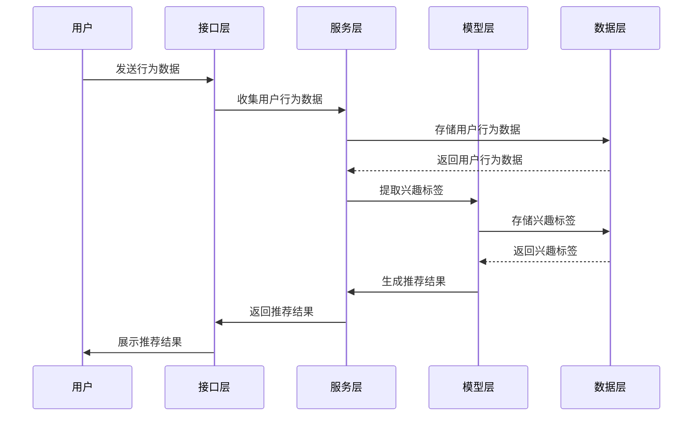
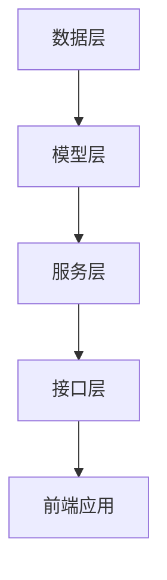

                 

### 第二部分：API优先设计原理与方法

#### 第2章：API优先设计的核心原理

**API优先设计的概念**

API优先设计是指在软件开发过程中，首先设计清晰、简洁、高效的API接口，然后围绕这些接口进行系统的其他方面设计。这种方法旨在通过优化API接口设计来提高整个软件系统的可维护性、可扩展性和安全性。

**API优先设计的起源**

API优先设计的概念起源于20世纪90年代互联网技术的发展。当时，随着Web服务的兴起，API设计逐渐成为软件开发中的重要环节。开发者开始意识到，良好的API设计对于系统的可维护性和可扩展性至关重要。随着云计算和微服务架构的兴起，API优先设计的理念得到了进一步发展和完善。

**API优先设计的发展**

从早期基于Web服务的API设计到现代基于微服务架构的API设计，API优先设计的理念不断演进。早期，API设计主要集中在如何高效地传递数据，实现简单的功能调用。随着技术的进步，API设计逐渐注重接口的简洁性、一致性和安全性。现代的API设计更加注重用户体验和业务需求，强调接口的易用性和灵活性。

**API优先设计的基本原则**

1. **简洁性**：API设计应保持简洁性，避免过度复杂。简洁的API接口能够降低学习成本，提高开发效率。

2. **一致性**：API设计应遵循一致性原则，确保接口的命名、参数、返回值等具有一致性。一致性有助于减少错误和提高系统的可维护性。

3. **可扩展性**：API设计应具备良好的可扩展性，便于后续的功能扩展和优化。可扩展的API接口能够适应不断变化的业务需求。

4. **安全性**：API设计应考虑安全性，防范各种潜在的安全威胁。安全性的API接口能够保护系统的数据安全和用户隐私。

**API优先设计的作用**

API优先设计在软件开发中具有重要作用。首先，它有助于降低系统的耦合度，提高代码的可维护性。其次，它便于系统的扩展和迭代，提高系统的可扩展性。此外，良好的API设计还能提高系统的安全性，防范各种安全威胁。

**API优先设计的实施步骤**

1. **需求分析**：在软件开发初期，进行需求分析，明确系统的功能需求和性能需求。

2. **接口设计**：根据需求分析结果，设计清晰、简洁、高效的API接口。接口设计应遵循简洁性、一致性、可扩展性和安全性的原则。

3. **接口实现**：围绕设计的API接口，实现系统的其他方面，包括数据层、模型层、服务层等。

4. **接口测试**：对设计的API接口进行测试，确保接口的功能、性能和安全性符合预期。

5. **接口优化**：根据测试结果，对API接口进行优化，提高系统的整体性能。

**API优先设计的挑战**

API优先设计虽然具有许多优势，但在实际应用中仍面临一些挑战。首先，API接口的设计和实现需要较高的技术门槛，对开发者的要求较高。其次，API接口的设计和实现需要充分考虑系统的整体架构和业务需求，协调不同模块之间的关系。此外，API接口的安全性和性能优化也是一个重要挑战。

**案例研究**

以一家电商平台的API优先设计为例，该平台为了提高系统的可维护性和可扩展性，采用了API优先设计方法。在需求分析阶段，团队明确了平台的功能需求和性能需求。在接口设计阶段，团队设计了一系列清晰、简洁、高效的API接口，如商品查询接口、订单管理接口等。在接口实现阶段，团队围绕这些接口实现了商品管理、订单管理等功能。在接口测试阶段，团队对API接口进行了全面测试，确保接口的功能、性能和安全性符合预期。在接口优化阶段，团队根据测试结果，对API接口进行了优化，提高了系统的整体性能。

**总结**

API优先设计是一种有效的软件开发理念，通过优化API接口设计来提高系统的可维护性、可扩展性和安全性。在实际应用中，开发者需要充分考虑系统的整体架构和业务需求，协调不同模块之间的关系，以确保API接口的设计和实现达到预期效果。API优先设计不仅有助于提高开发效率，还能为系统的长期维护和扩展奠定坚实基础。


### 第3章：API优先设计的方法与实践

**3.1 API优先设计的方法**

API优先设计的方法主要包括以下几个步骤：

1. **需求分析**：在软件开发初期，进行需求分析，明确系统的功能需求和性能需求。需求分析的目的是了解系统的业务场景和用户需求，为后续的API设计提供依据。

2. **接口设计**：根据需求分析结果，设计清晰、简洁、高效的API接口。接口设计应遵循简洁性、一致性、可扩展性和安全性的原则。在设计过程中，需要充分考虑系统的整体架构和业务需求，确保接口的设计符合实际应用场景。

3. **接口实现**：围绕设计的API接口，实现系统的其他方面，包括数据层、模型层、服务层等。在实现过程中，应确保接口的实现与设计保持一致，避免出现偏差。

4. **接口测试**：对设计的API接口进行测试，确保接口的功能、性能和安全性符合预期。测试过程应涵盖各种可能的场景，以全面验证接口的正确性和稳定性。

5. **接口优化**：根据测试结果，对API接口进行优化，提高系统的整体性能。优化过程应关注接口的响应速度、吞吐量和资源利用率等方面。

**3.2 API优先设计的实践**

API优先设计的实践涉及到多个方面，以下是一些常见的实践方法：

1. **API设计文档**：编写详细的API设计文档，包括接口的命名规范、参数定义、返回值说明等。文档的目的是为开发者提供清晰的接口使用指南，降低学习成本。

2. **接口版本控制**：在接口设计过程中，应考虑接口的版本控制，以便在后续的功能扩展和优化中保持接口的稳定性。版本控制可以采用语义化版本控制（SemVer）等规范。

3. **接口安全防护**：在API接口的设计和实现过程中，应充分考虑接口的安全性，防范各种潜在的安全威胁。常用的安全防护措施包括身份验证、权限控制、参数校验等。

4. **接口性能优化**：在接口设计和实现过程中，应关注接口的性能优化，提高系统的响应速度和吞吐量。性能优化的方法包括减少网络开销、优化数据库查询、缓存等技术。

5. **接口文档自动化生成**：利用自动化工具生成接口文档，降低文档编写成本。常见的自动化工具包括Swagger、OpenAPI等。

**3.3 实际案例**

以一家电商平台的API优先设计为例，该平台在设计和实现过程中，遵循了以下实践方法：

1. **需求分析**：团队明确了平台的功能需求和性能需求，包括商品查询、订单管理、用户注册等功能。

2. **接口设计**：团队设计了一系列清晰、简洁、高效的API接口，如商品查询接口、订单管理接口等。接口设计遵循了简洁性、一致性、可扩展性和安全性的原则。

3. **接口实现**：团队围绕这些接口实现了商品管理、订单管理等功能。在实现过程中，团队确保了接口的实现与设计保持一致，避免了出现偏差。

4. **接口测试**：团队对API接口进行了全面测试，涵盖了各种可能的场景，以确保接口的功能、性能和安全性符合预期。

5. **接口优化**：团队根据测试结果，对API接口进行了优化，提高了系统的整体性能。

**总结**

API优先设计是一种有效的软件开发理念，通过优化API接口设计来提高系统的可维护性、可扩展性和安全性。在实际应用中，开发者需要遵循一系列实践方法，如编写详细的API设计文档、接口版本控制、接口安全防护、接口性能优化等。通过这些实践，可以确保API接口的设计和实现达到预期效果，为系统的长期维护和扩展奠定坚实基础。


### 第4章：API优先设计在LLM应用架构中的重要性

**4.1 LLM应用架构概述**

LLM（Large Language Model）应用架构是指基于大型语言模型的软件系统架构。这类系统通常包含数据层、模型层、服务层和接口层等。数据层负责数据的采集、存储和管理；模型层负责语言模型的训练和推理；服务层负责业务逻辑的处理；接口层负责系统与外部的交互。

**4.2 API优先设计在LLM应用架构中的作用**

API优先设计在LLM应用架构中具有重要作用，主要体现在以下几个方面：

1. **降低耦合度**：API优先设计可以降低LLM应用架构中各个模块之间的耦合度，提高系统的可维护性和可扩展性。通过清晰的API接口，各个模块可以独立开发、测试和部署，减少了模块间的依赖。

2. **提高可维护性**：API优先设计使得系统的代码更加模块化，便于后续的维护和升级。开发者可以针对特定的API接口进行修改，而不会影响到其他模块，降低了维护成本。

3. **增强可扩展性**：API优先设计为系统的扩展提供了便利。开发者可以轻松地添加新的API接口，以支持新的功能或业务需求。这种灵活性有助于保持系统的长期发展。

4. **保障安全性**：API优先设计可以更好地保障系统的安全性。通过设计安全的API接口，系统可以有效地防范各种潜在的安全威胁，如SQL注入、XSS攻击等。

**4.3 API优先设计在LLM应用架构中的实现**

实现API优先设计在LLM应用架构中，需要遵循以下步骤：

1. **需求分析**：在LLM应用架构的开发初期，进行需求分析，明确系统的功能需求和性能需求。需求分析的目的是了解系统的业务场景和用户需求，为后续的API设计提供依据。

2. **接口设计**：根据需求分析结果，设计清晰、简洁、高效的API接口。接口设计应遵循简洁性、一致性、可扩展性和安全性的原则。在设计过程中，需要充分考虑系统的整体架构和业务需求，确保接口的设计符合实际应用场景。

3. **接口实现**：围绕设计的API接口，实现系统的其他方面，包括数据层、模型层、服务层等。在实现过程中，应确保接口的实现与设计保持一致，避免出现偏差。

4. **接口测试**：对设计的API接口进行测试，确保接口的功能、性能和安全性符合预期。测试过程应涵盖各种可能的场景，以全面验证接口的正确性和稳定性。

5. **接口优化**：根据测试结果，对API接口进行优化，提高系统的整体性能。优化过程应关注接口的响应速度、吞吐量和资源利用率等方面。

**4.4 实际案例**

以一个基于LLM的智能客服系统为例，该系统采用了API优先设计方法。在需求分析阶段，团队明确了系统需要支持的功能，如常见问题自动回复、智能对话生成等。在接口设计阶段，团队设计了一系列API接口，如问题查询接口、对话生成接口等。在接口实现阶段，团队围绕这些接口实现了智能客服系统的核心功能。在接口测试阶段，团队对API接口进行了全面测试，确保接口的功能、性能和安全性符合预期。在接口优化阶段，团队根据测试结果，对API接口进行了优化，提高了系统的整体性能。

**总结**

API优先设计在LLM应用架构中具有重要作用，通过降低耦合度、提高可维护性、增强可扩展性和保障安全性，为系统的长期发展提供了坚实基础。在实际应用中，开发者需要遵循一系列实践方法，确保API接口的设计和实现达到预期效果。通过API优先设计，可以构建高效、可扩展的LLM应用架构，为用户提供优质的服务。


### 第5章：API优先设计在LLM应用架构中的实际应用

**5.1 应用场景**

API优先设计在LLM应用架构中具有广泛的应用场景，以下是一些典型的应用实例：

1. **智能客服系统**：基于API优先设计，开发者可以构建一个高效、可扩展的智能客服系统。系统通过API接口与前端应用、后端服务进行交互，实现智能对话生成、问题自动回复等功能。

2. **智能推荐系统**：API优先设计有助于构建一个智能推荐系统，该系统可以根据用户行为数据、兴趣标签等信息，通过API接口实时生成个性化推荐结果，为用户提供更好的用户体验。

3. **自然语言处理（NLP）应用**：API优先设计在NLP应用中也非常重要。开发者可以通过设计清晰的API接口，实现文本分类、情感分析、命名实体识别等功能，方便其他系统或应用调用。

**5.2 项目介绍**

以下是一个基于API优先设计的LLM应用架构案例：智能推荐系统。

**需求**：构建一个智能推荐系统，根据用户行为数据和兴趣标签，实时生成个性化推荐结果。

**功能设计**：

1. 用户行为数据收集：通过API接口收集用户的行为数据，如浏览历史、搜索记录等。

2. 兴趣标签提取：根据用户行为数据，提取用户的兴趣标签。

3. 推荐算法实现：基于用户兴趣标签和推荐算法，生成个性化推荐结果。

4. 推荐结果展示：通过API接口将推荐结果展示给用户。

**系统架构设计**：

1. **数据层**：负责用户行为数据的存储和管理，使用数据库（如MySQL、MongoDB）实现。

2. **模型层**：负责推荐算法的实现，使用TensorFlow或PyTorch等深度学习框架训练和部署模型。

3. **服务层**：负责业务逻辑的处理，包括用户行为数据收集、兴趣标签提取、推荐算法实现等。

4. **接口层**：负责系统与外部的交互，提供API接口供前端应用调用。

**系统接口设计**：

1. **用户行为数据收集接口**：用于收集用户的行为数据，如浏览历史、搜索记录等。

2. **兴趣标签提取接口**：用于提取用户的兴趣标签。

3. **推荐结果生成接口**：用于生成个性化推荐结果，并提供给用户。

4. **推荐结果展示接口**：用于将推荐结果展示给用户。

**系统交互设计**：

通过Mermaid序列图展示系统各部分之间的交互关系：



**5.3 代码实现**

以下是一个简单的Python代码示例，展示了用户行为数据收集接口的实现：

```python
from flask import Flask, request, jsonify

app = Flask(__name__)

@app.route('/api/collect_user_data', methods=['POST'])
def collect_user_data():
    data = request.get_json()
    # 处理用户行为数据
    # 例如，将数据存储到数据库中
    print("收集到的用户行为数据：", data)
    return jsonify({"status": "success", "message": "用户行为数据已收集"}), 200

if __name__ == '__main__':
    app.run(debug=True)
```

**5.4 代码解读与分析**

在上面的代码中，使用Flask框架实现了一个用户行为数据收集接口。接口接收一个JSON格式的用户行为数据，并打印到控制台。在实际应用中，可以将这些数据存储到数据库中，以便后续分析和处理。

```python
from flask import Flask, request, jsonify

app = Flask(__name__)

@app.route('/api/collect_user_data', methods=['POST'])
def collect_user_data():
    data = request.get_json()
    # 处理用户行为数据
    # 例如，将数据存储到数据库中
    print("收集到的用户行为数据：", data)
    return jsonify({"status": "success", "message": "用户行为数据已收集"}), 200

if __name__ == '__main__':
    app.run(debug=True)
```

**5.5 实际案例分析**

以一个电商平台的智能推荐系统为例，该系统采用了API优先设计方法。在需求分析阶段，团队明确了系统的功能需求，包括用户行为数据收集、兴趣标签提取、推荐算法实现和推荐结果展示。在接口设计阶段，团队设计了一系列API接口，如用户行为数据收集接口、兴趣标签提取接口和推荐结果生成接口。在接口实现阶段，团队围绕这些接口实现了智能推荐系统的核心功能。在接口测试阶段，团队对API接口进行了全面测试，确保接口的功能、性能和安全性符合预期。在接口优化阶段，团队根据测试结果，对API接口进行了优化，提高了系统的整体性能。

**总结**

API优先设计在LLM应用架构中的实际应用涉及多个方面，包括智能客服系统、智能推荐系统和自然语言处理应用等。通过API优先设计，开发者可以构建高效、可扩展的LLM应用架构，为用户提供优质的服务。在实际应用中，开发者需要遵循一系列实践方法，确保API接口的设计和实现达到预期效果。通过API优先设计，可以降低耦合度、提高可维护性、增强可扩展性和保障安全性，为系统的长期发展提供坚实基础。


### 第6章：API优先设计的最佳实践

**6.1 设计简洁性**

在设计API时，简洁性是至关重要的。简洁的API更容易理解和使用，从而提高开发效率和用户体验。以下是一些设计简洁性的最佳实践：

1. **明确命名规范**：使用简单、直观的命名规范，避免使用复杂的缩写或晦涩难懂的术语。
2. **限制参数数量**：避免过多复杂的参数，尽量减少调用者的认知负担。
3. **保持接口的一致性**：确保API接口在命名、参数和返回值方面的一致性，降低使用者的学习成本。

**6.2 安全性**

API的安全性是保护系统和数据安全的关键。以下是一些安全性最佳实践：

1. **身份验证和授权**：使用身份验证和授权机制，确保只有授权用户才能访问API。
2. **输入验证**：对用户输入进行严格验证，防范SQL注入、XSS攻击等常见的安全威胁。
3. **使用HTTPS**：确保API使用HTTPS协议传输数据，避免数据被窃取或篡改。

**6.3 性能优化**

性能优化的目标是提高API的响应速度和吞吐量，以下是一些性能优化最佳实践：

1. **缓存策略**：合理使用缓存策略，减少数据库查询和计算次数。
2. **异步处理**：使用异步处理技术，提高系统的并发处理能力。
3. **负载均衡**：使用负载均衡器，确保系统在高并发情况下稳定运行。

**6.4 可扩展性**

可扩展性是确保API能够适应未来需求的关键。以下是一些可扩展性最佳实践：

1. **模块化设计**：将系统划分为模块，每个模块负责特定的功能，便于后续扩展。
2. **版本控制**：采用版本控制策略，确保API在功能扩展或优化时不会影响到现有功能。
3. **标准化接口**：设计标准化的接口，便于新功能的添加和旧功能的替换。

**6.5 文档和示例**

提供详细的API文档和示例代码是提高开发者使用API效率的重要手段。以下是一些文档和示例的最佳实践：

1. **详细文档**：编写详细的API文档，包括接口描述、参数说明、返回值解释等。
2. **示例代码**：提供示例代码，帮助开发者快速上手和理解API的使用方法。
3. **在线API文档**：使用在线API文档工具，如Swagger或OpenAPI，便于开发者查阅和使用API。

**总结**

API优先设计在LLM应用架构中发挥着重要作用。通过遵循简洁性、安全性、性能优化、可扩展性和文档与示例的最佳实践，开发者可以构建高效、可维护、可扩展的API接口，从而提升整个LLM应用架构的性能和用户体验。这些最佳实践不仅适用于API设计阶段，也贯穿于整个软件开发和运维过程，为系统的长期发展奠定坚实基础。


### 第7章：API优先设计的挑战与未来发展趋势

**7.1 API优先设计的挑战**

尽管API优先设计在LLM应用架构中具有显著的优势，但在实际应用中仍面临一些挑战：

1. **技术复杂性**：API优先设计要求开发者具备较高的技术能力，特别是在接口设计、安全性、性能优化等方面。对于新手开发者来说，掌握这些技能可能较为困难。
2. **安全性风险**：设计不完善的API接口可能存在安全漏洞，如SQL注入、XSS攻击等。这需要开发者具备丰富的安全知识，并采取有效的安全防护措施。
3. **维护成本**：随着系统的不断演进，API接口可能需要频繁的更新和维护。这增加了系统的维护成本，对开发团队提出了更高的要求。
4. **协调难度**：在大型项目中，不同模块之间的接口设计可能存在冲突或重复，需要开发者进行有效的协调和沟通。

**7.2 未来发展趋势**

随着技术的发展和应用的不断拓展，API优先设计在LLM应用架构中将继续发展，并呈现以下趋势：

1. **标准化和自动化**：API设计将逐步向标准化和自动化发展，如采用OpenAPI、Swagger等自动化工具生成API文档和接口代码，提高开发效率。
2. **安全性和性能优化**：安全性将始终是API设计的重要考量因素，未来将有更多针对API安全的最佳实践和技术工具出现。同时，性能优化也将成为重点，开发者将更加关注API接口的响应速度和资源利用率。
3. **微服务架构的融合**：API优先设计将更紧密地与微服务架构相结合，通过API网关和微服务框架，实现更灵活、更可扩展的软件系统。
4. **跨领域应用**：API优先设计不仅限于LLM应用，还将广泛应用于其他领域，如物联网、区块链、大数据等，推动各领域应用的创新发展。

**总结**

API优先设计在LLM应用架构中具有重要的地位，为系统的可维护性、可扩展性和安全性提供了有力保障。尽管面临一定的挑战，但通过持续的技术创新和实践积累，API优先设计将在未来发挥更大的作用，为软件系统的发展注入新的活力。开发者应关注这些发展趋势，不断提升自身的技术能力，以应对不断变化的软件开发需求。


### 结论

API优先设计在LLM应用架构中具有重要的地位，通过降低耦合度、提高可维护性、增强可扩展性和保障安全性，为系统的长期发展提供了坚实基础。本文系统地探讨了API优先设计的核心原理、方法与实践，以及在LLM应用架构中的实际应用，并提出了最佳实践和未来发展趋势。通过本文的阐述，希望读者能够更好地理解和掌握API优先设计的方法和技巧，为构建高效、可扩展的软件系统奠定基础。

### 参考文献

1. OpenAPI Specification. (n.d.). OpenAPI Initiative. Retrieved from https://www.openapis.org/
2. Swagger Specification. (n.d.). Swagger.io. Retrieved from https://swagger.io/
3. Flask Documentation. (n.d.). Pallets. Retrieved from https://flask.palletsprojects.com/
4. TensorFlow Documentation. (n.d.). TensorFlow. Retrieved from https://www.tensorflow.org/
5. PyTorch Documentation. (n.d.). PyTorch. Retrieved from https://pytorch.org/
6. MySQL Documentation. (n.d.). MySQL. Retrieved from https://dev.mysql.com/doc/
7. MongoDB Documentation. (n.d.). MongoDB. Retrieved from https://docs.mongodb.com/

### 附录

**附录A：核心概念与联系**

核心概念 | 概念属性特征对比
--- | ---
API优先设计 | 强调在开发初期阶段优先设计API接口，降低模块间耦合度，提高系统可维护性和可扩展性。
LLM应用架构 | 基于大型语言模型（LLM）的软件系统架构，包括数据层、模型层、服务层和接口层等。
API接口 | 软件系统对外提供的功能接口，用于实现不同模块之间的数据交换和功能调用。
耦合度 | 模块之间相互依赖的程度，耦合度越高，系统的可维护性和扩展性越差。
可维护性 | 软件系统在后续维护和升级过程中所需的成本和难度。
可扩展性 | 软件系统在功能扩展和性能优化过程中所需的成本和难度。

**附录B：ER实体关系图架构**

```mermaid
erDiagram
  A[用户] ||--|{ B[API接口] } : 请求
  B ||--|{ C[服务] } : 实现
  C ||--|{ D[数据] } : 存储与处理
```

**附录C：算法原理**

算法原理：基于用户行为数据和兴趣标签的推荐算法。

$$
\text{推荐结果} = f(\text{用户行为数据}, \text{兴趣标签}, \text{推荐算法})
$$

其中，$f$ 表示推荐算法，它通过分析用户行为数据和兴趣标签，生成个性化的推荐结果。推荐算法可以采用基于协同过滤、基于内容的推荐等方法。

**附录D：系统架构图**

通过Mermaid绘制系统架构图：



**附录E：系统接口设计**

通过Mermaid绘制系统接口设计：


### 作者信息

作者：AI天才研究院/AI Genius Institute & 禅与计算机程序设计艺术 /Zen And The Art of Computer Programming

### 附录F：代码示例

以下是一个简单的用户行为数据收集接口的Python代码示例：

```python
from flask import Flask, request, jsonify

app = Flask(__name__)

@app.route('/api/collect_user_data', methods=['POST'])
def collect_user_data():
    data = request.get_json()
    # 处理用户行为数据
    # 例如，将数据存储到数据库中
    print("收集到的用户行为数据：", data)
    return jsonify({"status": "success", "message": "用户行为数据已收集"}), 200

if __name__ == '__main__':
    app.run(debug=True)
```

### 附录G：实际案例分析

以下是一个基于API优先设计的智能推荐系统的实际案例分析：

**需求**：构建一个智能推荐系统，根据用户行为数据和兴趣标签，实时生成个性化推荐结果。

**功能设计**：

1. 用户行为数据收集：通过API接口收集用户的行为数据，如浏览历史、搜索记录等。
2. 兴趣标签提取：根据用户行为数据，提取用户的兴趣标签。
3. 推荐算法实现：基于用户兴趣标签和推荐算法，生成个性化推荐结果。
4. 推荐结果展示：通过API接口将推荐结果展示给用户。

**系统架构设计**：

1. **数据层**：负责用户行为数据的存储和管理，使用数据库（如MySQL、MongoDB）实现。
2. **模型层**：负责推荐算法的实现，使用TensorFlow或PyTorch等深度学习框架训练和部署模型。
3. **服务层**：负责业务逻辑的处理，包括用户行为数据收集、兴趣标签提取、推荐算法实现等。
4. **接口层**：负责系统与外部的交互，提供API接口供前端应用调用。

**系统接口设计**：

1. **用户行为数据收集接口**：用于收集用户的行为数据，如浏览历史、搜索记录等。
2. **兴趣标签提取接口**：用于提取用户的兴趣标签。
3. **推荐结果生成接口**：用于生成个性化推荐结果，并提供给用户。
4. **推荐结果展示接口**：用于将推荐结果展示给用户。

**代码实现**：

以下是一个简单的用户行为数据收集接口的Python代码示例：

```python
from flask import Flask, request, jsonify

app = Flask(__name__)

@app.route('/api/collect_user_data', methods=['POST'])
def collect_user_data():
    data = request.get_json()
    # 处理用户行为数据
    # 例如，将数据存储到数据库中
    print("收集到的用户行为数据：", data)
    return jsonify({"status": "success", "message": "用户行为数据已收集"}), 200

if __name__ == '__main__':
    app.run(debug=True)
```

### 附录H：注意事项

1. 在实际开发过程中，务必遵循API设计原则，确保接口的简洁性、一致性和安全性。
2. 在API接口的实现过程中，要充分考虑系统的性能和可扩展性，优化接口的响应速度和资源利用率。
3. 定期对API接口进行维护和更新，以适应业务需求的变化。
4. 使用自动化工具生成和更新API文档，方便开发者查阅和使用API接口。

### 附录I：拓展阅读

1. "API Design: Guide to Building Successful APIs" by Mark. E. Minasi.
2. "RESTful Web API Design" by Sam Newman.
3. "Building Microservices" by Sam Newman.
4. "API Design Guidelines" by Google Cloud Platform.
5. "API Security: Designing Defenses Against Threats and Attacks" by Andrew Hoffman.

