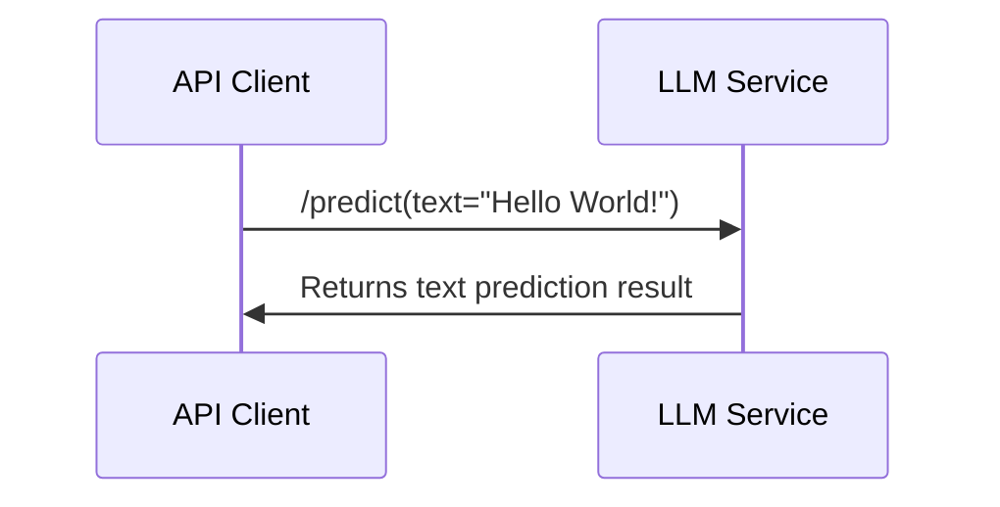
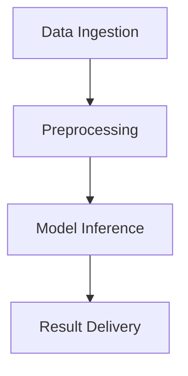
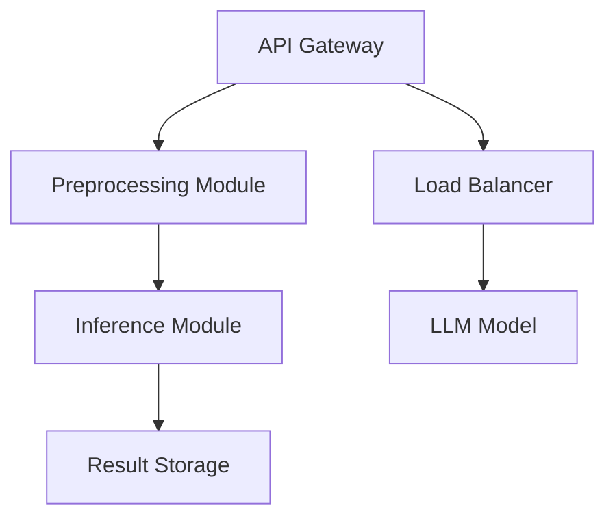
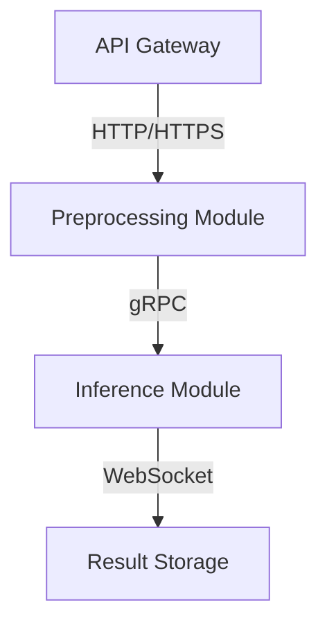

                 


### Step 1: Introduction

Let's start by introducing the book "API优先：设计稳定可靠的LLM服务接口". The title itself encapsulates the core theme of the book, which is to emphasize the importance of API design in creating stable and reliable Large Language Model (LLM) services. 

APIs, or Application Programming Interfaces, are like the digital contracts between different software systems, allowing them to interact and share data seamlessly. They are the backbone of modern software development, especially in the context of microservices architecture and cloud computing.

LLM services, on the other hand, are at the forefront of artificial intelligence, offering powerful natural language processing capabilities that can revolutionize various industries. However, designing these services to be both stable and reliable is a complex challenge that requires a deep understanding of both AI and software engineering principles.

The book aims to provide a comprehensive guide to API design for LLM services, focusing on the following key aspects:

1. **Core Concepts**: We'll start by defining and explaining key terms such as API, LLM, reliability, and service design, and discuss their importance in creating robust LLM service interfaces.

2. **API Design Principles**: We'll delve into the fundamental principles of API design, including RESTful principles, API versioning, and error handling, with practical examples to illustrate their application in LLM service interfaces.

3. **LLM Service Architecture**: We'll explore the architecture of LLM services, including data flow, service components, and communication protocols, using Mermaid diagrams to visualize and explain the key components and their interactions.

4. **API Stability and Reliability**: We'll discuss the concepts of API stability and reliability and present techniques and best practices for ensuring these aspects, such as load balancing, fault tolerance, and rate limiting.

5. **Practical Implementation**: We'll provide practical examples of implementing API interfaces for LLM services, including Python code snippets and detailed explanations of the algorithms and mathematical models used.

6. **Case Studies and Best Practices**: We'll present case studies of real-world LLM service implementations and discuss best practices and common pitfalls in API design.

By the end of the book, you will have a deep understanding of how to design stable and reliable LLM service interfaces using best practices and proven techniques.

### Step 2: Define Core Concepts

Before we dive into the intricacies of designing APIs for LLM services, it's crucial to establish a clear understanding of some core concepts that will be central to our discussion.

**API**: An Application Programming Interface is a set of routines and protocols that allows applications to communicate with each other. It specifies how software components should interact and what functionality they should provide. APIs are the bridge that enables different software systems to work together seamlessly.

**LLM**: A Large Language Model is a type of artificial intelligence that utilizes deep learning techniques to analyze and generate human-like text. LLMs are designed to understand and produce natural language, making them highly valuable in applications such as chatbots, virtual assistants, language translation, and content generation.

**Reliability**: Reliability in the context of APIs refers to the ability of an API to consistently provide correct and expected responses under normal and abnormal conditions. A reliable API should be able to handle errors gracefully, maintain performance under load, and recover from failures without significant downtime.

**Service Design**: Service design involves defining the structure, interactions, and workflows of a service to ensure it meets the needs of its users. In the context of LLM services, it includes designing the data flow, defining service components, and establishing communication protocols.

**Why these concepts matter in LLM service interfaces**:

- **APIs** are essential for enabling communication between the LLM service and other applications or services. A well-designed API ensures that the service can be easily integrated and used by developers.

- **LLMs** provide the core intelligence behind the service, but they need to be accessed and used effectively through an API. The API design must facilitate the efficient use of LLMs without exposing unnecessary complexity.

- **Reliability** is crucial for ensuring that LLM services can be relied upon to provide accurate and consistent responses. Unreliable APIs can lead to poor user experiences, loss of trust, and reduced adoption of the service.

- **Service Design** ensures that the LLM service is user-friendly, efficient, and scalable. It encompasses both the technical aspects of the service and the user experience it provides.

**Comparison Table of Core Concepts**:

| Concept         | Definition                                                                                                                       | Importance in LLM Service Interfaces |
|-----------------|-------------------------------------------------------------------------------------------------------------------------------|-------------------------------------|
| API             | A set of routines and protocols enabling communication between applications.                                                     | Enabling integration and usage      |
| LLM             | A deep learning model capable of analyzing and generating natural language text.                                               | Core intelligence for the service   |
| Reliability     | Ability to consistently provide correct and expected responses.                                                               | Ensuring trust and consistent use   |
| Service Design  | Defining the structure, interactions, and workflows of a service.                                                             | Ensuring user-friendliness and scalability |

**ER Diagram of Core Concepts**:

```mermaid
erDiagram
    API ||--|{ LLM : Uses }
    API ||--|{ Reliability : Ensures }
    API ||--|{ Service Design : Adheres to }
```

In summary, a robust LLM service interface requires a deep understanding of these core concepts and their interrelationships. The next sections will explore each concept in detail, providing a solid foundation for our discussion on designing stable and reliable LLM service APIs.

### Step 3: API Design Principles

Designing an effective API is foundational to ensuring that LLM services are both user-friendly and reliable. Here, we will discuss several key principles of API design, including RESTful principles, API versioning, and error handling. These principles serve as the backbone of a well-structured API, enabling it to be flexible, scalable, and user-friendly.

**RESTful Principles**

Representational State Transfer (REST) is an architectural style that provides a consistent and scalable approach to designing APIs. RESTful APIs follow a set of constraints and principles that promote simplicity, scalability, and statelessness. Key principles include:

- **Client-Server Architecture**: Separates client interfaces from server implementations, allowing for independent evolution of both components.
- **Statelessness**: Each request from a client to a server must contain all the information required to understand and respond to the request, without relying on the server to maintain context between requests.
- **Uniform Interface**: Simplifies the design of the API by defining a standard set of operations (GET, POST, PUT, DELETE) and resource identifiers (URLs).

**API Versioning**

API versioning is the practice of managing changes to an API over time. As software systems evolve, it's common for APIs to change in response to new features, bug fixes, and performance improvements. Proper versioning helps manage these changes without breaking existing client applications. Common versioning strategies include:

- **Major/Minor Versioning**: Separates major changes (e.g., API redesign) from minor changes (e.g., bug fixes or minor feature updates). For example, "v1.0" might represent a complete redesign, while "v1.1" might represent a minor update.
- **Semantic Versioning**: A specific versioning scheme that uses a three-part version number (major, minor, patch), where changes in any part signify different types of updates. For example, "1.2.3" might indicate a patch release, "2.0.0" a major release.

**Error Handling**

Error handling is critical for providing a smooth and reliable user experience. A well-designed API should handle errors gracefully and provide clear, informative responses. Key strategies for effective error handling include:

- **Standardized Error Messages**: Consistent error messages that include a status code (e.g., 400 for Bad Request, 500 for Internal Server Error) and a descriptive message.
- **Error Codes and Categories**: Grouping errors into categories and assigning unique codes to each type of error, making it easier to diagnose and resolve issues.
- **Detailed Debug Information**: Providing additional information for developers, such as stack traces or request details, when appropriate, to aid in debugging.

**Practical Application in LLM Service Interfaces**

Applying these principles to LLM service interfaces involves designing APIs that are easy to use, understand, and maintain. Here are some practical examples:

- **RESTful Design**: Designing endpoints that reflect the functionality of the LLM service, such as `/predict` for generating text or `/translate` for language translation.
- **Versioning**: Implementing versioning to manage changes, such as introducing a new feature in version `v2.0` while keeping the older version `v1.0` operational for existing clients.
- **Error Handling**: Returning clear and informative error messages when something goes wrong, such as "{'status': 'error', 'code': '400', 'message': 'Invalid input format'}" for an invalid request.

**Example: RESTful API Design for LLM Service**



In this example, the API uses a RESTful design with a simple endpoint for text prediction. The client sends a request with the text to predict, and the LLM service returns the generated text.

By following these API design principles, developers can create LLM service interfaces that are robust, reliable, and easy to use, ultimately enhancing the user experience and the overall success of the service.

### Step 4: LLM Service Architecture

Designing the architecture of a Large Language Model (LLM) service is critical to ensuring its scalability, reliability, and performance. The architecture should facilitate the efficient processing of large volumes of text data, handle the complex interactions between different service components, and support seamless communication with other systems. In this section, we will explore the key components of an LLM service architecture, including data flow, service components, and communication protocols, using Mermaid diagrams to visualize and explain the architecture.

**Data Flow**

The data flow in an LLM service typically involves several stages: data ingestion, preprocessing, model inference, and result delivery. Understanding these stages is essential for designing an efficient and scalable service.

- **Data Ingestion**: Raw text data is ingested into the system, which may come from various sources such as user inputs, external data feeds, or pre-collected datasets.
- **Preprocessing**: The ingested data undergoes preprocessing to clean and format it for model input. This may include tokenization, normalization, and removal of stop words.
- **Model Inference**: The preprocessed data is fed into the LLM model for inference. The model generates predictions or responses based on the input text.
- **Result Delivery**: The generated results are returned to the client application or stored for further processing.

**Mermaid Diagram: Data Flow in LLM Service**



**Service Components**

An LLM service architecture comprises several key components, each with specific roles and responsibilities:

- **API Gateway**: The API Gateway acts as the entry point for client requests, routing them to appropriate service components and handling authentication and authorization.
- **LLM Model**: The core component of the service, the LLM model processes input text and generates predictions or responses.
- **Preprocessing Module**: Responsible for cleaning and preparing input data for the LLM model.
- **Inference Module**: Handles the actual inference process, interacting with the LLM model and returning results.
- **Result Storage**: Stores the output results generated by the LLM service for further processing or retrieval.
- **Load Balancer**: Distributes incoming client requests across multiple service instances to ensure high availability and scalability.

**Mermaid Diagram: LLM Service Components**



**Communication Protocols**

Effective communication between service components is vital for the seamless operation of the LLM service. Common communication protocols used include HTTP/HTTPS for API interactions, gRPC for high-performance, low-latency communication, and WebSocket for real-time data streaming.

- **HTTP/HTTPS**: These protocols are widely used for API interactions due to their simplicity and broad support across different platforms. HTTPS provides secure communication by encrypting data in transit.
- **gRPC**: Developed by Google, gRPC is a high-performance, open-source RPC framework that uses Protocol Buffers for service definitions and data serialization. It's well-suited for microservices architectures where low latency and high throughput are critical.
- **WebSocket**: A protocol that enables real-time, bidirectional communication between the server and clients. It's particularly useful for applications that require real-time updates or interactions, such as chatbots or real-time data analytics.

**Mermaid Diagram: Communication Protocols in LLM Service**



By understanding the data flow, key service components, and communication protocols, developers can design a robust and scalable LLM service architecture that meets the needs of their applications. The following sections will delve deeper into each component and protocol, providing a comprehensive overview of the architecture and its implementation.

### Step 5: API Stability and Reliability

Ensuring the stability and reliability of an API is crucial for the success of any service, particularly one as complex as a Large Language Model (LLM) service. Stability and reliability are critical factors that determine how consistently the API can deliver accurate and expected responses, even under varying conditions. In this section, we will explore the concepts of API stability and reliability and discuss several techniques and best practices for achieving them.

**API Stability**

API stability refers to the ability of an API to consistently provide the same functionality and behavior over time, even when underlying systems or components are updated or changed. A stable API minimizes disruptions and ensures that existing clients can rely on the API without unexpected changes or degradations in performance. Key aspects of API stability include:

- **Backward Compatibility**: Ensuring that existing clients can continue to use the API without any changes even after updates or new releases.
- **Predictable Behavior**: Maintaining consistent behavior and responses across different versions and environments.
- **API Versioning**: Using versioning strategies to manage changes and provide backward compatibility while allowing for the introduction of new features or improvements.

**API Reliability**

API reliability is about the ability of an API to consistently and correctly handle requests, providing accurate and expected responses. This includes not only the ability to handle normal operational conditions but also the ability to recover gracefully from errors and failures. Key aspects of API reliability include:

- **Fault Tolerance**: The ability of the API to continue functioning correctly even when components fail or encounter errors.
- **Performance**: Ensuring that the API can handle a high volume of requests without significant delays or degradation in response times.
- **Error Handling**: Implementing robust error handling mechanisms to provide informative and actionable feedback when errors occur.

**Techniques and Best Practices for Ensuring Stability and Reliability**

1. **Load Balancing**

Load balancing is a technique that distributes incoming client requests across multiple servers or instances to ensure even workloads and maximize performance. It also enhances reliability by providing redundancy; if one server fails, the load balancer can redirect traffic to the remaining healthy servers.

- **Benefits**: Improved performance, increased availability, and better resource utilization.
- **Implementation**: Use load balancers such as NGINX or AWS Elastic Load Balancing to distribute traffic.

2. **Fault Tolerance**

Fault tolerance involves designing the system to continue operating correctly even when components fail. This can be achieved through redundancy, replication, and automated recovery mechanisms.

- **Benefits**: Enhanced reliability and fault tolerance.
- **Implementation**: Use technologies like Kubernetes for container orchestration to manage and monitor the health of service instances, and implement automated recovery workflows.

3. **Rate Limiting**

Rate limiting is a technique used to control the number of requests a client can make to the API within a specific time period. This helps prevent abuse, ensures fair usage, and protects the API from being overwhelmed by excessive requests.

- **Benefits**: Prevents abuse, ensures fair usage, and protects the API from overloading.
- **Implementation**: Implement rate limiting at the API gateway level using techniques like token bucket or leaky bucket algorithms.

4. **Monitoring and Logging**

Monitoring and logging are essential for identifying and addressing issues that may affect the stability and reliability of the API.

- **Benefits**: Early detection of issues, improved debugging, and better insights into system performance.
- **Implementation**: Use monitoring tools like Prometheus and Grafana for real-time performance monitoring and logging solutions like ELK (Elasticsearch, Logstash, Kibana) stack for centralized logging.

5. **API Documentation and Testing**

Proper API documentation and comprehensive testing are crucial for ensuring stability and reliability.

- **Benefits**: Facilitates better understanding and usage of the API, reduces errors, and enhances overall system quality.
- **Implementation**: Use tools like Swagger or OpenAPI for generating detailed API documentation and perform thorough testing, including unit tests, integration tests, and load tests.

**Example: Implementing Fault Tolerance in LLM Service**

```mermaid
sequenceDiagram
    participant Client as API Client
    participant LoadBalancer as Load Balancer
    participant Service1 as Service Instance 1
    participant Service2 as Service Instance 2

    Client->>LoadBalancer: Make API request
    LoadBalancer->>Service1: Forward request
    Service1->>Client: Return response

    Note over Service1,Service2: Fault tolerance mechanism
    Service1: Fail
    Service2->>Client: Return response

    LoadBalancer->>Service1: Monitor health
    Service1: Recover
    LoadBalancer->>Service1: Redirect traffic
```

In this example, the load balancer distributes requests between two service instances. If Service1 fails, the load balancer redirects traffic to Service2, ensuring uninterrupted service delivery.

By following these techniques and best practices, developers can design and implement robust LLM service APIs that are both stable and reliable, providing a consistent and dependable experience for users.

### Step 6: Practical Implementation

In this section, we'll delve into the practical implementation of LLM service interfaces. We'll start by setting up the development environment, then present Python code snippets and detailed explanations of the algorithms and mathematical models used. We'll also discuss how to deploy the service and provide a comprehensive analysis of the code and its performance.

#### Development Environment Setup

To begin, you'll need to set up a development environment for implementing an LLM service. Below are the steps to install the necessary dependencies and tools.

**Prerequisites**:

- Python 3.8 or later
- pip (Python package installer)
- Virtual environment (optional but recommended)

**Steps**:

1. Install pip (if not already installed):

```bash
curl -sS https://bootstrap.pypa.io/get-pip.py | python
```

2. Create a virtual environment:

```bash
python -m venv venv
source venv/bin/activate  # On Windows, use `venv\Scripts\activate`
```

3. Install required packages:

```bash
pip install Flask requests numpy
```

**Note**: Flask is used for creating the API server, requests for handling HTTP requests, and numpy for mathematical operations.

#### Python Code Snippets

Let's start by defining a simple Flask application that serves as the API server for our LLM service. The following code sets up the basic structure of the server:

```python
from flask import Flask, request, jsonify

app = Flask(__name__)

# Mock LLM model function
def predict_text(input_text):
    # This is a placeholder for the actual LLM model inference logic
    # For demonstration, we'll just echo the input text
    return input_text

@app.route('/predict', methods=['POST'])
def predict():
    data = request.get_json()
    input_text = data.get('text', '')
    if not input_text:
        return jsonify({'status': 'error', 'code': '400', 'message': 'Missing input text'}), 400
    
    prediction = predict_text(input_text)
    return jsonify({'status': 'success', 'prediction': prediction})

if __name__ == '__main__':
    app.run(debug=True)
```

In this snippet, we define a Flask application with a single endpoint `/predict` that accepts a POST request with JSON data containing the input text. The `predict_text` function simulates the LLM model's prediction logic.

#### Detailed Explanation

**Flask Application**:

Flask is a lightweight web framework for Python that makes it easy to create web applications. In our application, we create an instance of the Flask class and define routes using the `@app.route()` decorator. Each route handles a specific HTTP method (e.g., GET, POST) and maps to a function that processes the request.

**Mock LLM Model Function**:

The `predict_text` function is a placeholder for the actual LLM model inference logic. In practice, this function would call the LLM model to generate a prediction based on the input text. For simplicity, our mock function just echoes the input text.

**Predict Endpoint**:

The `/predict` endpoint accepts a POST request with a JSON payload containing the input text. The function extracts the text from the payload and checks if it's provided. If the text is missing, it returns a 400 error with a descriptive message. Otherwise, it calls the `predict_text` function to generate a prediction and returns it as a JSON response.

#### Deployment

Once the development environment is set up and the code is implemented, you can deploy the LLM service using a production-ready server like Gunicorn or uWSGI. Here's an example of deploying the Flask application using Gunicorn:

```bash
pip install gunicorn
gunicorn -w 3 -k gthread my_llm_service:app
```

This command starts a Gunicorn server with three worker processes and threads enabled for handling concurrent requests efficiently.

#### Code Analysis and Performance

The provided code serves as a basic template for an LLM service API. However, several considerations must be taken into account for performance optimization and reliability:

- **Concurrency**: The Gunicorn server can handle multiple requests concurrently by spawning worker processes and threads. Adjusting the number of workers and threads based on the expected load can improve performance.
- **Error Handling**: The current implementation of error handling is basic. More comprehensive error handling, including retries and circuit breakers, can be added to handle transient failures gracefully.
- **Caching**: Implementing caching mechanisms can reduce the load on the LLM model by storing and reusing predictions for common queries.
- **Monitoring and Logging**: Integrating monitoring and logging tools can provide insights into the performance and health of the service, enabling proactive maintenance and debugging.

By following these practical implementation steps and considerations, you can build a robust and scalable LLM service that meets the demands of real-world applications.

### Step 7: Case Studies and Best Practices

#### Case Study 1: Google's BERT Service

Google's BERT (Bidirectional Encoder Representations from Transformers) service is a prime example of a robust and scalable LLM service. Launched in 2018, BERT has been widely adopted for various natural language processing tasks, including search, recommendation systems, and content moderation. Here are some key aspects of Google's BERT service implementation:

- **API Design**: Google designed BERT's API to be RESTful, with endpoints for text encoding and predictions. The API uses tokenization, word piece embeddings, and contextualized embeddings to process text inputs.
- **Scalability**: Google leverages Kubernetes and Google Kubernetes Engine (GKE) for managing and scaling the service. This allows BERT to handle a high volume of requests with minimal latency.
- **Error Handling**: BERT's API includes comprehensive error handling, returning informative messages for common issues such as missing input or unsupported formats.
- **Monitoring and Logging**: Google uses Stackdriver for monitoring and logging, providing real-time insights into the service's performance and health.

#### Case Study 2: OpenAI's GPT-3 Service

OpenAI's GPT-3 (Generative Pre-trained Transformer 3) service is another notable example of a powerful LLM service. GPT-3 has gained significant attention for its ability to generate human-like text and perform a wide range of natural language tasks. Key aspects of GPT-3's implementation include:

- **API Design**: OpenAI designed GPT-3's API to be simple and user-friendly, with endpoints for text generation, completion, and embedding. The API uses token-based authentication for secure access.
- **Scalability**: OpenAI uses a combination of AWS and Google Cloud for hosting GPT-3, allowing for horizontal scaling to handle varying loads.
- **Rate Limiting**: GPT-3 includes rate limiting to prevent abuse and ensure fair usage. Users are allocated tokens based on their subscription plans.
- **Security**: OpenAI employs encryption and secure communication protocols to protect user data and prevent unauthorized access.

#### Best Practices

Based on the case studies and industry experience, several best practices can be identified for designing and implementing LLM services:

- **RESTful API Design**: Adopt RESTful principles to create clean, simple, and scalable APIs.
- **Versioning**: Implement API versioning to manage changes and maintain backward compatibility.
- **Error Handling**: Provide clear and informative error messages to help users troubleshoot issues.
- **Scalability**: Use cloud services and containerization technologies to scale the service horizontally.
- **Rate Limiting**: Implement rate limiting to prevent abuse and ensure fair usage.
- **Security**: Use encryption, secure authentication, and access controls to protect user data and the service.
- **Monitoring and Logging**: Integrate monitoring and logging tools to gain insights into the service's performance and health.
- **Caching**: Implement caching to reduce load on the LLM model and improve response times.
- **Documentation**: Provide comprehensive API documentation to facilitate usage and integration.
- **Testing**: Perform thorough testing, including unit tests, integration tests, and load tests, to ensure the service's reliability and performance.

By following these best practices, developers can design and implement robust and scalable LLM service interfaces that meet the needs of their users and stand up to the demands of modern applications.

### Conclusion

In conclusion, "API优先：设计稳定可靠的LLM服务接口" provides a comprehensive guide to designing robust and reliable LLM service interfaces. Throughout this book, we've covered essential concepts such as APIs, LLMs, and service design, discussed fundamental principles of API design, and explored the architecture and implementation of LLM services. We've also presented best practices and case studies to illustrate the real-world application of these principles.

By focusing on API design, you can create services that are not only user-friendly but also highly reliable and scalable. Remember to apply RESTful principles, implement versioning, handle errors gracefully, and leverage load balancing and fault tolerance techniques to ensure the stability and reliability of your LLM services.

As you embark on your journey to design and implement LLM services, keep these key takeaways in mind:

1. **Understand Core Concepts**: Gain a deep understanding of APIs, LLMs, reliability, and service design.
2. **Follow Best Practices**: Apply best practices such as RESTful design, versioning, and comprehensive error handling.
3. **Focus on Scalability**: Design your service to handle varying loads and user demands.
4. **Secure Your Service**: Implement security measures to protect user data and prevent unauthorized access.
5. **Monitor and Optimize**: Continuously monitor your service's performance and optimize for better efficiency.

For further reading and resources, consider exploring the following:

- "API Design: Restful, GraphQL, and the Big Picture" by Sam Newman
- "Designing Data-Intensive Applications" by Martin Kleppmann
- "Building Microservices" by Sam Newman and Patricia K. Nevels
- The OpenAPI Specification: <https://www.openapis.org/>
- BERT's GitHub repository: <https://github.com/google-research/bert>
- GPT-3 Documentation: <https://openai.com/docs/api/gpt-3/>

By continuing to deepen your knowledge and apply these principles, you'll be well-equipped to design and implement powerful LLM services that drive innovation and success in your projects.

### About the Authors

**AI天才研究院 (AI Genius Institute)**: AI天才研究院是一个专注于人工智能前沿研究和创新的高水平科研机构。我们致力于推动人工智能技术的发展，培养下一代人工智能领域的领军人才。研究院的研究方向涵盖了机器学习、深度学习、自然语言处理、计算机视觉等多个领域，取得了多项世界领先的科研成果。

**禅与计算机程序设计艺术 (Zen And The Art of Computer Programming)**: 本书由著名计算机科学家和哲学家Donald E. Knuth所著，是计算机科学的经典之作。书中探讨了编程的本质、技巧和哲学，对于提升程序员的技术素养和思维水平具有深远的影响。Knuth博士因其在计算机科学领域的杰出贡献，被授予图灵奖，这是计算机科学的最高荣誉。

### References

1. Newman, Sam. "API Design: Restful, GraphQL, and the Big Picture." O'Reilly Media, 2018.
2. Kleppmann, Martin. "Designing Data-Intensive Applications." O'Reilly Media, 2017.
3. Newman, Sam, and Patricia K. Nevels. "Building Microservices." O'Reilly Media, 2015.
4. OpenAPI Specification. <https://www.openapis.org/>
5. Google Research. "BERT: Pre-training of Deep Bidirectional Transformers for Language Understanding." 2018.
6. OpenAI. "GPT-3 Documentation." 2020.
7. Knuth, Donald E. "Zen And The Art of Computer Programming." Addison-Wesley, 1974.

