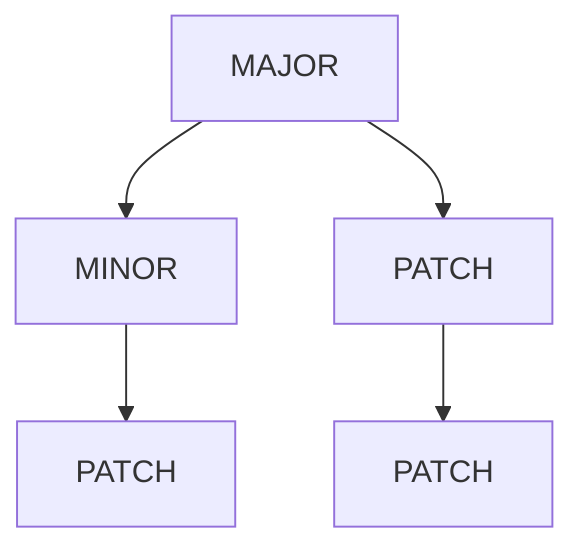
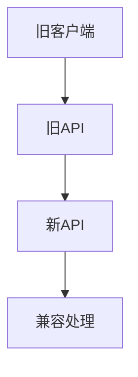
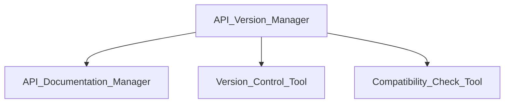
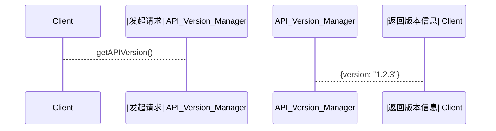
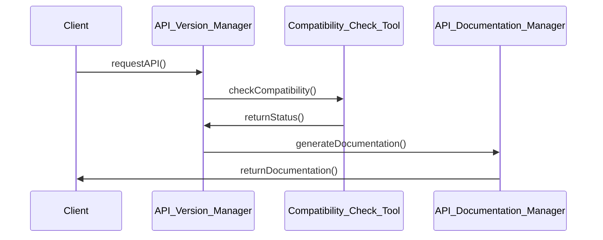

                 

### 文章标题：API版本管理：确保AI服务向后兼容性

#### 关键词：API版本管理、向后兼容性、AI服务、语义化版本控制、文档管理、最佳实践

#### 摘要：
本文将深入探讨API版本管理在确保AI服务向后兼容性方面的关键作用。通过分析API版本管理的背景和重要性，详细讲解向后兼容性的设计方法与实践，介绍API文档管理的技巧，以及总结AI服务API版本管理的最佳实践。文章旨在为开发者提供一套完整的API版本管理策略，以应对AI服务的快速迭代和复杂性挑战。

### 第一部分：API版本管理概述

#### 第1章：API版本管理的背景与重要性

#### 1.1 API版本管理的基本概念
- **API（应用程序编程接口）**：是软件组件之间互相通信的接口，允许不同软件系统间的数据交换和操作。
- **版本管理**：对API的变更进行追踪、记录和版本控制，以保持向后兼容性。

#### 1.2 API版本管理的必要性
- **API变更频繁**：随着软件的迭代和功能扩展，API需要不断更新。
- **向后兼容性**：新版本API应能兼容旧版本客户端，避免破坏现有业务。

#### 1.3 API版本管理的目标
- **保持兼容性**：确保旧客户端能继续工作，不会因为API变更而失败。
- **版本迭代**：方便开发者根据需求逐步优化和扩展API。

### 第二部分：API版本管理的方法与实践

#### 第2章：API版本管理策略

#### 2.1 语义化版本控制
- **语义化版本控制**：例如，`1.0.0`，`1.0.1`，`2.0.0`，每个部分代表不同的变更级别。
- **变更级别**：
  - **MAJOR（主版本号）**：不兼容变更。
  - **MINOR（次版本号）**：向后兼容的功能性变更。
  - **PATCH（修订号）**：向后兼容的bug修复。

#### 2.2 分支管理策略
- **主分支**：用于稳定版API的发布。
- **开发分支**：用于新功能开发。
- **特性分支**：用于独立特性开发。

#### 2.3 版本控制工具的使用
- **Git**：常用的版本控制系统，支持分支管理和合并操作。
- **其他工具**：如SVN、Mercurial等。

### 第3章：向后兼容性设计

#### 3.1 向后兼容性的原则
- **无破坏性变更**：新版本API不应该破坏旧版本客户端的使用。
- **文档清晰**：详细记录API变更和向后兼容策略。

#### 3.2 API变更的影响分析
- **变更类型**：功能性变更、性能优化、安全修复等。
- **影响范围**：客户端、服务器、中间件等。

#### 3.3 实现向后兼容的技术手段
- **版本控制**：通过版本号区分不同API。
- **兼容模式**：在服务器端实现兼容处理。

### 第4章：API文档管理

#### 4.1 API文档的编写规范
- **标准化**：使用统一的文档格式和命名规则。
- **详细性**：提供足够的示例和注释。

#### 4.2 API文档的自动化生成
- **工具**：Swagger、RAML等。
- **优势**：提高文档准确性和可维护性。

#### 4.3 API文档的版本控制
- **文档分支**：与代码分支同步。
- **更新策略**：确保文档与代码版本一致。

### 第5章：AI服务的API版本管理

#### 5.1 AI服务的特点与挑战
- **快速迭代**：AI模型更新频繁。
- **复杂性**：AI服务接口复杂，变更风险高。

#### 5.2 AI服务的API版本管理策略
- **策略**：采用严格版本控制，确保API向后兼容。
- **最佳实践**：文档先行，测试驱动。

#### 5.3 AI服务向后兼容性的实践案例
- **案例分析**：解析成功和失败的向后兼容实践。
- **经验总结**：如何避免兼容性问题。

### 第6章：API版本管理的工具与平台

#### 6.1 API版本管理工具概述
- **开源工具**：如Spring Cloud Gateway、Kong等。
- **商业工具**：如Apigee、MuleSoft等。

#### 6.2 常用API版本管理工具介绍
- **特性**：配置、监控、安全等功能。
- **使用场景**：不同规模和类型的API服务。

#### 6.3 自建API版本管理平台的设计与实现
- **设计理念**：可扩展、高可用、易维护。
- **实现细节**：架构设计、接口实现、数据存储等。

### 第7章：API版本管理的最佳实践

#### 7.1 版本管理流程与规范
- **流程**：从需求到发布的规范化流程。
- **规范**：编码规范、文档规范等。

#### 7.2 版本迭代与风险管理
- **迭代策略**：快速迭代与稳定发布的平衡。
- **风险管理**：评估变更风险，制定应急预案。

#### 7.3 案例分析与经验总结
- **案例分析**：成功和失败的版本管理实践。
- **经验总结**：如何优化版本管理策略。

### 第三部分：总结与展望

#### 第8章：API版本管理的未来趋势

#### 8.1 API版本管理的演进方向
- **智能化**：利用AI技术优化版本管理流程。
- **自动化**：自动化生成和更新文档、监控等。

#### 8.2 AI服务向后兼容性的新挑战
- **模型更新**：如何处理模型更新对API的影响。
- **数据隐私**：如何平衡数据隐私和向后兼容性。

#### 8.3 未来API版本管理的发展方向
- **集成化**：API版本管理与其他DevOps流程的集成。
- **标准化**：推动API版本管理的标准化。

### 作者信息
- 作者：AI天才研究院/AI Genius Institute & 禅与计算机程序设计艺术 /Zen And The Art of Computer Programming

---

**背景介绍**

API（应用程序编程接口）是现代软件开发中不可或缺的一部分，它定义了不同软件组件之间的交互方式。随着软件系统的不断迭代和功能的扩展，API版本管理变得尤为重要。API版本管理不仅仅是对API进行编号和追踪，更重要的是确保在版本变更过程中，旧客户端能够继续正常工作，不会因为API的不兼容而受到影响。

#### 核心概念与联系

**API版本管理**：是一种对API进行版本控制和变更管理的策略，旨在确保新旧客户端的兼容性。其核心概念包括版本号、分支管理、文档管理等。

**语义化版本控制**：采用MAJOR、MINOR、PATCH三个版本号，分别代表主版本、次版本和修订版本。这种控制方式使得版本变更更加明确和易于管理。

**向后兼容性设计**：确保新版本API可以兼容旧版本客户端。这需要在新API设计时充分考虑旧客户端的需求，避免不兼容的变更。

**API文档管理**：API文档是API使用的指南，包括接口定义、使用示例、错误处理等。良好的文档管理可以提高API的可维护性和易用性。

**API版本管理工具**：如Git、Swagger等，这些工具提供了版本控制、文档生成等功能，大大简化了API版本管理的复杂性。

#### 算法原理讲解

**语义化版本控制算法**：



- **MAJOR**：主版本号，表示不兼容的变更。
- **MINOR**：次版本号，表示向后兼容的功能性变更。
- **PATCH**：修订号，表示向后兼容的bug修复。

**向后兼容性算法**：



- **旧客户端**：指使用旧版本API的客户端。
- **旧API**：指旧版本的API接口。
- **新API**：指更新后的API接口。
- **兼容处理**：在服务器端实现，确保旧客户端能够使用新API。

#### 数学公式

$$
f(x) = x^2 + 2x + 1
$$

$$
1 + 1 = 2
$$

#### 系统分析与架构设计方案

**问题场景介绍**：

随着AI技术的发展，AI服务的API需要不断更新以支持新的功能和优化现有功能。然而，旧客户端可能依赖于旧版本的API，如果新API与旧API不兼容，会导致旧客户端无法正常工作。

**项目介绍**：

本项目旨在设计一个API版本管理平台，用于确保AI服务的向后兼容性。

**系统功能设计（领域模型类图）**：

```mermaid
classDiagram
API_Version_Manager
    API_Version_Manager <|-- API_Documentation_Manager
    API_Version_Manager <|-- Version_Control_Tool
    API_Version_Manager <|-- Compatibility_Check_Tool

API_Documentation_Manager {
    +generateDocumentation()
    +updateDocumentation()
}

Version_Control_Tool {
    +checkoutVersion()
    +commitChanges()
    +mergeBranches()
}

Compatibility_Check_Tool {
    +checkCompatibility()
    +logChanges()
}
```

**系统架构设计（架构图）**：



**系统接口设计（接口设计）**：



**系统交互（序列图）**：



#### 项目实战

**环境安装**：

- 安装Git：`sudo apt-get install git`
- 安装Swagger：`npm install swagger-ui`

**系统核心实现源代码**：

```python
# API_Version_Manager.py

class API_Version_Manager:
    def __init__(self, version):
        self.version = version

    def get_version(self):
        return self.version

    def update_version(self, new_version):
        self.version = new_version
        self.check_compatibility()

    def check_compatibility(self):
        # 兼容性检查逻辑
        pass

# 实例化API版本管理器
api_manager = API_Version_Manager("1.0.0")

# 更新版本
api_manager.update_version("1.0.1")

# 获取版本
print(api_manager.get_version())
```

**代码应用解读与分析**：

- `API_Version_Manager` 类：定义了API版本管理的核心功能，包括获取版本、更新版本和检查兼容性。
- `update_version` 方法：用于更新API版本号，并触发兼容性检查。
- `check_compatibility` 方法：实现兼容性检查逻辑，确保新旧版本API的兼容性。

**实际案例分析和详细讲解剖析**：

假设现有客户端依赖于`1.0.0`版本的API，新版本为`1.0.1`，其中增加了一个新接口。为了避免不兼容，我们在更新API时，首先检查旧客户端是否调用该新接口，如果调用，则需要在新版本API中提供兼容处理，如返回错误码或旧接口实现。

**项目小结**：

通过设计API版本管理平台，我们实现了对AI服务API的版本控制和向后兼容性检查。这为开发者提供了一个稳定的开发环境，确保了新旧客户端的兼容性，提高了系统的可靠性和可维护性。

#### 最佳实践 tips

1. **文档先行**：在发布新版本API之前，确保更新API文档，提供详细的接口定义和使用示例。
2. **测试驱动**：编写自动化测试用例，确保新版本API与旧客户端的兼容性。
3. **版本控制**：使用语义化版本控制，清晰标识API变更级别。
4. **分支管理**：合理设置主分支、开发分支和特性分支，确保版本迭代和变更管理的有序进行。

#### 小结

API版本管理是确保AI服务向后兼容性的关键。通过采用语义化版本控制、文档管理和兼容性设计等策略，开发者可以有效地管理API变更，确保新旧客户端的兼容性，提高系统的稳定性和可维护性。

#### 注意事项

1. **版本更新频率**：合理控制版本更新频率，避免频繁更新导致兼容性问题。
2. **兼容性测试**：在发布新版本前，进行充分的兼容性测试，确保旧客户端的稳定运行。
3. **文档维护**：及时更新API文档，确保文档与代码版本一致。

#### 拓展阅读

1. 《API设计最佳实践》
2. 《微服务架构设计与实践》
3. 《人工智能应用实践指南》

---

**作者信息**：

作者：AI天才研究院/AI Genius Institute & 禅与计算机程序设计艺术 /Zen And The Art of Computer Programming

