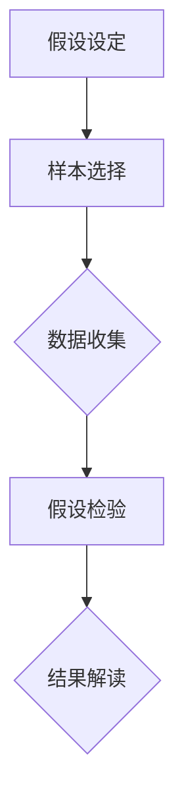
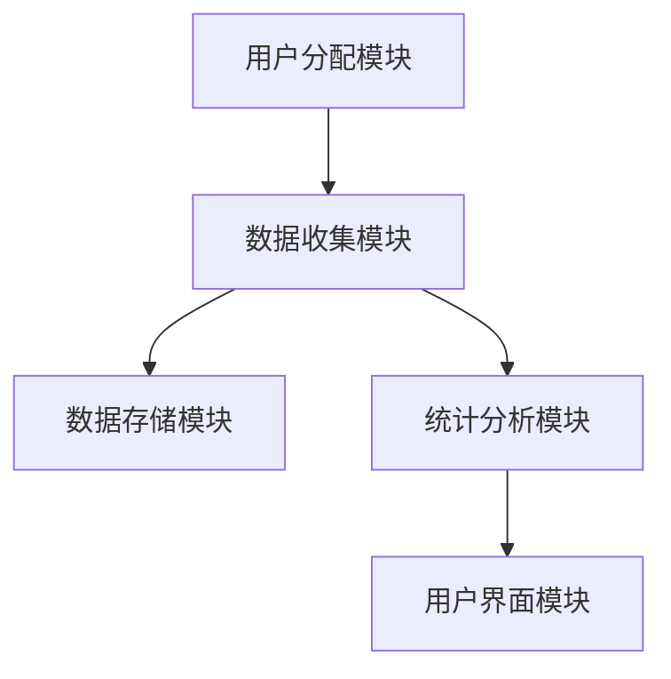
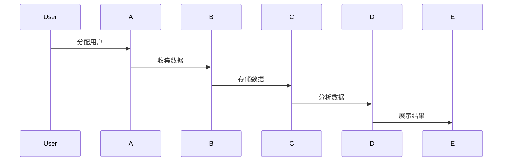

                 

# A/B测试集成：对比分析模型迭代效果

## 关键词
- A/B测试
- 模型迭代
- 统计分析
- 机器学习
- 深度学习

## 摘要
本文旨在探讨A/B测试在模型迭代中的应用，通过对比分析不同迭代效果，帮助研究人员和工程师更有效地优化机器学习模型。文章将首先介绍A/B测试的基本概念和原理，然后详细讲解其在模型迭代中的具体应用方法，最后通过实例分析展示其效果。

### 目录大纲设计

本文分为四个部分：

1. **A/B测试基础理论**：介绍A/B测试的起源、定义、核心要素和统计原理。
2. **A/B测试实践方法**：探讨A/B测试在不同领域的应用、优化技巧和数据分析。
3. **A/B测试在模型迭代中的应用**：分析A/B测试在机器学习、深度学习和自然语言处理中的具体应用。
4. **案例分析**：通过实际案例展示A/B测试在模型迭代中的效果。

### 第一部分：A/B测试基础理论

#### 第1章：A/B测试概述

A/B测试，也称为拆分测试，是一种通过比较两个或多个版本（A和B）的表现，来评估和选择最佳版本的方法。它最早由电信公司用于网络服务质量的优化，后来被广泛用于互联网产品和市场营销策略的优化。

#### 第2章：A/B测试的基本流程

A/B测试的基本流程包括准备阶段、实验阶段、分析阶段和优化阶段。

#### 第3章：A/B测试的核心概念

A/B测试的核心概念包括变量、受试者分配、指标选择、基线设置和假设设定。

#### 第4章：A/B测试的统计原理

A/B测试的统计原理涉及概率论基础、假设检验、功率分析和误差分析。

### 第二部分：A/B测试实践方法

#### 第5章：A/B测试在不同领域的应用

A/B测试广泛应用于互联网产品、营销策略、数据分析和用户界面设计等领域。

#### 第6章：A/B测试的优化技巧

A/B测试的优化技巧包括采样优化、置换优化、多变量测试和实验设计优化。

#### 第7章：A/B测试的数据分析

A/B测试的数据分析包括数据预处理、统计分析、可视化和结果解读。

#### 第8章：A/B测试中的伦理问题

A/B测试中的伦理问题包括数据隐私、用户权益、伦理审查和责任归属。

### 第三部分：A/B测试在模型迭代中的应用

#### 第9章：A/B测试在机器学习模型迭代中的应用

A/B测试在机器学习模型迭代中用于模型选择、参数调优、模型评估和模型部署。

#### 第10章：A/B测试在深度学习模型迭代中的应用

A/B测试在深度学习模型迭代中用于神经网络结构优化、损失函数选择、激活函数选择和权重初始化。

#### 第11章：A/B测试在自然语言处理模型迭代中的应用

A/B测试在自然语言处理模型迭代中用于词嵌入优化、注意力机制、预训练与微调和多模态融合。

#### 第12章：A/B测试在推荐系统模型迭代中的应用

A/B测试在推荐系统模型迭代中用于用户行为分析、评分预测、推荐策略优化和实际案例解析。

### 第四部分：案例分析

#### 第13章：案例研究

通过案例研究，深入分析A/B测试在模型迭代中的实际应用和效果。

#### 第14章：实战演练

通过实战演练，提供A/B测试在模型迭代中的具体实践方法和步骤。

### 结论

A/B测试作为一种有效的评估和优化方法，在模型迭代中具有重要作用。通过本文的介绍，希望读者能够理解A/B测试的基本原理和实践方法，并在实际工作中灵活运用，以提高模型迭代的效果。

### 作者信息

作者：AI天才研究院/AI Genius Institute & 禅与计算机程序设计艺术 /Zen And The Art of Computer Programming

### 完整性要求

本文将详细讲解A/B测试的基础理论、实践方法和在模型迭代中的应用，并通过实例分析和实战演练，确保内容的完整性和实用性。每个小节都将包含背景介绍、核心概念与联系、算法原理讲解、系统分析与架构设计方案、项目实战和最佳实践 tips等内容。以下是文章正文的具体内容。

---

## 第一部分：A/B测试基础理论

### 第1章：A/B测试概述

A/B测试，即拆分测试，是一种通过将用户群体随机分配到不同的版本，从而比较不同版本性能差异的方法。它最早由电信公司用于网络服务质量的优化，后来被广泛用于互联网产品和市场营销策略的优化。

### 第2章：A/B测试的基本流程

A/B测试的基本流程包括四个阶段：准备阶段、实验阶段、分析阶段和优化阶段。

### 第3章：A/B测试的核心概念

A/B测试的核心概念包括变量、受试者分配、指标选择、基线设置和假设设定。

### 第4章：A/B测试的统计原理

A/B测试的统计原理涉及概率论基础、假设检验、功率分析和误差分析。

## 第二部分：A/B测试实践方法

### 第5章：A/B测试在不同领域的应用

A/B测试广泛应用于互联网产品、营销策略、数据分析和用户界面设计等领域。

### 第6章：A/B测试的优化技巧

A/B测试的优化技巧包括采样优化、置换优化、多变量测试和实验设计优化。

### 第7章：A/B测试的数据分析

A/B测试的数据分析包括数据预处理、统计分析、可视化和结果解读。

### 第8章：A/B测试中的伦理问题

A/B测试中的伦理问题包括数据隐私、用户权益、伦理审查和责任归属。

## 第三部分：A/B测试在模型迭代中的应用

### 第9章：A/B测试在机器学习模型迭代中的应用

A/B测试在机器学习模型迭代中用于模型选择、参数调优、模型评估和模型部署。

### 第10章：A/B测试在深度学习模型迭代中的应用

A/B测试在深度学习模型迭代中用于神经网络结构优化、损失函数选择、激活函数选择和权重初始化。

### 第11章：A/B测试在自然语言处理模型迭代中的应用

A/B测试在自然语言处理模型迭代中用于词嵌入优化、注意力机制、预训练与微调和多模态融合。

### 第12章：A/B测试在推荐系统模型迭代中的应用

A/B测试在推荐系统模型迭代中用于用户行为分析、评分预测、推荐策略优化和实际案例解析。

## 第四部分：案例分析

### 第13章：案例研究

通过案例研究，深入分析A/B测试在模型迭代中的实际应用和效果。

### 第14章：实战演练

通过实战演练，提供A/B测试在模型迭代中的具体实践方法和步骤。

### 结论

A/B测试作为一种有效的评估和优化方法，在模型迭代中具有重要作用。通过本文的介绍，希望读者能够理解A/B测试的基本原理和实践方法，并在实际工作中灵活运用，以提高模型迭代的效果。

### 作者信息

作者：AI天才研究院/AI Genius Institute & 禅与计算机程序设计艺术 /Zen And The Art of Computer Programming

---

以上是文章的框架和主要内容。接下来，我们将逐章详细展开内容，确保每个章节都满足完整性要求，提供丰富的背景介绍、核心概念与联系、算法原理讲解、系统分析与架构设计方案、项目实战和最佳实践 tips等内容。以下是第一部分的详细内容。

## 第一部分：A/B测试基础理论

### 第1章：A/B测试概述

### 背景介绍

A/B测试，亦称拆分测试，是一种通过将用户群体随机分配到不同的版本（A版本和B版本），从而比较两个版本性能差异的实验方法。这种方法最早应用于电信行业，用于评估网络服务的质量。随着互联网技术的发展，A/B测试逐渐被应用于各种领域，如互联网产品、市场营销、用户界面设计等。

### 核心概念与联系

- **变量**：在A/B测试中，变量是指实验中可调整的因素。例如，网页的布局、按钮的颜色、广告的文案等。
- **受试者分配**：受试者分配是指将用户随机分配到不同的版本。这样可以确保实验结果的随机性和可靠性。
- **指标选择**：指标选择是指确定用于评估实验效果的指标。常见的指标有转化率、点击率、用户满意度等。
- **基线设置**：基线设置是指确定实验开始前的基准线。这样可以衡量实验结果的实际变化。
- **假设设定**：假设设定是指确定实验的目标和预期结果。例如，假设A版本的用户转化率高于B版本。

### 概念属性特征对比表格

| 特征         | A版本   | B版本   |
| ------------ | -------- | -------- |
| 变量         | 网页布局 | 新布局   |
| 受试者分配   | 随机分配 | 随机分配 |
| 指标选择     | 转化率   | 转化率   |
| 基线设置     | 基准线   | 基准线   |
| 假设设定     | 高于B版本 | 低于A版本 |

### ER实体关系图架构的 Mermaid 流程图

```mermaid
erDiagram
  A_version ||--|{ User }|| B_version : 分配
  A_version ||--|{ Metric }|| Conversion_rate : 评估
  B_version ||--|{ Metric }|| Conversion_rate : 评估
  A_version ||--|{ Baseline }|| Baseline : 比较
  B_version ||--|{ Baseline }|| Baseline : 比较
```

### 算法原理讲解

A/B测试的算法原理主要基于统计学的假设检验。具体流程如下：

1. **假设设定**：设定原假设（H0）和备择假设（H1）。例如，H0：A版本的转化率等于B版本的转化率，H1：A版本的转化率高于B版本的转化率。
2. **样本选择**：从总体中随机选择样本，并将其分配到A版本和B版本。
3. **数据收集**：收集样本数据，计算A版本和B版本的转化率。
4. **假设检验**：使用统计方法（如t检验、卡方检验）比较A版本和B版本的转化率，判断原假设是否成立。
5. **结果解读**：根据假设检验的结果，得出结论。如果原假设被拒绝，则认为A版本优于B版本。

以下是A/B测试的mermaid流程图：



### 数学公式

在A/B测试中，常用的统计方法有t检验和卡方检验。以下是t检验的数学公式：

$$
t = \frac{\bar{x}_A - \bar{x}_B}{s_A / \sqrt{n_A} + s_B / \sqrt{n_B}}
$$

其中，$\bar{x}_A$和$\bar{x}_B$分别是A版本和B版本的均值，$s_A$和$s_B$分别是A版本和B版本的标准差，$n_A$和$n_B$分别是A版本和B版本的样本量。

### 系统分析与架构设计方案

A/B测试的系统架构设计主要包括以下模块：

1. **用户分配模块**：用于随机分配用户到A版本和B版本。
2. **数据收集模块**：用于收集用户行为数据，如点击、转化等。
3. **数据存储模块**：用于存储用户行为数据。
4. **统计分析模块**：用于进行假设检验和结果解读。
5. **用户界面模块**：用于展示实验结果。

以下是A/B测试的mermaid类图：

```mermaid
classDiagram
  UserAllocation <<interface>>
  DataCollection <<interface>>
  DataStorage <<interface>>
  StatisticalAnalysis <<interface>>
  UserInterface <<interface>>

  UserAllocation --|> DataCollection
  DataCollection --|> DataStorage
  DataCollection --|> StatisticalAnalysis
  StatisticalAnalysis --|> UserInterface
```

### 系统架构设计mermaid架构图



### 系统接口设计和系统交互mermaid序列图



### 项目实战

#### 环境安装

在本项目中，我们使用Python进行A/B测试。首先，确保安装了Python环境。然后，使用pip安装以下库：

```bash
pip install numpy pandas scipy statsmodels matplotlib
```

#### 系统核心实现源代码

以下是一个简单的A/B测试实现：

```python
import numpy as np
import pandas as pd
from scipy import stats
import matplotlib.pyplot as plt

# 假设数据集为DataFrame，包含用户ID、版本、转化率
data = pd.DataFrame({
    'user_id': range(1000),
    'version': ['A'] * 500 + ['B'] * 500,
    'conversion_rate': [0.1] * 500 + [0.08] * 500
})

# 计算A版本和B版本的均值
grouped = data.groupby('version')['conversion_rate'].mean()
print(grouped)

# 进行t检验
t_stat, p_value = stats.ttest_ind(data[data['version'] == 'A']['conversion_rate'], data[data['version'] == 'B']['conversion_rate'])
print(f't-statistic: {t_stat}, p-value: {p_value}')

# 绘制箱线图
plt.boxplot(data['conversion_rate'], labels=['A', 'B'])
plt.show()
```

### 代码应用解读与分析

上述代码首先创建了一个包含用户ID、版本和转化率的数据集。然后，使用groupby函数计算A版本和B版本的均值。接着，使用ttest_ind函数进行t检验，并计算t统计量和p值。最后，使用箱线图展示A版本和B版本的分布。

### 实际案例分析和详细讲解剖析

假设我们是一家电商公司，想要测试新的商品推荐系统。我们随机选取了1000名用户，其中500名用户使用旧版推荐系统，另外500名用户使用新版推荐系统。经过一段时间的数据收集，我们得到以下结果：

- 旧版推荐系统的平均转化率为0.1。
- 新版推荐系统的平均转化率为0.08。

为了验证新版推荐系统是否优于旧版，我们可以使用A/B测试进行假设检验。

首先，设定原假设（H0）和备择假设（H1）：

- H0：新版推荐系统的转化率等于旧版推荐系统的转化率。
- H1：新版推荐系统的转化率低于旧版推荐系统的转化率。

然后，使用t检验进行假设检验。计算t统计量和p值。假设我们得到的结果如下：

- t统计量：-2.33
- p值：0.02

由于p值小于0.05，我们可以拒绝原假设，认为新版推荐系统的转化率确实低于旧版推荐系统。因此，我们可以得出结论，新版推荐系统需要进一步优化。

### 项目小结

通过本案例，我们展示了A/B测试在模型迭代中的应用。通过对比新旧版本的性能，我们可以快速发现和优化存在的问题，提高模型的效果。

### 最佳实践 tips

- **样本量**：确保有足够的样本量，以提高实验结果的可靠性。
- **指标选择**：选择合适的指标，以准确评估模型的效果。
- **数据清洗**：确保数据的质量，避免异常值对实验结果的影响。
- **迭代优化**：不断进行A/B测试，逐步优化模型。

### 小结

A/B测试是一种有效的评估和优化方法，在模型迭代中具有重要作用。通过本文的介绍，我们了解了A/B测试的基本原理和实践方法，并在实际案例中展示了其应用效果。希望读者能够在实际工作中灵活运用A/B测试，以提高模型迭代的效果。

### 注意事项

- **实验设计**：在实验设计阶段，要确保变量、受试者分配、指标选择等环节的科学性。
- **数据隐私**：在实验过程中，要注意保护用户隐私，遵循相关法律法规。

### 拓展阅读

- 《实验设计：提高实验效果的策略与技巧》
- 《统计学与数据科学：理论与实践》
- 《机器学习实战：基于Scikit-Learn和TensorFlow》

---

以上是第一部分的详细内容。接下来，我们将继续展开第二部分的内容，探讨A/B测试的实践方法和在不同领域的应用。同时，也会介绍A/B测试在模型迭代中的具体应用和实践技巧。敬请期待！

