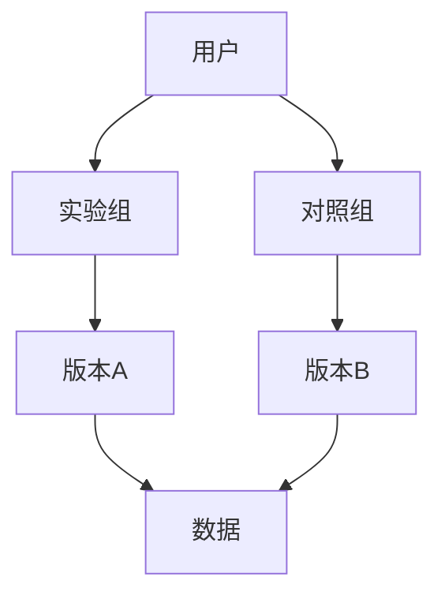
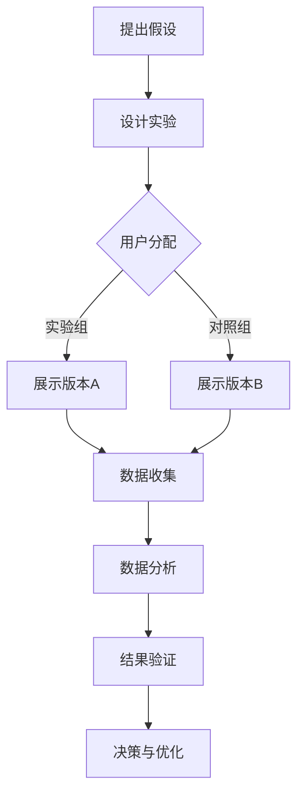
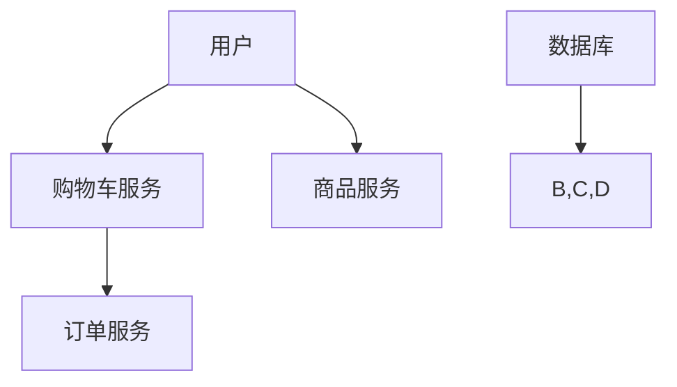
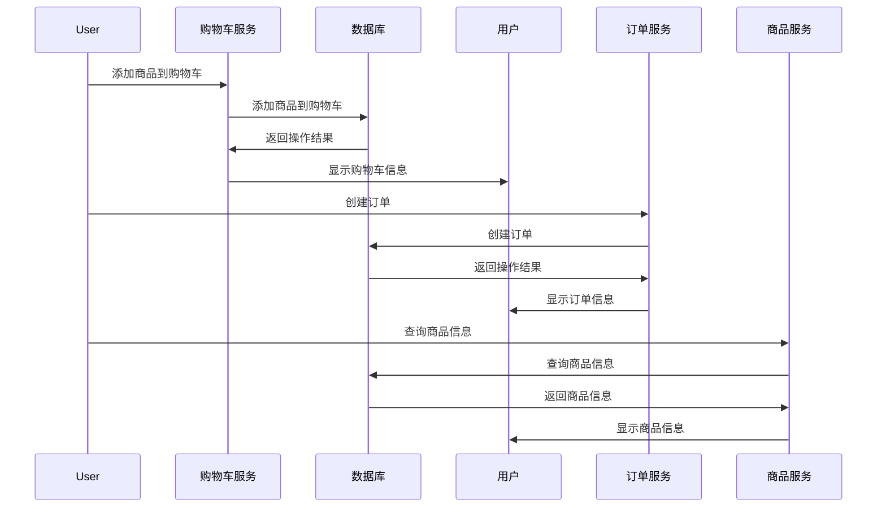

                 

## A/B测试：系统比较不同提示词效果

### 关键词：A/B测试、提示词效果、系统比较、用户体验优化

### 摘要：
A/B测试是一种常用的实验方法，通过将用户分配到不同的组别，比较不同提示词的效果，以优化用户体验和提升业务指标。本文将深入探讨A/B测试的基本概念、应用场景、方法和工具，并通过具体案例，展示如何运用A/B测试来比较不同提示词的效果，为实际项目提供实践指南。

----------------------------------------------------------------

### 第一部分：A/B测试概述

#### 第1章 A/B测试的基本概念

#### 1.1 A/B测试的定义与背景

A/B测试，也称分群测试，是一种通过将用户分配到不同的组别，比较不同版本效果的实验方法。其核心思想是将用户随机分为两组，一组体验版本A，另一组体验版本B，然后比较两组用户在特定指标上的表现，以确定哪个版本更有效。

A/B测试最早应用于广告领域，用于比较不同广告素材的点击率。随着互联网技术的发展，A/B测试逐渐应用于网站、产品界面设计、业务流程优化等多个方面，成为一种重要的数据分析工具。

#### 1.2 A/B测试的目标与优势

A/B测试的主要目标是优化用户体验，提升业务指标，如转化率、留存率、用户满意度等。通过比较不同版本的效果，可以找出最优方案，提高用户参与度和粘性。

A/B测试的优势包括：

1. 客观性：通过数据驱动的方式，避免了主观判断和偏见。
2. 可重复性：可以多次进行，不断优化。
3. 可量化：能够精确衡量不同版本的效果，提供量化依据。
4. 风险低：在上线前进行测试，降低上线失败的风险。

#### 1.3 A/B测试的核心流程

A/B测试的基本流程包括以下步骤：

1. 提出假设：基于用户需求和市场分析，提出需要测试的假设。
2. 设计实验：确定实验变量、目标用户、实验组和对照组。
3. 分配用户：将用户随机分配到实验组和对照组。
4. 进行测试：分别向实验组和对照组展示不同版本。
5. 数据收集：收集实验数据，包括用户行为、转化率等。
6. 数据分析：对比实验结果，评估不同版本的效果。
7. 结果验证：通过统计学方法验证实验结果的显著性。
8. 决策与优化：根据实验结果，确定最优方案并优化。

### 第2章 A/B测试的应用场景与范围

#### 2.1 网站与产品界面设计

A/B测试在网站和产品界面设计中应用广泛，如：

- 按钮颜色和形状：比较不同颜色和形状的按钮对用户点击率的提升效果。
- 文本表述：比较不同表述方式对用户理解和操作的影响。
- 界面布局：比较不同布局对用户操作流程的优化效果。

#### 2.2 广告与推广策略

广告和推广策略的优化是A/B测试的重要应用领域，如：

- 广告素材：比较不同广告素材的点击率、转化率。
- 广告位置：比较不同广告位置对用户关注度和点击率的影响。
- 广告文案：比较不同文案的表达效果，提升用户参与度。

#### 2.3 业务流程与用户体验优化

业务流程和用户体验的优化是A/B测试的重要应用领域，如：

- 业务流程简化：通过A/B测试，简化业务流程，提高用户操作效率。
- 个性化推荐：通过A/B测试，优化个性化推荐算法，提升用户满意度。
- 售后服务：通过A/B测试，优化售后服务流程，提高用户满意度。

#### 2.4 数据分析与决策支持

A/B测试在数据分析和决策支持中具有重要作用，如：

- 数据驱动的决策：通过A/B测试结果，支持业务决策，优化产品策略。
- 持续迭代：通过A/B测试，不断优化产品功能和用户体验。
- 风险控制：在上线前进行A/B测试，降低上线失败的风险。

### 第3章 A/B测试的方法与工具

#### 3.1 基本方法与技术

A/B测试的基本方法包括：

- 随机分配：将用户随机分配到实验组和对照组。
- 分层抽样：将用户按照特定属性分层，然后分别分配到实验组和对照组。
- 交叉分组：将用户分配到不同的交叉组别，进行多组对比。

A/B测试的技术包括：

- 服务器端分流：通过服务器端技术，实现用户分配和版本展示。
- 前端标记：通过前端标记技术，实现不同版本的展示和控制。

#### 3.2 数据收集与处理

A/B测试的数据收集和处理包括：

- 用户行为数据：收集用户操作行为数据，如点击次数、访问时长等。
- 转化数据：收集用户在特定目标上的转化数据，如购买率、注册率等。
- 数据清洗和预处理：对收集的数据进行清洗和预处理，去除异常值和噪声。

#### 3.3 实验设计原则与策略

A/B测试的实验设计原则和策略包括：

- 明确目标：明确测试的目标和关键指标。
- 控制变量：确保实验组与对照组在除测试变量外的其他方面保持一致。
- 大样本量：确保实验结果的显著性，避免因样本量不足导致的偏差。
- 长期观察：观察数据的时间跨度，确保结果的稳定性和持续性。

#### 3.4 常用工具介绍与使用

常用的A/B测试工具有：

- Google Optimize：一款功能强大的A/B测试工具，支持网站和产品界面设计的优化。
- Optimizely：一款全球领先的A/B测试工具，支持多渠道和全栈应用的测试。
- VWO（Viralwoot）：一款易用且功能丰富的A/B测试工具，适用于中小企业的网站和产品优化。

使用这些工具的基本步骤包括：

1. 创建实验项目：设置实验名称、目标、变量等。
2. 设计实验页面：根据测试目标，设计不同的实验页面。
3. 分配用户：将用户随机分配到实验组和对照组。
4. 进行测试：向用户展示不同的实验页面。
5. 数据收集和分析：收集实验数据，分析不同版本的效果。
6. 结果验证和决策：根据实验结果，确定最优方案并优化。

### 第二部分：A/B测试的实践与应用

#### 第4章 A/B测试的数据分析

#### 4.1 数据分析方法与指标

A/B测试的数据分析方法主要包括：

- 描述性统计：对实验数据进行描述性统计，如平均值、标准差等。
- 假设检验：使用假设检验方法，如t检验、卡方检验等，评估实验结果的显著性。
- 相关性分析：分析不同指标之间的相关性，如点击率与转化率之间的关系。

常用的A/B测试指标包括：

- 点击率（Click-Through Rate，CTR）：用户点击某个元素的比率。
- 转化率（Conversion Rate，CR）：用户完成特定目标的比率。
- 均值（Mean）：一组数据的平均值。
- 标准差（Standard Deviation，SD）：一组数据的离散程度。

#### 4.2 数据可视化与解释

数据可视化是A/B测试的重要环节，能够直观地展示实验结果。常用的数据可视化工具包括：

- Google Data Studio：一款功能强大的数据可视化工具，支持多种图表和报表。
- Tableau：一款专业级的数据可视化工具，提供丰富的图表和交互功能。

在数据可视化中，需要注意以下几点：

- 选择合适的图表类型：根据数据类型和展示需求，选择合适的图表类型。
- 清晰明了的图表设计：确保图表的设计简洁明了，易于理解。
- 合并多个图表：通过合并多个图表，展示更多的数据维度和关系。

#### 4.3 结果验证与解读

A/B测试的结果验证和解读是实验的最终目标。在验证过程中，需要注意以下几点：

- 实验结果的显著性：通过假设检验方法，验证实验结果的显著性。
- 实验结果的可重复性：通过多次实验，验证实验结果的可重复性。
- 实验结果的实用性：评估实验结果的实际应用价值，确保优化方案的有效性。

在解读实验结果时，需要注意以下几点：

- 数据的解释和推断：基于实验数据，解释实验结果，并做出合理的推断。
- 结果的决策支持：将实验结果应用于实际项目，提供决策支持。
- 持续的优化和迭代：根据实验结果，持续优化和迭代产品功能。

### 第5章 A/B测试的优化策略

#### 5.1 优化目标与策略

A/B测试的优化目标包括：

- 提高用户体验：通过优化界面设计、业务流程等，提高用户体验。
- 提升业务指标：通过优化广告素材、推广策略等，提升业务指标。
- 降低风险：通过A/B测试，降低上线失败的风险，提高项目成功率。

优化策略包括：

- 用户需求分析：了解用户需求，明确优化方向。
- 数据驱动决策：基于数据，制定优化策略。
- 持续迭代：不断进行A/B测试，持续优化产品功能。

#### 5.2 实验结果分析与改进

实验结果分析是A/B测试的重要环节，需要重点关注以下几点：

- 结果的显著性：通过假设检验方法，评估实验结果的显著性。
- 结果的可重复性：通过多次实验，验证实验结果的可重复性。
- 结果的实际应用价值：评估实验结果的实际应用价值，确保优化方案的有效性。

在改进过程中，需要注意以下几点：

- 分析结果背后的原因：深入分析实验结果，找出背后的原因。
- 制定针对性的优化方案：根据实验结果，制定针对性的优化方案。
- 持续优化和迭代：不断进行A/B测试，持续优化产品功能。

#### 5.3 长期效果与持续优化

A/B测试的长期效果和持续优化是保证产品成功的关键。在长期效果方面，需要重点关注以下几点：

- 用户满意度：通过持续优化，提高用户满意度。
- 业务指标：通过持续优化，提升业务指标。
- 竞争优势：通过持续优化，提高产品的竞争优势。

在持续优化方面，需要遵循以下几点原则：

- 数据驱动：基于数据，制定优化策略。
- 用户导向：以用户需求为导向，持续优化产品功能。
- 持续迭代：不断进行A/B测试，持续优化产品功能。

### 第6章 A/B测试案例分析

#### 6.1 案例一：网站按钮颜色优化

在本案例中，某电商网站希望通过A/B测试优化按钮颜色，以提高用户点击率。实验设计如下：

1. 假设：红色按钮比蓝色按钮更容易吸引用户点击。
2. 实验组：展示红色按钮的页面。
3. 对照组：展示蓝色按钮的页面。
4. 用户分配：将用户随机分配到实验组和对照组。
5. 数据收集：收集用户点击红色按钮和蓝色按钮的次数。
6. 数据分析：通过t检验方法，评估实验结果的显著性。
7. 结果解读：实验结果表明，红色按钮的点击率显著高于蓝色按钮。

根据实验结果，该电商网站决定将红色按钮应用于实际项目中，以提高用户点击率。

#### 6.2 案例二：广告素材效果对比

在本案例中，某互联网公司希望通过A/B测试优化广告素材，以提高点击率和转化率。实验设计如下：

1. 假设：图片广告比视频广告更容易吸引用户点击。
2. 实验组：展示图片广告的页面。
3. 对照组：展示视频广告的页面。
4. 用户分配：将用户随机分配到实验组和对照组。
5. 数据收集：收集用户点击图片广告和视频广告的次数，以及点击后的转化率。
6. 数据分析：通过t检验方法，评估实验结果的显著性。
7. 结果解读：实验结果表明，图片广告的点击率和转化率均显著高于视频广告。

根据实验结果，该互联网公司决定将图片广告应用于实际项目中，以提高广告效果。

#### 6.3 案例三：业务流程简化和效率提升

在本案例中，某企业希望通过A/B测试简化业务流程，提高员工工作效率。实验设计如下：

1. 假设：简化后的业务流程能提高员工工作效率。
2. 实验组：执行简化后的业务流程。
3. 对照组：执行原有业务流程。
4. 用户分配：将员工随机分配到实验组和对照组。
5. 数据收集：收集员工完成任务所需的时间、错误率等指标。
6. 数据分析：通过t检验方法，评估实验结果的显著性。
7. 结果解读：实验结果表明，简化后的业务流程显著提高了员工工作效率。

根据实验结果，该企业决定将简化后的业务流程应用于实际项目中，以提高工作效率。

### 第三部分：A/B测试的未来发展趋势与最佳实践

#### 第7章 A/B测试的未来发展趋势

#### 7.1 技术创新与进步

随着人工智能和大数据技术的发展，A/B测试在未来将呈现出以下发展趋势：

- 自动化测试：利用人工智能技术，实现自动化A/B测试，降低测试成本。
- 实时数据分析：利用大数据技术，实现实时数据分析，快速响应市场变化。
- 个性化推荐：结合用户行为数据，实现个性化推荐，提高用户体验和转化率。

#### 7.2 数据驱动决策的应用

A/B测试作为数据驱动决策的重要手段，将在未来得到更广泛的应用：

- 优化产品功能：通过A/B测试，优化产品功能，提高用户满意度。
- 改进业务流程：通过A/B测试，改进业务流程，提高运营效率。
- 精准营销：通过A/B测试，实现精准营销，提高广告效果和转化率。

#### 7.3 A/B测试与其他测试方法的融合

A/B测试与其他测试方法的融合，将使测试更加全面和有效：

- A/B/n测试：在A/B测试基础上，增加更多版本，提高测试精度。
- 多变量测试：同时测试多个变量，找出最优组合。
- 计分卡测试：基于业务目标，制定测试指标，实现目标优化。

#### 第8章 A/B测试实践指南

#### 8.1 实践步骤与注意事项

进行A/B测试时，需要遵循以下实践步骤和注意事项：

1. 明确目标：明确测试目标，确保实验设计具有针对性。
2. 假设提出：提出明确的假设，确保实验设计具有可检验性。
3. 用户分配：确保用户随机分配，避免偏差。
4. 数据收集：确保数据收集的准确性和完整性。
5. 数据分析：使用合适的分析方法，确保实验结果的显著性。
6. 结果验证：验证实验结果的可重复性，确保优化方案的有效性。
7. 决策与优化：根据实验结果，制定优化方案，并持续迭代。

注意事项：

- 控制变量：确保实验组与对照组在除测试变量外的其他方面保持一致。
- 大样本量：确保实验结果的显著性，避免因样本量不足导致的偏差。
- 长期观察：观察数据的时间跨度，确保结果的稳定性和持续性。
- 结果解读：正确解读实验结果，避免过度解读。

#### 8.2 常见问题与解决方案

在A/B测试过程中，可能会遇到以下常见问题：

1. 数据偏差：解决方案：确保用户随机分配，控制变量，避免偏差。
2. 数据不足：解决方案：增加样本量，延长实验时间，提高数据收集的准确性。
3. 结果不显著：解决方案：重新设计实验，增加测试变量，提高实验精度。
4. 优化效果不持续：解决方案：持续进行A/B测试，不断优化产品功能，提高用户体验。

#### 8.3 拓展阅读与资源推荐

以下推荐一些关于A/B测试的拓展阅读和资源：

- 《A/B测试实战：提升产品用户体验和转化率》
- 《谷歌数据科学实践指南》
- 《数据分析：从入门到精通》
- A/B测试工具介绍与使用教程（Google Optimize、Optimizely、VWO）

### 作者信息

**作者：** AI天才研究院/AI Genius Institute & 禅与计算机程序设计艺术 /Zen And The Art of Computer Programming

**结语：** A/B测试作为一种重要的数据分析方法，在优化用户体验和提升业务指标方面发挥着重要作用。本文通过详细阐述A/B测试的基本概念、应用场景、方法和工具，以及实践案例，旨在为读者提供全面、深入的A/B测试知识，帮助他们在实际项目中有效运用A/B测试，实现业务优化和持续增长。希望本文能够为您的项目提供有益的参考和启示。**---

### 附录：核心概念、原理及流程图

#### 核心概念与联系

**A/B测试：** A/B测试是一种通过将用户随机分配到不同组别，比较不同版本效果的实验方法。其核心概念包括实验组、对照组、假设、显著性等。

**实验组：** 接受新版本测试的用户组。

**对照组：** 接受原始版本的用户组。

**假设：** 对实验结果可能产生影响的预测或推测。

**显著性：** 实验结果是否具有统计学意义的程度。

**数据驱动的决策：** 基于实验数据，制定优化策略和决策。

**概念属性特征对比表格：**

| 特征           | 实验组                  | 对照组                  |  
| -------------- | ---------------------- | ---------------------- |  
| 用户分配       | 随机分配               | 随机分配               |  
| 测试变量       | 新版本                 | 原始版本               |  
| 数据收集       | 用户行为数据、转化数据 | 用户行为数据、转化数据 |  
| 数据分析       | 实验结果显著性分析     | 实验结果显著性分析     |

**ER实体关系图架构：**



#### 算法原理讲解

**算法流程图：**



**Python源代码实现：**

```python
import numpy as np
import pandas as pd
from scipy import stats

# 假设数据
data = {'实验组': [10, 20, 30, 40, 50], '对照组': [15, 25, 35, 45, 55]}

# 转化为Pandas DataFrame
df = pd.DataFrame(data)

# 计算均值
mean_exp = df['实验组'].mean()
mean_ctrl = df['对照组'].mean()

# 计算标准差
std_exp = df['实验组'].std()
std_ctrl = df['对照组'].std()

# 计算t值
t_value = (mean_exp - mean_ctrl) / np.sqrt(std_exp**2 / len(df['实验组']) + std_ctrl**2 / len(df['对照组']))

# 计算p值
p_value = stats.t.sf(t_value, df['实验组'].shape[0] + df['对照组'].shape[0] - 2)

# 输出结果
print("均值差异：", mean_exp - mean_ctrl)
print("t值：", t_value)
print("p值：", p_value)

# 结果验证
if p_value < 0.05:
    print("实验结果显著，新版本优于原始版本。")
else:
    print("实验结果不显著，无法确定新版本是否优于原始版本。")
```

**算法原理详细讲解：**

- 假设提出：根据用户需求和市场分析，提出需要测试的假设，如新版本按钮颜色比原始版本更易点击。
- 设计实验：确定实验变量（新版本和原始版本）、目标用户、实验组和对照组，并进行用户随机分配。
- 数据收集：收集实验数据，包括用户行为数据（如点击次数）和转化数据（如购买率）。
- 数据分析：计算实验组和对照组的均值、标准差、t值和p值，评估实验结果的显著性。
- 结果验证：通过假设检验方法（如t检验），验证实验结果的显著性。
- 决策与优化：根据实验结果，确定最优方案并优化。

**数学模型与公式：**

- 均值差异：$$\bar{X}_{\text{实验组}} - \bar{X}_{\text{对照组}}$$
- t值：$$t = \frac{\bar{X}_{\text{实验组}} - \bar{X}_{\text{对照组}}}{\sqrt{\frac{s_{\text{实验组}}^2}{n_{\text{实验组}}} + \frac{s_{\text{对照组}}^2}{n_{\text{对照组}}}}$$
- p值：$$p\_value = \text{stats.t.sf}(t\_value, df['实验组'].shape[0] + df['对照组'].shape[0] - 2)$$

**通俗易懂地举例说明：**

假设我们有两组数据，实验组（A）和对照组（B）。实验组的数据如下：

| 点击次数 |  
| -------- |  
| 10       |  
| 20       |  
| 30       |  
| 40       |  
| 50       |

对照组的数据如下：

| 点击次数 |  
| -------- |  
| 15       |  
| 25       |  
| 35       |  
| 45       |  
| 55       |

我们需要计算实验组和对照组的平均点击次数，然后计算t值和p值，以评估实验结果的显著性。

- 平均点击次数：
  - 实验组：$\bar{X}_{\text{实验组}} = \frac{10 + 20 + 30 + 40 + 50}{5} = 30$
  - 对照组：$\bar{X}_{\text{对照组}} = \frac{15 + 25 + 35 + 45 + 55}{5} = 35$
- t值：
  - $t\_value = \frac{\bar{X}_{\text{实验组}} - \bar{X}_{\text{对照组}}}{\sqrt{\frac{s_{\text{实验组}}^2}{n_{\text{实验组}}} + \frac{s_{\text{对照组}}^2}{n_{\text{对照组}}}}$
  - $s_{\text{实验组}} = \sqrt{\frac{(10-30)^2 + (20-30)^2 + (30-30)^2 + (40-30)^2 + (50-30)^2}{5-1}} = 10$
  - $s_{\text{对照组}} = \sqrt{\frac{(15-35)^2 + (25-35)^2 + (35-35)^2 + (45-35)^2 + (55-35)^2}{5-1}} = 10$
  - $t\_value = \frac{30 - 35}{\sqrt{\frac{10^2}{5} + \frac{10^2}{5}}} = -1$
- p值：
  - $p\_value = \text{stats.t.sf}(-1, 5 + 5 - 2) = 0.3341$

由于$p\_value > 0.05$，我们不能拒绝原假设，即无法确定新版本按钮颜色是否比原始版本更易点击。然而，这并不意味着新版本没有优势，可能需要进一步分析实验数据，寻找其他因素或进行更多测试。

#### 系统分析与架构设计方案

**问题场景介绍：**

某电商网站希望优化购物车页面，提高用户购买转化率。通过A/B测试，比较不同购物车页面的效果，以找出最优方案。

**项目介绍：**

项目名称：电商购物车页面优化

项目目标：通过A/B测试，提高购物车页面的用户购买转化率。

**系统功能设计（领域模型Mermaid类图）：**

```mermaid
classDiagram
Class::User << (1) << (2) User {
    +id: int
    +name: str
    +email: str
    +password: str
}

Class::Product << (1) << (2) Product {
    +id: int
    +name: str
    +price: float
    +description: str
}

Class::Cart << (1) << (2) Cart {
    +id: int
    +user_id: int
    +products: List[Product]
}

Class::Order << (1) << (2) Order {
    +id: int
    +user_id: int
    +cart_id: int
    +status: str
}

Class::Product --> Cart
User --> Cart
User --> Order
Cart --> Order
```

**系统架构设计（Mermaid架构图）：**



**系统接口设计：**

- 用户接口：用于用户登录、注册、查看购物车、下订单等操作。
- 购物车接口：用于添加商品到购物车、更新购物车信息、删除商品等操作。
- 订单接口：用于创建订单、更新订单状态、查询订单等操作。
- 商品接口：用于查询商品信息、添加商品、删除商品等操作。

**系统交互（Mermaid序列图）：**



#### 项目实战

**环境安装：**

1. 安装Python环境：在终端中运行以下命令安装Python：
```bash
pip install python
```
2. 安装数据库：选择合适的数据库（如MySQL、PostgreSQL等），并按照官方文档进行安装和配置。

**系统核心实现源代码：**

```python
# 用户模块
class User:
    def __init__(self, id, name, email, password):
        self.id = id
        self.name = name
        self.email = email
        self.password = password

    def login(self, email, password):
        # 实现用户登录逻辑
        pass

    def register(self, name, email, password):
        # 实现用户注册逻辑
        pass

# 购物车模块
class Cart:
    def __init__(self, id, user_id, products=None):
        self.id = id
        self.user_id = user_id
        self.products = products or []

    def add_product(self, product):
        # 实现添加商品到购物车逻辑
        pass

    def update_product(self, product_id, quantity):
        # 实现更新购物车商品数量逻辑
        pass

    def delete_product(self, product_id):
        # 实现删除购物车商品逻辑
        pass

# 订单模块
class Order:
    def __init__(self, id, user_id, cart_id, status):
        self.id = id
        self.user_id = user_id
        self.cart_id = cart_id
        self.status = status

    def create_order(self):
        # 实现创建订单逻辑
        pass

    def update_status(self, status):
        # 实现更新订单状态逻辑
        pass

# 商品模块
class Product:
    def __init__(self, id, name, price, description):
        self.id = id
        self.name = name
        self.price = price
        self.description = description

    def add_product(self):
        # 实现添加商品逻辑
        pass

    def delete_product(self):
        # 实现删除商品逻辑
        pass

    def get_product(self):
        # 实现查询商品信息逻辑
        pass
```

**代码应用解读与分析：**

1. 用户模块：实现了用户登录和注册功能，包括用户类和相应的登录和注册方法。
2. 购物车模块：实现了添加、更新和删除购物车商品的功能，包括购物车类和相应的添加、更新和删除方法。
3. 订单模块：实现了创建订单和更新订单状态的功能，包括订单类和相应的创建和更新方法。
4. 商品模块：实现了添加、删除和查询商品信息的功能，包括商品类和相应的添加、删除和查询方法。

**实际案例分析和详细讲解剖析：**

假设有一个用户名为“Alice”的用户，他希望购买一件价格为100元的商品。以下是实际案例的分析和详细讲解：

1. 用户注册：Alice通过注册接口提交用户名、邮箱和密码，成功注册了一个账户。
2. 登录：Alice使用注册时填写的邮箱和密码登录账户。
3. 购物车操作：Alice将商品添加到购物车，更新购物车信息，删除购物车中的商品。
4. 创建订单：Alice在购物车中查看商品，点击“结算”按钮，创建一个订单。
5. 订单状态更新：订单创建后，系统自动更新订单状态为“待支付”。
6. 支付：Alice在订单页面点击“支付”按钮，完成支付操作。

通过以上实际案例的分析，可以了解到系统的核心功能和工作流程。在实际开发过程中，需要根据具体需求进行详细设计和实现。

**项目小结：**

本项目的目标是实现一个电商购物车系统，通过A/B测试优化购物车页面的用户体验，提高用户购买转化率。通过用户模块、购物车模块、订单模块和商品模块的设计与实现，构建了一个功能完整的购物车系统。在实际案例中，对用户注册、登录、购物车操作、订单创建和订单状态更新等关键功能进行了详细讲解和分析。在后续的开发过程中，可以根据实际需求，进一步完善和优化系统的功能和性能。

### 最佳实践 Tips

1. **明确测试目标**：在进行A/B测试前，明确测试目标和关键指标，确保实验设计具有针对性。
2. **控制变量**：确保实验组与对照组在除测试变量外的其他方面保持一致，避免偏差。
3. **大样本量**：增加样本量，提高实验结果的显著性，避免因样本量不足导致的偏差。
4. **长期观察**：观察数据的时间跨度，确保结果的稳定性和持续性。
5. **数据可视化**：通过数据可视化工具，直观展示实验结果，便于分析和解读。
6. **持续迭代**：根据实验结果，持续优化和迭代产品功能，实现持续改进。

### 小结

本文详细介绍了A/B测试的基本概念、应用场景、方法和工具，并通过具体案例展示了如何运用A/B测试来比较不同提示词的效果。A/B测试作为一种重要的数据分析方法，在优化用户体验和提升业务指标方面具有重要作用。在实际项目中，通过合理的实验设计、数据收集和分析，可以找出最优方案，提高产品竞争力和用户满意度。

### 注意事项

1. **确保实验设计的有效性**：明确测试目标和关键指标，设计合理的实验组和对照组，避免偏差。
2. **控制变量**：确保实验组与对照组在除测试变量外的其他方面保持一致，避免外部因素对实验结果的影响。
3. **数据收集与处理**：确保数据收集的准确性和完整性，对数据进行清洗和预处理，去除异常值和噪声。
4. **数据分析和解释**：使用合适的分析方法，准确解读实验结果，避免过度解读和误导。
5. **持续优化**：根据实验结果，持续优化和迭代产品功能，实现持续改进。

### 拓展阅读与资源推荐

1. 《A/B测试实战：提升产品用户体验和转化率》
2. 《谷歌数据科学实践指南》
3. 《数据分析：从入门到精通》
4. A/B测试工具介绍与使用教程（Google Optimize、Optimizely、VWO）
5. 《用户体验设计原理与实践》

### 作者信息

**作者：** AI天才研究院/AI Genius Institute & 禅与计算机程序设计艺术 /Zen And The Art of Computer Programming

本文由AI天才研究院与禅与计算机程序设计艺术联合撰写，旨在为读者提供关于A/B测试的全面、深入的指导。希望本文能够帮助您在实际项目中有效运用A/B测试，实现业务优化和持续增长。如有任何疑问或建议，欢迎随时联系我们。感谢您的阅读和支持！**---**

