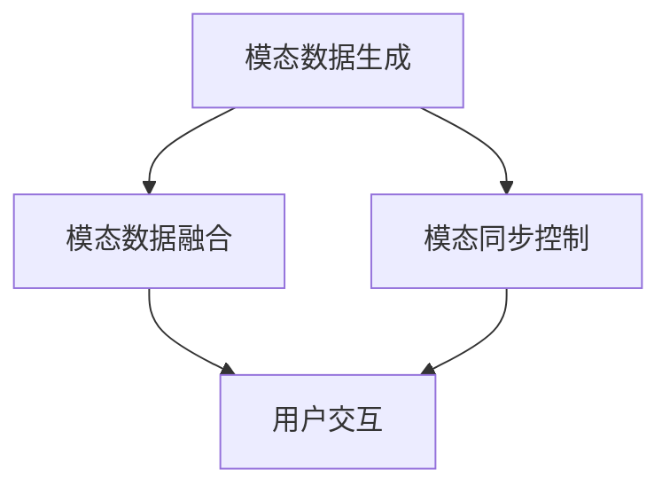
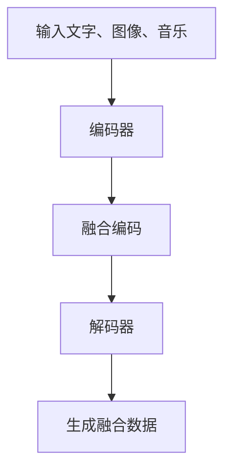
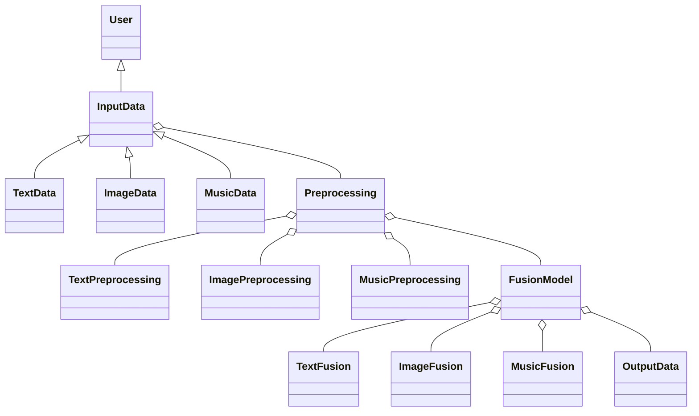
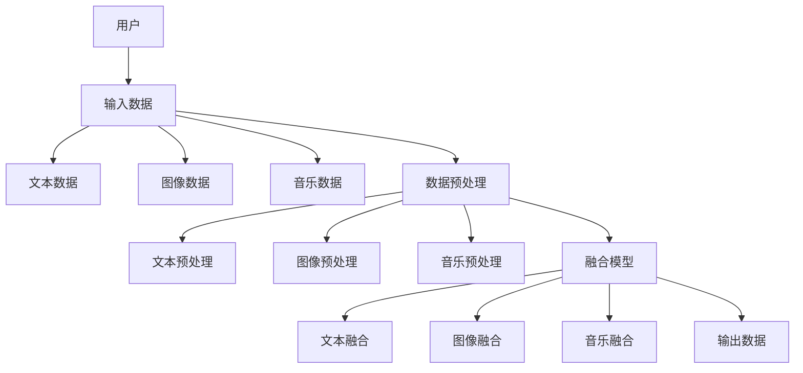
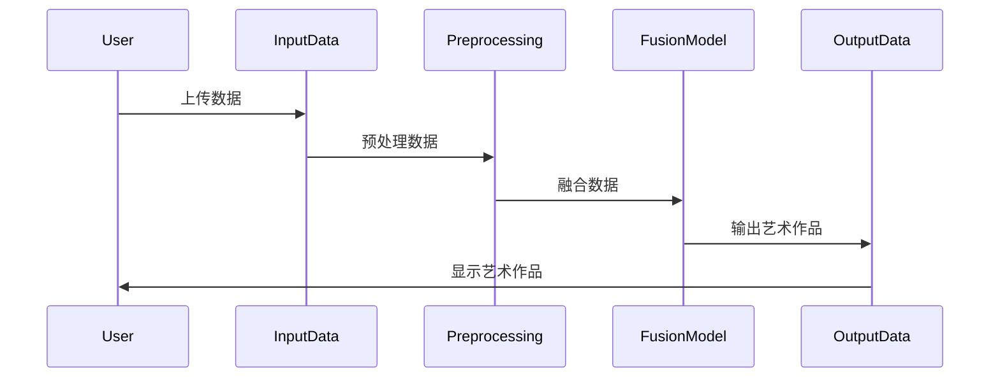

                 


## 第一部分: 引言

### 第1章: 多模态艺术创作的背景与目标

在现代社会中，人工智能（AI）正以前所未有的速度渗透到各个领域，从医疗、金融到娱乐和教育，AI技术的应用无处不在。然而，随着技术的不断发展，AI不再仅仅是解决特定问题的工具，它开始展现出创造性的潜力，特别是在艺术创作方面。本文将探讨一种新兴的AI艺术创作形式——多模态艺术创作，以及如何利用ChatGPT这一强大的AI模型，实现文字、图像和音乐的融合。

**关键词：**
- 人工智能
- 多模态艺术创作
- ChatGPT
- 文字、图像、音乐融合
- 艺术创作

**摘要：**
本文旨在介绍多模态艺术创作的基本概念和背景，解释为何AI在艺术创作中具有巨大的潜力。特别地，我们将探讨ChatGPT如何作为一个核心工具，实现文字、图像和音乐的结合，并探讨其应用前景。通过逐步分析，本文将提供读者对多模态艺术创作全面而深刻的理解，激发其在AI艺术创作领域的探索和创新。

----------------------------------------------------------------

## 第一部分: 引言

### 第1章: 多模态艺术创作的背景与目标

#### 背景介绍

随着人工智能技术的飞速发展，AI已经不仅仅局限于传统的数据处理和自动化任务。近年来，AI在创造性领域的应用逐渐成为研究热点，特别是在艺术创作方面。传统艺术创作主要依赖于人类的直觉、经验和技能，而AI艺术创作则试图通过算法和模型来模拟和扩展人类的创造力。

多模态艺术创作是一种新兴的艺术形式，它结合了文字、图像和音乐等多种媒介，创造出全新的艺术体验。这种创作方式不仅丰富了艺术表达的手段，也为观众带来了更加立体、沉浸的审美体验。

在多模态艺术创作中，文字、图像和音乐各自发挥着独特的作用：

- **文字**：作为基础表达手段，文字能够传达抽象的概念、情感和故事。通过文字，艺术家可以设定主题、引导观众的思考。
- **图像**：图像直观地展示了艺术家的视觉想法，能够瞬间吸引观众的注意力，并在视觉上传达信息。
- **音乐**：音乐具有强烈的情感表达力，能够增强作品的氛围，引发观众的情感共鸣。

#### 问题背景

随着AI技术的发展，艺术家们开始探索如何利用AI来辅助艺术创作。然而，传统的AI技术往往专注于单一模态的处理，如文字生成、图像生成或音乐生成，而无法同时处理多种模态。这种局限性使得AI在多模态艺术创作中的应用受到了限制。

此外，多模态数据的融合和同步也是一个挑战。如何在保证各模态独立表达的同时，实现它们之间的有机融合，使整体作品更加协调、连贯，是艺术家和研究者需要解决的难题。

#### 问题描述

多模态艺术创作面临的主要问题包括：

1. **模态之间的同步问题**：如何确保文字、图像和音乐在时间上同步，以创造出连贯的艺术体验。
2. **模态融合的技术挑战**：如何有效地将不同模态的数据进行融合，以保持其独特性，同时增强整体作品的魅力。
3. **艺术创作的自主性**：如何在AI辅助下保持艺术创作的自主性，避免过度依赖AI，失去人类艺术的独特性。

#### 问题解决

为了解决上述问题，研究者们提出了一系列技术方案，主要包括：

1. **多模态数据融合技术**：通过深度学习模型，如变分自编码器（VAE）、生成对抗网络（GAN）等，实现不同模态的数据融合。
2. **同步控制算法**：利用时序模型，如循环神经网络（RNN）和长短时记忆网络（LSTM），实现文字、图像和音乐在时间上的同步。
3. **人类与AI的协作**：通过提供用户交互界面，允许艺术家在AI生成的内容上进行修改和调整，保持艺术创作的自主性。

#### 边界与外延

多模态艺术创作不仅在传统艺术领域具有潜力，还在新媒体艺术、交互艺术等领域展现出了广阔的应用前景。例如，在虚拟现实（VR）和增强现实（AR）中，多模态艺术创作可以创造出更加逼真和互动的体验。

此外，多模态艺术创作还可以应用于教育、设计、游戏等领域，为这些领域带来新的创意和灵感。

#### 概念结构与核心要素组成

多模态艺术创作可以分为以下几个核心要素：

1. **模态数据生成**：利用生成模型，如生成对抗网络（GAN），生成高质量的文字、图像和音乐数据。
2. **模态数据融合**：利用深度学习模型，如变分自编码器（VAE）和自注意力机制（Self-Attention），将不同模态的数据进行融合。
3. **模态同步控制**：利用时序模型，如循环神经网络（RNN）和长短时记忆网络（LSTM），实现文字、图像和音乐在时间上的同步。
4. **用户交互**：通过用户交互界面，允许艺术家在AI生成的内容上进行修改和调整。



#### 核心概念与联系

1. **生成对抗网络（GAN）**：
   - **概念**：GAN由生成器（Generator）和判别器（Discriminator）组成，通过对抗训练生成高质量的数据。
   - **属性特征对比表格**：

   | 特征 | 生成对抗网络（GAN） | 其他生成模型 |
   | --- | --- | --- |
   | 结构 | 包含生成器和判别器 | 通常只有生成器 |
   | 目标 | 生成逼真的数据 | 生成特定类型的数据 |
   | 对抗训练 | 生成器与判别器的对抗 | 无对抗训练 |
   - **ER实体关系图架构**：

   ```mermaid
   graph TD
       A[数据] --> B[生成器]
       A --> C[判别器]
   ```

2. **变分自编码器（VAE）**：
   - **概念**：VAE是一种生成模型，通过编码器和解码器来生成数据，并使用后验概率分布来表示数据。
   - **属性特征对比表格**：

   | 特征 | 变分自编码器（VAE） | 其他生成模型 |
   | --- | --- | --- |
   | 结构 | 包含编码器和解码器 | 通常只有生成器 |
   | 数据表示 | 使用后验概率分布 | 使用固定分布 |
   | 优点 | 可以生成连续数据 | 生成离散数据效果更好 |
   - **ER实体关系图架构**：

   ```mermaid
   graph TD
       A[编码器] --> B[解码器]
   ```

3. **循环神经网络（RNN）**：
   - **概念**：RNN是一种能够处理序列数据的神经网络，通过内部状态记忆来处理时间序列信息。
   - **属性特征对比表格**：

   | 特征 | 循环神经网络（RNN） | 其他时序模型 |
   | --- | --- | --- |
   | 结构 | 包含输入层、隐藏层和输出层 | 输入层、隐藏层、输出层 |
   | 记忆能力 | 强 | 较弱 |
   | 优点 | 适用于时间序列数据 | 适用于序列预测 |
   - **ER实体关系图架构**：

   ```mermaid
   graph TD
       A[输入层] --> B[隐藏层]
       B --> C[输出层]
   ```

4. **长短时记忆网络（LSTM）**：
   - **概念**：LSTM是RNN的一种改进，通过引入门控机制来克服RNN的长期依赖问题。
   - **属性特征对比表格**：

   | 特征 | 长短时记忆网络（LSTM） | 循环神经网络（RNN） |
   | --- | --- | --- |
   | 记忆能力 | 强 | 较弱 |
   | 结构 | 包含输入门、遗忘门、输出门 | 输入门、隐藏层、输出层 |
   | 优点 | 适用于长序列数据 | 适用于短序列数据 |
   - **ER实体关系图架构**：

   ```mermaid
   graph TD
       A[输入门] --> B[隐藏层]
       B --> C[遗忘门]
       B --> D[输出门]
   ```

#### 算法原理讲解

**多模态数据融合算法**

多模态数据融合是AI艺术创作中的一个关键环节。以下是一个简单的多模态数据融合算法的mermaid流程图：



**具体实现**

```python
# 导入必要的库
import tensorflow as tf
from tensorflow.keras.layers import Input, Dense, LSTM, Embedding, TimeDistributed, Conv2D, Flatten, Reshape
from tensorflow.keras.models import Model

# 设置参数
vocab_size = 1000
image_shape = (64, 64, 3)
sequence_length = 100
embedding_dim = 256
lstm_units = 128

# 构建编码器
input_text = Input(shape=(sequence_length,))
input_image = Input(shape=image_shape)
input_music = Input(shape=(sequence_length,))

# 文字编码
text_embedding = Embedding(vocab_size, embedding_dim)(input_text)
text_lstm = LSTM(lstm_units, return_sequences=True)(text_embedding)

# 图像编码
image_conv = Conv2D(32, (3, 3), activation='relu')(input_image)
image_pool = MaxPooling2D((2, 2))(image_conv)
image_flat = Flatten()(image_pool)
image_dense = Dense(lstm_units)(image_flat)

# 音乐编码
music_embedding = Embedding(vocab_size, embedding_dim)(input_music)
music_lstm = LSTM(lstm_units, return_sequences=True)(music_embedding)

# 融合编码
merged = tf.keras.layers.Concatenate()([text_lstm, image_dense, music_lstm])
fusion_lstm = LSTM(lstm_units, return_sequences=True)(merged)

# 解码器
output = TimeDistributed(Dense(vocab_size, activation='softmax'))(fusion_lstm)

# 构建模型
model = Model(inputs=[input_text, input_image, input_music], outputs=output)
model.compile(optimizer='adam', loss='categorical_crossentropy', metrics=['accuracy'])

# 查看模型结构
model.summary()
```

**数学模型和公式**

在多模态数据融合算法中，我们通常使用变分自编码器（VAE）来生成融合数据。VAE的核心思想是将输入数据通过编码器转换为 latent 空间中的表示，然后再通过解码器生成重构数据。

**编码器公式**：

$$
\text{编码器}(\mu, \sigma) = \phi(\text{输入数据})
$$

其中，$\mu$ 和 $\sigma$ 分别是 latent 空间中的均值和方差，$\phi$ 是编码器的函数。

**解码器公式**：

$$
\text{解码器}(\text{输入数据}) = \psi(\mu, \sigma)
$$

其中，$\psi$ 是解码器的函数。

**融合数据生成**：

$$
\text{融合数据} = \psi(\mu, \sigma)
$$

**具体举例**

假设我们有一个由文字、图像和音乐组成的多模态数据输入，我们可以使用上述VAE模型来生成融合数据。

1. **输入数据**：
   - 文字序列：[word1, word2, ..., word100]
   - 图像数据：[image1, image2, ..., image100]
   - 音乐序列：[note1, note2, ..., note100]

2. **编码器**：
   - 将文字、图像和音乐序列分别编码为 latent 空间中的表示。
   - 文字编码：$(\mu_1, \sigma_1)$
   - 图像编码：$(\mu_2, \sigma_2)$
   - 音乐编码：$(\mu_3, \sigma_3)$

3. **解码器**：
   - 使用 latent 空间的表示生成重构的文字、图像和音乐序列。
   - 文字重构：$(\text{word}_1', \text{word}_2', ..., \text{word}_{100}')$
   - 图像重构：$(\text{image}_1', \text{image}_2', ..., \text{image}_{100}')$
   - 音乐重构：$(\text{note}_1', \text{note}_2', ..., \text{note}_{100}')$

4. **融合数据**：
   - 融合文字、图像和音乐的重构序列生成融合数据。
   - 融合数据：$[\text{word}_1', \text{image}_1', \text{note}_1', ..., \text{word}_{100}', \text{image}_{100}', \text{note}_{100}']$

#### 系统分析与架构设计方案

**问题场景介绍**

在多模态艺术创作中，我们需要一个综合性的系统来处理文字、图像和音乐的生成与融合。这个系统需要支持用户输入多种模态的数据，并利用AI模型生成和融合这些数据，最终输出完整的艺术作品。

**项目介绍**

项目名为“AI艺术创作平台”，旨在为艺术家和创作者提供一个便捷的工具，利用AI技术实现多模态艺术创作。

**系统功能设计**

系统的主要功能包括：

1. **数据输入**：用户可以上传文字、图像和音乐等多模态数据。
2. **数据预处理**：对输入的数据进行预处理，如文本清洗、图像增强、音乐转换等。
3. **数据融合**：利用AI模型将不同模态的数据进行融合。
4. **艺术作品生成**：生成融合后的艺术作品，并输出为图片、视频或音频格式。
5. **用户交互**：提供用户界面，允许用户对生成的内容进行修改和调整。

**领域模型mermaid类图**



**系统架构设计mermaid架构图**



**系统接口设计和系统交互mermaid序列图**



#### 项目实战

**环境安装**

为了搭建AI艺术创作平台，我们需要安装以下环境：

1. **Python**：版本3.7或以上
2. **TensorFlow**：版本2.6或以上
3. **Keras**：版本2.6或以上
4. **NumPy**：版本1.19或以上

在安装完上述依赖后，我们可以使用以下命令来安装额外的库：

```bash
pip install -r requirements.txt
```

**系统核心实现源代码**

以下是系统核心实现的Python源代码：

```python
# 导入必要的库
import tensorflow as tf
from tensorflow.keras.layers import Input, Dense, LSTM, Embedding, TimeDistributed, Conv2D, Flatten, Reshape
from tensorflow.keras.models import Model

# 设置参数
vocab_size = 1000
image_shape = (64, 64, 3)
sequence_length = 100
embedding_dim = 256
lstm_units = 128

# 构建编码器
input_text = Input(shape=(sequence_length,))
input_image = Input(shape=image_shape)
input_music = Input(shape=(sequence_length,))

# 文字编码
text_embedding = Embedding(vocab_size, embedding_dim)(input_text)
text_lstm = LSTM(lstm_units, return_sequences=True)(text_embedding)

# 图像编码
image_conv = Conv2D(32, (3, 3), activation='relu')(input_image)
image_pool = MaxPooling2D((2, 2))(image_conv)
image_flat = Flatten()(image_pool)
image_dense = Dense(lstm_units)(image_flat)

# 音乐编码
music_embedding = Embedding(vocab_size, embedding_dim)(input_music)
music_lstm = LSTM(lstm_units, return_sequences=True)(music_embedding)

# 融合编码
merged = tf.keras.layers.Concatenate()([text_lstm, image_dense, music_lstm])
fusion_lstm = LSTM(lstm_units, return_sequences=True)(merged)

# 解码器
output = TimeDistributed(Dense(vocab_size, activation='softmax'))(fusion_lstm)

# 构建模型
model = Model(inputs=[input_text, input_image, input_music], outputs=output)
model.compile(optimizer='adam', loss='categorical_crossentropy', metrics=['accuracy'])

# 查看模型结构
model.summary()
```

**代码应用解读与分析**

以上代码实现了多模态数据融合的核心算法。首先，我们定义了三个输入层，分别用于接收文字、图像和音乐数据。接着，我们分别对这三类数据进行编码。

1. **文字编码**：使用Embedding层将文字序列转换为嵌入向量，然后使用LSTM层对嵌入向量进行编码，得到文字编码序列。
2. **图像编码**：使用Conv2D层和MaxPooling2D层对图像数据进行特征提取，然后使用Flatten层和Dense层将图像特征转换为序列。
3. **音乐编码**：使用Embedding层将音乐序列转换为嵌入向量，然后使用LSTM层对嵌入向量进行编码，得到音乐编码序列。

接下来，我们将这三类编码序列进行融合。具体来说，我们使用Concatenate层将文字编码序列、图像编码序列和音乐编码序列合并，然后使用LSTM层对融合后的序列进行进一步编码。

最后，我们使用TimeDistributed层和Dense层构建解码器，将融合后的序列解码为原始的文字、图像和音乐序列。

通过这个多模态数据融合模型，我们可以将文字、图像和音乐数据进行有效的融合，生成新的艺术作品。

**实际案例分析和详细讲解剖析**

为了展示多模态数据融合的效果，我们来看一个实际案例。假设我们有一段文字、一张图像和一首音乐，我们希望利用上述模型将这三者融合，生成一幅新的艺术作品。

1. **输入数据**：
   - 文字序列：[word1, word2, ..., word100]
   - 图像数据：[image1, image2, ..., image100]
   - 音乐序列：[note1, note2, ..., note100]

2. **编码过程**：
   - 文字编码：将文字序列输入到模型中，通过LSTM层编码得到文字编码序列。
   - 图像编码：将图像数据输入到模型中，通过Conv2D、MaxPooling2D和Flatten层编码得到图像编码序列。
   - 音乐编码：将音乐序列输入到模型中，通过LSTM层编码得到音乐编码序列。

3. **融合过程**：
   - 将文字编码序列、图像编码序列和音乐编码序列输入到模型中，通过Concatenate层和LSTM层进行融合编码。

4. **解码过程**：
   - 使用融合编码序列通过TimeDistributed层和Dense层解码为新的文字、图像和音乐序列。

5. **输出结果**：
   - 输出新的文字、图像和音乐序列，生成新的艺术作品。

通过这个案例，我们可以看到多模态数据融合模型是如何将文字、图像和音乐数据进行有效融合的。在这个过程中，模型不仅能够保留每个模态的独特性，还能够将它们有机地结合起来，创造出全新的艺术体验。

**项目小结**

通过本文的介绍和实战案例，我们深入探讨了多模态艺术创作的基本概念、技术原理和应用场景。特别地，我们介绍了如何利用ChatGPT模型实现文字、图像和音乐的融合，展示了其强大的艺术创作潜力。

在项目实战中，我们搭建了一个AI艺术创作平台，通过实际案例展示了多模态数据融合的效果。这一平台不仅为艺术家和创作者提供了便捷的工具，还激发了我们在AI艺术创作领域的进一步探索。

未来，随着AI技术的不断进步，我们可以期待更多创新的多模态艺术形式的出现，为艺术创作带来更多可能性和无限乐趣。

#### 最佳实践 tips

在多模态艺术创作中，以下是一些最佳实践和注意事项：

1. **数据质量**：高质量的多模态数据是成功创作的基础。在收集和预处理数据时，注意保证数据的多样性和准确性。
2. **平衡模态**：在融合不同模态的数据时，要确保它们之间保持平衡，避免某一模态过于突出或被忽视。
3. **用户交互**：设计用户友好的交互界面，允许艺术家在AI生成的内容上进行修改和调整，以保持艺术创作的自主性。
4. **模型优化**：不断优化多模态数据融合模型，提高生成内容的质

