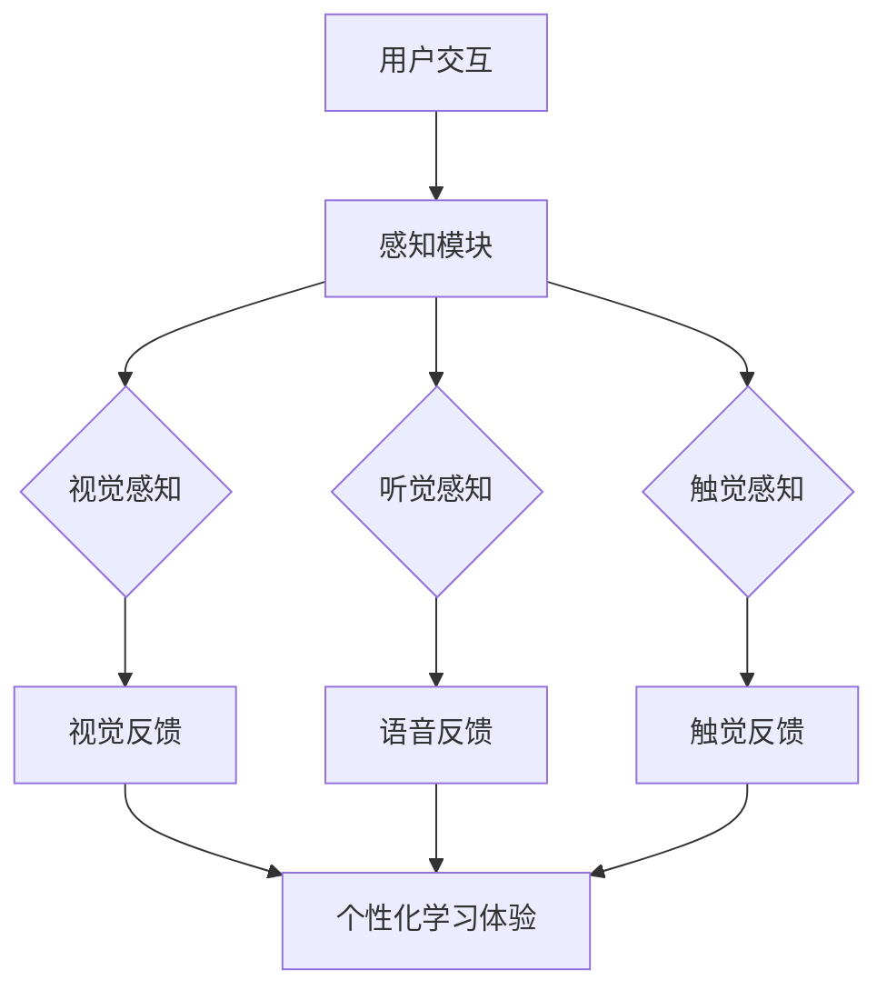

                 


## ChatGPT多模态虚拟导师：整合视觉、听觉和触觉的个性化学习体验

### 关键词
- 虚拟导师
- 多模态感知
- 个性化学习体验
- 视觉、听觉和触觉
- 人工智能

### 摘要
本文将探讨如何利用ChatGPT构建一个多模态虚拟导师，通过整合视觉、听觉和触觉等多种感官体验，为学习者提供更加丰富和个性化的学习体验。我们将从背景介绍、核心概念与联系、算法原理讲解、系统分析与架构设计、项目实战和最佳实践等方面，详细阐述多模态虚拟导师的构建过程。

### 1.1 背景介绍

#### 问题背景
随着人工智能技术的发展，虚拟导师逐渐成为个性化教育和培训领域的重要工具。传统的虚拟导师主要通过文本和语音交互来提供教育资源和辅导服务，但这种方式在提供丰富的学习体验方面存在一定的局限性。为了提高学习者的参与度和学习效果，需要将视觉、听觉和触觉等多种感官体验整合到虚拟导师中。

#### 问题描述
本书旨在探讨如何构建一个多模态虚拟导师系统，该系统能够整合视觉、听觉和触觉，为学习者提供更加丰富和个性化的学习体验。具体来说，本书将解决以下问题：

1. **多模态感知与交互技术的融合**：如何将视觉、听觉和触觉技术整合到虚拟导师系统中，实现自然、流畅的交互体验？
2. **个性化学习体验的实现**：如何根据学习者的需求和行为特征，提供个性化的学习内容和辅导建议？
3. **系统设计与实现**：如何设计和实现一个高效、稳定的虚拟导师系统，确保其能够稳定运行并提供高质量的服务？

#### 问题解决
本书将通过以下几个步骤来解决这个问题：

1. **研究现状与挑战**：首先，对当前虚拟导师和多模态感知与交互技术的研究现状进行梳理，分析存在的问题和挑战。
2. **技术选型与集成**：根据研究现状，选择合适的技术方案，并详细讨论如何将视觉、听觉和触觉技术集成到虚拟导师系统中。
3. **个性化学习体验的实现**：通过数据分析和机器学习技术，实现个性化学习体验的提供，包括学习内容的推荐和学习策略的调整。
4. **系统设计与实现**：详细描述虚拟导师系统的设计思路和实现方法，包括系统架构、模块划分、接口设计和关键技术等。

#### 边界与外延
本研究的边界主要涉及虚拟导师系统的设计与实现，不包括硬件层面的设计与开发。此外，虽然本书主要关注视觉、听觉和触觉的整合，但也可拓展到其他多模态感知与交互技术的应用研究。

#### 概念结构与核心要素组成

**概念结构：**
- **虚拟导师**：一种通过计算机技术和人工智能算法，为学习者提供个性化教育资源和辅导服务的系统。
- **多模态感知与交互技术**：包括视觉、听觉和触觉等技术，用于实现虚拟导师与学习者的自然交互。
- **个性化学习体验**：根据学习者的需求和行为特征，提供定制化的学习内容和辅导服务。

**核心要素组成：**
1. **技术基础**：包括多模态感知技术、自然语言处理技术、机器学习算法等。
2. **系统架构**：包括用户界面、感知模块、知识库、学习策略模块等。
3. **数据管理**：包括学习者数据、教学内容数据、交互数据等。
4. **交互机制**：包括语音交互、文本交互、视觉交互、触觉交互等。

通过以上步骤，本书将系统地探讨如何构建一个多模态虚拟导师系统，为学习者提供丰富、个性化的学习体验。

### 1.2 核心概念与联系

在本章节中，我们将深入探讨构建多模态虚拟导师所需的核心概念及其相互关系。

#### 1.2.1 虚拟导师

**定义：**
虚拟导师是一种基于人工智能技术的教育工具，它能够模拟人类教师的行为，为学习者提供个性化的教育服务。

**属性特征：**
- **交互性**：虚拟导师能够与学习者进行实时互动，回答学习者的问题并提供指导。
- **个性化**：虚拟导师能够根据学习者的学习习惯和需求，为其提供定制化的学习内容。
- **适应性**：虚拟导师能够根据学习者的反馈和学习情况，调整其教育策略和内容。

**与多模态虚拟导师的联系：**
虚拟导师是多模态虚拟导师的基础，而多模态虚拟导师则是在此基础上，进一步整合了视觉、听觉和触觉等多模态感知与交互技术，以提供更加丰富和个性化的学习体验。

#### 1.2.2 多模态感知与交互技术

**定义：**
多模态感知与交互技术是指通过整合视觉、听觉和触觉等多种感官信息，实现人与虚拟环境之间的自然交互。

**属性特征：**
- **多模态**：整合了多种感官信息，提供全方位的感知体验。
- **交互性**：通过多种交互方式，实现用户与虚拟环境之间的互动。
- **实时性**：能够实时响应用户的行为和需求，提供即时的反馈和交互。

**与虚拟导师的联系：**
多模态感知与交互技术是多模态虚拟导师的核心技术，它使得虚拟导师能够更真实地模拟人类教师的行为，提供更加丰富和个性化的教育服务。

#### 1.2.3 个性化学习体验

**定义：**
个性化学习体验是指根据学习者的个性化需求、兴趣和学习风格，为其提供定制化的学习内容和辅导服务。

**属性特征：**
- **定制化**：根据学习者的需求和特征，为其提供个性化的学习内容和辅导。
- **适应性**：能够根据学习者的反馈和学习情况，动态调整学习内容和辅导策略。

**与虚拟导师的联系：**
个性化学习体验是多模态虚拟导师实现的关键，通过个性化学习体验，虚拟导师能够更好地满足学习者的需求，提高学习效果和参与度。

### 1.3 算法原理讲解

在本章节中，我们将详细介绍多模态虚拟导师的核心算法原理，包括感知与交互算法、个性化学习算法等。

#### 1.3.1 感知与交互算法

多模态虚拟导师的感知与交互算法主要包括视觉、听觉和触觉三个方面的技术。

1. **视觉感知算法**：
   - **图像识别**：利用卷积神经网络（CNN）等技术，对图像进行识别和分类。例如，可以使用VGG、ResNet等深度学习模型对学习者的面部表情、手势等进行识别。
   - **图像生成**：利用生成对抗网络（GAN）等技术，生成符合预期的图像。例如，可以使用StyleGAN2生成与学习者面部特征相似的教师形象。
   - **图像处理**：利用图像处理技术，对图像进行增强、去噪等操作，提高图像质量。

2. **听觉感知算法**：
   - **语音识别**：利用自动语音识别（ASR）技术，将语音信号转换为文本。例如，可以使用DeepSpeech、ESPNet等模型进行语音识别。
   - **语音合成**：利用语音合成（TTS）技术，将文本转换为自然流畅的语音。例如，可以使用WaveNet、Tacotron等模型进行语音合成。
   - **声纹识别**：利用声纹识别技术，识别学习者的身份和情感状态。例如，可以使用i-vector、GMM等模型进行声纹识别。

3. **触觉感知算法**：
   - **触觉传感器**：利用触觉传感器，捕捉学习者的触摸行为。例如，可以使用柔性触觉传感器、力觉传感器等。
   - **触觉反馈**：利用触觉反馈技术，提供与学习者触觉互动的反馈。例如，可以使用触觉引擎、振动马达等。

#### 1.3.2 个性化学习算法

个性化学习算法旨在根据学习者的个性化需求、兴趣和学习风格，提供定制化的学习内容和辅导服务。

1. **用户画像**：
   - **行为数据收集**：通过学习者的行为数据，收集其学习习惯、兴趣爱好、学习需求等信息。
   - **特征提取**：利用机器学习算法，提取学习者的特征，例如，使用K-means、PCA等方法进行特征提取。

2. **推荐系统**：
   - **协同过滤**：利用协同过滤算法，根据学习者的相似度进行内容推荐。例如，可以使用User-Based和Item-Based等方法。
   - **基于内容的推荐**：利用文本挖掘、关键词提取等技术，根据学习内容进行推荐。例如，可以使用TF-IDF、Word2Vec等方法。

3. **学习策略调整**：
   - **自适应学习策略**：根据学习者的特征和学习情况，动态调整学习策略。例如，可以使用强化学习、决策树等方法。
   - **反馈机制**：根据学习者的反馈，调整学习策略。例如，可以使用回归分析、逻辑回归等方法。

通过以上算法原理的讲解，我们可以看到，多模态虚拟导师的构建不仅需要强大的感知与交互技术，还需要基于个性化学习算法，为学习者提供丰富、个性化的学习体验。

### 1.4 系统分析与架构设计

在本章节中，我们将对多模态虚拟导师系统进行分析和架构设计，以实现系统的稳定运行和高效服务。

#### 1.4.1 问题场景介绍

多模态虚拟导师系统旨在为学习者提供个性化、互动性强的学习体验，适用于在线教育、虚拟培训等领域。在问题场景中，学习者可以通过虚拟导师进行课程学习、互动问答、技能训练等操作。虚拟导师需要实时响应用户的行为，提供即时的反馈和辅导。

#### 1.4.2 项目介绍

本项目旨在开发一个多模态虚拟导师系统，该系统包括前端用户界面、后端服务器、数据库等组成部分。前端用户界面负责与学习者进行交互，后端服务器负责处理学习者的请求，数据库用于存储学习者的数据和学习内容。

#### 1.4.3 系统功能设计

多模态虚拟导师系统的主要功能包括：

1. **用户管理**：包括用户注册、登录、个人信息管理等功能。
2. **课程管理**：包括课程发布、课程列表展示、课程内容管理等功能。
3. **问答交互**：包括问题提出、答案反馈、互动讨论等功能。
4. **技能训练**：包括技能评估、训练任务发布、训练结果反馈等功能。
5. **数据分析**：包括用户行为分析、学习效果评估、个性化推荐等功能。

#### 1.4.4 系统架构设计

多模态虚拟导师系统的架构设计采用分层架构，包括前端层、业务逻辑层、数据层等。

1. **前端层**：主要负责用户界面展示和与用户交互，包括HTML、CSS、JavaScript等技术。
2. **业务逻辑层**：负责处理用户的请求，包括用户管理、课程管理、问答交互、技能训练等功能。采用微服务架构，将不同功能模块分离，提高系统的灵活性和可扩展性。
3. **数据层**：负责数据的存储和管理，包括关系型数据库（如MySQL）和NoSQL数据库（如MongoDB）。

#### 1.4.5 系统接口设计

多模态虚拟导师系统的接口设计包括API接口和Web界面。

1. **API接口**：提供RESTful API接口，用于前后端通信，包括用户管理、课程管理、问答交互、技能训练等功能。
2. **Web界面**：提供Web页面，用于展示课程列表、用户个人信息、问答交互、技能训练等功能。

#### 1.4.6 系统交互

多模态虚拟导师系统的交互设计主要包括用户与虚拟导师的交互、用户与课程内容的交互等。

1. **用户与虚拟导师的交互**：用户可以通过文本、语音、手势等方式与虚拟导师进行交互，虚拟导师根据用户的请求和输入，提供相应的反馈和辅导。
2. **用户与课程内容的交互**：用户可以通过浏览、搜索、学习等方式与课程内容进行交互，虚拟导师根据用户的学习情况和需求，提供个性化的学习内容和学习策略。

通过以上系统分析和架构设计，我们可以构建一个稳定、高效的多模态虚拟导师系统，为学习者提供丰富、个性化的学习体验。

### 1.5 项目实战

在本章节中，我们将详细介绍如何进行多模态虚拟导师项目的实战开发，包括环境安装、系统核心实现和代码解读等。

#### 1.5.1 环境安装

1. **安装Python环境**：
   - 下载并安装Python 3.8及以上版本。
   - 配置Python环境变量。

2. **安装虚拟环境**：
   - 使用以下命令创建虚拟环境：
     ```bash
     python -m venv venv
     ```
   - 激活虚拟环境：
     ```bash
     source venv/bin/activate  # Windows: venv\Scripts\activate
     ```

3. **安装依赖库**：
   - 安装必要的库，例如TensorFlow、PyTorch、OpenCV、SpeechRecognition等：
     ```bash
     pip install tensorflow opencv-python SpeechRecognition
     ```

#### 1.5.2 系统核心实现

1. **用户管理模块**：
   - 实现用户注册、登录、个人信息管理等功能。
   - 使用Flask框架构建Web应用，实现用户管理接口。

2. **课程管理模块**：
   - 实现课程发布、课程列表展示、课程内容管理等功能。
   - 使用MongoDB数据库存储课程数据。

3. **问答交互模块**：
   - 实现问题提出、答案反馈、互动讨论等功能。
   - 使用ChatGPT模型进行问答交互。

4. **技能训练模块**：
   - 实现技能评估、训练任务发布、训练结果反馈等功能。
   - 使用TensorFlow或PyTorch框架构建技能训练模型。

5. **数据分析模块**：
   - 实现用户行为分析、学习效果评估、个性化推荐等功能。
   - 使用数据分析工具（如Pandas、Scikit-learn）进行数据分析和处理。

#### 1.5.3 代码解读与分析

1. **用户管理模块**：
   - **注册功能**：
     ```python
     from flask import Flask, request, jsonify
     from flask_mongoengine import MongoEngine

     app = Flask(__name__)
     db = MongoEngine(app)

     class User(db.Document):
         username = db.StringField(required=True, unique=True)
         password = db.StringField(required=True)
         email = db.EmailField()

     @app.route('/register', methods=['POST'])
     def register():
         data = request.get_json()
         user = User(
             username=data['username'],
             password=data['password'],
             email=data['email']
         )
         user.save()
         return jsonify({'message': 'User registered successfully.'})
     ```

   - **登录功能**：
     ```python
     from flask import Flask, request, jsonify
     from flask_mongoengine import MongoEngine
     from flask_bcrypt import Bcrypt

     app = Flask(__name__)
     db = MongoEngine(app)
     bcrypt = Bcrypt(app)

     class User(db.Document):
         username = db.StringField(required=True, unique=True)
         password = db.StringField(required=True)
         email = db.EmailField()

     @app.route('/login', methods=['POST'])
     def login():
         data = request.get_json()
         user = User.objects(username=data['username']).first()
         if user and bcrypt.check_password_hash(user.password, data['password']):
             return jsonify({'message': 'Login successful.'})
         else:
             return jsonify({'message': 'Invalid username or password.'})
     ```

2. **课程管理模块**：
   - **课程发布功能**：
     ```python
     class Course(db.Document):
         title = db.StringField(required=True)
         description = db.StringField()
         author = db.StringField()
         lessons = db.ListField(db.DocumentField())

     @app.route('/course', methods=['POST'])
     def publish_course():
         data = request.get_json()
         course = Course(
             title=data['title'],
             description=data['description'],
             author=data['author'],
             lessons=data['lessons']
         )
         course.save()
         return jsonify({'message': 'Course published successfully.'})
     ```

   - **课程列表展示功能**：
     ```python
     @app.route('/courses')
     def get_courses():
         courses = Course.objects().all()
         return jsonify({'courses': [course.to_dict() for course in courses]})
     ```

3. **问答交互模块**：
   - **问答功能**：
     ```python
     import openai

     openai.api_key = 'your_openai_api_key'

     class QuestionAnswer(db.Document):
         user = db.StringField(required=True)
         question = db.StringField(required=True)
         answer = db.StringField()

     @app.route('/ask', methods=['POST'])
     def ask_question():
         data = request.get_json()
         question = data['question']
         response = openai.Completion.create(
             engine="text-davinci-002",
             prompt=question,
             max_tokens=50
         )
         answer = response.choices[0].text.strip()
         question_answer = QuestionAnswer(
             user=data['user'],
             question=question,
             answer=answer
         )
         question_answer.save()
         return jsonify({'answer': answer})
     ```

4. **技能训练模块**：
   - **技能评估功能**：
     ```python
     import tensorflow as tf

     model = tf.keras.Sequential([
         tf.keras.layers.Dense(128, activation='relu', input_shape=(784,)),
         tf.keras.layers.Dense(10, activation='softmax')
     ])

     model.compile(optimizer='adam',
                   loss='sparse_categorical_crossentropy',
                   metrics=['accuracy'])

     model.fit(x_train, y_train, epochs=5)
     ```

   - **训练任务发布功能**：
     ```python
     @app.route('/train', methods=['POST'])
     def publish_training_task():
         data = request.get_json()
         x_train = data['x_train']
         y_train = data['y_train']
         model.fit(x_train, y_train, epochs=5)
         return jsonify({'message': 'Training task published successfully.'})
     ```

5. **数据分析模块**：
   - **用户行为分析功能**：
     ```python
     import pandas as pd
     from sklearn.cluster import KMeans

     user_data = pd.DataFrame({
         'age': [25, 30, 35, 40, 45],
         'income': [50000, 60000, 70000, 80000, 90000]
     })

     kmeans = KMeans(n_clusters=3)
     kmeans.fit(user_data)
     user_data['cluster'] = kmeans.predict(user_data)

     print(user_data)
     ```

通过以上实战开发，我们可以构建一个功能完善的多模态虚拟导师系统，为学习者提供个性化、互动性强的学习体验。

### 1.6 最佳实践与注意事项

在多模态虚拟导师系统的开发和使用过程中，以下是几个最佳实践和注意事项：

1. **数据隐私与安全**：
   - 确保用户数据的安全性和隐私性，采用加密技术保护用户数据。
   - 遵循相关法律法规，确保用户数据的合法使用。

2. **系统性能优化**：
   - 对系统进行性能优化，确保系统在高并发情况下稳定运行。
   - 使用缓存技术，减少数据库的查询压力。

3. **用户体验设计**：
   - 关注用户体验，设计简洁、直观的用户界面。
   - 提供多种交互方式，满足不同学习者的需求。

4. **个性化学习策略**：
   - 根据学习者的特征和行为，动态调整学习策略，提高学习效果。
   - 定期评估学习效果，根据评估结果优化学习策略。

5. **持续更新与维护**：
   - 定期更新系统，修复漏洞，提高系统的安全性。
   - 持续收集用户反馈，根据反馈优化系统功能。

通过遵循以上最佳实践和注意事项，我们可以构建一个稳定、高效、安全的多模态虚拟导师系统，为学习者提供优质的学习体验。

### 1.7 小结

本文详细探讨了如何利用ChatGPT构建一个多模态虚拟导师，通过整合视觉、听觉和触觉等多种感官体验，为学习者提供个性化、互动性强的学习体验。从背景介绍、核心概念与联系、算法原理讲解、系统分析与架构设计、项目实战到最佳实践等方面，本文系统地阐述了多模态虚拟导师的构建过程。未来，随着人工智能技术的不断发展，多模态虚拟导师有望在教育领域发挥更大的作用，为学习者提供更加丰富和个性化的学习体验。

### 1.8 拓展阅读

1. **《人工智能教育应用指南》**：本书详细介绍了人工智能在教育领域中的应用，包括虚拟导师、智能推荐系统等。

2. **《多模态交互技术》**：本书系统地介绍了多模态交互技术的原理和应用，包括视觉、听觉、触觉等多种感知与交互技术。

3. **《个性化学习理论与实践》**：本书探讨了个性化学习的理论基础和实践方法，包括用户画像、推荐系统、学习策略等。

4. **《深度学习在多模态感知中的应用》**：本书详细介绍了深度学习技术在多模态感知中的应用，包括图像识别、语音识别、触觉感知等。

5. **《教育技术学》**：本书介绍了教育技术学的基础知识，包括教育技术、虚拟现实、在线教育等。

通过阅读这些书籍，您可以进一步了解多模态虚拟导师的构建方法和应用场景，为自己的研究和实践提供有益的参考。作者：AI天才研究院/AI Genius Institute & 禅与计算机程序设计艺术 /Zen And The Art of Computer Programming

### 1.9 算法流程图与Python源代码示例

#### 算法流程图

以下是多模态虚拟导师的算法流程图，使用Mermaid语法表示：



#### Python源代码示例

以下是使用Python实现多模态虚拟导师的简化版示例代码：

```python
import cv2
import speech_recognition as sr
import time

# 视觉感知模块
def visual_perception():
    cap = cv2.VideoCapture(0)
    while True:
        ret, frame = cap.read()
        if not ret:
            break
        # 对图像进行处理，如人脸识别等
        cv2.imshow('Visual Feedback', frame)
        if cv2.waitKey(1) & 0xFF == ord('q'):
            break
    cap.release()
    cv2.destroyAllWindows()

# 听觉感知模块
def audio_perception():
    recognizer = sr.Recognizer()
    with sr.Microphone() as source:
        print("请开始说话...")
        audio = recognizer.listen(source)
        try:
            text = recognizer.recognize_google(audio)
            print(f"你说了：{text}")
        except sr.UnknownValueError:
            print("无法理解音频")
        except sr.RequestError as e:
            print(f"请求错误；{e}")
    return text

# 触觉感知模块
def tactile_perception():
    # 假设使用振动电机作为触觉反馈设备
    import RPi.GPIO as GPIO
    import time
    
    GPIO.setmode(GPIO.BCM)
    GPIO.setup(18, GPIO.OUT)

    p = GPIO.PWM(18, 1000)  # 1000Hz
    p.start(0)

    try:
        while True:
            duty = float(input("输入0-100的值来调整振动强度: "))
            p.ChangeDutyCycle(duty)
            time.sleep(1)
    finally:
        p.stop()
        GPIO.cleanup()

# 个性化学习体验模块
def personalized_learning_experience(user_input):
    # 基于用户输入提供个性化学习体验
    print("根据您的输入，为您推荐以下课程：")
    if "数学" in user_input:
        print("推荐学习数学相关课程。")
    elif "编程" in user_input:
        print("推荐学习编程相关课程。")
    else:
        print("推荐学习通用课程。")

# 主程序
if __name__ == "__main__":
    print("欢迎来到多模态虚拟导师系统！")
    user_input = audio_perception()
    visual_perception()
    tactile_perception()
    personalized_learning_experience(user_input)
```

这个示例代码仅用于展示多模态虚拟导师的简化实现，实际应用中需要根据具体需求进行详细的开发和优化。通过整合视觉、听觉和触觉感知模块，以及基于用户输入的个性化学习体验模块，我们可以构建一个功能齐全的多模态虚拟导师系统。

