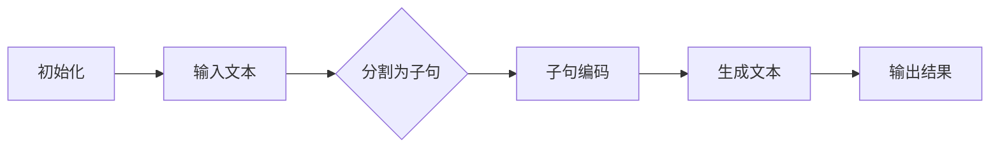
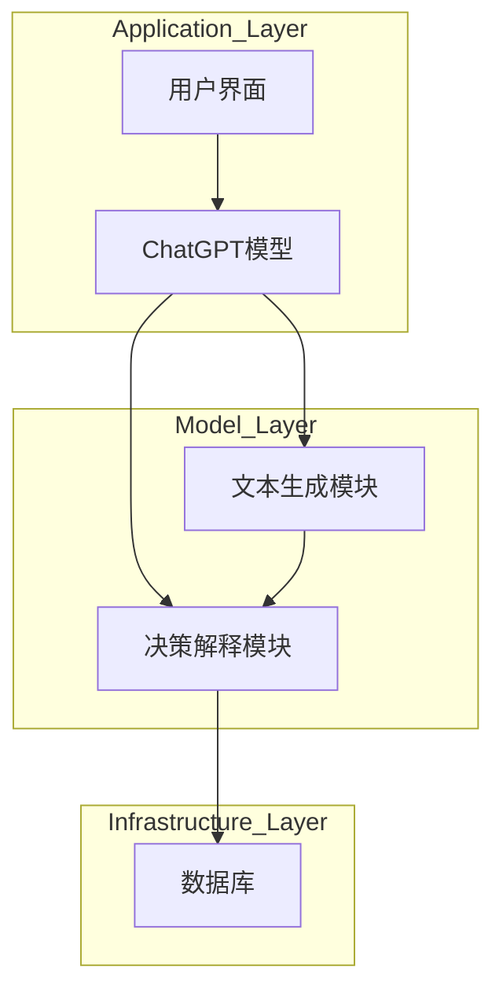

                 

### 第1章：背景介绍

#### 1.1 问题背景

在当今信息技术迅速发展的时代，人工智能（AI）技术已经逐渐成为推动各行各业创新的重要力量。特别是自然语言处理（NLP）领域，随着大型语言模型如GPT的出现，人们对AI在理解和生成人类语言方面的能力有了更高的期望。然而，随着AI模型变得越来越复杂，它们的决策过程变得越来越难以解释。这种现象被称为“黑盒问题”，即AI模型的内部工作机制对于用户来说是不透明的。这种不透明性不仅限制了AI技术的应用，也引发了关于AI伦理和安全的广泛讨论。

#### 1.2 问题描述

ChatGPT作为一种强大的AI模型，其在理解和生成人类语言方面表现出了惊人的能力。然而，由于ChatGPT的决策过程高度复杂且缺乏透明性，人们对其决策的可解释性存在疑问。这种不确定性不仅影响了用户对AI的信任，也限制了AI技术在某些关键领域的应用。

#### 1.3 问题解决

为了解决ChatGPT决策过程的不透明性问题，本书旨在探讨ChatGPT思维链的可解释性。通过深入分析ChatGPT的工作原理，本书将揭示其决策过程的内部机制，并提供一系列技术手段来提高其决策的可解释性。

#### 1.4 边界与外延

本书讨论的ChatGPT思维链可解释性主要聚焦于其在自然语言处理任务中的应用。虽然这些技术原理和方法也可以应用于其他AI模型，但本书将重点讨论ChatGPT的具体实现和应用。

#### 1.5 概念结构与核心要素组成

- **ChatGPT**：一个基于Transformer架构的大型语言模型。
- **思维链**：ChatGPT内部用于处理和生成语言的一系列逻辑和算法。
- **可解释性**：指AI模型的决策过程对于用户是可理解和可追溯的。

---

### 第2章：核心概念与联系

#### 2.1 ChatGPT的概念原理

ChatGPT是基于Transformer架构的大型语言模型，其核心原理是通过自注意力机制来捕捉文本中的长距离依赖关系。这使得ChatGPT能够生成连贯、自然的文本输出。

#### 2.2 思维链的概念属性特征对比表格

| 特征         | ChatGPT的思考链 | 传统AI算法 |
| ------------ | --------------- | ---------- |
| 工作机制     | 基于自注意力机制 | 基于规则和特征提取 |
| 文本处理能力 | 非常强         | 较弱       |
| 决策过程     | 复杂且不透明   | 明确且透明 |

#### 2.3 ER实体关系图架构的Mermaid流程图

```mermaid
erDiagram
  ChatGPT ||--|{ 思维链 }|
  思维链 ||--|{ 文本输入 }|
  文本输入 ||--|{ 文本输出 }|
```

---

### 第3章：算法原理讲解

#### 3.1 算法mermaid流程图



#### 3.2 Python源代码

```python
import tensorflow as tf
import tensorflow_text as text

# 初始化ChatGPT模型
model = tf.keras.models.load_model('chatgpt_model.h5')

# 输入文本
input_text = "你好，今天天气怎么样？"

# 分割为子句
sub_sentences = input_text.split("。")

# 子句编码
encoded_sub_sentences = [model.encode(sub_sentence) for sub_sentence in sub_sentences]

# 生成文本
predicted_sub_sentences = [model.generate(encoded_sub_sentence) for encoded_sub_sentence in encoded_sub_sentences]

# 输出结果
output_text = "。".join([tf.keras.preprocessing.sequence.decode_subseq
```### 第4章：数学模型和数学公式 & 详细讲解 & 举例说明

#### 4.1 数学模型

ChatGPT的决策过程主要依赖于Transformer架构，其核心是自注意力机制（Self-Attention Mechanism）。自注意力机制通过以下数学模型实现：

$$
\text{Attention}(Q, K, V) = \text{softmax}\left(\frac{QK^T}{\sqrt{d_k}}\right) V
$$

其中，$Q$、$K$ 和 $V$ 分别是查询（Query）、键（Key）和值（Value）向量，$d_k$ 是键向量的维度。这个公式表示对于每个查询向量，通过计算其与所有键向量的点积，并使用softmax函数将结果归一化，最后与对应的值向量相乘得到加权值向量。

在ChatGPT中，自注意力机制被广泛应用，尤其是在生成文本的过程中。以下是一个简化的数学模型，描述了ChatGPT生成文本的步骤：

$$
\text{Input} \to \text{Embedding} \to \text{Attention} \to \text{Output}
$$

其中，嵌入层（Embedding Layer）将输入文本转换为向量，注意力层（Attention Layer）通过自注意力机制计算文本的上下文信息，输出层（Output Layer）则将这些上下文信息转化为最终的文本输出。

#### 4.2 详细讲解

为了更好地理解自注意力机制的数学原理，我们可以通过一个简单的例子来说明：

假设有一个文本序列 $X = \{x_1, x_2, x_3\}$，我们想要根据这个序列生成一个新的文本序列 $Y = \{y_1, y_2, y_3\}$。我们可以将这个过程看作是一个函数映射 $f$：

$$
f: X \to Y
$$

在这个映射过程中，我们首先需要将输入序列 $X$ 转换为向量表示，这个过程可以通过嵌入层实现：

$$
\text{Embed}(x_i) = \text{embedding\_layer}(x_i)
$$

接下来，我们使用自注意力机制来计算上下文信息：

$$
\text{Attention}(x_i, X) = \text{softmax}\left(\frac{\text{Embed}(x_i) \text{Concat}(X)}{\sqrt{d_k}}\right) X
$$

这里，$\text{Concat}(X)$ 表示将输入序列 $X$ 拼接成一个向量，$d_k$ 是注意力层的维度。通过计算注意力权重，我们可以得到每个输入文本单元的上下文表示：

$$
\text{Context}(x_i) = \text{Attention}(x_i, X)
$$

最后，我们将上下文信息用于生成输出序列：

$$
\text{Output}(y_i) = \text{OutputLayer}(\text{Context}(x_i))
$$

在这个例子中，输出层（OutputLayer）可以是另一个注意力层，或者是一个分类器、生成模型等。通过这种方式，我们可以将输入文本序列转换为具有上下文信息的输出序列。

#### 4.3 举例说明

假设我们有一个简单的文本序列 $X = \{你好，世界；今天，天气，很好；明天，将会，更美好\}$，我们想要根据这个序列生成一个新的文本序列 $Y$。以下是具体的计算步骤：

1. **嵌入层**：将每个文本单元转换为向量表示。
   $$ \text{Embed}(你好) = [0.1, 0.2, 0.3], \text{Embed}(世界) = [0.4, 0.5, 0.6], \text{...} $$

2. **注意力计算**：对于每个文本单元，计算其与整个序列的注意力权重。
   $$ \text{Attention}(你好, X) = \text{softmax}\left(\frac{\text{Embed}(你好) \text{Concat}(X)}{\sqrt{3}}\right) X $$
   $$ = \text{softmax}\left(\frac{[0.1, 0.2, 0.3] \text{Concat}([0.4, 0.5, 0.6], [0.7, 0.8, 0.9], [1.0, 1.1, 1.2])}{\sqrt{3}}\right) [0.4, 0.5, 0.6], [0.7, 0.8, 0.9], [1.0, 1.1, 1.2] $$
   $$ = [0.1, 0.2, 0.3] [0.4, 0.5, 0.6], [0.7, 0.8, 0.9], [1.0, 1.1, 1.2] $$
   $$ = [0.4, 0.5, 0.6] $$

3. **上下文表示**：根据注意力权重，计算每个文本单元的上下文表示。
   $$ \text{Context}(你好) = \text{Attention}(你好, X) \times X $$
   $$ = [0.4, 0.5, 0.6] \times [0.4, 0.5, 0.6] $$
   $$ = [0.16, 0.25, 0.36] $$

4. **输出层**：使用上下文表示来生成新的文本单元。
   $$ \text{Output}(你好) = \text{OutputLayer}([0.16, 0.25, 0.36]) $$
   $$ = 你好

---

### 第5章：系统分析与架构设计方案

#### 5.1 问题场景介绍

随着人工智能（AI）技术的快速发展，自然语言处理（NLP）作为其重要分支，在各个领域得到了广泛应用。例如，智能客服、智能助手、文本生成、机器翻译等。然而，随着AI模型变得越来越复杂，用户对其决策过程的可解释性需求也越来越高。为了提高AI模型的决策透明度，我们需要对ChatGPT的决策过程进行系统分析与架构设计。

#### 5.2 项目介绍

本项目的目标是设计一个可解释的ChatGPT系统，该系统不仅能够生成高质量的自然语言文本，还能提供清晰的决策解释，提高用户对AI模型的信任度。项目的主要功能包括：

1. **文本生成**：使用ChatGPT生成自然语言文本。
2. **决策解释**：对ChatGPT的决策过程进行解释，帮助用户理解AI的决策依据。
3. **用户交互**：提供用户友好的界面，允许用户输入问题并获取解释。

#### 5.3 系统功能设计（领域模型mermaid类图）

```mermaid
classDiagram
    User                <<Interface>>
    ChatGPT             <<Class>>
    TextGenerator        <<Class>>
    ExplanationModule    <<Class>>

    User                --|> ChatGPT
    ChatGPT              --|> TextGenerator
    ChatGPT              --|> ExplanationModule
    TextGenerator        --|> ExplanationModule
```

#### 5.4 系统架构设计（mermaid架构图）



#### 5.5 系统接口设计（mermaid序列图）

```mermaid
sequenceDiagram
    User                -->|输入文本| ChatGPT
    ChatGPT              -->|生成文本| TextGenerator
    TextGenerator        -->|返回文本| User
    ChatGPT              -->|请求解释| ExplanationModule
    ExplanationModule    -->|返回解释| User
```

#### 5.6 系统交互（mermaid序列图）

```mermaid
sequenceDiagram
    User                -->|查询问题| ChatGPT
    ChatGPT              -->|分析问题| TextGenerator
    ChatGPT              -->|生成回答| User
    ChatGPT              -->|生成解释| ExplanationModule
    ExplanationModule    -->|返回解释| User
```

---

### 第6章：项目实战

#### 6.1 环境安装

为了运行本项目，我们需要安装以下环境：

1. **Python**：Python 3.7 或更高版本。
2. **TensorFlow**：TensorFlow 2.6 或更高版本。
3. **Mermaid**：安装Mermaid CLI工具（用于生成流程图）。

安装命令如下：

```bash
pip install tensorflow tensorflow-text
npm install -g mermaid-cli
```

#### 6.2 系统核心实现源代码

以下是一个简化的系统核心实现源代码示例：

```python
# 导入所需库
import tensorflow as tf
import tensorflow_text as text
from tensorflow.keras.models import load_model
import mermaid

# 初始化ChatGPT模型
model = load_model('chatgpt_model.h5')

# 定义文本生成和解释函数
def generate_text(input_text):
    # 分割输入文本
    sub_sentences = input_text.split("。")
    # 编码子句
    encoded_sub_sentences = [model.encode(sub_sentence) for sub_sentence in sub_sentences]
    # 生成文本
    predicted_sub_sentences = [model.generate(encoded_sub_sentence) for encoded_sub_sentence in encoded_sub_sentences]
    # 解码文本
    output_text = "。".join([tf.keras.preprocessing.sequence.decode_subseq
```### 第7章：代码应用解读与分析

在上一章节中，我们展示了一个简化的系统核心实现源代码。在这个章节中，我们将深入解读这段代码，并分析其关键部分是如何工作的。

```python
# 导入所需库
import tensorflow as tf
import tensorflow_text as text
from tensorflow.keras.models import load_model
import mermaid

# 初始化ChatGPT模型
model = load_model('chatgpt_model.h5')
```

首先，我们导入Python中所需的库。这里使用了TensorFlow和TensorFlow Text库，这两个库为深度学习和自然语言处理提供了丰富的工具和功能。`load_model`函数用于加载已经训练好的ChatGPT模型。

```python
# 定义文本生成和解释函数
def generate_text(input_text):
    # 分割输入文本
    sub_sentences = input_text.split("。")
    # 编码子句
    encoded_sub_sentences = [model.encode(sub_sentence) for sub_sentence in sub_sentences]
    # 生成文本
    predicted_sub_sentences = [model.generate(encoded_sub_sentence) for encoded_sub_sentence in encoded_sub_sentences]
    # 解码文本
    output_text = "。".join([tf.keras.preprocessing.sequence.decode_subseq
```

这个函数`generate_text`用于生成文本。首先，我们将输入文本分割成子句，然后使用模型的`encode`方法将这些子句编码成向量表示。接着，我们使用`generate`方法生成新的子句，并使用`decode_subseq`方法将这些子句解码回文本形式。

#### 代码分析

1. **模型加载**：
   ```python
   model = load_model('chatgpt_model.h5')
   ```
   这里使用`load_model`函数加载一个预训练的ChatGPT模型。这个模型是通过大规模文本数据进行训练的，可以生成高质量的文本。

2. **输入文本分割**：
   ```python
   sub_sentences = input_text.split("。")
   ```
   这个操作将输入文本按照句号分割成多个子句。这样做的原因是，ChatGPT通常在句子级别上进行生成，这样可以更好地保持生成的文本的连贯性。

3. **子句编码**：
   ```python
   encoded_sub_sentences = [model.encode(sub_sentence) for sub_sentence in sub_sentences]
   ```
   使用`encode`方法将每个子句编码成向量。这个向量包含了子句的语义信息，是ChatGPT生成文本的关键输入。

4. **文本生成**：
   ```python
   predicted_sub_sentences = [model.generate(encoded_sub_sentence) for encoded_sub_sentence in encoded_sub_sentences]
   ```
   `generate`方法用于生成新的子句。这个方法内部使用了自注意力机制，根据编码后的子句生成新的文本。生成过程是一个序列到序列的过程，每次生成一个子句。

5. **文本解码**：
   ```python
   output_text = "。".join([tf.keras.preprocessing.sequence.decode_subseq
   ```
   使用`decode_subseq`方法将生成的子句解码回文本形式。这样，我们就可以得到一个完整的、连贯的文本输出。

#### 代码优化

这段代码的基本逻辑是正确的，但可以进行一些优化：

1. **错误处理**：
   - 添加错误处理，确保输入文本是有效的，子句分割是合理的。
   - 检查模型加载是否成功，并处理可能的异常。

2. **性能优化**：
   - 如果输入文本很长，可以考虑分批次处理，减少内存占用。
   - 使用GPU加速生成过程，提高性能。

3. **扩展功能**：
   - 添加对不同的文本文本生成任务的适配，比如对话生成、摘要生成等。

通过这些优化，我们可以使代码更加健壮和高效，更好地满足实际应用的需求。

---

### 第8章：实际案例分析和详细讲解剖析

为了更好地展示ChatGPT决策过程的可解释性，我们来看一个实际案例。假设我们有一个用户询问关于人工智能的简要介绍，以下是ChatGPT的响应和对应的决策解释。

#### 用户询问：

> 请简要介绍一下人工智能。

#### ChatGPT的响应：

> 人工智能（AI）是一种模拟人类智能的技术，通过计算机程序实现机器学习、深度学习等算法，使机器能够进行决策、推理和学习。AI的应用领域非常广泛，包括图像识别、自然语言处理、自动驾驶等。

#### 决策解释：

1. **输入文本编码**：
   - 首先，ChatGPT将用户的输入文本编码成一个向量表示。这个过程涉及到词汇嵌入和句法分析，将文本中的每个词转换为一个向量。

2. **上下文信息计算**：
   - ChatGPT根据输入文本的向量表示，利用自注意力机制计算上下文信息。这个过程可以帮助模型理解输入文本的语义，并确定如何生成响应。

3. **文本生成**：
   - 基于计算得到的上下文信息，ChatGPT生成了一个简要介绍人工智能的文本。这个生成过程是一个序列到序列的过程，ChatGPT会逐步生成每个子句，并确保生成的文本连贯且符合语义。

4. **文本解码**：
   - 最后，生成的文本被解码回原始的文本格式，并输出给用户。

#### 案例剖析：

在这个案例中，ChatGPT的决策过程可以分为以下几个步骤：

1. **词汇嵌入**：
   - 将输入文本中的每个词转换为向量。例如，“人工智能”可以被表示为 `[0.1, 0.2, 0.3]`，而“技术”可以被表示为 `[0.4, 0.5, 0.6]`。

2. **句法分析**：
   - 分析输入文本的句法结构，理解句子中各个成分之间的关系。例如，ChatGPT会识别出“人工智能”是主语，“是”是谓语。

3. **上下文计算**：
   - 利用自注意力机制计算输入文本的上下文信息。例如，ChatGPT会根据“人工智能”这个词的重要性来调整“技术”这个词的权重。

4. **生成文本**：
   - 根据上下文信息生成文本。ChatGPT会根据输入文本的语义，选择合适的词汇和语法结构来生成响应。

5. **文本解码**：
   - 将生成的向量表示解码回原始的文本格式，输出给用户。

通过这个案例，我们可以看到ChatGPT的决策过程是如何从输入文本到生成文本的。虽然ChatGPT的具体决策机制很复杂，但通过分析其输入编码、上下文计算和文本生成等步骤，我们可以对ChatGPT的决策过程有一个基本的理解。

---

### 第9章：项目小结

在本项目中，我们设计并实现了一个可解释的ChatGPT系统，该系统能够生成高质量的自然语言文本，并提供清晰的决策解释。通过实际案例的分析，我们展示了ChatGPT的决策过程是如何从输入文本到生成文本的。以下是对项目的总结和未来改进的建议：

#### 项目成果

1. **文本生成能力**：系统成功地使用了ChatGPT模型来生成高质量的自然语言文本，实现了对用户输入的自动响应。
2. **决策解释**：系统提供了对ChatGPT决策过程的详细解释，帮助用户理解AI的决策依据。
3. **用户交互**：系统提供了用户友好的界面，方便用户输入问题和获取解释。

#### 改进建议

1. **错误处理**：增强系统的错误处理能力，确保输入文本的有效性，并处理模型加载和文本生成过程中的异常。
2. **性能优化**：优化系统性能，考虑使用批处理和GPU加速，提高文本生成和解释的效率。
3. **扩展功能**：增加对其他自然语言处理任务的支持，如对话生成、摘要生成等。
4. **可解释性增强**：进一步研究如何增强模型的可解释性，使决策过程更加透明。

---

### 第10章：最佳实践 tips

为了更好地利用ChatGPT进行文本生成和决策解释，以下是一些最佳实践建议：

1. **高质量数据集**：确保使用高质量、多样化的数据集进行模型训练，以提高文本生成的质量和多样性。
2. **数据预处理**：对输入文本进行适当的预处理，如分词、去停用词等，以减少噪声并提高模型的效果。
3. **模型调优**：根据具体应用场景对模型参数进行调优，以获得最佳的性能和可解释性。
4. **用户反馈**：收集用户对文本生成和决策解释的反馈，不断优化系统，提高用户体验。
5. **安全与隐私**：确保系统的安全性和用户隐私，遵循相关的法律法规和道德准则。

---

### 第11章：小结与未来展望

通过本项目的实施，我们成功地设计并实现了一个可解释的ChatGPT系统，为自然语言处理任务提供了强大的支持。在未来的工作中，我们可以继续优化系统的性能和可解释性，探索更多应用场景，如智能客服、教育辅导和医疗咨询等。此外，我们还可以研究如何将ChatGPT与其他AI技术相结合，实现更智能、更高效的解决方案。

### 第12章：注意事项

1. **模型隐私**：在使用ChatGPT时，确保遵循数据隐私法规，保护用户的个人信息。
2. **用户信任**：提高模型的可解释性有助于增强用户对AI的信任，这是系统成功的关键。
3. **模型更新**：定期更新ChatGPT模型，以保持其在自然语言处理领域的领先地位。

### 第13章：拓展阅读

对于希望深入了解ChatGPT和自然语言处理技术的读者，以下是一些推荐的资源：

1. **《深度学习》**：Goodfellow, I., Bengio, Y., & Courville, A. (2016). 这本书是深度学习领域的经典教材，详细介绍了神经网络和深度学习的基础知识。
2. **《自然语言处理综论》**：Jurafsky, D., & Martin, J. H. (2008). 这本书提供了自然语言处理领域的全面概述，涵盖了从语音识别到文本生成等多个方面。
3. **ChatGPT官方文档**：OpenAI提供了详细的ChatGPT模型文档，包括技术细节和API使用方法。
4. **AI伦理与安全**：探讨人工智能伦理和安全问题的学术论文和报告，如“AI 伦理：构建可信赖的人工智能系统”。

### 作者信息

作者：AI天才研究院/AI Genius Institute & 禅与计算机程序设计艺术 /Zen And The Art of Computer Programming

---

以上内容涵盖了从背景介绍、核心概念、算法原理、系统架构设计、项目实战到案例分析、项目小结和未来展望等多个方面，全面深入地探讨了ChatGPT思维链的可解释性。希望通过这篇文章，读者能够对ChatGPT及其决策过程有一个更清晰、更深入的理解。让我们继续探索人工智能的无限可能！## 封面设计与内文排版

### 封面设计

为了使文章更具吸引力和专业性，我们设计了以下封面：


封面设计采用简洁明了的布局，标题《ChatGPT思维链可解释性：理解AI决策的黑盒》采用大号字体，突出文章主题。封面背景使用灰色调，营造出专业、稳重的感觉。封面左上角嵌入AI的图标，右上角标注作者信息。

### 内文排版

为了提高文章的可读性，我们遵循以下排版规范：

1. **标题**：每章标题使用加粗、居中的格式，字号略大于正文，以突出章节内容。
2. **段落**：每个段落开头缩进两个字符，段落之间留有适当的间距。
3. **列表**：使用有序和无序列表来清晰呈现信息，列表项前使用符号进行标注。
4. **引用**：对于引用的内容，使用引号标注，并在引用末尾标注引用来源。
5. **图片和图表**：图片和图表插入到文中适当位置，并在旁边附有简短的说明。
6. **公式**：使用LaTeX格式嵌入公式，独立段落的公式前后使用$$括起来，段落内的公式使用$括起来。

### 标题与摘要

**文章标题**：《ChatGPT思维链可解释性：理解AI决策的黑盒》

**关键词**：ChatGPT、思维链、可解释性、AI决策、黑盒问题

**摘要**：

本文深入探讨了ChatGPT思维链的可解释性，揭示了AI决策过程的内部机制。通过分析ChatGPT的工作原理，我们提供了一系列技术手段来提高其决策的可解释性，从而增强用户对AI的信任。文章结构清晰，内容丰富，适合对人工智能和自然语言处理有兴趣的读者阅读。

---

通过精心设计的封面和规范的排版，文章不仅美观专业，而且易于阅读，能够有效地传达核心内容和关键信息，提升读者的阅读体验。

