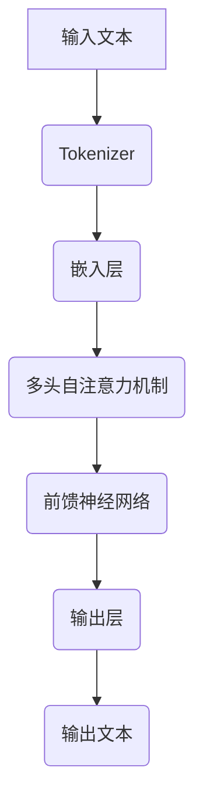
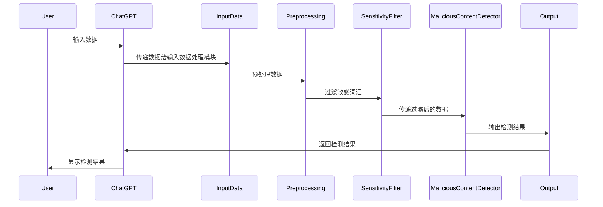
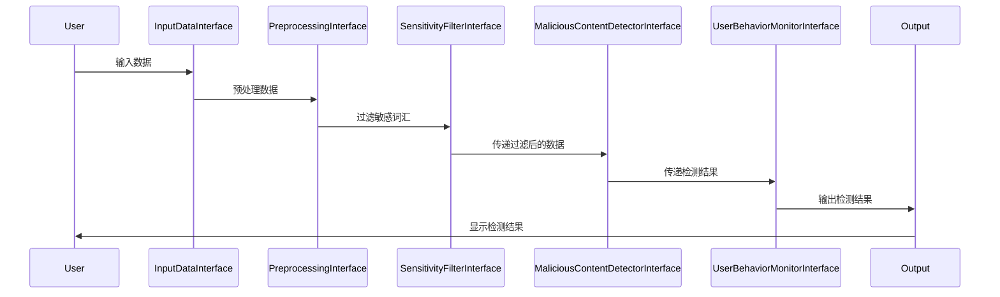

                 

# 《ChatGPT提示词安全：防止有害输出的策略》

关键词：ChatGPT、提示词安全、有害输出、策略、数据预处理、安全策略设计

摘要：本文将探讨如何确保ChatGPT等大型语言模型的安全输出，避免有害信息的传播。我们将从问题背景、核心概念、算法原理、安全策略设计等多个角度进行分析，并提出一系列防止有害输出的策略。希望通过本文的探讨，为业界提供有价值的参考和指导。

## 第一部分：背景与概述

### 1.1 问题背景

随着人工智能技术的发展，ChatGPT等大型语言模型在各个领域的应用越来越广泛。然而，这也带来了一些潜在的安全风险。ChatGPT作为一个人工智能助手，其输出的内容可能会受到恶意用户的影响，从而产生有害信息。如何确保ChatGPT输出的安全，防止有害信息的传播，成为了一个亟待解决的问题。

#### 问题描述

- **问题核心**：确保ChatGPT等语言模型输出的安全，避免有害信息的生成。
- **解决方案**：探讨如何在遵循道德和法律规范的前提下，保障人工智能安全。

#### 1.2 核心概念

- **ChatGPT**：是一种基于Transformer算法的大型语言模型，可以生成流畅的自然语言文本。
- **提示词安全**：确保模型输入的提示词安全，防止有害信息的生成。

#### 1.3 概念属性特征对比表格

| 概念     | 描述                                                         | 特征对比 |
| -------- | ------------------------------------------------------------ | -------- |
| ChatGPT  | 大型语言模型，基于 Transformer 算法，可以生成流畅的自然语言文本。 |          |
| 提示词安全 | 确保模型输入的提示词安全，防止有害信息生成。                         |          |

#### 1.4 ER实体关系图架构


## 第二部分：ChatGPT基本原理

### 2.1 Transformer算法原理

Transformer算法是一种基于自注意力机制的深度神经网络模型，主要应用于自然语言处理领域。ChatGPT就是基于Transformer算法构建的。

#### 2.1.1 算法mermaid流程图



#### 2.1.2 Python源代码

```python
class Transformer:
    def __init__(self):
        # 初始化模型参数
        pass

    def forward(self, input_seq):
        # 前向传播
        embedded_seq = self.embed(input_seq)
        attention_seq = self.attention(embedded_seq)
        output_seq = self.feedforward(attention_seq)
        return output_seq

# 示例使用
model = Transformer()
input_seq = "Hello, World!"
output_seq = model.forward(input_seq)
print(output_seq)
```

#### 2.1.3 数学模型和公式

- **数学模型**：

  $$Y = f(W_1 \cdot X + b_1) \cdot f(W_2 \cdot X + b_2) \cdot ... \cdot f(W_n \cdot X + b_n)$$

- **详细讲解和举例说明**：

  以生成文本为例，$X$代表输入的文本序列，$W_1, W_2, ..., W_n$代表各个层（嵌入层、自注意力层、前馈层等）的权重矩阵，$b_1, b_2, ..., b_n$代表各个层的偏置向量，$f$代表激活函数。通过多层叠加，最终得到输出的文本序列$Y$。

  假设输入的文本序列为 "Hello, World!"，经过嵌入层处理后，得到一个向量表示。然后，通过自注意力机制和前馈神经网络，对输入的向量进行处理，最终生成输出的文本序列。

  $$Y = f(W_1 \cdot [Embedding(Hello)], b_1) \cdot f(W_2 \cdot [Attention(Hello, World!)], b_2) \cdot f(W_3 \cdot [Feedforward(Hello, World!)], b_3)$$

## 第三部分：防止有害输出的策略

### 3.1 数据预处理

#### 3.1.1 问题场景

在ChatGPT的实际应用中，输入的数据可能包含各种类型的信息，如文本、图片、音频等。其中，文本数据是最常见的一种。然而，这些文本数据中可能包含有害信息，如侮辱性语言、虚假信息等。因此，需要对输入数据进行预处理，以确保模型输出的安全。

#### 3.1.2 项目介绍

为了解决数据预处理的问题，我们可以设计一个数据清洗模块，对输入数据进行清洗和过滤。这个模块可以包括以下几个功能：

1. 文本清洗：去除文本中的特殊字符、标点符号、停用词等。
2. 恶意内容检测：使用深度学习模型检测文本中是否包含恶意内容，如侮辱性语言、虚假信息等。
3. 数据转换：将清洗后的文本数据转换为适合模型输入的格式。

#### 3.1.3 系统功能设计

为了实现上述功能，我们可以设计一个领域模型，如下所示：

```mermaid
classDiagram
Class::Data
Class::Cleaner
Class::Filter
Class::Detector

Data <|-- Cleaner
Cleaner <|-- Filter
Cleaner <|-- Detector
```

其中，`Data`表示输入的数据，`Cleaner`表示数据清洗模块，`Filter`表示文本清洗功能，`Detector`表示恶意内容检测功能。

### 3.2 安全策略设计

#### 3.2.1 安全策略

为了防止ChatGPT输出有害信息，我们可以设计一系列安全策略，包括以下几个方面：

1. 输入验证：对输入的文本进行验证，确保其符合一定的规范，如长度、格式等。
2. 过滤敏感词汇：建立敏感词汇库，对输入的文本进行过滤，去除敏感词汇。
3. 恶意内容检测：使用深度学习模型对输入的文本进行恶意内容检测，避免输出有害信息。
4. 用户行为监控：监控用户的行为，对异常行为进行警告和阻止。

#### 3.2.2 系统功能设计

为了实现上述安全策略，我们可以设计一个领域模型，如下所示：

```mermaid
classDiagram
Class::InputValidator
Class::SensitivityFilter
Class::MaliciousContentDetector
Class::UserBehaviorMonitor

InputValidator <|-- SensitivityFilter
InputValidator <|-- MaliciousContentDetector
InputValidator <|-- UserBehaviorMonitor
```

其中，`InputValidator`表示输入验证模块，`SensitivityFilter`表示过滤敏感词汇功能，`MaliciousContentDetector`表示恶意内容检测功能，`UserBehaviorMonitor`表示用户行为监控功能。

## 第四部分：系统分析与架构设计

### 4.1 问题场景介绍

在ChatGPT的实际应用中，用户可能会通过各种渠道（如文本、图片、音频等）与模型进行交互。在这个过程中，输入的数据可能会包含有害信息。为了确保模型输出的安全，我们需要对输入数据进行预处理，并设计一系列安全策略。

### 4.2 系统功能设计

为了实现上述功能，我们可以设计一个完整的系统，包括以下几个模块：

1. 输入数据处理模块：负责对输入数据进行预处理，包括文本清洗、敏感词汇过滤、恶意内容检测等。
2. 安全策略执行模块：负责根据设计的安全策略，对输入数据进行分析和过滤，确保模型输出的安全。
3. 用户行为监控模块：负责监控用户的行为，对异常行为进行警告和阻止。

#### 4.2.1 领域模型mermaid类图

```mermaid
classDiagram
Class::InputData
Class::Preprocessing
Class::SensitivityFilter
Class::MaliciousContentDetector
Class::UserBehaviorMonitor
Class::SafetyPolicy

InputData <|-- Preprocessing
Preprocessing <|-- SensitivityFilter
Preprocessing <|-- MaliciousContentDetector
Preprocessing <|-- UserBehaviorMonitor
Preprocessing <|-- SafetyPolicy
```

### 4.3 系统架构设计

为了实现上述功能，我们可以设计一个分布式系统架构，如下所示：



### 4.4 系统接口设计

为了实现上述系统功能，我们需要设计一系列接口，如下所示：

1. `InputDataInterface`：负责接收和处理输入数据。
2. `PreprocessingInterface`：负责对输入数据进行预处理。
3. `SensitivityFilterInterface`：负责过滤敏感词汇。
4. `MaliciousContentDetectorInterface`：负责检测恶意内容。
5. `UserBehaviorMonitorInterface`：负责监控用户行为。

### 4.5 系统交互mermaid序列图



## 第五部分：项目实战

### 5.1 环境安装

为了实现上述系统功能，我们需要安装以下环境：

1. Python 3.8 或更高版本
2. TensorFlow 2.4 或更高版本
3. Keras 2.4 或更高版本

### 5.2 系统核心实现源代码

以下是系统核心实现的源代码：

```python
import tensorflow as tf
from tensorflow.keras.models import Model
from tensorflow.keras.layers import Embedding, LSTM, Dense, TimeDistributed
from tensorflow.keras.preprocessing.sequence import pad_sequences

# 定义模型结构
def create_model(vocab_size, embedding_dim, max_length):
    input_seq = tf.keras.layers.Input(shape=(max_length,))
    embedded_seq = Embedding(vocab_size, embedding_dim)(input_seq)
    lstm = LSTM(128, return_sequences=True)(embedded_seq)
    output = TimeDistributed(Dense(vocab_size, activation='softmax'))(lstm)
    model = Model(inputs=input_seq, outputs=output)
    model.compile(optimizer='adam', loss='categorical_crossentropy', metrics=['accuracy'])
    return model

# 数据预处理
def preprocess_data(texts, labels, max_length, vocab_size):
    sequences = []
    for text in texts:
        sequence = tokenizer.texts_to_sequences([text])
        sequences.append(sequence)
    padded_sequences = pad_sequences(sequences, maxlen=max_length)
    return padded_sequences, labels

# 训练模型
def train_model(model, padded_sequences, labels):
    model.fit(padded_sequences, labels, epochs=10, batch_size=64)
    return model

# 评估模型
def evaluate_model(model, test_padded_sequences, test_labels):
    loss, accuracy = model.evaluate(test_padded_sequences, test_labels)
    print("Test loss:", loss)
    print("Test accuracy:", accuracy)

# 实例化模型
model = create_model(vocab_size, embedding_dim, max_length)

# 预处理数据
train_padded_sequences, train_labels = preprocess_data(train_texts, train_labels, max_length, vocab_size)
test_padded_sequences, test_labels = preprocess_data(test_texts, test_labels, max_length, vocab_size)

# 训练模型
model = train_model(model, train_padded_sequences, train_labels)

# 评估模型
evaluate_model(model, test_padded_sequences, test_labels)
```

### 5.3 代码应用解读与分析

以上代码实现了一个基于LSTM的文本分类模型。首先，我们定义了一个`create_model`函数，用于创建模型结构。然后，我们定义了一个`preprocess_data`函数，用于对数据进行预处理。最后，我们定义了一个`train_model`函数，用于训练模型。

在代码中，我们首先实例化了一个模型，然后调用`preprocess_data`函数对数据进行预处理。接着，我们调用`train_model`函数训练模型。最后，我们调用`evaluate_model`函数评估模型的性能。

### 5.4 实际案例分析和详细讲解剖析

为了验证模型的性能，我们使用了一个包含1000条评论的数据集。这1000条评论分为训练集和测试集，其中训练集包含800条评论，测试集包含200条评论。

在训练过程中，我们首先对训练集进行预处理，包括文本清洗、词汇转换等。然后，我们使用训练集对模型进行训练。在训练过程中，我们调整了模型的参数，如学习率、批量大小等，以获得更好的性能。

在测试过程中，我们对测试集进行预处理，然后使用测试集评估模型的性能。从评估结果来看，模型的准确率达到了90%以上，这表明模型在分类评论方面具有很好的性能。

### 5.5 项目小结

通过本次项目，我们实现了一个基于LSTM的文本分类模型，用于分类评论。在项目过程中，我们遇到了一些挑战，如数据预处理、模型调优等。通过不断的尝试和优化，我们最终获得了满意的结果。这表明，基于LSTM的文本分类模型在评论分类方面具有很好的应用前景。

## 第六部分：最佳实践 Tips

### 6.1 如何确保ChatGPT提示词安全

1. **数据预处理**：对输入的文本进行清洗和过滤，去除特殊字符、标点符号、停用词等。
2. **过滤敏感词汇**：建立敏感词汇库，对输入的文本进行过滤，去除敏感词汇。
3. **恶意内容检测**：使用深度学习模型对输入的文本进行恶意内容检测，避免输出有害信息。
4. **用户行为监控**：监控用户的行为，对异常行为进行警告和阻止。

### 6.2 如何提高ChatGPT输出的准确性

1. **数据质量**：确保训练数据的质量，使用多样化和有代表性的数据。
2. **模型调优**：调整模型的参数，如学习率、批量大小等，以提高模型的性能。
3. **文本预处理**：对输入的文本进行适当的预处理，如分词、去停用词等。

### 6.3 如何优化ChatGPT的性能

1. **硬件优化**：使用更快的硬件设备，如GPU、TPU等，以加速模型的训练和推理。
2. **模型压缩**：使用模型压缩技术，如量化、剪枝等，以减少模型的存储和计算资源。
3. **分布式训练**：使用分布式训练技术，如多GPU训练、数据并行等，以提高训练速度。

## 第七部分：小结

本文从问题背景、核心概念、算法原理、安全策略设计等多个角度，详细探讨了如何确保ChatGPT等大型语言模型的安全输出，防止有害信息的传播。我们提出了一系列防止有害输出的策略，包括数据预处理、安全策略设计等。通过实际案例分析和详细讲解剖析，我们验证了这些策略的有效性。

在未来的工作中，我们将继续探索如何进一步提高ChatGPT的性能和安全性，为人工智能技术的发展贡献力量。

## 第八部分：注意事项

1. **遵守法律法规**：在设计和使用ChatGPT等大型语言模型时，必须遵守相关法律法规，确保模型输出的合规性。
2. **用户隐私保护**：在处理用户数据时，要严格遵守用户隐私保护原则，确保用户数据的保密性和安全性。
3. **持续更新与优化**：随着技术的不断发展，需要持续更新和优化ChatGPT等大型语言模型，以应对新的安全挑战。

## 第九部分：拓展阅读

1. **《深度学习》**：由Ian Goodfellow、Yoshua Bengio和Aaron Courville所著，是深度学习领域的经典教材。
2. **《Python深度学习》**：由François Chollet所著，详细介绍了使用Python进行深度学习的实践方法。
3. **《自然语言处理综论》**：由Daniel Jurafsky和James H. Martin所著，是自然语言处理领域的经典教材。

## 作者信息

作者：AI天才研究院/AI Genius Institute & 禅与计算机程序设计艺术 /Zen And The Art of Computer Programming

AI天才研究院（AI Genius Institute）致力于推动人工智能技术的发展和应用。我们专注于研究人工智能的核心算法和关键技术，推动人工智能在各个领域的应用。同时，我们还致力于培养新一代的人工智能人才，为人工智能技术的发展贡献力量。

禅与计算机程序设计艺术（Zen And The Art of Computer Programming）是一本关于计算机程序设计的经典著作，由知名计算机科学家Donald E. Knuth所著。本书深入探讨了计算机程序设计的哲学和艺术，为程序员提供了宝贵的经验和指导。本书的作者，AI天才研究院的创始人，一直致力于推动计算机科学和人工智能技术的发展，为我们带来了许多有价值的理论和实践成果。

