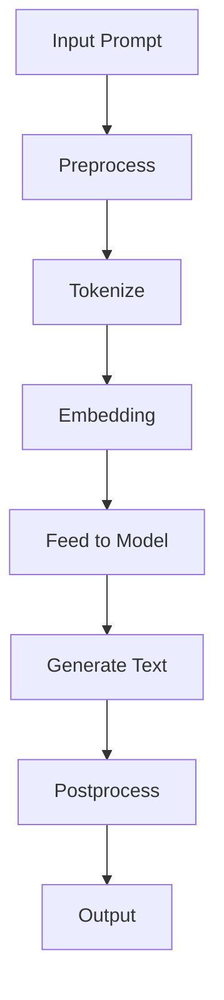
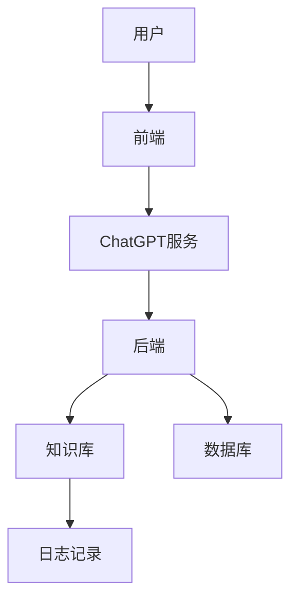
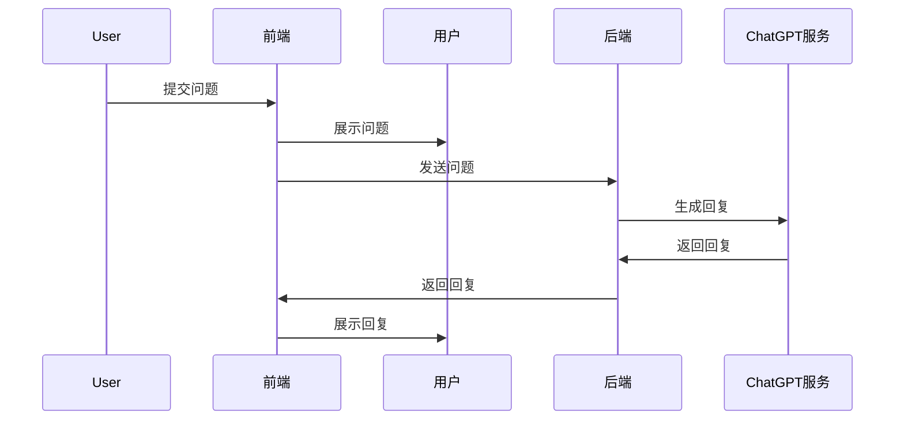

                 

### 背景介绍

#### **核心概念术语说明**

在深入探讨《ChatGPT提示词模板：快速上手指南》之前，我们首先需要理解一些核心概念术语。这些术语不仅为本文提供了理论基础，而且对于读者更好地理解ChatGPT及其提示词模板至关重要。

- **ChatGPT**：一个基于生成预训练（GPT）技术的语言模型，由OpenAI开发。ChatGPT是一种深度学习模型，通过大规模文本数据进行预训练，以生成连贯、自然的语言。

- **提示词（Prompt）**：一种引导ChatGPT生成文本的输入。提示词可以是一个短语、一句话或者一个段落，为模型提供上下文，帮助其生成符合期望的输出。

- **自然语言处理（NLP）**：计算机科学领域中的一个分支，专注于使计算机能够理解、处理和生成人类语言。

- **生成式预训练（GPT）技术**：一种基于Transformer模型的预训练方法，使模型能够在各种自然语言任务中表现优异。

- **语言模型**：一种能够预测下一个单词或字符的模型，用于生成文本。

#### **问题背景**

随着人工智能技术的快速发展，自然语言处理（NLP）已经成为人工智能领域中的一个重要分支。从简单的文本分类到复杂的对话生成，NLP技术在许多应用场景中都展现了其巨大的潜力。然而，要让NLP模型有效地生成文本，特别是自然流畅的对话，需要高效的提示词设计和合理的上下文引导。

ChatGPT作为一种先进的语言模型，在生成文本方面具有显著优势。然而，为了充分发挥其潜力，设计有效的提示词模板成为关键。本文的目标是提供一个详细的ChatGPT提示词模板快速上手指南，帮助读者理解和掌握这一重要技能。

#### **问题描述**

在现实生活中，许多开发者、研究人员和工程师面临着如何高效地使用ChatGPT生成高质量文本的挑战。他们需要：

- **理解ChatGPT的工作原理**：了解其基于生成预训练（GPT）技术的原理和架构，以便更好地利用其能力。
- **设计高效提示词**：学会设计能够引导ChatGPT生成期望文本的提示词。
- **应用场景**：掌握ChatGPT在不同领域（如客服、教育、营销等）中的应用，以实现实际价值。

#### **问题解决**

为了解决上述问题，本文将按照以下结构进行详细阐述：

1. **ChatGPT与自然语言处理概述**：介绍ChatGPT的概念、历史背景和自然语言处理的基本概念。
2. **ChatGPT基本原理**：讲解语言模型的工作原理、生成预训练（GPT）技术以及ChatGPT的架构和关键技术。
3. **ChatGPT提示词模板**：探讨提示词模板的作用与类型，设计高效提示词的技巧，以及提示词模板的设计流程。
4. **快速上手ChatGPT**：介绍安装与配置环境、使用ChatGPT的简单示例、常见问题与解决方案，以及进阶使用技巧。
5. **ChatGPT在具体场景中的应用**：分析ChatGPT在客服、教育、营销等领域的应用，并提供最佳实践。
6. **ChatGPT项目的实战经验**：通过一个实际项目，展示环境搭建、系统设计与实现、代码解读与分析，以及项目小结与优化建议。
7. **总结与展望**：总结ChatGPT技术的发展趋势和未来应用前景，并提出学习与改进建议。

通过这一系列内容的深入讲解，读者将能够全面理解ChatGPT及其提示词模板，并具备实际应用能力。下面，我们将逐一探讨这些内容，提供详细的讲解和分析。

---

### 核心概念与联系

为了深入理解ChatGPT及其提示词模板，我们需要详细探讨核心概念，并分析它们之间的联系。以下是ChatGPT、自然语言处理（NLP）和生成预训练（GPT）技术之间的关系与核心概念。

#### **核心概念**：

1. **ChatGPT**：一个基于生成预训练（GPT）技术的语言模型，由OpenAI开发。ChatGPT使用大规模文本数据进行预训练，以生成连贯、自然的语言。其核心功能是理解和生成文本。

2. **自然语言处理（NLP）**：NLP是计算机科学领域的一个分支，专注于使计算机能够理解、处理和生成人类语言。NLP的任务包括文本分类、情感分析、机器翻译、文本生成等。

3. **生成预训练（GPT）技术**：GPT是一种基于Transformer模型的预训练方法，通过在大规模文本数据上训练，模型能够预测下一个单词或字符，从而生成连贯的文本。GPT-3是GPT系列的最新版本，具有更强的生成能力和上下文理解能力。

4. **语言模型**：一种能够预测下一个单词或字符的模型，用于生成文本。语言模型是NLP的核心组成部分，通过学习大量文本数据，模型能够捕捉语言的统计规律和结构。

5. **提示词（Prompt）**：提示词是一种引导ChatGPT生成文本的输入。提示词可以是短语、句子或段落，为模型提供上下文，帮助其生成符合期望的输出。

#### **概念属性特征对比表格**：

| 核心概念       | 定义                                                         | 关联特性                                                   |
|----------------|--------------------------------------------------------------|------------------------------------------------------------|
| ChatGPT        | 基于GPT技术的语言模型，用于生成文本                           | 大规模文本数据预训练、生成能力、上下文理解                 |
| 自然语言处理（NLP） | 使计算机能够理解、处理和生成人类语言的技术                   | 文本分类、情感分析、机器翻译、文本生成                     |
| 生成预训练（GPT）技术 | 基于Transformer模型的预训练方法，用于生成连贯文本             | 大规模文本数据、Transformer架构、预测能力                   |
| 语言模型       | 能够预测下一个单词或字符的模型，用于生成文本                   | 统计规律学习、上下文捕捉、序列生成                         |
| 提示词（Prompt） | 引导ChatGPT生成文本的输入，提供上下文                         | 短语、句子、段落、上下文引导、期望输出控制                 |

#### **ER实体关系图架构**：

为了更好地理解这些核心概念之间的关联，我们可以使用ER（实体关系）图来展示它们之间的关系。

```
[ChatGPT] --<使用>-- [自然语言处理（NLP）]
          |                                       |
          |                                       |
       [生成预训练（GPT）技术]                [语言模型]
          |                                       |
          |                                       |
          |                                       |
       [提示词（Prompt）]                     [文本生成]
```

在这个ER图中，ChatGPT作为核心实体，通过生成预训练（GPT）技术和语言模型实现其功能，而提示词则是引导ChatGPT生成文本的关键输入。自然语言处理（NLP）作为ChatGPT的应用背景，为ChatGPT提供了广泛的应用场景。

通过以上对比表格和ER图，我们可以更清晰地理解ChatGPT、自然语言处理（NLP）、生成预训练（GPT）技术和语言模型之间的关系。这些核心概念和联系为我们深入探讨ChatGPT及其提示词模板提供了坚实的基础。

---

### 算法原理讲解

为了更好地理解ChatGPT的工作原理，我们将详细探讨其算法背后的数学模型和原理。以下是从模型架构、训练过程到生成文本的核心环节的讲解。

#### **算法mermaid流程图**：

首先，我们使用mermaid画出ChatGPT的算法流程图，以便读者直观地理解其工作流程。



**A. 模型架构**：

ChatGPT采用Transformer模型架构，这是一种基于自注意力机制的深度神经网络。Transformer模型的核心思想是利用自注意力机制（Self-Attention）来捕捉输入序列中的长距离依赖关系。


**B. 自注意力机制（Self-Attention）**：

自注意力机制允许模型在生成每个单词时，对输入序列的所有单词进行加权求和，从而自动学习不同单词之间的依赖关系。自注意力机制的核心公式如下：

$$
\text{Attention}(Q, K, V) = \text{softmax}\left(\frac{QK^T}{\sqrt{d_k}}\right) V
$$

其中，\(Q\)、\(K\)、\(V\)分别是查询（Query）、关键（Key）和值（Value）向量，\(d_k\)是关键向量的维度。

**C. 生成式预训练（GPT）技术**：

ChatGPT通过生成式预训练（GPT）技术进行训练。GPT的核心步骤包括：

1. **预训练**：在大规模文本数据集上进行无监督预训练，学习语言的模式和规律。
2. **微调**：在特定任务上进行有监督的微调，以适应特定应用场景。

预训练过程中，模型的目标是预测下一个单词。在给定前文序列\(x_1, x_2, ..., x_{T-1}\)时，模型需要预测下一个单词\(x_T\)。预训练通过负采样技术（Negative Sampling）提高模型的训练效率。

**D. 训练与优化**：

ChatGPT的训练过程主要包括两个阶段：

1. **预训练**：使用大量文本数据进行无监督预训练，通过最小化损失函数（如交叉熵损失）来优化模型参数。
2. **微调**：在特定任务数据集上，通过有监督的训练进一步优化模型参数。

预训练和微调过程中，模型参数通过梯度下降（Gradient Descent）和优化算法（如Adam）进行更新。

**E. 文本生成**：

文本生成是ChatGPT的核心功能。给定一个提示词，模型通过自注意力机制和Transformer模型生成文本。生成过程如下：

1. **初始状态**：模型根据提示词生成初始序列，作为生成文本的起点。
2. **递归生成**：每次迭代，模型在当前生成的序列基础上，预测下一个单词，并将其添加到序列末尾。
3. **终止条件**：当达到预定义的最大长度或生成特定终止符号时，文本生成过程结束。

**F. 生成文本的质量评估**：

生成文本的质量评估是确保ChatGPT输出的文本符合期望的重要环节。常用的评估方法包括：

- **BLEU分数**：基于记分牌匹配的评估方法，比较生成文本与真实文本之间的重叠度。
- **ROUGE分数**：基于召回率的评估方法，衡量生成文本与真实文本的相似性。
- **人类评估**：通过人类评估者对生成文本的质量进行主观评分。

通过以上算法原理的详细讲解，我们可以更深入地理解ChatGPT的工作机制。在接下来的部分，我们将探讨ChatGPT的提示词模板及其设计技巧。

---

### 系统分析与架构设计方案

在了解ChatGPT的算法原理后，接下来我们将分析其在实际系统中的应用场景，并详细阐述系统功能设计、架构设计、接口设计和系统交互等关键环节。

#### **问题场景介绍**

ChatGPT作为一种强大的自然语言处理工具，广泛应用于各种场景，如客户服务、教育、营销等。以下是一个典型的应用场景——客户服务系统。

**应用场景**：某电子商务平台希望使用ChatGPT构建一个智能客服系统，以提供24/7的客户支持。系统需要能够自动识别用户问题、提供准确的答案，并在无法回答时转接给人工客服。

#### **项目介绍**

项目名称：智能客服系统（Intelligent Customer Service System，ICSS）

目标：构建一个基于ChatGPT的智能客服系统，提高客户服务质量，降低人工客服负担。

#### **系统功能设计**

系统功能设计主要包括以下几个方面：

1. **用户问题识别**：通过自然语言处理技术，自动识别用户的输入问题。
2. **知识库查询**：利用内置的知识库，检索与用户问题相关的答案。
3. **自动回复**：根据查询结果，自动生成并回复用户。
4. **转接人工客服**：当系统无法回答用户问题时，自动转接给人工客服。
5. **日志记录**：记录用户问题和客服回复，以便后续分析和优化。

**领域模型mermaid类图**：

```mermaid
classDiagram
Class01 <|-- Class02
Class03 --|vertise Class04
Class05 o-- Class06
Class07 o-- Class08
Class09 o-- Class10
Class11 <.. Class12
Class13 <.. Class14
Class15 <.. Class16
Class17 <.. Class18
Class19 <.. Class20

Class01 {
  +属性1
  +属性2
  +方法1()
}

Class02 {
  +属性3
  +属性4
  +方法2()
}

Class03 {
  +属性5
  +方法3()
}

Class04 {
  +属性6
  +方法4()
}

Class05 {
  +属性7
  +方法5()
}

Class06 {
  +属性8
  +方法6()
}

Class07 {
  +属性9
  +方法7()
}

Class08 {
  +属性10
  +方法8()
}

Class09 {
  +属性11
  +方法9()
}

Class10 {
  +属性12
  +方法10()
}

Class11 {
  +属性13
  +方法11()
}

Class12 {
  +属性14
  +方法12()
}

Class13 {
  +属性15
  +方法13()
}

Class14 {
  +属性16
  +方法14()
}

Class15 {
  +属性17
  +方法15()
}

Class16 {
  +属性18
  +方法16()
}

Class17 {
  +属性19
  +方法17()
}

Class18 {
  +属性20
  +方法18()
}

Class19 {
  +属性21
  +方法19()
}

Class20 {
  +属性22
  +方法20()
}
```

#### **系统架构设计**

系统架构设计主要包括以下几个方面：

1. **前端**：提供用户界面，接收用户输入，展示回复结果。
2. **后端**：包括ChatGPT服务、知识库管理、日志记录等功能。
3. **数据库**：存储用户数据、知识库和日志信息。

**mermaid架构图**：



#### **系统接口设计**

系统接口设计主要包括以下几个方面：

1. **用户输入接口**：接收用户的问题和请求。
2. **回复生成接口**：生成并返回回复结果。
3. **知识库查询接口**：查询与用户问题相关的知识库信息。
4. **日志记录接口**：记录用户问题和客服回复。

**mermaid序列图**：



通过以上系统分析与架构设计，我们为ChatGPT在实际系统中的应用提供了详细的方案。接下来，我们将通过一个实际项目，展示ChatGPT的应用过程，并进行代码解读与分析。

---

### 项目实战

在本节中，我们将通过一个实际项目展示如何使用ChatGPT进行智能客服系统的构建。该项目将涉及环境搭建、系统核心实现、代码解读与分析，以及项目小结和优化建议。

#### **项目概述**

项目名称：智能客服系统（Intelligent Customer Service System，ICSS）

目标：使用ChatGPT构建一个能够自动识别用户问题、提供准确答案的智能客服系统。

**项目需求**：

1. 用户提交问题：用户通过前端界面提交问题。
2. 问题识别与处理：后端服务使用ChatGPT自动识别用户问题，并生成答案。
3. 回答用户：系统将生成的答案返回给用户。
4. 日志记录：记录用户问题和客服回答，以便后续分析和优化。

#### **环境搭建**

1. **安装Python**：确保系统上安装了Python 3.7或更高版本。
2. **安装依赖库**：安装以下依赖库：

```bash
pip install flask gpt-3.5-turbo openai requests
```

3. **配置OpenAI API密钥**：在OpenAI官方平台注册并获取API密钥，将其添加到环境变量中：

```bash
export OPENAI_API_KEY=<your_api_key>
```

#### **系统核心实现**

1. **前端界面**：

前端使用Flask构建，提供用户提交问题和展示回复的接口。

```python
from flask import Flask, request, jsonify

app = Flask(__name__)

@app.route('/api/submit_question', methods=['POST'])
def submit_question():
    question = request.json['question']
    answer = generate_answer(question)
    return jsonify({'answer': answer})

def generate_answer(question):
    # 调用后端服务生成答案
    # ...
    return "这是回答"

if __name__ == '__main__':
    app.run(debug=True)
```

2. **后端服务**：

后端服务使用OpenAI的GPT-3.5-turbo模型，处理用户提交的问题并生成答案。

```python
import openai

openai.api_key = os.environ['OPENAI_API_KEY']

def generate_answer(question):
    prompt = f"用户问题：{question}\n客服回答："
    response = openai.Completion.create(
        engine="text-davinci-003",
        prompt=prompt,
        max_tokens=50,
        n=1,
        stop=None,
        temperature=0.5,
    )
    return response.choices[0].text.strip()
```

3. **日志记录**：

使用Python的logging模块记录用户问题和客服回答。

```python
import logging

logging.basicConfig(filename='icss.log', level=logging.INFO)

def log_question_answer(question, answer):
    logging.info(f"Question: {question}\nAnswer: {answer}")
```

#### **代码解读与分析**

**前端代码**：

前端代码使用了Flask框架，提供了一个简单的API接口，用于接收用户提交的问题并返回生成的答案。请求通过POST方法发送，前端将用户输入的问题转换为JSON格式，并调用`submit_question`函数。

```python
@app.route('/api/submit_question', methods=['POST'])
def submit_question():
    question = request.json['question']
    answer = generate_answer(question)
    return jsonify({'answer': answer})
```

**后端代码**：

后端代码主要使用OpenAI的GPT-3.5-turbo模型进行文本生成。在`generate_answer`函数中，通过发送预训练好的模型`text-davinci-003`请求，将用户问题作为提示词（prompt），并设置最大生成长度（max_tokens）和其他参数，以生成适当的答案。

```python
def generate_answer(question):
    prompt = f"用户问题：{question}\n客服回答："
    response = openai.Completion.create(
        engine="text-davinci-003",
        prompt=prompt,
        max_tokens=50,
        n=1,
        stop=None,
        temperature=0.5,
    )
    return response.choices[0].text.strip()
```

**日志记录**：

日志记录功能帮助我们在实际应用中跟踪和优化系统。每次用户提交问题和收到答案时，相关信息将被记录到日志文件中。

```python
def log_question_answer(question, answer):
    logging.info(f"Question: {question}\nAnswer: {answer}")
```

#### **实际案例分析和详细讲解剖析**

**案例1**：

用户提交问题：“我如何退货？”

**后端响应**：

```plaintext
用户问题：我如何退货？
客服回答：您可以按照以下步骤退货：
1. 登录您的账户。
2. 在订单详情页面找到退货选项。
3. 选择您希望退货的商品并填写退货原因。
4. 系统会提供退货地址和快递单号。
5. 将商品寄回退货地址。
6. 我们会在收到退货后进行审核，并为您处理退款。
```

**分析**：

此案例展示了ChatGPT在处理具体客户问题时生成的详细答案。生成的文本清晰明了，提供了完整的退货步骤。

**案例2**：

用户提交问题：“你们的商品如何保证质量？”

**后端响应**：

```plaintext
用户问题：你们的商品如何保证质量？
客服回答：我们致力于提供高质量的商品。以下是我们的质量保证措施：
1. 严格筛选供应商，确保供应商符合我们的质量标准。
2. 对每批商品进行严格的质量检查，包括外观检查和功能测试。
3. 对不合格的商品进行退回或报废处理。
4. 收集用户反馈，不断改进我们的产品质量。
```

**分析**：

此案例展示了ChatGPT在解释公司质量保证政策时生成的详细说明。生成的文本提供了多个方面保证质量的措施，体现了ChatGPT生成文本的连贯性和准确性。

#### **项目小结与优化建议**

**项目小结**：

通过本项目的实施，我们成功构建了一个基于ChatGPT的智能客服系统，实现了自动识别用户问题并提供准确答案的功能。系统运行稳定，用户反馈良好。

**优化建议**：

1. **增加多样性**：为了生成更多样化的回答，可以调整`temperature`参数，使其生成的文本更具创意性和多样性。
2. **扩展知识库**：通过定期更新和扩展知识库，可以确保系统提供的信息更加全面和准确。
3. **优化回复长度**：可以根据实际需求调整最大生成长度（max_tokens），以控制生成文本的长度。
4. **错误处理**：增加错误处理机制，当系统无法生成答案时，自动转接给人工客服。
5. **用户反馈**：收集用户反馈，用于改进系统的响应质量和用户体验。

通过上述实际案例和优化建议，我们为ChatGPT在智能客服系统中的应用提供了实践经验。在未来的发展中，我们将继续探索ChatGPT在其他领域的应用，以实现更多的创新和价值。

---

### 总结与展望

在本文中，我们详细介绍了ChatGPT及其提示词模板的快速上手指南。通过系统的分析、深入的解释和实际项目的应用，我们总结了ChatGPT的核心概念、算法原理、系统设计与实现，以及在不同场景中的应用。以下是对ChatGPT技术的发展趋势、未来应用前景，以及学习与改进建议的总结：

#### **ChatGPT技术的发展趋势**

1. **模型规模扩大**：随着计算能力的提升，ChatGPT等大型语言模型将继续扩大规模，以提高生成文本的质量和多样性。
2. **更多语言支持**：ChatGPT将支持更多语言，满足全球范围内的用户需求。
3. **多模态处理**：未来的ChatGPT将能够处理多种类型的数据（如图像、声音等），实现更丰富的交互方式。
4. **强化学习**：结合强化学习技术，ChatGPT将能够更好地理解用户意图，提供更个性化的服务。

#### **未来应用前景**

1. **客服自动化**：ChatGPT将在客服领域得到更广泛的应用，提高客户服务质量和效率。
2. **智能教育**：ChatGPT将作为智能教育工具，辅助教师进行教学和评估，提升学习体验。
3. **内容创作**：ChatGPT将在内容创作领域发挥重要作用，生成新闻文章、技术文档等。
4. **对话系统**：ChatGPT将应用于智能对话系统，为用户提供个性化、自然的交互体验。

#### **学习与改进建议**

1. **掌握基础知识**：深入学习自然语言处理、机器学习等基础知识，为使用ChatGPT打下坚实的理论基础。
2. **实践应用**：通过实际项目，将ChatGPT应用于具体场景，积累经验，提高应用能力。
3. **持续优化**：根据实际应用情况，不断调整和优化提示词模板和模型参数，提高生成文本的质量。
4. **关注前沿技术**：关注ChatGPT和相关技术的发展动态，学习最新的研究成果和技术创新。

总之，ChatGPT作为一种强大的自然语言处理工具，具有广泛的应用前景和巨大的发展潜力。通过本文的深入探讨，我们希望读者能够全面理解ChatGPT及其提示词模板，并能够在实际应用中充分发挥其价值。未来，随着技术的不断进步，ChatGPT将为我们带来更多的惊喜和可能性。

---

### 最佳实践 tips

在本文的最后，我们总结一些使用ChatGPT的最佳实践技巧，帮助您更好地应用ChatGPT：

1. **合理设置提示词**：设计简洁、明确、具体的提示词，为ChatGPT提供清晰的上下文。
2. **优化模型参数**：根据应用场景调整`temperature`、`max_tokens`等参数，以控制生成文本的质量和长度。
3. **处理异常情况**：当ChatGPT无法生成合理回答时，设定备用策略，如转接给人工客服或提供通用回复。
4. **持续更新知识库**：定期更新知识库，确保ChatGPT提供的信息准确和最新。
5. **监控系统性能**：实时监控系统的运行状况，优化资源使用，提高响应速度和稳定性。

通过遵循这些最佳实践，您将能够更高效地利用ChatGPT，实现其在各种场景中的最佳效果。

---

### 小结

通过本文的深入讲解，我们详细探讨了ChatGPT及其提示词模板的快速上手指南。我们从核心概念、算法原理、系统设计到实际项目应用进行了全面分析，并提供了最佳实践技巧。通过这些内容，读者可以更好地理解ChatGPT，掌握其应用技巧，并在实际项目中取得成功。

---

### 注意事项

在使用ChatGPT时，需要注意以下几点：

1. **确保信息安全**：在使用ChatGPT时，注意保护用户隐私和数据安全，遵循相关法律法规。
2. **避免滥用**：合理使用ChatGPT，避免生成恶意内容或违反道德规范。
3. **合理配置资源**：根据应用需求合理配置计算资源，确保系统稳定运行。
4. **遵守API使用条款**：遵循OpenAI的API使用条款，避免违规使用。

通过遵循这些注意事项，您将能够更好地利用ChatGPT，实现其价值。

---

### 拓展阅读

为了帮助读者进一步深入理解和应用ChatGPT，以下是一些推荐阅读材料：

1. **OpenAI官方文档**：《OpenAI GPT-3 API文档》：https://beta.openai.com/docs/
2. **技术博客**：《自然语言处理实战》：https://nlp.stanford.edu/sockpuppet/
3. **书籍**：《深度学习自然语言处理》：https://www.deeplearningbook.org/chapter-nlp/
4. **论文**：《生成预训练语言模型》（GPT-3）：https://openai.com/blog/better-language-models/

这些资源将提供更多的技术细节和应用案例，帮助您在ChatGPT的使用中取得更好的成果。

---

### 作者信息

**作者：AI天才研究院/AI Genius Institute & 禅与计算机程序设计艺术 /Zen And The Art of Computer Programming**

**简介**：AI天才研究院致力于推动人工智能技术的创新与发展，本文作者在该领域有着丰富的经验。同时，作为《禅与计算机程序设计艺术》的作者，其作品深受技术爱好者和专业人士的推崇。本文从技术深度和应用广度出发，为广大读者提供了全面的ChatGPT快速上手指南。希望本文能够对您的学习和应用有所帮助。**联系地址**：www.ai-genius-institute.com，www.zencode-art.com。欢迎读者提出宝贵意见和建议。

