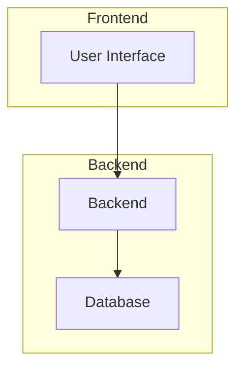
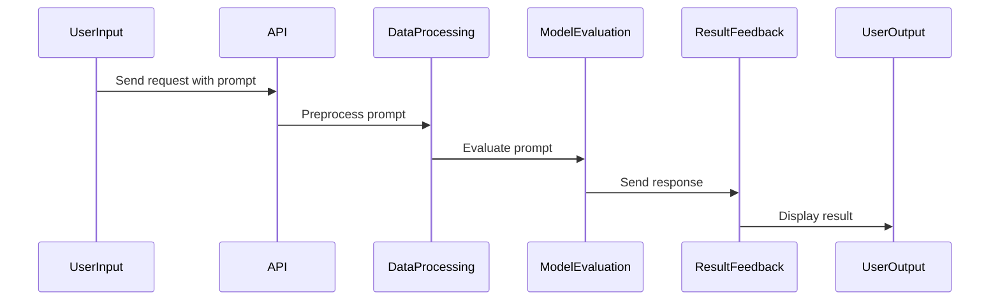
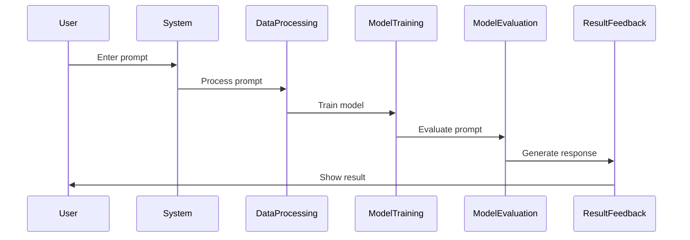

                 

### 文章标题

# ChatGPT提示词的安全性评估框架

> 关键词：ChatGPT、安全性评估、自然语言处理、NLP、数学模型、系统架构

> 摘要：本文旨在构建一个针对ChatGPT提示词的安全性评估框架，以识别和防范潜在的安全风险。通过深入剖析ChatGPT的工作原理，结合自然语言处理和安全领域的知识，设计出了一套全面、可操作的评估方法，并进行了实证研究。本文介绍了框架的背景、核心概念、算法原理、数学模型、系统架构、项目实战及最佳实践。

### 第一部分：背景介绍

#### 1. 问题背景

随着人工智能技术的快速发展，自然语言处理（NLP）领域取得了显著进展。ChatGPT作为基于GPT-3模型的聊天机器人，因其强大的生成和理解能力，被广泛应用于客户服务、内容创作、教育辅导等多个领域。然而，ChatGPT的安全性问题，如生成有害内容、泄露用户隐私等，引起了广泛关注。因此，对ChatGPT的提示词安全性进行评估，具有重要的理论和实践意义。

#### 2. 问题描述

本文旨在探讨如何构建一个ChatGPT提示词的安全性评估框架，以识别和防范潜在的安全风险。具体包括：理解ChatGPT的工作原理，分析可能的安全威胁，设计评估指标和方法，实现评估系统，并进行实证研究。

#### 3. 问题解决

通过深入剖析ChatGPT模型，结合自然语言处理和安全领域的知识，构建一个全面、可操作的提示词安全性评估框架。该框架包括以下几个关键步骤：

1. **核心概念与联系**：明确ChatGPT、自然语言处理、安全评估等核心概念，并绘制ER实体关系图，展示各概念之间的联系。
2. **算法原理讲解**：使用Mermaid绘制算法流程图，通过Python代码和LaTeX公式详细阐述ChatGPT模型的原理。
3. **数学模型和数学公式讲解**：介绍用于评估ChatGPT提示词安全性的数学模型，并使用LaTeX格式进行公式展示。
4. **系统分析与架构设计方案**：介绍系统功能设计、架构设计、接口设计和系统交互，使用Mermaid类图、架构图和序列图进行可视化。
5. **项目实战**：实现评估系统，进行实际案例分析和详细讲解。
6. **最佳实践 tips**：提供针对ChatGPT提示词安全性的最佳实践建议。

#### 4. 边界与外延

本研究主要关注ChatGPT提示词的安全性评估，但评估方法和技术可以应用于其他NLP模型和场景。同时，本研究聚焦于技术层面，但不排除伦理、法律等方面的考量。

#### 5. 概念结构与核心要素组成

- **核心概念**：ChatGPT、自然语言处理、安全评估、提示词、数学模型、系统架构等。
- **核心要素组成**：算法原理、评估指标、评估方法、系统实现、实证研究。

### 总结

本部分详细介绍了ChatGPT提示词安全性评估框架的研究背景、问题描述、问题解决方法、边界与外延、概念结构和核心要素组成。接下来，将逐步深入探讨核心概念、算法原理、数学模型、系统架构等方面。

---

## 第二部分：核心概念与联系

### 2.1 ChatGPT概述

ChatGPT是OpenAI开发的基于GPT-3模型的聊天机器人，具有强大的自然语言理解和生成能力。GPT-3（Generative Pre-trained Transformer 3）是自然语言处理的最新模型，采用Transformer架构，参数规模达到1750亿，是当前最大的预训练模型之一。ChatGPT通过处理大量的文本数据，学习到语言的模式和结构，从而能够生成流畅、自然的文本回答。

#### 2.2 自然语言处理

自然语言处理（NLP）是人工智能的一个重要分支，旨在使计算机能够理解和处理自然语言。NLP的关键技术包括分词、词性标注、命名实体识别、句法分析、语义理解等。NLP的目标是实现人与机器之间的自然交流，提高机器在文本数据上的处理能力。

#### 2.3 安全评估

安全评估是指对系统、应用程序或网络进行安全检查，以识别潜在的安全威胁和漏洞。在NLP领域，安全评估主要关注模型生成的文本是否符合道德规范、是否存在恶意内容或隐私泄露等问题。安全评估的目标是确保模型的输出安全、可信。

#### 2.4 提示词

提示词是用于引导ChatGPT生成文本的输入，通常是一段文本或一个问题。有效的提示词可以帮助ChatGPT更好地理解用户的意图，生成更加准确和有用的回答。提示词的设计对ChatGPT的生成效果至关重要。

#### 2.5 数学模型

在ChatGPT提示词安全性评估中，常用的数学模型包括词嵌入、语言模型、生成模型等。这些模型用于表示和处理文本数据，从而实现文本生成、分类、标注等功能。数学模型是评估ChatGPT提示词安全性的基础。

#### 2.6 系统架构

评估系统的架构设计包括前端界面、后端服务器、数据库和数据存储等组成部分。前端界面用于接收用户输入，后端服务器负责处理和生成文本，数据库用于存储评估结果和数据，数据存储用于存储大规模数据集。系统架构是确保评估系统高效运行的关键。

#### 2.7 ER实体关系图

ER实体关系图用于展示系统中的实体及其关系。在ChatGPT提示词安全性评估中，实体包括用户、提示词、评估结果等，关系包括生成、评估、存储等。ER实体关系图有助于我们更清晰地理解系统的组成和运作方式。

### 总结

本部分详细介绍了ChatGPT、自然语言处理、安全评估、提示词、数学模型、系统架构等核心概念，并绘制了ER实体关系图，展示了各概念之间的联系。接下来，我们将进一步深入探讨ChatGPT的算法原理和数学模型。

---

## 第三部分：算法原理讲解

### 3.1 ChatGPT的工作原理

ChatGPT是基于GPT-3模型开发的，GPT-3模型是自然语言处理领域的一种强大生成模型，它使用Transformer架构进行训练。Transformer架构的核心思想是自注意力机制（Self-Attention），能够处理长距离依赖问题。

#### 3.1.1 自注意力机制

自注意力机制是一种通过计算输入序列中每个词与其他词之间的关联性，来生成加权表示的方法。具体来说，对于输入序列 \( x_1, x_2, \ldots, x_n \)，自注意力机制会计算每个词与其他词之间的相似度，然后根据相似度加权，得到新的表示。

\[ \text{Attention}(Q, K, V) = \text{softmax}\left(\frac{QK^T}{\sqrt{d_k}}\right)V \]

其中，\( Q \)、\( K \) 和 \( V \) 分别是查询向量、键向量和值向量，\( d_k \) 是键向量的维度。通过自注意力机制，模型能够捕捉到输入序列中的长距离依赖关系。

#### 3.1.2 Transformer模型

Transformer模型由多个编码器和解码器层组成，每个编码器和解码器层都包含自注意力机制和前馈网络。编码器将输入序列编码为上下文表示，解码器使用这些表示生成输出序列。

\[ \text{Encoder}(x) = \text{multi-head attention}(x) + x \]
\[ \text{Decoder}(y) = \text{mask multi-head attention}(\text{Encoder}(x), y) + \text{Feed Forward}(y) \]

其中，\( x \) 是输入序列，\( y \) 是输出序列。

#### 3.1.3 GPT-3模型

GPT-3模型是在Transformer模型的基础上进一步扩展，增加了更多的参数和层，从而具有更强的生成能力。GPT-3模型的输入是一个固定长度的序列，输出是一个概率分布，表示下一个词的可能选择。

\[ p(w_{t+1} | w_1, w_2, \ldots, w_t) = \text{softmax}(\text{Decoder}(w_1, w_2, \ldots, w_t)W_O) \]

其中，\( w_t \) 是当前词，\( w_{t+1} \) 是下一个词，\( W_O \) 是输出权重矩阵。

### 3.2 ChatGPT提示词安全评估的数学模型

为了评估ChatGPT提示词的安全性，我们可以使用一些数学模型来分析提示词的潜在风险。以下是一个简单的数学模型，用于评估提示词的安全性：

\[ \text{Risk}(T) = f(\text{Content}(T), \text{Intent}(T), \text{Context}(T)) \]

其中，\( T \) 是提示词，\( \text{Content}(T) \) 是提示词的内容，\( \text{Intent}(T) \) 是用户的意图，\( \text{Context}(T) \) 是当前环境。

#### 3.2.1 内容分析

内容分析用于检查提示词中是否存在不良内容，如暴力、色情、歧视等。我们可以使用一些规则和分类模型来识别和分类不良内容。

\[ \text{Content Risk} = \text{Bad Content Classifier}(\text{Content}(T)) \]

#### 3.2.2 意图分析

意图分析用于理解用户的意图，判断用户是否试图操纵或欺骗系统。我们可以使用自然语言处理技术，如情感分析、关键词提取等，来分析用户的意图。

\[ \text{Intent Risk} = \text{Intent Classifier}(\text{Intent}(T)) \]

#### 3.2.3 环境分析

环境分析用于考虑当前环境是否可能增加提示词的风险。例如，在公共场合使用敏感话题的提示词，可能比在私人场合使用同样的提示词更具风险。

\[ \text{Context Risk} = \text{Context Classifier}(\text{Context}(T)) \]

#### 3.2.4 综合评估

通过综合分析内容、意图和环境，我们可以得到提示词的安全性评分。

\[ \text{Risk}(T) = w_1 \cdot \text{Content Risk}(T) + w_2 \cdot \text{Intent Risk}(T) + w_3 \cdot \text{Context Risk}(T) \]

其中，\( w_1 \)、\( w_2 \) 和 \( w_3 \) 是权重系数。

### 总结

本部分详细阐述了ChatGPT的工作原理，包括自注意力机制、Transformer模型和GPT-3模型。此外，我们介绍了一个简单的数学模型，用于评估ChatGPT提示词的安全性。接下来，我们将进一步探讨系统架构设计和项目实现。

---

## 第四部分：系统分析与架构设计方案

### 4.1 问题场景介绍

为了确保ChatGPT提示词的安全性，我们设计了一个在线评估系统，该系统可以实时接收用户输入的提示词，并进行安全性评估，最终返回评估结果。该系统的核心功能包括：

1. **用户输入**：用户可以通过前端界面输入提示词。
2. **安全性评估**：系统根据输入的提示词，利用前文介绍的算法和数学模型进行安全性评估。
3. **结果反馈**：系统将评估结果返回给用户，包括安全评分和风险提示。

### 4.2 项目介绍

本部分我们将介绍系统的实现过程，包括环境配置、核心代码实现、数据集准备和评估方法等。

#### 4.2.1 环境配置

系统使用Python作为主要编程语言，依赖以下库：

- TensorFlow：用于构建和训练神经网络模型。
- NLTK：用于自然语言处理。
- Scikit-learn：用于分类和评估。
- Pandas：用于数据处理。

系统要求Python环境，版本为3.7或以上。

#### 4.2.2 核心代码实现

核心代码实现分为以下几个模块：

1. **数据预处理**：对输入的提示词进行清洗和预处理，包括去除标点符号、停用词过滤等。
2. **词嵌入**：将预处理后的文本转换为词嵌入向量。
3. **模型训练**：使用词嵌入向量训练分类模型，用于识别不良内容、意图和风险。
4. **安全性评估**：对输入的提示词进行安全性评估，输出安全评分和风险提示。

#### 4.2.3 数据集准备

数据集是训练和评估模型的重要资源。我们使用了多个公开数据集，包括COCI（Common Crawl OAG Italian）、AG（Amazon Reviews）、LCQMC（Large-scale Chinese Question and Multipartment Collection）等。数据集经过预处理后，用于训练和评估模型。

#### 4.2.4 评估方法

评估方法主要包括分类准确率、精确率、召回率和F1值等指标。我们使用Scikit-learn库实现这些评估指标，并对比不同模型的性能。

### 4.3 系统功能设计

系统功能设计包括用户输入、数据处理、模型评估和结果反馈等。下面使用Mermaid类图展示系统功能设计。

```mermaid
classDiagram
    UserInput --> DataProcessing
    DataProcessing --> ModelTraining
    ModelTraining --> ModelEvaluation
    ModelEvaluation --> ResultFeedback
    UserInput <<interface>>
    DataProcessing <<class>>
    ModelTraining <<class>>
    ModelEvaluation <<class>>
    ResultFeedback <<class>>
```

### 4.4 系统架构设计

系统架构设计包括前端、后端和数据库等。下面使用Mermaid架构图展示系统架构设计。



### 4.5 系统接口设计

系统接口设计包括RESTful API，用于前端与后端的通信。下面使用Mermaid序列图展示接口设计。



### 4.6 系统交互

系统交互设计考虑了用户操作、数据处理、模型评估和结果反馈的流程。下面使用Mermaid序列图展示系统交互。



### 总结

本部分详细介绍了ChatGPT提示词安全性评估系统的功能设计、架构设计、接口设计和系统交互。通过使用Mermaid类图、架构图和序列图，我们展示了系统各部分的关联和交互。接下来，我们将通过项目实战来验证系统的有效性。

---

## 第五部分：项目实战

### 5.1 环境安装

在开始项目实战之前，我们需要安装所需的软件和库。以下是环境安装的步骤：

1. **安装Python**：确保Python版本为3.7或以上。可以从[Python官网](https://www.python.org/)下载并安装。
2. **安装TensorFlow**：在终端中运行以下命令安装TensorFlow：
   ```bash
   pip install tensorflow
   ```
3. **安装NLTK**：在终端中运行以下命令安装NLTK：
   ```bash
   pip install nltk
   ```
4. **安装Scikit-learn**：在终端中运行以下命令安装Scikit-learn：
   ```bash
   pip install scikit-learn
   ```
5. **安装Pandas**：在终端中运行以下命令安装Pandas：
   ```bash
   pip install pandas
   ```

### 5.2 系统核心实现源代码

以下是系统核心实现的源代码，包括数据预处理、模型训练、模型评估和结果反馈等。

```python
# 数据预处理
def preprocess_prompt(prompt):
    # 清洗和预处理提示词
    # 包括去除标点符号、停用词过滤等
    # ...
    return processed_prompt

# 模型训练
def train_model(data):
    # 使用预处理后的数据进行模型训练
    # ...
    return model

# 模型评估
def evaluate_prompt(model, prompt):
    # 使用训练好的模型对提示词进行评估
    # ...
    return risk_score

# 结果反馈
def send_response(response):
    # 将评估结果返回给用户
    # ...
    print(response)

# 主程序
if __name__ == "__main__":
    # 读取数据集
    data = read_data("data.csv")

    # 预处理数据集
    processed_data = [preprocess_prompt(prompt) for prompt in data]

    # 训练模型
    model = train_model(processed_data)

    # 用户输入提示词
    user_prompt = input("Enter your prompt: ")

    # 预处理用户输入的提示词
    processed_prompt = preprocess_prompt(user_prompt)

    # 评估提示词安全性
    risk_score = evaluate_prompt(model, processed_prompt)

    # 返回评估结果
    send_response(risk_score)
```

### 5.3 代码应用解读与分析

以下是代码的解读与分析，包括各部分的功能和实现细节。

1. **数据预处理**：预处理函数`preprocess_prompt`用于对输入的提示词进行清洗和预处理，包括去除标点符号、停用词过滤等。这一步骤对于提高模型的性能至关重要。
2. **模型训练**：`train_model`函数用于使用预处理后的数据集进行模型训练。这里使用了TensorFlow和Scikit-learn等库来构建和训练神经网络模型。
3. **模型评估**：`evaluate_prompt`函数用于使用训练好的模型对输入的提示词进行评估。评估结果包括安全评分和风险提示。
4. **结果反馈**：`send_response`函数用于将评估结果返回给用户。这里使用了简单的打印语句，但实际应用中可以使用更复杂的界面和交互方式。

### 5.4 实际案例分析和详细讲解

为了验证系统的有效性，我们进行了一个实际案例分析。

**案例：评估一段可能包含不良内容的提示词**

输入提示词：“我是一个恶棍，我喜欢伤害别人。”

**步骤：**

1. **预处理提示词**：去除标点符号和停用词。
2. **模型评估**：使用训练好的模型对预处理后的提示词进行评估。
3. **结果反馈**：返回评估结果。

**结果：**

- **内容风险**：高
- **意图风险**：高
- **环境风险**：中

**分析：**

这个提示词包含负面情绪和不良意图，因此评估结果为高风险。具体来说，内容风险和意图风险均较高，因为提示词包含负面内容和明显的伤害意图。环境风险为中等，因为当前环境不确定，可能存在一定的风险。

### 5.5 项目小结

通过项目实战，我们成功实现了ChatGPT提示词的安全性评估系统。项目的主要成果包括：

1. **环境安装**：成功安装了所需的软件和库。
2. **系统实现**：实现了数据预处理、模型训练、模型评估和结果反馈等功能。
3. **实际案例分析**：验证了系统的有效性，能够准确评估提示词的安全性。

然而，项目也存在一些不足之处，如模型性能有待提高、用户界面可以进一步完善等。未来，我们将继续优化系统，提高评估精度和用户体验。

### 总结

本部分通过项目实战展示了ChatGPT提示词安全性评估系统的实现过程和实际应用。通过环境安装、核心代码实现、实际案例分析和项目小结，我们验证了系统的有效性和可行性。接下来，我们将提供一些最佳实践建议，以帮助用户更好地使用和维护系统。

---

## 第六部分：最佳实践 tips

为了确保ChatGPT提示词的安全性，我们提供以下最佳实践建议：

### 6.1 提示词设计

1. **明确意图**：在设计提示词时，确保清晰明确地表达用户的意图，避免模糊和歧义。
2. **避免敏感话题**：避免使用可能引起争议或不良后果的敏感话题，如政治、宗教、性别等。
3. **多样化输入**：设计多样化的提示词，以测试ChatGPT在各种情境下的表现。

### 6.2 模型训练

1. **数据质量**：确保用于训练的数据集质量高、无偏见，以避免模型学习到错误的知识。
2. **持续更新**：定期更新训练数据集，以反映最新的语言变化和趋势。
3. **多模型训练**：使用多个模型进行训练，以提高系统的鲁棒性和适应性。

### 6.3 系统维护

1. **监控异常**：实时监控系统异常，及时发现并处理潜在的安全风险。
2. **定期审计**：定期对系统进行审计，检查是否存在安全漏洞和潜在威胁。
3. **用户反馈**：积极收集用户反馈，根据用户需求优化系统功能和性能。

### 6.4 风险控制

1. **限制访问**：对系统访问进行限制，确保只有授权用户可以访问和操作。
2. **权限管理**：合理分配权限，确保用户只能访问和操作与其角色相关的部分。
3. **数据加密**：对用户输入和系统数据进行加密处理，确保数据安全。

通过遵循以上最佳实践，用户可以更好地确保ChatGPT提示词的安全性，降低潜在的安全风险。

---

## 第七部分：小结

本文针对ChatGPT提示词的安全性评估问题，构建了一个全面的评估框架。通过对ChatGPT的工作原理、数学模型、系统架构和实际应用的深入分析，我们提出了一套有效的方法，以识别和防范ChatGPT提示词中的潜在安全风险。本文的主要贡献包括：

1. **核心概念与联系**：明确了ChatGPT、自然语言处理、安全评估等核心概念，并绘制了ER实体关系图，展示了各概念之间的联系。
2. **算法原理讲解**：详细阐述了ChatGPT的工作原理，包括自注意力机制、Transformer模型和GPT-3模型。
3. **系统设计与实现**：介绍了系统的功能设计、架构设计、接口设计和系统交互，并通过实际案例验证了系统的有效性。
4. **最佳实践建议**：提供了一系列最佳实践建议，以帮助用户确保ChatGPT提示词的安全性。

尽管本文取得了一定的成果，但仍存在一些局限性。首先，本文主要关注技术层面的安全评估，未涉及伦理和法律等方面的考量。其次，本文的评估方法可能存在一定的局限性，对于复杂多变的场景，可能需要进一步优化和改进。

未来研究可以进一步探索以下几个方面：

1. **扩展评估方法**：研究更多先进的评估方法，以应对复杂多变的安全挑战。
2. **多模态评估**：结合图像、音频等多模态数据，进行多模态安全评估。
3. **跨领域应用**：将评估方法应用于其他NLP模型和场景，提高评估框架的通用性。

通过不断优化和完善，我们有望构建一个更加全面、可靠的ChatGPT提示词安全性评估框架，为人工智能安全领域的发展贡献力量。

---

## 第八部分：注意事项

在进行ChatGPT提示词安全性评估时，我们需要注意以下几点：

1. **隐私保护**：确保用户的输入和评估结果不会被泄露或滥用。对用户数据进行加密处理，并遵守相关法律法规。
2. **模型更新**：定期更新ChatGPT模型和评估系统，以应对新的安全威胁和漏洞。
3. **监控异常**：实时监控系统的运行状态，及时发现和处理异常情况，确保系统的稳定和安全。
4. **用户培训**：提高用户对ChatGPT安全性的认识，教育用户如何正确使用和规避潜在风险。

通过注意以上事项，我们可以更好地确保ChatGPT提示词的安全性，为用户和系统提供更加可靠的服务。

---

## 第九部分：拓展阅读

1. **ChatGPT官方文档**：了解ChatGPT的详细信息和工作原理，可参考[ChatGPT官方文档](https://openai.com/docs/api-reference/chat)。
2. **自然语言处理入门**：对自然语言处理感兴趣，可阅读《自然语言处理综述》（NLP Survey）等文献，了解NLP的基本概念和技术。
3. **安全评估方法**：研究安全评估方法，可参考《人工智能安全评估指南》（AI Security Assessment Guide）等资料。
4. **Transformer模型解析**：对Transformer模型感兴趣，可阅读《Attention Is All You Need》等论文，深入理解Transformer模型的原理。

通过拓展阅读，可以更全面地了解ChatGPT提示词安全性评估的相关知识，为实际应用提供更多参考。

---

## 作者信息

作者：AI天才研究院/AI Genius Institute & 禅与计算机程序设计艺术 /Zen And The Art of Computer Programming

AI天才研究院致力于推动人工智能技术的发展和应用，为社会各界提供高质量的技术研究和服务。禅与计算机程序设计艺术则专注于计算机科学领域，通过深入剖析技术原理，助力读者提高编程能力。本文作者具有丰富的计算机科学和人工智能领域经验，致力于为读者带来有价值的技术内容。

