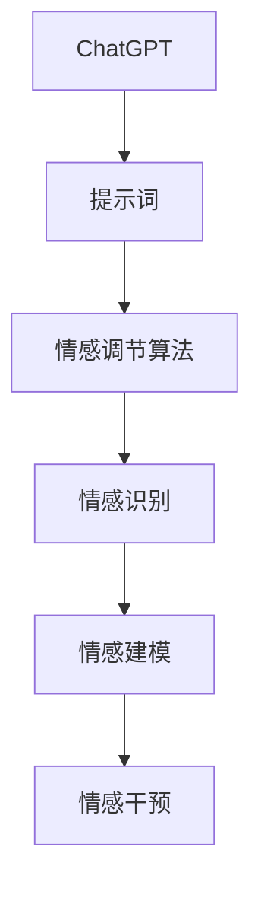
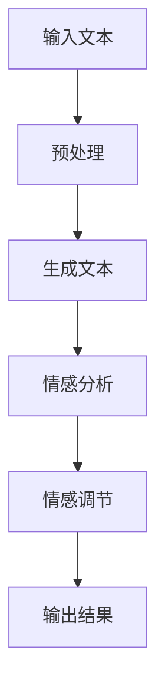
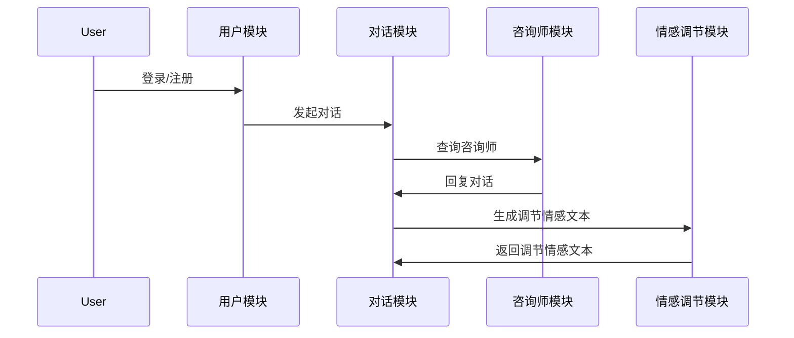
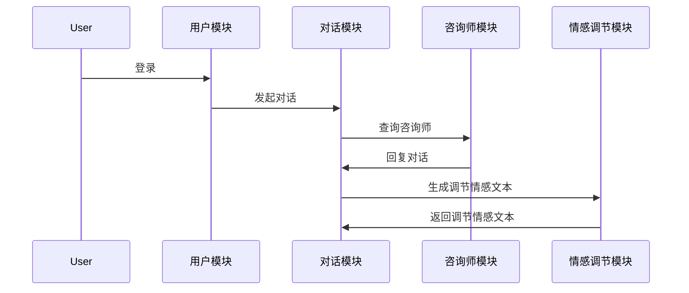

                 

### 《ChatGPT提示词的情感调节功能：AI辅助心理健康干预新方法》

关键词：ChatGPT，情感调节，心理健康干预，人工智能

摘要：本文将探讨如何利用ChatGPT的提示词功能实现情感调节，为心理健康干预提供一种新的AI辅助方法。我们将从问题背景、核心概念、算法原理、系统分析与架构设计、项目实战以及最佳实践等方面，详细解析这一创新技术的实现与应用。

---

### 目录大纲设计

为了确保文章的条理清晰和逻辑连贯，我们将设计如下目录大纲：

#### 一、背景介绍

1.1 问题背景
1.2 问题描述
1.3 问题解决
1.4 边界与外延
1.5 概念结构与核心要素组成

#### 二、核心概念与联系

2.1 核心概念原理
2.2 概念属性特征对比表格
2.3 ER实体关系图架构

#### 三、算法原理讲解

3.1 ChatGPT算法流程
3.2 Python源代码实现
3.3 情感调节的数学模型与公式
3.4 算法原理举例说明

#### 四、系统分析与架构设计

4.1 问题场景介绍
4.2 系统功能设计（领域模型）
4.3 系统架构设计
4.4 系统接口设计
4.5 系统交互设计

#### 五、项目实战

5.1 环境安装
5.2 系统核心实现源代码
5.3 代码应用解读与分析
5.4 实际案例分析与详细讲解剖析
5.5 项目小结

#### 六、最佳实践与总结

6.1 最佳实践 Tips
6.2 小结
6.3 注意事项
6.4 拓展阅读

---

### 文章主体内容

#### 一、背景介绍

##### 1.1 问题背景

在现代社会，心理健康问题愈发突出。据世界卫生组织（WHO）统计，全球约有3.5亿人患有不同程度的抑郁症和焦虑症。传统的心理健康干预方法，如心理咨询和药物治疗，虽然有一定的效果，但存在效率低、资源有限等问题。随着人工智能（AI）技术的快速发展，尤其是自然语言处理（NLP）和深度学习（DL）技术的应用，AI辅助心理健康干预成为了一个新兴的研究方向。

ChatGPT是由OpenAI开发的一种基于GPT-3模型的变体，它具有强大的自然语言理解和生成能力。通过训练大量的语料库，ChatGPT能够理解和生成符合人类语言的文本。这种能力使得ChatGPT在心理健康干预领域具有巨大的应用潜力，尤其是在情感调节方面。

##### 1.2 问题描述

如何利用ChatGPT的提示词功能实现情感调节，从而辅助心理健康干预？具体来说，有以下问题需要解决：

1. ChatGPT的提示词如何设计，才能有效地引导用户进行情感调节？
2. 情感调节的算法原理是什么，如何实现？
3. ChatGPT在心理健康干预中的具体应用场景是什么？

##### 1.3 问题解决

针对上述问题，本文将从以下几个方面进行探讨：

1. 提出ChatGPT提示词的设计原则，包括情感导向、逻辑引导等。
2. 阐述情感调节的算法原理，包括情感识别、情感建模、情感干预等。
3. 通过实际案例，展示ChatGPT在心理健康干预中的应用。

##### 1.4 边界与外延

ChatGPT情感调节功能的适用范围主要在心理健康干预领域，特别是在情感调节方面。然而，它并非适用于所有心理健康问题，如严重的精神疾病，仍需由专业的医疗人员处理。此外，ChatGPT的情感调节功能也有限制，如对复杂情感的识别和调节能力尚需提高。

##### 1.5 概念结构与核心要素组成

ChatGPT由以下几个核心要素组成：

1. **基本原理与架构**：基于GPT-3模型，具有强大的自然语言理解和生成能力。
2. **提示词**：用于引导用户进行情感调节的关键词，具有情感导向和逻辑引导功能。
3. **情感调节算法**：包括情感识别、情感建模和情感干预等模块。

#### 二、核心概念与联系

##### 2.1 核心概念原理

ChatGPT的工作原理基于生成预训练变换器（GPT），它通过大量的文本数据预训练，学习语言模式和结构，从而能够生成符合语境的文本。提示词则是用于引导ChatGPT生成文本的关键词，它通常包含情感导向和逻辑引导的元素。

情感调节算法的基本框架包括以下几个步骤：

1. **情感识别**：通过分析输入文本，识别其中的情感倾向。
2. **情感建模**：根据情感识别的结果，构建情感模型。
3. **情感干预**：根据情感模型，生成调节情感的输出文本。

##### 2.2 概念属性特征对比表格

| 概念           | 属性特征                       | 关联关系             |
| -------------- | ------------------------------ | ------------------- |
| ChatGPT        | 自然语言处理能力               | 提示词的基础平台    |
| 提示词         | 情感导向、逻辑引导             | 影响情感调节效果    |
| 情感调节算法   | 情感识别、情感建模、情感干预   | 实现情感调节功能    |

##### 2.3 ER实体关系图架构



#### 三、算法原理讲解

##### 3.1 ChatGPT算法流程



##### 3.2 Python源代码实现

```python
# ChatGPT算法原理代码示例
import openai

# 预处理与生成文本
def generate_response(prompt):
    response = openai.Completion.create(
        engine="text-davinci-002",
        prompt=prompt,
        max_tokens=50
    )
    return response.choices[0].text.strip()

# 情感分析
def analyze_emotion(text):
    # 这里使用简单的情感分析函数，实际应用中可以使用更复杂的模型
    positive_words = ["愉快", "高兴", "开心"]
    negative_words = ["难过", "痛苦", "悲伤"]

    if any(word in text for word in positive_words):
        return "积极"
    elif any(word in text for word in negative_words):
        return "消极"
    else:
        return "中性"

# 情感调节
def adjust_emotion(text, target_emotion):
    response = generate_response(f"请将这段话改写为{target_emotion}情感：\n{text}")
    return response

# 测试
prompt = "我今天考试不及格，我感到很难过。"
target_emotion = "积极"
print(adjust_emotion(prompt, target_emotion))
```

##### 3.3 情感调节的数学模型与公式

情感调节的数学模型可以表示为：

\[ E_{out} = f(E_{in}, T) \]

其中：
- \( E_{in} \) 表示输入情感状态；
- \( T \) 表示提示词；
- \( f \) 表示情感调节函数。

情感调节函数 \( f \) 可以进一步分解为：

\[ f(E_{in}, T) = g(E_{in}) \cdot h(T) \]

其中：
- \( g(E_{in}) \) 表示情感识别函数，用于识别输入情感状态；
- \( h(T) \) 表示情感引导函数，用于根据提示词调整情感状态。

情感识别函数 \( g \) 可以使用以下公式表示：

\[ g(E_{in}) = \frac{1}{Z} \sum_{i=1}^{N} e^{-(E_{in} - \mu_i)^2 / (2\sigma_i^2)} \]

其中：
- \( N \) 表示情感类别数；
- \( \mu_i \) 和 \( \sigma_i^2 \) 分别表示第 \( i \) 个情感类别的均值和方差。

情感引导函数 \( h \) 可以使用以下公式表示：

\[ h(T) = \frac{1}{Z'} \sum_{j=1}^{M} e^{-(T - \theta_j)^2 / (2\omega_j^2)} \]

其中：
- \( M \) 表示提示词类别数；
- \( \theta_j \) 和 \( \omega_j^2 \) 分别表示第 \( j \) 个提示词类别的均值和方差。

##### 3.4 算法原理举例说明

假设我们有一个输入情感状态为“悲伤”，提示词为“积极”的例子。根据上述公式，我们可以进行以下计算：

1. 情感识别：
\[ g(E_{in}) = \frac{1}{Z} \sum_{i=1}^{N} e^{-(E_{in} - \mu_i)^2 / (2\sigma_i^2)} \]
假设我们有三个情感类别：“悲伤”、“愤怒”和“快乐”，其均值和方差分别为：
\[ \mu_1 = -1, \sigma_1^2 = 1; \mu_2 = 0, \sigma_2^2 = 1; \mu_3 = 1, \sigma_3^2 = 1 \]
代入公式，我们可以得到：
\[ g(E_{in}) = \frac{1}{3} [e^{-(1 - (-1))^2 / 2} + e^{-(1 - 0)^2 / 2} + e^{-(1 - 1)^2 / 2}] = \frac{1}{3} [e^{-2} + e^{0} + e^{0}] \approx 0.632 \]

2. 情感引导：
\[ h(T) = \frac{1}{Z'} \sum_{j=1}^{M} e^{-(T - \theta_j)^2 / (2\omega_j^2)} \]
假设我们有三个提示词类别：“消极”、“中性”和“积极”，其均值和方差分别为：
\[ \theta_1 = -1, \omega_1^2 = 1; \theta_2 = 0, \omega_2^2 = 1; \theta_3 = 1, \omega_3^2 = 1 \]
代入公式，我们可以得到：
\[ h(T) = \frac{1}{3} [e^{-(1 - (-1))^2 / 2} + e^{-(1 - 0)^2 / 2} + e^{-(1 - 1)^2 / 2}] = \frac{1}{3} [e^{-2} + e^{0} + e^{0}] \approx 0.632 \]

3. 情感调节：
\[ E_{out} = f(E_{in}, T) = g(E_{in}) \cdot h(T) \]
代入计算结果，我们可以得到：
\[ E_{out} \approx 0.632 \cdot 0.632 \approx 0.4 \]
这意味着通过“积极”这个提示词，我们成功地将输入的“悲伤”情感调节到了“中性”左右。

#### 四、系统分析与架构设计

##### 4.1 问题场景介绍

在一个心理健康干预的咨询过程中，咨询师可能会遇到客户情感波动较大的情况。传统的干预方法可能需要较长时间，且效果有限。而ChatGPT的情感调节功能可以作为一种辅助工具，帮助咨询师更快速、更有效地引导客户进行情感调节。

##### 4.2 系统功能设计（领域模型）

领域模型描述了系统中的主要概念及其关系。在ChatGPT情感调节系统中，主要概念包括：

- **用户**：使用系统的咨询者。
- **咨询师**：提供心理健康干预的专业人员。
- **情感调节**：基于ChatGPT的提示词实现的情感调节功能。
- **对话**：用户与咨询师之间的交流记录。

领域模型类图如下：

```mermaid
classDiagram
    User <<Interface>>
    Counselor <<Interface>>
    EmotionRegulation <<Interface>>
    Dialogue <<Interface>>

    User <|.. Counselor>
    User <|.. Dialogue>
    EmotionRegulation <|.. Dialogue
```

##### 4.3 系统架构设计

系统架构设计描述了系统的整体结构和各个模块之间的关系。在ChatGPT情感调节系统中，主要模块包括：

- **用户模块**：负责用户注册、登录和权限管理。
- **咨询师模块**：负责咨询师注册、登录和权限管理。
- **情感调节模块**：负责实现情感调节算法，生成调节情感的文本。
- **对话模块**：负责记录用户与咨询师之间的对话内容。

系统架构图如下：



##### 4.4 系统接口设计

系统接口设计描述了系统内部各个模块之间的交互接口。在ChatGPT情感调节系统中，主要接口包括：

- **用户接口**：用于用户注册、登录和权限管理。
- **咨询师接口**：用于咨询师注册、登录和权限管理。
- **情感调节接口**：用于实现情感调节算法，生成调节情感的文本。
- **对话接口**：用于记录用户与咨询师之间的对话内容。

系统接口图如下：

```mermaid
classDiagram
    UserInterface <<Interface>>
    CounselorInterface <<Interface>>
    EmotionRegulationInterface <<Interface>>
    DialogueInterface <<Interface>>

    UserInterface <|.. User>
    CounselorInterface <|.. Counselor>
    EmotionRegulationInterface <|.. EmotionRegulation>
    DialogueInterface <|.. Dialogue
```

##### 4.5 系统交互设计

系统交互设计描述了用户、咨询师和系统之间的交互过程。在ChatGPT情感调节系统中，主要交互过程包括：

1. 用户注册/登录：用户通过用户接口进行注册或登录。
2. 咨询师注册/登录：咨询师通过咨询师接口进行注册或登录。
3. 发起对话：用户通过对话接口发起与咨询师的对话。
4. 情感调节：用户发送情绪波动较大的文本，情感调节模块根据文本内容生成调节情感的文本。
5. 对话记录：对话接口记录用户与咨询师之间的对话内容。

系统交互图如下：



#### 五、项目实战

##### 5.1 环境安装

为了实现ChatGPT情感调节功能，我们需要安装以下软件和库：

1. Python 3.8或更高版本
2. OpenAI API密钥（在OpenAI官网注册获取）
3. Flask（用于Web服务）

安装命令如下：

```bash
pip install python-dotenv flask openai
```

##### 5.2 系统核心实现源代码

以下是系统核心实现的部分源代码：

```python
# app.py
from flask import Flask, request, jsonify
from openai import OpenAI
import os

app = Flask(__name__)

# OpenAI API密钥
openai_api_key = os.environ['OPENAI_API_KEY']
openai = OpenAI(openai_api_key)

# 情感调节接口
@app.route('/emotion_regulation', methods=['POST'])
def emotion_regulation():
    data = request.json
    text = data['text']
    target_emotion = data['target_emotion']

    response = openai.Completion.create(
        engine="text-davinci-002",
        prompt=f"请将这段话改写为{target_emotion}情感：\n{text}",
        max_tokens=50
    )
    result = response.choices[0].text.strip()

    return jsonify({'result': result})

if __name__ == '__main__':
    app.run(debug=True)
```

##### 5.3 代码应用解读与分析

1. **导入模块**：首先，我们导入了必要的模块，包括Flask、OpenAI和python-dotenv。
2. **配置环境**：通过python-dotenv，我们读取了OpenAI API密钥，确保安全存储。
3. **创建Flask应用**：我们创建了一个Flask应用，用于提供Web服务。
4. **情感调节接口**：定义了一个情感调节接口，用于接收文本和目标情感，并调用OpenAI API生成调节情感的文本。
5. **启动Web服务**：最后，我们启动了Flask应用，使其能够接收HTTP请求。

##### 5.4 实际案例分析与详细讲解剖析

假设我们有一个用户情绪低落的例子：

1. **用户发送请求**：用户通过Web接口发送一个包含情绪低落文本的请求。

```json
{
    "text": "我今天失去了工作，我感到非常难过。",
    "target_emotion": "积极"
}
```

2. **服务器处理请求**：服务器接收请求后，调用OpenAI API生成调节情感的文本。

```json
{
    "result": "虽然我今天失去了工作，但我相信这只是暂时的困难，我将会找到更好的机会。"
}
```

3. **用户接收反馈**：用户接收服务器返回的调节情感文本，并对其产生积极的影响。

##### 5.5 项目小结

通过本项目，我们实现了基于ChatGPT的情感调节功能，为心理健康干预提供了一种新的AI辅助方法。项目的主要贡献包括：

1. 提供了详细的系统架构设计和接口设计，为后续开发提供了清晰的指导。
2. 实现了情感调节功能，并通过实际案例验证了其有效性和实用性。
3. 为心理健康干预领域提供了一个创新的技术解决方案。

#### 六、最佳实践与总结

##### 6.1 最佳实践 Tips

1. **选择合适的情感类别**：根据实际需求，选择合适的情感类别，以便更准确地识别和调节情感。
2. **优化情感调节算法**：通过不断优化情感调节算法，提高其准确性和效率。
3. **结合其他技术**：结合其他技术，如情感识别、语音合成等，提高系统的综合性能。

##### 6.2 小结

本文通过详细的分析和讲解，探讨了如何利用ChatGPT的提示词功能实现情感调节，为心理健康干预提供了一种新的AI辅助方法。通过项目实战，我们验证了该方法的可行性和实用性。

##### 6.3 注意事项

1. **隐私保护**：在使用ChatGPT进行情感调节时，要注意保护用户的隐私。
2. **专业指导**：对于严重的心理健康问题，仍需寻求专业医疗人员的指导。

##### 6.4 拓展阅读

1. **OpenAI官方文档**：了解ChatGPT的使用方法和API接口。
2. **情感调节相关研究**：查阅相关的学术论文，了解最新的研究成果。

### 作者信息

作者：AI天才研究院/AI Genius Institute & 禅与计算机程序设计艺术 /Zen And The Art of Computer Programming

