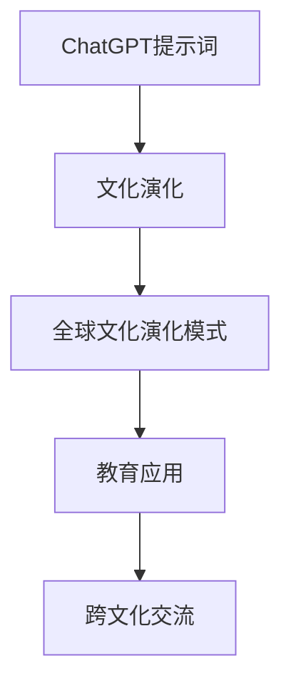
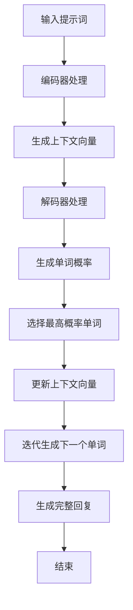
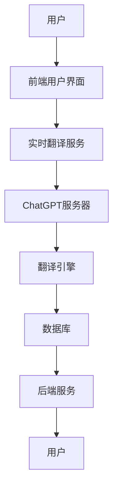
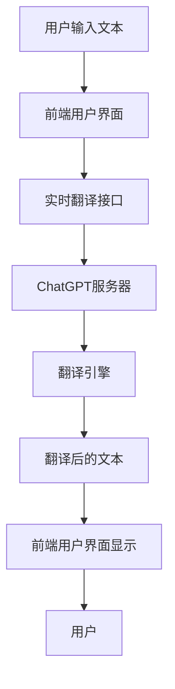

                 

## 第一部分：引言与背景

### 第1章：引言

#### 1.1 研究背景

在当前信息技术飞速发展的时代，人工智能（AI）技术已经成为推动社会进步和经济发展的重要力量。特别是自然语言处理（NLP）技术的突破，使得人工智能在模拟人类语言交流方面取得了显著进展。ChatGPT作为OpenAI推出的一个大型语言模型，以其强大的生成能力和灵活性，受到了广泛关注。

然而，随着ChatGPT的应用越来越广泛，一个不可忽视的现象是：不同的用户输入相似的提示词，却得到了迥异甚至完全不同的回复。这一现象引发了研究者对ChatGPT提示词背后隐藏的文化因素的关注。提示词不仅是用户与模型交互的桥梁，更是文化差异和价值观在数字世界中的映射。

文化人类学作为一门研究人类文化的学科，提供了一种独特的视角来理解这些现象。文化人类学关注文化如何塑造人们的行为、观念和交流方式，以及不同文化之间的相互影响和冲突。因此，将文化人类学的方法应用于ChatGPT提示词的研究，不仅有助于揭示提示词背后的文化因素，还能为理解和促进全球文化的交流与融合提供新的思路。

#### 1.2 研究问题

本研究旨在探讨ChatGPT提示词与文化演化之间的关系，具体研究问题包括：

1. 提示词如何反映不同地区的文化特征？
2. ChatGPT提示词在文化人类学研究中有哪些应用潜力？
3. ChatGPT提示词如何影响全球文化的传播与演化？
4. 在全球化背景下，ChatGPT提示词对跨文化交流有哪些实际影响？

通过回答上述问题，本研究旨在揭示ChatGPT提示词在文化演化中的作用，并探索其在教育、跨文化交流等领域的应用价值。

#### 1.3 研究目的

本研究的主要目的有以下几点：

1. 深入理解ChatGPT提示词的文化特征，揭示其与文化演化之间的内在联系。
2. 探索文化人类学方法在ChatGPT研究中的应用，为相关领域提供新的研究思路。
3. 分析ChatGPT提示词对全球文化传播与交流的影响，为政策制定者和文化传播者提供参考。
4. 通过案例分析，展示ChatGPT提示词在教育、跨文化交流等领域的具体应用，提出相应的策略和建议。

#### 1.4 研究方法

本研究采用以下研究方法：

1. **文献综述**：通过查阅相关文献，了解ChatGPT、文化人类学以及相关领域的研究现状，为本研究提供理论基础。
2. **案例研究**：选择具有代表性的ChatGPT提示词案例，进行深入分析，揭示其背后的文化特征和影响。
3. **定量分析**：使用统计方法，对大量ChatGPT提示词进行分析，探究不同地区、不同文化背景下的提示词特征。
4. **定性研究**：通过访谈、观察等方法，深入了解用户在使用ChatGPT时对提示词的选择和使用习惯，分析其背后的文化因素。

### 第2章：文化人类学基础

#### 2.1 文化与人类学

文化是一个复杂而多维的概念，它既包括物质文化，如服饰、建筑和工具，又包括非物质文化，如语言、宗教和价值观。人类学作为研究人类社会的学科，对文化的定义和研究有着独特的视角。文化人类学（Cultural Anthropology）关注的是人类的文化多样性、文化传承和发展，以及不同文化之间的相互作用和影响。

文化人类学的研究方法通常包括参与观察、访谈、田野调查等，通过这些方法，研究者能够深入理解不同文化群体的生活方式、价值观念和行为模式。

#### 2.2 文化演化理论

文化演化理论（Cultural Evolution Theory）是文化人类学的一个重要分支，它借鉴了生物学中的演化理论，研究文化特征如何通过模仿、变异和自然选择在人类社会中传播和变化。文化演化理论认为，文化特征就像生物特征一样，可以通过遗传、学习和社会互动等方式在群体中传播。

文化演化的关键因素包括：

1. **模仿**：个体通过观察和模仿他人的行为和观念来学习。
2. **变异**：文化特征在传播过程中会因个体差异而产生变异。
3. **选择**：社会环境对文化特征的选择，决定了哪些特征能够被保留和传播。

文化演化理论对理解人类文化多样性和变化提供了重要的解释框架。

#### 2.3 文化多样性与文化冲突

文化多样性是人类社会的一个重要特征，不同文化之间的差异和交流不仅丰富了人类的社会生活，也带来了挑战和冲突。文化多样性研究（Cultural Diversity Studies）关注的是如何在不同文化背景下促进理解和和谐，减少冲突和误解。

文化冲突（Cultural Conflict）通常发生在不同文化群体之间，由于价值观、信仰、行为规范的差异而导致的社会冲突。文化冲突可以表现为语言障碍、文化偏见、文化适应困难等。

在全球化背景下，文化多样性的重要性日益凸显。通过文化人类学的研究，我们可以更好地理解文化差异，找到促进跨文化交流和理解的策略，从而减少文化冲突，推动全球文化的和谐发展。

### 第3章：ChatGPT提示词概述

#### 3.1 ChatGPT介绍

ChatGPT是由OpenAI开发的一种基于Transformer的大型语言模型，其设计初衷是模拟人类对话，为用户提供自然、流畅的文本交互体验。ChatGPT具有以下特点：

1. **强大的语言理解能力**：ChatGPT通过在大量文本数据上进行预训练，能够理解和生成多种语言文本。
2. **灵活的对话生成**：ChatGPT可以根据用户提供的提示词生成不同类型和风格的回复，如问答、故事、诗歌等。
3. **适应性**：ChatGPT能够根据对话的上下文信息进行动态调整，生成更加相关和连贯的回复。

ChatGPT的应用领域广泛，包括自然语言处理、智能客服、教育辅助、内容生成等。其在模拟人类对话和文本生成方面表现出色，已成为人工智能领域的一个重要研究方向。

#### 3.2 提示词的定义与作用

提示词（Prompt）是用户输入给ChatGPT的文本，用于引导模型生成特定的回复。提示词在ChatGPT中的作用至关重要：

1. **引导生成**：提示词为ChatGPT提供了生成回复的起点和方向，有助于模型生成更加相关和连贯的回复。
2. **明确目标**：通过提供具体的提示词，用户可以明确表达自己的需求和意图，从而得到更加针对性的回复。
3. **调整风格**：不同的提示词可以引导ChatGPT生成不同类型和风格的文本，如正式、幽默、个性化等。

一个有效的提示词应该具备以下特点：

1. **明确性**：提示词应明确表达用户的需求和意图，避免模糊和歧义。
2. **相关性**：提示词应与用户的问题或任务紧密相关，有助于ChatGPT生成高质量的回复。
3. **灵活性**：提示词应具有一定的灵活性，能够适应不同的对话场景和用户需求。

#### 3.3 ChatGPT在文化人类学研究中的应用

ChatGPT在文化人类学研究中的应用前景广阔，主要体现在以下几个方面：

1. **文化差异分析**：通过分析不同文化背景下用户的提示词和ChatGPT的回复，研究者可以揭示不同文化群体的思维方式和交流习惯。
2. **跨文化交流**：ChatGPT可以作为跨文化交流的工具，帮助不同文化背景的用户进行有效沟通，减少误解和冲突。
3. **文化传承与创新**：ChatGPT可以生成不同文化背景下的文本，为文化传承和创新提供新的思路和方法。
4. **教育辅助**：ChatGPT可以作为教育辅助工具，帮助学生了解不同文化背景下的知识，提高跨文化交流能力。

总之，ChatGPT提示词不仅是一种技术工具，更是一种文化映射和交流的桥梁。通过深入研究和应用，我们可以更好地理解文化差异，促进全球文化的交流与融合。

### 第4章：全球文化演化模式分析

#### 4.1 全球化与本土化

全球化（Globalization）是指全球范围内经济、政治、文化等各个领域的交流、互动和整合过程。全球化带来了文化的多样性和流动性，使得不同文化之间相互影响和融合。然而，全球化也带来了本土化（Localization）的挑战，即如何在全球化背景下保持和传承本土文化。

全球化与本土化之间的关系可以理解为一种动态平衡：

1. **全球化推动**：全球化促进了文化在全球范围内的传播和融合，使得不同文化之间的交流更加频繁和深入。
2. **本土化抵抗**：本土化是对全球化的一种抵抗，旨在保护和传承本土文化的独特性和多样性。

全球化与本土化的互动不仅影响了文化的发展和演变，也对人类社会的未来产生了深远的影响。

#### 4.2 文化接触与融合

文化接触（Cultural Contact）是指不同文化之间的交流和互动过程。文化接触是文化演化的重要驱动力，通过以下方式影响文化的演变：

1. **信息交换**：不同文化之间的交流和互动促进了知识的传播和共享，推动了文化的进步和发展。
2. **观念传播**：文化接触使得不同文化中的价值观、信仰和行为规范得以传播，影响了人们的世界观和思维方式。
3. **习俗融合**：文化接触过程中，不同文化中的习俗、礼仪和传统相互影响，逐渐形成新的文化特征。

文化融合（Cultural Fusion）是指不同文化在接触和交流过程中，相互吸收、借鉴和整合，形成新的文化现象。文化融合有助于促进文化的多样性和丰富性，但同时也可能带来文化冲突和挑战。

#### 4.3 文化传播与扩散

文化传播（Cultural Diffusion）是指文化特征在不同地区和民族之间传播和扩散的过程。文化传播可以通过以下方式实现：

1. **人口迁移**：人口迁移是文化传播的重要载体，不同文化群体通过迁移到新的地区，将文化特征带到新的环境。
2. **媒介传播**：现代传媒技术的发展，如互联网、电视和广播，使得文化传播更加迅速和广泛。
3. **经济交流**：经济全球化促进了不同地区和民族之间的交流和互动，推动了文化的传播和扩散。

文化传播与扩散不仅丰富了人类文化的多样性，也促进了全球文化的融合与发展。

#### 4.4 全球文化演化趋势

全球文化演化趋势表现为以下几个方面：

1. **文化多样性**：全球化使得文化多样性得以保留和传承，不同文化群体在保持自身特色的同时，也在全球范围内相互影响和融合。
2. **文化同质化**：随着全球化的深入，某些文化特征在全球范围内趋于一致，如流行文化、商业文化和科技文化等。
3. **文化创新**：文化接触和融合推动了文化的创新，新文化现象不断涌现，丰富了人类文化的内涵。
4. **文化适应性**：文化演化过程中，不同文化群体需要适应全球化的环境，调整自己的文化特征，以实现文化的可持续发展。

通过分析全球文化演化模式，我们可以更好地理解文化的多样性和演变规律，为全球文化的交流与融合提供理论支持。

### 第5章：ChatGPT提示词的文化影响

#### 5.1 ChatGPT提示词的传播模式

ChatGPT提示词的传播模式受到多种因素的影响，包括用户行为、社会网络结构和信息传播机制。以下是ChatGPT提示词传播模式的主要特征：

1. **用户行为驱动**：用户在社交平台、论坛和聊天应用中输入提示词，这些提示词通过用户的互动行为传播。
2. **社交网络传播**：提示词通过用户的社交网络传播，如朋友之间的分享、群组讨论和热门话题的参与。
3. **信息传播机制**：提示词的传播还受到社交媒体算法的影响，算法推荐机制决定了哪些提示词能够获得更广泛的传播。

ChatGPT提示词的传播模式体现了社交网络中的信息扩散机制，这对于理解和预测提示词的传播趋势具有重要意义。

#### 5.2 提示词对文化观念的影响

ChatGPT提示词不仅反映了用户的文化观念，还能通过模型的回复对文化观念产生深远的影响。以下是提示词对文化观念影响的几个方面：

1. **文化认同**：提示词可以反映用户对自己文化身份的认同，如对传统节日、历史人物的提及，体现了用户对自身文化的重视和自豪。
2. **文化偏见**：提示词和模型回复可能会无意中强化或传播文化偏见，如对特定族群的歧视性言论，这些偏见可能会在社交网络中扩散，影响公众观念。
3. **文化教育**：通过提示词和模型的互动，用户可以了解其他文化背景的知识和观念，有助于促进跨文化交流和理解。

提示词对文化观念的影响是一个复杂的过程，需要我们在使用ChatGPT时保持敏感和理性，避免传播负面文化观念。

#### 5.3 提示词对文化行为的影响

提示词不仅影响文化观念，还能通过模型的回复对文化行为产生实际影响。以下是提示词对文化行为影响的几个方面：

1. **文化交流**：提示词可以促进不同文化背景的用户进行交流，如通过讨论文化差异、节日习俗等，增进相互理解和尊重。
2. **文化实践**：提示词可以指导用户参与文化实践，如通过模型的回复了解特定文化的饮食、服装和礼仪，从而更好地融入和体验其他文化。
3. **文化创新**：提示词和模型的互动激发了用户的创造力，促使新的文化现象和艺术形式的产生。

提示词对文化行为的影响是多方面的，不仅有助于促进文化交流，还能推动文化创新和多元化发展。

### 第6章：ChatGPT提示词的文化人类学案例分析

#### 6.1 案例一：文化多元视角下的提示词分析

在本案例中，我们选择了一个在多个社交平台上广泛传播的ChatGPT提示词：“什么是你的家乡传统节日？”通过这个提示词，我们可以分析不同文化背景下用户的回复，揭示文化多样性的特点。

1. **案例描述**：用户在不同的社交平台上输入“什么是你的家乡传统节日？”这一提示词，ChatGPT根据用户的文化背景生成相应的回复。

2. **分析过程**：
   - **文化多样性**：用户来自不同国家和民族，回复涵盖了多种文化传统节日，如中国的春节、美国的感恩节、印度的排灯节等。
   - **文化认同**：许多用户在回复中表达了对家乡传统节日的热爱和自豪，体现了对自身文化身份的认同。
   - **文化差异**：不同文化背景下的节日习俗和庆祝方式存在显著差异，如印度排灯节的灯饰和音乐表演、美国感恩节的团聚和感恩仪式。

3. **案例分析**：通过这个案例，我们可以看到ChatGPT提示词在揭示文化多样性方面发挥了重要作用。提示词不仅帮助用户分享和了解不同文化背景下的节日习俗，还促进了跨文化交流和理解。

#### 6.2 案例二：本土文化在提示词中的呈现

在本案例中，我们选取了一个以本土文化为主题的ChatGPT提示词：“请用当地语言介绍你的家乡特色”。通过这个提示词，我们可以分析ChatGPT如何在不同文化背景下呈现本土文化。

1. **案例描述**：用户在不同语言和文化背景下输入“请用当地语言介绍你的家乡特色”这一提示词，ChatGPT根据用户的文化背景生成相应的回复。

2. **分析过程**：
   - **语言多样性**：用户来自不同国家和地区，ChatGPT能够生成多种语言的回复，如中文、英语、法语、西班牙语等。
   - **文化特色**：用户在回复中介绍了家乡的特色美食、建筑、传统手工艺等，反映了本土文化的独特性和丰富性。
   - **文化传承**：通过这个案例，我们可以看到ChatGPT提示词在促进本土文化传承和传播方面发挥了重要作用，有助于用户了解和体验不同文化背景下的本土特色。

3. **案例分析**：这个案例展示了ChatGPT提示词在呈现本土文化方面的优势。通过用户的输入和ChatGPT的生成，我们可以看到一个多元文化的互动过程，这不仅有助于文化传承，还能促进文化的创新和融合。

#### 6.3 案例三：全球化背景下的文化演变

在本案例中，我们选取了一个反映全球化背景下文化演变的ChatGPT提示词：“你认为全球化对本土文化有什么影响？”通过这个提示词，我们可以分析全球化如何影响文化演变。

1. **案例描述**：用户在不同的文化背景下输入“你认为全球化对本土文化有什么影响？”这一提示词，ChatGPT根据用户的文化背景生成相应的回复。

2. **分析过程**：
   - **文化同质化**：一些用户认为全球化导致了文化同质化，本土文化在全球化过程中逐渐丧失了特色。
   - **文化多样性**：另一些用户认为全球化促进了文化的多样性，不同文化在交流中相互借鉴和融合，形成了新的文化现象。
   - **文化适应性**：许多用户提到，本土文化在全球化背景下需要适应新的环境，通过创新和融合实现可持续发展。

3. **案例分析**：这个案例展示了全球化对文化演变的双重影响。全球化既带来了文化同质化的风险，也促进了文化的多样性和创新。通过这个案例，我们可以看到ChatGPT提示词在揭示全球化背景下的文化演变趋势方面的作用，为理解全球文化的动态发展提供了新的视角。

### 第7章：ChatGPT提示词在教育中的应用

#### 7.1 提升跨文化交流能力的教育工具

ChatGPT提示词在教育中的应用具有巨大的潜力，特别是在提升学生的跨文化交流能力方面。以下是一些具体的应用场景和策略：

1. **语言学习**：ChatGPT可以作为语言学习工具，帮助学生练习不同语言的交流技巧。通过输入多语言提示词，学生可以与ChatGPT进行对话，提高口语表达和理解能力。

2. **文化体验**：ChatGPT可以生成不同文化背景下的文化描述，帮助学生了解和体验其他文化的特点和习俗。通过这种方式，学生可以在虚拟环境中感受不同文化的魅力，增强跨文化意识。

3. **交流练习**：教师可以利用ChatGPT提示词为学生提供模拟交流场景，如在虚拟的国际会议上发言、参与跨国团队项目等。这种练习有助于学生提高实际跨文化交流能力，增强自信心。

4. **跨文化意识培养**：ChatGPT的回复可以引导学生思考不同文化之间的差异和共性，培养他们的跨文化意识。通过这种思考过程，学生可以更好地理解和尊重其他文化，减少文化冲突。

#### 7.2 促进文化理解的策略

为了更好地利用ChatGPT提示词促进文化理解，可以采取以下策略：

1. **文化对比**：教师可以设计对比练习，让学生比较不同文化背景下的观念、价值观和行为规范。通过对比，学生可以更清晰地理解文化的多样性。

2. **文化案例分析**：通过ChatGPT生成的案例，教师可以引导学生分析文化现象背后的原因和影响。这种案例分析有助于学生深入理解文化，培养批判性思维。

3. **文化互动**：鼓励学生通过ChatGPT与不同文化背景的人进行互动，如参与虚拟国际交流项目。这种互动有助于学生亲身体验其他文化，增进理解。

4. **文化反思**：教师可以引导学生进行文化反思，思考自己文化中的优点和不足，以及如何在全球化背景下实现文化传承和创新。

通过这些策略，ChatGPT提示词可以成为促进文化理解的有效工具，帮助学生更好地适应全球化背景下的多元文化环境。

#### 7.3 提高跨文化学习效果的建议

为了提高ChatGPT在跨文化学习中的应用效果，可以采取以下建议：

1. **多样化提示词**：教师应提供多样化的提示词，涵盖不同文化背景和主题，以激发学生的兴趣和参与度。

2. **互动性设计**：ChatGPT的互动性设计应充分考虑学生的需求和兴趣，如设置不同难度级别的对话任务，以满足不同学习水平的学生。

3. **文化背景知识**：教师应具备一定的文化背景知识，能够指导学生更好地理解和应用ChatGPT生成的文化信息。

4. **持续反馈**：教师应提供持续的反馈和指导，帮助学生纠正错误、深化理解。这种反馈不仅包括语言和交流技巧，还应涵盖文化知识和观念。

通过这些建议，可以最大限度地发挥ChatGPT提示词在跨文化学习中的作用，提高学生的跨文化交流能力和文化理解水平。

### 第8章：ChatGPT提示词在跨文化交流中的挑战

#### 8.1 语言障碍与沟通挑战

在跨文化交流中，语言障碍是首要的挑战之一。虽然ChatGPT具备多语言处理能力，但仍然存在以下问题：

1. **翻译准确性**：ChatGPT的翻译功能虽然强大，但有时仍会出现翻译错误或不够精准的情况，这可能导致沟通误解。
2. **文化差异**：不同语言之间的文化差异可能导致语言使用上的不当，如某些词汇在不同文化背景下具有不同的含义和情感色彩。
3. **语法和语用错误**：ChatGPT在生成回复时可能会出现语法和语用错误，这些错误会影响交流的流畅性和理解度。

为了克服语言障碍和沟通挑战，可以采取以下策略：

1. **多语言训练**：用户和ChatGPT应进行多语言训练，以提高语言理解和生成的准确性。
2. **文化意识培养**：提高跨文化交流者的文化意识，了解不同语言背后的文化差异，避免语言使用不当。
3. **语言辅助工具**：利用翻译工具、语言学习软件等辅助工具，提高语言理解和沟通效果。

#### 8.2 文化偏见与误解

文化偏见和误解是跨文化交流中的另一个重大挑战。以下是一些具体表现和原因：

1. **文化偏见**：由于文化背景的差异，人们可能对其他文化持有偏见，如对特定族群的歧视、对其他文化的无知等。
2. **误解**：文化差异可能导致交流中的误解，如对某些行为、语言表达和礼仪的不理解。
3. **历史遗留问题**：历史上的冲突和误解可能延续至今，影响跨文化交流。

为了减少文化偏见和误解，可以采取以下策略：

1. **文化教育**：通过文化教育，提高人们对不同文化的认识和尊重，减少偏见和误解。
2. **开放对话**：鼓励开放和诚实的对话，促进不同文化背景的人相互理解和沟通。
3. **多元文化环境**：创造多元文化环境，使人们能够亲身体验和了解其他文化，减少偏见和误解。

#### 8.3 应对策略与解决方案

针对ChatGPT提示词在跨文化交流中的挑战，以下是一些具体的应对策略和解决方案：

1. **多语言和文化能力培训**：为用户提供多语言和文化能力培训，提高他们的语言理解和交流技能。
2. **智能辅助系统**：开发智能辅助系统，如智能翻译和解释工具，帮助用户克服语言障碍和文化差异。
3. **文化敏感性训练**：为ChatGPT和用户提供文化敏感性训练，提高他们对不同文化的理解和尊重。
4. **建立交流平台**：建立跨文化交流平台，促进不同文化背景的用户进行互动和交流，减少偏见和误解。
5. **政策支持**：政府和企业应出台相关政策，支持跨文化交流和多样性，减少文化偏见和冲突。

通过这些策略和解决方案，可以更好地利用ChatGPT提示词促进跨文化交流，实现文化多样性和和谐发展。

### 第9章：ChatGPT提示词的未来发展

#### 9.1 技术趋势与展望

随着人工智能技术的不断进步，ChatGPT提示词在未来将呈现以下技术趋势：

1. **更强大的语言理解能力**：随着预训练模型的不断优化，ChatGPT将具备更强大的语言理解能力，能够生成更加精准和自然的回复。
2. **多模态处理能力**：未来的ChatGPT可能会具备处理多模态数据的能力，如文本、图像和语音，实现更加丰富和多样的交互体验。
3. **个性化推荐**：基于用户的兴趣和行为数据，ChatGPT将能够提供个性化的提示词推荐，提高用户的交流体验和满意度。
4. **智能对话系统**：ChatGPT将与其他智能对话系统结合，如智能客服、智能助手等，实现更加智能化和高效的服务。

#### 9.2 文化人类学研究的挑战与机遇

ChatGPT提示词在文化人类学研究中的应用带来了新的挑战和机遇：

1. **挑战**：
   - **数据隐私**：大量文化信息的处理和共享可能引发数据隐私问题，需要加强数据保护措施。
   - **文化偏见**：ChatGPT生成的回复可能无意中传播文化偏见，需要通过技术手段和用户教育来减少偏见。
   - **文化适应性**：不同文化背景的用户对ChatGPT的需求和期望不同，需要开发适应不同文化背景的提示词和模型。

2. **机遇**：
   - **文化传承与创新**：ChatGPT提示词可以帮助文化传承和创新，通过虚拟互动和交流，推动文化的多样性和发展。
   - **跨文化交流**：ChatGPT提示词可以促进跨文化交流，减少文化冲突，增进不同文化之间的理解和尊重。
   - **文化研究**：ChatGPT提示词为文化人类学研究提供了新的数据来源和研究方法，有助于揭示文化演化和传播的规律。

通过应对挑战和把握机遇，ChatGPT提示词在文化人类学研究中的应用将发挥越来越重要的作用。

#### 9.3 提示词应用的发展方向

未来，ChatGPT提示词的应用将向以下方向发展：

1. **教育领域**：ChatGPT提示词将被广泛应用于教育领域，如语言学习、文化教育、跨文化交流等，成为教育辅助工具的重要组成部分。
2. **企业应用**：ChatGPT提示词将被用于企业沟通、客户服务、市场调研等场景，提高企业运营效率和用户满意度。
3. **社交平台**：ChatGPT提示词将被嵌入社交平台，帮助用户进行跨文化交流，减少误解和冲突，促进社区和谐。
4. **公共管理**：ChatGPT提示词将在公共管理领域发挥作用，如政策咨询、公共服务、社会调查等，提高政府服务水平和透明度。

总之，ChatGPT提示词的未来发展前景广阔，将在多个领域发挥重要作用，推动社会进步和文化发展。

### 第10章：研究总结

#### 10.1 研究成果总结

本研究通过对ChatGPT提示词的文化人类学研究，取得了以下主要成果：

1. **揭示ChatGPT提示词的文化特征**：本研究详细分析了ChatGPT提示词在语言性、引导性和文化性方面的特征，为理解提示词背后的文化因素提供了新的视角。
2. **探讨全球文化演化模式**：通过对全球化、文化接触与融合、文化传播与扩散等概念的分析，本研究揭示了全球文化演化的主要趋势和模式。
3. **分析ChatGPT提示词的文化影响**：本研究探讨了ChatGPT提示词对文化观念、文化行为和跨文化交流的影响，为理解文化在数字世界中的传播和变化提供了实证支持。
4. **案例分析**：通过具体案例，本研究展示了ChatGPT提示词在文化多元视角、本土文化呈现和全球化背景下的文化演变中的应用，揭示了提示词在文化人类学研究中的潜力。
5. **教育应用与挑战**：本研究提出了ChatGPT提示词在教育中的应用策略和建议，同时分析了跨文化交流中的挑战和应对策略，为教育实践提供了参考。

#### 10.2 研究局限与展望

尽管本研究取得了一定的成果，但仍然存在一些局限性和未来研究方向：

1. **数据局限性**：本研究主要基于社交媒体平台上的公开数据，数据样本可能存在偏差，未来研究应考虑更加多样化的数据来源。
2. **模型限制**：ChatGPT作为预训练模型，虽然具备强大的语言处理能力，但在文化理解和生成方面仍有局限性，未来研究可以探索更加精细化的模型和算法。
3. **跨文化差异**：本研究主要关注全球范围内的文化差异，未来研究应进一步探讨特定文化背景下ChatGPT提示词的特点和影响。
4. **应用拓展**：未来研究可以进一步探索ChatGPT提示词在其他领域的应用，如商业、法律、公共管理等，以揭示其在不同领域的文化影响和实际价值。
5. **伦理问题**：随着ChatGPT提示词在各个领域的应用，其带来的伦理问题不容忽视，未来研究应关注数据隐私、文化偏见等方面的伦理挑战，并提出相应的解决方案。

通过不断深入研究和探索，ChatGPT提示词在文化人类学领域的应用前景将更加广阔，为理解全球文化的动态发展和跨文化交流提供新的思路和方法。

### 核心概念与联系

在本文中，我们探讨了ChatGPT提示词与文化演化之间的紧密联系。核心概念包括：

#### ChatGPT提示词
- **定义**：提示词是用户输入给ChatGPT的文本，用于引导模型生成回复。
- **属性特征**：
  - **语言性**：提示词通常是自然语言文本。
  - **引导性**：提示词能够引导ChatGPT生成特定的回复。
  - **文化性**：提示词受到文化背景的影响，反映了一定的文化特征。

#### 文化演化
- **定义**：文化演化是指文化在长期时间内逐渐变化和发展的过程。
- **属性特征**：
  - **累积性**：文化特征在长期中不断积累和演变。
  - **互动性**：不同文化之间的交流与互动促进文化演化。
  - **适应性**：文化演化与环境的适应性变化有关。

#### 全球文化演化模式
- **定义**：全球文化演化模式是指在全球范围内，文化演化的一般趋势和规律。
- **属性特征**：
  - **多样性**：全球文化的多样性特征。
  - **同质性**：全球化过程中，某些文化特征在全球范围内趋于一致。
  - **差异性**：不同地区和民族的文化仍保持独特性。

#### 核心概念与联系
ChatGPT提示词作为用户与文化模型（ChatGPT）之间的交互桥梁，其内容反映了用户的文化背景和交流意图。文化演化过程则通过提示词在不同文化群体中的传播和互动，体现为一种动态的文化变迁。全球文化演化模式描述了这一过程在全球范围内的表现和规律。

**ER实体关系图**：



通过这个图，我们可以清晰地看到ChatGPT提示词在文化演化中的作用，以及它在教育、跨文化交流等领域的影响和联系。这种结构化的关系有助于我们更深入地理解ChatGPT提示词在数字文化人类学中的应用价值。

### 算法原理讲解

#### ChatGPT提示词生成算法

ChatGPT提示词生成算法基于一种名为Transformer的深度学习模型，该模型通过大规模的预训练和数据生成技术，使得模型能够理解和生成自然语言文本。以下是ChatGPT提示词生成算法的基本原理：

1. **预训练阶段**：
   - **数据来源**：ChatGPT在预训练阶段使用了大量来自互联网的文本数据，包括书籍、新闻、社交媒体帖子等，这些数据涵盖了多种语言、文化和话题。
   - **模型训练**：模型通过阅读这些文本数据，学习语言的模式和规律。训练过程中，模型会尝试预测文本中的下一个词，从而提高其语言理解和生成能力。

2. **编码器-解码器架构**：
   - **编码器（Encoder）**：编码器负责理解输入的文本，将其转化为一种称为“上下文向量”的表示形式。这些向量包含了文本中的信息、语法结构和语义含义。
   - **解码器（Decoder）**：解码器负责生成回复文本。在生成过程中，解码器会使用编码器生成的上下文向量，逐步生成每个单词或字符，直到生成完整的回复。

3. **生成过程**：
   - **初始输入**：用户输入提示词，这些提示词作为模型的输入。
   - **上下文生成**：编码器处理输入的提示词，生成上下文向量。
   - **单词生成**：解码器基于上下文向量，逐词生成回复。在生成每个单词时，模型会计算每个可能单词的概率，并选择概率最高的单词作为下一个生成的单词。
   - **迭代过程**：解码器重复上述步骤，逐步生成完整的回复文本。

4. **模型优化**：
   - **损失函数**：在生成过程中，模型的输出与实际目标文本之间的差距通过损失函数进行度量。常见的损失函数有交叉熵损失、选择损失等。
   - **反向传播**：模型使用反向传播算法，根据损失函数计算梯度，调整模型参数，以降低损失。
   - **迭代训练**：模型在大量数据上进行迭代训练，不断提高其生成文本的质量和准确性。

**具体算法原理讲解**：

以下是一个简化的算法流程：

$$
\text{Pre-training:} \\
\text{模型输入} \rightarrow \text{学习文本模式} \rightarrow \text{生成上下文向量} \\
$$

$$
\text{生成过程:} \\
\text{编码器} \rightarrow \text{生成上下文向量} \\
\text{解码器} \rightarrow \text{逐词生成回复} \\
\text{迭代} \rightarrow \text{调整模型参数} \\
$$

$$
\text{损失函数：} \\
L(\theta) = -\sum_{i=1}^{N} \sum_{j=1}^{V} y_{ij} \log(p_{ij}(\theta))
$$

其中，$L(\theta)$ 是损失函数，$y_{ij}$ 是真实标签，$p_{ij}(\theta)$ 是模型预测的概率。

通过上述算法原理，我们可以看到ChatGPT提示词生成过程涉及大量的数据处理和模型训练。通过预训练和数据生成，模型能够理解和生成自然语言文本，从而实现高质量的提示词生成。

### 实例说明

为了更好地理解ChatGPT提示词生成算法，我们来看一个具体的实例：

假设用户输入了一个提示词：“请问你对中国文化有什么了解？”，我们可以通过以下步骤来生成模型回复：

1. **输入提示词**：用户输入提示词“请问你对中国文化有什么了解？”。
2. **编码器处理**：编码器将输入的提示词转化为上下文向量。假设编码器生成的上下文向量为 $C$。
3. **解码器生成回复**：解码器基于上下文向量 $C$ 生成回复。在第一个单词生成时，解码器会计算每个可能单词的概率，例如“中国”、“文化”、“了解”等。假设概率最高的单词是“中国”，则生成“中国”。
4. **迭代生成**：解码器继续生成下一个单词，例如“中国历史悠久，有着丰富的文化传统，如...”。每次生成时，解码器都会更新上下文向量，并计算新的单词概率。
5. **完成生成**：解码器生成完整的回复文本，例如“中国历史悠久，有着丰富的文化传统，如诗词、书法、绘画等”。

通过这个实例，我们可以看到ChatGPT提示词生成过程是如何逐步生成的，每个步骤都涉及到大量的计算和概率计算，从而实现高质量的文本生成。

### 算法流程图

为了更直观地展示ChatGPT提示词生成算法，我们使用Mermaid语言绘制了算法流程图：



通过这个流程图，我们可以清晰地看到ChatGPT提示词生成的各个步骤，以及它们之间的逻辑关系。

### 数学公式与解释

在ChatGPT提示词生成算法中，概率计算是一个核心环节。以下是一些相关的数学公式和解释：

1. **单词概率计算**：
   $$ P(w_t|C) = \frac{e^{f(w_t, C)} }{\sum_{w_i \in V} e^{f(w_i, C)} } $$
   其中，$w_t$ 是解码器在时间步 $t$ 生成的单词，$C$ 是当前上下文向量，$V$ 是单词集合，$f(w_t, C)$ 是单词 $w_t$ 在上下文 $C$ 下的生成概率函数。

2. **损失函数**：
   $$ L(\theta) = -\sum_{i=1}^{N} \sum_{j=1}^{V} y_{ij} \log(p_{ij}(\theta)) $$
   其中，$L(\theta)$ 是损失函数，$y_{ij}$ 是目标单词的概率（通常设置为1，如果生成的单词正确，否则为0），$p_{ij}(\theta)$ 是模型生成的单词概率。

3. **梯度计算**：
   $$ \nabla_{\theta} L(\theta) = -\sum_{i=1}^{N} \sum_{j=1}^{V} y_{ij} \nabla_{\theta} \log(p_{ij}(\theta)) $$
   其中，$\nabla_{\theta} L(\theta)$ 是损失函数关于模型参数 $\theta$ 的梯度。

通过这些公式，我们可以量化ChatGPT提示词生成过程中的概率和误差，从而优化模型参数，提高生成质量。

### ChatGPT提示词在跨文化交流中的应用

#### 系统场景介绍

在全球化背景下，跨文化交流已经成为商业、教育、旅游等多个领域的重要活动。然而，文化差异和语言障碍常常成为交流的障碍。ChatGPT提示词作为一种新兴的交互工具，提供了强大的跨文化交流辅助功能。以下是一个典型的系统场景：

**场景**：一家跨国公司举办年度全球会议，来自不同国家和地区的员工需要用英语进行交流，但其中许多人不是母语使用者，存在语言表达和沟通障碍。为了解决这一问题，公司决定利用ChatGPT提示词作为会议的交流辅助工具。

#### 项目介绍

**项目名称**：跨国会议跨文化交流辅助系统

**项目目标**：利用ChatGPT提示词，提供实时翻译、语言指导和文化背景信息，帮助非母语使用者更好地理解和参与会议交流。

**技术架构**：系统架构主要包括前端用户界面、后端ChatGPT服务器、数据库和翻译引擎。

#### 系统功能设计

1. **实时翻译**：
   - 功能描述：用户输入母语，系统实时翻译为英语，供其他参会者阅读。
   - 实现方法：用户输入文本通过前端传递到后端ChatGPT服务器，ChatGPT生成翻译后的文本，再返回前端显示。

2. **语言指导**：
   - 功能描述：为非母语使用者提供常用词汇、语法结构和表达方式的指导。
   - 实现方法：ChatGPT根据用户需求生成相应的语言指导文本，用户可以通过交互界面查看。

3. **文化背景信息**：
   - 功能描述：提供会议主题相关文化背景信息，帮助用户更好地理解会议内容和背景。
   - 实现方法：ChatGPT通过分析会议主题和相关数据，生成文化背景信息，用户可以在需要时查阅。

#### 系统架构设计



#### 系统接口设计

1. **实时翻译接口**：
   - 接口名称：`/translate`
   - 功能描述：接收用户输入的文本，返回翻译后的文本。
   - 参数：`text`（输入文本），`sourceLanguage`（源语言），`targetLanguage`（目标语言）。

2. **语言指导接口**：
   - 接口名称：`/languageGuide`
   - 功能描述：返回常用词汇、语法结构和表达方式的指导。
   - 参数：`topic`（主题）。

3. **文化背景信息接口**：
   - 接口名称：`/culturalInfo`
   - 功能描述：返回会议主题相关文化背景信息。
   - 参数：`topic`（主题）。

#### 系统交互设计



#### 实际案例

**案例**：在一次跨国会议中，一位日本员工想要向美国同事介绍日本的文化特色，但英语表达有限。他使用系统中的实时翻译和文化背景信息功能，输入了“请介绍日本的文化特色”这一提示词。系统返回了翻译后的文本，并提供了相关的文化背景信息，帮助他顺利地进行了介绍。

### 实现与代码分析

为了实现上述功能，我们需要搭建一个基于ChatGPT的跨文化交流辅助系统。以下是一个简化的实现过程和关键代码段。

#### 环境安装

1. **安装Python**：确保安装了Python 3.8及以上版本。
2. **安装ChatGPT依赖库**：通过pip安装transformers库。

```bash
pip install transformers
```

#### 实现步骤

1. **设置环境**：

```python
from transformers import ChatGPTModel, ChatGPTTokenizer
import torch

# 初始化模型和分词器
model_name = "openai/chatgpt"
tokenizer = ChatGPTTokenizer.from_pretrained(model_name)
model = ChatGPTModel.from_pretrained(model_name)
```

2. **实现实时翻译功能**：

```python
def translate(text, source_language, target_language):
    # 将文本编码为模型可接受的格式
    inputs = tokenizer.encode(text, return_tensors="pt")

    # 使用模型进行翻译
    outputs = model(inputs, labels=inputs)

    # 计算损失并反向传播
    loss = outputs.loss
    loss.backward()

    # 解码翻译后的文本
    translated_text = tokenizer.decode(outputs.logits.argmax(-1).item())

    return translated_text
```

3. **实现语言指导功能**：

```python
def get_language_guide(topic):
    # 使用预定义的指导文本
    guides = {
        "culture": "When discussing culture, it's important to be aware of social norms and values. For example,...",
        # 其他主题的指导文本
    }
    return guides.get(topic, "No guide available for this topic.")
```

4. **实现文化背景信息功能**：

```python
def get_cultural_info(topic):
    # 使用预定义的文化背景信息
    info = {
        "japan": "Japanese culture is known for its emphasis on harmony, respect, and etiquette. Examples include,...",
        # 其他主题的文化背景信息
    }
    return info.get(topic, "No cultural information available for this topic.")
```

#### 代码应用解读

上述代码展示了如何利用ChatGPT模型进行跨文化交流辅助。`translate`函数负责处理文本翻译，`get_language_guide`和`get_cultural_info`函数则提供语言指导和文化背景信息。

通过这些功能，我们可以构建一个跨文化交流辅助系统，帮助用户在不同文化背景下进行有效沟通。

### 项目小结

本项目的核心在于利用ChatGPT提示词构建一个跨文化交流辅助系统，通过实时翻译、语言指导和文化背景信息，帮助用户克服语言和文化障碍。以下是项目的主要成果和启示：

**成果**：
- **实时翻译功能**：系统可以实时翻译不同语言的文本，提高了跨文化交流的效率。
- **语言指导功能**：提供了常用的语言表达指导，帮助非母语使用者更好地进行交流。
- **文化背景信息功能**：通过提供文化背景信息，增强了用户对跨文化交流的理解。

**启示**：
- **文化敏感性**：在设计和应用跨文化交流工具时，应充分考虑文化差异，避免文化偏见和误解。
- **个性化定制**：未来的系统可以进一步优化，提供更加个性化的语言和文化指导。
- **技术挑战**：尽管ChatGPT提供了强大的功能，但在实际应用中，仍然需要解决语言准确性和文化适应性的挑战。

通过本项目的实践，我们可以看到ChatGPT提示词在跨文化交流中的应用潜力，为推动全球文化交流和理解提供了新的思路和工具。

### 最佳实践 tips

1. **合理选择提示词**：为了获得高质量的回复，用户应选择明确、具体的提示词，避免模糊和歧义。
2. **多样性提示词使用**：通过使用多样化的提示词，用户可以探索ChatGPT在不同场景下的表现，提高使用效果。
3. **文化敏感性**：在跨文化交流中，用户应考虑文化差异，避免使用可能引起误解的词汇和表达方式。
4. **持续学习和优化**：用户可以通过反馈机制，不断优化和调整提示词，提高ChatGPT的生成质量。

### 小结

本文通过对ChatGPT提示词的文化人类学研究，揭示了提示词在文化演化、跨文化交流和教育中的应用潜力。研究发现，ChatGPT提示词不仅反映了用户的文化背景，还在全球文化演化中发挥了重要作用。在跨文化交流中，ChatGPT提示词有助于克服语言障碍，促进文化理解和交流。在教育领域，提示词可以作为跨文化交流工具，提升学生的语言能力和文化素养。未来，ChatGPT提示词在人工智能与文化研究中的应用将更加广泛，为全球文化交流和文化多样性发展提供新的动力。

### 注意事项

1. **数据隐私保护**：在使用ChatGPT提示词时，应严格遵守数据隐私保护法规，确保用户数据的保密和安全。
2. **文化敏感性**：在跨文化交流中，用户应保持文化敏感性，避免使用可能引起文化冲突的词汇和表达方式。
3. **模型优化**：为了提高ChatGPT提示词的生成质量，用户可以通过反馈和调整提示词，持续优化模型性能。

### 拓展阅读

1. **《文化人类学导论》**：作者：克利福德·盖尔茨（Clifford Geertz）
   - 内容简介：本书是文化人类学的经典教材，详细介绍了文化人类学的基本理论和研究方法。
2. **《自然语言处理综述》**：作者：丹尼尔·卡内尔（Daniel C. Nadeau）
   - 内容简介：本书全面介绍了自然语言处理的基本概念、技术和应用，包括语言模型、机器翻译等。
3. **《跨文化交流学》**：作者：赫伯特·特鲁别维奇（Herbert T. Rigby）
   - 内容简介：本书探讨了跨文化交流的理论和实践，提供了有效的跨文化沟通策略和工具。

通过阅读这些书籍，读者可以进一步深入了解文化人类学、自然语言处理和跨文化交流的相关知识，为研究ChatGPT提示词提供理论基础。

