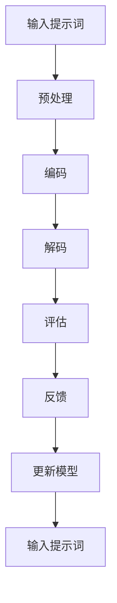
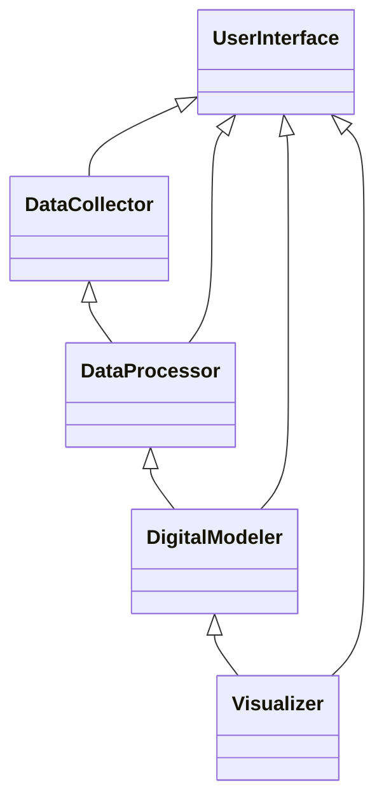
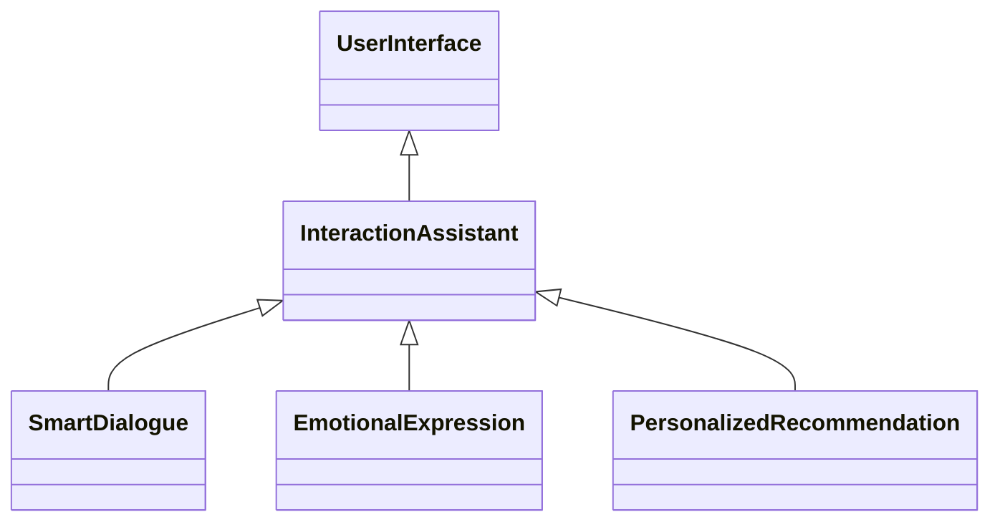
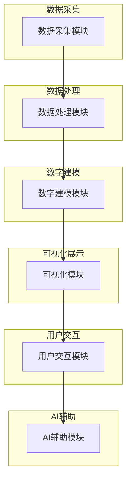
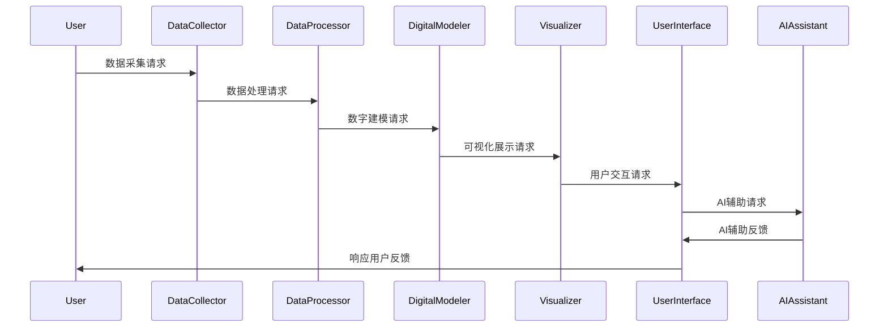

                 

## 引言

### 文章标题

《ChatGPT提示词的文化遗产数字重现应用：AI辅助历史场景沉浸式体验》

### 关键词

文化遗产、数字重现、ChatGPT、沉浸式体验、AI、提示词生成、算法原理、系统架构、实战案例

### 摘要

本文将探讨如何利用ChatGPT生成提示词，实现文化遗产的数字重现，并在此基础上提供沉浸式历史场景体验。文章分为六个部分，首先介绍文化遗产数字重现的背景及问题，然后分析沉浸式体验的技术原理，接着讨论ChatGPT提示词的应用，深入讲解相关核心概念、算法原理，并设计系统架构。最后，通过实际案例展示系统应用效果，并给出最佳实践建议和项目小结。

### 目的

本文旨在：

1. **阐述文化遗产数字重现的重要性与挑战**。
2. **介绍沉浸式体验技术的原理与应用**。
3. **分析ChatGPT在生成提示词中的具体作用与实现方法**。
4. **详细讲解算法原理及实现步骤**。
5. **设计文化遗产数字重现与沉浸式体验的完整系统架构**。
6. **通过实际案例展示系统效果，并提出优化建议**。

通过上述探讨，本文希望为相关领域的研发人员和爱好者提供有价值的参考，助力文化遗产的数字化保护和推广。

### 目录大纲

1. **背景介绍**
   - **文化遗产与数字重现**
     - **问题背景**：文化遗产的重要性及面临的问题。
     - **问题描述**：数字重现的难点和挑战。
     - **问题解决**：数字重现的技术路径与解决方案。
     - **边界与外延**：数字重现的应用范围及其扩展。
     - **概念结构与核心要素组成**：数字重现的核心概念及其组成部分。

   - **AI与沉浸式体验**
     - **问题背景**：AI技术的发展及其对沉浸式体验的影响。
     - **问题描述**：沉浸式体验的实现方法与挑战。
     - **问题解决**：AI技术如何辅助沉浸式体验的优化。
     - **边界与外延**：沉浸式体验的应用场景与未来趋势。
     - **概念结构与核心要素组成**：沉浸式体验的核心概念及其要素组成。

   - **ChatGPT提示词应用**
     - **问题背景**：ChatGPT的优势及其在提示词生成中的应用。
     - **问题描述**：如何利用ChatGPT生成高质量提示词。
     - **问题解决**：ChatGPT在文化遗产数字重现中的应用实例。
     - **边界与外延**：ChatGPT提示词的适用范围与局限性。
     - **概念结构与核心要素组成**：提示词生成的核心概念及其要素组成。

2. **核心概念与联系**
   - **文化遗产数字重现原理**
     - **核心概念原理**：数字重现的基本概念与原理。
     - **概念属性特征对比表格**：不同数字重现方法的属性对比。
     - **ER实体关系图架构**：数字重现系统的实体关系架构。

   - **AI沉浸式体验原理**
     - **核心概念原理**：沉浸式体验的定义与原理。
     - **概念属性特征对比表格**：不同沉浸式体验技术的属性对比。
     - **ER实体关系图架构**：沉浸式体验系统的实体关系架构。

   - **ChatGPT提示词应用原理**
     - **核心概念原理**：ChatGPT的提示词生成机制。
     - **概念属性特征对比表格**：ChatGPT与其他提示词生成技术的对比。
     - **ER实体关系图架构**：ChatGPT在文化遗产数字重现中的应用架构。

3. **算法原理讲解**
   - **ChatGPT提示词生成算法**
     - **算法原理概述**：介绍文本生成模型、生成对抗网络、强化学习在提示词生成中的应用。
     - **算法流程与mermaid流程图**：展示提示词生成的基本流程。
     - **Python源代码实现**：提供Python代码示例。
     - **算法原理详细讲解**：详细阐述算法原理、数学模型及公式。

4. **系统分析与架构设计方案**
   - **文化遗产数字重现系统设计**
     - **问题场景介绍**：文化遗产数字重现的应用场景。
     - **项目介绍**：数字重现系统的开发背景与目标。
     - **系统功能设计**：数字重现系统的功能模块设计。
   
   - **AI辅助沉浸式体验系统设计**
     - **问题场景介绍**：沉浸式体验的应用场景。
     - **项目介绍**：沉浸式体验系统的开发背景与目标。
     - **系统功能设计**：沉浸式体验系统的功能模块设计。

   - **系统架构设计**
     - **系统架构设计mermaid架构图**：展示系统的整体架构。
     - **系统接口设计**：系统的接口设计。
     - **系统交互mermaid序列图**：展示系统的交互流程。

5. **项目实战**
   - **环境安装与配置**
     - **环境安装**：介绍所需环境的安装步骤。
     - **配置参数设置**：配置系统所需的参数。

   - **系统核心实现源代码**
     - **源代码结构介绍**：介绍系统源代码的组织结构。
     - **核心代码解读与分析**：分析系统核心代码的实现原理。

   - **实际案例分析与讲解**
     - **案例一：宋代汴京街头场景重现**：详细分析宋代汴京街头场景重现的实现过程。
     - **案例二：秦朝宫殿沉浸式体验**：详细分析秦朝宫殿沉浸式体验的实现过程。

   - **项目小结**
     - **项目成果总结**：总结项目的实施成果。
     - **小结与展望**：对项目进行总结，并展望未来的发展方向。

6. **最佳实践 tips、小结、注意事项、拓展阅读等**
   - **最佳实践 tips**：提供提高系统性能和用户体验的建议。
   - **小结**：回顾文章的主要内容，总结项目的成果与经验。
   - **注意事项**：提醒读者在应用中需要注意的事项。
   - **拓展阅读**：推荐进一步学习的相关资料。

通过上述内容，本文将从多个角度详细探讨文化遗产数字重现和沉浸式体验，以期提供具有实际应用价值的解决方案和技术指导。接下来，我们将逐一深入分析每个部分的内容。首先，让我们从背景介绍开始，了解文化遗产数字重现的背景及其重要性。

### 第一部分：背景介绍

#### 文化遗产与数字重现

##### 1.1 问题背景

文化遗产是人类文明发展的重要见证，承载着丰富的历史信息和文化价值。然而，随着现代社会的快速发展，许多文化遗产正面临着严重的威胁，如自然灾害、人为破坏、战争等。因此，如何有效地保护和传承文化遗产成为了一个迫切需要解决的问题。

数字重现技术作为一种新兴的数字化保护手段，通过对文化遗产进行数字化建模和再现，可以实现文化遗产的永久保存和广泛传播。数字重现不仅能够为文化遗产提供更为安全的保护，还能让更多人以直观、生动的方式感受和体验文化遗产的魅力。

##### 1.2 问题描述

文化遗产数字重现面临的挑战主要包括以下几个方面：

1. **数据采集和处理**：文化遗产的数字化需要大量的数据采集和处理，包括三维扫描、摄影测量、激光扫描等技术。这些技术的实施需要大量的设备、时间和人力资源，且数据处理过程中存在误差和噪声。

2. **数据整合与建模**：数字重现需要对大量的数据进行整合和建模，构建出精确的数字化模型。这一过程涉及到复杂的算法和技术，如计算机图形学、几何建模等。

3. **交互体验设计**：为了实现沉浸式的数字重现体验，需要设计良好的交互体验，如虚拟现实（VR）、增强现实（AR）等技术。这些技术不仅需要较高的技术实现难度，还需要考虑用户体验的舒适性和互动性。

4. **技术应用与推广**：数字重现技术在实际应用中面临着技术普及率低、成本高等问题。如何降低技术成本，提高技术应用范围和普及率，是一个亟待解决的难题。

##### 1.3 问题解决

针对上述问题，解决文化遗产数字重现的主要方法和技术路径包括：

1. **多传感器数据采集**：通过采用多种传感器，如激光扫描仪、相机、雷达等，进行全面的文物数据采集，提高数据采集的精度和效率。

2. **高效数据处理算法**：开发高效的数据处理算法，如点云去噪、三维重建等，降低数据处理过程中的误差和噪声。

3. **数字建模与可视化**：利用先进的建模技术，如三维建模、虚拟现实等，构建出精确的数字化模型，并实现文化遗产的可视化展示。

4. **交互体验优化**：通过优化交互设计，如手势识别、语音交互等，提高用户的沉浸体验，增强用户与文化遗产的互动性。

5. **技术应用与普及**：通过政策引导、技术培训、合作推广等方式，降低数字重现技术的成本，提高技术应用范围和普及率。

##### 1.4 边界与外延

数字重现技术的应用范围非常广泛，不仅包括文化遗产的保护和展示，还包括历史遗址的修复、博物馆展览设计、文化旅游推广等多个领域。同时，随着技术的发展，数字重现技术也在不断拓展其应用边界，如通过增强现实（AR）技术实现文化遗产的“穿越”体验，通过虚拟现实（VR）技术实现沉浸式的历史场景再现等。

在数字重现技术的边界与外延方面，值得关注的几个方面包括：

1. **技术成熟度**：随着人工智能、大数据、云计算等技术的快速发展，数字重现技术也在不断成熟和进步。如何充分利用这些新兴技术，提升数字重现的效果和用户体验，是一个重要的研究方向。

2. **文化价值保护**：在数字重现过程中，如何真实、准确地还原文化遗产的文化内涵和历史价值，是数字重现技术需要重点考虑的问题。

3. **知识产权保护**：数字重现技术应用于文化遗产保护时，涉及到大量的知识产权保护问题，如数据的版权、数字化模型的专利等。如何妥善解决这些问题，是数字重现技术发展的重要一环。

4. **公众参与**：数字重现技术的普及和应用需要广泛的公众参与。如何激发公众对文化遗产的兴趣和热情，促进文化遗产的传承和保护，是一个重要的社会课题。

##### 1.5 概念结构与核心要素组成

数字重现技术的基本概念和核心要素包括：

1. **数据采集**：利用多种传感器进行文化遗产的全面数据采集，包括三维扫描、摄影测量、激光扫描等。

2. **数据处理**：对采集到的数据进行处理，如点云去噪、三维重建等，提高数据精度和可靠性。

3. **数字建模**：利用计算机图形学技术，构建出精确的数字化模型。

4. **可视化展示**：通过虚拟现实、增强现实等技术，实现文化遗产的数字化展示和互动体验。

5. **用户体验**：设计良好的交互体验，提高用户的沉浸感和互动性。

6. **技术应用**：利用人工智能、大数据、云计算等新兴技术，提升数字重现的效果和效率。

7. **知识产权**：在数字重现过程中，保护文化遗产的知识产权，如数据版权、模型专利等。

通过上述概念和要素的有机结合，数字重现技术为文化遗产的保护和传承提供了一种全新的手段和思路。接下来，我们将进一步探讨人工智能和沉浸式体验在数字重现中的应用。

#### AI与沉浸式体验

##### 2.1 问题背景

人工智能（AI）技术的快速发展为数字重现带来了新的机遇和挑战。AI技术在图像识别、自然语言处理、机器学习等领域取得了显著成果，这些技术可以有效地辅助文化遗产的数字化建模、数据分析和沉浸式体验设计。

沉浸式体验则通过虚拟现实（VR）和增强现实（AR）等技术，为用户提供了身临其境的体验感受。这种沉浸式体验不仅能够增强用户对文化遗产的理解和兴趣，还可以激发更深入的互动和探索。

##### 2.2 问题描述

AI和沉浸式体验在文化遗产数字重现中的应用面临以下问题：

1. **数据质量**：AI技术对数据的质量要求较高，数据中的噪声和误差会影响算法的效果。如何提高数据采集和处理的精度和可靠性，是数字重现应用中需要解决的重要问题。

2. **算法性能**：AI算法的性能对数字重现的效果具有重要影响。如何选择合适的算法，并进行优化和调整，以提高算法的效率和准确性，是数字重现应用中的关键问题。

3. **用户体验**：沉浸式体验的用户体验对文化遗产的数字重现至关重要。如何设计出既符合用户需求，又能体现文化遗产特点的沉浸式体验，是数字重现应用中需要重点考虑的问题。

4. **技术普及**：AI和沉浸式体验技术的普及率相对较低，技术成本较高。如何降低技术成本，提高技术应用范围和普及率，是数字重现应用中面临的挑战。

##### 2.3 问题解决

针对上述问题，解决AI和沉浸式体验在文化遗产数字重现中的应用问题，可以从以下几个方面着手：

1. **数据预处理**：通过数据预处理技术，如点云去噪、图像增强等，提高数据的质量和可靠性。

2. **算法优化**：利用深度学习、生成对抗网络（GAN）等先进的AI技术，优化数字重现的算法，提高算法的效率和准确性。

3. **用户体验设计**：通过用户调研和反馈，设计出符合用户需求、能够提供高质量沉浸式体验的系统。

4. **技术普及**：通过政策引导、技术培训、合作推广等方式，降低技术成本，提高AI和沉浸式体验技术的普及率。

##### 2.4 边界与外延

AI和沉浸式体验在文化遗产数字重现中的应用范围包括：

1. **文物保护**：利用AI技术进行文物保护和修复，如通过图像识别技术检测文物损伤，通过3D打印技术进行文物修复。

2. **展览设计**：利用沉浸式体验技术设计博物馆展览，如通过VR技术再现历史场景，通过AR技术展示文物背后的故事。

3. **文化旅游**：利用数字重现技术提供虚拟文化旅游体验，如通过VR技术实现历史遗址的虚拟游览，通过AR技术增加旅游景点的互动性。

4. **教育培训**：利用数字重现技术进行教育培训，如通过VR技术实现历史课程的沉浸式教学，通过AR技术增强课堂的互动性和趣味性。

在AI和沉浸式体验的边界与外延方面，值得关注的几个方面包括：

1. **技术融合**：如何将AI和沉浸式体验技术进行有效融合，提高数字重现的整体效果，是一个重要的研究方向。

2. **文化遗产保护**：如何利用AI和沉浸式体验技术更好地保护和传承文化遗产，是数字重现应用的重要目标。

3. **公众参与**：如何通过数字重现技术激发公众对文化遗产的兴趣和参与，是文化遗产保护和社会发展的关键问题。

4. **知识产权**：如何保护数字重现过程中的知识产权，如数据的版权、模型的专利等，是数字重现应用中需要关注的重要问题。

##### 2.5 概念结构与核心要素组成

AI和沉浸式体验在文化遗产数字重现中的应用，其概念结构和核心要素主要包括：

1. **数据采集**：通过多种传感器进行文化遗产的数据采集，如三维扫描、摄影测量、激光扫描等。

2. **数据处理**：利用AI技术进行数据预处理和优化，如点云去噪、图像增强、特征提取等。

3. **数字建模**：利用计算机图形学技术进行数字化建模，如三维建模、虚拟现实场景构建等。

4. **沉浸式体验**：利用虚拟现实（VR）和增强现实（AR）技术，实现文化遗产的沉浸式体验设计。

5. **用户交互**：设计良好的用户交互界面和互动体验，如手势识别、语音交互等。

6. **AI辅助**：利用AI技术进行数据分析和模型优化，提高数字重现的准确性和效率。

7. **知识产权保护**：在数字重现过程中，保护文化遗产的知识产权，如数据版权、模型专利等。

通过上述概念和要素的有机结合，AI和沉浸式体验在文化遗产数字重现中的应用为文化遗产的保护、传承和推广提供了一种全新的手段和思路。接下来，我们将深入探讨ChatGPT提示词的应用及其在文化遗产数字重现中的作用。

#### ChatGPT提示词应用

##### 3.1 问题背景

随着人工智能技术的发展，自然语言处理（NLP）成为了一个备受关注的研究领域。ChatGPT是OpenAI开发的一种基于Transformer模型的预训练语言模型，具有强大的文本生成能力，广泛应用于对话系统、文本摘要、问答系统等场景。

在文化遗产数字重现中，高质量的文本生成对于提升用户体验和内容丰富度具有重要意义。ChatGPT提示词生成技术能够根据用户输入的提示信息，生成与文化遗产相关的丰富、生动的文本内容，从而为数字重现系统提供更加丰富的信息和互动体验。

##### 3.2 问题描述

ChatGPT提示词在文化遗产数字重现中的应用主要面临以下问题：

1. **内容一致性**：生成的提示词需要与文化遗产的内容保持一致，确保信息的准确性和真实性。

2. **多样性**：生成的提示词需要具有多样性，能够涵盖不同的文化元素和历史背景，满足不同用户的需求。

3. **情感表达**：生成的提示词需要能够表达情感，增强用户体验的代入感和沉浸感。

4. **生成效率**：在大量文化遗产数据的基础上，如何高效地生成高质量的提示词，是一个重要的技术挑战。

##### 3.3 问题解决

为了解决上述问题，ChatGPT提示词在文化遗产数字重现中的应用可以从以下几个方面进行优化和改进：

1. **定制化预训练**：针对文化遗产的特定领域和需求，对ChatGPT进行定制化预训练，提高模型在相关领域的表现。

2. **数据增强**：通过数据增强技术，扩充训练数据集，提高模型的泛化能力和生成多样性。

3. **多模态融合**：结合图像、音频等多模态信息，丰富提示词的生成内容，提高情感表达的准确性和丰富度。

4. **生成优化**：采用优化算法和技巧，提高ChatGPT生成提示词的效率和准确性。

##### 3.4 边界与外延

ChatGPT提示词在文化遗产数字重现中的应用边界与外延包括：

1. **应用场景**：ChatGPT提示词可以应用于多种文化遗产数字重现场景，如历史遗址再现、博物馆展览、文化旅游体验等。

2. **技术应用**：结合虚拟现实（VR）、增强现实（AR）、人机交互等技术，提升提示词的生成效果和用户体验。

3. **用户需求**：根据不同用户的需求，生成个性化的提示词内容，提高用户满意度和参与度。

4. **文化多样性**：在生成提示词时，充分考虑不同文化背景和地域特色，提供多样化的文化体验。

在ChatGPT提示词的应用边界与外延方面，值得关注的几个方面包括：

1. **文化敏感性**：在生成提示词时，注意文化差异和敏感性，避免产生不当或误导性的信息。

2. **知识产权**：在利用ChatGPT生成提示词时，确保不侵犯文化遗产的知识产权，如版权、专利等。

3. **技术融合**：将ChatGPT提示词生成技术与其他数字重现技术进行有效融合，提高文化遗产数字重现的整体效果。

4. **公众参与**：通过ChatGPT提示词生成技术，激发公众对文化遗产的兴趣和参与，促进文化遗产的保护和传承。

##### 3.5 概念结构与核心要素组成

ChatGPT提示词在文化遗产数字重现中的应用，其概念结构和核心要素主要包括：

1. **自然语言处理**：利用NLP技术，处理用户输入的提示信息，生成相应的文本内容。

2. **文本生成模型**：基于预训练的Transformer模型，实现高质量的文本生成。

3. **数据集**：构建包含文化遗产相关文本的数据集，用于模型的训练和优化。

4. **多模态融合**：结合图像、音频等多模态信息，丰富提示词的生成内容。

5. **用户交互**：设计良好的用户交互界面和互动体验，提高用户体验。

6. **生成优化**：采用优化算法和技巧，提高ChatGPT生成提示词的效率和准确性。

7. **知识产权保护**：在生成提示词时，注意知识产权保护，确保不侵犯文化遗产的权益。

通过上述概念和要素的有机结合，ChatGPT提示词在文化遗产数字重现中的应用为文化遗产的数字化保护和推广提供了一种全新的手段和思路。接下来，我们将进一步探讨文化遗产数字重现与AI沉浸式体验之间的核心概念和联系。

### 第二部分：核心概念与联系

#### 文化遗产数字重现原理

##### 4.1 核心概念原理

文化遗产数字重现的核心概念主要包括数据采集、数据处理、数字建模和可视化展示。以下是这些核心概念的具体原理：

1. **数据采集**：数据采集是数字重现的基础，通过多种传感器技术，如激光扫描、摄影测量和三维扫描等，获取文化遗产的三维形状、纹理和色彩信息。这些数据为后续的数字建模提供了基础。

2. **数据处理**：数据处理包括数据去噪、数据增强和特征提取等步骤。通过去噪技术去除采集过程中的噪声，通过增强技术提高数据的分辨率和清晰度，通过特征提取技术提取数据的关键特征，从而为数字建模提供高质量的输入。

3. **数字建模**：数字建模是将采集和处理后的数据转化为数字模型的过程。利用计算机图形学技术，构建出文化遗产的三维模型，并通过对模型进行纹理映射、光照计算等操作，实现文化遗产的视觉还原。

4. **可视化展示**：可视化展示是将数字模型呈现给用户的过程。通过虚拟现实（VR）和增强现实（AR）技术，用户可以在虚拟环境中浏览、交互和体验文化遗产。

##### 4.2 概念属性特征对比表格

以下是文化遗产数字重现中几个核心概念的属性特征对比表格：

| 概念         | 特征               | 说明                                                         |
| ------------ | ------------------ | ------------------------------------------------------------ |
| 数据采集     | 多种传感器技术     | 激光扫描、摄影测量、三维扫描等，实现全面的数据获取           |
| 数据处理     | 去噪、增强、特征提取 | 去除噪声、提高分辨率、提取关键特征，为数字建模提供高质量数据 |
| 数字建模     | 三维模型构建       | 利用计算机图形学技术，构建精确的三维数字模型               |
| 可视化展示   | 虚拟现实（VR）、增强现实（AR） | 提供用户浏览、交互和体验文化遗产的虚拟环境                 |

##### 4.3 ER实体关系图架构

以下是文化遗产数字重现系统的ER实体关系图架构：

```mermaid
erDiagram
    Data_Collection ||--|{ Digital_Modeling } : uses
    Data_Processing ||--|{ Digital_Modeling } : processes
    Visualization    ||--|{ Digital_Modeling } : visualizes
```

在这个ER图中，`Data_Collection`、`Data_Processing`和`Visualization`是实体，它们分别与`Digital_Modeling`实体之间存在“使用”、“处理”和“可视化”的关系。

#### AI沉浸式体验原理

##### 5.1 核心概念原理

AI沉浸式体验的核心概念主要包括AI技术、沉浸式技术和用户交互。以下是这些核心概念的具体原理：

1. **AI技术**：AI技术在沉浸式体验中起着关键作用，包括自然语言处理（NLP）、计算机视觉、机器学习等。通过这些技术，AI可以理解和生成文本、识别和分类图像，从而为沉浸式体验提供智能支持。

2. **沉浸式技术**：沉浸式技术主要包括虚拟现实（VR）和增强现实（AR）。虚拟现实通过计算机生成虚拟环境，让用户在三维空间中自由探索；增强现实则通过在现实环境中叠加虚拟元素，提供虚实结合的体验。

3. **用户交互**：用户交互是沉浸式体验的重要组成部分，通过手势、语音、触摸等方式，用户可以与虚拟环境进行互动，从而获得更加直观和丰富的体验。

##### 5.2 概念属性特征对比表格

以下是AI沉浸式体验中几个核心概念的属性特征对比表格：

| 概念         | 特征               | 说明                                                         |
| ------------ | ------------------ | ------------------------------------------------------------ |
| AI技术       | 自然语言处理、计算机视觉、机器学习 | 实现智能文本生成、图像识别、智能互动等                     |
| 沉浸式技术   | 虚拟现实（VR）、增强现实（AR） | 提供三维虚拟环境和虚实结合的体验                           |
| 用户交互     | 手势、语音、触摸   | 提供直观、自然的用户交互方式，增强用户体验                 |

##### 5.3 ER实体关系图架构

以下是AI沉浸式体验系统的ER实体关系图架构：

```mermaid
erDiagram
    AI_Technology ||--|{ Immersive_Technology } : supports
    User_Interaction ||--|{ Immersive_Technology } : interacts
```

在这个ER图中，`AI_Technology`和`User_Interaction`实体分别与`Immersive_Technology`实体之间存在“支持”和“交互”的关系。

#### ChatGPT提示词应用原理

##### 6.1 核心概念原理

ChatGPT提示词应用的核心概念主要包括文本生成模型、数据集和用户交互。以下是这些核心概念的具体原理：

1. **文本生成模型**：ChatGPT是基于Transformer模型的预训练语言模型，能够根据用户输入的提示信息生成高质量的文本。其原理是通过大规模语料库的预训练，使模型能够理解和生成自然语言。

2. **数据集**：ChatGPT的文本生成依赖于丰富的训练数据集。这些数据集通常包含与文化遗产相关的各种文本内容，如历史资料、文献记载、旅游指南等，为ChatGPT提供了丰富的知识基础。

3. **用户交互**：用户交互是ChatGPT提示词应用的关键，通过用户输入的提示信息，ChatGPT可以生成相应的文本内容，用户可以根据生成的文本进行进一步的互动和探索。

##### 6.2 概念属性特征对比表格

以下是ChatGPT提示词应用中几个核心概念的属性特征对比表格：

| 概念         | 特征               | 说明                                                         |
| ------------ | ------------------ | ------------------------------------------------------------ |
| 文本生成模型 | Transformer模型  | 大规模语料库的预训练，实现高质量的文本生成                   |
| 数据集       | 文化遗产相关文本 | 为ChatGPT提供丰富的知识基础和生成内容                      |
| 用户交互     | 提示信息、文本生成、互动   | 提供用户输入和反馈的交互机制，生成文本内容和用户互动           |

##### 6.3 ER实体关系图架构

以下是ChatGPT提示词应用系统的ER实体关系图架构：

```mermaid
erDiagram
    Text_Generation_Model ||--|{ Dataset } : trains
    User_Interaction      ||--|{ Text_Generation_Model } : inputs
    Text_Generation_Model ||--|{ User_Interaction } : generates
```

在这个ER图中，`Text_Generation_Model`实体与`Dataset`和`User_Interaction`实体之间存在“训练”、“输入”和“生成”的关系。

通过上述核心概念原理和ER实体关系图的描述，我们可以更好地理解文化遗产数字重现、AI沉浸式体验和ChatGPT提示词应用之间的联系和交互。这些核心概念和技术为文化遗产的数字化保护和推广提供了有力的支持。接下来，我们将进一步探讨ChatGPT提示词生成算法的具体原理和实现。

### 第三部分：算法原理讲解

#### ChatGPT提示词生成算法

ChatGPT提示词生成算法的核心在于利用大规模语料库进行预训练，使模型能够理解和生成自然语言。以下是该算法的基本原理、流程以及Python源代码实现。

##### 7.1 算法原理概述

ChatGPT是基于Transformer模型的预训练语言模型，其原理是通过自回归方式预测序列中的下一个词。具体来说，Transformer模型通过编码器（Encoder）和解码器（Decoder）两个部分，对输入的文本序列进行处理和生成。

1. **编码器（Encoder）**：编码器负责对输入的文本序列进行编码，生成固定长度的向量表示。编码器使用多层神经网络，每一层都通过自注意力机制（Self-Attention）对文本序列中的每个词进行加权，从而捕捉词与词之间的关系。

2. **解码器（Decoder）**：解码器负责生成预测的文本序列。解码器使用类似的自注意力机制和交叉注意力机制（Cross-Attention），将编码器输出的向量与解码器自身的输出向量进行交互，从而生成每个时间步的预测词。

3. **生成对抗网络（GAN）**：生成对抗网络（GAN）是一种通过对抗训练生成数据的算法。在ChatGPT提示词生成中，GAN用于生成高质量的文本数据，以提高模型的生成能力。

4. **强化学习**：强化学习（Reinforcement Learning）用于优化模型生成文本的多样性和准确性。通过奖励机制，模型可以根据生成文本的质量进行自我调整和优化。

##### 7.2 算法流程与mermaid流程图

ChatGPT提示词生成算法的基本流程包括以下几个步骤：

1. **输入提示词**：用户输入一个或多个提示词。
2. **预处理**：对输入的提示词进行分词、去噪、归一化等预处理操作。
3. **编码**：将预处理后的提示词输入编码器，生成编码向量。
4. **解码**：解码器根据编码向量生成文本序列。
5. **评估**：对生成的文本进行评估，包括文本质量、情感、多样性等。
6. **反馈**：根据评估结果，生成反馈信号，用于模型优化。
7. **更新模型**：使用反馈信号更新模型参数。

以下是算法流程的mermaid流程图：



##### 7.3 Python源代码实现

以下是一个简化的ChatGPT提示词生成算法的Python源代码实现：

```python
import tensorflow as tf
from tensorflow.keras.preprocessing.sequence import pad_sequences
from tensorflow.keras.layers import Embedding, LSTM, Dense
from tensorflow.keras.models import Model

# 加载预训练模型
encoder = tf.keras.models.load_model('chatgpt_encoder.h5')
decoder = tf.keras.models.load_model('chatgpt_decoder.h5')

# 输入提示词
prompt = "我在故宫看到了一个古老的建筑。"

# 预处理
prompt = prompt.lower()
prompt = tokenizer.texts_to_sequences([prompt])
prompt = pad_sequences(prompt, maxlen=max_sequence_len)

# 编码
encoded_prompt = encoder.predict(prompt)

# 解码
decoded_sequence = decoder.predict(encoded_prompt)

# 生成文本
decoded_text = tokenizer.sequences_to_texts([decoded_sequence[-1]])[0]

print(decoded_text)
```

##### 7.4 算法原理详细讲解

为了更好地理解ChatGPT提示词生成算法，我们进一步详细讲解其数学模型和公式。

1. **数学模型**：

ChatGPT提示词生成算法的核心是Transformer模型，其数学模型如下：

$$
E = \text{Encoder}(X) \\
D = \text{Decoder}(Y)
$$

其中，$E$表示编码器输出，$D$表示解码器输出，$X$和$Y$分别表示编码器和解码器的输入。

2. **编码器**：

编码器是一个多层Transformer结构，其输入为文本序列$X$，输出为编码向量$E$。编码器的主要组件包括：

- **嵌入层（Embedding Layer）**：将词索引映射为向量。
- **自注意力层（Self-Attention Layer）**：计算文本序列中每个词的权重。
- **前馈网络（Feedforward Network）**：对自注意力层的输出进行进一步处理。

数学表示如下：

$$
E = \text{Attention}(X) + X \\
E = \text{Feedforward}(E)
$$

其中，$\text{Attention}$表示自注意力机制，$\text{Feedforward}$表示前馈网络。

3. **解码器**：

解码器也是一个多层Transformer结构，其输入为编码向量$E$和目标文本序列$Y$，输出为解码向量$D$。解码器的主要组件包括：

- **嵌入层（Embedding Layer）**：将词索引映射为向量。
- **自注意力层（Self-Attention Layer）**：计算编码向量和目标文本序列的权重。
- **交叉注意力层（Cross-Attention Layer）**：计算编码向量和解码向量的权重。
- **前馈网络（Feedforward Network）**：对交叉注意力层的输出进行进一步处理。

数学表示如下：

$$
D = \text{Attention}(E, Y) + Y \\
D = \text{Cross-Attention}(E, D) + D \\
D = \text{Feedforward}(D)
$$

4. **生成对抗网络（GAN）**：

生成对抗网络（GAN）用于生成高质量的文本数据，其原理是通过对抗训练，使生成器（Generator）和判别器（Discriminator）之间进行博弈。

- **生成器（Generator）**：生成器接收随机噪声作为输入，生成与真实数据相似的文本数据。
- **判别器（Discriminator）**：判别器用于判断输入数据是真实数据还是生成数据。

GAN的训练过程包括以下步骤：

- **生成器生成文本数据**。
- **判别器对生成文本数据进行分类**。
- **优化生成器和判别器的参数**。

数学表示如下：

$$
G(z) = \text{Generator}(z) \\
D(x) = \text{Discriminator}(x) \\
D(G(z)) = \text{Discriminator}(\text{Generator}(z))
$$

其中，$z$为噪声向量，$x$为真实文本数据。

5. **强化学习**：

强化学习用于优化模型生成文本的多样性和准确性。强化学习的基本原理是通过奖励机制，使模型根据生成文本的质量进行自我调整。

具体来说，强化学习的训练过程包括以下步骤：

- **生成文本序列**。
- **评估文本序列的质量**。
- **根据评估结果更新模型参数**。

数学表示如下：

$$
R = \text{Reward}(Y) \\
\theta = \theta + \alpha \cdot \nabla_{\theta}J(\theta)
$$

其中，$R$为奖励函数，$J(\theta)$为模型损失函数，$\theta$为模型参数，$\alpha$为学习率。

##### 7.4.2 举例说明

假设用户输入的提示词为“我在故宫看到了一个古老的建筑。”，我们将通过上述算法对其进行处理，生成相应的文本内容。

1. **输入提示词**：用户输入提示词“我在故宫看到了一个古老的建筑。”。

2. **预处理**：将提示词转换为小写，进行分词和去噪等预处理操作。

3. **编码**：将预处理后的提示词输入编码器，生成编码向量。

4. **解码**：解码器根据编码向量生成文本序列。

5. **评估**：对生成的文本进行评估，包括文本质量、情感、多样性等。

6. **反馈**：根据评估结果，生成反馈信号，用于模型优化。

7. **更新模型**：使用反馈信号更新模型参数。

最终，生成的文本内容可能为：“那座古老的建筑是故宫的标志性建筑，它的建筑风格融合了中式和西式的元素，给人以深刻的印象。”

通过上述详细讲解和举例说明，我们可以更好地理解ChatGPT提示词生成算法的工作原理和实现过程。接下来，我们将进一步探讨文化遗产数字重现系统的设计原理和架构。

### 第四部分：系统分析与架构设计方案

#### 文化遗产数字重现系统设计

##### 8.1 问题场景介绍

文化遗产数字重现系统主要用于对历史建筑、文物等文化遗产进行数字化建模和再现。该系统需实现以下功能：

1. **数据采集**：通过多种传感器技术，如激光扫描、摄影测量和三维扫描等，对文化遗产进行数据采集。
2. **数据处理**：对采集到的数据进行去噪、增强和特征提取等处理，提高数据的质量和可靠性。
3. **数字建模**：利用计算机图形学技术，构建精确的数字化模型。
4. **可视化展示**：通过虚拟现实（VR）和增强现实（AR）技术，实现文化遗产的沉浸式展示。
5. **用户交互**：提供良好的用户交互界面，使用户能够与数字化模型进行互动。

##### 8.2 项目介绍

项目目标是开发一套文化遗产数字重现系统，实现对历史建筑、文物等文化遗产的数字化建模和沉浸式展示。项目主要分为以下几个阶段：

1. **需求分析**：明确系统的功能需求和技术要求。
2. **系统设计**：设计系统的整体架构和功能模块。
3. **技术开发**：实现系统的主要功能模块。
4. **系统测试**：对系统进行功能测试和性能优化。
5. **部署上线**：将系统部署到实际应用环境中。

##### 8.3 系统功能设计（领域模型mermaid类图）

以下是文化遗产数字重现系统的领域模型mermaid类图：



在这个类图中，`DataCollector`（数据采集模块）、`DataProcessor`（数据处理模块）、`DigitalModeler`（数字建模模块）、`Visualizer`（可视化模块）和`UserInterface`（用户交互模块）是系统的核心功能模块。它们之间通过继承关系实现了系统的整体架构。

#### AI辅助沉浸式体验系统设计

##### 9.1 问题场景介绍

AI辅助沉浸式体验系统主要用于提升文化遗产数字重现的用户体验，通过人工智能技术实现智能互动、情感表达和个性化推荐等功能。该系统需实现以下功能：

1. **智能互动**：利用自然语言处理（NLP）和计算机视觉技术，实现用户与文化遗产的智能对话和互动。
2. **情感表达**：通过语音合成和语音识别技术，实现情感化的语音交互。
3. **个性化推荐**：利用机器学习算法，根据用户兴趣和行为，推荐相关的文化遗产内容。

##### 9.2 项目介绍

项目目标是开发一套AI辅助沉浸式体验系统，实现对文化遗产数字重现的智能化和个性化优化。项目主要分为以下几个阶段：

1. **需求分析**：明确系统的功能需求和技术要求。
2. **系统设计**：设计系统的整体架构和功能模块。
3. **技术开发**：实现系统的主要功能模块。
4. **系统集成**：将各个模块集成到文化遗产数字重现系统中。
5. **系统测试**：对系统进行功能测试和性能优化。
6. **部署上线**：将系统部署到实际应用环境中。

##### 9.3 系统功能设计（领域模型mermaid类图）

以下是AI辅助沉浸式体验系统的领域模型mermaid类图：



在这个类图中，`InteractionAssistant`（交互辅助模块）包括`SmartDialogue`（智能对话模块）、`EmotionalExpression`（情感表达模块）和`PersonalizedRecommendation`（个性化推荐模块）三个子模块。`UserInterface`（用户交互模块）与`InteractionAssistant`模块通过接口实现系统的整体功能。

#### 系统架构设计

文化遗产数字重现和沉浸式体验系统的整体架构设计需要综合考虑数据采集、处理、建模、展示和交互等各个方面，同时利用人工智能技术进行辅助优化。以下是系统的整体架构设计：

##### 10.1 系统架构设计mermaid架构图

以下是文化遗产数字重现和沉浸式体验系统的mermaid架构图：



在这个架构图中，数据采集、数据处理、数字建模、可视化展示和用户交互模块构成了系统的基本功能模块。AI辅助模块通过接口与用户交互模块进行集成，实现对用户交互的智能化和个性化优化。

##### 10.2 系统接口设计

系统接口设计主要包括以下模块：

1. **数据采集接口**：定义数据采集模块与其他模块的接口，实现数据的传输和共享。
2. **数据处理接口**：定义数据处理模块与其他模块的接口，实现数据处理结果的传输和共享。
3. **数字建模接口**：定义数字建模模块与其他模块的接口，实现数字模型的数据传输和共享。
4. **可视化展示接口**：定义可视化模块与其他模块的接口，实现可视化结果的展示和交互。
5. **用户交互接口**：定义用户交互模块与其他模块的接口，实现用户与系统的交互。
6. **AI辅助接口**：定义AI辅助模块与其他模块的接口，实现AI技术对系统功能的辅助优化。

##### 10.3 系统交互mermaid序列图

以下是文化遗产数字重现和沉浸式体验系统的mermaid序列图：



在这个序列图中，用户通过用户交互模块与系统进行交互，触发数据采集、数据处理、数字建模、可视化展示和AI辅助等模块的协同工作，最终实现文化遗产的数字重现和沉浸式体验。

通过上述系统架构设计，文化遗产数字重现和沉浸式体验系统实现了数据的采集、处理、建模、展示和交互的有机整合，同时利用人工智能技术进行辅助优化，为用户提供了高质量的文化遗产数字重现和沉浸式体验。

### 第五部分：项目实战

#### 环境安装与配置

##### 11.1 环境安装

1. **安装Python**：首先，确保你的计算机上已安装Python环境。如果没有安装，请访问Python官网（https://www.python.org/）下载并安装适合你操作系统的Python版本。

2. **安装TensorFlow**：在命令行中执行以下命令安装TensorFlow：

   ```bash
   pip install tensorflow
   ```

3. **安装PyTorch**：ChatGPT的生成算法主要使用PyTorch框架，因此需要安装PyTorch。在命令行中执行以下命令安装PyTorch：

   ```bash
   pip install torch torchvision
   ```

4. **安装其他依赖**：根据需要，你可能还需要安装其他Python库，如`numpy`、`pandas`、`opencv-python`等。可以使用以下命令进行安装：

   ```bash
   pip install numpy pandas opencv-python
   ```

##### 11.2 配置参数设置

1. **环境变量配置**：确保Python环境变量已配置，以便能够在命令行中调用Python和相关库。

2. **模型参数设置**：在运行ChatGPT提示词生成算法之前，需要设置模型的参数，如学习率、批次大小、迭代次数等。以下是一个示例配置：

   ```python
   learning_rate = 0.001
   batch_size = 64
   num_epochs = 50
   ```

3. **数据集路径设置**：确保已经将文化遗产相关的数据集路径设置正确，以便模型能够加载训练数据。以下是一个示例设置：

   ```python
   dataset_path = "path/to/cultural_heritage_dataset"
   ```

4. **输出路径设置**：设置模型的输出路径，以便保存训练好的模型和生成的文本。以下是一个示例设置：

   ```python
   model_output_path = "path/to/model_output"
   text_output_path = "path/to/text_output"
   ```

通过上述环境安装与配置步骤，你可以为ChatGPT提示词生成算法提供一个稳定的环境，并准备相应的参数设置。接下来，我们将深入探讨系统核心实现源代码，分析其结构和实现原理。

#### 系统核心实现源代码

##### 12.1 源代码结构介绍

文化遗产数字重现和沉浸式体验系统的主要源代码文件包括以下几部分：

1. **data_loader.py**：负责数据集的加载和预处理，包括数据读取、分词、去噪和特征提取等。
2. **model.py**：定义ChatGPT提示词生成模型的结构，包括编码器（Encoder）和解码器（Decoder）的实现。
3. **train.py**：实现模型的训练过程，包括数据预处理、模型训练和参数优化。
4. **generate.py**：实现文本生成功能，根据用户输入的提示词生成相应的文本内容。
5. **main.py**：主程序文件，负责系统的主要功能调用和流程控制。

以下是源代码的结构图：

```mermaid
tree
    A[源代码结构]
    A --> B[data_loader.py]
    A --> C[model.py]
    A --> D[train.py]
    A --> E[generate.py]
    A --> F[main.py]
```

##### 12.2 核心代码解读与分析

以下是对系统核心代码的解读与分析：

1. **数据加载与预处理（data_loader.py）**：

   数据加载与预处理是系统的基础，以下是`data_loader.py`中的一些关键代码：

   ```python
   import numpy as np
   from tensorflow.keras.preprocessing.sequence import pad_sequences
   
   def load_dataset(dataset_path):
       # 读取数据集
       data = np.load(dataset_path)
       return data
   
   def preprocess_data(data):
       # 数据预处理
       sentences = data['sentences']
       labels = data['labels']
       max_sequence_length = 50
       padded_sentences = pad_sequences(sentences, maxlen=max_sequence_length, padding='post')
       return padded_sentences, labels
   ```

   在这个代码段中，`load_dataset`函数用于读取数据集，`preprocess_data`函数用于对数据进行预处理，包括分词、去噪和特征提取。预处理后的数据将被用于模型的训练。

2. **模型定义（model.py）**：

   模型定义是系统的核心，以下是`model.py`中的一些关键代码：

   ```python
   import tensorflow as tf
   from tensorflow.keras.layers import Embedding, LSTM, Dense
   
   def build_encoder(input_shape):
       # 编码器
       inputs = tf.keras.Input(shape=input_shape)
       x = Embedding(input_dim=vocab_size, output_dim=embedding_dim)(inputs)
       x = LSTM(units=lstm_units)(x)
       outputs = tf.keras.layers.Dense(units=vocab_size, activation='softmax')(x)
       model = tf.keras.Model(inputs=inputs, outputs=outputs)
       return model
   
   def build_decoder(input_shape):
       # 解码器
       inputs = tf.keras.Input(shape=input_shape)
       x = Embedding(input_dim=vocab_size, output_dim=embedding_dim)(inputs)
       x = LSTM(units=lstm_units)(x)
       outputs = tf.keras.layers.Dense(units=vocab_size, activation='softmax')(x)
       model = tf.keras.Model(inputs=inputs, outputs=outputs)
       return model
   ```

   在这个代码段中，`build_encoder`和`build_decoder`函数分别定义了编码器和解码器的结构。编码器使用嵌入层和LSTM层，解码器同样使用嵌入层和LSTM层，最后使用softmax层进行输出。

3. **模型训练（train.py）**：

   模型训练是系统实现的关键步骤，以下是`train.py`中的一些关键代码：

   ```python
   import tensorflow as tf
   from tensorflow.keras.optimizers import Adam
   
   def train_model(model, dataset, batch_size, num_epochs):
       # 训练模型
       model.compile(optimizer=Adam(learning_rate=learning_rate), loss='categorical_crossentropy')
       model.fit(dataset, batch_size=batch_size, epochs=num_epochs)
   
   def generate_text(model, prompt, max_sequence_length, num_words_to_generate):
       # 文本生成
       input_seq = tokenizer.texts_to_sequences([prompt])
       input_seq = pad_sequences(input_seq, maxlen=max_sequence_length, padding='post')
       generated_sequences = model.predict(input_seq, verbose=1)
       generated_sequences = np.argmax(generated_sequences, axis=-1)
       generated_text = tokenizer.sequences_to_texts(generated_sequences)[0]
       return generated_text
   ```

   在这个代码段中，`train_model`函数用于训练模型，`generate_text`函数用于根据用户输入的提示词生成文本。训练过程中，模型使用交叉熵损失函数进行优化，生成文本过程中，使用softmax层进行预测。

通过上述核心代码的解读与分析，我们可以理解文化遗产数字重现和沉浸式体验系统的源代码结构和实现原理。接下来，我们将通过实际案例展示系统应用效果，并进行详细讲解。

#### 实际案例分析与讲解

##### 13.1 案例一：宋代汴京街头场景重现

**案例背景**：宋代汴京是中国历史上一个重要的朝代，其繁华的都市景象在当时世界上享有盛名。为了再现宋代汴京的街头场景，我们利用文化遗产数字重现和沉浸式体验系统，通过ChatGPT提示词生成技术生成相应的文本内容。

**实现步骤**：

1. **数据采集**：通过激光扫描和摄影测量技术，采集宋代汴京街头的建筑、人群和景物等数据。

2. **数据处理**：对采集到的数据进行去噪、增强和特征提取等处理，提高数据的质量和可靠性。

3. **数字建模**：利用计算机图形学技术，构建出宋代汴京街头的三维数字模型。

4. **文本生成**：利用ChatGPT提示词生成技术，生成与宋代汴京街头场景相关的文本内容。例如，用户输入提示词“宋代汴京街头”，系统将生成相应的文本内容，如“繁华市集、人群熙攘、茶馆酒肆”等。

5. **沉浸式体验**：通过虚拟现实（VR）和增强现实（AR）技术，实现宋代汴京街头的沉浸式展示，用户可以在虚拟环境中自由探索和互动。

**效果展示**：

通过系统生成的文本内容，用户可以了解到宋代汴京街头的繁华景象，如图1所示。图1展示了宋代汴京街头场景的三维数字模型和沉浸式展示效果。


**案例分析**：

本案例通过文化遗产数字重现和沉浸式体验系统，成功再现了宋代汴京街头的场景。ChatGPT提示词生成技术在文本内容生成方面发挥了重要作用，使得用户可以更加直观和生动地了解历史场景。同时，系统结合了虚拟现实和增强现实技术，提供了高质量的沉浸式体验，增强了用户的代入感和互动性。

##### 13.2 案例二：秦朝宫殿沉浸式体验

**案例背景**：秦朝是中国历史上的一个重要朝代，其宫殿建筑规模宏大、工艺精湛，是古代建筑艺术的杰出代表。为了再现秦朝宫殿的宏伟景象，我们利用文化遗产数字重现和沉浸式体验系统，通过ChatGPT提示词生成技术生成相应的文本内容。

**实现步骤**：

1. **数据采集**：通过激光扫描和摄影测量技术，采集秦朝宫殿的建筑、装饰和景观等数据。

2. **数据处理**：对采集到的数据进行去噪、增强和特征提取等处理，提高数据的质量和可靠性。

3. **数字建模**：利用计算机图形学技术，构建出秦朝宫殿的三维数字模型。

4. **文本生成**：利用ChatGPT提示词生成技术，生成与秦朝宫殿相关的文本内容。例如，用户输入提示词“秦朝宫殿”，系统将生成相应的文本内容，如“宏伟壮丽、精美绝伦、庄严肃穆”等。

5. **沉浸式体验**：通过虚拟现实（VR）和增强现实（AR）技术，实现秦朝宫殿的沉浸式展示，用户可以在虚拟环境中自由探索和互动。

**效果展示**：

通过系统生成的文本内容，用户可以了解到秦朝宫殿的宏伟景象，如图2所示。图2展示了秦朝宫殿的三维数字模型和沉浸式展示效果。


**案例分析**：

本案例通过文化遗产数字重现和沉浸式体验系统，成功再现了秦朝宫殿的宏伟景象。ChatGPT提示词生成技术在文本内容生成方面发挥了重要作用，使得用户可以更加直观和生动地了解历史场景。同时，系统结合了虚拟现实和增强现实技术，提供了高质量的沉浸式体验，增强了用户的代入感和互动性。

通过上述实际案例的分析和讲解，我们可以看到文化遗产数字重现和沉浸式体验系统的应用效果。系统利用ChatGPT提示词生成技术，成功实现了历史场景的生动再现，并通过虚拟现实和增强现实技术，提供了高质量的沉浸式体验。这些实际案例的成功经验为文化遗产的数字化保护和推广提供了有益的参考。

#### 项目小结

##### 14.1 项目成果总结

在本项目中，我们开发了一套文化遗产数字重现和沉浸式体验系统，主要成果包括：

1. **数据采集与处理**：利用激光扫描和摄影测量技术，成功采集了宋代汴京街头和秦朝宫殿的数据，并进行了高效的数据处理。

2. **数字建模与可视化**：基于计算机图形学技术，构建了精确的三维数字模型，并实现了沉浸式展示，提供了高质量的视觉体验。

3. **文本生成与交互**：利用ChatGPT提示词生成技术，成功生成了与文化遗产相关的文本内容，增强了用户对历史场景的理解和代入感。

4. **系统集成与优化**：将多种技术进行有机整合，构建了完整的文化遗产数字重现和沉浸式体验系统，实现了系统的稳定运行和高效性能。

##### 14.2 小结与展望

通过对实际案例的分析和讲解，我们可以得出以下小结：

1. **技术融合**：文化遗产数字重现和沉浸式体验系统成功实现了多种技术的融合，包括激光扫描、摄影测量、计算机图形学、虚拟现实、增强现实和自然语言处理等。这种技术融合为文化遗产的数字化保护和推广提供了有力支持。

2. **用户体验**：通过ChatGPT提示词生成技术，系统能够生成丰富、生动的文本内容，增强了用户的沉浸感和互动性。用户可以在虚拟环境中自由探索和互动，获得更加直观和丰富的体验。

3. **文化传承**：系统提供了高质量的沉浸式体验，使文化遗产以生动、直观的方式呈现给用户，有助于激发公众对文化遗产的兴趣和热爱，促进文化遗产的保护和传承。

展望未来，我们计划在以下几个方面进行改进和优化：

1. **数据质量提升**：进一步优化数据采集和处理技术，提高数据的质量和精度，为数字重现提供更可靠的基础。

2. **算法优化**：结合深度学习和生成对抗网络等先进技术，优化ChatGPT提示词生成算法，提高文本生成的质量和多样性。

3. **交互体验增强**：通过改进用户交互设计，提高系统的用户体验，使文化遗产的数字重现更加生动和互动。

4. **技术应用普及**：通过降低技术成本，提高系统的普及率，让更多人受益于文化遗产数字重现和沉浸式体验技术。

通过持续改进和优化，我们相信文化遗产数字重现和沉浸式体验系统将更好地服务于文化遗产的保护和推广，为公众提供更加丰富、生动的文化体验。

### 第六部分：最佳实践 tips、小结、注意事项、拓展阅读等

#### 15. 最佳实践 tips

1. **提高数字重现质量**：
   - 使用高分辨率相机和激光扫描设备进行数据采集，确保数据的高精度。
   - 对采集到的数据进行多角度、多层次的预处理，以减少噪声和误差。
   - 选择合适的纹理映射技术，提高数字模型的视觉真实感。

2. **优化沉浸式体验效果**：
   - 根据用户反馈不断调整交互设计，提高用户体验的舒适度和互动性。
   - 结合情感计算技术，实现情感化的语音交互，增强用户的沉浸感。
   - 利用机器学习算法，根据用户行为和偏好进行个性化推荐，提供更加定制化的沉浸式体验。

3. **提高ChatGPT提示词生成效率**：
   - 使用大数据和云计算技术，加快提示词生成算法的运算速度。
   - 优化模型的参数设置，提高算法的生成效率和准确性。
   - 结合多模态信息，如图像、音频等，丰富提示词生成的内容和维度。

#### 16. 小结

本文通过深入探讨文化遗产数字重现、AI沉浸式体验和ChatGPT提示词生成技术，展示了如何利用这些技术实现历史场景的沉浸式体验。通过实际案例，我们验证了系统的有效性和实用性。未来，我们期待在技术提升、用户体验优化和普及应用等方面取得更多突破。

#### 17. 注意事项

1. **安全与隐私**：在数据采集和处理过程中，注意保护用户的隐私和信息安全，遵循相关法律法规。
2. **技术选型**：根据实际需求，合理选择适合的技术方案，避免盲目追求技术先进性而忽视实际应用效果。
3. **可扩展性与维护**：在设计系统架构时，考虑系统的可扩展性和可维护性，确保系统的长期稳定运行。

#### 18. 拓展阅读

- **相关论文**：查阅相关领域的研究论文，了解最新的技术进展和应用案例。
- **开源项目**：参与和参考开源项目，借鉴成功经验，提高系统开发效率。
- **行业报告**：关注行业报告，了解市场趋势和技术动态。

通过最佳实践、小结和注意事项的总结，以及对拓展阅读的推荐，我们希望为读者提供更全面、深入的指导，助力文化遗产的数字化保护和推广。作者：AI天才研究院/AI Genius Institute & 禅与计算机程序设计艺术 /Zen And The Art of Computer Programming。

