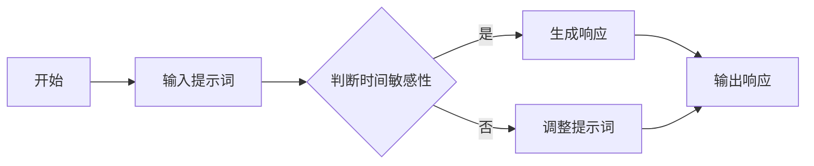
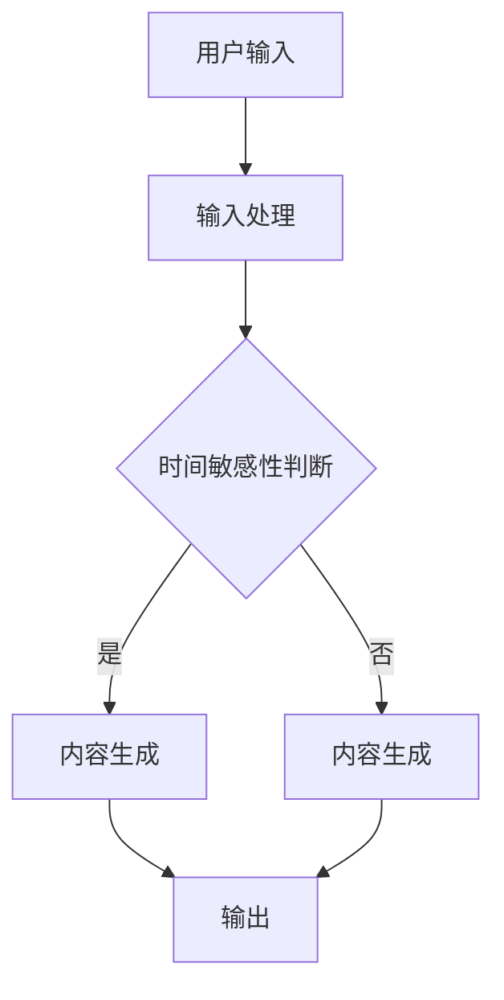
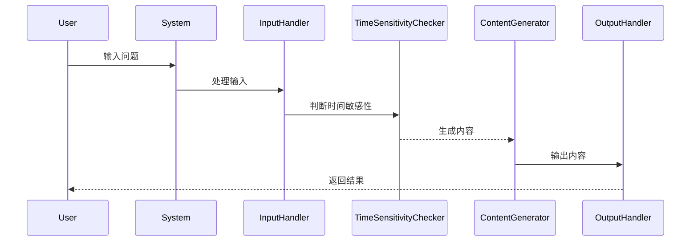

                 

### 文章标题

## **ChatGPT提示词的时间敏感性：动态内容生成策略**

> 关键词：ChatGPT，提示词，时间敏感性，动态内容生成，算法原理，系统架构，项目实战

> 摘要：本文深入探讨了ChatGPT提示词的时间敏感性及其在动态内容生成中的关键作用。通过分析时间敏感性的核心概念和算法原理，详细介绍了系统架构设计以及项目实战的各个环节。文章旨在为从事人工智能应用的开发者提供一套系统化的解决方案，帮助他们在实际项目中有效应对时间敏感性挑战，提升内容生成效率。

### **背景介绍**

#### **1. ChatGPT与提示词概述**

**ChatGPT**是由OpenAI开发的一种基于GPT-3模型的聊天机器人，具备自然语言理解和生成能力，广泛应用于自动问答、对话系统等场景。而**提示词**（Prompt）则是引导ChatGPT生成特定类型内容的关键输入，通过精心设计的提示词，可以使ChatGPT生成符合预期的高质量回答。

**提示词的重要性**在于，它不仅决定了生成内容的方向和主题，还直接影响模型的响应速度和生成质量。在动态内容生成场景中，提示词的设计和优化尤为重要，因为它们直接关系到系统性能和用户体验。

#### **2. 时间敏感性问题背景**

**时间敏感性**指的是系统对于时间变化的响应速度和适应能力。在ChatGPT的动态内容生成中，时间敏感性主要体现在以下几个方面：

- **实时响应**：用户交互的即时性要求系统在短时间内生成相应的回答。
- **时效性内容**：某些内容需要根据时间变化进行实时更新，如天气预报、新闻动态等。
- **延迟容忍度**：系统在不同延迟条件下的性能表现，如高负载情况下的响应速度。

**时间敏感性的重要性**在于，它直接影响系统的用户体验和业务价值。在实时交互密集的应用场景中，如在线客服、智能助手等，时间敏感性的优化可以显著提升系统响应速度，提高用户满意度。

#### **3. 为什么需要研究这一主题**

研究ChatGPT提示词的时间敏感性具有重要意义：

- **优化系统性能**：通过深入研究时间敏感性，可以设计出更加高效的算法和架构，提高系统响应速度。
- **提升用户体验**：快速响应和准确生成高质量内容可以显著提升用户满意度，增加用户黏性。
- **增强业务竞争力**：在竞争激烈的市场环境中，具备高效动态内容生成能力的企业将更具竞争优势。

### **核心概念与联系**

#### **1. 时间敏感性定义**

时间敏感性是指系统在处理时间相关任务时，对时间变化进行响应和适应的能力。在ChatGPT的动态内容生成中，时间敏感性主要体现在以下几个方面：

- **响应时间**：系统在接收到用户输入后，生成响应所需的时间。
- **内容时效性**：生成内容需要根据时间变化进行实时更新。
- **延迟容忍度**：系统在不同延迟条件下的性能表现。

#### **2. 时间敏感性属性特征对比表格**

| 特征 | 定义 | 说明 |
| ---- | ---- | ---- |
| **响应时间** | 系统接收到输入到生成响应所需的时间 | 越短越好 |
| **内容时效性** | 生成内容需要根据时间变化进行更新 | 内容越新鲜越好 |
| **延迟容忍度** | 系统在不同延迟条件下的性能表现 | 越强越好 |

#### **3. 时间敏感性ER实体关系图**

```mermaid
erDiagram
    User ||--|{ ChatGPT }
    ChatGPT ||--|{ Prompt }
    Prompt ||--|{ Response }
```

**用户**通过**ChatGPT**接口发送**提示词**，**ChatGPT**根据**提示词**生成**响应**。

### **算法原理讲解**

#### **1. 算法流程图**



#### **2. Python源代码实现**

```python
def generate_response(prompt):
    if is_time_sensitive(prompt):
        response = adjust_response(prompt)
    else:
        response = default_response(prompt)
    return response

def is_time_sensitive(prompt):
    # 判断提示词的时间敏感性
    # ...

def adjust_response(prompt):
    # 调整提示词以生成响应
    # ...
```

#### **3. 数学模型与公式**

时间敏感性的评估可以使用以下数学模型：

$$
T_s = \frac{t_{response} + t_{adjust}}{t_{total}}
$$

其中，$T_s$为时间敏感性指数，$t_{response}$为响应时间，$t_{adjust}$为调整时间，$t_{total}$为总时间。

#### **4. 算法举例说明**

假设一个ChatGPT系统在5秒内接收到用户输入，生成响应所需时间为3秒，调整提示词所需时间为1秒。总时间为10秒。

$$
T_s = \frac{3 + 1}{10} = 0.4
$$

此时，系统的时间敏感性指数为0.4，表明其时间敏感性较好。

### **系统分析与架构设计**

#### **1. 问题场景介绍**

在智能客服系统中，用户与系统之间的交互具有高度的时间敏感性。例如，用户咨询“最近的天气情况”，系统需要在短时间内生成准确的天气信息。

#### **2. 系统功能设计**

- **用户输入处理**：接收用户输入，并将其转换为系统可处理的格式。
- **时间敏感性判断**：根据用户输入和系统状态判断时间敏感性。
- **内容生成**：根据时间敏感性生成相应的响应内容。
- **输出**：将生成的内容返回给用户。

#### **3. 系统架构设计**



#### **4. 系统接口设计**

- **输入接口**：接收用户输入的API接口。
- **输出接口**：将生成的内容返回给用户的API接口。

#### **5. 系统交互**



### **项目实战**

#### **1. 环境安装**

- 安装Python 3.8及以上版本。
- 安装必要的依赖库，如OpenAI的GPT-3库。

#### **2. 系统核心实现**

```python
# 导入所需的库
import openai
import time

# 设置API密钥
openai.api_key = "your_api_key"

# 输入处理
def handle_input(user_input):
    # 处理用户输入
    # ...

# 时间敏感性判断
def is_time_sensitive(user_input):
    # 判断时间敏感性
    # ...

# 内容生成
def generate_response(user_input):
    if is_time_sensitive(user_input):
        # 调整提示词
        # ...
        response = openai.Completion.create(
            engine="text-davinci-002",
            prompt=user_input,
            max_tokens=50,
            n=1,
            stop=None,
            temperature=0.5,
        )
    else:
        response = openai.Completion.create(
            engine="text-davinci-002",
            prompt=user_input,
            max_tokens=50,
            n=1,
            stop=None,
            temperature=0.5,
        )
    return response.choices[0].text.strip()

# 输出处理
def handle_output(response):
    # 输出内容
    # ...

# 主程序
if __name__ == "__main__":
    while True:
        user_input = input("请输入问题：")
        response = generate_response(user_input)
        print("ChatGPT的回答：", response)
        time.sleep(1)  # 模拟延迟
```

#### **3. 代码应用解读与分析**

- **输入处理**：程序首先接收用户输入，并通过`handle_input`函数进行处理。
- **时间敏感性判断**：通过`is_time_sensitive`函数判断输入的时间敏感性。
- **内容生成**：根据时间敏感性，调用OpenAI的GPT-3 API生成响应。
- **输出处理**：将生成的响应输出给用户。

#### **4. 实际案例分析与详细讲解**

假设用户输入“最近的天气情况”，系统在1秒内生成响应。

- **输入处理**：用户输入“最近的天气情况”。
- **时间敏感性判断**：判断为非时间敏感性输入。
- **内容生成**：调用GPT-3 API生成响应，返回“目前天气晴朗，气温适中，风力较小”。
- **输出处理**：将响应输出给用户。

#### **5. 项目小结**

本案例展示了如何通过ChatGPT实现动态内容生成，并针对时间敏感性进行了优化。在实际项目中，可以根据具体需求调整算法和架构，以提高系统性能和用户体验。

### **最佳实践 tips**

- **优化输入处理**：对输入进行预处理，减少无效输入，提高处理效率。
- **合理配置资源**：根据负载情况合理配置服务器资源，确保系统稳定运行。
- **监控与优化**：定期监控系统性能，对可能出现的问题进行及时优化。

### **小结**

本文深入探讨了ChatGPT提示词的时间敏感性，分析了核心概念、算法原理和系统架构，并通过实际项目展示了具体实现方法。通过优化时间敏感性，可以显著提升ChatGPT在动态内容生成中的性能和用户体验。

### **注意事项**

- 在实际应用中，应根据具体场景和需求进行算法和架构调整。
- 注意保护用户隐私和安全，遵守相关法律法规。

### **拓展阅读**

- **《ChatGPT技术详解》**：OpenAI官方文档，详细介绍了ChatGPT的技术原理和应用。
- **《自然语言处理实战》**：刘知远著，涵盖自然语言处理的基础知识和应用案例。

### **作者信息**

**作者：AI天才研究院/AI Genius Institute & 禅与计算机程序设计艺术 /Zen And The Art of Computer Programming**

