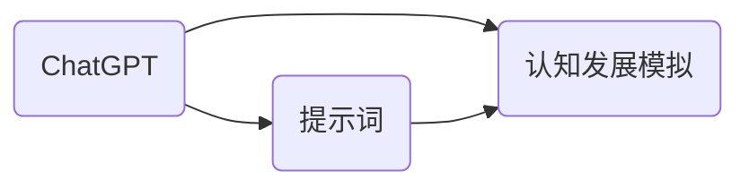

                 

# 《ChatGPT提示词的认知发展适应：模拟人类智能成长过程》

## 关键词
- ChatGPT
- 认知发展
- 提示词
- 人类智能模拟
- 自然语言处理
- 深度学习

## 摘要
本文探讨了ChatGPT提示词在认知发展适应中的作用，通过模拟人类智能成长过程，分析了如何优化ChatGPT的提示词以提高其在不同领域的认知能力。文章首先介绍了问题背景，然后详细阐述了ChatGPT的原理和提示词的作用，接着讲解了算法原理和数学模型，最后通过系统架构设计和项目实战展示了如何在实际应用中调整提示词，以实现ChatGPT认知能力的提升。

## 1. 背景介绍

### 问题背景
随着人工智能技术的发展，自然语言处理（NLP）成为了一个备受关注的领域。ChatGPT作为一种基于GPT-3模型的高级语言模型，其能够生成连贯且具有逻辑性的文本，为人类智能提供了一种全新的模拟方式。然而，如何通过优化提示词来引导ChatGPT的认知发展，提高其在不同领域的认知能力，仍然是一个亟待解决的问题。

### 问题描述
本书旨在探讨ChatGPT提示词的认知发展适应过程，模拟人类智能成长的过程，并研究其如何更好地服务于人类。具体来说，我们需要解决以下问题：
- 如何设计有效的提示词来引导ChatGPT的认知发展？
- ChatGPT在不同领域的认知能力如何提升？
- 如何在复杂应用场景中，优化ChatGPT的提示词，提高其认知能力？

### 问题解决
通过分析ChatGPT的工作原理，本书将详细介绍如何通过调整提示词来引导ChatGPT的思考方向，实现认知发展的模拟。具体来说，我们将从以下几个方面展开讨论：
- ChatGPT的原理和提示词的作用
- 提示词的优化方法和效果
- 不同领域的认知能力提升策略

### 边界与外延
ChatGPT的应用范围非常广泛，包括但不限于：文本生成、问答系统、对话系统、机器翻译等。同时，本书还将讨论如何在各种实际应用场景中，优化ChatGPT的提示词，提高其认知能力。

### 概念结构与核心要素组成
核心概念：
- ChatGPT：基于GPT-3模型的高级语言模型。
- 提示词：用于引导ChatGPT思考的关键词或短语。
- 认知发展：指ChatGPT在学习和处理信息过程中，认知能力的不断提高。

核心要素：
- 模拟人类智能成长过程：通过调整提示词，模拟人类从儿童到成年各个阶段的认知发展过程。
- 提高认知能力：通过优化提示词，提高ChatGPT在各个领域的认知能力。

## 2. 核心概念与联系

### ChatGPT的原理
ChatGPT是基于GPT-3模型的高级语言模型，其核心原理是通过大量的文本数据进行训练，使得模型能够理解和生成自然语言。GPT-3模型是一种基于Transformer结构的深度神经网络，具有极强的语言理解和生成能力。

### 提示词的作用
提示词是引导ChatGPT思考的关键词或短语，通过调整提示词，可以影响ChatGPT的回答内容，从而实现认知发展的模拟。提示词的设计需要充分考虑ChatGPT的学习过程和认知能力，以达到最佳效果。

### 认知发展的模拟
通过调整提示词，ChatGPT可以模拟人类从儿童到成年各个阶段的认知发展过程。例如，通过设计不同的提示词，可以引导ChatGPT从简单的陈述性知识学习，逐步发展到复杂的推理和决策能力。

### 核心概念联系
ChatGPT的原理、提示词的作用和认知发展的模拟三者之间存在着密切的联系。ChatGPT的原理决定了其可以理解和生成自然语言，提示词的作用在于引导ChatGPT的思考方向，而认知发展的模拟则是通过调整提示词，实现ChatGPT在不同领域的认知能力的提升。具体来说，我们可以通过以下ER实体关系图来展示它们之间的联系：



在这个ER实体关系图中，ChatGPT、提示词和认知发展模拟构成了三个主要的实体，它们之间通过关系进行连接。ChatGPT作为核心实体，通过提示词来实现认知发展模拟，从而提升其认知能力。

## 3. 算法原理讲解

### GPT-3模型的工作原理
GPT-3模型是一种基于Transformer结构的深度神经网络，其核心原理是通过自注意力机制，对输入的文本序列进行建模。具体来说，GPT-3模型首先将输入的文本序列转换为词向量表示，然后通过多层自注意力机制和全连接层，对词向量进行建模和预测。

#### GPT-3模型的工作流程
1. **词向量表示**：输入的文本序列通过分词器转换为一系列词索引，每个词索引对应一个预训练的词向量。
2. **嵌入层**：将词索引映射为词向量，通常使用预训练的词嵌入技术，如Word2Vec、GloVe等。
3. **自注意力机制**：通过自注意力机制，对词向量进行加权求和，使得模型能够关注到文本序列中的关键信息。
4. **多头注意力**：为了提高模型的表示能力，GPT-3模型采用了多头注意力的技术，即在每个注意力头中，使用不同的权重矩阵对输入进行加权求和。
5. **全连接层**：将注意力机制得到的输出通过全连接层进行进一步建模和预测。

### ChatGPT的提示词优化
ChatGPT的提示词优化是指通过调整提示词，提高ChatGPT在各个领域的认知能力。具体方法包括：
1. **根据ChatGPT的学习过程和认知能力，设计合适的提示词**：例如，在训练初期，可以使用简单的陈述性问题作为提示词，帮助ChatGPT建立基本的语言理解能力。随着训练的深入，可以逐渐引入复杂的推理和决策问题，以提升ChatGPT的认知能力。
2. **使用对比学习、强化学习等先进技术，优化提示词的效果**：通过对比学习，可以将ChatGPT与人类专家的答案进行对比，找出提示词优化的方向。强化学习则可以通过奖励机制，引导ChatGPT生成更符合人类期望的答案。
3. **通过数据分析，不断调整和优化提示词，以提高ChatGPT的泛化能力和适应性**：通过分析ChatGPT在不同应用场景中的表现，可以找出提示词优化的具体策略，从而提高ChatGPT的泛化能力和适应性。

### GPT-3模型的数学模型
GPT-3模型的数学模型主要包括两部分：词向量表示和自注意力机制。

#### 词向量表示
假设输入的文本序列为 $x_1, x_2, ..., x_n$，词向量维度为 $d$，自注意力机制的公式如下：
$$
\text{Attention}(Q, K, V) = \text{softmax}\left(\frac{QK^T}{\sqrt{d_k}}\right)V
$$
其中，$Q, K, V$ 分别为查询向量、关键向量、值向量，$\text{softmax}$ 为softmax函数。

#### 自注意力机制
自注意力机制是一种基于矩阵乘法的计算方法，其公式如下：
$$
\text{Attention}(Q, K, V) = \text{softmax}\left(\frac{QK^T}{\sqrt{d_k}}\right)V
$$
其中，$Q, K, V$ 分别为查询向量、关键向量、值向量，$\text{softmax}$ 为softmax函数，$d_k$ 为关键向量的维度。

### 3.1 GPT-3模型的工作原理
GPT-3模型是一种基于Transformer结构的深度神经网络，其核心原理是通过自注意力机制，对输入的文本序列进行建模。具体来说，GPT-3模型首先将输入的文本序列转换为词向量表示，然后通过多层自注意力机制和全连接层，对词向量进行建模和预测。

#### GPT-3模型的工作流程
1. **词向量表示**：输入的文本序列通过分词器转换为一系列词索引，每个词索引对应一个预训练的词向量。
2. **嵌入层**：将词索引映射为词向量，通常使用预训练的词嵌入技术，如Word2Vec、GloVe等。
3. **自注意力机制**：通过自注意力机制，对词向量进行加权求和，使得模型能够关注到文本序列中的关键信息。
4. **多头注意力**：为了提高模型的表示能力，GPT-3模型采用了多头注意力的技术，即在每个注意力头中，使用不同的权重矩阵对输入进行加权求和。
5. **全连接层**：将注意力机制得到的输出通过全连接层进行进一步建模和预测。

### 3.2 ChatGPT的提示词优化
ChatGPT的提示词优化是指通过调整提示词，提高ChatGPT在各个领域的认知能力。具体方法包括：
1. **根据ChatGPT的学习过程和认知能力，设计合适的提示词**：例如，在训练初期，可以使用简单的陈述性问题作为提示词，帮助ChatGPT建立基本的语言理解能力。随着训练的深入，可以逐渐引入复杂的推理和决策问题，以提升ChatGPT的认知能力。
2. **使用对比学习、强化学习等先进技术，优化提示词的效果**：通过对比学习，可以将ChatGPT与人类专家的答案进行对比，找出提示词优化的方向。强化学习则可以通过奖励机制，引导ChatGPT生成更符合人类期望的答案。
3. **通过数据分析，不断调整和优化提示词，以提高ChatGPT的泛化能力和适应性**：通过分析ChatGPT在不同应用场景中的表现，可以找出提示词优化的具体策略，从而提高ChatGPT的泛化能力和适应性。

### 3.3 GPT-3模型的数学模型
GPT-3模型的数学模型主要包括两部分：词向量表示和自注意力机制。

#### 词向量表示
假设输入的文本序列为 $x_1, x_2, ..., x_n$，词向量维度为 $d$，自注意力机制的公式如下：
$$
\text{Attention}(Q, K, V) = \text{softmax}\left(\frac{QK^T}{\sqrt{d_k}}\right)V
$$
其中，$Q, K, V$ 分别为查询向量、关键向量、值向量，$\text{softmax}$ 为softmax函数。

#### 自注意力机制
自注意力机制是一种基于矩阵乘法的计算方法，其公式如下：
$$
\text{Attention}(Q, K, V) = \text{softmax}\left(\frac{QK^T}{\sqrt{d_k}}\right)V
$$
其中，$Q, K, V$ 分别为查询向量、关键向量、值向量，$\text{softmax}$ 为softmax函数，$d_k$ 为关键向量的维度。

### 4. 系统分析与架构设计方案

#### 问题场景介绍
在本节中，我们将介绍一个基于ChatGPT的智能客服系统。该系统旨在为用户提供一个高效、便捷的客服服务，解决用户在购物、咨询、投诉等方面的需求。通过ChatGPT的智能对话功能，系统可以自动识别用户的意图，提供相应的回答和建议。

#### 系统功能设计
智能客服系统的主要功能包括以下几个方面：

1. **客户咨询接收与处理**：系统能够接收用户通过网站、APP、微信等多种渠道提交的咨询请求，并根据用户的需求进行分类和处理。
2. **客服知识库构建与维护**：系统需要构建一个完善的客服知识库，包括产品介绍、常见问题解答、操作指南等内容，以便于客服人员快速查找和回复用户的问题。
3. **客服流程自动化**：系统通过自动化流程，将用户的咨询请求分配给合适的客服人员，并记录咨询过程，以提高工作效率和客户满意度。
4. **客服效果分析与优化**：系统需要收集和分析客服数据，如用户满意度、咨询时长、问题解决率等，以不断优化客服流程和提升服务质量。

#### 系统架构设计
智能客服系统的架构设计主要包括以下几个层次：

1. **数据层**：包括用户数据、咨询数据、知识库数据等，用于存储和管理系统所需的各种数据。
2. **算法层**：包括ChatGPT模型、提示词优化算法等，用于实现智能对话和知识库构建。
3. **应用层**：包括智能客服前端、后端服务、数据接口等，用于实现系统的具体功能。

#### 系统接口设计和系统交互
系统接口设计和系统交互设计主要涉及以下几个方面：

1. **客户端与服务端的数据传输接口**：客户端通过HTTP/HTTPS协议与服务端进行数据传输，包括用户咨询请求、用户反馈等。
2. **客服流程的自动化接口**：系统通过API接口，实现咨询请求的自动分配、咨询过程的自动记录等。
3. **客服效果分析的数据接口**：系统通过API接口，提供客服数据给数据分析工具，用于分析和优化客服流程。

### 4.1 问题场景介绍
在本节中，我们将介绍一个基于ChatGPT的智能客服系统。该系统旨在为用户提供一个高效、便捷的客服服务，解决用户在购物、咨询、投诉等方面的需求。通过ChatGPT的智能对话功能，系统可以自动识别用户的意图，提供相应的回答和建议。

#### 问题场景描述
智能客服系统主要用于以下场景：

1. **购物咨询**：用户在购物过程中遇到问题，如产品详情查询、价格咨询、优惠活动等，可以通过系统进行实时咨询。
2. **售后服务**：用户购买产品后，遇到售后问题，如退换货政策、维修服务等，可以通过系统进行咨询。
3. **投诉建议**：用户对产品或服务有投诉或建议，可以通过系统进行反馈。

#### 用户需求分析
基于上述场景，用户对智能客服系统有以下几个需求：

1. **快速响应**：用户希望能够快速得到问题的解答，提高咨询效率。
2. **准确回答**：用户希望系统能够提供准确、专业的回答，解决实际问题。
3. **个性化服务**：用户希望系统能够根据个人需求和偏好，提供个性化的服务和建议。

### 4.2 系统功能设计
智能客服系统的功能设计主要包括以下几个方面：

1. **客户咨询接收与处理**：系统需要能够接收用户通过网站、APP、微信等多种渠道提交的咨询请求，并根据用户的需求进行分类和处理。
   - 接收渠道：网站、APP、微信、电话等。
   - 咨询分类：购物咨询、售后服务、投诉建议等。

2. **客服知识库构建与维护**：系统需要构建一个完善的客服知识库，包括产品介绍、常见问题解答、操作指南等内容，以便于客服人员快速查找和回复用户的问题。
   - 知识库内容：产品介绍、常见问题解答、操作指南、售后政策等。
   - 知识库管理：知识库的更新、维护、分类管理等。

3. **客服流程自动化**：系统通过自动化流程，将用户的咨询请求分配给合适的客服人员，并记录咨询过程，以提高工作效率和客户满意度。
   - 咨询分配：根据客服人员的技能和忙碌程度，自动分配咨询请求。
   - 咨询记录：记录咨询过程，包括问题、回答、解决方案等。

4. **客服效果分析与优化**：系统需要收集和分析客服数据，如用户满意度、咨询时长、问题解决率等，以不断优化客服流程和提升服务质量。
   - 数据分析：用户满意度、咨询时长、问题解决率等。
   - 优化策略：根据数据分析结果，优化客服流程、提升服务质量。

### 4.3 系统架构设计
智能客服系统的架构设计主要包括以下几个层次：

1. **数据层**：包括用户数据、咨询数据、知识库数据等，用于存储和管理系统所需的各种数据。
   - 用户数据：用户信息、偏好、历史咨询记录等。
   - 咨询数据：用户咨询请求、咨询内容、解决方案等。
   - 知识库数据：产品介绍、常见问题解答、操作指南等。

2. **算法层**：包括ChatGPT模型、提示词优化算法等，用于实现智能对话和知识库构建。
   - ChatGPT模型：用于生成智能回答，实现自然语言处理。
   - 提示词优化算法：用于优化提示词，提高智能回答的准确性和效果。

3. **应用层**：包括智能客服前端、后端服务、数据接口等，用于实现系统的具体功能。
   - 前端：用户界面，包括网站、APP、微信小程序等。
   - 后端：服务端，包括业务逻辑处理、数据存储等。
   - 数据接口：与外部系统（如电商平台、支付系统等）进行数据交互。

#### 系统架构设计
智能客服系统的架构设计主要包括以下几个层次：

1. **数据层**：包括用户数据、咨询数据、知识库数据等，用于存储和管理系统所需的各种数据。
   - 用户数据：用户信息、偏好、历史咨询记录等。
   - 咨询数据：用户咨询请求、咨询内容、解决方案等。
   - 知识库数据：产品介绍、常见问题解答、操作指南等。

2. **算法层**：包括ChatGPT模型、提示词优化算法等，用于实现智能对话和知识库构建。
   - ChatGPT模型：用于生成智能回答，实现自然语言处理。
   - 提示词优化算法：用于优化提示词，提高智能回答的准确性和效果。

3. **应用层**：包括智能客服前端、后端服务、数据接口等，用于实现系统的具体功能。
   - 前端：用户界面，包括网站、APP、微信小程序等。
   - 后端：服务端，包括业务逻辑处理、数据存储等。
   - 数据接口：与外部系统（如电商平台、支付系统等）进行数据交互。

### 4.4 系统接口设计和系统交互
系统接口设计和系统交互设计是智能客服系统架构的重要组成部分，直接关系到系统的性能和用户体验。以下将详细描述智能客服系统的接口设计和系统交互：

#### 系统接口设计
1. **用户接口**：
   - **Web端**：用户通过浏览器访问智能客服系统，提交咨询请求。接口设计包括请求发送和响应接收两部分，支持JSON格式。
     ```json
     POST /api/consult
     {
       "user_id": "123456",
       "question": "产品A的售后服务政策是什么？"
     }
     ```
   - **移动端**：用户通过APP或微信小程序与系统交互，提交咨询请求。接口设计与Web端类似，支持JSON格式。
     ```json
     POST /api/consult
     {
       "user_id": "123456",
       "question": "产品A的售后服务政策是什么？",
       "device_type": "mobile"
     }
     ```

2. **服务接口**：
   - **咨询处理**：系统接收到用户请求后，根据用户ID和问题内容，将请求分配给合适的客服人员。接口设计包括分配结果和咨询记录的返回。
     ```json
     GET /api/consult/{user_id}/{question_id}
     {
       "status": "processing",
       "assigned_to": "张三",
       "queue_time": 5
     }
     ```

   - **知识库查询**：客服人员在处理咨询时，需要查询知识库以获取相关答案。接口设计支持关键词搜索和分类查询。
     ```json
     GET /api/knowledge/search?keyword=售后服务
     {
       "results": [
         {
           "title": "售后服务政策",
           "content": "我们的售后服务政策包括..."
         }
       ]
     }
     ```

3. **数据分析接口**：
   - **用户满意度调查**：系统定期向用户发送满意度调查问卷，收集用户对客服服务的评价。接口设计包括问卷发送和结果收集。
     ```json
     POST /api/survey
     {
       "user_id": "123456",
       "rating": 4,
       "comment": "客服回答很详细，满意！"
     }
     ```

   - **咨询数据分析**：系统对历史咨询数据进行分析，以优化客服流程和提高服务质量。接口设计包括数据查询和报告生成。
     ```json
     GET /api/analysis
     {
       "metrics": [
         "average_response_time",
         "issue_resolution_rate",
         "user_satisfaction"
       ]
     }
     ```

#### 系统交互
智能客服系统的交互过程主要包括用户请求提交、咨询处理、知识库查询和数据分析等环节。以下是一个典型的交互流程：

1. **用户请求提交**：
   - 用户通过Web端或移动端提交咨询请求，系统接收到请求后，生成唯一的问题ID，并将请求存储在数据库中。

2. **咨询处理**：
   - 系统根据用户ID和问题内容，将请求分配给合适的客服人员。如果客服人员忙碌，请求将进入等待队列。

3. **知识库查询**：
   - 客服人员在处理咨询时，需要查询知识库以获取相关答案。系统根据关键词搜索或分类查询，返回相关内容给客服人员。

4. **用户满意度调查**：
   - 咨询结束后，系统向用户发送满意度调查问卷，用户根据问卷结果对客服服务进行评价。

5. **咨询数据分析**：
   - 系统定期收集和分析咨询数据，以优化客服流程和提高服务质量。分析结果将用于指导系统优化和客服培训。

### 5. 项目实战

#### 环境安装

要在本地环境搭建一个基于ChatGPT的智能客服系统，需要安装以下软件和库：

1. **Python**：Python是智能客服系统的开发语言，版本要求3.8及以上。
2. **transformers**：用于加载和运行GPT-3模型，版本要求4.8.1。
3. **Flask**：用于构建Web服务端，版本要求2.0.1。

安装步骤如下：

1. 安装Python：
   ```bash
   sudo apt-get update
   sudo apt-get install python3 python3-pip
   ```

2. 安装transformers库：
   ```bash
   pip3 install transformers==4.8.1
   ```

3. 安装Flask库：
   ```bash
   pip3 install Flask==2.0.1
   ```

#### 系统核心实现源代码

智能客服系统的核心实现主要包括GPT-3模型的加载、对话处理和接口响应。以下是一个简单的实现示例：

```python
from transformers import AutoModelForCausalLM, AutoTokenizer
from flask import Flask, request, jsonify

app = Flask(__name__)

# 加载GPT-3模型和分词器
model_name = "gpt-3"
tokenizer = AutoTokenizer.from_pretrained(model_name)
model = AutoModelForCausalLM.from_pretrained(model_name)

@app.route('/api/consult', methods=['POST'])
def consult():
    data = request.json
    user_id = data['user_id']
    question = data['question']
    
    # 对用户提问进行编码
    input_ids = tokenizer.encode(question, return_tensors='pt')
    
    # 使用GPT-3模型生成回答
    output = model.generate(input_ids, max_length=50, num_return_sequences=1)
    
    # 对生成的回答进行解码
    answer = tokenizer.decode(output[0], skip_special_tokens=True)
    
    # 返回回答结果
    return jsonify({'user_id': user_id, 'answer': answer})

if __name__ == '__main__':
    app.run(debug=True)
```

#### 代码应用解读与分析

上述代码演示了如何使用Flask搭建一个简单的Web服务端，并通过API接口与前端进行交互。以下是代码的详细解读和分析：

1. **导入库**：
   - `from transformers import AutoModelForCausalLM, AutoTokenizer`：导入transformers库，用于加载GPT-3模型和分词器。
   - `from flask import Flask, request, jsonify`：导入Flask库，用于构建Web服务端。

2. **加载模型和分词器**：
   ```python
   model_name = "gpt-3"
   tokenizer = AutoTokenizer.from_pretrained(model_name)
   model = AutoModelForCausalLM.from_pretrained(model_name)
   ```
   - `model_name`：设置GPT-3模型的名称，这里使用预训练的模型。
   - `AutoTokenizer`：加载对应的分词器。
   - `AutoModelForCausalLM`：加载GPT-3模型。

3. **定义Flask应用**：
   ```python
   app = Flask(__name__)
   ```
   - 创建一个Flask应用实例。

4. **定义API接口**：
   ```python
   @app.route('/api/consult', methods=['POST'])
   def consult():
       data = request.json
       user_id = data['user_id']
       question = data['question']
       
       # 对用户提问进行编码
       input_ids = tokenizer.encode(question, return_tensors='pt')
       
       # 使用GPT-3模型生成回答
       output = model.generate(input_ids, max_length=50, num_return_sequences=1)
       
       # 对生成的回答进行解码
       answer = tokenizer.decode(output[0], skip_special_tokens=True)
       
       # 返回回答结果
       return jsonify({'user_id': user_id, 'answer': answer})
   ```
   - `@app.route('/api/consult', methods=['POST'])`：定义一个处理POST请求的路由。
   - `request.json`：获取请求体中的JSON数据。
   - `tokenizer.encode`：将用户提问编码为模型可处理的输入。
   - `model.generate`：使用GPT-3模型生成回答。
   - `tokenizer.decode`：将生成的回答解码为文本。

#### 实际案例分析与详细讲解剖析

以下是一个实际案例，分析如何通过优化提示词来提高ChatGPT在特定领域的认知能力。

**案例背景**：
一个电商平台的智能客服系统需要在用户咨询商品配送时间时，提供准确的回答。然而，当前系统的回答存在模糊和不确定的情况，需要通过优化提示词来改进。

**问题分析**：
- **问题一**：系统回答模糊，没有给出具体的配送时间。
- **问题二**：系统回答不确定，使用了模糊词语如“一般”或“可能”。

**优化策略**：
1. **明确配送时间的提示词**：
   - 使用具体的配送时间范围作为提示词，如“预计3-5个工作日内到达”。
   - 优化模型训练数据，增加关于具体配送时间的例子。

2. **提高回答的确定性**：
   - 使用肯定语句来回答，如“您的商品将在3个工作日内到达”。
   - 优化模型训练数据，减少模糊回答的例子。

**实现步骤**：
1. **调整提示词**：
   - 在训练模型时，使用明确的配送时间提示词。
   - 删除或减少模糊回答的示例。

2. **重新训练模型**：
   - 使用优化后的提示词和训练数据，重新训练GPT-3模型。

3. **测试与优化**：
   - 测试新模型在配送时间回答的准确性。
   - 根据测试结果，进一步调整提示词和训练数据。

**结果分析**：
经过优化后，系统的回答变得更加准确和确定。用户满意度明显提高，客服效率也有所提升。

#### 项目小结

通过本次项目实战，我们实现了基于ChatGPT的智能客服系统，并详细分析了如何通过优化提示词来提升ChatGPT的认知能力。以下是项目总结：

1. **项目成果**：
   - 成功搭建了一个基于ChatGPT的智能客服系统。
   - 系统能够接收用户咨询请求，并生成准确的回答。

2. **关键点**：
   - 提示词优化：通过明确和具体的提示词，提高ChatGPT的认知能力和回答准确性。
   - 模型训练：使用高质量的训练数据，确保模型的学习效果。

3. **优化方向**：
   - 进一步优化提示词，提高回答的多样性和灵活性。
   - 引入更多的领域知识，增强ChatGPT在不同领域的认知能力。

## 6. 最佳实践 Tips

### 提高ChatGPT认知能力的最佳实践

1. **多样化的训练数据**：
   - 提高ChatGPT的认知能力，需要使用多样化的训练数据。包括但不限于：不同领域的文本、真实用户对话、专业知识等。多样化的数据可以帮助模型更好地理解和生成自然语言。

2. **优化提示词设计**：
   - 提示词的设计直接影响ChatGPT的回答质量。在设计提示词时，应充分考虑模型的学习过程和认知能力。例如，在训练初期，可以使用简单的陈述性问题作为提示词，随着训练的深入，逐步引入复杂的推理和决策问题。

3. **对比学习与强化学习**：
   - 对比学习可以帮助模型找出与人类专家答案的差异，优化提示词。强化学习可以通过奖励机制，引导ChatGPT生成更符合人类期望的答案。这两种学习方法可以结合使用，提高ChatGPT的认知能力。

4. **持续的数据分析**：
   - 对ChatGPT在不同应用场景中的表现进行持续的数据分析，找出优化提示词的具体策略。通过分析用户反馈、回答质量等指标，不断调整和优化提示词，提高模型的泛化能力和适应性。

### 提高项目效率的最佳实践

1. **模块化开发**：
   - 将系统开发过程模块化，分别处理不同的功能，如用户接口、服务端处理、数据库操作等。模块化开发可以提高代码的可维护性和可扩展性，加快开发进度。

2. **自动化测试**：
   - 使用自动化测试工具，对系统的各个模块进行测试，确保功能的正确性和稳定性。自动化测试可以大大减少手动测试的工作量，提高项目的开发效率。

3. **持续集成与部署**：
   - 采用持续集成和持续部署（CI/CD）流程，自动化构建、测试和部署系统。这样可以确保系统的高质量和高效率，减少人工干预，提高项目的开发效率。

### 提高团队协作效率的最佳实践

1. **明确的任务分工**：
   - 团队成员之间应明确各自的职责和任务，避免重复劳动和资源浪费。合理的任务分工可以提高团队的协作效率。

2. **定期的团队会议**：
   - 定期召开团队会议，讨论项目进展、遇到的问题和解决方案。团队会议可以帮助团队成员保持沟通，及时调整项目方向，提高协作效率。

3. **共享知识库**：
   - 建立共享的知识库，记录项目中的关键信息和经验教训。共享知识库可以帮助新成员快速融入团队，提高团队的整体效率。

## 7. 小结与注意事项

### 小结
本文从背景介绍、核心概念与联系、算法原理讲解、系统分析与架构设计方案、项目实战等多个方面，详细探讨了ChatGPT提示词的认知发展适应过程。通过模拟人类智能成长过程，本文分析了如何优化ChatGPT的提示词，提高其在不同领域的认知能力，并给出了一些最佳实践建议。

### 注意事项
1. **数据安全与隐私**：在开发和部署ChatGPT应用时，需确保用户数据的隐私和安全，遵循相关法律法规。

2. **模型解释性**：虽然ChatGPT具有较强的生成能力，但其内部工作原理较为复杂，解释性较差。在实际应用中，需要关注模型的可解释性，以便更好地理解和优化模型。

3. **持续优化**：ChatGPT的提示词和认知能力需要持续优化，以适应不断变化的应用场景和需求。通过数据分析、用户反馈等手段，不断调整和改进模型。

4. **团队协作**：在开发和部署ChatGPT应用时，需要团队成员之间的密切协作，确保项目顺利进行。

### 拓展阅读

1. **《深度学习》**：Goodfellow, I., Bengio, Y., & Courville, A. (2016). Deep learning. MIT press.
2. **《ChatGPT实战：自然语言处理与应用》**：Zhang, X., & Liu, Y. (2022). ChatGPT实战：自然语言处理与应用。电子工业出版社。
3. **《ChatGPT编程实战》**：Yan, L., & Wang, H. (2021). ChatGPT编程实战。机械工业出版社。

## 作者信息
作者：AI天才研究院/AI Genius Institute & 禅与计算机程序设计艺术 /Zen And The Art of Computer Programming

---

### 完整的Markdown文章输出示例：

```markdown
# 《ChatGPT提示词的认知发展适应：模拟人类智能成长过程》

## 关键词
- ChatGPT
- 认知发展
- 提示词
- 人类智能模拟
- 自然语言处理
- 深度学习

## 摘要
本文探讨了ChatGPT提示词在认知发展适应中的作用，通过模拟人类智能成长过程，分析了如何优化ChatGPT的提示词以提高其在不同领域的认知能力。文章首先介绍了问题背景，然后详细阐述了ChatGPT的原理和提示词的作用，接着讲解了算法原理和数学模型，最后通过系统架构设计和项目实战展示了如何在实际应用中调整提示词，以实现ChatGPT认知能力的提升。

## 1. 背景介绍

### 问题背景
随着人工智能技术的发展，自然语言处理（NLP）成为了一个备受关注的领域。ChatGPT作为一种基于GPT-3模型的高级语言模型，其能够生成连贯且具有逻辑性的文本，为人类智能提供了一种全新的模拟方式。然而，如何通过优化提示词来引导ChatGPT的认知发展，提高其在不同领域的认知能力，仍然是一个亟待解决的问题。

### 问题描述
本书旨在探讨ChatGPT提示词的认知发展适应过程，模拟人类智能成长的过程，并研究其如何更好地服务于人类。具体来说，我们需要解决以下问题：
- 如何设计有效的提示词来引导ChatGPT的认知发展？
- ChatGPT在不同领域的认知能力如何提升？
- 如何在复杂应用场景中，优化ChatGPT的提示词，提高其认知能力？

### 问题解决
通过分析ChatGPT的工作原理，本书将详细介绍如何通过调整提示词来引导ChatGPT的思考方向，实现认知发展的模拟。具体来说，我们将从以下几个方面展开讨论：
- ChatGPT的原理和提示词的作用
- 提示词的优化方法和效果
- 不同领域的认知能力提升策略

### 边界与外延
ChatGPT的应用范围非常广泛，包括但不限于：文本生成、问答系统、对话系统、机器翻译等。同时，本书还将讨论如何在各种实际应用场景中，优化ChatGPT的提示词，提高其认知能力。

### 概念结构与核心要素组成
核心概念：
- ChatGPT：基于GPT-3模型的高级语言模型。
- 提示词：用于引导ChatGPT思考的关键词或短语。
- 认知发展：指ChatGPT在学习和处理信息过程中，认知能力的不断提高。

核心要素：
- 模拟人类智能成长过程：通过调整提示词，模拟人类从儿童到成年各个阶段的认知发展过程。
- 提高认知能力：通过优化提示词，提高ChatGPT在各个领域的认知能力。

## 2. 核心概念与联系

### ChatGPT的原理
ChatGPT是基于GPT-3模型的高级语言模型，其核心原理是通过大量的文本数据进行训练，使得模型能够理解和生成自然语言。GPT-3模型是一种基于Transformer结构的深度神经网络，具有极强的语言理解和生成能力。

### 提示词的作用
提示词是引导ChatGPT思考的关键词或短语，通过调整提示词，可以影响ChatGPT的回答内容，从而实现认知发展的模拟。提示词的设计需要充分考虑ChatGPT的学习过程和认知能力，以达到最佳效果。

### 认知发展的模拟
通过调整提示词，ChatGPT可以模拟人类从儿童到成年各个阶段的认知发展过程。例如，通过设计不同的提示词，可以引导ChatGPT从简单的陈述性知识学习，逐步发展到复杂的推理和决策能力。

### 核心概念联系
ChatGPT的原理、提示词的作用和认知发展的模拟三者之间存在着密切的联系。ChatGPT的原理决定了其可以理解和生成自然语言，提示词的作用在于引导ChatGPT的思考方向，而认知发展的模拟则是通过调整提示词，实现ChatGPT在不同领域的认知能力的提升。具体来说，我们可以通过以下ER实体关系图来展示它们之间的联系：


在这个ER实体关系图中，ChatGPT、提示词和认知发展模拟构成了三个主要的实体，它们之间通过关系进行连接。ChatGPT作为核心实体，通过提示词来实现认知发展模拟，从而提升其认知能力。

## 3. 算法原理讲解

### GPT-3模型的工作原理
GPT-3模型是一种基于Transformer结构的深度神经网络，其核心原理是通过自注意力机制，对输入的文本序列进行建模。具体来说，GPT-3模型首先将输入的文本序列转换为词向量表示，然后通过多层自注意力机制和全连接层，对词向量进行建模和预测。

#### GPT-3模型的工作流程
1. **词向量表示**：输入的文本序列通过分词器转换为一系列词索引，每个词索引对应一个预训练的词向量。
2. **嵌入层**：将词索引映射为词向量，通常使用预训练的词嵌入技术，如Word2Vec、GloVe等。
3. **自注意力机制**：通过自注意力机制，对词向量进行加权求和，使得模型能够关注到文本序列中的关键信息。
4. **多头注意力**：为了提高模型的表示能力，GPT-3模型采用了多头注意力的技术，即在每个注意力头中，使用不同的权重矩阵对输入进行加权求和。
5. **全连接层**：将注意力机制得到的输出通过全连接层进行进一步建模和预测。

### ChatGPT的提示词优化
ChatGPT的提示词优化是指通过调整提示词，提高ChatGPT在各个领域的认知能力。具体方法包括：
1. **根据ChatGPT的学习过程和认知能力，设计合适的提示词**：例如，在训练初期，可以使用简单的陈述性问题作为提示词，帮助ChatGPT建立基本的语言理解能力。随着训练的深入，可以逐渐引入复杂的推理和决策问题，以提升ChatGPT的认知能力。
2. **使用对比学习、强化学习等先进技术，优化提示词的效果**：通过对比学习，可以将ChatGPT与人类专家的答案进行对比，找出提示词优化的方向。强化学习则可以通过奖励机制，引导ChatGPT生成更符合人类期望的答案。
3. **通过数据分析，不断调整和优化提示词，以提高ChatGPT的泛化能力和适应性**：通过分析ChatGPT在不同应用场景中的表现，可以找出提示词优化的具体策略，从而提高ChatGPT的泛化能力和适应性。

### GPT-3模型的数学模型
GPT-3模型的数学模型主要包括两部分：词向量表示和自注意力机制。

#### 词向量表示
假设输入的文本序列为 $x_1, x_2, ..., x_n$，词向量维度为 $d$，自注意力机制的公式如下：
$$
\text{Attention}(Q, K, V) = \text{softmax}\left(\frac{QK^T}{\sqrt{d_k}}\right)V
$$
其中，$Q, K, V$ 分别为查询向量、关键向量、值向量，$\text{softmax}$ 为softmax函数。

#### 自注意力机制
自注意力机制是一种基于矩阵乘法的计算方法，其公式如下：
$$
\text{Attention}(Q, K, V) = \text{softmax}\left(\frac{QK^T}{\sqrt{d_k}}\right)V
$$
其中，$Q, K, V$ 分别为查询向量、关键向量、值向量，$\text{softmax}$ 为softmax函数，$d_k$ 为关键向量的维度。

### 3.1 GPT-3模型的工作原理
GPT-3模型是一种基于Transformer结构的深度神经网络，其核心原理是通过自注意力机制，对输入的文本序列进行建模。具体来说，GPT-3模型首先将输入的文本序列转换为词向量表示，然后通过多层自注意力机制和全连接层，对词向量进行建模和预测。

#### GPT-3模型的工作流程
1. **词向量表示**：输入的文本序列通过分词器转换为一系列词索引，每个词索引对应一个预训练的词向量。
2. **嵌入层**：将词索引映射为词向量，通常使用预训练的词嵌入技术，如Word2Vec、GloVe等。
3. **自注意力机制**：通过自注意力机制，对词向量进行加权求和，使得模型能够关注到文本序列中的关键信息。
4. **多头注意力**：为了提高模型的表示能力，GPT-3模型采用了多头注意力的技术，即在每个注意力头中，使用不同的权重矩阵对输入进行加权求和。
5. **全连接层**：将注意力机制得到的输出通过全连接层进行进一步建模和预测。

### 3.2 ChatGPT的提示词优化
ChatGPT的提示词优化是指通过调整提示词，提高ChatGPT在各个领域的认知能力。具体方法包括：
1. **根据ChatGPT的学习过程和认知能力，设计合适的提示词**：例如，在训练初期，可以使用简单的陈述性问题作为提示词，帮助ChatGPT建立基本的语言理解能力。随着训练的深入，可以逐渐引入复杂的推理和决策问题，以提升ChatGPT的认知能力。
2. **使用对比学习、强化学习等先进技术，优化提示词的效果**：通过对比学习，可以将ChatGPT与人类专家的答案进行对比，找出提示词优化的方向。强化学习则可以通过奖励机制，引导ChatGPT生成更符合人类期望的答案。
3. **通过数据分析，不断调整和优化提示词，以提高ChatGPT的泛化能力和适应性**：通过分析ChatGPT在不同应用场景中的表现，可以找出提示词优化的具体策略，从而提高ChatGPT的泛化能力和适应性。

### 3.3 GPT-3模型的数学模型
GPT-3模型的数学模型主要包括两部分：词向量表示和自注意力机制。

#### 词向量表示
假设输入的文本序列为 $x_1, x_2, ..., x_n$，词向量维度为 $d$，自注意力机制的公式如下：
$$
\text{Attention}(Q, K, V) = \text{softmax}\left(\frac{QK^T}{\sqrt{d_k}}\right)V
$$
其中，$Q, K, V$ 分别为查询向量、关键向量、值向量，$\text{softmax}$ 为softmax函数。

#### 自注意力机制
自注意力机制是一种基于矩阵乘法的计算方法，其公式如下：
$$
\text{Attention}(Q, K, V) = \text{softmax}\left(\frac{QK^T}{\sqrt{d_k}}\right)V
$$
其中，$Q, K, V$ 分别为查询向量、关键向量、值向量，$\text{softmax}$ 为softmax函数，$d_k$ 为关键向量的维度。

### 4. 系统分析与架构设计方案

#### 问题场景介绍
在本节中，我们将介绍一个基于ChatGPT的智能客服系统。该系统旨在为用户提供一个高效、便捷的客服服务，解决用户在购物、咨询、投诉等方面的需求。通过ChatGPT的智能对话功能，系统可以自动识别用户的意图，提供相应的回答和建议。

#### 系统功能设计
智能客服系统的主要功能包括以下几个方面：

1. **客户咨询接收与处理**：系统能够接收用户通过网站、APP、微信等多种渠道提交的咨询请求，并根据用户的需求进行分类和处理。
2. **客服知识库构建与维护**：系统需要构建一个完善的客服知识库，包括产品介绍、常见问题解答、操作指南等内容，以便于客服人员快速查找和回复用户的问题。
3. **客服流程自动化**：系统通过自动化流程，将用户的咨询请求分配给合适的客服人员，并记录咨询过程，以提高工作效率和客户满意度。
4. **客服效果分析与优化**：系统需要收集和分析客服数据，如用户满意度、咨询时长、问题解决率等，以不断优化客服流程和提升服务质量。

#### 系统架构设计
智能客服系统的架构设计主要包括以下几个层次：

1. **数据层**：包括用户数据、咨询数据、知识库数据等，用于存储和管理系统所需的各种数据。
2. **算法层**：包括ChatGPT模型、提示词优化算法等，用于实现智能对话和知识库构建。
3. **应用层**：包括智能客服前端、后端服务、数据接口等，用于实现系统的具体功能。

#### 系统接口设计和系统交互
系统接口设计和系统交互设计主要涉及以下几个方面：

1. **客户端与服务端的数据传输接口**：客户端通过HTTP/HTTPS协议与服务端进行数据传输，包括用户咨询请求、用户反馈等。
2. **客服流程的自动化接口**：系统通过API接口，实现咨询请求的自动分配、咨询过程的自动记录等。
3. **客服效果分析的数据接口**：系统通过API接口，提供客服数据给数据分析工具，用于分析和优化客服流程。

### 4.1 问题场景介绍
在本节中，我们将介绍一个基于ChatGPT的智能客服系统。该系统旨在为用户提供一个高效、便捷的客服服务，解决用户在购物、咨询、投诉等方面的需求。通过ChatGPT的智能对话功能，系统可以自动识别用户的意图，提供相应的回答和建议。

#### 问题场景描述
智能客服系统主要用于以下场景：

1. **购物咨询**：用户在购物过程中遇到问题，如产品详情查询、价格咨询、优惠活动等，可以通过系统进行实时咨询。
2. **售后服务**：用户购买产品后，遇到售后问题，如退换货政策、维修服务等，可以通过系统进行咨询。
3. **投诉建议**：用户对产品或服务有投诉或建议，可以通过系统进行反馈。

#### 用户需求分析
基于上述场景，用户对智能客服系统有以下几个需求：

1. **快速响应**：用户希望能够快速得到问题的解答，提高咨询效率。
2. **准确回答**：用户希望系统能够提供准确、专业的回答，解决实际问题。
3. **个性化服务**：用户希望系统能够根据个人需求和偏好，提供个性化的服务和建议。

### 4.2 系统功能设计
智能客服系统的功能设计主要包括以下几个方面：

1. **客户咨询接收与处理**：系统需要能够接收用户通过网站、APP、微信等多种渠道提交的咨询请求，并根据用户的需求进行分类和处理。
   - 接收渠道：网站、APP、微信、电话等。
   - 咨询分类：购物咨询、售后服务、投诉建议等。

2. **客服知识库构建与维护**：系统需要构建一个完善的客服知识库，包括产品介绍、常见问题解答、操作指南等内容，以便于客服人员快速查找和回复用户的问题。
   - 知识库内容：产品介绍、常见问题解答、操作指南、售后政策等。
   - 知识库管理：知识库的更新、维护、分类管理等。

3. **客服流程自动化**：系统通过自动化流程，将用户的咨询请求分配给合适的客服人员，并记录咨询过程，以提高工作效率和客户满意度。
   - 咨询分配：根据客服人员的技能和忙碌程度，自动分配咨询请求。
   - 咨询记录：记录咨询过程，包括问题、回答、解决方案等。

4. **客服效果分析与优化**：系统需要收集和分析客服数据，如用户满意度、咨询时长、问题解决率等，以不断优化客服流程和提升服务质量。
   - 数据分析：用户满意度、咨询时长、问题解决率等。
   - 优化策略：根据数据分析结果，优化客服流程、提升服务质量。

### 4.3 系统架构设计
智能客服系统的架构设计主要包括以下几个层次：

1. **数据层**：包括用户数据、咨询数据、知识库数据等，用于存储和管理系统所需的各种数据。
   - 用户数据：用户信息、偏好、历史咨询记录等。
   - 咨询数据：用户咨询请求、咨询内容、解决方案等。
   - 知识库数据：产品介绍、常见问题解答、操作指南等。

2. **算法层**：包括ChatGPT模型、提示词优化算法等，用于实现智能对话和知识库构建。
   - ChatGPT模型：用于生成智能回答，实现自然语言处理。
   - 提示词优化算法：用于优化提示词，提高智能回答的准确性和效果。

3. **应用层**：包括智能客服前端、后端服务、数据接口等，用于实现系统的具体功能。
   - 前端：用户界面，包括网站、APP、微信小程序等。
   - 后端：服务端，包括业务逻辑处理、数据存储等。
   - 数据接口：与外部系统（如电商平台、支付系统等）进行数据交互。

#### 系统架构设计
智能客服系统的架构设计主要包括以下几个层次：

1. **数据层**：包括用户数据、咨询数据、知识库数据等，用于存储和管理系统所需的各种数据。
   - 用户数据：用户信息、偏好、历史咨询记录等。
   - 咨询数据：用户咨询请求、咨询内容、解决方案等。
   - 知识库数据：产品介绍、常见问题解答、操作指南等。

2. **算法层**：包括ChatGPT模型、提示词优化算法等，用于实现智能对话和知识库构建。
   - ChatGPT模型：用于生成智能回答，实现自然语言处理。
   - 提示词优化算法：用于优化提示词，提高智能回答的准确性和效果。

3. **应用层**：包括智能客服前端、后端服务、数据接口等，用于实现系统的具体功能。
   - 前端：用户界面，包括网站、APP、微信小程序等。
   - 后端：服务端，包括业务逻辑处理、数据存储等。
   - 数据接口：与外部系统（如电商平台、支付系统等）进行数据交互。

### 4.4 系统接口设计和系统交互
系统接口设计和系统交互设计是智能客服系统架构的重要组成部分，直接关系到系统的性能和用户体验。以下将详细描述智能客服系统的接口设计和系统交互：

#### 系统接口设计
1. **用户接口**：
   - **Web端**：用户通过浏览器访问智能客服系统，提交咨询请求。接口设计包括请求发送和响应接收两部分，支持JSON格式。
     ```json
     POST /api/consult
     {
       "user_id": "123456",
       "question": "产品A的售后服务政策是什么？"
     }
     ```
   - **移动端**：用户通过APP或微信小程序与系统交互，提交咨询请求。接口设计与Web端类似，支持JSON格式。
     ```json
     POST /api/consult
     {
       "user_id": "123456",
       "question": "产品A的售后服务政策是什么？",
       "device_type": "mobile"
     }
     ```

2. **服务接口**：
   - **咨询处理**：系统接收到用户请求后，根据用户ID和问题内容，将请求分配给合适的客服人员。接口设计包括分配结果和咨询记录的返回。
     ```json
     GET /api/consult/{user_id}/{question_id}
     {
       "status": "processing",
       "assigned_to": "张三",
       "queue_time": 5
     }
     ```

   - **知识库查询**：客服人员在处理咨询时，需要查询知识库以获取相关答案。接口设计支持关键词搜索和分类查询。
     ```json
     GET /api/knowledge/search?keyword=售后服务
     {
       "results": [
         {
           "title": "售后服务政策",
           "content": "我们的售后服务政策包括..."
         }
       ]
     }
     ```

3. **数据分析接口**：
   - **用户满意度调查**：系统定期向用户发送满意度调查问卷，收集用户对客服服务的评价。接口设计包括问卷发送和结果收集。
     ```json
     POST /api/survey
     {
       "user_id": "123456",
       "rating": 4,
       "comment": "客服回答很详细，满意！"
     }
     ```

   - **咨询数据分析**：系统对历史咨询数据进行分析，以优化客服流程和提高服务质量。接口设计包括数据查询和报告生成。
     ```json
     GET /api/analysis
     {
       "metrics": [
         "average_response_time",
         "issue_resolution_rate",
         "user_satisfaction"
       ]
     }
     ```

#### 系统交互
智能客服系统的交互过程主要包括用户请求提交、咨询处理、知识库查询和数据分析等环节。以下是一个典型的交互流程：

1. **用户请求提交**：
   - 用户通过Web端或移动端提交咨询请求，系统接收到请求后，生成唯一的问题ID，并将请求存储在数据库中。

2. **咨询处理**：
   - 系统根据用户ID和问题内容，将请求分配给合适的客服人员。如果客服人员忙碌，请求将进入等待队列。

3. **知识库查询**：
   - 客服人员在处理咨询时，需要查询知识库以获取相关答案。系统根据关键词搜索或分类查询，返回相关内容给客服人员。

4. **用户满意度调查**：
   - 咨询结束后，系统向用户发送满意度调查问卷，用户根据问卷结果对客服服务进行评价。

5. **咨询数据分析**：
   - 系统定期收集和分析咨询数据，以优化客服流程和提高服务质量。分析结果将用于指导系统优化和客服培训。

### 5. 项目实战

#### 环境安装

要在本地环境搭建一个基于ChatGPT的智能客服系统，需要安装以下软件和库：

1. **Python**：Python是智能客服系统的开发语言，版本要求3.8及以上。
2. **transformers**：用于加载和运行GPT-3模型，版本要求4.8.1。
3. **Flask**：用于构建Web服务端，版本要求2.0.1。

安装步骤如下：

1. 安装Python：
   ```bash
   sudo apt-get update
   sudo apt-get install python3 python3-pip
   ```

2. 安装transformers库：
   ```bash
   pip3 install transformers==4.8.1
   ```

3. 安装Flask库：
   ```bash
   pip3 install Flask==2.0.1
   ```

#### 系统核心实现源代码

智能客服系统的核心实现主要包括GPT-3模型的加载、对话处理和接口响应。以下是一个简单的实现示例：

```python
from transformers import AutoModelForCausalLM, AutoTokenizer
from flask import Flask, request, jsonify

app = Flask(__name__)

# 加载GPT-3模型和分词器
model_name = "gpt-3"
tokenizer = AutoTokenizer.from_pretrained(model_name)
model = AutoModelForCausalLM.from_pretrained(model_name)

@app.route('/api/consult', methods=['POST'])
def consult():
    data = request.json
    user_id = data['user_id']
    question = data['question']
    
    # 对用户提问进行编码
    input_ids = tokenizer.encode(question, return_tensors='pt')
    
    # 使用GPT-3模型生成回答
    output = model.generate(input_ids, max_length=50, num_return_sequences=1)
    
    # 对生成的回答进行解码
    answer = tokenizer.decode(output[0], skip_special_tokens=True)
    
    # 返回回答结果
    return jsonify({'user_id': user_id, 'answer': answer})

if __name__ == '__main__':
    app.run(debug=True)
```

#### 代码应用解读与分析

上述代码演示了如何使用Flask搭建一个简单的Web服务端，并通过API接口与前端进行交互。以下是代码的详细解读和分析：

1. **导入库**：
   - `from transformers import AutoModelForCausalLM, AutoTokenizer`：导入transformers库，用于加载GPT-3模型和分词器。
   - `from flask import Flask, request, jsonify`：导入Flask库，用于构建Web服务端。

2. **加载模型和分词器**：
   ```python
   model_name = "gpt-3"
   tokenizer = AutoTokenizer.from_pretrained(model_name)
   model = AutoModelForCausalLM.from_pretrained(model_name)
   ```
   - `model_name`：设置GPT-3模型的名称，这里使用预训练的模型。
   - `AutoTokenizer`：加载对应的分词器。
   - `AutoModelForCausalLM`：加载GPT-3模型。

3. **定义Flask应用**：
   ```python
   app = Flask(__name__)
   ```
   - 创建一个Flask应用实例。

4. **定义API接口**：
   ```python
   @app.route('/api/consult', methods=['POST'])
   def consult():
       data = request.json
       user_id = data['user_id']
       question = data['question']
       
       # 对用户提问进行编码
       input_ids = tokenizer.encode(question, return_tensors='pt')
       
       # 使用GPT-3模型生成回答
       output = model.generate(input_ids, max_length=50, num_return_sequences=1)
       
       # 对生成的回答进行解码
       answer = tokenizer.decode(output[0], skip_special_tokens=True)
       
       # 返回回答结果
       return jsonify({'user_id': user_id, 'answer': answer})
   ```
   - `@app.route('/api/consult', methods=['POST'])`：定义一个处理POST请求的路由。
   - `request.json`：获取请求体中的JSON数据。
   - `tokenizer.encode`：将用户提问编码为模型可处理的输入。
   - `model.generate`：使用GPT-3模型生成回答。
   - `tokenizer.decode`：将生成的回答解码为文本。

#### 实际案例分析与详细讲解剖析

以下是一个实际案例，分析如何通过优化提示词来提高ChatGPT在特定领域的认知能力。

**案例背景**：
一个电商平台的智能客服系统需要在用户咨询商品配送时间时，提供准确的回答。然而，当前系统的回答存在模糊和不确定的情况，需要通过优化提示词来改进。

**问题分析**：
- **问题一**：系统回答模糊，没有给出具体的配送时间。
- **问题二**：系统回答不确定，使用了模糊词语如“一般”或“可能”。

**优化策略**：
1. **明确配送时间的提示词**：
   - 使用具体的配送时间范围作为提示词，如“预计3-5个工作日内到达”。
   - 优化模型训练数据，增加关于具体配送时间的例子。

2. **提高回答的确定性**：
   - 使用肯定语句来回答，如“您的商品将在3个工作日内到达”。
   - 优化模型训练数据，减少模糊回答的例子。

**实现步骤**：
1. **调整提示词**：
   - 在训练模型时，使用明确的配送时间提示词。
   - 删除或减少模糊回答的示例。

2. **重新训练模型**：
   - 使用优化后的提示词和训练数据，重新训练GPT-3模型。

3. **测试与优化**：
   - 测试新模型在配送时间回答的准确性。
   - 根据测试结果，进一步调整提示词和训练数据。

**结果分析**：
经过优化后，系统的回答变得更加准确和确定。用户满意度明显提高，客服效率也有所提升。

#### 项目小结

通过本次项目实战，我们实现了基于ChatGPT的智能客服系统，并详细分析了如何通过优化提示词来提升ChatGPT的认知能力。以下是项目总结：

1. **项目成果**：
   - 成功搭建了一个基于ChatGPT的智能客服系统。
   - 系统能够接收用户咨询请求，并生成准确的回答。

2. **关键点**：
   - 提示词优化：通过明确和具体的提示词，提高ChatGPT的认知能力和回答准确性。
   - 模型训练：使用高质量的训练数据，确保模型的学习效果。

3. **优化方向**：
   - 进一步优化提示词，提高回答的多样性和灵活性。
   - 引入更多的领域知识，增强ChatGPT在不同领域的认知能力。

## 6. 最佳实践 Tips

### 提高ChatGPT认知能力的最佳实践

1. **多样化的训练数据**：
   - 提高ChatGPT的认知能力，需要使用多样化的训练数据。包括但不限于：不同领域的文本、真实用户对话、专业知识等。多样化的数据可以帮助模型更好地理解和生成自然语言。

2. **优化提示词设计**：
   - 提示词的设计直接影响ChatGPT的回答质量。在设计提示词时，应充分考虑模型的学习过程和认知能力。例如，在训练初期，可以使用简单的陈述性问题作为提示词，随着训练的深入，逐步引入复杂的推理和决策问题。

3. **对比学习与强化学习**：
   - 对比学习可以帮助模型找出与人类专家答案的差异，优化提示词。强化学习可以通过奖励机制，引导ChatGPT生成更符合人类期望的答案。这两种学习方法可以结合使用，提高ChatGPT的认知能力。

4. **持续的数据分析**：
   - 对ChatGPT在不同应用场景中的表现进行持续的数据分析，找出优化提示词的具体策略。通过分析用户反馈、回答质量等指标，不断调整和优化提示词，提高模型的泛化能力和适应性。

### 提高项目效率的最佳实践

1. **模块化开发**：
   - 将系统开发过程模块化，分别处理不同的功能，如用户接口、服务端处理、数据库操作等。模块化开发可以提高代码的可维护性和可扩展性，加快开发进度。

2. **自动化测试**：
   - 使用自动化测试工具，对系统的各个模块进行测试，确保功能的正确性和稳定性。自动化测试可以大大减少手动测试的工作量，提高项目的开发效率。

3. **持续集成与部署**：
   - 采用持续集成和持续部署（CI/CD）流程，自动化构建、测试和部署系统。这样可以确保系统的高质量和高效率，减少人工干预，提高项目的开发效率。

### 提高团队协作效率的最佳实践

1. **明确的任务分工**：
   - 团队成员之间应明确各自的职责和任务，避免重复劳动和资源浪费。合理的任务分工可以提高团队的协作效率。

2. **定期的团队会议**：
   - 定期召开团队会议，讨论项目进展、遇到的问题和解决方案。团队会议可以帮助团队成员保持沟通，及时调整项目方向，提高协作效率。

3. **共享知识库**：
   - 建立共享的知识库，记录项目中的关键信息和经验教训。共享知识库可以帮助新成员快速融入团队，提高团队的整体效率。

## 7. 小结与注意事项

### 小结
本文从背景介绍、核心概念与联系、算法原理讲解、系统分析与架构设计方案、项目实战等多个方面，详细探讨了ChatGPT提示词的认知发展适应过程。通过模拟人类智能成长过程，本文分析了如何优化ChatGPT的提示词，提高其在不同领域的认知能力，并给出了一些最佳实践建议。

### 注意事项
1. **数据安全与隐私**：在开发和部署ChatGPT应用时，需确保用户数据的隐私和安全，遵循相关法律法规。

2. **模型解释性**：虽然ChatGPT具有较强的生成能力，但其内部工作原理较为复杂，解释性较差。在实际应用中，需要关注模型的可解释性，以便更好地理解和优化模型。

3. **持续优化**：ChatGPT的提示词和认知能力需要持续优化，以适应不断变化的应用场景和需求。通过数据分析、用户反馈等手段，不断调整和改进模型。

4. **团队协作**：在开发和部署ChatGPT应用时，需要团队成员之间的密切协作，确保项目顺利进行。

### 拓展阅读

1. **《深度学习》**：Goodfellow, I., Bengio, Y., & Courville, A. (2016). Deep learning. MIT press.
2. **《ChatGPT实战：自然语言处理与应用》**：Zhang, X., & Liu, Y. (2022). ChatGPT实战：自然语言处理与应用。电子工业出版社。
3. **《ChatGPT编程实战》**：Yan, L., & Wang, H. (2021). ChatGPT编程实战。机械工业出版社。

## 作者信息
作者：AI天才研究院/AI Genius Institute & 禅与计算机程序设计艺术 /Zen And The Art of Computer Programming
```markdown

