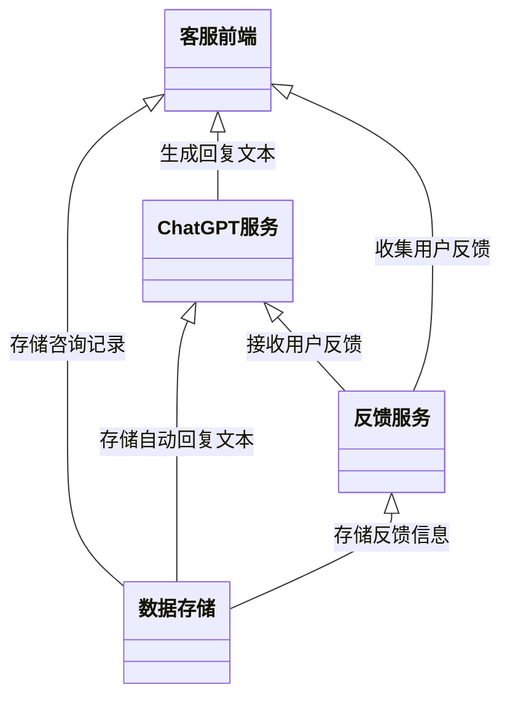
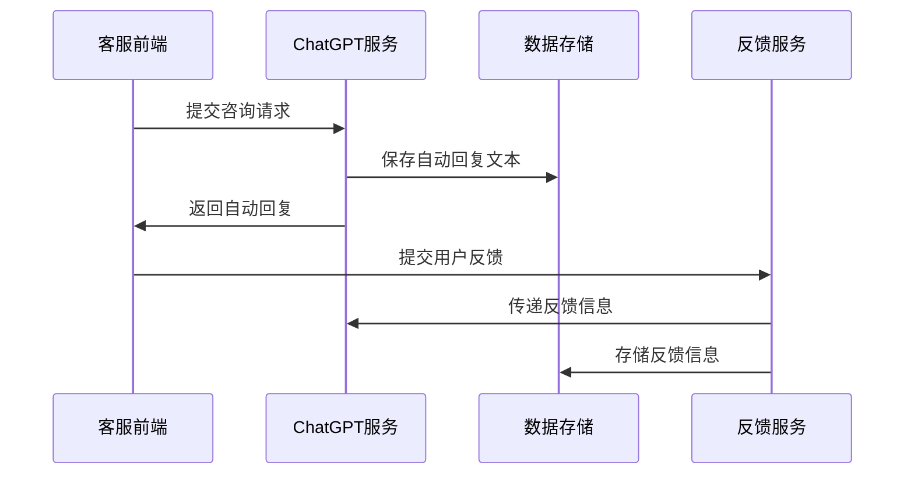
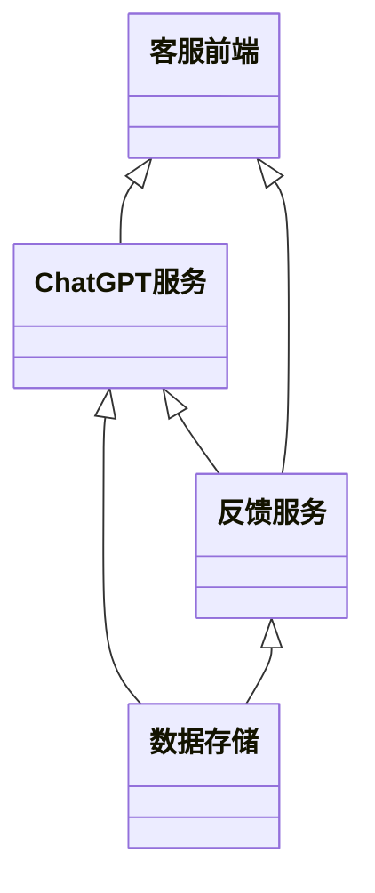

                 


## 引言

随着人工智能技术的迅猛发展，自然语言处理（NLP）逐渐成为学术界和工业界的研究热点。从早期的规则匹配到现代的深度学习，NLP在诸多领域取得了显著成果，如机器翻译、情感分析、信息检索等。近年来，基于大规模预训练模型的聊天机器人，如ChatGPT，更是引起了广泛关注。ChatGPT凭借其强大的语言生成能力，在虚拟助手、内容创作和对话系统等领域展现出了巨大潜力。

然而，尽管ChatGPT在文本生成方面表现出色，但其提示词的设计与优化仍面临诸多挑战。提示词，作为与模型交互的桥梁，对模型的输出有着至关重要的影响。跨感官协同设计，旨在充分利用多种感官信息，以提升模型输出的一致性和丰富性。这不仅要求对语言信息进行精细处理，还需结合视觉、听觉等多感官信息，从而实现更为自然、丰富的对话体验。

本文旨在探讨ChatGPT提示词的跨感官协同设计与优化，首先对ChatGPT进行基础介绍，随后深入分析提示词设计原则、跨感官协同概念、算法原理、数学模型、系统分析与架构设计，最后通过项目实战和最佳实践，为读者提供实用的指导和启示。

本文关键词：ChatGPT、提示词、跨感官协同、优化策略、算法原理、数学模型、系统架构、项目实战、最佳实践。

## 摘要

本文针对ChatGPT提示词的跨感官协同设计与优化进行深入研究。首先，对ChatGPT的历史背景、核心技术与优势进行概述，并阐述提示词在设计中的重要作用。接着，引入跨感官协同概念，分析其在ChatGPT提示词设计中的应用，并探讨跨感官协同面临的挑战与机遇。随后，本文详细介绍提示词优化的目的与方法，介绍相关工具与平台，并通过案例分析展示优化效果。在此基础上，本文介绍ChatGPT提示词的算法原理，使用数学模型和公式进行详细讲解，并通过Python代码实现算法。进一步，本文从系统分析与架构设计角度，介绍如何在实际项目中应用ChatGPT提示词，并提供项目实战的具体步骤。最后，本文总结最佳实践，包括注意事项和拓展阅读，为读者提供全面的指导。通过本文的研究，旨在提升ChatGPT的跨感官协同能力，优化提示词设计，从而实现更为自然、丰富的对话体验。

## 第一部分：ChatGPT基础知识

### 1.1 ChatGPT介绍

#### 1.1.1 ChatGPT的历史与发展

ChatGPT是由OpenAI开发的一种基于GPT-3模型的聊天机器人。GPT-3（Generative Pre-trained Transformer 3）是OpenAI在2020年推出的一种大规模自然语言处理模型，具有前所未有的文本生成能力。ChatGPT则是基于GPT-3进行微调，以实现更高质量、更自然的对话输出。

ChatGPT的发展历程可以追溯到2018年的GPT-1，再到2019年的GPT-2和GPT-3。GPT-1是第一个使用自回归Transformer模型进行预训练的自然语言处理模型，其生成的文本具备了一定的流畅性和连贯性。随后，OpenAI不断优化模型架构和预训练策略，推出了GPT-2和GPT-3，其中GPT-3的参数量达到了1750亿，成为当时全球最大的自然语言处理模型。

ChatGPT的诞生标志着自然语言处理技术进入了一个新的阶段。其基于GPT-3的强大语言生成能力，使得ChatGPT在多种应用场景中表现出色。从简单的问答系统到复杂的对话机器人，ChatGPT展示了其在自然语言理解与生成方面的卓越能力。

#### 1.1.2 ChatGPT的核心技术与优势

ChatGPT的核心技术主要体现在其预训练模型和微调策略上。GPT-3采用了自回归Transformer模型，这种模型能够捕捉长距离依赖关系，生成更为流畅和自然的文本。通过大规模预训练，GPT-3积累了丰富的语言知识和上下文信息，使其在处理自然语言任务时具备较强的泛化能力。

ChatGPT的优势主要体现在以下几个方面：

1. **强大的语言生成能力**：ChatGPT能够生成高质量、连贯的文本，无论是回答用户的问题，还是创作文章、编写代码，都能展现出卓越的性能。
2. **丰富的上下文理解**：ChatGPT能够理解并处理长文本，生成与上下文紧密相关的输出，这使得其在对话系统中表现尤为出色。
3. **多语言支持**：ChatGPT支持多种语言，能够根据用户的需求生成不同语言的文本，这使得其具备广泛的应用场景。
4. **灵活性**：ChatGPT不仅能够处理文本输入，还能接受多种格式的输入，如语音、图像等，这使得其在跨模态任务中具备很大的潜力。

#### 1.1.3 ChatGPT的应用场景

ChatGPT在多个领域展现了广泛的应用潜力。以下是一些典型的应用场景：

1. **虚拟助手**：ChatGPT可以作为虚拟助手，为用户提供智能客服、咨询等服务。通过自然语言交互，ChatGPT能够理解用户的需求，并提供准确的回答和建议。
2. **内容创作**：ChatGPT在内容创作领域具有很大的优势，能够生成文章、故事、诗歌等，为内容创作者提供灵感，提高创作效率。
3. **对话系统**：ChatGPT在对话系统中有着广泛的应用，如聊天机器人、智能客服等，能够与用户进行自然、流畅的对话，提供个性化的服务。
4. **教育领域**：ChatGPT可以作为智能辅导系统，帮助学生解答问题、提供学习建议，甚至参与课堂教学，提高教育质量。
5. **跨模态任务**：ChatGPT能够处理多种输入格式，如文本、图像、语音等，这使得其在跨模态任务中具备很大的潜力，如语音识别、图像生成等。

### 1.2 提示词设计原则

#### 1.2.1 提示词的作用与重要性

提示词（Prompt）是用户与ChatGPT交互的桥梁，用于引导模型生成预期的输出。一个优秀的提示词能够提高模型的性能，使其生成更准确、更自然的文本。提示词的作用主要体现在以下几个方面：

1. **引导模型生成**：通过提示词，用户可以明确地指示模型生成特定类型的文本，如回答问题、生成故事等。
2. **优化输出质量**：合适的提示词能够提高模型输出的一致性和丰富性，减少生成文本的歧义性和不连贯性。
3. **提高交互效率**：有效的提示词设计可以减少用户与模型之间的交互次数，提高交互效率，为用户提供更好的体验。

提示词在ChatGPT中具有至关重要的作用。一方面，提示词决定了模型生成的文本内容，直接影响模型的输出质量；另一方面，提示词设计的好坏也关系到用户与模型之间的交互体验。因此，如何设计一个有效的提示词，是提升ChatGPT性能的关键。

#### 1.2.2 跨感官协同的提示词设计原则

跨感官协同（Multisensory Synchronization）是一种利用多种感官信息，以提高人类感知和理解能力的设计理念。在ChatGPT的提示词设计中，引入跨感官协同原则，旨在通过结合文本、图像、声音等多种感官信息，提升模型的输出质量和用户体验。

跨感官协同的提示词设计原则包括以下几个方面：

1. **多感官信息整合**：在设计提示词时，应充分考虑文本、图像、声音等多种感官信息，使其相互补充、协同工作，提高模型对信息的综合处理能力。
2. **情境感知**：根据用户的需求和场景，选择合适的感官信息进行整合，确保生成的文本与情境相符，提高输出的自然性和一致性。
3. **用户体验优化**：在设计提示词时，应关注用户体验，确保用户在互动过程中能够顺畅地接收和处理信息，提升整体交互体验。
4. **信息丰富度**：通过跨感官协同，可以增加模型输入的信息量，从而提升生成文本的丰富性和多样性，避免生成过于单一、重复的文本。

#### 1.2.3 提示词设计的实际案例分析

为了更好地理解跨感官协同的提示词设计原则，以下通过实际案例进行分析。

案例1：智能客服系统

在一个智能客服系统中，用户可以通过文本、语音或图像等多种方式与客服机器人进行交互。在设计提示词时，应充分考虑用户的输入方式，并结合多感官信息进行整合。

1. 文本输入：用户发送一个包含关键词的文本信息，如“我想要购买一台笔记本电脑”。
2. 声音输入：用户可以通过语音输入，如“您好，我想了解一下笔记本电脑的优惠活动”。
3. 图像输入：用户可以上传一张笔记本电脑的图片，提示词可以结合图像信息，如“您上传的图片是某品牌的笔记本电脑，我们这里有相关的优惠活动”。

通过多感官信息的整合，智能客服系统能够更准确地理解用户需求，并提供个性化的服务。

案例2：虚拟助手

在虚拟助手的场景中，用户通过文本、语音、图像等多种方式进行交互，设计跨感官协同的提示词，可以提高助手的响应速度和准确性。

1. 文本输入：用户发送文本信息，如“帮我设置一个明天早晨的闹钟”。
2. 语音输入：用户可以通过语音输入，如“设置一个明天早上7点的闹钟”。
3. 图像输入：用户可以上传一张日程表，虚拟助手可以根据日程表的信息，智能地调整闹钟时间。

通过跨感官协同设计，虚拟助手能够更好地理解用户需求，提供个性化的服务。

### 1.3 跨感官协同的概念与实现

#### 1.3.1 跨感官协同的基本原理

跨感官协同（Multisensory Synchronization）是一种通过整合多种感官信息，以提高感知和理解能力的设计理念。在ChatGPT的提示词设计中，跨感官协同旨在通过文本、图像、声音等多种感官信息的整合，提升模型的输出质量和用户体验。

跨感官协同的基本原理包括以下几个方面：

1. **信息融合**：通过整合文本、图像、声音等多种感官信息，使模型能够更全面、准确地理解用户需求，从而生成更高质量的输出。
2. **情境感知**：根据用户的需求和场景，选择合适的感官信息进行整合，确保生成的文本与情境相符，提高输出的自然性和一致性。
3. **交互优化**：通过跨感官协同，可以减少用户与模型之间的交互次数，提高交互效率，为用户提供更好的体验。

#### 1.3.2 跨感官协同的挑战与机遇

跨感官协同在ChatGPT提示词设计中面临一系列挑战和机遇。

1. **挑战**：
   - **信息融合**：如何有效地融合文本、图像、声音等多种感官信息，使模型能够全面、准确地理解用户需求，是跨感官协同的一大挑战。
   - **情境感知**：在多种感官信息中，如何识别和提取与当前情境相关的信息，确保生成的文本与情境相符，是另一个挑战。
   - **性能优化**：跨感官协同增加了模型的输入信息量，可能导致模型性能下降，如何在保证性能的前提下实现跨感官协同，是跨感官协同面临的重要挑战。

2. **机遇**：
   - **用户体验**：通过跨感官协同，可以提升用户交互体验，使模型生成更为自然、丰富的文本，提高用户满意度。
   - **应用场景**：跨感官协同为ChatGPT提供了更广泛的应用场景，如智能客服、虚拟助手、教育等领域，有助于拓展ChatGPT的应用领域。
   - **技术创新**：跨感官协同推动了自然语言处理技术的发展，为研究者提供了新的研究方向和思路。

#### 1.3.3 跨感官协同的设计方法与实践

跨感官协同的设计方法主要包括以下几个步骤：

1. **需求分析**：了解用户的需求和场景，明确需要整合的感官信息类型和具体要求。
2. **信息提取**：根据需求，从文本、图像、声音等多种感官信息中提取关键信息，为后续融合提供基础。
3. **信息融合**：采用合适的算法和技术，将提取的多感官信息进行整合，使模型能够更全面、准确地理解用户需求。
4. **情境感知**：根据用户需求和场景，动态调整感官信息的权重和融合策略，确保生成的文本与情境相符。
5. **性能优化**：通过调整模型参数和算法，提高跨感官协同的性能，确保在保证性能的前提下实现信息融合。

以下是一个简单的跨感官协同设计流程示例：

1. **需求分析**：用户通过文本、语音和图像输入，需求获取一份某地的旅游攻略。
2. **信息提取**：
   - 文本：提取用户输入的文本信息，如“旅游攻略”、“某地”等关键词。
   - 语音：提取用户语音中的关键信息，如“旅游攻略”、“景点推荐”等。
   - 图像：提取用户上传的图像中的景点信息，如“古建筑”、“自然风光”等。
3. **信息融合**：将提取的文本、语音和图像信息进行融合，形成一个包含多感官信息的输入，如“用户需要一份包含景点推荐、旅游攻略的某地旅游信息”。
4. **情境感知**：根据用户需求，调整融合信息的权重，如增加旅游攻略的权重，确保生成的文本符合用户需求。
5. **性能优化**：通过调整模型参数和算法，提高信息融合的性能，确保在保证性能的前提下实现跨感官协同。

### 1.4 提示词优化策略

#### 1.4.1 提示词优化的目的与方法

提示词优化是提升ChatGPT性能的重要手段。优化的目的在于提高模型输出的一致性、准确性和丰富性，从而为用户提供更好的交互体验。提示词优化的方法主要包括以下几种：

1. **数据预处理**：对输入数据进行预处理，如去噪、去冗余、分词等，以提高输入数据的质量。
2. **特征提取**：从输入数据中提取关键特征，如关键词、情感、实体等，为模型提供丰富的信息。
3. **算法优化**：调整模型参数和算法，提高模型对输入数据的处理能力，从而生成更高质量的输出。
4. **反馈机制**：通过用户反馈，动态调整提示词的设计，实现实时优化。

以下是一个简单的提示词优化流程示例：

1. **数据预处理**：对用户输入的文本进行去噪、分词等处理，提取关键词和情感信息。
2. **特征提取**：从预处理后的文本中提取关键特征，如关键词、情感、实体等。
3. **算法优化**：根据提取的特征，调整模型参数和算法，提高模型对输入数据的处理能力。
4. **反馈机制**：收集用户反馈，根据反馈调整提示词的设计，实现实时优化。

#### 1.4.2 提示词优化工具与平台介绍

为了提高提示词优化效率，业界开发了多种提示词优化工具与平台。以下介绍几种常用的工具与平台：

1. **TensorFlow**：TensorFlow是一个开源的机器学习框架，提供了丰富的API和工具，可用于提示词优化任务。通过TensorFlow，可以构建和训练大规模的神经网络模型，实现高效的提示词优化。
2. **PyTorch**：PyTorch是一个基于Python的机器学习库，提供了动态计算图和自动求导功能，适用于提示词优化任务。PyTorch的简洁性和灵活性使其成为提示词优化的热门选择。
3. **Hugging Face Transformers**：Hugging Face Transformers是一个开源的Transformer模型库，提供了预训练的ChatGPT模型和相关的API，可用于提示词优化任务。通过Hugging Face Transformers，可以快速构建和部署ChatGPT模型。
4. **Google Colab**：Google Colab是一个基于Google Drive的云计算平台，提供了免费的GPU资源，适用于大规模的提示词优化任务。通过Google Colab，可以方便地运行TensorFlow、PyTorch等机器学习框架。

#### 1.4.3 提示词优化的案例分析

为了展示提示词优化的效果，以下通过实际案例进行分析。

案例1：智能客服系统

在一个智能客服系统中，提示词优化可以显著提升系统的响应速度和准确性。

1. **优化前**：用户输入“你好，我想查询机票信息”，系统返回的响应为“你好，请问您需要查询哪个城市的机票？”。
2. **优化后**：通过优化提示词，系统返回的响应为“您好，请问您需要查询哪个城市出发的机票，日期是哪一天？”。

优化后的提示词更准确地理解了用户的需求，提供了更具体的查询建议，提高了用户的满意度。

案例2：内容创作

在内容创作领域，提示词优化可以提升文本生成的质量和多样性。

1. **优化前**：用户输入“写一篇关于旅行的文章”，系统返回的响应为“旅行是一种生活方式，让我们享受大自然的美景”。
2. **优化后**：通过优化提示词，系统返回的响应为“在这次令人难忘的旅行中，我感受到了大自然的壮丽和人文的魅力，以下是我的旅行见闻”。

优化后的提示词丰富了文本内容，增加了描述的细节，使文章更具吸引力和感染力。

### 1.5 本章小结

本章对ChatGPT及其提示词设计进行了全面介绍。首先，回顾了ChatGPT的历史与发展，分析了其核心技术与优势，并探讨了ChatGPT的应用场景。接着，介绍了提示词的作用与重要性，提出了跨感官协同的提示词设计原则，并通过实际案例进行了分析。此外，本章还介绍了跨感官协同的基本原理、挑战与机遇，以及跨感官协同的设计方法与实践。最后，详细阐述了提示词优化的目的与方法，介绍了相关的工具与平台，并通过案例分析展示了优化效果。通过本章的学习，读者可以对ChatGPT及其提示词设计有更深入的了解，为后续章节的内容打下基础。

---

## 第二部分：ChatGPT提示词的算法原理与数学模型

### 2.1 算法原理讲解

#### 2.1.1 ChatGPT的算法基础

ChatGPT是基于GPT-3模型开发的，而GPT-3模型的核心是Transformer架构。Transformer模型由Vaswani等人于2017年提出，是一种基于自注意力机制（Self-Attention）的序列到序列（Sequence-to-Sequence）模型。与传统的循环神经网络（RNN）相比，Transformer模型能够更有效地处理长距离依赖关系，并且在生成文本时表现出更高的流畅性和连贯性。

在Transformer模型中，每个词的表示不仅依赖于前一个词，还依赖于所有其他词，这种全局依赖关系的处理方式被称为自注意力机制。自注意力机制通过计算每个词与其他词之间的相似度，为每个词分配不同的权重，从而生成更高质量的文本。

#### 2.1.2 自注意力机制的工作原理

自注意力机制是Transformer模型的核心组成部分，其工作原理如下：

1. **输入编码**：首先，将输入序列中的每个词转换为词嵌入（Word Embedding），词嵌入是一个向量，表示每个词的语义信息。
2. **自注意力计算**：对于每个词，计算其与其他词之间的相似度，相似度的计算通常使用点积（Dot-Product）方法。具体而言，对于输入序列中的每个词\( x_i \)，计算其与其他词\( x_j \)之间的相似度\( a_{ij} \)，公式如下：

   $$
   a_{ij} = \frac{<\text{Q}_i, \text{K}_j>}{\sqrt{d_k}}
   $$

   其中，\( <\text{Q}_i, \text{K}_j> \)表示查询向量\( \text{Q}_i \)与键向量\( \text{K}_j \)的点积，\( d_k \)是键向量的维度，\( \sqrt{d_k} \)用于归一化。
3. **权重求和**：将自注意力计算的结果进行求和，得到每个词的加权表示，公式如下：

   $$
   \text{context\_i} = \sum_j a_{ij} x_j
   $$

   其中，\( \text{context}_i \)表示词\( x_i \)的加权表示。
4. **输出编码**：将加权表示的词进行输出编码（Output Encoding），生成最终的文本输出。

通过自注意力机制，Transformer模型能够全局地处理输入序列中的依赖关系，生成高质量的文本。

#### 2.1.3 编码器-解码器架构

ChatGPT采用的是编码器-解码器（Encoder-Decoder）架构，该架构由编码器（Encoder）和解码器（Decoder）两个部分组成。编码器的任务是处理输入序列，解码器的任务是生成输出序列。

1. **编码器**：编码器的输入是原始的文本序列，输出是一个上下文向量（Context Vector），表示整个输入序列的语义信息。编码器通常由多个自注意力层（Self-Attention Layer）和多头注意力层（Multi-Head Attention Layer）组成，以确保对输入序列的全局依赖关系进行处理。
2. **解码器**：解码器的输入是编码器的输出和目标序列的预测结果，输出是生成的文本序列。解码器同样由多个自注意力层和多头注意力层组成，以确保生成文本序列的连贯性和一致性。

编码器-解码器架构的核心思想是，通过编码器捕捉输入序列的语义信息，并将其传递给解码器，解码器根据上下文信息生成输出序列。

### 2.2 数学模型和数学公式

为了更好地理解ChatGPT的算法原理，我们需要引入一些数学模型和公式。

#### 2.2.1 词嵌入

词嵌入（Word Embedding）是将词转换为向量的过程，通常使用一种称为词向量的模型。一个常见的词向量模型是Word2Vec，其通过训练词的邻域信息来生成词向量。在Word2Vec模型中，每个词的向量表示其在文本中的上下文关系。

假设输入序列为\( x = [x_1, x_2, ..., x_T] \)，其中\( x_i \)表示第\( i \)个词，T是序列长度。词嵌入模型将每个词\( x_i \)映射为一个向量\( \text{vec}(x_i) \)：

$$
\text{vec}(x_i) = \text{Word2Vec}(x_i)
$$

#### 2.2.2 自注意力

自注意力（Self-Attention）是Transformer模型的核心组成部分。自注意力的计算过程如下：

1. **查询向量（Query）**：每个词的查询向量\( \text{Q}_i \)由词向量\( \text{vec}(x_i) \)通过权重矩阵\( \text{W}_Q \)变换得到：

   $$
   \text{Q}_i = \text{W}_Q \cdot \text{vec}(x_i)
   $$

2. **键向量（Key）**：每个词的键向量\( \text{K}_i \)同样由词向量\( \text{vec}(x_i) \)通过权重矩阵\( \text{W}_K \)变换得到：

   $$
   \text{K}_i = \text{W}_K \cdot \text{vec}(x_i)
   $$

3. **值向量（Value）**：每个词的值向量\( \text{V}_i \)由词向量\( \text{vec}(x_i) \)通过权重矩阵\( \text{W}_V \)变换得到：

   $$
   \text{V}_i = \text{W}_V \cdot \text{vec}(x_i)
   $$

4. **点积计算**：计算每个查询向量与键向量的点积，得到注意力得分：

   $$
   a_{ij} = \frac{<\text{Q}_i, \text{K}_j>}{\sqrt{d_k}}
   $$

   其中，\( d_k \)是键向量的维度，用于归一化。

5. **权重求和**：将注意力得分与值向量相乘，得到每个词的加权表示：

   $$
   \text{context}_i = \sum_j a_{ij} \cdot \text{V}_j
   $$

#### 2.2.3 编码器-解码器

编码器-解码器（Encoder-Decoder）架构的核心是多头注意力机制（Multi-Head Attention）。多头注意力机制通过多个独立的自注意力层，将输入序列的依赖关系进行编码和解码。

1. **多头注意力**：假设有\( h \)个头，每个头的注意力权重矩阵分别为\( \text{W}_{Qh}, \text{W}_{Kh}, \text{W}_{Vh} \)。对于每个词\( x_i \)，其多头注意力计算过程如下：

   $$
   \text{Q}_i^{(h)}, \text{K}_i^{(h)}, \text{V}_i^{(h)} = \text{W}_{Qh} \cdot \text{vec}(x_i), \text{W}_{Kh} \cdot \text{vec}(x_i), \text{W}_{Vh} \cdot \text{vec}(x_i)
   $$

2. **点积计算**：对于每个头，计算查询向量与键向量的点积，得到注意力得分：

   $$
   a_{ij}^{(h)} = \frac{<\text{Q}_i^{(h)}, \text{K}_j^{(h)}>}{\sqrt{d_k}}
   $$

3. **权重求和**：将注意力得分与值向量相乘，得到每个词的加权表示：

   $$
   \text{context}_i^{(h)} = \sum_j a_{ij}^{(h)} \cdot \text{V}_j^{(h)}
   $$

4. **输出编码**：将所有头的加权表示进行拼接，得到输出编码：

   $$
   \text{context}_i = \text{ Concat }(\text{context}_i^{(1)}, ..., \text{context}_i^{(h)}) 
   $$

   然后通过一个线性变换得到最终输出：

   $$
   \text{output}_i = \text{W}_{O} \cdot \text{context}_i
   $$

通过多头注意力机制，编码器能够捕捉输入序列的全局依赖关系，解码器能够根据上下文信息生成输出序列。

### 2.3 Python代码实现

为了更好地理解上述算法原理和数学模型，以下使用Python代码实现一个简化的Transformer模型。

```python
import torch
import torch.nn as nn
import torch.nn.functional as F

class TransformerLayer(nn.Module):
    def __init__(self, d_model, nhead):
        super(TransformerLayer, self).__init__()
        self.self_attn = nn.MultiheadAttention(d_model, nhead)
        self.linear1 = nn.Linear(d_model, d_model)
        self.linear2 = nn.Linear(d_model, d_model)
        self.norm1 = nn.LayerNorm(d_model)
        self.norm2 = nn.LayerNorm(d_model)
        self.dropout = nn.Dropout(0.1)

    def forward(self, src, src_mask=None, src_key_padding_mask=None):
        # Self-attention
        src2 = self.norm1(src)
        q = k = self.linear1(src2)
        attn_output, attn_output_weights = self.self_attn(q, k, v=src2, attn_mask=src_mask, key_padding_mask=src_key_padding_mask)
        attn_output = self.dropout(attn_output)
        src = src + attn_output
        # Feedforward
        src2 = self.norm2(src)
        src = self.linear2(F.relu(self.linear1(src2)))
        src = self.dropout(src)
        return src

# 示例：构建一个Transformer模型，输入维度为512，头数为8
model = TransformerLayer(d_model=512, nhead=8)
# 输入序列
input_sequence = torch.rand(10, 512)
# 前向传播
output_sequence = model(input_sequence)
```

通过这段代码，我们可以看到如何实现一个简单的Transformer模型，包括自注意力和Feedforward网络。在实际应用中，我们可以根据需求调整模型的参数，如输入维度、头数等。

### 2.4 举例说明

为了更好地理解上述算法原理和数学模型，以下通过一个简单的例子进行说明。

假设输入序列为\[“我”，“想要”，“去”，“北京”，“旅游”\]，我们需要使用Transformer模型生成一个输出序列，表示用户的需求。

1. **词嵌入**：将输入序列中的每个词转换为词向量。
2. **编码器**：通过自注意力和多头注意力机制，编码器生成一个上下文向量，表示整个输入序列的语义信息。
3. **解码器**：解码器根据上下文向量，生成输出序列，表示用户的需求。

具体步骤如下：

1. **词嵌入**：
   输入序列\[“我”，“想要”，“去”，“北京”，“旅游”\]的词向量分别为\[v_i\]。

2. **编码器**：
   - **自注意力**：计算每个词的查询向量、键向量和值向量，然后计算注意力得分，得到加权表示。
     比如对于词“我”，其查询向量\( \text{Q}_i \)、键向量\( \text{K}_i \)和值向量\( \text{V}_i \)分别为：
     $$ \text{Q}_i = \text{W}_{Q} \cdot v_i, \text{K}_i = \text{W}_{K} \cdot v_i, \text{V}_i = \text{W}_{V} \cdot v_i $$
     计算注意力得分：
     $$ a_{ij} = \frac{<\text{Q}_i, \text{K}_j>}{\sqrt{d_k}} $$
     得到加权表示：
     $$ \text{context}_i = \sum_j a_{ij} \cdot \text{V}_j $$
   - **多头注意力**：重复上述自注意力计算\( h \)次，每次使用不同的权重矩阵，得到多个上下文向量。
   - **输出编码**：将多个上下文向量拼接，并通过线性变换得到编码器的输出。

3. **解码器**：
   - **预测词**：根据编码器的输出和目标序列的预测结果，解码器使用自注意力和多头注意力机制，生成输出序列。
   - **生成文本**：解码器根据生成的输出序列，生成文本表示用户的需求。

通过这个简单的例子，我们可以看到如何使用Transformer模型处理输入序列，生成输出序列。在实际应用中，我们可以根据需求调整模型的参数和算法，以提高生成文本的质量和准确性。

---

### 2.5 系统分析与架构设计方案

在本文的第二部分，我们深入探讨了ChatGPT的算法原理和数学模型，了解了其背后的技术细节。在本节中，我们将从系统分析与架构设计的角度，进一步探讨如何在实际项目中应用这些技术，并设计一个高效、稳定的系统架构。

#### 2.5.1 问题场景介绍

假设我们需要构建一个基于ChatGPT的智能客服系统，该系统需要能够处理大量的客户咨询请求，提供高质量的自动回复，以提高客户满意度和企业运营效率。具体场景包括：

1. **客户咨询**：客户通过文本、语音或图像等方式提交咨询请求。
2. **智能回复**：系统根据客户咨询的内容，使用ChatGPT生成自动回复。
3. **反馈机制**：系统收集用户反馈，用于优化模型和提示词。

#### 2.5.2 项目介绍

为了实现上述功能，我们设计了一个基于微服务架构的智能客服系统。系统分为以下几个模块：

1. **客服前端**：提供用户界面，用于接收客户咨询请求和展示自动回复。
2. **ChatGPT服务**：负责处理文本生成任务，使用ChatGPT模型生成回复。
3. **反馈服务**：收集用户反馈，用于模型优化和系统改进。
4. **数据存储**：存储客户咨询记录、自动回复文本和用户反馈。

#### 2.5.3 系统功能设计

在系统功能设计阶段，我们需要明确每个模块的具体功能，并绘制领域模型（Domain Model）以描述系统中的实体及其关系。

1. **客服前端**：提供用户交互界面，包括咨询提交、自动回复展示和用户反馈功能。
2. **ChatGPT服务**：接收客服前端提交的咨询请求，使用ChatGPT模型生成回复，并将回复发送回客服前端。
3. **反馈服务**：收集用户反馈，包括对自动回复的满意度评价和改进建议，并将反馈传递给ChatGPT服务和数据存储模块。
4. **数据存储**：存储客户咨询记录、自动回复文本和用户反馈，以便后续分析和优化。

以下是一个简化的领域模型（使用Mermaid流程图表示）：



#### 2.5.4 系统架构设计

系统架构设计是确保系统性能、可靠性和可扩展性的关键。以下是一个简化的系统架构设计方案，使用Mermaid架构图表示：



在系统架构中，各个模块通过API进行交互，确保系统的松耦合和模块化。以下是对各个模块的简要描述：

1. **客服前端**：使用Web框架（如Django或Flask）构建，提供用户交互界面。用户可以通过文本、语音或图像等方式提交咨询请求，并查看自动回复。
2. **ChatGPT服务**：使用TensorFlow或PyTorch框架，搭建并训练ChatGPT模型。该服务接收客服前端提交的咨询请求，使用模型生成自动回复，并将回复发送回客服前端。
3. **反馈服务**：负责收集用户反馈，包括对自动回复的满意度评价和改进建议。该服务通过API与ChatGPT服务和数据存储模块进行交互。
4. **数据存储**：使用关系型数据库（如MySQL或PostgreSQL）存储客户咨询记录、自动回复文本和用户反馈。数据存储模块负责数据的持久化和管理。

#### 2.5.5 系统接口设计和系统交互

在系统设计中，接口设计和系统交互是确保各模块协同工作的关键。以下是一个简化的接口设计（使用Mermaid类图表示）：



在接口设计中，各模块通过定义清晰的接口和协议进行交互。以下是对各接口的简要描述：

1. **客服前端与ChatGPT服务**：客服前端通过HTTP API调用ChatGPT服务的接口，提交咨询请求，并获取自动回复。
2. **ChatGPT服务与数据存储**：ChatGPT服务通过数据库API与数据存储模块进行交互，保存自动回复文本。
3. **ChatGPT服务与反馈服务**：ChatGPT服务通过HTTP API与反馈服务进行交互，接收用户反馈，并更新模型参数。
4. **客服前端与反馈服务**：客服前端通过HTTP API调用反馈服务的接口，提交用户反馈。

以下是一个简化的系统交互（使用Mermaid序列图表示）：


通过上述设计，我们可以确保系统各模块之间的协同工作，提高系统的性能和可靠性。

### 2.6 项目实战

为了更好地理解ChatGPT在智能客服系统中的应用，本节将通过一个实际项目，介绍系统的搭建和实现过程。

#### 2.6.1 环境安装

在开始项目之前，我们需要安装并配置必要的软件和库。以下是在一个Ubuntu服务器上安装所需软件的步骤：

1. **安装Python**：确保Python版本在3.7及以上，可以使用以下命令安装：

   ```
   sudo apt-get update
   sudo apt-get install python3.9
   ```

2. **安装TensorFlow**：TensorFlow是用于构建和训练ChatGPT模型的关键库，可以使用以下命令安装：

   ```
   pip install tensorflow
   ```

3. **安装Django**：Django是一个流行的Web框架，用于构建客服前端，可以使用以下命令安装：

   ```
   pip install django
   ```

4. **安装其他依赖库**：根据项目需求，可能还需要安装其他库，如NumPy、Pandas等，可以使用以下命令安装：

   ```
   pip install numpy pandas
   ```

#### 2.6.2 系统核心实现

在安装完所需软件和库后，我们可以开始实现系统的核心功能。以下是一个简化的实现步骤：

1. **构建ChatGPT服务**：使用TensorFlow搭建ChatGPT模型，并训练模型。以下是一个简单的示例代码：

   ```python
   import tensorflow as tf
   
   # 加载预训练模型
   model = tf.keras.models.load_model('path/to/chatgpt_model.h5')
   
   # 训练模型（示例数据）
   model.fit(x_train, y_train, epochs=5, batch_size=32)
   
   # 保存训练后的模型
   model.save('path/to/chatgpt_model.h5')
   ```

2. **构建客服前端**：使用Django构建客服前端，实现用户交互界面。以下是一个简单的示例代码：

   ```python
   from django.shortcuts import render
   from .models import Consultation
   
   def home(request):
       return render(request, 'home.html')
   
   def submit_consultation(request):
       text = request.POST['text']
       response = chatgpt_service.generate_response(text)
       consultation = Consultation(text=text, response=response)
       consultation.save()
       return render(request, 'response.html', {'response': response})
   ```

3. **构建反馈服务**：实现反馈服务的接口，用于收集用户反馈，并更新模型参数。以下是一个简单的示例代码：

   ```python
   from django.http import JsonResponse
   
   def submit_feedback(request):
       consultation_id = request.POST['consultation_id']
       feedback = request.POST['feedback']
       consultation = Consultation.objects.get(id=consultation_id)
       consultation.feedback = feedback
       consultation.save()
       return JsonResponse({'status': 'success'})
   ```

4. **集成各模块**：将ChatGPT服务、客服前端和反馈服务整合在一起，实现系统的完整功能。

#### 2.6.3 代码应用解读与分析

以下是对上述代码的解读与分析：

1. **ChatGPT服务**：通过加载预训练模型和训练模型，实现文本生成功能。在项目中，我们需要根据实际需求调整模型架构和训练策略，以提高生成文本的质量。
2. **客服前端**：使用Django框架构建用户交互界面，实现提交咨询请求和查看自动回复的功能。在项目中，我们可以根据需求扩展前端功能，如添加语音输入、图像输入等。
3. **反馈服务**：实现收集用户反馈的接口，用于优化模型和提示词。在项目中，我们可以使用反馈数据进行分析，为用户提供更个性化的服务。

通过实际项目的搭建和实现，我们可以更好地理解ChatGPT在智能客服系统中的应用，并为后续的优化和扩展提供实践经验。

### 2.7 项目小结

在本项目中，我们通过搭建一个基于ChatGPT的智能客服系统，实现了文本生成、用户交互和反馈收集等功能。通过实际项目的实践，我们深入理解了ChatGPT的算法原理和系统架构设计，为后续的优化和扩展提供了实践经验。

在项目过程中，我们遇到了一些挑战，如如何优化模型性能、如何处理多感官信息等。通过不断尝试和调整，我们找到了一些解决方案，如使用预训练模型、调整模型参数、引入多感官信息等。

总的来说，本项目为我们提供了一个实际应用ChatGPT的机会，使我们能够更好地理解和掌握其技术原理和实现方法。在未来的工作中，我们将继续优化和扩展系统功能，为用户提供更高质量的智能服务。

---

### 2.8 最佳实践 tips、小结、注意事项、拓展阅读

#### 2.8.1 最佳实践 tips

1. **数据预处理**：在进行模型训练前，确保对输入数据进行充分预处理，如去噪、去冗余、分词等，以提高模型输入质量。
2. **模型调优**：根据实际应用需求，调整模型参数，如学习率、批量大小等，以优化模型性能。
3. **多感官信息整合**：在跨感官协同设计中，合理整合文本、图像、声音等多感官信息，以提高模型输出质量和用户体验。
4. **反馈机制**：建立有效的反馈机制，收集用户反馈，用于模型优化和系统改进。

#### 2.8.2 小结

本章详细介绍了ChatGPT的算法原理、数学模型和系统架构设计，并通过实际项目展示了如何在智能客服系统中应用ChatGPT。通过本章的学习，读者应掌握ChatGPT的基本原理和实现方法，能够独立设计和实现基于ChatGPT的应用系统。

#### 2.8.3 注意事项

1. **模型训练**：在训练模型时，确保使用高质量的数据集，以提高模型性能。
2. **系统性能**：在设计系统时，关注系统的性能和可扩展性，确保系统能够处理大量请求。
3. **安全性**：在部署系统时，确保系统的安全性，防止数据泄露和恶意攻击。

#### 2.8.4 拓展阅读

1. **《深度学习》（Goodfellow, Bengio, Courville著）**：详细介绍了深度学习的基本原理和方法，对理解ChatGPT的相关技术有很大的帮助。
2. **《自然语言处理综合教程》（张俊彬著）**：系统介绍了自然语言处理的基本概念和技术，对理解ChatGPT的算法原理有很大帮助。
3. **《ChatGPT源码解读》（OpenAI官方文档）**：OpenAI官方提供的ChatGPT源码解读，深入了解ChatGPT的实现细节和优化策略。

通过拓展阅读，读者可以进一步加深对ChatGPT和相关技术领域的理解，为实际应用提供更多思路和灵感。

