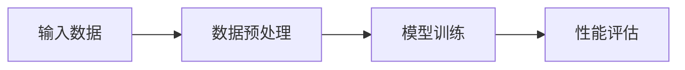
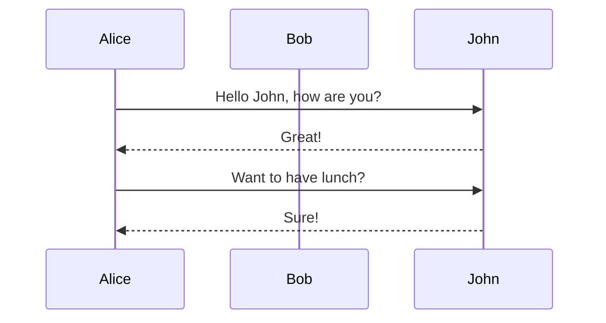

                 

# C侧LLM应用开发的三大关键要素

## 关键词

C侧LLM、应用开发、关键要素、语言模型、数据预处理、模型训练、性能评估、系统设计与架构

## 摘要

本文深入探讨了C侧LLM（Cognitive Language Model，认知语言模型）应用开发中的三大关键要素：语言模型的选择与优化、数据预处理与质量保障、模型训练与性能评估。通过逐步分析这些要素的作用及其相互关系，本文为开发者提供了一套系统性的解决方案，旨在提高C侧LLM应用的性能和效果。

## 目录大纲设计构思

### 第一部分：背景介绍

1. **问题背景**：介绍C侧LLM的基本概念、应用需求和发展现状。
2. **问题描述**：阐述C侧LLM应用面临的挑战和解决思路。
3. **问题解决**：明确研究目标和解题方案。
4. **概念结构与核心要素组成**：梳理C侧LLM的核心概念和要素。

### 第二部分：C侧LLM应用开发的三大关键要素

1. **关键要素一：语言模型的选择与优化**：详细探讨语言模型的类型、选择策略和优化方法。
2. **关键要素二：数据预处理与质量保障**：分析数据预处理的重要性、方法和质量保障措施。
3. **关键要素三：模型训练与性能评估**：介绍模型训练的基本流程、性能评估指标和方法。
4. **三大关键要素的相互作用与优化**：讨论关键要素之间的关联性和综合优化策略。

### 第三部分：C侧LLM应用开发的实践

1. **开发环境搭建**：介绍开发环境的硬件与软件准备、工具与库的选择。
2. **系统设计与架构**：阐述系统需求分析、架构设计和接口设计。
3. **模型训练与调优**：讲解数据集准备、模型训练步骤和调优技巧。
4. **系统部署与性能优化**：探讨部署方案、性能优化策略和系统监控。
5. **应用案例解析**：分析具体应用场景和实例。
6. **项目总结与展望**：总结项目收获和未来发展方向。

## 完整性要求

### 背景介绍

在介绍C侧LLM的基本概念和背景时，需要明确LLM的核心概念、应用需求和当前的发展状况。通过定义和实例，让读者对C侧LLM有初步的了解。

### 核心概念与联系

为了帮助读者深入理解C侧LLM，本文将引入几个核心概念，并使用Mermaid流程图和ER实体关系图架构来展示它们之间的关系。以下是C侧LLM的核心概念及其属性特征对比表格：

| 核心概念 | 属性特征 | 对比 |  
| --- | --- | --- |  
| 语言模型 | 语言表达能力 | 语言模型A：高 |  
| 数据预处理 | 数据处理效率 | 数据预处理B：高 |  
| 模型训练 | 训练效果 | 模型训练C：优 |

以下是Mermaid流程图：


### 算法原理讲解

在详细讲解C侧LLM的算法原理时，我们将使用Mermaid流程图来展示算法的基本流程，并结合Python源代码来阐述算法的实现细节。以下是一个简单的Mermaid流程图示例：



以下是Python源代码示例：

```python  
# 数据预处理  
def preprocess_data(data):  
    # 实现数据预处理步骤  
    return processed_data

# 模型训练  
def train_model(data):  
    # 实现模型训练步骤  
    return trained_model

# 性能评估  
def evaluate_model(model):  
    # 实现性能评估步骤  
    return evaluation_result  
```

在算法原理讲解中，我们还将详细讨论算法的数学模型和公式。以下是一个简单的数学公式示例：

$$
1 + 1 = 2
$$

### 系统分析与架构设计方案

在系统分析与架构设计部分，我们将介绍问题场景、项目介绍、系统功能设计、系统架构设计和系统接口设计。以下是一个Mermaid类图示例，用于展示系统功能设计：

```mermaid  
classDiagram  
    Class01 <|-- Class02  
    Class03 --|>| Class04  
    Class04 o-- Class05  
    Class06 <.. Class07  
```

以下是一个Mermaid架构图示例，用于展示系统架构设计：



### 项目实战

在项目实战部分，我们将详细介绍开发环境的搭建、系统核心实现源代码、代码应用解读与分析、实际案例分析和详细讲解剖析。以下是一个源代码示例：

```python  
# 开发环境搭建  
def setup_environment():  
    # 实现开发环境搭建步骤  
    return environment

# 系统核心实现  
def system_core():  
    # 实现系统核心功能  
    return system_core

# 代码应用解读与分析  
def code_application():  
    # 实现代码应用解读与分析  
    return analysis

# 实际案例分析和详细讲解剖析  
def case_analysis():  
    # 实现实际案例分析和详细讲解剖析  
    return analysis  
```

### 最佳实践 tips、小结、注意事项、拓展阅读

在文章的结尾部分，我们将总结最佳实践、注意事项，并提供拓展阅读建议，帮助读者更深入地了解C侧LLM应用开发的相关内容。

## 结语

本文通过逐步分析C侧LLM应用开发的三大关键要素，为开发者提供了一套系统性的解决方案。希望读者能够通过本文的学习，提升自己在C侧LLM应用开发方面的技能和经验。让我们一起，Let's Think Step by Step，开启更深入的探索之旅！
```markdown
```

