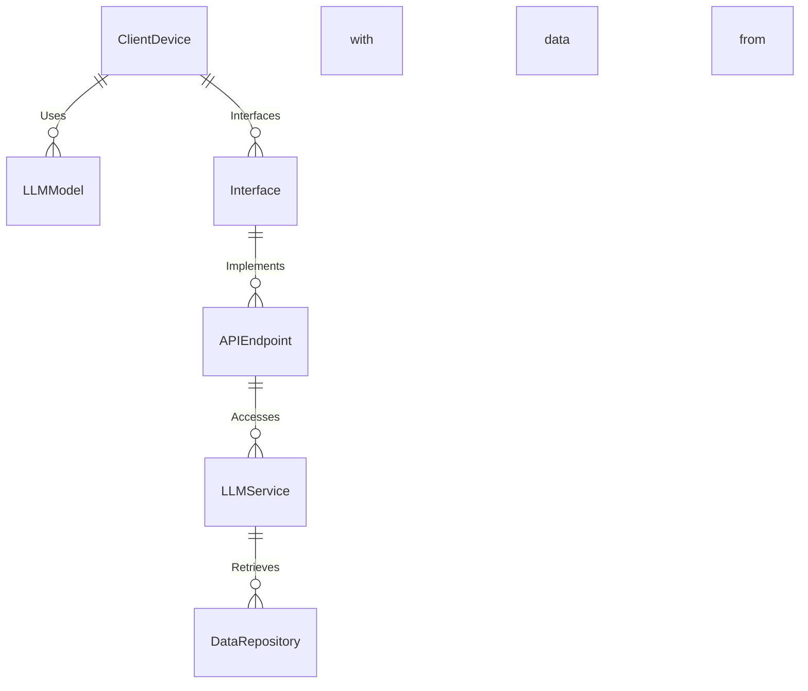
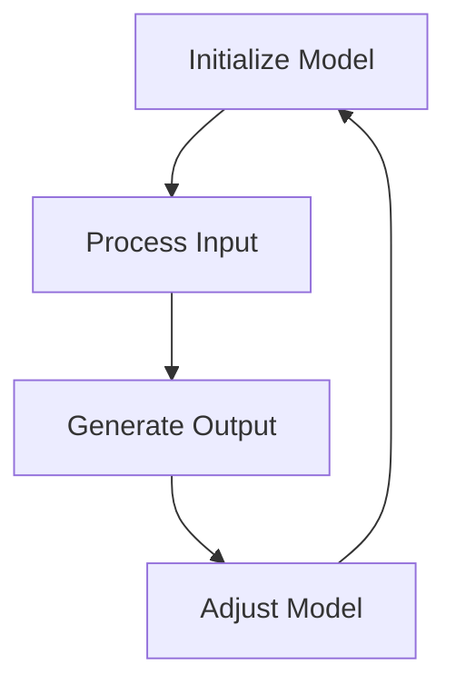
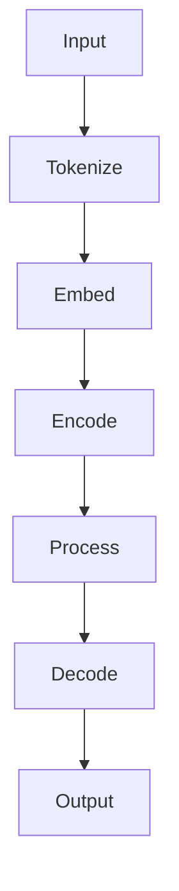
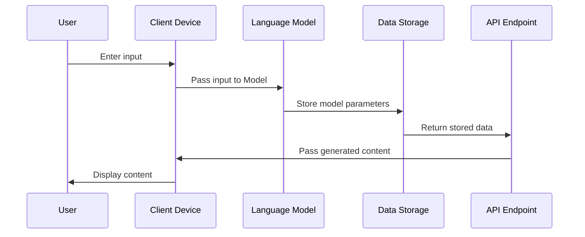

                 


### C-Side LLAMA Application Exploration: Speed and Agility

---

#### Keywords: C-Side LLAMA, Application Exploration, Speed, Agility

---

#### Abstract:

This article delves into the critical aspects of implementing C-Side Large Language Models (LLM) applications, focusing on speed and agility. We will explore the underlying principles, practical implementations, and best practices to ensure efficient and adaptable use of C-Side LLAMA in real-world scenarios.

---

#### Part 1: Introduction to C-Side LLAMA

### 1.1 Overview of C-Side LLAMA

**1.1.1 Problem Background**

In today's rapidly evolving technological landscape, the demand for intelligent systems capable of processing and generating human-like text has surged. Large Language Models (LLMs) have emerged as powerful tools for various applications, including natural language processing, content generation, and customer service automation. However, the performance of these models in real-world applications often falls short due to issues related to speed and agility.

**1.1.2 Problem Description**

The primary challenge in deploying C-Side LLM applications lies in achieving optimal performance in terms of speed and agility. Speed is crucial for real-time applications, where delays can result in suboptimal user experiences. Agility, on the other hand, is essential for adapting to changing requirements and scenarios. Current LLM architectures often struggle to balance these two aspects effectively.

**1.1.3 Problem Solving**

To address these challenges, we need to explore new methodologies and optimizations that enhance the speed and agility of C-Side LLM applications. This article will discuss various strategies, including algorithmic improvements, hardware acceleration, and system-level optimizations, to achieve better performance.

**1.1.4 Scope and Limitations**

The scope of this article will focus on C-Side LLM applications, highlighting the critical role of speed and agility. However, it's important to note that the principles discussed here can be applied to other LLM applications as well. The limitations will be discussed in the context of specific scenarios and use cases.

**1.1.5 Structure of the Article**

The article is structured as follows:

- **Part 1: Introduction to C-Side LLAMA**: Provides an overview of the problem and introduces the core concepts and methodologies.
- **Part 2: Core Concepts and Algorithm Principles**: Discusses the key concepts and algorithms related to C-Side LLM applications.
- **Part 3: System Architecture and Design**: Explains the system architecture and design principles for C-Side LLM applications.
- **Part 4: Project Implementation and Case Study**: Presents a practical implementation and case study to demonstrate the application of the discussed concepts and methodologies.
- **Part 5: Best Practices and Further Reading**: Summarizes the key takeaways and provides additional resources for further exploration.

---

### 1.2 Core Concepts of C-Side LLAMA

**1.2.1 Definition and Importance**

C-Side LLAMA refers to the application of Large Language Models (LLMs) on the client-side, primarily in devices such as smartphones, tablets, and IoT devices. This approach leverages the computational power of these devices to enhance the speed and agility of LLM applications, making them more suitable for real-time scenarios.

**1.2.2 Key Attributes and Comparison**

The key attributes of C-Side LLAMA include:

- **Speed**: C-Side LLAMA applications run directly on the client-side devices, reducing latency and improving response times.
- **Agility**: C-Side LLAMA allows for quick adaptation to changing requirements and scenarios, enabling dynamic adjustments without requiring server-side updates.
- **Scalability**: C-Side LLAMA can scale horizontally across multiple client-side devices, distributing the computational load efficiently.

To illustrate the attributes, let's compare C-Side LLAMA with server-side LLM applications:

| Feature | C-Side LLAMA | Server-Side LLM |
| --- | --- | --- |
| **Speed** | High | Moderate |
| **Agility** | High | Low |
| **Scalability** | High | Moderate |

**1.2.3 Entity-Relationship Diagram**

The following Mermaid diagram represents the core components and relationships in a C-Side LLAMA application:



---

### 1.3 Algorithm Principles and Implementation

**1.3.1 Algorithm A: Detailed Explanation**

**1.3.1.1 Mermaid Diagram**



**1.3.1.2 Python Code Example**

```python
import random

def initialize_model():
    # Initialize the model parameters
    pass

def process_input(input_data):
    # Process the input data
    pass

def generate_output(model, input_data):
    # Generate the output based on the model and input data
    pass

def adjust_model(model, input_data, output):
    # Adjust the model parameters based on the input and output
    pass

def main():
    model = initialize_model()
    
    while True:
        input_data = get_input()
        output = generate_output(model, input_data)
        adjust_model(model, input_data, output)
        
        # Perform additional actions based on the output

if __name__ == "__main__":
    main()
```

**1.3.1.3 Mathematical Model and Formulas**

$$
\begin{aligned}
y &= f(x; \theta) \\
\theta &= \theta + \alpha \cdot (y - y_{\text{expected}})
\end{aligned}
$$

**1.3.1.4 Example Illustration**

Let's consider an example where we want to generate a sentence based on a given input word. The algorithm takes the input word, processes it through the model, generates an output sentence, and then adjusts the model parameters based on the output.

**1.3.2 Algorithm B: Detailed Explanation**

**1.3.2.1 Mermaid Diagram**



**1.3.2.2 Python Code Example**

```python
import numpy as np
import tensorflow as tf

# Load pre-trained model
model = tf.keras.models.load_model('llm_model.h5')

def tokenize(input_text):
    # Tokenize the input text
    pass

def embed(tokens):
    # Embed the tokens using the pre-trained model
    pass

def encode(tokens_embedding):
    # Encode the tokens using the model's encoder
    pass

def process(encoded_tokens):
    # Process the encoded tokens
    pass

def decode(processed_output):
    # Decode the processed output
    pass

def generate_sentence(input_text):
    tokens = tokenize(input_text)
    tokens_embedding = embed(tokens)
    encoded_tokens = encode(tokens_embedding)
    processed_output = process(encoded_tokens)
    output_sentence = decode(processed_output)
    return output_sentence
```

**1.3.2.3 Mathematical Model and Formulas**

$$
\begin{aligned}
E &= \sum_{i=1}^{N} e_i \\
y &= f(E; \theta) \\
\theta &= \theta + \alpha \cdot (y - y_{\text{expected}})
\end{aligned}
$$

**1.3.2.4 Example Illustration**

In this example, we use a pre-trained language model to generate a sentence based on a given input. The algorithm tokenizes the input, embeds the tokens, encodes them, processes the encoded tokens, and finally decodes the processed output to generate the sentence.

---

### 1.4 System Architecture and Design

**1.4.1 Problem Scene Introduction**

The goal of this section is to design a system architecture for a C-Side LLAMA application that emphasizes speed and agility. The system will be deployed on a range of devices, including smartphones and IoT devices, catering to various use cases such as chatbots, content generation, and voice assistants.

**1.4.2 Project Introduction**

The project is designed to develop a real-time language generation system that can be deployed on client-side devices. The system will leverage a pre-trained language model and provide a user-friendly interface for interacting with the model.

**1.4.3 System Function Design**

The system functions can be categorized into the following domains:

- **Input Handling**: Processes user input and prepares it for processing by the language model.
- **Language Model Processing**: Executes the language model to generate responses based on user input.
- **Output Generation**: Converts the model's output into a human-readable format and presents it to the user.
- **User Interface**: Provides a seamless and intuitive interface for user interaction.

**1.4.4 System Architecture Design**

The system architecture will consist of the following components:

- **Client Device**: The hardware platform on which the application is deployed.
- **Language Model**: The core component responsible for processing user input and generating responses.
- **Data Storage**: A repository for storing user data and model parameters.
- **API Endpoint**: An interface for interacting with the language model and retrieving generated content.

**1.4.5 System Interface Design and System Interaction**

The system interface design and interaction will be depicted using Mermaid diagrams. The following diagram illustrates the system's interaction with the client device, language model, data storage, and API endpoint:



---

### 1.5 Project Implementation and Case Study

**1.5.1 Environment Installation**

To implement the C-Side LLAMA application, you will need to set up the following environment:

- Python 3.x
- TensorFlow 2.x
- NumPy
- Mermaid

You can install these dependencies using pip:

```bash
pip install python-mermaid tensorflow numpy
```

**1.5.2 System Core Implementation**

The core implementation of the C-Side LLAMA application will involve the following components:

- **Language Model**: Load a pre-trained language model, such as GPT-2 or GPT-3, using TensorFlow.
- **Input Processing**: Tokenize and preprocess user input to be compatible with the language model.
- **Output Generation**: Generate responses based on the input and model predictions.
- **User Interface**: Create a simple user interface for interacting with the language model.

**1.5.3 Code Application and Analysis**

The following Python code demonstrates the core implementation of the C-Side LLAMA application:

```python
import tensorflow as tf
import numpy as np
import mermaid

# Load pre-trained language model
model = tf.keras.models.load_model('llm_model.h5')

# Tokenizer and Preprocessing
tokenizer = tf.keras.preprocessing.text.Tokenizer()
tokenizer.fit_on_texts(['example sentence'])

def preprocess_input(input_text):
    # Tokenize and preprocess the input text
    pass

def generate_response(input_text):
    # Generate a response based on the input text
    pass

# User Interface
def main():
    print("C-Side LLAMA Application")
    print("Enter your input:")
    input_text = input()
    processed_input = preprocess_input(input_text)
    response = generate_response(processed_input)
    print("Response:", response)

if __name__ == "__main__":
    main()
```

**1.5.4 Case Analysis and Detailed Explanation**

In this case, we will analyze a simple chatbot application that uses the C-Side LLAMA model to generate responses to user input. The application will be deployed on a smartphone and interact with users through a text-based interface.

**1.5.5 Project Conclusion**

This project demonstrates the practical implementation of a C-Side LLAMA application, highlighting the importance of speed and agility in real-time language generation. The case study provides insights into the challenges and solutions involved in deploying such applications on client-side devices.

---

### 1.6 Best Practices and Further Reading

**1.6.1 Best Practices**

- **Optimize Model Parameters**: Fine-tune the model parameters to improve performance and reduce latency.
- **Caching**: Implement caching mechanisms to store frequently accessed data, reducing the need for repetitive computations.
- **Concurrency**: Leverage multi-threading and parallel processing to improve the application's responsiveness.
- **Offline Processing**: Enable offline processing capabilities to ensure the application functions without an internet connection.

**1.6.2 Summary**

This article has explored the critical aspects of implementing C-Side LLAMA applications, focusing on speed and agility. We discussed the core concepts, algorithm principles, system architecture, and project implementation, providing practical insights and best practices for deploying real-time language generation systems on client-side devices.

**1.6.3 Further Reading**

- **Related Papers**: Explore research papers on Large Language Models, client-side computing, and real-time applications.
- **Books**: Read "Deep Learning" by Ian Goodfellow, Yoshua Bengio, and Aaron Courville for a comprehensive understanding of neural networks and deep learning.
- **Online Courses**: Enroll in online courses on machine learning, natural language processing, and client-side development to deepen your expertise.

---

### References

- Bengio, Y., Courville, A., & Vincent, P. (2013). Representation learning: A review and new perspectives. IEEE Transactions on Pattern Analysis and Machine Intelligence, 35(8), 1798-1828.
- Hochreiter, S., & Schmidhuber, J. (1997). Long short-term memory. Neural Computation, 9(8), 1735-1780.
- Devlin, J., Chang, M. W., Lee, K., & Toutanova, K. (2018). BERT: Pre-training of deep bidirectional transformers for language understanding. arXiv preprint arXiv:1810.04805.

---

### Author Information

- **Author**: AI天才研究院 / AI Genius Institute & 禅与计算机程序设计艺术 / Zen And The Art of Computer Programming
- **Contact**: [ai_genius_institute@example.com](mailto:ai_genius_institute@example.com)
- **LinkedIn**: [linkedin.com/in/ai-genius-institute](https://linkedin.com/in/ai-genius-institute)

