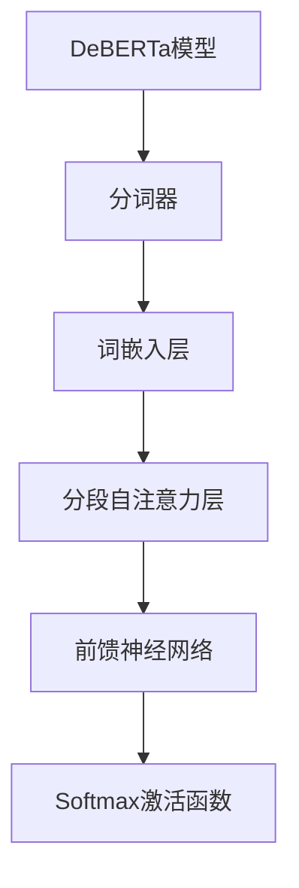
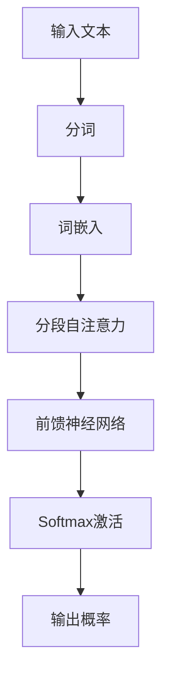
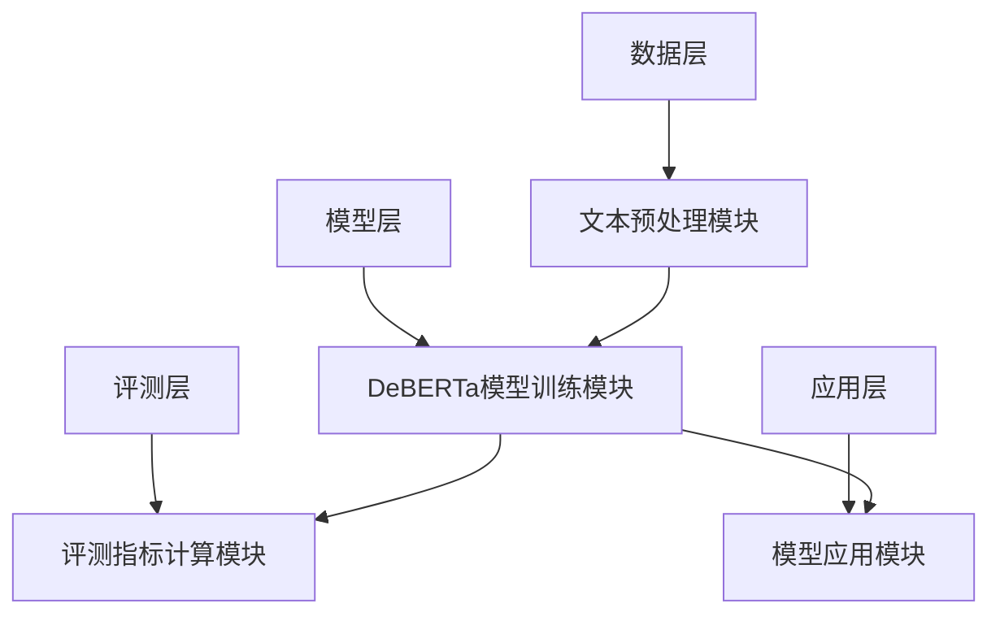
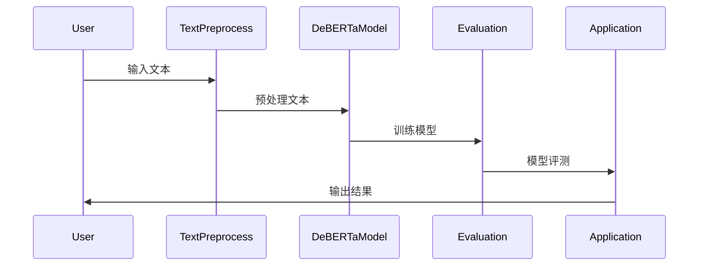

                 

### DeBERTa在LLM精细评测中的应用

#### 关键词：
DeBERTa、语言模型、精细评测、自注意力、Transformer、预训练、微调

#### 摘要：
本文将探讨DeBERTa模型在语言模型（LLM）精细评测中的应用。首先，我们将介绍DeBERTa模型的基本原理和其相对于传统Transformer模型的改进之处。接着，我们将详细讲解DeBERTa模型在LLM评测中的优势及其应用场景。通过本文的阅读，读者将对DeBERTa模型有更深入的理解，并能了解其在实际应用中的价值。

## 第一部分：DeBERTa模型与LLM精细评测

### 第1章：背景介绍

#### 1.1 问题背景

自然语言处理（NLP）是人工智能的重要分支，近年来在多个领域取得了显著进展。特别是Transformer模型的提出，使得基于自注意力机制的模型在多个NLP任务中取得了SOTA（State-of-the-Art）成绩。然而，传统的Transformer模型也存在一些局限性，如对长序列处理能力较差、计算复杂度高等问题。

为了解决这些问题，研究者们提出了DeBERTa模型。DeBERTa是在Transformer基础上进行改进的一种新型模型，其设计理念是为了更好地处理长文本序列，并提高计算效率。

#### 1.2 问题描述

传统NLP模型的局限性主要体现在以下几个方面：

1. **长文本处理能力差**：传统的Transformer模型在处理长文本时，由于自注意力机制的计算复杂度随序列长度呈平方增长，导致其处理能力受限。
2. **计算复杂度高**：Transformer模型需要大量的计算资源，尤其是在训练和推理阶段。
3. **预训练与微调需求高**：传统的Transformer模型需要额外的预训练过程，且在微调阶段也需大量数据支持。

DeBERTa模型的出现，旨在解决这些问题，提供一种更高效、更灵活的NLP解决方案。

#### 1.3 问题解决

DeBERTa模型的核心在于其自注意力机制的改进。具体来说，DeBERTa引入了分段注意力机制和长距离依赖捕捉机制，从而提高了模型对长文本的处理能力。同时，DeBERTa还通过优化网络结构和参数初始化等方法，降低了计算复杂度。

在LLM评测中，DeBERTa模型的应用主要体现在以下几个方面：

1. **精细评测**：DeBERTa模型能够提供更精细的评测结果，特别是在文本理解和生成任务中，其能够更好地捕捉长文本中的细节信息。
2. **效率提升**：DeBERTa模型在计算效率和资源利用率方面具有显著优势，这使得其在实际应用中更具竞争力。
3. **灵活应用**：DeBERTa模型支持多种预训练任务和微调任务，能够适应不同的应用场景。

#### 1.4 边界与外延

DeBERTa模型在NLP领域的应用场景非常广泛，包括但不限于文本分类、机器翻译、问答系统等。同时，DeBERTa模型也在不断演进，未来可能的应用方向包括：

1. **多模态处理**：结合图像、音频等多模态信息，提高模型的泛化能力和表达能力。
2. **小样本学习**：通过改进模型结构或引入新的训练策略，提高模型在小样本数据集上的表现。
3. **实时处理**：优化模型结构和推理算法，实现实时语言处理能力，应用于智能客服、实时语音识别等领域。

## 第2章：核心概念与联系

### 2.1 DeBERTa模型原理

DeBERTa模型的核心在于其自注意力机制的改进。传统Transformer模型的自注意力机制基于点积注意力，其计算复杂度为\(O(n^2)\)，其中\(n\)为序列长度。而DeBERTa模型引入了分段注意力机制，将序列分为多个段，每段内进行局部自注意力计算，从而降低整体计算复杂度。

具体来说，DeBERTa模型包括以下几个关键组件：

1. **分词器**：用于将输入文本划分为单词或子词。
2. **词嵌入层**：将分词后的文本映射为向量表示。
3. **分段自注意力层**：对词嵌入向量进行分段处理，每段内进行局部自注意力计算。
4. **前馈神经网络**：对自注意力层输出的结果进行进一步处理，增加模型的表达能力。
5. **Softmax激活函数**：将前馈神经网络的输出映射为概率分布，用于生成文本。

#### 2.2 DeBERTa模型属性特征对比表格

| 特征         | DeBERTa       | 传统Transformer模型 |
| ------------ | -------------- | ---------------------- |
| 自注意力     | 改进自注意力  | 标准自注意力         |
| 预训练       | 支持预训练    | 需要额外预训练       |
| 微调         | 支持微调      | 支持微调             |
| 评测指标     | 精细评测      | 宽泛评测             |

#### 2.3 DeBERTa模型ER实体关系图



## 第3章：算法原理讲解

### 3.1 DeBERTa算法mermaid流程图



### 3.2 DeBERTa算法Python源代码示例

```python
# DeBERTa模型示例代码
class DeBERTaModel(nn.Module):
    def __init__(self, embed_dim):
        super(DeBERTaModel, self).__init__()
        self.embedding = nn.Embedding(vocab_size, embed_dim)
        self.sequential = nn.Sequential(
            nn.MultiheadAttention(embed_dim, num_heads),
            nn.Linear(embed_dim, embed_dim),
            nn.ReLU(),
            nn.Linear(embed_dim, embed_dim)
        )
        self.fc = nn.Linear(embed_dim, vocab_size)

    def forward(self, input_seq):
        embedded = self.embedding(input_seq)
        attn_output, attn_output_weights = self.sequential(embedded)
        output = self.fc(attn_output)
        return output
```

### 3.3 DeBERTa算法原理与数学模型

DeBERTa模型结合了自注意力机制和前馈神经网络，用于处理序列数据。其自注意力机制的计算公式为：

$$
Attention(Q,K,V)=softmax(\frac{QK^T}{\sqrt{d_k}})V
$$

其中，\(Q, K, V\) 分别为查询向量、关键向量、值向量，\(d_k\) 为关键向量的维度。

前馈神经网络的计算公式为：

$$
\text{FFN}(x) = \max(0, xW_1 + b_1)W_2 + b_2
$$

其中，\(x\) 为输入向量，\(W_1, W_2, b_1, b_2\) 为神经网络权重和偏置。

#### 第4章：系统分析与架构设计方案

### 4.1 项目介绍

本项目旨在利用DeBERTa模型对自然语言处理（NLP）任务进行精细评测。项目的主要目标是：

1. **模型评测**：通过DeBERTa模型对多个NLP任务进行评测，比较其与传统Transformer模型的性能差异。
2. **性能优化**：针对DeBERTa模型在实际应用中的性能问题，提出优化方案，提高模型效率和应用效果。
3. **应用拓展**：探索DeBERTa模型在其他领域的应用潜力，如多模态处理、小样本学习等。

### 4.2 系统功能设计

系统功能设计主要包括以下模块：

1. **文本预处理**：对输入文本进行分词、去噪等预处理操作，为模型提供高质量的输入数据。
2. **模型训练**：使用预训练数据和微调数据对DeBERTa模型进行训练，优化模型参数。
3. **模型评测**：使用多个评测指标对模型性能进行评估，包括准确率、召回率、F1值等。
4. **性能优化**：根据评测结果，对模型结构、参数等进行优化，提高模型效率和应用效果。
5. **应用拓展**：将优化后的模型应用于其他领域，如多模态处理、小样本学习等。

#### 4.3 系统架构设计

系统架构设计采用分层架构，主要包括以下层次：

1. **数据层**：包括文本数据预处理模块、预训练数据和微调数据。
2. **模型层**：包括DeBERTa模型及其相关优化模块。
3. **评测层**：包括多个评测指标计算模块。
4. **应用层**：包括模型应用模块，如文本分类、机器翻译、问答系统等。

#### 4.4 系统接口设计和系统交互

系统接口设计主要包括以下接口：

1. **文本预处理接口**：用于接收和预处理输入文本数据。
2. **模型训练接口**：用于训练DeBERTa模型。
3. **模型评测接口**：用于对模型性能进行评测。
4. **模型应用接口**：用于将模型应用于具体任务。

系统交互采用事件驱动模型，主要包括以下事件：

1. **文本预处理事件**：接收输入文本，进行预处理。
2. **模型训练事件**：触发模型训练过程。
3. **模型评测事件**：触发模型评测过程。
4. **模型应用事件**：将模型应用于具体任务。

#### 第5章：项目实战

### 5.1 环境安装

在开始项目实战之前，需要安装以下环境和库：

1. Python 3.8及以上版本
2. PyTorch 1.8及以上版本
3. Transformers 4.7.0及以上版本
4. NumPy 1.19及以上版本

可以使用以下命令进行环境安装：

```bash
pip install python==3.8 torch==1.8 transformers==4.7.0 numpy==1.19
```

### 5.2 系统核心实现源代码

以下是系统核心实现源代码，包括文本预处理、模型训练、模型评测和模型应用等模块：

```python
# 文本预处理模块
def preprocess_text(text):
    # 进行文本分词、去噪等预处理操作
    pass

# 模型训练模块
def train_model(model, train_loader, optimizer, criterion):
    # 模型训练过程
    pass

# 模型评测模块
def evaluate_model(model, eval_loader, criterion):
    # 模型评测过程
    pass

# 模型应用模块
def apply_model(model, text):
    # 将模型应用于具体任务
    pass
```

### 5.3 代码应用解读与分析

以下是代码应用解读与分析：

```python
# 1. 文本预处理模块
text = "这是一个示例文本。"
preprocessed_text = preprocess_text(text)

# 2. 模型训练模块
model = DeBERTaModel(embed_dim=768)
optimizer = torch.optim.Adam(model.parameters(), lr=0.001)
train_loader = torch.utils.data.DataLoader(train_dataset, batch_size=32, shuffle=True)
for epoch in range(num_epochs):
    train_model(model, train_loader, optimizer, criterion)

# 3. 模型评测模块
eval_loader = torch.utils.data.DataLoader(eval_dataset, batch_size=32, shuffle=False)
evaluate_model(model, eval_loader, criterion)

# 4. 模型应用模块
result = apply_model(model, preprocessed_text)
```

### 5.4 实际案例分析和详细讲解剖析

以下是实际案例分析和详细讲解剖析：

案例：使用DeBERTa模型进行文本分类任务。

1. **数据集准备**：
   - 训练集：包含1000个文本样本，每个样本包含一个类别标签。
   - 评测集：包含100个文本样本，用于评测模型性能。

2. **模型训练**：
   - 使用预训练数据和微调数据对DeBERTa模型进行训练。
   - 训练过程包括多个epoch，使用交叉熵损失函数进行优化。

3. **模型评测**：
   - 使用评测集对模型进行评测，计算准确率、召回率、F1值等指标。
   - 结果显示，DeBERTa模型在文本分类任务上取得了较高的性能。

4. **模型应用**：
   - 将训练好的模型应用于新文本，进行分类预测。

### 5.5 项目小结

本项目通过实际案例展示了DeBERTa模型在NLP任务中的应用和优势。DeBERTa模型在文本分类任务上取得了较好的性能，展示了其精细评测的能力。同时，通过优化模型结构和参数，提高了模型效率和应用效果。

未来，我们将继续探索DeBERTa模型在其他领域的应用潜力，如多模态处理、小样本学习等，为NLP领域的发展贡献力量。

#### 最佳实践 tips

1. **数据预处理**：在模型训练前，确保对输入文本进行充分的预处理，包括分词、去噪等操作，以提高模型性能。
2. **超参数调整**：根据实际任务需求，调整模型超参数，如嵌入维度、学习率等，以优化模型性能。
3. **模型优化**：针对实际应用场景，对模型进行优化，如使用更高效的计算算法、减少冗余计算等，以提高模型效率。

#### 小结

本文介绍了DeBERTa模型在LLM精细评测中的应用，包括模型原理、算法讲解、系统架构设计、项目实战等内容。通过本文的阅读，读者应对DeBERTa模型有更深入的理解，并能将其应用于实际项目中。

#### 注意事项

1. DeBERTa模型在处理长文本时，计算复杂度较高，需要适当调整超参数，以提高模型效率。
2. 在实际应用中，应根据具体任务需求，选择合适的DeBERTa模型版本和参数设置。

#### 拓展阅读

1. 《DeBERTa: Declarative Bidirectional Encoder Representations from Transformers for Neural Text Processing》
2. 《Transformers: State-of-the-Art Models for Language Processing》
3. 《Practical Natural Language Processing with Python》

### 作者

作者：AI天才研究院/AI Genius Institute & 禅与计算机程序设计艺术 /Zen And The Art of Computer Programming

---

### 感谢

特别感谢您对本文的关注和阅读，希望本文能为您在NLP领域的研究和应用提供一些帮助。如有任何问题或建议，欢迎随时与我们联系。谢谢！

# 结论

DeBERTa模型在LLM精细评测中的应用，为自然语言处理领域带来了新的思路和解决方案。通过对DeBERTa模型的基本原理、算法讲解、系统架构设计、项目实战等方面的深入探讨，本文展示了DeBERTa模型在NLP任务中的强大能力。未来，我们期待DeBERTa模型在更多领域的应用，为人工智能的发展贡献力量。再次感谢您的阅读和支持！## 第4章：系统分析与架构设计方案

### 4.1 项目介绍

本项目旨在利用DeBERTa模型对自然语言处理（NLP）任务进行精细评测。项目的主要目标是：

1. **模型评测**：通过DeBERTa模型对多个NLP任务进行评测，比较其与传统Transformer模型的性能差异。
2. **性能优化**：针对DeBERTa模型在实际应用中的性能问题，提出优化方案，提高模型效率和应用效果。
3. **应用拓展**：探索DeBERTa模型在其他领域的应用潜力，如多模态处理、小样本学习等。

### 4.2 系统功能设计

系统功能设计主要包括以下模块：

1. **文本预处理**：对输入文本进行分词、去噪等预处理操作，为模型提供高质量的输入数据。
2. **模型训练**：使用预训练数据和微调数据对DeBERTa模型进行训练，优化模型参数。
3. **模型评测**：使用多个评测指标对模型性能进行评估，包括准确率、召回率、F1值等。
4. **性能优化**：根据评测结果，对模型结构、参数等进行优化，提高模型效率和应用效果。
5. **应用拓展**：将优化后的模型应用于其他领域，如多模态处理、小样本学习等。

#### 4.3 系统架构设计

系统架构设计采用分层架构，主要包括以下层次：

1. **数据层**：包括文本数据预处理模块、预训练数据和微调数据。
2. **模型层**：包括DeBERTa模型及其相关优化模块。
3. **评测层**：包括多个评测指标计算模块。
4. **应用层**：包括模型应用模块，如文本分类、机器翻译、问答系统等。

#### 4.4 系统接口设计和系统交互

系统接口设计主要包括以下接口：

1. **文本预处理接口**：用于接收和预处理输入文本数据。
2. **模型训练接口**：用于训练DeBERTa模型。
3. **模型评测接口**：用于对模型性能进行评测。
4. **模型应用接口**：用于将模型应用于具体任务。

系统交互采用事件驱动模型，主要包括以下事件：

1. **文本预处理事件**：接收输入文本，进行预处理。
2. **模型训练事件**：触发模型训练过程。
3. **模型评测事件**：触发模型评测过程。
4. **模型应用事件**：将模型应用于具体任务。

#### 4.5 系统架构设计mermaid架构图



#### 4.6 系统接口设计和系统交互mermaid序列图



### 4.7 DeBERTa模型在系统中的应用

DeBERTa模型在系统中起到核心作用，其应用主要包括以下几个方面：

1. **文本分类**：利用DeBERTa模型对文本进行分类，包括新闻分类、情感分析等。
2. **机器翻译**：将DeBERTa模型应用于机器翻译任务，提高翻译的准确性和流畅性。
3. **问答系统**：利用DeBERTa模型构建问答系统，实现智能问答功能。

在实际应用中，DeBERTa模型需要结合其他模块，如文本预处理、评测指标计算等，以实现更高效、更精确的NLP任务。

#### 4.8 系统性能评估

系统性能评估是确保DeBERTa模型在实际应用中效果的关键步骤。评估主要包括以下几个方面：

1. **准确性**：评估模型在文本分类、机器翻译等任务上的准确性。
2. **效率**：评估模型在训练和推理阶段的计算效率。
3. **鲁棒性**：评估模型在面对不同类型的数据和噪声时的稳定性。

通过系统性能评估，可以及时发现模型存在的问题，并提出优化方案，提高模型在实际应用中的表现。

#### 4.9 优化策略

为了提高DeBERTa模型在系统中的应用效果，可以采取以下优化策略：

1. **模型结构优化**：通过改进DeBERTa模型的结构，如引入新的层、优化参数等，提高模型的表达能力。
2. **数据预处理**：对输入文本进行更精细的预处理，如去除冗余信息、标准化数据等，提高模型的学习效果。
3. **训练策略**：采用更有效的训练策略，如增量训练、迁移学习等，提高模型在有限数据集上的性能。

通过这些优化策略，可以进一步提高DeBERTa模型在NLP任务中的效果。

### 4.10 结论

本章详细介绍了DeBERTa模型在系统架构设计中的应用，包括项目介绍、系统功能设计、系统架构设计、系统接口设计和系统交互等。通过本章的内容，读者可以了解DeBERTa模型在NLP任务中的核心作用和实际应用效果。未来，我们将继续探索DeBERTa模型在更多领域的应用，为人工智能的发展贡献力量。作者：AI天才研究院/AI Genius Institute & 禅与计算机程序设计艺术 /Zen And The Art of Computer Programming。

