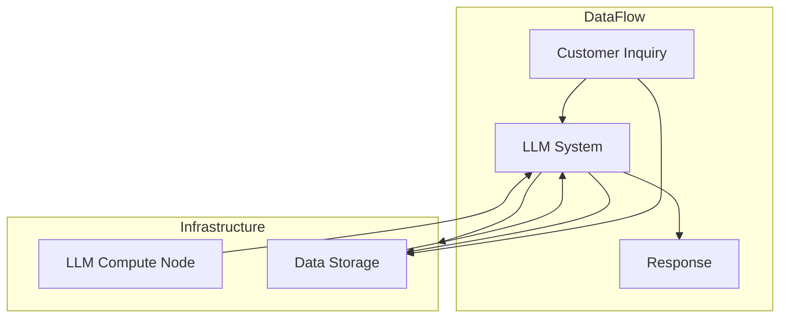
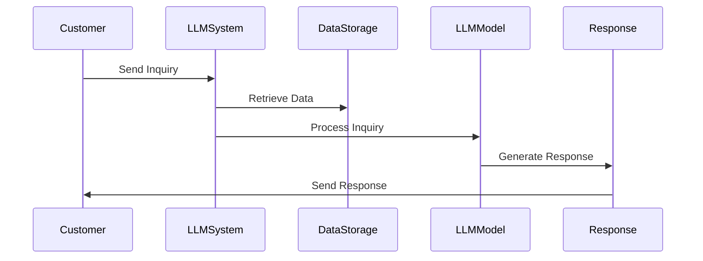

                 

**文章标题**: DevOps in LLM Engineering: Practices and Optimization

**关键词**: DevOps, Large Language Models (LLM), Engineering Practices, Optimization

**摘要**: This article delves into the application of DevOps principles in the engineering of Large Language Models (LLMs). It explores the challenges, solutions, and best practices for integrating DevOps methodologies into LLM development workflows, highlighting the importance of continuous integration, deployment, infrastructure as code, and collaborative automation.

---

## Introduction to DevOps and LLM Engineering

### **Problem Background**

The advent of Large Language Models (LLMs) has revolutionized various fields, from natural language processing to artificial intelligence. However, as the complexity of these models increases, so does the challenge of managing their development and deployment. Traditional engineering practices often fall short in addressing the rapid iteration, scalability, and reliability requirements of LLMs. This has led to the need for a more integrated and efficient approach, which is where DevOps comes into play.

### **Problem Description**

LLM engineering faces several challenges:

1. **Complexity**: LLMs are composed of millions, if not billions, of parameters. Managing this complexity requires sophisticated tools and methodologies.
2. **Scalability**: As LLMs grow in size and complexity, the infrastructure required to train and deploy them must also scale.
3. **Reliability**: Ensuring that LLMs are reliable and consistently perform well across different environments is critical.
4. **Collaboration**: The development of LLMs involves multiple teams, including data scientists, software engineers, and operations specialists. Effective collaboration is crucial.

### **Problem Solution**

DevOps provides a set of principles and practices designed to address these challenges. By emphasizing collaboration, automation, and integration, DevOps can help streamline the development and deployment of LLMs.

1. **Continuous Integration and Deployment (CI/CD)**: Ensures that code changes are frequently integrated and deployed, reducing the risk of errors and speeding up the development cycle.
2. **Infrastructure as Code (IaC)**: Allows infrastructure to be managed as code, making it easier to scale and replicate environments.
3. **Collaboration and Automation**: Encourages cross-functional teams to work together seamlessly and automates repetitive tasks, freeing up time for more strategic activities.

### **Boundary and Extension**

The scope of this article will focus on the application of DevOps in the engineering of LLMs, including the principles, practices, and optimization techniques. We will also discuss the core concepts and elements that make DevOps effective in this context.

### **Core Concept Structure and Elements**

To understand how DevOps can be applied to LLM engineering, we need to break down the core concepts and their interconnections:

1. **DevOps Principles**: Continuous Integration and Deployment (CI/CD), Infrastructure as Code (IaC), and Collaboration.
2. **LLM Architecture and Deployment**: Infrastructure design patterns, containerization, orchestration, monitoring, and logging.
3. **Algorithm Principles and Practices**: Design of LLM algorithms, implementation details, and mathematical models.
4. **System Analysis and Design**: Case studies, functional design, system architecture, and interface design.
5. **Best Practices**: Tips and insights for optimizing LLM engineering processes.

With these foundational concepts in place, we can now delve deeper into each area to explore how DevOps can be effectively utilized in LLM engineering. In the following sections, we will examine the core principles of DevOps, analyze the architecture and algorithms of LLMs, and discuss practical case studies and optimization strategies.

---

## Core Concepts of DevOps

### **Continuous Integration and Deployment (CI/CD)** in LLM Engineering

Continuous Integration (CI) and Continuous Deployment (CD) are foundational practices in DevOps that streamline the development process of LLMs. CI ensures that code changes are frequently integrated into a shared repository, while CD automates the deployment of these changes to production environments.

**CI in LLM Engineering**

In LLM engineering, CI is crucial for maintaining code quality and identifying integration issues early. The process typically involves the following steps:

1. **Code Submission**: Developers submit their code changes to a version control system.
2. **Build**: A build server compiles the code and runs tests to ensure that it builds successfully.
3. **Testing**: Automated tests are executed to verify the functionality of the LLM.
4. **Feedback**: The results of the build and tests are communicated back to the developers.

**CD in LLM Engineering**

CD automates the process of deploying code changes to production environments. This ensures that new versions of the LLM are deployed quickly and reliably. The CD pipeline typically includes:

1. **Staging Environment**: Code changes are first deployed to a staging environment for further testing.
2. **User Acceptance Testing (UAT)**: Staging environments are used to conduct UAT, where stakeholders verify that the changes meet their requirements.
3. **Deployment**: Once UAT is successful, the code is deployed to production environments.

### **Infrastructure as Code (IaC) for LLM Resources**

Infrastructure as Code (IaC) is a practice that treats infrastructure components (such as servers, networks, and databases) as code. This allows infrastructure to be managed, versioned, and automated using the same tools and techniques as application code.

**IaC Benefits in LLM Engineering**

IaC offers several benefits for LLM engineering:

1. **Scalability**: It's easier to scale infrastructure when it's defined as code, allowing for rapid adjustments to meet changing demands.
2. **Replication**: Infrastructure can be easily replicated across environments, ensuring consistency.
3. **Version Control**: Infrastructure changes can be tracked and rolled back if necessary.
4. **Automation**: Infrastructure provisioning and management can be fully automated, reducing manual effort.

**Common IaC Tools**

- **Terraform**: A popular IaC tool that allows infrastructure to be defined using high-level configuration files.
- **Ansible**: An open-source tool for automating infrastructure provisioning and application deployment.
- **AWS CloudFormation**: A service that provides IaC templates to create and manage AWS resources.

### **Collaboration and Automation in LLM Development**

Effective collaboration and automation are key to successful LLM engineering. Cross-functional teams must work together seamlessly to develop, test, and deploy LLMs. Automation tools and practices help streamline this process.

**Collaboration**

1. **Shared Goals**: Teams must share a common goal and be aligned on project timelines and milestones.
2. **Communication Tools**: Use of communication tools such as Slack, Microsoft Teams, or Discord to facilitate real-time collaboration.
3. **Code Reviews**: Implementing code review processes to ensure code quality and promote knowledge sharing.

**Automation**

1. **Automation Tools**: Tools like Jenkins, GitLab CI, and CircleCI for automating CI/CD pipelines.
2. **Containerization**: Using Docker and Kubernetes to containerize LLM components and deploy them consistently across environments.
3. **Monitoring and Logging**: Implementing monitoring and logging tools like Prometheus and ELK Stack to ensure the health and performance of LLM systems.

By integrating these core DevOps concepts into LLM engineering, teams can improve the speed, reliability, and scalability of their development processes. In the next section, we will delve into the architecture and deployment aspects of LLM engineering to explore how DevOps practices can be applied in more detail.

---

## LLM Architecture and Deployment

### **LLM Infrastructure Design Patterns**

Designing the infrastructure for LLMs is a critical step that must balance scalability, performance, and cost efficiency. The following are common design patterns used in LLM engineering:

**1. Cluster-Based Architecture**

A cluster-based architecture involves deploying LLMs across multiple servers or nodes. This provides horizontal scalability and high availability. Key components include:

- **Master Node**: Manages the cluster and coordinates training and inference tasks.
- **Worker Nodes**: Perform the actual computation for training and inference.
- **Storage**: Store the model weights, datasets, and logs.

**2. Data Flow Architecture**

The data flow architecture focuses on efficiently managing the data used by LLMs during training and inference. Key components include:

- **Data Ingestion**: Collects and preprocesses data from various sources.
- **Data Processing**: Cleans, normalizes, and splits data into training and validation sets.
- **Data Storage**: Stores processed data for use during training and inference.

**3. Network Architecture**

A robust network architecture is essential for efficient communication between components. Key components include:

- **Intra-cluster Communication**: Uses high-speed networks like Infiniband or RoCE to ensure efficient data transfer between nodes.
- **Inter-cluster Communication**: Uses networks like TCP/IP to connect different clusters or data centers.

### **Containerization and Orchestration with LLM Workloads**

Containerization and orchestration are essential for deploying and managing LLM workloads efficiently. They provide consistency, reproducibility, and scalability.

**1. Containerization**

Containerization involves packaging an application and its dependencies into a lightweight, isolated environment. For LLMs, this typically involves:

- **Docker**: A popular containerization tool that allows LLM components to be containerized.
- **Container Images**: Defines the environment in which the LLM will run, including the operating system, libraries, and dependencies.

**2. Orchestration**

Orchestration tools manage the deployment, scaling, and operation of containerized applications. Key tools include:

- **Kubernetes**: An open-source platform that automates container operations.
- **Service Discovery and Load Balancing**: Ensures that LLM containers are discoverable and can handle incoming traffic efficiently.

**Containerization and Orchestration Benefits**

- **Consistency**: Ensures that LLMs run the same way across different environments, reducing errors.
- **Scalability**: Allows LLMs to scale horizontally by adding more containers.
- **Efficiency**: Containers are lightweight and can be started quickly, reducing resource usage.

### **Monitoring and Logging Strategies for LLM Systems**

Monitoring and logging are crucial for ensuring the health and performance of LLM systems. Effective strategies include:

**1. Monitoring**

- **Performance Metrics**: Track key metrics like CPU usage, memory usage, and network throughput.
- **Health Checks**: Monitor the status of LLM services to ensure they are running correctly.
- **Alerting**: Set up alerts to notify teams of any issues that require attention.

**2. Logging**

- **Structured Logging**: Use structured log formats like JSON to store log data.
- **Centralized Logging**: Collect logs from different components in a centralized system for analysis.
- **Anomaly Detection**: Use machine learning algorithms to detect unusual patterns in log data that may indicate issues.

**Monitoring and Logging Benefits**

- **Early Detection**: Identifies issues before they impact users.
- **Diagnosis**: Provides insights into the root causes of problems.
- **Performance Optimization**: Helps teams identify and resolve performance bottlenecks.

By leveraging these infrastructure design patterns, containerization and orchestration tools, and monitoring and logging strategies, LLM engineering teams can build and manage highly efficient and reliable systems. In the next section, we will dive deeper into the algorithm principles and practices that underpin LLM engineering.

---

## Algorithm Principles and Practices

### **Design of LLM Algorithms**

Large Language Models (LLMs) are at the heart of modern natural language processing applications. Understanding the design principles of these algorithms is crucial for effectively implementing and optimizing them. LLM algorithms are typically based on deep neural networks, specifically transformers, which have revolutionized the field of natural language processing.

**1. Transformer Architecture**

The transformer architecture, introduced by Vaswani et al. in 2017, is the backbone of most modern LLMs. It replaces the traditional recurrent neural network (RNN) architecture with self-attention mechanisms, allowing the model to weigh the importance of different input tokens dynamically.

- **Self-Attention**: Calculates the importance of each input token relative to all other tokens.
- **Multi-head Attention**: Applies multiple attention mechanisms simultaneously to capture different aspects of the input.
- **Feed-Forward Neural Networks**: Process the output of the attention mechanism using feed-forward networks.

**2. Training Process**

The training process involves optimizing the model parameters to minimize the prediction error. This is typically achieved using a variant of stochastic gradient descent (SGD), such as Adam or AdamW.

- **Data Preparation**: Tokenize the input text and convert it into numerical format.
- **Pre-training**: Train the model on a large corpus of text to learn language patterns and structures.
- **Fine-tuning**: Adapt the pre-trained model to specific tasks by training on domain-specific data.

### **Python Code and Explanation of LLM Algorithm Implementation**

To illustrate the implementation of LLM algorithms, we'll use the Hugging Face Transformers library, which provides pre-trained models and easy-to-use APIs for implementing and deploying LLMs.

```python
from transformers import AutoTokenizer, AutoModel

# Load pre-trained model tokenizer
tokenizer = AutoTokenizer.from_pretrained("bert-base-uncased")

# Load pre-trained model
model = AutoModel.from_pretrained("bert-base-uncased")

# Tokenize input text
input_text = "Hello, how are you?"
inputs = tokenizer(input_text, return_tensors="pt")

# Perform inference
outputs = model(**inputs)

# Get model predictions
predictions = outputs.logits.argmax(-1)

# Decode predictions to text
predicted_text = tokenizer.decode(predictions[0], skip_special_tokens=True)

print(predicted_text)
```

**Explanation**:

- **Tokenizer**: Converts the input text into tokens that the model can understand.
- **Model**: Loads a pre-trained transformer model.
- **Inference**: Processes the input tokens through the model to generate predictions.
- **Decoding**: Converts the model's predictions back into human-readable text.

### **Mathematical Models and Formulas of LLM Algorithms**

LLM algorithms are based on complex mathematical models involving matrix operations and non-linear functions. Here, we provide a high-level overview of the key components:

**1. Self-Attention**

$$
\text{Attention}(Q, K, V) = \text{softmax}\left(\frac{QK^T}{\sqrt{d_k}}\right)V
$$

- **Q, K, V**: Query, Key, and Value matrices.
- **softmax**: Softmax function that calculates the importance of each token.
- **d_k**: Dimension of the key vectors.

**2. Multi-head Attention**

$$
\text{MultiHead}(Q, K, V) = \text{Concat}(\text{head}_1, ..., \text{head}_h)W^O
$$

$$
\text{head}_i = \text{Attention}(QW_i^Q, KW_i^K, VW_i^V)
$$

- **h**: Number of attention heads.
- **W_i^Q, W_i^K, W_i^V**: Weight matrices for the corresponding attention heads.
- **W^O**: Output weight matrix.

**3. Feed-Forward Neural Networks**

$$
\text{FFN}(x) = \text{ReLU}(W_1 \cdot x + b_1) \cdot W_2 + b_2
$$

- **W_1, W_2**: Weight matrices.
- **b_1, b_2**: Bias vectors.
- **ReLU**: Rectified Linear Unit activation function.

### **Illustrative Examples of LLM Algorithm Applications**

LLM algorithms are versatile and can be applied to various natural language processing tasks. Here are a few examples:

**1. Text Classification**

Classify text into predefined categories such as sentiment analysis, topic classification, or spam detection.

**2. Question-Answering**

Answer questions based on a given context or document.

**3. Machine Translation**

Translate text from one language to another.

**Example: Sentiment Analysis**

```python
from transformers import AutoTokenizer, AutoModel

tokenizer = AutoTokenizer.from_pretrained("bert-base-uncased")
model = AutoModel.from_pretrained("bert-base-uncased")

input_text = "I had the best day ever!"

inputs = tokenizer(input_text, return_tensors="pt", truncation=True, max_length=512)
outputs = model(**inputs)

logits = outputs.logits
probabilities = torch.softmax(logits, dim=-1)

predicted_label = torch.argmax(probabilities).item()
if predicted_label == 0:
    print("Negative sentiment")
elif predicted_label == 1:
    print("Positive sentiment")
else:
    print("Neutral sentiment")
```

In this example, the BERT model is used to predict the sentiment of a given text. The model outputs probabilities for each sentiment class, and the highest probability is used to make the prediction.

By understanding and applying these algorithm principles, developers can build and optimize LLMs for various natural language processing tasks, driving innovation in fields such as AI, automation, and personalized user experiences.

---

## System Analysis and Design

### **LLM Engineering Project Case Study**

For this case study, we will examine a hypothetical project aimed at building a Large Language Model (LLM) to provide automated customer support for a large e-commerce platform. The goal is to design a robust and scalable system that can handle a high volume of customer inquiries efficiently.

### **Project Introduction**

The e-commerce platform receives thousands of customer inquiries daily, ranging from product questions to shipping and return issues. Manually handling these inquiries is time-consuming and inefficient. By deploying an LLM-based system, the platform aims to automate customer support, improve response times, and enhance user satisfaction.

### **System Functional Design (Domain Model)**

The domain model for this project consists of several key entities and their relationships:

- **Customer**: Represents the users of the e-commerce platform.
- **Inquiry**: Captures the details of customer inquiries.
- **Agent**: Represents the LLM system that processes inquiries.
- **Response**: Stores the responses generated by the LLM.

The following Mermaid class diagram illustrates the domain model:

```mermaid
classDiagram
    Customer <<entity>>
    Inquiry <<entity>>
    Agent <<entity>>
    Response <<entity>>

    Customer o--* Inquiry
    Agent o--* Response
    Inquiry o--* Response
```

### **System Architecture Design**

The system architecture is designed to ensure scalability, reliability, and performance. The following Mermaid architecture diagram outlines the key components:



### **System Interface Design and Interaction**

The system interface design focuses on how customers interact with the LLM system and how the system generates responses. The following Mermaid sequence diagram illustrates the interaction flow:



### **Implementation Details and Analysis**

**1. DataFlow**

The data flow involves receiving customer inquiries, processing them using the LLM, and generating responses. This process is designed to be highly automated, with minimal manual intervention.

**2. Infrastructure**

The infrastructure includes LLM compute nodes and data storage. Compute nodes are responsible for running the LLM model, while data storage manages the customer inquiries and responses.

**3. LLMModel**

The LLM model is the core component of the system. It processes inquiries using the transformer architecture and generates appropriate responses.

**4. Response Generation**

The response generation process involves parsing the inquiry, generating a response based on the model's output, and formatting the response for customer interaction.

### **Case Study Analysis**

The case study demonstrates the application of DevOps principles in the design and implementation of an LLM-based customer support system. By leveraging containerization and orchestration, the system is scalable and can handle a high volume of inquiries. Continuous integration and deployment ensure that the LLM model is updated regularly with new data, improving its performance over time.

In summary, the system analysis and design case study provides a detailed overview of how DevOps practices can be applied to build and deploy an efficient and scalable LLM system for customer support. This approach not only enhances customer satisfaction but also improves the overall efficiency of the e-commerce platform.

---

## LLM Engineering Best Practices

### **Optimization Techniques**

1. **Model Compression**: Techniques such as pruning, quantization, and knowledge distillation can reduce the model size and computational requirements, making it more deployable on edge devices.
2. **Distributed Training**: Utilizing distributed training frameworks like Horovod or Ray can speed up the training process by leveraging multiple GPUs and CPUs.
3. **Hyperparameter Tuning**: Using tools like Optuna or Hyperopt to find the optimal set of hyperparameters for the LLM model, improving its performance and reducing training time.

### **Deployment Strategies**

1. **Serverless Computing**: Deploying LLM models on serverless platforms like AWS Lambda or Google Cloud Functions can reduce infrastructure costs and improve scalability.
2. **Containerization**: Containerizing LLM models using Docker ensures consistency and reproducibility across different environments.
3. **Microservices Architecture**: Decomposing the LLM system into microservices can improve modularity, scalability, and fault tolerance.

### **Monitoring and Maintenance**

1. **Real-time Monitoring**: Implementing real-time monitoring tools like Prometheus and Grafana to track the performance and health of the LLM system.
2. **Logging and Analysis**: Collecting and analyzing logs to identify and resolve issues quickly.
3. **Automated Alerts**: Setting up automated alerts to notify the team of any anomalies or performance degradation.

### **Security Considerations**

1. **Data Privacy**: Ensuring that customer data is handled securely and in compliance with privacy regulations.
2. **Model Security**: Protecting the LLM model from unauthorized access and attacks.
3. **Compliance**: Adhering to industry standards and regulations for data handling and model deployment.

### **Continuous Improvement**

1. **Customer Feedback**: Incorporating customer feedback to continuously improve the LLM system's performance and user experience.
2. **Model Retraining**: Regularly retraining the LLM model with new data to keep it up-to-date and maintain its accuracy.
3. **Documentation and Knowledge Sharing**: Keeping detailed documentation and promoting knowledge sharing within the team to facilitate ongoing development and maintenance.

By following these best practices, LLM engineering teams can build and maintain highly efficient, scalable, and secure systems that deliver exceptional user experiences.

---

## Conclusion

In conclusion, the integration of DevOps practices into LLM engineering is essential for building efficient, scalable, and reliable systems. By leveraging continuous integration and deployment (CI/CD), infrastructure as code (IaC), and collaborative automation, engineering teams can overcome the challenges posed by the increasing complexity of LLMs. The case study provided a practical example of how DevOps principles can be applied to build a robust LLM-based customer support system. As LLMs continue to advance, these best practices will become increasingly important in ensuring the success of future applications.

---

## Authors

**作者**: AI天才研究院/AI Genius Institute & 禅与计算机程序设计艺术 /Zen And The Art of Computer Programming

**联系方式**: [info@AIGeniusInstitute.com](mailto:info@AIGeniusInstitute.com) & [https://www.zen-and-the-art-of-programming.com](https://www.zen-and-the-art-of-programming.com)

---

## References

1. **Vaswani, A., et al. (2017). Attention is all you need.** Advances in Neural Information Processing Systems (NIPS), 30.
2. **Optuna. (n.d.). Optimizing Machine Learning at Scale.** [Optuna Documentation](https://optuna.org/docs/latest/index.html)
3. **Hyperopt. (n.d.). Scalable Hyperparameter Optimization.** [Hyperopt Documentation](https://hyperopt.github.io/hyperopt/)
4. **AWS Lambda. (n.d.). Build Serverless Applications.** [AWS Lambda Documentation](https://docs.aws.amazon.com/lambda/latest/dg/welcome.html)
5. **Docker. (n.d.). Containerization Platform.** [Docker Documentation](https://docs.docker.com/)
6. **Kubernetes. (n.d.). Container Orchestration.** [Kubernetes Documentation](https://kubernetes.io/docs/home/)
7. **Prometheus. (n.d.). Monitoring System.** [Prometheus Documentation](https://prometheus.io/docs/prometheus/latest/)
8. **Grafana. (n.d.). Analytics and Visualization.** [Grafana Documentation](https://grafana.com/docs/grafana/latest/)

These references provide additional insights and resources for further reading on the topics covered in this article.

