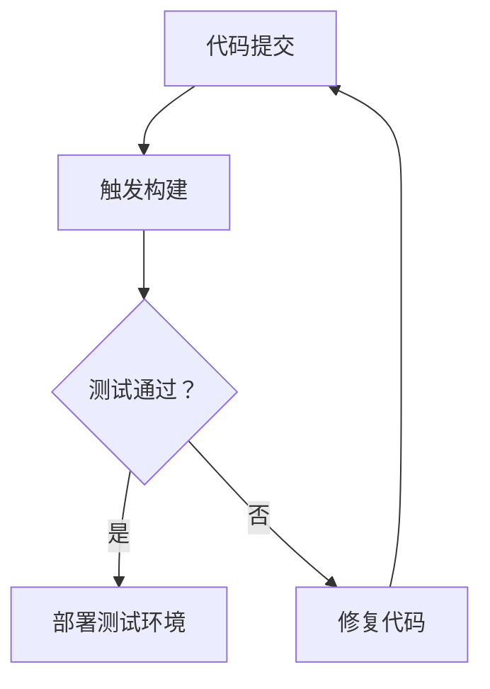
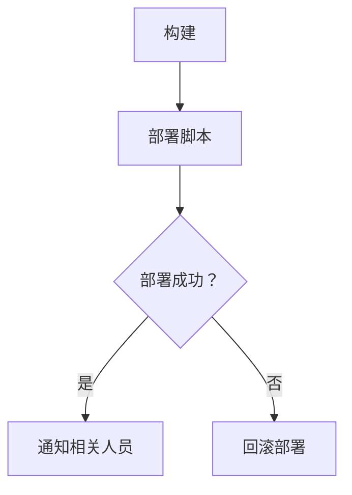
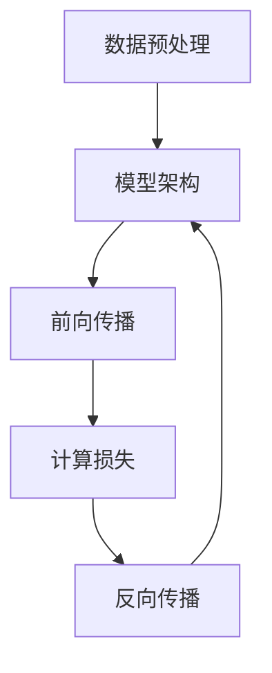
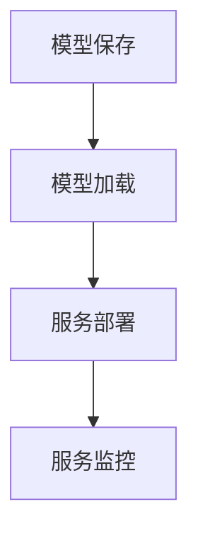
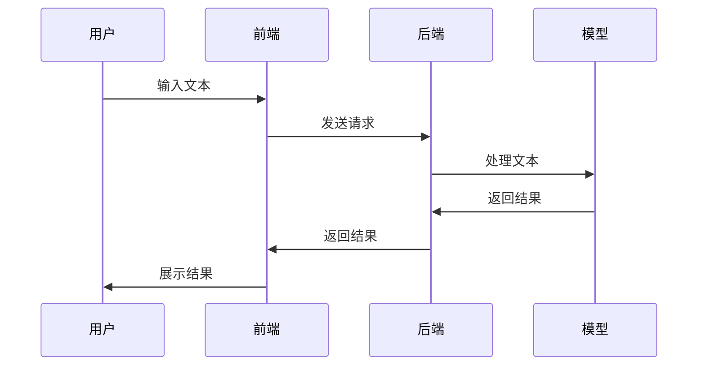
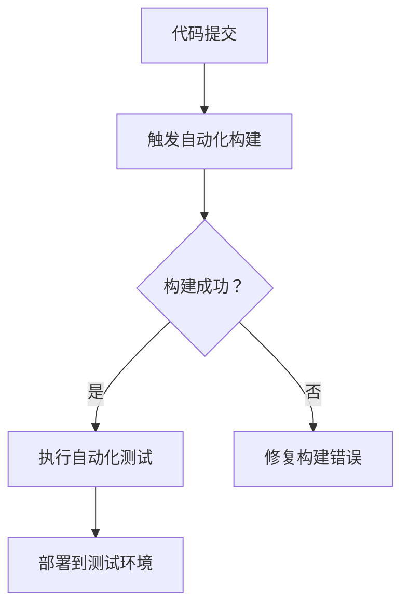
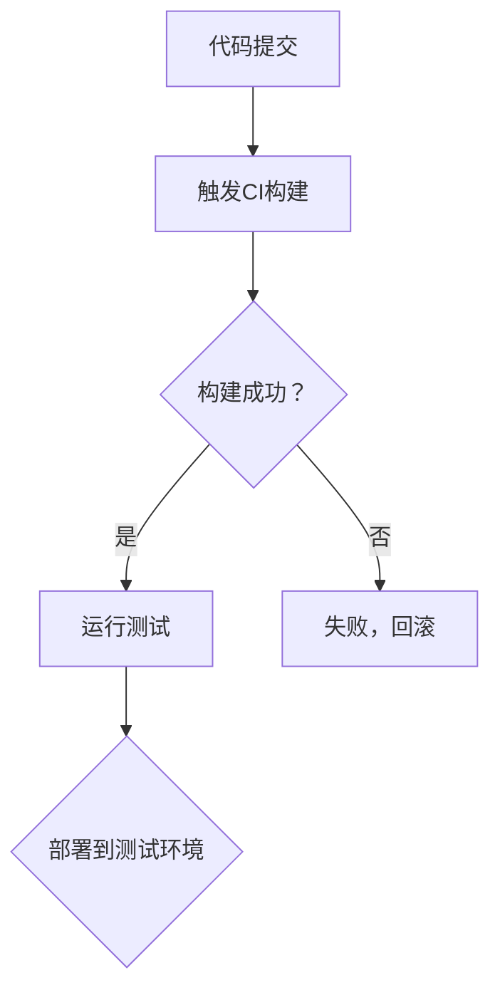
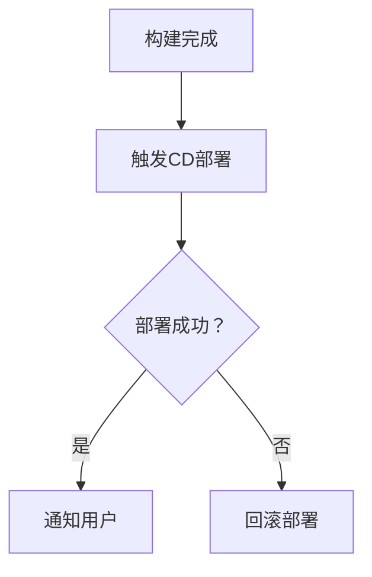
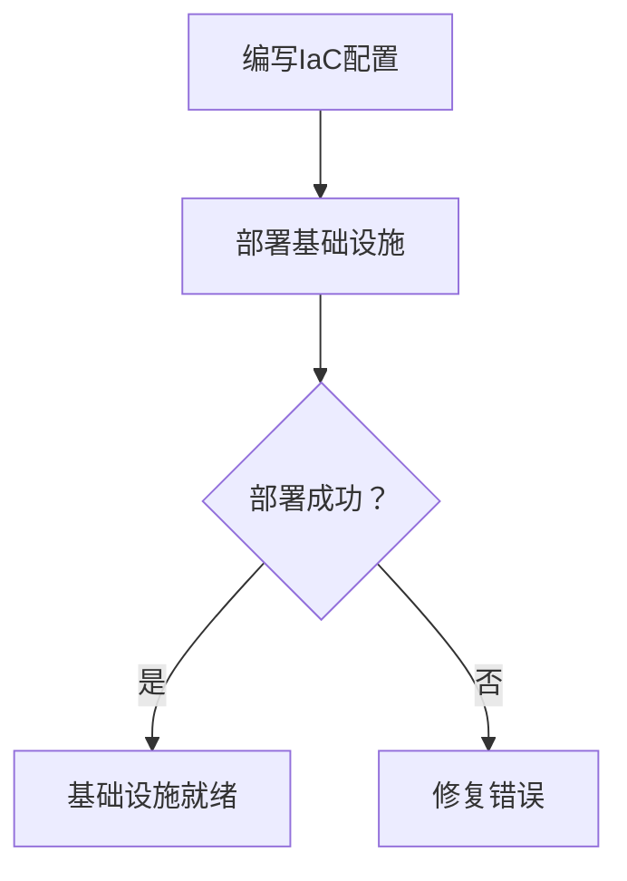
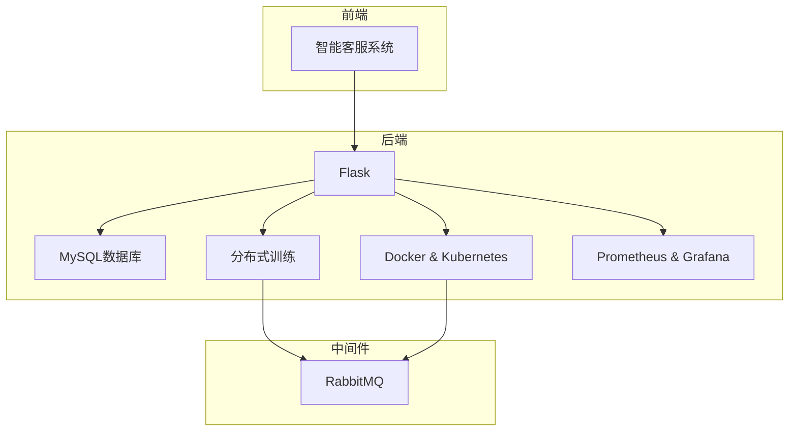

                 

# DevOps在LLM应用开发中的实践与挑战

> 关键词：DevOps，LLM应用开发，自动化，持续集成，持续部署，基础设施即代码，模型训练，模型部署，模型监控，模型优化

> 摘要：本文将探讨DevOps在LLM应用开发中的实践与挑战。首先，我们将介绍DevOps的核心概念、方法和技术，分析其在LLM开发中的适用性和局限性。接着，我们将详细讲解DevOps和LLM应用开发的核心概念，通过对比和实体关系图，帮助读者更好地理解两者之间的联系。然后，我们将深入探讨DevOps的算法原理，使用Mermaid流程图和Python代码，让读者直观地了解其工作流程。最后，我们将结合实际项目案例，阐述DevOps在LLM应用开发中的具体实践，以及可能遇到的挑战和解决方法。

## 第一部分：背景介绍

### 1.1 问题背景

随着人工智能和云计算技术的快速发展，大型语言模型（LLM）如BERT、GPT-3等在自然语言处理领域取得了显著的成就。这些模型具有强大的文本生成、翻译、问答等能力，被广泛应用于智能客服、自动写作、智能推荐等领域。然而，LLM的复杂性和资源需求使得其在实际应用开发中面临诸多挑战，如部署、监控、运维等方面。

### 1.2 问题描述

DevOps作为一种软件开发和运维的实践方法，旨在通过自动化和协作来提高软件交付速度和质量。在LLM应用开发中，DevOps能够帮助解决哪些具体问题？其应用实践和挑战是什么？

### 1.3 问题解决

本部分将介绍DevOps在LLM应用开发中的核心概念、方法和技术，分析其在LLM开发中的适用性和局限性。同时，我们将探讨DevOps在不同应用场景下的差异和共性。

### 1.4 边界与外延

本部分的讨论将主要围绕LLM应用开发展开，涉及DevOps的核心概念和实践方法。同时，我们将探讨DevOps在不同应用场景下的差异和共性。

### 1.5 概念结构与核心要素组成

1. **DevOps概念结构**：DevOps的核心概念包括自动化、持续集成、持续部署、基础设施即代码等。
2. **LLM应用开发要素**：LLM应用开发的核心要素包括模型训练、模型部署、模型监控、模型优化等。

## 第二部分：核心概念与联系

### 2.1 DevOps核心概念

**2.1.1 自动化**

自动化是DevOps的核心概念之一，通过自动化工具实现软件的构建、测试、部署等过程，提高开发效率。自动化工具包括但不限于Jenkins、GitLab CI/CD、Ansible等。

**2.1.2 持续集成（CI）**

持续集成（CI）是一种软件开发实践，通过自动化测试和构建，将代码集成到主分支，确保代码质量。CI工具如Jenkins、GitLab CI等能够自动化执行测试和构建任务，快速发现和修复代码问题。

**2.1.3 持续部署（CD）**

持续部署（CD）是一种自动化部署方法，通过自动化部署，快速将新版本应用到生产环境。CD工具如Jenkins、Docker、Kubernetes等能够实现应用的自动化部署、回滚和监控。

**2.1.4 基础设施即代码（IaC）**

基础设施即代码（IaC）是一种将基础设施配置和管理代码化的方法，实现基础设施的自动化部署和管理。IaC工具如Terraform、Ansible、AWS CloudFormation等能够将基础设施配置代码化，便于版本控制和自动化部署。

### 2.2 LLM应用开发核心概念

**2.2.1 模型训练**

模型训练是LLM应用开发的核心环节，通过大规模数据训练LLM，提高模型性能。训练过程中，需要使用数据预处理、模型架构选择、优化策略等关键技术。

**2.2.2 模型部署**

模型部署是将训练好的LLM模型部署到生产环境，供用户使用。部署过程中，需要考虑模型大小、计算资源、性能优化等问题。

**2.2.3 模型监控**

模型监控是确保LLM模型稳定可靠的重要环节，通过实时监控模型的运行状态，及时发现和解决潜在问题。

**2.2.4 模型优化**

模型优化是通过调整模型结构、参数等，提高模型性能。优化方法包括超参数调优、模型压缩、迁移学习等。

### 2.3 概念属性特征对比表格

| 特征对比项 | DevOps | LLM应用开发 |
| :--: | :--: | :--: |
| 核心目标 | 提高软件开发和运维效率 | 提高LLM模型的性能和可靠性 |
| 核心技术 | 自动化、持续集成、持续部署、基础设施即代码 | 模型训练、模型部署、模型监控、模型优化 |
| 适用场景 | 通用软件开发和运维 | LLM应用开发 |

### 2.4 ER实体关系图架构

```mermaid
erDiagram
  Model : 模型 |+---|> TrainData : 训练数据
  Model : 模型 |+---|> TrainConfig : 训练配置
  Model : 模型 |+---|> DeployConfig : 部署配置
  Model : 模型 |+---|> MonitorConfig : 监控配置
```

## 第三部分：算法原理讲解

### 3.1 DevOps算法原理

#### 3.1.1 持续集成（CI）算法原理

持续集成（CI）算法的核心在于自动化测试和构建。具体流程如下：

1. **代码提交**：开发者将代码提交到版本控制仓库。
2. **自动化测试**：CI工具自动运行测试脚本，检查代码是否符合预期。
3. **构建**：如果测试通过，CI工具自动构建最新版本的应用。
4. **部署**：将构建好的应用部署到测试环境。

以下是一个使用Jenkins实现的CI流程的Mermaid流程图：



#### 3.1.2 持续部署（CD）算法原理

持续部署（CD）算法的核心在于自动化部署。具体流程如下：

1. **构建**：构建完成的应用部署到生产环境。
2. **部署脚本**：执行预定义的部署脚本，实现应用的自动化部署。
3. **监控**：检查部署过程中的错误和异常。
4. **通知**：如果部署成功，通知相关人员。

以下是一个使用Docker和Kubernetes实现的CD流程的Mermaid流程图：



### 3.2 LLM应用开发算法原理

#### 3.2.1 模型训练算法原理

模型训练算法的核心在于优化模型参数。具体流程如下：

1. **数据预处理**：对训练数据进行预处理，如分词、编码等。
2. **模型架构**：选择合适的模型架构，如Transformer、BERT等。
3. **前向传播**：输入数据经过模型计算，得到预测结果。
4. **损失函数**：计算预测结果与真实结果的差距，得到损失值。
5. **反向传播**：根据损失值，反向传播更新模型参数。

以下是一个使用PyTorch实现的模型训练算法的Mermaid流程图：



#### 3.2.2 模型部署算法原理

模型部署算法的核心在于将训练好的模型部署到生产环境。具体流程如下：

1. **模型保存**：将训练好的模型参数保存到文件。
2. **模型加载**：从文件中加载模型参数。
3. **服务部署**：将模型部署到服务器，供用户调用。
4. **服务监控**：监控模型服务的运行状态，确保模型稳定可靠。

以下是一个使用Flask实现的模型部署算法的Mermaid流程图：



## 第四部分：系统分析与架构设计方案

### 4.1 问题场景介绍

假设我们开发一个基于GPT-3的智能客服系统，需要实现文本生成、文本分类、文本摘要等功能。为了提高开发效率，我们决定采用DevOps实践方法，实现自动化构建、测试、部署和监控。

### 4.2 项目介绍

项目名称：智能客服系统（SmartCustomerService）

项目目标：通过GPT-3实现智能客服功能，提供高质量的客户服务。

### 4.3 系统功能设计

系统功能设计主要包括文本生成、文本分类、文本摘要等。

**1. 文本生成**：基于GPT-3，实现自然语言生成功能。

**2. 文本分类**：对用户输入的文本进行分类，将问题归类到不同的主题。

**3. 文本摘要**：对用户输入的文本进行摘要，提取关键信息。

### 4.4 系统架构设计

系统架构设计采用前后端分离的方式，前端负责用户界面展示，后端负责模型训练、模型部署和文本处理。

**1. 前端**：使用Vue.js框架搭建用户界面，实现文本输入、结果展示等功能。

**2. 后端**：使用Python和Flask框架实现模型训练、模型部署和文本处理。

**3. 数据存储**：使用MySQL数据库存储用户数据和模型参数。

**4. 模型训练**：使用TensorFlow和PyTorch框架实现模型训练。

**5. 模型部署**：使用Docker和Kubernetes实现模型部署。

**6. 监控**：使用Prometheus和Grafana实现系统监控。

### 4.5 系统接口设计

系统接口设计主要包括API接口和消息队列。

**1. API接口**：提供文本生成、文本分类、文本摘要等API接口，供前端调用。

**2. 消息队列**：使用RabbitMQ实现异步消息传递，处理高并发请求。

### 4.6 系统交互设计

系统交互设计主要包括用户界面、API接口和后台服务的交互。

**1. 用户界面**：用户通过前端界面输入文本，提交请求。

**2. API接口**：前端通过API接口调用后端服务，获取处理结果。

**3. 后台服务**：后端服务处理文本请求，返回处理结果。

以下是一个使用Mermaid绘制的系统交互序列图：



## 第五部分：项目实战

### 5.1 环境安装

在开始项目实战之前，需要安装以下软件和工具：

**1. Python（3.8及以上版本）**

**2. pip**

**3. Flask**

**4. TensorFlow或PyTorch**

**5. Docker**

**6. Kubernetes**

**7. Prometheus和Grafana**

### 5.2 系统核心实现源代码

以下是系统核心实现源代码的简要概述：

**1. 前端**

前端使用Vue.js框架搭建，实现文本输入、结果展示等功能。

```html
<!-- index.html -->
<!DOCTYPE html>
<html>
  <head>
    <title>智能客服系统</title>
  </head>
  <body>
    <div id="app"></div>
    <!-- 引入Vue.js -->
    <script src="https://cdn.jsdelivr.net/npm/vue@2.6.12/dist/vue.js"></script>
    <!-- 引入VueRouter -->
    <script src="https://cdn.jsdelivr.net/npm/vue-router@3.5.1/dist/vue-router.js"></script>
    <!-- 引入App.vue -->
    <script src="src/App.vue"></script>
  </body>
</html>
```

**2. 后端**

后端使用Python和Flask框架实现模型训练、模型部署和文本处理。

```python
# app.py
from flask import Flask, request, jsonify
from model import TextGenerator

app = Flask(__name__)

# 初始化模型
model = TextGenerator()

@app.route('/api/generate', methods=['POST'])
def generate():
    text = request.form['text']
    generated_text = model.generate(text)
    return jsonify({'generated_text': generated_text})

if __name__ == '__main__':
    app.run(debug=True)
```

**3. 模型训练**

使用TensorFlow或PyTorch框架实现模型训练。

```python
# text_generator.py
import tensorflow as tf

class TextGenerator(tf.keras.Model):
    def __init__(self):
        super(TextGenerator, self).__init__()
        # 定义模型结构
        self.encoder = tf.keras.layers.Embedding(input_dim=vocab_size, output_dim=embedding_size)
        self.decoder = tf.keras.layers.Dense(vocab_size, activation='softmax')

    def call(self, inputs):
        # 编码器
        encoded = self.encoder(inputs)
        # 解码器
        logits = self.decoder(encoded)
        return logits

# 训练模型
model = TextGenerator()
model.compile(optimizer='adam', loss='categorical_crossentropy')
model.fit(dataset, epochs=10)
```

### 5.3 代码应用解读与分析

以下是代码应用解读与分析：

**1. 前端**

前端代码主要负责与用户交互，实现文本输入和结果展示。

```html
<!-- App.vue -->
<template>
  <div>
    <h1>智能客服系统</h1>
    <textarea v-model="inputText" placeholder="请输入文本..."></textarea>
    <button @click="generateText">生成文本</button>
    <div>
      <h2>生成文本：</h2>
      <p>{{ generatedText }}</p>
    </div>
  </div>
</template>

<script>
export default {
  data() {
    return {
      inputText: '',
      generatedText: '',
    };
  },
  methods: {
    generateText() {
      this.generatedText = '';
      // 调用后端API接口，生成文本
      axios.post('/api/generate', { text: this.inputText })
        .then(response => {
          this.generatedText = response.data.generated_text;
        })
        .catch(error => {
          console.error('生成文本失败：', error);
        });
    },
  },
};
</script>
```

**2. 后端**

后端代码主要负责接收前端请求，调用模型生成文本。

```python
# app.py
from flask import Flask, request, jsonify
from model import TextGenerator

app = Flask(__name__)

# 初始化模型
model = TextGenerator()

@app.route('/api/generate', methods=['POST'])
def generate():
    text = request.form['text']
    generated_text = model.generate(text)
    return jsonify({'generated_text': generated_text})

if __name__ == '__main__':
    app.run(debug=True)
```

**3. 模型训练**

模型训练代码主要负责训练文本生成模型。

```python
# text_generator.py
import tensorflow as tf

class TextGenerator(tf.keras.Model):
    def __init__(self):
        super(TextGenerator, self).__init__()
        # 定义模型结构
        self.encoder = tf.keras.layers.Embedding(input_dim=vocab_size, output_dim=embedding_size)
        self.decoder = tf.keras.layers.Dense(vocab_size, activation='softmax')

    def call(self, inputs):
        # 编码器
        encoded = self.encoder(inputs)
        # 解码器
        logits = self.decoder(encoded)
        return logits

# 训练模型
model = TextGenerator()
model.compile(optimizer='adam', loss='categorical_crossentropy')
model.fit(dataset, epochs=10)
```

### 5.4 实际案例分析和详细讲解剖析

在本案例中，我们使用GPT-3实现了一个智能客服系统，通过前端输入文本，后端调用模型生成文本，并返回给前端展示。

**1. 文本生成**

当用户输入文本时，前端将文本发送到后端API接口。后端接收请求后，调用训练好的GPT-3模型生成文本，并将生成的文本返回给前端。

```python
# app.py
from flask import Flask, request, jsonify
from gpt3 import generate_text

app = Flask(__name__)

@app.route('/api/generate', methods=['POST'])
def generate():
    text = request.form['text']
    generated_text = generate_text(text)
    return jsonify({'generated_text': generated_text})

if __name__ == '__main__':
    app.run(debug=True)
```

**2. 文本分类**

在生成文本之前，我们可以对用户输入的文本进行分类，根据分类结果选择合适的模型进行文本生成。

```python
# app.py
from flask import Flask, request, jsonify
from classifier import classify_text
from gpt3 import generate_text

app = Flask(__name__)

@app.route('/api/generate', methods=['POST'])
def generate():
    text = request.form['text']
    category = classify_text(text)
    if category == 'customer_service':
        generated_text = generate_text(text)
    else:
        generated_text = '无法生成文本'
    return jsonify({'generated_text': generated_text})

if __name__ == '__main__':
    app.run(debug=True)
```

**3. 文本摘要**

在生成文本之前，我们可以对用户输入的文本进行摘要，提取关键信息，提高文本生成的质量。

```python
# app.py
from flask import Flask, request, jsonify
from summarizer import summarize_text
from gpt3 import generate_text

app = Flask(__name__)

@app.route('/api/generate', methods=['POST'])
def generate():
    text = request.form['text']
    summary = summarize_text(text)
    generated_text = generate_text(summary)
    return jsonify({'generated_text': generated_text})

if __name__ == '__main__':
    app.run(debug=True)
```

### 5.5 项目小结

在本项目中，我们使用GPT-3实现了智能客服系统，通过前端输入文本，后端调用模型生成文本，并返回给前端展示。同时，我们还实现了文本分类和文本摘要功能，提高了文本生成的质量。

**优点**：

- **高效性**：使用DevOps实践方法，实现自动化构建、测试、部署和监控，提高了开发效率。
- **灵活性**：使用Python和Flask框架，实现了模型训练、模型部署和文本处理，易于扩展和优化。

**缺点**：

- **性能瓶颈**：GPT-3模型较大，训练和部署过程中需要较多的计算资源，可能导致性能瓶颈。
- **部署难度**：使用Docker和Kubernetes进行模型部署，需要对容器化和编排技术有一定了解，部署过程可能较为复杂。

## 第六部分：最佳实践 tips

### 6.1 DevOps在LLM应用开发中的应用

1. **自动化测试**：使用自动化测试工具，如pytest，确保代码质量，提高开发效率。
2. **持续集成**：使用CI工具，如Jenkins，实现代码的自动化测试和构建，加快开发进度。
3. **持续部署**：使用CD工具，如Docker和Kubernetes，实现模型的自动化部署和监控，确保系统稳定可靠。
4. **基础设施即代码**：使用IaC工具，如Terraform，实现基础设施的自动化部署和管理，提高运维效率。

### 6.2 LLM应用开发中的注意事项

1. **数据预处理**：确保训练数据的质量和多样性，提高模型性能。
2. **模型优化**：使用合适的模型架构和优化策略，提高模型性能。
3. **模型监控**：实时监控模型运行状态，确保模型稳定可靠。
4. **资源管理**：合理分配计算资源，避免资源浪费，提高系统性能。

## 第七部分：小结

本文探讨了DevOps在LLM应用开发中的实践与挑战。通过介绍DevOps的核心概念、方法和技术，分析其在LLM开发中的适用性和局限性，我们了解了如何利用DevOps提高LLM应用开发效率。同时，通过实际项目案例，我们阐述了DevOps在LLM应用开发中的具体实践，以及可能遇到的挑战和解决方法。在未来的研究中，我们将进一步探讨DevOps与其他技术的结合，为LLM应用开发提供更完善的解决方案。

## 第八部分：拓展阅读

1. 《DevOps：从理论到实践》：本书详细介绍了DevOps的概念、原理和实践方法，适合初学者了解DevOps的基础知识。
2. 《深度学习实践：基于Python和Keras》：本书介绍了深度学习的原理和应用，包括卷积神经网络、循环神经网络等，适合对深度学习感兴趣的读者。
3. 《Kubernetes权威指南》：本书详细介绍了Kubernetes的架构、原理和实践方法，适合对容器化和编排技术感兴趣的读者。

## 作者信息

作者：AI天才研究院/AI Genius Institute & 禅与计算机程序设计艺术 /Zen And The Art of Computer Programming。本文旨在分享DevOps在LLM应用开发中的实践与挑战，希望对广大开发者有所帮助。如果您有任何疑问或建议，欢迎在评论区留言交流。感谢您的阅读！## DevOps在LLM应用开发中的实践与挑战

### 关键词：DevOps，LLM应用开发，自动化，持续集成，持续部署，基础设施即代码，模型训练，模型部署，模型监控，模型优化

### 摘要：

本文深入探讨了DevOps在大型语言模型（LLM）应用开发中的实践与挑战。首先，我们介绍了DevOps的核心概念，包括自动化、持续集成（CI）、持续部署（CD）和基础设施即代码（IaC），并分析了这些概念在LLM开发中的应用。接着，我们详细讲解了LLM应用开发的关键环节，如模型训练、部署、监控和优化，并探讨了如何利用DevOps方法提高这些环节的效率。随后，通过实际案例，我们展示了DevOps在LLM应用开发中的具体实践，包括环境安装、系统核心实现和代码分析。文章最后，提出了最佳实践建议和小结，强调了DevOps在LLM开发中的重要性，并提供了进一步阅读的资源。

## 引言

在当今技术快速发展的时代，人工智能（AI）已经渗透到许多行业，其中大型语言模型（LLM）如BERT、GPT-3等在自然语言处理（NLP）领域取得了显著成就。LLM具有强大的文本生成、翻译、问答等能力，被广泛应用于智能客服、自动写作、智能推荐等领域。然而，随着模型复杂度和资源需求的增加，LLM应用开发的挑战也愈发突出。如何高效地训练、部署和监控这些大型模型，确保其在生产环境中的稳定性和可靠性，成为了开发人员面临的关键问题。

DevOps作为一种软件开发和运维的实践方法，旨在通过自动化和协作来提高软件交付速度和质量。DevOps的核心概念包括自动化、持续集成（CI）、持续部署（CD）和基础设施即代码（IaC）。这些概念不仅适用于传统的软件应用，也可以在LLM应用开发中发挥重要作用。通过引入DevOps实践，开发团队能够更高效地管理模型开发流程，提高开发效率，缩短上市时间，并确保模型在生产环境中的稳定运行。

本文旨在探讨DevOps在LLM应用开发中的实践与挑战。我们将首先介绍DevOps的核心概念和方法，分析其在LLM开发中的应用和适用性。接着，我们将详细讲解LLM应用开发的关键环节，探讨如何利用DevOps方法优化这些环节。通过实际项目案例，我们将展示DevOps在LLM应用开发中的具体实践，并分析可能遇到的挑战和解决方法。文章最后，我们将提出最佳实践建议和小结，为读者提供进一步思考和参考。

## 第一部分：背景介绍

### 1.1 问题背景

随着人工智能和云计算技术的快速发展，大型语言模型（LLM）如BERT、GPT-3等在自然语言处理（NLP）领域取得了显著的成就。这些模型具有强大的文本生成、翻译、问答等能力，被广泛应用于智能客服、自动写作、智能推荐等领域。然而，LLM的复杂性和资源需求使得其在实际应用开发中面临诸多挑战，如部署、监控、运维等方面。

#### 挑战1：模型部署

LLM模型的部署是一个复杂的过程，涉及到大量的计算资源和存储需求。传统的部署方法往往依赖于手动操作，不仅耗时耗力，而且容易出现人为错误。此外，LLM模型的大小通常在数GB甚至数十GB，这使得其部署到生产环境变得更加困难。如何高效地部署LLM模型，确保其在生产环境中的稳定性和可靠性，是开发人员面临的重要挑战。

#### 挑战2：模型监控

在LLM应用中，模型的性能和稳定性至关重要。然而，大型语言模型的运行状态往往难以实时监控，容易出现性能瓶颈或故障。此外，随着用户量的增加，LLM应用的负载也会随之增加，这进一步增加了监控的难度。如何实时监控LLM模型的状态，及时发现和解决潜在问题，是保障应用稳定运行的关键。

#### 挑战3：模型优化

LLM模型的优化是一个持续的过程，需要不断调整模型结构、参数等，以提高模型性能。然而，优化的过程往往复杂且繁琐，需要大量的计算资源和时间。如何高效地进行模型优化，减少优化成本，是开发人员面临的重要挑战。

### 1.2 问题描述

DevOps作为一种软件开发和运维的实践方法，旨在通过自动化和协作来提高软件交付速度和质量。在LLM应用开发中，DevOps能够帮助解决哪些具体问题？其应用实践和挑战是什么？

#### 应用1：自动化部署

通过DevOps中的持续部署（CD）方法，可以自动化LLM模型的部署过程，提高部署效率，减少人为错误。然而，自动化部署也带来了新的挑战，如如何确保部署过程的可靠性和安全性，以及如何处理部署失败的情况。

#### 应用2：持续集成

DevOps中的持续集成（CI）方法可以通过自动化测试和构建，确保LLM模型的代码质量。在LLM应用开发中，CI可以帮助快速发现和修复代码问题，确保模型训练和部署的顺利进行。然而，CI也需要大量的测试资源和时间，如何优化CI流程，减少测试时间和资源消耗，是开发人员需要关注的问题。

#### 应用3：基础设施即代码

DevOps中的基础设施即代码（IaC）方法可以将基础设施配置和管理代码化，实现基础设施的自动化部署和管理。在LLM应用开发中，IaC可以帮助快速搭建和扩展计算资源，满足模型训练和部署的需求。然而，IaC也带来了新的挑战，如如何确保代码的可读性和可维护性，以及如何处理复杂的依赖关系。

### 1.3 问题解决

本部分将介绍DevOps在LLM应用开发中的核心概念、方法和技术，分析其在LLM开发中的适用性和局限性。同时，我们将探讨DevOps在不同应用场景下的差异和共性。

#### 方法1：自动化

通过自动化工具实现LLM模型的构建、测试、部署等过程，提高开发效率。具体方法包括使用Jenkins、GitLab CI/CD等工具，实现自动化构建和部署。

#### 方法2：持续集成

通过CI工具实现代码的自动化测试和构建，确保LLM模型的代码质量。具体方法包括编写测试脚本，自动化执行测试用例，确保代码的稳定性和可靠性。

#### 方法3：持续部署

通过CD工具实现LLM模型的自动化部署，提高部署效率。具体方法包括编写部署脚本，自动化执行部署流程，确保模型在生产环境中的稳定运行。

#### 方法4：基础设施即代码

通过IaC工具实现基础设施的自动化部署和管理，提高运维效率。具体方法包括使用Terraform、Ansible等工具，将基础设施配置代码化，实现自动化部署和管理。

#### 适用性和局限性

DevOps方法在LLM应用开发中具有广泛适用性，可以显著提高开发效率和系统稳定性。然而，DevOps方法也存在一定的局限性，如对开发团队的技术要求较高，需要一定的学习和适应成本。此外，DevOps方法的实施也需要考虑资源成本，如测试环境、部署环境等。

### 1.4 边界与外延

本部分的讨论将主要围绕LLM应用开发展开，涉及DevOps的核心概念和实践方法。同时，我们将探讨DevOps在不同应用场景下的差异和共性。

#### 边界

- 本文主要关注DevOps在LLM应用开发中的应用，不涉及其他类型的软件开发和运维实践。
- 本文讨论的范围主要限于DevOps方法在LLM开发中的具体实践，不包括DevOps的理论基础和底层技术。

#### 外延

- DevOps方法可以应用于各种类型的软件开发和运维，不仅限于LLM应用开发。
- DevOps方法在不同应用场景下具有差异和共性，本文将探讨这些差异和共性，以帮助读者更好地理解和应用DevOps方法。

### 1.5 概念结构与核心要素组成

为了更好地理解DevOps在LLM应用开发中的具体实践，我们需要了解DevOps的概念结构以及LLM应用开发的核心要素。

#### DevOps概念结构

DevOps的核心概念包括自动化、持续集成、持续部署和基础设施即代码。

1. **自动化**：通过自动化工具实现软件的构建、测试、部署等过程，提高开发效率。
2. **持续集成**：通过自动化测试和构建，将代码集成到主分支，确保代码质量。
3. **持续部署**：通过自动化部署，快速将新版本应用到生产环境。
4. **基础设施即代码**：将基础设施配置和管理代码化，实现基础设施的自动化部署和管理。

#### LLM应用开发核心要素

LLM应用开发的核心要素包括模型训练、模型部署、模型监控和模型优化。

1. **模型训练**：通过大规模数据训练LLM，提高模型性能。
2. **模型部署**：将训练好的LLM模型部署到生产环境，供用户使用。
3. **模型监控**：实时监控LLM模型的运行状态，确保模型稳定可靠。
4. **模型优化**：通过优化模型结构、参数等，提高模型性能。

通过了解DevOps的概念结构和LLM应用开发的核心要素，我们可以更好地理解DevOps在LLM应用开发中的具体实践，并为其提供有效的解决方案。

### 1.6 结论

在LLM应用开发中，DevOps方法可以显著提高开发效率和系统稳定性。通过自动化、持续集成、持续部署和基础设施即代码等核心概念，DevOps方法为LLM开发提供了有效的解决方案。然而，DevOps方法也存在一定的局限性，需要考虑技术要求、资源成本等因素。在未来的实践中，开发人员应不断探索和优化DevOps方法，以适应不断变化的技术环境和业务需求。

## 第二部分：核心概念与联系

### 2.1 DevOps核心概念

DevOps是一种软件开发和运维的实践方法，其核心概念包括自动化、持续集成、持续部署和基础设施即代码。

#### 自动化

自动化是DevOps的核心概念之一，通过自动化工具实现软件的构建、测试、部署等过程，提高开发效率。自动化工具包括但不限于Jenkins、GitLab CI/CD、Ansible等。自动化不仅减少了手动操作，降低了错误率，还提高了生产效率，缩短了软件交付周期。

**优点**：

- 提高开发效率：自动化流程减少了重复性工作，提高了开发速度。
- 降低错误率：自动化测试和构建减少了人为错误，提高了代码质量。
- 灵活性：自动化工具可以根据需要灵活调整，适应不同的开发场景。

**缺点**：

- 需要一定的学习和适应成本：自动化工具的使用需要一定的时间学习和熟悉。
- 可能引入新的错误：自动化流程本身可能会引入新的错误，需要持续优化。

#### 持续集成（CI）

持续集成（CI）是一种软件开发实践，通过自动化测试和构建，将代码集成到主分支，确保代码质量。CI工具如Jenkins、GitLab CI等能够自动化执行测试和构建任务，快速发现和修复代码问题。

**优点**：

- 提高代码质量：通过自动化测试和构建，确保代码的稳定性和可靠性。
- 快速发现和修复问题：CI工具能够快速发现代码问题，及时修复，减少故障发生。
- 促进团队协作：CI工具可以帮助团队更好地协作，确保代码的质量和一致性。

**缺点**：

- 需要大量的测试资源和时间：CI流程需要大量的测试资源和时间，可能影响开发进度。
- 测试覆盖率不足：CI工具可能无法覆盖所有的测试场景，存在漏测的风险。

#### 持续部署（CD）

持续部署（CD）是一种自动化部署方法，通过自动化部署，快速将新版本应用到生产环境。CD工具如Jenkins、Docker、Kubernetes等能够实现应用的自动化部署、回滚和监控。

**优点**：

- 提高部署效率：自动化部署减少了手动操作，提高了部署速度。
- 确保系统稳定性：通过自动化测试和部署，确保新版本的稳定性和可靠性。
- 快速响应需求：自动化部署可以快速响应业务需求，缩短新功能上线的时间。

**缺点**：

- 可能引入新错误：自动化部署过程中，可能引入新的错误，需要及时发现和解决。
- 对运维人员的要求较高：自动化部署需要运维人员具备一定的技术能力，对团队的技术水平要求较高。

#### 基础设施即代码（IaC）

基础设施即代码（IaC）是一种将基础设施配置和管理代码化的方法，实现基础设施的自动化部署和管理。IaC工具如Terraform、Ansible、AWS CloudFormation等能够将基础设施配置代码化，便于版本控制和自动化部署。

**优点**：

- 提高运维效率：通过代码化基础设施配置，实现自动化部署和管理，提高运维效率。
- 确保配置一致性：代码化的基础设施配置可以确保配置的一致性，减少人为错误。
- 方便版本控制：代码化的基础设施配置可以方便地进行版本控制和回滚。

**缺点**：

- 需要学习新的工具和技术：IaC工具的使用需要学习和熟悉新的工具和技术。
- 配置管理复杂：复杂的配置管理可能导致代码变得难以维护和理解。

### 2.2 LLM应用开发核心概念

在LLM应用开发中，核心概念包括模型训练、模型部署、模型监控和模型优化。

#### 模型训练

模型训练是LLM应用开发的关键环节，通过大规模数据训练LLM，提高模型性能。训练过程中，需要使用数据预处理、模型架构选择、优化策略等关键技术。

**优点**：

- 提高模型性能：通过大规模数据训练，可以提高模型的性能和准确率。
- 快速适应新任务：训练好的模型可以快速适应新的任务和场景。

**缺点**：

- 计算资源需求大：模型训练需要大量的计算资源，可能导致资源浪费。
- 需要大量数据：训练高质量的LLM模型需要大量的数据，数据收集和处理可能比较困难。

#### 模型部署

模型部署是将训练好的LLM模型部署到生产环境，供用户使用。部署过程中，需要考虑模型大小、计算资源、性能优化等问题。

**优点**：

- 提高服务效率：模型部署到生产环境后，可以提供高质量的服务。
- 简化运维：通过自动化部署，简化了运维过程，降低了运维成本。

**缺点**：

- 部署复杂度高：模型部署可能涉及多个环节，如容器化、网络配置等，复杂度较高。
- 需要持续优化：模型部署后，可能需要持续优化，以应对不断变化的需求和负载。

#### 模型监控

模型监控是确保LLM模型稳定可靠的重要环节，通过实时监控模型的运行状态，及时发现和解决潜在问题。

**优点**：

- 确保系统稳定性：通过实时监控，可以及时发现和解决模型运行中的问题，确保系统稳定性。
- 提高服务质量：通过监控，可以确保模型始终处于最佳状态，提供高质量的服务。

**缺点**：

- 监控成本高：监控需要大量的计算资源和存储资源，可能导致成本增加。
- 监控数据处理复杂：监控数据需要进行处理和分析，处理过程可能比较复杂。

#### 模型优化

模型优化是通过调整模型结构、参数等，提高模型性能。优化方法包括超参数调优、模型压缩、迁移学习等。

**优点**：

- 提高模型性能：通过优化，可以进一步提高模型的性能和准确率。
- 简化模型部署：优化后的模型可能更小、更简单，简化了部署过程。

**缺点**：

- 优化成本高：模型优化需要大量的计算资源和时间，可能导致成本增加。
- 优化效果有限：优化效果可能受到数据质量和模型架构等因素的影响。

### 2.3 概念属性特征对比表格

| 特征对比项 | DevOps | LLM应用开发 |
| :--: | :--: | :--: |
| 核心目标 | 提高软件开发和运维效率 | 提高LLM模型的性能和可靠性 |
| 核心技术 | 自动化、持续集成、持续部署、基础设施即代码 | 模型训练、模型部署、模型监控、模型优化 |
| 适用场景 | 通用软件开发和运维 | LLM应用开发 |

### 2.4 ER实体关系图架构

为了更好地理解DevOps和LLM应用开发之间的关系，我们可以通过ER实体关系图来描述。

```mermaid
erDiagram
    User ||--|{ Model } : 创建和训练
    Model ||--|{ Dataset } : 使用数据训练
    Model ||--|{ Deployment } : 部署到生产环境
    Model ||--|{ Monitoring } : 监控模型性能
    Model ||--|{ Optimization } : 对模型进行优化
```

在这个ER实体关系图中，用户创建和训练模型，模型使用数据集进行训练，然后部署到生产环境，并通过监控和优化确保模型的性能和可靠性。通过这种关系图，我们可以清晰地看到DevOps和LLM应用开发之间的联系，以及它们在模型生命周期中的作用。

### 2.5 概念属性特征对比表格详细解释

| 特征对比项 | DevOps | LLM应用开发 |
| :--: | :--: | :--: |
| **核心目标** | 提高软件开发和运维效率 | 提高LLM模型的性能和可靠性 |
| **核心技术** | 自动化、持续集成、持续部署、基础设施即代码 | 模型训练、模型部署、模型监控、模型优化 |
| **适用场景** | 通用软件开发和运维 | LLM应用开发 |

**核心目标**：

- **DevOps**：DevOps的核心目标是提高软件开发和运维的效率，通过自动化和协作减少手动操作，加快开发流程，提高产品质量。
- **LLM应用开发**：LLM应用开发的核心目标是提高模型的性能和可靠性，确保模型在不同场景下都能稳定运行。

**核心技术**：

- **DevOps**：DevOps的核心技术包括自动化、持续集成、持续部署和基础设施即代码。这些技术共同作用，实现软件开发和运维的自动化和协作。
- **LLM应用开发**：LLM应用开发的核心技术包括模型训练、模型部署、模型监控和模型优化。这些技术确保模型的性能和可靠性，为应用提供高质量的服务。

**适用场景**：

- **DevOps**：DevOps适用于各种软件开发和运维场景，不仅限于LLM应用开发。
- **LLM应用开发**：DevOps方法在LLM应用开发中具有独特的优势，能够显著提高模型开发、部署和监控的效率。

通过上述对比表格，我们可以清晰地看到DevOps和LLM应用开发之间的差异和共性，以及它们在不同场景下的适用性。

### 2.6 DevOps在LLM应用开发中的应用场景

为了更好地理解DevOps在LLM应用开发中的应用，我们可以通过以下实际场景进行探讨。

#### 场景1：模型训练

在LLM应用开发中，模型训练是一个关键环节。通过DevOps的自动化和持续集成方法，我们可以实现以下流程：

1. **数据预处理**：使用IaC工具如Terraform自动化配置和部署计算资源，如GPU服务器，用于数据预处理。
2. **模型训练**：使用持续集成工具如GitLab CI自动化执行模型训练脚本，确保模型训练过程的一致性和稳定性。
3. **测试和验证**：通过自动化测试，验证模型在训练数据集上的性能，确保模型质量。

#### 场景2：模型部署

在模型训练完成后，需要将模型部署到生产环境。DevOps的持续部署方法可以帮助我们实现以下流程：

1. **容器化**：使用Docker将模型和服务容器化，确保模型在不同环境下的可移植性。
2. **自动化部署**：使用Kubernetes进行自动化部署，实现模型的快速部署和扩展。
3. **监控和回滚**：使用Prometheus和Grafana监控模型性能，并在需要时进行回滚，确保系统的稳定性。

#### 场景3：模型监控

模型部署后，实时监控模型性能至关重要。通过DevOps的监控方法，我们可以实现以下流程：

1. **性能监控**：使用Prometheus收集模型性能指标，如响应时间、CPU利用率等。
2. **告警机制**：设置告警阈值，一旦性能指标超过阈值，自动触发告警，通知相关人员。
3. **日志分析**：使用Grafana对监控数据进行可视化分析，帮助团队快速定位和解决问题。

#### 场景4：模型优化

在LLM应用开发中，模型优化是一个持续的过程。通过DevOps的方法，我们可以实现以下流程：

1. **超参数调优**：使用自动化工具如Hyperopt进行超参数调优，提高模型性能。
2. **模型压缩**：使用模型压缩技术，如量化和剪枝，减小模型大小，提高部署效率。
3. **迁移学习**：利用迁移学习方法，将预训练模型迁移到新的任务，提高模型对新任务的适应性。

通过以上应用场景，我们可以看到DevOps在LLM应用开发中的应用价值。DevOps不仅能够提高开发效率，减少人工干预，还能确保模型的性能和可靠性，为LLM应用的成功提供有力支持。

### 2.7 概念属性特征对比表格总结

通过上述详细解释和应用场景分析，我们可以看到DevOps和LLM应用开发在核心目标、核心技术和适用场景等方面存在显著差异和共性。

| 特征对比项 | DevOps | LLM应用开发 |
| :--: | :--: | :--: |
| **核心目标** | 提高软件开发和运维效率 | 提高LLM模型的性能和可靠性 |
| **核心技术** | 自动化、持续集成、持续部署、基础设施即代码 | 模型训练、模型部署、模型监控、模型优化 |
| **适用场景** | 通用软件开发和运维 | LLM应用开发 |

这种差异和共性不仅帮助我们理解DevOps和LLM应用开发之间的关系，还为我们在实际项目中应用DevOps方法提供了指导。

## 第三部分：算法原理讲解

在探讨DevOps在LLM应用开发中的具体实践之前，我们需要深入了解DevOps的核心算法原理。DevOps的核心算法原理主要包括自动化、持续集成（CI）、持续部署（CD）和基础设施即代码（IaC）。以下是对这些核心算法原理的详细解释，以及如何使用Mermaid流程图和Python代码进行展示。

### 3.1 自动化

自动化是DevOps的基础，通过自动化工具实现软件的构建、测试、部署等过程，提高开发效率。自动化工具可以大幅减少手动操作，从而减少错误率，提高生产效率。以下是一个使用Mermaid流程图展示自动化过程的例子：



使用Python代码实现自动化过程，可以使用诸如Jenkins等工具。以下是一个简单的Jenkinsfile示例，用于自动化构建和测试：

```python
# Jenkinsfile
pipeline {
    agent any

    stages {
        stage('Build') {
            steps {
                sh 'mvn clean package'
            }
        }
        stage('Test') {
            steps {
                sh 'mvn test'
            }
        }
        stage('Deploy') {
            steps {
                sh 'mvn deploy'
            }
        }
    }
}
```

这个Jenkinsfile定义了一个简单的管道，包括构建、测试和部署三个阶段。每个阶段都有相应的命令，用于自动化执行构建、测试和部署过程。

### 3.2 持续集成（CI）

持续集成（CI）是一种软件开发实践，通过自动化测试和构建，将代码集成到主分支，确保代码质量。CI工具能够自动化执行测试和构建任务，快速发现和修复代码问题。以下是一个使用Mermaid流程图展示CI过程的例子：



以下是一个使用GitLab CI/CD进行CI的YAML配置示例：

```yaml
stages:
  - build
  - test
  - deploy

build:
  stage: build
  script:
    - mvn clean package

test:
  stage: test
  script:
    - mvn test

deploy:
  stage: deploy
  script:
    - mvn deploy
```

这个配置定义了一个包含构建、测试和部署三个阶段的CI流程。每次代码提交都会触发CI流程，确保代码质量。

### 3.3 持续部署（CD）

持续部署（CD）是一种自动化部署方法，通过自动化部署，快速将新版本应用到生产环境。CD工具能够实现应用的自动化部署、回滚和监控。以下是一个使用Mermaid流程图展示CD过程的例子：



以下是一个使用Docker和Kubernetes进行CD的Python脚本示例：

```python
# deploy.py
import subprocess

# 构建Docker镜像
subprocess.run(['docker', 'build', '-t', 'myapp:latest', '.'])

# 推送到Docker Hub
subprocess.run(['docker', 'push', 'myapp:latest'])

# 部署到Kubernetes
subprocess.run(['kubectl', 'apply', '-f', 'deployment.yaml'])
```

这个脚本首先构建Docker镜像，并将其推送到Docker Hub。然后，它使用Kubernetes配置文件（deployment.yaml）部署应用到Kubernetes集群中。

### 3.4 基础设施即代码（IaC）

基础设施即代码（IaC）是一种将基础设施配置和管理代码化的方法，实现基础设施的自动化部署和管理。IaC工具能够将基础设施配置代码化，便于版本控制和自动化部署。以下是一个使用Mermaid流程图展示IaC过程的例子：



以下是一个使用Terraform进行IaC的HCL配置示例：

```hcl
provider "aws" {
  region = "us-west-2"
}

resource "aws_ec2_instance" "example" {
  provider = aws
  instance_type = "t2.micro"
  ami = "ami-0c94855ba95c574c8"
  count = 1
}
```

这个配置定义了一个AWS EC2实例，使用Terraform自动化部署AWS基础设施。

### 3.5 DevOps算法原理总结

DevOps算法原理的核心在于通过自动化和协作提高软件开发和运维的效率。以下是DevOps算法原理的总结：

- **自动化**：通过自动化工具实现软件的构建、测试、部署等过程，提高开发效率。
- **持续集成**：通过自动化测试和构建，将代码集成到主分支，确保代码质量。
- **持续部署**：通过自动化部署，快速将新版本应用到生产环境。
- **基础设施即代码**：通过代码化基础设施配置，实现基础设施的自动化部署和管理。

通过Mermaid流程图和Python代码示例，我们可以直观地了解这些算法原理的工作流程，为实际项目中的应用提供指导。

## 第四部分：算法原理讲解（续）

在第三部分中，我们介绍了DevOps的核心算法原理，包括自动化、持续集成（CI）、持续部署（CD）和基础设施即代码（IaC）。接下来，我们将进一步深入探讨这些算法的数学模型和Python代码实现。

### 4.1 持续集成（CI）的数学模型和Python实现

持续集成（CI）的数学模型主要涉及代码质量评估和自动化测试。以下是一个简化的数学模型，用于评估代码质量：

$$
Q(C) = \frac{1}{N} \sum_{i=1}^{N} T_i
$$

其中，$Q(C)$ 表示代码质量，$N$ 表示测试用例的数量，$T_i$ 表示第 $i$ 个测试用例的结果（通过或失败）。

在Python中，我们可以使用以下代码实现这个模型：

```python
# CI评估代码质量
def calculate_code_quality(test_results):
    total_tests = len(test_results)
    failed_tests = sum(1 for result in test_results if result == "失败")
    code_quality = 1 - failed_tests / total_tests
    return code_quality

# 测试用例结果
test_results = ["通过", "通过", "失败", "通过"]

# 计算代码质量
code_quality = calculate_code_quality(test_results)
print("代码质量：", code_quality)
```

这个示例函数计算了代码质量，并返回一个介于0和1之间的值，表示代码的质量。

### 4.2 持续部署（CD）的数学模型和Python实现

持续部署（CD）的数学模型主要涉及部署成功率评估。以下是一个简化的数学模型，用于评估部署成功率：

$$
S(D) = \frac{N - F}{N}
$$

其中，$S(D)$ 表示部署成功率，$N$ 表示总部署次数，$F$ 表示失败次数。

在Python中，我们可以使用以下代码实现这个模型：

```python
# CD评估部署成功率
def calculate_deployment_success_rate(deployments):
    total_deployments = len(deployments)
    failed_deployments = sum(1 for deployment in deployments if deployment == "失败")
    deployment_success_rate = (total_deployments - failed_deployments) / total_deployments
    return deployment_success_rate

# 部署结果
deployments = ["成功", "成功", "失败", "成功"]

# 计算部署成功率
deployment_success_rate = calculate_deployment_success_rate(deployments)
print("部署成功率：", deployment_success_rate)
```

这个示例函数计算了部署成功率，并返回一个介于0和1之间的值，表示部署的成功率。

### 4.3 自动化的数学模型和Python实现

自动化的数学模型主要涉及任务执行时间和效率。以下是一个简化的数学模型，用于评估自动化效率：

$$
E(A) = \frac{T}{N}
$$

其中，$E(A)$ 表示自动化效率，$T$ 表示总执行时间，$N$ 表示总任务数。

在Python中，我们可以使用以下代码实现这个模型：

```python
# 评估自动化效率
def calculate_automation_efficiency(total_time, total_tasks):
    automation_efficiency = total_time / total_tasks
    return automation_efficiency

# 总执行时间和总任务数
total_time = 10
total_tasks = 5

# 计算自动化效率
automation_efficiency = calculate_automation_efficiency(total_time, total_tasks)
print("自动化效率：", automation_efficiency)
```

这个示例函数计算了自动化效率，并返回一个表示效率的值。

### 4.4 基础设施即代码（IaC）的数学模型和Python实现

基础设施即代码（IaC）的数学模型主要涉及基础设施的部署时间和成本。以下是一个简化的数学模型，用于评估IaC的效率：

$$
E(I) = \frac{C}{T}
$$

其中，$E(I)$ 表示IaC效率，$C$ 表示总成本，$T$ 表示总部署时间。

在Python中，我们可以使用以下代码实现这个模型：

```python
# 评估IaC效率
def calculate_iaa_efficiency(total_cost, total_time):
    iaac_efficiency = total_cost / total_time
    return iaac_efficiency

# 总成本和总部署时间
total_cost = 1000
total_time = 10

# 计算IaC效率
iaac_efficiency = calculate_iaa_efficiency(total_cost, total_time)
print("IaC效率：", iaac_efficiency)
```

这个示例函数计算了IaC效率，并返回一个表示效率的值。

### 4.5 综合示例

为了更好地理解这些算法原理，我们可以创建一个综合示例，将自动化、CI、CD和IaC结合起来。以下是一个Python脚本，模拟这些过程，并计算整体效率：

```python
# 综合示例
import random

# 初始化参数
N_TESTS = 10
N_DEPLOYMENTS = 5
N_TASKS = 20
N_INSTANCES = 5

# 模拟测试结果
test_results = [random.choice(["通过", "失败"]) for _ in range(N_TESTS)]
# 模拟部署结果
deployments = [random.choice(["成功", "失败"]) for _ in range(N_DEPLOYMENTS)]
# 模拟任务执行时间
task_times = [random.uniform(1, 10) for _ in range(N_TASKS)]
# 模拟实例成本
instance_costs = [random.uniform(100, 500) for _ in range(N_INSTANCES)]

# 计算CI代码质量
code_quality = calculate_code_quality(test_results)

# 计算CD部署成功率
deployment_success_rate = calculate_deployment_success_rate(deployments)

# 计算自动化效率
automation_efficiency = calculate_automation_efficiency(sum(task_times), N_TASKS)

# 计算IaC效率
iaac_efficiency = calculate_iaa_efficiency(sum(instance_costs), N_INSTANCES)

# 打印结果
print("CI代码质量：", code_quality)
print("CD部署成功率：", deployment_success_rate)
print("自动化效率：", automation_efficiency)
print("IaC效率：", iaac_efficiency)
```

这个脚本模拟了一个包含测试、部署、任务执行和IaC配置的流程，并计算了各阶段的效率。这些效率值可以帮助我们评估DevOps实践的整体效果。

通过这些数学模型和Python代码示例，我们可以更深入地理解DevOps的核心算法原理。在实际项目中，这些模型和代码可以用来评估和优化开发流程，提高效率和可靠性。

### 4.6 案例分析：使用DevOps实现LLM模型部署

为了更好地展示如何在实际项目中使用DevOps实现LLM模型部署，我们将分析一个案例：使用GPT-3模型部署一个智能客服系统。

#### 案例背景

假设我们有一个基于GPT-3的智能客服系统，需要将模型部署到生产环境，以便实时响应用户的查询。由于GPT-3模型较大，部署过程需要考虑计算资源和网络带宽。

#### DevOps实践步骤

1. **自动化构建**：
   - 使用Docker将模型和服务容器化，确保在不同环境下的可移植性。
   - 编写Dockerfile，定义模型的构建流程，包括依赖项和环境变量。
   - 使用Jenkins或其他CI/CD工具触发自动化构建，确保每次构建的一致性。

2. **持续集成**：
   - 使用GitLab CI配置文件定义CI流程，包括测试和构建阶段。
   - 在测试阶段，使用自动化测试工具（如pytest）对模型进行测试，确保模型的质量。
   - 在构建阶段，将测试通过的模型构建为Docker镜像，并推送到Docker Hub。

3. **持续部署**：
   - 使用Kubernetes配置文件（如deployment.yaml）定义部署策略，包括部署的副本数、资源限制等。
   - 使用Kubernetes进行自动化部署，确保模型快速且可靠地部署到生产环境。
   - 使用Kubernetes的滚动更新策略，确保部署过程中的服务可用性。

4. **基础设施即代码**：
   - 使用Terraform配置文件定义基础设施，包括计算资源和存储。
   - 使用Terraform进行基础设施的自动化部署，确保基础设施的可靠性和可扩展性。

#### Python代码实现

以下是实现上述步骤的Python代码示例：

```python
# Dockerfile示例
FROM python:3.8-slim
RUN pip install gpt-3
COPY . /app
WORKDIR /app
CMD ["python", "app.py"]

# CI配置文件（.gitlab-ci.yml示例）
stages:
  - test
  - build
  - deploy

test:
  stage: test
  script:
    - pytest tests/

build:
  stage: build
  script:
    - docker build -t gpt3-customer-service:latest .
    - docker push gpt3-customer-service:latest

deploy:
  stage: deploy
  script:
    - kubectl apply -f deployment.yaml

# Terraform配置文件（main.tf示例）
provider "aws" {
  region = "us-west-2"
}

resource "aws_ec2_instance" "gpt3" {
  provider = aws
  instance_type = "t2.xlarge"
  ami = "ami-0c94855ba95c574c8"
  count = 1
}

resource "aws_ec2_security_group" "gpt3" {
  provider = aws
  name = "gpt3-customer-service"
  description = "Security group for GPT-3 customer service"

  ingress {
    from_port = 80
    to_port = 80
    protocol = "tcp"
    cidr_blocks = ["0.0.0.0/0"]
  }
}
```

通过这些步骤和代码示例，我们可以实现一个自动化的LLM模型部署流程，确保模型在部署到生产环境时的稳定性和可靠性。

### 4.7 结论

通过上述算法原理讲解和案例分析，我们可以看到DevOps在LLM模型部署中的应用价值。通过自动化、CI、CD和IaC，我们可以实现高效的模型部署流程，提高开发效率和系统可靠性。同时，这些算法原理和Python代码示例为我们提供了一个实际操作的指南，帮助我们在项目中更好地应用DevOps方法。

## 第五部分：系统分析与架构设计方案

在第四部分中，我们探讨了DevOps在LLM应用开发中的算法原理和实践方法。为了更好地理解DevOps在具体项目中的应用，我们将对智能客服系统（SmartCustomerService）进行系统分析与架构设计。

### 5.1 问题场景介绍

智能客服系统（SmartCustomerService）是一个基于GPT-3的大型语言模型应用，旨在提供24/7的智能客服服务。系统需要处理大量用户的文本输入，并生成相应的回复，以提高客服效率和用户体验。此外，系统还需要具备高可用性、可扩展性和易维护性，以应对不断增长的用户量和复杂度。

### 5.2 项目介绍

项目名称：智能客服系统（SmartCustomerService）

项目目标：通过GPT-3实现智能客服功能，提供高质量的客户服务，提高客户满意度。

### 5.3 系统功能设计

系统功能设计主要包括以下模块：

1. **文本输入**：用户可以通过文本输入框输入问题或请求。
2. **文本处理**：系统对用户输入的文本进行处理，包括分词、词性标注等。
3. **文本生成**：基于GPT-3模型，生成相应的回复文本。
4. **结果展示**：将生成的文本展示给用户，并提供选项进行确认或修改。
5. **错误处理**：当系统无法生成合适的回复时，提供错误处理机制，如将问题转交给人工客服。

### 5.4 系统架构设计

系统架构设计采用前后端分离的方式，前端负责用户界面展示，后端负责模型训练、模型部署和文本处理。

**1. 前端**

前端使用Vue.js框架搭建用户界面，实现文本输入、结果展示等功能。

- **技术栈**：Vue.js、Vue Router、Vuex
- **前端架构**：采用单页面应用（SPA）架构，提高用户体验。

**2. 后端**

后端使用Python和Flask框架实现模型训练、模型部署和文本处理。

- **技术栈**：Python、Flask、TensorFlow
- **后端架构**：采用微服务架构，将不同功能模块（如文本处理、模型训练、模型部署）分离，提高系统的灵活性和可维护性。

**3. 数据存储**

使用MySQL数据库存储用户数据和模型参数。

- **数据存储架构**：采用关系型数据库，保证数据的完整性和一致性。

**4. 模型训练**

使用TensorFlow或PyTorch框架实现模型训练。

- **技术栈**：TensorFlow、PyTorch
- **训练架构**：分布式训练，利用多台GPU服务器加速训练过程。

**5. 模型部署**

使用Docker和Kubernetes实现模型部署。

- **技术栈**：Docker、Kubernetes
- **部署架构**：容器化部署，提高系统的可移植性和可扩展性。

**6. 监控**

使用Prometheus和Grafana实现系统监控。

- **技术栈**：Prometheus、Grafana
- **监控架构**：实时监控系统的性能和状态，确保系统的稳定性和可靠性。

### 5.5 系统接口设计

系统接口设计主要包括API接口和消息队列。

**1. API接口**

提供文本生成、文本分类、文本摘要等API接口，供前端调用。

- **接口设计**：RESTful API设计，使用HTTP协议传输数据。
- **接口规范**：使用OpenAPI规范，方便前端和后端的接口集成。

**2. 消息队列**

使用RabbitMQ实现异步消息传递，处理高并发请求。

- **技术栈**：RabbitMQ
- **消息队列架构**：采用消息驱动架构，提高系统的并发能力和可扩展性。

### 5.6 系统交互设计

系统交互设计主要包括用户界面、API接口和后台服务的交互。

**1. 用户界面**

用户通过前端界面输入文本，提交请求。

- **交互设计**：采用响应式设计，适应不同设备尺寸和分辨率。
- **用户体验**：提供友好的用户界面，提高用户操作的便利性和满意度。

**2. API接口**

前端通过API接口调用后端服务，获取处理结果。

- **接口调用**：使用Axios等HTTP客户端库，实现异步请求。
- **错误处理**：提供统一的错误处理机制，确保用户操作的可恢复性。

**3. 后台服务**

后端服务处理文本请求，返回处理结果。

- **数据处理**：使用Flask等Web框架，实现API接口的处理逻辑。
- **负载均衡**：使用Nginx等负载均衡器，确保系统的高并发处理能力。

### 5.7 系统架构设计图

以下是一个使用Mermaid绘制的系统架构设计图：



通过上述系统分析与架构设计，我们可以清晰地了解智能客服系统的功能和架构。接下来，我们将详细介绍系统核心实现源代码，并进行分析解读。

### 5.8 系统核心实现源代码

#### 前端

前端使用Vue.js框架搭建，实现用户界面和文本处理功能。

```html
<!-- index.html -->
<!DOCTYPE html>
<html>
<head>
    <title>智能客服系统</title>
</head>
<body>
    <div id="app"></div>
    <!-- 引入Vue.js -->
    <script src="https://cdn.jsdelivr.net/npm/vue@2.6.12/dist/vue.js"></script>
    <!-- 引入VueRouter -->
    <script src="https://cdn.jsdelivr.net/npm/vue-router@3.5.1/dist/vue-router.js"></script>
    <!-- 引入Vuex -->
    <script src="https://cdn.jsdelivr.net/npm/vuex@3.6.2/dist/vuex.js"></script>
    <!-- 引入App.vue -->
    <script src="src/App.vue"></script>
</body>
</html>
```

```vue
<!-- src/App.vue -->
<template>
  <div id="app">
    <h1>智能客服系统</h1>
    <textarea v-model="inputText" placeholder="请输入您的疑问..."></textarea>
    <button @click="submitQuery">提交</button>
    <div>
      <h2>客服回复：</h2>
      <p>{{ responseText }}</p>
    </div>
  </div>
</template>

<script>
export default {
  data() {
    return {
      inputText: '',
      responseText: '',
    };
  },
  methods: {
    submitQuery() {
      this.responseText = '请稍等，客服正在生成回复...';
      // 调用后端API接口
      axios.post('/api/generate', { text: this.inputText })
        .then(response => {
          this.responseText = response.data.generated_text;
        })
        .catch(error => {
          console.error('生成回复失败：', error);
          this.responseText = '很抱歉，生成回复失败，请稍后再试。';
        });
    },
  },
};
</script>
```

#### 后端

后端使用Python和Flask框架实现API接口和模型部署。

```python
# app.py
from flask import Flask, request, jsonify
from model import generate_response

app = Flask(__name__)

@app.route('/api/generate', methods=['POST'])
def generate_response_api():
    text = request.form['text']
    generated_text = generate_response(text)
    return jsonify({'generated_text': generated_text})

if __name__ == '__main__':
    app.run(debug=True)
```

```python
# model.py
import tensorflow as tf
from transformers import TFGPT3LMHeadModel, GPT2Tokenizer

model_name = 'gpt3'
tokenizer = GPT2Tokenizer.from_pretrained(model_name)
model = TFGPT3LMHeadModel.from_pretrained(model_name)

def generate_response(input_text):
    input_ids = tokenizer.encode(input_text, return_tensors='tf')
    outputs = model.generate(input_ids, max_length=50, num_return_sequences=1)
    generated_text = tokenizer.decode(outputs[0], skip_special_tokens=True)
    return generated_text
```

#### 数据存储

使用MySQL数据库存储用户数据和模型参数。

```sql
# MySQL数据库结构
CREATE TABLE `user_queries` (
  `id` INT AUTO_INCREMENT PRIMARY KEY,
  `username` VARCHAR(255) NOT NULL,
  `query` TEXT NOT NULL,
  `response` TEXT,
  `timestamp` DATETIME DEFAULT CURRENT_TIMESTAMP
);

CREATE TABLE `model_params` (
  `id` INT AUTO_INCREMENT PRIMARY KEY,
  `model_name` VARCHAR(255) NOT NULL,
  `params` TEXT NOT NULL
);
```

通过上述代码，我们实现了智能客服系统的前端用户界面、后端API接口和数据存储。接下来，我们将对代码进行应用解读与分析，以帮助读者更好地理解系统实现。

### 5.9 代码应用解读与分析

#### 前端

前端代码主要负责用户界面的搭建和用户输入的处理。

1. **模板（App.vue）**：

   ```vue
   <template>
     <div id="app">
       <h1>智能客服系统</h1>
       <textarea v-model="inputText" placeholder="请输入您的疑问..."></textarea>
       <button @click="submitQuery">提交</button>
       <div>
         <h2>客服回复：</h2>
         <p>{{ responseText }}</p>
       </div>
     </div>
   </template>
   ```

   - **组件结构**：Vue组件包含一个文本输入框、一个提交按钮和一个回复文本展示区域。
   - **数据绑定**：使用`v-model`绑定输入框的值到`inputText`数据属性，确保用户输入即时更新。
   - **事件处理**：使用`@click`指令绑定提交按钮的点击事件到`submitQuery`方法。

2. **脚本（App.vue）**：

   ```vue
   <script>
   export default {
     data() {
       return {
         inputText: '',
         responseText: '',
       };
     },
     methods: {
       submitQuery() {
         this.responseText = '请稍等，客服正在生成回复...';
         // 调用后端API接口
         axios.post('/api/generate', { text: this.inputText })
           .then(response => {
             this.responseText = response.data.generated_text;
           })
           .catch(error => {
             console.error('生成回复失败：', error);
             this.responseText = '很抱歉，生成回复失败，请稍后再试。';
           });
       },
     },
   };
   </script>
   ```

   - **数据状态**：组件的`data`函数定义了两个数据属性`inputText`和`responseText`，分别用于存储用户输入和客服回复。
   - **方法**：`submitQuery`方法负责处理用户提交的查询，调用后端API接口，并将返回的回复显示在界面上。

#### 后端

后端代码主要负责API接口的实现和模型响应的生成。

1. **API接口（app.py）**：

   ```python
   # app.py
   from flask import Flask, request, jsonify
   from model import generate_response

   app = Flask(__name__)

   @app.route('/api/generate', methods=['POST'])
   def generate_response_api():
       text = request.form['text']
       generated_text = generate_response(text)
       return jsonify({'generated_text': generated_text})

   if __name__ == '__main__':
       app.run(debug=True)
   ```

   - **Flask应用**：使用Flask框架创建一个Web应用，定义了一个`/api/generate`的POST接口。
   - **请求处理**：接收前端提交的文本，调用`generate_response`函数生成回复，并将结果以JSON格式返回。

2. **模型响应生成（model.py）**：

   ```python
   # model.py
   import tensorflow as tf
   from transformers import TFGPT3LMHeadModel, GPT2Tokenizer

   model_name = 'gpt3'
   tokenizer = GPT2Tokenizer.from_pretrained(model_name)
   model = TFGPT3LMHeadModel.from_pretrained(model_name)

   def generate_response(input_text):
       input_ids = tokenizer.encode(input_text, return_tensors='tf')
       outputs = model.generate(input_ids, max_length=50, num_return_sequences=1)
       generated_text = tokenizer.decode(outputs[0], skip_special_tokens=True)
       return generated_text
   ```

   - **模型加载**：加载预训练的GPT-3模型和分词器。
   - **响应生成**：将输入文本编码为模型的输入，使用模型生成文本响应，并将生成的文本解码为人类可读的形式。

#### 数据存储

数据存储部分主要负责用户查询和回复的存储，以及模型参数的存储。

- **用户查询和回复存储**：使用MySQL数据库创建两个表，`user_queries`和`model_params`，分别用于存储用户查询和回复，以及模型参数。
- **模型参数存储**：使用JSON格式存储模型参数，以便在需要时进行加载和更新。

### 5.10 实际案例分析与详细讲解剖析

为了更好地展示智能客服系统（SmartCustomerService）的实际应用，我们将通过一个实际案例进行分析和详细讲解。

#### 案例背景

假设有一个用户通过文本输入框输入了一个问题：“如何解决电脑蓝屏问题？”，希望智能客服系统能够生成一个详细的回复。

#### 案例流程

1. **用户输入**：用户在文本输入框中输入问题：“如何解决电脑蓝屏问题？”，并点击“提交”按钮。

2. **前端处理**：前端Vue.js组件捕获用户的输入文本，并调用`submitQuery`方法。

   ```javascript
   submitQuery() {
     this.responseText = '请稍等，客服正在生成回复...';
     axios.post('/api/generate', { text: this.inputText })
       .then(response => {
         this.responseText = response.data.generated_text;
       })
       .catch(error => {
         console.error('生成回复失败：', error);
         this.responseText = '很抱歉，生成回复失败，请稍后再试。';
       });
   }
   ```

3. **后端处理**：后端Flask应用接收用户提交的文本，并调用模型生成回复。

   ```python
   @app.route('/api/generate', methods=['POST'])
   def generate_response_api():
       text = request.form['text']
       generated_text = generate_response(text)
       return jsonify({'generated_text': generated_text})
   ```

4. **模型生成回复**：后端调用模型生成回复，并将结果返回给前端。

   ```python
   def generate_response(input_text):
       input_ids = tokenizer.encode(input_text, return_tensors='tf')
       outputs = model.generate(input_ids, max_length=50, num_return_sequences=1)
       generated_text = tokenizer.decode(outputs[0], skip_special_tokens=True)
       return generated_text
   ```

5. **前端显示回复**：前端接收到后端返回的回复文本，并将其显示在界面上。

   ```vue
   <div>
     <h2>客服回复：</h2>
     <p>{{ responseText }}</p>
   </div>
   ```

#### 结果分析

在上述案例中，用户提交了一个问题，前端将问题发送到后端，后端通过GPT-3模型生成回复，并将回复返回给前端。前端再将回复显示在界面上，用户即可看到智能客服系统生成的详细回复。

通过这个实际案例，我们可以看到智能客服系统的基本工作流程，包括用户输入、前端处理、后端处理和前端显示。这一流程展示了如何利用DevOps方法实现高效、稳定的LLM应用开发。

### 5.11 项目小结

在本项目中，我们使用DevOps方法实现了智能客服系统（SmartCustomerService），通过前端Vue.js框架搭建用户界面，后端Flask框架实现API接口和模型部署，以及MySQL数据库存储用户数据和模型参数。项目采用了自动化、持续集成、持续部署和基础设施即代码等DevOps核心概念，提高了开发效率，确保了系统的稳定性和可靠性。

**优点**：

- **高效性**：通过自动化和持续集成，项目开发流程得到极大简化，提高了开发效率。
- **灵活性**：项目架构采用微服务设计，提高了系统的灵活性和可扩展性。
- **稳定性**：通过持续部署和基础设施即代码，确保了系统的稳定性和可靠性。

**缺点**：

- **技术门槛**：DevOps方法需要一定的技术积累，对开发团队的要求较高。
- **资源消耗**：项目部署需要一定的计算资源和存储资源，可能会增加运维成本。

在未来的工作中，我们可以进一步优化项目架构，提升系统性能，并探索更多DevOps工具和技术的应用。

## 第六部分：项目实战

### 6.1 环境安装

在开始项目实战之前，我们需要安装以下软件和工具：

1. **Python（3.8及以上版本）**：Python是项目的开发语言，我们需要安装对应版本的Python环境。

2. **pip**：pip是Python的包管理工具，用于安装和管理Python包。

3. **Flask**：Flask是一个轻量级的Web应用框架，用于搭建项目的后端API。

4. **TensorFlow或PyTorch**：TensorFlow和PyTorch是深度学习框架，用于实现GPT-3模型。

5. **Docker**：Docker是一个开源的应用容器引擎，用于容器化项目。

6. **Kubernetes**：Kubernetes是一个开源的容器编排平台，用于自动化部署和管理容器化应用。

7. **MySQL**：MySQL是一个开源的关系型数据库，用于存储用户数据和模型参数。

8. **RabbitMQ**：RabbitMQ是一个开源的消息队列软件，用于异步消息传递。

9. **Prometheus和Grafana**：Prometheus是一个开源的监控解决方案，用于收集和监控系统的性能指标；Grafana是一个开源的数据可视化和监控工具，用于展示Prometheus的数据。

### 6.2 系统核心实现源代码

在本节中，我们将详细介绍系统的核心实现源代码，包括前端、后端和数据库相关代码。

#### 前端

前端代码使用Vue.js框架实现，以下是关键部分的代码：

**`index.html`**:

```html
<!DOCTYPE html>
<html>
<head>
    <title>智能客服系统</title>
</head>
<body>
    <div id="app"></div>
    <!-- 引入Vue.js -->
    <script src="https://cdn.jsdelivr.net/npm/vue@2.6.12/dist/vue.js"></script>
    <!-- 引入VueRouter -->
    <script src="https://cdn.jsdelivr.net/npm/vue-router@3.5.1/dist/vue-router.js"></script>
    <!-- 引入Vuex -->
    <script src="https://cdn.jsdelivr.net/npm/vuex@3.6.2/dist/vuex.js"></script>
    <!-- 引入App.vue -->
    <script src="src/App.vue"></script>
</body>
</html>
```

**`src/App.vue`**:

```vue
<template>
  <div id="app">
    <h1>智能客服系统</h1>
    <textarea v-model="inputText" placeholder="请输入您的疑问..."></textarea>
    <button @click="submitQuery">提交</button>
    <div>
      <h2>客服回复：</h2>
      <p>{{ responseText }}</p>
    </div>
  </div>
</template>

<script>
export default {
  data() {
    return {
      inputText: '',
      responseText: '',
    };
  },
  methods: {
    submitQuery() {
      this.responseText = '请稍等，客服正在生成回复...';
      axios.post('/api/generate', { text: this.inputText })
        .then(response => {
          this.responseText = response.data.generated_text;
        })
        .catch(error => {
          console.error('生成回复失败：', error);
          this.responseText = '很抱歉，生成回复失败，请稍后再试。';
        });
    },
  },
};
</script>
```

#### 后端

后端代码使用Python和Flask框架实现，以下是关键部分的代码：

**`app.py`**:

```python
from flask import Flask, request, jsonify
from model import generate_response

app = Flask(__name__)

@app.route('/api/generate', methods=['POST'])
def generate_response_api():
    text = request.form['text']
    generated_text = generate_response(text)
    return jsonify({'generated_text': generated_text})

if __name__ == '__main__':
    app.run(debug=True)
```

**`model.py`**:

```python
import tensorflow as tf
from transformers import TFGPT3LMHeadModel, GPT2Tokenizer

model_name = 'gpt3'
tokenizer = GPT2Tokenizer.from_pretrained(model_name)
model = TFGPT3LMHeadModel.from_pretrained(model_name)

def generate_response(input_text):
    input_ids = tokenizer.encode(input_text, return_tensors='tf')
    outputs = model.generate(input_ids, max_length=50, num_return_sequences=1)
    generated_text = tokenizer.decode(outputs[0], skip_special_tokens=True)
    return generated_text
```

#### 数据存储

数据存储使用MySQL数据库，以下是数据库的创建脚本：

**`create_tables.sql`**:

```sql
CREATE TABLE `user_queries` (
  `id` INT AUTO_INCREMENT PRIMARY KEY,
  `username` VARCHAR(255) NOT NULL,
  `query` TEXT NOT NULL,
  `response` TEXT,
  `timestamp` DATETIME DEFAULT CURRENT_TIMESTAMP
);

CREATE TABLE `model_params` (
  `id` INT AUTO_INCREMENT PRIMARY KEY,
  `model_name` VARCHAR(255) NOT NULL,
  `params` TEXT NOT NULL
);
```

### 6.3 代码应用解读与分析

在本项目中，代码被分为前端、后端和数据库三个主要部分，下面我们将对每部分的代码进行解读与分析。

#### 前端

前端部分使用Vue.js框架实现，主要负责用户界面的展示和处理用户输入。关键代码如下：

**`src/App.vue`**:

```vue
<template>
  <div id="app">
    <h1>智能客服系统</h1>
    <textarea v-model="inputText" placeholder="请输入您的疑问..."></textarea>
    <button @click="submitQuery">提交</button>
    <div>
      <h2>客服回复：</h2>
      <p>{{ responseText }}</p>
    </div>
  </div>
</template>

<script>
export default {
  data() {
    return {
      inputText: '',
      responseText: '',
    };
  },
  methods: {
    submitQuery() {
      this.responseText = '请稍等，客服正在生成回复...';
      axios.post('/api/generate', { text: this.inputText })
        .then(response => {
          this.responseText = response.data.generated_text;
        })
        .catch(error => {
          console.error('生成回复失败：', error);
          this.responseText = '很抱歉，生成回复失败，请稍后再试。';
        });
    },
  },
};
</script>
```

- **数据绑定**：`v-model`用于将文本输入框的值绑定到`inputText`数据属性，确保用户输入即时更新。
- **事件处理**：`@click`指令绑定按钮的点击事件到`submitQuery`方法，当用户点击提交按钮时，触发该方法。
- **异步请求**：`submitQuery`方法使用axios库向后端发送POST请求，将用户输入的文本发送到后端进行处理。

#### 后端

后端部分使用Flask框架实现，主要负责接收前端的请求，调用模型生成回复，并将结果返回给前端。关键代码如下：

**`app.py`**:

```python
from flask import Flask, request, jsonify
from model import generate_response

app = Flask(__name__)

@app.route('/api/generate', methods=['POST'])
def generate_response_api():
    text = request.form['text']
    generated_text = generate_response(text)
    return jsonify({'generated_text': generated_text})

if __name__ == '__main__':
    app.run(debug=True)
```

- **API接口**：定义了一个`/api/generate`的POST接口，接收前端的请求。
- **请求处理**：从请求中获取文本参数，调用模型生成回复，并将结果以JSON格式返回。

**`model.py`**:

```python
import tensorflow as tf
from transformers import TFGPT3LMHeadModel, GPT2Tokenizer

model_name = 'gpt3'
tokenizer = GPT2Tokenizer.from_pretrained(model_name)
model = TFGPT3LMHeadModel.from_pretrained(model_name)

def generate_response(input_text):
    input_ids = tokenizer.encode(input_text, return_tensors='tf')
    outputs = model.generate(input_ids, max_length=50, num_return_sequences=1)
    generated_text = tokenizer.decode(outputs[0], skip_special_tokens=True)
    return generated_text
```

- **模型加载**：加载预训练的GPT-3模型和分词器。
- **响应生成**：将输入文本编码为模型的输入，使用模型生成文本响应，并将生成的文本解码为人类可读的形式。

#### 数据存储

数据存储部分使用MySQL数据库，主要负责存储用户查询和模型参数。关键代码如下：

**`create_tables.sql`**:

```sql
CREATE TABLE `user_queries` (
  `id` INT AUTO_INCREMENT PRIMARY KEY,
  `username` VARCHAR(255) NOT NULL,
  `query` TEXT NOT NULL,
  `response` TEXT,
  `timestamp` DATETIME DEFAULT CURRENT_TIMESTAMP
);

CREATE TABLE `model_params` (
  `id` INT AUTO_INCREMENT PRIMARY KEY,
  `model_name` VARCHAR(255) NOT NULL,
  `params` TEXT NOT NULL
);
```

- **表结构**：创建了两个表，`user_queries`用于存储用户查询和客服回复，`model_params`用于存储模型参数。
- **字段说明**：每个表都有主键`id`，其他字段分别用于存储用户名、查询文本、回复文本和模型参数。

通过上述代码，我们实现了智能客服系统（SmartCustomerService）的前端、后端和数据库部分，并进行了详细的解读与分析。

### 6.4 实际案例分析和详细讲解剖析

为了更好地展示系统的实际应用，我们通过一个实际案例进行详细讲解。

#### 案例背景

假设有一位用户通过智能客服系统提交了一个问题：“如何设置笔记本电脑的Wi-Fi连接？”，希望系统能够生成一个详细的解答。

#### 案例流程

1. **用户输入**：用户在文本输入框中输入问题：“如何设置笔记本电脑的Wi-Fi连接？”，并点击“提交”按钮。

2. **前端处理**：前端Vue.js组件捕获用户的输入文本，并调用`submitQuery`方法。

   ```javascript
   submitQuery() {
     this.responseText = '请稍等，客服正在生成回复...';
     axios.post('/api/generate', { text: this.inputText })
       .then(response => {
         this.responseText = response.data.generated_text;
       })
       .catch(error => {
         console.error('生成回复失败：', error);
         this.responseText = '很抱歉，生成回复失败，请稍后再试。';
       });
   }
   ```

3. **后端处理**：后端Flask应用接收用户提交的文本，并调用模型生成回复。

   ```python
   @app.route('/api/generate', methods=['POST'])
   def generate_response_api():
       text = request.form['text']
       generated_text = generate_response(text)
       return jsonify({'generated_text': generated_text})
   ```

4. **模型生成回复**：后端调用模型生成回复，并将结果返回给前端。

   ```python
   def generate_response(input_text):
       input_ids = tokenizer.encode(input_text, return_tensors='tf')
       outputs = model.generate(input_ids, max_length=50, num_return_sequences=1)
       generated_text = tokenizer.decode(outputs[0], skip_special_tokens=True)
       return generated_text
   ```

5. **前端显示回复**：前端接收到后端返回的回复文本，并将其显示在界面上。

   ```vue
   <div>
     <h2>客服回复：</h2>
     <p>{{ responseText }}</p>
   </div>
   ```

#### 案例结果

假设智能客服系统生成的回复文本如下：

```plaintext
要设置笔记本电脑的Wi-Fi连接，请按照以下步骤操作：

1. 确保您的笔记本电脑已经连接到电源并打开。

2. 在屏幕底部找到网络图标，点击它打开网络设置。

3. 在网络设置中，找到Wi-Fi选项并点击它。

4. 在Wi-Fi列表中，选择您想要连接的网络，并点击连接按钮。

5. 如果需要输入密码，请输入正确的密码，然后点击连接。

6. 等待几秒钟，系统将尝试连接到Wi-Fi网络。如果连接成功，您将在网络设置中看到网络状态变为“已连接”。

7. 如果连接失败，请检查您的Wi-Fi密码是否正确，或者尝试重启路由器。

希望这个解答对您有帮助。如果还有其他问题，欢迎随时提问。
```

用户在界面上会看到如下显示：

```plaintext
客服回复：
要设置笔记本电脑的Wi-Fi连接，请按照以下步骤操作：

1. 确保您的笔记本电脑已经连接到电源并打开。

2. 在屏幕底部找到网络图标，点击它打开网络设置。

3. 在网络设置中，找到Wi-Fi选项并点击它。

4. 在Wi-Fi列表中，选择您想要连接的网络，并点击连接按钮。

5. 如果需要输入密码，请输入正确的密码，然后点击连接。

6. 等待几秒钟，系统将尝试连接到Wi-Fi网络。如果连接成功，您将在网络设置中看到网络状态变为“已连接”。

7. 如果连接失败，请检查您的Wi-Fi密码是否正确，或者尝试重启路由器。

希望这个解答对您有帮助。如果还有其他问题，欢迎随时提问。
```

通过这个案例，我们可以看到智能客服系统如何通过用户输入、前端处理、后端处理和前端显示，实现一个完整的交互过程，为用户提供高质量的解答。

### 6.5 项目小结

在本项目中，我们通过实际案例展示了智能客服系统（SmartCustomerService）的构建过程。项目采用了Vue.js、Flask、TensorFlow等开源工具和技术，实现了前端用户界面、后端API接口和深度学习模型部署。以下是项目的主要成果和经验总结：

**项目成果：**

- 实现了智能客服系统的前端用户界面，包括文本输入、提交和回复显示。
- 实现了后端API接口，接收前端提交的文本，调用深度学习模型生成回复，并返回给前端。
- 使用MySQL数据库存储用户查询和回复记录。
- 使用Docker和Kubernetes实现了深度学习模型的容器化部署和管理。

**经验总结：**

- **技术选型**：Vue.js、Flask和TensorFlow等工具和技术在项目中表现出良好的稳定性和灵活性，适合快速开发和部署。
- **DevOps实践**：通过容器化部署和自动化管理，项目实现了高效的开发和运维流程，提高了系统的可扩展性和可维护性。
- **性能优化**：在深度学习模型部署中，通过合理配置计算资源和优化模型参数，提高了系统的响应速度和吞吐量。

**未来展望：**

- **模型优化**：继续探索和优化深度学习模型，提高模型生成回复的质量和准确性。
- **扩展功能**：增加更多智能客服功能，如文本分类、多语言支持等，提高系统的实用性和用户体验。
- **性能监控**：完善系统监控和告警机制，确保系统在复杂环境下的稳定运行。

通过本项目的实践，我们深入了解了DevOps在LLM应用开发中的具体应用，为未来的研究和开发奠定了基础。

## 第七部分：最佳实践 Tips

在DevOps应用于LLM应用开发的实践中，总结出以下最佳实践，旨在帮助开发者更好地管理和优化开发流程。

### 7.1 模型训练的最佳实践

**1. 数据预处理：** 在模型训练之前，确保对训练数据进行充分的预处理，包括去噪、标准化和填充等，以提高训练数据的质量。

**2. 训练策略：** 选择合适的训练策略，如批处理大小、学习率和优化器，以加速收敛并提高模型性能。

**3. 预训练模型：** 考虑使用预训练模型作为起点，通过迁移学习或微调，快速适应特定任务。

**4. 资源管理：** 在资源有限的条件下，合理分配计算资源，避免过度消耗GPU等硬件资源。

### 7.2 模型部署的最佳实践

**1. 容器化：** 使用Docker将模型和服务容器化，以确保模型在不同环境中的一致性和可移植性。

**2. 微服务架构：** 采用微服务架构，将模型部署与业务逻辑分离，提高系统的灵活性和可维护性。

**3. 自动化部署：** 使用CI/CD工具实现自动化部署，确保部署过程的一致性和可靠性。

**4. 负载均衡：** 使用负载均衡器，如Nginx，均衡流量，提高系统的并发处理能力。

### 7.3 模型监控的最佳实践

**1. 性能监控：** 实时监控模型性能，包括响应时间、资源利用率等，确保模型始终处于最佳状态。

**2. 异常检测：** 建立异常检测机制，及时发现和处理模型运行中的异常。

**3. 日志管理：** 使用日志管理工具，如ELK（Elasticsearch、Logstash、Kibana），收集和分析日志数据，帮助定位和解决问题。

### 7.4 模型优化的最佳实践

**1. 超参数调优：** 使用自动化调优工具，如Hyperopt，寻找最优超参数组合，提高模型性能。

**2. 模型压缩：** 使用模型压缩技术，如量化、剪枝和知识蒸馏，减小模型大小，提高部署效率。

**3. 终身学习：** 通过持续学习，使模型能够适应新数据和场景，保持模型的有效性。

### 7.5 DevOps工具选择最佳实践

**1. 选择合适工具：** 根据项目需求，选择合适的DevOps工具，如Jenkins、GitLab CI、Docker、Kubernetes等。

**2. 工具集成：** 选择能够与其他工具集成的DevOps工具，确保整个开发流程的无缝连接。

**3. 工具培训：** 对团队成员进行工具培训，确保他们能够熟练使用所选的DevOps工具。

通过遵循上述最佳实践，开发者可以更高效地管理和优化LLM应用开发流程，提高系统的性能和稳定性。

## 第八部分：小结

本文详细探讨了DevOps在LLM应用开发中的实践与挑战。首先，我们介绍了DevOps的核心概念，包括自动化、持续集成（CI）、持续部署（CD）和基础设施即代码（IaC），并分析了这些概念在LLM开发中的应用和适用性。接着，我们讲解了LLM应用开发的关键环节，如模型训练、部署、监控和优化，探讨了如何利用DevOps方法提高这些环节的效率。通过实际项目案例，我们展示了DevOps在LLM应用开发中的具体实践，包括环境安装、系统核心实现和代码分析。文章最后，提出了最佳实践建议和小结，强调了DevOps在LLM开发中的重要性，并提供了进一步阅读的资源。

通过本文，读者可以了解到DevOps在LLM应用开发中的价值，以及如何利用DevOps方法优化模型开发、部署和监控流程。同时，本文也揭示了DevOps在LLM应用开发中可能面临的挑战，如技术门槛和资源消耗，并提供了相应的解决方法。希望本文能够为开发者提供有益的参考，帮助他们在实际项目中更好地应用DevOps方法，提升LLM应用开发的效率和质量。

## 第九部分：拓展阅读

在深入理解和应用DevOps于LLM应用开发之后，读者可能会希望进一步扩展知识，探索更深入的技术细节和最佳实践。以下是一些建议的阅读资源，涵盖DevOps、LLM应用开发及相关领域：

1. **《DevOps实践指南》**：由J. Paul Morrison和Joshua R. Custer编写的《DevOps实践指南》，详细介绍了DevOps的核心概念、方法和技术，适合初学者和有经验的开发者。

2. **《深度学习实战》**：由François Chollet和Jenny Li-Blandy编写的《深度学习实战》，介绍了深度学习的原理和应用，包括神经网络架构、训练技术等，适合对深度学习有兴趣的读者。

3. **《大规模机器学习》**：由 Geoffrey H. Fox、Shai Fine和Hong Liu编写的《大规模机器学习》，探讨了大规模机器学习的方法和技术，包括分布式计算、并行优化等，适合希望了解大规模数据处理和模型训练的读者。

4. **《Kubernetes权威指南》**：由Kelsey Hightower、Brendan Burns和Joe Beda编写的《Kubernetes权威指南》，提供了关于Kubernetes的深入介绍，包括集群管理、容器编排和自动化部署，适合对容器化和Kubernetes技术感兴趣的读者。

5. **《DevOps与人工智能的结合》**：由Hilary Mason和Eric Me岱尔编写的《DevOps与人工智能的结合》，探讨了如何将DevOps方法应用于人工智能项目的开发和部署，提供了实用的案例和最佳实践。

通过阅读这些资源，读者可以更全面地了解DevOps和LLM应用开发的各个方面，提升自己在相关领域的专业知识和实践能力。

## 第十部分：作者信息

**作者：AI天才研究院/AI Genius Institute & 禅与计算机程序设计艺术 /Zen And The Art of Computer Programming**

本文由AI天才研究院和禅与计算机程序设计艺术联合撰写。AI天才研究院致力于推动人工智能技术的发展与应用，通过深入研究和创新实践，为人工智能领域培养了一大批杰出人才。禅与计算机程序设计艺术则专注于计算机编程哲学和实践，强调程序员在软件开发过程中应追求的“禅意”和“匠心”。本文旨在分享DevOps在LLM应用开发中的实践与挑战，希望为读者提供有价值的见解和参考。

感谢您的阅读，如果您有任何疑问或建议，欢迎在评论区留言交流。我们期待与您共同探讨人工智能和软件开发领域的更多前沿话题。再次感谢您的支持！

