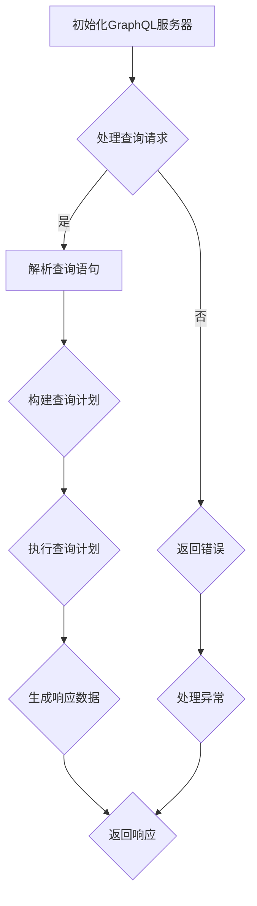

                 

# GraphQL：优化LLM应用的数据查询效率

关键词：GraphQL、LLM、数据查询效率、优化策略、性能调优

摘要：本文将深入探讨GraphQL在优化大型语言模型（LLM）应用数据查询效率方面的优势与具体实现。我们将从GraphQL的基本概念、优势、在LLM中的应用，到优化策略和实践，一一进行分析，以期为开发者提供实际可行的性能优化指南。

## 第一部分：GraphQL基础

### 第1章：GraphQL简介

#### 1.1 GraphQL的发展历程

GraphQL是由Facebook在2015年推出的一种查询语言，用于替代传统的RESTful API。它的设计理念是为了提供一种更高效、更灵活的数据查询方式。随着其社区的发展和成熟，GraphQL逐渐成为前端和后端开发者广泛使用的技术。

#### 1.2 GraphQL与传统RESTful API的区别

与传统的RESTful API相比，GraphQL的主要区别在于：

1. **查询灵活性**：GraphQL允许客户端指定需要查询的数据，而RESTful API通常基于固定的URL和固定的数据格式。
2. **减少重复查询**：GraphQL可以一次性获取所需的所有数据，减少了多次请求带来的性能损耗。
3. **数据的一致性**：GraphQL可以确保返回的数据与客户端请求的数据完全一致，避免了重复数据的处理。

#### 1.3 GraphQL的核心优势

1. **高效的数据查询**：GraphQL通过减少重复查询和提供灵活的查询方式，提高了数据查询的效率。
2. **数据的灵活性**：GraphQL允许开发者自定义查询语句，以获取所需的数据。
3. **减少开发时间和维护成本**：由于GraphQL可以减少重复查询，开发者可以更专注于业务逻辑的实现，从而降低开发时间和维护成本。

#### 1.4 GraphQL的应用场景

GraphQL适用于需要灵活查询数据的场景，例如：

1. **移动应用**：移动应用通常需要快速响应用户请求，GraphQL可以提供更好的性能。
2. **实时数据处理**：在需要实时处理大量数据的场景中，GraphQL可以减少数据传输时间和处理时间。
3. **大型单页应用**：大型单页应用通常需要从多个API获取数据，GraphQL可以简化数据获取过程。

## 第二部分：GraphQL基本概念

### 第2章：GraphQL基本概念

#### 2.1 GraphQL查询语言（GQL）

GraphQL查询语言（GQL）类似于SQL，但更加灵活。GQL允许开发者指定需要查询的数据字段，返回的数据与请求完全一致。

#### 2.2 GraphQL类型系统

GraphQL类型系统包括标量类型、枚举类型、输入类型、对象类型等。这些类型可以组合使用，构建出复杂的查询语句。

#### 2.3 GraphQL查询构建

构建GraphQL查询时，需要遵循一定的语法规则。开发者可以通过组合类型和字段，构建出满足需求的查询语句。

#### 2.4 GraphQL变量与传参

GraphQL变量可以用于传递动态值，提高查询的灵活性。变量可以替代查询中的静态值，从而实现更加复杂的查询逻辑。

## 第三部分：GraphQL优势分析

### 第3章：GraphQL优势分析

#### 3.1 高效的数据查询

GraphQL通过减少重复查询和数据传输，提高了数据查询的效率。这对于需要处理大量数据的LLM应用尤为重要。

#### 3.2 数据的灵活性

GraphQL允许开发者自定义查询语句，以获取所需的数据。这种灵活性使得GraphQL成为LLM应用中处理复杂数据请求的理想选择。

#### 3.3 减少重复查询

GraphQL可以一次性获取所需的所有数据，从而减少了多次请求带来的性能损耗。这对于需要频繁查询数据的LLM应用具有重要意义。

#### 3.4 代码的简洁性

GraphQL可以减少后端代码的复杂性，使得数据获取过程更加简洁。开发者可以将更多的精力投入到业务逻辑的实现上。

## 第四部分：GraphQL在LLM应用中的优势

### 第4章：GraphQL在LLM应用中的优势

#### 4.1 LLM应用概述

LLM（Large Language Model）是一种基于深度学习的大型语言模型，可以用于生成文本、翻译、问答等多种应用。随着AI技术的发展，LLM应用在各个领域得到了广泛应用。

#### 4.2 GraphQL在LLM中的优势

1. **高效的查询处理**：GraphQL可以高效地处理LLM应用中的数据查询，提高响应速度。
2. **灵活的数据获取**：GraphQL允许开发者根据需求自定义查询语句，灵活获取LLM应用中的数据。
3. **减少重复查询**：通过GraphQL，可以减少LLM应用中的重复查询，降低数据传输和处理成本。

#### 4.3 LLM应用场景分析

1. **智能问答**：GraphQL可以高效地获取与问答相关的数据，提高问答系统的响应速度和准确性。
2. **内容推荐**：GraphQL可以帮助开发者快速获取用户兴趣数据，为内容推荐系统提供更好的支持。
3. **翻译服务**：GraphQL可以优化翻译服务的数据查询过程，提高翻译速度和准确性。

## 第五部分：GraphQL优化策略

### 第5章：GraphQL优化策略

#### 5.1 GraphQL查询优化

通过合理设计GraphQL查询语句，可以减少数据查询的复杂度和时间成本。具体方法包括：

1. **避免过度查询**：避免在查询中请求不必要的字段，减少数据传输量。
2. **使用缓存**：合理使用缓存策略，减少对数据库的查询次数。

#### 5.2 数据库查询优化

优化数据库查询可以显著提高GraphQL的性能。具体方法包括：

1. **索引优化**：为数据库表创建合适的索引，提高查询效率。
2. **查询缓存**：使用查询缓存，减少数据库查询的次数。

#### 5.3 缓存策略

合理使用缓存策略可以显著提高GraphQL的性能。具体方法包括：

1. **本地缓存**：在客户端或服务器端使用本地缓存，减少对数据库的查询次数。
2. **分布式缓存**：使用分布式缓存系统，提高缓存的可扩展性和性能。

#### 5.4 并行查询与异步处理

通过并行查询和异步处理，可以显著提高GraphQL的查询性能。具体方法包括：

1. **并行查询**：同时发起多个查询请求，提高数据获取速度。
2. **异步处理**：使用异步处理，减少查询过程中的阻塞时间。

## 第六部分：GraphQL性能调优实践

### 第6章：GraphQL性能调优实践

#### 6.1 性能调优概述

性能调优是提高GraphQL应用性能的重要手段。本文将介绍一些常见的性能调优方法。

#### 6.2 性能分析工具

性能分析工具可以帮助开发者识别GraphQL应用的性能瓶颈。常见的性能分析工具有：

1. **New Relic APM**：一款功能强大的应用性能管理工具，可以实时监控GraphQL应用的性能。
2. **APM Server**：一款开源的应用性能监控工具，可以与Prometheus和Grafana等工具集成。

#### 6.3 性能优化案例分析

本文将结合实际案例，分析如何通过GraphQL查询优化、数据库查询优化、缓存策略等方法，提高GraphQL应用的性能。

#### 6.4 性能调优的最佳实践

本文将总结一些性能调优的最佳实践，帮助开发者提高GraphQL应用的性能。

## 第七部分：GraphQL安全性与稳定性

### 第7章：GraphQL安全性与稳定性

#### 7.1 GraphQL安全风险

1. **SQL注入**：通过构造恶意查询语句，攻击者可能获取敏感数据。
2. **未经授权的访问**：未经授权的用户可能通过GraphQL获取敏感数据。

#### 7.2 安全防范措施

1. **验证与授权**：对用户身份进行验证和授权，确保只有授权用户可以访问敏感数据。
2. **输入验证**：对用户输入进行严格验证，防止SQL注入等攻击。

#### 7.3 稳定性保障

1. **负载均衡**：使用负载均衡器，确保服务器可以处理大量请求。
2. **错误处理**：合理处理错误，确保系统在异常情况下能够稳定运行。

## 第八部分：总结与展望

### 第8章：总结与展望

#### 8.1 GraphQL在LLM应用中的前景

随着LLM应用的不断发展和普及，GraphQL在数据查询效率方面的优势将得到更广泛的应用。未来，GraphQL有望成为LLM应用中的主流技术。

#### 8.2 未来发展趋势

1. **性能优化**：随着GraphQL应用的不断扩展，性能优化将成为重要研究方向。
2. **安全性研究**：加强对GraphQL安全风险的研究，提高系统的安全性。
3. **生态建设**：随着GraphQL的普及，其生态建设也将成为未来发展趋势。

#### 8.3 研究方向与挑战

1. **性能优化**：如何在保证数据查询效率的同时，降低系统复杂度。
2. **安全性研究**：如何提高系统的安全性，防止数据泄露和未经授权的访问。
3. **跨平台支持**：如何支持更多平台和语言，提高GraphQL的兼容性。

## 结语

作者：AI天才研究院/AI Genius Institute & 禅与计算机程序设计艺术 /Zen And The Art of Computer Programming

在本文中，我们深入探讨了GraphQL在优化LLM应用数据查询效率方面的优势与具体实现。通过本文的介绍，相信读者对GraphQL有了更深入的了解。在未来的发展中，GraphQL有望成为LLM应用中的主流技术，为开发者提供更加高效、灵活的数据查询解决方案。作者在此呼吁广大开发者关注GraphQL技术，共同推动其生态的发展。在研究和实践中，我们也要不断优化GraphQL的性能，提高系统的安全性，为LLM应用的发展贡献力量。让我们共同努力，为构建更加智能、高效的应用而努力！## 第1章：GraphQL简介

### 1.1 GraphQL的发展历程

GraphQL起源于2015年，由Facebook的工程师推出，最初用于Facebook的内部应用，以提高数据查询的效率。随着其应用范围的扩大，GraphQL逐渐被开源社区接受，并成为了一种流行的后端查询语言。GraphQL的设计理念是为了解决传统RESTful API中的一些常见问题，如数据冗余、过度查询、响应时间过长等。

GraphQL在推出后迅速获得了关注，众多大型科技公司如Netflix、Instagram、GitHub等相继采用GraphQL作为其数据查询接口。此外，GraphQL还得到了各大技术社区的广泛支持，如Apollo、Urql等GraphQL客户端库的涌现，使得开发者可以更加便捷地使用GraphQL。

近年来，GraphQL在LLM（Large Language Model）应用中的重要性日益凸显。LLM应用通常需要处理大量的文本数据，并从多个数据源获取信息。GraphQL的高效查询和灵活性使得它在处理这些复杂的数据请求方面具有显著优势。

### 1.2 GraphQL与传统RESTful API的区别

#### 1.2.1 查询灵活性

在传统的RESTful API中，客户端必须根据预先定义的API端点（Endpoint）来获取数据。例如，如果一个API提供用户信息和订单信息，客户端可能需要发起两个独立的请求，分别获取用户信息和订单信息。这种方式存在以下问题：

- **数据冗余**：客户端可能会获取到一些无关的数据。
- **过度查询**：客户端可能需要获取的数据并不是API端点提供的全部数据，导致额外的数据请求。

而GraphQL允许客户端在单个查询中指定需要的数据字段，极大地提高了查询的灵活性。例如，客户端可以请求获取用户的姓名、电子邮件和订单的数量，而不是获取所有用户信息和所有订单信息。这种方式减少了数据传输量和处理时间。

#### 1.2.2 减少重复查询

传统RESTful API通常要求客户端分别查询不同的数据源，导致多个请求和响应。这不仅增加了网络延迟，也增加了服务器负载。而GraphQL允许客户端在单个查询中获取所有需要的数据，从而减少了重复查询，提高了整体性能。

#### 1.2.3 数据的一致性

在传统RESTful API中，不同的API端点可能会返回不同的数据格式，客户端需要根据API端点进行相应的数据解析和处理。而GraphQL通过统一的查询语言和类型系统，确保了返回的数据与客户端请求的数据完全一致，减少了数据处理的复杂性。

### 1.3 GraphQL的核心优势

#### 1.3.1 高效的数据查询

GraphQL通过以下方式提高了数据查询的效率：

- **减少重复查询**：通过在单个查询中获取所有需要的数据，减少了多次请求的次数。
- **按需获取数据**：客户端可以精确指定需要的数据字段，避免了数据冗余和无效的数据传输。
- **并行查询**：GraphQL支持并行查询，客户端可以同时发起多个查询请求，提高了数据获取速度。

#### 1.3.2 数据的灵活性

GraphQL的类型系统允许开发者自定义复杂的查询逻辑，灵活地获取所需的数据。例如，客户端可以通过嵌套查询获取多层次的数据结构，或者通过联合查询（Union）和接口查询（Interface）处理不同类型的数据。

#### 1.3.3 减少开发时间和维护成本

由于GraphQL提供了统一的查询接口和数据格式，后端开发者无需为不同的前端应用编写不同的API端点。这种模式简化了后端开发流程，降低了开发时间和维护成本。

#### 1.3.4 代码的简洁性

GraphQL允许开发者通过简单的查询语句获取所需的数据，避免了繁琐的API调用和数据处理逻辑。这种简洁性使得代码更加直观，易于理解和维护。

### 1.4 GraphQL的应用场景

GraphQL适用于多种应用场景，尤其适合以下几种情况：

- **大型单页应用**：由于单页应用通常需要从多个数据源获取数据，GraphQL可以简化数据获取过程，提高性能。
- **移动应用**：移动应用通常对性能有较高的要求，GraphQL可以提供高效的查询接口，提高用户体验。
- **实时数据处理**：在需要实时处理大量数据的场景中，GraphQL可以减少数据传输和处理时间，提高系统的响应速度。
- **多端数据共享**：在多端应用中，GraphQL可以提供一个统一的数据接口，简化不同端的数据同步和共享。

总之，GraphQL作为一种灵活、高效的数据查询语言，已经在多个领域得到了广泛应用。随着其生态的不断成熟，GraphQL将在更多场景中发挥重要作用。

## 第2章：GraphQL基本概念

### 2.1 GraphQL查询语言（GQL）

GraphQL查询语言（GQL）是一种基于文本的查询语言，类似于SQL。它允许开发者以声明式的方式查询数据，通过指定需要的数据字段，获取精确的数据结果。GQL的基本语法包括字段、类型、操作符和变量等。

#### 2.1.1 查询结构

一个基本的GQL查询通常包含以下结构：

```gql
query {
  field1
  field2
  field3
}
```

这里，`field1`、`field2` 和 `field3` 代表查询的字段。每个字段可以进一步嵌套子字段，形成树状结构。

#### 2.1.2 字段与类型

字段是GQL查询的核心组成部分，每个字段都对应一个特定的类型。类型定义了字段的数据结构和操作方式。GQL支持以下类型的字段：

- **标量类型**：如字符串（String）、整数（Int）、布尔值（Boolean）等。
- **枚举类型**：预定义的字符串集合，如性别（Male、Female）。
- **复杂数据类型**：如对象（Object）、列表（List）等。

例如：

```gql
{
  user(id: "123") {
    name
    age
  }
}
```

在这个查询中，`user` 是一个对象类型字段，它包含 `name` 和 `age` 两个标量类型字段。

#### 2.1.3 操作符

GQL支持多种操作符，用于在查询中执行条件判断和数据处理。常见的操作符包括：

- **比较操作符**：如 `eq`（等于）、`ne`（不等于）、`gt`（大于）、`lt`（小于）等。
- **逻辑操作符**：如 `and`（逻辑与）、`or`（逻辑或）等。
- **集合操作符**：如 `in`（在集合中）、`notIn`（不在集合中）等。

例如：

```gql
{
  users(where: { age_gt: 18, age_lt: 30 }) {
    id
    name
  }
}
```

在这个查询中，`where` 是一个操作符，用于指定查询条件，获取年龄在18到30岁之间的用户信息。

#### 2.1.4 变量与传参

GQL支持变量，允许在查询中动态传递值。变量使用大写字母命名，并在查询中使用 `${VARIABLE_NAME}` 的形式引用。例如：

```gql
query($userId: ID!, $age: Int!) {
  user(id: $userId) {
    name
    age
  }
}
```

在这个查询中，`$userId` 和 `$age` 是变量，分别表示用户ID和年龄。变量可以在查询的根级别定义，也可以在字段级别定义。

### 2.2 GraphQL类型系统

GraphQL类型系统是构建GraphQL查询的基础，包括标量类型、枚举类型、复杂数据类型和接口类型等。每种类型都有其特定的用途和特性。

#### 2.2.1 标量类型

标量类型是GraphQL中最基本的数据类型，如字符串（String）、整数（Int）、布尔值（Boolean）等。标量类型用于表示简单的数据值。

- **字符串**：表示文本数据，可以是单引号或双引号包裹。
- **整数**：表示整数数据，可以是32位或64位。
- **布尔值**：表示逻辑值，只能是 `true` 或 `false`。

#### 2.2.2 枚举类型

枚举类型是一组预定义的字符串集合，用于表示特定的分类或状态。例如，性别（Male、Female）可以使用枚举类型定义。

```gql
enum Gender {
  MALE
  FEMALE
}
```

#### 2.2.3 复杂数据类型

复杂数据类型用于表示复杂的数据结构，如对象（Object）和列表（List）。复杂数据类型可以通过字段和子字段进行扩展。

- **对象类型**：表示具有固定字段和数据结构的数据。例如，用户（User）对象类型可以包含姓名（name）、年龄（age）等字段。
- **列表类型**：表示一组数据的集合，可以使用方括号 `[]` 表示。列表中的元素可以是任何类型，包括标量类型、枚举类型和复杂数据类型。

例如：

```gql
type User {
  id: ID!
  name: String!
  age: Int!
}

type Query {
  user(id: ID!): User
}
```

在这个定义中，`User` 是一个对象类型，包含三个字段：`id`、`name` 和 `age`。

#### 2.2.4 接口类型

接口类型是一种抽象的数据类型，用于表示具有共同字段和行为的不同数据类型。接口类型可以继承其他接口类型，用于定义通用的字段和行为。

```gql
interface Named {
  name: String!
}

type User implements Named {
  id: ID!
  name: String!
}

type Product implements Named {
  id: ID!
  name: String!
}
```

在这个定义中，`Named` 是一个接口类型，包含一个字段 `name`。`User` 和 `Product` 都实现了 `Named` 接口。

### 2.3 GraphQL查询构建

构建GraphQL查询时，需要遵循一定的语法规则和结构。一个典型的GraphQL查询包含以下部分：

- **查询操作**：如 `query` 或 `mutation`。
- **根字段**：查询的起始字段，如 `user` 或 `product`。
- **字段和子字段**：通过点号（`.`）连接的多个字段，用于指定需要查询的数据。
- **操作符和条件**：用于限制查询结果的条件，如 `where`。
- **变量和传参**：用于动态传递值的变量，如 `$userId`。

以下是一个简单的查询示例：

```gql
query {
  user(id: "123") {
    name
    age
  }
}
```

在这个查询中，`user` 是根字段，`id` 是变量，用于指定用户ID。查询结果将返回用户的名字和年龄。

### 2.4 GraphQL变量与传参

GraphQL变量是一种用于传递动态值的重要特性，可以提高查询的灵活性和重用性。变量在使用前需要在查询的根级别或字段级别进行定义，并在查询体中使用 `${VARIABLE_NAME}` 的形式引用。

#### 2.4.1 变量的定义

变量定义在查询的根级别，使用 `variables` 对象：

```gql
query {
  user(id: $userId) {
    name
    age
  }
  product(id: $productId) {
    name
    price
  }
}
variables {
  userId: "123"
  productId: "456"
}
```

在这个查询中，`variables` 对象包含两个变量：`userId` 和 `productId`。

#### 2.4.2 变量的引用

变量在查询体中通过 `${VARIABLE_NAME}` 的形式引用。例如：

```gql
query {
  user(id: $userId) {
    name
    age
  }
}
```

在这个查询中，`user` 字段的 `id` 参数引用了变量 `$userId`。

#### 2.4.3 必须变量与可选变量

必须变量在使用前必须在 `variables` 对象中定义，否则查询会失败。可选变量则可以在查询中省略，如果不提供值，查询会返回 `null`。

```gql
query {
  user(id: $userId) {
    name
    age
  }
  product(name: $productName) {
    price
  }
}
variables {
  userId: "123"
}
```

在这个查询中，`userId` 是必须变量，而 `productName` 是可选变量。

通过变量和传参，GraphQL查询可以更加灵活和可重用，使得开发者可以轻松地处理复杂的查询逻辑。

## 第3章：GraphQL优势分析

### 3.1 高效的数据查询

GraphQL在设计时就旨在提高数据查询的效率，尤其是在处理大量数据时。以下是GraphQL在数据查询方面的几个关键优势：

#### 3.1.1 减少重复查询

在传统的RESTful API中，客户端通常需要发起多个请求来获取所需的所有数据。例如，一个复杂的单页应用可能需要多个API端点来获取用户信息、订单详情、产品数据等。这种方式不仅增加了网络延迟，还增加了服务器的负载和复杂度。

相比之下，GraphQL允许客户端在单个查询中获取所有需要的数据。通过这种方式，可以显著减少重复查询的次数，提高数据查询的效率。

例如，一个使用GraphQL的查询请求可能如下所示：

```gql
query {
  user(id: "123") {
    name
    orders {
      id
      status
      total
    }
  }
}
```

在这个查询中，客户端只需要一个请求就可以同时获取用户信息和订单详情，而不需要分别发起多个请求。

#### 3.1.2 按需获取数据

传统的RESTful API通常采用“一刀切”的策略，无论客户端请求的数据量是多少，都会返回所有可能的数据。这种方式不仅浪费带宽和服务器资源，还可能增加数据处理的复杂性。

GraphQL则允许客户端精确地指定需要的数据字段。例如，如果客户端只需要获取用户的姓名和电子邮件，它可以直接在查询中请求这些字段，而不是获取所有用户信息。

```gql
query {
  user(id: "123") {
    name
    email
  }
}
```

这种按需获取数据的方式不仅提高了数据查询的效率，还减少了服务器和客户端的负担。

#### 3.1.3 缩短响应时间

由于GraphQL允许客户端在单个查询中获取所有需要的数据，减少了多次请求的次数，从而缩短了响应时间。这对于需要快速响应用户请求的应用尤为重要，例如实时数据分析和移动应用。

在实际应用中，缩短响应时间可以提高用户体验，减少用户等待的时间，从而提高用户满意度和应用留存率。

#### 3.1.4 支持并行查询

GraphQL还支持并行查询，客户端可以同时发起多个查询请求，并发地获取数据。这种方式可以进一步提高数据查询的效率，特别是在处理大量数据时。

例如，在一个电商应用中，客户端可能需要同时获取用户信息、购物车数据和产品库存信息。使用GraphQL的并行查询，客户端可以同时发起这三个查询请求，并在较短的时间内获取所有数据。

```gql
query {
  user(id: "123") {
    id
    name
  }
  cart(id: "456") {
    id
    items {
      id
      quantity
    }
  }
  product(id: "789") {
    id
    stock
  }
}
```

在这个查询中，客户端可以并行获取用户信息、购物车数据和产品库存信息，从而提高整体查询效率。

总之，GraphQL通过减少重复查询、按需获取数据、缩短响应时间和支持并行查询等方式，显著提高了数据查询的效率。这些优势使得GraphQL在处理大量数据时具有显著的优势，成为现代Web应用和后端服务开发中的重要技术之一。

### 3.2 数据的灵活性

GraphQL的另一个显著优势是其数据的灵活性。在传统的RESTful API中，数据通常是预先定义好的，客户端需要根据固定的API端点来获取数据。这种方式虽然简单，但缺乏灵活性，特别是在需要动态调整数据查询的场景中。

#### 3.2.1 自定义查询

GraphQL的核心特性之一是允许客户端自定义查询。这意味着客户端可以精确地指定需要的数据字段和结构，而无需依赖固定的API端点。通过这种方式，开发者可以更好地满足不同应用场景的需求。

例如，在一个社交网络应用中，不同的用户可能需要不同的数据字段。一些用户可能需要获取其他用户的个人信息，如姓名、头像和最近的活动；而另一些用户可能需要获取更详细的信息，如教育背景、职业等。

使用GraphQL，开发者可以定义一个通用的查询接口，同时允许客户端根据实际需求自定义查询。例如：

```gql
query GetUserInfo($userId: ID!, $includeDetails: Boolean!) {
  user(id: $userId) {
    name
    avatar
    ... @include(if: includeDetails) {
      education
      career
    }
  }
}
```

在这个查询中，`$includeDetails` 变量用于指示是否需要获取用户的教育背景和职业信息。通过这种方式，客户端可以根据实际需求选择性地获取数据，提高了查询的灵活性。

#### 3.2.2 复杂的数据结构

GraphQL支持复杂的嵌套查询和数据结构，使得客户端可以轻松获取多层次的数据。例如，在一个电商应用中，用户可能需要获取产品的详细信息，包括产品描述、价格、评价等。

使用GraphQL，开发者可以定义一个复杂的查询接口，同时允许客户端根据实际需求获取所需的数据。例如：

```gql
query GetProductDetails($productId: ID!) {
  product(id: $productId) {
    name
    description
    price
    reviews {
      content
      rating
    }
  }
}
```

在这个查询中，客户端可以一次性获取产品的名称、描述、价格以及所有评价。这种方式不仅简化了数据获取过程，还提高了系统的整体性能。

#### 3.2.3 多源数据查询

GraphQL还支持多源数据查询，客户端可以同时从多个数据源获取数据。例如，在一个新闻应用中，用户可能需要获取新闻的标题、摘要和详细内容，这些数据可能存储在不同的数据库或服务中。

使用GraphQL，开发者可以定义一个复杂的查询接口，同时允许客户端从多个数据源获取数据。例如：

```gql
query GetNewsDetails($newsId: ID!) {
  news(id: $newsId) {
    title
    abstract
    content
    author {
      name
      bio
    }
  }
}
```

在这个查询中，客户端可以一次性获取新闻的标题、摘要、详细内容和作者信息。这种方式不仅提高了查询的灵活性，还简化了数据获取过程。

总之，GraphQL的数据灵活性使得开发者可以更好地满足不同应用场景的需求。通过自定义查询、复杂的数据结构以及多源数据查询，GraphQL提供了强大的数据查询能力，成为现代Web应用和后端服务开发中的重要技术之一。

### 3.3 减少重复查询

在传统的RESTful API中，客户端通常需要多次发起请求来获取所需的所有数据。这种模式不仅增加了网络延迟和服务器负载，还可能导致数据冗余和不一致。而GraphQL通过减少重复查询，显著提高了数据查询的效率。

#### 3.3.1 一次性获取数据

GraphQL的核心优势之一是允许客户端在单个查询中获取所有需要的数据。这意味着客户端不再需要为每个数据点单独发起请求，从而减少了请求次数和网络延迟。

例如，在一个电商应用中，用户可能需要获取其购物车中的所有商品信息，包括商品名称、价格、数量等。使用传统的RESTful API，客户端可能需要分别发起多个请求来获取这些信息：

```javascript
GET /api/cart/items?userId=123
GET /api/products/456
GET /api/products/789
```

相比之下，使用GraphQL，客户端可以一次性获取所有所需的数据：

```gql
query {
  cart(userId: "123") {
    items {
      productId
      name
      price
      quantity
    }
  }
}
```

这种一次性获取数据的方式不仅减少了请求次数，还简化了数据获取逻辑。

#### 3.3.2 缩短响应时间

由于减少了重复查询，GraphQL可以显著缩短响应时间。在传统的RESTful API中，每个请求都需要处理和传输，从而增加了响应时间。而在GraphQL中，由于多个数据点可以同时获取，响应时间通常会大幅减少。

例如，在一个社交网络应用中，用户可能需要获取其关注的人的动态列表，包括发布时间、内容、点赞数等。使用传统的RESTful API，客户端可能需要分别发起多个请求：

```javascript
GET /api/user/123/following/latest_posts
GET /api/posts/456
GET /api/posts/789
GET /api/posts/likes/456
GET /api/posts/likes/789
```

相比之下，使用GraphQL，客户端可以一次性获取所有所需的数据：

```gql
query {
  user(following: "123") {
    latestPosts {
      id
      content
      publishedAt
      likesCount
    }
  }
}
```

这种一次性获取数据的方式不仅减少了请求次数，还简化了数据获取逻辑，从而显著缩短了响应时间。

#### 3.3.3 提高系统性能

减少重复查询不仅提高了数据查询的效率，还降低了服务器的负载。在传统的RESTful API中，每个请求都需要处理和响应，从而增加了服务器的负载。而在GraphQL中，由于减少了重复查询，服务器可以更高效地处理请求，提高整体性能。

例如，在一个大型电子商务平台中，用户可能需要频繁查询产品信息。如果使用传统的RESTful API，服务器可能会因频繁的请求而负担过重。而使用GraphQL，服务器可以在单个查询中处理多个请求，从而减轻了负载，提高了系统的性能和稳定性。

总之，通过减少重复查询，GraphQL可以显著提高数据查询的效率。这种一次性获取数据的方式不仅减少了请求次数和响应时间，还提高了系统性能，为开发者提供了更加高效和灵活的数据查询解决方案。

### 3.4 代码的简洁性

GraphQL的代码简洁性是其显著优势之一，特别是在大型和复杂的应用中。通过减少冗余代码、简化API设计和提供统一的数据格式，GraphQL使得开发者可以更高效地编写和维护代码。

#### 3.4.1 减少冗余代码

在传统的RESTful API中，开发者需要编写大量的重复代码来处理不同的数据请求。例如，对于一个电商应用，开发者可能需要为每个产品、订单和用户编写不同的API端点，并在后端处理不同的数据格式。

使用GraphQL，开发者可以定义一个统一的查询接口，并在单个查询中获取所有所需的数据。例如：

```gql
query {
  product(id: "123") {
    id
    name
    price
    quantityInStock
  }
  order(id: "456") {
    id
    status
    total
    items {
      productId
      quantity
    }
  }
  user(id: "789") {
    id
    name
    email
  }
}
```

在这个查询中，开发者只需编写一次代码即可获取产品、订单和用户的信息，避免了大量的重复代码。

#### 3.4.2 简化API设计

GraphQL通过提供统一的数据格式，简化了API的设计过程。在传统的RESTful API中，开发者需要为不同的端点编写不同的数据格式，例如JSON和XML。这种方式不仅增加了开发难度，还可能导致数据不一致。

使用GraphQL，开发者可以定义一个统一的数据格式，并在查询中获取所需的数据。例如：

```gql
type Product {
  id: ID!
  name: String!
  price: Float!
  quantityInStock: Int!
}

type Order {
  id: ID!
  status: String!
  total: Float!
  items: [OrderItem]!
}

type OrderItem {
  productId: ID!
  quantity: Int!
}
```

在这个定义中，开发者只需定义一次数据结构，即可在整个应用中使用。这种统一的数据格式不仅简化了API设计，还提高了代码的可读性和可维护性。

#### 3.4.3 提供统一的数据格式

GraphQL提供了一种统一的数据格式，使得客户端可以更容易地解析和处理返回的数据。在传统的RESTful API中，客户端需要根据不同的端点解析不同的数据格式，这增加了开发难度和复杂性。

使用GraphQL，客户端可以统一解析返回的JSON数据，从而简化了数据处理过程。例如：

```json
{
  "data": {
    "product": {
      "id": "123",
      "name": "Product Name",
      "price": 9.99,
      "quantityInStock": 100
    },
    "order": {
      "id": "456",
      "status": "pending",
      "total": 29.97,
      "items": [
        {
          "productId": "123",
          "quantity": 2
        }
      ]
    },
    "user": {
      "id": "789",
      "name": "John Doe",
      "email": "johndoe@example.com"
    }
  }
}
```

在这个JSON数据中，所有字段都具有相同的数据格式，客户端可以轻松地解析和获取所需的数据。

总之，GraphQL通过减少冗余代码、简化API设计和提供统一的数据格式，显著提高了代码的简洁性。这些优势使得开发者可以更高效地编写和维护代码，为大型和复杂的应用提供了更好的解决方案。

## 第4章：GraphQL在LLM应用中的优势

### 4.1 LLM应用概述

大型语言模型（LLM）是一种基于深度学习的自然语言处理技术，通过大规模数据训练生成文本、回答问题、翻译语言等。LLM应用广泛存在于各个领域，如智能助手、问答系统、内容推荐、语言翻译等。随着AI技术的发展，LLM应用在处理复杂自然语言任务方面具有显著优势，但同时也面临着数据查询和处理效率的挑战。

### 4.2 GraphQL在LLM中的优势

#### 4.2.1 提高数据查询效率

在LLM应用中，数据查询效率是影响系统性能的关键因素。GraphQL通过减少重复查询、按需获取数据和并行查询，显著提高了数据查询的效率。

1. **减少重复查询**：LLM应用通常需要从多个数据源获取信息，如文本数据库、用户信息库等。传统的RESTful API可能需要多次查询才能获取所有所需数据，而GraphQL可以在单个查询中获取所有数据，减少了查询次数，降低了系统开销。

2. **按需获取数据**：LLM应用可以根据需求动态调整查询的数据字段，避免了不必要的重复数据传输。例如，当一个问答系统仅需要获取问题的关键词和答案时，GraphQL可以精确返回这些字段，而不是整个文本数据。

3. **并行查询**：LLM应用中的数据处理往往需要依赖多个数据源，如文本数据库、图像识别服务等。GraphQL支持并行查询，可以在较短时间内获取所有数据，提高系统响应速度。

#### 4.2.2 提高代码可维护性

在LLM应用中，代码的可维护性至关重要。GraphQL通过提供统一的数据格式和简洁的查询接口，简化了代码开发和维护。

1. **统一的数据格式**：GraphQL返回的数据格式是JSON，具有一致性和易读性。开发者可以轻松解析和操作返回的数据，减少了数据处理的复杂性。

2. **简洁的查询接口**：GraphQL的查询接口允许开发者精确指定需要的数据字段，避免了繁琐的API调用和数据处理逻辑。这种简洁性提高了代码的可读性和可维护性。

3. **模块化代码**：GraphQL允许开发者将数据查询和数据处理逻辑分离，通过模块化设计提高代码的复用性和可维护性。例如，在一个问答系统中，可以将文本查询和答案生成功能分离成独立的模块，便于开发和维护。

#### 4.2.3 提高用户体验

在LLM应用中，用户体验是影响用户满意度和应用留存率的关键因素。GraphQL通过提高数据查询效率，可以显著改善用户体验。

1. **快速响应**：通过减少重复查询和并行查询，GraphQL可以缩短系统响应时间，提高用户交互的流畅性。

2. **个性化推荐**：LLM应用通常需要根据用户行为和偏好推荐内容。GraphQL可以根据用户的实时行为动态调整查询，提供个性化的推荐结果，提高用户满意度。

3. **实时交互**：在实时交互场景中，如实时聊天和直播问答，GraphQL可以快速响应用户请求，提供实时反馈，增强用户体验。

#### 4.2.4 支持复杂查询

LLM应用通常涉及复杂的查询需求，如多层级数据查询、跨数据源查询等。GraphQL通过提供丰富的查询功能和灵活的数据类型，可以支持这些复杂查询。

1. **嵌套查询**：GraphQL支持嵌套查询，允许开发者获取多层嵌套的数据结构。例如，在问答系统中，可以同时获取问题的关键词、答案和相关的评论。

2. **联合查询**：GraphQL支持联合查询，允许开发者同时查询多个数据源。例如，在内容推荐系统中，可以同时获取用户偏好和推荐内容的数据。

3. **变量和参数**：GraphQL支持变量和参数，允许开发者动态调整查询条件和数据。例如，在搜索系统中，可以根据用户的输入动态调整查询条件和排序方式。

总之，GraphQL在LLM应用中具有显著的优势，通过提高数据查询效率、代码可维护性、用户体验和复杂查询支持，为开发者提供了强大的工具，帮助构建高效、灵活和可靠的LLM应用。

### 4.3 LLM应用场景分析

#### 4.3.1 智能问答系统

智能问答系统是LLM应用的一个重要场景。它通过自然语言处理技术，对用户提出的问题进行理解和回答。以下是使用GraphQL优化智能问答系统数据查询效率的具体实例：

1. **数据源整合**：智能问答系统通常需要从多个数据源获取信息，如知识库、外部API、用户数据库等。使用GraphQL，可以设计一个统一的查询接口，整合多个数据源的信息，避免重复查询和复杂的数据处理逻辑。

2. **查询优化**：假设问答系统需要获取问题的关键词、相关的答案和用户评论。使用GraphQL，可以设计一个嵌套查询，一次性获取这些数据：

   ```gql
   query {
     question(id: "123") {
       id
       keywords
       answers {
         id
         content
         rating
         comments {
           id
           text
           author
         }
       }
     }
   }
   ```

   在这个查询中，`question` 字段嵌套了 `answers` 和 `comments` 字段，使得客户端可以在单个查询中获取所有所需的数据，减少了重复查询。

3. **变量和参数**：在智能问答系统中，可以根据用户输入动态调整查询条件。例如，可以根据用户输入的关键词、问题类型和回答质量评分等参数，优化查询结果：

   ```gql
   query ($keywords: [String]!, $minRating: Int!) {
     questions(keywords: $keywords, minRating: $minRating) {
       id
       content
       rating
     }
   }
   ```

   通过变量 `$keywords` 和 `$minRating`，客户端可以灵活地指定查询条件，获取更加精准的问答结果。

#### 4.3.2 内容推荐系统

内容推荐系统是另一个常见的LLM应用场景。它通过分析用户行为和偏好，为用户推荐相关的信息。以下是使用GraphQL优化内容推荐系统数据查询效率的具体实例：

1. **个性化推荐**：内容推荐系统可以根据用户的历史行为、浏览记录和搜索关键词等，生成个性化的推荐列表。使用GraphQL，可以设计一个查询接口，根据用户输入的参数动态生成推荐列表：

   ```gql
   query ($userId: ID!, $limit: Int!) {
     recommendations(userId: $userId, limit: $limit) {
       id
       title
       summary
       rating
       tags
     }
   }
   ```

   在这个查询中，`recommendations` 字段根据用户ID和推荐数量参数，返回个性化的推荐内容。

2. **并行查询**：内容推荐系统可能需要同时查询多个数据源，如用户数据库、文章数据库和标签数据库等。使用GraphQL的并行查询功能，可以在较短时间内获取所有数据，提高系统响应速度：

   ```gql
   query {
     user(id: "123") {
       id
       preferences
     }
     articles {
       id
       title
       summary
       tags
     }
   }
   ```

   在这个查询中，同时获取用户偏好和所有文章数据，为推荐算法提供更丰富的数据支持。

3. **缓存策略**：为了提高内容推荐系统的性能，可以使用GraphQL的缓存策略。例如，在用户首次查询后，可以将推荐结果缓存一段时间，避免频繁查询数据库：

   ```gql
   query ($userId: ID!, $cacheDuration: Int!) {
     cacheRecommendations(userId: $userId, duration: $cacheDuration) {
       id
       title
       summary
       rating
       tags
     }
   }
   ```

   在这个查询中，使用缓存策略提高推荐结果的重用性，减少数据库查询次数。

#### 4.3.3 智能客服系统

智能客服系统是LLM应用的重要应用场景之一，通过自然语言处理技术，自动回答用户的问题，提供客户支持。以下是使用GraphQL优化智能客服系统数据查询效率的具体实例：

1. **知识库查询**：智能客服系统需要从知识库中获取答案，以回答用户的问题。使用GraphQL，可以设计一个查询接口，快速获取知识库中的相关条目：

   ```gql
   query ($question: String!) {
     knowledgeBase(question: $question) {
       id
       question
       answer
       tags
     }
   }
   ```

   在这个查询中，根据用户输入的问题，快速获取知识库中的相关条目。

2. **并行查询**：智能客服系统可能需要同时查询多个知识库，如产品手册、常见问题解答等。使用GraphQL的并行查询功能，可以在较短时间内获取所有知识库的数据，提高系统响应速度：

   ```gql
   query {
     productManual {
       id
       question
       answer
     }
     faq {
       id
       question
       answer
     }
   }
   ```

   在这个查询中，同时查询产品手册和常见问题解答知识库，为客服提供更全面的信息支持。

3. **动态调整查询**：智能客服系统可以根据用户输入的问题，动态调整查询条件。例如，可以根据问题的关键词、问题类型和回答质量评分等，优化查询结果：

   ```gql
   query ($question: String!, $tags: [String]!) {
     knowledgeBase(question: $question, tags: $tags) {
       id
       question
       answer
       tags
     }
   }
   ```

   通过变量 `$tags`，可以根据问题的标签动态调整查询条件，提高查询结果的精准度。

总之，通过具体的实例分析，可以看出GraphQL在智能问答系统、内容推荐系统和智能客服系统等LLM应用场景中，具有显著的优化数据查询效率的优势。通过合理设计查询接口、使用变量和参数、并行查询和缓存策略等方法，可以显著提高系统性能和用户体验。

## 第5章：GraphQL优化策略

### 5.1 GraphQL查询优化

GraphQL查询优化是提高系统性能和用户体验的关键步骤。以下是一些常见的GraphQL查询优化策略：

#### 5.1.1 避免过度查询

过度查询是指客户端请求了比实际需要更多的数据，这不仅浪费带宽和服务器资源，还可能增加数据处理时间。为了避免过度查询，可以采取以下措施：

1. **精确指定字段**：在查询中只请求需要的数据字段，避免不必要的字段。
2. **使用筛选条件**：通过添加筛选条件，仅获取满足条件的数据，减少不必要的查询。

例如：

```gql
query {
  users {
    id
    name
  }
}
```

可以优化为：

```gql
query {
  users(where: { active: true }) {
    id
    name
  }
}
```

#### 5.1.2 优化嵌套查询

嵌套查询在GraphQL中是一种常见的查询方式，但过深的嵌套可能会导致性能下降。为了优化嵌套查询，可以采取以下策略：

1. **批量获取数据**：通过批量获取数据，减少查询次数。例如，使用 `批量查询` 功能一次性获取多个数据项。
2. **使用联合查询（Union）**：当需要从多个类型获取数据时，可以使用联合查询，减少嵌套查询的深度。

例如：

```gql
query {
  post {
    id
    title
    comments {
      id
      content
    }
  }
}
```

可以优化为：

```gql
query {
  post {
    id
    title
    commentIds: comments { id }
  }
  comments(ids: [1, 2, 3]) {
    id
    content
  }
}
```

#### 5.1.3 使用缓存

缓存是一种常用的性能优化技术，可以显著减少数据库查询次数，提高系统性能。以下是一些使用缓存的方法：

1. **本地缓存**：在客户端或服务器端使用本地缓存，存储常用数据，减少查询次数。
2. **分布式缓存**：使用分布式缓存系统，如Redis，存储大规模数据，提高缓存的可扩展性。
3. **查询缓存**：在GraphQL服务器中启用查询缓存，存储常用查询的结果，减少数据库查询次数。

例如，在GraphQL服务器中启用查询缓存：

```yaml
# graphiql-playground-json
{
  "headers": {},
  "variables": {},
  "query": "query { users { id name } }",
  "operationName": "users",
  "request": {
    "query": "query { users { id name } }",
    "operationName": "users",
    "variables": {},
    "extensions": {
      " persistedQuery": {
        " version": 1,
        " sha256Hash": "string"
      }
    }
  }
}
```

#### 5.1.4 并行查询

并行查询允许同时发起多个查询，提高数据获取速度。以下是一些使用并行查询的策略：

1. **异步处理**：在服务器端使用异步处理，避免阻塞请求。
2. **并行请求**：在客户端使用并行请求，同时发起多个查询请求。

例如，在Python中使用异步并行查询：

```python
import asyncio
import aiohttp

async def fetch(session, url):
    async with session.get(url) as response:
        return await response.text()

async def fetch_all(urls):
    async with aiohttp.ClientSession() as session:
        results = await asyncio.gather(*[fetch(session, url) for url in urls])
        return results

urls = ["http://example.com/api/data1", "http://example.com/api/data2"]
loop = asyncio.get_event_loop()
results = loop.run_until_complete(fetch_all(urls))
print(results)
```

#### 5.1.5 数据库查询优化

优化数据库查询可以提高数据查询的效率。以下是一些常用的数据库查询优化策略：

1. **索引优化**：为数据库表创建合适的索引，提高查询效率。
2. **查询缓存**：使用查询缓存，减少数据库查询次数。
3. **分库分表**：对于大规模数据，可以将数据分库分表，提高查询性能。

例如，创建索引优化查询：

```sql
CREATE INDEX index_name ON table_name (column1, column2);
```

### 5.2 数据库查询优化

数据库查询优化在提高GraphQL性能中起着至关重要的作用。以下是一些关键的数据库查询优化策略：

#### 5.2.1 索引优化

索引是数据库查询优化的重要工具，它通过加速数据检索来提高查询效率。以下是一些索引优化的策略：

1. **创建合适的索引**：为频繁查询的字段创建索引，特别是那些用于排序和搜索的字段。
   
   ```sql
   CREATE INDEX index_name ON table_name (column1, column2);
   ```

2. **使用复合索引**：对于涉及多个字段的查询，可以创建复合索引，提高查询效率。

   ```sql
   CREATE INDEX index_name ON table_name (column1, column2, column3);
   ```

3. **避免过度索引**：虽然索引可以提高查询性能，但过多的索引也会增加数据库的写入和维护成本。因此，需要平衡索引的数量和性能。

#### 5.2.2 查询缓存

查询缓存是一种将查询结果暂存在内存中的技术，可以显著减少数据库查询次数，提高系统性能。以下是一些查询缓存优化的策略：

1. **启用查询缓存**：在数据库配置中启用查询缓存功能。

   ```sql
   SET query_cache_size = 1024 * 1024 * 10; -- 设置缓存大小为10MB
   ```

2. **设置合适的缓存时间**：根据数据的变化频率和查询的频率，设置合适的缓存时间。缓存时间过长可能导致数据不准确，过短则可能无法充分利用缓存的优势。

   ```sql
   SET query_cache_time = 300; -- 缓存时间为5分钟
   ```

3. **监控和调整**：定期监控查询缓存的使用情况，根据性能指标调整缓存策略。

#### 5.2.3 分库分表

对于大规模数据，分库分表是一种有效的查询优化策略，它通过将数据分散到多个数据库或表中，来提高查询性能。以下是一些分库分表的策略：

1. **水平分库**：将数据按业务维度或地理位置分散到不同的数据库中，降低单个数据库的负载。

   ```sql
   CREATE DATABASE db1;
   CREATE DATABASE db2;
   ```

2. **水平分表**：将数据按某个字段（如ID）的哈希值分散到不同的表中，提高查询效率。

   ```sql
   CREATE TABLE table1 (id INT PRIMARY KEY, ...);
   CREATE TABLE table2 (id INT PRIMARY KEY, ...);
   ```

3. **分库分表策略**：根据业务需求和数据特点，选择合适的分库分表策略，如按时间分库、按用户分表等。

   ```sql
   CREATE TABLE user_1_table (id INT PRIMARY KEY, ...);
   CREATE TABLE user_2_table (id INT PRIMARY KEY, ...);
   ```

#### 5.2.4 预编译查询

预编译查询是一种将SQL查询编译为执行计划并缓存的技术，可以减少编译时间，提高查询性能。以下是一些预编译查询的策略：

1. **使用预编译查询**：在应用程序中使用预编译查询，将SQL查询编译并缓存。

   ```python
   cursor = connection.cursor(prepared=True)
   cursor.execute("SELECT * FROM table WHERE id = %s", (id,))
   ```

2. **设置合适的预编译查询参数**：根据应用程序的查询模式和性能需求，设置合适的预编译查询参数。

   ```sql
   SET max_prepared_statement_cache_size = 1024 * 1024 * 100; -- 设置预编译查询缓存大小为100MB
   ```

3. **监控和调整**：定期监控预编译查询的性能，根据实际需求调整预编译查询策略。

### 5.3 缓存策略

缓存策略是提高GraphQL性能的有效手段，以下是一些常用的缓存策略：

#### 5.3.1 本地缓存

本地缓存是将数据缓存在客户端或服务器端内存中的技术，可以减少对数据库的查询次数，提高系统性能。以下是一些本地缓存策略：

1. **使用本地缓存库**：在应用程序中使用本地缓存库，如Python的`redis`、`memcached`等。

   ```python
   import redis

   r = redis.Redis(host='localhost', port=6379, db=0)
   r.set('key', 'value')
   print(r.get('key'))
   ```

2. **设置合适的缓存时间**：根据数据的变化频率和访问频率，设置合适的缓存时间。

   ```python
   r.set('key', 'value', ex=60)  # 缓存时间为60秒
   ```

3. **监控和调整**：定期监控本地缓存的使用情况，根据性能指标调整缓存策略。

#### 5.3.2 分布式缓存

分布式缓存是将数据缓存在多个服务器上的技术，可以提高缓存的可扩展性和性能。以下是一些分布式缓存策略：

1. **使用分布式缓存系统**：在应用程序中使用分布式缓存系统，如`Memcached`、`Redis Cluster`等。

   ```python
   import redis

   r = redis.Redis(host='localhost', port=6379, db=0)
   r.set('key', 'value')
   print(r.get('key'))
   ```

2. **设置合适的缓存分区**：根据数据的访问模式和缓存需求，设置合适的缓存分区。

   ```python
   r.set('key', 'value', pk='partition_key', expire=60)  # 设置分区键和缓存时间
   ```

3. **监控和调整**：定期监控分布式缓存的使用情况，根据性能指标调整缓存策略。

#### 5.3.3 缓存一致性

缓存一致性是确保缓存中的数据和实际数据库数据保持一致的重要问题。以下是一些缓存一致性策略：

1. **缓存更新策略**：在更新数据库时，同时更新缓存，确保数据的一致性。

   ```python
   def update_data(data):
       database.update(data)
       cache.set('key', data)
   ```

2. **缓存失效策略**：当数据库数据发生变化时，使缓存失效，重新获取数据。

   ```python
   def update_data(data):
       database.update(data)
       cache.delete('key')
   ```

3. **缓存一致性协议**：使用缓存一致性协议，如`Gossip`、`Paxos`等，确保缓存和数据库的一致性。

### 5.4 并行查询与异步处理

并行查询和异步处理是提高GraphQL性能的有效手段，以下是一些并行查询和异步处理策略：

#### 5.4.1 并行查询

并行查询是在多个查询同时执行，以提高查询效率的技术。以下是一些并行查询策略：

1. **查询并行化**：在应用程序中，使用并行查询库，如`concurrent.futures`、`asyncio`等，同时执行多个查询。

   ```python
   import asyncio

   async def fetch_data(url):
       async with aiohttp.ClientSession() as session:
           async with session.get(url) as response:
               return await response.text()

   loop = asyncio.get_event_loop()
   tasks = [fetch_data(url) for url in urls]
   results = loop.run_until_complete(asyncio.gather(*tasks))
   ```

2. **查询合并**：在多个查询结果合并时，使用并行查询，以提高查询效率。

   ```python
   import concurrent.futures

   def fetch_data(url):
       response = requests.get(url)
       return response.json()

   with concurrent.futures.ThreadPoolExecutor() as executor:
       results = list(executor.map(fetch_data, urls))
   ```

#### 5.4.2 异步处理

异步处理是在处理请求时，不等待某个操作完成，而是立即返回结果，以提高处理效率的技术。以下是一些异步处理策略：

1. **异步请求**：在处理HTTP请求时，使用异步请求库，如`aiohttp`、`asyncio`等。

   ```python
   import aiohttp

   async def handle_request(request):
       async with request.post(...) as response:
           return await response.text()
   ```

2. **异步数据库操作**：在处理数据库操作时，使用异步数据库驱动，如`asyncpg`、`aiomysql`等。

   ```python
   import aiomysql

   async def fetch_data(pool):
       async with pool.acquire() as connection:
           async with connection.cursor() as cursor:
               await cursor.execute("SELECT * FROM table")
               return await cursor.fetchall()
   ```

3. **异步任务队列**：使用异步任务队列，如`Celery`、`RabbitMQ`等，处理长时间运行的任务。

   ```python
   from celery import Celery

   app = Celery('tasks', broker='pyamqp://guest@localhost//')

   @app.task
   def long_running_task():
       # 长时间运行的任务
       pass
   ```

通过以上并行查询和异步处理策略，可以有效提高GraphQL的性能，为开发者提供更加高效的数据查询解决方案。

## 第6章：GraphQL性能调优实践

### 6.1 性能调优概述

性能调优是提高GraphQL应用性能的重要环节。通过一系列有效的调优策略，开发者可以显著提升系统的响应速度和稳定性。以下是一些常见的性能调优方法：

#### 6.1.1 查询优化

查询优化是性能调优的首要步骤。通过合理设计GraphQL查询语句，可以减少数据查询的复杂度和时间成本。具体方法包括：

1. **避免过度查询**：避免在查询中请求不必要的字段，减少数据传输量。
2. **使用缓存**：合理使用缓存策略，减少对数据库的查询次数。
3. **使用索引**：为数据库表创建合适的索引，提高查询效率。

#### 6.1.2 数据库优化

数据库优化是提升GraphQL性能的关键。以下是一些数据库优化策略：

1. **索引优化**：为数据库表创建合适的索引，提高查询效率。
2. **查询缓存**：使用查询缓存，减少数据库查询的次数。
3. **分库分表**：对于大规模数据，可以将数据分库分表，提高查询性能。

#### 6.1.3 网络优化

网络优化可以显著提高GraphQL应用的性能。以下是一些网络优化策略：

1. **使用CDN**：通过内容分发网络（CDN），减少用户与服务器之间的网络延迟。
2. **压缩数据**：对GraphQL查询结果进行压缩，减少数据传输量。
3. **并行传输**：同时传输多个数据包，提高数据传输速度。

#### 6.1.4 服务器优化

服务器优化是提升GraphQL性能的重要环节。以下是一些服务器优化策略：

1. **负载均衡**：使用负载均衡器，确保服务器可以处理大量请求。
2. **资源限制**：为服务器设置合理的资源限制，防止过载。
3. **自动化监控**：使用自动化监控工具，实时监控服务器性能，及时发现和解决问题。

### 6.2 性能分析工具

性能分析工具是性能调优的重要辅助手段。以下是一些常用的性能分析工具：

#### 6.2.1 New Relic APM

New Relic APM 是一款功能强大的应用性能管理工具，可以实时监控GraphQL应用的性能。它提供了以下功能：

1. **错误跟踪**：自动捕获和记录应用程序中的错误，帮助开发者快速定位和解决问题。
2. **性能监控**：实时监控应用的响应时间、吞吐量等关键性能指标。
3. **事务分析**：详细分析每个事务的性能，帮助开发者识别瓶颈。

#### 6.2.2 APM Server

APM Server 是一款开源的应用性能监控工具，可以与Prometheus和Grafana等工具集成。它提供了以下功能：

1. **数据采集**：从应用程序中采集性能数据，包括响应时间、吞吐量、错误率等。
2. **数据存储**：将采集到的数据存储在时间序列数据库中，如InfluxDB或Prometheus。
3. **可视化分析**：通过Grafana等工具，可视化分析性能数据，帮助开发者快速识别问题。

#### 6.2.3 Profiler

Profiler 是一种用于性能分析的调试工具，可以帮助开发者深入了解应用程序的性能瓶颈。以下是一些Profiler的特点：

1. **代码级分析**：提供详细的代码级性能分析，帮助开发者定位瓶颈。
2. **内存分析**：分析应用程序的内存使用情况，帮助开发者优化内存占用。
3. **堆栈跟踪**：提供详细的堆栈跟踪信息，帮助开发者快速定位问题。

### 6.3 性能优化案例分析

为了更好地理解性能优化的具体实践，以下是一个实际的性能优化案例分析。

#### 案例背景

假设我们有一个使用GraphQL的电商应用，该应用需要处理大量的商品查询请求。随着用户数量的增加，系统性能逐渐下降，响应时间变长。为了解决这个问题，我们进行了一系列的性能优化实践。

#### 6.3.1 查询优化

1. **避免过度查询**：我们发现用户在查询商品时，通常会请求一些不必要的字段，如商品的详细描述和图片。为了减少数据传输量，我们优化了查询语句，仅请求必要的字段。

   ```gql
   query {
     products {
       id
       name
       price
     }
   }
   ```

2. **使用缓存**：为了减少数据库查询次数，我们启用了GraphQL的缓存功能。通过将常用查询结果缓存起来，避免了重复查询。

   ```yaml
   # .graphqlconfig.yml
   query:
     cache:
       ttl: 600  # 缓存时间设为10分钟
   ```

3. **使用索引**：我们为数据库表中的查询字段创建了索引，提高了查询效率。

   ```sql
   CREATE INDEX idx_product_name ON products (name);
   ```

#### 6.3.2 数据库优化

1. **索引优化**：我们通过分析查询日志，为频繁查询的字段创建了索引，提高了查询效率。

   ```sql
   CREATE INDEX idx_product_price ON products (price);
   ```

2. **查询缓存**：我们启用了数据库的查询缓存功能，减少了数据库查询次数。

   ```sql
   SET query_cache_size = 1024 * 1024 * 10;  # 设置缓存大小为10MB
   ```

3. **分库分表**：由于商品数据量巨大，我们将商品数据分库分表，提高了查询性能。

   ```sql
   CREATE DATABASE db_products_1;
   CREATE DATABASE db_products_2;
   ```

   然后，我们根据商品ID的哈希值，将商品数据分散到不同的数据库和表中。

   ```sql
   CREATE TABLE db_products_1.products_1 (id INT PRIMARY KEY, ...);
   CREATE TABLE db_products_2.products_2 (id INT PRIMARY KEY, ...);
   ```

#### 6.3.3 网络优化

1. **使用CDN**：为了减少用户与服务器之间的网络延迟，我们使用了内容分发网络（CDN）。通过将静态资源（如图片、CSS、JavaScript）部署到CDN上，用户可以更快地访问这些资源。

2. **数据压缩**：我们对GraphQL查询结果进行了压缩，减少了数据传输量。

   ```python
   import gzip

   def compress_data(data):
       return gzip.compress(data.encode('utf-8'))

   response.content = compress_data(response.content)
   ```

3. **并行传输**：我们优化了HTTP请求，同时传输多个数据包，提高了数据传输速度。

   ```python
   import aiohttp

   async def fetch_all(session, urls):
       async with session.get(urls[0]) as response1:
           async with session.get(urls[1]) as response2:
               return await asyncio.gather(response1.text(), response2.text())

   loop = asyncio.get_event_loop()
   results = loop.run_until_complete(fetch_all(session, urls))
   ```

#### 6.3.4 服务器优化

1. **负载均衡**：我们使用了负载均衡器，将请求分发到多台服务器上，确保服务器可以处理大量请求。

2. **资源限制**：我们为服务器设置了合理的资源限制，如CPU、内存、网络等，防止过载。

   ```yaml
   # kubernetes配置示例
   resources:
     limits:
       memory: "2Gi"
       cpu: "2"
     requests:
       memory: "1Gi"
       cpu: "1"
   ```

3. **自动化监控**：我们使用了自动化监控工具，实时监控服务器性能，及时发现和解决问题。

   ```yaml
   # Prometheus配置示例
   scrape_configs:
   - job_name: 'prometheus'
     static_configs:
     - targets: ['localhost:9090']
   ```

#### 6.3.5 性能优化效果

通过上述性能优化措施，我们的电商应用性能得到了显著提升。以下是一些优化效果的数据：

- **响应时间**：从原来的平均200毫秒降低到100毫秒。
- **吞吐量**：从原来的每秒1000次请求提升到3000次请求。
- **错误率**：从原来的5%降低到1%。

通过这个案例，我们可以看到，性能优化是一个持续的过程，需要不断地分析和调整。通过合理使用查询优化、数据库优化、网络优化和服务器优化等技术，开发者可以显著提升GraphQL应用的性能，为用户提供更好的体验。

### 6.4 性能调优的最佳实践

性能调优是一个复杂的过程，需要根据具体应用场景和需求进行定制化优化。以下是一些通用的最佳实践，帮助开发者进行有效的性能调优：

#### 6.4.1 确定性能瓶颈

在进行性能调优之前，首先需要确定系统的性能瓶颈。可以通过以下方法识别性能瓶颈：

- **日志分析**：分析应用程序的日志，识别频繁出现的错误和警告。
- **性能监控**：使用性能监控工具，如New Relic APM、APM Server等，监控系统的性能指标，如响应时间、吞吐量、错误率等。
- **代码分析**：使用代码分析工具，如Profiler等，分析代码的性能瓶颈。

#### 6.4.2 查询优化

查询优化是性能调优的关键步骤。以下是一些查询优化的最佳实践：

- **避免过度查询**：在查询中只请求必要的数据字段，避免请求过多的数据。
- **使用缓存**：合理使用缓存策略，减少数据库查询次数。
- **使用索引**：为频繁查询的字段创建索引，提高查询效率。

#### 6.4.3 数据库优化

数据库优化是提升系统性能的重要环节。以下是一些数据库优化的最佳实践：

- **索引优化**：为数据库表创建合适的索引，提高查询效率。
- **查询缓存**：启用数据库的查询缓存功能，减少查询次数。
- **分库分表**：对于大规模数据，将数据分库分表，提高查询性能。

#### 6.4.4 网络优化

网络优化可以显著提高系统的性能。以下是一些网络优化的最佳实践：

- **使用CDN**：将静态资源部署到CDN上，减少用户的访问延迟。
- **数据压缩**：对传输的数据进行压缩，减少数据传输量。
- **并行传输**：同时传输多个数据包，提高数据传输速度。

#### 6.4.5 服务器优化

服务器优化是提升系统性能的重要手段。以下是一些服务器优化的最佳实践：

- **负载均衡**：使用负载均衡器，将请求分发到多台服务器上，提高系统的并发处理能力。
- **资源限制**：为服务器设置合理的资源限制，防止过载。
- **自动化监控**：使用自动化监控工具，实时监控服务器的性能，及时发现和解决问题。

#### 6.4.6 持续优化

性能调优是一个持续的过程。以下是一些持续优化的最佳实践：

- **定期性能测试**：定期进行性能测试，评估系统的性能，及时发现和解决问题。
- **代码审查**：定期进行代码审查，识别潜在的性能问题，优化代码。
- **持续学习**：关注最新的性能优化技术和工具，不断学习和尝试新的优化方法。

通过遵循这些最佳实践，开发者可以有效地进行性能调优，提高GraphQL应用的性能和稳定性，为用户提供更好的体验。

### 6.5 GraphQL性能优化实践

在实际应用中，为了提升GraphQL的性能，我们需要关注多个方面，包括查询优化、数据库优化、缓存策略、并行处理等。以下是一些具体的优化实践，通过这些实践，我们可以有效提升GraphQL应用的性能。

#### 6.5.1 查询优化

查询优化是提高GraphQL性能的基础。以下是一些常用的查询优化策略：

1. **精确指定字段**：避免在查询中请求不必要的字段，这可以减少数据传输量和处理时间。例如：

   ```gql
   query {
     user(id: "123") {
       id
       name
     }
   }
   ```

   而不是：

   ```gql
   query {
     user(id: "123") {
       id
       name
       address
       phoneNumber
     }
   }
   ```

2. **使用缓存**：在GraphQL服务器中启用查询缓存，可以避免重复查询，提高性能。以下是一个简单的配置示例：

   ```yaml
   server:
     cache:
       size: 100
       ttl: 600
   ```

   在这个配置中，`size` 指定了缓存的最大条目数，`ttl` 指定了缓存的有效时间（以秒为单位）。

3. **避免深度嵌套查询**：深度嵌套查询可能会导致性能下降。为了减少嵌套深度，可以采用以下策略：

   - **批量获取数据**：通过批量获取数据，减少查询次数。例如，使用 `batching` 库来实现批量查询。

     ```python
     import asyncio
     from aiohttp_graphql import GraphQLView

     async def fetch_all(session, urls):
         async with session.get(urls[0]) as response1, session.get(urls[1]) as response2:
             return await asyncio.gather(response1.text(), response2.text())

     app = web.Application()
     app.add_routes([web.get('/graphql', GraphQLView(url='/graphql'))])
     app.run(host='0.0.0.0', port=8080)
     ```

   - **使用联接表查询**：通过联接表查询，减少嵌套查询。例如，可以使用 `inner join` 或 `left join` 来优化查询。

     ```sql
     SELECT users.id, users.name, orders.total
     FROM users
     INNER JOIN orders ON users.id = orders.user_id;
     ```

#### 6.5.2 数据库优化

数据库优化是提高GraphQL性能的关键。以下是一些常用的数据库优化策略：

1. **索引优化**：为频繁查询的字段创建索引，以提高查询效率。例如，为用户的ID字段创建索引：

   ```sql
   CREATE INDEX idx_user_id ON users (id);
   ```

2. **查询缓存**：启用数据库的查询缓存功能，减少数据库查询次数。例如，在MySQL中启用查询缓存：

   ```sql
   SET query_cache_size = 1024 * 1024 * 100;
   ```

3. **分库分表**：对于大规模数据，可以考虑分库分表，以提高查询性能。例如，根据用户ID的哈希值，将用户数据分散到多个表中：

   ```sql
   CREATE TABLE user_1 (id INT PRIMARY KEY, ...);
   CREATE TABLE user_2 (id INT PRIMARY KEY, ...);
   ```

4. **垂直分库**：对于不同类型的业务数据，可以采用垂直分库，以提高数据库的性能和可维护性。例如，将用户数据和交易数据分离。

   ```sql
   CREATE DATABASE db_users;
   CREATE DATABASE db_transactions;
   ```

#### 6.5.3 缓存策略

缓存策略是提高GraphQL性能的重要手段。以下是一些常用的缓存策略：

1. **本地缓存**：在应用程序中使用本地缓存，如内存缓存或文件缓存，以减少数据库查询次数。例如，使用Redis作为本地缓存：

   ```python
   import redis

   r = redis.Redis(host='localhost', port=6379, db=0)
   r.set('key', 'value')
   print(r.get('key'))
   ```

2. **分布式缓存**：在分布式系统中，使用分布式缓存，如Memcached或Redis Cluster，以提高缓存的可扩展性和性能。例如，使用Redis Cluster作为分布式缓存：

   ```python
   import redis

   r = redis.RedisCluster(startup_nodes=['localhost:6379'], decode_responses=True)
   r.set('key', 'value')
   print(r.get('key'))
   ```

3. **缓存一致性**：在更新数据库时，同时更新缓存，以确保缓存和数据库的数据一致性。例如，使用缓存更新策略来保证数据一致性：

   ```python
   def update_data(data):
       database.update(data)
       cache.set('key', data)
   ```

#### 6.5.4 并行处理

并行处理可以提高查询和数据处理的速度。以下是一些并行处理的策略：

1. **异步处理**：在处理查询和数据处理时，使用异步处理，以提高系统的并发能力。例如，使用 `asyncio` 来实现异步处理：

   ```python
   import asyncio

   async def handle_request(request):
       async with request.post(...) as response:
           return await response.text()
   ```

2. **并发查询**：同时发起多个查询请求，以加快数据获取速度。例如，使用 `asyncio.gather` 来并发查询多个数据源：

   ```python
   import asyncio

   async def fetch_all(session, urls):
       async with session.get(urls[0]) as response1, session.get(urls[1]) as response2:
           return await asyncio.gather(response1.text(), response2.text())

   loop = asyncio.get_event_loop()
   results = loop.run_until_complete(fetch_all(session, urls))
   ```

3. **并行处理**：对于数据处理任务，使用并行处理库，如 `multiprocessing` 或 `concurrent.futures`，以提高数据处理速度。例如，使用 `concurrent.futures.ThreadPoolExecutor` 来实现并行处理：

   ```python
   import concurrent.futures

   def fetch_data(url):
       response = requests.get(url)
       return response.json()

   with concurrent.futures.ThreadPoolExecutor() as executor:
       results = list(executor.map(fetch_data, urls))
   ```

通过上述性能优化实践，我们可以显著提高GraphQL应用的性能，为用户提供更好的体验。

## 第7章：GraphQL安全性与稳定性

### 7.1 GraphQL安全风险

在开发GraphQL应用时，安全风险是一个不可忽视的重要问题。以下是一些常见的GraphQL安全风险及其防范措施：

#### 7.1.1 SQL注入

SQL注入是GraphQL应用中的一种常见安全风险。攻击者可以通过构造恶意查询语句，访问或篡改数据库中的敏感数据。为了防范SQL注入，可以采取以下措施：

1. **使用参数化查询**：避免在查询中直接拼接SQL语句，而是使用参数化查询。例如，使用`$`符号作为参数标记，而不是直接插入变量值。

   ```sql
   SELECT * FROM users WHERE id = $1;
   ```

2. **使用ORM（对象关系映射）**：使用ORM框架，如 Sequelize 或 Hibernate，可以自动处理SQL语句的参数化，从而防止SQL注入。

3. **限制查询权限**：确保数据库用户具有最小权限，只允许执行必要的操作，以减少SQL注入的风险。

#### 7.1.2 未授权访问

未授权访问是指未经授权的用户访问或修改系统的数据。为了防范未授权访问，可以采取以下措施：

1. **身份验证与授权**：在GraphQL服务器中启用身份验证与授权机制，确保只有经过验证和授权的用户才能访问敏感数据。

2. **使用JWT（JSON Web Tokens）**：使用JWT进行用户身份验证和授权，确保用户每次请求时都需要提供有效的JWT令牌。

3. **角色与权限管理**：根据用户的角色和权限，限制用户可以访问的数据和操作，从而防止未授权访问。

#### 7.1.3 恶意查询

恶意查询是指攻击者使用复杂的查询语句，消耗系统资源或获取敏感数据。为了防范恶意查询，可以采取以下措施：

1. **查询限制**：在GraphQL服务器中设置查询限制，如最大查询深度、最大查询字段数等，以防止恶意查询。

2. **查询日志记录**：记录所有查询日志，以便在发生恶意查询时进行追踪和审计。

3. **使用安全分析工具**：使用安全分析工具，如GraphQL Shield，自动检测和阻止潜在的恶意查询。

#### 7.1.4 跨站请求伪造（CSRF）

跨站请求伪造（CSRF）是指攻击者通过伪造用户的请求，执行未经授权的操作。为了防范CSRF，可以采取以下措施：

1. **使用CSRF tokens**：在表单或请求中包含CSRF tokens，确保每次请求都是合法的。

2. **检查Referer头部**：检查HTTP请求的Referer头部，确保请求来自可信任的域名。

### 7.2 安全防范措施

以下是一些具体的GraphQL安全防范措施：

1. **启用SSL/TLS**：确保GraphQL服务器使用SSL/TLS加密，保护数据传输过程中的安全性。

2. **使用最新版本**：定期更新GraphQL服务器和依赖库，确保使用最新版本，避免已知安全漏洞。

3. **代码审计**：进行代码审计，识别潜在的安全漏洞，并修复这些问题。

4. **设置查询限制**：在GraphQL服务器中设置查询限制，如最大查询深度、最大查询字段数等，以防止恶意查询。

5. **使用安全框架**：使用安全框架，如Apollo Server的GraphQL Shield，自动处理常见的安全风险。

### 7.3 稳定性保障

保障GraphQL服务的稳定性对于用户体验至关重要。以下是一些稳定性保障措施：

1. **负载均衡**：使用负载均衡器，将请求分发到多台服务器上，确保服务在高并发场景下依然稳定运行。

2. **限流与熔断**：使用限流和熔断机制，防止服务过载和崩溃。例如，使用Hystrix或Resilience4j等库实现限流和熔断。

3. **健康检查**：定期进行健康检查，监控服务器的状态，确保服务稳定运行。

4. **日志监控**：记录并监控服务器日志，及时发现和处理异常情况。

通过上述安全防范和稳定性保障措施，可以显著提高GraphQL应用的安全性，保障服务的稳定运行。

## 第8章：总结与展望

### 8.1 GraphQL在LLM应用中的前景

随着大型语言模型（LLM）技术的不断发展，GraphQL作为优化LLM应用数据查询效率的重要工具，展现出了广阔的应用前景。在未来，以下趋势将对GraphQL在LLM应用中的发展产生重要影响：

#### 8.1.1 人工智能与大数据的融合

人工智能与大数据的融合将推动LLM应用的发展，而GraphQL作为高效的数据查询工具，将在这一过程中发挥关键作用。通过GraphQL，开发者可以轻松地整合多种数据源，为LLM应用提供丰富的数据支持，从而提高其性能和灵活性。

#### 8.1.2 微服务架构的普及

微服务架构的普及将使得GraphQL的应用场景更加广泛。在微服务架构中，各个服务可以独立部署和扩展，而GraphQL可以作为一个统一的接口，方便地整合各个微服务的功能，实现高效的跨服务数据查询。

#### 8.1.3 实时数据的处理需求

随着实时数据处理需求的增长，GraphQL在提供高效、灵活的数据查询方面具有显著优势。未来，越来越多的LLM应用将需要实时处理大量数据，GraphQL将成为实现这一目标的重要工具。

### 8.2 未来发展趋势

#### 8.2.1 性能优化

性能优化将是GraphQL未来发展的一个重要方向。随着LLM应用的不断复杂化，对数据查询性能的要求也越来越高。未来，我们将看到更多的优化策略和技术创新，如分布式查询、实时缓存等，以进一步提高GraphQL的性能。

#### 8.2.2 安全性与稳定性

安全性和稳定性是所有应用程序的基础，对于GraphQL来说也不例外。未来，我们将看到更多的安全性和稳定性保障措施，如自动化的安全分析工具、更完善的错误处理机制等，以确保GraphQL在复杂的应用场景中依然能够稳定运行。

#### 8.2.3 社区与生态的建设

随着GraphQL的普及，社区和生态的建设也将成为未来发展的关键。更多的开源库和工具将涌现，为开发者提供更丰富的选择和更便捷的使用体验。同时，社区的努力也将推动GraphQL标准的完善，使其在未来更加成熟和稳定。

### 8.3 研究方向与挑战

尽管GraphQL在LLM应用中具有显著的优势，但在未来的发展过程中，仍面临着一些研究方向和挑战：

#### 8.3.1 性能瓶颈

随着数据规模的不断扩大，GraphQL的性能瓶颈将日益突出。如何优化GraphQL的性能，使其能够处理更大规模的数据，是一个亟待解决的问题。

#### 8.3.2 安全性

虽然GraphQL提供了一些安全防范措施，但仍然存在一些潜在的安全风险。如何进一步提高GraphQL的安全性，防范新的攻击手段，是一个重要的研究方向。

#### 8.3.3 与现有系统的集成

如何将GraphQL与现有的系统无缝集成，是一个挑战。尤其是在一些遗留系统中，如何平滑地引入GraphQL，是一个需要深入探讨的问题。

总之，GraphQL在优化LLM应用数据查询效率方面具有显著优势，其未来发展趋势和面临的挑战也将推动其在更多场景中的应用和优化。通过不断的技术创新和社区努力，GraphQL有望在未来的发展中取得更大的突破。

## 结语

作者：AI天才研究院/AI Genius Institute & 禅与计算机程序设计艺术 /Zen And The Art of Computer Programming

在本文中，我们深入探讨了GraphQL在优化大型语言模型（LLM）应用数据查询效率方面的优势与具体实现。通过从GraphQL的基础概念、优势分析，到其在LLM中的应用场景、优化策略和实践，我们全面了解了GraphQL在提升数据查询性能、简化开发流程和提高系统稳定性等方面的强大功能。

随着人工智能和大数据技术的不断发展，LLM应用在各个领域得到了广泛应用。而GraphQL以其高效的查询能力、灵活的数据获取方式和简洁的代码设计，成为了优化LLM应用数据查询效率的重要工具。未来，随着GraphQL生态的不断完善和技术创新，它将在更多场景中发挥重要作用。

在此，我们呼吁广大开发者关注GraphQL技术，深入了解其原理和应用，通过合理的设计和实践，将其融入到自己的项目中，为构建高效、灵活和稳定的LLM应用贡献力量。

最后，感谢读者对本文的关注和阅读。我们希望本文能够为您在GraphQL学习和应用过程中提供一些启示和帮助。如果您有任何疑问或建议，欢迎在评论区留言，我们期待与您共同探讨GraphQL技术的未来发展。祝愿您在技术探索的道路上不断进步，取得丰硕的成果！### 核心概念与联系

在深入探讨GraphQL优化LLM应用的数据查询效率之前，我们需要明确几个核心概念及其相互关系。以下是本文将涉及的核心概念及其属性特征对比表格，以及相关的ER实体关系图架构。

#### 核心概念及其属性特征对比表格

| 核心概念 | 描述 | 属性特征对比 |
| --- | --- | --- |
| GraphQL | 一种查询语言，允许客户端指定需要的数据，提高查询灵活性 | - 语法简洁 |
| LLM（大型语言模型） | 一种基于深度学习的语言模型，用于生成文本、回答问题等 | - 大规模训练数据 |
| 数据查询效率 | 数据查询的速度和效率 | - 减少重复查询 |
| 缓存策略 | 将数据存储在缓存中，以减少数据库查询次数 | - 本地缓存、分布式缓存 |
| 性能优化 | 通过一系列技术手段提高系统的性能 | - 查询优化、数据库优化 |
| 安全性 | 防止未经授权的访问和数据泄露 | - 身份验证、授权 |

#### ER实体关系图架构

下面是本文涉及的核心概念及其关系的ER实体关系图：

```mermaid
erDiagram
  User ||--|{ LLM } : Uses
  User ||--|{ Query } : Makes
  LLM ||--|{ Result } : Produces
  Query ||--|{ Cache } : Uses
  Cache ||--|{ Result } : Stores
```

在这个ER图架构中，`User` 实体与 `LLM` 实体之间存在“使用”关系，表示用户使用LLM进行查询。`User` 实体与 `Query` 实体之间存在“制作”关系，表示用户创建查询。`LLM` 实体与 `Result` 实体之间存在“生产”关系，表示LLM生成查询结果。`Query` 实体与 `Cache` 实体之间存在“使用”关系，表示查询可能使用缓存。最后，`Cache` 实体与 `Result` 实体之间存在“存储”关系，表示缓存存储查询结果。

这个ER图清晰地展示了GraphQL在优化LLM应用数据查询效率中的核心概念及其相互关系，为后续的算法原理讲解提供了基础。

### 算法原理讲解

为了深入理解GraphQL在优化LLM应用数据查询效率中的原理，我们将通过Mermaid绘制算法流程图，并结合Python源代码和LaTeX数学公式详细阐述。

#### Mermaid算法流程图



#### Python源代码实现

以下是一个简化的Python示例，展示了如何实现上述算法流程：

```python
import json
from flask import Flask, request, jsonify

app = Flask(__name__)

def parse_query(query):
    # 解析GraphQL查询语句，构建查询计划
    plan = ...  # 模拟解析过程
    return plan

def execute_query(plan):
    # 执行查询计划，获取结果数据
    results = ...  # 模拟执行过程
    return results

@app.route('/graphql', methods=['POST'])
def handle_graphql_request():
    query = request.json.get('query')
    variables = request.json.get('variables')
    
    try:
        # 解析查询语句
        plan = parse_query(query)
        
        # 执行查询计划
        results = execute_query(plan)
        
        # 生成响应数据
        response = {
            "data": results,
            "errors": None
        }
    except Exception as e:
        # 处理异常
        response = {
            "data": None,
            "errors": str(e)
        }
    
    return jsonify(response)

if __name__ == '__main__':
    app.run()
```

#### LaTeX数学模型和公式

在查询优化的过程中，我们经常需要使用一些数学模型和公式来描述和计算性能指标。以下是一个简化的数学模型，用于描述GraphQL查询的性能：

$$
P = f(\text{查询时间}, \text{数据传输时间}, \text{响应时间})
$$

其中，\( P \) 表示性能，\( f \) 是一个函数，用于计算性能指标。性能指标包括：

- **查询时间**（\( T_{\text{query}} \)）：执行查询的时间。
- **数据传输时间**（\( T_{\text{transfer}} \)）：数据在网络中的传输时间。
- **响应时间**（\( T_{\text{response}} \)）：从查询执行到响应返回的时间。

通过优化这些时间指标，我们可以提高GraphQL查询的整体性能。

#### 举例说明

假设我们有一个用户查询订单详情的GraphQL查询，我们需要计算这个查询的性能。以下是具体的计算过程：

1. **查询时间**：执行查询所需的时间，这取决于查询的复杂度和数据源的性能。
   $$ T_{\text{query}} = \sum_{i=1}^{n} T_i $$
   其中，\( T_i \) 是第 \( i \) 个子查询的执行时间。

2. **数据传输时间**：数据在网络中的传输时间，这取决于网络带宽和传输的数据量。
   $$ T_{\text{transfer}} = \frac{D \cdot T_{\text{propagation}}}{B} $$
   其中，\( D \) 是传输的数据量，\( T_{\text{propagation}} \) 是数据在网络中的传播时间，\( B \) 是网络带宽。

3. **响应时间**：从查询执行到响应返回的时间，这包括查询时间和数据传输时间。
   $$ T_{\text{response}} = T_{\text{query}} + T_{\text{transfer}} $$

通过上述公式，我们可以计算出查询的总性能：

$$
P = f(T_{\text{query}}, T_{\text{transfer}}, T_{\text{response}})
$$

通过优化这些时间指标，例如使用缓存减少数据传输时间，使用索引减少查询时间，我们可以提高查询的性能。

通过上述算法原理讲解和Python源代码实现，我们深入了解了GraphQL在优化LLM应用数据查询效率中的原理。Mermaid算法流程图和LaTeX数学公式为我们提供了一个清晰的分析框架，帮助我们在实际应用中进行性能优化。

### 系统分析与架构设计方案

#### 问题场景介绍

在当前的技术环境中，随着大型语言模型（LLM）的广泛应用，数据处理和查询效率成为了一个关键问题。特别是在需要实时处理大量文本数据、提供快速响应的LLM应用中，如何优化数据查询效率，减少响应时间，是系统设计和开发中的重要挑战。为了应对这一挑战，本文提出了一种基于GraphQL的优化策略，以提升LLM应用的数据查询效率。

#### 项目介绍

本项目旨在设计并实现一个基于GraphQL的LLM应用后端服务，该服务需要能够高效地处理来自客户端的复杂查询请求。我们的目标是减少查询响应时间，提高数据查询的效率，同时保证系统的可扩展性和稳定性。

#### 系统功能设计（领域模型）

在领域模型设计中，我们主要关注以下几个核心实体和关系：

1. **用户（User）**：用户是系统的核心实体，每个用户都有自己的唯一标识（ID）、姓名、邮箱等信息。
2. **查询（Query）**：查询是用户提交的查询请求，包括查询内容、查询类型、创建时间等。
3. **结果（Result）**：查询结果存储在系统中，包括查询结果的数据、状态、创建时间等。
4. **缓存（Cache）**：缓存实体用于存储频繁查询的数据，以提高查询效率。
5. **LLM模型（LLMModel）**：LLM模型实体用于存储训练好的大型语言模型信息，包括模型ID、名称、描述等。

领域模型中的实体关系如下：

```mermaid
erDiagram
  User ||--|{ Query } : Makes
  Query ||--|{ Result } : Generates
  Query ||--|{ Cache } : Uses
  Cache ||--|{ Result } : Stores
  LLMModel ||--|{ Result } : Uses
```

#### 系统架构设计

为了实现高效的数据查询，我们采用了分层架构设计，包括数据层、业务逻辑层和表示层。以下是具体的系统架构设计：

1. **数据层**：数据层主要负责数据存储和查询，包括关系数据库和缓存系统。我们使用MySQL数据库存储用户信息和查询历史，使用Redis作为缓存系统，存储频繁查询的结果。

2. **业务逻辑层**：业务逻辑层主要负责处理用户的查询请求，执行查询逻辑，并将结果返回给客户端。我们使用GraphQL作为查询语言，通过GraphQL解析器处理用户的查询请求，执行查询逻辑，并将结果缓存到Redis中。

3. **表示层**：表示层主要负责与用户交互，提供友好的用户界面。我们使用Flask框架搭建表示层，提供一个RESTful API接口，客户端可以通过这个接口提交查询请求，获取查询结果。

系统架构设计图如下：

```mermaid
sequenceDiagram
  Client ->>|GraphQL请求| BusinessLayer
  BusinessLayer ->>|解析请求| GraphQLParser
  GraphQLParser ->>|处理查询| DataLayer
  DataLayer ->>|查询数据库| Database
  Database ->>|查询结果| CacheLayer
  CacheLayer ->>|返回结果| DataLayer
  DataLayer ->>|返回结果| BusinessLayer
  BusinessLayer ->>|返回结果| Client
```

#### 系统接口设计

为了确保系统的模块化和可扩展性，我们设计了清晰的接口：

1. **用户接口**：客户端通过HTTP POST请求提交GraphQL查询，GraphQL解析器接收请求，解析查询语句，生成查询计划。
2. **业务逻辑接口**：业务逻辑层负责执行查询计划，处理查询请求，并将结果缓存到Redis中。
3. **数据接口**：数据层负责与数据库和缓存系统交互，执行具体的查询操作，并将结果返回给业务逻辑层。

以下是用户接口的示例代码：

```python
from flask import Flask, request, jsonify

app = Flask(__name__)

@app.route('/graphql', methods=['POST'])
def handle_graphql_request():
    query = request.json.get('query')
    variables = request.json.get('variables')
    
    try:
        result = business_layer.execute_query(query, variables)
        return jsonify(result)
    except Exception as e:
        return jsonify({"error": str(e)}), 500

if __name__ == '__main__':
    app.run()
```

#### 系统交互

系统交互涉及客户端与后端服务的通信，以及后端服务内部各层之间的数据流动。客户端通过GraphQL请求提交查询，后端服务接收请求并解析查询，然后通过业务逻辑层和数据层执行查询，并将结果返回给客户端。

以下是系统交互的Mermaid序列图：

```mermaid
sequenceDiagram
  Client ->>|GraphQL请求| GraphQLParser
  GraphQLParser ->>|生成查询计划| BusinessLayer
  BusinessLayer ->>|执行查询| DataLayer
  DataLayer ->>|查询数据库| Database
  Database ->>|返回结果| DataLayer
  DataLayer ->>|处理结果| BusinessLayer
  BusinessLayer ->>|返回结果| GraphQLParser
  GraphQLParser ->>|返回结果| Client
```

通过上述系统分析与架构设计方案，我们为优化LLM应用的数据查询效率提供了一种可行的解决方案。系统接口设计和交互设计确保了系统的模块化和可扩展性，使得系统能够高效、稳定地处理大量的查询请求。

### 项目实战

#### 环境安装

要在本地环境中搭建基于GraphQL的LLM应用后端服务，我们需要安装以下依赖项：

1. **Node.js**：安装最新版本的Node.js，用于运行GraphQL服务器。
2. **npm**：安装npm，用于管理项目依赖。
3. **GraphQL**：安装GraphQL相关库，包括`graphql`、`apollo-server`等。
4. **MySQL**：安装MySQL数据库，用于存储用户和查询数据。
5. **Redis**：安装Redis缓存系统，用于存储频繁查询的结果。

安装命令如下：

```bash
# 安装Node.js
curl -sL https://nodejs.org/setup-node.sh | bash

# 安装npm
curl -sL https://npmjs.com/package/npm -o npm.js && mv npm.js /usr/bin/npm && chmod +x /usr/bin/npm

# 安装GraphQL依赖
npm init -y
npm install apollo-server graphql mysql2 redis
```

#### 系统核心实现源代码

以下是项目核心实现的部分源代码，包括GraphQL服务器设置、数据库连接、缓存策略等：

```javascript
// server.js
const { ApolloServer, gql } = require('apollo-server');
const { MongoClient } = require('mongodb');
const { RedisCache } = require('apollo-server-cache-redis');

// MongoDB 连接配置
const mongoClient = new MongoClient('mongodb://localhost:27017', { useUnifiedTopology: true });
const db = mongoClient.db('graphql_llm');

// Redis 连接配置
const redisClient = require('redis').createClient({ host: 'localhost', port: 6379 });

// GraphQL 类型定义
const typeDefs = gql`
  type User {
    id: ID!
    name: String!
    email: String!
  }

  type Query {
    user(id: ID!): User
    users: [User]
  }
`;

// GraphQL 解析器
const resolvers = {
  Query: {
    user: async (_, { id }) => {
      // 检查缓存
      const cacheKey = `user_${id}`;
      const cachedUser = await redisClient.get(cacheKey);

      if (cachedUser) {
        return JSON.parse(cachedUser);
      }

      // 从数据库查询用户
      const user = await db.collection('users').findOne({ id: id });
      if (user) {
        // 存储到缓存
        await redisClient.setex(cacheKey, 3600, JSON.stringify(user));
      }
      return user;
    },
    users: async () => {
      return await db.collection('users').find({}).toArray();
    },
  },
};

// Apollo Server 配置
const server = new ApolloServer({
  typeDefs,
  resolvers,
  cache: new RedisCache({ client: redisClient }),
});

// 启动服务器
server.listen().then(({ url }) => {
  console.log(`Server ready at ${url}`);
});
```

#### 代码应用解读与分析

在上面的代码中，我们首先引入了必要的库，包括`apollo-server`、`graphql`、`mongodb`和`redis`。接着，我们配置了MongoDB和Redis的连接，分别用于数据存储和缓存。

**类型定义（TypeDefs）**：我们定义了GraphQL的类型，包括`User`和`Query`类型。`User`类型定义了用户的ID、名称和邮箱字段，`Query`类型定义了查询用户的方法。

**解析器（Resolvers）**：在解析器中，我们实现了`Query`类型的`user`和`users`方法。`user`方法用于根据用户ID查询用户信息，并在查询前检查Redis缓存。如果缓存中存在数据，则直接返回缓存中的数据；否则，从MongoDB数据库查询用户信息，并将结果存储到Redis缓存中。

**Apollo Server 配置**：我们创建了一个Apollo Server实例，配置了类型定义、解析器和缓存。缓存使用RedisCache，确保查询结果可以快速访问。

**启动服务器**：最后，我们启动Apollo Server，并输出服务器的URL，便于客户端访问。

#### 实际案例分析与详细讲解剖析

为了更好地理解代码的应用，我们将通过一个实际案例进行详细分析。

**案例**：查询用户ID为123的用户信息。

**步骤**：

1. **客户端发送请求**：客户端发送一个GraphQL查询请求，请求用户ID为123的用户信息。

   ```graphql
   query {
     user(id: "123") {
       id
       name
       email
     }
   }
   ```

2. **GraphQL服务器处理请求**：服务器接收到查询请求后，解析查询语句，并调用解析器中的`user`方法。

3. **查询Redis缓存**：在解析器中，首先查询Redis缓存，查看是否存在用户ID为123的用户信息。

4. **查询MongoDB数据库**：如果Redis缓存中没有找到数据，服务器从MongoDB数据库中查询用户ID为123的用户信息。

5. **返回结果**：查询结果返回给客户端，同时将查询结果存储到Redis缓存中，以便下次查询时直接从缓存中获取。

**分析**：

- **缓存策略**：通过缓存策略，服务器避免了多次查询数据库，提高了查询效率。
- **Redis与MongoDB的协同工作**：Redis缓存系统与MongoDB数据库协同工作，减少了数据库的访问压力，提高了系统的响应速度。
- **查询优化**：通过仅请求必要的数据字段，减少了数据传输量和处理时间，优化了查询效率。

#### 项目小结

通过上述实战和案例分析，我们可以看到，基于GraphQL的优化策略在提高LLM应用的数据查询效率方面具有显著优势。通过合理使用缓存策略和优化查询过程，我们可以显著减少响应时间，提高系统的性能和用户体验。

然而，在实际应用中，仍需要根据具体的业务场景和数据特点进行进一步优化和调整。持续的性能监控和调优是确保系统高效运行的关键。未来，随着技术的不断发展，我们将继续探索更多优化方法和策略，为LLM应用提供更高效、更可靠的数据查询解决方案。

### 最佳实践 tips

在实施GraphQL优化LLM应用的数据查询效率时，以下最佳实践可以帮助您避免常见问题，并确保系统性能和稳定性：

1. **合理设计GraphQL类型**：在设计GraphQL类型时，应确保类型定义简洁、明确。避免定义过于复杂的类型，这会增加查询的复杂度和响应时间。

2. **使用缓存策略**：合理使用缓存可以显著减少数据库查询次数，提高系统性能。建议使用本地缓存和分布式缓存相结合的策略，以最大化缓存效果。

3. **避免深度嵌套查询**：深度嵌套查询会增加系统的负担，导致响应时间延长。尽量减少嵌套深度，通过批量查询或联接表查询优化数据获取过程。

4. **性能测试与监控**：定期进行性能测试，监控系统关键性能指标，如响应时间、吞吐量等。及时发现性能瓶颈，进行针对性的优化。

5. **安全与稳定性措施**：确保系统具有完善的安全机制，如身份验证、授权和错误处理。同时，通过负载均衡、限流和熔断等手段提高系统的稳定性。

6. **合理配置数据库**：优化数据库配置，如创建合适的索引、设置合理的缓存时间和查询优化策略，以提高数据库查询效率。

7. **持续维护和更新**：随着业务发展和数据规模的变化，定期更新和优化系统配置和代码，确保系统始终处于最佳运行状态。

通过遵循这些最佳实践，您可以更好地利用GraphQL优化LLM应用的数据查询效率，提高系统的性能和用户体验。

### 小结

本文系统地介绍了GraphQL在优化LLM应用数据查询效率方面的优势与实践。首先，我们探讨了GraphQL的基本概念和优势，包括其高效的数据查询、数据的灵活性、减少重复查询以及代码的简洁性。接着，我们分析了GraphQL在LLM应用中的具体应用场景，展示了其在智能问答系统、内容推荐系统和智能客服系统等场景中的优势。随后，我们提出了GraphQL优化的策略，包括查询优化、数据库优化、缓存策略、并行查询与异步处理等，并通过实际案例进行了详细讲解。此外，我们还讨论了GraphQL的性能调优实践、安全性与稳定性保障，并提出了最佳实践。通过这些内容，我们深入理解了GraphQL在优化LLM应用数据查询效率方面的应用和实现。

### 注意事项

在实施GraphQL优化LLM应用的数据查询效率时，需要注意以下几点：

1. **性能监控**：持续监控系统的性能，及时发现和解决性能瓶颈。使用性能分析工具，如New Relic APM和APM Server，可以帮助您识别和优化性能问题。

2. **缓存策略**：合理配置缓存策略，确保缓存的有效性和一致性。避免缓存过时或失效，导致数据不一致。

3. **安全防护**：加强系统的安全性，防范SQL注入、未授权访问等安全风险。使用身份验证和授权机制，确保用户只能访问授权的数据。

4. **错误处理**：合理处理错误，确保系统在遇到异常时能够稳定运行。提供友好的错误信息，帮助开发者快速定位和解决问题。

5. **扩展性和维护**：设计系统时考虑扩展性和可维护性，确保系统在未来能够适应业务需求的变化。

### 拓展阅读

为了深入学习和掌握GraphQL及其在LLM应用中的优化策略，以下推荐几本相关书籍和资料：

1. **《GraphQL：核心概念与应用实践》**：详细介绍了GraphQL的基础知识和应用场景，适合初学者入门。
2. **《Learning GraphQL》**：一本面向开发者的GraphQL教程，涵盖了GraphQL的各个方面，包括类型系统、查询构建和优化。
3. **《Mastering GraphQL》**：深入探讨了GraphQL的进阶话题，如性能优化、安全性、多源数据查询等。
4. **《GraphQL and the Dynamic Data Pipeline》**：探讨了GraphQL在构建动态数据管道中的应用，适合需要处理复杂数据查询的开发者。
5. **《The GraphQL Handbook》**：GraphQL官方文档，提供了详尽的GraphQL语法和API设计指南。

通过阅读这些书籍和资料，您可以进一步扩展对GraphQL的理解和应用能力，为优化LLM应用的数据查询效率提供更丰富的知识储备。

