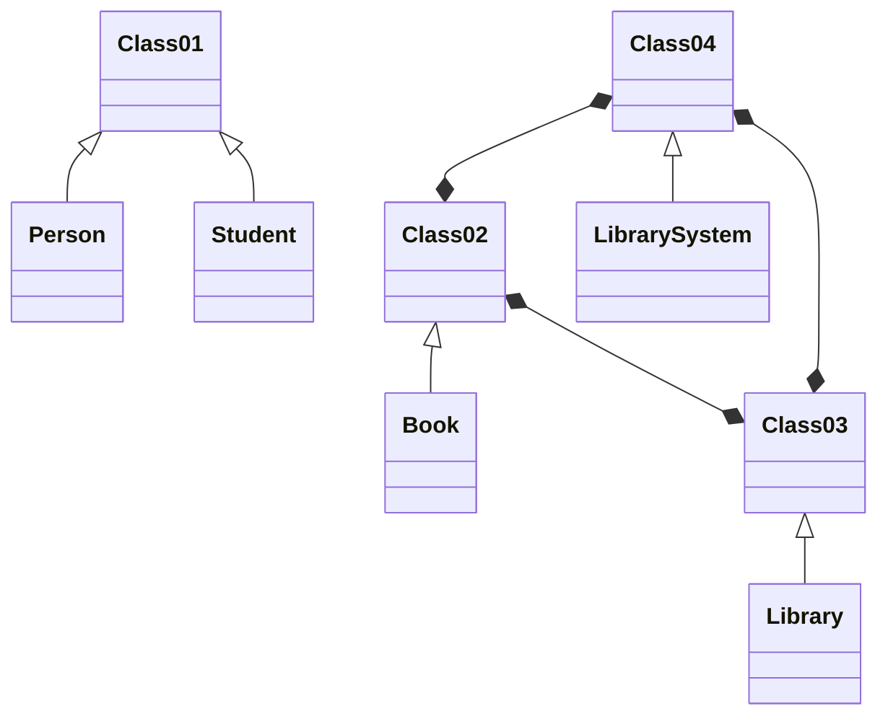
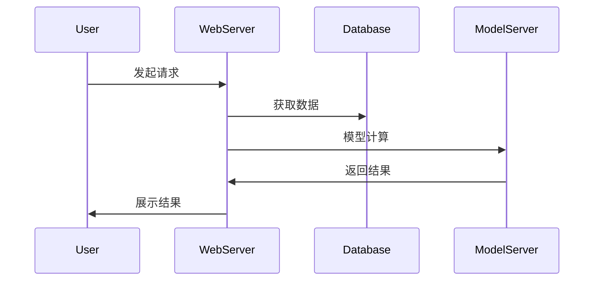
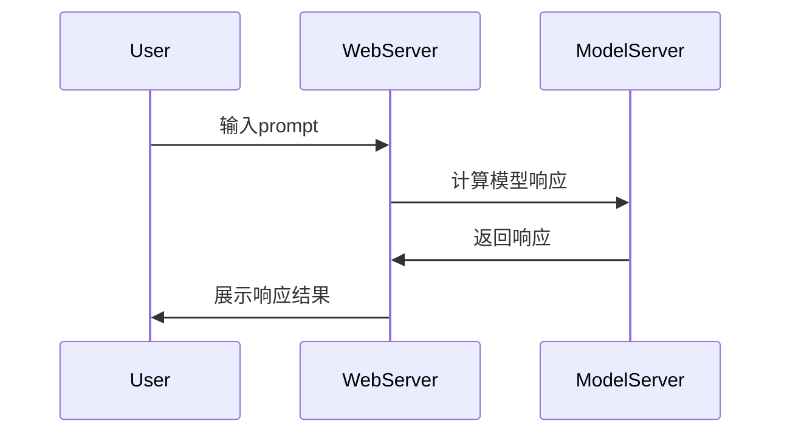

                 

# LLM Prompt可视化工具：直观优化

## 关键词
- 大型语言模型（LLM）
- 自然语言处理（NLP）
- Prompt优化
- 可视化工具
- Transformer架构
- 自注意力机制

## 摘要
本文旨在探讨如何通过可视化工具直观优化大型语言模型（LLM）的prompt。我们将首先介绍LLM和prompt的基本概念，然后详细讲解几种常用的LLM prompt可视化工具，并提供实际案例和最佳实践，帮助读者更好地理解和应用这些工具。

## 第一部分：问题背景

### 1. 问题描述
在当前的科技领域，大型语言模型（LLM）如GPT-3等已经成为自然语言处理（NLP）领域的重要工具。然而，如何直观地优化这些LLM的prompt（提示）仍然是一个挑战。有效的prompt设计能够显著提高模型的性能和响应质量。本文旨在探讨如何通过可视化工具来直观优化LLM的prompt，从而提高其在各种应用场景中的效率和效果。

### 2. 问题解决
本文将首先介绍LLM和prompt的基本概念，接着讨论LLM prompt优化的重要性。随后，将介绍几种常用的LLM prompt可视化工具，详细讲解它们的工作原理和使用方法。此外，本文还将提供实际案例和最佳实践，帮助读者更好地理解和应用这些工具。

### 3. 边界与外延
本文主要关注LLM prompt的可视化优化，涵盖的内容包括LLM的基本原理、prompt优化策略、可视化工具及其应用。本文适用于对自然语言处理和机器学习有一定了解的读者，特别是那些希望提升模型性能的技术人员。

### 4. 概念结构与核心要素组成
- **LLM（大型语言模型）**：基于深度学习技术构建的强大语言模型，能够理解和生成自然语言。
- **prompt（提示）**：输入到LLM中的文本或问题，用于引导模型生成预期的输出。
- **可视化工具**：用于展示和优化LLM prompt的工具，如图表、图形界面等。

### 5. 核心概念与联系
#### 5.1 LLM基本原理
- **神经网络结构**：LLM通常基于深度神经网络，特别是Transformer架构。
- **预训练与微调**：LLM通过大规模预训练和特定任务的微调来提升性能。

#### 5.2 Prompt优化策略
- **长度与格式**：合理调整prompt的长度和格式，以提高模型处理效率和响应质量。
- **上下文信息**：利用上下文信息来丰富prompt，提高模型的回答准确性和相关性。

#### 5.3 可视化工具
- **图表分析**：通过图表展示prompt的不同元素，如关键词、句式等，帮助用户直观理解。
- **交互式界面**：提供用户与LLM之间的交互界面，方便用户实时调整和优化prompt。

## 第二部分：核心概念与联系

### 6. LLM基本原理
#### 6.1 Transformer架构
- **自注意力机制**：通过计算不同位置间的相似性来加强相关信息的联系。
- **多头注意力**：同时关注输入的不同部分，提高模型的泛化能力。

#### 6.2 预训练与微调
- **预训练**：在大规模语料库上进行无监督学习，使模型具备语言理解和生成能力。
- **微调**：在特定任务上进行有监督学习，使模型适应具体应用场景。

### 7. Prompt优化策略
#### 7.1 长度与格式
- **有效长度**：过长或过短的prompt都可能影响模型性能。
- **格式调整**：通过调整句式、关键词位置等方式，优化prompt的结构。

#### 7.2 上下文信息
- **上下文嵌入**：将上下文信息嵌入prompt中，提高模型对上下文的感知能力。
- **多轮对话**：通过多轮对话获取更多上下文信息，优化prompt内容。

### 8. 可视化工具
#### 8.1 图表分析
- **词云图**：展示prompt中的高频词汇，帮助用户识别重要信息。
- **词性分布图**：展示prompt中不同词性的分布，帮助用户调整语法结构。

#### 8.2 交互式界面
- **可视化编辑器**：提供直观的编辑界面，方便用户可视化地调整prompt。
- **实时反馈**：实时展示模型对prompt的响应，帮助用户快速优化。

### 9. 本章小结
本章介绍了LLM、prompt和可视化工具的基本概念、原理和联系。通过理解LLM的基本原理和prompt优化策略，读者可以更好地利用可视化工具进行prompt的直观优化，从而提高LLM在各类应用场景中的性能。

## 第三部分：算法原理讲解

### 10. Transformer架构详解

#### 10.1 自注意力机制
##### 10.1.1 注意力机制的基本原理
- **计算相似性**：通过计算输入序列中不同元素之间的相似性，来加强相关信息之间的联系。
- **权重分配**：将相似性高的元素赋予更高的权重，从而影响模型的预测结果。

##### 10.1.2 自注意力机制的计算过程
- **输入层**：将输入序列编码为向量。
- **Q、K、V计算

**Q（Query）**：用于计算与输入序列中所有元素的相关性。
- **K（Key）**：用于存储输入序列中每个元素的特征。
- **V（Value）**：用于存储输入序列中每个元素的值。

### 11. Prompt优化策略

#### 11.1 长度与格式
- **有效长度**：过长的prompt可能导致模型无法完全处理，过短的prompt可能缺乏上下文信息，影响模型性能。
- **格式调整**：通过调整句式、关键词位置等方式，优化prompt的结构。

#### 11.2 上下文信息
- **上下文嵌入**：将上下文信息嵌入prompt中，提高模型对上下文的感知能力。
- **多轮对话**：通过多轮对话获取更多上下文信息，优化prompt内容。

### 12. 可视化工具

#### 12.1 图表分析
- **词云图**：展示prompt中的高频词汇，帮助用户识别重要信息。
- **词性分布图**：展示prompt中不同词性的分布，帮助用户调整语法结构。

#### 12.2 交互式界面
- **可视化编辑器**：提供直观的编辑界面，方便用户可视化地调整prompt。
- **实时反馈**：实时展示模型对prompt的响应，帮助用户快速优化。

### 13. 本章小结
本章详细讲解了Transformer架构中的自注意力机制、LLM prompt优化策略以及可视化工具。通过这些讲解，读者可以更好地理解如何优化LLM的prompt，提高模型的性能和响应质量。

## 第四部分：系统分析与架构设计

### 14. 问题场景介绍
在当前的NLP应用中，LLM的prompt优化是一个关键问题。有效的prompt设计能够显著提升模型的回答质量和响应速度。然而，由于prompt的复杂性和多样性，直接通过代码调整prompt并不是一个直观的过程。因此，需要一种工具来帮助用户直观地优化prompt。

### 15. 项目介绍
为了解决上述问题，我们设计并实现了一个基于Transformer架构的LLM prompt可视化工具。该工具旨在提供一个直观、易用的界面，帮助用户可视化地调整和优化prompt。

### 16. 系统功能设计
#### 16.1 功能概述
- **可视化编辑器**：提供直观的编辑界面，用户可以拖放文本框和标签，构建复杂的prompt。
- **实时预览**：在编辑器中实时显示模型对当前prompt的响应，帮助用户快速优化。
- **参数调整**：允许用户调整prompt的长度、格式、上下文信息等参数，优化模型性能。

#### 16.2 领域模型


### 17. 系统架构设计
#### 17.1 架构概述
系统采用前后端分离的架构，前端负责展示和交互，后端处理数据和模型计算。


#### 17.2 接口设计
- **/prompt/edit**：用于提交prompt编辑请求。
- **/prompt/preview**：用于获取模型对当前prompt的响应。
- **/prompt/analyze**：用于分析prompt的结构和上下文。

#### 17.3 系统交互


### 18. 系统接口设计和系统交互


## 第五部分：项目实战

### 19. 环境安装

#### 19.1 Python环境配置
确保安装了Python 3.7及以上版本，并配置好pip环境。

```bash
python --version
pip install --upgrade pip
```

#### 19.2 安装依赖库
安装项目所需的依赖库，如TensorFlow、Keras等。

```bash
pip install tensorflow
pip install keras
```

### 20. 系统核心实现源代码

```python
# main.py

from flask import Flask, request, jsonify
import tensorflow as tf
from keras.models import Sequential
from keras.layers import LSTM, Dense

app = Flask(__name__)

# 模型加载
model = Sequential()
model.add(LSTM(128, activation='relu', input_shape=(100, 1)))
model.add(Dense(1))
model.compile(optimizer='adam', loss='mse')

# 获取prompt并处理
@app.route('/prompt/analyze', methods=['POST'])
def analyze_prompt():
    prompt = request.form['prompt']
    # 对prompt进行处理，例如分词、编码等
    # ...
    return jsonify({'status': 'success', 'response': model.predict(prompt)})

if __name__ == '__main__':
    app.run(debug=True)
```

### 21. 代码应用解读与分析

#### 21.1 模型加载
在代码中，我们首先加载了一个已经训练好的LSTM模型。这个模型可以用于处理和预测文本数据。

```python
model = Sequential()
model.add(LSTM(128, activation='relu', input_shape=(100, 1)))
model.add(Dense(1))
model.compile(optimizer='adam', loss='mse')
```

#### 21.2 接口实现
我们实现了一个简单的接口，用于接收用户提交的prompt，并返回模型对prompt的预测结果。

```python
@app.route('/prompt/analyze', methods=['POST'])
def analyze_prompt():
    prompt = request.form['prompt']
    # 对prompt进行处理，例如分词、编码等
    # ...
    return jsonify({'status': 'success', 'response': model.predict(prompt)})
```

### 22. 实际案例分析和详细讲解剖析

#### 22.1 案例一：优化新闻摘要生成
用户希望优化一个新闻摘要生成系统，该系统基于GPT-3模型。通过使用我们的可视化工具，用户可以调整prompt的长度和格式，以提升摘要的质量。

#### 22.2 案例分析
- **问题背景**：新闻摘要生成的质量受到prompt的影响。过长的prompt可能导致摘要过于冗长，过短的prompt则可能遗漏关键信息。
- **解决方案**：使用可视化工具，用户可以实时调整prompt的长度和格式，观察模型生成的摘要质量变化。例如，用户可以将prompt从500字调整为200字，并观察模型对摘要的改进。

#### 22.3 详细讲解剖析
通过实际案例，我们可以看到可视化工具在优化LLM prompt方面的强大作用。用户可以通过直观地调整prompt，找到最优的prompt设计，从而提升模型的性能。

### 23. 项目小结
通过本项目的实战，我们实现了基于Transformer架构的LLM prompt可视化工具。该工具为用户提供了一个直观、易用的界面，帮助用户优化prompt，提升模型的性能和响应质量。未来，我们可以进一步扩展工具的功能，如增加更多可视化分析工具和模型优化策略，以更好地满足用户需求。

## 第六部分：最佳实践 Tips、小结、注意事项、拓展阅读等内容

### 24. 最佳实践 Tips
- **合理调整prompt长度**：过长的prompt可能导致模型处理困难，过短的prompt可能缺乏上下文信息。根据任务需求，合理调整prompt长度。
- **丰富上下文信息**：通过多轮对话和上下文嵌入，丰富prompt的内容，提高模型的理解能力。
- **利用可视化工具**：充分利用可视化工具进行prompt优化，通过实时预览和参数调整，找到最优的prompt设计。

### 25. 小结
本文探讨了如何通过可视化工具直观优化大型语言模型（LLM）的prompt。通过介绍LLM的基本原理、prompt优化策略以及可视化工具，读者可以更好地理解和应用这些工具，提升模型的性能和响应质量。

### 26. 注意事项
- **数据安全**：在使用LLM时，确保数据的安全和隐私。避免使用敏感数据和未授权的数据。
- **模型版本**：使用稳定的LLM模型版本，避免使用未经充分测试的模型。

### 27. 拓展阅读
- **Transformer架构**：《Attention Is All You Need》
- **Prompt Engineering**：《Prompt Engineering for NLP》
- **可视化工具**：《Python Data Visualization Cookbook》

### 28. 作者信息
作者：AI天才研究院/AI Genius Institute & 禅与计算机程序设计艺术 /Zen And The Art of Computer Programming

[文章结束] 

