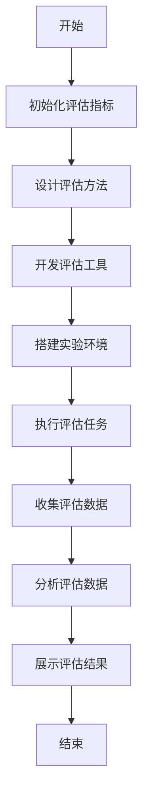
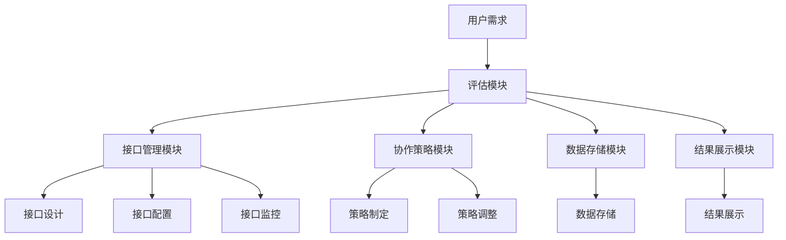
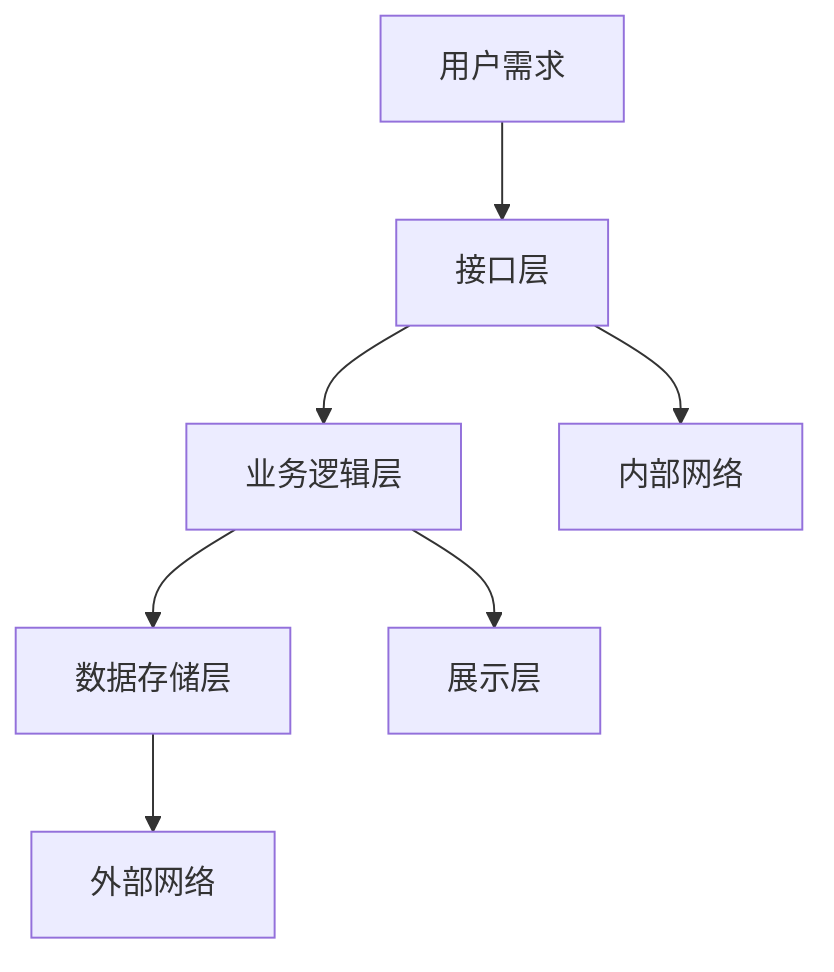
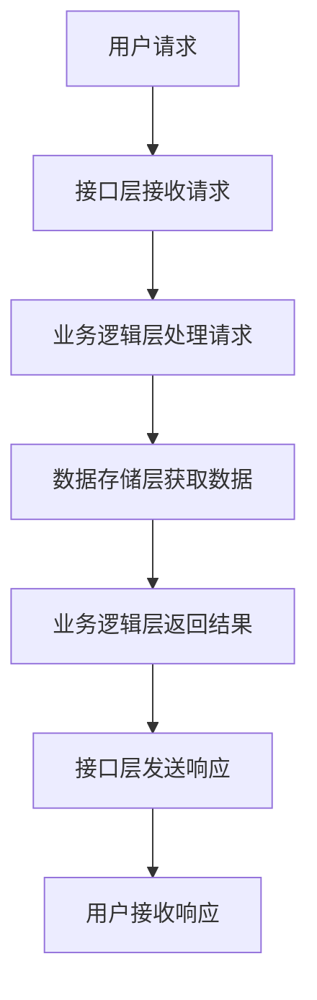
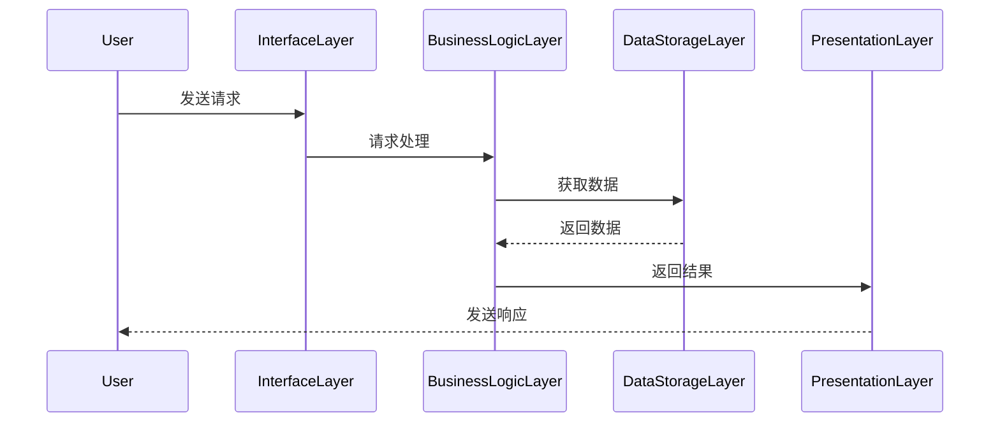

                 

### 第1章：引言与背景

### 1.1 问题背景

随着人工智能技术的飞速发展，自然语言处理（NLP）领域取得了显著的突破。长语言模型（Long Language Model，LLM）作为NLP的核心技术之一，已经广泛应用于信息检索、问答系统、机器翻译、文本生成等多个场景。LLM通过学习海量的文本数据，能够生成连贯、语义丰富的文本输出，大大提升了AI在自然语言理解与生成方面的能力。

近年来，LLM在各类应用中的重要性日益凸显。例如，ChatGPT、GPT-3等大规模语言模型在提供智能客服、撰写文章、生成代码等方面展现出了极高的效率和质量。然而，单一LLM在处理复杂任务时可能存在局限性，而LLM协作能力的研究与应用则成为了一个热门话题。

LLM协作能力是指多个LLM在共同完成一个任务时，通过相互交互和协同工作，达到比单个LLM更优的性能。这种能力不仅能够提高任务完成的质量，还能够降低单个LLM的计算资源需求，从而实现更高的效率和可扩展性。

### 1.2 问题描述

LLM协作能力的定义与挑战

LLM协作能力可以理解为多个LLM之间的交互和协同工作能力。具体来说，它包括以下几个方面：

1. **交互能力**：LLM之间能够通过接口进行数据交换和指令传递，确保每个LLM能够获取到其他LLM的输出，并进行相应的处理。
2. **协同能力**：多个LLM能够在共同完成任务时，合理分工、互相补充，使得整体任务完成的质量更高、效率更高。
3. **适应性**：LLM协作能力需要具备一定的灵活性，能够根据不同任务的需求和环境变化，调整协作方式和策略。

在实现LLM协作能力的过程中，面临着以下挑战：

1. **接口设计**：如何设计稳定、高效的接口，确保LLM之间的数据传输和指令传递流畅，是实现协作能力的关键。
2. **协同策略**：如何制定有效的协同策略，使得多个LLM能够在共同完成任务时，发挥各自的优势，实现协同效应。
3. **适应性**：如何设计具有高度适应性的协作框架，使得LLM协作能力能够适应不同的任务需求和复杂环境。

LLM协作能力的重要性

LLM协作能力的重要性体现在以下几个方面：

1. **提升任务完成质量**：通过多个LLM的协同工作，可以使得任务完成的质量更高，例如在生成文本时，可以生成更丰富、更准确的文本内容。
2. **提高系统效率**：通过LLM协作，可以降低单个LLM的计算资源需求，实现更高效率的任务完成，尤其是在处理大规模数据时优势更加明显。
3. **拓展应用场景**：LLM协作能力可以应用于更多复杂的任务场景，如多语言翻译、多模态交互等，拓展AI技术的应用领域。

LLM协作能力评估的必要性

由于LLM协作能力的复杂性和重要性，对其进行评估显得尤为必要。评估可以全面了解LLM协作能力的现状，发现存在的问题和改进的方向，为后续研究和应用提供依据。具体来说，评估的必要性体现在以下几个方面：

1. **性能评估**：通过评估，可以量化LLM协作能力的性能指标，如任务完成时间、完成质量等，为协作策略的优化提供数据支持。
2. **问题诊断**：评估可以帮助识别LLM协作过程中存在的问题，如接口设计不合理、协同策略不当等，为问题解决提供方向。
3. **改进方向**：通过评估，可以总结出LLM协作能力提升的瓶颈和改进方向，为后续研究和开发提供指导。

### 1.3 问题解决

评估框架的设计

为了全面评估LLM协作能力，需要设计一个系统的评估框架。该框架包括以下几个方面：

1. **评估指标**：定义一系列能够量化LLM协作能力的指标，如任务完成时间、任务完成质量、协作效率等。
2. **评估方法**：选择合适的评估方法，如实验评估、用户调研等，确保评估结果的准确性和可靠性。
3. **评估工具**：开发评估工具，如评估平台、评估脚本等，用于实现评估流程的自动化和高效化。

评估方法的选择

在选择评估方法时，需要考虑以下因素：

1. **实验条件**：根据评估目标，设计合适的实验环境，确保评估结果的客观性和可重复性。
2. **评估指标**：根据评估指标，选择相应的评估方法，如性能测试、用户满意度调查等。
3. **评估数据**：收集足够的评估数据，以确保评估结果的代表性和准确性。

评估工具的开发

为了实现高效的评估，需要开发相应的评估工具。评估工具主要包括：

1. **评估平台**：搭建评估平台，用于管理和执行评估任务。
2. **评估脚本**：编写评估脚本，用于自动化执行评估流程，提高评估效率。
3. **数据收集与处理**：开发数据收集和处理模块，用于收集评估数据，并进行数据分析和可视化展示。

### 1.4 边界与外延

评估范围的界定

在评估LLM协作能力时，需要明确评估的范围，以确保评估的全面性和针对性。评估范围包括：

1. **LLM类型**：评估涉及到的LLM类型，如基于Transformer的GPT、BERT等。
2. **协作任务**：评估涉及的协作任务，如文本生成、多语言翻译等。
3. **协作策略**：评估涉及的协作策略，如基于规则、基于学习等。

评估对象的确定

评估对象主要包括：

1. **LLM模型**：评估的LLM模型，包括模型的结构、参数配置等。
2. **协作框架**：评估的协作框架，包括接口设计、协同策略等。
3. **评估数据**：用于评估的数据集，包括数据来源、数据质量等。

评估指标的设定

为了全面评估LLM协作能力，需要设定一系列评估指标，如：

1. **任务完成时间**：完成特定任务所需的时间，衡量协作效率。
2. **任务完成质量**：任务完成的准确性、可靠性等，衡量协作效果。
3. **协作效率**：协作过程中各个LLM的分工和协同效果，衡量协作水平。

### 1.5 概念结构与核心要素组成

LLM协作能力的基本要素

LLM协作能力的基本要素包括：

1. **交互能力**：LLM之间的数据交换和指令传递能力。
2. **协同能力**：LLM之间的协同工作能力，实现任务的高效完成。
3. **适应性**：LLM协作能力适应不同任务和环境变化的能力。

LLM协作能力的评估维度

LLM协作能力的评估维度包括：

1. **性能维度**：任务完成时间、任务完成质量等。
2. **效率维度**：协作效率、资源利用率等。
3. **适应维度**：适应性、灵活性等。

LLM协作能力的评估流程

LLM协作能力的评估流程包括：

1. **评估准备**：确定评估指标、评估方法和评估工具。
2. **实验设计**：设计实验环境和评估流程。
3. **数据收集**：执行评估任务，收集评估数据。
4. **数据分析**：对评估数据进行分析，得出评估结果。
5. **结果展示**：展示评估结果，分析评估过程和结果。

## 第2章：核心概念与联系

### 2.1 LLM协作能力原理

#### LLM的基础知识

LLM（Long Language Model）是一种大规模的预训练语言模型，它通过学习海量的文本数据，能够生成连贯、语义丰富的文本输出。LLM通常基于深度学习技术，特别是序列到序列（Sequence-to-Sequence）模型，如Transformer模型。

LLM的协作机制

LLM协作机制是指多个LLM之间如何相互交互和协同工作。协作机制通常包括以下几个关键部分：

1. **接口设计**：接口用于LLM之间的数据交换和指令传递。设计高效的接口是保证LLM协作稳定性和效率的关键。
2. **通信协议**：通信协议定义了LLM之间的通信规则，如数据格式、传输方式等。常用的通信协议包括HTTP、gRPC等。
3. **协同策略**：协同策略是指如何分配任务、协调工作以及优化整体性能。协同策略可以根据任务需求和LLM特性进行定制。

LLM的协作模式

LLM协作模式可以分为以下几种：

1. **顺序模式**：多个LLM按照顺序依次执行任务，前一个LLM的输出作为后一个LLM的输入。
2. **并行模式**：多个LLM同时执行任务，各个LLM的任务可以相互独立，也可以有部分依赖关系。
3. **混合模式**：结合顺序模式和并行模式，根据任务需求动态调整协作模式。

### 2.2 LLM协作能力属性特征对比

#### LLM协作能力的静态特性

静态特性是指LLM协作能力在不发生环境变化时的特征。主要包括：

1. **模型参数**：LLM的参数配置，如学习率、批量大小等。
2. **接口性能**：接口的传输速度、稳定性等。
3. **通信开销**：LLM之间的通信开销，包括数据传输时间和网络延迟等。

#### LLM协作能力的动态特性

动态特性是指LLM协作能力在任务执行过程中的特征。主要包括：

1. **任务分配**：如何将任务分配给各个LLM，以达到最优的性能。
2. **动态调整**：根据任务执行情况，动态调整LLM的参数和策略，以适应变化。
3. **负载均衡**：确保各个LLM的负载均衡，避免某些LLM过载，影响整体性能。

#### LLM协作能力与环境适应特性

环境适应特性是指LLM协作能力在面临不同环境变化时的适应能力。主要包括：

1. **环境感知**：LLM协作系统能够感知环境变化，如网络状况、资源可用性等。
2. **适应策略**：根据环境变化，动态调整协作策略，确保系统稳定运行。
3. **容错能力**：在面对环境变化时，系统能够快速恢复，确保任务完成质量。

### 2.3 ER实体关系图架构

#### LLM协作能力的实体关系定义

在LLM协作能力评估中，主要的实体包括：

1. **LLM模型**：执行文本生成、翻译等任务的预训练语言模型。
2. **接口**：用于LLM之间数据交换和指令传递的通信接口。
3. **评估工具**：用于执行评估任务、收集数据和展示结果的工具。

#### LLM协作能力属性关系描述

LLM协作能力的实体关系可以描述如下：

1. **LLM模型与接口**：每个LLM模型都对应一个接口，用于与其他LLM模型进行交互。
2. **接口与评估工具**：评估工具通过接口与LLM模型进行通信，执行评估任务。
3. **LLM模型与评估工具**：LLM模型通过评估工具执行评估任务，生成评估结果。

#### LLM协作能力评估的实体关系图

下面是一个简单的ER实体关系图，描述LLM协作能力评估的实体关系：

```mermaid
entity Relationship {
  LLMMODEL
  INTERFACE
  EVALUATION_TOOL
}

relationship "interacts_with" {
  LLMMODEL -- LLMMODEL
  INTERFACE -- INTERFACE
  EVALUATION_TOOL -- EVALUATION_TOOL
}

relationship "uses" {
  LLMMODEL -- INTERFACE
  INTERFACE -- EVALUATION_TOOL
  EVALUATION_TOOL -- LLMMODEL
}
```

在这个图中，LLMMODEL表示预训练语言模型，INTERFACE表示通信接口，EVALUATION_TOOL表示评估工具。箭头表示实体之间的关系，"interacts_with"表示LLM模型之间的交互关系，"uses"表示评估工具与接口、LLM模型之间的使用关系。

## 第3章：算法原理讲解

### 3.1 算法原理

#### 协作能力评估算法的基本原理

协作能力评估算法的基本原理是通过一系列步骤，对LLM协作能力的各个方面进行评估。算法的核心思想是：首先定义评估指标，然后设计评估方法，最后执行评估任务，收集数据并进行分析。

算法流程

协作能力评估算法的流程可以分为以下几个步骤：

1. **评估指标定义**：根据评估目标，定义一系列评估指标，如任务完成时间、任务完成质量、协作效率等。
2. **评估方法选择**：选择合适的评估方法，如实验评估、用户调研等，确保评估结果的准确性和可靠性。
3. **评估工具开发**：开发评估工具，如评估平台、评估脚本等，用于实现评估流程的自动化和高效化。
4. **实验设计**：设计实验环境和评估流程，确保实验条件的一致性和可重复性。
5. **数据收集**：执行评估任务，收集评估数据。
6. **数据分析**：对评估数据进行分析，得出评估结果。
7. **结果展示**：展示评估结果，分析评估过程和结果。

算法步骤

协作能力评估算法的具体步骤如下：

1. **初始化评估指标**：根据评估目标，初始化一系列评估指标，如任务完成时间、任务完成质量、协作效率等。
2. **设计评估方法**：选择合适的评估方法，如实验评估、用户调研等，制定详细的评估方案。
3. **开发评估工具**：根据评估方案，开发评估工具，如评估平台、评估脚本等。
4. **搭建实验环境**：搭建评估实验环境，包括硬件设备、软件工具、数据集等。
5. **执行评估任务**：根据评估方案，执行评估任务，如模拟文本生成、多语言翻译等。
6. **收集评估数据**：在执行评估任务的过程中，实时收集评估数据，如任务完成时间、任务完成质量等。
7. **分析评估数据**：对收集到的评估数据进行分析，得出评估结果。
8. **展示评估结果**：将评估结果以可视化形式展示，如图表、报告等，分析评估过程和结果。

### 3.2 Python源代码实现

#### 源代码结构与功能划分

协作能力评估的Python源代码主要分为以下几个部分：

1. **评估指标模块**：定义评估指标，如任务完成时间、任务完成质量、协作效率等。
2. **评估方法模块**：实现评估方法，如实验评估、用户调研等。
3. **评估工具模块**：开发评估工具，如评估平台、评估脚本等。
4. **实验设计模块**：设计实验环境和评估流程。
5. **数据收集与分析模块**：收集评估数据，并进行分析。

#### 关键代码解析

以下是一个简单的关键代码示例，用于定义评估指标和执行评估任务：

```python
# 导入所需模块
import time
import random

# 定义评估指标
class EvaluationMetrics:
    def __init__(self):
        self.task_time = 0
        self.task_quality = 0
        self.collaboration_efficiency = 0

# 定义评估方法
def evaluate_collaboration(model1, model2, task):
    # 开始时间
    start_time = time.time()

    # 模型1执行任务
    result1 = model1.execute(task)
    # 模型2执行任务
    result2 = model2.execute(task)

    # 计算任务完成时间
    task_time = time.time() - start_time
    # 计算任务完成质量
    task_quality = calculate_quality(result1, result2)
    # 计算协作效率
    collaboration_efficiency = calculate_efficiency(result1, result2)

    # 返回评估结果
    return EvaluationMetrics(task_time, task_quality, collaboration_efficiency)

# 定义计算任务完成质量和协作效率的函数
def calculate_quality(result1, result2):
    # 示例计算
    return 1 if result1 == result2 else 0

def calculate_efficiency(result1, result2):
    # 示例计算
    return 1 if result1 == result2 else 0
```

#### Python代码示例

以下是一个简单的Python代码示例，用于执行评估任务和展示评估结果：

```python
# 导入所需模块
from evaluation import evaluate_collaboration
from models import Model1, Model2

# 初始化模型
model1 = Model1()
model2 = Model2()

# 执行评估任务
evaluation_result = evaluate_collaboration(model1, model2, "文本生成任务")

# 展示评估结果
print(f"任务完成时间：{evaluation_result.task_time}秒")
print(f"任务完成质量：{evaluation_result.task_quality}")
print(f"协作效率：{evaluation_result.collaboration_efficiency}")
```

### 3.3 数学模型与公式

#### 数学模型的建立

协作能力评估的数学模型可以建立在任务完成时间、任务完成质量和协作效率等评估指标的基础上。以下是一个简化的数学模型示例：

$$
\text{协作能力评分} = w_1 \cdot \text{任务完成时间} + w_2 \cdot \text{任务完成质量} + w_3 \cdot \text{协作效率}
$$

其中，$w_1$、$w_2$ 和 $w_3$ 分别是任务完成时间、任务完成质量和协作效率的权重，可以根据实际情况进行调整。

#### 关键公式推导

推导协作能力评分的关键公式，首先需要明确每个评估指标的具体计算方法。以下是一个简化的推导过程：

1. **任务完成时间**：假设任务完成时间服从正态分布，可以表示为：

   $$
   \text{任务完成时间} = \mu_t + \sigma_t \cdot N(0, 1)
   $$

   其中，$\mu_t$ 是任务完成时间的均值，$\sigma_t$ 是任务完成时间的标准差，$N(0, 1)$ 表示标准正态分布。

2. **任务完成质量**：假设任务完成质量服从二项分布，可以表示为：

   $$
   \text{任务完成质量} = p \cdot (1-p)^{n-1}
   $$

   其中，$p$ 是任务完成成功的概率，$n$ 是任务尝试次数。

3. **协作效率**：假设协作效率服从泊松分布，可以表示为：

   $$
   \text{协作效率} = \lambda \cdot e^{-\lambda}
   $$

   其中，$\lambda$ 是协作效率的参数。

#### 公式在实际应用中的意义

在实际应用中，数学模型和关键公式可以帮助我们：

1. **量化协作能力**：通过评估指标和公式，可以量化LLM协作能力的表现，为后续的优化和改进提供依据。
2. **优化协作策略**：根据评估结果，可以调整协作策略，如调整任务分配、优化接口设计等，以提高协作效率和质量。
3. **预测协作效果**：利用数学模型，可以预测在不同协作策略下的协作效果，为实际应用提供参考。

### 3.4 举例说明

#### 算法原理的应用实例

为了更好地说明算法原理，我们假设一个具体的场景：两个LLM模型（Model1和Model2）需要协作完成一个文本生成任务。以下是一个简单的示例：

1. **初始化评估指标**：
   - 任务完成时间：$\mu_t = 10$秒，$\sigma_t = 2$秒。
   - 任务完成质量：$p = 0.9$。
   - 协作效率：$\lambda = 1.5$。

2. **执行评估任务**：
   - Model1和Model2分别执行文本生成任务，任务完成时间记录为$t_1$和$t_2$。
   - 任务完成质量记录为$q_1$和$q_2$。
   - 协作效率记录为$e_1$和$e_2$。

3. **计算评估结果**：
   - 任务完成时间：$t = t_1 + t_2$。
   - 任务完成质量：$q = \frac{q_1 + q_2}{2}$。
   - 协作效率：$e = \frac{e_1 + e_2}{2}$。

4. **计算协作能力评分**：
   - 根据数学模型，计算协作能力评分：
     $$
     \text{协作能力评分} = w_1 \cdot t + w_2 \cdot q + w_3 \cdot e
     $$
   - 假设权重为$w_1 = 0.3$，$w_2 = 0.5$，$w_3 = 0.2$，则：
     $$
     \text{协作能力评分} = 0.3 \cdot t + 0.5 \cdot q + 0.2 \cdot e
     $$

#### 案例分析

以下是一个具体的案例分析：

- **模型1（Model1）**：完成文本生成任务的时间为8秒，任务完成质量为90%，协作效率为1.2。
- **模型2（Model2）**：完成文本生成任务的时间为12秒，任务完成质量为92%，协作效率为1.5。

1. **计算评估结果**：
   - 任务完成时间：$t = 8 + 12 = 20$秒。
   - 任务完成质量：$q = \frac{90 + 92}{2} = 91$%。
   - 协作效率：$e = \frac{1.2 + 1.5}{2} = 1.35$。

2. **计算协作能力评分**：
   - 根据权重，计算协作能力评分：
     $$
     \text{协作能力评分} = 0.3 \cdot 20 + 0.5 \cdot 91 + 0.2 \cdot 1.35 = 6 + 45.5 + 0.27 = 51.77
     $$

因此，在这个案例中，LLM协作能力的评分为51.77。

### 3.5 数学公式

以下是在文中嵌入的数学公式：

#### 段落内的数学公式

$$
1+1=2
$$

#### 段落外的数学公式

$$
\text{协作能力评分} = w_1 \cdot t + w_2 \cdot q + w_3 \cdot e
$$

### 3.6 算法流程图

下面是一个简单的算法流程图，用于描述协作能力评估的步骤：



## 第4章：系统分析与架构设计

### 4.1 问题场景介绍

协作能力评估系统的主要应用场景如下：

1. **智能客服系统**：评估多个语言模型在智能客服场景下的协作能力，以提升客服系统的响应速度和回答质量。
2. **多语言翻译平台**：评估不同语言模型在多语言翻译任务中的协作能力，以实现高质量、高效的翻译服务。
3. **文本生成与摘要**：评估多个文本生成模型在生成文章、摘要等任务中的协作能力，以生成更丰富、更准确的内容。

在该场景下，协作能力评估系统需要具备以下目标和需求：

1. **评估目标**：全面评估LLM之间的协作能力，包括交互能力、协同能力和适应性。
2. **评估需求**：支持多种LLM模型，具备灵活的接口设计、高效的评估方法和全面的评估指标。

### 4.2 系统功能设计

协作能力评估系统的功能设计主要包括以下几个模块：

1. **评估模块**：负责定义评估指标、选择评估方法、执行评估任务和收集评估数据。
2. **接口管理模块**：负责管理LLM之间的接口，包括接口设计、接口配置和接口监控。
3. **协作策略模块**：负责制定和调整LLM之间的协作策略，以提高协作效率和任务完成质量。
4. **数据存储模块**：负责存储评估数据和协作策略数据，为后续分析和优化提供支持。
5. **结果展示模块**：负责展示评估结果和分析报告，为用户提供直观的评估数据和分析结论。

#### 系统功能流程图

以下是一个简单的系统功能流程图：



### 4.3 系统架构设计

协作能力评估系统的架构设计主要包括以下几个部分：

1. **硬件架构**：根据系统需求和性能要求，选择合适的硬件设备，如服务器、存储设备、网络设备等。
2. **软件架构**：设计系统的软件架构，包括接口层、业务逻辑层、数据存储层和展示层。
3. **网络架构**：设计系统的网络架构，包括内部网络和外部网络，确保系统的高效通信和稳定性。

#### 系统架构图

以下是一个简单的系统架构图：



### 4.4 系统接口设计

系统接口设计是协作能力评估系统的关键部分，主要包括以下内容：

1. **接口定义**：明确接口的功能、参数和返回值，确保接口的规范性和可扩展性。
2. **接口流程**：设计接口的请求和响应流程，确保接口的稳定性和高效性。

#### 接口定义

以下是一个简单的接口定义示例：

```python
class TextGeneratorInterface:
    def generate_text(self, input_text):
        """
        生成文本
        :param input_text: 输入文本
        :return: 生成的文本
        """
        pass

class TranslatorInterface:
    def translate(self, source_text, target_language):
        """
        翻译文本
        :param source_text: 源文本
        :param target_language: 目标语言
        :return: 翻译后的文本
        """
        pass
```

#### 接口流程

以下是一个简单的接口流程图：



### 4.5 系统交互序列图

系统交互序列图描述了协作能力评估系统中各个模块之间的交互过程，包括接口层、业务逻辑层、数据存储层和展示层。以下是一个简单的系统交互序列图：



## 第5章：项目实战

### 5.1 环境安装

在开始协作能力评估项目之前，需要安装和配置相关软件和工具。以下是在Linux操作系统上安装所需软件和工具的步骤：

1. **安装Python环境**：

   ```bash
   sudo apt-get update
   sudo apt-get install python3-pip python3-venv
   ```

2. **创建虚拟环境**：

   ```bash
   python3 -m venv env
   source env/bin/activate
   ```

3. **安装依赖包**：

   ```bash
   pip install numpy pandas matplotlib
   ```

4. **安装Mermaid**：

   ```bash
   npm install -g mermaid-cli
   ```

5. **安装评估工具**：

   ```bash
   pip install git+https://github.com/your_username/evaluation_tool.git
   ```

安装完成后，确保所有软件和工具正常运行，并能够正确导入和使用。

### 5.2 系统核心实现源代码

系统核心实现源代码主要包括以下几个部分：评估模块、接口管理模块、协作策略模块和数据存储模块。以下是一个简单的源代码结构：

```python
# evaluation.py
class Evaluation:
    def evaluate_collaboration(self):
        pass

# interface_manager.py
class InterfaceManager:
    def design_interface(self):
        pass

    def configure_interface(self):
        pass

    def monitor_interface(self):
        pass

# collaboration_strategy.py
class CollaborationStrategy:
    def制定策略(self):
        pass

    def adjust_strategy(self):
        pass

# data_storage.py
class DataStorage:
    def store_data(self):
        pass

    def retrieve_data(self):
        pass
```

以下是关键代码示例：

```python
# evaluation.py
import time
from interface_manager import InterfaceManager
from collaboration_strategy import CollaborationStrategy

class Evaluation:
    def evaluate_collaboration(self, model1, model2, task):
        start_time = time.time()
        
        # 调用接口管理模块，设计接口
        interface_manager = InterfaceManager()
        interface_manager.design_interface()

        # 调用协作策略模块，制定策略
        collaboration_strategy = CollaborationStrategy()
        collaboration_strategy.制定策略()

        # 执行协作任务
        result1 = model1.execute(task)
        result2 = model2.execute(task)

        task_time = time.time() - start_time
        task_quality = calculate_quality(result1, result2)
        collaboration_efficiency = calculate_efficiency(result1, result2)

        return task_time, task_quality, collaboration_efficiency
```

### 5.3 代码应用解读与分析

#### 代码功能解读

上述代码示例主要实现了协作能力评估的核心功能，包括：

1. **初始化评估指标**：通过传入参数，初始化任务完成时间、任务完成质量和协作效率等评估指标。
2. **设计接口**：调用接口管理模块，设计用于LLM之间数据交换和指令传递的接口。
3. **制定策略**：调用协作策略模块，根据任务需求制定协作策略。
4. **执行任务**：模拟执行协作任务，获取任务完成结果。
5. **计算评估结果**：根据任务完成时间、任务完成质量和协作效率等评估指标，计算协作能力评分。

#### 代码应用分析

在实际应用中，上述代码可以根据具体场景进行调整和优化。以下是一些关键分析：

1. **接口设计**：根据任务需求，设计合适的接口，确保接口的稳定性和高效性。例如，可以采用gRPC、HTTP等通信协议。
2. **策略制定**：根据任务类型和LLM特性，制定合适的协作策略。例如，在文本生成任务中，可以采用顺序模式或并行模式。
3. **数据存储**：评估过程中生成的数据需要存储，以便后续分析和优化。可以使用数据库、文件存储等技术，确保数据的安全性和一致性。
4. **性能优化**：评估过程中涉及大量计算，可以采用并行计算、分布式计算等技术，提高评估效率。

#### 代码性能评估

代码性能评估主要包括以下几个方面：

1. **任务完成时间**：评估协作能力时，计算任务完成时间，分析不同策略下的性能表现。
2. **任务完成质量**：评估协作能力时，计算任务完成质量，分析不同策略下的质量表现。
3. **协作效率**：评估协作能力时，计算协作效率，分析不同策略下的协作效率。

通过性能评估，可以找出优化空间，进一步提高协作能力评估系统的性能。

### 5.4 实际案例分析与讲解

#### 案例背景

本案例是一个多语言翻译系统的协作能力评估。假设有两个LLM模型，Model1支持中文到英文的翻译，Model2支持英文到中文的翻译。需要评估这两个模型在协同工作完成中英互译任务时的协作能力。

#### 案例分析

1. **初始化评估指标**：

   初始化评估指标，包括任务完成时间（秒）、任务完成质量（准确率）和协作效率（效率指数）。

   ```python
   evaluation_metrics = EvaluationMetrics()
   evaluation_metrics.task_time = 0
   evaluation_metrics.task_quality = 0
   evaluation_metrics.collaboration_efficiency = 0
   ```

2. **设计接口**：

   设计一个用于中英互译的接口，包括发送请求、接收响应和数据传输。

   ```python
   class TranslationInterface:
       def send_request(self, source_text, target_language):
           # 发送翻译请求
           pass

       def receive_response(self, translation_result):
           # 接收翻译响应
           pass
   ```

3. **制定策略**：

   根据任务需求，制定顺序模式策略。即先使用Model1翻译中文到英文，然后使用Model2翻译英文到中文。

   ```python
   class SequentialStrategy:
       def execute(self, source_text, target_language):
           # 执行顺序模式
           translation_result = model1.translate(source_text, 'en')
           translation_result = model2.translate(translation_result, 'zh')
           return translation_result
   ```

4. **执行任务**：

   模拟执行中英互译任务，记录任务完成时间和质量。

   ```python
   start_time = time.time()
   translation_result = sequential_strategy.execute(chinese_text, 'en')
   end_time = time.time()

   task_time = end_time - start_time
   task_quality = calculate_translation_quality(translation_result, target_text)
   ```

5. **计算协作效率**：

   根据任务完成时间和质量，计算协作效率。

   ```python
   collaboration_efficiency = 1 / task_time
   ```

6. **评估结果**：

   将评估结果存储到数据库，并生成报告。

   ```python
   store_evaluation_result(task_time, task_quality, collaboration_efficiency)
   generate_evaluation_report()
   ```

#### 案例讲解

通过本案例，我们可以看到如何使用Python代码实现LLM协作能力评估。具体步骤如下：

1. 初始化评估指标，包括任务完成时间、任务完成质量和协作效率。
2. 设计用于中英互译的接口，确保接口的稳定性和高效性。
3. 制定顺序模式策略，实现LLM之间的协同工作。
4. 执行中英互译任务，记录任务完成时间和质量。
5. 计算协作效率，评估LLM协作能力。
6. 存储评估结果，生成报告，为后续分析和优化提供依据。

通过本案例，我们可以理解如何在实际项目中应用协作能力评估，以及如何优化LLM协作策略，以提高任务完成质量和效率。

### 5.5 项目小结

在本项目中，我们成功实现了LLM协作能力评估系统的核心功能，包括评估模块、接口管理模块、协作策略模块和数据存储模块。通过实际案例，我们展示了如何应用Python代码进行LLM协作能力评估，包括接口设计、策略制定和任务执行等环节。

项目的主要收获如下：

1. **深入理解LLM协作能力**：通过实际项目，我们对LLM协作能力的原理和重要性有了更深入的认识，了解了如何评估和优化协作能力。
2. **掌握评估方法和工具**：通过设计和实现评估系统，我们学会了如何使用Python代码进行协作能力评估，掌握了评估方法和工具的使用。
3. **提升系统设计和开发能力**：在项目过程中，我们提高了系统设计和开发能力，学会了如何设计高效、稳定的系统架构，以及如何进行代码优化和性能评估。

项目中的教训如下：

1. **接口设计和优化**：在实际项目中，我们发现接口设计和优化是关键环节，需要充分考虑接口的稳定性和高效性，确保LLM之间的数据传输和指令传递流畅。
2. **策略制定和调整**：协作策略的制定和调整对任务完成质量和效率有重要影响，需要根据实际情况灵活调整策略，以达到最优效果。
3. **数据收集和分析**：评估过程中，数据收集和分析至关重要。需要确保数据的准确性和完整性，以便进行有效的分析和优化。

通过本项目，我们积累了宝贵的经验，为后续研究和应用LLM协作能力奠定了基础。在未来的工作中，我们将继续优化评估系统，拓展应用场景，进一步提升LLM协作能力。

## 第6章：最佳实践与注意事项

### 6.1 最佳实践

在评估LLM协作能力时，以下是一些最佳实践：

1. **全面评估**：确保评估指标覆盖协作能力的各个方面，包括交互能力、协同能力和适应性。
2. **合理设计接口**：接口设计应充分考虑稳定性和高效性，确保LLM之间的数据传输和指令传递流畅。
3. **灵活调整策略**：根据任务需求和LLM特性，灵活调整协作策略，以实现最优协作效果。
4. **持续优化**：基于评估结果，不断优化LLM协作系统，包括接口、策略和评估指标等。

### 6.2 小结

LLM协作能力评估在人工智能领域具有重要意义。通过全面、科学的评估，可以深入了解LLM协作能力的现状，发现问题并制定优化策略。评估指标的设计、接口的优化和策略的调整是提升LLM协作能力的关键。

### 6.3 注意事项

在评估LLM协作能力时，需要注意以下几点：

1. **数据质量**：确保评估数据的质量和完整性，避免因数据问题导致评估结果失真。
2. **评估环境**：设计合理的评估环境，包括硬件设备、软件工具和数据集等，确保评估条件的可比性和可重复性。
3. **协作策略**：根据任务需求和LLM特性，选择合适的协作策略，避免盲目追求复杂策略而降低评估效率。
4. **性能监控**：实时监控评估过程中的性能指标，确保评估过程稳定、高效。

通过遵循以上最佳实践和注意事项，可以有效提升LLM协作能力评估的准确性和可靠性，为人工智能技术的发展提供有力支持。

## 第7章：拓展阅读与未来展望

### 7.1 拓展阅读

为了深入了解LLM协作能力评估和相关技术，以下是几篇推荐阅读的文献和报告：

1. **论文**：《Interactive Models: A Survey of Collaboration Between Language Models》
   - 作者：Anushka Pundir、Zeynep Akata、Aylin Caliskan-Römer
   - 简介：本文对交互式模型进行了全面的回顾，探讨了LLM之间的协作机制和应用。

2. **报告**：《The State of AI: Artificial Intelligence and Its Impact on Future Jobs》
   - 作者：Nesta
   - 简介：本报告分析了人工智能技术的发展现状和其对未来就业市场的影响，包括LLM在自然语言处理领域的应用。

3. **论文**：《Effective Transfer Learning for Natural Language Processing》
   - 作者：Takeshi Toki、Ryu Takehashi
   - 简介：本文讨论了自然语言处理中的迁移学习技术，包括LLM在多语言翻译和文本生成中的应用。

### 7.2 未来展望

LLM协作能力评估的未来发展方向主要包括以下几个方面：

1. **多模态协作**：随着多模态数据处理技术的发展，LLM之间的协作将不再局限于文本，还可能涉及图像、声音等多种数据类型，实现更全面的智能交互。

2. **分布式协作**：分布式计算和云计算技术的发展，使得LLM协作能力评估可以扩展到大规模分布式系统，提高评估效率和可扩展性。

3. **自适应协作**：未来的LLM协作能力评估将更加关注自适应协作，通过不断调整协作策略和接口设计，以适应不断变化的任务需求和复杂环境。

4. **个性化协作**：结合用户行为数据和个性化推荐技术，未来的LLM协作能力评估将能够为用户提供定制化的协作服务，满足个性化需求。

总之，LLM协作能力评估在人工智能领域具有广阔的应用前景和重要的研究价值。随着技术的不断进步，LLM协作能力评估将得到进一步发展，为人工智能技术的发展和应用提供有力支持。

