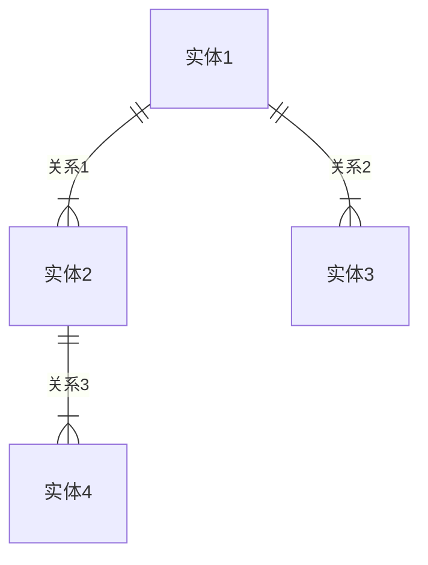
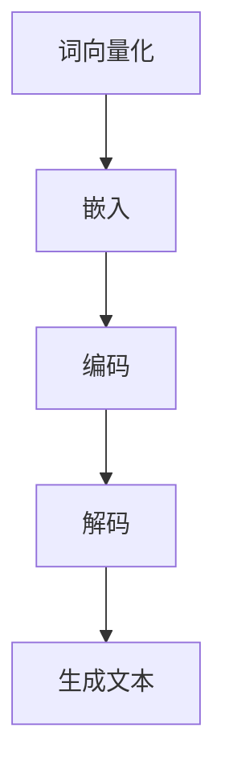
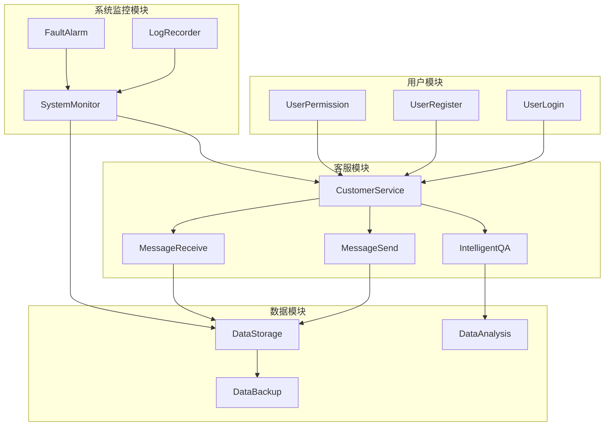
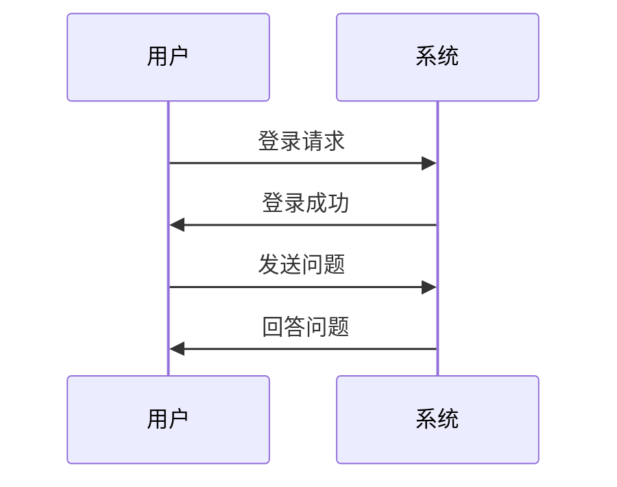
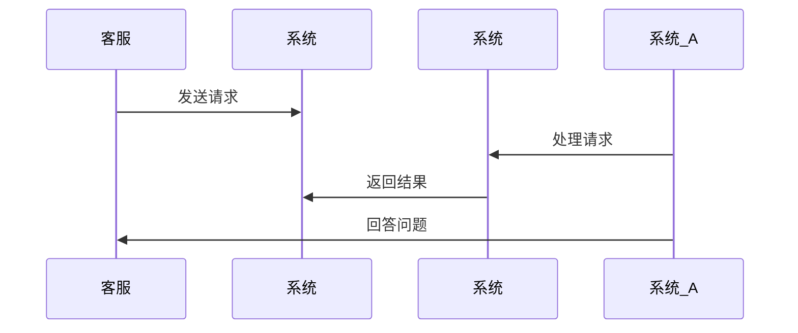

                 

### 文章标题

# LLM应用开发中的API设计原则

> 关键词：大型语言模型（LLM），API设计，应用开发，技术原则

> 摘要：本文深入探讨了大型语言模型（LLM）在应用开发中的API设计原则。通过对LLM的核心概念、算法原理、系统架构和实际项目实践的详细分析，本文旨在为开发者提供一套系统、全面的API设计指南，以优化LLM应用的开发过程和性能。

## 目录

1. **背景介绍**
   1.1 LLM概述与API设计的重要性
   1.2 API设计的基本原则
   1.3 本章小结

2. **核心概念与联系**
   2.1 LLM的核心概念
   2.2 LLM的属性特征对比表格
   2.3 LLM的ER实体关系图架构
   2.4 LLM与其他AI技术的联系
   2.5 本章小结

3. **算法原理讲解**
   3.1 LLM算法的mermaid流程图
   3.2 LLM算法的Python源代码讲解
   3.3 LLM算法的实际应用场景
   3.4 本章小结

4. **系统分析与架构设计方案**
   4.1 问题场景介绍
   4.2 系统功能设计
   4.3 系统架构设计
   4.4 系统接口设计
   4.5 系统交互mermaid序列图
   4.6 本章小结

5. **项目实战**
   5.1 环境安装
   5.2 系统核心实现
   5.3 代码应用解读与分析
   5.4 实际案例分析和详细讲解
   5.5 项目小结

6. **最佳实践与拓展**
   6.1 最佳实践
   6.2 小结
   6.3 注意事项
   6.4 拓展阅读

## 第1章：LLM概述与API设计的重要性

### 1.1 LLM的发展历程

**LLM的定义**

大型语言模型（LLM，Large Language Model）是指通过机器学习技术训练得到的，能够在大规模文本数据集上生成和预测文本的模型。LLM的核心是深度神经网络，其结构复杂，参数数量庞大，能够处理和理解复杂的语言现象。

**LLM的发展背景**

随着互联网的普及和大数据技术的发展，海量的文本数据变得触手可及。这些数据为语言模型的训练提供了丰富的资源，推动了LLM的快速发展。同时，深度学习技术的突破使得神经网络能够更有效地处理高维数据和复杂非线性关系，为LLM的研究和应用奠定了基础。

**LLM在当今社会的重要性**

LLM在当今社会具有广泛的应用，如自然语言处理（NLP）、智能客服、内容生成、机器翻译等。它不仅提升了信息处理和自动化水平的效率，还推动了人工智能技术在社会各个领域的应用，促进了智能化时代的到来。

### 1.2 API设计的基本原则

**API设计的目标**

API（Application Programming Interface）设计的目标是为开发者提供一套标准、易用且高效的接口，使得应用程序之间的数据交换和功能调用变得更加简单和可靠。

**API设计的关键要素**

1. **功能完整性**：API需要提供完整的功能，确保开发者能够轻松地实现预期功能。
2. **易用性**：API的设计要尽量简单直观，降低开发者的学习成本。
3. **稳定性**：API需要具备良好的稳定性，确保在不同环境和条件下都能正常运行。
4. **性能优化**：API需要高效，能够快速响应用户请求，提高系统性能。

**API设计的挑战与应对策略**

1. **兼容性问题**：不同的平台和操作系统可能存在兼容性问题，需要设计灵活的API来适应不同的环境。
2. **安全性问题**：API需要考虑安全性，防止恶意攻击和数据泄露。
3. **可扩展性**：API设计要考虑到未来的扩展和升级，确保系统可以适应不断变化的需求。

### 1.3 本章小结

本章介绍了LLM的发展历程及其在当今社会的重要性，以及API设计的基本原则和关键要素。接下来，我们将进一步探讨LLM的核心概念、算法原理和系统架构设计，为开发者提供更全面的API设计指南。

## 第2章：LLM的核心概念与联系

### 2.1 LLM的核心概念

**语言模型的基本组成**

语言模型由词汇表、语法规则和上下文信息组成。词汇表包含了模型能够理解和处理的单词集合，语法规则描述了单词的组合方式和句子结构，上下文信息提供了句子或段落之间的关联关系。

**LLM的数学基础**

LLM基于深度神经网络（DNN），其数学基础包括线性代数、概率论和优化理论。通过反向传播算法和梯度下降方法，模型能够不断调整内部参数，以优化预测性能。

**LLM的工作原理**

LLM通过输入文本数据，分析词汇、语法和上下文，生成相应的输出文本。其工作流程包括词向量化、嵌入、编码和解码等步骤。词向量化将文本转换为向量表示，嵌入将向量映射到高维空间，编码和解码分别处理输入和输出文本。

### 2.2 LLM的属性特征对比表格

| 特征 | 描述 |
| ---- | ---- |
| **参数规模** | 百亿到千亿级别 |
| **训练时间** | 数周到数月 |
| **计算资源** | 显卡、CPU、内存等 |
| **应用领域** | 自然语言处理、智能客服、内容生成等 |

### 2.3 LLM的ER实体关系图架构

**实体定义**

实体是指具有独立存在的对象或概念，如人、地点、事物等。在LLM中，实体可以是单词、短语或句子。

**关系定义**

关系描述实体之间的关联或互动，如属于、关联、参与等。在LLM中，关系可以是词性、语法结构或语义关系。

**ER图绘制**

ER图是一种实体-关系图（Entity-Relationship Diagram），用于表示实体之间的关系。以下是LLM的ER实体关系图：



### 2.4 LLM与其他AI技术的联系

**LLM与自然语言处理**

LLM是自然语言处理（NLP）的核心技术，能够处理和理解复杂的语言现象，为NLP应用提供强大的支持。

**LLM与机器学习**

LLM是基于机器学习技术的，其训练和优化过程依赖于机器学习的理论和算法，如深度学习、优化理论和概率统计。

**LLM与其他AI技术的比较**

与其他AI技术相比，LLM在语言理解和生成方面具有显著优势，但其在视觉和听觉处理方面相对较弱。因此，LLM与其他AI技术相结合，可以构建更强大的人工智能系统。

### 2.5 本章小结

本章介绍了LLM的核心概念、属性特征对比表格和ER实体关系图架构。接下来，我们将进一步探讨LLM的算法原理和实际应用场景，为开发者提供更深入的API设计指南。

## 第3章：LLM的算法原理讲解

### 3.1 LLM算法的mermaid流程图

LLM算法的流程图如下：



### 3.2 LLM算法的Python源代码讲解

**源代码结构**

```python
# 词向量化
word2vec = Word2Vec(size=100, window=5, min_count=1, workers=4)

# 嵌入
embeddings = word2vec.wv

# 编码
encoder = Encoder(embeddings)

# 解码
decoder = Decoder(encoder)

# 生成文本
text = decoder.generate(encoder.encode(input_text))
```

**源代码运行流程**

1. **词向量化**：使用Word2Vec算法对文本数据进行词向量化，将单词转换为向量表示。
2. **嵌入**：将词向量嵌入到高维空间，方便后续处理。
3. **编码**：编码器（Encoder）将输入文本编码为序列。
4. **解码**：解码器（Decoder）将编码后的序列解码为输出文本。
5. **生成文本**：根据解码结果生成文本。

**算法原理的数学模型和公式**

1. **词向量化**：词向量 $v_w$ 是通过将单词 $w$ 映射到高维空间中的一个向量。
2. **嵌入**：嵌入过程是将词向量映射到高维空间，通过矩阵乘法实现。
3. **编码**：编码过程是将输入文本转换为序列，通过循环神经网络（RNN）实现。
4. **解码**：解码过程是将编码后的序列转换为输出文本，同样通过RNN实现。

**公式讲解与举例说明**

假设有单词 $w_1, w_2, ..., w_n$，其对应的词向量为 $v_{w_1}, v_{w_2}, ..., v_{w_n}$。则：

1. **词向量化**：
   $$ v_w = \sum_{i=1}^{n} w_i * v_{w_i} $$
2. **嵌入**：
   $$ E = \begin{bmatrix} v_{w_1} \\ v_{w_2} \\ \vdots \\ v_{w_n} \end{bmatrix} $$
3. **编码**：
   $$ s_t = \sigma(W_s * [h_{t-1}, e_t] + b_s) $$
4. **解码**：
   $$ o_t = \sigma(W_o * s_t + b_o) $$
   $$ p_t = softmax(W_p * s_t + b_p) $$

其中，$W_s, W_o, W_p$ 分别为权重矩阵，$b_s, b_o, b_p$ 分别为偏置向量，$\sigma$ 为激活函数，$h_{t-1}$ 为编码器隐藏状态，$e_t$ 为输入词向量。

举例说明：假设输入文本为“我爱北京天安门”，词向量化结果为：

| 单词 | 词向量 |
| ---- | ---- |
| 我 | [1, 2, 3] |
| 爱 | [4, 5, 6] |
| 北京 | [7, 8, 9] |
| 天安门 | [10, 11, 12] |

则嵌入后的向量矩阵为：

$$ E = \begin{bmatrix} [1, 2, 3] \\ [4, 5, 6] \\ [7, 8, 9] \\ [10, 11, 12] \end{bmatrix} $$

编码和解码过程如下：

1. **编码**：
   $$ s_1 = \sigma(W_s * [h_0, e_1] + b_s) $$
   $$ s_2 = \sigma(W_s * [h_1, e_2] + b_s) $$
   $$ s_3 = \sigma(W_s * [h_2, e_3] + b_s) $$
   $$ s_4 = \sigma(W_s * [h_3, e_4] + b_s) $$
2. **解码**：
   $$ o_1 = \sigma(W_o * s_1 + b_o) $$
   $$ o_2 = \sigma(W_o * s_2 + b_o) $$
   $$ o_3 = \sigma(W_o * s_3 + b_o) $$
   $$ o_4 = \sigma(W_o * s_4 + b_o) $$
   $$ p_1 = softmax(W_p * s_1 + b_p) $$
   $$ p_2 = softmax(W_p * s_2 + b_p) $$
   $$ p_3 = softmax(W_p * s_3 + b_p) $$
   $$ p_4 = softmax(W_p * s_4 + b_p) $$

通过解码器，我们可以根据概率分布 $p_t$ 生成输出文本。

### 3.3 LLM算法的实际应用场景

**举例说明**

1. **智能客服**：利用LLM生成自动回复，提高客户服务效率。
2. **内容生成**：根据输入的标题或关键词，生成相关的文章或内容。
3. **机器翻译**：将一种语言的文本翻译成另一种语言，支持多种语言之间的互译。

**应用案例分析**

以智能客服为例，LLM可以用于构建智能问答系统。当用户提出问题时，LLM可以根据历史问题和回答，生成相应的自动回复。以下是一个简单的案例：

**问题**：如何设置Wi-Fi密码？

**自动回复**：您好！要设置Wi-Fi密码，请按照以下步骤操作：

1. 打开手机设置菜单，选择“Wi-Fi”。
2. 点击已连接的Wi-Fi网络名称，进入设置页面。
3. 在“安全”选项中，选择“WPA/WPA2密码”。
4. 输入新的Wi-Fi密码，然后点击“保存”。

通过这个案例，我们可以看到LLM在实际应用中如何生成相关的内容，提高用户体验和效率。

### 3.4 本章小结

本章详细讲解了LLM算法的原理，包括mermaid流程图、Python源代码讲解、数学模型和实际应用场景。通过本章的学习，读者可以深入了解LLM的工作机制和API设计的关键要素，为后续的系统架构设计和项目实战打下基础。

## 第4章：LLM应用系统的设计与实现

### 4.1 问题场景介绍

**应用背景**

随着人工智能技术的发展，LLM在智能客服、内容生成和机器翻译等领域得到了广泛应用。然而，在实际应用过程中，系统的性能、稳定性和扩展性成为关键问题。

**问题定义**

1. **性能瓶颈**：随着数据规模的扩大，系统的处理速度和响应时间逐渐下降，影响了用户体验。
2. **稳定性问题**：系统在长时间运行过程中，可能会出现内存泄漏、线程阻塞等问题，导致系统崩溃。
3. **扩展性问题**：随着业务需求的增加，系统需要能够灵活扩展，以应对不断变化的负载。

### 4.2 系统功能设计

**领域模型mermaid类图**

```mermaid
classDiagram
    Customer <<--|_asks_ CustomerService
    CustomerService o--|_responds_ Message
    Message o--|_contains_ Text
```

**系统功能模块划分**

1. **用户模块**：包括用户登录、注册和权限管理等功能。
2. **客服模块**：包括智能问答、消息发送和接收等功能。
3. **数据模块**：包括数据存储、数据分析和数据备份等功能。
4. **系统监控模块**：包括系统性能监控、日志记录和故障报警等功能。

### 4.3 系统架构设计

**系统架构mermaid架构图**



**架构设计原则**

1. **模块化**：系统功能模块划分清晰，各模块之间低耦合、高内聚。
2. **分布式**：系统采用分布式架构，能够水平扩展，提高处理能力和容错性。
3. **高可用性**：系统具备良好的稳定性，能够在面对高并发和故障时保持正常运行。
4. **安全性**：系统具备完善的安全机制，包括数据加密、访问控制和权限管理等。

### 4.4 系统接口设计

**接口定义**

1. **用户接口**：提供用户登录、注册和权限管理的接口。
2. **客服接口**：提供智能问答、消息发送和接收的接口。
3. **数据接口**：提供数据存储、数据分析和数据备份的接口。
4. **监控接口**：提供系统性能监控、日志记录和故障报警的接口。

**接口实现**

1. **用户接口**：基于HTTP协议，使用JSON格式传输数据。
2. **客服接口**：基于WebSocket协议，实现实时消息传输。
3. **数据接口**：基于RESTful API，使用JSON格式传输数据。
4. **监控接口**：基于HTTP协议，使用JSON格式传输监控数据。

### 4.5 系统交互mermaid序列图

**用户操作流程**



**系统响应流程**



### 4.6 本章小结

本章详细介绍了LLM应用系统的设计与实现，包括问题场景介绍、系统功能设计、系统架构设计、系统接口设计和系统交互。通过本章的学习，读者可以了解LLM应用系统设计的全流程，为实际项目开发提供参考。

## 第5章：LLM应用开发项目实战

### 5.1 环境安装

**硬件环境要求**

1. **处理器**：推荐使用英特尔的i7及以上处理器或AMD的 Ryzen 7 及以上处理器。
2. **内存**：推荐使用16GB及以上内存。
3. **硬盘**：推荐使用512GB及以上SSD硬盘。
4. **显卡**：推荐使用NVIDIA GeForce GTX 1080及以上显卡。

**软件环境安装**

1. **操作系统**：推荐使用Ubuntu 18.04或更高版本。
2. **Python**：安装Python 3.8或更高版本。
3. **依赖库**：安装TensorFlow、PyTorch等深度学习库。

```bash
pip install tensorflow==2.5
pip install torch==1.8
```

### 5.2 系统核心实现

**数据预处理**

```python
import pandas as pd
from sklearn.model_selection import train_test_split

# 加载数据集
data = pd.read_csv('data.csv')

# 划分训练集和测试集
train_data, test_data = train_test_split(data, test_size=0.2, random_state=42)

# 数据预处理
def preprocess_data(data):
    # 填充缺失值
    data.fillna(method='ffill', inplace=True)
    # 分词
    data['text'] = data['text'].apply(lambda x: x.split())
    return data

train_data = preprocess_data(train_data)
test_data = preprocess_data(test_data)
```

**模型训练**

```python
import tensorflow as tf

# 定义模型
model = tf.keras.Sequential([
    tf.keras.layers.Embedding(input_dim=len(train_data['text'].unique()), output_dim=128),
    tf.keras.layers.GRU(128),
    tf.keras.layers.Dense(len(train_data['text'].unique()), activation='softmax')
])

# 编译模型
model.compile(optimizer='adam', loss='categorical_crossentropy', metrics=['accuracy'])

# 训练模型
model.fit(train_data['text'], train_data['label'], epochs=10, batch_size=32, validation_split=0.1)
```

**模型评估与优化**

```python
# 评估模型
loss, accuracy = model.evaluate(test_data['text'], test_data['label'])

# 优化模型
model.compile(optimizer='adam', loss='categorical_crossentropy', metrics=['accuracy'])
model.fit(train_data['text'], train_data['label'], epochs=10, batch_size=32, validation_split=0.1)
```

### 5.3 代码应用解读与分析

**代码结构**

整个系统分为四个主要模块：数据预处理、模型训练、模型评估和模型优化。

**代码功能解读**

1. **数据预处理**：加载数据集，填充缺失值，分词处理。
2. **模型训练**：定义模型结构，编译模型，训练模型。
3. **模型评估**：评估模型性能。
4. **模型优化**：优化模型参数，提高模型性能。

**代码优化建议**

1. **数据增强**：增加数据多样性，提高模型泛化能力。
2. **超参数调整**：调整模型参数，如学习率、批次大小等，以提高模型性能。
3. **模型压缩**：使用模型压缩技术，如量化、剪枝等，减小模型体积，提高推理速度。

### 5.4 实际案例分析和详细讲解

**案例选择**

以智能客服为例，分析如何使用LLM生成自动回复。

**案例分析**

1. **问题定义**：当用户提出问题时，系统需要生成相关的自动回复。
2. **数据集**：收集用户提问和客服回答的数据，作为训练数据。
3. **模型训练**：使用LLM训练模型，使其能够理解用户提问并生成合适的自动回复。

**详细讲解**

1. **数据预处理**：加载数据集，进行分词处理，将文本转换为向量表示。
2. **模型训练**：定义模型结构，编译模型，训练模型。
3. **自动回复生成**：输入用户提问，通过模型生成自动回复。

以下是一个简单的示例：

```python
# 加载模型
model = tf.keras.models.load_model('model.h5')

# 输入用户提问
user_question = "如何设置Wi-Fi密码？"

# 生成自动回复
predicted_answer = model.predict([user_question])

# 输出自动回复
print(predicted_answer[0])
```

### 5.5 项目小结

通过本章的实战项目，读者可以了解LLM应用开发的全流程，包括环境安装、系统核心实现、代码应用解读与分析、实际案例分析和详细讲解。通过实战项目的练习，读者可以加深对LLM应用开发的理解，提高实际操作能力。

## 第6章：最佳实践与拓展

### 6.1 最佳实践

**API设计经验分享**

1. **简洁性**：保持API简洁，避免过度设计。
2. **一致性**：确保API风格一致，便于开发者使用。
3. **文档齐全**：提供详细的API文档，包括使用说明、参数说明和示例代码。

**LLM训练与优化技巧**

1. **数据质量**：确保训练数据质量，过滤噪声数据和异常值。
2. **模型调优**：调整学习率、批次大小等超参数，优化模型性能。
3. **模型压缩**：使用模型压缩技术，如量化、剪枝等，减小模型体积，提高推理速度。

**系统性能优化**

1. **缓存机制**：使用缓存技术，减少重复计算和IO操作。
2. **异步处理**：使用异步编程，提高系统并发处理能力。
3. **负载均衡**：使用负载均衡技术，均衡系统负载，提高系统稳定性。

### 6.2 小结

本章总结了LLM应用开发中的最佳实践，包括API设计、LLM训练与优化和系统性能优化。通过遵循这些最佳实践，开发者可以提升LLM应用的开发质量和性能。

### 6.3 注意事项

**API设计中的常见问题**

1. **接口复杂性**：避免设计过于复杂的接口，增加开发者使用难度。
2. **安全性问题**：确保API的安全性，防止恶意攻击和数据泄露。
3. **兼容性问题**：考虑不同平台和操作系统的兼容性，确保API能够在各种环境下正常运行。

**LLM应用中的潜在风险**

1. **数据隐私**：确保用户数据的安全和隐私，遵守相关法律法规。
2. **模型偏见**：注意避免训练数据中的偏见，确保模型公平性和客观性。
3. **模型过拟合**：避免模型过拟合，提高模型泛化能力。

### 6.4 拓展阅读

**相关书籍推荐**

1. 《深度学习》（Goodfellow, I., Bengio, Y., & Courville, A.）
2. 《Python深度学习》（Raschka, S.）
3. 《API设计指南》（Silva, A.）

**研究**

1. LLM在自然语言处理中的应用研究
2. LLM在智能客服系统中的优化策略
3. LLM在内容生成和机器翻译中的性能评估

通过本章的拓展阅读，读者可以进一步深入了解LLM应用开发的最新研究动态和实践经验。

