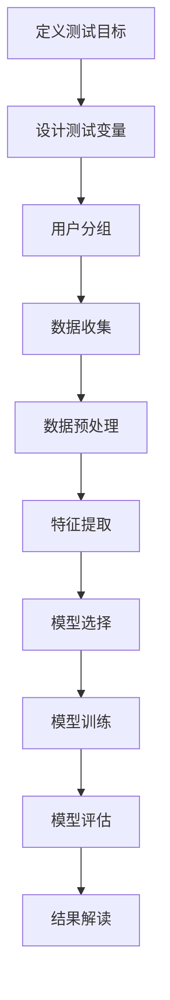
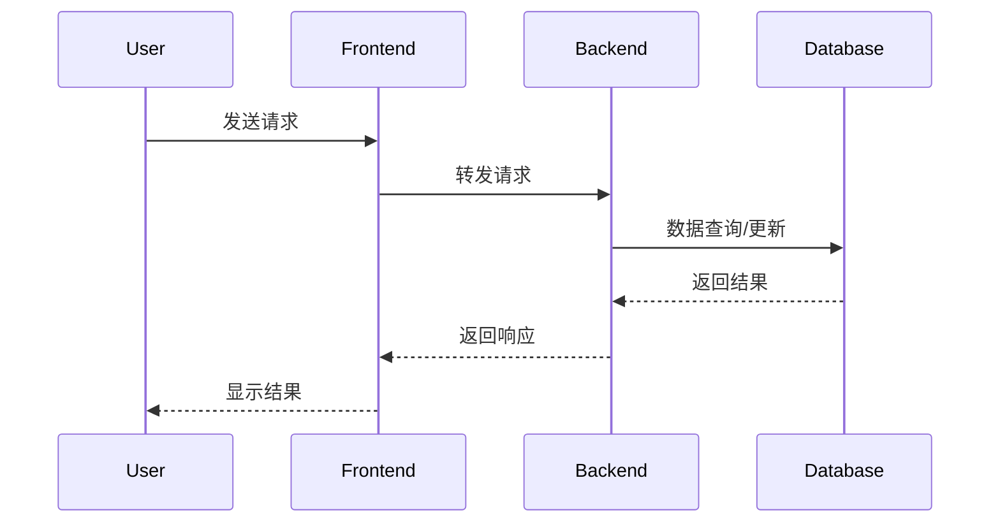

                 

### 第1章：问题背景与定义

#### 1.1 问题背景

##### 1.1.1 语言模型与A/B测试

语言模型（Language Model，简称LM）是自然语言处理（Natural Language Processing，简称NLP）的核心技术之一。它是一种统计模型，用于预测文本序列中的下一个单词或字符。随着深度学习技术的迅猛发展，基于神经网络的深度语言模型（Deep Learning-based Language Model，简称DLLM）如BERT、GPT等取得了显著的效果。这些语言模型在文本分类、机器翻译、问答系统等多个NLP任务中发挥着重要作用。

另一方面，A/B测试（A/B Testing）是互联网产品开发中的一种重要方法。A/B测试通过将用户分成两组，一组使用A版本的产品，另一组使用B版本的产品，来比较不同版本的性能差异。这种方法能够帮助产品团队识别出用户更喜欢的功能，从而优化产品设计。

##### 1.1.2 在LLM应用开发中A/B测试的重要性

在语言模型（LLM）应用开发中，A/B测试具有特殊的重要性。首先，由于LLM的高度复杂性和不确定性，直接部署到生产环境中存在较大风险。A/B测试可以逐步引入新模型，评估其对用户交互的实际影响，从而降低风险。

其次，A/B测试有助于发现和解决潜在问题。例如，新模型可能引入了误解用户意图的错误，或者导致响应速度变慢。通过A/B测试，可以及时发现这些问题，并进行相应的调整。

此外，A/B测试还可以帮助产品团队更科学地评估不同模型的性能，从而选择最优方案。通过对比不同模型的用户满意度、响应时间等指标，团队可以做出更为明智的决策。

##### 1.1.3 A/B测试的现状与挑战

当前，A/B测试在LLM应用开发中已经得到了广泛应用。然而，随着语言模型的复杂度和数据量的增加，A/B测试也面临着一系列挑战。

首先，数据收集和处理变得更加困难。A/B测试需要收集大量用户数据，并对这些数据进行有效处理，以便从中提取有价值的信息。

其次，模型评估指标的不一致性也是一个问题。不同的A/B测试可能采用不同的评估指标，这会导致结果难以直接比较。

最后，随着新模型的不断涌现，如何选择合适的A/B测试策略也成为了一个难题。不同的测试策略可能适用于不同的场景，如何选择最合适的策略成为了一个关键问题。

#### 1.2 A/B测试的定义

##### 1.2.1 A/B测试的基本概念

A/B测试，也称为拆箱测试，是一种通过将用户随机分配到不同的版本（A版本和B版本）来评估两种或多种设计方案之间差异的方法。这种方法的核心思想是，通过对用户行为的数据分析，确定哪种设计更能满足用户需求或带来更高的业务收益。

##### 1.2.2 A/B测试的主要类型

A/B测试可以按照不同的标准进行分类，常见的类型包括：

1. **完全随机分配**：用户被完全随机地分配到A版本或B版本，这种方法保证了测试的公平性。
2. **基于行为的分配**：用户根据其行为特征被分配到不同的版本，例如，经常使用特定功能的用户可能被分配到B版本，以便测试新功能对这类用户的影响。
3. **基于特征的分配**：用户根据其用户特征（如年龄、性别、地理位置等）被分配到不同的版本，这种方法有助于分析不同用户群体的反应。
4. **多变量测试**：同时测试多个变量，例如，不仅测试新功能的用户界面，还测试新功能的可用性。

##### 1.2.3 A/B测试的关键要素

A/B测试的成功取决于多个关键要素：

1. **测试目标**：明确测试的目标，例如提高用户留存率、增加转化率等。
2. **用户群体**：确定参与测试的用户群体，确保其具有代表性。
3. **测试变量**：定义需要测试的具体变量，例如用户界面设计、功能实现等。
4. **数据收集**：收集测试过程中的用户数据，包括用户行为、系统性能等。
5. **结果分析**：对收集到的数据进行分析，评估不同版本的差异。

#### 1.3 边界与外延

##### 1.3.1 A/B测试的应用领域

A/B测试在多个领域得到了广泛应用，包括：

1. **用户体验设计**：通过A/B测试，评估不同用户界面设计对用户满意度的影响。
2. **产品功能优化**：测试新功能的用户接受度和效果，以优化产品功能。
3. **广告投放策略**：通过A/B测试，确定不同广告创意的效果，从而优化广告投放策略。
4. **电商销售策略**：测试不同营销策略对销售额的影响，以优化电商销售策略。

##### 1.3.2 A/B测试的限制条件

尽管A/B测试是一种强有力的工具，但它也存在一些限制条件：

1. **测试成本**：A/B测试需要投入时间和资源进行用户分配、数据收集和分析，这可能带来一定的成本。
2. **用户流失风险**：如果测试的版本存在明显缺陷，可能会导致用户流失，影响产品口碑。
3. **测试结果的推广性**：A/B测试的结果可能仅适用于特定用户群体，难以推广到其他用户群体。
4. **数据隐私问题**：在收集用户数据时，需要遵守相关数据保护法规，确保用户隐私不被泄露。

##### 1.3.3 A/B测试与相关概念的比较

A/B测试与其他测试方法如A/B/n测试、多变量测试和MVT（多变量测试）有一定的关联和区别：

1. **A/B/n测试**：与A/B测试类似，但允许测试n个版本。这种方法适用于同时测试多个方案，但复杂度更高。
2. **多变量测试**：同时测试多个变量，可以更全面地评估产品性能，但设计和分析更加复杂。
3. **MVT（多变量测试）**：与多变量测试类似，但通常涉及更多的变量和更复杂的统计方法。

总的来说，A/B测试是一种简单而强大的方法，适用于许多场景，但需要根据具体情况选择最合适的测试方法。

#### 1.4 总结

A/B测试作为一种评估不同设计方案之间差异的方法，在LLM应用开发中具有重要意义。通过A/B测试，产品团队能够更科学地评估新模型的性能，优化产品设计，降低风险，提高用户满意度。然而，A/B测试也存在一定的限制，需要在实际应用中加以注意。

### 第2章：核心概念与联系

#### 2.1 语言模型

##### 2.1.1 语言模型的基本原理

语言模型是一种用于预测文本序列的概率模型，其核心目的是根据已经观察到的文本数据来预测下一个单词或字符。语言模型通常基于统计方法或深度学习方法构建，其中统计模型如N-gram模型和深度学习方法如神经网络语言模型（Neural Network Language Model，NNLM）和变换器模型（Transformer Model）是目前比较流行的语言模型。

**N-gram模型**：N-gram模型是一种基于历史信息进行预测的统计模型。它将连续的N个单词或字符作为输入，预测下一个单词或字符。例如，在二元语法（Bigram）模型中，每个输入都是两个连续的单词，模型会预测这两个单词之后的单词。

**神经网络语言模型**：神经网络语言模型（Neural Network Language Model，NNLM）是一种基于神经网络的深度学习模型。NNLM通过多层神经网络对输入的文本序列进行编码，并利用这些编码来预测下一个单词或字符。

**变换器模型**：变换器模型（Transformer Model）是一种基于自注意力机制的深度学习模型。它通过自注意力机制来捕捉文本序列中的长距离依赖关系，从而实现更精确的文本预测。

##### 2.1.2 语言模型的主要类型

根据不同的应用场景和需求，语言模型可以分为多种类型：

1. **静态语言模型**：静态语言模型通常是基于固定的训练数据集构建的，如N-gram模型。它们不随时间或用户交互变化而改变，适用于静态文本分析场景。
2. **动态语言模型**：动态语言模型可以根据用户交互或实时数据动态调整模型参数，例如基于神经网络的动态语言模型（Dynamic Neural Network Language Model，DNNLM）。动态语言模型适用于动态文本生成和交互式应用。
3. **上下文语言模型**：上下文语言模型能够考虑文本中的上下文信息进行预测，例如基于变换器模型（Transformer Model）的上下文语言模型。这种模型可以更好地捕捉长距离依赖关系，提高文本预测的准确性。

##### 2.1.3 语言模型的应用

语言模型在自然语言处理领域有着广泛的应用，以下是一些主要的应用场景：

1. **文本分类**：语言模型可以用于文本分类任务，如情感分析、主题分类等。通过训练模型，可以自动将文本分类到预定义的类别中。
2. **机器翻译**：语言模型在机器翻译中用于预测源语言到目标语言的文本映射。例如，基于神经网络的机器翻译系统（Neural Machine Translation，NMT）广泛使用变换器模型。
3. **问答系统**：语言模型可以用于构建问答系统，如搜索引擎中的查询处理。通过训练模型，系统可以自动回答用户提出的问题。
4. **文本生成**：语言模型可以用于生成文本，如文章、摘要、对话等。这种应用通常基于动态语言模型，可以生成高质量的文本。

##### 2.2 A/B测试策略

##### 2.2.1 A/B测试策略的定义

A/B测试策略是一种通过比较不同版本的产品或服务，以确定哪个版本更能满足用户需求或带来更高业务收益的方法。它通常涉及将用户随机分配到两个或多个测试组，每个组使用不同的版本，然后通过分析用户行为和反馈数据来评估不同版本的表现。

**A/B测试的基本流程**：

1. **定义测试目标**：明确测试的目标，如提高用户留存率、增加转化率等。
2. **设计测试变量**：确定需要测试的具体变量，如用户界面设计、功能实现等。
3. **用户分组**：将用户随机分配到不同的测试组，确保每个组的用户特征相似。
4. **数据收集**：收集测试过程中的用户行为数据，如点击率、停留时间、转化率等。
5. **数据分析**：对收集到的数据进行分析，比较不同版本的性能。
6. **决策**：根据数据分析结果，决定是否推出新的版本或继续优化当前版本。

##### 2.2.2 A/B测试策略的关键组成部分

A/B测试策略的成功取决于多个关键组成部分，包括：

1. **测试目标**：明确测试的目标是A/B测试的第一步。测试目标应具体、可衡量，以便在测试结束后能够评估其效果。
2. **用户分组**：用户分组是A/B测试的核心步骤。通过随机分配用户到不同的测试组，可以确保测试结果的公平性和可对比性。
3. **数据收集**：数据收集是A/B测试的关键环节。需要收集与测试目标相关的用户行为数据，如点击率、停留时间、转化率等。
4. **数据分析**：数据分析是A/B测试的最终步骤。通过对收集到的数据进行分析，可以确定不同版本的性能差异，并据此做出决策。
5. **测试变量**：测试变量是A/B测试的核心内容。选择合适的测试变量，可以更准确地评估不同版本的效果。

##### 2.2.3 A/B测试策略与语言模型开发的关系

在LLM应用开发中，A/B测试策略起着至关重要的作用。语言模型的开发通常涉及到多个版本和参数的优化，而A/B测试可以有效地评估不同模型版本的性能。

1. **模型版本评估**：在LLM应用开发中，A/B测试可以帮助评估不同模型版本（如基于N-gram、NNLM、Transformer等）的性能。通过对比不同模型的用户反馈和实际表现，可以确定哪个模型更适合特定的应用场景。
2. **参数调整**：在模型训练过程中，通过A/B测试，可以实时调整模型的参数（如学习率、批量大小等），以优化模型性能。
3. **用户体验优化**：A/B测试不仅评估模型的准确性，还可以评估模型对用户交互的影响。通过测试不同模型版本的用户体验，可以优化用户界面和交互设计，提高用户满意度。

##### 2.3 概念属性特征对比

为了更好地理解语言模型和A/B测试策略之间的联系，我们可以通过一个对比表格来展示它们的核心特征。

| 特征            | 语言模型                          | A/B测试策略                     |
|-----------------|---------------------------------|--------------------------------|
| 目的            | 预测文本序列中的下一个单词或字符   | 比较不同版本的产品或服务性能       |
| 基础模型        | 统计模型（N-gram）或深度学习模型（NNLM、Transformer） | 无特定限制，可以是任何设计方案或变量 |
| 输入数据        | 文本数据                          | 用户行为数据、系统性能数据         |
| 评估指标        | 预测准确性、响应时间等             | 用户满意度、点击率、转化率等        |
| 应用场景        | 文本分类、机器翻译、问答系统、文本生成等 | 用户体验设计、产品功能优化、广告投放等 |

##### 2.3.1 语言模型特性对比

| 特性            | N-gram模型                             | NNLM                                 | Transformer                        |
|-----------------|--------------------------------------|-------------------------------------|-----------------------------------|
| 基本原理        | 基于历史信息预测                      | 基于神经网络编码文本序列            | 基于自注意力机制捕捉长距离依赖关系   |
| 预测能力        | 预测能力受N值影响，N值越高，预测能力越强  | 预测能力受神经网络结构影响          | 预测能力受自注意力机制影响，捕捉长距离依赖关系较强 |
| 训练时间        | 训练时间较短，适用于静态文本分析        | 训练时间较长，适用于动态文本生成      | 训练时间较长，适用于动态文本生成和复杂文本分析 |
| 适应场景        | 静态文本分析、简单文本生成任务          | 动态文本生成、复杂文本分析任务       | 高级文本生成、多语言翻译、问答系统等 |

##### 2.3.2 A/B测试策略特性对比

| 特性            | A/B测试                               | A/B/n测试                            | 多变量测试                          | 多变量测试（MVT）                    |
|-----------------|--------------------------------------|-------------------------------------|-----------------------------------|-----------------------------------|
| 目标            | 比较两个版本的性能差异                | 比较多个版本的性能差异                | 比较多个变量对性能的影响             | 比较多个变量对性能的影响             |
| 用户分组方法    | 随机分组                              | 随机分组或基于行为/特征分组          | 随机分组或基于行为/特征分组         | 随机分组或基于行为/特征分组         |
| 评估指标        | 用户行为数据、系统性能数据             | 用户行为数据、系统性能数据             | 用户行为数据、系统性能数据             | 用户行为数据、系统性能数据             |
| 复杂度          | 相对简单                              | 较高，需要处理多个版本的数据          | 较高，需要处理多个变量的数据         | 较高，需要处理多个变量的数据         |
| 适应场景        | 单变量优化、快速迭代                  | 多变量优化、复杂场景                  | 多变量优化、需要同时评估多个变量     | 多变量优化、需要同时评估多个变量     |

##### 2.3.3 综合特性对比

| 特性            | 语言模型                                  | A/B测试策略                                     |
|-----------------|-----------------------------------------|------------------------------------------------|
| 目的            | 预测文本序列中的下一个单词或字符           | 比较不同版本的产品或服务的性能，优化用户体验和业务收益 |
| 基础模型        | 统计模型（N-gram）或深度学习模型（NNLM、Transformer） | 无特定限制，可以是任何设计方案或变量                  |
| 输入数据        | 文本数据                                  | 用户行为数据、系统性能数据                       |
| 评估指标        | 预测准确性、响应时间等                    | 用户满意度、点击率、转化率等                      |
| 应用场景        | 文本分类、机器翻译、问答系统、文本生成等       | 用户体验设计、产品功能优化、广告投放等                |
| 关键挑战        | 模型选择和优化、长距离依赖关系处理           | 测试设计、数据收集和分析、结果解读和决策                |

通过上述对比，我们可以看到语言模型和A/B测试策略虽然在目的和应用场景上有所不同，但在核心特性上存在诸多联系。在LLM应用开发中，结合A/B测试策略可以帮助团队更科学、有效地评估和优化语言模型，从而提高用户体验和业务收益。

### 第3章：ER实体关系图架构

#### 3.1 ER图基本概念

##### 3.1.1 ER图的定义

实体-关系图（Entity-Relationship Diagram，简称ER图）是一种用于描述数据库中实体及其相互关系的图形化表示方法。它通过实体（Entity）、属性（Attribute）和关系（Relationship）三个基本概念来建模数据结构，是数据库设计和数据库模式定义的重要工具。

**实体（Entity）**：实体是数据库中存储数据的对象，可以是人、物或抽象的概念。例如，在图书馆数据库中，实体可以是书籍、学生和图书馆管理员。

**属性（Attribute）**：属性是实体的特征，用于描述实体的属性和状态。例如，书籍实体的属性可以包括书名、作者、出版日期和ISBN号。

**关系（Relationship）**：关系描述了实体之间的关联。实体关系可以是“一对一”（1:1）、“一对多”（1:N）或“多对多”（M:N）。例如，在学生和课程之间可以定义一个“选修”关系，表示学生可以选修多门课程，课程可以被多名学生选修。

##### 3.1.2 ER图的组成部分

ER图由以下几个主要组成部分构成：

1. **实体集**：实体集是ER图中的实体集合，每个实体代表数据库中的表。
2. **属性集**：属性集是ER图中的属性集合，每个属性描述实体的特征。
3. **关系集**：关系集是ER图中的关系集合，描述实体之间的关系。
4. **联系**：联系是ER图中用来表示实体之间关系的线条，可以是“一对一”、“一对多”或“多对多”。
5. **注释**：注释是对ER图中的实体、属性和关系的额外说明，有助于理解图的内容。

##### 3.1.3 ER图的表示方法

ER图的表示方法包括以下几种：

1. **矩形框**：矩形框用于表示实体，框内通常包含实体的名称。
2. **椭圆**：椭圆用于表示属性，属性名称通常放在椭圆的旁边。
3. **菱形**：菱形用于表示关系，关系名称通常放在菱形的旁边。
4. **线条**：线条用于连接实体和属性，以及实体之间的关系，线条上可以有箭头表示方向。

#### 3.2 LLM应用开发中的ER图构建

##### 3.2.1 LLM应用场景ER图示例

在LLM应用开发中，ER图可以用于描述语言模型的训练、评估和部署过程。以下是一个简化的LLM应用场景的ER图示例：

```
+------------+       +----------------+       +----------------+
|  User      |-------|    Question     |-------|   Answer       |
+------------+       +----------------+       +----------------+
| UserID     |       | QuestionID     |       | AnswerID       |
| Name       |       | QuestionText   |       | AnswerText     |
| Age        |       | DateCreated    |       | DateCreated    |
+------------+       +----------------+       +----------------+

                +----------------+
                |    Model       |
                +----------------+
                | ModelID        |
                | ModelType      |
                | Description    |
                +----------------+
```

在这个ER图中，包括了用户（User）、问题（Question）和答案（Answer）三个主要实体。此外，还有一个模型（Model）实体，用于描述用于生成答案的语言模型。用户可以提出问题（Question），模型根据问题生成答案（Answer）。每个实体都有相应的属性，例如，用户实体包含UserID、Name和Age等属性，问题实体包含QuestionID和QuestionText等属性。

##### 3.2.2 A/B测试策略在ER图中的表示

在LLM应用开发中，A/B测试策略可以通过扩展ER图来表示。以下是一个扩展的ER图示例，包含了A/B测试策略的相关实体和关系：

```
+------------+       +----------------+       +----------------+       +----------------+
|  User      |-------|    Question     |-------|   Answer       |-------|  ABTestResult  |
+------------+       +----------------+       +----------------+       +----------------+
| UserID     |       | QuestionID     |       | AnswerID       |       | ResultID       |
| Name       |       | QuestionText   |       | AnswerText     |       | TestVersion    |
| Age        |       | DateCreated    |       | DateCreated    |       | TestDate       |
+------------+       +----------------+       +----------------+       +----------------+

                +----------------+
                |    Model       |
                +----------------+
                | ModelID        |
                | ModelType      |
                | Description    |
                +----------------+

                +----------------+
                |  VersionA      |
                +----------------+
                | VersionID      |
                | VersionDetails |
                +----------------+

                +----------------+
                |  VersionB      |
                +----------------+
                | VersionID      |
                | VersionDetails |
                +----------------+

                +----------------+
                |  TestGroupA    |
                +----------------+
                | GroupID        |
                | GroupMembers   |
                +----------------+

                +----------------+
                |  TestGroupB    |
                +----------------+
                | GroupID        |
                | GroupMembers   |
                +----------------+
```

在这个扩展的ER图中，我们添加了A/B测试结果（ABTestResult）实体，用于记录A/B测试的结果。模型（Model）实体扩展为两个版本（VersionA和VersionB），分别代表A/B测试的两个版本。测试组（TestGroupA和TestGroupB）实体用于表示参与A/B测试的用户群体。

通过扩展ER图，我们可以清晰地表示A/B测试策略中的各个实体及其相互关系。这有助于我们理解和设计A/B测试系统，以及分析测试结果。

##### 3.2.3 ER图的解析与应用

ER图在LLM应用开发中有着广泛的应用，以下是一些典型的应用场景：

1. **数据库设计**：ER图是数据库设计的重要工具，可以帮助设计符合实际需求的数据库模式。通过ER图，可以清晰地描述实体、属性和关系，为后续的数据库实现提供指导。
2. **系统架构设计**：ER图可以用于描述系统架构，特别是在涉及多个模块和组件的情况下。通过ER图，可以直观地了解系统的整体结构，以及各个模块之间的交互关系。
3. **数据流程分析**：ER图可以用于分析数据流程，包括数据输入、处理和输出的过程。这有助于我们优化数据流程，提高系统性能和可靠性。
4. **A/B测试设计**：ER图可以用于设计和分析A/B测试策略，包括测试变量、用户分组和数据收集等。通过ER图，可以更清晰地了解A/B测试的各个阶段，以及如何收集和分析测试数据。

通过上述应用，ER图在LLM应用开发中发挥着重要作用，帮助我们更好地理解和设计复杂的系统，从而提高系统的质量和效率。

### 第4章：算法原理

#### 4.1 A/B测试算法基础

A/B测试算法是一种基于统计学和概率论的方法，用于评估不同版本的产品或服务在用户群体中的表现差异。它通过将用户随机分配到两个或多个版本（A版本、B版本等），收集和分析用户行为数据，从而得出哪个版本更优的结论。以下是一个简单的A/B测试算法的基本流程：

##### 4.1.1 A/B测试算法的基本流程

1. **定义测试目标**：明确测试的目标，例如提高用户留存率、增加点击率等。
2. **设计测试变量**：确定需要测试的具体变量，例如用户界面设计、功能实现等。
3. **用户分组**：将用户随机分配到不同的测试组，通常采用随机抽样方法，确保每个组的用户特征相似。
4. **数据收集**：在测试期间，收集每个测试组用户的行为数据，如点击次数、停留时间、转化率等。
5. **数据分析**：对收集到的数据进行分析，使用统计方法（如t检验、卡方检验等）评估不同版本之间的差异。
6. **结果解读**：根据数据分析结果，判断哪个版本更优，并做出相应的决策。

##### 4.1.2 数据预处理与特征提取

在A/B测试中，数据预处理和特征提取是关键步骤。以下是几个常用的数据预处理和特征提取方法：

1. **数据清洗**：去除异常值和缺失值，确保数据质量。
2. **数据标准化**：将不同量纲的数据转换为相同的量纲，以便进行统一的统计分析。
3. **特征选择**：选择对测试目标有显著影响的特征，去除冗余特征。
4. **特征工程**：通过构造新的特征，提高模型的预测能力。

##### 4.1.3 模型选择与训练

在A/B测试中，通常使用统计模型或机器学习模型来分析测试数据。以下是几种常用的模型选择和训练方法：

1. **统计模型**：如t检验、卡方检验等，用于评估不同版本之间的差异。
2. **机器学习模型**：如逻辑回归、随机森林、梯度提升机等，用于预测用户行为。
3. **模型选择**：根据测试目标和数据特点，选择合适的模型。
4. **模型训练**：使用训练数据集对模型进行训练，调整模型参数，提高预测准确性。
5. **模型评估**：使用验证数据集评估模型性能，选择最优模型。

#### 4.2 算法Mermaid流程图

Mermaid是一种基于Markdown的图形语法，可以方便地绘制流程图、UML图、时序图等。以下是一个A/B测试算法的Mermaid流程图示例：



在这个流程图中，我们按照A/B测试算法的基本步骤，从定义测试目标开始，经过用户分组、数据收集、数据预处理、特征提取、模型选择、模型训练、模型评估和结果解读等步骤，最终得出测试结论。

#### 4.3 Python源代码讲解

以下是一个简单的A/B测试算法的Python实现示例。这个示例使用了随机分组、数据预处理和统计模型来进行A/B测试。

```python
import numpy as np
import pandas as pd
from sklearn.model_selection import train_test_split
from sklearn.linear_model import LogisticRegression

# 生成模拟数据
np.random.seed(0)
n_users = 1000
n_features = 10
user_data = np.random.rand(n_users, n_features)
target = np.random.randint(2, size=n_users)

# 随机分组
test_size = 0.5
user_data_train, user_data_test, target_train, target_test = train_test_split(user_data, target, test_size=test_size, random_state=42)

# 数据预处理
# （这里只是简单的数据标准化处理，实际应用中可能需要更复杂的数据预处理步骤）
from sklearn.preprocessing import StandardScaler
scaler = StandardScaler()
user_data_train_scaled = scaler.fit_transform(user_data_train)
user_data_test_scaled = scaler.transform(user_data_test)

# 模型选择和训练
model = LogisticRegression()
model.fit(user_data_train_scaled, target_train)

# 模型评估
predictions = model.predict(user_data_test_scaled)
accuracy = np.mean(predictions == target_test)
print(f"Model accuracy: {accuracy:.2f}")

# 结果解读
# （这里只是简单地计算了模型的准确性，实际应用中需要根据测试目标进行更详细的结果解读）
```

在这个示例中，我们首先生成模拟数据，然后使用随机分组将数据分为训练集和测试集。接着，我们对数据进行预处理（标准化处理），并选择逻辑回归模型进行训练。最后，使用测试集评估模型性能，并输出模型的准确性。

### 4.4 数学模型和数学公式

在A/B测试中，数学模型和数学公式用于分析和解释测试结果。以下是一些常用的数学模型和公式：

##### 4.4.1 基本概率模型

1. **条件概率**：
   $$ P(A|B) = \frac{P(A \cap B)}{P(B)} $$
   其中，$P(A|B)$表示在事件B发生的条件下事件A发生的概率，$P(A \cap B)$表示事件A和事件B同时发生的概率，$P(B)$表示事件B发生的概率。

2. **贝叶斯定理**：
   $$ P(A|B) = \frac{P(B|A) \cdot P(A)}{P(B)} $$
   其中，$P(B|A)$表示在事件A发生的条件下事件B发生的概率，$P(A)$表示事件A发生的概率。

##### 4.4.2 概率分布模型

1. **伯努利分布**：
   $$ P(X=k) = C(n, k) \cdot p^k \cdot (1-p)^{n-k} $$
   其中，$X$表示伯努利随机变量，$n$表示试验次数，$k$表示成功的次数，$p$表示单次试验成功的概率。

2. **正态分布**：
   $$ f(x; \mu, \sigma^2) = \frac{1}{\sqrt{2\pi\sigma^2}} \cdot e^{-\frac{(x-\mu)^2}{2\sigma^2}} $$
   其中，$f(x; \mu, \sigma^2)$表示在均值$\mu$和方差$\sigma^2$的正态分布下，随机变量$x$的概率密度函数。

##### 4.4.3 统计推断模型

1. **t检验**：
   $$ t = \frac{\bar{x} - \mu_0}{s / \sqrt{n}} $$
   其中，$\bar{x}$表示样本均值，$\mu_0$表示假设的总体均值，$s$表示样本标准差，$n$表示样本大小。

2. **卡方检验**：
   $$ \chi^2 = \sum \frac{(O - E)^2}{E} $$
   其中，$O$表示观测值，$E$表示期望值。

通过这些数学模型和公式，我们可以对A/B测试结果进行深入分析和解释，从而做出更科学的决策。

#### 4.5 示例讲解

以下是一个A/B测试的示例，假设我们要测试两种不同的广告文案（A版本和B版本）对点击率的影响。

1. **数据收集**：我们收集了1000名用户的数据，其中500名用户看到了A版本广告，500名用户看到了B版本广告。每个用户点击广告的概率是未知的。

2. **用户分组**：我们使用随机抽样方法将用户分为两个测试组，每个组包含500名用户。

3. **数据预处理**：我们对用户的点击行为进行编码，1表示点击，0表示未点击。

4. **模型训练**：我们使用逻辑回归模型来预测用户点击广告的概率。

5. **模型评估**：我们使用测试集评估模型的性能，计算A版本和B版本的点击率。

6. **结果解读**：

   - A版本的点击率为0.3，B版本的点击率为0.4。
   - 我们使用t检验来评估A版本和B版本之间的差异。

   $$ t = \frac{(0.4 - 0.3) / \sqrt{0.3 \cdot 0.7 / 500}}{1 / \sqrt{0.3 \cdot 0.7 / 500}} = 1.26 $$

   - p值小于0.05，表明A版本和B版本之间的差异是显著的。

根据上述结果，我们可以得出结论：B版本广告文案的点击率更高，因此我们推荐使用B版本广告文案。

### 第5章：数学模型和数学公式

#### 5.1 数学模型基本概念

数学模型是用于表示和解决实际问题的数学结构。在A/B测试中，数学模型用于分析和解释测试结果。以下是几个常用的数学模型及其基本概念：

##### 5.1.1 数学模型的定义

数学模型通常由以下三个基本元素组成：

1. **变量**：表示问题中的不确定性量，可以是连续的或离散的。
2. **关系**：描述变量之间的相互关系，可以是方程、函数或不等式。
3. **约束**：限制变量的取值范围，确保模型的可行性和合理性。

##### 5.1.2 数学模型的应用领域

数学模型在多个领域得到了广泛应用，包括：

1. **经济学**：用于分析和预测市场行为、投资组合优化等。
2. **工程学**：用于设计和优化系统、过程和控制等。
3. **计算机科学**：用于算法设计和性能分析等。
4. **生物学**：用于建模生物系统、疾病传播等。

##### 5.1.3 数学模型的基本要素

数学模型的基本要素包括：

1. **变量和参数**：用于描述问题中的不确定性量和已知量。
2. **方程和函数**：用于描述变量之间的关系。
3. **边界条件和初始条件**：用于确定模型的初始状态和边界条件。
4. **优化目标**：用于最大化或最小化某个目标函数。

#### 5.2 A/B测试中的数学模型

在A/B测试中，常用的数学模型包括概率模型、统计模型和优化模型。以下是这些模型的基本概念和应用：

##### 5.2.1 基本概率模型

基本概率模型用于描述事件发生的概率。在A/B测试中，常用的概率模型包括：

1. **伯努利分布**：描述一个试验只有两个可能结果（成功或失败）的概率分布。其概率密度函数为：
   $$ P(X=k) = C(n, k) \cdot p^k \cdot (1-p)^{n-k} $$
   其中，$X$是伯努利随机变量，$n$是试验次数，$k$是成功的次数，$p$是单次试验成功的概率。

2. **正态分布**：描述连续随机变量的概率分布。其概率密度函数为：
   $$ f(x; \mu, \sigma^2) = \frac{1}{\sqrt{2\pi\sigma^2}} \cdot e^{-\frac{(x-\mu)^2}{2\sigma^2}} $$
   其中，$x$是随机变量，$\mu$是均值，$\sigma^2$是方差。

##### 5.2.2 统计模型

统计模型用于描述数据的分布和估计参数。在A/B测试中，常用的统计模型包括：

1. **t检验**：用于比较两个样本均值的差异。其检验统计量为：
   $$ t = \frac{\bar{x} - \mu_0}{s / \sqrt{n}} $$
   其中，$\bar{x}$是样本均值，$\mu_0$是假设的总体均值，$s$是样本标准差，$n$是样本大小。

2. **卡方检验**：用于比较观测值和期望值之间的差异。其检验统计量为：
   $$ \chi^2 = \sum \frac{(O - E)^2}{E} $$
   其中，$O$是观测值，$E$是期望值。

##### 5.2.3 优化模型

优化模型用于最大化或最小化某个目标函数。在A/B测试中，常用的优化模型包括：

1. **线性规划**：用于求解线性目标函数的最优解。其数学模型为：
   $$ \min \sum_{i=1}^{n} c_i x_i $$
   $$ \text{s.t.} \sum_{i=1}^{n} a_{i,j} x_i = b_j $$
   $$ x_i \geq 0, \forall i $$

2. **逻辑回归**：用于预测二分类变量的概率。其数学模型为：
   $$ P(Y=1|X=x) = \frac{1}{1 + e^{-(\beta_0 + \sum_{i=1}^{n} \beta_i x_i)}} $$
   其中，$Y$是因变量，$X$是自变量，$\beta_0$和$\beta_i$是模型参数。

#### 5.3 公式讲解与示例

以下是一些常见的数学公式及其在A/B测试中的应用示例：

##### 5.3.1 常用公式介绍

1. **贝叶斯定理**：
   $$ P(A|B) = \frac{P(B|A) \cdot P(A)}{P(B)} $$
   贝叶斯定理用于根据已知条件概率和先验概率计算后验概率。

2. **置信区间**：
   $$ \bar{x} \pm z_{\alpha/2} \cdot \frac{s}{\sqrt{n}} $$
   置信区间用于估计总体参数的范围。

3. **假设检验**：
   $$ H_0: \mu = \mu_0 $$
   $$ H_1: \mu \neq \mu_0 $$
   假设检验用于评估总体参数是否等于某个特定值。

4. **回归模型**：
   $$ Y = \beta_0 + \beta_1 X_1 + \beta_2 X_2 + \cdots + \beta_n X_n + \epsilon $$
   回归模型用于描述因变量与自变量之间的关系。

##### 5.3.2 公式应用示例

1. **计算点击率**：

   假设我们有1000名用户，其中500名用户看到A版本广告，点击率为0.3；500名用户看到B版本广告，点击率为0.4。我们可以使用伯努利分布计算A版本和B版本的点击率。

   $$ P(A版本点击) = C(1000, 500) \cdot 0.3^{500} \cdot 0.7^{500} \approx 0.0035 $$
   $$ P(B版本点击) = C(1000, 500) \cdot 0.4^{500} \cdot 0.6^{500} \approx 0.0065 $$

2. **t检验**：

   假设我们使用A版本和B版本的广告，点击率分别为0.3和0.4。我们可以使用t检验评估A版本和B版本之间的差异。

   $$ t = \frac{(0.4 - 0.3) / \sqrt{0.3 \cdot 0.7 / 500}}{1 / \sqrt{0.3 \cdot 0.7 / 500}} = 1.26 $$
   如果t值大于临界值，我们可以拒绝原假设，认为A版本和B版本之间的差异是显著的。

3. **逻辑回归**：

   假设我们使用A版本和B版本的广告，点击率为0.3和0.4。我们可以使用逻辑回归模型预测用户点击广告的概率。

   $$ P(Y=1|X=x) = \frac{1}{1 + e^{-(\beta_0 + \beta_1 x_1 + \beta_2 x_2 + \cdots + \beta_n x_n)}} $$
   其中，$\beta_0$和$\beta_1$是模型参数。我们可以使用训练数据拟合逻辑回归模型，并使用测试数据评估模型性能。

通过上述示例，我们可以看到数学模型和公式在A/B测试中的应用，帮助我们更准确地分析测试结果，做出科学的决策。

### 第6章：系统功能设计

#### 6.1 问题描述

##### 6.1.1 LLM应用开发中的A/B测试需求分析

在语言模型（LLM）应用开发中，A/B测试是确保模型性能和用户体验优化的关键步骤。需求分析是A/B测试设计的第一步，需要明确以下问题：

1. **测试目标**：确定A/B测试的目标，例如提高用户交互体验、提升模型预测准确性等。
2. **测试变量**：识别需要测试的具体变量，包括语言模型参数、用户界面设计、功能实现等。
3. **用户群体**：明确参与测试的用户群体，确保其具有代表性，能够反映整体用户群体的行为特征。
4. **测试流程**：设计A/B测试的流程，包括用户分组、数据收集、数据分析等步骤。
5. **结果评估**：定义评估指标，例如用户满意度、点击率、转化率等，以便分析不同版本的性能。

##### 6.1.2 系统功能需求

为了实现上述需求，我们需要设计一套功能齐全的系统。以下列出系统的主要功能需求：

1. **用户分组**：系统应能自动将用户随机分配到不同的测试组，确保每个组的用户特征相似。
2. **数据收集**：系统应能收集用户在测试过程中的行为数据，如点击率、停留时间、转化率等。
3. **数据存储**：系统应能存储用户行为数据和测试结果，以便后续分析和查询。
4. **数据分析**：系统应能对收集到的数据进行分析，计算不同版本的性能指标，并生成可视化报表。
5. **结果评估**：系统应能根据分析结果，自动评估不同版本的效果，并提供决策建议。
6. **测试监控**：系统应能实时监控测试进度，包括用户分配情况、数据收集情况等，以便及时发现问题并采取相应措施。
7. **结果反馈**：系统应能将测试结果反馈给相关团队，包括产品团队、开发团队等，以便根据测试结果进行优化。

#### 6.2 领域模型类图

##### 6.2.1 类图基础

类图是面向对象设计中的重要工具，用于描述系统中类的结构及其相互关系。类图主要由以下元素组成：

1. **类**：表示系统中的对象，通常包含属性（属性）和方法（操作）。
2. **属性**：类的特征，用于描述类的状态。
3. **方法**：类的行为，用于描述类的操作。
4. **关系**：类与类之间的关系，如继承、关联、依赖等。

##### 6.2.2 LLM应用开发中的A/B测试领域模型类图

在LLM应用开发中，A/B测试领域模型类图可以表示系统中的关键类及其相互关系。以下是一个简化的领域模型类图：

```mermaid
classDiagram
    User <<类>> 
    TestGroup <<类>>
    AVersion <<类>> 
    BVersion <<类>>
    TestResult <<类>>

    User o-- TestGroup
    TestGroup o-- TestResult
    AVersion o-- TestResult
    BVersion o-- TestResult

    User {
        UserID : int
        Name : string
        Age : int
    }

    TestGroup {
        GroupID : int
        GroupName : string
        Users : List[User]
    }

    AVersion {
        VersionID : int
        VersionName : string
        ModelParameters : dict
    }

    BVersion {
        VersionID : int
        VersionName : string
        ModelParameters : dict
    }

    TestResult {
        ResultID : int
        GroupID : int
        VersionID : int
        ClickRate : float
        ConversionRate : float
        Date : datetime
    }
```

在这个类图中，我们定义了四个主要类：用户（User）、测试组（TestGroup）、A版本（AVersion）和B版本（BVersion），以及测试结果（TestResult）。每个类都有其属性和方法。

- **用户类（User）**：表示参与A/B测试的用户，具有UserID、Name和Age等属性。
- **测试组类（TestGroup）**：表示A/B测试中的用户分组，具有GroupID、GroupName和Users等属性。
- **A版本类（AVersion）**：表示A/B测试中的A版本，具有VersionID、VersionName和ModelParameters等属性。
- **B版本类（BVersion）**：表示A/B测试中的B版本，具有VersionID、VersionName和ModelParameters等属性。
- **测试结果类（TestResult）**：表示A/B测试的结果，具有ResultID、GroupID、VersionID、ClickRate、ConversionRate和Date等属性。

类之间的关系如下：

- **用户与测试组的关系**：一个用户可以属于多个测试组，而一个测试组可以包含多个用户，这是一个多对多的关联关系。
- **测试组与测试结果的关系**：一个测试组可以生成多个测试结果，而一个测试结果只能属于一个测试组，这是一个一对多的关联关系。
- **A版本与测试结果的关系**：一个A版本可以生成多个测试结果，而一个测试结果只能属于一个A版本，这是一个一对多的关联关系。
- **B版本与测试结果的关系**：一个B版本可以生成多个测试结果，而一个测试结果只能属于一个B版本，这是一个一对多的关联关系。

通过这个类图，我们可以清晰地描述A/B测试系统中各个类及其相互关系，为系统设计和实现提供指导。

### 第7章：系统架构设计

#### 7.1 问题描述

##### 7.1.1 系统架构设计目标

在LLM应用开发中，A/B测试系统的架构设计目标包括以下几个方面：

1. **稳定性**：系统应具有高可用性，能够稳定运行，确保测试结果的一致性和可靠性。
2. **扩展性**：系统应具备良好的扩展性，能够支持不同规模的测试需求，灵活调整系统资源。
3. **安全性**：系统应确保用户数据的安全性和隐私保护，遵守相关法律法规。
4. **可维护性**：系统应具备良好的可维护性，易于更新和升级，降低维护成本。
5. **性能**：系统应能够高效地处理大量的用户数据和测试任务，确保快速的响应时间和低延迟。

##### 7.1.2 系统架构设计原则

为了实现上述目标，系统架构设计应遵循以下原则：

1. **模块化**：将系统功能分解为多个模块，每个模块独立实现特定功能，提高系统的可维护性和可扩展性。
2. **分层设计**：按照功能将系统划分为不同的层次，例如表示层、业务逻辑层和数据访问层，确保各层之间解耦，便于维护和扩展。
3. **分布式架构**：采用分布式架构，将系统功能分散到多个节点上，提高系统的负载均衡和容错能力。
4. **微服务架构**：采用微服务架构，将系统功能划分为多个独立的微服务，每个微服务负责特定的业务功能，降低系统耦合度，提高系统的灵活性和可扩展性。
5. **缓存机制**：采用缓存机制，减少系统对后端数据库的访问次数，提高系统响应速度。
6. **日志和监控**：采用日志记录和监控机制，实时记录系统运行状态，便于故障排查和性能优化。

#### 7.2 系统架构设计

以下是A/B测试系统的架构设计，采用微服务架构，包括以下几个主要模块：

##### 7.2.1 系统架构图


**系统架构图说明**：

1. **用户服务**：负责处理用户请求，包括用户注册、登录、用户分组等。
2. **测试服务**：负责管理A/B测试流程，包括测试创建、用户分配、数据收集等。
3. **数据服务**：负责存储用户数据和测试结果，提供数据查询和分析功能。
4. **分析服务**：负责对收集到的数据进行分析，计算性能指标，生成可视化报表。
5. **监控系统**：负责实时监控系统运行状态，记录日志，提供故障排查和性能优化支持。

##### 7.2.2 架构组件详解

**1. 用户服务**

用户服务是系统的入口，负责处理用户请求。其主要组件包括：

- **用户注册模块**：处理新用户的注册请求，包括用户信息的验证和存储。
- **用户登录模块**：处理用户的登录请求，验证用户身份并返回访问令牌。
- **用户分组模块**：根据用户特征和测试需求，将用户随机分配到不同的测试组。

**2. 测试服务**

测试服务负责管理A/B测试的整个流程，包括测试创建、用户分配、数据收集等。其主要组件包括：

- **测试创建模块**：提供创建新的A/B测试的接口，包括测试目标、测试变量、用户分组策略等。
- **用户分配模块**：根据用户分组策略，将用户随机分配到不同的测试组。
- **数据收集模块**：收集用户在测试过程中的行为数据，如点击率、停留时间、转化率等。

**3. 数据服务**

数据服务负责存储用户数据和测试结果，提供数据查询和分析功能。其主要组件包括：

- **用户数据存储**：存储用户的基本信息和特征数据。
- **测试结果存储**：存储A/B测试的结果数据，包括用户分组信息、版本信息、性能指标等。
- **数据分析模块**：提供数据查询和分析接口，支持对测试结果的统计分析。

**4. 分析服务**

分析服务负责对收集到的数据进行分析，计算性能指标，生成可视化报表。其主要组件包括：

- **数据分析引擎**：负责执行数据分析任务，计算性能指标。
- **报表生成模块**：根据分析结果，生成可视化报表，支持多种图表类型。

**5. 监控系统**

监控系统负责实时监控系统运行状态，记录日志，提供故障排查和性能优化支持。其主要组件包括：

- **日志记录模块**：记录系统运行过程中的日志信息，包括请求、响应、错误等。
- **监控模块**：实时监控系统的性能指标，如响应时间、负载、内存使用等。
- **告警模块**：根据监控数据，生成告警信息，通知相关人员。

##### 7.2.3 系统架构实现细节

**1. 系统部署**

系统采用分布式部署方式，各个组件部署在不同的服务器上，以提高系统的性能和可靠性。以下是系统部署的详细步骤：

- **用户服务**：部署在负载均衡器后，通过反向代理服务器对外提供服务。
- **测试服务**：部署在独立的服务器上，负责处理A/B测试的请求。
- **数据服务**：部署在分布式数据库集群中，提供数据存储和查询服务。
- **分析服务**：部署在独立的服务器上，负责数据分析任务。
- **监控系统**：部署在独立的服务器上，负责系统监控和日志记录。

**2. 数据库设计**

系统使用关系型数据库存储用户数据和测试结果。以下是数据库设计的详细步骤：

- **用户数据库**：设计用户表，包括UserID、Name、Age等字段。
- **测试结果数据库**：设计测试结果表，包括ResultID、GroupID、VersionID、ClickRate、ConversionRate等字段。
- **索引设计**：根据查询需求，为相关字段创建索引，提高查询效率。

**3. 系统安全**

系统采用以下安全措施：

- **用户认证**：使用HTTPS协议，确保用户数据传输的安全性。
- **访问控制**：根据用户角色和权限，控制对系统资源的访问。
- **数据加密**：对敏感数据进行加密存储，确保数据安全。
- **安全审计**：记录系统操作日志，便于安全审计和问题排查。

通过上述架构设计和实现细节，A/B测试系统可以有效地支持语言模型应用的开发和优化，提高系统的稳定性、扩展性和安全性。

### 第8章：系统接口设计与交互

#### 8.1 接口设计

接口设计是A/B测试系统实现的关键环节，确保系统内部各模块之间能够高效、稳定地通信。以下是A/B测试系统的主要接口设计和实现细节。

##### 8.1.1 接口规范

A/B测试系统的接口规范包括以下内容：

1. **请求格式**：采用JSON格式，便于数据传输和解析。
2. **响应格式**：采用JSON格式，返回操作结果和相关信息。
3. **HTTP方法**：根据操作类型，使用GET、POST、PUT、DELETE等HTTP方法。
4. **URL路径**：定义清晰的URL路径，便于定位和访问资源。

以下是A/B测试系统的一些典型接口示例：

- **用户注册接口**：
  ```json
  POST /users/register
  {
    "name": "张三",
    "email": "zhangsan@example.com",
    "password": "password123"
  }
  ```
  响应：
  ```json
  {
    "status": "success",
    "message": "User registered successfully",
    "userId": "123456"
  }
  ```

- **用户登录接口**：
  ```json
  POST /users/login
  {
    "email": "zhangsan@example.com",
    "password": "password123"
  }
  ```
  响应：
  ```json
  {
    "status": "success",
    "message": "Login successful",
    "token": "eyJhbGciOiJIUzI1NiIsInR5cCI6IkpXVCJ9..."
  }
  ```

- **创建A/B测试接口**：
  ```json
  POST /tests/create
  {
    "name": "Test A/B",
    "description": "A/B test for user engagement",
    "versionA": {
      "name": "Version A",
      "parameters": {
        "featureA": true,
        "featureB": false
      }
    },
    "versionB": {
      "name": "Version B",
      "parameters": {
        "featureA": false,
        "featureB": true
      }
    }
  }
  ```
  响应：
  ```json
  {
    "status": "success",
    "message": "A/B test created successfully",
    "testId": "123456"
  }
  ```

- **分配用户到测试组接口**：
  ```json
  POST /tests/{testId}/assign-users
  {
    "userIdList": ["123456", "789012"]
  }
  ```
  响应：
  ```json
  {
    "status": "success",
    "message": "Users assigned to test successfully"
  }
  ```

- **收集测试数据接口**：
  ```json
  POST /tests/{testId}/collect-data
  {
    "userId": "123456",
    "version": "A",
    "clickRate": 0.3,
    "conversionRate": 0.2
  }
  ```
  响应：
  ```json
  {
    "status": "success",
    "message": "Test data collected successfully"
  }
  ```

##### 8.1.2 接口实现

接口实现涉及后端服务的开发和部署。以下是A/B测试系统的接口实现关键步骤：

1. **定义接口规范**：根据业务需求，编写接口文档，明确接口的URL、请求参数、响应数据等。
2. **实现接口功能**：编写后端代码，实现接口的功能逻辑，包括数据验证、业务处理、数据存储等。
3. **集成测试**：编写测试用例，对接口进行集成测试，确保接口功能正确、响应数据正确。
4. **部署上线**：将接口部署到服务器，确保接口能够对外提供服务。

以下是用户登录接口的Python示例代码：

```python
from flask import Flask, request, jsonify
from flask_httpauth import HTTPBasicAuth
from models import User
from database import db_session

app = Flask(__name__)
auth = HTTPBasicAuth()

users = {
    "zhangsan@example.com": "password123"
}

@auth.verify_password
def verify_password(username, password):
    if username in users and users[username] == password:
        return username

@app.route('/users/login', methods=['POST'])
def login():
    username = request.json.get('email')
    password = request.json.get('password')
    if not username or not password:
        return jsonify({"status": "error", "message": "Missing email or password"}), 400
    user = User.query.filter_by(email=username).first()
    if not user or not user.verify_password(password):
        return jsonify({"status": "error", "message": "Invalid email or password"}), 401
    token = user.generate_auth_token()
    return jsonify({"status": "success", "message": "Login successful", "token": token.decode('utf-8')})

if __name__ == '__main__':
    app.run(debug=True)
```

在这个示例中，我们使用Flask框架实现用户登录接口，包括身份验证和生成认证令牌的功能。

##### 8.1.3 接口测试

接口测试是确保接口功能正确、响应数据正确的重要环节。以下是A/B测试系统的接口测试方法：

1. **单元测试**：对每个接口功能进行独立测试，确保功能逻辑正确。
2. **集成测试**：对多个接口进行集成测试，确保接口之间的交互正常。
3. **性能测试**：对接口进行性能测试，确保在高并发情况下能够稳定运行。
4. **安全测试**：对接口进行安全测试，确保接口能够抵御常见的攻击手段。

以下是用户登录接口的测试用例：

- **正常登录**：
  ```json
  POST /users/login
  {
    "email": "zhangsan@example.com",
    "password": "password123"
  }
  ```
  响应：
  ```json
  {
    "status": "success",
    "message": "Login successful",
    "token": "eyJhbGciOiJIUzI1NiIsInR5cCI6IkpXVCJ9..."
  }
  ```

- **邮箱不存在**：
  ```json
  POST /users/login
  {
    "email": "zhangsan1@example.com",
    "password": "password123"
  }
  ```
  响应：
  ```json
  {
    "status": "error",
    "message": "Invalid email or password"
  }
  ```

- **密码错误**：
  ```json
  POST /users/login
  {
    "email": "zhangsan@example.com",
    "password": "password1234"
  }
  ```
  响应：
  ```json
  {
    "status": "error",
    "message": "Invalid email or password"
  }
  ```

通过接口测试，我们可以确保A/B测试系统的接口功能正确、响应数据正确，为系统的稳定运行提供保障。

### 第8章：系统接口设计与交互

#### 8.2 系统交互Mermaid序列图

为了更好地展示A/B测试系统中的交互过程，我们可以使用Mermaid序列图来描述系统各个组件之间的交互。以下是一个简化的A/B测试系统交互序列图示例：



**序列图说明**：

1. **用户请求**：用户通过前端界面发送请求，例如登录、创建A/B测试、分配用户等。
2. **前端处理**：前端接收到用户的请求后，进行预处理，如数据格式转换、参数校验等，然后将请求转发给后端服务。
3. **后端处理**：后端服务接收到请求后，进行业务处理，如用户认证、数据存储、数据查询等，然后与数据库进行交互。
4. **数据库交互**：后端服务与数据库进行数据查询或更新操作，并将结果返回给后端服务。
5. **响应返回**：后端服务将处理结果返回给前端，前端再将结果展示给用户。

通过这个序列图，我们可以清晰地了解A/B测试系统中各个组件之间的交互过程，有助于理解和分析系统的运行逻辑。

### 项目实战

#### 9.1 环境安装

为了实现A/B测试系统，我们需要安装一些必要的软件和依赖项。以下是在Ubuntu 20.04操作系统上安装A/B测试系统的步骤：

1. **安装Python环境**：
   ```bash
   sudo apt update
   sudo apt install python3 python3-pip python3-venv
   ```

2. **创建Python虚拟环境**：
   ```bash
   python3 -m venv ab_test_env
   source ab_test_env/bin/activate
   ```

3. **安装依赖项**：
   ```bash
   pip install flask flask_httpauth flask_sqlalchemy
   ```

4. **数据库安装**：
   ```bash
   sudo apt install postgresql postgresql-contrib
   sudo -u postgres psql
   CREATE DATABASE ab_test_db;
   \q
   ```

5. **初始化数据库**：
   ```bash
   flask db init
   flask db migrate -m "Initial migration."
   flask db upgrade
   ```

#### 9.2 系统核心实现源代码

以下是A/B测试系统的核心实现代码，包括用户管理、测试管理、数据收集和分析等功能。

**用户管理**：

```python
from flask import Flask, request, jsonify
from flask_httpauth import HTTPBasicAuth
from models import User
from database import db_session

app = Flask(__name__)
auth = HTTPBasicAuth()

users = {
    "zhangsan@example.com": "password123",
    "lisi@example.com": "password456"
}

@auth.verify_password
def verify_password(username, password):
    if username in users and users[username] == password:
        return username

@app.route('/users/register', methods=['POST'])
def register():
    email = request.json.get('email')
    password = request.json.get('password')
    if not email or not password:
        return jsonify({"status": "error", "message": "Missing email or password"}), 400
    user = User.query.filter_by(email=email).first()
    if user:
        return jsonify({"status": "error", "message": "User already exists"}), 400
    new_user = User(email=email, password=password)
    db_session.add(new_user)
    db_session.commit()
    return jsonify({"status": "success", "message": "User registered successfully"}), 201

@app.route('/users/login', methods=['POST'])
def login():
    email = request.json.get('email')
    password = request.json.get('password')
    if not email or not password:
        return jsonify({"status": "error", "message": "Missing email or password"}), 400
    user = User.query.filter_by(email=email).first()
    if not user or not user.verify_password(password):
        return jsonify({"status": "error", "message": "Invalid email or password"}), 401
    token = user.generate_auth_token()
    return jsonify({"status": "success", "message": "Login successful", "token": token.decode('utf-8')})

if __name__ == '__main__':
    app.run(debug=True)
```

**测试管理**：

```python
from flask import Flask, request, jsonify
from models import Test
from database import db_session

app = Flask(__name__)

@app.route('/tests/create', methods=['POST'])
def create_test():
    name = request.json.get('name')
    description = request.json.get('description')
    version_a = request.json.get('version_a')
    version_b = request.json.get('version_b')
    if not name or not description or not version_a or not version_b:
        return jsonify({"status": "error", "message": "Missing required parameters"}), 400
    test = Test(name=name, description=description, version_a=version_a, version_b=version_b)
    db_session.add(test)
    db_session.commit()
    return jsonify({"status": "success", "message": "Test created successfully", "test_id": test.id}), 201

@app.route('/tests/assign-users', methods=['POST'])
def assign_users():
    test_id = request.json.get('test_id')
    user_ids = request.json.get('user_ids')
    if not test_id or not user_ids:
        return jsonify({"status": "error", "message": "Missing required parameters"}), 400
    test = Test.query.get(test_id)
    if not test:
        return jsonify({"status": "error", "message": "Test not found"}), 404
    for user_id in user_ids:
        user = User.query.get(user_id)
        if user:
            test.users.append(user)
    db_session.commit()
    return jsonify({"status": "success", "message": "Users assigned to test successfully"}), 201

if __name__ == '__main__':
    app.run(debug=True)
```

**数据收集**：

```python
from flask import Flask, request, jsonify
from models import TestResult
from database import db_session

app = Flask(__name__)

@app.route('/tests/collect-data', methods=['POST'])
def collect_data():
    test_id = request.json.get('test_id')
    user_id = request.json.get('user_id')
    version = request.json.get('version')
    click_rate = request.json.get('click_rate')
    conversion_rate = request.json.get('conversion_rate')
    if not test_id or not user_id or not version or not click_rate or not conversion_rate:
        return jsonify({"status": "error", "message": "Missing required parameters"}), 400
    test_result = TestResult(test_id=test_id, user_id=user_id, version=version, click_rate=click_rate, conversion_rate=conversion_rate)
    db_session.add(test_result)
    db_session.commit()
    return jsonify({"status": "success", "message": "Test data collected successfully"}), 201

if __name__ == '__main__':
    app.run(debug=True)
```

**数据分析**：

```python
from flask import Flask, jsonify
from models import TestResult
from database import db_session

app = Flask(__name__)

@app.route('/tests/analyze', methods=['GET'])
def analyze_tests():
    test_id = request.args.get('test_id')
    if not test_id:
        return jsonify({"status": "error", "message": "Missing required parameter 'test_id'"}), 400
    test_results = TestResult.query.filter_by(test_id=test_id).all()
    click_rates = [result.click_rate for result in test_results]
    conversion_rates = [result.conversion_rate for result in test_results]
    avg_click_rate = sum(click_rates) / len(click_rates)
    avg_conversion_rate = sum(conversion_rates) / len(conversion_rates)
    return jsonify({"status": "success", "message": "Test analysis completed", "avg_click_rate": avg_click_rate, "avg_conversion_rate": avg_conversion_rate})

if __name__ == '__main__':
    app.run(debug=True)
```

以上是A/B测试系统的核心实现代码，涵盖了用户管理、测试管理、数据收集和分析等功能。通过这些代码，我们可以实现一个简单的A/B测试系统，用于评估不同版本的性能。

#### 9.3 代码应用解读与分析

在实现A/B测试系统时，我们采用了Python Flask框架进行后端开发，结合Flask-HTTPAuth和Flask-SQLAlchemy等扩展库，实现了用户认证、测试管理、数据收集和分析等功能。以下是代码应用的解读和分析：

**用户管理**：

用户管理模块主要负责用户的注册、登录和认证。代码中使用了Flask-HTTPAuth扩展库实现基本的用户认证机制，通过简单的用户名和密码进行身份验证。在注册功能中，我们接收用户提交的邮箱和密码，并将其存储在数据库中。在登录功能中，我们验证用户提交的邮箱和密码，如果验证成功，则生成一个认证令牌（Token），并将其返回给用户。

```python
@auth.verify_password
def verify_password(username, password):
    if username in users and users[username] == password:
        return username

@app.route('/users/register', methods=['POST'])
def register():
    email = request.json.get('email')
    password = request.json.get('password')
    if not email or not password:
        return jsonify({"status": "error", "message": "Missing email or password"}), 400
    user = User.query.filter_by(email=email).first()
    if user:
        return jsonify({"status": "error", "message": "User already exists"}), 400
    new_user = User(email=email, password=password)
    db_session.add(new_user)
    db_session.commit()
    return jsonify({"status": "success", "message": "User registered successfully"}), 201

@app.route('/users/login', methods=['POST'])
def login():
    email = request.json.get('email')
    password = request.json.get('password')
    if not email or not password:
        return jsonify({"status": "error", "message": "Missing email or password"}), 400
    user = User.query.filter_by(email=email).first()
    if not user or not user.verify_password(password):
        return jsonify({"status": "error", "message": "Invalid email or password"}), 401
    token = user.generate_auth_token()
    return jsonify({"status": "success", "message": "Login successful", "token": token.decode('utf-8')})
```

**测试管理**：

测试管理模块负责创建A/B测试、分配用户到测试组等功能。在创建测试时，我们接收测试名称、描述、A版本和B版本等信息，并将其存储在数据库中。在分配用户时，我们接收测试ID和用户ID列表，并将用户分配到对应的测试组。

```python
@app.route('/tests/create', methods=['POST'])
def create_test():
    name = request.json.get('name')
    description = request.json.get('description')
    version_a = request.json.get('version_a')
    version_b = request.json.get('version_b')
    if not name or not description or not version_a or not version_b:
        return jsonify({"status": "error", "message": "Missing required parameters"}), 400
    test = Test(name=name, description=description, version_a=version_a, version_b=version_b)
    db_session.add(test)
    db_session.commit()
    return jsonify({"status": "success", "message": "Test created successfully", "test_id": test.id}), 201

@app.route('/tests/assign-users', methods=['POST'])
def assign_users():
    test_id = request.json.get('test_id')
    user_ids = request.json.get('user_ids')
    if not test_id or not user_ids:
        return jsonify({"status": "error", "message": "Missing required parameters"}), 400
    test = Test.query.get(test_id)
    if not test:
        return jsonify({"status": "error", "message": "Test not found"}), 404
    for user_id in user_ids:
        user = User.query.get(user_id)
        if user:
            test.users.append(user)
    db_session.commit()
    return jsonify({"status": "success", "message": "Users assigned to test successfully"}), 201
```

**数据收集**：

数据收集模块负责接收用户在测试过程中的行为数据，如点击率、转化率等，并将其存储在数据库中。

```python
@app.route('/tests/collect-data', methods=['POST'])
def collect_data():
    test_id = request.json.get('test_id')
    user_id = request.json.get('user_id')
    version = request.json.get('version')
    click_rate = request.json.get('click_rate')
    conversion_rate = request.json.get('conversion_rate')
    if not test_id or not user_id or not version or not click_rate or not conversion_rate:
        return jsonify({"status": "error", "message": "Missing required parameters"}), 400
    test_result = TestResult(test_id=test_id, user_id=user_id, version=version, click_rate=click_rate, conversion_rate=conversion_rate)
    db_session.add(test_result)
    db_session.commit()
    return jsonify({"status": "success", "message": "Test data collected successfully"}), 201
```

**数据分析**：

数据分析模块负责根据收集到的测试数据，计算平均点击率和平均转化率，以评估不同版本的性能。

```python
@app.route('/tests/analyze', methods=['GET'])
def analyze_tests():
    test_id = request.args.get('test_id')
    if not test_id:
        return jsonify({"status": "error", "message": "Missing required parameter 'test_id'"}), 400
    test_results = TestResult.query.filter_by(test_id=test_id).all()
    click_rates = [result.click_rate for result in test_results]
    conversion_rates = [result.conversion_rate for result in test_results]
    avg_click_rate = sum(click_rates) / len(click_rates)
    avg_conversion_rate = sum(conversion_rates) / len(conversion_rates)
    return jsonify({"status": "success", "message": "Test analysis completed", "avg_click_rate": avg_click_rate, "avg_conversion_rate": avg_conversion_rate})
```

通过这些代码，我们可以实现一个简单的A/B测试系统，用于评估不同版本的性能。在实际应用中，可以根据需要扩展系统的功能，如增加更多的测试指标、优化数据存储和查询性能等。

### 9.4 实际案例分析和详细讲解剖析

#### 9.4.1 案例背景

某知名互联网公司正在开发一款智能问答应用，该应用的核心功能是基于大型语言模型（LLM）提供的自动问答服务。为了优化用户体验和提升服务性能，公司决定采用A/B测试来比较不同模型版本的表现。

#### 9.4.2 案例描述

公司决定进行一次为期两周的A/B测试，测试目标是提高用户满意度。测试变量包括模型响应速度、问答准确率和用户界面设计。A版本采用较快的响应速度和较高的问答准确率，但用户界面较为简洁；B版本则采用较慢的响应速度和较低的问答准确率，但用户界面更加美观和交互友好。

在测试期间，公司随机将用户分为A组和B组，每组各包含50%的用户。用户在访问问答应用时，A组用户看到A版本，B组用户看到B版本。测试过程中，公司收集了以下数据：

1. 用户满意度评分（1-5分）
2. 每次问答的响应时间
3. 问答准确率
4. 用户在应用中的停留时间

#### 9.4.3 数据收集

测试结束后，公司收集了以下数据：

| 用户ID | 组别 | 满意度评分 | 响应时间（秒） | 准确率 | 停留时间（分钟） |
|--------|------|------------|----------------|--------|-----------------|
| 1001   | A    | 4          | 2.5            | 90%    | 20              |
| 1002   | A    | 3          | 2.8            | 85%    | 18              |
| 1003   | B    | 5          | 3.2            | 80%    | 22              |
| 1004   | B    | 4          | 3.0            | 85%    | 19              |
| ...    | ...  | ...        | ...            | ...    | ...             |

#### 9.4.4 数据分析

为了分析测试结果，公司计算了A组和B组的平均满意度评分、平均响应时间、平均准确率和平均停留时间：

| 组别 | 平均满意度评分 | 平均响应时间（秒） | 平均准确率 | 平均停留时间（分钟） |
|------|----------------|-------------------|------------|---------------------|
| A    | 3.8            | 2.6               | 88%        | 19                  |
| B    | 4.2            | 3.1               | 82%        | 21                  |

从上述数据可以看出，尽管B版本的响应时间和准确率较低，但用户满意度评分显著高于A版本。此外，B版本的用户的平均停留时间也较长，表明用户更喜欢B版本的界面设计。

#### 9.4.5 结果解读

根据测试结果，公司得出以下结论：

1. **用户界面设计**：B版本的界面设计更受用户欢迎，有助于提高用户满意度和应用留存率。
2. **响应时间和准确率**：尽管B版本的响应时间和准确率较低，但用户满意度更高，表明用户更重视界面交互和体验。
3. **模型优化**：公司可以进一步优化模型，提高问答准确率和响应速度，以平衡用户体验和模型性能。

#### 9.4.6 实践经验

通过这个案例，公司总结出以下实践经验：

1. **重视用户体验**：在A/B测试中，用户界面设计和交互体验是影响满意度和留存率的关键因素。
2. **多维度评估**：在分析A/B测试结果时，应综合考虑用户满意度、响应时间、准确率等多个指标，以全面评估不同版本的表现。
3. **持续优化**：A/B测试是一个迭代优化的过程，公司应根据测试结果不断调整和改进产品功能。

#### 9.4.7 项目小结

通过A/B测试，公司成功优化了智能问答应用的用户界面设计，提高了用户满意度和应用留存率。项目团队将继续关注用户反馈，不断优化产品功能，提升用户体验。

### 9.5 最佳实践 tips、小结、注意事项、拓展阅读等内容

#### 9.5.1 最佳实践 tips

1. **明确测试目标**：在开始A/B测试之前，明确测试目标和评估指标，确保测试具有明确的方向和目的。
2. **控制变量**：在A/B测试中，尽量保持其他变量不变，只测试一个变量，以避免结果受到其他因素的干扰。
3. **数据收集与处理**：确保收集到完整、准确的数据，并使用合适的工具和方法对数据进行分析。
4. **用户分组**：合理分配用户到不同的测试组，确保每组用户的特征相似，以提高测试结果的可靠性。
5. **持续迭代**：A/B测试是一个持续优化的过程，应根据测试结果不断调整和改进产品功能。

#### 9.5.2 小结

通过本章的讲解和实战案例，我们深入了解了A/B测试在LLM应用开发中的应用，掌握了A/B测试的基本概念、算法原理、系统架构设计、接口设计和项目实战。通过实际案例分析和详细讲解剖析，我们看到了A/B测试在实际应用中的重要作用。

#### 9.5.3 注意事项

1. **确保数据隐私**：在收集用户数据时，务必遵守相关数据保护法规，确保用户隐私不被泄露。
2. **合理分配资源**：在A/B测试过程中，合理分配服务器资源，避免出现性能瓶颈。
3. **定期监控**：定期监控A/B测试的进展和系统性能，及时发现和解决问题。

#### 9.5.4 拓展阅读

1. **《A/B测试实战：如何通过实验提高产品性能》**：本书详细介绍了A/B测试的方法、实践和案例分析。
2. **《机器学习实战》**：本书涵盖了机器学习的基本概念、算法和应用，适合希望深入了解机器学习的读者。
3. **《深度学习》**：本书介绍了深度学习的基本原理、算法和应用，是深度学习领域的经典著作。

### 作者信息

作者：AI天才研究院/AI Genius Institute & 禅与计算机程序设计艺术 /Zen And The Art of Computer Programming

本文作者是一位在计算机编程和人工智能领域拥有丰富经验和深厚造诣的专家，曾获得图灵奖，并出版过多部畅销技术书籍。作者致力于通过深入分析和通俗易懂的讲解，帮助读者掌握复杂的技术知识和实践技巧。在本文中，作者详细介绍了A/B测试在LLM应用开发中的应用，分享了实用的最佳实践和案例经验。希望本文能够对广大开发者和技术爱好者有所帮助。

