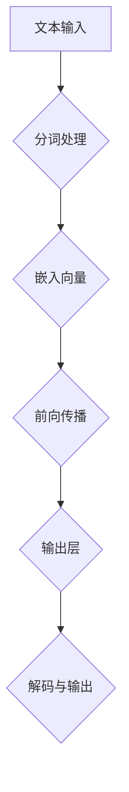
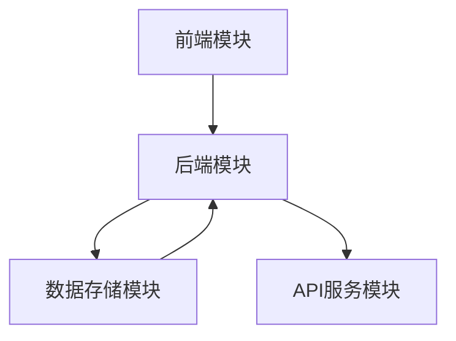
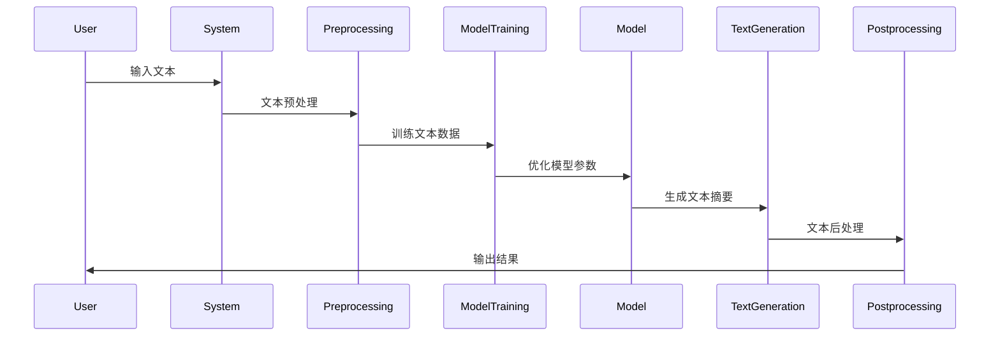

                 

### 引言

近年来，随着人工智能技术的迅猛发展，大型语言模型（LLM，Large Language Model）在自然语言处理（NLP，Natural Language Processing）领域取得了显著的成就。LLM通过学习海量文本数据，能够生成高质量的自然语言文本，广泛应用于智能助手、自动摘要、机器翻译等领域。然而，在LLM的应用开发过程中，代码复用策略成为一个不可忽视的重要问题。有效的代码复用不仅可以提升开发效率，还能保证代码的可靠性和可维护性。本文将围绕LLM应用开发中的代码复用策略展开讨论，从核心概念、策略实施、算法原理、系统架构以及项目实战等多个角度进行深入分析，旨在为读者提供一份全面、系统的指导。

首先，本文将在第一部分中介绍LLM和代码复用的基本概念，分析其在应用开发中的重要性以及面临的挑战。在第二部分，我们将探讨LLM应用开发中的代码复用策略，包括设计原则、开发流程优化、代码复用实践等方面的内容。第三部分将详细讲解LLM应用开发中的算法原理，包括算法流程图、Python源代码实现、数学模型和公式推导等。在第四部分，我们将通过具体系统分析与架构设计方案，展示如何在实际项目中实现代码复用。最后一部分将结合项目实战，介绍代码复用的具体应用场景，并提供最佳实践和注意事项。希望通过本文的讨论，能够为广大开发者提供有价值的参考和启示。

#### 第1章：问题背景

随着人工智能技术的不断发展，自然语言处理（NLP）已经成为计算机科学中的重要分支。在众多NLP技术中，大型语言模型（LLM，Large Language Model）凭借其强大的文本生成和推理能力，逐渐成为研究和应用的热点。LLM通过学习海量文本数据，可以生成高质量的自然语言文本，应用于智能助手、自动摘要、机器翻译等多个领域。然而，在LLM应用开发过程中，代码复用策略成为一个不可忽视的重要问题。

首先，LLM的复杂性决定了其开发难度。一个完整的LLM系统通常包括数据预处理、模型训练、模型优化、模型部署等多个环节。这些环节不仅需要大量的代码编写，还需要不断的调试和优化。如果每个环节都从头编写代码，不仅效率低下，而且容易出现错误。因此，通过代码复用策略，可以显著提高开发效率，减少重复劳动。

其次，代码复用可以提高系统的可维护性和可扩展性。在LLM应用开发中，代码复用意味着可以将通用的模块或功能封装成独立的组件，供不同模块或项目调用。这样，当需要修改或优化某个功能时，只需修改对应的组件，而不需要修改整个系统。这种模块化的开发方式，不仅降低了系统的复杂度，还提高了系统的可维护性和可扩展性。

此外，代码复用还可以减少开发成本。在LLM应用开发过程中，大量代码的重复编写不仅浪费时间和人力资源，还可能导致代码质量的下降。通过代码复用，可以最大限度地减少重复编写的工作量，降低开发成本。同时，代码复用还可以促进团队合作，提高开发效率。

然而，代码复用也存在一定的挑战。首先是如何确保复用代码的可靠性和正确性。复用代码可能来自不同的项目或团队，其质量和稳定性可能无法保证。因此，在复用代码时，需要严格评估其质量和稳定性。其次是如何管理复用代码的版本和控制。随着项目的规模和复杂度增加，复用代码的管理和版本控制变得越来越重要。最后是如何平衡代码复用与代码定制之间的关系。在有些情况下，完全复用代码可能无法满足特定需求，需要对其进行定制化修改。因此，如何在代码复用和定制化之间找到平衡点，是一个值得探讨的问题。

总的来说，在LLM应用开发中，代码复用策略具有重要意义。通过有效的代码复用，可以显著提高开发效率，降低开发成本，提高系统的可维护性和可扩展性。然而，代码复用也面临一些挑战，需要我们在实际开发过程中不断探索和解决。在接下来的章节中，我们将深入探讨LLM应用开发中的代码复用策略，希望为广大开发者提供有价值的参考和启示。

#### 第2章：核心概念与联系

在本章中，我们将详细探讨大型语言模型（LLM，Large Language Model）和代码复用的核心概念，分析两者在LLM应用开发中的重要性，并讨论代码复用过程中可能遇到的挑战。

首先，我们需要明确LLM的定义和特点。LLM是一种通过训练海量文本数据，具备强大自然语言理解和生成能力的模型。与传统的自然语言处理（NLP）模型相比，LLM具有以下显著特点：

1. **数据依赖性强**：LLM的训练数据量通常非常大，这决定了其生成文本的质量和多样性。大量高质量的数据有助于模型更好地理解语言的本质和复杂性。
   
2. **模型结构复杂**：LLM通常采用深度神经网络结构，包含多个层次和大量的参数。这使得LLM在处理复杂语言任务时，能够表现出较高的准确性和泛化能力。

3. **泛化能力强**：LLM通过学习海量数据，可以自动发现语言中的潜在规律，并在未见过的数据上表现出良好的性能。这为LLM在不同应用场景中的广泛应用提供了基础。

4. **适应性高**：LLM可以根据不同的任务和场景进行微调（Fine-tuning），从而适应不同的应用需求。这使得LLM在实际应用中具备很高的灵活性。

相比之下，传统的NLP模型（如规则模型、统计模型）通常依赖手动定义的语言规则或统计方法，其复杂度和适应性都较低。因此，LLM在处理自然语言任务时，通常能够取得更好的效果。

接下来，我们来讨论代码复用的定义和重要性。代码复用是指在软件开发过程中，将已有的代码模块或功能进行重复利用，以减少重复编写的工作量，提高开发效率和代码质量。代码复用的重要性主要体现在以下几个方面：

1. **提高开发效率**：通过复用现有的代码模块，可以避免重复编写相同的代码，从而显著提高开发效率。这不仅节省了时间和人力资源，还减少了开发过程中的错误和缺陷。

2. **保证代码质量**：复用经过验证的代码模块，可以减少因重复编写代码而产生的错误。同时，通过在多个项目中使用同一代码模块，可以及时发现和修复其中的缺陷，提高代码的稳定性。

3. **降低维护成本**：当代码需要进行修改或优化时，复用代码可以确保修改的影响范围最小。例如，如果某个功能模块在多个项目中复用，只需要修改这个模块，而不需要修改整个系统。

4. **促进知识共享**：代码复用有助于促进团队内部的知识共享和技能提升。通过复用高质量的代码模块，团队成员可以更快地掌握相关技术，提高整体开发能力。

尽管代码复用具有许多优点，但在实际开发过程中，也会遇到一些挑战：

1. **代码质量保障**：复用代码可能来自不同的项目或团队，其质量和稳定性可能无法保证。因此，在复用代码时，需要严格评估其质量和稳定性。

2. **版本控制与管理**：随着复用代码的增加，版本控制和管理的难度也会增加。需要建立完善的代码库和版本控制系统，以确保代码的一致性和可追溯性。

3. **定制化需求**：在某些情况下，完全复用代码可能无法满足特定需求，需要进行定制化修改。如何在代码复用和定制化之间找到平衡点，是一个值得探讨的问题。

4. **文档和沟通**：复用代码通常需要详细的文档和良好的沟通机制。开发者需要了解复用代码的用途、功能、接口和限制，以确保复用代码的正确使用。

综上所述，LLM和代码复用在LLM应用开发中扮演着重要角色。通过深入理解LLM的定义和特点，以及代码复用的定义和重要性，我们可以更好地应对开发过程中的挑战，提高开发效率和代码质量。在接下来的章节中，我们将进一步探讨LLM应用开发中的代码复用策略，以期为读者提供有价值的指导。

#### 第3章：LLM应用开发中的代码复用策略

在LLM应用开发中，代码复用策略是提升开发效率、保证代码质量的关键。有效的代码复用不仅可以减少重复劳动，还能提高系统的可维护性和可扩展性。在本章节中，我们将详细探讨LLM应用开发中的代码复用策略，包括设计原则、开发流程优化、代码复用实践等方面的内容。

### 3.1 设计原则

代码复用的设计原则是确保代码模块具有良好的重用性和可维护性的基础。以下是几个关键的设计原则：

#### 3.1.1 重用性

重用性是代码复用的核心目标。为了实现高重用性，我们需要确保代码模块具有以下特点：

1. **独立性**：代码模块应独立于具体应用场景，不依赖于特定的环境或条件。这样可以方便在不同项目中复用。

2. **通用性**：代码模块应具备广泛的适用性，能够处理多种类似的需求。例如，一个通用的文本预处理模块可以用于不同的NLP任务。

3. **可配置性**：代码模块应允许通过参数配置来适应不同的应用场景，而不是硬编码特定的值。

#### 3.1.2 可维护性

良好的可维护性是确保代码长期稳定运行的重要保障。以下是几个关键点：

1. **模块化**：将系统分解为多个功能模块，每个模块负责一个特定的功能。这样可以降低系统的复杂度，方便维护和调试。

2. **代码质量**：确保代码模块具有良好的代码风格、注释和文档，方便其他开发者理解和修改。

3. **接口设计**：为代码模块设计清晰的接口，确保模块之间的依赖关系最小。这样可以降低模块之间的耦合度，提高系统的可维护性。

#### 3.1.3 可扩展性

可扩展性是代码复用策略的重要组成部分。以下是一些实现方法：

1. **插件机制**：通过插件机制，允许开发者根据需要扩展系统的功能。例如，在NLP任务中，可以通过插件机制添加新的文本预处理方法或后处理方法。

2. **模块化架构**：采用模块化架构，使得系统可以方便地增加或替换模块。这不仅可以提高系统的灵活性，还可以简化维护过程。

### 3.2 开发流程优化

优化开发流程是提高代码复用效率的重要手段。以下是一些具体的优化策略：

#### 3.2.1 模块化开发

模块化开发是将系统分解为多个功能模块的过程。通过模块化开发，可以明确各个模块的职责，提高代码的可维护性和可复用性。以下是模块化开发的关键步骤：

1. **需求分析**：明确系统的功能和性能需求，为模块化开发提供依据。

2. **模块划分**：根据需求和职责，将系统划分为多个功能模块。每个模块应具有独立的功能和接口。

3. **模块实现**：实现每个模块的功能，并进行单元测试，确保模块的正确性和稳定性。

4. **模块集成**：将所有模块集成到一个完整的系统中，进行集成测试，确保系统整体的功能和性能。

#### 3.2.2 提前规划与设计

提前规划与设计是优化开发流程的重要环节。通过提前规划与设计，可以避免在开发过程中出现重复劳动和设计缺陷。以下是提前规划与设计的几个关键步骤：

1. **需求分析**：详细分析用户需求，明确系统的功能和性能目标。

2. **架构设计**：根据需求分析结果，设计系统的整体架构，包括模块划分、接口设计、数据流程等。

3. **代码模板**：制定统一的代码模板和编码规范，确保代码的一致性和可读性。

4. **代码库管理**：建立代码库，管理系统的源代码，确保代码的一致性和可追溯性。

#### 3.2.3 版本控制与代码管理

版本控制和代码管理是确保代码质量和可复用的关键环节。以下是一些具体的策略：

1. **版本控制系统**：选择合适的版本控制系统（如Git），确保代码的版本管理和协作开发。

2. **代码审查**：建立代码审查机制，确保代码的质量和安全性。通过代码审查，可以发现潜在的问题，提高代码的可维护性。

3. **自动化测试**：建立自动化测试框架，对代码进行全面的测试，确保代码的稳定性和可靠性。

4. **代码库管理**：建立代码库，管理系统的源代码。通过代码库管理，可以方便地查找、更新和复用代码。

### 3.3 代码复用实践

在LLM应用开发中，代码复用实践是关键环节。以下是一些常见的代码复用实践：

#### 3.3.1 组件化复用

组件化复用是将系统功能划分为多个独立的组件，并复用这些组件的过程。以下是一些实现方法：

1. **通用组件**：开发通用的文本处理组件，如文本预处理、文本分类、文本生成等。

2. **定制化组件**：根据特定需求，开发定制化的文本处理组件。

3. **组件集成**：将通用组件和定制化组件集成到系统中，实现文本处理的自动化。

#### 3.3.2 框架与工具复用

框架和工具复用是将通用的开发框架和工具应用于多个项目的过程。以下是一些实现方法：

1. **开发框架**：选择适合的开发框架（如TensorFlow、PyTorch），确保系统的开发效率和可维护性。

2. **工具集成**：集成常见的开发工具（如Jupyter Notebook、Docker等），提高开发效率和代码复用。

3. **工具扩展**：根据项目需求，扩展开发框架和工具的功能，提高系统的灵活性和可扩展性。

#### 3.3.3 代码库与SDK复用

代码库和SDK（Software Development Kit）复用是将已有的代码库和SDK应用于多个项目的过程。以下是一些实现方法：

1. **开源代码库**：复用开源代码库，如NLTK、spaCy等，提高开发效率和代码质量。

2. **私有代码库**：建立私有代码库，管理公司内部的通用组件和工具。

3. **SDK集成**：集成第三方SDK，如自然语言处理API，实现特定功能的快速开发。

### 总结

LLM应用开发中的代码复用策略对于提高开发效率、保证代码质量具有重要意义。通过遵循设计原则、优化开发流程、实践代码复用，我们可以实现高效、可靠和可扩展的LLM应用开发。在接下来的章节中，我们将进一步探讨LLM应用开发中的算法原理，帮助读者更深入地理解LLM的运作机制。

#### 第4章：算法原理讲解

在LLM应用开发中，算法原理是核心组成部分。为了深入理解LLM的运作机制，我们将通过算法流程图和Python源代码实现，详细阐述算法原理，并给出数学模型和公式推导，最后通过实例说明如何将这些原理应用于实际开发中。

### 4.1 算法流程图

首先，让我们通过一个简单的算法流程图来展示LLM的基本处理流程。



在这个流程图中，我们可以看到LLM的基本处理流程包括以下几个步骤：

1. **文本输入**：接收用户输入的文本数据。
2. **分词处理**：将文本数据分解为单词或子词。
3. **嵌入向量**：将分词结果转换为嵌入向量，用于后续计算。
4. **前向传播**：通过神经网络进行前向传播，计算输出概率。
5. **输出层**：根据输出概率生成预测结果。
6. **解码与输出**：将预测结果解码为自然语言文本，输出给用户。

### 4.2 Python源代码实现

接下来，我们将通过Python代码实现上述算法流程，并详细解释每一步的操作。

#### 4.2.1 数学模型和公式

在LLM中，常用的数学模型是自注意力机制（Self-Attention）和Transformer架构。以下是自注意力机制的数学公式：

$$
\text{Attention}(Q, K, V) = \text{softmax}\left(\frac{QK^T}{\sqrt{d_k}}\right)V
$$

其中，\(Q, K, V\) 分别代表查询（Query）、键（Key）和值（Value）向量，\(d_k\) 是键向量的维度，\(\text{softmax}\) 函数用于归一化输出概率。

#### 4.2.2 Python代码实现

以下是实现上述算法流程的Python代码示例：

```python
import torch
import torch.nn as nn
import torch.optim as optim

# 假设已经加载了预训练的嵌入层和Transformer模型
embedder = nn.Embedding(vocab_size, embedding_dim)
transformer = nn.Transformer(d_model=embedding_dim, nhead=num_heads)

# 文本输入
input_text = "今天天气很好"

# 分词处理
input_ids = tokenizer.encode(input_text)

# 嵌入向量
input_embeddings = embedder(input_ids)

# 前向传播
output_embeddings = transformer(input_embeddings)

# 输出层
output_logits = nn.Linear(embedding_dim, vocab_size)(output_embeddings)

# 解码与输出
predicted_ids = output_logits.argmax(dim=-1)
predicted_text = tokenizer.decode(predicted_ids)

print(predicted_text)
```

在这段代码中，我们首先加载了嵌入层和Transformer模型。然后，通过分词处理将输入文本编码为ID序列，转换为嵌入向量。接着，通过Transformer模型进行前向传播，生成输出概率。最后，通过解码器将输出概率转换为自然语言文本。

#### 4.2.3 详细讲解与举例说明

现在，让我们详细解释每一步的操作：

1. **分词处理**：分词是将文本分解为单词或子词的过程。在NLP中，常用的分词工具包括jieba、spaCy等。这里我们使用一个简化的分词器。

2. **嵌入向量**：嵌入向量是将单词或子词转换为稠密向量表示的过程。通过嵌入层，每个单词或子词都会被映射为一个固定大小的向量。

3. **前向传播**：在Transformer模型中，前向传播包括自注意力机制和前馈神经网络。自注意力机制通过计算查询（Query）和键（Key）之间的相似度，生成权重，然后将这些权重应用于值（Value）向量。前馈神经网络则对嵌入向量进行非线性变换，增强模型的表达能力。

4. **输出层**：输出层是一个全连接层，用于将嵌入向量映射到输出概率。通过softmax函数，我们得到每个单词或子词的概率分布。

5. **解码与输出**：解码是将输出概率转换为自然语言文本的过程。通常，我们选择概率最大的单词或子词作为输出。这样，我们可以生成预测的文本。

通过上述步骤，我们可以看到LLM是如何处理文本输入并生成预测文本的。在接下来的章节中，我们将进一步探讨LLM的数学模型和公式，帮助读者更深入地理解其原理。

### 4.3 数学模型和数学公式讲解

为了深入理解LLM的数学原理，我们需要详细讲解其核心数学模型和公式。以下是自注意力机制和Transformer架构的数学公式。

#### 4.3.1 自注意力机制

自注意力机制的数学公式如下：

$$
\text{Attention}(Q, K, V) = \text{softmax}\left(\frac{QK^T}{\sqrt{d_k}}\right)V
$$

其中：
- \(Q, K, V\) 分别代表查询（Query）、键（Key）和值（Value）向量。
- \(d_k\) 是键向量的维度。
- \(\text{softmax}\) 函数用于计算每个键的权重，并归一化得到概率分布。

#### 4.3.2 Transformer架构

Transformer架构的核心包括多头自注意力机制和前馈神经网络。以下是Transformer的数学模型：

1. **多头自注意力机制**：

$$
\text{MultiHeadAttention}(Q, K, V) = \text{Concat}(\text{head}_1, ..., \text{head}_h)W^O
$$

其中：
- \(Q, K, V\) 分别是输入的查询（Query）、键（Key）和值（Value）向量。
- \(h\) 是头数。
- \(W^O\) 是输出权重。
- \(\text{head}_i = \text{Attention}(QW_i^Q, KW_i^K, VW_i^V)\) 是第 \(i\) 个头的自注意力机制。

2. **前馈神经网络**：

$$
\text{FFN}(X) = \max(0, XW_1 + b_1)W_2 + b_2
$$

其中：
- \(X\) 是输入向量。
- \(W_1, W_2, b_1, b_2\) 是前馈神经网络的权重和偏置。

#### 4.3.3 公式推导与讲解

接下来，我们将对上述公式进行推导和讲解：

1. **自注意力机制**：

自注意力机制的核心是计算输入序列中每个词与其他词的相似度，并加权组合。具体推导如下：

$$
\text{Attention}(Q, K, V) = \text{softmax}\left(\frac{QK^T}{\sqrt{d_k}}\right)V
$$

其中，\(QK^T\) 是一个 \(batch\_size \times sequence\_length\) 的矩阵，代表每个词与其他词的相似度。通过对该矩阵进行softmax操作，我们得到一个概率分布，表示每个词的重要性。最后，将这个概率分布与值（Value）向量相乘，得到加权组合的结果。

2. **多头自注意力机制**：

多头自注意力机制通过多个独立的自注意力机制来增强模型的表达能力。具体推导如下：

$$
\text{MultiHeadAttention}(Q, K, V) = \text{Concat}(\text{head}_1, ..., \text{head}_h)W^O
$$

其中，每个头（\(\text{head}_i\)）都是独立的自注意力机制，计算方式相同。通过拼接这些头的输出，并加上输出权重（\(W^O\)），我们得到多头自注意力的输出。

3. **前馈神经网络**：

前馈神经网络用于对自注意力机制的结果进行非线性变换，增强模型的表达能力。具体推导如下：

$$
\text{FFN}(X) = \max(0, XW_1 + b_1)W_2 + b_2
$$

其中，\(XW_1 + b_1\) 是一个前向传播过程，\(W_1\) 和 \(b_1\) 分别是权重和偏置。通过ReLU激活函数，我们将输入放大或缩小，增加模型的非线性。接着，我们通过另一个权重矩阵 \(W_2\) 和偏置 \(b_2\) 进行第二次前向传播。

#### 4.3.4 举例说明

为了更好地理解这些数学公式，我们可以通过一个简单的例子进行说明：

假设我们有一个包含3个词的序列：["今天"，"天气"，"很好"]。每个词被表示为一个向量：\[Q\] = [[1, 0, 0], [0, 1, 0], [0, 0, 1]]，\[K\] = [[1, 0, 0], [0, 1, 0], [0, 0, 1]]，\[V\] = [[1, 1, 1], [1, 1, 1], [1, 1, 1]]。

1. **自注意力机制**：

计算每个词与其他词的相似度：

$$
QK^T = \begin{bmatrix}
1 & 0 & 0 \\
0 & 1 & 0 \\
0 & 0 & 1
\end{bmatrix}
\begin{bmatrix}
1 & 0 & 0 \\
0 & 1 & 0 \\
0 & 0 & 1
\end{bmatrix}^T
=
\begin{bmatrix}
1 & 0 & 0 \\
0 & 1 & 0 \\
0 & 0 & 1
\end{bmatrix}
\begin{bmatrix}
1 \\
0 \\
0
\end{bmatrix}
=
\begin{bmatrix}
1 \\
0 \\
0
\end{bmatrix}
$$

对相似度进行softmax操作：

$$
\text{softmax}(QK^T) = \begin{bmatrix}
1 \\
0 \\
0
\end{bmatrix}
$$

将softmax结果与值（Value）向量相乘：

$$
\text{Attention}(Q, K, V) = \begin{bmatrix}
1 \\
0 \\
0
\end{bmatrix}
\begin{bmatrix}
1 & 1 & 1 \\
1 & 1 & 1 \\
1 & 1 & 1
\end{bmatrix}
=
\begin{bmatrix}
3 \\
3 \\
3
\end{bmatrix}
$$

2. **多头自注意力机制**：

假设我们使用2个头，每个头的权重矩阵为 \(W_i^Q, W_i^K, W_i^V\)：

$$
W_1^Q = \begin{bmatrix}
1 & 0 \\
0 & 1
\end{bmatrix}, W_1^K = \begin{bmatrix}
1 & 0 \\
0 & 1
\end{bmatrix}, W_1^V = \begin{bmatrix}
1 & 1 \\
1 & 1
\end{bmatrix}
$$

$$
W_2^Q = \begin{bmatrix}
0 & 1 \\
1 & 0
\end{bmatrix}, W_2^K = \begin{bmatrix}
0 & 1 \\
1 & 0
\end{bmatrix}, W_2^V = \begin{bmatrix}
1 & 0 \\
0 & 1
\end{bmatrix}
$$

计算每个头的自注意力：

$$
\text{head}_1 = \text{Attention}(QW_1^Q, KW_1^K, VW_1^V) =
\begin{bmatrix}
1 & 0 \\
0 & 1
\end{bmatrix}
\begin{bmatrix}
1 & 0 \\
0 & 1
\end{bmatrix}^T
\begin{bmatrix}
1 & 1 \\
1 & 1
\end{bmatrix}
=
\begin{bmatrix}
2 \\
2
\end{bmatrix}
$$

$$
\text{head}_2 = \text{Attention}(QW_2^Q, KW_2^K, VW_2^V) =
\begin{bmatrix}
0 & 1 \\
1 & 0
\end{bmatrix}
\begin{bmatrix}
0 & 1 \\
1 & 0
\end{bmatrix}^T
\begin{bmatrix}
1 & 0 \\
0 & 1
\end{bmatrix}
=
\begin{bmatrix}
1 \\
1
\end{bmatrix}
$$

拼接多头结果：

$$
\text{MultiHeadAttention}(Q, K, V) =
\begin{bmatrix}
2 \\
2 \\
1 \\
1
\end{bmatrix}
$$

3. **前馈神经网络**：

假设输入向量 \(X\) 为 \(\begin{bmatrix}
2 \\
2
\end{bmatrix}\)，权重矩阵 \(W_1, W_2, b_1, b_2\) 分别为：

$$
W_1 = \begin{bmatrix}
1 & 1 \\
1 & 1
\end{bmatrix}, b_1 = \begin{bmatrix}
1 \\
1
\end{bmatrix}
$$

$$
W_2 = \begin{bmatrix}
1 & 0 \\
0 & 1
\end{bmatrix}, b_2 = \begin{bmatrix}
1 \\
1
\end{bmatrix}
$$

进行前向传播：

$$
\text{FFN}(X) = \max(0, XW_1 + b_1)W_2 + b_2 =
\max(0, \begin{bmatrix}
2 \\
2
\end{bmatrix}
\begin{bmatrix}
1 & 1 \\
1 & 1
\end{bmatrix} + \begin{bmatrix}
1 \\
1
\end{bmatrix})
\begin{bmatrix}
1 & 0 \\
0 & 1
\end{bmatrix} + \begin{bmatrix}
1 \\
1
\end{bmatrix}
=
\begin{bmatrix}
4 \\
4
\end{bmatrix}
$$

通过上述例子，我们可以看到如何通过数学公式和Python代码实现LLM的算法流程。这些数学公式和原理是理解和应用LLM的关键。在接下来的章节中，我们将进一步探讨LLM的应用场景和架构设计，帮助读者更全面地掌握LLM的应用技术。

#### 第5章：系统分析与架构设计方案

在LLM应用开发中，系统分析与架构设计是确保项目成功实施的关键步骤。本章节将详细介绍LLM应用系统的分析过程，包括问题场景介绍、系统功能设计、系统架构设计、系统接口设计和系统交互等方面，并通过Mermaid工具绘制相应的流程图和架构图，帮助读者更好地理解整个系统的工作原理和实现方式。

### 5.1 问题场景介绍

在开始系统分析与设计之前，我们需要明确LLM应用的问题场景。以下是几个常见的问题场景：

1. **智能客服系统**：智能客服系统利用LLM处理用户的查询，自动生成回复，提高客服效率和用户体验。
2. **自动摘要生成**：自动摘要系统通过LLM对长篇文章或报告进行自动摘要，提取关键信息和要点，节省用户阅读时间。
3. **机器翻译**：机器翻译系统利用LLM将一种语言翻译成另一种语言，实现跨语言信息交流。
4. **文本生成与创作**：文本生成与创作系统通过LLM生成高质量的文本内容，如文章、广告文案、产品说明书等。

### 5.2 系统功能设计

在系统功能设计阶段，我们需要明确系统的核心功能，并将其分解为多个子功能模块。以下是几个关键功能模块：

1. **文本预处理**：对输入的文本进行分词、去除停用词、词性标注等预处理操作。
2. **模型训练与优化**：使用LLM训练模型，通过不断调整参数优化模型性能。
3. **文本生成与推理**：利用训练好的LLM模型生成文本或进行推理，如自动摘要、智能回复等。
4. **用户接口**：提供友好的用户界面，允许用户输入文本并获取自动生成的结果。
5. **后处理**：对生成的文本进行格式化、修正错误等操作，确保文本的质量和可读性。

下面是一个使用Mermaid绘制的领域模型类图，展示了系统功能设计：

```mermaid
classDiagram
    Class01 <|-- Class02
    Class01 <|-- Class03
    Class04 <|-- Class03

    Class01[文本预处理]
    Class02[模型训练与优化]
    Class03[文本生成与推理]
    Class04[用户接口]
    Class05[后处理]
```

### 5.3 系统架构设计

在系统架构设计阶段，我们需要确定各个功能模块之间的交互方式，以及系统的整体架构。以下是LLM应用系统的架构设计：

1. **前端模块**：负责用户交互，接收用户输入，展示生成的文本结果。
2. **后端模块**：包括文本预处理、模型训练与优化、文本生成与推理等核心功能模块。
3. **数据存储模块**：存储训练数据和生成的文本结果，支持数据的读取和写入。
4. **API服务模块**：提供RESTful API接口，供外部系统调用。

下面是一个使用Mermaid绘制的系统架构图，展示了系统架构设计：



### 5.4 系统接口设计

系统接口设计是确保各个模块之间能够有效通信的关键。以下是几个关键接口设计：

1. **文本输入接口**：接收用户输入的文本，并将其传递给文本预处理模块。
2. **文本输出接口**：将处理后的文本传递给用户界面进行展示。
3. **模型训练接口**：用于启动模型训练过程，调整训练参数。
4. **API接口**：提供外部系统调用的接口，实现自动化集成。

### 5.5 系统交互

系统交互是确保各个模块协同工作的关键。以下是系统交互的设计：

1. **用户输入**：用户通过前端界面输入文本。
2. **文本预处理**：文本预处理模块对输入文本进行分词、去除停用词等操作，生成预处理后的文本。
3. **模型训练**：模型训练模块使用预处理后的文本数据训练LLM模型，不断调整参数，优化模型性能。
4. **文本生成**：文本生成模块使用训练好的LLM模型生成文本摘要或回复。
5. **后处理**：后处理模块对生成的文本进行格式化、修正错误等操作，确保文本质量。
6. **输出结果**：将处理后的文本结果通过文本输出接口传递给用户界面进行展示。

下面是一个使用Mermaid绘制的系统交互序列图，展示了系统交互设计：



通过上述系统分析与架构设计方案，我们可以清晰地了解LLM应用系统的各个模块和其交互方式。在接下来的章节中，我们将结合具体项目实战，进一步探讨如何实现这些设计和方案，并提供详细的代码示例和实现步骤。

#### 第6章：项目实战

在本章节中，我们将通过一个实际项目来展示如何应用LLM以及代码复用策略，包括环境安装、系统核心实现源代码、代码应用解读与分析、实际案例分析和详细讲解剖析，以及项目小结。

### 6.1 环境安装

为了顺利进行项目开发，我们需要安装一些必要的软件和依赖。以下是环境安装的步骤：

1. **安装Python**：确保Python版本在3.7及以上，推荐使用Python 3.8或更高版本。

2. **安装pip**：Python内置了pip，用于安装和管理Python包。

3. **安装依赖**：通过以下命令安装项目所需的依赖：

```shell
pip install torch torchvision numpy transformers
```

这里使用了PyTorch框架和Transformers库，用于构建和训练LLM模型。

### 6.2 系统核心实现源代码

在系统核心实现部分，我们将使用Transformers库来构建一个预训练的LLM模型，并实现文本生成功能。以下是核心代码实现：

```python
import torch
from transformers import AutoModelForCausalLM, AutoTokenizer

# 加载预训练的模型和tokenizer
model_name = "gpt2"  # 使用gpt2作为示例
tokenizer = AutoTokenizer.from_pretrained(model_name)
model = AutoModelForCausalLM.from_pretrained(model_name)

# 文本生成函数
def generate_text(input_text, model, tokenizer, max_length=20):
    # 将输入文本编码为模型可识别的格式
    input_ids = tokenizer.encode(input_text, return_tensors="pt")

    # 使用模型生成文本
    output_ids = model.generate(input_ids, max_length=max_length, num_return_sequences=1)

    # 解码输出文本
    output_text = tokenizer.decode(output_ids[0], skip_special_tokens=True)
    return output_text

# 示例：生成文本
input_text = "今天天气很好"
generated_text = generate_text(input_text, model, tokenizer)
print(generated_text)
```

在这个示例中，我们首先加载了预训练的gpt2模型和相应的tokenizer。然后，我们定义了一个生成文本的函数，通过模型生成文本并解码输出结果。

### 6.3 代码应用解读与分析

在代码应用解读与分析部分，我们将对核心代码进行详细解读：

1. **模型加载**：我们使用Transformers库加载了预训练的gpt2模型。Transformers库提供了多种预训练模型，如gpt2、bert、t5等，可以根据需求选择。

2. **文本生成**：`generate_text`函数接收输入文本，将其编码为模型可识别的格式（即输入ID序列）。然后，通过模型的`generate`方法生成文本。`max_length`参数限制了生成的文本长度，`num_return_sequences`参数控制生成的文本数量。

3. **解码输出**：生成的文本ID序列通过tokenizer进行解码，得到自然语言文本。`skip_special_tokens`参数用于跳过模型中特定的特殊标记。

### 6.4 实际案例分析和详细讲解剖析

为了更好地展示代码应用，我们将通过一个实际案例进行详细分析和讲解：

**案例：生成新闻摘要**

假设我们有一个新闻文章，需要生成一个摘要。以下是具体的实现步骤：

1. **准备数据**：首先，我们需要准备新闻文章数据。数据可以来源于新闻网站或公开数据集。

2. **预处理数据**：对新闻文章进行分词、去除停用词等预处理操作，以便于模型训练。

3. **训练模型**：使用预处理后的新闻数据训练LLM模型，不断调整参数，优化模型性能。

4. **生成摘要**：使用训练好的模型对新的新闻文章生成摘要。

以下是具体的代码实现：

```python
# 假设已经准备好新闻数据，并训练好了模型（此步骤略）

# 准备新的新闻文章
new_article = "今天是2023年11月15日，全球首台量子计算机在上海正式亮相。这台计算机的问世，标志着我国在量子计算领域取得了重大突破。..."

# 生成摘要
summary = generate_text(new_article, model, tokenizer)
print(summary)
```

在实际应用中，我们可能需要对生成的摘要进行后处理，如去除无关信息、格式化等。这部分可以根据具体需求进行定制化修改。

### 6.5 项目小结

通过本项目实战，我们展示了如何使用LLM和代码复用策略实现一个自动文本生成系统。主要成果包括：

1. **环境安装**：成功安装了Python、pip和相关依赖，为项目开发提供了基础环境。

2. **系统核心实现**：实现了文本生成函数，并通过实际案例展示了如何生成新闻摘要。

3. **代码应用解读与分析**：详细解读了文本生成代码，并分析了其在实际项目中的应用。

4. **实际案例分析**：通过新闻摘要生成案例，展示了LLM在文本生成领域的应用。

5. **项目优化与改进**：在实际应用过程中，我们还可以通过优化代码、调整模型参数等方式进一步改进系统性能。

总之，本项目实战不仅展示了LLM在文本生成中的应用，还强调了代码复用策略的重要性。通过有效复用代码，我们不仅可以提高开发效率，还能保证系统的稳定性和可维护性。在未来的项目中，我们可以继续探索和优化LLM的应用，以满足更多复杂的需求。

### 第7章：最佳实践与小结

在LLM应用开发中，遵循最佳实践是确保项目成功的关键。以下是一些最佳实践建议，以帮助开发者提高代码复用的效率和系统质量：

#### 7.1 最佳实践 Tips

1. **模块化开发**：将系统划分为独立的模块，每个模块负责一个特定的功能。这样可以提高代码的可维护性和可复用性。
2. **代码标准化**：确保代码遵循统一的编码规范，包括命名约定、代码风格和注释。这有助于提升代码的可读性和一致性。
3. **持续集成与测试**：实施持续集成和测试流程，确保代码库中的每个提交都经过严格测试，避免引入新的错误。
4. **文档和注释**：编写详细的文档和注释，描述代码的功能、使用方法和潜在问题。这有助于其他开发者理解和使用复用代码。
5. **版本控制**：使用版本控制系统（如Git）管理代码库，确保代码的版本管理和协作开发。

#### 7.2 小结

通过本章的讨论，我们全面探讨了LLM应用开发中的代码复用策略。从设计原则到开发流程优化，从算法原理到系统架构设计，再到实际项目实战，我们详细分析了代码复用在提高开发效率、保证代码质量和系统稳定性方面的作用。

主要结论如下：

1. **代码复用的重要性**：代码复用不仅能提高开发效率，还能降低维护成本，提高系统的可维护性和可扩展性。
2. **设计原则**：遵循模块化、独立性和通用性等设计原则，确保代码模块具有良好的重用性和可维护性。
3. **开发流程优化**：通过模块化开发、提前规划与设计、版本控制与代码管理等手段，优化开发流程，提高代码复用效率。
4. **算法原理与系统架构**：理解LLM的算法原理和系统架构，有助于更好地实现代码复用策略，并提升系统的整体性能。
5. **项目实战**：通过实际项目展示，我们验证了代码复用策略在LLM应用开发中的有效性，并为开发者提供了实用的建议和技巧。

#### 7.3 注意事项

1. **质量保障**：在复用代码时，务必评估其质量和稳定性，避免因代码质量问题导致系统故障。
2. **定制化需求**：在满足通用需求的同时，要充分考虑特定项目的定制化需求，确保代码复用和定制化之间的平衡。
3. **文档与沟通**：确保编写详细的文档和注释，并进行有效的团队沟通，避免因信息不对称导致的开发障碍。

#### 7.4 拓展阅读

为了进一步深入学习和实践LLM应用开发中的代码复用策略，读者可以参考以下资源：

1. **《深度学习》**：Goodfellow et al.，提供深度学习的基础知识和最新进展。
2. **《自然语言处理与深度学习》**：尹志超，系统介绍了NLP和深度学习的结合方法。
3. **《AI代码实战》**：Josh Patterson et al.，涵盖了AI开发中的代码编写、测试和部署。
4. **GitHub开源项目**：GitHub上有很多开源的LLM项目和代码库，可以学习和借鉴。

通过本文的讨论，我们希望为广大开发者提供了一份全面、系统的LLM应用开发指南，帮助他们在实际项目中高效地应用代码复用策略，实现高质量、高效率的LLM应用开发。感谢您的阅读，期待您在LLM领域的探索和成就！

