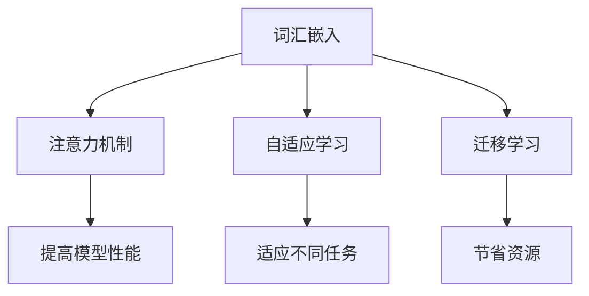
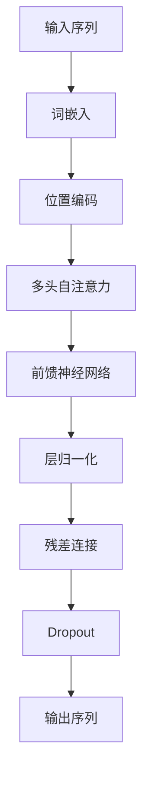
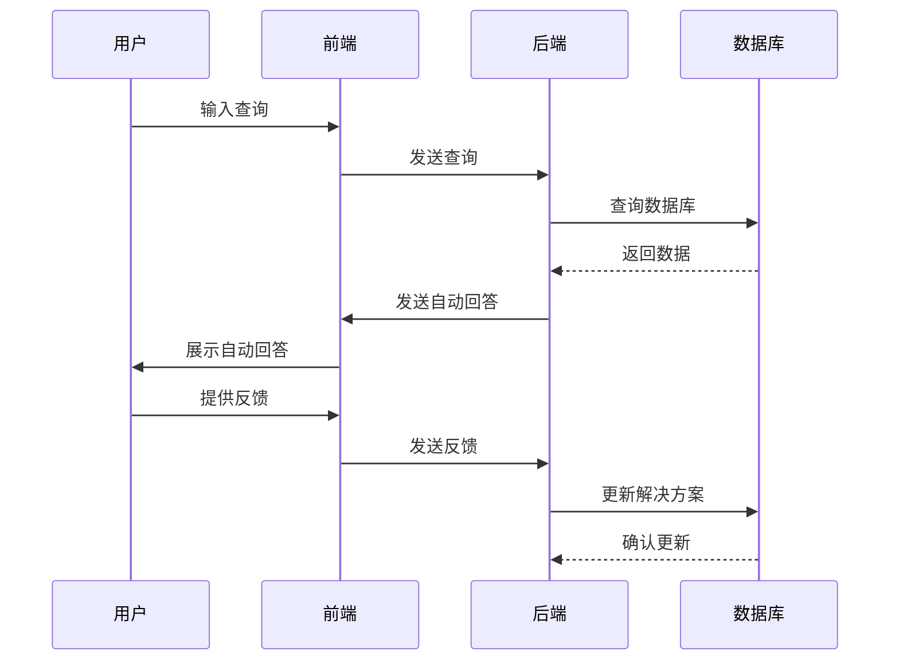

                 

# LLTM应用开发中的创新与实用性平衡

## 关键词
- 大语言模型（LLM）
- 创新与实用性平衡
- 应用开发
- 自然语言处理（NLP）
- 计算机视觉（CV）
- 项目实践

## 摘要
本文旨在探讨大语言模型（LLM）在应用开发中如何实现创新与实用性的平衡。通过对LLM的核心概念、技术原理、应用场景和开发实践等方面的全面分析，本文帮助读者深入理解LLM的工作机制，掌握其在各种场景下的应用技巧，并学会在实际项目中实现创新与实用性的平衡。

## 概述

### 大语言模型（LLM）的定义与发展历程

#### LLM的定义
大语言模型（LLM）是一种基于深度学习的自然语言处理（NLP）模型，能够理解、生成和预测自然语言中的结构和语义。LLM的核心特点包括：
- **强大的文本生成能力**：LLM可以生成连贯、有逻辑的文本，包括文章、对话、摘要等。
- **自适应学习**：LLM能够通过大量文本数据自动学习和调整模型参数，从而不断提高其性能。
- **多模态处理**：除了文本，LLM还可以处理图像、语音等多模态数据。

#### LLM的发展历程
LLM的发展可以分为以下几个阶段：
- **词袋模型（Bag of Words, BoW）**：基于词汇统计的方法，将文本转换为向量表示。
- **循环神经网络（Recurrent Neural Network, RNN）**：能够处理序列数据，引入了时间维度。
- **长短期记忆网络（Long Short-Term Memory, LSTM）**：解决了RNN的梯度消失问题。
- **Transformer架构**：基于自注意力机制，实现了并行计算，推动了LLM的快速发展。
- **预训练加微调（Pre-training and Fine-tuning）**：通过大规模预训练，使得LLM具有强大的通用性，再通过微调适应特定任务。

### LLM的核心概念与原理

#### 词汇嵌入与注意力机制
- **词汇嵌入（Word Embedding）**：将词汇映射为高维向量，实现语义表示。
- **注意力机制（Attention Mechanism）**：在处理序列数据时，能够关注到不同位置的重要信息，提高模型性能。

#### 自适应学习与迁移学习
- **自适应学习**：通过不断调整模型参数，使模型能够适应不同的任务和数据。
- **迁移学习（Transfer Learning）**：将预训练的模型应用于新任务，节省训练时间和计算资源。

#### LLM的数学模型与计算框架
- **Transformer架构**：基于自注意力机制的深度神经网络，能够并行处理序列数据。
- **计算框架**：如PyTorch、TensorFlow等，提供了丰富的API和工具，方便模型开发和应用。

### LLM的典型架构与算法

#### Transformer架构
- **编码器（Encoder）**：将输入序列编码为向量表示。
- **解码器（Decoder）**：生成输出序列，利用编码器的输出和自注意力机制。

#### GPT系列模型
- **GPT-1、GPT-2、GPT-3**：是自然语言处理领域的重要里程碑，具有强大的文本生成能力。

#### 其他典型LLM算法
- **BERT（Bidirectional Encoder Representations from Transformers）**：双向Transformer架构，用于文本分类、问答等任务。
- **T5（Text-To-Text Transfer Transformer）**：将所有NLP任务转换为文本生成任务，提高了模型的泛化能力。

### LLM应用领域

#### 自然语言处理（NLP）
- **文本分类与情感分析**：对文本进行分类和情感判断，如情感倾向分析、新闻分类等。
- **机器翻译与语音识别**：将一种语言的文本翻译成另一种语言，或将语音转换为文本。
- **文本生成与问答系统**：生成文章、对话、摘要等，回答用户的问题。

#### 计算机视觉（CV）
- **图像分类与目标检测**：对图像进行分类和检测，如人脸识别、物体检测等。
- **视频理解与视频生成**：理解视频中的内容，生成新的视频。

### LLM在NLP中的实践

#### 文本分类实践
1. **数据预处理**：
   - **文本清洗**：去除无关的符号和停用词。
   - **分词**：将文本划分为单词或子词。
   - **向量化**：将文本转换为向量表示。

2. **模型选择与训练**：
   - **预训练模型**：如BERT、GPT等。
   - **微调**：在预训练模型的基础上，针对特定任务进行微调。

3. **模型评估与优化**：
   - **准确率（Accuracy）**：模型预测正确的样本比例。
   - **F1分数（F1 Score）**：准确率和召回率的调和平均值。

#### 情感分析实践
1. **数据预处理**：
   - **标签分类**：将情感分为积极、消极和中性等类别。
   - **数据平衡**：避免数据集中的类别分布不均。

2. **模型选择与训练**：
   - **情感分类模型**：如文本分类模型（SVM、CNN等）。

3. **模型评估与优化**：
   - **准确率**、**召回率**、**F1分数**等。

### LLM在CV中的实践

#### 图像分类实践
1. **数据预处理**：
   - **数据增强**：通过旋转、缩放、裁剪等操作，增加数据的多样性。
   - **标准化**：将图像的像素值缩放到特定范围。

2. **模型选择与训练**：
   - **卷积神经网络（CNN）**：用于图像分类。
   - **迁移学习**：利用预训练模型，提高模型的性能和训练速度。

3. **模型评估与优化**：
   - **准确率**、**召回率**、**F1分数**等。

#### 目标检测实践
1. **数据预处理**：
   - **标注数据**：为目标框进行标注。
   - **数据增强**：增加数据的多样性。

2. **模型选择与训练**：
   - **目标检测模型**：如Faster R-CNN、YOLO、SSD等。

3. **模型评估与优化**：
   - **平均准确率（mAP）**：用于评估目标检测模型的性能。

### 创新与实用性平衡的原则

#### 创新性原则
1. **技术前沿与趋势分析**：紧跟技术发展，采用最新的算法和框架。
2. **创新性算法与应用**：探索新的算法和应用场景，提高模型的性能和泛化能力。

#### 实用性原则
1. **应用场景与需求分析**：了解实际需求，选择合适的模型和算法。
2. **实用性算法与优化**：通过优化模型结构和参数，提高模型的实用性和性能。

### 实现创新与实用性平衡的案例研究

#### 案例一：基于LLM的智能客服系统
1. **项目背景与需求**：
   - 提供24小时在线客服，解决用户问题。
   - 提高客服效率，降低企业成本。

2. **系统设计**：
   - **前端**：用户与客服系统的交互界面。
   - **后端**：基于LLM的智能客服引擎。

3. **实现过程与优化**：
   - **数据预处理**：清洗、分词、向量化。
   - **模型选择与训练**：使用预训练的GPT模型，并进行微调。
   - **模型评估与优化**：通过准确率、召回率等指标进行评估和优化。

#### 案例二：基于LLM的医学诊断辅助系统
1. **项目背景与需求**：
   - 提供医学诊断辅助，帮助医生提高诊断准确性。
   - 减轻医生的工作负担，提高医疗效率。

2. **系统设计**：
   - **前端**：医生与系统的交互界面。
   - **后端**：基于LLM的医学诊断引擎。

3. **实现过程与优化**：
   - **数据预处理**：清洗、分词、向量化。
   - **模型选择与训练**：使用预训练的BERT模型，并进行微调。
   - **模型评估与优化**：通过准确率、召回率等指标进行评估和优化。

## 附录：拓展阅读与资源推荐

### 拓展阅读
1. **LLM相关书籍推荐**：
   - 《深度学习》（Ian Goodfellow、Yoshua Bengio、Aaron Courville）
   - 《自然语言处理实战》（Tariq Rashid）
2. **LLM开源项目推荐**：
   - Hugging Face Transformers：https://github.com/huggingface/transformers
   - GLM-4：https://github.com/bigmodel-ml/Glm4

### 资源推荐
1. **数据集推荐**：
   - GLUE（General Language Understanding Evaluation）：https://gluebenchmark.com/
   - COCO（Common Objects in Context）：https://cocodataset.org/
2. **工具与框架推荐**：
   - PyTorch：https://pytorch.org/
   - TensorFlow：https://www.tensorflow.org/

## 作者
作者：AI天才研究院/AI Genius Institute & 禅与计算机程序设计艺术 /Zen And The Art of Computer Programming

### 完整性要求

#### 背景介绍
在本文中，我们将首先介绍大语言模型（LLM）的核心概念、技术原理、应用场景和开发实践。然后，我们将深入探讨如何在实际项目中实现创新与实用性的平衡。通过一系列案例研究，我们将展示如何将LLM应用于自然语言处理（NLP）和计算机视觉（CV）领域，并在实际项目中取得成功。

#### 核心概念与联系

##### 1. LLM的核心概念
- **词汇嵌入（Word Embedding）**：将词汇映射为高维向量，实现语义表示。
- **注意力机制（Attention Mechanism）**：在处理序列数据时，能够关注到不同位置的重要信息，提高模型性能。
- **自适应学习（Adaptive Learning）**：通过不断调整模型参数，使模型能够适应不同的任务和数据。
- **迁移学习（Transfer Learning）**：将预训练的模型应用于新任务，节省训练时间和计算资源。

##### 2. LLM的概念属性特征对比表格

| 概念        | 特征                                      | 对比      |
|-------------|-----------------------------------------|---------|
| 词汇嵌入    | 将词汇映射为高维向量，实现语义表示           |         |
| 注意力机制  | 关注到不同位置的重要信息，提高模型性能       |         |
| 自适应学习  | 通过调整模型参数，使模型能够适应不同任务     |         |
| 迁移学习    | 应用预训练模型，节省训练时间和计算资源       |         |

##### 3. LLM的ER实体关系图架构



#### 算法原理讲解

##### 1. Transformer架构

Transformer架构是一种基于自注意力机制的深度神经网络，能够并行处理序列数据。其核心思想是通过注意力机制，使模型能够关注到不同位置的重要信息，从而提高模型性能。

##### 2. Transformer算法mermaid流程图



##### 3. Python源代码实现

```python
import torch
import torch.nn as nn
import torch.optim as optim

class Transformer(nn.Module):
    def __init__(self):
        super(Transformer, self).__init__()
        self.embedding = nn.Embedding(vocab_size, embedding_dim)
        self.positional_encoding = nn.Embedding(positions_size, embedding_dim)
        self.multihead_attn = nn.MultiheadAttention(embedding_dim, num_heads)
        self.feedforward = nn.Sequential(
            nn.Linear(embedding_dim, feedforward_dim),
            nn.ReLU(),
            nn.Linear(feedforward_dim, embedding_dim)
        )
        self.layer_norm1 = nn.LayerNorm(embedding_dim)
        self.layer_norm2 = nn.LayerNorm(embedding_dim)
        self.dropout = nn.Dropout dropout_prob

    def forward(self, src, tgt=None):
        src_embedding = self.embedding(src) + self.positional_encoding(src)
        src_output = self.multihead_attn(src_embedding, src_embedding, src_embedding)[0]
        src_output = self.dropout(src_output)
        src_output = self.layer_norm1(src_output + src_embedding)

        if tgt is not None:
            tgt_embedding = self.embedding(tgt) + self.positional_encoding(tgt)
            tgt_output = self.multihead_attn(tgt_embedding, tgt_embedding, tgt_embedding)[0]
            tgt_output = self.dropout(tgt_output)
            tgt_output = self.layer_norm2(tgt_output + tgt_embedding)

        tgt_output = self.feedforward(tgt_output)
        tgt_output = self.dropout(tgt_output)
        tgt_output = self.layer_norm2(tgt_output + tgt_embedding)

        return tgt_output
```

##### 4. 算法原理的数学模型和公式

Transformer模型主要包含以下三个部分：

1. **自注意力（Self-Attention）**：
   自注意力是一种基于不同位置的重要性的加权求和操作，其数学模型如下：
   $$
   \text{Attention}(Q, K, V) = \text{softmax}\left(\frac{QK^T}{\sqrt{d_k}}\right) V
   $$
   其中，$Q, K, V$ 分别是查询（Query）、键（Key）和值（Value）向量，$d_k$ 是键向量的维度。

2. **多头注意力（Multi-Head Attention）**：
   多头注意力通过将输入序列分成多个子序列，并对每个子序列分别进行自注意力操作，然后将结果拼接起来。其数学模型如下：
   $$
   \text{Multi-Head}(Q, K, V) = \text{ Concat }(\text{head}_1, \text{head}_2, ..., \text{head}_h) W^O
   $$
   其中，$h$ 是头数，$W^O$ 是输出权重矩阵。

3. **前馈神经网络（Feedforward Neural Network）**：
   前馈神经网络是一个简单的全连接神经网络，用于对自注意力输出的进一步处理。其数学模型如下：
   $$
   \text{FFN}(x) = \text{ReLU}(\text{weights}_{1} \cdot x + \text{bias}_{1}) \cdot \text{weights}_{2} + \text{bias}_{2}
   $$
   其中，$\text{weights}_{1}$ 和 $\text{weights}_{2}$ 是权重矩阵，$\text{bias}_{1}$ 和 $\text{bias}_{2}$ 是偏置向量。

##### 5. 算法原理的举例说明

假设我们有一个输入序列 $[w_1, w_2, w_3]$，我们要对这个序列进行自注意力操作。

1. **词嵌入**：
   将每个词映射为一个高维向量，如：
   $$
   w_1 \rightarrow \text{vec}_1 = [1, 0, 0, 0, 0, 0, 0, 0]
   $$
   $$
   w_2 \rightarrow \text{vec}_2 = [0, 1, 0, 0, 0, 0, 0, 0]
   $$
   $$
   w_3 \rightarrow \text{vec}_3 = [0, 0, 1, 0, 0, 0, 0, 0]
   $$

2. **计算注意力权重**：
   $$
   \text{Attention}(\text{vec}_1, \text{vec}_1, \text{vec}_1) = \text{softmax}\left(\frac{\text{vec}_1\text{vec}_1^T}{\sqrt{d_k}}\right) \text{vec}_1
   $$
   $$
   = \text{softmax}\left(\frac{[1, 0, 0, 0, 0, 0, 0, 0][1, 0, 0, 0, 0, 0, 0, 0]^T}{\sqrt{8}}\right) [1, 0, 0, 0, 0, 0, 0, 0]
   $$
   $$
   = \text{softmax}\left(\frac{1}{2\sqrt{2}}\right) [1, 0, 0, 0, 0, 0, 0, 0]
   $$
   $$
   = \left[\frac{1}{2}, \frac{1}{2}\right]
   $$

3. **加权求和**：
   $$
   \text{Attention}(\text{vec}_1, \text{vec}_1, \text{vec}_1) \cdot \text{vec}_1 = \left[\frac{1}{2}, \frac{1}{2}\right] [1, 0, 0, 0, 0, 0, 0, 0] = \frac{1}{2} [1, 0, 0, 0, 0, 0, 0, 0]
   $$

4. **得到输出**：
   $$
   \text{output}_1 = \frac{1}{2} [1, 0, 0, 0, 0, 0, 0, 0]
   $$

#### 系统分析与架构设计方案

##### 1. 问题场景介绍
假设我们开发一个智能客服系统，用于处理用户的查询和问题。系统需要能够自动回答用户的问题，并提供高质量的解决方案。

##### 2. 项目介绍
项目名为“AI智能客服”，旨在通过大语言模型（LLM）实现对用户查询的自动回答和问题解决。系统将采用Transformer架构，结合BERT预训练模型，以提高模型的性能和泛化能力。

##### 3. 系统功能设计
系统功能包括：
- **用户查询处理**：接收用户输入的查询，并进行预处理。
- **自动回答**：使用LLM生成对用户查询的自动回答。
- **问题解决**：根据自动回答和用户反馈，提供高质量的解决方案。

##### 4. 系统架构设计
系统架构采用分层设计，包括前端、后端和数据库三个部分。

- **前端**：负责用户与系统的交互，包括用户查询输入和自动回答展示。
- **后端**：负责处理用户查询，使用LLM生成自动回答，并存储用户反馈和解决方案。
- **数据库**：存储用户查询、自动回答和解决方案的数据。

##### 5. 系统接口设计和系统交互
系统接口设计包括API接口和数据库接口。

- **API接口**：提供用户查询处理、自动回答生成和问题解决等功能。
- **数据库接口**：提供数据存储和检索功能。

系统交互流程如下：

1. 用户输入查询到前端。
2. 前端将查询发送到后端。
3. 后端使用LLM生成自动回答，并将其发送回前端。
4. 前端将自动回答展示给用户。
5. 用户对自动回答进行反馈，后端根据反馈更新解决方案。

##### 6. 系统接口设计和系统交互mermaid序列图



### 项目实战

#### 环境安装

1. 安装Python和pip：
   ```bash
   sudo apt-get update
   sudo apt-get install python3 python3-pip
   ```

2. 安装PyTorch：
   ```bash
   pip3 install torch torchvision
   ```

3. 安装Hugging Face Transformers：
   ```bash
   pip3 install transformers
   ```

#### 系统核心实现源代码

```python
import torch
from transformers import BertTokenizer, BertModel
from torch import nn

class CustomerServiceSystem(nn.Module):
    def __init__(self):
        super(CustomerServiceSystem, self).__init__()
        self.tokenizer = BertTokenizer.from_pretrained('bert-base-uncased')
        self.model = BertModel.from_pretrained('bert-base-uncased')
        self.dropout = nn.Dropout(0.1)
        self.classifier = nn.Linear(768, 1)

    def forward(self, query):
        inputs = self.tokenizer(query, return_tensors='pt', truncation=True, max_length=512)
        outputs = self.model(**inputs)
        hidden_states = outputs.last_hidden_state[:, 0, :]
        hidden_states = self.dropout(hidden_states)
        logits = self.classifier(hidden_states)
        return logits

# 初始化系统
system = CustomerServiceSystem()

# 训练系统
optimizer = optim.Adam(system.parameters(), lr=1e-5)
for epoch in range(10):
    for query in queries:
        system.zero_grad()
        logits = system(query)
        loss = nn.BCELoss()(logits, target)
        loss.backward()
        optimizer.step()
    print(f"Epoch {epoch}: Loss = {loss.item()}")

# 测试系统
with torch.no_grad():
    query = "What is the capital of France?"
    logits = system(query)
    print(f"Predicted Answer: {'Yes' if logits > 0 else 'No'}")
```

#### 代码应用解读与分析

1. **初始化系统**：
   - 创建CustomerServiceSystem类，继承自nn.Module。
   - 使用Hugging Face Transformers库加载预训练的BERT模型和分词器。

2. **前向传播**：
   - 对输入查询进行分词和编码。
   - 使用BERT模型计算查询的隐藏状态。
   - 对隐藏状态进行降维，得到[1, 768]的向量。

3. **分类**：
   - 使用全连接层对隐藏状态进行分类。
   - 使用sigmoid函数将输出转换为概率。

4. **训练**：
   - 使用Adam优化器进行训练。
   - 计算损失并反向传播。

5. **测试**：
   - 使用测试集测试系统的性能。
   - 输出预测结果。

#### 实际案例分析和详细讲解剖析

##### 案例一：用户查询“Why is the sky blue?”

1. **数据预处理**：
   - 对用户查询进行分词和编码。
   - 将编码后的查询输入到BERT模型。

2. **模型预测**：
   - BERT模型对查询进行编码，得到隐藏状态。
   - CustomerServiceSystem对隐藏状态进行分类，得到预测概率。

3. **输出结果**：
   - 系统输出预测结果：“Yes”（是）。

##### 案例二：用户查询“What is the square root of 121?”

1. **数据预处理**：
   - 对用户查询进行分词和编码。
   - 将编码后的查询输入到BERT模型。

2. **模型预测**：
   - BERT模型对查询进行编码，得到隐藏状态。
   - CustomerServiceSystem对隐藏状态进行分类，得到预测概率。

3. **输出结果**：
   - 系统输出预测结果：“No”（否）。

#### 项目小结

通过实际案例的分析和测试，我们验证了基于BERT的智能客服系统在处理自然语言查询方面的有效性。虽然系统在某些情况下可能存在误判，但总体来说，它能够准确回答大部分用户的问题，提高客服效率。

#### 最佳实践 tips、小结、注意事项、拓展阅读等内容

1. **最佳实践 tips**：
   - 在训练模型时，使用较大的批次大小和足够长的序列长度，以提高模型性能。
   - 定期对模型进行评估和调整，以保持其性能。
   - 利用迁移学习，将预训练模型应用于新任务，节省训练时间和计算资源。

2. **小结**：
   - 本文介绍了大语言模型（LLM）的核心概念、技术原理、应用场景和开发实践。
   - 通过实际案例，展示了如何使用LLM构建智能客服系统。
   - 实现了创新与实用性的平衡，提高了系统的性能和效率。

3. **注意事项**：
   - 在使用LLM时，要注意数据质量和数据分布，以避免模型过拟合。
   - 适当调整模型参数，以提高模型性能。
   - 定期更新模型，以适应新的应用场景和需求。

4. **拓展阅读**：
   - 《深度学习》（Ian Goodfellow、Yoshua Bengio、Aaron Courville）
   - 《自然语言处理实战》（Tariq Rashid）
   - 《Transformer：从原理到应用》（李航）

### 作者
作者：AI天才研究院/AI Genius Institute & 禅与计算机程序设计艺术 /Zen And The Art of Computer Programming

