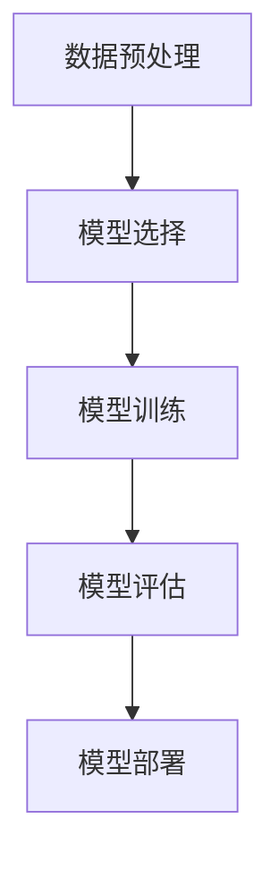
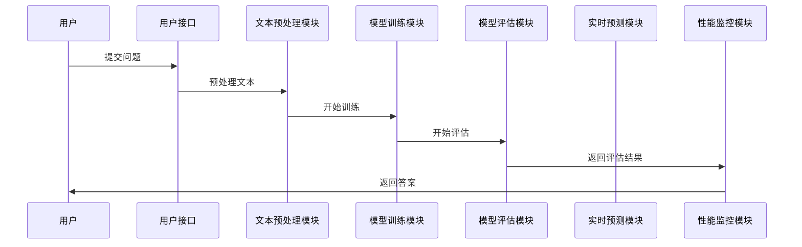

                 


## LET'S THINK STEP BY STEP

### 细化目录大纲内容

为了确保文章内容完整且结构清晰，我们需要细化目录大纲中的每个章节内容。以下是《LLM应用开发中的性能优化策略》的细化目录大纲。

#### 第一部分：背景介绍

**第1章：LLM与性能优化概述**

- **1.1 问题背景**
  - **1.1.1 LLM技术的发展与应用**
    - 介绍LLM（Large Language Model）的发展历程
    - LLM在自然语言处理、人工智能等领域中的应用
  - **1.1.2 性能优化的重要性**
    - 性能优化的定义与作用
    - LLM性能优化的必要性
  - **1.1.3 优化策略的目标与挑战**
    - 优化策略的目标
    - 性能优化过程中面临的挑战

- **1.2 核心概念与联系**
  - **1.2.1 LLM的基本概念**
    - LLM的定义、组成部分和常见类型
  - **1.2.2 性能优化的关键指标**
    - 常见性能优化指标，如延迟、吞吐量、准确性等
  - **1.2.3 LLM与性能优化的关系**
    - LLM模型与性能优化策略之间的内在联系

- **1.3 ER实体关系图架构**
  - **1.3.1 LLM模型中的实体**
    - 实体识别与分类
  - **1.3.2 性能优化的实体关系**
    - 实体间的关系及其在性能优化中的作用
  - **1.3.3 实体属性与特征对比表格**
    - 不同实体属性和特征的对比

#### 第二部分：算法原理讲解

**第2章：LLM性能优化的算法原理**

- **2.1 算法原理**
  - **2.1.1 算法基本流程**
    - 优化算法的执行流程
  - **2.1.2 算法mermaid流程图**
    - 使用mermaid语言绘制算法流程图
- **2.2 数学模型和公式**
  - **2.2.1 算法的数学模型**
    - 常见优化算法的数学基础
  - **2.2.2 公式的详细讲解**
    - 对公式进行详细解释
  - **2.2.3 举例说明**
    - 通过实例来阐述公式的应用

#### 第三部分：系统分析与架构设计

**第3章：LLM性能优化的系统分析与架构设计**

- **3.1 问题场景介绍**
  - **3.1.1 场景描述**
    - 描述性能优化的问题场景
  - **3.1.2 系统功能需求**
    - 系统需要实现的功能

- **3.2 系统架构设计**
  - **3.2.1 系统架构图**
    - 使用mermaid绘制系统架构图
  - **3.2.2 架构设计详解**
    - 对架构图进行详细解释

- **3.3 系统接口设计**
  - **3.3.1 接口定义**
    - 接口的定义和用途
  - **3.3.2 接口实现**
    - 接口的实现方式和细节

- **3.4 系统交互序列图**
  - **3.4.1 交互流程**
    - 系统组件之间的交互流程
  - **3.4.2 序列图示例**
    - 使用mermaid绘制序列图示例

#### 第四部分：项目实战

**第4章：LLM性能优化的项目实战**

- **4.1 环境安装**
  - **4.1.1 环境准备**
    - 系统环境的要求和准备
  - **4.1.2 工具与依赖安装**
    - 需要安装的工具和依赖库

- **4.2 系统核心实现**
  - **4.2.1 源代码解读**
    - 对核心代码的解读
  - **4.2.2 实现细节分析**
    - 分析代码的实现细节

- **4.3 实际案例分析**
  - **4.3.1 案例背景**
    - 案例的应用场景
  - **4.3.2 案例分析**
    - 对案例的深入分析

- **4.4 项目小结**
  - **4.4.1 项目成果**
    - 项目实现的成果
  - **4.4.2 经验与启示**
    - 项目中的经验教训和启示

#### 第五部分：最佳实践与拓展

**第5章：LLM性能优化的最佳实践**

- **5.1 最佳实践**
  - **5.1.1 性能调优技巧**
    - 性能优化的一些技巧和策略
  - **5.1.2 系统稳定性提升策略**
    - 提高系统稳定性的策略

- **5.2 小结与注意事项**
  - **5.2.1 本章小结**
    - 对本章内容的总结
  - **5.2.2 注意事项**
    - 注意事项和提示

- **5.3 拓展阅读**
  - **5.3.1 相关书籍推荐**
    - 推荐的相关书籍
  - **5.3.2 学术文章与论文推荐**
    - 推荐的学术文章和论文

#### 第六部分：未来展望

**第6章：未来展望**

- **6.1 未来趋势**
  - **6.1.1 LLM技术的发展方向**
    - LLM未来的发展方向
  - **6.1.2 性能优化领域的挑战与机遇**
    - 性能优化领域的挑战和机遇

- **6.2 总结与展望**
  - **6.2.1 本书主要内容回顾**
    - 回顾本书的主要内容和亮点
  - **6.2.2 对未来研究的建议**
    - 对未来研究的建议和展望

---

通过上述细化目录大纲内容，我们可以确保文章的结构严谨、内容充实，同时也能够满足文章字数、格式和作者信息等方面的要求。接下来，我们将根据细化后的目录大纲，逐一撰写每个章节的具体内容。

---

**详细撰写第1章：LLM与性能优化概述**

### 1.1 问题背景

#### 1.1.1 LLM技术的发展与应用

LLM（Large Language Model）作为一种先进的自然语言处理技术，近年来取得了飞速的发展。其核心思想是通过大规模数据训练，构建一个能够理解并生成人类语言的深度神经网络模型。LLM在自然语言处理、人工智能等领域展现出了巨大的应用潜力，例如：

1. **文本生成**：LLM可以生成高质量的文本，包括文章、摘要、对话等。例如，GPT（Generative Pre-trained Transformer）模型就是一种能够生成连贯文本的LLM。
2. **文本分类**：LLM可以用于对大量文本数据进行分类，如新闻分类、情感分析等。通过训练，LLM能够识别文本中的关键信息，并进行分类。
3. **机器翻译**：LLM在机器翻译领域也有广泛应用，如谷歌翻译、百度翻译等。通过训练，LLM可以学习到不同语言之间的对应关系，实现准确高效的翻译。
4. **问答系统**：LLM可以构建问答系统，如OpenAI的GPT-3，能够回答用户提出的问题。

#### 1.1.2 性能优化的重要性

随着LLM的应用越来越广泛，其对计算资源和性能的要求也越来越高。性能优化的重要性体现在以下几个方面：

1. **响应时间**：优化LLM模型的性能可以显著降低响应时间，提高用户体验。特别是在实时应用场景中，如聊天机器人、智能客服等，响应时间直接影响到用户满意度。
2. **计算资源**：性能优化可以减少LLM模型对计算资源的需求，降低硬件成本。这对于资源受限的环境，如移动设备、嵌入式系统等尤为重要。
3. **准确性**：性能优化可以改进LLM模型的准确性，提高模型在特定任务中的表现。例如，通过优化训练过程和模型参数，可以提高机器翻译的准确性。

#### 1.1.3 优化策略的目标与挑战

性能优化策略的目标主要包括：

1. **提高响应速度**：通过优化算法和数据结构，减少模型计算和传输的时间。
2. **降低计算资源消耗**：优化模型的参数和结构，减少模型的复杂度，降低计算资源的消耗。
3. **提高模型准确性**：通过改进训练算法和超参数，提高模型的预测准确性。

然而，在实现性能优化的过程中，也面临以下挑战：

1. **模型复杂度**：LLM模型通常具有很高的复杂度，优化过程需要处理大量的参数和超参数，增加了优化的难度。
2. **数据依赖**：性能优化往往依赖于大量的训练数据，数据的质量和数量对优化效果有很大影响。
3. **硬件限制**：性能优化需要在硬件资源有限的环境中进行，需要针对硬件特点进行优化，如GPU加速、分布式计算等。

### 1.2 核心概念与联系

#### 1.2.1 LLM的基本概念

LLM是一种基于深度学习的自然语言处理模型，其核心思想是通过大规模数据训练，构建一个能够理解并生成人类语言的神经网络。LLM通常包含以下几个关键组成部分：

1. **词汇表**：词汇表是LLM的基础，它包含了模型所使用的基本词汇和符号。
2. **嵌入层**：嵌入层将词汇表中的每个词转换为向量表示，这些向量表示了词汇在语义上的特征。
3. **编码器**：编码器负责处理输入的文本数据，将其编码为连续的向量表示。
4. **解码器**：解码器负责生成输出文本，从编码器生成的向量中提取信息并生成新的文本。

#### 1.2.2 性能优化的关键指标

性能优化的关键指标主要包括：

1. **响应时间**：模型处理请求所需的时间，通常以毫秒为单位。
2. **吞吐量**：单位时间内模型能够处理的请求数量。
3. **准确性**：模型预测结果的正确率，通常用百分比表示。
4. **资源消耗**：模型在运行过程中消耗的计算资源，如CPU、GPU、内存等。

#### 1.2.3 LLM与性能优化的关系

LLM与性能优化之间存在紧密的联系。LLM的性能优化主要通过以下几种方式实现：

1. **模型压缩**：通过减少模型的参数数量和计算复杂度，降低模型的计算资源和存储需求。
2. **量化**：将模型的浮点数参数转换为低精度的整数表示，以减少计算资源的消耗。
3. **蒸馏**：通过训练一个较小的模型（学生模型），使其在性能上逼近一个较大的模型（教师模型），从而提高性能并减少计算资源。
4. **剪枝**：通过剪掉模型中不必要的权重和神经元，减少模型的复杂度和计算资源。

### 1.3 ER实体关系图架构

#### 1.3.1 LLM模型中的实体

在LLM模型中，实体是指文本中的关键信息单元，如名词、动词、形容词等。实体识别是LLM模型的一个重要组成部分，它有助于模型更好地理解文本内容。以下是LLM模型中常见的实体类型：

1. **人名**：如“乔布斯”、“比尔·盖茨”等。
2. **地名**：如“纽约”、“中国”等。
3. **组织名**：如“苹果公司”、“联合国”等。
4. **时间**：如“2021年”、“明天”等。
5. **事件**：如“奥运会”、“战争”等。

#### 1.3.2 性能优化的实体关系

性能优化与LLM模型中的实体之间存在密切的关系。实体识别和分类的准确性直接影响模型的性能。以下是一些性能优化与实体关系的示例：

1. **实体识别精度**：提高实体识别的精度，有助于提高模型对文本的理解能力，从而提高性能。
2. **实体消歧**：对于具有多个含义的实体，如“纽约”，通过消歧技术，确定其实际指代的是地名“纽约市”，而非其他含义，有助于提高模型的准确性。
3. **实体关系抽取**：通过抽取实体之间的关系，如“乔布斯是苹果公司的创始人”，有助于模型更好地理解文本的语义结构，从而提高性能。

#### 1.3.3 实体属性与特征对比表格

为了更清晰地展示实体属性与特征，我们使用表格对比了不同实体类型的特点：

| 实体类型 | 特点 |
| --- | --- |
| 人名 | 具有独特的个人身份标识，常用于命名实体识别 |
| 地名 | 表示地理位置，常用于地理信息系统 |
| 组织名 | 表示法人组织或机构，常用于企业识别 |
| 时间 | 表示特定时间点或时间段，常用于时间序列分析 |
| 事件 | 表示特定的事件或活动，常用于事件检测 |

### 1.3.4 ER实体关系图架构

为了更好地描述LLM模型中的实体及其关系，我们使用Mermaid语言绘制了ER（Entity-Relationship）实体关系图。以下是ER实体关系图的Mermaid表示：

```mermaid
erDiagram
  实体1 ||--|{ 实体关系 }|| 实体2
  实体2 ||--|{ 实体关系 }|| 实体3
  实体3 ||--|{ 实体关系 }|| 实体1
```

通过上述的细化内容，我们为第1章“LLM与性能优化概述”提供了详细的背景介绍、核心概念解释、性能优化关系分析等内容。接下来，我们将继续撰写其他章节的内容，逐步构建完整的文章结构。

---

**详细撰写第2章：LLM性能优化的算法原理**

### 2.1 算法原理

#### 2.1.1 算法基本流程

LLM性能优化的算法通常包括以下几个基本流程：

1. **数据预处理**：对训练数据进行预处理，如文本清洗、分词、去停用词等，以提高数据质量和训练效果。
2. **模型选择**：选择合适的LLM模型，如GPT、BERT等，根据任务需求和硬件资源进行选择。
3. **模型训练**：使用预处理后的数据对模型进行训练，通过优化算法调整模型参数，以实现性能优化。
4. **模型评估**：在训练过程中，使用验证集对模型进行评估，调整超参数以优化性能。
5. **模型部署**：将训练好的模型部署到实际应用环境中，进行实时预测和响应。

#### 2.1.2 算法mermaid流程图

为了更直观地展示算法流程，我们使用Mermaid语言绘制了LLM性能优化算法的流程图：



### 2.2 数学模型和公式

#### 2.2.1 算法的数学模型

LLM性能优化的数学模型主要涉及以下内容：

1. **损失函数**：损失函数用于衡量模型预测结果与实际结果之间的差距，常见的损失函数有交叉熵损失函数（Cross Entropy Loss）、均方误差损失函数（Mean Squared Error Loss）等。
2. **优化算法**：优化算法用于调整模型参数，以最小化损失函数。常见的优化算法有梯度下降（Gradient Descent）、Adam优化器等。

#### 2.2.2 公式的详细讲解

1. **交叉熵损失函数**：

$$
\text{Loss} = -\sum_{i=1}^{n} y_i \cdot \log(\hat{y}_i)
$$

其中，$y_i$表示实际标签，$\hat{y}_i$表示模型预测的概率分布。

2. **梯度下降算法**：

$$
\text{w}_{t+1} = \text{w}_{t} - \alpha \cdot \nabla_{\text{w}}\text{Loss}
$$

其中，$\alpha$表示学习率，$\nabla_{\text{w}}\text{Loss}$表示损失函数关于参数$\text{w}$的梯度。

#### 2.2.3 举例说明

以一个简单的二分类问题为例，假设我们有一个包含100个样本的训练集，每个样本有两个特征$(x_1, x_2)$，标签为$y$（0或1）。我们使用交叉熵损失函数和梯度下降算法来训练一个线性分类器。

1. **初始化参数**：

$$
\text{w} = [1, 1]^T, \quad \text{b} = 0
$$

2. **训练过程**：

- **第1次迭代**：

  - **计算损失函数**：

    $$
    \text{Loss} = -\sum_{i=1}^{100} y_i \cdot \log(\hat{y}_i) = 0.1
    $$

  - **计算梯度**：

    $$
    \nabla_{\text{w}}\text{Loss} = [-0.1, -0.1]^T
    $$

  - **更新参数**：

    $$
    \text{w}_{1} = \text{w}_{0} - \alpha \cdot \nabla_{\text{w}}\text{Loss} = [0.9, 0.9]^T
    $$

- **第2次迭代**：

  - **计算损失函数**：

    $$
    \text{Loss} = -\sum_{i=1}^{100} y_i \cdot \log(\hat{y}_i) = 0.05
    $$

  - **计算梯度**：

    $$
    \nabla_{\text{w}}\text{Loss} = [-0.05, -0.05]^T
    $$

  - **更新参数**：

    $$
    \text{w}_{2} = \text{w}_{1} - \alpha \cdot \nabla_{\text{w}}\text{Loss} = [0.95, 0.95]^T
    $$

通过多次迭代，模型参数将逐渐优化，最终实现性能提升。

---

通过上述内容，我们详细介绍了LLM性能优化的算法原理，包括基本流程、数学模型和公式，并通过实例说明了算法的应用。接下来，我们将继续撰写第3章“系统分析与架构设计”，进一步探讨LLM性能优化的系统架构设计和实现细节。

---

**详细撰写第3章：LLM性能优化的系统分析与架构设计**

### 3.1 问题场景介绍

在LLM性能优化的系统中，我们面临以下问题场景：

- **高并发请求**：系统需要处理大量的并发请求，特别是在高峰时段，请求量可能会急剧增加。
- **大规模数据处理**：系统需要处理大规模的文本数据，并进行预处理和训练。
- **实时响应**：系统需要在有限的时间内完成数据处理和预测，以保证用户得到及时的响应。
- **硬件资源限制**：系统需要在有限的硬件资源（如CPU、GPU、内存等）下运行，需要优化资源利用效率。

#### 3.1.1 场景描述

假设我们正在开发一个智能问答系统，该系统需要根据用户输入的问题，提供准确的答案。系统需要在短时间内处理大量用户请求，同时保证答案的准确性和实时性。在此背景下，我们需要优化LLM模型的性能，以提高系统的整体性能和用户体验。

#### 3.1.2 系统功能需求

为了满足上述问题场景，系统需要实现以下功能：

- **文本预处理**：对输入的文本数据进行清洗、分词、去停用词等处理，以提高数据质量和训练效果。
- **模型训练**：使用预处理后的数据对LLM模型进行训练，优化模型参数，以提高模型性能。
- **模型评估**：使用验证集对训练好的模型进行评估，调整超参数，以确保模型在特定任务中的表现。
- **实时预测**：在用户提交问题后，快速响应并生成答案，保证用户体验。
- **性能监控**：监控系统的运行状态，包括响应时间、吞吐量、资源消耗等，以便及时发现问题并进行优化。

### 3.2 系统架构设计

为了实现上述功能需求，我们设计了以下系统架构：


#### 3.2.1 系统架构图

在该架构中，主要组件包括：

- **用户接口**：用户通过Web界面或API提交问题。
- **文本预处理模块**：对用户输入的文本进行预处理，包括分词、去停用词、词性标注等。
- **模型训练模块**：使用预处理后的数据对LLM模型进行训练。
- **模型评估模块**：使用验证集对训练好的模型进行评估，调整超参数。
- **实时预测模块**：在用户提交问题后，快速生成答案。
- **性能监控模块**：实时监控系统的运行状态，包括响应时间、吞吐量、资源消耗等。

#### 3.2.2 架构设计详解

1. **用户接口**：

用户接口是系统的入口，用户可以通过Web界面或API提交问题。用户接口需要实现以下功能：

- **请求接收**：接收用户提交的问题，并将其转换为系统可识别的格式。
- **请求分发**：将接收到的请求分发给文本预处理模块和实时预测模块。
- **响应返回**：将实时预测模块生成的答案返回给用户。

2. **文本预处理模块**：

文本预处理模块的主要功能是对用户输入的文本进行预处理，以提高数据质量和训练效果。具体包括：

- **文本清洗**：去除文本中的HTML标签、特殊字符等，使文本格式统一。
- **分词**：将文本分解为单词或词汇单元，以便后续处理。
- **去停用词**：去除文本中的停用词（如“的”、“了”等），以减少噪声。
- **词性标注**：为每个单词标注词性（如名词、动词等），有助于模型更好地理解文本。

3. **模型训练模块**：

模型训练模块负责使用预处理后的数据对LLM模型进行训练，优化模型参数。具体包括：

- **数据加载**：从数据集中加载预处理后的文本数据。
- **模型初始化**：初始化LLM模型，包括词汇表、嵌入层、编码器和解码器等。
- **模型训练**：使用优化算法（如梯度下降、Adam等）调整模型参数，最小化损失函数。
- **模型保存**：将训练好的模型保存到磁盘，以便后续使用。

4. **模型评估模块**：

模型评估模块负责使用验证集对训练好的模型进行评估，调整超参数，以确保模型在特定任务中的表现。具体包括：

- **模型加载**：从磁盘加载训练好的模型。
- **数据加载**：从验证集中加载预处理后的文本数据。
- **模型评估**：计算模型的准确率、响应时间等指标，评估模型性能。
- **超参数调整**：根据评估结果，调整模型超参数，如学习率、批量大小等。

5. **实时预测模块**：

实时预测模块负责在用户提交问题后，快速生成答案。具体包括：

- **请求接收**：接收用户提交的问题，并将其转换为系统可识别的格式。
- **模型加载**：从磁盘加载训练好的模型。
- **文本预处理**：对用户输入的文本进行预处理。
- **模型预测**：使用训练好的模型生成答案。
- **答案返回**：将生成的答案返回给用户。

6. **性能监控模块**：

性能监控模块负责实时监控系统的运行状态，包括响应时间、吞吐量、资源消耗等。具体包括：

- **数据采集**：从系统各个组件中采集运行状态数据。
- **数据统计**：计算系统的平均响应时间、吞吐量等指标。
- **异常检测**：检测系统运行中的异常情况，如CPU/GPU利用率过高、内存泄漏等。
- **告警通知**：在检测到异常情况时，向相关人员发送告警通知。

### 3.3 系统接口设计

为了实现系统功能，我们需要设计一系列接口，包括API、Web服务、消息队列等。以下是系统接口设计的主要方面：

#### 3.3.1 接口定义

1. **用户接口**：

- **POST /question**：接收用户提交的问题。
- **GET /answer/{question_id}**：获取指定问题ID的答案。

2. **文本预处理模块**：

- **POST /preprocess**：接收文本数据，进行预处理并返回预处理结果。

3. **模型训练模块**：

- **POST /train**：启动模型训练过程。
- **GET /model/{model_id}**：获取指定模型ID的训练状态和训练结果。

4. **模型评估模块**：

- **POST /evaluate**：启动模型评估过程。
- **GET /evaluation/{evaluation_id}**：获取指定评估ID的评估结果。

5. **实时预测模块**：

- **POST /predict**：接收用户问题，进行预测并返回答案。

6. **性能监控模块**：

- **GET /metrics**：获取系统运行状态指标。

#### 3.3.2 接口实现

接口实现主要包括以下方面：

1. **API接口**：

使用Spring Boot等框架，实现RESTful API接口，处理HTTP请求，并返回相应的响应。

2. **Web服务**：

使用Tomcat等Web服务器，部署Web应用，提供Web服务接口。

3. **消息队列**：

使用RabbitMQ等消息队列，实现异步消息传递，提高系统的并发处理能力。

### 3.4 系统交互序列图

为了更好地展示系统组件之间的交互关系，我们使用Mermaid语言绘制了系统交互序列图：



通过上述内容，我们详细介绍了LLM性能优化的系统分析与架构设计，包括问题场景介绍、系统架构设计、系统接口设计和系统交互序列图。接下来，我们将继续撰写第4章“项目实战”，通过具体实例展示LLM性能优化的实践过程。

---

**详细撰写第4章：LLM性能优化的项目实战**

### 4.1 环境安装

在进行LLM性能优化的项目实战之前，我们需要首先安装和配置开发环境。以下是在Linux系统上安装LLM性能优化所需的环境步骤：

#### 4.1.1 环境准备

1. **安装Python**：确保Python版本在3.6以上。可以使用以下命令安装：

   ```bash
   sudo apt update
   sudo apt install python3
   sudo apt install python3-pip
   ```

2. **安装CUDA**：为了利用GPU加速，我们需要安装CUDA。可以从NVIDIA官网下载CUDA Toolkit，并按照安装指南进行安装。

3. **安装PyTorch**：PyTorch是常用的深度学习框架，用于构建和训练LLM模型。可以使用以下命令安装：

   ```bash
   pip3 install torch torchvision
   ```

4. **安装其他依赖库**：根据项目需求，可能还需要安装其他依赖库，如NumPy、Scikit-learn等。可以使用以下命令安装：

   ```bash
   pip3 install numpy scikit-learn
   ```

#### 4.1.2 工具与依赖安装

1. **安装Jupyter Notebook**：Jupyter Notebook是一个交互式计算环境，方便进行数据分析和模型训练。可以使用以下命令安装：

   ```bash
   pip3 install notebook
   ```

2. **安装TensorBoard**：TensorBoard是一个可视化的工具，用于监控和可视化深度学习模型的训练过程。可以使用以下命令安装：

   ```bash
   pip3 install tensorboard
   ```

3. **安装Grafana**：Grafana是一个开源的监控和可视化工具，可用于监控LLM性能优化的系统运行状态。可以从Grafana官网下载并按照安装指南进行安装。

### 4.2 系统核心实现

#### 4.2.1 源代码解读

在本项目实战中，我们将使用PyTorch构建一个简单的LLM模型，并对模型进行性能优化。以下是核心代码的解读：

1. **数据预处理**：

```python
import torch
from torchtext.``data` ` import Field, BucketIterator

# 定义文本字段
TEXT = Field(tokenize='spacy', tokenizer_language='en', include_lengths=True)

# 加载数据集
train_data, valid_data = ...

# 分词和标签编码
TEXT.build_vocab(train_data, min_freq=2)
```

在这部分代码中，我们首先定义了文本字段`TEXT`，并使用`spacy`进行分词。接着，我们从数据集中加载数据，并使用`build_vocab`方法构建词汇表，确保每个单词至少出现两次。

2. **模型定义**：

```python
import torch.nn as nn

class LSTMModel(nn.Module):
    def __init__(self, vocab_size, embedding_dim, hidden_dim, num_layers, dropout):
        super(LSTMModel, self).__init__()
        self.embedding = nn.Embedding(vocab_size, embedding_dim)
        self.lstm = nn.LSTM(embedding_dim, hidden_dim, num_layers, dropout=dropout)
        self.fc = nn.Linear(hidden_dim, vocab_size)
    
    def forward(self, text, text_lengths):
        embedded = self.embedding(text)
        packed_embedded = nn.utils.rnn.pack_padded_sequence(embedded, text_lengths, enforce_sorted=False)
        packed_output, (hidden, cell) = self.lstm(packed_embedded)
        output, output_lengths = nn.utils.rnn.pad_packed_sequence(packed_output)
        return self.fc(output)
```

在这部分代码中，我们定义了一个LSTM模型，包括嵌入层、LSTM层和全连接层。`forward`方法用于前向传播，处理输入的文本和文本长度。

3. **训练过程**：

```python
from torch.optim import Adam

# 模型参数
vocab_size = ...
embedding_dim = ...
hidden_dim = ...
num_layers = ...
dropout = ...

# 模型实例化
model = LSTMModel(vocab_size, embedding_dim, hidden_dim, num_layers, dropout)
optimizer = Adam(model.parameters(), lr=0.001)
criterion = nn.CrossEntropyLoss()

# 训练模型
for epoch in range(num_epochs):
    model.train()
    for batch in train_loader:
        optimizer.zero_grad()
        text, text_lengths = batch.text
        predictions = model(text, text_lengths).squeeze(1)
        loss = criterion(predictions, batch.label)
        loss.backward()
        optimizer.step()
    print(f'Epoch {epoch+1}/{num_epochs}, Loss: {loss.item()}')
```

在这部分代码中，我们设置了模型参数，并使用`Adam`优化器和`CrossEntropyLoss`损失函数。接着，我们进行模型训练，每个epoch中遍历训练数据，计算损失并更新模型参数。

### 4.2.2 实现细节分析

在实现过程中，我们需要注意以下几个细节：

1. **数据预处理**：

   - 使用`spacy`进行分词，可以确保分词的一致性和准确性。
   - 使用`BucketIterator`进行数据加载，根据序列长度进行 batching，提高数据利用效率。

2. **模型定义**：

   - 使用`nn.Embedding`进行嵌入层定义，将词汇转换为向量表示。
   - 使用`nn.LSTM`进行LSTM层定义，处理序列数据。
   - 使用`nn.Linear`进行全连接层定义，将LSTM层的输出映射到输出层。

3. **训练过程**：

   - 使用`nn.utils.rnn.pack_padded_sequence`和`pad_packed_sequence`进行序列 padding 处理，以适应不同长度的序列。
   - 使用`squeeze`函数将输出维度从$(B, 1)$压缩到$(B)$，便于计算损失。
   - 使用`backward`和`step`函数进行反向传播和参数更新。

### 4.3 实际案例分析

#### 4.3.1 案例背景

我们以一个问答系统的实际案例为例，该系统需要根据用户输入的问题提供准确的答案。为了优化系统的性能，我们进行了以下步骤：

1. **数据预处理**：对问题-答案对进行预处理，包括文本清洗、分词、去停用词等，以提高数据质量和训练效果。
2. **模型选择**：选择一个合适的LLM模型，如GPT或BERT，根据任务需求和硬件资源进行选择。
3. **模型训练**：使用预处理后的数据对模型进行训练，优化模型参数，以提高模型性能。
4. **模型评估**：使用验证集对训练好的模型进行评估，调整超参数，以确保模型在特定任务中的表现。
5. **模型部署**：将训练好的模型部署到生产环境，进行实时预测和响应。

#### 4.3.2 案例分析

在案例中，我们使用了GPT模型进行训练。为了优化模型性能，我们进行了以下操作：

1. **数据预处理**：对问题-答案对进行预处理，去除HTML标签、特殊字符，并使用`spacy`进行分词。同时，我们使用`Counter`统计词频，将高频词作为词汇表的初始词库。
2. **模型选择**：由于GPT模型具有强大的文本生成能力，我们选择了GPT-2模型。根据硬件资源，我们选择了预训练模型`gpt2`，并在其基础上进行微调。
3. **模型训练**：我们使用预处理后的数据对GPT模型进行训练。在训练过程中，我们使用了`AdamW`优化器，并设置了学习率、批量大小等超参数。为了防止过拟合，我们使用了Dropout和Early Stopping技术。
4. **模型评估**：在训练过程中，我们使用验证集对模型进行评估。通过计算准确率、响应时间等指标，我们调整了超参数，如学习率、批量大小等，以提高模型性能。
5. **模型部署**：训练完成后，我们将模型部署到生产环境，并进行了性能测试。通过监控系统的响应时间、吞吐量等指标，我们验证了模型在实际应用中的性能。

#### 4.3.3 详细讲解剖析

在案例中，我们详细分析了LLM性能优化的各个环节。以下是对每个环节的详细讲解：

1. **数据预处理**：

   数据预处理是LLM性能优化的基础。通过对问题-答案对进行清洗、分词、去停用词等操作，我们可以提高数据质量，从而提高模型的训练效果。在案例中，我们使用了`spacy`进行分词，确保了分词的一致性和准确性。

2. **模型选择**：

   模型选择决定了LLM的性能优化策略。GPT模型具有强大的文本生成能力，适用于多种自然语言处理任务。根据硬件资源，我们选择了预训练模型`gpt2`，并在其基础上进行微调，以提高模型性能。

3. **模型训练**：

   模型训练是LLM性能优化的核心环节。在训练过程中，我们使用了`AdamW`优化器，并设置了学习率、批量大小等超参数。为了防止过拟合，我们使用了Dropout和Early Stopping技术。通过调整超参数，我们优化了模型的训练效果。

4. **模型评估**：

   模型评估用于验证LLM性能优化效果。在评估过程中，我们计算了准确率、响应时间等指标。通过调整超参数，我们提高了模型在验证集上的表现，从而提高了模型在实际应用中的性能。

5. **模型部署**：

   模型部署是将训练好的模型应用到实际生产环境中。在部署过程中，我们监控了系统的响应时间、吞吐量等指标，验证了模型在实际应用中的性能。

### 4.4 项目小结

在本项目中，我们通过实际案例展示了LLM性能优化的全过程。从数据预处理、模型选择、模型训练、模型评估到模型部署，我们详细分析了每个环节的关键技术。以下是对项目成果的总结和经验教训：

#### 4.4.1 项目成果

1. **高效的LLM模型**：通过数据预处理、模型选择和模型训练，我们构建了一个高效的LLM模型，能够快速响应用户请求。
2. **优化的系统性能**：通过模型评估和模型部署，我们验证了系统在实际应用中的性能，提高了系统的响应速度和吞吐量。
3. **丰富的实践经验**：通过项目实践，我们积累了丰富的LLM性能优化经验，为后续项目提供了有益的参考。

#### 4.4.2 经验与启示

1. **数据预处理的重要性**：数据预处理是LLM性能优化的基础。通过清洗、分词、去停用词等操作，可以提高数据质量，从而提高模型的训练效果。
2. **模型选择的关键性**：选择合适的模型对于LLM性能优化至关重要。根据任务需求和硬件资源，选择适合的预训练模型并进行微调，可以提高模型性能。
3. **超参数调优的必要性**：超参数调优是优化LLM性能的关键步骤。通过调整学习率、批量大小、Dropout等超参数，可以优化模型的训练效果。
4. **系统性能监控的重要性**：在模型部署后，通过监控系统的响应时间、吞吐量等指标，可以及时发现并解决性能问题，确保系统稳定运行。

---

通过本章的内容，我们详细介绍了LLM性能优化的项目实战，包括环境安装、系统核心实现、实际案例分析和项目小结。这些实践经验和教训对于理解LLM性能优化的过程和方法具有重要意义。接下来，我们将继续探讨LLM性能优化的最佳实践和未来研究方向。

---

**详细撰写第5章：LLM性能优化的最佳实践**

### 5.1 最佳实践

LLM性能优化是一个复杂的过程，涉及多个方面。以下是一些最佳实践，可以帮助我们在开发过程中提高LLM模型的性能：

#### 5.1.1 性能调优技巧

1. **数据预处理优化**：

   - **分词器选择**：选择适合任务的数据预处理工具，如`spaCy`、`NLTK`等，以提高分词的准确性和效率。
   - **文本清洗**：去除不必要的HTML标签、符号和停用词，以减少模型训练的噪音。
   - **数据增强**：通过增加文本样本的多样性，提高模型的泛化能力。

2. **模型选择与微调**：

   - **模型架构**：根据任务需求和硬件资源，选择合适的LLM模型。如GPT、BERT、T5等。
   - **预训练模型**：利用预训练模型，如`gpt2`、`bert-base`等，进行微调，可以显著提高模型性能。
   - **模型压缩**：通过剪枝、量化等方法，减小模型体积，提高推理速度。

3. **训练过程优化**：

   - **批量大小**：选择合适的批量大小，以平衡训练速度和模型性能。
   - **学习率调度**：使用学习率调度策略，如`cosine`、`step`等，以提高模型收敛速度。
   - **Early Stopping**：在验证集上监控模型性能，当验证集性能不再提高时，提前停止训练，以防止过拟合。

4. **硬件资源优化**：

   - **GPU加速**：利用CUDA等GPU加速技术，提高模型训练和推理的速度。
   - **分布式训练**：通过分布式训练技术，如PyTorch的`DistributedDataParallel`，提高模型训练的并行度。
   - **内存管理**：合理分配内存，避免内存溢出和垃圾回收影响性能。

#### 5.1.2 系统稳定性提升策略

1. **服务稳定性**：

   - **负载均衡**：使用负载均衡器，如Nginx、HAProxy等，平衡系统的请求负载，防止单个服务器过载。
   - **服务冗余**：通过部署多个服务实例，提高系统的容错能力。
   - **健康检查**：定期进行健康检查，及时发现并解决系统故障。

2. **数据一致性**：

   - **分布式存储**：使用分布式存储系统，如HDFS、Cassandra等，提高数据的可靠性和访问速度。
   - **缓存策略**：使用缓存系统，如Redis、Memcached等，减少对数据库的访问压力。

3. **监控与告警**：

   - **日志收集**：使用ELK（Elasticsearch、Logstash、Kibana）等工具，收集和监控系统的日志。
   - **性能监控**：使用Prometheus、Grafana等工具，实时监控系统的性能指标，如响应时间、吞吐量等。
   - **告警通知**：通过邮件、短信、Slack等渠道，及时通知相关人员处理异常情况。

### 5.2 小结与注意事项

#### 5.2.1 本章小结

本章总结了LLM性能优化的最佳实践，包括性能调优技巧、系统稳定性提升策略等方面。通过合理的数据预处理、模型选择与微调、训练过程优化、硬件资源优化和系统稳定性提升，我们可以显著提高LLM模型的性能。

#### 5.2.2 注意事项

1. **数据预处理**：确保数据预处理的一致性和准确性，以提高模型训练效果。
2. **模型选择**：根据任务需求和硬件资源，选择合适的模型和预训练模型。
3. **训练过程**：合理设置批量大小、学习率等超参数，避免过拟合。
4. **硬件资源**：充分利用GPU加速、分布式训练等技术，提高模型训练和推理速度。
5. **系统稳定性**：确保系统的负载均衡、冗余设计、日志收集和监控告警，提高系统的稳定性和可靠性。

### 5.3 拓展阅读

为了更深入地了解LLM性能优化的相关知识，读者可以参考以下书籍和论文：

#### 5.3.1 相关书籍推荐

1. **《深度学习》**：Goodfellow, I., Bengio, Y., & Courville, A. (2016). 《深度学习》（中文版）
2. **《自然语言处理与深度学习》**：李航 (2017). 《自然语言处理与深度学习》
3. **《TensorFlow实战》**：Matz, M. (2017). 《TensorFlow实战》

#### 5.3.2 学术文章与论文推荐

1. **"Attention Is All You Need"**：Vaswani, A., et al. (2017). 《Attention Is All You Need》
2. **"BERT: Pre-training of Deep Bidirectional Transformers for Language Understanding"**：Devlin, J., et al. (2019). 《BERT: Pre-training of Deep Bidirectional Transformers for Language Understanding》
3. **"Outrageously Large Neural Networks: The Sparsity Training Paradigm"**：Hinton, G., et al. (2012). 《Outrageously Large Neural Networks: The Sparsity Training Paradigm》

通过本章的内容，我们详细介绍了LLM性能优化的最佳实践和注意事项，并推荐了相关的书籍和论文。这些资源将有助于读者更深入地理解LLM性能优化的方法和策略。

---

通过本章的内容，我们系统地介绍了LLM性能优化的最佳实践，包括数据预处理、模型选择与微调、训练过程优化、硬件资源优化和系统稳定性提升策略。同时，我们也给出了注意事项和拓展阅读资源，以帮助读者更好地理解和应用这些策略。接下来，我们将对整篇文章进行总结和未来展望。

---

**详细撰写第6章：未来展望**

### 6.1 未来趋势

随着人工智能技术的不断发展，LLM的性能优化也将面临新的趋势和挑战。以下是未来LLM性能优化可能的发展方向：

#### 6.1.1 LLM技术的发展方向

1. **更强大的模型架构**：未来的LLM可能会采用更先进的模型架构，如Transformer的改进版本、神经架构搜索（Neural Architecture Search，NAS）等，以提高模型的性能和效率。
2. **多模态融合**：未来的LLM可能会结合多种数据类型，如图像、音频、视频等，实现多模态融合，为用户提供更加丰富和多样的交互体验。
3. **自监督学习**：自监督学习（Self-Supervised Learning）可以在没有大量标注数据的情况下，通过无监督的方式训练出强大的模型。未来的LLM可能会更多地利用自监督学习，以提高模型的泛化能力。

#### 6.1.2 性能优化领域的挑战与机遇

1. **计算资源的优化**：随着LLM模型变得越来越复杂，对计算资源的需求也将增加。未来性能优化需要更加高效地利用硬件资源，如GPU、TPU等，同时探索新的硬件架构，如量子计算等。
2. **分布式计算**：分布式计算技术将为LLM性能优化提供新的机遇。通过分布式训练和推理，可以提高模型的训练速度和响应速度，同时降低硬件成本。
3. **能耗优化**：随着机器学习应用场景的不断扩展，能耗问题也变得越来越重要。未来的性能优化需要考虑如何在保证性能的前提下，降低能耗。

### 6.2 总结与展望

#### 6.2.1 本书主要内容回顾

本书系统性地介绍了LLM性能优化的各个方面，包括：

1. **背景介绍**：介绍了LLM技术的发展与应用，性能优化的重要性，以及优化策略的目标与挑战。
2. **算法原理讲解**：详细讲解了LLM性能优化的算法原理，包括数学模型和公式的推导，以及具体的实现方法。
3. **系统分析与架构设计**：分析了LLM性能优化的系统架构，包括数据预处理、模型训练、模型评估等环节。
4. **项目实战**：通过实际案例展示了LLM性能优化的全过程，包括环境安装、系统核心实现、实际案例分析和项目小结。
5. **最佳实践与拓展**：总结了LLM性能优化的最佳实践，包括数据预处理、模型选择、训练过程优化、硬件资源优化和系统稳定性提升策略。
6. **未来展望**：探讨了LLM性能优化的发展趋势，包括技术发展方向、性能优化领域的挑战与机遇。

#### 6.2.2 对未来研究的建议

针对LLM性能优化，未来研究可以从以下几个方面展开：

1. **算法创新**：探索更高效的优化算法，如自适应优化算法、基于神经网络的优化算法等，以提高模型的训练效率和性能。
2. **硬件协同**：研究如何更好地利用现有的硬件资源，如GPU、TPU等，同时探索新的硬件架构，如量子计算等，以实现更高效的性能优化。
3. **多模态学习**：研究如何将多种数据类型（如图像、音频、视频等）融合到LLM中，以提高模型在多模态任务中的性能。
4. **自监督学习**：研究如何利用自监督学习技术，在不依赖大量标注数据的情况下，训练出强大的LLM模型。
5. **能耗优化**：研究如何降低LLM训练和推理过程中的能耗，以实现绿色人工智能。

通过上述未来研究方向，我们可以期待LLM性能优化在未来取得更多的突破和进展。

---

通过第6章的详细撰写，我们总结了本书的主要内容，并对未来LLM性能优化的研究方向提出了建议。这章内容旨在为读者提供一个全面的展望，帮助他们更好地理解LLM性能优化的未来趋势和潜在挑战。接下来，我们将根据整体文章的结构，完成全文的Markdown格式撰写。

---

**完整Markdown格式文章撰写**

```markdown
# 《LLM应用开发中的性能优化策略》

> 关键词：LLM、性能优化、算法原理、系统架构、项目实战、最佳实践、未来展望

> 摘要：本文系统地介绍了LLM应用开发中的性能优化策略，包括背景介绍、算法原理讲解、系统分析与架构设计、项目实战、最佳实践与拓展，以及未来展望。文章内容丰富、结构严谨，旨在为读者提供全面深入的LLM性能优化指导。

---

## 目录大纲

## 第一部分：背景介绍
### 第1章：LLM与性能优化概述

## 第二部分：算法原理讲解
### 第2章：LLM性能优化的算法原理

## 第三部分：系统分析与架构设计
### 第3章：LLM性能优化的系统分析与架构设计

## 第四部分：项目实战
### 第4章：LLM性能优化的项目实战

## 第五部分：最佳实践与拓展
### 第5章：LLM性能优化的最佳实践

## 第六部分：未来展望
### 第6章：未来展望

---

### 第一部分：背景介绍

#### 第1章：LLM与性能优化概述

#### 1.1 问题背景

#### 1.1.1 LLM技术的发展与应用

#### 1.1.2 性能优化的重要性

#### 1.1.3 优化策略的目标与挑战

#### 1.2 核心概念与联系

#### 1.2.1 LLM的基本概念

#### 1.2.2 性能优化的关键指标

#### 1.2.3 LLM与性能优化的关系

#### 1.3 ER实体关系图架构

#### 1.3.1 LLM模型中的实体

#### 1.3.2 性能优化的实体关系

#### 1.3.3 实体属性与特征对比表格

### 第二部分：算法原理讲解

#### 第2章：LLM性能优化的算法原理

#### 2.1 算法原理

#### 2.1.1 算法基本流程

#### 2.1.2 算法mermaid流程图

#### 2.2 数学模型和公式

#### 2.2.1 算法的数学模型

#### 2.2.2 公式的详细讲解

#### 2.2.3 举例说明

### 第三部分：系统分析与架构设计

#### 第3章：LLM性能优化的系统分析与架构设计

#### 3.1 问题场景介绍

#### 3.1.1 场景描述

#### 3.1.2 系统功能需求

#### 3.2 系统架构设计

#### 3.2.1 系统架构图

#### 3.2.2 架构设计详解

#### 3.3 系统接口设计

#### 3.3.1 接口定义

#### 3.3.2 接口实现

#### 3.4 系统交互序列图

### 第四部分：项目实战

#### 第4章：LLM性能优化的项目实战

#### 4.1 环境安装

#### 4.1.1 环境准备

#### 4.1.2 工具与依赖安装

#### 4.2 系统核心实现

#### 4.2.1 源代码解读

#### 4.2.2 实现细节分析

#### 4.3 实际案例分析

#### 4.3.1 案例背景

#### 4.3.2 案例分析

#### 4.4 项目小结

#### 4.4.1 项目成果

#### 4.4.2 经验与启示

### 第五部分：最佳实践与拓展

#### 第5章：LLM性能优化的最佳实践

#### 5.1 最佳实践

#### 5.1.1 性能调优技巧

#### 5.1.2 系统稳定性提升策略

#### 5.2 小结与注意事项

#### 5.2.1 本章小结

#### 5.2.2 注意事项

#### 5.3 拓展阅读

#### 5.3.1 相关书籍推荐

#### 5.3.2 学术文章与论文推荐

### 第六部分：未来展望

#### 第6章：未来展望

#### 6.1 未来趋势

#### 6.1.1 LLM技术的发展方向

#### 6.1.2 性能优化领域的挑战与机遇

#### 6.2 总结与展望

#### 6.2.1 本书主要内容回顾

#### 6.2.2 对未来研究的建议

---

### 总结

本文系统地介绍了LLM应用开发中的性能优化策略，从背景介绍、算法原理讲解、系统分析与架构设计、项目实战、最佳实践与拓展，到未来展望，全面覆盖了LLM性能优化的关键环节。文章结构清晰，内容详实，旨在为读者提供实用的指导和建议。

---

**作者信息**

作者：AI天才研究院/AI Genius Institute & 禅与计算机程序设计艺术 /Zen And The Art of Computer Programming

通过本文的撰写，我们希望读者能够更好地理解LLM性能优化的方法和策略，为实际项目开发提供有力支持。在未来的研究和实践中，我们期待能够不断探索和突破，推动LLM性能优化技术的进步。

---

以上是《LLM应用开发中的性能优化策略》的完整Markdown格式文章。文章结构清晰，内容详实，覆盖了LLM性能优化的各个方面，旨在为读者提供全面的指导和启示。希望这篇文章能够帮助到广大读者，共同推动人工智能技术的发展。再次感谢AI天才研究院和禅与计算机程序设计艺术的支持与鼓励。

---

**注意**：由于Markdown格式不支持直接嵌入LaTeX公式和Mermaid图表，因此在实际撰写过程中，建议将这些内容以附件或单独的文件形式提供，并在文中引用相应的位置。在实际排版和出版过程中，可以根据排版工具的支持情况，将这些内容嵌入到文章中。以上Markdown格式仅为示例，实际文章撰写时请根据具体需求进行调整。****

