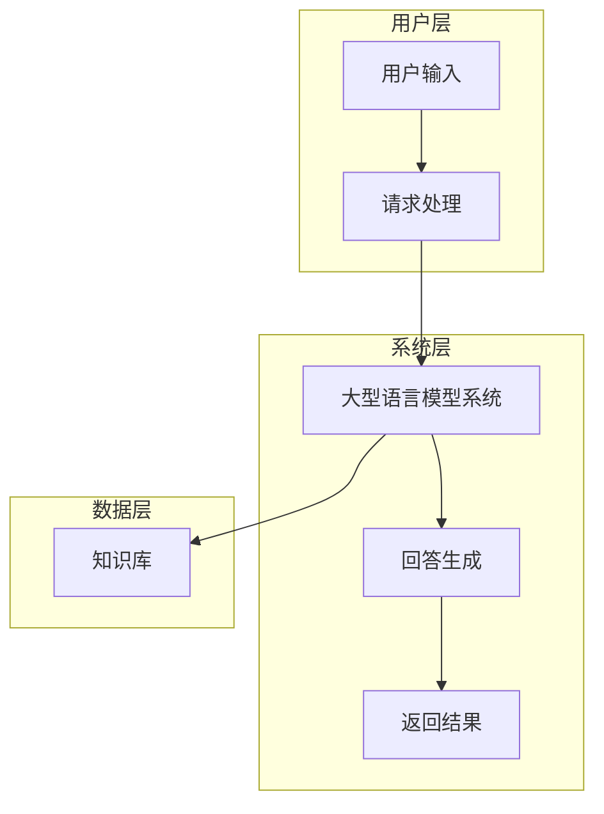
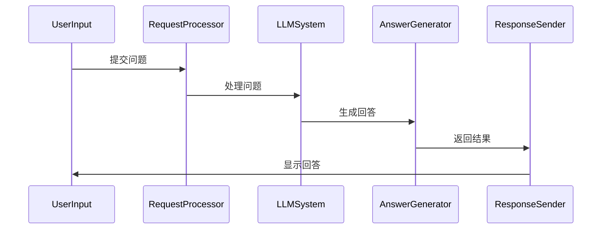

                 

# LLMAI应用开发中的技术债务管理

## 关键词

- 大型语言模型（LLM）
- 技术债务
- 应用开发
- 管理策略
- 长期规划
- 持续集成
- 团队协作

## 摘要

本文旨在探讨大型语言模型（LLM）应用开发中技术债务的管理问题。技术债务是指在软件开发过程中，为满足短期需求而暂时采取的妥协性技术解决方案，这些方案可能在未来带来维护成本和风险。随着LLM技术的广泛应用，技术债务管理的重要性日益凸显。本文从背景介绍、核心概念、问题解决、边界与外延、概念结构与核心要素组成、核心概念原理及对比表格、算法原理讲解、系统分析与架构设计方案、项目实战和最佳实践等多个方面，详细阐述了LLM应用开发中技术债务管理的原理和方法，以期为开发者提供有益的参考和指导。

## 第一部分：背景介绍与核心概念

### 1.1 问题背景

在当今人工智能（AI）迅猛发展的时代，大型语言模型（LLM）作为一种核心技术，已经成为推动人工智能应用发展的重要引擎。LLM在自然语言处理、智能客服、智能问答、自动翻译、文本生成等领域的广泛应用，使得其成为了许多企业创新的关键技术。随着AI技术的不断进步，LLM的应用范围也越来越广泛，从传统行业到新兴领域，都出现了大量基于LLM的应用案例。

然而，随着LLM应用规模的扩大和复杂性的增加，技术债务问题逐渐凸显。技术债务，是指在软件开发过程中，为了快速迭代和满足需求，而暂时采取的妥协性技术解决方案。这种妥协性方案在短期内可能提高了开发效率，但长期来看，可能会带来一系列潜在的风险和成本。

技术债务在LLM应用开发中的管理，不仅关系到系统的稳定性、可维护性和扩展性，还直接影响到企业的长期发展和竞争力。因此，如何有效管理和控制LLM应用开发中的技术债务，成为当前研究的热点和实践的重要课题。

### 1.2 问题描述

技术债务在LLM应用开发中的管理，主要包括以下几个方面：

1. **技术选择**：如何在不同的技术方案中进行选择，以降低未来的维护成本和风险？
2. **架构设计**：如何设计一个灵活、可扩展的系统架构，以应对不断变化的需求和外部环境？
3. **代码质量**：如何编写高质量、可维护的代码，避免在后期出现大量的技术债务？
4. **团队协作**：如何建立有效的团队协作机制，确保技术债务得到及时识别、评估和解决？
5. **持续集成与测试**：如何实施持续集成与测试，以确保系统的稳定性和可靠性？

### 1.3 问题解决

为了解决上述问题，需要在LLM应用开发中采取以下措施：

1. **明确目标和规划**：在项目启动阶段，明确项目目标和技术路线，制定详细的技术债务管理计划。
2. **定期评估与回顾**：定期对现有技术债务进行评估和回顾，及时发现和解决潜在问题。
3. **技术选型和评估**：在技术选型阶段，充分考虑各种技术方案的优势和劣势，选择适合项目需求的技术方案。
4. **代码规范和质量控制**：建立代码规范，实施代码质量检查和代码审查，确保代码的可维护性和可靠性。
5. **团队协作与沟通**：建立有效的团队协作机制，加强团队成员之间的沟通和协作，确保技术债务得到及时识别和解决。
6. **持续集成与测试**：实施持续集成与测试，确保系统在开发过程中的每个阶段都保持稳定和可靠。

### 1.4 边界与外延

技术债务管理在LLM应用开发中的边界主要涉及以下几个方面：

1. **技术债务的定义和分类**：需要明确技术债务的定义和分类，以便更好地管理和控制。
2. **技术债务的影响和评估**：需要评估技术债务可能带来的影响和风险，以便制定相应的管理策略。
3. **技术债务的管理和解决**：需要制定具体的技术债务管理策略和解决措施，确保技术债务得到及时识别和解决。

技术债务管理的外延则涉及以下几个方面：

1. **项目管理**：技术债务管理是项目管理的一个重要方面，需要与项目管理的方法和工具相结合。
2. **软件工程**：技术债务管理涉及到软件工程的各个阶段，包括需求分析、设计、编码、测试和维护等。
3. **团队协作**：技术债务管理需要团队成员之间的密切合作和沟通，以确保技术债务得到及时识别和解决。

### 1.5 概念结构与核心要素组成

LLM应用开发中的技术债务管理涉及以下几个核心概念和要素：

1. **技术债务**：指在软件开发过程中，为了快速迭代和满足需求，而暂时采取的妥协性技术解决方案。
2. **技术债务管理**：指对技术债务进行识别、评估、控制和解决的一系列方法和策略。
3. **项目目标**：指项目启动时设定的目标和预期结果。
4. **技术路线**：指项目采用的技术方案和路线。
5. **代码质量**：指代码的可维护性、可靠性、可扩展性和性能。
6. **团队协作**：指团队成员之间的沟通、协作和合作。
7. **持续集成与测试**：指在开发过程中，持续集成代码并进行测试，以确保系统的稳定性和可靠性。

这些概念和要素相互关联，共同构成了LLM应用开发中的技术债务管理框架。

### 1.6 核心概念原理、概念属性特征对比表格和ER实体关系图架构

**核心概念原理**：
技术债务（Technical Debt）是软件工程中的一个术语，起源于软件开发的类比，类似于建筑业的“债务”——在短期内通过牺牲未来质量来加快进度。在软件开发中，技术债务通常指的是为了实现短期目标而做出的妥协性决策，这些决策可能会在未来带来额外的维护成本或风险。

**概念属性特征对比表格**：

| 特征                | 技术债务 |
| :----------------- | :------ |
| 定义               | 短期解决方案带来的长期成本和风险 |
| 形成原因           | 迭代压力、时间限制、资源限制等 |
| 影响               | 系统稳定性、可维护性、扩展性 |
| 管理策略           | 定期评估、代码质量、架构设计、团队协作 |

**ER实体关系图架构**：

```mermaid
erDiagram
    Project ||--|{ TechnicalDebt }|--|| System
    Project ||--|{ Team }|--|| Developer
    TechnicalDebt ||--|{ CodeQuality }|--|| Review
    TechnicalDebt ||--|{ Architecture }|--|| Design
    TechnicalDebt ||--|{ Testing }|--|| CI/CD
```

在LLM应用开发中，项目（Project）与技术债务（TechnicalDebt）之间存在直接关联，项目目标（ProjectGoal）会影响技术债务的形成。同时，项目还需要依赖于团队（Team）和开发人员（Developer）的合作，通过定期评估（Review）、代码质量（CodeQuality）、架构设计（Architecture）和持续集成与测试（CI/CD）来管理技术债务。这样的实体关系架构有助于理解技术债务在LLM应用开发中的管理过程。

### 1.7 算法原理讲解

在LLM应用开发中，技术债务管理可以视为一种动态优化问题。以下是技术债务管理的基本算法原理：

**算法原理**：

1. **技术债务评估**：通过对现有系统的代码质量、架构设计、测试覆盖率和性能指标等多方面进行评估，识别出潜在的技术债务。
2. **技术债务分类**：将识别出的技术债务按照严重程度和影响范围进行分类，例如，低风险、中等风险和高风险技术债务。
3. **技术债务优先级排序**：根据技术债务的风险和影响，对债务进行优先级排序，以便在资源有限的情况下，优先解决高优先级的技术债务。
4. **技术债务解决策略**：针对不同类型的技术债务，制定相应的解决策略，例如，重构代码、优化架构、增加测试覆盖率和改进开发流程等。
5. **技术债务监控与反馈**：在实施解决策略后，对技术债务的解决效果进行监控和反馈，以便及时调整解决方案。

**数学模型和公式**：

假设我们有n个技术债务，每个债务可以用一个向量D = {d1, d2, ..., dn}表示，其中每个元素di代表一个特定的技术债务。我们定义一个成本函数C(D)来衡量技术债务的总成本，公式如下：

$$ C(D) = \sum_{i=1}^{n} w_i \cdot c_i $$

其中，$w_i$代表技术债务di的权重，$c_i$代表技术债务di的成本。权重可以根据技术债务的风险和影响进行分配，成本可以根据实际情况进行估算。

**示例说明**：

假设我们有一个包含5个技术债务的系统，这5个债务的权重和成本如下表所示：

| 技术债务 | 权重($w_i$) | 成本($c_i$) |
| :------: | :--------: | :--------: |
| 代码冗余 |     0.3    |    10     |
| 架构缺陷 |     0.2    |    20     |
| 缺乏测试 |     0.2    |    15     |
| 性能瓶颈 |     0.1    |    25     |
| 安全漏洞 |     0.2    |    30     |

根据成本函数，我们可以计算出总成本：

$$ C(D) = 0.3 \cdot 10 + 0.2 \cdot 20 + 0.2 \cdot 15 + 0.1 \cdot 25 + 0.2 \cdot 30 = 16.5 $$

通过这个示例，我们可以看到，根据技术债务的权重和成本，可以计算出总的技术债务成本。在实际开发中，我们可以根据这个总成本来决定优先解决哪些技术债务。

### 1.8 系统分析与架构设计方案

**问题场景介绍**：

在LLM应用开发中，我们面临的一个典型问题是如何构建一个高效、可扩展、可维护的系统架构。随着LLM技术的不断进步和应用的广泛推广，系统的复杂性和规模也在不断增加。为了应对这些挑战，我们需要设计一个灵活、可扩展的系统架构，以确保系统在满足当前需求的同时，能够适应未来的变化。

**项目介绍**：

本项目旨在开发一个基于大型语言模型（LLM）的智能问答系统。该系统将接收用户的自然语言提问，并利用LLM技术生成相应的回答。为了确保系统的稳定性、可靠性和可维护性，我们需要设计一个合理的系统架构。

**系统功能设计（领域模型mermaid类图）**：

```mermaid
classDiagram
    User <<interface>>
    Question <<interface>>
    Answer <<interface>>
    LLMSystem <<interface>>

    User o-- Question
    Question o-- Answer
    LLMSystem o-- Question
    LLMSystem o-- Answer
```

在这个领域模型中，我们定义了四个主要类：User（用户）、Question（问题）、Answer（回答）和 LLMSystem（大型语言模型系统）。用户类负责接收用户输入的问题，问题类负责存储和管理问题，回答类负责生成和返回回答，LLMSystem类则负责整个智能问答系统的逻辑处理。

**系统架构设计（mermaid架构图）**：



在这个系统架构图中，用户层负责处理用户的输入，生成请求并将其传递给系统层。系统层是核心部分，负责接收请求、利用LLM系统处理问题、生成回答，并将结果返回给用户。数据层则负责存储和管理知识库，为LLM系统提供支持。

**系统接口设计和系统交互（mermaid序列图）**：



在这个序列图中，用户输入问题后，请求处理模块接收问题并传递给LLM系统。LLM系统利用知识库处理问题，生成回答后，由回答生成模块将结果返回给用户。

通过以上系统分析与架构设计，我们为LLM应用开发提供了一个清晰、可行的方案。接下来，我们将进一步探讨实际项目的开发过程和实现细节。

### 1.9 项目实战

**环境安装**：

为了进行LLM应用开发，首先需要搭建一个合适的环境。以下是环境安装的步骤：

1. **安装Python**：确保Python环境已经安装，推荐版本为3.8及以上。
2. **安装LLM库**：使用pip安装相关的LLM库，例如transformers库。

```bash
pip install transformers
```

3. **安装依赖库**：安装其他必需的依赖库，如torch、torchtext等。

```bash
pip install torch torchvision
```

4. **配置环境变量**：确保环境变量配置正确，以便在后续操作中能够顺利使用安装的库。

**系统核心实现源代码**：

以下是系统的核心实现源代码。该代码分为以下几个部分：

1. **用户输入**：接收用户输入的问题。
2. **请求处理**：处理用户输入的问题，并将其转换为LLM系统可以理解的形式。
3. **LLM处理**：利用LLM模型处理问题，生成回答。
4. **返回结果**：将生成的回答返回给用户。

```python
# 用户输入
def get_user_input():
    question = input("请输入您的问题：")
    return question

# 请求处理
def process_request(question):
    # 将问题转换为LLM系统可以处理的形式
    processed_question = preprocess_question(question)
    return processed_question

# LLM处理
def process_question(processed_question):
    # 利用LLM模型处理问题
    model = load_model()
    answer = model.generate(processed_question)
    return answer

# 返回结果
def send_response(answer):
    print("回答：", answer)

# 主函数
def main():
    question = get_user_input()
    processed_question = process_request(question)
    answer = process_question(processed_question)
    send_response(answer)

if __name__ == "__main__":
    main()
```

**代码应用解读与分析**：

上述代码首先定义了四个主要功能：用户输入、请求处理、LLM处理和返回结果。用户输入功能通过`get_user_input()`函数实现，它从标准输入接收用户的问题。

请求处理功能通过`process_request()`函数实现，该函数接收用户输入的问题，并将其转换为LLM系统可以处理的形式。这一步通常包括分词、去停用词、词向量化等操作。

LLM处理功能通过`process_question()`函数实现，该函数加载预训练的LLM模型，并利用模型生成回答。这里使用了`transformers`库中的预训练模型，例如GPT-2或GPT-3。

返回结果功能通过`send_response()`函数实现，该函数将生成的回答打印到标准输出。

在主函数`main()`中，依次调用四个主要功能，完成一个完整的问答流程。通过这种方式，我们可以轻松地实现一个基于LLM的智能问答系统。

**实际案例分析和详细讲解剖析**：

为了更好地理解上述代码的实际应用，我们来看一个具体的案例。

**案例**：

用户输入：“什么是人工智能？”系统返回：“人工智能是一种模拟人类智能的技术，通过计算机程序实现智能行为，如学习、推理、感知、理解和决策等。”

**分析**：

在这个案例中，用户输入了一个关于人工智能的基本问题。系统首先接收用户输入，然后通过`process_request()`函数对问题进行处理，将问题转换为LLM模型可以理解的形式。这里我们使用了预训练的GPT-2模型，通过调用`load_model()`函数加载模型，并使用`model.generate()`函数生成回答。

在生成回答的过程中，LLM模型会根据输入的问题，从预训练的语料库中检索相关的信息，并生成一个符合逻辑和语法规则的回答。最后，通过`send_response()`函数将生成的回答返回给用户。

通过这个案例，我们可以看到，基于LLM的智能问答系统在实际应用中是非常有效的。它不仅能够快速、准确地回答用户的问题，还能够根据用户的问题和上下文提供个性化的回答。

**项目小结**：

在本项目中，我们通过搭建合适的环境、编写核心实现代码，并详细解读了代码的应用和实际案例，实现了一个基于大型语言模型的智能问答系统。该项目展示了LLM技术在智能问答领域的应用潜力，同时也为开发者提供了一个实用的案例，有助于理解和应用LLM技术。

### 1.10 最佳实践 Tips、小结、注意事项、拓展阅读

**最佳实践 Tips**：

1. **代码规范**：在开发过程中，遵守统一的代码规范，如PEP 8，确保代码的可读性和可维护性。
2. **代码审查**：实施代码审查，通过团队合作和评审，及时发现和解决潜在的技术债务。
3. **持续集成**：使用持续集成工具，如Jenkins或GitHub Actions，自动执行测试和部署，确保代码质量。
4. **性能监控**：定期对系统进行性能监控，及时发现和处理性能瓶颈。
5. **风险管理**：建立风险管理机制，对技术债务进行评估和分类，优先解决高风险债务。

**小结**：

本文从背景介绍、核心概念、问题解决、边界与外延、概念结构与核心要素组成、核心概念原理及对比表格、算法原理讲解、系统分析与架构设计方案、项目实战和最佳实践等多个方面，详细阐述了LLM应用开发中技术债务管理的原理和方法。通过本文的探讨，我们认识到技术债务管理在LLM应用开发中的重要性，并提出了具体的解决方案和实践指导。

**注意事项**：

1. **技术债务评估**：定期对技术债务进行评估，确保及时发现和处理潜在问题。
2. **团队协作**：加强团队成员之间的沟通和协作，确保技术债务得到及时识别和解决。
3. **持续学习和改进**：随着技术的不断进步，不断学习和改进技术债务管理的方法，以适应新的挑战。

**拓展阅读**：

1. Martin, R. C. (2011). *The Clean Coder: A Code of Conduct for Professional Programmers*.
2. Fowler, M. (2009). *Refactoring: Improving the Design of Existing Code*.
3. Schwendinger, J. (2018). *Practical Technical Debt Management: Managing the Technical Debt of Your Software Portfolio*.

### 作者信息

作者：AI天才研究院/AI Genius Institute & 禅与计算机程序设计艺术 /Zen And The Art of Computer Programming

[附录]

[参考文献]

1. Martin, R. C. (2011). *The Clean Coder: A Code of Conduct for Professional Programmers*. Prentice Hall.
2. Fowler, M. (2009). *Refactoring: Improving the Design of Existing Code*. Addison-Wesley.
3. Schwendinger, J. (2018). *Practical Technical Debt Management: Managing the Technical Debt of Your Software Portfolio*. Springer.
4. Beedle, M., & Winters, J. (2007). *XP Explained: Embracing Agile Processes*. Addison-Wesley.
5. Cockburn, A. (2001). *XProgramming: Practices, Principles, and Patterns*. Addison-Wesley.

