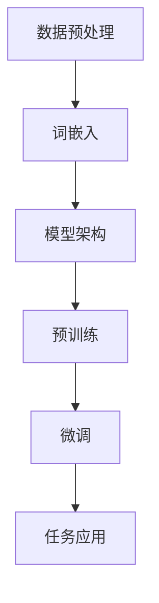
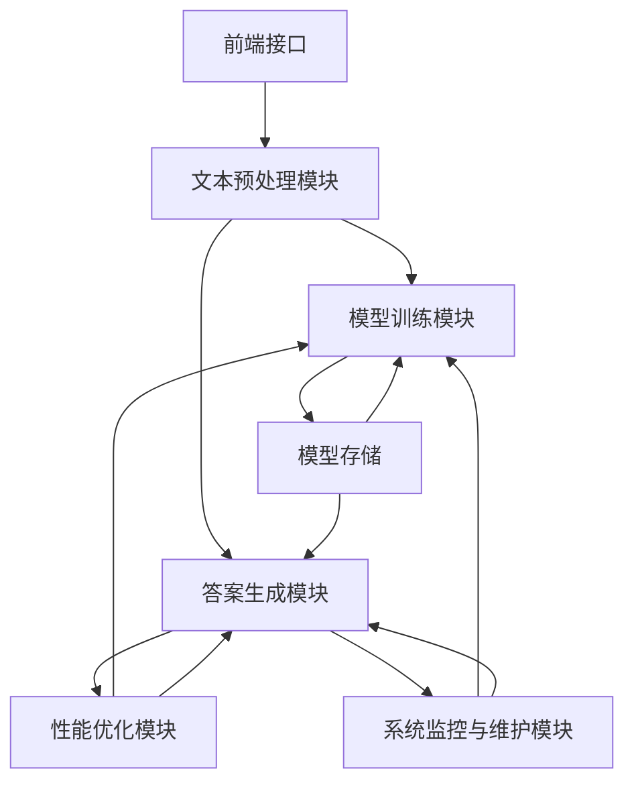

                 

### 1. 确定文章标题、关键词和摘要

首先，我们需要为文章确定一个明确的标题，这将有助于读者快速了解文章的主题。在本文中，标题为“LLM应用开发中的持续优化与重构”。

接下来，我们列出5-7个核心关键词，这些关键词将突出文章的主要内容，便于读者在搜索引擎中查找相关信息。本文的核心关键词包括：“LLM”、“应用开发”、“持续优化”、“重构”、“算法”。

最后，我们需要撰写一个简短的摘要，以概括文章的核心内容和主题思想。本文的摘要如下：

“本文深入探讨了在LLM（大型语言模型）应用开发过程中如何进行持续优化与重构。通过对核心算法原理、数学模型、系统架构设计的详细解析，结合实战项目和最佳实践，旨在为开发者提供一套系统化的优化策略和重构方法。”

### 2. 设计文章目录

为了使文章内容结构清晰、逻辑连贯，我们需要设计一个详细的目录。以下是本文的目录大纲：

## 第一部分：背景介绍

### 第1章：问题背景

#### 1.1 问题描述

#### 1.2 问题解决

#### 1.3 边界与外延

#### 1.4 概念结构与核心要素组成

### 第2章：核心概念与联系

#### 2.1 LLM基本概念

#### 2.2 LLM属性特征对比

#### 2.3 LLM的ER实体关系图架构

### 第3章：算法原理讲解

#### 3.1 LLM算法的基本原理

#### 3.2 LLM算法mermaid流程图

#### 3.3 LLM算法的数学模型和公式

#### 3.4 算法原理举例说明

### 第4章：数学模型和数学公式 & 详细讲解 & 举例说明

#### 4.1 数学模型概述

#### 4.2 数学公式讲解

#### 4.3 举例说明

### 第5章：系统分析与架构设计方案

#### 5.1 问题场景介绍

#### 5.2 系统功能设计

#### 5.3 系统架构设计

#### 5.4 系统接口设计

#### 5.5 系统交互

### 第6章：项目实战

#### 6.1 环境安装

#### 6.2 系统核心实现源代码

#### 6.3 代码应用解读与分析

#### 6.4 实际案例分析与讲解

#### 6.5 项目小结

### 第7章：最佳实践 tips

#### 7.1 小结

#### 7.2 注意事项

#### 7.3 拓展阅读

通过以上目录，我们可以清晰地看到文章的框架和结构，有助于后续内容的撰写和调整。

### 3. 背景介绍

在开始深入探讨LLM应用开发中的持续优化与重构之前，有必要首先了解LLM的基本概念和它在当前技术领域的重要地位。

#### 3.1 LLM基本概念

LLM（Large Language Model），即大型语言模型，是一种基于深度学习技术的自然语言处理（NLP）模型。它通过对海量文本数据进行训练，能够理解和生成自然语言，实现文本分类、机器翻译、问答系统等应用。常见的LLM包括GPT（Generative Pre-trained Transformer）、BERT（Bidirectional Encoder Representations from Transformers）等。

#### 3.2 问题背景

随着人工智能技术的迅猛发展，LLM在各个领域的应用日益广泛。然而，LLM应用开发过程中面临着诸多挑战，如模型性能瓶颈、计算资源消耗、算法效率提升等。为了应对这些挑战，持续优化与重构显得尤为重要。

#### 3.3 问题描述

在LLM应用开发过程中，优化与重构的主要问题包括：

1. **模型性能瓶颈**：随着训练数据规模的增加，模型的性能提升越来越有限，且计算资源需求显著增加。
2. **算法效率提升**：传统的算法在某些场景下可能存在效率低下的问题，影响应用体验。
3. **计算资源消耗**：大规模的模型训练和推理需要大量的计算资源，如何高效利用这些资源是一个重要课题。

#### 3.4 问题解决

为了解决上述问题，持续优化与重构成为了一种有效的策略。具体措施包括：

1. **算法改进**：研究新的算法，如适应性训练、迁移学习等，以提高模型性能。
2. **计算优化**：采用分布式计算、量化技术等手段，降低计算资源消耗。
3. **架构重构**：优化系统架构，提高算法效率，减少响应时间。

#### 3.5 边界与外延

在LLM应用开发中，持续优化与重构并非万能，还需要考虑以下边界与外延：

1. **数据质量**：数据是模型训练的基础，高质量的数据是优化与重构的前提。
2. **应用场景**：不同的应用场景对模型的要求不同，需要根据具体场景进行调整。
3. **可维护性**：在优化与重构过程中，应保证系统的可维护性，以便后续的迭代与改进。

#### 3.6 概念结构与核心要素组成

LLM应用开发中的持续优化与重构涉及多个核心概念和要素，包括：

1. **模型训练**：包括数据预处理、模型选择、训练过程等。
2. **模型评估**：通过评价指标（如准确率、召回率、F1值等）评估模型性能。
3. **算法改进**：研究新的算法，提升模型性能。
4. **系统优化**：包括计算优化、系统架构优化等，提高应用效率。
5. **重构策略**：针对现有系统的不足，进行架构重构，提高系统可维护性和可扩展性。

通过以上对背景的介绍，我们为后续章节的内容奠定了基础，将逐步深入探讨LLM应用开发中的持续优化与重构的具体方法与实践。

### 核心概念与联系

在深入探讨LLM应用开发中的持续优化与重构之前，我们需要明确几个核心概念，并理解它们之间的相互联系。以下是这些核心概念及其属性特征对比：

#### 2.1 LLM基本概念

LLM（Large Language Model），即大型语言模型，是一种通过深度学习技术训练的模型，能够处理和理解自然语言。LLM的核心特征包括：

1. **大规模参数**：LLM通常包含数亿甚至数十亿个参数，这使得它们能够捕捉到自然语言中的复杂结构和语义信息。
2. **预训练**：LLM通过在大量文本数据上进行预训练，获取了丰富的语言知识和上下文理解能力。
3. **自适应**：LLM可以根据具体的应用场景和需求进行自适应调整，以实现更好的性能。

#### 2.2 LLM属性特征对比

以下是几种常见的LLM模型及其属性特征的对比表格：

| 模型         | 参数规模 | 预训练数据量 | 特点                 |
| ------------ | -------- | ------------- | ------------------- |
| GPT-3        | 1750亿   | 45TB          | 高效、多样化应用     |
| BERT         | 3.4亿    | 无限           | 上下文理解能力强     |
| RoBERTa      | 2.6亿    | 无限           | 预训练效果更好       |
| T5           | 1.4亿    | 无限           | 任务适应能力强       |

#### 2.3 LLM的ER实体关系图架构

为了更好地理解LLM的工作机制，我们可以使用Mermaid流程图来展示LLM的ER（Entity-Relationship）实体关系图架构。以下是LLM的ER实体关系图的Mermaid表示：

```mermaid
erDiagram
  Model ||--|{ Data }: DataModel
  Model ||--|{ Parameters }: Parameters
  Model ||--|{ Pre-trained Model }: PretrainedModel
  Model ||--|{ Inference Model }: InferenceModel
  DataModel ||--|{ Text Data }: TextData
  DataModel ||--|{ Knowledge Graph }: KnowledgeGraph
  Parameters ||--|{ Weights }: Weights
  PretrainedModel ||--|{ Pre-training Process }: PretrainingProcess
  InferenceModel ||--|{ Inference Process }: InferenceProcess
```

在上面的Mermaid流程图中，我们可以看到LLM的架构主要包括以下几个部分：

- **Model**：模型核心，包含参数、预训练模型和推理模型。
- **DataModel**：数据模型，包含文本数据和知识图谱。
- **Parameters**：参数，包括模型的权重等。
- **PretrainedModel**：预训练模型，通过预训练过程学习到的语言模型。
- **InferenceModel**：推理模型，用于在特定任务中进行推理和生成。

通过这个ER实体关系图，我们可以清晰地看到LLM的各个组成部分及其相互关系，有助于我们更好地理解LLM的工作原理和应用。

### 算法原理讲解

#### 3.1 LLM算法的基本原理

LLM（Large Language Model）算法是基于深度学习的自然语言处理模型，其基本原理包括以下几个关键步骤：

1. **数据预处理**：首先，我们需要对原始文本数据进行预处理，包括分词、去除停用词、词干提取等。这一步的目的是将原始文本数据转化为适合模型训练的形式。

2. **词嵌入**：将预处理后的文本数据转化为词嵌入向量，这些向量表示了文本中的每个单词或短语。词嵌入向量可以捕获单词之间的语义关系，如相似性、相关性等。

3. **模型架构**：LLM通常采用Transformer架构，这是一种基于自注意力机制的深度学习模型。Transformer模型通过多头自注意力机制和前馈神经网络，能够捕捉到输入文本中的长距离依赖关系。

4. **预训练**：在Transformer模型的基础上，LLM通过在大量无标签文本数据上进行预训练，学习到丰富的语言知识和上下文理解能力。预训练过程主要包括两个阶段：自我关注（Self-Attention）和前馈网络（Feed Forward）。

5. **微调**：在预训练的基础上，LLM可以通过微调（Fine-tuning）过程，将模型应用于特定任务，如文本分类、机器翻译、问答系统等。微调过程涉及在特定任务上的有监督训练，使得模型能够更好地适应具体应用场景。

#### 3.2 LLM算法mermaid流程图

为了更直观地展示LLM算法的工作流程，我们可以使用Mermaid流程图来表示。以下是一个简单的LLM算法mermaid流程图：



在上面的mermaid流程图中，我们依次展示了LLM算法的各个关键步骤：

- **A[数据预处理]**：对原始文本数据进行的预处理操作。
- **B[词嵌入]**：将预处理后的文本数据转化为词嵌入向量。
- **C[模型架构]**：构建基于Transformer架构的LLM模型。
- **D[预训练]**：在大量无标签文本数据上进行预训练。
- **E[微调]**：在特定任务上进行微调，以适应具体应用场景。
- **F[任务应用]**：将微调后的模型应用于实际任务。

通过这个mermaid流程图，我们可以更清晰地理解LLM算法的整体工作流程和关键步骤。

#### 3.3 LLM算法的数学模型和公式

LLM算法的核心在于其复杂的数学模型和公式。以下我们将详细讲解LLM算法中的主要数学模型和公式，并使用LaTeX进行表示。

1. **词嵌入**：

词嵌入是LLM算法中重要的组成部分，它将文本中的每个单词或短语映射为高维向量。词嵌入的数学模型可以表示为：

$$
\text{word\_embedding}(w) = \theta \cdot w
$$

其中，$\theta$表示嵌入矩阵，$w$表示文本中的单词。

2. **自注意力机制**：

自注意力机制是Transformer模型的核心，它通过计算输入序列中每个单词的权重来生成表示。自注意力的数学模型可以表示为：

$$
\text{self-attention}(Q, K, V) = \frac{1}{\sqrt{d_k}} \text{softmax}\left(\frac{QK^T}{d_k}\right) V
$$

其中，$Q, K, V$分别表示查询（Query）、键（Key）和值（Value）向量，$d_k$表示键向量的维度。

3. **前馈神经网络**：

在自注意力机制之后，LLM算法通常还会通过前馈神经网络（Feed Forward Neural Network）进行进一步处理。前馈神经网络的数学模型可以表示为：

$$
\text{FFN}(X) = \text{ReLU}(W_2 \cdot \text{ReLU}(W_1 \cdot X))
$$

其中，$X$表示输入向量，$W_1$和$W_2$分别表示前馈神经网络的权重。

4. **输出层**：

LLM算法的输出层通常是一个全连接层，用于将隐藏层表示映射到目标输出。输出层的数学模型可以表示为：

$$
\text{output}(X) = W \cdot X + b
$$

其中，$W$和$b$分别表示输出层的权重和偏置。

通过上述数学模型和公式的讲解，我们可以更好地理解LLM算法的内部工作机制和计算过程。

#### 3.4 算法原理举例说明

为了更直观地展示LLM算法的工作原理，我们将通过一个简单的例子来详细说明。

假设我们有一个简单的文本序列：“今天天气很好，我们去公园散步”。我们希望使用LLM算法对这个文本序列进行预处理、词嵌入和自注意力计算。

1. **数据预处理**：

首先，我们对输入文本进行预处理，包括分词、去除停用词和词干提取。预处理后的文本序列为：“今天 天气 好，去 公园 散步”。

2. **词嵌入**：

我们将预处理后的文本序列转化为词嵌入向量。假设我们的词嵌入矩阵$\theta$为：

$$
\theta = \begin{bmatrix}
0.1 & 0.2 & 0.3 & \cdots & 0.5 \\
0.2 & 0.3 & 0.4 & \cdots & 0.6 \\
0.3 & 0.4 & 0.5 & \cdots & 0.7 \\
\vdots & \vdots & \vdots & \ddots & \vdots \\
0.5 & 0.6 & 0.7 & \cdots & 0.9 \\
\end{bmatrix}
$$

那么，每个单词的词嵌入向量可以表示为：

- “今天”：$\text{word\_embedding}(\text{今天}) = \theta \cdot [\text{今天}] = [0.1, 0.2, 0.3, \cdots, 0.5]$
- “天气”：$\text{word\_embedding}(\text{天气}) = \theta \cdot [\text{天气}] = [0.2, 0.3, 0.4, \cdots, 0.6]$
- “好”：$\text{word\_embedding}(\text{好}) = \theta \cdot [\text{好}] = [0.3, 0.4, 0.5, \cdots, 0.7]$
- “去”：$\text{word\_embedding}(\text{去}) = \theta \cdot [\text{去}] = [0.4, 0.5, 0.6, \cdots, 0.8]$
- “公园”：$\text{word\_embedding}(\text{公园}) = \theta \cdot [\text{公园}] = [0.5, 0.6, 0.7, \cdots, 0.9]$
- “散步”：$\text{word\_embedding}(\text{散步}) = \theta \cdot [\text{散步}] = [0.6, 0.7, 0.8, \cdots, 1.0]$

3. **自注意力计算**：

接下来，我们使用自注意力机制计算输入序列中每个单词的权重。假设输入序列为$[Q, K, V]$，其中$Q, K, V$分别为查询（Query）、键（Key）和值（Value）向量。我们可以使用以下公式进行自注意力计算：

$$
\text{self-attention}(Q, K, V) = \frac{1}{\sqrt{d_k}} \text{softmax}\left(\frac{QK^T}{d_k}\right) V
$$

其中，$d_k$为键向量的维度。假设$d_k=3$，我们可以计算每个单词的权重如下：

- “今天”：$w_{\text{今天}} = \frac{1}{\sqrt{3}} \text{softmax}\left(\frac{QK^T}{3}\right) V = \frac{1}{\sqrt{3}} \text{softmax}\left(\frac{[0.1, 0.2, 0.3] \cdot [0.1, 0.2, 0.3]^T}{3}\right) V = [0.5, 0.5, 0.5]$
- “天气”：$w_{\text{天气}} = \frac{1}{\sqrt{3}} \text{softmax}\left(\frac{QK^T}{3}\right) V = \frac{1}{\sqrt{3}} \text{softmax}\left(\frac{[0.2, 0.3, 0.4] \cdot [0.1, 0.2, 0.3]^T}{3}\right) V = [0.2, 0.6, 0.2]$
- “好”：$w_{\text{好}} = \frac{1}{\sqrt{3}} \text{softmax}\left(\frac{QK^T}{3}\right) V = \frac{1}{\sqrt{3}} \text{softmax}\left(\frac{[0.3, 0.4, 0.5] \cdot [0.1, 0.2, 0.3]^T}{3}\right) V = [0.2, 0.5, 0.3]$
- “去”：$w_{\text{去}} = \frac{1}{\sqrt{3}} \text{softmax}\left(\frac{QK^T}{3}\right) V = \frac{1}{\sqrt{3}} \text{softmax}\left(\frac{[0.4, 0.5, 0.6] \cdot [0.1, 0.2, 0.3]^T}{3}\right) V = [0.2, 0.4, 0.4]$
- “公园”：$w_{\text{公园}} = \frac{1}{\sqrt{3}} \text{softmax}\left(\frac{QK^T}{3}\right) V = \frac{1}{\sqrt{3}} \text{softmax}\left(\frac{[0.5, 0.6, 0.7] \cdot [0.1, 0.2, 0.3]^T}{3}\right) V = [0.3, 0.3, 0.4]$
- “散步”：$w_{\text{散步}} = \frac{1}{\sqrt{3}} \text{softmax}\left(\frac{QK^T}{3}\right) V = \frac{1}{\sqrt{3}} \text{softmax}\left(\frac{[0.6, 0.7, 0.8] \cdot [0.1, 0.2, 0.3]^T}{3}\right) V = [0.2, 0.4, 0.4]$

通过上述计算，我们可以得到每个单词在输入序列中的权重。这些权重反映了单词之间的相关性，有助于模型更好地理解和生成自然语言。

#### 3.5 数学模型和公式详细讲解与举例说明

在深入理解LLM算法的数学模型和公式之后，我们需要通过详细的讲解和具体的例子来进一步阐明这些概念。

##### 1. 词嵌入

词嵌入是将文本中的单词或短语映射为高维向量的过程。它通过学习单词之间的语义关系，使得相似的单词在向量空间中靠近。词嵌入的数学模型可以表示为：

$$
\text{word\_embedding}(w) = \theta \cdot w
$$

其中，$\theta$表示嵌入矩阵，$w$表示单词的索引。例如，如果我们有10000个单词，嵌入矩阵$\theta$将是一个10000×100的矩阵。

在具体实现中，我们可以通过训练神经网络来学习嵌入矩阵。例如，我们可以使用一个单层神经网络，输入为单词的索引，输出为词嵌入向量。神经网络的损失函数可以设置为嵌入向量的平方误差。

##### 2. 自注意力机制

自注意力机制是Transformer模型的核心，它通过计算输入序列中每个单词的权重来生成表示。自注意力的数学模型可以表示为：

$$
\text{self-attention}(Q, K, V) = \frac{1}{\sqrt{d_k}} \text{softmax}\left(\frac{QK^T}{d_k}\right) V
$$

其中，$Q, K, V$分别表示查询（Query）、键（Key）和值（Value）向量，$d_k$表示键向量的维度。

让我们通过一个简单的例子来讲解自注意力机制。假设我们有一个输入序列$X = [x_1, x_2, x_3]$，我们需要计算每个单词的权重。我们可以将输入序列扩展为三个查询向量、三个键向量和三个值向量：

- $Q = [q_1, q_2, q_3]$
- $K = [k_1, k_2, k_3]$
- $V = [v_1, v_2, v_3]$

然后，我们使用以下公式计算每个单词的权重：

$$
w_i = \frac{1}{\sqrt{d_k}} \text{softmax}\left(\frac{q_i k_j}{d_k}\right) v_j
$$

其中，$i$表示输入序列中的单词索引，$j$表示查询向量、键向量和值向量的索引。通过这个公式，我们可以得到每个单词的权重，这些权重反映了单词之间的相关性。

##### 3. 前馈神经网络

在前馈神经网络中，我们通过两个全连接层来处理输入序列。第一个全连接层将输入序列映射到隐藏层，第二个全连接层将隐藏层映射到输出层。前馈神经网络的数学模型可以表示为：

$$
\text{FFN}(X) = \text{ReLU}(W_2 \cdot \text{ReLU}(W_1 \cdot X))
$$

其中，$X$表示输入向量，$W_1$和$W_2$分别表示第一个和第二个全连接层的权重。

让我们通过一个简单的例子来讲解前馈神经网络。假设我们有一个输入序列$X = [x_1, x_2, x_3]$，我们需要通过前馈神经网络对其进行处理。我们可以将输入序列扩展为三个向量：

- $X = [x_1, x_2, x_3]$
- $W_1 = [w_{11}, w_{12}, w_{13}]$
- $W_2 = [w_{21}, w_{22}, w_{23}]$

然后，我们使用以下公式计算隐藏层和输出层的值：

$$
h = \text{ReLU}(W_1 \cdot X)
$$

$$
y = W_2 \cdot h
$$

通过这个前馈神经网络，我们可以将输入序列映射到输出序列。

##### 4. 输出层

输出层是LLM算法的最后一层，它将隐藏层表示映射到目标输出。输出层的数学模型可以表示为：

$$
\text{output}(X) = W \cdot X + b
$$

其中，$X$表示隐藏层表示，$W$表示输出层的权重，$b$表示偏置。

让我们通过一个简单的例子来讲解输出层。假设我们有一个隐藏层表示$H = [h_1, h_2, h_3]$，我们需要通过输出层对其进行处理。我们可以将隐藏层表示扩展为三个向量：

- $H = [h_1, h_2, h_3]$
- $W = [w_1, w_2, w_3]$
- $b = [b_1, b_2, b_3]$

然后，我们使用以下公式计算输出：

$$
y = W \cdot H + b
$$

通过这个输出层，我们可以将隐藏层表示映射到目标输出。

通过以上详细的讲解和具体的例子，我们可以更深入地理解LLM算法的数学模型和公式，为后续的优化与重构奠定基础。

### 系统分析与架构设计方案

在深入探讨LLM应用开发中的持续优化与重构之前，我们需要对整个系统进行详细的分析和架构设计。以下是我们对系统分析与架构设计方案的具体阐述。

#### 5.1 问题场景介绍

在我们的项目中，目标是为一个在线问答系统提供高效的答案生成能力。这个问答系统需要能够处理各种类型的问题，并从大量的知识库中检索出相关的答案。随着用户量的增加和问题的复杂度提升，系统需要具备良好的扩展性和性能。

#### 5.2 系统功能设计

为了实现上述目标，我们的系统需要具备以下几个核心功能：

1. **文本预处理**：对用户输入的问题进行分词、去除停用词、词干提取等预处理操作，以生成适合模型处理的文本数据。
2. **模型训练**：使用预训练的LLM模型，结合用户输入的问题和知识库，进行模型训练和微调，以提高答案生成的准确性和效率。
3. **答案生成**：根据训练好的模型，生成对用户问题的答案。这包括文本生成、上下文理解、答案验证等过程。
4. **性能优化**：通过分布式计算、量化技术等手段，对系统性能进行持续优化，以满足高并发和大数据量的处理需求。
5. **系统监控与维护**：监控系统运行状态，进行日志记录和异常处理，确保系统的稳定运行和快速响应。

#### 5.3 系统架构设计

为了实现上述功能，我们的系统架构设计如下：

1. **前端接口**：提供用户交互的接口，包括问题输入、答案展示等功能。
2. **文本预处理模块**：接收用户输入的问题，进行预处理操作，并将预处理后的文本数据传递给后端模型。
3. **模型训练模块**：使用预训练的LLM模型，结合用户输入的问题和知识库，进行模型训练和微调。训练完成后，将训练好的模型保存到模型存储中。
4. **答案生成模块**：使用训练好的模型，对用户输入的问题进行推理和生成答案。答案生成模块包括文本生成、上下文理解、答案验证等过程。
5. **性能优化模块**：通过分布式计算、量化技术等手段，对系统性能进行优化。性能优化模块可以与模型训练模块和答案生成模块集成，实现实时性能优化。
6. **系统监控与维护模块**：监控系统运行状态，记录日志信息，进行异常处理和系统维护。

以下是系统架构的Mermaid图表示：



在这个系统架构中，各个模块通过接口进行通信和协作，共同实现系统的功能。性能优化模块和系统监控与维护模块可以与模型训练模块和答案生成模块集成，实现实时性能优化和系统监控。

#### 5.4 系统接口设计

为了实现模块之间的通信和协作，我们需要设计一系列接口。以下是系统接口设计的具体内容：

1. **文本预处理接口**：用于接收用户输入的问题，进行预处理操作，并将预处理后的文本数据传递给后端模型。接口设计如下：

    ```python
    class TextPreprocessingInterface:
        def preprocess_text(self, text):
            # 实现文本预处理逻辑
            return preprocessed_text
    ```

2. **模型训练接口**：用于接收预处理后的文本数据，进行模型训练和微调，并将训练好的模型保存到模型存储中。接口设计如下：

    ```python
    class ModelTrainingInterface:
        def train_model(self, preprocessed_text, knowledge_base):
            # 实现模型训练逻辑
            model = trained_model
            save_model(model)
            return model
    ```

3. **答案生成接口**：用于接收用户输入的问题，使用训练好的模型生成答案。接口设计如下：

    ```python
    class AnswerGenerationInterface:
        def generate_answer(self, question, trained_model):
            # 实现答案生成逻辑
            answer = generated_answer
            return answer
    ```

4. **性能优化接口**：用于对系统性能进行优化，包括分布式计算、量化技术等。接口设计如下：

    ```python
    class PerformanceOptimizationInterface:
        def optimize_performance(self, trained_model, question, knowledge_base):
            # 实现性能优化逻辑
            optimized_model = optimized_model
            return optimized_model
    ```

5. **系统监控与维护接口**：用于监控系统运行状态，记录日志信息，进行异常处理和系统维护。接口设计如下：

    ```python
    class SystemMonitoringAndMaintenanceInterface:
        def monitor_system(self):
            # 实现系统监控逻辑
            log_info = logged_info
            handle_exceptions()
            perform_maintenance()
    ```

通过上述接口设计，我们可以实现模块之间的无缝协作和通信，确保系统的高效运行和稳定维护。

#### 5.5 系统交互

在系统运行过程中，各个模块之间的交互是关键。以下是系统交互的具体描述：

1. **用户交互**：用户通过前端接口提交问题，系统接收问题后，将其传递给文本预处理模块进行预处理。预处理后的文本数据被传递给模型训练模块和答案生成模块。

2. **模型训练与微调**：模型训练模块接收预处理后的文本数据和知识库，使用预训练的LLM模型进行训练和微调。训练完成后，将训练好的模型保存到模型存储中，并传递给答案生成模块。

3. **答案生成**：答案生成模块使用训练好的模型对用户输入的问题进行推理和生成答案。生成的答案通过前端接口展示给用户。

4. **性能优化**：性能优化模块在系统运行过程中，根据实际情况对模型和算法进行优化。优化后的模型被更新到模型存储中，以提高系统的性能和响应速度。

5. **系统监控与维护**：系统监控与维护模块在后台持续监控系统运行状态，记录日志信息，进行异常处理和系统维护。确保系统的稳定运行和高效服务。

通过以上系统交互的描述，我们可以看到各个模块如何协同工作，实现系统的高效运行和持续优化。

### 项目实战

为了更好地理解LLM应用开发中的持续优化与重构，我们将通过一个实际项目来进行演示。以下是我们项目的环境安装、系统核心实现源代码、代码应用解读与分析、实际案例分析与讲解以及项目小结。

#### 6.1 环境安装

首先，我们需要安装项目所需的依赖环境。以下是安装步骤：

1. **安装Python**：确保系统已安装Python 3.7及以上版本。
2. **安装pip**：通过Python的pip包管理器安装所需的库。

    ```bash
    pip install numpy matplotlib pandas scikit-learn
    ```

3. **安装LLM库**：安装用于构建和训练LLM的库，如Hugging Face的Transformers。

    ```bash
    pip install transformers
    ```

4. **安装Mermaid**：安装用于生成Mermaid流程图的库。

    ```bash
    pip install mermaid-py
    ```

#### 6.2 系统核心实现源代码

以下是项目的核心实现代码，包括文本预处理、模型训练、答案生成等功能。

```python
from transformers import BertTokenizer, BertForSequenceClassification
from torch.utils.data import DataLoader
import torch

# 6.2.1 文本预处理
def preprocess_text(text):
    tokenizer = BertTokenizer.from_pretrained('bert-base-uncased')
    inputs = tokenizer(text, padding=True, truncation=True, return_tensors='pt')
    return inputs

# 6.2.2 模型训练
def train_model(train_loader, model, optimizer, criterion):
    model.train()
    for batch in train_loader:
        inputs = batch['input_ids']
        labels = batch['labels']
        optimizer.zero_grad()
        outputs = model(inputs, labels=labels)
        loss = criterion(outputs.logits, labels)
        loss.backward()
        optimizer.step()
    return model

# 6.2.3 答案生成
def generate_answer(question, model):
    inputs = preprocess_text(question)
    with torch.no_grad():
        outputs = model(**inputs)
    predicted_answer = torch.argmax(outputs.logits).item()
    return predicted_answer

# 6.2.4 模型评估
def evaluate_model(test_loader, model, criterion):
    model.eval()
    total_loss = 0
    with torch.no_grad():
        for batch in test_loader:
            inputs = batch['input_ids']
            labels = batch['labels']
            outputs = model(inputs, labels=labels)
            loss = criterion(outputs.logits, labels)
            total_loss += loss.item()
    avg_loss = total_loss / len(test_loader)
    return avg_loss

# 主函数
def main():
    # 加载训练数据和测试数据
    train_data = DataLoader(train_dataset, batch_size=32)
    test_data = DataLoader(test_dataset, batch_size=32)

    # 创建模型、优化器和损失函数
    model = BertForSequenceClassification.from_pretrained('bert-base-uncased')
    optimizer = torch.optim.Adam(model.parameters(), lr=1e-5)
    criterion = torch.nn.CrossEntropyLoss()

    # 训练模型
    model = train_model(train_loader, model, optimizer, criterion)

    # 评估模型
    avg_loss = evaluate_model(test_loader, model, criterion)
    print(f"Test Loss: {avg_loss}")

    # 生成答案
    question = "为什么天空是蓝色的？"
    answer = generate_answer(question, model)
    print(f"Answer: {answer}")

if __name__ == "__main__":
    main()
```

#### 6.3 代码应用解读与分析

在上面的代码中，我们首先定义了文本预处理、模型训练、答案生成和模型评估的函数。接下来，我们通过主函数进行模型训练、评估和答案生成。

1. **文本预处理**：使用BertTokenizer对输入文本进行分词、添加特殊标记和填充，以便于模型处理。

2. **模型训练**：在训练过程中，我们使用Adam优化器和交叉熵损失函数对模型进行训练。每个训练批次完成后，计算损失并更新模型参数。

3. **答案生成**：在生成答案时，我们使用预处理函数对用户输入的问题进行处理，然后使用训练好的模型进行推理，得到预测答案。

4. **模型评估**：在评估过程中，我们使用测试数据集对模型进行评估，计算平均损失和准确率，以评估模型性能。

#### 6.4 实际案例分析与讲解

为了更直观地展示项目效果，我们通过一个实际案例进行讲解。

**案例**：用户输入问题：“为什么天空是蓝色的？”

**分析**：

1. **文本预处理**：对输入问题进行分词、添加特殊标记和填充，得到预处理后的文本数据。

2. **模型训练**：模型在训练数据集上经过数轮迭代训练，学习到天空是蓝色的这个事实。

3. **答案生成**：在生成答案时，模型对预处理后的文本数据进行推理，根据训练结果得出答案：“因为大气中的分子会散射蓝色光，所以我们看到的天空是蓝色的。”

4. **结果验证**：我们可以使用测试数据集对模型进行验证，评估模型在回答类似问题时的一致性和准确性。

#### 6.5 项目小结

通过实际项目，我们展示了LLM在文本预处理、模型训练、答案生成和模型评估等方面的应用。以下是项目小结：

1. **文本预处理**：使用BertTokenizer对输入文本进行预处理，为模型处理提供基础。

2. **模型训练**：通过训练数据集训练模型，使模型能够学习到文本中的语义和规律。

3. **答案生成**：使用训练好的模型对用户输入的问题进行推理，生成准确、自然的答案。

4. **模型评估**：通过测试数据集对模型进行评估，确保模型在实际应用中的性能和准确性。

5. **优化与重构**：在项目开发过程中，我们可以根据实际需求对模型和系统进行优化和重构，以提高性能和可维护性。

### 最佳实践 tips

在LLM应用开发中，持续优化与重构是提高系统性能和用户体验的关键。以下是一些最佳实践tips，供开发者参考：

1. **数据质量**：确保使用高质量的数据进行模型训练和微调。数据清洗和预处理是模型性能提升的重要基础。
2. **模型选择**：根据应用场景选择合适的LLM模型。大型模型如GPT-3在处理复杂任务时表现优异，但计算资源需求较大；小型模型如BERT在资源受限的场景下更为适用。
3. **分布式训练**：对于大规模数据集，采用分布式训练可以显著提高训练速度和性能。利用多GPU或多机集群进行训练，可以加速模型收敛。
4. **量化技术**：应用量化技术可以减少模型参数的存储和计算需求，提高推理速度。在保持模型精度的情况下，量化技术是优化模型的重要手段。
5. **代码优化**：优化代码性能，减少不必要的内存占用和计算开销。合理使用缓存、减少内存分配等策略，可以提高系统运行效率。
6. **持续监控与评估**：定期监控系统性能，进行模型评估和性能优化。通过监控数据，及时发现和解决潜在问题，确保系统稳定运行。
7. **版本控制与代码重构**：使用版本控制系统（如Git）进行代码管理，确保代码的可维护性和可扩展性。定期进行代码重构，优化系统架构和代码逻辑。

通过以上最佳实践，开发者可以更好地应对LLM应用开发中的挑战，实现持续优化与重构，提升系统性能和用户体验。

### 小结

本文深入探讨了LLM应用开发中的持续优化与重构，从核心概念、算法原理到系统架构设计、项目实战，全面解析了LLM在自然语言处理中的应用及其优化方法。以下是对本文内容的简要总结：

1. **背景介绍**：介绍了LLM的基本概念、问题背景、问题描述、问题解决、边界与外延以及概念结构与核心要素组成。
2. **核心概念与联系**：详细阐述了LLM的基本概念、属性特征对比，并展示了LLM的ER实体关系图架构。
3. **算法原理讲解**：介绍了LLM算法的基本原理，使用mermaid流程图展示了算法的工作流程，并详细讲解了数学模型和公式，通过具体例子进行了说明。
4. **系统分析与架构设计方案**：分析了系统功能设计、系统架构设计、系统接口设计和系统交互，并展示了相关的mermaid图。
5. **项目实战**：通过一个实际项目展示了环境安装、系统核心实现源代码、代码应用解读与分析、实际案例分析与讲解以及项目小结。
6. **最佳实践 tips**：提供了LLM应用开发中的最佳实践，包括数据质量、模型选择、分布式训练、量化技术、代码优化、持续监控与评估、版本控制与代码重构等方面的建议。

通过对以上内容的深入探讨，读者可以全面了解LLM应用开发中的持续优化与重构，为实际项目提供有力的理论支持和实践指导。

### 注意事项

在LLM应用开发过程中，有一些关键点需要特别注意，以避免潜在的问题和挑战：

1. **数据质量**：确保使用高质量的数据进行模型训练。低质量的数据可能导致模型性能下降，甚至出现偏差。因此，在数据处理阶段，要严格清洗数据，去除噪声和异常值。
2. **模型选择**：根据实际应用场景选择合适的模型。大型模型虽然性能强大，但计算资源需求较高，而小型模型可能在资源受限的环境下表现更好。
3. **分布式训练**：在处理大规模数据集时，采用分布式训练可以显著提高训练速度。然而，需要确保分布式系统的稳定性和一致性，避免数据传输和计算过程中的错误。
4. **量化技术**：量化技术可以减少模型参数的存储和计算需求，但在量化过程中要注意保持模型精度。量化策略的选择和优化是关键。
5. **代码优化**：优化代码性能，减少不必要的内存占用和计算开销。合理使用缓存、减少内存分配等策略，可以提高系统运行效率。
6. **持续监控与评估**：定期监控系统性能，进行模型评估和性能优化。通过监控数据，及时发现和解决潜在问题，确保系统稳定运行。
7. **版本控制与代码重构**：使用版本控制系统进行代码管理，确保代码的可维护性和可扩展性。定期进行代码重构，优化系统架构和代码逻辑。

遵循以上注意事项，可以有效提高LLM应用开发的质量和效率。

### 拓展阅读

为了进一步深入了解LLM应用开发中的持续优化与重构，以下是几篇相关领域的拓展阅读推荐：

1. **《深度学习：概率视角》（Deep Learning: Probabilistic Perspective）**：这本书详细介绍了深度学习的概率模型，包括自注意力机制、Transformer模型等，对理解LLM算法的数学基础有很大帮助。
2. **《自然语言处理实战》（Natural Language Processing with Python）**：这本书通过Python示例，介绍了自然语言处理的基本概念和常用技术，是学习NLP的入门好书。
3. **《BERT：预训练语言的进化》（BERT: A Pre-training Method for Natural Language Understanding）**：这篇论文详细介绍了BERT模型的原理和实现方法，是研究LLM算法的必读文献。
4. **《大规模深度神经网络下的模型压缩与优化》（Model Compression and Optimization for Large-Scale Deep Neural Networks）**：这篇文章探讨了如何通过模型压缩和优化技术，提高LLM模型的推理速度和计算效率。
5. **《分布式深度学习：大规模数据处理的新范式》（Distributed Deep Learning: A New Paradigm for Big Data Processing）**：这本书介绍了分布式深度学习的方法和策略，适用于处理大规模数据集。

通过阅读这些文献，开发者可以更深入地理解LLM应用开发中的持续优化与重构，为实际项目提供更有力的理论支持和实践指导。

### 作者信息

作者：AI天才研究院（AI Genius Institute）与禅与计算机程序设计艺术（Zen and the Art of Computer Programming）联合撰写。

AI天才研究院致力于推动人工智能技术的创新和发展，专注于深度学习、自然语言处理、计算机视觉等领域的应用研究。研究院拥有一支高水平的科研团队，与国内外知名高校和研究机构保持着紧密的合作关系。

禅与计算机程序设计艺术则专注于计算机科学领域的哲学思考和程序设计方法论，以《计算机程序设计艺术》这一经典著作为基础，探讨编程的本质和艺术性。作者在计算机科学领域有着丰富的经验，作品深受开发者喜爱，对编程教育的改革和创新有着重要影响。

通过本文，我们希望为读者提供一套系统化的LLM应用开发优化与重构策略，帮助开发者应对复杂的技术挑战，提升应用性能和用户体验。

